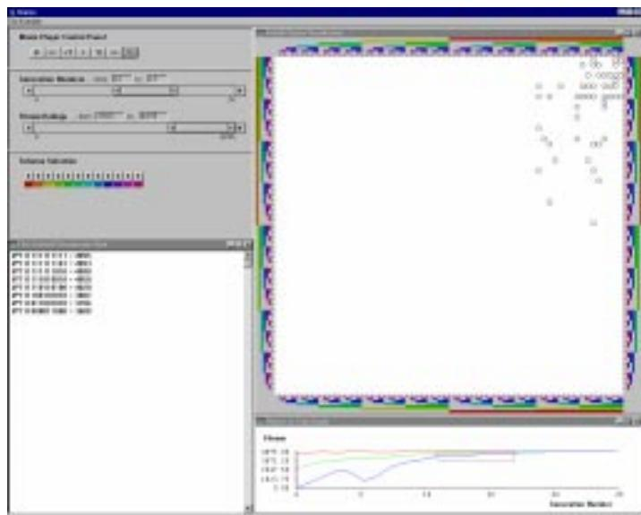
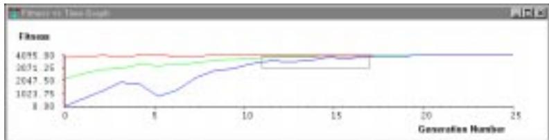
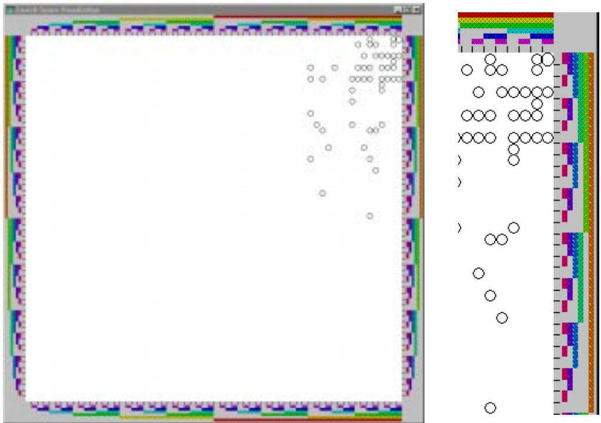
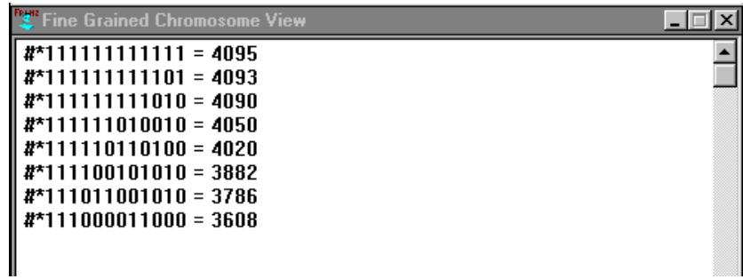
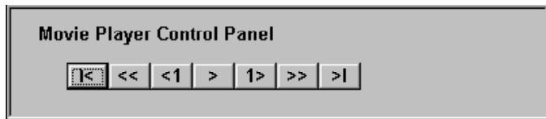
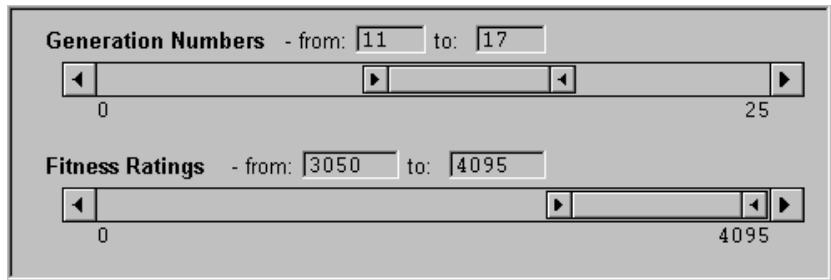
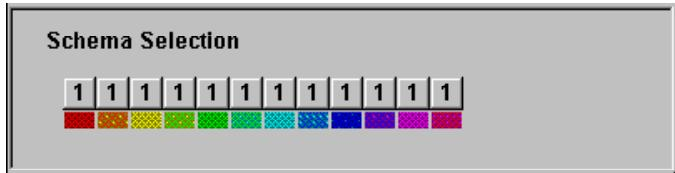
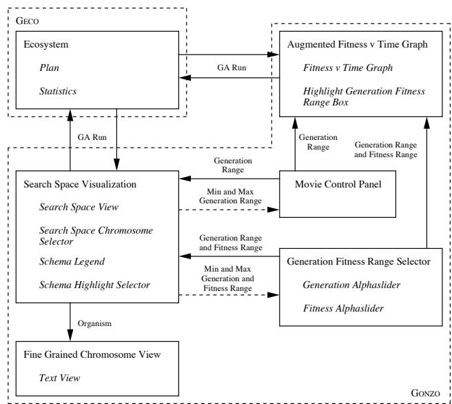

# Chapter 7

# Gonzo: A Search Space

# Visualization Tool

This chapter presents \Gonzo" a GA visualization tool designed to support peoples understanding of their GA's search behaviour. The design of Gonzo is described in Section 7.1. The design features, intended to fulll the visualization requirements established in the user study (Section 3.3), are discussed in Subsection 7.1.1. The design specication of Gonzo, using the Henson framework introduced in the previous chapter, is presented in Subsection 7.1.2. Section 7.2 describes the resulting implementation of Gonzo, and Section 7.3 explains how Gonzo can be applied to produce oine and online visualizations. Section 7.4 describes a series of example problems and illustrates how Gonzo can be used to explore a GA's search behaviour. Section 7.5 describes a menu based graphical user interface which can be used as a front end to Gonzo. Section 7.6 explains how Gonzo can be used in practice - the use of a \GA Examples" menu to illustrate the example problems using the default visualizations is described along with the introduction of new visualizations and new GAs. Section 7.7 concludes this chapter with a summary of the visualization attributes of Gonzo.

# 7.1 Design

This section presents the design features and specication of Gonzo. Gonzo is designed to fulll the set of users' questions concluded from the GA user study (Section 3.3), specically:

 How diverse/converged are the chromosomes in the population?

 Are there clusters of chromosomes forming during the GA's run?

 How does the local structure of the chromosomes aect the chromosomes' tness ratings?

As pointed out in the design rationale chapter, search space visualizations can be used to show the population's sampling of the search space. In doing so the diversity, convergence, and the formation of clusters in the population can be observed. Furthermore, by using a structurally based representation, such as the extensive repartitions technique described in Section 5.3.3, the local structure of the chromosomes can be derived from their location in the search space representation and the relationship between the chromosomes' tness ratings and local structure can be explored.

In terms of an SV taxonomy [Price et al., 1993], SVs can be designed to support the user's understanding of either the program or algorithm. Program visualizations support the user's understanding of the program's code and data values, where as algorithm visualizations support the user's understanding of the algorithm's instructions and generic data structures. Visualizing the algorithm's instructions, such as \select chromosomes for reproduction," \crossover two parents to form two children," or \mutate chromosome," presents the actions involved in running a GA. Although this is at a high level of abstraction in terms of the program, it is at a ne-grained level in terms of the algorithm's behaviour.

As indicated by the questionnaire responses (see Section B.3, Question 8) this may be useful as an educational or debugging aid but should be used selectively as it presents so much ne-grained detail of the GAs execution. Gonzo is an algorithm visualization system primarily concerned with illustrating the algorithm's \high level" data structures. Visualizing the work of the algorithm presents the user with a more direct view of the GA's search behaviour than visualizations of the code or the \low-level" data values.

By applying the search space matrix technique described in Section 5.3.3 Gonzo displays a search space visualization of the GA's population data (i.e. the chromosomes and tness ratings). In order to show the GA's evolutionary search behaviour, the user must have some way of identifying the temporal context of the search space visualization. This is achieved through the use of an augmented tness versus time graph which displays a coarse-grained view of the GA's history and highlights the region currently illustrated in the search space visualization. In addition to seeing each chromosome as a unique point in the search space visualization, the individual points can also be selected and the corresponding chromosome value and its tness rating can be displayed in a ne-grained chromosome view.

These three visualizations provide three coupled views of the GA's population. The complete GA run is shown in the tness versus time graph, the individual chromosomes in the generation range and tness rating range (highlighted by a grey rectangle in the tness versus time graph) are shown as points in the search space visualization, which can be selected by the user and the corresponding chromosome details (including the chromosome value and tness rating) will be displayed in the ne-grained chromosome view.

With reference to the conclusions of the GA user study (Section 3.3), Gonzo is an interactive tool that aims to support the user's interpretation of the algorithm's behaviour (supportive). The user can navigate backwards and forwards through each generation of the algorithm's execution and pause, edit and restart the algorithm (interactive). Gonzo can be applied directly with its current functionality or extended, through the application of the Henson framework, to provide additional visualization support (usable and expressive).

# 7.1.1 Interface Design

This subsection describes the individual views and navigators available in Gonzo. Figure 7.1 shows an example screen image taken from Gonzo containing a coarse-grained tness versus time graph (bottom right), a medium-grained search space visualization (top right), a ne-grained chromosome view (bottom left), a movie player control panel (top left), a generation and tness range selector (second left), and a schema highlight selector (third left). The design features of each component are described in the remainder of this subsection.

# Augmented Fitness versus Time Graph

The \augmented tness versus time graph" shows the results of the GA's run. The values of the best, worst and averaged tness ratings from each generation are plotted on a three line graph (see Figure 7.2). In Gonzo an additional rectangle is plotted on top of the tness versus time graph, the

Figure 7.1: An example screen image taken from Gonzo. This example includes three views; a coarse-grained tness versus time graph (bottom right), a medium-grained search space visualization (top right) and a negrained chromosome view (bottom left), and three navigators; a movie control panel (top left), generation and tness range selector (second left), and a schema highlight selector (third left). The search space visualization currently illustrates all the chromosomes considered by the GA between generations 11 and 17 with tness ratings between 3050 and 4095. The GA is attempting to solve the 12 bit maximum integer problem. This problem seeks out binary chromosomes with high integer values.

width and height of the rectangle indicate the range of generations and tness ratings currently being displayed in the search space visualization.

# Search Space Visualization

The \search space visualization" shows the GA's chromosomes as a set of points in a 2D representation of the GA's search space (see Figure 7.3). This visualization contains two parts; the \search space view" and the \schema legend." The search space view shown in the centre of the search space visualization translates each chromosome to a coordinate and displays it as a point image. Dierent image mappings can be used to identify each chromosome's tness and/or frequency in the population. The schema legend shown around the outside edge of the search space visualization is used to identify regions of the search space view. The \Schema Highlighting Dialog" (see below) can be used to identify schemata of interest to the user. The regions of the search space view that contain elements of the

Figure 7.2: An example of the tness versus time graph available in Gonzo. The top red line trace indicates the best tness rating in each population, the bottom blue line trace indicates the worst tness rating in each population, and the middle green line trace indicates the average value of all the chromosomes' tness ratings. A superimposed grey rectangle indicates the region of the GA's run that is currently being displayed in the search space visualization (i.e. the chromosomes considered between generation 11 and generation 17 with tness ratings between 3050 and 4095).

user dened schema will then be highlighted in the schema legend. The example given in Figure 7.3 highlights the regions of the search space with allele \1" at every locus, each coloured ribbon in the schema legend indicates a dierent locus (see Figure 7.7 for the associated schema highlighting dialog).

Three dierent image mappings are supported in Gonzo's search space view: size, value and colour. Both size and value are dissociative image variables that bias the user's attention toward the larger or more contrasting (i.e. darker) chromosome images. This can be useful to draw the user's attention toward the tter or more common chromosomes in the population. Size and value also support the user's perception of order. Although size supports the perception of quantities, within a 2D representation the amount of screen space available for each chromosome limits the range of quantities that can be displayed. Although colour does not support a natural ordering it does support the formation of associations and selections, the user can perceive dierently coloured items and group them together to form families. This can be useful in terms of identifying sections of the GA's tness surface. For example, if the colour spectrum blue through to red is used to show tness ratings from low to high, the user can easily identify the regions of the search space that have a low tness (blue), average tness (green) and high tness (red). According to [Bertin, 1983] up to seven dierent colours can be used to support visual selection (see Section 5.2).

The user's choice of image mapping should be guided by their visualization requirements; identifying convergence and clustering requires the user to note the regions of the search space with good

Figure 7.3: An example of a search space visualization. The search space visualization is shown here on the left with an enlarged section of its schema legend shown on the right, the string highlighted here is 111111111111. Each chromosome is indicated as a point, at each point a circle is drawn, where the size of the circle indicates the chromosome's tness. The circles range from small circles for low tness values to large circles for a high tness values.

tness ratings, and dissociative image variables such as size and value are useful for this. Identifying the relationship between the chromosomes' local structure and tness however, requires the user to draw associations between the chromosomes' local structure in dierent regions of the search space and their tness ratings (low or high), colour is the most eective image mapping for achieving this requirement.

# Fine-Grained Chromosome View

The \ne-grained chromosome view" presents the values of selected chromosomes and their tness ratings (see Figure 7.4). This view is coupled to the search space visualization and supports the user's further investigation of the chromosomes in the search space.

When this view is displayed the user can select chromosomes by clicking in the search space view. Providing the resolution of the matrix is less than or equal to the resolution of the screen display area, the coordinate of the cursor when the mouse button is released is translated back into a chromosome genotype which is displayed in the ne-grained chromosome view along with the chromosome's tness rating.

  
Figure 7.4: An example of a ne-grained chromosome view displaying the chromosome value and tness rating of eight selected chromosomes.

  
Figure 7.5: The movie player control panel used in Gonzo to navigate the GA's execution.

If the resolution of the search space matrix is greater than the resolution of the screen display area then as much of the chromosome as possible is identied and displayed in the ne-grained chromosome view. Any alleles in the chromosome which cannot be uniquely identied are given the rst value in the coding alphabet.

# Movie Player Control Panel

The \movie player control panel" enables the user to navigate through the GA's execution a generation at a time. The user can either go back to the start of the run $( { } ^ { 6 6 } | < { } ^ { 9 3 } )$ , step back a number of generations (a default of ten, \ $\cdot < < "$ ), step back one generation $( ^ { 6 } < 1 ^ { , 9 } )$ ), play or pause the run like a movie (\>" or \jj"), step forward one generation ${ \bf \Phi } ^ { ( 6 } 1 > " )$ ), step forward a number of generations (\>>"), or go forward to the last generation $\left( \ { } ^ { 6 6 } > \ { } ^ { | 9 } \right)$ .

  
Figure 7.6: The alphaslider range selector used in Gonzo to dene a range of generations and tness ratings to be displayed in the search space view.

# Generation and Fitness Range Selector

As well as navigating the GA's execution via the movie player control player, the user can also select a range of generations, or a range of tness ratings, to be displayed using the \generation and tness range selector." This navigator includes two alphasliders for dening the range of generation numbers and tness ratings to be displayed in the search space view and highlighted in the augmented tness versus time graph.

These alphasliders can be manipulated in seven ways, the exterior arrow buttons step the current range either one position to the left or one position to the right, pressing the mouse button in the region between the central range bar and exterior buttons steps the range to the left or right by ten percent of the total range, dragging either the left or right arrow buttons on the central range bar changes the dened range, and dragging the middle section of the central range bar moves the dened range. As well as directly manipulating the alphaslider the user can manually edit the text elds in the \from" and \to" text boxes shown directly above each alphaslider.

In addition to updating the search space visualization to show the chromosomes contained in the dened range, the tness versus time graph is updated to illustrate the dened range as a rectangular bounding box. The bounding rectangle in the tness versus time graph links the tness graph with the search space visualization, the movie player control panel, and the generation and tness range selector.

Figure 7.7: The schema highlighting dialog used in Gonzo. The location of the chromosomes containing the schema identied by the button labels are highlighted using the colour coded ribbons in the legend of the search space matrix. Clicking on each button makes the label change to the next allele in the GA's coding alphabet.

# Schema Highlighting Dialog

The \schema highlighting dialog" enables the user to highlight sections of the search space view that contain specic alleles. The regions of the schema legend that can be highlighted are constrained to those regions of the search space view that can be eectively displayed within the screen resolution available. The button labels on the schema highlighting dialog dene the allele to be highlighted in the search space visualization. Pressing each button makes the label change to the next symbol in the coding alphabet until the last value then a wild card symbol (\\*") is shown to indicate that no alleles are being highlighted for that locus and the sequence starts again. Hence, the schema highlight selector used for binary representations displays the sequence \*, 0, 1, \*, 0, . . . etc.

# 7.1.2 Henson Specication

This subsection presents the design specication of Gonzo, as described in the previous subsection, using the Henson framework presented in Chapter 6. Table 7.1 denes the \players" and \events," Table 7.2 denes the \views," Table 7.3 denes the \mappings" and Table 7.4 denes the \navigators."

# Players and Events

The main player in Gonzo, i.e. the main item of interest, is the GA's population statistics and how they change during the GA's run (see Table 7.1). The population-statistics component of Gonzo has four slots of interest to the views used here; the min-score, the max-score, the avg-score and the population. The minimum, maximum and average scores (i.e. tness ratings) are used to produce the tness versus time graph and the population data, including all the organisms' chromosome values and tness ratings, are used to produce the search space visualization.

Table 7.1: The Henson denition of the players used and events recorded in Gonzo.   

<table><tr><td>MODULE</td><td>NAME</td><td>SLOTS</td><td>DESCRIPTION</td></tr><tr><td>Players</td><td>population-statistics</td><td>population sum-score</td><td rowspan="3">The main (default) player used in Gonzo to record statistics regarding each</td></tr><tr><td></td><td>avg-score</td><td></td></tr><tr><td rowspan="8"></td><td></td><td>max-score</td><td rowspan="3">population.</td></tr><tr><td></td><td>min-score</td></tr><tr><td>max-organism</td><td></td></tr><tr><td></td><td>min-organism</td></tr><tr><td>sum-normalized-score</td><td></td></tr><tr><td></td><td>avg-normalized-score</td></tr><tr><td>population avg-score</td><td>The GA&#x27;s population.</td></tr><tr><td></td><td>The average fitness rating in a population.</td></tr><tr><td rowspan="3"></td><td>max-score</td><td></td><td>The maximum fitness rating</td></tr><tr><td>min-score</td><td></td><td>in a population. The minimum fitness rating</td></tr><tr><td>evaluate (population)</td><td></td><td>in a population. After each population evalu-</td></tr><tr><td>Event</td><td></td><td></td><td>ation record the GA&#x27;s popu- lation statistics.</td></tr></table>

Table 7.2: The Henson denition of the views available in Gonzo.   

<table><tr><td rowspan=1 colspan=1>NAME</td><td rowspan=1 colspan=1>SUPERIORS</td><td rowspan=1 colspan=1>SLOTS</td></tr><tr><td rowspan=1 colspan=1>augmented-fitness-v-time-graph</td><td rowspan=1 colspan=1>2D-fitness-v-time-graph</td><td rowspan=1 colspan=1>(elements-of-plot(min-score population-statistics)(avg-score population-statistics)(max-score population-statistics))(element-coord-fun fitness-line-mapping)(highlight-region generation-range fitness-range)</td></tr><tr><td rowspan=1 colspan=1>search-space-visualization</td><td rowspan=1 colspan=1></td><td rowspan=1 colspan=1>search-space-matrixschema-legend</td></tr><tr><td rowspan=1 colspan=1>search-space-matrix</td><td rowspan=1 colspan=1>2D-point-plot</td><td rowspan=1 colspan=1>(elements-of-plot organisms)(element-coord-funsearch-space-chromosome-mapping)(display-focus generation-range fitness-range)</td></tr><tr><td rowspan=1 colspan=1>schema-legend</td><td rowspan=1 colspan=1>2D-point-plot</td><td rowspan=1 colspan=1>(elements-of-plot highlight-schema)(element-coord-fun schema-mapping)</td></tr><tr><td rowspan=1 colspan=1>fine-grained-chromosome-view</td><td rowspan=1 colspan=1>formatted-text</td><td rowspan=1 colspan=1>(elements-of-plot chromosome fitness-rating)</td></tr></table>

In order to follow the progress of the GA, generation by generation, the player information must be recorded in the History module every generation; this is done after each population is evaluated by the evaluate (population) event.

# Views

There are three views in Gonzo: the tness versus time graph, the search space visualization, and the ne-grained chromosome view (see Table 7.2). The tness versus time graph is a specialized version of the 2D line graph that includes a rectangle highlighting the current range of generation numbers and tness ratings identied by the generation and tness range selector.

The search space visualization is made up of two sub-views - the search space matrix and the schema legend, both of which are specialist forms of a 2D point plot. The search space matrix has a white background with a calibration scale around the edge of the view and it contains the mappings that link the chromosomes to the point images and the navigator used to identify chromosomes of interest. The schema legend has a grey background and contains the mapping that links the schema identied in the schema highlighting dialog to the coloured ribbons drawn in the legend.

Table 7.3: The Henson denition of the mappings used in Gonzo.   

<table><tr><td rowspan=1 colspan=1>NAME</td><td rowspan=1 colspan=1>SLOTS</td></tr><tr><td rowspan=1 colspan=1>min-score-line</td><td rowspan=1 colspan=1>(entity (min-score population-statistics))(view fitness-versus-time-graph)</td></tr><tr><td rowspan=1 colspan=1>avg-score-line</td><td rowspan=1 colspan=1>(entity (avg-score population-statistics))(view fitness-versus-time-graph)</td></tr><tr><td rowspan=1 colspan=1>max-score-line</td><td rowspan=1 colspan=1>(entity (max-score population-statistics))(view fitness-versus-time-graph)</td></tr><tr><td rowspan=1 colspan=1>generation-fitness-range-box</td><td rowspan=1 colspan=1>(entity generation-range fitness-range)(view fitness-versus-time-graph)</td></tr><tr><td rowspan=1 colspan=1>chromosome-icon</td><td rowspan=1 colspan=1>(entity organism)(view search-space-matrix)</td></tr><tr><td rowspan=1 colspan=1>schema-ribbon -I</td><td rowspan=1 colspan=1>(entity highlight-schema)(view schema-legend)</td></tr><tr><td rowspan=1 colspan=1>organism-details 100101011101 0.85</td><td rowspan=1 colspan=1>(entity organism)(view fine-grained-chromosome-view)</td></tr></table>

Finally, the ne-grained chromosome view shows the chromosomes and tness ratings of selected chromosomes from the search space visualization. This is a specialized form of a text view that displays the chromosome value and score of the organisms identied by the chromosome navigator in the search space visualization.

# Mappings

There are seven mappings required to produce Gonzo (see Table 7.3):

 three line mappings to produce the tness versus time graph, i.e. the min-score-line, avg-scoreline and max-score-line;

 one empty rectangle mapping on the tness versus time graph to show the current range of generation numbers and tness ratings being displayed, i.e. the generation-tness-range-box;

 a lled rectangle to indicate each chromosome in the search space matrix, i.e the chromosomeicon;

 a lled rectangle mapping to highlight the value of the schema selection dialog in the schema legend of the search space visualization, i.e. the schema-ribbon;

 nally, an organism details mapping is used to display a selected organism's chromosome value and tness rating in the ne-grained chromosome view.

# Navigators

Four navigators are used in Gonzo: the movie player control panel, the generation and tness range selector, the schema highlight selector, and the search space chromosome navigator (see Table 7.4):

 the movie player control panel sets the value of the views' current generation range and refreshes the appearance of any associated views and navigators, i.e. the generation and tness range selector, the search space matrix, and the tness versus time graph;

 the generation and tness range selector sets the values of the views' current generation range and current tness range and refreshes the tness versus time graph and search space visualization;

 the schema highlight selector sets the value of the schema legend's highlight schema and refreshes the schema legend view;

 nally, the search space chromosome selector sets the value of the ne-grained chromosome view to include the chromosome details identied by the cursor's position in the search space view, and refreshes the ne-grained chromosome view to include the added information.

Table 7.4: The Henson denition of the navigators available in Gonzo.   

<table><tr><td rowspan=1 colspan=1>NAME</td><td rowspan=1 colspan=1>SLOTS</td></tr><tr><td rowspan=1 colspan=1>movie-player-control-panel</td><td rowspan=1 colspan=1>(set-value generation-range)(update movie-player-control-panel)(update generation-and-fitness-range-selector)(update search-space-matrix)(update fitness-versus-time-graph)</td></tr><tr><td rowspan=1 colspan=1>generation-and-fitness-range-selector</td><td rowspan=1 colspan=1>(set-value generation-range)(set-value fitness-range)(update generation-and-fitness-range-selector)(update search-space-matrix)(update fitness-versus-time-graph)</td></tr><tr><td rowspan=1 colspan=1>schema-highlight-selector</td><td rowspan=1 colspan=1>(set-value highlight-schema)(update schema-selection-dialog)(update schema-legend)</td></tr><tr><td rowspan=1 colspan=1>search-space-chromosome-selector</td><td rowspan=1 colspan=1>(set-value fine-grained-chromosome-view)(update fine-grained-chromosome-view)</td></tr></table>

In addition to the changes that these navigators make to their respective views, they also update their own display to re
ect their current value. The play/pause button in the movie player control panel toggles between play $\left( ^ { 6 6 } > ^ { 9 7 } \right)$ and pause (\jj") to re
ect the current state of the player, the generation and tness range selectors show the current values of the ranges they dene, and the schema selection dialog identies the current schema shown in the schema legend.

# 7.2 Implementation

Gonzo was implemented in Allegro Common Lisp using CLOS 1 on an IBM compatible PC, running Windows NT. Unfortunately within the bounds of this pro ject there was insucient time available to build the complete Henson framework and so only those features necessary to illustrate the functionality of the framework and to build Gonzo were fully implemented: specically the 2D tness graph, and 2D point plot views, the search space matrix mapping, and the movie player control panel and alphaslider navigators. These components were used to produce Gonzo.

  
Figure 7.8: The architecture of Gonzo. Here the distinction between the Geco GA prototyping environment and Gonzo visualization tool is made explicit along with the content and direction of communication made between each module. Dashed lines are used to distinguish the information required to initialize Gonzo.

A generic GA prototyping framework called \Geco" was adopted as a GA environment for Gonzo. \Geco" is an abbreviation of Genetic Evolution through Combination of Ob jects and is a CLOS-based framework for prototyping GAs [Williams, 1993]. The distinction between Geco and Gonzo is illustrated in the architecture diagram shown in Figure 7.8. Geco is used here as a stand-alone GA prototyping environment. Gonzo can be used, either online or oine, with Geco to illustrate the execution of a GA. This section describes the implementation of Gonzo, explaining the denition and operation of each component.

# History Data - GA Run

In Geco the execution of the algorithm is recorded by default in the population's statistics slot as a set (i.e. vector) of population-statistics class instances (see Table 7.1). The statistics slot of the GA's population is used in Gonzo as the visualization's history module. The avg-score, max-score and min-score players are used to draw th tness versus time graph, and the population player is used to draw the search space visualization.

The Geco compute-statistics method called within the evolve method records this information by default. If additional information is required in future visualizations then the compute-statistics method can be extended to record the necessary additional information. The GA's execution can either be held in memory or stored in a data le. For the examples presented in Section 7.4 the execution history is stored in memory.

# Search Space Visualization

The search space visualization component of Gonzo includes the search space matrix, the schema legend, the search space chromosome selector and the schema highlight selector. The search space matrix, schema legend and search space chromosome selector are created by the create-search-space-visualization command.

(create-search-space-visualization

name dataset chromosome-mapping-technique parent-dialog exterior-box &optional coordinate-mapping-technique list-of-views projection-locus-order )

The argument name is used to identify the view, the dataset identies the History module being used, the chromosome-mapping-technique identies the mapping being applied (in this case the search space matrix mapping although any mapping or look-up function could be used), the $p a r e n t - d i a l o g$ identies the dialog in which the search space visualization will appear and the exterior-box identies the box containing the view using the local coordinates of the parent-dialog.

The coordinate-mapping-technique identies the coordinate to chromosome mapping method used in the ne-grained chromosome view. The list-of-views argument is used to identify the negrained chromosome view. Finally, the projection-locus-order identies a list of locus orderings for the search space matrix mapping. The default pro jection-locus-order is from left to right, i.e. (0 1 2 3 4 5 6 7 8 9 10 11 12), although any ordering could be specied, e.g. right to left (12 11 10 9 8 7 6 5 4 3 2 1 0), or half and half on each axis of the matrix (0 6 1 7 2 8 3 9 4 10 5 11 12).

Within Gonzo any changes to the current generation range or current tness range cause the search space view (and augmented tness versus time graph, see below) to be refreshed. In order to redraw the search space view, Gonzo rst compares the old set of organisms with the new set of organisms. Those organisms that no longer need to be shown are then drawn over using the background colour of the display window, and those organisms that do need to be shown, i.e. those within the new range, are drawn using the specied mapping. Any changes made to the alleles in the highlight schema cause the schema legend to be updated, in this case only the individual sections of the schema legend that relate to the locus of the changed allele are erased and redrawn.

Selecting points within the search space view invokes the search space chromosome selector which takes the local coordinate position of the cursor when the mouse button is released and translates the coordinate back into a chromosome. The chromosome is then used to create an organism which is passed to the ne-grained chromosome view and its chromosome value and evaluated tness rating is displayed.

# Schema Highlight Selector

(create-schema-highlight-selector name list-of-views parent-dialog exterior-box )

Even though within the architecture of Gonzo the schema highlight selector is a part of the search space visualization (see Figure 7.8), it is created independently of the search space visualization. There are two reasons for this: the location of the schema highlight selector is dierent to that of the search space visualization, and a single schema highlight selector could be used with multiple search space visualizations. The schema value of the selector initially defaults to a string of wild card symbols, i.e. nothing is highlighted in the schema legend of the search space visualization(s). The list-of-views variable identies each of the views to be updated when the value of the schema selection dialog is changed, and the exterior-box identies the position and size of the schema highlight selector in the $p a r e n t - d i a l o g$ . The number of schema buttons and their range of values is determined by the population data associated with the rst view given in the list-of-views . When changes are made to the highlight schema the schema legend of the search space visualization is updated as described

above.

# Augmented Fitness Versus Time Graph

(create-fitness-versus-time-graph name dataset parent-dialog exterior-box )

The tness versus time graph uses the same dataset as the search space visualization, the parent-dialog and exterior-box identify the parent window and the position and size of the tness versus time graph.

Within Gonzo any changes made to the total generation range and total tness range cause the entire tness versus time graph to be redrawn to include the complete range of generation numbers and tness ratings. Changes to the current generation range and tness range cause the contents of the tness versus time graph to be redrawn. Redrawing the contents of the tness versus time graph involves clearing everything except the axes and labels of the graph and drawing the average, maximum and minimum tness lines, and the rectangular box highlighting the current generation and tness range.

# Fine-Grained Chromosome View

(create-fine-grained-chromosome-view name parent-dialog exterior-box )

The last view is the ne-grained chromosome view; this is not linked directly to the dataset, it simply displays the data that is passed to it by the search space chromosome selector. The search space chromosome selector is a navigator included in the search space visualization. When creating a ne-grained chromosome view the name , $\ p a r e n t - d i a l o g$ and exterior-box are the only arguments used.

# Movie Player Control Panel

(create-movie-player