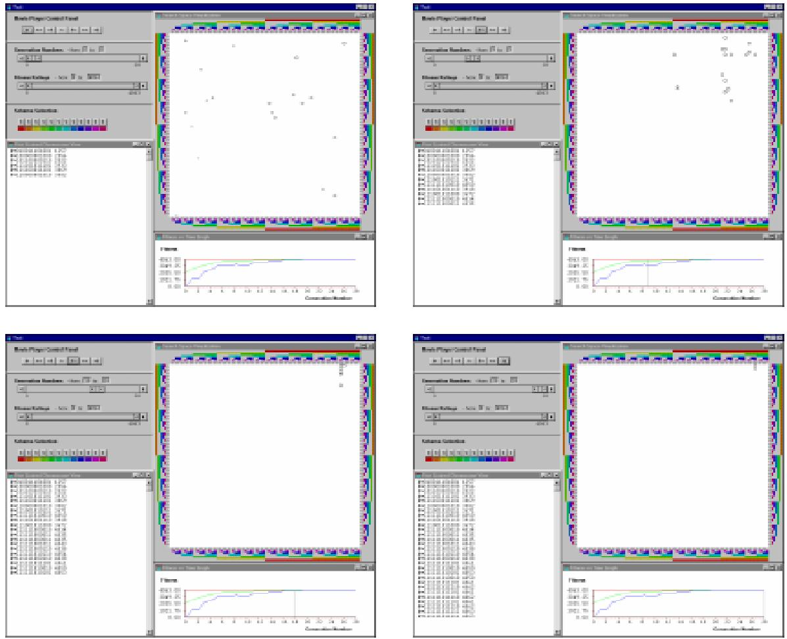
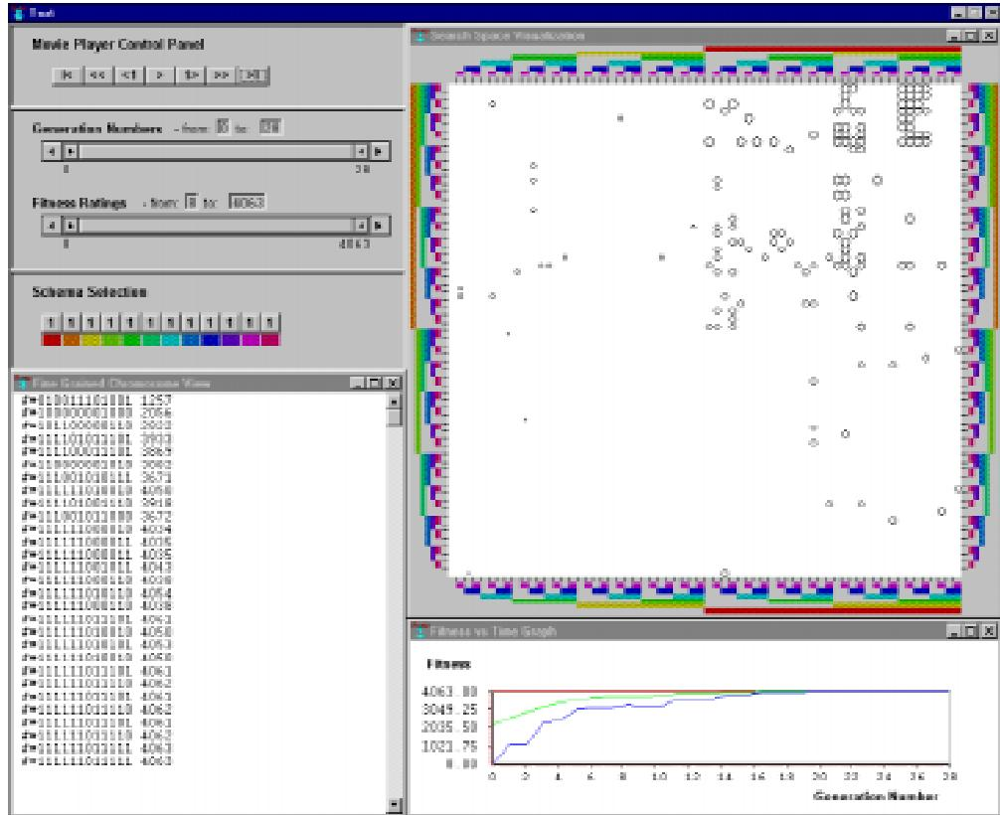

name list-of-labels list-of-functions list-of-views parent-dialog exterior-box )

The movie player takes a list of button labels and function names and creates a button for each label and function pair. Each button's title is set to the label value and the button's function is set to the function name as specied in the $2 i s t - o f - l a b e l s$ and list-of-functions , respectively. The list of views are updated every time the buttons are used. The location and size of the movie player are identied by the $p a r e n t - d i a l o g$ and exterior-box arguments. When called the individual functions change the value of the current range of generations displayed by each view identied in the list-of-views list.

A set of seven functions are available in Gonzo; start sets the views' generation-range to 0, rewind sets the views' generation-range back 10 generations, back1 sets the views' generation-range back 1, play-pause either periodically steps forward a single generation per second or pauses, forward1 sets the views' generation-range forward 1, fforward steps the views' generation-range forward 10, and end sets the views' generation-range to the last generation in each view. Changing the value of the generation range also updates the augmented tness versus time graph and the search space visualization as described above.

# Generation and Fitness Range Selector

(create-generation-fitness-selector name list-of-views parent-dialog exterior-box )   
(create-alpharanger name title-string list-start-and-end-values list-start-and-end-range set-value-function exterior-box )

The generation and tness range selector has a specic creation function that calls the create-alpharanger function twice to produce a generation number range selector and a tness rating range selector. The minimum and maximum values of the generation numbers and tness ratings associated with each of the views included in the $\_ i s t - o f - u i e w s$ are used to dene the list-start-and-end-range of the two range selectors. The default initial value of the list-start-and-end-values argument for the generation range selector is to start and end at generation 0. The default initial range value of the list-start-and-end-values argument of the tness rating range selector is a list of the minimum and maximum tness ratings found in the dataset for each associated view. Like the movie player control panel, changing the value of the generation range, or the tness range, also causes the augmented tness versus time graph and search space visualization to be updated.

# 7.3 Application

This section explains how the above Gonzo implementation can be applied to produce both oine and online visualizations. The actual Lisp code used to produce the examples presented in this chapter is included in Appendix D.

# 7.3.1 Oine Visualization

To produce the oine visualization shown in Figure 7.1 a test function was dened rst to run the GA and then to create the visualizations. The GA is run by calling the Geco test-plan function which takes three arguments; a name , the number-of-runs and a GA-plan . The name argument is then used to access the results of the GA, and this is used in the create-visualizations method to produce the oine visualizations. The create-visualizations method creates the \*visualization-dialog\* using the standard common-graphics open-dialog command, and this is used as the parent-dialog for all of the Gonzo components.

The ne-grained chromosome view, and search space visualization are both produced in a similar manner to the fitness-versus-time-graph, which is created as follows:

(create-fitness-versus-time-graph 'fitness-graph-0 ;; name ga-run ;; dataset \*visualization-dialog\* ;; parent-dialog (cg:make-box 400 0 1278 204)) ;; exterior-box

The same ga-run dataset and $^ *$ visualization-dialog\* parent-dialog are used in all of the views, while the view names and exterior box dimensions are specied individually. The three navigators are also created in a similar way to one another, for example the generation-fitness-selector is created by the command:

(create-generation-fitness-selector 'view-range-window ;; name (list fitness-graph-0 scatterplot-view-0) ;; list-of-views \*visualization-dialog\* ;; parent-dialog (cg:make-box 0 80 400 240)) ;; exterior-box

# 7.3.2 Online Visualization

The previous example has shown how Gonzo can be applied to produce an oine visualization of a GA's recorded history, this section describes how the same views can be produced for online visualizations. The dierence between oine and online visualizations is that oine visualizations are produced after the algorithm's execution and online visualizations are produced after the initial generation has been evaluated and they are then updated after each consecutive generation.

To do this in Geco the create-visualizations function is called from within the Geco EVOLVE method. Updating the visualization to follow the evolution of the GA is done by incrementing the current-generation-range, the total-generation-range and (if necessary) the current-fitness-range and total-fitness-range of the views contained in the \*visualization-dialog\*. The annotated version of the Geco EVOLVE method is included in Appendix D.

Annotating the Geco EVOLVE method to create and update the visualizations is the only essential dierence between producing oine and online views in Gonzo. Updating the total-fitness-range variable for each view as indicated in Appendix D has the eect of redrawing the tness graph with the expanded total range as well as updating the values of any associated navigators. During the course of the GA's execution, particularly in the initial generations when this range changes frequently, the tness versus time graph can appear to 
icker. This 
ickering can be avoided by identifying an expected total tness range when the visualizations are rst created in the create-visualizations function.

# 7.3.3 Interactive Command Line Control

Finally, because Lisp is an interpreted, rather than a compiled language, the visualization commands available in Gonzo, as well as the GA commands available in Geco, can be applied via the command line either during the GA's run (online) or whilst an oine visualization is being displayed. In this way, the user is un-restricted in the control they have over both the GA and the GA visualization. A similar degree of freedom is available in the Samba visualization tool [Stasko et al., 1993] (see Section 4.1.4).

# 7.4 Example Problem Visualizations

This section illustrates some of the applications in which Gonzo has been used to explore the search behaviour of GAs. The problems investigated here are the maximum integer problem used previously as an example, the De Jong F1 test problem [De Jong, 1975] (as reviewed in [Goldberg, 1989]), and the Royal Road function [Mitchell et al., 1991].

# 7.4.1 The Maximum Integer Problem

The relatively simple maximum integer problem is used as a common example used for illustrating the execution of the GA in an educational context. For this problem the GA attempts to maximize the integer value of the chromosomes in the population. This is an easy problem for students to follow as they are well aware of the concept of binary to integer number translation and can therefore understand the link between the organisms' chromosome values and tness ratings.

As the GA progresses the initially random distribution of points migrates towards the top right hand corner of the search space, as shown in Figure 7.9. In the search space visualizations shown above the pro jection ordering used places the even loci along the horizontal axes and odd loci along the vertical axes, such that the worst organism (000000000000) is located at the bottom left hand corner of the search space view, the best organism (11111111111) is shown at the top right hand corner, the middle range organisms (101010101010) and (010101010101) are shown in the bottom right hand corner and top left hand corner, respectively. Figure 7.10 shows the complete GA run containing the chromosomes in every population.

  
Figure 7.9: Four screen images taken from Gonzo showing the population of a GA solving the 12 bit Maximum Integer problem after generations 0, 9, 18 and 28 (top left, top right, bottom left and bottom right, respectively).

# 7.4.2 The De Jong F1 Test Problem

A wide range of GA test problems have been proposed for studying the theory of GA search and GA design since Kenneth De Jong's original suite of test problems [De Jong, 1975]. However the De Jong suite of test problems is considered a classic set of problems and continue to be used by researchers exploring GAs. Having a complete tness landscape $2$ and investigating the GA's search path over that landscape under a number of dierent design conditions enables the user to investigate the evolutionary search behaviour of their algorithms and extract design guidelines based on the GA's behaviour under the test conditions.

  
Figure 7.10: A screen image taken from Gonzo showing the complete population data of a GA solving the 12 bit Maximum Integer problem. The size of each point shown on in the scatterplot view (top left) indicates the magnitude of the tness rating for the chromosome at that position in the search space matrix. In this case the magnitude of the tness ratings ranges from 0 at the bottom left hand corner of the search space matrix to 4095 $( 2 ^ { 1 2 } - 1 )$ at the top right hand corner of the search space matrix.

The F1 test problem attempts to minimize the sum of the squared decimal values of three ten bit binary strings. Figure 7.11 shows th relationship between tness (on the vertical axis) and two problem dimenions (variable2 and variable 1). Although this gives a strong indication of the relationship between the decimal values of the GA's chromosomes and their tness ratings, the actual binary chromosome values are not shown. The three variables have values in the range -5.12 to $+ 5 . 1 2$