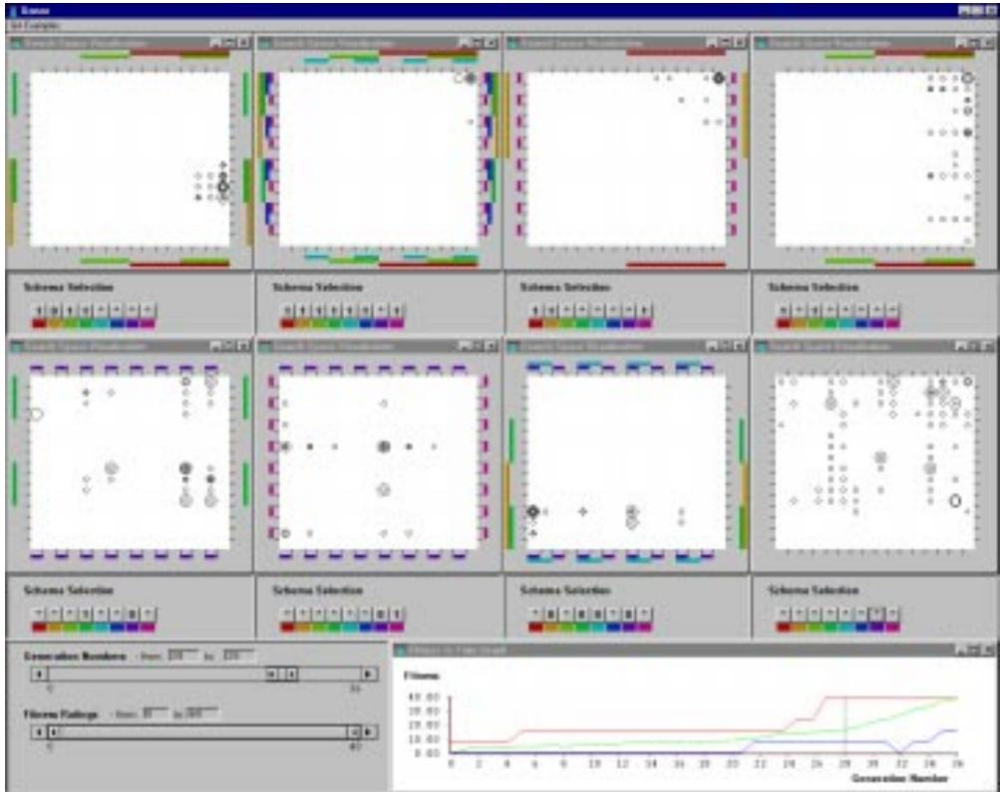
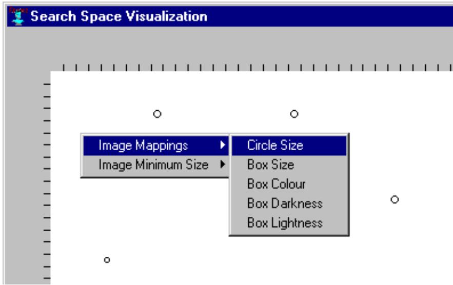
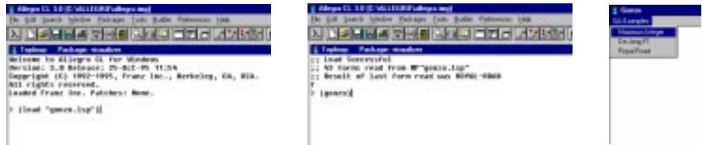

  
Figure 7.14: An example screen image taken from Gonzo for viewing a single run of a GA solving the Royal Road

function [Mitchell et al., 1991]. Eight search space visualizations are used here to illustrate the eight sections of the sixty four bit chromosomes. The four scatterplots at the top of the screen view represent the rst four building blocks for loci 0 to 7, 7 to 15, 16 to 23 and 24 to 31, and the four scatterplots in the middle of the screen view represent the last four building blocks for loci 32 to 39, 40 to 47, 48 to 55 and 56 to 63.

uses the existing search-space-visualization method. The Lisp code for the search-space-visualization-matrix is shown in Appendix D, and is applied as follows:

(create-search-space-visualization-matrix list-of-names dataset chromosome-mapping-technique parent-dialog list-of-exterior-boxes coordinate-mapping-technique list-of-views list-of-projection-locus-orderings )

The search-space-visualization-matrix method is used to produce the visualization shown in Figure 7.14, as follows:

(create-search-space-visualization-matrix '(scatterplot-view-0 scatterplot-view-1 scatterplot-view-2 scatterplot-view-3 scatterplot-view-4 scatterplot-view-5 scatterplot-view-6 scatterplot-view-7) ;; list-of-names

run-1 ;; dataset

'GSM-D ;; chromosome-mapping-technique \*visualization-dialog\* ;; parent-dialog 'D-GSM ;; coordinate-mapping-technique (list text-view-0) ;; list-of-views

\`((0 1 2 3 4 5 6 7) (8 9 10 11 12 13 14 15) (16 17 18 19 20 21 22 23)

(24 25 26 27 28 29 30 31) (32 33 34 35 36 37 38 39) (40 41 42 43 44 45 46 47)

# 7.5 GUI Front End

Although Gonzo strives to maintain a sucient level of expressive power for GA users by providing high-level Lisp commands for producing individual visualizations, this approach suers from a lack of usability for users unfamiliar with Lisp programming. As a response to this draw back an additional menu-based graphical user interface is introduced here as an optional front end for Gonzo. This interface provides a system menu for selecting individual examples of GA applications (and their default visualizations), and a pop-up menu for setting view specic options, in this case for selecting the image mapping used in the search space visualization. The use of these two types of menu are explained in this section.

<table><tr><td colspan="3">Gonzo</td></tr><tr><td>GA Examples</td><td colspan="2"></td></tr><tr><td>Maximum Integer</td><td colspan="2"></td></tr><tr><td colspan="2">De Jong F1 Royal Road</td><td rowspan="2"></td></tr><tr><td colspan="2"></td></tr></table>

Figure 7.15: The system menu bar used in Gonzo to select example GAs. Three options are available in this menu, these run the GA and present the visualizations for the maximum integer problem, De Jong's F1 test problem, and the royal road problem (as described in Section 7.4).

# 7.5.1 GA Examples System Menu

Figure 7.15 shows the system menu available in Gonzo. Three examples can be selected from the \GA Examples" menu: \Maximum Integer," \De Jong F1," and \Royal Road." These options correspond to the three example GA applications described in Section 7.4, in each case the corresponding GA is run and the visualizations described in Section 7.1 are displayed. This menu relieves the user of the task of setting up the GA and writing the calls to the visualization functions described in Section 7.2. Furthermore, the Lisp code used to produce these examples gives the user an indication of how they may go about producing their own GA applications and alternate visualizations.

# 7.5.2 View Specic Pop-Up Menu

Figure 7.16 shows the pop-up menu that is included as part of the search space visualization. This pop-up menu appears when the cursor is within the display area of the search space matrix and the user presses the right hand mouse button. The menu contains two options; one to set the image mapping used by the search space view and a second to set the minimum size of the chromosomes' images.

The \Image Mappings" menu option contains four further options which relate to the visual variables used to represent the chromosomes' tness ratings; namely, size, colour and value (as described in Section 5.2.2). The \Circle Size" and \Box Size" options set the image mapping used in the search space view to map the chromosomes' tness ratings to the size (i.e. area) of the circle or box used to identify each chromosome. The \Box Colour" sets the colour of the box to the chromosomes' tness rating in the range of blue (for low tness values) to red (for high tness values). The \Box Darkness" and \Box Lightness" menu options map the chromosomes' tness ratings to the colour value of the chromosomes' box images. These can be used to link the magnitude of each chromosome's tness rating to the darkness or lightness value of the corresponding box image. These two options enable the user to emphasise the chromosomes with large or small tness ratings. These are important options needed when visualizing GAs that maximize or minimize the chromosomes' tness ratings: Box Darkness emphasises the chromosomes with high tness values as they appear as dark boxes, and Box Lightness emphasises the chromosomes with low tness values. In practice, these two options can also be useful for emphasising the t and unt regions of the search space considered by the GA.

  
Figure 7.16: The pop-up menu bar used in Gonzo to identify the image mapping used in the search space visualization. Five options are available in this menu for circle size, box size, box colour, box darkness and box lightness image mappings.

The \Image Minimum Size" menu option allows the user to set the absolute minimum width and height in pixels that a chromosome icon be. Five options are available: 1, 2, 3, 4, and 6. This menu item is only available when the Circle Size or Box Size option is selected as the image mapping. The size of the chromosome icons for the box colour, lightness and darkness options is determined by the resolution of the search space view.

  
Figure 7.17: Getting started with Gonzo. This gure shows the three stages involved in executing Gonzo: (1) loading the gonzo.lsp le that creates Gonzo, (2) starting Gonzo with the command \(gonzo)" in the Lisp listener's command line, and (3) selecting an example GA application from the Gonzo system menu.

# 7.6 User Walkthrough

This section explains the individual steps involved in loading and running Gonzo. This includes a walkthrough description of the steps to be taken in order to view the example GA applications presented in Section 7.4 with the visualizations described in Section 7.1, and the steps required to introduce other GA applications and alternate GA visualizations. The Lisp code used to produce the example GA visualizations included in Appendix D can be used as templates for introducing alternate GAs or alternate visualizations. Further information regarding the use of the Geco GA prototyping environment can be found in [Williams, 1993].

# 7.6.1 GA Examples and Their Default Visualizations

As noted in Section 7.2, Gonzo is written in Lisp using the Allegro Common Lisp environment. In order to use Gonzo, rst start the Allegro Common Lisp environment and load Gonzo (i.e the le called \gonzo.lsp"), this will load the necessary les which dene Gonzo. The menu based environment is started by typing the command \(gonzo)" at the Lisp listener prompt. This will open a new window that includes a system menu which will allow the user to select an example GA (see Figure 7.17). As noted in the previous section, the user can select either the maximum integer problem, De Jong's F1 test problem, or the royal road problem. The corresponding GA will then be executed and the visualizations illustrated in Section 7.4 will be displayed.

In Gonzo the default image mapping displays the chromosomes in the search space visualization as a circle, the size of each circle indicates the value of the corresponding chromosome's tness rating. The image mapping and minimum image size used in the search space visualization can be set using the pop-up menu described in Subsection 7.5.2. Regions of the search space view containing individual schemata of interest can be highlighted using the schema highlighting dialog, and the GA's execution can be navigated using the movie player control panel and the generation and tness range selector (as described in Section 7.1).

When the user is nished using Gonzo they can close it in the same mannar as they would close any other window: either by selecting the close button at the top right hand corner of Gonzo's main window, selecting the window menu at the top left hand corner of the main window and choosing the \Close" option, or by pressing the \Alt $+$ F4" key combination (also identied to the right of the Close option on the main window's menu bar).

# 7.6.2 Alternate GAs

Other GAs, not included in the GA Example menu, can be visualized using Gonzo. In the case of the example applications the GA is executed and the result is stored in an instance of the Geco ecosystem class. The Geco ecosystem class includes slots for the run's population, number of generations, number of evaluations and genetic plan (as described in Section 6.1.1). Gonzo uses the population-statistics slot of the ecosystem's population as its history module. Providing the user's GA is written in Geco and uses the population-statistics slot to record each generation's organisms, min-score, avg-score and max-score then the views, mappings and navigators dened above can be directly applied. In order to use the visualizations described in Section 7.1, the user can simply substitute the name of their own GA's ecosystem for the dataset variable used in each visualization's initialization command, as given in Section 7.2.

To introduce new GA examples to the GA Examples menu bar the user must rst dene a function that executes their GA and calls the appropriate visualization methods using the name of their GA's ecosystem class instance. A new menu item must then be added to the Gonzo system menu, and the name of the user's new function should be given as the function to be called when the menu item is selected. Within Gonzo the production of menu items is automated such that any menu labels and their corresponding function names, which are held in the menu-components-list and menu-function-list global variables (dened in the \gonzo-menus.lsp" le), are automatically created when Gonzo is invoked.

# 7.6.3 Alternate Visualizations

Alternate visualizations can be introduced in a similar mannar to alternate GAs. The user can create new visualizations in Lisp using the Henson framework. The resulting functions can be executed either from the Lisp environment's command line, or through Gonzo's system menu by adding new labels and function names to the menu-components-list and menu-function-list global variables.

# 7.7 Summary

This chapter introduced the design features of Gonzo, illustrated how the design features could be specied using the Henson framework, presented the specic Lisp implementation and application of the high-level Gonzo visualization functions, and explained how Gonzo could be applied to illustrate the search behaviour of a set of example problems.

Gonzo is applicable to the ma jority of GAs, the only known exceptions are for GAs with more than one chromosome per genotype, with chromosomes containing continuous alleles, or for chromosomes with no xed maximum length. Representations using more than one chromosome per genotype can be used in Geco but the search space view and mapping module of Gonzo would need to be adapted to cope with the multiple chromosomes. Although continuous alleles are not a very common GA representation, Geco can be used to build algorithms with continuous alleles. However, continuous values cannot be represented as unique points using the extensive repartition technique deployed in the search space view. Replacing the chromosome-mapping-technique with a mapping method more suited to continuous data would alleviate this problem. The search space for genotypes with no maximum length are eectively innite and therefore are dicult to map into a 2 or 3 dimensional scatterplot. However, providing the user can zoom in and out of the search space view this can be accommodated within the extensive repartitions translation technique.

To conclude this chapter the visualization attributes of Gonzo are compared against the set of user requirements established in the user study (Chapter 3). All four issues, usability, expressiveness, interactivity and supportiveness, have been addressed (to a greater or lesser extent) in the development of Gonzo.

# Usability

Three dierent types of ready to use generic GA visualizations are available in Gonzo; the coarsegrained tness versus time graph, the medium-grained search space visualization, and the ne-grained chromosome view. These three linked representations enable the user to obtain an overview of the GA's evolution using the tness versus time graph, zoom and lter information of interest using the search space visualization and its associated navigators, and select and view details of individual chromosomes using the ne-grained chromosome view. Since this system was developed this approach has been summarized as the \visual-information-seeking mantra" i.e. \Overview rst, zoom and lter, then details on demand" [Shneiderman, 1998, page 523].

Gonzo includes a set of three example GA applications written using the Geco GA prototyping tool [Williams, 1993]. These are available from a drop-down \GA Examples" system menu which runs the corresponding GA and presents an interactive o-line visualization of the GA's execution. The system menu enables people to use Gonzo without writing any Lisp commands. However, in order to apply a GA to a new problem the user will have to dene an appropriate problem representation, write an evaluation function to evaluate their GA's chromosomes, and dene a suitable set of selection and reproduction operators (as explained in Section 2.2.3). These programming tasks are facilitated in this case by the use of the Geco GA prototyping framework. The user will also have to program in order to introduce any new visualizations, in this case the Henson framework facilitates the task.

# Expressiveness

Additional visualizations can be introduced by the user at practically any level of programming abstraction, from graphics programming in Lisp, through history, view, mapping, and navigator descriptions in Henson, to view conguration and re-use in Gonzo.

# Interactivity

Navigation dialogs are available in Gonzo to explore the GA's search sample for individual generations as well as ranges of generations and ranges of tness ratings. Further investigative interaction enables the user to analyse the search space independently of the GA.

Editing the GA's parameters and components is possible via the command line in Geco. No additional views or navigators were included within the design of Gonzo to support further interactive online algorithm editing, but this would be a relatively trivial extension.

Although the use of direct manipulation to edit the chromosomes in the population is potentially possible within the search space visualization this feature was not included in the design of Gonzo. The focus of Gonzo was to support the user's understanding of the GA's search behaviour rather than guiding or intervening in the evolutionary process. Introducing a direct manipulation navigator into the search space visualization would be one way of enabling the drag-and-drop direct manipulation of chromosomes. This would simply re-use the coordinate-mapping-technique to remove the chromosome identied by the cursor coordinate when the \mouse-down" event is recorded and replace it with the chromosome identied by the cursor coordinate at the next \mouse-up" event.

# Supportiveness

Finally, Gonzo provides an extensive degree of support for the user's understanding of the GA's exploration of the search space. The user's sense of position within the GA's run is supported by the tness versus time graph; the user's sense of the GA's sampling of the search space is supported by the search space visualization, and any further details regarding individual chromosomes in the population or unexplored regions of the search space can be viewed in the ne grained chromosome view. In fact, supporting the user's understanding of the GA's search behaviour is the explicit intention of Gonzo (see Section 7.1).

The second form of support identied in the user study, i.e. design support, is not provided directly by Gonzo. This is an important and unfullled need of the GA community that requires additional support to that of SV. The provision of design support for GA users, and the role that visualization can play in design, is discussed further in Section 8.3.