# An Investigation into the Use of Hypermutation as an Adaptive Operator in Genetic Algorithms Having Continuous, Time-Dependent Nonstationary Environments

Helen G. Cobb Navy Center for Applied Research in Artificial Intelligence Naval Research Laboratory, Code 5514 Washington, D. C. 20375-5320

December 11, 1990

# Abstract

Previous studies of Genetic Algorithm (GA) optimization in nonstationary environments focus on discontinuous, Markovian switching environments. This study introduces the problem of GA optimization in continuous, nonstationary environments where the state of the environment is a function of time. The objective of the GA in such an environment is to select a sequence of values over time that minimize, or maximize, the time-average of the environmental evaluations. In this preliminary study, we explore the use of mutation as a control strategy for having the GA increase or maintain the time-averaged best-of-generation performance. Given this context, the paper presents a set of short experiments using a simple, unimodal function. Each generation, the domain value mapping into the optimum changes so that the movement follows a sinusoidal path. In one of the experiments, we demonstrate the use of a simple adaptive mutation operator. During periods where the time-averaged best performance of the GA worsens, the GA enters hypermutation (a large increase in mutation); otherwise, the GA maintains a low level of mutation. This adaptive mutation control strategy effectively permits the GA to accommodate changes in the environment, while also permitting the GA to perform global optimization during periods of environmental stationarity.

# 1 INTRODUCTION

Many studies demonstrate that a generational Genetic Algorithm (GA) is good at finding the optimum of a complex multimodal function when the shape of the search space remains constant while the search progresses. Each population member of a GA encodes a potential solution, i.e., an estimate of the domain value, that optimizes the function. The optimization function (typically transformed by some scaling function) represents an external environment whose role is to evaluate the performance of each potential solution.

If the environment's evaluation of a potential solution changes with time, we call the problem optimization in a nonstationary environment or temporal optimization. So far, only a handful of researchers have reported on the GA optimization of functions in nonstationary environments (Pettit and Swigger, 1983; Goldberg, 1987). Their work focuses on problems where the optimum changes in a discontinuous, fluctuating manner. No published work to date examines temporal optimization of GAs in continuously changing environments. In this paper, we begin to explore continuously changing environments where the state of the environment depends in some way on the stage of the search.

A principal reason for developing learning and adaptation in systems is that most environments do change with time. Ultimately, learning algorithms should be judged based on their abilities to perform in nonstationary environments. Many learning algorithms implicitly operate under the assumption of environmental stationarity. Researchers make this assumption on the basis that if the algorithm can find an optimum quickly for a slowly changing environment, then that optimum will perform satisfactorily until the algorithm can find another optimum. Since the characteristics of environments vary, it is important that we examine the robustness of each algorithm under differing degrees and kinds of environmental nonstationarity.

The standard generational GA works under the assumption of environmental stationarity. Each generation, the algorithm reduces the breadth of the search space it investigates by reducing variation in its population members. Population members are in essence the memory of the GA. Assuming no possible change in the solution, uninteresting information is weeded out of the memory until a relatively homogeneous set of potential solutions remain. In a nonstationary environment, the objective of a learning algorithm is not to find a single optimum for all time, but rather to select a sequence of values over time that minimize, or maximize, the time-average of the environmental evaluations. In this sense, the learning algorithm “tracks” the environmental optimum as it changes with time. In order to accomplish temporal optimization, we need to modify the standard GA.

Tracking a varying minimum or maximum is called extremum control. In many physical systems, the value of a control parameter giving optimal performance changes depending on the process parameters. For example, in a combustion engine the air-to-fuel ratio giving the best performance varies depending on temperature and fuel quality. In water turbines, the blade angle giving the maximum output power varies with the water speed (Astrom and Wittenmark, 1989).

In this paper, we begin to explore the use of mutation as a control parameter for enhancing optimization in an incrementally changing environment. We modify the standard GA by adding a mechanism that adaptively changes the level of mutation. As a result, the modified GA can dynamically reduce or expand its region of search. Recent biological studies show that when cells are stressed by environmental conditions, some of the cells tend to enter a “hypermutable” state, i.e., a state of increased mutations (Stolzenburg, 1990). In biological systems, only those mutated cells which survive in the new environment pass on their traits. In the modified GA, we gauge “environmental stress” through measuring changes in performance. Better performing members selectively breed to form the population members of the next generation.

We hypothesize that using an adaptive mutation rate is better than using a constant mutation rate for the time-averaged best performance of the GA in an incrementally changing environment. With a constant low mutation rate, there would be insufficient variation in the population to find each time dependent optimum. Maintaining a constant high mutation rate would clearly be disruptive to the overall population performance, especially during periods of environmental stationarity. By using an adaptive mutation operator, disruptions would be limited to times when the GA is stressed by environmental changes as sensed by a decrease in the time-averaged best-of-generation performance. Given an adaptive mutation operator, we also hypothesize that if we combine periods of stationarity with nonstationarity, the mutation operator will reflect the degree of stationarity in the environment: for periods of stationarity, mutation will be low; for periods of nonstationarity, mutation will increase depending on the amount of change in the environment.

Section 2 defines what we mean by nonstationarity in the context of this paper. We then describe mutation as an example of one of two basic strategies an algorithm can use to accommodate nonstationary environments. In particular, we focus on the use of mutation in environments where the optimal environmental state is a function of time. Section 3 briefly reviews prior work on GA optimization in nonstationary environments that are characteristically different from the continuously changing, state-dependent ones being considered in this paper. Section 4 presents the simple optimization problem being used in this preliminary study. Section 5 describes the implementation details and presents results of several experiments. One of these experiments shows the result of using a simple adaptive mutation operator. Section 6 presents conclusions based on the results presented in this paper. Section 7 follows with an outline of some possible future studies.

# 2 DEFINITION OF A NONSTATIONARY ENVIRONMENT

There may be a finite or an infinite number of environmental states. If the evaluations of the potential solutions to the function, $f ( x _ { i } ) , i = 1 , 2 . . .$ , vary with time, then the environment is nonstationary. In essence, each new function $f _ { t } ( x _ { i } ) , i = 1 , 2 . . .$ at time $t$ corresponds to learning an optimum for a new environmental state.

An environment may be nonstationary in a strict sense, yet stationary in some broader statistical sense. Stochastic processes are stationary in a limited sense depending on what statistics are unaffected by shifts in time. For example, a stochastic process is wide-sense stationary if its expected value is constant and its autocorrelation depends only on a time difference and not on any particular times (Papoulis, 1965).

# 2.1 Kinds of Nonstationarity

There are several ways to characterize environmental nonstationarity (Narendra and Thathachar, 1989). The way that the evaluations $f ( x _ { i } )$ vary over time may differ. The environment may be stationary in an interval; that is, the evaluations $f _ { t } ( x _ { i } )$ , may be constant over some interval $[ t , t + \tau ]$ and then switch to another value at $t + \tau$ . Alternatively, the environment may change the evaluations continuously; that is, the evaluations may vary by a small amount from one time increment to another.

We can also characterize environmental nonstationarity based on whether a state's occurrence depends on an underlying steady state probability distribution or some time-dependent function. Narendra, in his study of learning automata, investigates two other classes of environmental nonstationarity:

# 1. Markovian Switching Environment (MSE)

The environments are states of an ergotic Markov chain. In an ergodic chain, there is a limiting, asymptotic probability distribution associated with the environmental states, independent of the initial state distribution.

# 2. State Dependent Nonstationarity Environment (SDNE)

For a state dependent nonstationary environment, the state of the environment varies either implicitly or explicitly with the stage of the search. For the standard generational GA, a stage is a generation.

We focus on continuous, and combinations of continuous and discontinuous SDNEs in this paper.

# 2.2 Strategies for Accommodating a Nonstationary Environment

To accommodate a nonstationary environment, a learning algorithm can employ two strategies: (1) the algorithm can expand its memory store to build up a repertoire of ready responses for different environmental conditions, and (2) the algorithm can adaptively expand the variation in its set of potential solutions to counteract any perceived decline in performance.

We hypothesize that these two strategies are characteristically more important in different kinds of nonstationary environments. The first strategy is critical in uses. Since the standard GA is highly biased toward recent information, the population becomes more homogeneous toward the end of a stationary interval. With an abrupt change in environment and no information about possible states, the GA would have to rely on mutation to determine what part of the search space to sample next. With an elaborate memory store, on the other hand, the GA would be able to bias its responses based on prior successful experiences. The second strategy is important for SDNEs. If there are tremendous number of related, yet distinct, states, increasing the GA's memory to build up a repertoire of responses may be infeasible. Even if we do expand the GA's memory for SDNEs, mutation is still necessary to bridge the gap for new environmental situations. We plan to address this hypothesis in future studies.

# 3 PRIOR GA RESEARCH ON NONSTATIONARY ENVIRONMENTS

Prior work on GAs in nonstationary environments tends to focus on discontinuous MSEs. For example, the early work of Pettit and Swigger (Pettit and Swigger, 1983) demonstrates the difficulty of having GAs perform a search in a randomly fluctuating environment. They report on an experiment where a GA searches for a target structure that probabilistically changes each generation. Each bit position is a semirandom binary transmission process having a random variable that takes on the value 0 or 1. The experiment framed by Pettit and Swigger is especially difficult for a standard GA, since each generation bit positions change in an uncorrelated way.

In subsequent studies, Goldberg and Smith (Goldberg and Smith, 1987; Smith, 1988) examine a nonstationary environment for the 0, 1 blind knapsack problem. They explore two approaches for achieving environmental nonstationarity. In one version of the problem, the sack's upper bound weight constraint shifts back and forth between two states so that the optimum also shifts. In the second version, the representation in the domain shifts between two states so that each representation maps into the optimum at different times. In both versions, a state remains constant over some interval of time before switching to the other state.

The problem considered by Goldberg and Smith is simpler than the one explored by Pettit and Swigger since there are only two switching states. By noting the structure of the problem, Goldberg and Smith take advantage of nature's solution to the problem: genetic diploidy with dominance operators (modelled most successfully using the HollstienHolland's triallelic encoding). Since the problem is actually stationary in a limited sense, two of the chromosomes (the homologous ones) potentially match the two possible states.

In general, diploid and polyploid representations, along with their associated shielding and abeyance dominance schemes, are popular biological mechanisms that generate diversity in populations and thus protect populations as a whole from extreme changes in environment. Most cells are diploid in higher plants and animals; polyploidy (having several homologous chromosomes) occurs in approximately one third of plant species (Watson et al, 1987). Goldberg and Smith's results demonstrate that expanding the genetic store of information in a GA is an effective strategy for discontinuous MSEs.

# 4 THE SPECIFIC PROBLEM

In this preliminary study, we examine the optimization of a simple parabola having one independent variable in a continuously changing SDNE. The expression for the parabola is

$$
f _ { t } ( x _ { i } ) \ = \ \left( x _ { i } - h _ { t } \right) ^ { 2 } ,
$$

where $h _ { t }$ is the generated target domain value mapping into the optimum at time $t ,$ , and the $x _ { i }$ are the current estimates of this domain value. The evaluation of $f _ { t } ( x _ { i } )$ represents the environment. By using a parabola, at each generation the environment essentially returns the squared error of the domain estimate from the true $h _ { t }$ .

Given a constant $h _ { t }$ , we would use calculus or perhaps a gradient search technique to find the optimum. The problem becomes more complicated if a nonstationary environment potentially presents us with a new optimum at each time step. Since there are several time-related optima, the parabola is multimodal in time. The standard GA is excellent in performing spatial optimization; however, to perform temporal optimization, we need to modify the GA. In this study, we make a simple parameter adjustment on the mutation rate to test the effectiveness of using mutation as a primitive mechanism for coping with a SDNE. Other more elaborate possibilities exist for modifying the GA so that it can perform optimization in SDNEs. In Section 7, we briefly mention a few of these possibilities.

We achieve environmental nonstationarity by changing the value $h _ { t }$ that maps into a constant optimum. In other words, we translate the function along the x-axis over time while maintaining the shape of the search space. However, notice that from the GA's perspective a domain value has a different functional evaluation depending on the generation of the search. The experiments do not consider deformations in the shape of the function. To better control the experiment, only the domain values mapping into the minimum change while the minimum of the parabola remains constant at zero. Notice that it is not sufficient to simply translate the function along the y-axis over time. In this case, the domain value mapping into the minimum would remain the same even though the functional values change over time.

# 5 PRELIMINARY EXPERIMENTS

# 5.1 Generator of Nonstationarity

In these preliminary experiments, we use a sine wave to generate changes in the environment. In other words, the domain value mapping into the optimum moves along a sinusoidal path. If we express the search space in more visual terms as a three dimensional axis, then the abscissa (x-axis) represents the domain value, the ordinate (y-axis) represents the evaluation function, and the third axis extending toward us ( $\dot { \mathbf { z } }$ -axis) represents time. As the generations pass, the parabola remains at a constant level, shifting back and forth in a sinusoidal fashion along the $\mathbf { X }$ -axis as it moves toward us. A few of the experiments combine stationarity with this kind of nonstationarity.

# 5.2 Performance Measures

For a generational GA, the nonstationary optimum potentially changes each generation. Since the strategy of the GA is to find at least one viable member to complement the current environment, each generation's best performing population member provides us with the current estimate of the domain value that optimizes the function. In our experiments, we use the evaluation of each generation's best performing member to compute the timeaverage value of the GA's performance. We would expect population average results to suffer in nonstationary environments.

# 5.3 Implementation

All of our experiments use as a base the C coded GENESIS program written by Grefenstette (Grefenstette, 1983). For all runs, two-point crossover is performed $60 \%$ of the time, and there is no scaling window. The stopping criterion for each run is the generation count (of 300). We do not consider other stopping criteria such as convergence. Each population member is stored as a 32-bit Gray coded value. During evaluation, the evaluation function converts the unsigned binary representation into a floating point value ranging over the interval [0, 2].

# 5.4 Examining Combinations of Mutation Rate and Sine Frequency

The mutation rate, $\mu$ , and the frequency of the sine wave, $\alpha$ , are the experimental parameters. We examine the best time-averaged performance for combinations of $\mu$ and $\alpha$ . Mutation rates are 0.0001, 0.0005, 0.001, 0.005, 0.01, 0.05, 0.1, and 0.5; sine frequencies are 0.001, 0.0025, 0.005, 0.01, 0.025, 0.05, 0.1, 0.25, and 0.5. We repeat each run 10 times to obtain average results.

Figures 1a through 1d show some plots of a typical run for $\alpha = 0 . 0 2 5$ . Figures 1a and 1c illustrate how well the GA's best-of-generation value tracks the actual optimum of each generation for mutation rates $\mu = 0 . 0 0 1$ and $\mu = 0 . 5$ , respectively. In Figures 1b and 1d, we plot the negative log of the time-averaged best and average performances versus generations so that larger values indicate better performance. For $\mu = 0 . 0 0 1$ , the GA successfully tracks the optimum during the first 25 generations due to the initial variation in the population. As time progresses, there is a decrease in variation, and the mutation rate is too low to compensate for this decrease.

For a comparable problem in a stationary environment, the off-line performance of the GA would be on the order of ${ 1 0 } ^ {  { - } 1 0 }$ to ${ 1 0 } ^ { - 1 4 }$ upon convergence. When the GA tracks the moving optimum of a simple parabola, the time-averaged best performance is at best on the order of ${ { 1 0 } ^ { - 6 } }$ . The objective of the GA shifts from trying to find the best solution for all time to one of maintaining a consistently good level of performance over time.

Figure 2 summarizes what happens to the time-average of the best performance by generation 300 for different frequencies of the sine wave $( \alpha )$ as the mutation rate increases.

Plots Using Average of Ten Runs Population $= \overline { { 2 } } 0 0$ , $\mu \doteq 0 . 0 0 1$ , $\mathbf { \alpha } \mathbf { \alpha } \mathbf { \alpha } \mathbf { \alpha } \mathbf { \alpha } \mathbf { \alpha } \mathbf { \alpha } \mathbf { \alpha } \mathbf { \alpha } \mathbf { \alpha } \mathbf { \alpha } \mathbf { \alpha } \mathbf { \alpha } \mathbf { \alpha } \mathbf { \alpha } \mathbf { \alpha } \mathbf { \alpha } \mathbf { \alpha } \mathbf { \alpha } \mathbf { \alpha } \mathbf { \alpha } \mathbf { \alpha } \mathbf { \alpha } \mathbf { \alpha } \mathbf { \alpha } \mathbf { \alpha } \mathbf { \alpha } \mathbf { \alpha } \mathbf { \alpha } \mathbf { \alpha } \mathbf { \beta } \mathbf { \alpha } \mathbf { \alpha } \mathbf { \alpha } \mathbf { \beta } \mathbf { \alpha } \mathbf { \alpha } \mathbf { \beta } \mathbf { \alpha } \mathbf { \alpha } \mathbf { \beta } \mathbf { \alpha } \mathbf { \beta } \mathbf { \alpha } \mathbf { \alpha } \mathbf { \beta } \mathbf { \alpha \beta } \mathbf { \alpha } \mathbf { \beta \alpha } \mathbf { \beta }$ Domain Value Giving Function Minimum $=$ sin ( $\propto \times$ Generation ) + 1.0

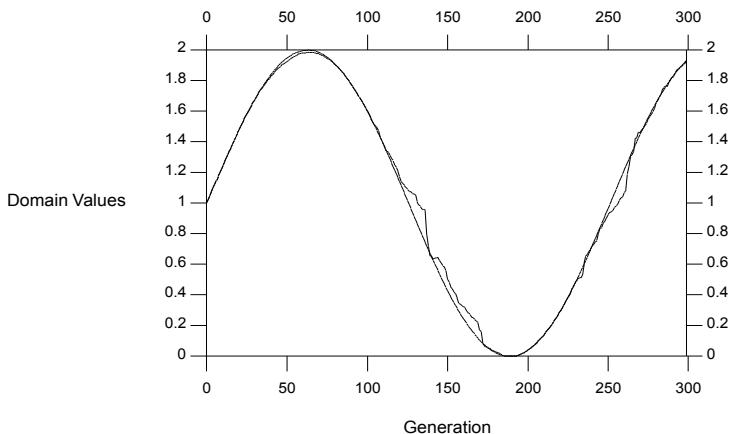  
Figure 1a. Curves of Actual and Estimated Domain Values Giving Function Minimum Over Time Smooth Sinusoidal Line: Actual Domain Value; Jagged Line: Best-of-Generation

# TIME-AVERAGED PERFORMANCE VERSUS TIME Population $= 2 0 0$ , $\mu = 0 . 0 0 1$ , $\alpha = 0 . 0 2 5$

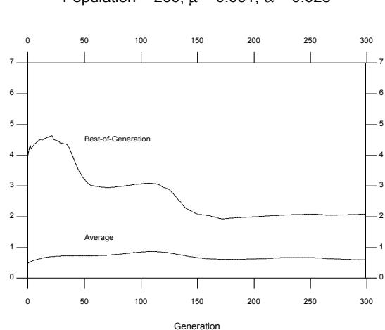  
Time-Averaged Performance $\left( - \mathrm { l o g } _ { 1 0 } \right)$ )   
Figure 1b.

Plots Using Average of Ten Runs Population $\yen 200$ , $\mu = 0 . 5$ , $\alpha = 0 . 0 2 5$ Domain Value Giving Function Minimu $\mathsf { m } \doteq s i n ( \alpha \times G e n e r a t i o n ) + 1 . 0$

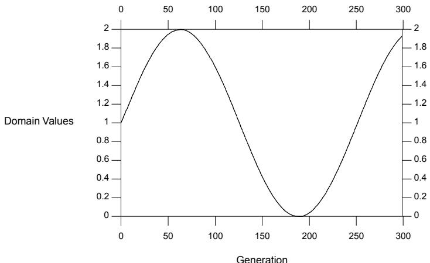  
Figure 1c. Curves of Actual and Estimated Domain Values Giving Function Minimum Over Time The Actual Domain Value and the Best-of-Generation are Indistinguishable

# TIME-AVERAGED PERFORMANCE VERSUS TIME Population $= 2 0 0$ , $\mu = 0 . 5$ , $\alpha = 0 . 0 2 5$

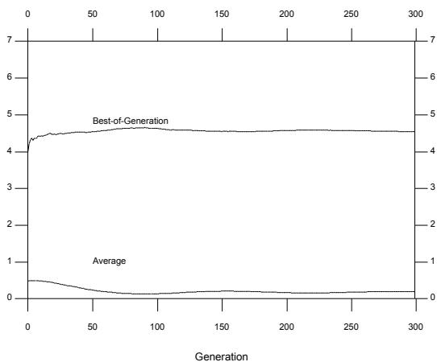  
Time-Averaged Performance (−log10 )   
Figure 1d.

Time-Averaged   
Best   
Performance   
$\left( - \log _ { 1 0 } \right)$

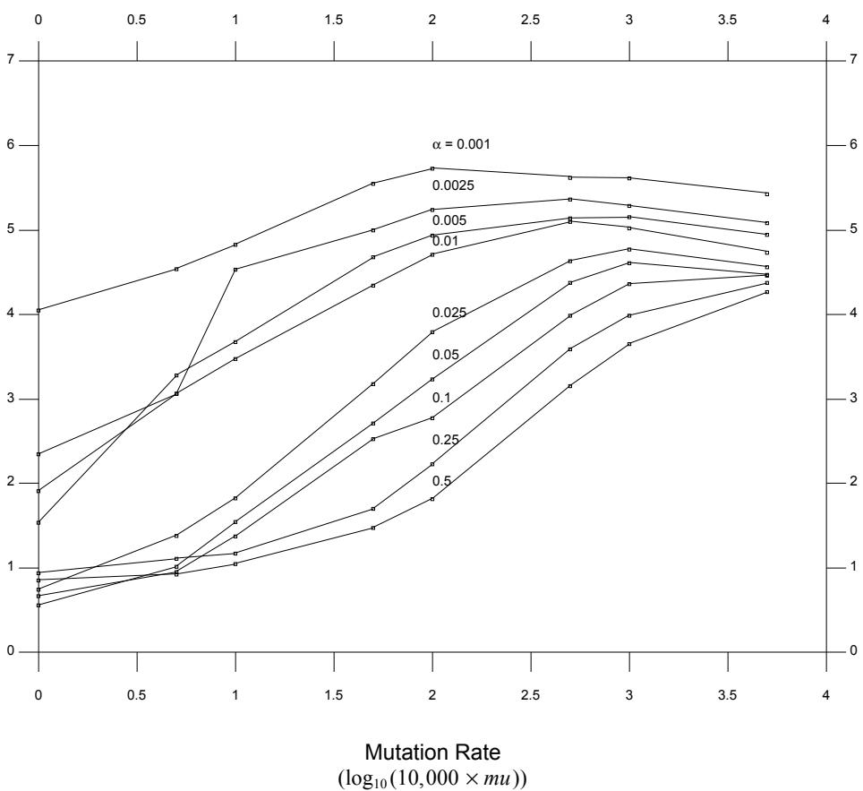  
Figure 2. Last Generation for Various Frequencies of Environmental Change Versus Mutation Rate

We make some key observations:

1. The overall time-average best performance decreases as $\alpha$ increases.   
2. Increasing mutation improves performance for faster changing environments $\mathbf { \alpha } ( \alpha \geq 0 . 1 )$ . We improve the search in a nonstationary environment by increasing population variation through an increase in the mutation rate.   
3. For each $\alpha$ , there is a point at which increasing the mutation rate begins to degrade the time-average best performance slightly. In Figure 2, these points are clear for $\alpha < 0 . 1$ . Overall optimal mutation rates are smaller for slower changing environments than for faster changing ones. For , α = 0.001 µmax $\mu _ { m a x } = 0 . 0 1$ ; for $\propto \infty = 0 . 0 0 2 5 , 0 . 0 0 5 , 0 . 0 1$ , , and for , = 0.005 α = 0.025, 0.05 µmax $\mu _ { m a x } = 0 . 1$ .

Figure 3 shows the time-average of the best performance by generation 300 for De Jong's f1 test function (a parabola having 3 independent variables) (De Jong, 1975). Notice that even when we increase the population size from 200 to 2000, the best-of-generation performance for this harder nonstationary problem is lower given the same rates of change in the environment. The overall characteristics of Figure 3 are similar to Figure 2. We hypothesize that in order to achieve the same level of performance for different optimization problems, the rate of change that the GA can accommodate in the environment decreases as the problem becomes more difficult. Determining the rate of environmental change that the GA can track successfully may provide a measure of the difficulty of the problem. We plan to examine this hypothesis in future studies.

# 5.5 The GA Takes Advantage of Spatial Proximity in Tracking

Next, we run an experiment to demonstrate the importance of having time-dependent optima spatially close to one another. Figure 4 shows the effect of simply changing domain values each generation by some constant Hamming distance. Instead of selecting a domain values so that time-dependent zeroes of the function lie along a sinusoidal path, each generation we choose a new value by randomly selecting a fixed number of loci to be changed (i.e., bit string positions). As we might expect, the time-averaged best performance remains relatively flat for Hamming distances greater than one. Increasing mutation improves the search.

In contrast, Figure 5 shows the resulting time-averaged performance when $h _ { t }$ changes by a constant amount. The change in performance correlates with the change in the domain values. Performance is especially poor for low mutation rates and large $h _ { t }$ .

# 5.6 Using a Simple Adaptive Mutation Operator

As we can see from Figure 5, an extremely high mutation of 0.5 ensures steady performance regardless of the change in $h _ { t }$ . We therefore use a simple control strategy: if the time-average performance worsens, set $\mu = 0 . 5$ ; otherwise, set the mutation rate to the base-line of $\mu = 0 . 0 0 1$ . We repeat the experiment summarized in section 5.4, except that we use this control strategy instead of examining different constant levels of mutation. Specifically, we examine the time-average performance of a parabola having one independent variable for different $\alpha$ using a changing mutation rate. Figure 6a shows the dynamic best-of-generation and average performances for $\alpha = 0 . 0 2 5$ . Figure 6b shows the corresponding change in the mutation rate for an average of ten runs. By comparing Figure 1b with the $\alpha = 0 . 0 2 5$ dotted line in Figure 7, it is clear that the adaptive mutation control strategy produces a better time-averaged best-of-generation performance than maintaining a low mutation rate.

When comparing Figures 1a and 6a, notice that the peaks in the performance correspond to the points where the sine curve reaches its maximum and minimum (at 2 and 0, respectively). The neighborhood surrounding these points corresponds to times when the rate of change in the environment is slower. The shape of the best-of-generation and average curves are similar. Also, notice in Figure 6b that the average mutation rate of the runs is lower at these points. High mutation rates correspond to times where the rate of change in the environment is greatest.

Figure 7 summarizes the time-average best performance for all $\alpha$ tested using the adaptive mutation scheme. For $\alpha = 0 . 1$ the time-average best performance either improves or remains level. For $\alpha = 0 . 2 5$ and $\alpha = 0 . 5$ the time-average best performance degrades quickly at first, and then it degrades slowly. In environments of rapid change, any return to

Population $= 2 0 0 0$ Domain Value Giving Function Minimum $\mathbf { \widetilde { \Gamma } } = s i n \left( \alpha \times G e n e r a t i o n \right) + 1 . 0$

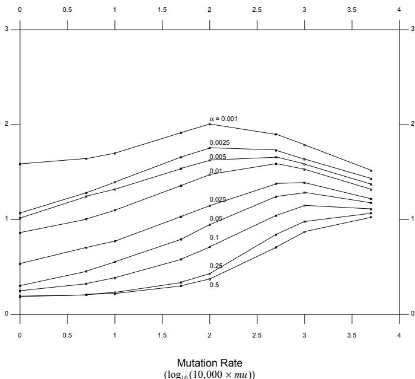  
Figure 3. Last Generation for Various Frequencies of Environmental Change Versus Mutation Rate

Time-Averaged   
Best   
Performance   
(−log10 )

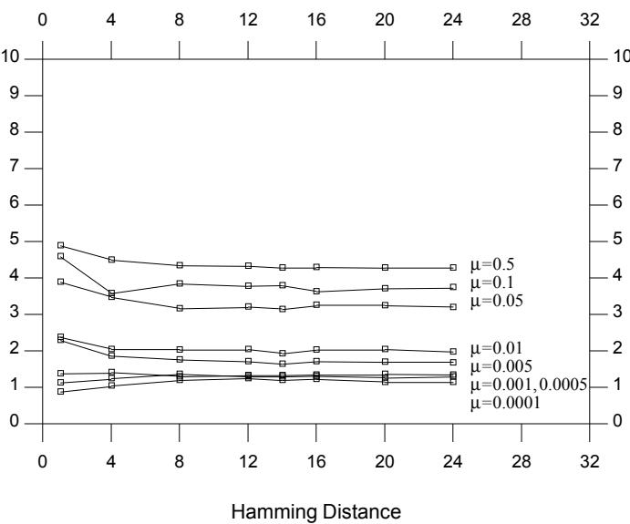  
Figure 4. Last Generation for Various Mutation Rates, $\mu$ Versus Hamming Distance Change in Environment

TIME-AVERAGED PERFORMANCE GIVEN CONSTANT CHANGE IN $h _ { t }$

Domain Value Giving Function Minimum $=$ Change in $h _ { t } \times$ Generation

Time-Averaged   
Best   
Performance   
$\left( - \log _ { 1 0 } \right)$

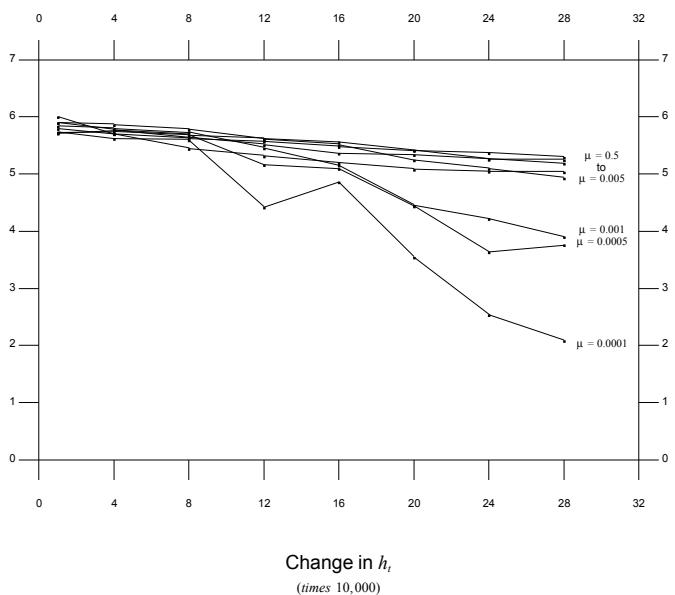  
Figure 5. Last Generation for Various Mutation Rates Versus Linear Rate of Change in Environment

a base-line of $\mu = 0 . 0 0 1$ degrades the performance: the change is so rapid that the GA requires a constant high mutation rate.

# 5.7 Combination Stationary and Nonstationary SDNEs

Finally, we explore how the adaptive mutation scheme works when the environment periodically remains stationary at its current value of $h _ { t }$ ; that is, we examine a combination stationary and nonstationary SDNE maintaining continuity. Figure 8a depicts an environment where $h _ { t }$ remains constant from generation 75 to 125; $h _ { t }$ again remains constant from generation 225 to 300. Figure 8b shows the resulting best-of-generation performance; Figure 8c shows the corresponding mutation rates. Notice that whenever the environment becomes stationary, the best-of-generation performance dramatically improves, and the mutation rate consistently remains 0.001.

Figure 9a depicts a combined stationary and nonstationary SDNE having discontinuities. Notice that when the discontinuities at generations 75, 125 and 225 occur, there is a drop

# TIME-AVERAGED BEST-OF-GENERATION PERFORMANCE CURVES FOR VARIOUS FREQUENCIES IN CHANGING THE OPTIMUM USING AN ADAPTIVE MUTATION OPERATOR

Time-Averaged Best Performance (-log base 10)

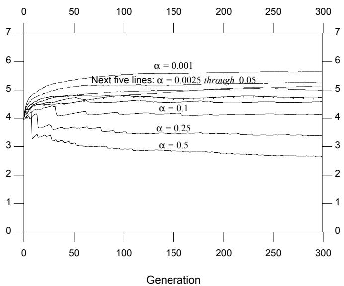  
Figure 7. Using an Adaptive Mutation Rate: If the time-averaged performance worsens, $\mu = 0 . 5$ ; otherwise, $\mu = 0 . 0 0 1$

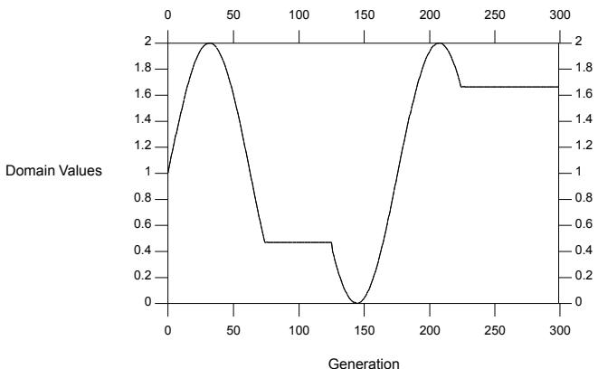  
Figure 8a. GA Best-of-Generation and Domain Value Indistinguishable on Graph

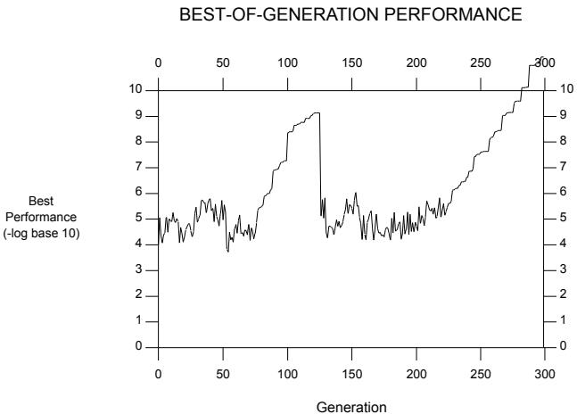  
Figure 8b.

# CHANGE IN MUTATION OVER TIME

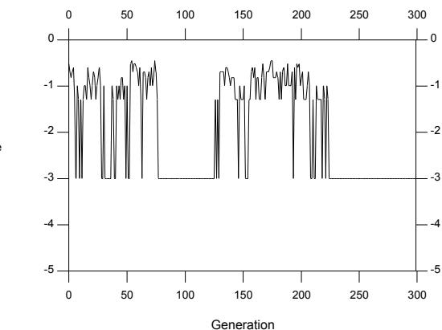  
Figure 8c.

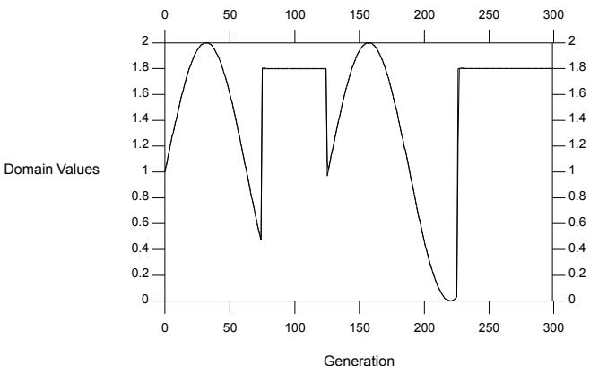  
Figure 9a. GA Estimate and Domain Value Indistinguishable on Graph

# BEST-OF-GENERATION PERFORMANCE

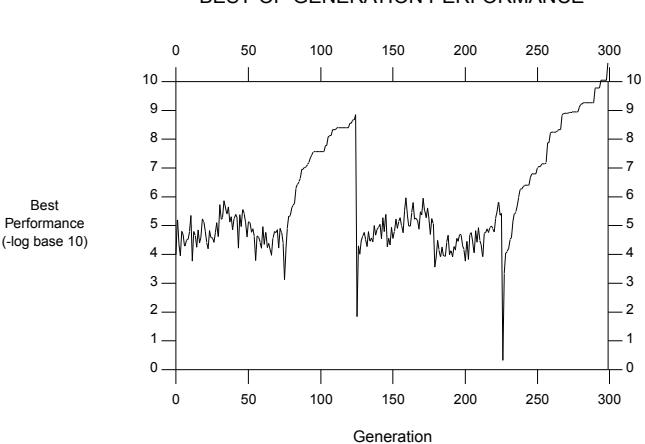  
Figure 9b.

# CHANGE IN MUTATION OVER TIME

Mutation Rate (log 10 )

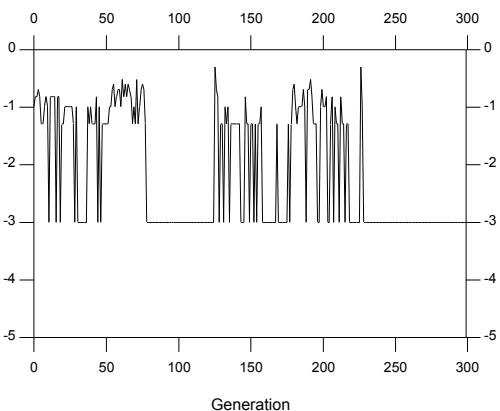  
Figure 9c.

in the best-of-generation performance; however, the GA quickly recovers. Also notice that at generations 125 and 225 there is a correspondingly high spike in the mutation rate.

Figures 8 and 9 demonstrate that the GA rapidly begins to converge to a global optimum whenever the environment remains stationary, regardless of preceding or following nonstationarity periods. During periods of nonstationarity, the performance fluctuates depending on the rate of change in the environment.

# 6 SUMMARY

It is clear from the experiments that the standard GA performs better in stationary environments than in nonstationary ones. Given, however, that the objective of the GA in a nonstationary environment is to maintain a consistently good performance, mutation is a simple mechanism that adds diversity to the GA's population and thus permits the GA to cope with a changing environment. When we consider the GA's best-of-generation performance, it is apparent that the GA is capable of tracking a time-varying optimum without expanding the standard GA's memory, providing the GA significantly increases its mutation rate, i.e., enters hypermutation, and the time optima are spatially close to one another. In other words, hypermutation permits a GA to track an optimum in a continuous SDNE. However, high mutation rates are obviously very disruptive, impairing a GA's overall generational performance. We demonstrate an adaptive mutation operator that gives good best-of-generation performance for both stationary and nonstationary environments, provided the rate of change in the nonstationary environments is not too extreme $\alpha \leq 0 . 1$ . When there is a decrease in the time-averaged best-of-generation performance, the GA enters hypermutation to maintain the best-of-generation performance at a steady level; when there is an increase or no change in the time-averaged best-of-generation performance, the GA uses a low mutation rate. As a result, the application of the mutation operator reflects the degree of stationarity in the environment:: for periods of stationarity, mutation is low so that the GA is able to find a time-invariant (spatial) optimum; for periods of nonstationarity, mutation increases to permit the GA to track temporal optima.

# 7 FUTURE STUDIES

As a direct extension of this work, we plan to perform a sensitivity analysis of the current results. In particular, we plan to examine: (1) the use of a non-zero scaling window in the selection procedure, (2) functions that are both spatially and temporally multimodal, (3) other kinds of combination stationary and nonstationary SDNEs, (4) modifications of the existing adaptive mutation operator and other new control strategies.

This study demonstrates the useful role of mutation as a simple mechanism for coping with continuous SDNEs. However, to improve the overall performance of the GA, we also need to investigate ways of expanding the memory of the GA. One technique for expanding the memory of a GA not yet explored in the context of a nonstationary environment, either MSE or SDNE, is to create population niches through speciation. We know that this technique successfully finds the several near-optimal peaks of multimodal functions (Deb, 1989). For spatial optimization, the final population distribution reflects the peaks (or valleys) of the multimodal function. Similar population members form population niches. The relative sizes of the population niches indicate the relative heights of the objective function's peaks. In future studies, we plan to explore the application of this technique to temporal optimization. By using a generational selection policy of replacing members with similar ones having better performance, the population retains enough diversity to accommodate a variety of environmental conditions. The objective function represents an environmental resource constraint: population members specialize to function well in particular environmental niches. In general, the number of individuals in each species should be proportional to the combination of the quantity of each resource offered by the environment (a spatial optimum) and the frequency of a particular environmental situation (a temporal optimum).

In future studies we also plan to examine the use of diploidy in continuous SDNEs. In addition, we may directly extend the work of Goldberg and Smith. Their GA performs optimization in discontinuous MSEs by increasing the information capacity of each population structure. The optimization information occurring at a prior time is retained in the population structures. If we wish to directly extend their approach to an environment having a large number of Markovian switching states, or a large number of states in a SDNE, we would (1) use population structures having more than one level of recessive information depending on some estimate of the number of possible optima, and/or (2) use more complicated dominance operators, such as partial dominance and codominance operators, to transform a population structure into a form that can be evaluated by the environment.

# Список литературы

Karl Johan Astrom and Bjorn Wittenmark. (1989). Adaptive Control. Addison-Wesley Publishing, Reading, MA.

Kalyanmoy Deb and David E. Goldberg. (1989). “An Investigation of Niche and Species Formation in Genetic Function Optimization,” pp. 42-50 in Proceedings of the Third International Conference on Genetic Algorithms and Their Applications, (J. David Schaffer, ed), Morgan Kaufmann, San Mateo, CA.

Kenneth A. De Jong. (1975). “An analysis of the behavior of a class of genetic adaptive systems,” Dissertation Abstracts International 36 (10) (5140B). Doctoral dissertation, University of Michigan.

David E. Goldberg and Robert E. Smith. (1987). “Nonstationary function optimization using genetic dominance and diploidy,” pp. 59-68 in Genetic Algorithms and Their Applications: Proceedings of the Second International Conference on Genetic Algorithms (John J. Grefenstette, ed.), Lawrence Erlbaum Associates, Hillsdale, NJ.

John J. Grefenstette. (1983). A User’s Guide to Genesis. Technical Report CS-83-11, Computer Science Department, Vanderbuilt University.

Kumpati Narendra and M. A. L. Thathachar. (1989). Learning Automata: An Introduction, Prentice Hall, NJ.

Athanasios Papoulis. (1965). Probability, Random Variables, and Stochastic Processes, McGraw-Hill, NY.

Kathleen Pettit and Elaine Swigger. (1983). “An analysis of genetic based pattern tracking and cognitive-based component tracking models of adaptation,” pp. 327-332 in Proceedings of the National Conference on Artificial Intelligence.

Robert E. Smith. (1988). An Investigation of Diploid Genetic Algorithms for Adaptive Search of Nonstationary Functions, Clearinghouse for Genetic Algorithms, Department of Engineering Mechanics, The University of Alabama, Tuscaloosa, AL. (Master’s Thesis, TCGA Report No. 88001.)

W. Stolzenburg. (1990). “Hypermutation: Evolutionary fast track?,” Science News 137, No 25, pp. 391.

James D. Watson, Nancy H. Hopkins, Jeffery W. Roberts, Joan Argetsinger Steitz, and Alan M. Weiner. (1987). Molecular Biology of the Gene. The Benjamin/Cummings Publishing Company, Inc., Menlo Park, CA. (Fourth Edition.)