# Investigation of a Multiple Chromosome Evolutionary Algorithm for Bus Driver Scheduling and Other Problems

Emma Collingwood

MSc Information Technology: Knowledge Based Systems

Department of Artificial Intelligence University of Edinburgh

# Abstract

Genetic Algorithms have recently been used to solve various transport scheduling problems such as bus driver scheduling. These algorithms have so far produced good results on small problems, but as the problems become larger, they become more difficult to solve.

A method of improving the performance of the genetic algorithm may be to 'reinvent' it, using inspiration from complex biological systems to change both the way the problem is represented and the way the algorithm operates. The novel feature of this new representation is that it incorporates redundant information into the genetic model by using a genotype that contains multiple chromosomes. This alternative genetic algorithm could also be used to solve other problems that have traditionally been difficult for the standard algorithm to solve.

This work investigates the use of such a genetic algorithm on various common problems before applying it to the bus driver problem.

# Acknowledgements

I would like to thank my supervisor Dave Corne for all his help and guidance during the project. I would also like to thank Louise Pryor for reading and commenting on draft versions of this text, and Jim Hart for proof reading it several times.

I must also thank Andrew Tuson for providing me with endless books and papers to read without having to go to the library once.

This MSc was funded by EPSRC award no. 94415591.

# Table of Contents

# 1. Introduction 1

1.1 The Problem .   
1.2 Objectives .   
1.3 Guide to reading this thesis 2   
1.4 The Genetic Algorithm . 3   
1.5 The Basic Algorithm . . 3   
1.5.1 The Biological Version . . . 3   
1.5.2 The Artificial Version . . . . . 4   
1.6 Terminology . . . . 5   
1.7 Representation . . 6   
1.8 Fitness . . . 6   
1.9 Operators . 6   
1.9.1 Reproduction . . 7   
1.9.2 Selection . . 7   
1.9.3 Crossover . . . 8   
1.9.4 Mutation . . . . 8   
1.10 Maintaining Diversity — A Problem with standard GAs . . . . . . 9

# 2. Multiploidy 11

2.1 Overview . . 1   
2.2 Motivation and Biological Inspiration . 1   
2.3 Application of Diploidy To Genetic Algorithms . . . 12   
2.3.1 A Brief Literature Review 12   
2.3.2 Advantages of a Diploid System . 14   
2.3.3 Extending These Ideas — Multiploidy . . . 15

# 2.4 Implementing Multiploidy . . 15

2.4.1 Multiploid Representation . . . 16   
2.4.2 Initialisation . . 18   
2.4.3 Crossover Operator . . . 18   
2.4.4 Mutation Operator . . . 20

# 2.5 Typical Problems . . . . 21

2.5.1 The Indecisive Problem . . . . . 21   
2.5.2 The Max Problem . . . . 21   
2.5.3 Deceptive Problems . . . . . 22

# 3. Experiments on the Indecisive Problem 24

3.1 Overview . . . . 24   
3.2 Experimental Setup . . 25   
3.3 How Many Attractors Can A Multiploid GA Cope With? . . . . . . 26   
3.3.1 Results . . . 26   
3.4 Can We Make The Problem Even Harder? 28   
3.4.1 Results . . . 28   
3.5 What Is Directing The Multiploid To Good Solutions? 29   
3.5.1 Results . . 29   
3.6 Are There Other Ways of Maintaining Diversity? 30   
3.6.1 Results . . . 30   
3.7 Conclusion . . . . 32

# 4. Experiments on the Max Problem 37

4.1 Overview. . . 37   
4.2 Experimental Setup . 38   
4.3 How Long is Diversity Maintained? 38   
4.3.1 Results . . 38   
4.4 How Do The Operators Affect Max Fitness? 39   
4.4.1 Results . . . 40   
4.5 Does The Size of The Mask Affect Max Fitness? 41   
4.5.1 Results . . 42   
4.6 Conclusion . . 43

# 5. Experiments on the Deceptive Problem 46

5.1 Overview . . . . 46   
5.2 Experimental Setup . 46   
5.3 How Does the Multiploid Perform? 47   
5.3.1 Results . . 48   
5.4 Does Changing the Mask Size Improve Things? 48   
5.4.1 Results . . . 48   
5.5 Conclusion . . . 49

# 3. Set Covering Problems 53

# 6.1 Overview. 53

# 6.6 Modifications to PGA Code . . . . . . . . 57

6.6.1 Reading in Scheduling Data . . . 58   
6.6.2 Initialisation . . 59   
6.6.3 Mutation . . . 59   
6.6.4 Fitness Function . . . . 59   
6.6.5 Operators And Defaults 60

# 6.7 Experiments . 61

6.7.1 Results Obtained Using SCPGA . . . 61   
6.7.2 Minimum Number of Shifts .. 61   
6.7.3 Minimum Cost . . . 63

# 6.8 Conclusion . . 65

# 7. Summary 67

7.1 Overview . . . 67   
7.2 Were The Aims Achieved? 67   
7.3 Suggestions For Further Work . 69   
7.3.1 Adapting Convergence Criteria of PGA . . . 69   
7.3.2 Further Test Problems . 69   
7.3.3 More Work On Deceptive Problems . 69   
7.3.4 Set Covering Problems . . 70

# List of Figures

1-1 An example chromosome . . 5   
1-2 One-Point Crossover Mechanism . 8   
21 Hollstein's Triallelic Dominance Map 13   
22 A Structured Chromosome 16   
23 Example of a Multiploid Genotype 17   
24 A Multiploid Genotype with Mask and Chromosomes of Different   
Length. 18   
25 Multiploid Crossover - Example 1 . 19   
26 Multiploid Crossover - Example 2 . . 19   
31 Two Attractor Problem with Bias $( 7 5 \% )$ 28   
3-2 Indecisive Problem with 2 attractors: Haploid genotype . . . . 31   
33 Indecisive Problem with 2 attractors: Diploid genotype . . . . . . . 32   
34 Indecisive Problem with 2 attractors: $\cdot _ { 4 } \cdot$ ploid genotype . . . 33   
3-5 Multiploid Structure At End Of GA Run . 34   
3-6 Mutation of Mask to Give Higher Fitness . . . 34   
3-7 Crossover of Chromosomes to Give Higher Fitness . . . 35   
38 Ability of Multiploid to Adapt to Environment . 36   
4−1 Max Fitness vs % of Chromosomes That Crossover is Applied To . 40   
4-2 Max Problem: Variation in Max Fitness . 41   
4-3 Max Problem: Variation in Max Fitness with Mask Size . . . . . . 42   
4-4 Variation of Max Fitness And Mean Evaluations With Ploidy Size   
For The Max Problem . . .. 43   
51 Deceptive Problem: Variation in Max Fitness with Operators . . . . 47   
5-2 Deceptive Problem: Variation in Max Fitness with Mask Size . . . . 49   
5-3 Max Fitness of Deceptive Problem vs Mask Size . . . .. 50   
5-4 Diploid Shown with Different Mask Sizes . . . . . . 51   
6-1 A Set Covering Problem . . . ... 56   
6−2 Typical Chromosome In A Set Covering Problem . . .. 58   
6-3 BDS Problem: Variation of Cover With Ploidy and Mask Size . . . 62   
6−4 BDS Problem: Graph of Mean Evaluations vs Ploidy . . . . . . . . 64

# List of Tables

21 The Order Three Deceptive Problem . . 22   
3-1 Operators Used . . . 24   
32 Indecisive Problem: 2 Attractors . . . . , 26   
33 Indecisive Problem: 3 Attractors . . . . 26   
34 Indecisive Problem : 4 Attractors . . 27   
35 Indecisive Problem: Effect of Varying Operators . . . . 29   
41 Max Problem: Mean Evaluations Before Convergence . . . 39   
6-1 Operators Used For BDS . . 60   
6-2 BDS Problem: Mean Number of Evaluations . . . 63   
6-3 BDS Problem: Mean Costs . . . 65

# Chapter 1

# Introduction

# 1.1 The Problem

A typical bus makes a number of journeys along a particular route every day. A local authority may have a large number of buses scheduled along different routes making a significantly large number of journeys altogether. These journeys must be covered using a limited number of bus drivers in such a way that a variety of regulations, such as shift times, meal breaks, time spent continuously driving, etc., are not broken. Covering all the work to be done while keeping within the constraints imposed by the regulations is known as the Bus Driver Scheduling problem. It is a specialisation of a class of problems generally known as Set Covering Problems [Beasley 87]. The quality of any solution obtained can be measured by considering a number of economic factors such as the number of drivers and shifts required to produce the solution, and the overall cost of the solution in terms of factors such as wages and overtime.

# 1.2 Objectives

A significant amount of work has been done on the Bus Driver Scheduling (BDS) problem by Tony Wren and colleagues at Leeds University, primarily using operational research techniques. However, recent work using Genetic Algorithms (GAs), [Wren & Wren 95] has shown some promising results. The original objective of this project was to look further into this work, examining the use of GAs in solving realistic scheduling problems and trying to improve on results already obtained.

The most obvious approach to take in solving this problem is to try to design new heuristics to direct the search towards solutions that involve the minimum number of driver shifts, and do so in the shortest possible time. While some work has been done using this approach by [Beasley & Chu 95], experience tends to show that it is difficult to invent further heuristics that can be successfully implemented to produce better solutions. The reasons are discussed in some detail in Chapter 6, but the basic idea is that the problem tends to be influenced by several competing factors which work against each other, making it difficult to find good heuristics that take all factors into account.

Therefore, the main aim of this project was to adopt a different approach altogether and try to 'reinvent the GA' in the hope that an alternative method of representing and manipulating the genetic building blocks that make up the current basis of most genetic algorithms would lead to improved results both in the solutions obtained and the time taken to reach them. The major part of the project was thus spent designing an alternative GA and investigating its performance on a number of standard problems that are typically solved by genetic algorithms. Having found encouraging results from these investigations, the idea was then applied to the BDS problem.

# 1.3 Guide to reading this thesis

Chapter 1 continues with a brief introduction to the Genetic Algorithm, in order to familiarise the reader with the basic concepts. It also expands on some of the problems inherent in the GA mechanism as it stands.

Chapter 2 describes an alternative type of genetic representation, inspired from biological systems. It looks at the benefits of such a representation, and the ways in which it could be implemented.

Chapters 3, 4, and 5 describe experiments performed on three problems the Indecisive Problem, the Max Problem, and the Deceptive Problem — to test the effectiveness of the new GA. Each chapter details the experiments conducted, and presents the results found. Each chapter is concluded with an analysis of the results obtained, and offers possible explanations for the results.

Chapter 6 contains an introduction to set covering problems, and discusses the BDS problem in more detail. It then describes the methods used in applying the new genetic representation to BDS problems, and details the experiments performed. The chapter is concluded with a discussion of the results obtained.

The final chapter, Chapter 7, summarises the original aims of the project, and looks at the extent to which they have been achieved. It is concluded with a number of suggestions for further work that could be carried out.

# 1.4 The Genetic Algorithm

The GA was invented by Holland at the University of Michigan in 1975, [Holland 75], and is a very eficient algorithm for investigating large search spaces. The theory of the genetic algorithm is treated in some detail by [Goldberg 89]. A brief outline of the basic algorithm is given here and is followed by a discussion of some of the problems encountered using standard GAs which have led to alternative representations being tried.

# 1.5 The Basic Algorithm

The GA is a search algorithm loosely based on the mechanics of natural selection, [Darwin 59], and genetics. It is not intended to be an exact model of evolution, but is inspired by some of the biological ideas involved in evolutionary theory.

# 1.5.1 The Biological Version

The principle behind natural selection is exceedingly simple: A hereditary trait that allows an individual to produce more offspring will be represented more frequently in the next generation. To quote Thomas Huxley, one of Darwins greatest admirers,

"How utterly simple, how extremely stupid not to have thought of that."

The average number of offspring — termed the fitness — increases in the population as variants with less than average fitness drop out. The members of a species that tend to survive are those that are best able to adapt to their environment. The characteristics which increase the fitness of a species thus tend to get passed down through further generations and begin to dominate. Occasionally, variants mutate, allowing the introduction of new features and characteristics.

[Sigmund 95] provides a nice analogy for the system: He compares the individuals in a population to the competitors in a high jump competition. The height of the bar denotes the average fitness of the population. In every round, (i.e. generation), the height of the bar is raised — only the best competitors can clear it, and so the field of competitors shrinks, as the less fit variants must drop out. The best variant is eventually bound to win. New participants are allowed to join in the game at any time — these are equivalent to the variants that are introduced by mutation.

# 1.5.2 The Artificial Version

The idea behind a GA is exactly the same — find those parts of a solution that tend to make it a good one, and gradually increase the number of good parts in it until the best answer possible is reached. The GA operates by initially generating a random pool of solutions to the problem being considered. Good solutions from this pool are chosen, and are allowed to breed to produce children which will contain a mixture of the characteristics of the parent solutions. The quality of the children is evaluated by measuring their fitness.1 If the children are of high fitness, they are inserted into the population, perhaps replacing the worst members. This evaluation/breeding cycle is repeated until eventually high quality solutions evolve.

The algorithm can be defined as follows:

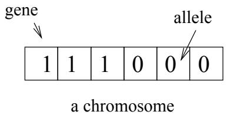  
Figure 1-1: An example chromosome

1. Create a random pool of solutions.

2. Calculate the fitness of each solution.

3. Stop if either

• the pool has converged — i.e. all the members have the same fitness.

one of the members is of maximum fitness.

4. Select pairs of solutions and breed them to produce children.

5. Mutate the children (optional).

6. Insert the children into the pool.

7. Repeat from (2).

# 1.6 Terminology

This brief description of some biological terminology should help make the following sections clearer, and will be used throughout the remainder of the thesis. The reader is referred to figure 1-1.

The genetic information that is used as instructions for building something such as an organism is known as a genotype. This information is gathered into chunks known as chromosomes which are themselves made up of genes. Each gene has a position within a chromosome and takes some value from a a set of possible values. This value is known as the allele. A haploid structure is one in which the genotype is composed of a single chromosome.

There is some confusion between the terminology used in nature and that used in the genetic algorithm world. Whereas in nature the term genotype refers to a set of chromosomes, in a GA the term is used to refer to a single chromosome and the words chromosome and genotype tend to be used synonymously.

# 1.7 Representation

In a typical GA, a solution to the problem being considered must be represented as a chromosome. Typically this might be a binary string in which each gene is set to 0 or 1, but it is equally feasible to have each gene in the chromosome representing a character or some other number. The length of the chromosome represents the length of the problem solution.

# 1.8 Fitness

The quality of a given chromosome as a solution to the problem is determined by measuring its fitness — this is simply a numeric value that is calculated by a problem specific fitness function designed by the programmer. For example, the fitness of a chromosome in a problem where the goal is to maximize the number of '1' genes in the chromosome might simply be the total number of '1' genes present in the chromosome.

# 1.9 Operators

A simple GA is implemented by creating an initial random population of chromosomes and defining a set of operations that will take this initial population and generate successive populations that hopefully improve over time. These operators are described below.

# 1.9.1 Reproduction

Reproduction is the method by which new chromosomes are created from chromosomes already existing in the pool. Many methods of reproduction exist and are described at length in the literature. The most common methods are one at a time or steady state reproduction where a newly created child replaces the least fit member of the population, and Generation Based reproduction where the entire population of chromosomes gets replaced by children at each cycle. The method used in all experiments described in this thesis was Steady State reproduction.

# 1.9.2 Selection

There are also various methods of selecting parent genes for reproduction — again these are well documented, for example by [Goldberg 89]. Two selection operators are used in this study.

In Rank based selection, the chromosomes in the population are ranked according to their fitness and then parents are chosen with a probability proportional to their ranking.

In Tournament based selection, $n$ chromosomes are chosen at random from the population (where $n$ is known as the tournament size). This is termed the tournament, and the winner is the fittest of those chosen. The winner then becomes a parent. A new tournament is held for each parent that is required. Increasing the tournament size results in more competition (an increase in selection pressure) and leads to an increase in the number of good (i.e. fit) chromosomes being chosen as parents.

Another common method of selection, though not used in this work, is roulettewheel selection. In this method, a chromosome is chosen with a chance proportional to its relative fitness. This method is very sensitive to the range of absolute fitness values. For instance, if the fitness range is 1000 to 1100, all chromosomes are nearly equally likely to be chosen, whereas if the chromosomes' fitness values are in the range 0-100, good chromosomes have a much higher chance of being chosen.

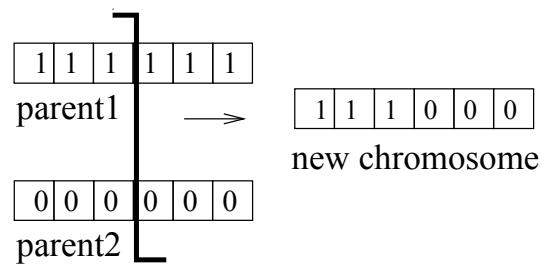  
Figure 1-2: One-Point Crossover Mechanism

# 1.9.3 Crossover

Crossover is the mechanism by which children are produced from parent chromosomes. The simplest form is known as one-point crossover, and is illustrated in figure 1-2. In this method, a position in the chromosome is selected randomly, and the child chromosome is formed by copying each gene from the start of the first parent up to the cross point, and each gene beyond the cross point in the second parent. An alternative form of crossover is two-point crossover, in which two crossover points are randomly selected, and sections of the new chromosome are taken from alternate parent genes between crossover points. In uniform crossover, each gene is copied from one of the two parents, but the choice of parents is random.

# 1.9.4 Mutation

Mutation provides a valuable way of reintroducing information into a chromosome that has been lost through crossover. Mutation is simply the occasional (with small probability) random alteration of a gene within the chromosome. Mutation can be valuable, but is generally regarded as of secondary importance in the overall mechanism of the genetic algorithm. The rate of mutation is typically of the order of 1 gene in 100, as high mutation rates would simply reduce the problem to that of a random search.

# 1.10 Maintaining Diversity — A Problem with standard GAs

The problem with many implementations of standard GAs is that as the GA progresses, the improvement in the quality of solutions in the pool becomes slow as the genetic diversity of the initial population decreases through the process of natural selection. This presents something of a quandary — without genetic variability, the natural selection process is not going to work. When the diversity is lost, the genetic process can become trapped at a local optimum. If the population converges prematurely (i.e. all chromosomes in the population become identical) the search process can halt before the true optimal solution is found. Once the population has converged, genetic operations such as crossover are no longer effective. New children cannot possibly be produced by crossing two identical parents.

Mutation can possibly reintroduce some diversity, but the effect of simple bit mutation is generally too small to overcome the attraction of local optima, hence mutation does not tend to produce significantly fitter individuals. The mutation rate can be increased, but this simply moves the algorithm towards a random search and is neither efficient nor effective. Using a GA with a high mutation rate, evolution of the population can take a long time, and the final answers produced may well fall short of the optimum.

Modifications to the GA to prevent premature convergence have been suggested by previous work. The research by [Goldberg 89] mainly looked at transforming the fitness function by various methods such as scaling and sharing. One such method is linear fitness scaling. The fitness values of all the chromosomes are adjusted such that the best individual gets a fixed number of expected offspring, and so is not allowed to dominate the population too early. The fitness values of the other members are altered to ensure that the correct total number of new strings are produced. Exceptionally fit individuals are thus prevented from reproducing too quickly, and causing premature convergence.

[DeJong 75] investigated alternative selection mechanisms such as generation gap selection. In this method, a parameter G, the generation gap, is defined

that controls the fraction of the population that gets replaced at each generation.   
DeJong found that high values of G produced better results in optimisation studies.   
This equates to having a non overlapping population model.

[Fang et al. 93] attempted to maintain the diversity in a GA when testing Job Shop Scheduling Problems using gene-variance based operator targeting. This method works by measuring the diversity of genes at each position of the genotype in the pool, and choosing the actual point for crossover or mutation based on these values. By targeting genes in the chromosome where diversity is low, an improvement in results is obtained

The main goal of this thesis is to tackle the problem of maintaining diversity in the population by introducing a different genetic representation into the basic algorithm, inspired by examining the genetic makeup of biological organisms. This genetic model is known as a 'multiploid' and is discussed in detail in the next chapter.

# Chapter 2

# Multiploidy

# 2.1 Overview

This chapter begins with a discussion of what constitutes a multiploid genotype, and the motivation for implementing this kind of structure in the Genetic Algorithm. It discusses briefly some of the features found in biological systems that provide the inspiration for this type of work. It goes on to look at possible ways of extending an existing software program for implementing Parallel Genetic Algorithms (PGA) to include representations of multiploid chromosomes. A number of problems that are traditionally 'difficult' for a GA, and hence suitable candidates for testing a new type of GA, are then discussed. These problems will be used as the basis for the experiments described in later chapters.

# 2.2 Motivation and Biological Inspiration

The majority of research into Genetic Algorithms so far has been done using as a model the simplest type of genotype in nature — the haploid genotype, which contains a set of single chromosomes. However an alternative genotype also exists in many natural systems — the diploid genotype. This genotype contains two sets of single chromosomes, giving an alternative choice for every gene in the actual genotype that is expressed. A dominance operator determines which of the two possible chromosomes is active at a particular position in the genotype. Although this representation appears to carry redundant information, it has been shown in biological systems that this redundancy can act as a kind of long term memory, allowing previously good or fit solutions to be remembered.

The existence of such a 'memory' has proved very useful for many biological organisms. For example, organisms that are most able to adapt to changing environmental conditions by remembering previous states are likely to be the most capable of surviving. This is illustrated by examining the shift in population balance of the peppered moth during the Industrial Revolution in Great Britain. Prior to the Revolution, the wild form of this moth had white wings with black specks. This provided good camouflage for the moth against predators when it was found in its natural habitat of lichen-covered trees. However, during the Industrial Revolution, a great many moths were caught around industrial towns which had black wings. This form was advantageous in environments where the industrial pollution had killed off the lichen on the trees. The black form of the moth rapidly spread until the moth population was predominantly black in industrial areas — in rural areas however, the population was still generally of the speckled form. The gene that caused this blackness was not a sudden invention in response to the changing environment — it had existed previously in the moth (perhaps from a time when the moth had lived in lichen-free forests). The black gene had simply been held in abeyance, as selection pressure favoured the speckled form. Once conditions became favourable for the black gene, it was able to spread quickly throughout the population.

# 2.3 Application of Diploidy To Genetic Algorithms

The existence of many successful organisms in nature containing such diploid structures has inspired the investigation of the application of such genotypes to the genetic algorithm.

# 2.3.1 A Brief Literature Review

A historical survey of the application of diploidy and dominance to genetic algorithms is covered in detail by [Goldberg 89]. A brief summary of the more interesting work follows:-

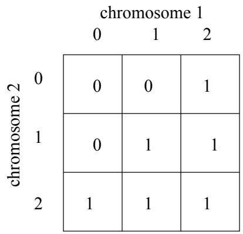  
Figure 2-1: Hollstein's Triallelic Dominance Map

[Bagley 67] used a diploid chromosome pair that was decoded to a single phenotype by a variable dominance map. Each chromosome had a dominance map encoded into it, and which allele was dominant at a particular position was determined by comparing dominance values at each position. The largest dominance value 'won' the competition. Unfortunately he found that the dominance map tended to fixate early in his simulations which reduced selection of a gene from the pair of chromosomes to a somewhat arbitrary tie-breaker competition. This led to inconclusive results.

[Rosenberg 67] attempted a more biological study which tried to model biochemical interactions. Dominance was determined as a result of the presence or absence of particular enzymes which could inhibit or facilitate a biochemical reaction, and not as a separate effect.

[Hollstein 71] used an elegant scheme in which each locus could take one of three allele values (0,1,2). A '2' indicated that a '1' allele was dominant, whereas a '1' indicated that the '1' allele was recessive. In this scheme , both 2s and 1s map to 1, but 2 dominates 0 and 0 dominates 1 as represented in figure 2-1. He found that this mechanism increased population diversity but did not give a significant improvement in overall performance when tested with stationary functions.

More recently, work by [Goldberg 89] has found improved results using diploid genotypes when solving problems in which the environment changes with time. [Dasgupta & McGregor 93] studied the use of a structured GA on solving deceptive problems [Goldberg 87] and also found promising results.

# 2.3.2 Advantages of a Diploid System

An obvious extension to these ideas is to try and exploit the built in capability of the diploid genotype to carry extra 'redundant' information. This information could provide a mechanism for genetic evolution in which diversity is maintained through the implicit genetic variation built into the genotype. Maintaining a population with high diversity could increase the probability of the GA reaching an optimum solution before the population converges prematurely. A second possible benefit is that the increased diversity of the population could allow alternative solutions to evolve, with both solutions being encoded in the genotype but one of the solutions being dominant. Again we can refer back to biological systems for examples. For example, blue eyed children can have two brown eyed parents. The blue eyes must be inherited from some more distant ancestor and passed down through the parents without being expressed in their bodies. The brown eyed gene is dominant, but if a child happens to receive a recessive blue eyed gene from both its parents, then it will have blue eyes.1

With regard to genetic algorithms, the ability of a genotype to contain 'dual solutions' is nicely illustrated by considering a problem which has the following fitness function for evaluating a binary chromosome:

example-fitness-function add up number of zeros in chromosome to give X; add up number of ones in chromosome to give Y; subtract one from X. return larger of X and Y   
2

The optimum solution to this problem is a chromosome in which every gene is set to 1. However, there are two attractors for this function: a chromosome that contains all zeros is almost (but not quite) as attractive as the all ones solution, and it is highly likely that a population could evolve towards this false optimum. A haploid GA will probably find the all ones actual optimum a little more than half the time. A diploid GA however, ought to be much less likely to get stuck at the all zeros solution. Its more diverse population could allow both solutions to evolve at the same time, with the effect that the fitter all 1s solution should gradually be picked out of the population by the fitness function. Eventually, the all 1s solution will become dominant. Theoretically, the diploid GA should thus reach solutions that contain a majority of ones in a much greater percentage of runs than the haploid GA. This problem is known as the 'Indecisive Problem'. The problem itself was suggested by Dave Corne, the name by Andrew Tuson. It is a useful test problem and described in more detail in section 2.5.1.

# 2.3.3 Extending These Ideas — Multiploidy

There is no reason why the notion of diploidy cannot be further extended to include genotypes which contain multiple sets of chromosomes — such a genotype is referred to as multiploid, or sometimes polyploid. Indeed, there are many examples of multiploid genotypes found in the natural world. Plants, for example, generally have at least four chromosomes in their genotype, and it is common to find as many as deca-ploid genotypes in some varieties of corn. Maize, despite its obvious difference in complexity to a human with its diploid genotype, has a 10-ploid genotype.

# 2.4 Implementing Multiploidy

A piece of software known as PGA (Parallel Genetic Algorithm) was created for testing GAs by Geoffrey H. Ballinger. It has been maintained and much further developed by Peter Ross, and is a suitable testbed for testing genetic algorithms on a number of inbuilt problems. It provides flexibility by allowing the user to modify and select various parameters such as crossover type, mutation rate, population size, etc. Its modular form allows relatively easy addition of new operators and problems. It was therefore chosen as a starting point on which to base this work. Adaptation of the existing PGA code required the following stages:

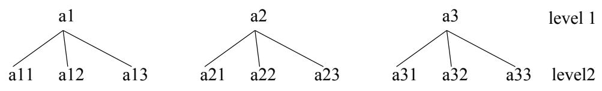  
Figure 2-2: A Structured Chromosome

1. Define a new genotype representation — a multiploid   
2. Implement a method of creating an initial population of multiploids   
3. Adapt the crossover and mutation operators to deal with multiploids rather than chromosomes.

# 2.4.1 Multiploid Representation

Previous work by [Dasgupta & McGregor 93] used a 'structured representation'. In this model, the chromosome is interpreted as a hierarchical structure, in which high level genes activate or deactivate sets of lower level genes. This model is shown in figure 22.

This hierarchical structure can then be represented as a 'flat' chromosome. In the diagram below, the first 3 genes of the chromosome are high level genes which act as a control region to express subspaces at the lower level. A gene that is expressed is indicated in bold type.

# (al a2 a3 a11 a12 a13 a21 a22 a23 a31 a32 a33) A Chromosome

Genes that are not active remain in the structure and are carried through to subsequent generations.

It was decided to loosely base this work on Dasgupta's ideas, rather than try to implement them exactly for a number of reasons. First, although his work [Dasgupta & McGregor 93] compares the time complexity of his structured GA

mask: 0 0 0 0 0 111 1 1 chromosome[0] : a a a a a a a a a a chromosome[1] : b b b b b b b b b b actual : aaaaabbbbb

with an ordinary GA and finds an improvement, it does not indicate whether or not the structured GA is actually capable of finding solutions that an ordinary GA cannot. Second, his work does not extend this structured approach beyond two levels.

A simpler and more logical approach seemed to be to define a 'multiploid' structure in which there are $n$ possible chromosomes, and a mask which defines which of the $n$ chromosomes has the dominant gene at a particular position in the actual chromosome. The actual chromosome can then be constructed by reading along the mask, and placing the allele from the equivalent position in the indicated chromosome into the actual chromosome. This is illustrated in figure 2-3. In this case, the term genotype refers to the complete multiploid structure — that is, it includes the mask and each possible chromosome.

In figure 23, the length of the mask is equivalent to the length of the chromosome. Every gene in the mask is initialised, ensuring the final chromosome is of the required length. In Dasgupta's representation, each allele in the 'mask' part of his chromosome represents groups of alleles in the remainder of the chromosome. This idea can be incorporated into a generalised version of the above representation by allowing the mask to be of shorter length than the possible chromosomes, and assuming that if the mask is of length $x$ and the chromosome $\boldsymbol { n }$ , then each allele in the mask represents $n / x$ alleles of a possible chromosome. Figure 2-4 shows an example multiploid in which the mask is of length 3 and the chromosome of length 9.

mask: 0 1 2 chromosome[0]: a a a a a a a a a chromosome[1]: b b b b b b b b b chromosome[2]: c c c c c c c c c actual: aaabbbccc

Figure 2-4: A Multiploid Genotype with Mask and Chromosomes of Different Length.

# 2.4.2 Initialisation

The PGA code was adapted to allow two extra parameters to be specified to define the number of possible chromosomes in the multiploid (up to a maximum of 10), and the size of the mask.

For each multiploid in the population, the mask is initialised by randomly setting each gene in the mask to a random number between 0 and $\boldsymbol { n }$ , where $n$ is the number of possible chromosomes in the multiploid structure (i.e. the ploidy of the structure).

Each possible chromosome in the multiploid is generated randomly, and then the actual chromosome to be evaluated is calculated.

# 2.4.3 Crossover Operator

A number of possibilities exist for performing crossover between two multiploid structures. Assuming two multiploids, A and B, as shown below,

• Chromosome A: A-Mask, A-chrom[0], ., A-chrom[N], A-Actual • Chromosome B: B-Mask, B-chrom[0], .., B-chrom[N], B-Actual then possible methods of performing crossover are:

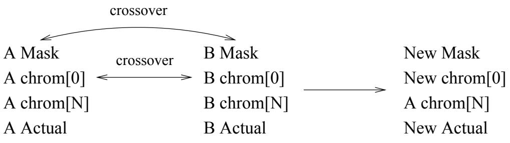  
Figure 2-5: Multiploid Crossover - Example 1

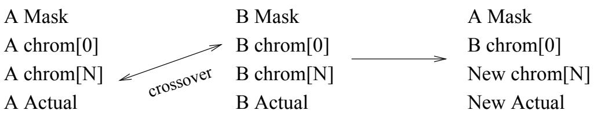  
Figure 2-6: Multiploid Crossover - Example 2

1. (Possibly) cross the masks to give a new child mask.

2. For X percent of possible chromosomes, for some value $i$ , cross Achrom[i] with Bchrom[i] to give a new chrom[i] for the child.

3. For Y percent of possible chromosomes, for some values of $i$ and $j$ , cross Achrom[i] with Bchrom $[ j ]$ to give a new chrom[] for the child.

4. For Z percent of possible chromosomes, for some value $i$ , form chrom[i] of the child by choosing chrom $[ i ]$ at random from the parent chromosomes.

Examples of these methods of crossover are given in figures 25 and 26.

A generic crossover operator was implemented in which a fag could be passed to indicate whether or not the child masks should be crossed. (If the mask is not crossed, then one of the parent masks is chosen at random to be the mask of the child). For the possible chromosomes, it was decided to implement the form of crossover where chrom[i] of parent A is always crossed with chrom $[ i ]$ of parent B. The operator is passed a number indicating the percentage of the possible chromosomes that are to be crossed. The chromosomes to cross are chosen at random from the set of possible chromosomes. If a chromosome $[ i ]$ is not chosen to be crossed, then chromosome[i] in the child is formed by choosing chrom $[ i ]$ from parent A or parent B at random. The default options for performing crossover are to cross 100 per cent of the possible chromosomes, and not to cross the mask.

Hence, for each type of crossover already implemented in PGA (two-point, one-point, and uniform), the code was adapted to produce an operator of the form:

•multiploid-crossover(cross-mask-indicator,percent-to-cross).

The advantage of such a generic operator is that it allows a number of experiments to be performed with varying parameters in order to discover what combination of parameters achieves the best results.

# 2.4.4 Mutation Operator

As for crossover, there are a number of methods of applying mutation to a child multiploid.

1. (Possibly) mutate the mask

2. Choose X percent of chrom[i] to mutate

Again a generic mutation operator was constructed to which a flag could be passed indicating if the mask should be mutated, and also a parameter indicating the percentage of the possible chromosomes in the multiploid structure that were to be mutated. The original version of PGA contains two types of mutation operators — one that flips a 0,1 bit in the original chromosome, and another that changes a random allele in the original to lie in the range from 0 to the biggest allele. Both of these mutation functions were updated to allow the multiploid structure to be mutated.

# 2.5 Typical Problems

A number of standard problems have traditionally been recognised as hard for a GA to solve, and hence provide good test material for experimenting with the multiploid GA. Two such problems — the Max problem and the Deceptive problem were chosen to test the multiploid GA, in addition to the Indecisive problem described briefly in section 2.3.2. These problems are discussed briefly below.

# 2.5.1 The Indecisive Problem

This problem can be tested with differing numbers of attractors by using a generic version of the fitness function given in section 2.3.2. If there are $k$ attractors, then the alleles can take values from 0 to $k - 1$ . The optimum solution is a chromosome in which every gene has value $k - 1$ . If the maximum allele has value $_ { f f l }$ , then the fitness is calculated as follows:

evaluate-indecisive-function   
( count number of alleles 0 to m subtract 1 from counts for alleles 0 to $m - 1$ return largest value   
)

It would be expected that the haploid GA would find the optimum solution around $1 / m$ th of the time. Theoretically, the multiploid mechanism should improve on this by allowing alleles of all values to remain in the population long enough for the correct one to become dominant.

# 2.5.2 The Max Problem

This is a simple problem in which the chromosome represents a bit string made up of zeros and ones. The problem is to maximise the number of ones in the string.

Table 2-1: The Order Three Deceptive Problem   

<table><tr><td>String</td><td>Value</td><td>String</td><td>Value</td></tr><tr><td>000</td><td>28</td><td>100</td><td>14</td></tr><tr><td>001</td><td>26</td><td>101</td><td>0</td></tr><tr><td>010</td><td>22</td><td>110</td><td>0</td></tr><tr><td>011</td><td>0</td><td>111</td><td>30</td></tr></table>

Although crossover can go a long way towards solving this problem, a situation is often reached in which the population converges with only a small number of zeros remaining in the string. At this stage, the crossover operator is redundant. Mutation can fip the 0 bits into 1s but as the length of the string increases, the probability of a 0 bit being chosen decreases, and hence it becomes increasingly unlikely that the problem will find the optimum solution. Long max problems are thus ideal candidates for testing out an alternative GA in which diversity is hopefully maintained.

# 2.5.3 Deceptive Problems

The idea of deception in a GA was introduced by Goldberg in 1987 [Goldberg 87]. It refers to the type of problem in which subparts of the problem direct the search towards a local optimum rather than leading to the global optimum, and in which the local optimum may actually be the complement of the global optimum. Deception has come to be widely regarded as an important feature in the design of problems that are hard for GAs, although work by [Grefenstette 93] argues that deception is neither necessary nor sufficient for a problem to be difficult for a GA. This aside, the problem still provides a suitable test function for comparing the results obtained on the problem by a traditional GA to those of the multiploid version.

Goldberg's order-3 minimal deceptive problem is illustrated in table 21. The objective is to maximize the number of 1s in a string that consists of a number of three-bit sub-functions. The fitness of each 3-bit sub-function is defined in the table 2-1. The fitness of the overall string is simply the sum of the fitness of the sub-functions.

It can be seen that good looking sub-functions, i.e. strings with a high proportion of 1s set, actually have lower fitness than 'unfit' looking strings composed of 0s. [Dasgupta & McGregor 93] calculate that a 30-bit function made up of ten 3-bit sub-functions has roughly a billion points in the search space, along with 1024 local optima. Only one of these local optima is the global optimum. The problem in this form is thus very hard for the traditional GA to solve.

A number of experiments were performed using these problems to test the effectiveness of the multiploid representation. These experiments are described in the next three chapters.

# Chapter 3

# Experiments on the Indecisive Problem

# 3.1 Overview

This section details the experiments that were performed using the multiploid GA on the Indecisive Problem with a varying number of attractors. Recall from Chapter 2, section 2.5.1 that the purpose of this problem is to produce a chromosome in which every gene has the same value $i$ . The problem is made difficult by the fact that any chromosome in which every allele is identical (but not of value $\imath$ ) is also an attractor, and may fool the GA.

Each experiment performed is described in detail. The description is followed by an outline of the results obtained, in which any interesting features are highlighted. The chapter is concluded with a discussion which attempts to provide some explanations for the results found in terms of how the multiploid appears to be working.

Table 3-1: Operators Used   

<table><tr><td>Operator</td><td>Type</td></tr><tr><td>Crossover</td><td>Two-point</td></tr><tr><td>Selection</td><td>Rank Based</td></tr><tr><td>Reproduction</td><td>One at a time</td></tr><tr><td>Mutation</td><td>rate = 0.02</td></tr></table>

# 3.2 Experimental Setup

This problem was tested with a chromosome of length 20. The experiments were run until either one member of the population had reached maximum fitness, or the population had converged. It is necessary to look at the final chromosomes in the population at the end of each experiment, rather than just the fitness, as a high numerical fitness only indicates that a chromosome contains a high number of genes which have similar value, and not what that value is. The whole population should be examined at the end of each run. This is because the population converges and the GA stops when all members of the population reach the same fitness. It is possible to reach a state where all 100 members of the population are of the same fitness, say 19, but some of the members are genotypes in which the 'actual' chromosome1 has 20 zeros, and some members have an 'actual' chromosome with 19 ones.

Each experiment was repeated 50 times, and both the fitness of the best chromosome in the population at the end of the run and its genotype were recorded. Unless otherwise stated, the population size in each experiment was 100, and the operators used were as defined in table 3-1.

The experiments were performed with the original haploid version of PGA and with Multiploid PGA with multiploids of varying ploidy. The term ploidy refers to the number of possible chromosomes in the multiploid genotype from which the actual chromosome can be formed, and is used throughout this chapter.

# 3.3 How Many Attractors Can A Multiploid GA Cope With?

In order to test the effectiveness of a multiploid GA in evolving towards the optimum attractor given a number of choices, the experiments were repeated with problems containing 2, 3 and 4 attractors. The experiments were repeated with genotypes of various ploidy if necessary.

# 3.3.1 Results

The results of experiments performed with 2-attractor, 3-attractor and 4-attractor problems are given in tables 3-2, 3-3 and 34.

<table><tr><td rowspan=1 colspan=1>Test Program</td><td rowspan=1 colspan=1>No. At/Convergingto all Os</td><td rowspan=1 colspan=1>No. ATall 1s</td><td rowspan=1 colspan=1>No.Converging toall 1s</td></tr><tr><td rowspan=1 colspan=1>Haploid PGAMultiploid PGA ploidy 2</td><td rowspan=1 colspan=1>200</td><td rowspan=1 colspan=1>3050</td><td rowspan=1 colspan=1>00</td></tr></table>

Table 3-2: 2-Attractor Problem: The table shows the results of 50 trials of the problem, using a population of size 100. The optimum solution is a chromosome in which every gene has value 1.

<table><tr><td>Test Program</td><td>No. At/Converging to all Os or 1s</td><td>No. AT all 2s</td><td>No. Converging to all 2s</td></tr><tr><td>Haploid PGA</td><td>19</td><td>21</td><td>10</td></tr><tr><td>Multiploid PGA ploidy 2</td><td>3</td><td>42</td><td>5</td></tr><tr><td>Multiploid PGA ploidy 3</td><td>8</td><td>38</td><td>4</td></tr><tr><td>Multiploid PGA ploidy 4</td><td>1</td><td>45</td><td>4</td></tr><tr><td>Multiploid PGA ploidy 5</td><td>7</td><td>40</td><td>3</td></tr><tr><td>Multiploid PGA ploidy 10</td><td>7</td><td>43</td><td>0</td></tr></table>

Table 3-3: 3-Attractor Problem: The table shows the results of 50 trials of the problem, using a population of size 100. The optimum solution is a chromosome in which every gene has value 2.

Table 3-4: 4-Attractor Problem: The table shows the results of 50 trials of the problem, using a population of size 100. The optimum solution is a chromosome in which every gene has value 3.   

<table><tr><td rowspan=1 colspan=1>Test Program</td><td rowspan=1 colspan=1>No. At/Convergingto all 0s,1s or 2s</td><td rowspan=1 colspan=1>No. ATall 3s</td><td rowspan=1 colspan=1>No.Converging toall 3s</td></tr><tr><td rowspan=4 colspan=1>Haploid PGAMultiploid PGA ploidy 2Multiploid PGA ploidy 3Multiploid PGA ploidy 4Multiploid PGA ploidy 5Multiploid PGA ploidy 10</td><td rowspan=1 colspan=1>36</td><td rowspan=1 colspan=1>0</td><td rowspan=4 colspan=1>14121571212</td></tr><tr><td rowspan=1 colspan=1>101035</td><td rowspan=1 colspan=1>28258</td></tr><tr><td rowspan=1 colspan=1>30</td><td rowspan=1 colspan=1>8</td></tr><tr><td rowspan=1 colspan=1>13</td><td rowspan=1 colspan=1>25</td></tr></table>

For the two-attractor problem, the results show that the multiploid GA easily outperforms the haploid GA in that it never gets stuck at the local optimum of all zeros. The diploid GA finds the actual optimum in every case.

For the 3-attractor problem, there is also a significant improvement in results using the multiploid GA. Although neither the haploid nor the multiploid GAs consistently find the actual optimum in which every allele is 2, a ploidy of 4 gives the multiploid a $9 8 \%$ success rate of finding a chromosome in which the dominant allele has a value of 2.

The multiploid GA has more difficulty in solving the 4-attractor problem. Although ploidy values of 2 and 3 show an $8 0 \%$ success rate at finding a solution which is heading towards the correct attractor, ploidy sizes of greater than 3 perform similarly to the haploid GA.

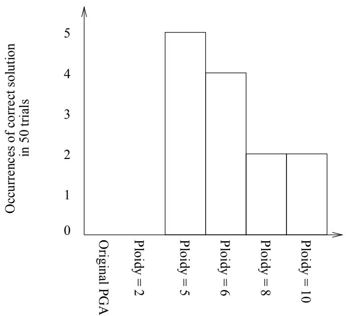  
Figure 3-1: The graph shows the number of occurrences of the correct solution in 50 trials of the 2-attractor problem when the population was initialised with a $7 5 \%$ bias of 0s. The correct solution is a chromosome containing all 1s. The population size is 100.

# 3.4 Can We Make The Problem Even Harder?

Given that table 3-2 shows that a diploid genotype completely outperforms the haploid GA in the 2-attractor problem, a good test to see just how well the multiploid genotype can cope is to make the problem harder by initialising the population so that each allele in a chromosome has a $7 5 \%$ chance of being a zero. This should encourage the GA to head towards the false all zeros optimum.

# 3.4.1 Results

The results are given in figure 3-1. It can be seen that high ploid genotypes perform better than the haploid GA, but the number of genotypes that do evolve towards the correct optimum is still very low. The best result obtained is with ploidy 5 when $1 0 \%$ of runs produce the correct result. Increasing the ploidy beyond 5 does not appear to improve matters, or indeed significantly affect the end result.

<table><tr><td colspan="2">Operators applied to</td><td rowspan="2">% final chromos containing all Os</td><td rowspan="2">% final chromos containing all 1s</td></tr><tr><td>Mask</td><td>Chromosomes</td></tr><tr><td rowspan="3">cross and mutate cross</td><td>cross and mutate</td><td>0</td><td>100</td></tr><tr><td></td><td>0</td><td>100</td></tr><tr><td>cross and mutate</td><td>0</td><td>100</td></tr><tr><td>mutate</td><td>cross and mutate</td><td>0</td><td>100</td></tr></table>

Table 3-5: The table shows the effect of applying different operators to the mask and possible chromosomes for the 2-attractor problem. All experiments were repeated 50 times on a population of size 100.

# 3.5 What Is Directing The Multiploid To Good Solutions?

Some feature of the multiploid genotype is helping it direct its search towards good solutions. To try and pinpoint exactly what this might be, a number of experiments were carried out using different operators, each using a diploid genotype and a randomly initialised population. The experiments performed were:

1. Do not operate on the mask.   
2. Perform crossover on the masks, but no mutation.   
3. Perform mutation on the masks, but no crossover.   
4. Do not operate on the possible chromosomes.

# 3.5.1 Results

The results are given in table 3-5. The result is identical in every case. The GA finds the correct solution in $1 0 0 \%$ of trials, whatever sequence of operators are applied. It is never fooled by the false attractor of all 0s.

# 3.6 Are There Other Ways of Maintaining Diversity?

Introducing multiploidy into the genotype appears to be helping to maintain the diversity of the population and hence to improve the quality of the solutions reached. However, there are alternative methods of increasing diversity such as increasing the population size. In order to see if this would have the same effect, a series of experiments was carried out in which the aim was to compare the performance of a haploid GA with the performance of a multiploid GA which used exactly the same memory.

A diploid genotype triples the memory requirement of a haploid genotype:- there must be memory allocated for the mask and each of the two chromosomes. There are also three units which can be operated on in a diploid genotype, compared to one in the haploid genotype. Thus a haploid GA with a population size of 60 should be compared to a diploid GA with population size 20. Similarly, a 4- ploid GA should require a population of only 12 chromosomes if memory allocation is to be consistent.

The 2-attractor problem was tested with population sizes as just described with the haploid and multiploid genotypes. The chromosome length in each case was 20.

# 3.6.1 Results

Bar graphs showing the spread of fitness values of the best genotype in each population at the end of each of 50 runs are given in figures 3-2, 3-3, and 34.

Tests with a haploid GA population of 60 and a diploid population of 20 show that both GAs find the optimum solution around $6 0 \%$ of the time. However, the remaining $4 0 \%$ of the time, the diploid GA converges towards solutions in which the dominant allele is 1, and in only 1 case does it produce a solution in which the dominant allele is 0. The haploid GA on the other hand produces the false solution of all Os the remaining $4 0 \%$ of the time.

Numbers on bars indicate occurrences of fitness value in 50 repeats of experiment

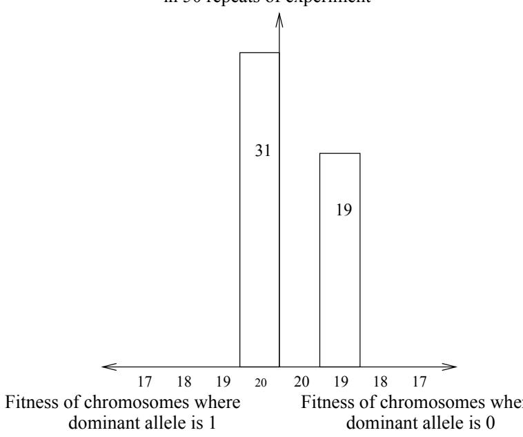  
Figure 3-2: The graph shows fitness values obtained in 50 trials of the 2-attractor problem using a HAPLOID genotype. The population size in this expt. was 60.

The 4-ploid GA shows an even further improvement in results. From 50 trials, in no case does the final solution contain a dominance of 0 alleles. The multiploid GA finds the global optimum approximately $1 0 \%$ of the time, the remainder of the solutions contain predominantly 1s, with fitness values ranging from 16-19.

Note of course that it is preferable to find a solution that is heading towards the correct optimum, than to find one that has reached the false optimum. An analogy may make this clear — if we are attempting to travel from Edinburgh to Glasgow by road and need to reach there by 5pm, it is better to be in a situation where we take the right road but don't quite make it to Glasgow by 5pm, than to take the wrong road and make it to Newcastle instead by 5pm.

Numbers on bars indicate oçcurrences of fitness value in 50 repeats of experiment

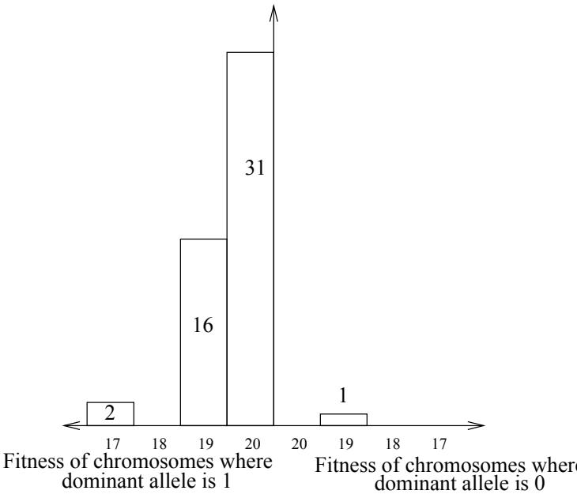  
Figure 3-3: The graph shows fitness values obtained in 50 trials of the 2-attractor problem using a DIPLOID genotype. The population size in this expt. was 20

# 3.7 Conclusion

The multiploid approach certainly seems to be beneficial in this problem. The experiments in section 3.6 suggest that the diversity produced by a multiploid genotype seems to be a more useful kind of diversity than that provided simply by having a large population — the diploid and 4 ploid genotypes are rarely, if at all, misled towards the false optimum, although they do not always find the optimal all 1s solution.

To investigate why this happens, it is necessary to look in detail at the multiploid genotypes at the end of a run. An example taken from the 4-attractor problem with ploidy 10, is given in figure 35.

What appears to be happening in this example is that the mask is able to pick out good '3' genes from the array of possible genes, and hence find the optimum solution. The genotype at this end stage is still very diverse — none of the individual possible chromosomes have converged towards a state in which the chromosome is dominated by a single allele.

Numhers on bars indicate occurrences of fitness value in 50 repeats of experiment

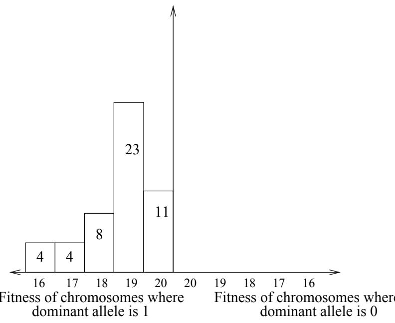  
Figure 3-4: The graph shows fitness values obtained in 50 trials of the 2-attractor problem using a 4-PLOID genotype. The population size in this expt. was 12

It would be expected that a GA with a small population should converge very quickly. The results show that for the 2-attractor problem, even with a very small population the multiploid approach allows the 1 alleles to have at least become predominant in the population at the point at which the population begins to converge — the 0 alleles have not been allowed to dominate, as happens in the haploid GA. The fact that all genotypes do not reach the global optimum is just a result of the small population.

Let us consider the case of the 2-attractor problem in more detail. (This is the simplest case, as we only have two allele values of 0 and 1 to deal with.) Although the selection pressure and fitness function prefer chromosomes with predominant 1s to be selected, it is still possible for chromosomes with predominant Os to be selected for breeding. In a small population, the chance of having a biased distribution of Os and 1s in the initial population is relatively high (just as the probability of getting a head every time a coin is tossed is much higher if the coin is tossed 3 times than if it is tossed 300 times). If a 'biased' chromosome, with a higher than average proportion of 0s, is selected for breeding early on in the process, it quickly begins to spread thought the population via crossover and

actual chromo: 33333333333333333333   
mask: 54860994016641021327   
possible chromos:   
posso: 20203213312131310130   
poss1: 11010031131213223032   
poss2: 12002003020000131332   
poss3: 03103002131221112333   
poss4: 13310033000233112022   
poss5: 30210111221110210201   
poss6: 22233112203312212113   
poss7: 30010002320310310203   
poss8: 30320100330001333222   
poss9: 20232330213321011230

soon chromosomes with predominant Os begin to dominate the population. This is known as Genetic Drift and in a haploid GA is very hard to recover from. Only very 'lucky' mutation can reintroduce 1s back into the population, and typically the effects of mutation are small.

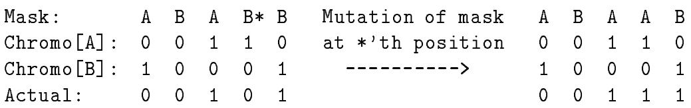  
Figure 3-5: Multiploid Structure At End Of GA Run   
Figure 3-6: Mutation of Mask to Give Higher Fitness

In the case of a diploid (or multiploid) it seems that the effect of genetic drift is not so terminal. It is possible to make some kind of recovery from such a situation much more easily, and reintroduce 1 genes into the population. The recovery can happen in two possible ways.

1. The mask can be changed, either by crossover or mutation, so that the new mask gene points at a 1 gene in a possible chromosome that was previously recessive. This is illustrated in figure 36.

2. New genes can be introduced into the genotype by crossover of the possible chromosomes, so that a mask gene that was previously pointing to a $\cdot _ { 0 } \cdot$ gene in a possible chromosome can now be pointing to a '1' gene in the same chromosome. It is also possible to introduce a whole new possible chromosome into the genotype, which itself can reintroduce more 1s into the genotype. (Recall that if a chromosome is not operated on, then a chromosome is selected at random from the parents to form the child chromosome). This is illustrated in figure 37.

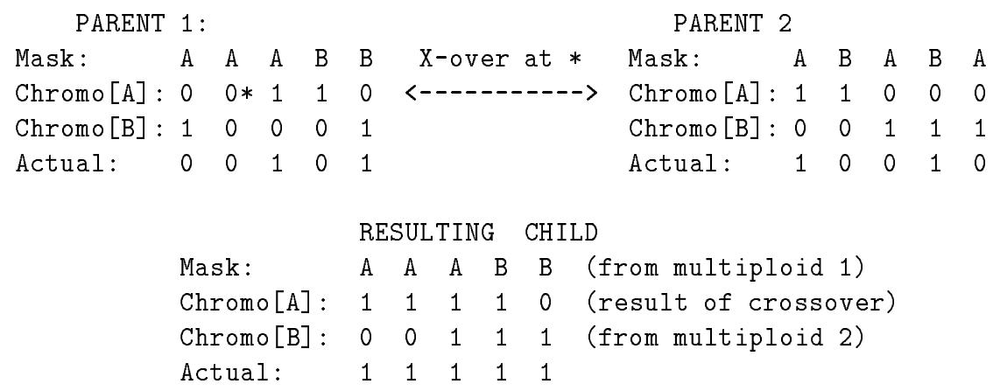  
Figure 3-7: Crossover of Chromosomes to Give Higher Fitness

Thus by increasing the ploidy of the genotype, we increase the chances of reintroducing the correct genes into the genotype if they have become 'lost' through initial selection. The loss in the haploid case is almost irrecoverable, whereas in the multiploid case, it seems that a sufficient number of '1' genes manage to remain in the population, shielded from any harmful selection process. These genes can be re-used when required to finally produce a correct solution.

The multiploid is not infallible however. The results in section 3.4, where the problem was made harder by increasing the number of 0 genes in the initial population, show that the effect described above is not quite strong enough to allow the multiploid to recover from very biased situations. Similarly, the effect is not always strong enough to distinguish between the 4 possible attractors in the 4-attractor problem, as shown in section 3.3.

The other feature of these investigations that deserves comment is the set of results presented in section 3.5, that show that the multiploid can produce good solutions no matter what operators are applied to it. For instance, a $1 0 0 \%$ success rate in finding the global optimum is achieved whether or not the mask is operated on, and whether or not the possible chromosomes are operated on. The multiploid seems to be able to take a flexible approach to finding a good solution. This is illustrated in figure 38.

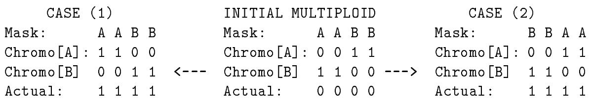  
Figure 3-8: Ability of Multiploid to Adapt to Environment

In case (1) the chromosomes evolve so that the mask genes point at genes with alleles of 1. In the second case, the mask is able to evolve to find the 1 alleles that are already present in the possible chromosomes. Perhaps it is the ability of the multiploid to take this dual approach that allows it to find better solutions than a haploid GA. The multiploid is able to take advantage of whatever situation it finds itself in, in order to produce the correct solution to the problem.

# Chapter 4

# Experiments on the Max Problem

# 4.1 Overview

In this chapter the results obtained in a series of experiments using the Max Problem are presented. This problem was discussed in Chapter 2, section 2.5.2. The goal of the problem is to maximize the number of '1's in a chromosome where each gene can take a value of 0 or 1.

The experiments conducted can loosely be divided into three categories:

1. Vary the number of possible chromosomes in the multiploid structure.

2. Vary the length of the mask in relation to the length of the chromosomes.

3. Vary the operators applied to the mask and each of the possible chromosomes.

Each experiment performed is described, and followed by the results obtained. The results are initially presented without discussion. In section 4.6 at the end of the chapter, possible explanations of these results are given, and there is a discussion of their bearing on any overall hypothesis of how the multiploid GA works.

# 4.2 Experimental Setup

The experiments on this problem were conducted using a chromosome length of 200. (The traditional GA tends to find max problems of size greater than approximately 100 difficult to solve.) Experiments performed using the multiploid GA were compared to an experiment performed using the original haploid PGA program on a chromosome of the same length and using the same operators. Each experiment was performed 50 times, and the average fitness of the best actual chromosome from each experiment was calculated. Each of the 50 experiments was run until either one of the actual chromosomes in the population had reached maximum fitness, or a fixed number of evaluations had been performed. The operators used were defined in table 3-1 in Chapter 3.

# 4.3 How Long is Diversity Maintained?

To evaluate how well the multiploid GA actually performed as far as maintaining the diversity of the population, the first set of experiments simply allowed the GA to run until convergence using multiploid genotypes of varying ploidy (from 1 to 10 possible chromosomes in the genotype) and compared the number of evaluations taken for the population to converge to the number of evaluations taken using standard PGA.

# 4.3.1 Results

The mean number of evaluations for multiploids with ploidy ranging from 2 to 10 are given in table 4-1. The table also shows the standard deviation of the mean values, and the confidence level that the mean is significantly different from the mean result from haploid PGA. (The confidence level is obtained using Student t-tests). The results show that the mean number of evaluations before convergence at first increases as the ploidy is increased, and then begins to tail off again. The greatest number of evaluations is 4206, at a ploidy of 6. This can be compared to a mean number of evaluations using haploid PGA of 2805.

<table><tr><td rowspan=1 colspan=1>Ploidy</td><td rowspan=1 colspan=1>MeanEvaluations</td><td rowspan=1 colspan=1>StandardDeviation</td><td rowspan=1 colspan=1>ConfidenceLevel</td></tr><tr><td rowspan=2 colspan=1>Haploid PGA2</td><td rowspan=1 colspan=1>2805</td><td rowspan=1 colspan=1>414.59</td><td rowspan=1 colspan=1></td></tr><tr><td rowspan=1 colspan=1>3411</td><td rowspan=1 colspan=1>363.75</td><td rowspan=1 colspan=1>99.9%</td></tr><tr><td rowspan=1 colspan=1>3</td><td rowspan=1 colspan=1>3693</td><td rowspan=1 colspan=1>595.59</td><td rowspan=1 colspan=1>&gt;99.9%</td></tr><tr><td rowspan=1 colspan=1>4</td><td rowspan=1 colspan=1>3550</td><td rowspan=1 colspan=1>353.30</td><td rowspan=1 colspan=1>&gt;99.9%</td></tr><tr><td rowspan=1 colspan=1>5</td><td rowspan=1 colspan=1>3701</td><td rowspan=1 colspan=1>460.06</td><td rowspan=1 colspan=1>&gt;99.9%</td></tr><tr><td rowspan=1 colspan=1>6</td><td rowspan=1 colspan=1>4266</td><td rowspan=1 colspan=1>947.42</td><td rowspan=1 colspan=1>&gt;99.9%</td></tr><tr><td rowspan=1 colspan=1>7</td><td rowspan=1 colspan=1>3963</td><td rowspan=1 colspan=1>825.57</td><td rowspan=1 colspan=1>&gt;99.9%</td></tr><tr><td rowspan=1 colspan=1>8</td><td rowspan=1 colspan=1>3986</td><td rowspan=1 colspan=1>517.29</td><td rowspan=1 colspan=1>&gt;99.9%</td></tr><tr><td rowspan=1 colspan=1>9</td><td rowspan=1 colspan=1>3784</td><td rowspan=1 colspan=1>411.01</td><td rowspan=2 colspan=1>&gt;99.9%&gt;99.9%</td></tr><tr><td rowspan=1 colspan=1>10</td><td rowspan=1 colspan=1>3737</td><td rowspan=1 colspan=1>366.88</td></tr></table>

Table 4-1: Max Problem: The table shows the mean number of evaluations taken before a population of size 100 converges, such that each chromosome has the same fitness. The mean value in each case is the result of 50 repeated experiments.

All multiploid structures containing two or more possible chromosomes converged after a greater number of evaluations than the standard PGA program that uses the haploid genotype, and t-tests show that all mean values obtained are significant (to a confidence level of $9 9 . 9 \%$ ).

# 4.4 How Do The Operators Affect Max Fitness?

This series of experiments investigated what happened to the fitness of the multiploids as the number of chromosomes in the multiploid that the operators were applied to was varied. The operators were tested on multiploids with ploidy ranging from 2 to 10. The GA was allowed to run for a maximum of 4000 evaluations in each experiment. The operators investigated were crossover and mutation. For simplicity, if a chromosome was chosen to be operated on, then both crossover and mutation were applied to it. Experiments were performed that applied the operators to 0, 25, 50, 75, and 100 percent of the chromosomes in the multiploid, and also that tested the effect of applying the operators to the mask.

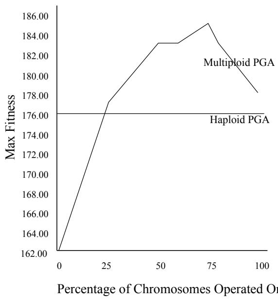  
Figure 4-1: Max Fitness vs $\%$ of Chromosomes That Crossover is Applied To

# 4.4.1 Results

Figure 4-2 shows the results of these experiments. Figure 4-1 summarises the maximum fitness values obtained in each experiment. These can be compared to an average maximum fitness of 176 obtained using haploid PGA. T-tests show that where an improvement is seen in maximum fitness, this is a significant improvement (i.e. there is a greater than 99.9 percent probability the average fitness of each population is significantly different from that of the haploid population).

Operating on 25 percent or more of the possible chromosomes produces an improvement in maximum fitness compared to standard PGA for at least one value of ploidy. For experiments in which 50 percent or more of the possible chromosomes were crossed, the general trend is that as the ploidy increases, the maximum fitness increases.

The best results are achieved from crossing $7 5 \%$ of the possible chromosomes. The fitness increases as the percentage of chromosomes that the operators are applied is increased from 0% to $7 5 \%$ , and then dips again as the percentage is increased further.

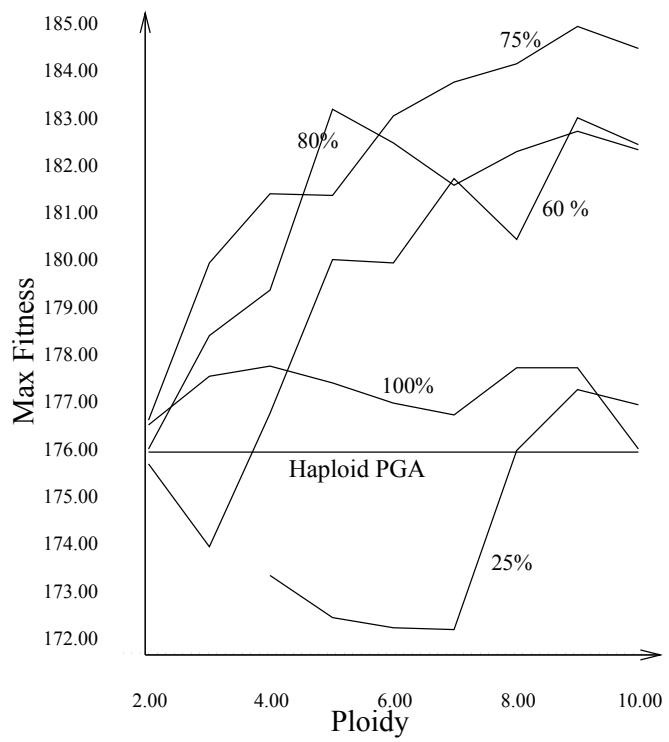  
Figure 4-2: The graph shows the average maximum fitness obtained as a function of ploidy for a series of experiments in which the percentage of the chromosomes that crossover and mutation operators are applied to is varied. The fitness values are the average of the best fitness values obtained in 50 trials. The size of the chromosomes in each case was 200, giving a theoretical maximum fitness of 200.

# 4.5 Does The Size of The Mask Affect Max Fitness?

The above experiments show that the best results are achieved by crossing and mutating the mask, and crossing and mutating $7 5 \%$ of the possible chromosomes. A series of experiments was performed using these parameters using various different mask sizes. The mask sizes used were 200, 100, 40 and 20. (The size of the chromosome in each case is 200.)

For each mask size, the experiments were repeated with multiploids of ploidy 210. The GA was run for 4000 evaluations in each case.

# 4.5.1 Results

Figure 4-3 clearly shows that as the mask size is decreased, the average maximum fitness of the population also decreases. This applies to all values of ploidy for the multiploid. When the mask size is very small in relation to the size of the possible chromosomes, the haploid GA is able to outperform the multiploid. This occurs for mask sizes of 20 and 40.

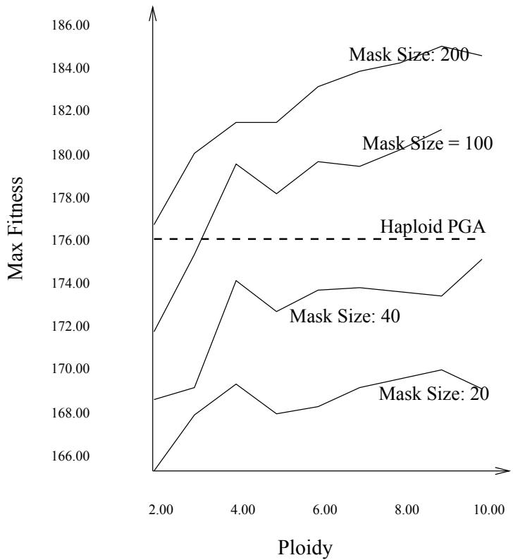  
Figure 4-3: The graph shows the average maximum fitness obtained as a function of ploidy in a series of experiments in which the mask size is varied. The fitness values are the average of the best fitness values obtained in 50 trials. The size of the chromosomes in each case was 200, giving a theoretical maximum fitness of 200.

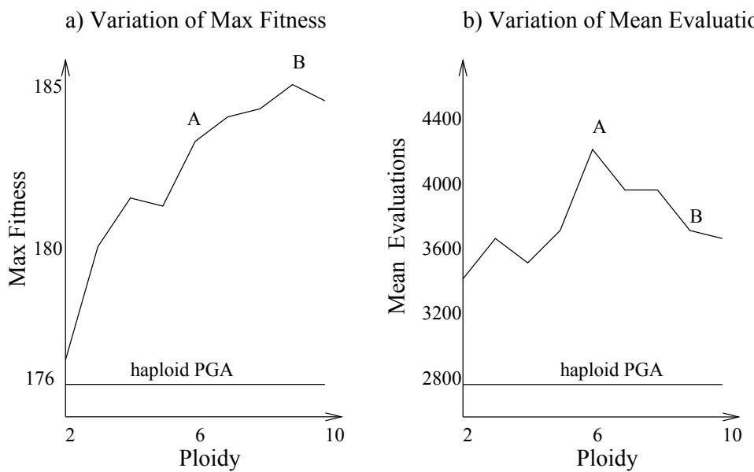  
Figure 4-4: Variation of Max Fitness And Mean Evaluations With Ploidy Size For The Max Problem

# 4.6 Conclusion

As an initial observation, we can conclude that the multiploid approach has proved beneficial for this problem. Although in no experiment was the theoretical optimum fitness of 200 found, the best results obtained are significantly better than the results achieved with haploid PGA. The best result obtained is a fitness of 185, with ploidy 8, and applying crossover and mutation to $7 5 \%$ of possible chromosomes. The reasons why this particular combination of ploidy and operators proves successful are discussed below.

The results in section 4.4 show that for the combination of operators that give the best results, the fitness tends to increase with increasing ploidy. It is interesting to compare however the convergence times for the population (see section 4.3) at each ploidy value with the fitness achieved at convergence (figure 44).

The mean number of evaluations rises to a peak at ploidy $= ~ 6$ , and then decreases. So, as the ploidy rises, we see that between points A and B on the graphs in figure 4-4 the GA tends to converge more quickly but still manages to produce higher fitness chromosomes.

Possible reasons for fitness increasing with ploidy were discussed in Chapter 3, section 3.7. The increased diversity of a high ploid genotype means that there is more chance of the mask picking out 1s from the range of possible chromosomes, and also more chance that the multiploid can recover from adverse situations where unfortunate early selection of parents with a high proportion of 0s has lead to a dominance of 0 genes in the population.

It could be argued that increasing the ploidy is in some ways similar to increasing the population size, which traditionally ups the convergence time for a GA. (The increased variation in a larger population means that it takes longer for everything to be the same). However, this does not explain why the convergence time should peak and then decrease with increasing ploidy. This result is very difficult to explain. One argument is that as the ploidy rises, the chance of picking out good chromosomes increases. This can be shown by looking at some of the mathematics behind the process.

Consider a multiploid of ploidy $n$ , in which the length of the chromosomes is $l$ , and calculate the probability that there will be at least one 1 gene in the $k$ th locus somewhere in the $n$ chromosomes. There are $2 ^ { n }$ possible ways that the $k$ th position in each chromosome can be allocated (when the only possible allele values are 0 or 1). Of these $2 ^ { n }$ ways, only one of them is the case where every $k$ th gene is a $0$ , and hence the probability that there will be at least a single 1 gene somewhere at the $k$ th locus is $( 2 ^ { n } - 1 ) / 2 ^ { n }$ .

As $n$ increases, the proportion of multiploids that may contain at least one '1' at each locus position increases. If we increase the ploidy by 1, the probability of finding a 1 at a locus increases by a factor of $\begin{array} { r } { ( 1 + \frac { 1 } { 2 \left( 2 ^ { n } - 1 \right) } ) } \end{array}$ . As $n$ increases, the effect decreases in magnitude, but the results tend to suggest that for $n > 6$ , the effect is sufficient to give the GA a high enough chance of selecting a good chromosome for breeding very early in the algorithm. Once selected, the good chromosome can rapidly spread throughout the population, thus decreasing the time for convergence.

The results also show that the best fitness is achieved when crossover and mutation operators are applied to $7 5 \%$ of the chromosomes in the multiploid. Operating on less than $1 0 0 \%$ of the chromosomes allows complete new chromosomes to be swapped into a genotype. This of course allows many new alleles to be introduced, and thus a number of mask genes that previously pointed at 0 alleles may now point to 1 alleles, through minimum effort on the part of the GA. The combination of the effect of bringing in complete new chromosomes with the effect of finding new chromosomes through crossover allows the multiploid to achieve its best results.

Decreasing the size of the mask in relation to the size of the chromosomes has a detrimental effect on this problem. This can be explained by examing the way the fitness is calculated. The fitness of a chromosome is measured by counting the '1' genes in the chromosome. Each gene contributes individually to the overall fitness, and the fitness of one gene does not affect the fitness of a gene in an adjacent location. Consider the following 'thought experiment':-

The experiment involves a diploid genotype in which the first three genes of chromosome-A are [1 0 0], and the first three genes of chromosome-B are [0 1 1]. Now, in the situation where each mask gene represents one chromosome gene, a possible mask for these genes could read [A B B], giving a total fitness of 3. However, if each mask gene represents three chromosome genes, say, then a mask of [A] gives a fitness of only 1 for the first three genes of the actual chromosome. The alternative mask [B] is also less fit than the possible mask [A B B].

For every mask gene that represents three chromosomes genes, there are 8 possible combinations of the three chromosome genes that the mask must select from. This obscures the fact that the basic building blocks of the problem are much more simple. For the mask gene that represents a single chromosome gene, there are only 2 possible choices (A or B) and the simpler approach leads to improved performance. A similar argument can be applied to all mask sizes where the mask gene represents more than one chromosome gene.

In summary, the multiploid approach has achieved good results for this problem. The benefits are partly a direct result of the ploidy of the multiploid and the resulting increase in diversity, as with the Indecisive Problem. These results have also shown however that the multiploid has another important 'built-in' feature — complete new chromosomes can be introduced into the structure. This enhances the effects of crossover and hence leads to improved solutions.

# Chapter 5

# Experiments on the Deceptive Problem

# 5.1 Overview

The Deceptive problem tries to maximize the number of 1 genes in a chromosome, but is made difficult by the fact that its low order building blocks point away from the optimum chromosome. A detailed description is given in Chapter 2, section 2.5.3. This chapter describes a number of experiments on the Deceptive problem, that vary the ploidy and mask size, and compares the results to those achieved with a haploid GA. The results are documented following each experiment, and discussed in the conclusion at the end of the chapter.

# 5.2 Experimental Setup

Experiments on the deceptive problem were done using chromosomes of size 30 and 33, as problems of this size are sufficiently difficult that a traditional GA cannot successfully solve them. As in previous chapters, the results obtained were compared to those obtained using the original haploid version of PGA with chromosomes of the same length and using the same operators.

The population size in each experiment was 100, and the operators used were the same as for the Indecisive and Max problems. These operators are defined in table 3-1 in Chapter 3. The GA was allowed to run until either the population had converged, or a maximum of 4000 evaluations had been reached.

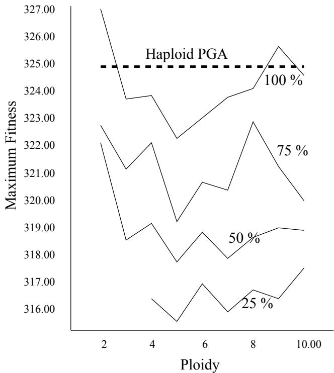  
Figure 5-1: The graph shows the average maximum fitness obtained as a function of ploidy in a series of experiments in which the percentage of the chromosomes that crossover and mutation operators are applied to is varied. The fitness values are the average of the best fitness values obtained in 50 trials. The size of the chromosomes in each case was 33, giving a theoretical maximum fitness of 330.

# 5.3 How Does the Multiploid Perform?

The deceptive problem was first tested with a genotype in which the length of the chromosome was 33. The theoretical maximum fitness of such a chromosome is 330. The problem was tested a number of times, varying the percentage of chromosomes that mutation and crossover were applied to. In every experiment, the masks of the parent genes are crossed and mutation applied. The results are compared to the original haploid version of PGA which produces an average maximum fitness of 325.

# 5.3.1 Results

A graph showing the results of tests in which the crossover and mutation operators were applied to 100, 75, 50 and $2 5 \%$ of possible chromosomes is given in figure 5-1. The results show that in general, not only does the introduction of ploidy to the genotype not produce any improvement in fitness, it actually makes things worse. This is clearly interesting, given the improved performance shown for the previous two problems.

# 5.4 Does Changing the Mask Size Improve Things?

The results in section 5.3 show that the multiploid genotype appears to be reducing the performance of the GA for this particular problem when the mask in the genotype is the same size as the chromosomes. This set of experiments investigated what happened if the mask size was reduced so that each gene in the mask represented a group of genes in the chromosomes.

The problem size was reduced slightly in order to try and directly compare the results obtained with those obtained by [Dasgupta & McGregor 93] using a structured GA. Experiments were performed using genotypes in which the chromosome size was 30, and the mask varied in size between 3 and 30. The theoretical maximum fitness in this case is 300.

# 5.4.1 Results

The results are given in figure 5-2, and show that the multiploid PGA significantly outperforms the haploid PGA when the mask size is decreased to certain values. T-tests show that where an improvement in fitness is seen, the improvement is significant (to a confidence level of $9 9 . 9 \%$ ). Figure 5-3 shows the maximum fitness obtained plotted against the number of genes in the chromosome that each mask gene represents. For example, a mask size of 10 in a genotype where the length of the possible chromosomes is 30 corresponds to each mask gene representing 3 chromosome genes.

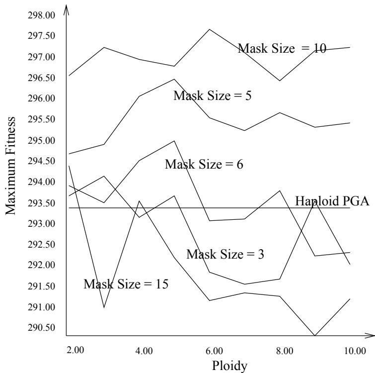  
Figure 5-2: The graph shows the average maximum fitness obtained as a function of ploidy in a series of experiments in which the mask size is varied. The fitness values are the average of the best fitness values obtained in 50 trials. The size of the chromosomes in each case was 30, giving a theoretical maximum fitness of 300.

The average fitness of the best member of each population after 50 runs is at best 297.5 (with mask size $= 1 0$ and ploidy 6). This is slightly below the theoretical maximum of 300.

# 5.5 Conclusion

The results show that dramatically better results are obtained on this problem if the mask size is reduced, which is in direct comparison to the effect of reducing the mask on the Max problem. The best results are obtained when each gene in the mask represents a group of $n$ genes in the chromosome where $n$ is some multiple of 3. We can return to the same argument presented in section 4.6 to explain this.

In the Deceptive problem, the fitness of a chromosome is calculated by considering groups of three adjacent genes at a time. The results suggest that by fixing each mask gene so that it represents three chromosome genes, we are focusing more on blocks of genes rather than individual genes. Good blocks can evolve as a unit and the mask can find these blocks more easily.

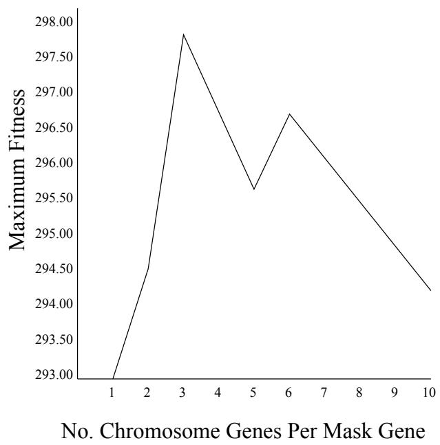  
Figure 5-3: Max Fitness of Deceptive Problem vs Mask Size

Figure 5-4 shows two representations of the same diploid using two different mask sizes. The fitness of each actual chromosome is identical. However, if we consider the probability of a mask picking out the good group of three adjacent 1s in chromosome A, the probability of the mask in multiploid (1) finding the group is $1 / 8$ . The probability of a mask in multiploid (2) (in which one mask gene represents 3 chromosome genes) finding the group is $1 / 2$ . The chances of finding a good chromosome are thus greatly improved in the case of multiploid (2).

Similarly, the experiment in which each mask gene represents 6 chromosome genes gives significantly better results than the haploid GA. In this case, the mask gene is able to select pairs of three genes blocks that are adjacent to each other.

It appears that the feature of the multiploid that improves the performance of the GA on the Deceptive problem is its ability to effectively allow a change of representation of the problem by altering the mask length. It would seem that it

Multiploid (1):

Multiploid (2):

Mask: BBAAAA Chromo[A]: 0 1 0 1 1 1 Chromo[B]: 1 1 0 0 0 0 Actual: 1 1 0 1 1 1

Mask: B A Chromo[A]: 0 1 0 1 1 1 Chromo[B]: 1 1 0 0 0 0 Actual: 1 1 0 1 1 1

is this change of representation, and not the diversity effect of a multiploid that is of benefit.

Why though, does a multiploid with a mask size equal to the chromosome size actually perform more badly than a haploid GA? We can return again to the argument above.

When the ratio of mask genes to chromosome genes is 1:1, then it is possible for 3 adjacent mask genes each to pick out 1s from different possible chromosomes, and hence find a group of 3 genes that has maximum fitness. As we increase the ploidy of the genotype, the chance of a mask gene pointing at a 1 gene is enhanced, as the probability of there being at least one 1 gene at a particular locus somewhere in the possible chromosomes increases as the ploidy is raised. (This probability is in fact given by $\left( 2 ^ { n } - 1 / 2 ^ { n } \right)$ , where $n$ is the ploidy.) Hence the probability of adjacent mask genes picking out 1s is also increased. Thus the chances of the 'good' building blocks, i.e. 111 blocks, being included in the final chromosome should be increased. But — the results show that this does not happen. There must be some other process that is competing against this.

It may be that the diversity of the multiploid is actually working against itself and increasing the chances of the GA initially selecting very high fitness chromosomes that actually point to the deceptive optimum. If we recall from table 21 that $^ { \circ } 0 1 1 ^ { \circ }$ has fitness 0, and '001' has fitness 26, then the replacement of a 1 with a 0 has a large effect on the fitness. The possible increase in fitness achieved by selecting Os instead of 1s is so great that the increased diversity may actually encourage these Os to be selected early on and spread quickly in the population, until the situation is very hard to recover from. In the case of the Indecisive problem, selecting 0s is only slightly less advantageous than selecting 1s, and so early genetic drift towards the 0s optimum can be more easily recovered from.

When the ratio mask size:chromosome size is reduced, although the results obtained are significantly better than the haploid GA, the actual ploidy does not seem to affect the result — figure 5-2 shows that for mask size $= 1 0$ , the maximum fitness tends to oscillate around an average with increasing ploidy. There seems to be no obvious explanation of this. Further experimental investigation of the problem may provide some answers.

These experiments have thrown up two further points of interest regarding the multiploid structure. The first is to note that the diversity provided by the multiploid may not always be advantageous. The second is that the multiploid can provide a means of altering the representation of a problem, in a manner that can prove beneficial.

# Chapter 6

# Set Covering Problems

# 6.1 Overview

This section contains an introduction to set covering problems (SCPs) in general before concentrating on the specific application of SCPs to bus driver scheduling (BDS). This is followed by a section describing the difficulties found so far in using a GA to obtain good results for BDS problems, and why a multiploid GA might improve the situation. The chapter continues with a description of the changes that were applied to the multiploid GA code described in Chapter 2 to allow it to work with scheduling problems. A description of experiments performed using the new code, and the results obtained then follows. The chapter is then concluded by a short discussion of the worth of applying a multiploid genotype to BDS problems, in the light of the results obtained.

# 6.2 Set Covering Problems

Set Covering Problems are a class of problems that are of significant practical importance in many areas. Given a set S composed of N elements, and a large set of subsets A1, A2, ..., of S, the problem is to find a collection of subsets which together contain every element of S by using as few subsets as possible, and usually also minimising some further criteria. For example, in the bus driver problem, S is the set of bus journeys that need to be covered, and A1, A2, ..., are sets of legal drivers' shifts that do not break any regulations concerning hours of continuous work, and provide adequate breaks for the drivers. Each element of the set S contains information about a segment of a bus route, such as

" Bus 73 leaves Newington Green at 14:30 and gets to Seven Sisters Road at 15:20."

The end point of such an element is a point where drivers can be potentially swapped. A combination of such elements, a subset of elements, leads to a feasible drivers' shift. For example,

Take a 22 from Shoreditch at 9am, all the way to Hammersmith — have an hour's lunch, then take a 38 back as far as the Ball's Pond Rd."

In mathematical terms, the problem can be thought of as covering the rows of an $m$ row, $n$ column matrix at minimal cost.

Hence, if $x _ { j } = 1$ if column $j$ is included in the solution, and $x _ { j } = 0$ if column $j$ is not included in the solution, and $c _ { j }$ is the cost of column $j$ , then the SCP can be thought of as trying to minimise

$$
\sum _ { j = 1 } ^ { n } c _ { j } x _ { j }
$$

subject of course to the constraint that all rows must be covered.

While much work has been done on SCPs in the operational research world, researchers such as [Beasley & Chu 95] have lately found GAs to be a good approach for solving these problems. However, as the problems get harder and increase in size, it can take a GA a very long time to produce a good solution. This has encouraged much thought into improving the GAs by building in some kind of heuristics to direct the search.

# 6.3 Why Good Heuristics are Difficult to Find

Experience has tended to show that good heuristics are difficult to find for the SCP. [Beasley & Chu 95] attempted to use a heuristic that ensured that each child produced by crossover was a feasible solution to the problem by identifying all rows uncovered by the solution and adding extra columns.

The search for the missing columns was based on a ratio:

Once a feasible solution was found, another step was applied to remove any redundant columns from the solution. The problem with this type of approach is that in the real world a number of extra factors, besides adequately covering the set, come into play. With regard to the BDS problem, there are four main factors:

Number of Shifts As far as a bus driver scheduler is concerned, the schedule that offers the best solution is the one with fewest shifts.

Cost The lower the cost, the better the schedule.

Overlap Overlap between two shifts means paying one driver to do nothing, therefore the optimum solution has minimum overlap.

Redundancy A shift is redundant if removing it from the schedule does not affect the feasibility of the solution.

The problem arises because these factors tend to work directly against each other, making it extremely difficult to produce a successful heuristic. For example, an obvious heuristic approach to this problem would be to concentrate on pairs of possible shifts and try to choose pairs of shifts which jointly cover most work with the least overlap to be included in the solution. Consider an example problem illustrated in figure 6-1. Shifts S1, S2, S3 and S4 have no overlap. Pairwise, S2 and S4, for instance, cover a reasonable amount of work with no overlap, and would probably be chosen by a pairwise heuristic. Similarly, S1 and S3 do not overlap and also cover a fair amount of work. However, a solution containing S1- S4 requires at least two more sets to make a complete cover. On the other hand, a solution involving S5-S8 provides a complete cover in only 4 shifts, but generates a large amount of overlap. This nicely illustrates the problems involved in trying to resolve these competing objectives by heuristic methods, and shows why there is a large incentive to try out alternative approaches to the problem that do not involve heuristics in this sense.

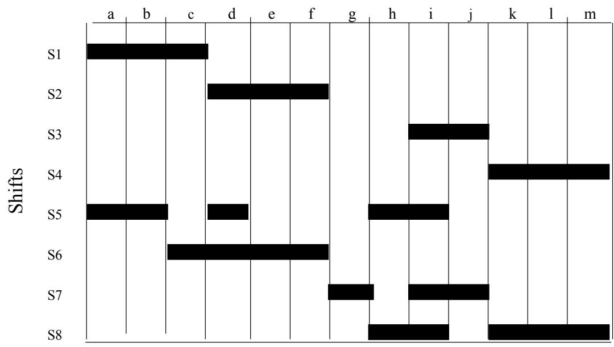  
Items of Work To Cover   
Figure 6-1: A Set Covering Problem

# 6.4 The Multiploid Approach

Given the difficulties documented above, it is logical to seek an alternative mechanism for improving the performance of a GA. The work described in the previous chapter points to the fact that the multiploid GA can help to maintain the diversity of the chromosome population and hence improve the chances of finding a good solution.

It is possible that this increased diversity may also help the BDS problem. A population in which there is as much genetic variation as possible allows chromosomes which are considered 'fit' for different reasons to remain in the population without being ousted by a fitness function which only considers one particular measure of fitness.

# 6.5 SCPGA

There is an existing program, SCPGA, written by Dave Corne to solve BDS problems using a haploid genotype. The GA attempts to produce viable bus driver schedules that minimise the number of shifts and cost required. This program has been shown to produce good results on small problems and results similar to [Beasley & Chu 95] on larger problems. It evaluates a schedule based on a function of its cost, number of shifts and its overlap. Rather than modify this code to run with a multiploid genotype, it was decided to take the multiploid GA code written to test the problems in the previous chapters and add an evaluation function to it so that set covering problems could also be evaluated. This required other modifications to the program to allow it to read in set covering data, and also to ensure that the chromosomes produced as a result of crossover and mutation were valid representations of the problem.

# 6.6 Modifications to PGA Code

This section details the changes that were made to the multiploid to allow it to deal with set covering problems. Firstly, it is necessary to explain how a chromosome can be made to represent a solution to a scheduling problem. The representation described is a standard method of representing a set covering problem in a Genetic Algorithm.

Each element of work that must be covered in the schedule is represented by a gene in the chromosome. Associated with each element is a list of shifts that cover it. The value of each gene represents an index into the list of the shifts that cover that particular piece of work. For example, figure 6-2 depicts a possible chromosome in a (miniature) scheduling problem in which there are 5 elements

<table><tr><td rowspan=1 colspan=1>Shift</td><td rowspan=1 colspan=1>&gt;2</td><td rowspan=1 colspan=1>4</td><td rowspan=1 colspan=1>3</td><td rowspan=1 colspan=1>1</td><td rowspan=1 colspan=1>2</td></tr></table>

Item Of Work 1 2 3 4 5 of work to be covered and 10 possible shifts. The first element can covered by 8 different shifts — the shift chosen is the second shift in the list for element 1, shift 4.

<table><tr><td>Item</td><td>Shifts Covering Item</td></tr><tr><td>1</td><td>1,4,3,6,7,8,9,10</td></tr><tr><td>2</td><td>4,1,7,9</td></tr><tr><td>3</td><td>4,2,3,6,7</td></tr><tr><td>4</td><td>5,3</td></tr><tr><td>5</td><td>2,4,6</td></tr></table>

The multiploid genotype representation is exactly the same as described in Chapter 2. In this case, each possible chromosome in the genotype represents a possible driver schedule. Each possible chromosome is itself a valid cover.

# 6.6.1 Reading in Scheduling Data

The program reads set covering data from a file in a standard format, as used by the Imperial College Operations Research Library, from which many standard setcovering problems can be obtained. Data files covering real bus driver shifts and duty information can be converted into this format using a program also written by Dave Corne. The data file contains information on the cost of each shift, the number of elements of work to be covered, and the shifts that cover each element of work.

# 6.6.2 Initialisation

Slight modifications were made to the initialisation function so that each gene was correctly initialised with a shift that did actually cover that element of work. This ensures that a chromosome produced at the end of the initialisation is a complete cover for the whole set, even though at this stage it may contain a great deal of redundancy.

# 6.6.3 Mutation

Similar changes were made to the mutation function to ensure that if a gene was mutated, the new allele value was a correct cover for the gene in question.

# 6.6.4 Fitness Function

The evaluation of the fitness of a chromosome is somewhat complicated. A significant amount of work is done in the evaluation function to remove any redundancy from the cover. A shift that covers a particular element of work is redundant if the element of work in question is already covered by another shift. For example, in figure 6-2, the shift identified by the allele that covers the first element, shift-4, also covers elements 2 and 3. In this case, the shifts identified by the 2nd and 3rd alleles could be removed from the cover.

The cover is evaluated using the following steps:

1. Let $i$ be the current gene in the chromosome (starting with $i = 1$ ), and $a$ be the allele of the current gene. a refers to the $a$ th shift which covers element $i$ . Add this shift $s$ to the growing cover (which is initially empty).

2. Now make all genes $j > i$ , where the new shift $s$ also covers shift $j$ , inactive. Find the next active gene and return to step (1) with the new active gene as the current gene. Stop when there are no more active genes.

3. The cover built up may still be redundant. Go though the shifts one by one, and see if any shift can be removed without losing coverage of any element. If so, remove it and continue.

Table 6-1: Operators Used For BDS   

<table><tr><td>Operator</td><td>Type</td></tr><tr><td>Crossover</td><td>Two-point</td></tr><tr><td>Selection</td><td>Tournament (default size = 2)</td></tr><tr><td>Reproduction</td><td>One at a time</td></tr><tr><td>Mutation</td><td>Rate = 0.02</td></tr><tr><td></td><td></td></tr></table>

Once a non-redundant cover has been found, its fitness can be determined as a function of one of two attributes:

1. The number of shifts required for the cover.

2. The total cost of the cover.

When the program is run, the user can specify which measure of fitness is to be used. This allows the effects of the two attributes to be investigated separately. Overlap was not included as a possible measure of fitness as on its own it is not a meaningful measure of the quality of a solution.

# 6.6.5 Operators And Defaults

The operators used in this code, along with any default values, are given in table $6 -$ 1. Tournament selection had previously been used successfully by Dave Corne on BDS problems, and hence this method is chosen as the default selection procedure. Low selection pressure had previously worked well, and hence the default value for the tournament size is 2.

# 6.7 Experiments

All experiments were performed on a real bus driver scheduling problem, with 245 elements of work to cover, and 5522 possible shifts.1 The experiments were first conducted using the number of shifts as the criterion for fitness, and then with cost as the fitness criterion. Each experiment was repeated 50 times, in each case with a population size of 100.

# 6.7.1 Results Obtained Using SCPGA

So that a direct comparison could be made, the original SCPGA program was run 50 times with the scheduling problem. The best result known to have been achieved on this particular problem is a minimum number of shifts of 31. The GA was allowed to evolve for 10000 evaluations, and the number of shifts and cost of the best chromosome recorded at the end. (It is very unlikely that the number of shifts in the cover will be reduced once the GA has got to the stage of 10000 evaluations).

# Results

SCPGA found a cover of 32 shifts 44 out of 50 times. The remaining 6 covers contained 31 shifts. The average cost of a cover was 14543. (The units of the cost are arbitrary.)

# 6.7.2 Minimum Number of Shifts

Initial experiments showed that the minimum number of shifts providing a valid cover that the multiploid GA could find was also 31. The multiploid GA was tested with varying mask size and ploidy to see how quickly (if at all possible) this minimum number could be reached. Each experiment was run until one member of the population had reached this fitness. The number of evaluations required to reach this figure was then recorded. If none of the chromosomes in the population reached this fitness, then the GA was allowed to run until the population had converged. The fitness at convergence was then recorded.

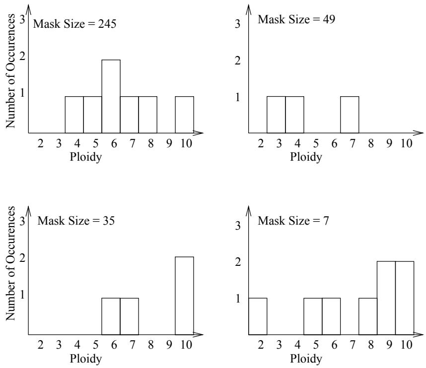  
Figure 6-3: The graphs show the number of occurences of a cover of 32 shifts in 50 trials of a BDS problem with 245 elements. In all other trials, the cover contained 31 shifts.

The experiments were repeated with ploidy values from 2 to 10, and mask sizes of 7, 35, 49 and 245 for each ploidy value.

# Results

The results show that for a given ploidy and mask size, in the majority of cases the multiploid GA finds a cover of 31 shifts $1 0 0 \%$ of the time. The minimum success rate of finding a cover of 31 shifts is $9 6 \%$ — a considerable improvement on SCPGA which finds a cover of 31 shifts in only $1 2 \%$ of experiments. The graphs in figure 6-3 show the cases of ploidy and mask size where the GA did not find the 31 shift cover in $1 0 0 \%$ of cases. (In all other cases the result was a cover of 31 shifts $1 0 0 \%$ of the time.) Although no conclusive remarks can be made about the effect of mask size on the results, very large and very small mask sizes seem to slightly reduce the chances of finding the minimum cover.

For the cases where the number of shifts in the cover is 31, table 6-2 shows the actual number of evaluations required to reach this number of shifts. Figure 64 shows the variation in number of evaluations graphically. The standard deviation of the mean values for the case when the mask size is 245 are shown as error bars on the graph. It can be seen from the graph that for a given mask size, the change in the number of evaluations with increasing ploidy does not show any obvious trend. The mean number of evaluations for all values of ploidy and mask size lie inside the range of deviation for the case when the mask size equals the chromosome size.

<table><tr><td rowspan=2 colspan=1>Ploidy</td><td rowspan=1 colspan=4>Mask Size</td></tr><tr><td rowspan=1 colspan=1>245</td><td rowspan=1 colspan=1>49</td><td rowspan=1 colspan=1>35</td><td rowspan=1 colspan=1>7</td></tr><tr><td rowspan=2 colspan=1>23</td><td rowspan=1 colspan=1>1359</td><td rowspan=1 colspan=1>1340</td><td rowspan=1 colspan=1>1617</td><td rowspan=1 colspan=1>1525</td></tr><tr><td rowspan=1 colspan=1>1650</td><td rowspan=1 colspan=1>1411</td><td rowspan=1 colspan=1>1642</td><td rowspan=1 colspan=1>1637</td></tr><tr><td rowspan=1 colspan=1>4</td><td rowspan=1 colspan=1>1478</td><td rowspan=1 colspan=1>1849</td><td rowspan=1 colspan=1>1790</td><td rowspan=1 colspan=1>1741</td></tr><tr><td rowspan=1 colspan=1>5</td><td rowspan=1 colspan=1>2130</td><td rowspan=1 colspan=1>1972</td><td rowspan=1 colspan=1>1668</td><td rowspan=1 colspan=1>1879</td></tr><tr><td rowspan=1 colspan=1>6</td><td rowspan=1 colspan=1>1595</td><td rowspan=1 colspan=1>1940</td><td rowspan=1 colspan=1>1908</td><td rowspan=1 colspan=1>1587</td></tr><tr><td rowspan=1 colspan=1>7</td><td rowspan=1 colspan=1>1739</td><td rowspan=1 colspan=1>2221</td><td rowspan=1 colspan=1>1755</td><td rowspan=1 colspan=1>2071</td></tr><tr><td rowspan=1 colspan=1>8</td><td rowspan=1 colspan=1>1911</td><td rowspan=1 colspan=1>2443</td><td rowspan=1 colspan=1>1581</td><td rowspan=1 colspan=1>1774</td></tr><tr><td rowspan=1 colspan=1>9</td><td rowspan=1 colspan=1>1741</td><td rowspan=1 colspan=1>1978</td><td rowspan=1 colspan=1>1761</td><td rowspan=1 colspan=1>1864</td></tr><tr><td rowspan=1 colspan=1>10</td><td rowspan=1 colspan=1>2047</td><td rowspan=1 colspan=1>2205</td><td rowspan=1 colspan=1>1896</td><td rowspan=1 colspan=1>1777</td></tr></table>

Table 6-2: The table shows the mean number of evaluations taken (in a series of 50 trials) to reach a cover of 31 shifts for a BDS problem with 245 elements.

# 6.7.3 Minimum Cost

The actual minimum cost achievable in this set covering problem is unknown. The experiments to investigate the results of varying ploidy and mask size were thus run until either the population had converged, or a maximum number of evaluations (10,000) had been reached. Each experiment was repeated 50 times with a population size of 100.

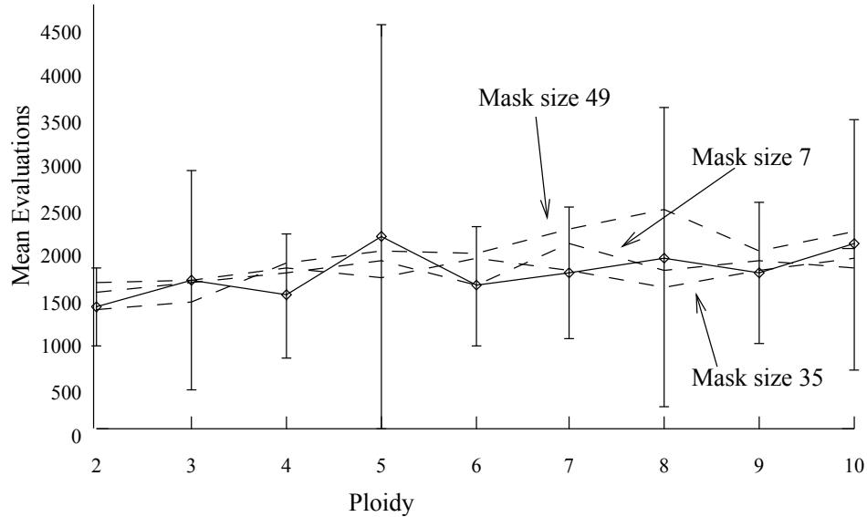  
Figure 6-4: The solid line shows the mean number of evaluations taken to reach a cover of 31 shifts, when the mask size is equivalent to the chromosome size. This graph is plotted with error bars showing the standard deviation of the mean values. The dotted lines show the variation in mean evaluations as the ratio mask size: chromosome size is decreased.

# Results

Table 6-3 shows the mean cost and mean number of evaluations before convergence found in experiments in which the ploidy of the genotype was varied between 2 and 10. In each of these experiments, the mask size was fixed at 49, as this size of mask had performed well in finding covers with 31 shifts in the previous set of experiments.

In most experiments the population converged early, after around 3500 evaluations. The only exception to this was in 3 experiments using a ploidy of 9 where the population had not yet converged by 10,000 evaluations. The best cost achieved is 14609, with a ploidy of 2. This is higher than the average cost achieved by SCPGA which is 14543.

Again there is no obvious trend in the cost reached as the ploidy is increased.

<table><tr><td rowspan=1 colspan=1>Ploidy</td><td rowspan=1 colspan=1>Cost</td><td rowspan=1 colspan=1>Std.Dev.</td><td rowspan=1 colspan=1>Evaluations</td><td rowspan=1 colspan=1>Std. Dev.</td></tr><tr><td rowspan=3 colspan=1>234</td><td rowspan=1 colspan=1>14609</td><td rowspan=1 colspan=1>222</td><td rowspan=1 colspan=1>3516</td><td rowspan=1 colspan=1>1124</td></tr><tr><td rowspan=1 colspan=1>14662</td><td rowspan=1 colspan=1>226</td><td rowspan=1 colspan=1>3231</td><td rowspan=1 colspan=1>800</td></tr><tr><td rowspan=1 colspan=1>14692</td><td rowspan=1 colspan=1>255</td><td rowspan=1 colspan=1>3460</td><td rowspan=1 colspan=1>1388</td></tr><tr><td rowspan=6 colspan=1>5678910</td><td rowspan=1 colspan=1>14643</td><td rowspan=1 colspan=1>216</td><td rowspan=1 colspan=1>3604</td><td rowspan=1 colspan=1>1097</td></tr><tr><td rowspan=1 colspan=1>14686</td><td rowspan=1 colspan=1>223</td><td rowspan=1 colspan=1>3191</td><td rowspan=1 colspan=1>746</td></tr><tr><td rowspan=1 colspan=1>14643</td><td rowspan=1 colspan=1>208</td><td rowspan=1 colspan=1>3341</td><td rowspan=1 colspan=1>1123</td></tr><tr><td rowspan=1 colspan=1>14701</td><td rowspan=1 colspan=1>255</td><td rowspan=1 colspan=1>3125</td><td rowspan=2 colspan=1>7462297</td></tr><tr><td rowspan=1 colspan=1>14764</td><td rowspan=1 colspan=1>263</td><td rowspan=1 colspan=1>4024</td></tr><tr><td rowspan=1 colspan=1>14651</td><td rowspan=1 colspan=1>236</td><td rowspan=1 colspan=1>3293</td><td rowspan=1 colspan=1>972</td></tr></table>

Table 6-3: The table shows the mean cost achieved in 50 trials for a BDS problem with 245 elements. The experiments were performed using a multiploid with a mask size of 49 and a chromosome size of 245.

# 6.8 Conclusion

The multiploid GA finds a cover using a minimum amount of shifts significantly more times than SCPGA. The increase in consistency and also the fast speed of the multiploid in finding good minimum cover solutions suggests it should be beneficial to try it out on larger and more complicated problems.

The mean cost achieved however is on average slightly higher than that achieved using SCPGA. These higher costs are a result of the GA converging after a relatively small number of evaluations. This could be improved by altering the convergence criteria used by multiploid PGA. This is discussed in more detail in Chapter 7, section 7.3.1.

It should also be noted that SCPGA uses a fitness function that measures fitness based on both the cost and the size of the cover of the chromosome. It may be that cost on its own is not sufficient to drive the GA towards finding solutions in which the number of shifts in the cover is low, which will generally have lower associated costs anyway. This could perhaps be remedied in a later version with a more sophisticated evaluation function that takes both features into account, as with SCPGA.

Given that the most important factor as far as a transport company is concerned is likely to be the number of shifts, then this brief investigation with the multiploid GA has shown that it is definitely worthy of further investigation as a useful tool for solving these types of problems, especially if the multiploid GA code can be improved. Gaining a complete understanding of the mechanism of the multiploid GA may hold the key to making judicious improvements. Further work that could be carried out to aid this understanding is described in Chapter 7, section 7.3.

# Chapter 7

# Summary

# 7.1 Overview

This chapter looks at the project as a whole to see if the original objectives have been met, and documents what has been achieved. It is concluded with some suggestions of work that could be carried out in the future to extend this study.

# 7.2 Were The Aims Achieved?

The original aims of this thesis were threefold:

to design a new genotype representation and implement it into a working GA program.

to test this new representation on a number of traditional GA problems.

to test the new representation on realistic bus driver scheduling problems.

All of these aims have been achieved to a greater or lesser extent. The multiploid representation was successfully implemented into the existing version of PGA, and was thoroughly tested on the Max and Deceptive problems, as well as on the newly invented 'Indecisive Problem'. These experiments gave interesting and positive results. They show that the multiploid genotype has a remarkable flexibility, which allows it to adapt itself according to the conditions it finds itself working in. This factor may provide the key to much of its success. The GA can take advantage of this flexibility, negotiating conceptually separate but related routes to an optimal result. As with most advantageous things however, there is an associated cost, as is shown by the differing performance of the GA on different problems. The same processes which help a multiploid GA to be better than a haploid GA on some problems may prove to be its downfall on others.

The advantages of the multiploid genotype are twofold. It can assist in maintaining the diversity of a system with a consequent improvement in results for some problems. It can also alter the effective representation of a problem which can improve results for certain problems.

Time limitations prevented a very thorough exploration of the use of the multiploid GA on the Bus Driver Scheduling problem. However, the results obtained show that although the multiploid GA does not so far achieve results that are vastly superior to those already achieved by SCPGA1, it finds the best results accomplished by SCPGA more quickly and more reliably. This could be of great advantage when the GA is applied to particularly large scheduling problems.

Thus, from the point of view of designing and implementing an alternative genotype that can improve on results found using a traditional GA, the project has been successful. The results of the reasonably brief investigation into bus driver scheduling problems are encouraging and suggest that further, more detailed investigation, should be carried out.

# 7.3 Suggestions For Further Work

The following section briefly documents further areas in which research could be carried out, to improve on results found in this project, and also to gain a better understanding of how the multiploid is working.

# 7.3.1 Adapting Convergence Criteria of PGA

The present version of PGA is considered to have converged when all the members of the population have the same fitness. For the multiploid GA, this is equivalent to the actual chromosomes in the population all having the same fitness. However, there could still be very much variation in the multiploids at this stage, as the masks and possible chromosomes may not be identical. A more meaningful criterion for convergence is thus a situation when each complete multiploid is identical. This could be implemented into the PGA code, and will allow even better solutions to evolve.

# 7.3.2 Further Test Problems

A problem which has been shown to be affected by premature convergence and lack of diversity is the Royal Road problem [Forrest & Mitchell 93]. This problem has been the subject of much investigation by others. A lack of time prevented any exploration of this problem with a multiploid GA, but it would be a good candidate for further experiments. Further work may firstly show if the added diversity can help the problem, and secondly, it may add to the understanding of the mechanisms of the multiploid.

# 7.3.3 More Work On Deceptive Problems

The results obtained on the order-3 tight deceptive problem show that the multiploid GA does not find the actual global optimum in any of the experiments performed. Dasgupta [Dasgupta & McGregor 93] however, finds that his structured GA does manage to reach the global optimum. While the failure of the multiploid to reach the optimum results may be due to the rather unhelpful convergence criterion used, as explained in section 7.3.1, some further investigation of this problem using different operators and mutation rates may also help explain the differences in results.

# 7.3.4 Set Covering Problems

Testing a number of BDS problems with code in which the convergence criteria has been adapted as in section 7.3.1 would be worthwhile initially to see how much results could be improved. The second step would then be to build in a more complex fitness function based on both cost and number of shifts, and try the modified code with a range of large set covering problems. Such problems are available from Dave Corne and also the Operations Research Library, [Beasley 90].

# Bibliography

J.D. Bagley. The Behaviour of Adaptive Systems Which Employ Genetic and Correlation Algorithms. Unpublished PhD thesis, University of Michigan, 1967.

[Beasley & Chu 95]

J.E. Beasley and P.C. Chu. A genetic algorithm for the set covering problem. European Journal of Operational Research, 1995.

[Beasley 87]

J.E. Beasley. An algorithm for set covering problems. European Journal Of Operational Research, 14(1):147159, 1987.

[Beasley 90]

J.E. Beasley. OR-library: Distributing test problems by electronic mail. Journal of the Operational Research Society, 41:10691072, 1990.

[Darwin 59]

C. Darwin. On the Origin of Species. John Murray, London, 1859.

[Dasgupta & McGregor 93] Dipankar Dasgupta and Douglas R. McGregor. Using structured genetic algorithms for solving deceptive problems. Technical report, University of Strathclyde Department of Computer Science, 1993.

[DeJong 75]

Q. A. DeJong. Analysis of Behavior of a Class of Genetic Adaptive Systems. Unpublished PhD thesis, Γhe University of Michigan, 1975.

[Fang et al. 93]

Hsiao-Lan Fang, Peter Ross, and Dave Corne. A promising genetic algorithm approach to job-shop scheduling, rescheduling, and open-shop scheduling problems. In S. Forrest, editor, Proceedings of the Fifth International Conference on Genetic Algorithms, pages 375-382. San Mateo: Morgan Kaufmann, 1993.

[Forrest & Mitchell 93]

Stephanie Forrest and Melanie Mitchell. Relative building block fitness and the building block hypothesis. In L. Darrell Whitely, editor, Foundations of Genetic Algorithms 2. San Mateo: Morgan Kaufmann, 1993.

[Goldberg 87]

D. E. Goldberg. Simple genetic algorithms and the minimal deceptive problem. In L. Davis, editor, Genetic algorithms and simulated annealing, Research Notes in AI, chapter 6, pages 74-88. Pitman, London, 1987.

David E. Goldberg. Genetic Algorithms in Search, Optimization & Machine Learning. Reading: Addison Wesley, 1989.

[Grefenstette 93]

J. J. Grefenstette. Deception considered harmful. In L. Darrell Whitley, editor, Foundations of Genetic Algorithms 2, pages 75-91. San Mateo: Morgan Kaufmann, 1993.

John H. Holland. Adaptation in Natural and Artificial Systems. Ann Arbor: The University of Michigan Press, 1975.

[Hollstein 71]

R.B. Hollstein. Artificial Genetic Adaptation in Computer Control Systems. Unpublished PhD thesis, University of Michigan, 1971.

[Rosenberg 67]

R.S. Rosenberg. Simulation of Genetic Populations With Biochemical Properties. Unpublished PhD thesis, University of Michigan, 1967.

[Sigmund 95]

Karl Sigmund. Games of Life. Penguin Group, 1995.

[Wren & Wren 95]

A. Wren and D. O. Wren. A genetic algorithm for public transport driver scheduling. Computers in Operations Research, 22(1):101110, 1995.