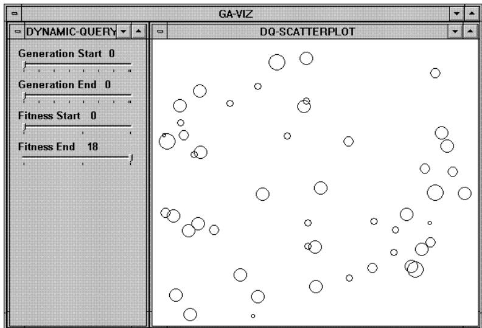
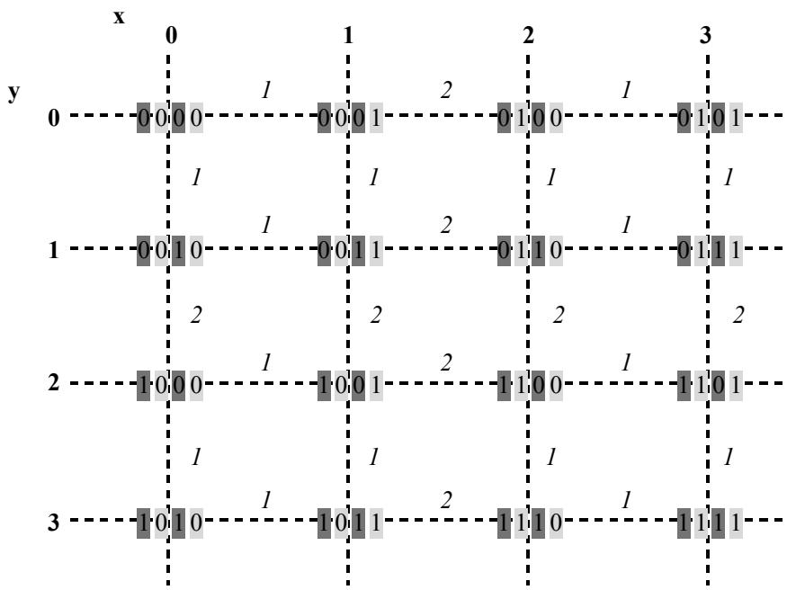
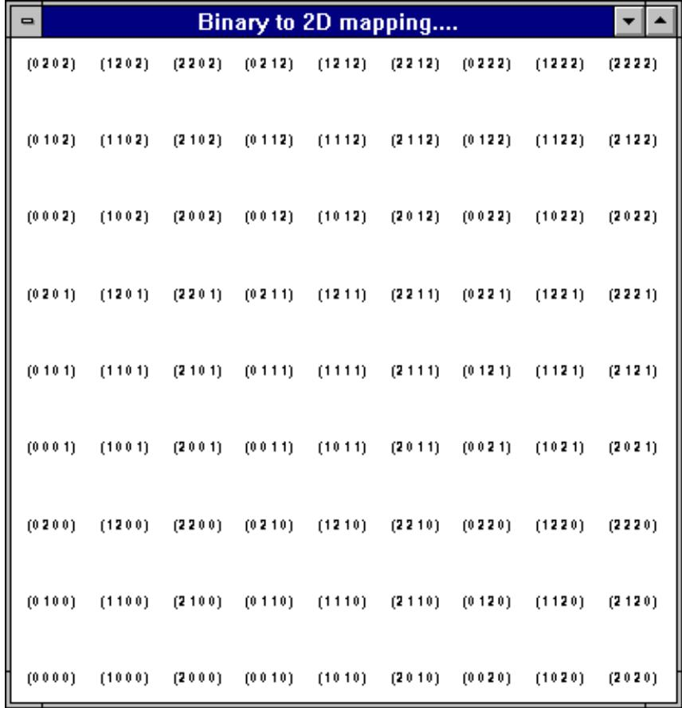
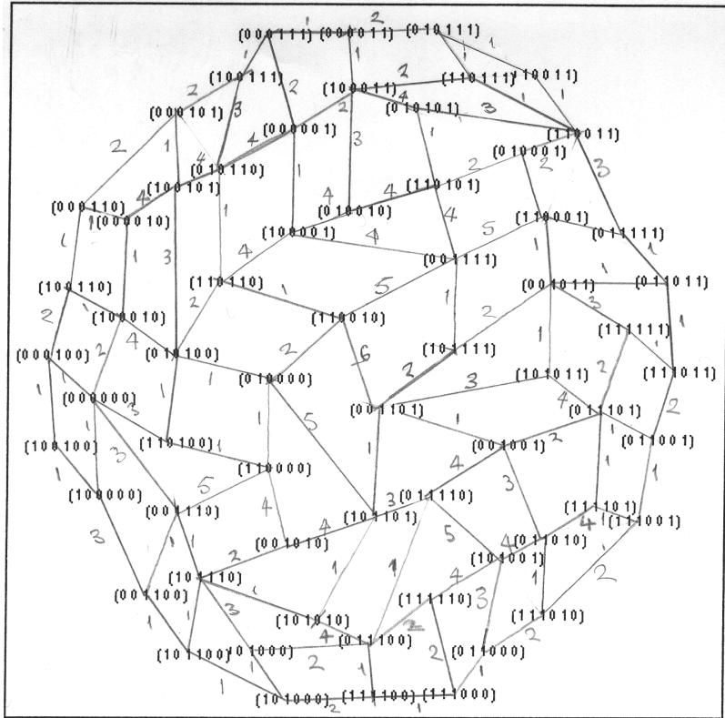
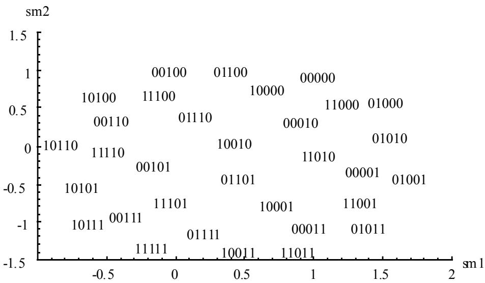
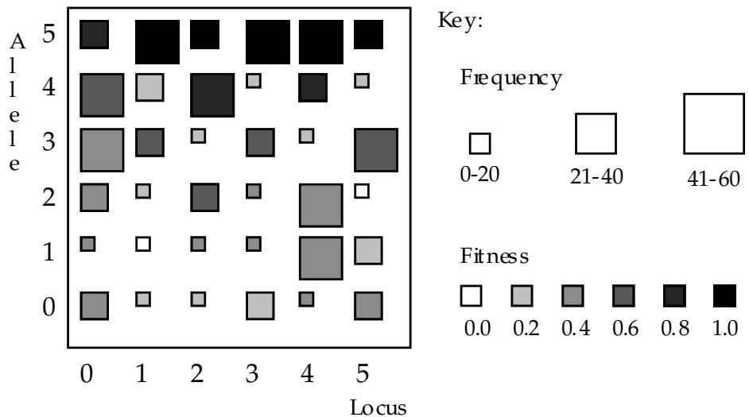
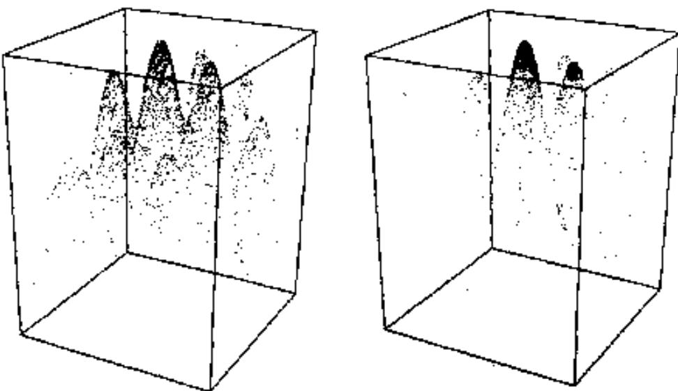

# References

Collins TD (1993). The Visualisation of Genetic Algorithms. MSc. Thesis, De Montfort University, Leicester, UK.

Nassersharif B, Ence D, & Au M (1994). Visualization of Evolution of Genetic Algorithms. In: Proceedings of the World Congress on Neural Networks, 1994, San Diego CA. pp. 1-560 - 1-565.

Dybowski R, Collins TD, Weller PD (1996). Visualization of Binary String Convergence by Sammon mapping. In: Proceedings of the Fifth Annual Conference on Evolutionary Programming - EP'96, 1996, San Diego CA. In Press.

Sammon JW (1969). A Nonlinear Mapping for Data Structure Analysis. IEEE Transactions on Computers, C-18, q5, pp. 401 - 408.

Aho AV, Ullman JD (1992). Foundations of computer science. New York: Computer Science Press, pp 83-142, 340.

the accuracy of the mapping, without any consideration being given to the suitability of such modifications.

Although the scaling of the mapping co-ordinates may reduce the magnitude of a Euclidean based error metric, this has no effect on the relative positioning of the points and therefore as far as any observer may be concerned no real effect on the mapping.

The transposition of the square grid to a circular target-grid, on the other hand, does alter the relative positioning of the mapped points. However, even though the square corners clearly cause an increase in error, the nearest neighbour hamming distances are no better represented in this way.

To summarise in terms of the Euclidean distance based error a completely converged Sammon Mapping is more accurate than Genotypic-Space Mapping, however with a couple of simple linear modifications the error of the matrix-based mapping can be reduced to within comparable magnitudes. As to how suitable such modifications are may well depend on the observer; some may prefer the simplistic form of the original square, whilst others the spatially more accurate circular modification. Points in a regular grid may be easier to remember or imagine than those in a circular target-grid.

# Conclusions

Genotypic-Space Mapping is one solution to the high-dimensional to low-dimensional mapping problem associated with population visualization. It provides a direct linear two-way relationship between high-dimensional strings and two or three dimensional co-ordinates that makes it ideal for GA population visualization and manipulation. This opens the door to a series of search-space based visualizations not only applicable to GAs but also any other EC programming paradigm, and any other high-dimensional data-set disciplines. Future work on this mapping will focus on the analysis and reduction of the error surface, and the construction of a more formal proof for the basic mapping technique. An example of how GSM can be used to visualize a GAs population is shown in figure nine.

  
Figure 9. A screen view image of a scatter-plot illustrating a GA's initial population data. Genotypic-Space Mapping was used in this example to map 16 bit binary chromosomes to points in two dimensional space. The chromosomes' are shown here as circles, with their fitness ratings being indicated by the circles' diameter (the larger the circle's diameter, the fitter the chromsome).

In the more general case; max- $\mathbf { \nabla } \cdot \mathbf { X } =$ max-y $=$ Sqrt ( $0 . 5 ~ ^ { * }$ String Length)

Having adopted this approach we can then compare the errors associated with Sammon Mapping and the matrix-based Genotypic-Space Mapping:   

<table><tr><td>Binary String Length</td><td>Total Error - SM</td><td>Total Error - GSM</td><td>Mean Error (Stnd Dev) - SM</td><td>Mean Error (Stnd Dev) - GSM</td></tr><tr><td>4</td><td>0.1904 (44th)</td><td>0.2820</td><td>0.0119 (0.0043)</td><td>0.0176 (0.0084)</td></tr><tr><td>6</td><td>0.2667 (87th)</td><td>0.4247</td><td>0.0042 (0.0009)</td><td>0.0066 (0.0022)</td></tr><tr><td>8</td><td></td><td>0.4928</td><td></td><td>0.0019 (0.0006)</td></tr></table>

Table 1. An error comparison table for Sammon and Genotypic-Space Mappings (SM and GSM respectively) of four, six and eight bit binary strings.

As can be seen above, this new mapping is not as accurate as a converged Sammon Mapping. If we return to the geometrical properties of these mappings, we find that Sammon Mappings contain circular patterns whilst the matrix-based mapping's patterns are square. The summed Euclidean distances between points on the corners of the two dimensional matrix-grid and all the other points in the grid will be greater than the summed inter-point distances for those located toward the centre of the grid. This then prompts the query; "if we remove the high-error contributing corners by mapping the grid onto a circular target-grid will we reduce the Euclidean distance based error?"

Figure 8. Genotypic-Space Mapping on a 2D grid and a circular target-grid.   

<table><tr><td>• Binary to 2D mapping..</td><td colspan="2">Binary to 2D mapping...</td></tr><tr><td>(000000) (001000) (000010) (001010) (100000) (101000) (100010) (101010)</td><td>(001010) (100000) (000 010) (001000)</td><td>(101000) (100010)</td></tr><tr><td>(000100) (001100) (000110) (001110) (100100) (101100) (100110) (101110)</td><td>(000 0 0 0 (001110) (100100) (000100) (000110)</td><td>(10 1010) (101100) (101110)</td></tr><tr><td>(010000) (011000) (010010) (011010) (110000) (111000) (110010) (111010)</td><td>(001100) (010000) (011000) (011010) (110000) (010010)</td><td>(100110) (110010) (111010) (111000)</td></tr><tr><td>(010100) (011100) (010110) (011110) (110100) (111100) (110110) (111110)</td><td>(0 10100) (011100) (010110) (01111q110100)</td><td>(111100) 1 (110110) (111110)</td></tr><tr><td>(000001) (001001) (000011) (001011) (100001) (101001) (100011) (101011)</td><td>(000001) (001001) (000011) (00101q10000 1)</td><td>(101001) (100011) (101011)</td></tr><tr><td>(000101) (001101) (000111) (001111) (100101) (101101) (100111) (101111)</td><td>(000111) (00010 1) (00 110 1) (001111) (100101) (0 11001)</td><td>(100111) (101111) (110011)</td></tr><tr><td>(010001) (011001) (010011) (011011) (110001) (111001) (110011) (111011)</td><td>(01000 1) (0 100 1 1) (0 10 10 1) (011011) (110001)</td><td>(11100 1) (111011) (111111)</td></tr><tr><td></td><td colspan="2">(010111) (11110 1)</td></tr><tr><td>(010101) (011101) (010111) (011111) (110101) (111101) (110111) (111111)</td><td colspan="2">(01110 1) (110111)</td></tr></table>

As can be seen in table one (below) transposing the square shaped grid of a Genotypic-Space Mapping to a circular grid does reduce the error. In fact a closer look at the error values found for two, six and eight bit binary string mappings show that the circular grid error values are all approximately seventy percent of the associated 2D grid mappings. This is a feature inherent in the square to circle transposition and therefore, a similar error reduction can be expected irrespective of the string length.

<table><tr><td>Binary String Length</td><td>Total Error - GSM 2D Grid</td><td>Total Error - GSM Circular Grid</td><td>Mean Error (Stnd Dev) - GSM 2D</td><td>Mean Error (Stnd Dev) - GSM</td></tr><tr><td>4</td><td>0.2820</td><td>0.2065</td><td>Grid 0.0176 (0.0084)</td><td>Circular Grid 0.0129 (0.0063)</td></tr><tr><td>6</td><td>0.4247</td><td>0.3052</td><td>0.0066 (0.0022)</td><td>0.0048 (0.0016)</td></tr><tr><td>8</td><td>0.4928</td><td>0.3579</td><td>0.0019 (0.0006)</td><td>0.0014 (0.0004)</td></tr></table>

Table 2. An error comparison table for Genotypic-Space Mappings on a square grid and a circular target grid.

In the initial paragraph of this section it was stated that mappings used to translate high-dimensional population data to a two-dimensional viewing space must consider not only the speed of the mapping but also its accuracy and suitability. So far, two modifications have been proposed in order to ensure

For a high dimensional string S, of length L and base number B;

$$
\mathrm { x { = } \sum _ { i = 1 } ^ { ( L - 2 ) } S _ { i } . B } ^ { ( L - 1 ) }
$$

$$
\mathrm { y { = } \sum _ { i = 0 } ^ { ( L - 1 ) } S _ { i } . B } ^ { ( L - 1 ) }
$$

at increments of $_ { \mathrm { i } + 2 }$

This equation can then be generalised to construct a mapping to any number of dimensions (D), and for strings in which the allele range varies across the chromosome $( \mathrm { { B } _ { i } , }$ , where i indicates the loci and B the base-number associated with that loci). The resulting co-ordinates can be derived as follows;

$$
\mathrm { c o - o r d . = \sum _ { i = 0 } ^ { N } S _ { i } . B _ { i } ^ { M O D ( \mathrm { L } \mathrm { - } i ) D ) } }
$$

The co-ord. values are taken alternately for $\mathbf { \boldsymbol { X } } , \mathbf { \boldsymbol { y } } , \mathbf { \boldsymbol { Z } } ,$ , etc. depending on the number of dimensions the mapping is being made into.

# Discussion

Of the previous attempts to visualize GA population data, only Sammon Mapping is comparable to the above matrix-based approach. Although Sammon Mapping is from a computational viewpoint more complex, the fact that any visualization could store the mapping as a look-up table, and therefore bypass any run-time generation problems, means that we should also compare the accuracy and suitability of these two approaches for representing high-dimensional data sets.

Sammon Mapping itself is an iterative error-correcting approach based on maintaining the consistency of the Euclidean distances between each point and all the other points in the high-dimensional and low-dimensional spaces. As the Euclidean distances in the two-dimensional space of a GenotypicSpace Mapping are dependant on the unitary distance between neighbouring points, to use the Sammon Mapping based error function may be entirely inappropriate:

E.g. A four bit binary string, the Euclidean distances between 0000 and 1111;

$$
\begin{array} { l } { = \operatorname { S q r t } { ( ( 3 - 0 ) ^ { 2 } + ( 3 - 0 ) ^ { 2 } ) } } \\ { = \operatorname { S q r t } { ( 9 + 9 ) } } \\ { = \operatorname { S q r t } { ( 1 8 ) } } \end{array}
$$

Therefore, before doing any such error comparison between Sammon Mapping and this approach the new mapping co-ordinates should be scaled to more appropriate magnitudes, so that;

E.g. A four bit binary string, the Euclidean distances between 0000 and 1111;

$$
\mathrm { S q r t } \left( 4 \right) = \mathrm { S q r t } \left( ( \mathrm { m a x } \mathbf { - x } \cdot \mathbf { m } \mathrm { i n } \mathbf { - x } ) ^ { 2 } + ( \mathrm { m a x } \mathbf { - y } \cdot \mathbf { m } \mathrm { i n } \mathbf { - y } ) ^ { 2 } \right)
$$

where; max- $\mathbf { \partial } \cdot \mathbf { X } = \mathbf { m a X - y }$ i.e. a square grid, and m $\scriptstyle \operatorname { i n - X } = \operatorname* { m i n - y } = 0$ .

$$
\begin{array} { l } { \operatorname { S q r t } ( 4 ) = \operatorname { S q r t } { ( 2 . \operatorname* { m a x } - \mathbf { x } ^ { 2 } ) } } \\ { 4 = 2 . \operatorname* { m a x } - \mathbf { x } ^ { 2 } } \\ { 2 = \operatorname* { m a x } - \mathbf { x } ^ { 2 } } \end{array}
$$

  
Figure 5. A sketch of a binary string matrix, illustrating the layout of alternate columns (in light grey) and rows (in dark grey) and their nearest neighbour hamming distances.

Furthermore, as this is a simple process of laying alternate rows and columns for the values in the state space, higher order numbers can also be mapped using this method without any increase to the complexity of the mapping (see figure 6).

  
Figure 6. A matrix representation of a four dimensional base three number set.

In order to make this mapping more pragmatic, the matrice's construction can be characterised by a direct linear equation:

  
Figure 4. A scanned image of the author's original nearest neighbour sketch.

A closer examination of the ordering of binary strings in this grid-like structure uncovers a regular pattern appearing in the hamming distances between neighbouring nodes. Can this be re drawn as a square matrix grid containing the binary strings which maintain similar nearest-neighbour patterns?

The total number of 0’s or 1’s at each bit position in a complete binary set always equals half the number of binary strings, and in order that similar strings appear near each other, the numbers in the same string-position should be the same along either the matrice's rows or columns. These two properties prompt the laying of alternate sets of 0’s and 1’s across alternate rows and columns, where the number of consecutive rows and columns is decremented from half the number of rows (and columns) to one.

For example, a four bit binary set maps to a four by four matrix labelled with;

2 rows of 0's and 2 rows of 1's at position one,   
2 columns of 0's and 2 columns of 1's at position two,   
1 row of 0's, 1 row of 1's, 1 row of 0's and 1 row of 1's at position three, and   
1 column of 0's, 1 column of 1's, 1 column of 0's and 1 column of 1's at position four.

Once constructed the nearest neighbour hamming distances can be added and the suitability of this approach may be assessed (see figure 5). This appears to be a direct method for constructing a grid which includes all the GA visualization properties associated with Sammon Mapping.

  
Figure 3. An example of Sammon Mapping used to map a five dimensional binary string into a two-dimensional space (figure 3 - Dybowski, Collins & Weller, 1996).

Sammon Mapping is founded on the high-dimensional and low-dimensional data sets maintaining equivalent Euclidean distances between the considered points in each space. A mapping is constructed by guessing an initial position for each point $\mathrm { { y _ { p q } ( m ) } }$ in the two dimensional space (i.e. random) and then, through successive iterations $\mathrm { y _ { p q } ( m + 1 ) }$ , correct the mapping by an empirically based ratio ("Magic Factor" $M F _ { ; }$ , typically 0.3 or 0.4) of an assessed Euclidean distance error $\varDelta E _ { \mathrm { p q } } ( \mathrm { m } )$ :

$$
\mathrm { y _ { p q } ( m + 1 ) } = \mathrm { y _ { p q } ( m ) } - ( M F ) . \Delta E _ { \mathrm { p q } } ( \mathrm { m } )
$$

The factor limiting the scalability of this method is the amount of time required to construct an accurate mapping. As Dybowski et al. found the computational complexity associated with this method increases exponentially with the size of the strings being mapped. Expressed in big-O notation (Aho & Ullman, 1992) the computational complexity for the general case is $\mathrm { O } ( \mathrm { n } ( \mathrm { N } { + } 1 ) ( \mathrm { p } { + } \mathrm { m } { + } 1 ) { + } \mathrm { m } )$ , and for the special case of binary chromosomes $\operatorname { O } ( 2 ^ { 2 \mathrm { p } } ( \mathrm { p } + \mathrm { m } ) )$ ) (Dybowski, Collins $\&$ Weller, 1996). In both cases; n is the number of data points, p is the dimension of the data space and m is the number of iterations. This exponential increase in computational complexity makes the generation of larger string mappings impractical, even though each mapping only needs to be created once and a look-up table generated.

# Genotypic-Space Mapping

Genotypic-Space Mapping is an analytical method for constructing mappings in which similar strings are found in similar areas (just like Sammon Mappings). This section describes how Genotypic-Space Mappings may be constructed.

Consider a net linking up the nearest neighbours on a two dimensional Sammon Mapping of a complete six-bit binary set ( i.e. a set containing all the possible configurations of a six bit binary string) as shown in figure 4.

  
Figure 1. Locus versus Allele grid - illustrating the frequency (box size) and perceived relative fitness rating (grey - scale) for a six bit, base six population.

Although this method illustrated the favoured values at each position it did not support the user's perception of the algorithm's exploration as a fitness-guided navigation of the problem space.

Another more recent attempt was made by Nassersharif, Ence & Au (1994) who considered scatter-plot visualizations of genetic algorithms solving two dimensional problems. The problem space was plotted as a three dimensional scatter-plot in which the two problem dimensions were plotted on the $\mathbf { X }$ and $\mathbf { Z }$ axis, with the corresponding fitness ratings plotted on the y axis (figure 2).

  
Figure 2. Nassersharif, Ence and Au's scatter-plot visualization for GAs solving two-dimensional problems. This figure is taken from figure 4 of (Nassersharif, Ence & Au, 1994, page I-564) and shows scatter-plots of generation 0 (left) and generation 10 (right). The x and z axes illustrate the two problem dimensions and the y axis illustrates the fitness rating, note the convergence toward fitter solutions shown in generation 10.

As each point in the scatter-plot corresponds to a GA chromosome, the problem-space visualization changes from a roughly evenly populated space (figure 2, left) to a set of solution-indicating clusters (figure 2, right). Although this method does visualize the exploration of a search space, it is limited to problems of only two dimensions.

Finally the most recent effort to visualize population data is that of Dybowski, Collins and Weller (1996). This uses Sammon Mapping (Sammon, 1969) to translate high-dimensional binary chromosomes into two or three dimensional co-ordinates suitable for showing on a scatter-plot (see figure 3). The advantage of this technique is that it is not restricted to two dimensional problems. However, this technique does have its failings, the most significant one being scalability.

# Genotypic-Space Mapping: Population Visualization for Genetic Algorithms

Trevor Collins.

The Knowledge Systems Group,   
The Knowledge Media Institute,   
The Open University,   
Walton Hall,   
Milton Keynes MK7 6AA.

# Abstract

This paper presents one proposed method for representing the population data of Genetic Algorithms (GAs). Typical population data from GAs are large high-dimensional sets of binary, decimal, real or string, state values. This makes their representation by two or three spatial dimensions somewhat difficult. Several attempts at population visualization have been made but have failed to efficiently solve this high dimensional to 2/3 dimensional space mapping problem. The use of the proposed "Genotypic-Space Mapping" method is put forward as a solution to this problem. It provides a unique linear mapping of a high-dimensional population string to a pair of x,y and/or z co-ordinates, thus enabling each population to be displayed as a scatter-plot in two or three dimensional space.

# Keywords

Genetic Algorithms, Software Visualization, High-dimensional to low-dimensional mapping.

# Introduction

Genetic Algorithms (GAs) are robust search algorithms based on the evolutionary principle of "survival of the fittest". A problem state is translated into a descriptive string (i.e. a "chromosome") that can be evaluated using a heuristic function, commonly referred to as a "fitness function". A GA then attempts to search the problem space and discover the "fit" solutions to the given problem (i.e. the good solutions).

This search is started by randomly creating a set of sample chromosomes (i.e. an initial "population") where each chromosome's values ("alleles") are set to a random value within a problem specific range. Once created, the initial population is then evolved to create a new population using genetic (based) operators, such as mutation and crossover. Each new population (i.e. "generation") is then re-evaluated and further evolved until an acceptable solution is discovered.

In order to assure the efficacy of the evolutionary process, it is necessary to understand the algorithm's exploration of the search space. To show every chromosome in every population textually would be too much information to display directly. Therefore there is a need for an intermediary visualization technique.

This paper reviews three existing attempts at population visualization for Genetic Algorithms. It then presents the proposed solution; Genotypic-Space Mapping (GSM) and compares it to the next-best approach. Finally, the paper concludes with a summary of the limitations, failings and advantages of this method.

# Population Visualization

One previous attempt to illustrate the values held within a population was to create a composite two dimensional grid of loci versus allele (i.e. the positions in a chromosome versus the values of the chromosomes (Collins, 1993)). This was used to illustrate the frequency and the perceived fitness rating of a specific value at a specific position across a single generation (figure 1).

#

# KnOWLEDgE MEDIA INSTITUTE

# Genotypic-Space Mapping: Population Visualization for Genetic Algorithms

Trevor Collins

KMI-TR-39

30th September 1996

Submitted to the 1997 International Conference on Artificial Neural Networks and Genetic Algorithms, University of East Anglia, Norfolk, UK. April 2nd - 4th, 1997.