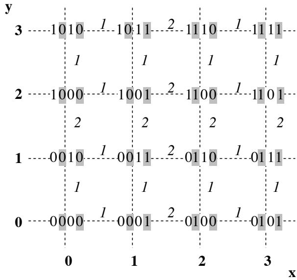
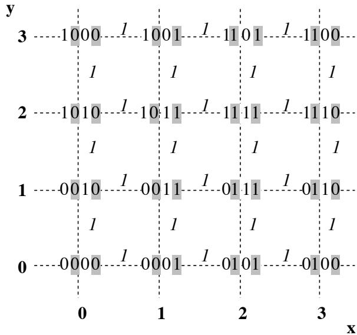
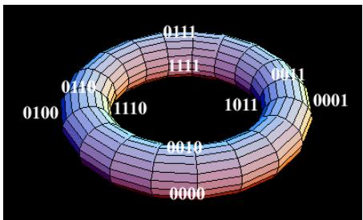
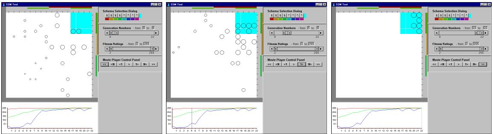
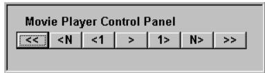
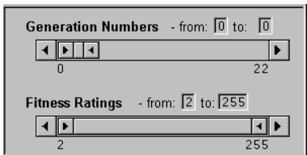
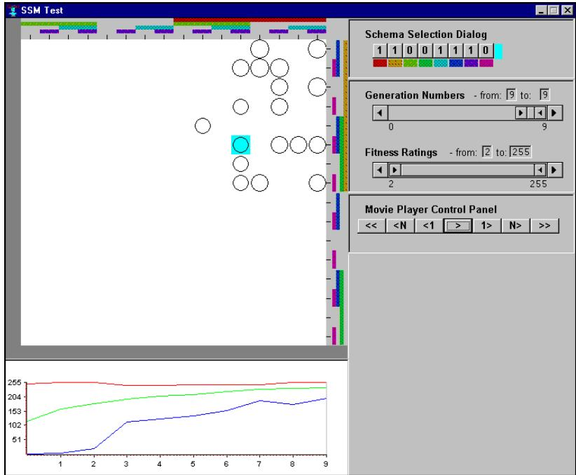
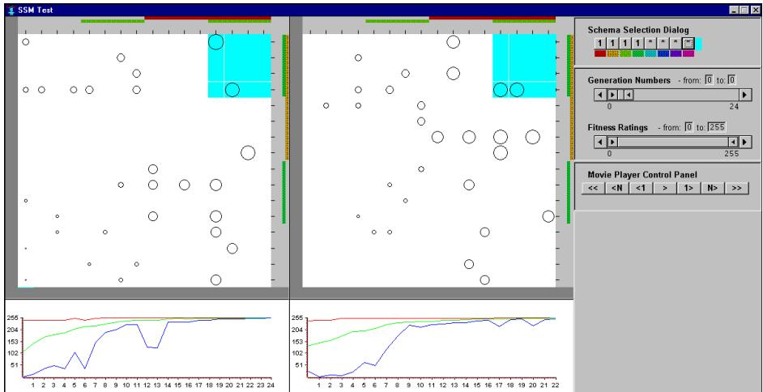
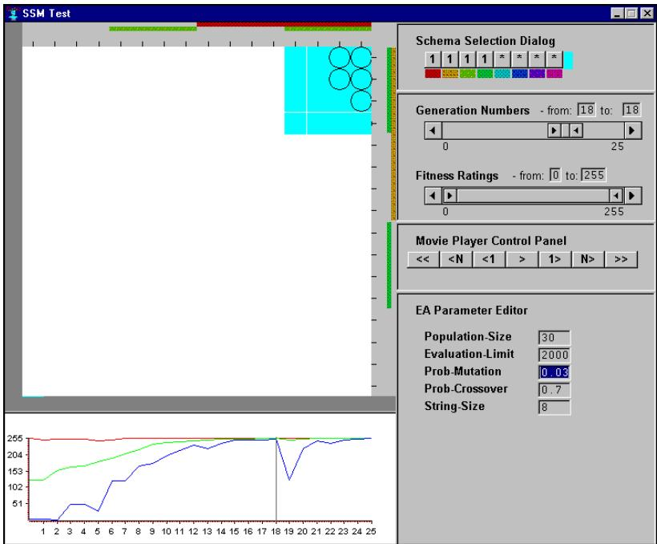

#

# KNOWLEDGE MEDIA INSTITUTE

# Understanding Evolutionary Computing: A Hands on Approach

Trevor D. Collins

KMI-TR-48

September 1997

<Submitted to the International Conference on Evolutionary Computing 1998, part of the 1998 IEEE World Congress on Computational Intelligence (WCCI'98)>

# Understanding Evolutionary Computing: A Hands on Approach

Trevor D. Collins Knowledge Media Institute The Open University UK

# Abstract

Evolutionary computing is the study of robust search algorithms based on the principles of evolution. An Evolutionary Algorithm (EA) searches a problem space in order to find possible solutions to a given problem. This paper is intended to highlight the advantages of using software visualization techniques in evolutionary computing: Firstly it describes how a high-dimensional problem space can be represented in two (or more) dimensions, suitable for visualization; secondly it introduces how EA designers can use this visualization to explore their algorithm's search behavior in the problem space; and thirdly, it explores how this "hands on" approach can be extended to the evolutionary process, in order to improve an algorithm's performance..

Keywords: Software Visualization, Search Space Matrices, Human-EA Interaction, Interactive Evolutionary Algorithms, Initialization Methods, Parameter Configuration..

Reference: KMi Technical Report KMi-TR-48 (September 1997).

Address: Knowledge Systems Group. Knowledge Media Institute. The Open University, Milton Keynes, UK. PHoNE: $+ 4 4$ 1908 655731, FAX: $+ 4 4$ 1908 653169, EMAIL: t.d.collins@open.ac.uk, URL: http://kmi.open.ac.uk/\~trevor.

# 1. Introduction

Evolutionary Algorithms (EAs) are robust search algorithms based on the guiding evolutionary principle of "survival of the fittest". A typical EA works as follows: a random initial population of possible solutions to a problem is generated, these possible solutions are then evaluated using a problem specific evaluation function, and evolved to create a new generation of hopefully better solutions. The evolutionary process (i.e. the application of fitness biased selection and reproduction operators) is repeated until an acceptable solution or set of solutions to the problem is discovered.

Software Visualization (SV) has been defined as "the use of the crafts of typography, graphic design, animation and cinematography with modern human-computer interaction technology to facilitate the human understanding and effective use of computer software" [19]. The application of SV techniques to facilitate the design and application of EAs has been receiving growing attention during the last few years; [2], [12], [20], [16], [7], [9], [21], and [5].

A widely recognized framework for understanding human memory, known as the "Levels of processing" framework, was proposed by Craik and Lockhart in 1972 [6]. They suggested that the level or depth of processing of a stimulus has a substantial effect on its memorability, and that deeper levels of analysis produce more elaborate, longer lasting, and stronger memory traces than do shallow levels of analysis. Recent empirical evaluations of SV seem to support this framework. Lawrence, Badre and Stasko [13] found that students who were able to control and interact with a variety of algorithm visualizations gained a better understanding of the algorithm's behavior than those who could only passively observe the visualizations.

It is proposed that through the use of interactive SV techniques an EA designer can adopt a "hands on" approach to evolutionary computing and hence gain a more comprehensive understanding of their algorithm's behavior. This paper investigates how a new EA visualization technique [5] can be applied to enable not only the observation of an EA's search, but also the user's interactive exploration of the problem space and their possible involvement in the evolutionary process. Section II describes the visualization technique. Section III illustrates how this technique may be used to explore the problem space (also referred to as the search space). Section IV examines some of the new opportunities visualization offers the user for interacting with and becoming a part of the evolutionary process. Section V concludes with a summary.

# 2. EA Visualization

EAs search a problem space for a suitable solution or set of solutions by sampling the problem space and evaluating the sampled points. The sampling method biases evolution toward those areas containing "fitter" (i.e. better) solutions. The sample points are strings of symbols referred to as "chromosomes". The individual symbols in a chromosome are called "alleles" and each symbol's position in a chromosome is known as its "locus". Each chromosome in a population is evaluated and given a "fitness rating". These populations of chromosomes and their fitness ratings are the data used in EAs and they are what must be visualized in order to understand an algorithm's search behavior.

Fitness ratings are commonly visualized on a 2 dimensional line graph of fitness rating (on the y axis) versus generation number (on the x axis). This method is extremely useful when used to illustrate the worst, average and best fitness ratings per generation using three separate lines on a single graph. However, visualizing the sample points in the search space is less common and more problematic, due to the high dimensional nature of most problem spaces. Some techniques for displaying population data are reviewed in [3] and [5].

The technique adopted here is referred to as the "Search Space Matrix" [5]. In this approach a two dimensional data matrix representing the complete search space can be constructed by successively dividing a blank data matrix into vertical and horizontal sections and filling each section with alternate alleles from the coding alphabet. For example, a four bit binary search space containing 16 different chromosomes, 0000 to 1111, can be represented on a 4 by 4 data matrix as shown in Figure 1.

  
Figure 1: An example of how a four bit binary matrix can be constructed. Horizontal section's alleles are labeled with a white background and vertical section's alleles are labeled with a grey background. The Hamming distances between neighbors are shown in italics.

As the variables in a binary data set are of base 2 the blank matrix is divided horizontally into two halves. In the bottom half the first value of each entry is set to 0 and in the upper half it is set to 1. The matrix is then split vertically with the second value in the first two columns being set to 0, and the second value in the second two columns being set to 1. This process is repeated for the third and fourth values; the third value with one row of Os, one row of 1s, one row of Os and one row of 1s, and finally the fourth value with one column of 0s, one column of 1s, one column of 0s and one column of 1s (see Figure 1).

The above matrix construction method can be characterized by the following direct linear equation:

$$
\ _ { d i m e n , s i o n \ d } ^ { c o o r d i n a t e \ i n } \ = \sum _ { i = d } ^ { i \geq p } W _ { i } \times X _ { i }
$$

Where $X$ is a chromosome of length $p$ Each locus $i$ has $B _ { i }$ different values, and the contributing weight of each locus is given by; $W _ { 1 \dots r } = 1$ and $W _ { r \dots p } = W _ { ( i - r ) } \times B _ { ( i - r ) }$ . $X _ { i }$ is the position of each allele in the coding alphabet for locus $i$ . $r$ is the number of matrix dimensions (typically 2 or 3) and $i$ is the current position marker indexed from the right at $i = 1$ in increments of $r$ . This characterization provides a more compact and effective way of presenting a population's chromosomes than constructing a data matrix of the complete search space prior to visualization.

This technique provides a direct linear function for translating each chromosome in a population to a unique coordinate. This can also be reversed to translate any coordinate back into its corresponding chromosome. Although this technique was developed independently, see [3], some similar approaches have since been discovered; William Shine and Christoph Eick have presented a coverage map of a Genetic Algorithm's (GA's) search using "quadcodes" [21], Ted Mihalisin, John Timlin and John Schwegler have produced a "hierarchical axes" technique for visualizing multivariate functions, data and distributions [15], and Jeffrey LeBlanc, Matthew Ward and Norman Wittels have proposed a "dimensional stacking" technique for exploring N-dimensional databases [14]. The remainder of this paper presents findings not considered by any of these similar techniques.

As an extension to the basic mapping technique a Gray coded weighting sum can be used to translate a chromosome. This results in an $r$ dimensional Gray code in which the Hamming distance between any neighboring pairs of chromosomes in the matrix is unitary, where $r$ is the number of matrix dimensions, see Figure 2 $\left( r = 2 \right)$ .

Moreover, like single dimensional Gray codes, the Hamming distance between the end values (i.e. the chromosomes on the top and bottom, and left and right edges) is also unitary. Hence, a search space matrix, based on a Gray coded weighting sum, is in effect the shape of a torus. Figure 3 shows an example of a torus labeled with the chromosomes from the four bit binary matrix given in Figure 2.

For search spaces which are too large for such a detailed view to be displayed directly in a single window, a zooming and panning interface mechanism is necessary. Two complementary views can then be used: a fine-grained view of the current area of interest, and a course-grained (or "birds-eye") view showing the entire search space in which the user can see their current focus.

# 3. Exploring Search Space

As described in the previous section, search space matrices can be used to visualize an entire search space. This section examines how this technique can be applied in order to understand an EA's evolutionary search. An EA repeatedly samples the search space during evolution, examining points (i.e. chromosomes and their fitness ratings) until an acceptable solution is discovered. By presenting an on-line (live) view of an algorithm's search in a problem space, the user gets an immediate impression of the algorithm's progress during evolution. In order to expand on the impression the user can get from an on-line visualization, an interactive visualization tool can be used to further explore the algorithm's search behavior.

  
Figure 2: An example of how a four bit binary matrix can be constructed using a Gray coded weighting structure. Horizontal section's alleles are labeled with a white background and vertical section's alleles are labeled with a grey background. The Hamming distances between neighbors is now always 1 and are shown here in italics.

Three control mechanisms for the exploration of an EA's search behavior are proposed; temporal, image content, and schema highlighting, controls. A temporal controller enables the user to step backwards and forwards along an algorithm's search path and examine each step taken. As well as examining the evolution a step at a time, a range of steps (i.e. generations) and fitness ratings can be identified using an image content controller, this helps the user examine more than the current generation and focus upon specific sections of the fitness landscape. Finally, the user can explore the schema contributions contained within their specified search section by defining a schema of interest and having the corresponding columns and rows of the matrix, along which such values lie, highlighted.

Figure 4 shows three example screen views of an EA visualization environment called "Gonzo" [4]. These were taken during a GA's search for a solution to the eight bit "MaxInt" problem (i.e. a search for an eight bit binary number with the maximum integer value). In these views, a search space visualization is shown in the top left hand corner, with the fitness rating versus generation number graph underneath it. Three example control mechanisms are shown on the right hand side of the screen. The search space visualization is constructed using a normally weighted search space matrix (as shown in Figure 1), each chromosome is represented as a circle whose diameter indicates the chromosome's fitness rating.

Using a "Movie Player Control Panel" (Figure 4, bottom right, and Figure 5) the user can explore the search path of an algorithm. Here the user can jump back to the start of evolution $< <$ generation 0), step back N generations $( < N )$ , step back one generation $\left( < ~ 1 \right)$ , play forward through evolution a generation at a time $( > )$ , step forward one generation $( 1 > )$ , step forward N generations $( N > )$ , or jump forward to the final generation $( > > )$ . A similar tool can also be used for controlling the algorithm's execution (this is not shown in these examples).

  
Figure 3: A torus illustrating the positions of the visible chromosomes taken from the Gray coded weighting matrix shown in Figure 2 . For clarity the hidden chromosomes are not labeled.   
Figure 4: A set of three screen views taken from an example EA visualization environment. These illustrate the evolution of a GA solving the eight bit "MaxInt" problem. These three images reflect the state of the GA at generations 0, 5 and 22, respectively.

  
Figure 5: A movie player control panel used to step through an algorithm's evolutionary search path.

The user can also identify ranges of data. Here, Alphasliders [18] are used to identify a section of EA data; the user can select the number of generations and range of fitness ratings to be displayed (Figure 4, middle right, and Figure 6). An alphaslider can be operated as follows: The start and end arrow buttons on the central slider bar can be dragged in order to identify a range of interest. A specified range can be dragged using the central slide bar, or moved forward and backward one step in the range by clicking on the outer scroll arrow buttons. Alternatively the user can edit the text labels in order to identify the start and end of a data range. The values of these alphasliders are also indicated on the fitness graphs in Figure 4 with a grey bounding-box.

  
Figure 6: An image content controller used to identify a range of generation numbers and fitness ratings to be displayed.

The third form of interactive exploration available to the user is the "Schema Selection Dialog" (Figure 4, top right, and Figure 7). This enables the user to select a schema of interest and have it highlighted on the search space matrix. Each locus is represented as a coloured band in the schema selection dialog and along the margin of the search space matrix. This enables the user to see the columns or rows on which a selected allele lies. Areas containing individuals from any generation with all of the selected values in a schema are highlighted with a coloured background (a grey square in Figure 4). A "1111\*\*\*\* schema has been selected in the example given in Figure 4. As the defined values (1111) are the most significant bits for a binary number, regions of the search space containing all four defined values will include the best solutions to the MaxInt problem.

  
Figure 7: A schema highlighting controller used to highlight the areas of the search space containing defined schema of interest.

Using these three interface control mechanisms collectively the user can explore the search behavior of an algorithm, identify the fitter areas of the search space and examine the impact of individual building blocks on the chromosomes' fitness ratings.

# 4. Human-EA Interaction

The following section describes how interaction in evolutionary computing is currently being used and explores how this can be improved. Examples of three areas in which visualization facilitates EA interaction are explained here: interactive EAs, EA initialization methods, and EA parameter configuration. The following three subsections identify the current limitations and weaknesses of the existing working practice in each of these areas before proposing an alternative.

# 4.1 Interactive EAs

Interactive Evolutionary Algorithms (IEAs) are a sub-set of EAs whose origin has been attributed to Richard Dawkins [8]. The use of IEAs has been described as a two stage process in which the user is first presented with every individual in the population in an appropriate form and then asked to evaluate each individual based on its perceived merit [23]. Essentially the user takes on the role of the evaluation function. This removes the need to formally specify the problem evaluation criteria. This approach has been applied to several novel problems such as graphic art [22], music [17] and knowledge discovery in databases [23].

The current use of IEAs limits the user's view of the search space to those points sampled by the current population and provides no information relating a chromosome's structure to the features of the resulting representation. Therefore, the user is currently unable to do any form of credit assignment for a chromosome's schema. By combining the first step in this process (i.e. displaying a chromosome in an appropriate form) with a search space visualization, such as that described in the previous section, the user can begin to explore the entire search space and examine the regions of the search space to which an individual could be expected to evolve. This form of interactive exploration (i.e. "foraging") affords the user an opportunity to interact with the search space and judge an individual not just on its overall appearance but also on its constituent parts and their ability to contribute toward new solutions. This enables the user to see the "bigger picture" outside of the sub-space sampled by the current population (Figure 8).

  
Figure 8: An example screen view illustrating how a search space visualization can be used to examine the structure of a specific chromosome (11001110) prior to its evaluation by the user in an IEA.

This foraging approach can also be applied to non-interactive EAs (i.e. those which do not rely on the user to evaluate the chromosomes). The efficacy of an evaluation function can be easily verified by exploring the search space and identifying the behavior of the evaluation function. Alternatively, when the user is confident in the evaluation method they have adopted, they can seek out and identify schemata of interest within their algorithm's evolutionary search.

# 4.2 EA Initialization Methods

In a canonical GA (such as the SGA model described by Goldberg [10]) the initial population is created as a set of random valued chromosomes. Several alternative methods have since been explored in order to improve the performance of such algorithms. Bramlette [1] introduced an initialization method that selects the best individuals from a set of randomly created chromosomes. Kallel and Schoenauer [11] examined a "Uniform Covering" method that ensures an even distribution of each allele in the coding alphabet throughout the initial population, and a "Homogeneous Block" method that favors sequences of Os and 1s in the chromosomes of the initial population.

Any of these approaches would benefit from visualization. Bramlette's selection of the best "N" individuals to create the initial population would be visually reinforced with the state space matrix view presented in section II. Similarly Kallel and Schoenauer's comparison of two alternative initialization methods would be supported by visualizing the search space for both and stepping through their evolution a generation at a time (Figure 9).

  
Figure 9: An example screen view illustrating how a search space visualization can be used to compare two initialization methods and their algorithm's resulting evolution.

An interactive visualization tool (such as Gonzo) can also be used to create the initial population of an EA. As the translation method used in search space matrices is a two way mapping (i.e. a chromosome can be translated to a coordinate and a coordinate can be translated to a chromosome) the user can explore the search space and identify individuals for inclusion in the population. Hence, the user can not only set the initial population, but also re-introduce diversity or guide convergence toward interesting areas in the search space, at any stage during evolution. Again, the functionality of this form of interaction can be extended by the use of additional interface mechanisms.

# 4.3 EA Parameter Configuration

The effect of different parameter settings on an EA is an important aspect of the designer's expert knowledge. Without visualization the designer can only retrospectively analyze the effects of their parameter settings. Several graphical EA environments permit the user to vary the parameter settings during evolution (for example "GA Meter" [12], "GIGA" [7]), however these tools do not visualize the algorithm's exploration of the search space and therefore it is still difficult to relate any parameter changes to the behavior of the algorithm. Again here there is an advantage to using a search space representation. With a visualization tool (such as [4]) the user can observe their algorithm's evolution and monitor the effect of editing their original parameter settings (Figure 10). This is not just a useful pedagogical tool, it can also be applied to "fine tune" the behavior of an algorithm during evolution.

  
Figure 10: An example screen view illustrating how a search space visualization can be used to explore the effect of editing an algorithm's parameters during evolution.

# 5. Conclusion

Software visualization offers much more to evolutionary computing than a mere display: it offers the user an opportunity to interactively explore evolutionary computing. One such visualization technique, the "Search Space Matrix", has been described. A tool using this technique was used in order to highlight how SV can be applied to interactively explore the behavior of an EA. By adopting more of a "hands on" approach to evolutionary computing it is intended that a better understanding of an algorithm's search behavior will be achieved.

In addition to exploring the search path of an algorithm, this technique can be used to facilitate user interaction at any stage in the evolutionary process. Three extensions to the current working practice of EA designers have been proposed in the areas of interactive evaluation, initialization and parameter configuration:

1. Interactive evaluation for IEAs is intended to help the user make an informed decision about the quality of an individual by presenting it within the context of the search space and identifying those areas with which it can be associated.   
2. The development and application of novel initialization methods will be supported by presenting an explicit representation of the resulting initial population. Moreover, this can then be analyzed and edited using an appropriate interface mechanism.   
3. The identification of a suitable set of algorithm parameters may be supported by presenting a view of the search space during evolution. Hence, the search behavior of an algorithm's original parameter settings can be seen as well as the effects of any changes made during evolution.

People involved in the application or development of evolutionary computing have a great deal to gain from SV. It is through the exploitation of interactive visualization techniques, such as those presented here, that people may further their understanding of EAs and the additional benefits of "Human-EA Interaction" may be achieved.

The use of SV to facilitate both the understanding and effective use of evolutionary computing is the focus of a number of current research projects. This offers new opportunities for those involved in evolutionary computing to interact with their algorithms during evolution. However, little work on the efficacy of this approach has been done. Future work will involve empirically assessing not only these forms of visualization, but also the opportunities for human interaction and intervention that they create.

# Acknowledgments

I would like to thank the Engineering and Physical Sciences Research Council for funding this work (EPSRC Studentship 94315065) and the members of the Open University's Knowledge Media Institute who helped comment on earlier drafts of this document, particularly John Domingue, Tony Hirst, Simon Masterton, Paul Mulholland, Marco Ramoni and Stuart Watt.

# Список литературы

[1] M.F. Bramlette. Initialisation, mutation and selection methods in genetic algorithms for function optimization. In R.K. Belew and L.B. Booker, editors, Proceedings of the Fourth International Conference on Genetic Algorithms (ICGA'91), pages 100-107, 1991.

[2] H.W. Cartwright and G.F. Mott. Looking Around: Using clues from the data space to guide genetic algorithm searches. In R.K. Belew and L.B. Booker, editors, Proceedings of the Fourth International Conference on Genetic Algorithms $( I C G A ^ { \prime } { \boldsymbol { \mathit { g } } } 1 )$ , pages 108- 114, 1991.

[3] T.D. Collins. Genotypic-space mapping: Population visualization for genetic algorithms. Technical Report KMi-TR-39, The Knowledg Media Institute, The Open University, Milton Keynes MK7 6AA, UK., September 1996.

[4] T.D. Collins. Gonzo: An evolutionary algorithm visualization tool, January 1997. Details available from http://kmi.open.ac.uk/\~trevor/Viz/tools/.

[5] T.D. Collins. Using software visualization technology to help evolutionary algorithm users validate their solutions. In Proceedings of the Seventh International Conference on Genetic Algorithms (ICGA '97), pages 307314, East Lansing, MI., USA, August 1997.

[6] F.I.M. Craik and R.S. Lockhart. Levels of processing: A framework for memory research. Journal of Verbal Learning and Verbal Behavior, 11:671684, 1972.

[7] T. Dabs and J. Schoof. A graphical user interface for genetic algorithms. Technical Report 98, Lehrstuhl fur Informatik II, University Wurzburg, DE., February 1995.

[8] R. Dawkins. The Blind Watchmaker. Longman, 1986.

[9] R. Dybowski, T.D. Collins, and P.R. Weller. Visualization of binary string convergence by sammon mapping. In L.J. Fogel, P.J. Angeline, and T. Baeck, editors, The Fifth Annual Conference on Evolutionary Programming (EP96), pages 377-383, San Diego, CA., 1996. MIT Press.

[10] D.E. Goldberg. Genetic Algorithms in Search Optimization and Machine Learning. Addison Wesley, 1989.

[11] L. Kallel and M. Schoenauer. Alternative random initialization in genetic algorithms. In Proceedings of the Seventh International Conference on Genetic Algorithms (ICGA '97), pages 268275, East Lansing, MI., USA, August 1997.

[12] A. Kapsalis and G.D. Smith. The GAmeter Development Toolkit User Interface Manual, 1992.

[13] A.W. Lawrence, A.N. Badre, and J.T. Stasko. Empirically evaluating the use of animations to teach algorithms. Technical report, Graphics,Visualization, and Usability Center, College of Computing, Georgia Institute of Technology, Atlanta, GA 30332- 0280, 1994.

[14] J. LeBlanc, M.O. Ward, and N. Wittels. Exploring n-dimensional databases. In Proceedings of the IEEE Conference on Visualization 1991, pages 230237, San Francisco, CA., USA, October 1991.

[15] T. Mihalisin, J. Timlin, and J. Schwegler. Visualizing multivariate functions, data, and distributions. IEEE Computer Graphics and Applications, pages 2835, May 1991.   
[16] B. Nassersharif, D. Ence, and M. Au. Visualisation of evolution of genetic algorithms. In Proceedings of the World Congress on Neural Networks, volume 1, pages 1-5601- 565, San Diego, CA., USA, 1994.   
[17] G.L. Nelson. Sonomorphs: An application of genetic algorithms to the growth and development of musical organisms. In Proceedings of the Fourth Biennal Art and Technology Symposium, pages 155169, Connecticut, USA, March 1993.   
[18] M. Osada, H. Liao, and B. Shneiderman. Alphaslider: Searching textual lists with sliders. In Proceedings of the Ninth Annul Japanese Conference on Human Interfaces, October 1993.   
[19] B.A. Price, R.M. Baecker, and I.S. Small. A principled taxonomy of software visualisation. Journal of Visual Languages and Computing, 4:211-266, 1993.   
[20] T. Routen and T. Collins. Visualisation of A.I. techniques. In Proceedings of the International Conference on Computer Graphics and Visualization (COMPUGRA PH'93), Portugal, 1993. ACM Press.   
[21] W.B. Shine and C.F. Eick. Visualizing the evolution of genetic algorithm search processes. In Proceedings of the 1997 IEEE International Conference on Evolutionary Computation (ICEC'97), pages 367372, 1997.   
[22] S. Todd and W. Latham. Evolutionary Art and Computers. Academic Press, 1992.   
[23] G. Venturini, M. Slimane, F. Morin, and J.P. Asselin de Beauville. On using interactive genetic algorithms for knowledge discovery in databases. In Proceedings of the Seventh International Conference on Genetic Algorithms $( I C G A ` g 7 )$ , pages 696703, East Lansing, MI, USA, August 1997.