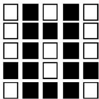
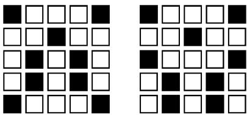

# A combinatorial problem associated with nonograms

Jessica Benton, Rion Snow, Nolan Wallach

Department of Mathematics, University of California-San Diego, La Jolla, CA 92093-0112, United States

Received 21 August 2004; accepted 5 April 2005 Available online 11 October 2005 Submitted by R. Guralnick

# Abstract

Associated with an $m \times n$ matrix with entries 0 or 1 are the $m$ -vector of row sums and $n$ -vector of column sums. In this article we study the set of all pairs of these row and column sums for fixed $m$ and $n$ . In particular, we give an algorithm for finding all such pairs for a given $m$ and $n$ .

$\mathbb { O } 2 0 0 5$ Elsevier Inc. All rights reserved.

Keywords: Row; Column; Matrix; Partition; Dominant

# 1. Introduction

This work was motivated by a question posed by the second named author to the first named author about a game that goes by many names but we will refer to it here as the nonogram game. We first describe a nonogram. The starting point is an $m \times n$ board with all squares white. One puts black squares in a selection of positions on the board for example:

We have a “picture” in a $5 \times 5$ board. Now one looks at each row and puts together a sequence of positive integers that gives a list of the numbers of contiguous black squares and one gets a sequence of $m$ lists. One does the same for the columns getting $n$ lists. The nonogram is this pair of lists of lists. Thus the nonogram associated with the above picture is

The puzzle is to be given a nonogram and to construct a picture that yields it. Thus the picture above is a solution to the corresponding nonogram. One can see easily that this nonogram has a unique solution (i.e. picture). We note that the two pictures below are solutions to

There are also nonograms that are not related to pictures. For example, [[5], [1, 1, 1], [1], [1], [1]], [[1, 2], [5], [1], [1], [1]].

No “good” algorithms have been found to determine if a nonogram corresponds to a picture and, if so, find a picture. In fact, this leads to an NP-complete problem.

Having described the actual puzzle let us describe the question. We simplify the nonogram and replace the arrays of arrays with row sums and column sums where we think of the original picture as an $m \times n$ matrix with entries consisting of 0 or 1. Thus the first picture above yields (2, 3, 2, 4, 3) for the rows and (1, 5, 2, 5, 1) for the columns. The second pair give $( 2 , 1 , 2 , 2 , 2 )$ , (2, 2, 1, 2, 2). The question is how many possible pairs of row sums and column sums are there for $m \times n$ matrices with entries consisting only of 0 or 1? Is there a method of finding all such possiblities? For example the impossible nonogram above corresponds to $( 5 , 3 , 1 , 1 , 1 )$ , $( 3 , 5 , 1 , 1 , 1 )$ which is not even possible as a row and column sum of such a $5 \times 5$ matrix. The second named author found that for $1 \times 1 , 2 \times 2 , 3 \times 3 , 4 \times 4$ the number of such is respectively, 2, 15, 328, 16145.

In this paper we give a method of answering both questions. It is very intriguing that this seemingly innocent question led us to look at fairly deep aspects of the combinatorics of the symmetric group and a further property of Young’s raising operators (actually we do lowering) and Schur functions. We also develop a $q$ analogue of the question and a conjecture about divisibility by the $q$ -analogue of $n + 1$ , for the case of $n \times n$ matrices (notice that the numbers above are respectively divisible by 2, 3, 4, 5). Goldstein and Stong [2] have proved recursion formula for this $q$ analogue and in particular give a relatively fast recursion to count the possible pairs and a proof of the conjecture.

Goldstein and Stong have pointed out to the authors that the main theorem in this paper, Theorem 6, can be found in the standard literature (cf. [1,3]). Our method of proof is different and it yields an algorithm for constructing the pertinent matrices.

# 2. Row and column sum

We denote by $B _ { m , n }$ the set of all $m \times n$ matrices with entries in the set $\{ 0 , 1 \}$ . If $M \in$ $B _ { m , n }$ then we write $M = [ m _ { i j } ]$ . We set $\begin{array} { r } { x _ { i } ( M ) = \sum _ { j } m _ { i j } } \end{array}$ for $i = 1 , \ldots , m$ and set $\begin{array} { r } { y _ { j } ( M ) = \sum _ { i } m _ { i j } } \end{array}$ for $j = 1 , \dots , n$ . We put $x ( M ) { \overset { \cdot } { = } } ( x _ { 1 } ( M ) , x _ { 2 } ( M ) , \ldots , x _ { m } ( M ) )$ and $y ( M ) = ( y _ { 1 } ( M ) , y _ { 2 } ( M ) , \dots , y _ { n } ( M ) ) ,$ . In what follows the notation will not be consistent with right and left actions of groups. The lemma below should clarify the inconsistencies. If $\sigma \in S _ { m }$ and if $M = [ m _ { i j } ]$ is an $m \times n$ matrix then we set $\sigma M = [ m _ { \sigma i , j } ]$ and if $\sigma \in S _ { n }$ then we set $M \sigma = [ m _ { i , \sigma j } ]$ . If $v = ( v _ { 1 } , \ldots , v _ { n } )$ then we set $v \sigma = ( v _ { \sigma 1 } , \ldots , v _ { \sigma n } )$ for $\sigma \in S _ { n }$ . The following result is proved by the obvious calculation.

Lemma 1. With these notations in place we have

$$
x ( \sigma M ) = x ( M ) \sigma , \quad y ( \sigma M ) = y ( M )
$$

and

$$
x ( M \sigma ) = x ( M ) , \quad y ( M \sigma ) = y ( M ) \sigma .
$$

We set $R C ( m , n ) = | \{ ( x , y ) | x = x ( M )$ , $y = y ( M )$ , $M \in B _ { m , n } \} |$ . We are interested in calculating this function. We set $\mathcal { R } C ( m , n ) = \{ ( x , y ) | x = x ( M )$ ), $y = y ( M )$ , $M \in B _ { m , n } \}$ . Clearly, $R C ( m , n ) = | \mathcal { R } C ( m , n ) |$ . We will now give a preliminary description of ${ \mathcal { R } } C ( m , n )$ .

We say that an element $x \in \mathbb { N } ^ { n }$ is dominant if $x _ { i } \geqslant x _ { i + 1 }$ for $i = 1 , \ldots , n - 1$ . If $x \in \mathbb { N } ^ { n }$ then there exists a unique dominant element of the form $x \sigma$ with $\sigma \in S _ { n }$ . Set $\mathcal { R } C _ { + } ( m , n ) = \{ ( x , y ) \in \mathcal { R } C ( m , n ) | x , .$ $y$ dominant . If $x \in \mathbb { N } ^ { n }$ is dominant then we set o $r b _ { n } ( x ) = \{ x \sigma | \sigma \in S _ { n } \}$ . For such $x$ we define $l _ { 1 } , \ldots , l _ { p } > 0 \mathrm { w i t h } l _ { 1 } + \cdot \cdot \cdot + l _ { p } =$ $n$ and $\mathfrak c _ { 1 } = \cdot \cdot \cdot = x _ { l _ { 1 } } , x _ { l _ { 1 } + 1 } = \cdot \cdot \cdot = x _ { l _ { 1 } + l _ { 2 } } , x _ { l _ { 1 } + l _ { 2 } + 1 } = \cdot \cdot \cdot = x _ { l _ { 1 } + l _ { 2 } + l _ { 3 } } , \cdot \cdot \cdot$ Then |orbn(x)| = n!l1 lp . We set $\lambda _ { n } ( x ) = ( l _ { 1 } , \ldots , l _ { p } )$ . If $\alpha \in \mathbb { N } ^ { p }$ then we set $\alpha ! = \alpha _ { 1 } ! \cdots$ $\begin{array} { r } { \alpha _ { p } ! } \end{array}$ .

Lemma 2. We have

$$
\begin{array} { r } { R C ( m , n ) = \displaystyle \sum _ { ( x , y ) \in \mathcal { R } C _ { + } ( m , n ) } \vert o r b _ { m } ( x ) \vert \vert o r b _ { n } ( y ) \vert } \\ { = m ! n ! \displaystyle \sum _ { ( x , y ) \in \mathcal { R } C _ { + } ( m , n ) } \frac { 1 } { \lambda _ { m } ( x ) ! \lambda _ { n } ( y ) ! } . } \end{array}
$$

Our problem is, thus, to determine the elements of $\mathcal { R } C _ { + } ( m , n )$ . If ${ \bf \dot { \boldsymbol { x } } } = ( x _ { 1 } , \dots , x _ { m } )$ is dominant and $x _ { 1 } \leqslant n$ then we can define $M \in B _ { m , n }$ by $m _ { 1 i } = 1$ for $i = 1 , \ldots , x _ { 1 }$ , $m _ { 2 i } = 1$ for $i = 1 , \ldots , x _ { 2 }$ , etc. and all other entries 0. Then $x = x ( M )$ and we set $\mu ( x ) = y ( M )$ . In the theory of partitions $\mu ( x )$ is the dual partition of $x$ possibly expanded to have $n$ rows by including 0 rows. We note that $( x , \mu ( x ) ) \in \mathcal { R } C _ { + } ( m , n )$ . If $x$ is dominant and $x _ { 1 } \leqslant n$ then we set $Y ( x ) = \{ y | ( x , y ) \in { \mathcal { R } } C _ { + } ( m , n ) \}$ . Thus $\mu ( x ) \in Y ( x )$ .

We now define two orders on $\mathbb { N } ^ { n }$ $\mathbb { N } = \{ 0 , 1 , 2 , \ldots \} )$ . The first is the lexicographic order that is $x > y$ if $x _ { i } = y _ { i }$ for $i < j$ and $x _ { j } > y _ { j }$ . The other is the root order (or dominance order) which is only a partial order that is $x \succ y$ if $\textstyle \sum _ { i \leqslant j } ( x _ { i } - y _ { i } ) \geqslant 0$ for all $j = 1 , \dots , n$ and at least one of these sums is positive. If $0 \leqslant r \leqslant m n$ we define $\nu _ { r } = \nu _ { r , m , n }$ a dominant element of $\mathbb { N } ^ { n }$ as follows: Let $c \geqslant 0$ be defined by

$$
( c - 1 ) n < r \leqslant c n .
$$

Then since $r \leqslant m n$ we see that $0 \leqslant c \leqslant m$ . Define $( \nu _ { r } ) _ { i } = c$ for $i = 1 , \ldots , r - ( c -$ $1 ) n$ , and $( \nu _ { r } ) _ { i } = c - 1$ for $i > r - ( c - 1 ) n .$ Notice that if $r = 0$ then $c = 0$ and $r \mathrm { ~ - ~ }$ $( c - 1 ) n = n$ so $\nu _ { 0 } = ( 0 , \ldots , 0 )$ . If $0 < r \leqslant n$ then $c = 1$ and $\nu _ { r } = ( 1 , 1 , \ldots , 1 , 0$ , $\ldots , 0 )$ with $r$ ones. If $r > n$ then $c > 1$ we have $\nu _ { r }$ is dominant and

$$
\begin{array} { c } { { \displaystyle \sum _ { i } ( \nu _ { r } ) _ { i } = c ( r - ( c - 1 ) n ) + ( c - 1 ) ( n - r + ( c - 1 ) n ) } } \\ { { \mathrm { } } } \\ { { = c ( r - ( c - 1 ) n ) + ( c - 1 ) ( c n - r ) = r . } } \end{array}
$$

In general if $x \in \mathbb { N } ^ { n }$ then we set $| x | = x _ { 1 } + \cdot \cdot \cdot + x _ { n }$

Lemma 3. Let $0 \leqslant r \leqslant m n$ and let $\mathcal { P } _ { m , n } ( r )$ denote the set of all $x$ dominant with $x _ { i } \leqslant m$ and $| x | = r .$ . Then $\nu _ { r , m , n }$ is the unique minimal element in $\mathcal { P } _ { m , n } ( r )$ relative to both the lexicographic and the root order.

Proof. Let $x \in \mathcal { P } _ { m , n } ( r )$ and suppose that $x _ { 1 } < c$ then $x _ { 1 } \leqslant c - 1$ thus $| x | \leqslant ( c -$ $1 ) n < r$ . Set $k = r - ( c - 1 ) n$ . Then if $x _ { i } = c$ for $i < j \leqslant k$ and $x _ { j } < c$ then the same argument shows that $| x | < r$ . Thus we must have $x _ { i } = c$ for $i = 1 , \ldots , k .$ . Now assume that $| x | = r$ and $x \leqslant \nu$ in the lexicographic order. Thus we have $x _ { i } = c \operatorname { f o r } i =$ $1 , \ldots , k$ and $x _ { k + 1 } \leqslant c - 1$ . If $x _ { i } = c - 1$ for $i = k + 1 , \ldots , k + l - 1$ but $x _ { k + l } <$ $c - 1$ then $| x | < r$ . Thus the assertion about the lexicographic order follows. We will now prove the assertion about the root order. We first observe that if $x$ , $\boldsymbol { y } \in \mathbb { N } ^ { n }$ and if $x \succ y$ and if $| x | = | y |$ then

$$
x = y + \sum _ { i < j } a _ { i j } ( e _ { i } - e _ { j } ) ,
$$

with $e _ { i }$ the usual vector with a one in the $i$ th position and all the other entries 0 with each $a _ { i j }$ a non-negative integer and some $a _ { i j } > 0$ . Assume that $a _ { i j } = 0$ for $i < i _ { 0 }$ and $\begin{array} { r } { a = \sum _ { j } a _ { i _ { 0 } j } > 0 } \end{array}$ . Then $x _ { i } = y _ { i }$ for $i < i _ { 0 }$ and $x _ { i _ { 0 } } = y _ { i _ { 0 } } + a > y _ { i _ { 0 } }$ . Thus if $x \succ y$ then $x > y$ . This implies that $\nu _ { r }$ is a minimal element relative to the root order. We will now show that it is the only one. We note that $\lambda ( \nu _ { r } ) = ( r - ( c - 1 ) n , c n - r )$ (if $c = 0$ then $r = 0$ and we should interpret this as only having one entry, similarly for $r = u n \thinspace \mathrm { s o } { c } = u ,$ ). If $x \in \mathcal { P } _ { m , n } ( r )$ and if $x _ { i } - x _ { i + 1 } \geqslant 2$ then $x - e _ { i } + e _ { i + 1 } \in \mathcal { P } _ { m , n } ( r )$ . So $x$ cannot be minimal in $\mathcal { P } _ { m , n } ( r )$ . Thus if $x$ is minimal then $x _ { i } - x _ { i + 1 } \leqslant 1$ . Suppose now that $\lambda ( x ) = ( l _ { 1 } , \ldots , l _ { p } )$ with $p \geqslant 3$ . Then $x - e _ { l _ { 1 } } + e _ { l _ { 1 } + l _ { 2 } + 1 } \in \mathcal { P } _ { m , n } ( r )$ . Thus if $x$ is minimal with respect to the root order then $p = 1$ or 2. If $p = 1$ then $x = ( u , \ldots , u )$ and so $r = u n$ and $\nu _ { r } = x$ . If $p = 2$ then if $x$ were minimal then $x _ { 1 } = u$ and $x _ { l _ { 1 } + 1 } = u - 1$ . Thus we have

$$
u l _ { 1 } + ( u - 1 ) l _ { 2 } = r
$$

and

$$
l _ { 1 } + l _ { 2 } = n .
$$

Hence $l _ { 2 } = u n - r$ . Since $l _ { 2 } > 0$ we see that $u \geqslant c$ . If $u > c$ then $l _ { 1 } = n - l _ { 2 } =$ $n - u n + r = r - ( u - 1 ) n < 0 .$ . Thus $u = c$ so $x = \nu _ { r }$ . 

The technique in the proof of the preceding lemma suggests some operations on the elements of $\mathcal { R } C _ { + } ( m , n )$ which we will make precise in the next section.

# 3. Some operations on dominant elements

If $x \in \mathcal { P } _ { m , n } ( r )$ recall that $Y ( x ) = \{ y \in \mathcal { P } _ { m , n } ( r ) | ( x , y ) \in \mathcal { R } C _ { + } ( m , n ) \}$ . In this section we study two operations on $Y ( x )$ that decrease elements in the root order.

Move 1. If $y \in Y ( x )$ and $y _ { i } - y _ { i + 1 } > 1$ then $y - e _ { i } + e _ { i + 1 } \in Y ( x )$ .

Indeed, let $M \in B _ { m , n }$ be such that $x = x ( M )$ and $y = y ( M )$ . Suppose that $m _ { k i } = 1$ implies that $m _ { k i + 1 } = 1$ for all $k = 1 , \ldots , n$ . Then $y _ { i } \leqslant y _ { i + 1 }$ . Since we have assumed the contrary, there exists $k$ so that $m _ { k i } = 1$ and $m _ { k i + 1 } = 0$ . Thus if $M ^ { \prime } = \left[ m _ { r s } ^ { \prime } \right]$ with $m _ { r s } ^ { \prime } = m _ { r s }$ for $( r , s ) \not \in \{ ( k , i ) , ( k , i + 1 ) \}$ and $m _ { k i } ^ { \prime } = 0$ , $m _ { k i + 1 } ^ { \prime } = 1$ then $\bar { x } ( M ^ { \prime } ) = x$ and $y ( M ^ { \prime } ) = y - e _ { i } + e _ { i + 1 }$ . Since $y _ { i } \geqslant y _ { i + 1 } + 2$ , $y - e _ { i } + e _ { i + 1 }$ is dominant.

Move 2. If $y \in Y ( x )$ and if $y _ { i } > y _ { i + 1 } \geqslant y _ { i + 2 } \geqslant \cdot \cdot \cdot \geqslant y _ { i + k } > y _ { i + k + 1 }$ then $y - e _ { i } +$ $e _ { i + k + 1 } \in Y ( x )$ .

Indeed, let $M \in B _ { m , n }$ be such that $x = x ( M )$ and $y = y ( M )$ . Arguing as in the justification of Move 1 we see that there exists $1 \leqslant l \leqslant n$ with $m _ { l i } = 1$ and $m _ { l , i + k + 1 } = 0$ . Define $M ^ { \prime }$ as above to have all entries but the ones in the $l , i$ and the $l , i + k + 1$ positions the same as those of $M$ but with the two indicated values interchanged. Then as above $x = x ( M ^ { \prime } )$ and $y - e _ { i } + e _ { i + k + 1 } = y ( M ^ { \prime } ) \in Y ( x )$ .

Lemma 4. Let $0 \leqslant r \leqslant m n$ and let $x \in \mathscr { P } _ { m } ( r )$ . Then $\mu ( x )$ is the maximum element of $Y ( x )$ with respect to the lexicographic order and it is the unique maximal element of $Y ( x )$ with respect to the root order. Also $\nu _ { m , n , r }$ is the minimal element in $Y ( x )$ with respect to the lexicographic order and the unique minimal element in $Y ( x )$ with respect to the root order.

Proof. Let $z = \mu ( x )$ and let $y \in Y ( x )$ . Let $M \in B _ { n }$ be such that $x ( M ) = x$ and $y ( M ) = y$ . Then we note that the number of $j$ with $m _ { j , 1 } = 1$ is equal to $y _ { 1 }$ and is less than the number of $j$ such that $x _ { j } \neq 0$ . Thus $y _ { 1 } \leqslant z _ { 1 }$ and if $y _ { 1 } = z _ { 1 }$ then $m _ { j 1 } = 1$ precisely if $x _ { j } \neq 0$ . We show by induction that if $y _ { i } = z _ { i }$ for $i \leqslant k - 1$ then $y _ { k } \leqslant z _ { k }$ and if $y _ { k } = z _ { k }$ then $m _ { j k } = 1$ precisely when $x _ { j } \geqslant k$ . We have proved this for $k = 1 .$ Assume for $k \leqslant l$ and we will now prove it for $k = l + 1$ . Suppose that $y _ { k } > z _ { k }$ . Then then the number of $j$ such that $m _ { j k } = 1$ is larger than the number of $l$ such that $x _ { l } \geqslant k$ . Thus there exists $l$ with $x _ { l } \leqslant k - 1$ and $m _ { l , k } = 1$ . The inductive hypothesis implies that $m _ { l s } = 1 \mathrm { f o r } s = 1 , \dots , x _ { l }$ . But then if $m _ { l , k } = 1$ we would have $x _ { l } > x _ { l }$ . This contradiction shows that $y _ { k } \leqslant z _ { k }$ and that $m _ { j k } = 1$ implies that $x _ { j } \geqslant k$ . We have observed that of $\alpha \succ \beta$ then $\alpha > \beta$ . This shows that $z = \mu ( x )$ is maximal in $Y ( x )$ in the root order.

Set $\widetilde { Y } ( x ) = \{ y | ( x , y ) \in \mathcal { R } C ( m , n ) \}$ . Suppose that $y \in \widetilde { Y } ( x )$ is maximal in the root order. Then we assert that $y \in Y ( x )$ (we will leave this as an exercise to the reader). Thus the maximal elements of $Y ( x )$ are exactly the same as those of $\widetilde { Y } ( x )$ . Now let $y \in Y ( x )$ be maximal in the root order. Let $M \in B _ { m , n }$ be such that $x ( M ) = x$ and $y ( M ) = y$ . Suppose that $y _ { 1 } < z _ { 1 }$ . Then the number of indices such that $m _ { j , 1 } = 1$ must be less than the number of $j$ such that $x _ { j } > 0$ . Hence there is a $j$ with $x _ { j } > 0$ and $m _ { j , 1 } = 0 $ . Hence there must be a $k > 1$ with $m _ { j , k } = 1 .$ . If we define $M ^ { \prime }$ to have the same entries as $M$ except that $m _ { j , \underline { { { 1 } } } } ^ { \prime } = 1$ and $m _ { j , k } ^ { \prime } = 0$ then $x ( M ^ { \prime } ) = x$ and $y ( M ^ { \prime } ) =$ $\boldsymbol { y } + \boldsymbol { e } _ { 1 } - \boldsymbol { e } _ { k }$ . Thus $y ( M ^ { \prime } ) \succ y$ in $\breve { Y } ( x )$ . This is a contradiction. Now suppose that we have shown that $y _ { i } = z _ { i }$ for $i \leqslant k - 1$ . But $y _ { k } < z _ { k }$ . Then we can apply the argument in the previous part to see that $x _ { j } \geqslant k - 1$ if and only if $m _ { j l } = 1$ for $j \leqslant k - 1 .$ Now since $y _ { k } < z _ { k }$ there must be an index $j$ such that $x _ { j } \geqslant k$ but $m _ { j k } = 0$ . There must therefore be an index $s > k$ with $m _ { j \underline { { s } } } = 1$ . We can therefore argue as in the case when $k = 1$ to see that $y + e _ { k } - e _ { s } \in \widetilde { Y } ( x )$ . The obvious induction now shows that $y$ is greater than $z$ in the lexicographic order.

The last assertion is implied by Lemma 3. 

Theorem 5. Let $0 \leqslant r \leqslant$ mn and let $x \in \mathscr { P } _ { m } ( r )$ . Then $Y ( x ) = \{ y \in \mathcal { P } _ { n } ( r ) | \mu ( x ) \succeq$ $y \succeq \nu _ { r } \}$ .

We will actually prove a much more general result. In the following $\mathcal { P } _ { n } ( r )$ can be replaced by the set of all dominant $n$ -tuples with non-negative entries that sum to $r$ . The condition that the entries need be at most $m$ can be dropped.

Theorem 6. Let z, $y \in \mathcal { P } _ { n } ( r )$ with $z \succeq y$ then there exist elements $z ^ { ( i ) } \in \mathcal { P } _ { n } ( r )$ , $i =$ $0 , \ldots , m$ such that $z ^ { ( 0 ) } = z$ and $z ^ { ( m ) } = y$ and $z ^ { ( i + 1 ) }$ is obtained from $z ^ { ( i ) }$ by a Move 1 or a Move 2.

Theorem 5 follows from Theorem 6. Indeed, we have observed that these “moves” preserve $Y ( x )$ . So applying Theorem 6 to $\mu ( x )$ we will have proved Theorem 5. We note that the proof we give of Theorem 6 actually gives an algorithm for the construction of the connecting sequence. Here is a demonstration. Consider $z =$ (7, 5, 5, 3, 3, 3, 2) and $y = ( 5 , 5 , 4 , 4 , 4 , 4 , 2 )$ . Then $z - y = ( 2 , 0 , 1 , - 1 , - 1 , - 1 , 0 )$ . So $z \succ y$ . The method of the proof below would choose $z ^ { ( 1 ) } = ( 6 , 6 , 5 , 3 , 3 , 3 , 2 )$ by Move 1, $z ^ { ( 2 ) } = ( 6 , 5 , 5 , 4 , \bar { 3 } , 3 , 2 )$ Move 2, $z ^ { ( 3 ) } = ( 5 , 5 , 5 , 5 , 3 , 3 , 2 )$ Move 2, $z ^ { ( 4 ) } = ( 5 , 5 , 5 , 4 , 4 , 3 , 2 )$ Move 1, $\boldsymbol { z } ^ { ( 5 ) } = ( 5 , 5 , 4 , 4 , 4 , 2 )$ Move 2.

We will now prove Theorem 6. We will prove the theorem by induction on z in the order $\succ$ . If $z$ is the minimal element, $\nu _ { r }$ , of $\mathcal { P } _ { n } ( r )$ the result is obvious since then $y = \nu _ { r }$ and we take $m = 0$ . So assume the result for all $u \in \mathcal { P } _ { n } ( r )$ with $z \succ u$ . We now prove the result for z. If $z = y$ then there is nothing to prove. Thus there exists $i _ { 0 }$ such that $z _ { i } = y _ { i }$ for $i \leqslant i _ { 0 }$ and $z _ { i _ { 0 } } > y _ { i _ { 0 } }$ .

If $z _ { i _ { 0 } } > z _ { i _ { 0 } + 1 } + 1$ then we may apply Move 1 to $z$ and get $z ^ { ( 1 ) }$ . We show that $z ^ { ( 1 ) } \succeq$ y. Indeed we have z (1)1 $z _ { 1 } ^ { ( 1 ) } = y _ { 1 } , z _ { 2 } ^ { ( 1 ) } = y _ { 2 } , \ldots , z _ { i _ { 0 } - 1 } ^ { ( 1 ) } = y _ { i _ { 0 } - 1 }$ thus $\begin{array} { r } { \sum _ { i \leqslant j } ( z _ { i } ^ { ( 1 ) } - y _ { i } ) = 0 } \end{array}$ $\begin{array} { r } { j < i _ { 0 } . \sum _ { i \leqslant i _ { 0 } } ( z _ { i } ^ { ( 1 ) } - y _ { i } ) = z _ { i _ { 0 } } - y _ { i _ { 0 } } - 1 \geqslant 0 } \end{array}$ and $\begin{array} { r } { \sum _ { i \leqslant k } ( z _ { i } ^ { ( 1 ) } - y _ { i } ) = \sum _ { i \leqslant k } ( z _ { i } - } \end{array}$ $y _ { i } )$ for $k > i _ { 0 }$ . Since $z \succ z ^ { ( 1 ) }$ the inductive hypothesis implies the result in this case. We may thus assume that $z _ { i _ { 0 } } \leqslant z _ { i _ { 0 } + 1 } + 1$ .

If $z _ { i _ { 0 } } = z _ { i _ { 0 } + 1 } + 1$ . Then since we have $z _ { i _ { 0 } } > y _ { i _ { 0 } } \geqslant y _ { i _ { 0 } + 1 }$ we see that $z _ { i _ { 0 } + 1 } \geqslant$ $y _ { i _ { 0 } + 1 }$ . Now suppose that we have $z _ { j } = z _ { i _ { 0 } + 1 }$ for all $j \geqslant i _ { 0 } + 1$ . Then it is easily seen (arguing as in the proof of the minimality of $\nu _ { r }$ ) that this is impossible. Thus there exists a first $j$ such that $j \geqslant i _ { 0 } + 1$ and $z _ { j } > z _ { j + 1 }$ . We can apply Move 2 to $z$ and get $z ^ { ( 1 ) } = z - e _ { i _ { 0 } } + e _ { j + 1 }$ . We will now show that $z ^ { ( 1 ) } \succeq y$ which will complete the induction in this case. We note that we have $z _ { i _ { 0 } + 1 } = \cdot \cdot \cdot = z _ { j } > z _ { j + 1 }$ . Since $y _ { i _ { 0 } + 1 } \geqslant \dots \geqslant y _ { j } \geqslant y _ { j + 1 }$ we have $z _ { k } \geqslant y _ { k }$ for $i _ { 0 } + 1 \leqslant k \leqslant j$ . This implies that

$$
\sum _ { i \leqslant k } ( z _ { i } ^ { ( 1 ) } - y _ { i } ) \geqslant 0
$$

for $k \leqslant j$ . Now $\begin{array} { r } { \sum _ { i \leqslant j + 1 } ( z _ { i } ^ { ( 1 ) } - y _ { i } ) = \sum _ { i \leqslant j } ( z _ { i } ^ { ( 1 ) } - y _ { i } ) + z _ { j + 1 } - y _ { j + 1 } + 1 = } \\ { \mathrm { a n d ~ } \sum _ { i \leqslant k } ( z _ { i } ^ { ( 1 ) } - y _ { i } ) = \sum _ { i \leqslant k } ( z _ { i } - y _ { i } ) \geqslant 0 \mathrm { ~ f o r ~ } k > j + 1 . } \end{array}$ $\begin{array} { r } { \sum _ { i \leqslant j + 1 } ( z _ { i } - y _ { i } ) \geqslant 0 } \end{array}$   
Thus $z ^ { ( 1 ) } \succeq y$ .

We are left with the case when $z _ { i _ { 0 } } = z _ { i _ { 0 } + 1 }$ . We note that since $| z | = | x |$ there must be a first $j$ such that $z _ { k } = z _ { i _ { 0 } }$ for $k \leqslant j$ and $z _ { j + 1 } < z _ { j }$ . There are two cases. First, if $z _ { j } > z _ { j + 1 } + 1$ . Then we can do Move 1 to get $z ^ { ( 1 ) } = z - e _ { j } + e _ { j + 1 }$ . As in the other cases we have $z _ { k } > y _ { k }$ for all $k = i _ { 0 } , \ldots , j$ . So the argument for the first part of the proof implies that $z ^ { ( 1 ) } \succeq y$ . We may thus assume that $z _ { j } = z _ { j + 1 } + 1 .$ Now as above there must be another descent that is $l > j$ such that $z _ { k } = z _ { j + 1 }$ for $j + 1 \leqslant k \leqslant l$ and $z _ { l } > z _ { l + 1 }$ . We now do Move 2 to get $z ^ { ( 1 ) } = z - e _ { j } + e _ { l + 1 }$ . We note that as before $z _ { k } \geqslant y _ { k }$ for $j + 1 \leqslant k \leqslant l$ and so the argument above implies that $z ^ { ( 1 ) } \succeq y$ . The proof is now complete.

# 4. A $\pmb q$ -analogue

In this section we will study

$$
R C ( q , m , n ) = \sum _ { ( x , y ) \in { \mathcal R C } ( m . n ) } q ^ { | x | } .
$$

The results of the previous section imply that

$$
R C ( q , m , n ) = m ! n ! \sum _ { r } q ^ { r } \sum _ { x \in \mathcal { P } _ { m } ( r ) } \frac { 1 } { \lambda _ { m } ( x ) ! } \sum _ { y \in \mathcal { P } _ { n } ( r ) \atop \mu ( x ) \succeq y } \frac { 1 } { \lambda _ { n } ( y ) ! } .
$$

We note that the polynomial $R C ( q , n , n )$ is of degree $n ^ { 2 }$ and that it is easily seen that the coefficient of $q ^ { j }$ is the same as that of $q ^ { n ^ { 2 } - j }$ for $0 \leqslant j \leqslant n ^ { 2 }$ .

Conjecture 7. The polynomial $R C ( q , n , n ) = R C ( q , n )$ is evenly divisible by $1 +$ $q + q ^ { 2 } + \cdots + q ^ { n }$ .

Here are some examples.

$$
\begin{array} { l } { { R C ( q , 1 ) = 1 + q , } } \\ { { R C ( q , 2 ) = ( 1 + q + q ^ { 2 } ) ( 1 + 3 q + q ^ { 2 } ) , } } \\ { { R C ( q , 3 ) = ( 1 + q + q ^ { 2 } + q ^ { 3 } ) ( 1 + 8 q + 1 8 q ^ { 2 } + 2 8 q ^ { 3 } + 1 8 q ^ { 4 } + 8 q ^ { 5 } + q ^ { 6 } ) . } } \end{array}
$$

This conjecture has been proved by Goldstein and Stong. They also prove that the polynomials $P ( m , n ) = R C ( q , m , n )$ satisfy the following recursion. Set $[ m + 1 ] _ { q } =$ $1 + q + \cdots + q ^ { m }$ . Then

1. $P ( 0 , 0 ) = 1$ .   
2. $P ( m , n ) = P ( n , m )$ .   
3. If $m \leqslant n$ then $\begin{array} { r } { P ( m , n ) = \sum _ { i = 1 } ^ { m } ( - 1 ) ^ { i + 1 } { \binom { m } { i } } [ m + 1 ] _ { q } ^ { i } P ( m , n - i ) . } \end{array}$

Obviously, this proves the conjecture. Note that this implies that $P ( 1 , n ) =$ $[ m + 1 ] _ { q } ^ { n }$ . so we could add this to stop the recursion at $m = 1$ .

# Список литературы

[1] R.H. Brualdi, H.J. Ryser, Combinatorial Matrix Theory, Cambridge University Press, 1991.   
[2] D. Goldstein, R. Stong, On the number of possible row and column sums of 0, 1-matrices, Preprint.   
[3] J.H. van Lint, R.M. Wilson, A Course in Combinatorics, Cambridge University Press, 1992.