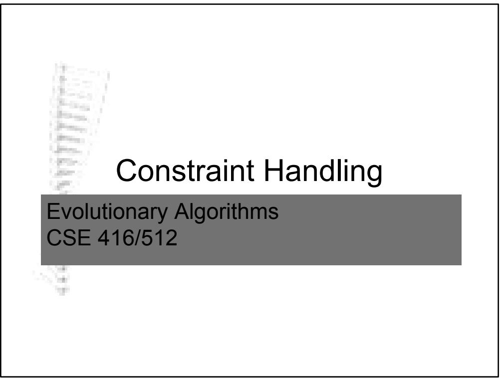

Introduction

lmany practical problems constrained   
lnot all combinations of variable values represent valid solutions °feasible solutions °infeasible solutions   
lconstraint handling not straightforward in EAs °variation operators blind to constraints

Constrained Problems: Terminology

problem given in terms of variables $( \mathsf { v } _ { 1 } , . . . . , \mathsf { v } _ { \mathsf { n } } )$

leach have domains $( \mathsf { D } _ { 1 } , \ldots , \mathsf { D } _ { \mathsf { n } } )$

lfree search space: $\mathsf { S } { = } \mathsf { D } _ { 1 } { \times } \mathsf { D } _ { 2 } { \times } \ldots { } { \times } \mathsf { D } _ { \mathsf { n } }$ lproblems distinguished by presence / absence of

°objective function °constraint

# Problem Types

<table><tr><td rowspan=1 colspan=1></td><td rowspan=1 colspan=2>Objective Function</td></tr><tr><td rowspan=1 colspan=1>Constraints</td><td rowspan=1 colspan=1>Yes</td><td rowspan=1 colspan=1>No</td></tr><tr><td rowspan=1 colspan=1>Yes</td><td rowspan=1 colspan=1>Constrained Optimization Poblem</td><td rowspan=1 colspan=1>Constraint Satisfaction Problem</td></tr><tr><td rowspan=1 colspan=1>No</td><td rowspan=1 colspan=1>Free Optimization Problem</td><td rowspan=1 colspan=1>No Problem</td></tr></table>

# Free Optimization Problem - FOP

ldefined by the pair <S,f> °S: free search space °f: objective function on S

lsolution of an FOP is

${ \overline { { s } } } \in S$ with optimal f

Constraint Satisfaction Problems - CSP

ldefined by the pair $< \mathsf { S } , > \ F$

°S: free search space

°constraint: restriction on possible value combinations of certain variables

lsolution to a CSP:

# CSP Examples

lGraph three-colouring problem °G $\mid =$ (N,E), E⊆NxN °colour nodes of graph G with 3 colours in such a way that no neighbour nodes have the same colour lneighbour node: nodes connected by an edge

lBoolean satisfiability problem (SAT)

# CSP

lmain challenge to EA °no objective function to define fitness °extreme case of needle-in-a-haystackproblem llarge plateaus at zero level (False) lsome singular peaks (True)

lbasic approach °transform constraints into optimization objectives

Constrained Optimization Problem - COP

lcombination of FOP and CSP ldefined by a triple ${ < } \mathsf { S } , \mathsf { f } , \Phi { > }$ °S: free search space °f: objective function on S $\bigcirc \boldsymbol \phi$ : a formula (Boolean function on S)

COP Example - TSP   
ln cities $\mathsf { C } { = } ( \mathsf { c } _ { 1 } , \mathsf { c } _ { 2 } , \ldots , \mathsf { c } _ { \mathsf { n } } )$   
$\bullet S { = } C ^ { \ n }$   
lobjective function: minimize   
1 1 f (s ) d (s , s ) with ni∑ i i == + $s _ { i + 1 }$ defined as $s _ { 1 }$

# COP Example - TSP

feasibility condition $\pmb { f } = \pmb { f } _ { c } \wedge \pmb { f } _ { u }$ is conjunction of:

$$
f _ { c } ( { \overline { { s } } } ) = T r u e
$$

if and only if for each $\mathsf { C } \in \mathsf { C }$ there is an $\mathsf { i } \in \left\{ 1 , . . . , \mathsf { n } \right\}$ such that $\mathsf { C } { = } \mathsf { S } _ { \mathrm { i } }$ (completeness condition)

$$
\pmb { f } _ { u } \left( \overline { { s } } \right) = T r u e
$$

if and only if for each $k , \vert \in \ \{ 1 , . . . , n \} \ s _ { \boldsymbol { \mathrm { k } } } \neq \mathsf { S } _ { \boldsymbol { \mathrm { l } } }$ (unicity condition)

COP

lsimilar to CSP °transform constraints into optimization function lbecomes FOP °indirect constraint handling ldone before EA run   
lleave constraints as constraints °treat explicitly to ensure feasible solutions °direct constraint handling lenforced explicitly during EA run

# Handling Constraints in EAs

lmost CSPs discrete   
ldiscrete COPs (combinatorial optimization) and continuous COPs °constraint handling basically same

# Constraint Handling

lthree main types °indirect constraint handling °direct constraint handling °mapping constraint handling

# Constraint Handling

lindirect constraint handling °penalty functions

ldirect constraint handling °repairing infeasible solution candidates °preserving feasibility

lmapping constraint handling °using decoder functions

Methods for Handling Constraints in EAs

lpenalty functions °reduce fitness of infeasible solutions °usually reduction proportional to lnumber of constraints violated or ldistance from feasible region

lrepair functions °transform an infeasible solution to a close feasible solution

Methods for Handling Constraints in EAs

lensure feasibility of all solutions °a specific alphabet for problem representation °special initialization, recombination and mutation operators

Methods for Handling Constraints in EAs

ldecoder functions °map genotype to phenotype °ensure feasible phenotypes °many genotypes may map into one phenotype °permits use of more standard variation operators °transforms search space

Feasible vs. Infeasible Solutions

lSearch space consists of two disjoint subsets: °feasible solutions °infeasible solutions   
lMajor concern is the design of the evaluation function $\mathsf { O e } v \mathsf { a } I _ { f }$ and evali for feasible and infeasible domains respectively

Issues when Designing evalf and evali

lHow should two feasible solutions be compared? °may require use of heuristics °if tournament or ranking selection used, not necessary to define an evaluation function lsufficient to define an ordering between feasible solutions (is better than)

Issues when Designing $e v a I _ { f }$ and evali

lHow should two infeasible solutions be compared?

°extend the domain of $e v a I _ { f }$ to incorporate infeasible solutions:

$e v a I _ { i } ( x ) { = } e v a I _ { t } ( x ) { \pm } Q ( x )$ where $Q ( \mathsf { x } )$ is a penalty or a cost for repair

°design a separate evali or some ordering between infeasible solutions

lrequires definition of a relationship between evalf and evali

Issues when Designing evalf and evali

lHow should $e v a I _ { f }$ and evali be related? °evali may be defined based on evalf through penalties or costs for repairing °construct a global evaluation function:

$$
e v a l ( p ) = \left\{ { \begin{array} { l l l } { q _ { 1 } . e \nu a l _ { f } ( p ) } & { i f ~ p ~ i s ~ f e a s i b l e } \\ { q _ { 2 } . e \nu a l _ { i } ( p ) } & { i f ~ p ~ i s ~ n o t ~ f e a s i b l e } \end{array} } \right\}
$$

! Both methods allow infeasible solutions be better than feasible ones might converge to infeasible use of dynamic penalties or $\mathsf { q } _ { 1 }$ and $\mathsf { q } _ { 2 }$ to increase pressure on infeasibilities in later runs

# Issues when Designing $e v a I _ { f }$ and evali

°force the worst feasible solution to be always better than the best infeasible solution

lmight not be a good approach when some infeasible solution may be very close to the optimum while some other feasible solution may be too far

$\Rightarrow \mathsf { n o }$ set rules or good heuristics to define the relationship; depends on problem

Issues when Designing evalf and evali

lShould infeasible solutions be considered harmful and eliminated from population? °death penalty °may work well when feasible search space is convex and constitutes a reasonable part of the whole search space

Issues when Designing $e v a I _ { f }$ and evali

Should infeasible solutions be repaired by moving them into the closest point in the feasible space?

$\mathsf { O e v a } I _ { i } ( \mathsf { y } ) \mathsf { = e v a } I _ { \mathsf { f } } ( \mathsf { x } )$ where x is a repaired version of y °repaired solution may be used only for evaluation or may replace the infeasible

°different repair methods for different problems

Issues when Designing evalf and evali

°similar to local search lsearches for feasible solution close to infeasible lShould repaired solutions replace the infeasible solution in the population?

°not replacing $\Leftrightarrow$ Baldwinian linfeasible is kept but is assigned fitness of feasible

Issues when Designing $e v a I _ { f }$ and evali

°replacing $\Leftrightarrow$ Lamarckian lwhere an individual improves during its lifetime and this is coded into the genotype linfeasible overwritten by feasible

°possible to replace infeasible solutions with the repaired ones with a probability

lthis probability is problem dependent

Issues when Designing evalf and evali

lShould infeasible solutions be penalized? °evali(p)=evalf(p)±Q(p) °an individual may be penalized ljust for being infeasible lfor the amount of its violation lfor the cost of repairing it

Issues when Designing $e v a I _ { f }$ and evali

°appropriate choice of penalty method may depend on:

lratio of feasible space to the whole search space ltopological properties of feasible search space lthe evaluation function lthe number of variables and constraints

°promising results from use of adaptive penalties

Issues when Designing $e v a I _ { f }$ and evali

lShould special representations and variations operators be used to ensure feasibility? °no infeasible solutions

lShould decoders be used to ensure feasibility?

°again no infeasible solutions

Issues when Designing $e v a I _ { f }$ and evali

lWould it be better to handle individuals and constraints separately?

°use a multi-objective optimization approach lif f is the objective and if there are m constraints fj then this gives an $( m + 1 )$ dimensional vector $\mathsf { v } = ( \mathsf { f } , \mathsf { f } _ { 1 } , \ldots , \mathsf { f } _ { \mathsf { m } } )$

°some successful implementations exist

# Penalty Functions

$P ( d ( \overline { { x } } , f ) ) = \sum _ { i = 1 } ^ { m } w _ { i } . d _ { i } ^ { k } ( \overline { { x } } )$ , where i iw d x. ( )k k: user defined constant (usually 1 or 2)

$d _ { i } \left( { \overline { { x } } } \right)$ : distance metric from point $\times$ to constraint boundary

# Penalty Functions

lstatic penalty functions °extinctive penalties lvery high penalties to prevent use of infeasibles °binary penalties ldi is binary: 1 if constraint violated, else 0 °distance based penalties lusualy use square of euclidean distance $( \kappa \mathbf { = } 2 )$ °difficulty of setting wi values ltrial and error method

# Penalty Functions

ldynamic penalty functions °wi vary with time °still requires the definition of initial values   
ladaptive penalty functions °not very sensitive to choice of initial values °adaptation usually based on feedback from search

# Example Problem: 0/1 Multiple Knapsack Problem (MKP)

# 0/1 Knapsack Problem

definition:

°single knapsack of capacity C and n items   
°each object has l weight wi l profit $\mathsf { p } _ { \mathrm { i } }$

°find a vector $\mathsf { x } { = } ( \mathsf { x } _ { 1 } , \mathsf { x } _ { 2 } , . . . \mathsf { x } _ { \mathsf { n } } )$ where $\mathsf { x } _ { \mathrm { i } } \in \{ 0 , 1 \}$ such that:

$\sum _ { i = 1 } ^ { n } w _ { i } x _ { i } \leq C$ for which $P ( x ) = \sum _ { i = 1 } ^ { n } p _ { i } x _ { i }$ is maximized

Multiple Knapsack Problem - Definition lMKP is generalization of 0/1 knapsack problem lm knapsacks of capacities $\mathsf { c } _ { 1 } , \ldots , \mathsf { c } _ { \mathsf { m } }$ ln objects with profits $\mathsf { p } _ { 1 } , \ldots , \mathsf { p } _ { \mathsf { n } }$ leach object has m possible weights °object i weight $\mathsf { W _ { i j } }$ when considered for inclusion in the jth knapsack

# MKP - Definition

lobjective: find a vector $\mathsf { x } { = } ( \mathsf { x } _ { 1 } , \ldots , \mathsf { x } _ { \mathsf { n } } )$ that °guarantees no knapsacks are overfilled °and yields maximum profit

$\operatorname* { m a x } \sum _ { i = 1 } ^ { n } p _ { i } x _ { i }$ subject to $\sum _ { i = 1 } ^ { n } w _ { i j } x _ { i } \leq c _ { j }$ for $j = 1 , 2 , . . . , m$

# MKP - Representation

lbinary representation °if ith position is: l1: ith item included in all knapsacks l0: ith item is not included in any of the knapsacks la string may lead to infeasible solution candidates

# MKP - Constraint Handling

lmost commonly used approach proposed by Khuri et al [Khuri,1994] °allows infeasible strings to join population °applies penalty to reduce fitness of infeasible string °penalty term gets higher when solution farther away from feasibility

# MKP - Penalty Function

lnew graded fitness function defined - $f ( { \bar { x } } )$ °penalty depends on number of overfilled knapsacks li.e. number of violated constraints

$f ( \overline { { x } } ) = ( \sum _ { i = 1 } ^ { n } p _ { i } x _ { i } ) - s . \mathsf { m a x } ( p _ { i } )$ where $s$ is no. of overfilled knapsacks ! Does not guarantee all feasible solutions. Check !

# MKP

MKP instances with known optimal solutions available at:

http://elib.zib.de/pub/Packages/mp-testdata/ip/sac94-suite/

( for example with Weish30 MKP instance, the penalized fitness function approach in previous slide produces infeasible solutions! )

[Khuri,1994] Khuri S., Baeck T., Heitkoetter J., “The Zero/One MultipleKnapsack Problem and Genetic Algorithms, in Proceedings of the 1994 ACM Symposium on Applied Computation, pp. 188-193,ACM Press.