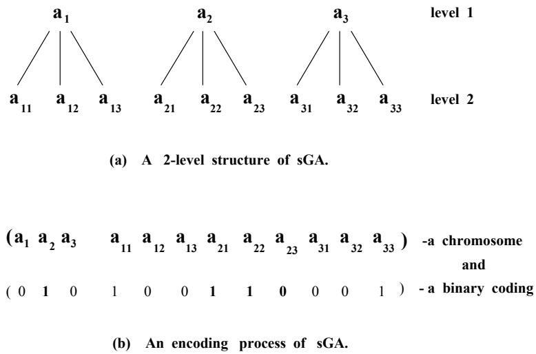
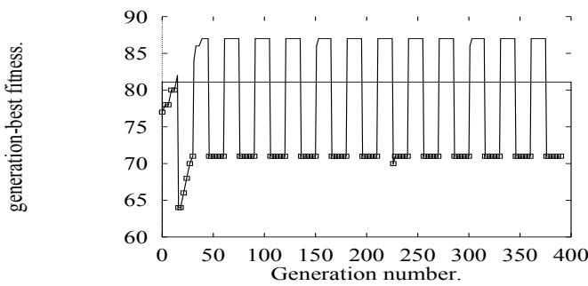
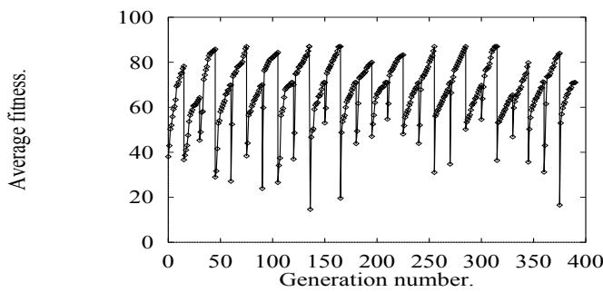
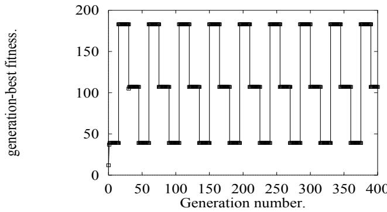
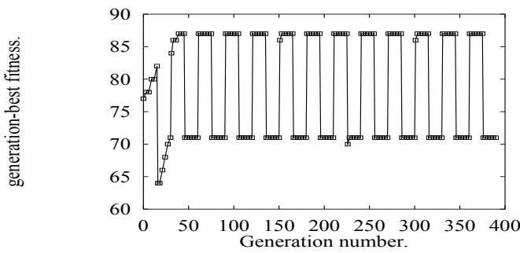

# Nonstationary Function Optimization using the Structured Genetic Algorithm.

Dipankar Dasgupta and Douglas R. McGregor. Dept. of Computer Science, Uni. of Strathclyde Glasgow G1 1XH, U. K.

In proceedings of Parallel Problem Solving From Nature (PPSN-2) Conference, 28-30 September, 1992, Brussels (Belgium), pp 145-154.

# Abstract

In this paper, we describe the application of a new type of genetic algorithm called the Structured Genetic Algorithm (sGA) for function optimization in nonstationary environments. The novelty of this genetic model lies primarily in its redundant genetic material and a gene activation mechanism which utilizes a multi-layered structure for the chromosome. In adapting to nonstationary environments of a repeated nature genes of long-term utility can be retained for rapid future deployment when favourable environments recur. The additional genetic material preserves optional solution space and works as a long term distributed memory within the population structure. This paper presents important aspects of sGA which are able to exploit the repeatability of many nonstationary function optimization problems. Theoretical arguments and empirical study suggest that sGA can solve complex problems more efficiently than has been possible with simple GAs. We also noted that sGA exhibits implicit genetic diversity and viability as in biological systems.

# 1. Introduction.

Genetic Algorithms [16] represent a class of general purpose adaptive problem solving techniques, based on the principles of population genetics and natural selection. The workings of simple GAs have been described elsewhere [13][17].

Genetic Algorithms are finding increasing applications in a variety of problems across a spectrum of disciplines [8][9]. Despite their empirical success, as their usage has grown, there has been a long standing objection to the use of simple GAs in complex problems where they have been criticized for poor performance. Specifically, environments that vary over time present special challenges to genetic algorithms, since they cannot adapt to changing functionality once converged, due to lack of genetic variation in the chromosome. A number of authors (as mentioned in [15]) have used the mechanisms of dominance and diploidy of biological genetics to improve the performance of simple GA's in nonstationary environments with some success. Recently, Goldberg et al. developed messy Genetic Algorithms(mGA) [12] [14] which could solved many complex and deceptive problems. Our proposed Structured Genetic Algorithm, is a possible alternative approach. The basic concept of the model is drawn from the biological system's flexible strategy of evolution (for genetic variation) and adaptation.

In many real-world applications, there is a time_varying situation. The optimum fitness criterion changes in some way over time (typically with change in an external environment), and the population must adapt to survive, which may result in rapid optimization. In many situations there may also be the problem that an apparent multi-element change is required to escape from a local maximum of the fitness function, and instances of the required form may not be present in the population. In this situation apparent multielement mutation is required; but in simple GA multi-element mutations are extremely unlikely to result in viable offspring.

In this paper, we briefly describe the mechanism of the Structured Genetic Algorithm (sGA), and its implementation in nonstationary function optimization (0-1 Knapsack) problem, we then present our experimental results and finally, based on the empirical study, we give conclusions.

# 2. The Structured Genetic Algorithm.

# 2.1. Basic principle.

The Structured Genetic model(sGA) [6] [7] allows large variations in the phenotype while maintaining high viability by allowing multiple simultaneous genetic changes. It is therefore able to function well in complex changing environments. The central feature of sGA is its use of genetic redundancy (as in biological systems [2]) and hierarchical genomic structures in its chromosome. The primary mechanism for resolving the conflict of redundancy is through regulatory genes [3] which act as switching (or dominance) operators to turn genes on (active) and off (passive) respectively. It is analogous to the controlled regulation of structural genes [18] which use promotor and repressor genes for its expression during biological evolution. So, as in biological systems, the genotypephenotype difference of sGA is vast: the genotype is embodied in the chromosomes whereas the phenotype is the expression of the chromosomal information depending on the environment.

In sGA, a chromosome is represented as a set of binary strings. It also uses conventional genetic operators and the survival of the fittest principle. However, it differs considerably from the Simple Genetic Algorithms in encoding genetic information in the chromosome, and in its phenotypic interpretation.

The fundamental differences are as follows:

i) Structured Genetic Algorithms utilise chromosomes with a multi-level genetic structure (a directed graph or tree). As an example, sGA's having a two-level structure of genes are shown in figurel(a), and chromosomal representations of these structures are shown in figure 1(b).

ii) Genes at any level can be either active or passive .

iii) High level genes activate or deactivate sets of lower level genes. So the dynamic behavior of genes at a level - i.e whether they will be expressed phenotypically or not, are governed by the higher level genes.

Thus a change in a gene value with higher leverage represents multiple changes at a lower levels in terms of genes which are active. Genes which are not active (passive genes) do not disappear, they remain in the chromosome structure and are carried in a neutral and apparently redundant form to subsequent generations with the individual's string of genes . Since sGA is highly structured, a single change at a higher level of the network produces an effect on the phenotype that could only be achieved in simple GA by a sequence of many random changes. The probability of such a sequence in the simple GA model is incrediblyly small unless, as Richard Dawkins [10] has pointed out, every single step results in improved viability (an hunch is that this, too, has a much too low probability to be regarded as an effective mechanism for large change).

  
Figure 1: A Representation of the Structured Genetic Algorithm.

One school of thought (Darwinian) believes that evolutionary changes are gradual; another (Punctuated Equilibria) postulates that evolutionary changes go in sudden bursts, punctuating long periods of statis when no evolutionary changes take place in a given lineage. The new model provides a good framework for carrying out studies that could bridge these two theories.

sGA also differ from recent messy genetic model $( \mathrm { m G A } )$ in the following main aspects:   
1. mGA has a variable length string and scruffies, and on the other hand sGA coding is of fixed-length and may be a neat GA type.   
2. mGA uses cut and splice operators in contrast to sGA which uses conventional genetic operators along with a gene activation mechanism (switching operator).   
3. mGA applies two phases of evolutionary processes such as primordial and juxtapositional, whereas sGA has a single evolutionary process.   
4. mGA deals with variable size population but sGA works with fixed population size.

For searching a space, the high-level genes can explore the potential areas of the space (by long jump mutations) and sets of low-level genes can continue to exploit that subspace. Also sGA has the advantage of being able to retrieve previously expressed good building blocks, whereas a simple GA with dominance and diploidy mechanism (used so far) can only store or retrieve one allele independently. Thus sGA work as a form of long term distributed memory that stores information, particularly genes once highly selected for fitness. This memory permits faster adaptation to environmental changes.

# 2.2. A Mathematical Outline of Proposed Model.

In a two-level Structured Genetic Algorithm, a genotype may be of the form

$A = < S _ { 1 } , S _ { 2 } >$ , where $A$ represents an ordered set which consists of two strings $S _ { 1 }$ and $S _ { 2 }$ , the length of $S _ { 2 }$ is an integer multiple of the length of $S _ { 1 }$ (i.e $| S _ { 1 } | = s$ and $| S _ { 2 } | = s q$ ); there is a genetic mapping $S _ { 1 } \mapsto S _ { 2 }$ defined below.

In other words,

$$
\begin{array} { r l } { A = ( ~ [ a _ { i } ] , [ a _ { i j } ] ~ ) , } & { ~ ( a _ { i } \in \{ 0 , 1 \} , ~ i = 1 \ldots s ) ; } \\ & { ~ ( a _ { i j } \in \{ 0 , 1 \} , ~ i = 1 \ldots s ; ~ j = 1 \ldots q ) , } \end{array}
$$

and the order of the symbols in the string $S _ { 2 }$ is obtained by arranging subscripts in row major fashion.

The mapping $S _ { 1 } \mapsto S _ { 2 }$ implies that each element $a _ { i } \in S _ { 1 }$ is mapped onto the unique substring $[ a _ { i j } ] \subset S _ { 2 } , ( j = 1 , . . . q )$ .

Now let

$$
B _ { i } = a _ { i } \otimes [ a _ { i 1 } a _ { i 2 } \ldots a _ { i q } ] , i = 1 \ldots { s } ,
$$

where $\bigotimes$ is called a genetic switch or activator and defined as

$$
\begin{array} { r l r } & { } & { B _ { i } = a _ { i } \otimes S _ { 2 } = [ a _ { i j } ] , \ i f \ a _ { i } = 1 } \\ & { } & { = \phi , \ i f \ a _ { i } = 0 ; } \end{array}
$$

where $\phi$ is the empty substring.

The $B _ { i }$ constitute the parameter spaces of the individual whose phenotypic interpretation is as follows.

The appearance (phenotype) of each individual $A$ is expressed by concatenation of all its activated substrings $B _ { i }$ . This means that the length of an expressed chromosome is less than the physical length of the chromosome. Hence, the observable characteristics of an individual do not always indicate the particular genes that are present in the genetic composition or genotype.

So the total population of individuals,

$$
\Omega = \{ A _ { p } \ | \ 1 \leq p \leq P o p s i z e \}
$$

and each individual consisting of binary string $A _ { p } = < S _ { 1 _ { p } } , S _ { 2 _ { p } } > = ( 0 , 1 ) ^ { l }$ , where the physical length of the chromosome with notation above is $s + q s = l$ .

If $f$ is a real valued fitness (objective) function

$$
f \ : \ \Omega \to R ^ { + } , w h e r e \ R ^ { + } i s t h e s e t o f \ p o s i t i v e r e a l \ n u m b e r s .
$$

In general, a multi-level structured string may be represented as

$$
A _ { p } = ( [ a _ { i } ] , [ a _ { i j } ] , [ a _ { i j k } ] , . . . ) ,
$$

where the genetic mapping $[ a _ { i } ] \mapsto [ a _ { i j } ] \mapsto [ a _ { i j k } ]$ and so on, are generalized in the obvious way.

# 3. Nonstationary function optimization.

In order to investigate the adaptability of the structured genetic algorithm in time varying environment, we selected nonstationary 0-1 knapsack problems where the weight constraint was varied in time as a periodic step function. The experimental aim was the temporal optimization in fluctuating environments.

The knapsack problem in operational Research is a NP-complete problem, where we have to find a feasible combination of objects so that the total value of the objects (selected from $n$ objects) put in the knapsack is maximized, subject to some capacity or weight constraint.

Mathematically,

Let W be the weight limitation (i.e maximum permissible weight of knapsack), let the integers $1 , 2 , \ldots n$ denote $n$ available types of objects, $v _ { i }$ and $w _ { i }$ the value (or profit) and the weight of $i$ th object type, then the knapsack problem can be expressed as

$$
m a x \sum _ { i = 1 } ^ { n } v _ { i } x _ { i }
$$

subject to the weight constraint

$$
\sum _ { i = 1 } ^ { n } w _ { i } x _ { i } \ \leq W
$$

where $x _ { i }$ represents the number of objects of type $i$ which are selected. In the 0-1 knapsack problem, one object of each type is only available. Then:

$$
\begin{array} { r l } { } & { x _ { i } = 1 \quad i f \ t h e o b j e c t i \ i \ i s \ c h o s e n , } \\ { } & { \quad = 0 o t h e r w i s e ; \ f o r \ ( i = 1 , 2 , \ldots n ) . } \end{array}
$$

Table 1. (also used in [15]) and table 2. (taken from [4]) show the value and weight of objects along with optimal solutions for two example problems of different size. One problem has two, and another has three, temporal optima. The sGA has no knowledge of problem parameters or structure, and was forced to infer good knapsack solutions from codings and fitness of previous trials. The fitness function adopted for this study was the penalized value function where any weight constraint violation was squared, multiplied by a constant (here 20), and subtracted from the total value of selected objects $\left( \sum p _ { i } x _ { i } \right)$ . To test the adaptability of sGA in discontinuous non-stationary environments, the weight constraint was varied as a step function among the values (shown in tables) of the total weight of all the objects and it was done after every fifteenth generation.

# 3.1. Experimental details.

To specify the working of sGA more precisely for experimental purposes, a two-level sGA was adopted. It was assumed that the level of sGA depends on the level of complexity of search space. So if the problem has one level of search space then two level sGA work efficiently where high level genes can activate the alternate solution space. The first few bits (a measure of redundancy and a determining factor like other GA parameters) of chromosome were high-level bits, each of which activated only one solution space from the optional solution spaces in the lower level of the chromosome. For these two problems, we

Table 1 The 17-Object, 0-1 knapsack problem parameters used here with optimal solutions.   

<table><tr><td rowspan=3 colspan=1>ObjectNumberi</td><td rowspan=3 colspan=1>ObjectValuevi</td><td rowspan=3 colspan=1>ObjectWeightwi</td><td rowspan=1 colspan=2>Variant weight constraints</td></tr><tr><td rowspan=1 colspan=1>W = 0.5 * ∑ =1 wi</td><td rowspan=1 colspan=1>W = 0.82 * ∑ 1 wi</td></tr><tr><td rowspan=1 colspan=1>Optimalxi</td><td rowspan=1 colspan=1>Optimalxi</td></tr><tr><td rowspan=1 colspan=1>1</td><td rowspan=1 colspan=1>2</td><td rowspan=1 colspan=1>12</td><td rowspan=1 colspan=1>0</td><td rowspan=1 colspan=1>0</td></tr><tr><td rowspan=1 colspan=1>2</td><td rowspan=1 colspan=1>3</td><td rowspan=1 colspan=1>5</td><td rowspan=1 colspan=1>1</td><td rowspan=1 colspan=1>1</td></tr><tr><td rowspan=1 colspan=1>3</td><td rowspan=1 colspan=1>9</td><td rowspan=1 colspan=1>20</td><td rowspan=1 colspan=1>0</td><td rowspan=1 colspan=1>1</td></tr><tr><td rowspan=1 colspan=1>4</td><td rowspan=1 colspan=1>2</td><td rowspan=1 colspan=1>1</td><td rowspan=1 colspan=1>1</td><td rowspan=1 colspan=1>1</td></tr><tr><td rowspan=1 colspan=1>5</td><td rowspan=1 colspan=1>4</td><td rowspan=1 colspan=1>5</td><td rowspan=1 colspan=1>1</td><td rowspan=1 colspan=1>1</td></tr><tr><td rowspan=1 colspan=1>6</td><td rowspan=1 colspan=1>4</td><td rowspan=1 colspan=1>3</td><td rowspan=1 colspan=1>1</td><td rowspan=1 colspan=1>1</td></tr><tr><td rowspan=1 colspan=1>7</td><td rowspan=1 colspan=1>2</td><td rowspan=1 colspan=1>10</td><td rowspan=1 colspan=1>0</td><td rowspan=1 colspan=1>0</td></tr><tr><td rowspan=1 colspan=1>8</td><td rowspan=1 colspan=1>7</td><td rowspan=1 colspan=1>6</td><td rowspan=1 colspan=1>1</td><td rowspan=1 colspan=1>1</td></tr><tr><td rowspan=1 colspan=1>9</td><td rowspan=1 colspan=1>8</td><td rowspan=1 colspan=1>8</td><td rowspan=1 colspan=1>1</td><td rowspan=1 colspan=1>1</td></tr><tr><td rowspan=1 colspan=1>10</td><td rowspan=1 colspan=1>10</td><td rowspan=1 colspan=1>7</td><td rowspan=1 colspan=1>1</td><td rowspan=1 colspan=1>1</td></tr><tr><td rowspan=1 colspan=1>11</td><td rowspan=1 colspan=1>3</td><td rowspan=1 colspan=1>4</td><td rowspan=1 colspan=1>1</td><td rowspan=1 colspan=1>1</td></tr><tr><td rowspan=1 colspan=1>12</td><td rowspan=1 colspan=1>6</td><td rowspan=1 colspan=1>12</td><td rowspan=1 colspan=1>1</td><td rowspan=1 colspan=1>1</td></tr><tr><td rowspan=1 colspan=1>13</td><td rowspan=1 colspan=1>5</td><td rowspan=1 colspan=1>3</td><td rowspan=1 colspan=1>1</td><td rowspan=1 colspan=1>1</td></tr><tr><td rowspan=1 colspan=1>14</td><td rowspan=1 colspan=1>5</td><td rowspan=1 colspan=1>3</td><td rowspan=1 colspan=1>1</td><td rowspan=1 colspan=1>1</td></tr><tr><td rowspan=1 colspan=1>15</td><td rowspan=1 colspan=1>7</td><td rowspan=1 colspan=1>20</td><td rowspan=1 colspan=1>0</td><td rowspan=1 colspan=1>1</td></tr><tr><td rowspan=1 colspan=1>16</td><td rowspan=1 colspan=1>8</td><td rowspan=1 colspan=1>1</td><td rowspan=1 colspan=1>1</td><td rowspan=1 colspan=1>1</td></tr><tr><td rowspan=1 colspan=1>17</td><td rowspan=1 colspan=1>6</td><td rowspan=1 colspan=1>2</td><td rowspan=1 colspan=1>1</td><td rowspan=1 colspan=1>1</td></tr><tr><td rowspan=1 colspan=1>Total:</td><td rowspan=1 colspan=1>91</td><td rowspan=1 colspan=1>122</td><td rowspan=1 colspan=1>13</td><td rowspan=1 colspan=1>15</td></tr><tr><td rowspan=1 colspan=3></td><td rowspan=1 colspan=1>1xivi = 71X    xiwi = 60i=1</td><td rowspan=1 colspan=1>∑11xivi = 87xiwi = 100</td></tr></table>

<table><tr><td rowspan=3 colspan=1>ObjectNumberi</td><td rowspan=3 colspan=1>ObjectValueVi</td><td rowspan=3 colspan=1>ObjectWeightwi</td><td rowspan=1 colspan=3>Variant weight constraints</td></tr><tr><td rowspan=1 colspan=1>W =90</td><td rowspan=1 colspan=1>W = 50</td><td rowspan=1 colspan=1>W = 20</td></tr><tr><td rowspan=1 colspan=1>Optimalxi</td><td rowspan=1 colspan=1>Optimalxi</td><td rowspan=1 colspan=1>Optimalxi</td></tr><tr><td rowspan=1 colspan=1>1</td><td rowspan=1 colspan=1>70</td><td rowspan=1 colspan=1>31</td><td rowspan=1 colspan=1>1</td><td rowspan=1 colspan=1>1</td><td rowspan=1 colspan=1>0</td></tr><tr><td rowspan=1 colspan=1>2</td><td rowspan=1 colspan=1>20</td><td rowspan=1 colspan=1>10</td><td rowspan=1 colspan=1>1</td><td rowspan=1 colspan=1>0</td><td rowspan=1 colspan=1>0</td></tr><tr><td rowspan=4 colspan=1>3456</td><td rowspan=1 colspan=1>39</td><td rowspan=1 colspan=1>20</td><td rowspan=1 colspan=1>1</td><td rowspan=1 colspan=1>0</td><td rowspan=1 colspan=1>1</td></tr><tr><td rowspan=1 colspan=1>37</td><td rowspan=1 colspan=1>19</td><td rowspan=1 colspan=1>1</td><td rowspan=1 colspan=1>1</td><td rowspan=1 colspan=1>0</td></tr><tr><td rowspan=1 colspan=1>7</td><td rowspan=1 colspan=1>4</td><td rowspan=1 colspan=1>1</td><td rowspan=1 colspan=1>0</td><td rowspan=1 colspan=1>0</td></tr><tr><td rowspan=1 colspan=1>5</td><td rowspan=1 colspan=1>3</td><td rowspan=1 colspan=1>0</td><td rowspan=1 colspan=1>0</td><td rowspan=1 colspan=1>0</td></tr><tr><td rowspan=1 colspan=1>7</td><td rowspan=1 colspan=1>10</td><td rowspan=1 colspan=1>6</td><td rowspan=1 colspan=1>1</td><td rowspan=1 colspan=1>0</td><td rowspan=1 colspan=1>0</td></tr><tr><td rowspan=1 colspan=1>Total:</td><td rowspan=1 colspan=1>188</td><td rowspan=1 colspan=1>93</td><td rowspan=1 colspan=1>6</td><td rowspan=1 colspan=1>2</td><td rowspan=1 colspan=1>1</td></tr><tr><td rowspan=2 colspan=3>xiVi=∑    xiWi =</td><td rowspan=2 colspan=1>18390</td><td rowspan=1 colspan=1>107</td><td rowspan=2 colspan=1>3920</td></tr><tr><td rowspan=1 colspan=1>50</td></tr></table>

Table 2   
The 7-Object, 0-1 knapsack problem parameters used here with temporal optimal solutions.

tested with four and six optional spaces respectively, where each solution space consisted of the total objects i.e each bit represented one object.

Our experiments required a specified number of high level genes active (one here) in a chromosome at any one time according to the number of parameters (or solution space) in the problem domain under consideration. This could not be assumed to hold where the high level genes are subject to random mutations. The result would tend to a situation in which more than the required number of high level bits would be active. This would result in a phenotype bit string that was too long for the problem solution. As an ad hoc approach, we generated an initial population in such a way that high level section would have one active bit set and restricted mutations in the high level bits to the closure of shift to the left or right (alternatively using local mutation by swapping the position of two high level bits). It is acknowledged that this is biologically unrealistic, since it undermines the normal assumption of the statistical independence of point mutations, but it is an equivalent computationly efficient approach. A more biologically realistic mechanism would be to allow mutations that activate multiple high level bits, and to use a fitness function to exclude the chimerical phenotypes that result from breeding.

In our computer simulation, different GA parameter sets were tested throughout the experiment, the results reported here considered the following GA parameters :

The experiments used a two_point crossover operator along with stochastic remainder selection strategy [1]. Only improved offspring replaced the parent to become member of the population in the next generation. The results presented here were averaged over 10 independent runs for each problem.

# 3.2. Observation and Results.

In each generation the best and the average fitness are reported as performance measures. The two problems were run independently. Figure $2 ~ \&$ figure 3 show the best-ofgeneration and the generation average results of the first problem (table 1), and figure 4 $\&$ figure 5 give the corresponding results of the second problem (table 2). For the first problem the weight constraints oscillated between two values and in the second problem there were three temporal optima. These graphs exhibit that sGA can adapt quickly to the abrupt change in environments. Goldberg & Smith [15] also reported that the diploidy GA with evolving dominance is efficient in the nonstationary knapsack problem (table 1). We have compared our results with their best results reported. Our results exhibit improved performance over the previous methods. Goldberg & Smith's experimental results [15] shown a drastic performance failure in generation 135 and in the last three sets of cycles due to convergence of the whole population to one or other of the optimum. The results produced by sGA have never shown such poor performance even though the population converges to optima on many occasions in run cycles, but always produces uniform results after the initial cycle. Redundant genetic material in the chromosomes preserved solutions learnt in previous cycles in a passive state which helps in species adaptation in environmental change. Environmental shift causes changes (hypermutation) on the high-level bits to activate an alternate low-level solution space, resulting in rapid discovery of the other temporal optimum.

  
Figure 2. Best-of-generation results of problem 1.

  
Figure 3. Generation average results of problem 1.

  
Figure 4. Best-of-generation results of problem 2.

  
Figure 5. Generation average results of problem 2.

The results demonstrate that this new GA model shows improved performance in robustness of retaining and quickly rediscovering time-varying optima. Our results also show that not once during the experimental run did the algorithm converge to any local sub-optimum. Thus sGA provide a long term distributed memory which permit faster adaptation to a varying environment.

# 4. Conclusion.

We presented a new genetic search approach (sGA) for temporal optimization in nonstationary environments. Initial experimental results indicate that this model is more successful in adapting to cyclically changing enivironments than simple GAs. The results are very promising and we expect that sGA can be used as a practical tool in real world applications of time-varying nature.

The Structured Genetic Approach offers significant improvements over the simple genetic model:

1. able to achieve optimization inaccessible to incremental genetic algorithms. 2. not easily trapped within local optima, since a single high-level bit change can bring the phenotype into an area which would otherwise have required multiple changes. 3. unlike multiple random low-level changes, the high-level change results in higher guaranteed viability, as the search is restricted to the solution space of integral low-level genes. 4. able to adapt rapidly to the selective pressure of its changing environment. 5. biological plausibility is one of the most attractive points of this model.

We also noted that in comparison to sGA, the recent mGA model does not have the ability to adapt in changing fitness landscapes once it converges to a global optimum. However, Deb in his dissertation [11] suggested, but did not simulate, a triallelic scheme similar to evolving dominance mechanism (as used with simple GA) and dominance shift operation for optimizing nonstationary functions using mGA. Our study shows that the well-adapted population structure of sGA with less complexity may be a worthy competitor of $\mathrm { m G A }$ in solving nonstationary optimization problems.

We conclude that this genetic model (sGA) is a novel idea, and the empirical studies show that it is an efficient function optimizer [5], though it requires more memory space for carrying apparent redundant material. We believe that the structured Genetic model will take an important role in ongoing research into the improvement of the genetic algorithms.

# Acknowledgement.

The first author gratefully acknowledges the support given by the Government of Assam (India) for awarding State Overseas Scholarship. The authors also wish to thank Dr. Robert E. Smith and the late Gunar E. Liepins for their valuable comments on the draft version of this paper.

# Список литературы

1 L. B. Booker. Intelligent behavior as an adaptation to the task environment. PhD thesis, Computer Science, University of Michigan, Ann Arbor, U. S. A, 1982.   
2 R. M. Brady. Optimization strategies gleaned from biological evolution. Nature, 317:804806, October 1985.   
3 T. A. Brown. GENETICS - a molecular approach. Van Nostrand Reinhold Int., first edition edition, 1989.   
4 N. Christofides, A Mingozzi, P. Toth, and C. Sandi. Combinatorial Optimization. John Wiley & Sons Ltd., June 1979.   
5 Dipankar Dasgupta and D. R. McGregor. Engineering optimizations using the structured genetic algorithm. Proceedings of ECAI, Vienna (Austria), August, 1992.   
6 Dipankar Dasgupta and D. R. McGregor. Species adaptation to nonstationary environments: A structured genetic algorithm. Presented at Artificial Life-III workshop, Santa Fe, New Mexico, 15-19 June 1992.   
7 Dipankar Dasgupta and D. R. McGregor. A Structured Genetic Algorithm: The model and the first results. (Technical Report NO. IKBS-2-91).   
8 Yuval Davidor. Genetic Algorithms and Robotics. World Scientific., first edition, 1991.   
9 Lawrence Davis. Handbook of Genetic Algorithms. Von Nostrand Reinhold, New York., first edition, 1991.   
10 Richard Dawkins. The Blind Watchmaker. Penguin Books Ltd., 1986.   
11 Kalyanmoy Deb. Binary and Floating-point Function Optimization using Messy Genetic Algorithms. PhD thesis, Dept. of Engineering Mechanics, University of Alabama, Tuscaloosa, Alabama, USA, March 1991.   
12 D. E. Goldberg, K. Deb, and B. Korb. Messy genetic algorithms revisited: Studies in mixed size and scale. Complex Systems, 4(4):415-444, 1990.   
13 David E. Goldberg. Genetic Algorithms in Search, Optimization and Machine Learning. Addison-Wesley., first edition, 1989.   
14 David E. Goldberg, Bradley Korb, and Kalyanmoy Deb. Messy genetic algorithms: Motivation, analysis and first results. Complex Systems., 3:493-530, May 1990.   
15 David E. Goldberg and Robert E. Smith. Nonstationary function optimization using genetic algorithms with dominance and diploidy. Proc. of ICGA, pages 59-68, 1987.   
16 John H. Holland. Adaptation in Natural and Artificial Systems. University of Michigan press, Ann Arbor, 1975.   
17 K. A. De Jong. Analysis of the behavior of a class of genetic adaptive systems. PhD thesis, Dept. of Computer and Comm. Science, University of Michigan, U S A, 1975.   
18 Mark Ptashne. How gene activators work. Scientific American, pages 41-47, January 1989.