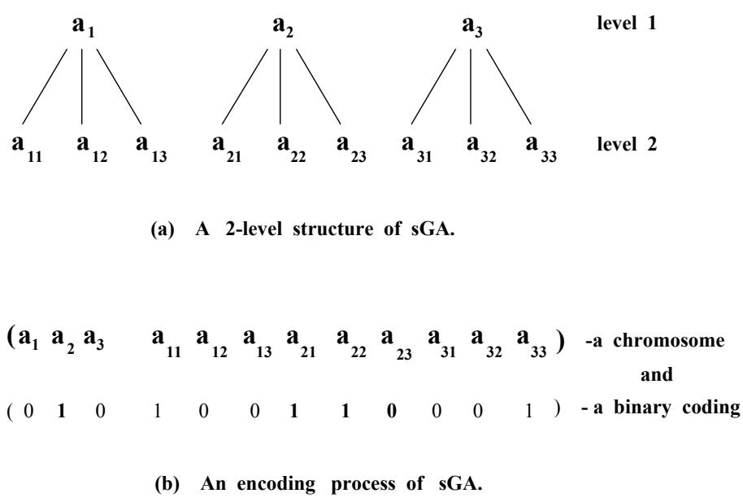
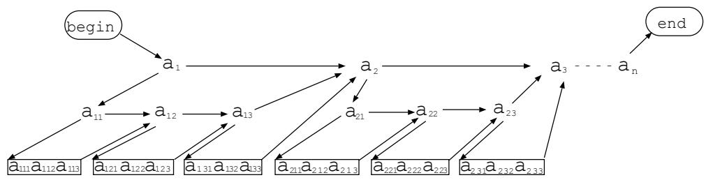
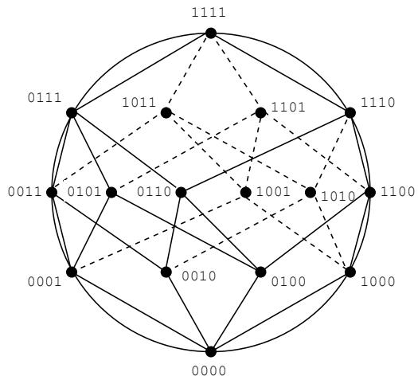

# sGA : A Structured Genetic Algorithm.

Dipankar Dasgupta and Douglas R. McGregor. dasgupta@cs.strath.ac.uk and douglas@cs.strath.ac.uk Department of Computer Science University of Strathclyde Glasgow G1 1XH U. K.

KEY WORDS : structured, dominance, redundancy, gene activation, multi-level.

# Abstract

For more than two decades, genetic algorithms (GAs) have been studied by researchers from different fields and brought to their present form. Over the years, many modifications have been suggested to alleviate difficulties encountered by GAs in solving different problems. Despite these modifications, with the increase in applications, traditional GAs remain inadequate for many practical purposes. This paper introduces a new genetic model called the Structured Genetic Algorithm (sGA) to address some of the difficulties encountered by the simple genetic approaches in solving various types of problems. The novelty of this genetic model lies primarily in its redundant genetic material and a gene activation mechanism which utilises a multi-layered structure for the chromosome. This representation provides many advantages in search and optimisation. For example, it can retain multiple (alternative) solutions or parameter spaces in its representation. In effect, it also works as a long-term distributed memory within the population, enabling rapid adaptation in nonstationary environments. Theoretical arguments and empirical studies exhibit that sGA can solve more complex problems eficiently than has been possible with simple GAs. It is also noted that sGA exhibits greater implicit non-disruptive diversity than other existing genetic models, while its possession of neutral (apparently redundant) genetic material is consistent with biological systems.

# 1 Motivation.

Genetic Algorithms are finding increasing application in a variety of search, optimisation, machine learning and other problems across a wide spectrum of disciplines (Davidor, 1991; Davis, 1991). Despite their empirical success, as their usage has grown, they have been criticised for poor performance in many problem domains. The main underlying reason for this unsatisfactory performance is the simplistic chromosomal representation of canonical GAs. It is widely realised that the representation is the key issue which needs attention if GAs are to succeed in complex problems. Though the idea of a genetic algorithm is borrowed from biology, the implicit genetic variability of biological systems, which makes them robust, has been mostly ignored in the literature of traditional GAs.

In traditional GAs, after initial generations, improvement become slow as the genetic diversity of the initial population is diminished through the process of natural selection. In order to perform robust search, genetic diversity must be maintained. When diversity is lost, the genetic process may become trapped at a local optimum. Thus there is a significant probability of premature convergence (Goldberg, 1989; Mauldin, 1984) in many situations (such as high-dimensional spaces, deceptive attractors etc.) causing the search process to come to a halt before a true optimum is found.

Once the population converges at a local optimum, simultaneous modifications of multiple parameters i.e. a multi-bit change is required to effect an improvement in the performance measure. However, when there is lack of genetic diversity, genetic operations, such as crossover - may not be effective due to homogeneity in the population. Also the effect of simple bit mutation is too small to overcome the local basin of attraction and increase of the mutation rate may degenerate to a random search. Thus in simple GA, the probability of obtaining simultaneous beneficial mutation is very small to produce fitter or viable individuals.

Many modifications have been suggested over the years to avoid premature convergence (Eshelman and Schaffer, 1991) and to improve the performance of GAs. Two main sources of modifications are very prominent - one is the transformation of fitness function, such as scaling, sharing etc. (Goldberg, 1989) and the other is the effective selection mechanism, for example, generation gap (DeJong, 1975), ranking (Baker, 1985) etc. though in principle both concern the selection scheme. The main purpose of these techniques is to maintain diversity (Mauldin, 1984) in the population in order to reduce the danger of premature convergence.

In many real-world problem domains, time-varying situations often exist. Typically, the fitness criterion changes in some way over time (with change in the external environment), and the population must rapidly adapt to the change in fitness landscape to track the moving optima. As long as sufficient diversity remains in the population, the genetic algorithm can respond to a changing fitness scenario by reallocating the sampling in future trails. However, a natural tendency of simple GA is to allocate exponentially increasing number of trails to highly fit individuals resulting in rapid convergence to a homogeneous population. It is necessary to introduce diversity by multiple changes in genetic material in order to search rapidly for new optima.

One way for a multiple change to have a high probability of success is if the multiple bits in question form a set of genes which already exist in an effective form somewhere in the chromosome and these become expressed during adaptation. This approximates to an intra-chromosome dominance analogue to the inter-chromosome crossover operation and as such it can make use of redundancy in the chromosome. Such redundant (but potentially valuable) genes or building blocks may have developed under high selective pressure in a previous epoch. Remaining 'switched off' in the gene pool as an apparently redundant part of the complete chromosome when the environment became unfavourable.

# 2 The new genetic model

The central feature of the Structured Genetic Algorithm (Dasgupta and McGregor, 1992f) is its use of redundancy and hierarchy in its genotype. The primary mechanism for eliminating the conflict of redundancy is through regulatory genes which act as switch to turn genes on (active) and off (passive) respectively. The terms 'active' and 'passive' are used for dominant and recessive structural genes.

In the Structured Genetic model, the genomes are embodied in the chromosome and are represented as sets of (binary) substrings. The model also uses conventional genetic operators and the survival of the fittest criteria to evolve increasingly fit offspring. However, it differs considerably from the Simple Genetic Algorithms in encoding informations in the chromosome, and in the phenotypic interpretation.

The fundamental differences from simple GAs are:

• The Structured Genetic Algorithm interprets the chromosome as hierarchical genomic structures. An example, showing a two-level tree structured genomes are in figure 1(a), and a flattened linear representation of these structures is shown in figure 1(b).   
Genes at any level can be either active or passive.   
• 'High level' genes activate or deactivate sets of lower level genes. Thus the dynamic behavior of genes at any given level, whether they will be expressed phenotypically or not (in genotype-to-phenotype mapping), are governed by the high level genes.   
The functional space of genome are those that play a role in the contribution to define the species or systems. This space may shift and undergo constant changes while adapting to the environment during evolution.

  
Figure 1: A representation of Structured Genetic Algorithm.

A change in a gene value at a high level has higher leverage and represents multiple changes at a lower levels in terms of genes which are active. Genes which are not active (passive genes) do not disappear, but remain in the chromosome structure and are carried invisibly in a neutral and apparently redundant form to subsequent generations with the individual's genome. As the information in chromosome is interpreted in a highly structured manner, a single change at a higher level of the structures produces an effect on the phenotype that could only be achieved in simple GA by a sequence of many random changes. The probability of such a sequence in the simple GA model is very small unless, as Dawkins (Dawkins., 1986) has pointed out, every single step results in improved viability (an intuition is that this, too, has a much too low probability to be regarded as an effective mechanism for a large change).

Since this genetic model interprets each chromosome as multi-level genome structures. It allows multiple bit changes to occur simultaneously resulting in the alteration of active parts of the genome. This leads to a large variation in the phenotype with a greater probability of maintaining high viability. It is therefore able to function well in many complex real world environments.

# 2.1 Differences from other recent approaches

# 2.1.1 mGA versus sGA

The Structured Genetic Model also differs from the recent Messy Genetic Model (mGA) (Goldberg et al., 1990b; Deb, 1991) in following main aspects:

• mGAs have variable length chromosomes and the operational algorithm has considerable complexity, and on the other hand sGA coding is of fixed-length and work as a simple unified process similar to formal GAs.

• In mGA, each locus on the genotype carries its identification tag with it, making position-independent representation of gene, this is not the case with sGA.   
• mGAs use cut and splice operators in place of the crossover operator. Thus mGAs allow genotypes of any length to develop over time, but on the contrary sGA uses standard genetic operators along with a gene activation mechanism.   
• mGAs apply a two-phase evolutionary process, (refered to as a primordial and a juxtapositional phase), whereas sGA has a single phase evolutionary process.   
• mGAs deal with variable size populations, whereas sGAs normally work with populations of constant sizes.   
• mGAs sometimes use competitive templates to accentuate salient building blocks, but such explicit mechanism does not exists in sGA.   
• mGA's selection scheme uses genic thresholding and shuffling parameters and the assumption of these values play an important role in its implementation.

# 2.1.2 GP versus sGA

The similarities and differences of the Structured Genetic Model from Genetic Programming (GP) (Koza, 1992) as follows:

• Both models use hierarchical structure - sGA's representation is linear list (binary), but GP uses a symbolic list (S-expression).   
GP encoding is a meta-level description of the problem using predifined functions and terminals. Each chromosome consists of one tree-structure representing the complete problem, whereas sGA (like formal GA) represents instances of the problem. sGA's may have multiple tree structures depending on number of parameters etc. as required.   
• In Genetic Programming, the physical length of a chromosome (i.e. tree) grows (upto some predefined depth) or shrinks during evolution. In sGA, active genomic structures also grow or shrink, within the physical boundary of the representation.   
• In GP, the entire chromosome (tree) is expressed as the phenotype, in sGA only the active genomes are expressed.

•Genetic Programming uses special genetic operators, but on the contrary sGA uses standard genetic operators along with a gene activation mechanism (switching operator) which is self implemented by the standard crossover or mutation operations.

In the next section, a mathematical framework of the structured genetic model is outlined.

# 3 A mathematical outline of the model.

In a two-level Structured Genetic Algorithm, a genotype may be of the form

$A = < S _ { 1 } , S _ { 2 } >$ , where $A$ represents an ordered set which consists of two strings $S _ { 1 }$ and $S _ { 2 }$ , the length of $S _ { 2 }$ is an integer multiple of the length of $S _ { 1 }$ (i.e $| S _ { 1 } | = s$ and $| S _ { 2 } | = s q$ ); there is a genetic mapping $S _ { 1 } \mapsto S _ { 2 }$ defined below.

In other words,

$$
\begin{array} { r l } { A = ( \mathbf { \nabla } [ a _ { i } ] , [ a _ { i j } ] \mathbf { \nabla } ) , } & { \quad ( a _ { i } \in \{ 0 , 1 \} , i = 1 \ldots s ) ; } \\ & { \quad ( a _ { i j } \in \{ 0 , 1 \} , i = 1 \ldots s ; \ j = 1 \ldots q ) , } \end{array}
$$

and the order of the symbols in the string $S _ { 2 }$ is obtained by arranging subscripts in row major fashion.

The mapping $S _ { 1 } \mapsto S _ { 2 }$ implies that each element $a _ { i } \in S _ { 1 }$ is mapped onto the unique substring $[ a _ { i j } ] \subset S _ { 2 }$ , $( j = 1 \ldots q )$ .

Now let

$$
B _ { i } = a _ { i } \otimes [ a _ { i 1 } \ : a _ { i 2 } \ldots a _ { i q } ] , i = 1 \ldots s ,
$$

where $\bigotimes$ is called a genetic switch or activator and defined as

$$
\begin{array} { r l r } & { } & { B _ { i } = a _ { i } \otimes S _ { 2 } = [ a _ { i j } ] , \ i f \ a _ { i } = 1 } \\ & { } & { = \phi , \ i f \ a _ { i } = 0 ; } \end{array}
$$

where $\phi$ is the empty substring.

The $B _ { i }$ constitute the parameter spaces of the individual whose phenotypic interpretation is as follows.

The appearance (phenotype) of each individual $A$ is expressed by concatenation of all its activated substrings $B _ { i }$ . This means that the length of an expressed chromosome is less than the physical length of the chromosome. Hence, the observable characteristics of an individual do not always indicate the particular genes that are present in the genetic composition or genotype.

The total population of individuals,

$$
\Omega = \{ A _ { p } \ | \ 1 \leq p \leq P o p s i z e \}
$$

and each individual consisting of a binary string $A _ { p } = < S _ { 1 _ { p } } , S _ { 2 _ { p } } > \in ( 0 , 1 ) ^ { l }$ , where the physical length of the chromosome with notation above is $s + q s = l$ .

  
Figure 2: A simple data structure for implementation of sGA.

Let $f$ is a real-valued fitness (objective) function

$f : \Omega  R ^ { + }$ , where $R ^ { + }$ is the set of positive real numbers.

In general, a multi-level structured string may be represented as

$$
A _ { p } = ( [ a _ { i } ] , [ a _ { i j } ] , [ a _ { i j k } ] , . . . ) ,
$$

where the genetic mappings $[ a _ { i } ] \mapsto [ a _ { i j } ] \mapsto [ a _ { i j k } ]$ and so on, are generalised in the obvious way.

Figure 2. illustrates a simple data structure for the implementation of sGA. Each gene in higher levels acts as a switchable pointer which has two possible targets, when the gene is active (on) it points to its lower level target(gene) and when passive (off) it points to the same level target. At the evaluation stage only the expressed genes of an individual are translated into the phenotypic functionality.

# 4 An analysis of sGA search

As an initial simple explanation, let $n$ be the number of dimensions of a binaryvalued vector encoding a parameter (or solution) space, i.e in $\{ 0 , 1 \} ^ { n }$ ; so the number of points available for search is $2 ^ { n }$ and can be assumed as space $N$ (Kanerva, 1988). Each point in the search space $N$ can be considered as a vertex of the $n$ -dimensional unit hypercube in Euclidean space. It can also be assumed (Kanerva, 1988) that the vertices of the $n$ -dimensional hypercube lie on the surface of a $n$ -dimensional sphere with (Euclidean metric) radius ${ \sqrt { n } } / 2$ and circumference $2 n$ . However, this circumference is an approximation, since $N$ has a finite number of points and the sphere is continuous. Figure 3. shows an example of 4-dimensional hyperspace where the nodes or vertices correspond to points in the search space; in the case of higher dimensions there will be more points on the surface. As $N$ is considered spherical, all points of $N$ are equally qualified as search points in the parameter space. Each point in the space and its complement are the two poles of the sphere at a Hamming distance $n$ from each other, with the entire space in between.

Now, let us consider a problem which has one level of search space and considering a two-level sGA to search the space, where the high-level genes can activate one or the other solution spaces. If there are two alternative spaces encoding the same parameter and at one time only one space is allowed to be active or dominant for decoding (within a defined real-valued problem domain which is independent of the dimension $n$ ); a change cause by genetic operations on the higher level results in switching to the alternate space. This may contain a point in between the previously expressed space and its complement inclusive. Moreover, changes on low-level can search the spaces in its neighborhood (in terms of hamming space). For a parameter, every additional optional space increases the probability of searching the different areas of space, resulting in the quick discovery of relatively unexplored areas of search space. There is, however, a trade off between the number of optional spaces and the dimension of each space encoding a parameter. If there are more optional spaces then there is a higher probability of continuous exploration of different areas of space, but less chance of exploiting a particular subspace (or region of interest) having a potential solution.

  
Figure 3: Vertices of a 4-dimensional hypercube on the spherical surface.

With proper selection of the number of optional spaces (high-level bits) and encoding of each space i.e low-level substrings, it is possible to maintain a balance between exploration and exploitation (with selection pressure etc.) of search space, using suitable GA parameters.

In someways the selection of the number of alternate parameter space is analogous to the selection of the size of the population needed for a particular problem. In both cases, selection of too large a number leads to redundant searching; too small a number has a significant probability that search converges to a local optima.

However, there may be other possible ways of explaining and implementing the multi-level representation of the Structured Genetic Model, which are yet to be explored.

# 5 Possible biological evidence

In biological systems, there appear to be many possible strands of evidence supporting this model.

It is widely recognised that the genetic material (DNA) in the chromosome contains much more enough information to create an organism; a large percentage of the chromosome of higher organisms is junk i.e has no apparent function (Brady, 1985). Mechanisms also exist for switching on and off the gene activity of structural genes (Brown, 1989).

Biologists realised (Beardsley, 1991) almost 50 years ago that as cells differentiate they switch some genes on and others off, making it possible for a single fertilized egg to unfold into a flower, or a fruit fly or a human being. Yet all cells have exactly the same genes encoded in their DNA.

Embryologists observed (Ptashne., 1989) that signals from both outside and inside the cell can influence the switching on or off of genes. Studies show that (Ptashne et al., 1982) inert bacterial viruses may switch their genes on and off rapidly in response to changing environments. Cell types differ (phenotypically) because they have dissimilar patterns of genetic activity, not because they have different genome. A genome acts like a complex network (Kauffman., 1991), in which genes regulate one another's activity either directly or through their products.

Recent biological studies (Stolzenburg, 1990) show that when cells are stressed by environmental conditions, some cells tend to enter a hypermutable state. Only those mutated cells which survive in the new environment pass on their traits. Also it was noted that many mutations are silent (Hawkins, 1991) - that is, they have no observable effect, either because they have occured in parts of DNA that are not currently expressed, or because they have no effect on the encoded information.

The mystery of higher organisms' choreograph of the activity of their genes is the result of gene regulation, due to which cells to form and function correctly at right place and at the right time. Gene expression is usually controlled (Brown, 1989; Hawkins, 1991) by some regulatory genes (which produce protein) that bind to specific sites on DNA. These genes are called promotors or repressors depending on whether they increase or decrease transcription process (some regulators can perform both functions). During the transcription process, parts of genetic information are selectively read from DNA into tRNA, (in turn, tRNA is copied to mRNA and is sent to the outer region of the cell) which is translated into the myriad proteins that make one cell very different from another. In other words, using the regulatory genes (Jacob and Monod, 1961), the cell can dynamically select the proteins it needs, including enzymes for maintaining cell integrity during metabolism. The developments of the past few years suggest that (Ptashne., 1989) a few simple principles may be common to gene regulation in these evidently disparate situations, whether in bacteria, yeast, plants, fruit flies or humans. It was noted that genetic variation may occur by the switching on of the quiescent DNA to replace existing material phenotypically. Such changes could make large morphological changes in a species while requiring very few changes in the DNA, only the 'switch settings' being different. Such mechanisms have already been postulated by biologists (Lowenstein and Zihlman, 1988) seeking to explain the large morphological distance between hominids and chimpanzees.

In the Structured Genetic model, the above mechanisms are combined to form a highly efficient technique for searching the viable parameter (or solution) space. It may be viewed as inducing an intra-chromosomal dominance to the gene pool of the species. Thus not only do genes representing simple low-level structures compete, but high-level genes also compete and a successful team will tend to proliferate in the population. As the variations are tested by natural selection, and this will tend to give the effect of multiple scales. We believe that a multilevel structure of the chromosome is plausible, and put forward the hypothesis that many apparently non-functioning segments of DNA may have a similar role in the biological evolutionary process.

# 6 Summary.

To summarise, in the Structured Genetic Algorithm :

A chromosome is represented by a set of substrings, which during reproduction, are modified by the genetic operators - crossover and mutation etc. exactly as in the simple GAs.   
• In decoding to the phenotype, a chromosome is interpreted as hierarchical genomic structures of the genetic material. Only those genes currently 'active' in the chromosome contribute to the fitness of the phenotype. The 'passive' genes are apparently neutral and carried along as a redundant genetic material during the evolutionary process.   
•Mutation, crossover or other local operators altering high-level genes result in changes to the active elements of the genomic structures and hence cause multiple changes in the gene expression, controlling the fitness of the phenotype.   
When a population converges to its phenotypic space, genotypic diversity still exists which is a unique characteristic of the model. In most other formal genetic models phenotypic convergence implies genotypic convergence with consequent impoverishment of the individual of the population.   
•Efficient searching of potential areas of phenotypic space is possible. Trapping at local optima which causes premature convergence can be avoided.   
• sGA provides a long-term mechanism for preserving and retrieving alternate solutions or previously expressed building blocks within the chromosomal structures. In the non-stationary optimisation, sGA provides a means of rapid (long jump) adaptation (Dasgupta and McGregor, 1992d). Simple GA with dominance and diploidy used so far (Goldberg and Smith., 1987) can only store or retrieve one allele independently (Deb, 1991), and thus may provide shorter term preservation.   
Co-evolution can also occur easily among species by simultaneously sampling and preserving different areas of search space in a multi-global fitness landscape.   
• It can achieve optimisation of multi-stage problems by defining search spaces in its different layers and can explore and exploit them in a single evolutionary process.

One school of thought (Darwinian) believes that evolutionary changes are gradual; another (Punctuated Equilibria) postulates that evolutionary changes go in sudden bursts, punctuating long periods of stasis when very small evolutionary changes took place in a given lineage. The new model provides a good framework for carrying out studies that could bridge these two theories.

However, the primary goal of this work is not attempting to mimic nature, but to borrow some complex mechanism of nature's biological system for developing a more efficient genetic search technique.

# 7 Implementation of sGA.

There are many possible ways of implementing the structured genetic model. It is noted that the number of levels of sGA and their interpretation are related to the complexity of the problem space. For an example, if the problem has one level of search space then a two-level sGA works well where defined high-level bits can activate one of the optional spaces. In encoding a chromosome, each parameter or solution space may be represented by a binary substring having multiple variants only one of which will be dominant. In each chromosome, high-level bits (which allow redundancy, a deciding factor like other GA parameters) act as switches to indicate the active parameter space at low-level. It may be also possible to use more than two levels of sGA with partial encoding of the parameter space at different levels. The evolutionary process is generally initialised with a randomly generated population and uses different selection scheme for reproduction, multi-point crossover and different mutation frequencies in different levels, for a fixed number of trials or until the search converges (phenotypically) to the global optimum. The changes in the high-level genes activate or deactivate different sets of genes in the alternate parameter (solution) spaces at the lower levels.

In optimisation problems over some fixed number of parameters, all decision variables must be supplied to the objective function to obtain a function value. It may be necessary that a specified number of high-level genes to be active in a chromosome according to the number of parameters in the problem under consideration. This can not be assumed to hold where the high-level genes are subject to random mutations. The result may tend to a situation of overspecification in which more than the required number of high-level bits will be active. This will express a bit string that may be too long for the problem solution (phenotype). In order to overcome this problem of overspecification, one approach may be to generate an initial population in such a way that high level sections have required active bits set and the low level randomly generated. Then one could use restricted mutations on the high level bits to the closure of shift to the left or right (or using local mutation (Brady, 1985) which swaps the position of two high level genes). Though this approach is ad-hoc, but it can avoid both under and overspecification problem in encoding (Smith and Goldberg, 1992). An alternative and more general approach may be to use randomly generated population and scan each individual from left-to-right to take information sufficient for decoding in order to resolve the conflict of overspecification, as used in messy GAs (Goldberg et al., 1990a). The underspecification can be handled in a natural way by making the individual less fit to breed.

However, a biologically realistic mechanism would allow genetic operations that activate multiple high level bits, and would use a fitness function to exclude the 'chimerical' phenotypes that result from breeding. But the above mentioned mechanisms appear to be computationally efficient.

# 8 Discussions

The new model called the Structured Genetic Algorithm, described in this paper is regarded as an enhancement of Holland's formal genetic model. It introduces multi-level genomic structures and a gene regulatory mechanism to accommodate redundancy into the coding scheme. These features allow multiple bit changes to occur simultaneously, in addition to the mixing effect of standard genetic operations.

The model has aspect of polyploidy inheritance, and may be an extension of the diploidy model suggested by Goldberg and Smith (Goldberg and Smith., 1987), except for the exclusion of dominance and abeyance operators to generate phenotypes from homologous genes.

The paper explained the salient features of the model and presented the intial steps toward the implemention of the model.

The Structured Genetic approach offers the following improvements:

•It is able to achieve optimisation in multi-stage problems which are difficult for existing genetic algorithms.

• It is not easily trapped at local optima, since a single high-level bit change can bring the phenotype into an area which would otherwise have required multiple changes.   
• Unlike multiple random low-level changes, the high-level change result in higher viability (or at least increase the probability), as the search is directed towards the potential areas of the solution space.   
• sGA works as a long term distributed memory that stores information, particularly genes once highly selected as fittest. So it is able to adapt rapidly to the selective pressure of its changing environment.

Though much work remains to be done, preliminary empirical studies show that it is computationally efficient in optimising non-stationary (Dasgupta and McGregor, 1992d; Dasgupta and McGregor, 1992e) and multi-solution (Dasgupta and McGregor, 1992c) functions. Experiments also show that the model can evolve application-specific neural networks i.e. it can determine both network architectures and its weights by a single evolutionary process (Dasgupta and McGregor, 1992b; Dasgupta and McGregor, 1992a; Dasgupta and McGregor, 1993). We argue that this genetic model (sGA) is more biologically motivated and have significant practical advantages in problem domains where the simple GAs may have difficulties.

# 9 Future Research.

The two major directions are planned for future research. First, further theoretical study is necessary to understand the behaviour of the model. Second, more experimental work in complex domains is needed to examine its performance.

The empirical experiments performed so far are only the first step toward the broader goal in developing this more efficient genetic algorithm and further possible steps include:

Implementation of $n$ -level sGA where $n > 2$ .   
• Verification of the schema theorem for sGA.   
• Application sGA to so called GA-deceptive problems.   
Comparison of sGA with other recent genetic models (e.g. mGA) as benchmark study.   
• Parallel implementation of this new model, since sGA is formally a highly parallel technique.   
•Investigation of the effectiveness of the genetic operators that have been used for the simple GA and development of new or modified operators.

• Developing statistical measures for predicting the successful performance of sGA and determining the correlation with fitness landscape.

The model may be useful in the investigation of adaptive behavior of artificial life.

# Acknowledgements

The first author is grateful to the Government of Assam (India) for the support provided in awarding the State Overseas Scholarship (letter No. ERG 19/88/83) for conducting this research.

We also acknowledge the valuable discussion with Mr. M. Peterson, Dr. P. Prosser, Dr. P. Cockshott and the help of our colleagues in the IKBS Research Group of the department.

# Список литературы

Baker, J. E. (1985). Adaptive selection methods for genetic algorithms. In J.J.Grefenstette., editor, Proceedings of First International Conference on Genetic Algorithms and their Applications., pages 101-111, Carnegie-Mellon University,Pittsburgh.   
Beardsley, T. (1991). Smart genes. Scientific American., pages 72-81.   
Brady, R. M. (1985). Optimization strategies gleaned from biological evolution. Nature, 317:804806.   
Brown, T. A. (1989). GENETICS - a molecular approach. Van Nostrand Reinhold Int., first edition edition.   
Dasgupta, D. and McGregor, D. R. (1992a). Designing Application-Specific Neural Networks using the Structured Genetic Algorithm. In Proceedings of the International workshop on Combination of Genetic Algorithms and Neural Networks (COGANN-92), pages 87-96, IEEE Computer Society Press.   
Dasgupta, D. and McGregor, D. R. (1992b). Designing Neural Networks using the Structured Genetic Algorithm. In Proceedings of the International Conference on Artificial Neural Networks(ICANN), pages 263-268, Brighton, U K.   
Dasgupta, D. and McGregor, D. R. (1992c). Engineering Optimizations using the Structured Genetic Algorithm. In Proceedings of European Conference on Artificial Intelligence(ECAI), pages 607-608, Vienna, Austria.   
Dasgupta, D. and McGregor, D. R. (1992d). Nonstationary function optimization using the Structured Genetic Algorithm. In Proceedings of Parallel Problem Solving From Nature (PPSN-2), Brussels, 28-30 September, pages 145154.   
Dasgupta, D. and McGregor, D. R. (1992e). Species adaptation to nonstationary environments: A structured genetic algorithm. Presented (poster) at the Third Artificial Life workshop, Santa Fe, New Mexico.   
Dasgupta, D. and McGregor, D. R. (1992f). A Structured Genetic Algorithm: The model and the first results. Presented at AISB PG-Workshop, January. (Tech Report NO. IKBS-2-91).   
Dasgupta, D. and McGregor, D. R. (1993). Evolving Neurocontrollers for Pole Balancing. In Proceedings of the International Conference on Artificial Neural Networks(ICANN), Amesterdam, The Netherland.   
Davidor, Y. (1991). Genetic Algorithms and Robotics. World Scientific., first edition.   
Davis, L. (1991). Handbook of Genetic Algorithms. Von Nostrand Reinhold, New York., first edition.   
Dawkins., R. (1986). The Blind Watchmaker. Penguin Books Ltd., London W8 5TZ.   
Deb, K. (1991). Binary and Floating-point Function Optimization using Messy Genetic Algorithms. PhD thesis, Dept. of Engineering Mechanics, University of Alabama, Tuscaloosa, Alabama, USA.   
DeJong, K. A. (1975). Analysis of the behavior of a class of genetic adaptive systems. PhD thesis, Department of Computer and Communication Science, University of Michigan, Ann Arbor, U S A.   
Eshelman, L. J. and Schaffer, J. D. (1991). Preventing premature convergence in genetic algorithms by preventing incest. In Proceedings of Fouth International Conference on genetic algorithms and their applications.   
Goldberg, D. E. (1989). Genetic Algorithms in Search, Optimization and Machine Learning. Addison-Wesley., first edition.   
Goldberg, D. E., Deb, K., and Korb, B. (1990a). Messy genetic algorithms revisited: Studies in mixed size and scale. Complex Systems, 4(4):415444.   
Goldberg, D. E., Korb, B., and Deb, K. (1990b). Messy genetic algorithms: Motivation, analysis and first results. Complex Systems., 3:493530.   
Goldberg, D. E. and Smith., R. E. (1987). Nonstationary function optimization using genetic algorithms with dominance and diploidy. In Proceedings of Second International conferance on Genetic Algorithms., pages 59-68.   
Hawkins, J. D. (1991). Gene Structure and Expression. Cambridge University Press, second edition.   
Jacob, F. and Monod, J. (1961). Genetic Regulatory Mechanisms in the Synthesis of Proteins. Journal of Moleculer Biology, 3(3):318-356. Review Article.   
Kanerva, P. (1988). Sparse Distributed Memory. MIT Press, Cambridge.   
Kauffman., S. A. (1991). Antichaos and adaptation. Scientific American., pages 6470.   
Koza, J. R. (1992). Genetic Programming. MIT Press, Cambridge, MA.   
Lowenstein, J. and Zihlman, A. (1988). The invisible ape. New Scientist., 3(3):56- 59.   
Mauldin, M. L. (1984). Maintaining diversity in genetic search. In Proceedings of the National Conference on Artificial Intelligence., pages 247-250.   
Ptashne., M. (1989). How gene activators work. Scientific American., pages 41-47.   
Ptashne, M., Johnson, A., and Pabo, C. (1982). A genetic switch in a bacterial virus. Scientific American., pages 106-120.   
Smith, R. E. and Goldberg, D. E. (1992). Diploidy and dominance in artificial genetic search. Complex Systems., 6:251285.   
Stolzenburg, W. (1990). Hypermutation: Evolutionary fast track? Science News, 137(25):391.