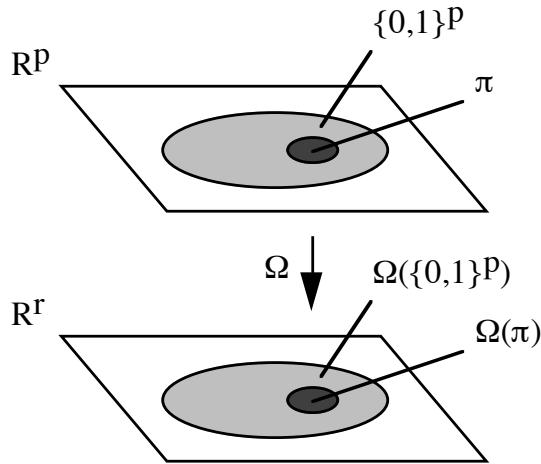
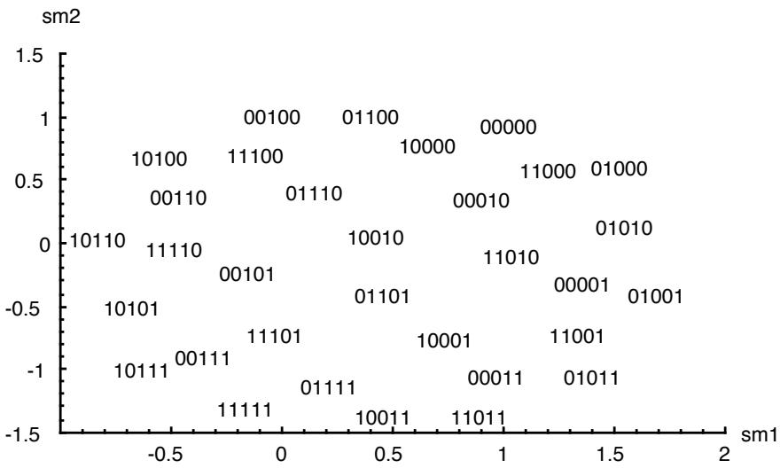
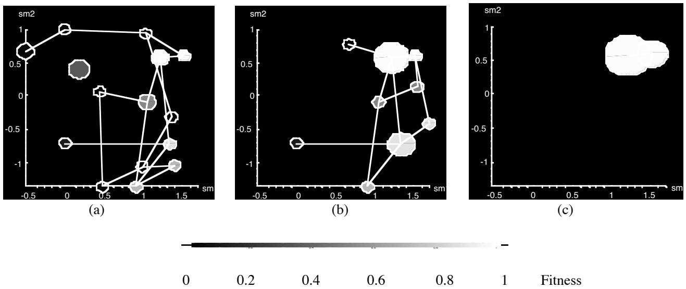
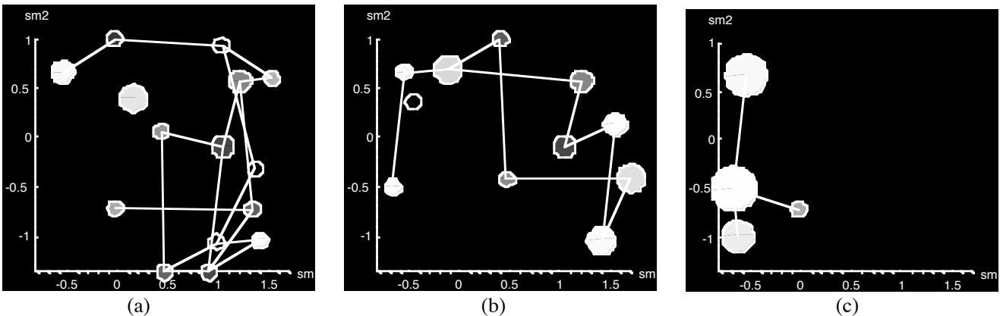
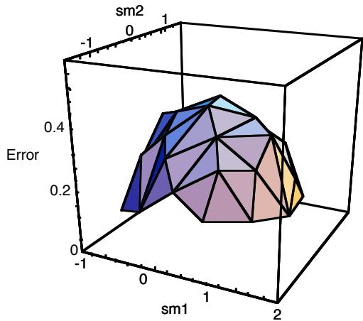

# Visualization of Binary String Convergence by Sammon Mapping

# R. Dybowski

# T.D. Collins

Dept. of Microbiology, UMDS, Lambeth Palace Road, London SE1 7EH, UK rd65@umds.ac.uk

P.R. Weller   
Dept. of Systems Science, City University, Northampton Square,   
London EC1V 0HB, UK p.r.weller@city.ac.uk   
The Knowledge Media Institute, The Open University, Walton Hall,   
Milton Keynes MK7 6AA, UK t.d.collins@open.ac.uk

# Abstract

Understanding the evolution of a complex genetic algorithm is a non-trivial problem, however, genetic-algorithm visualization is in its infancy. This paper reviews some of the current approaches and presents a new visualization approach based on Sammon mapping. Sammon mapping is a nonlinear mapping of a set of vectors in $p$ - dimensional space to a set in $r$ -dimensional space, where $r < p$ . The mapping attempts to preserve in $r .$ -space the Euclidean inter-vector distances present in $p$ -space. We demonstrate that a Sammon mapping to 2-space of binary chromosomes present in a higher-dimensional allele space during the execution of a genetic algorithm can indicate the presence of multiple solutions. Shortfalls of this approach are discussed along with possible solutions.

# 1. 0 Introduction

A genetic algorithm (GA) is a complex search algorithm intended to randomly sample a problem space and then, through a series of recombination and mutation operations, identify the regions of the problem space containing useful solutions. The user's understanding of a GA's evolution is generally based on the monitoring of the chromosome's fitness values, and this is often presented as a results-per-generation and/or a fitness-versus-time graph (examples of which can be found in Goldberg (1989)). This graphical representation enables the user to observe the mean fitness levels, the spread of fitness ratings, and the rate of improvement.

Although such a representation does illustrate the convergence of the consecutive populations' fitness ratings, it illustrates nothing about the content of the individual chromosomes. That is to say, the user can gather no information as to the number of good solution regions being considered, their value, or similarity.

The aim of this paper is to explain one approach to producing a visual presentation of a GA's chromosomes so that the information not currently available from the fitness-versus-time graph can be made more apparent. The remainder of this paper is organised as follows. The second section describes some of the existing approaches to GA visualization; the third section explains the approach investigated by us (i.e. Sammon mapping); the fourth section provides some results; and the fifth section presents known shortfalls of this technique and details some of the continuing work being done.

# 2.0 Current methods of GA visualization

Software visualization is "the use of the crafts of typography, graphic design, animation and cinematography with modern human-computer interaction technology to facilitate both the human understanding and effective use of computer software" (Price et al, 1993). Although a fitness-versus-time graph is one of the most common methods for visualizing a GA, it is not the only one. Other graphical displays have been used in varying forms to illustrate individual chromosome fitness ratings within the same generation. These have been examined by Collins (1993) and summarised by Routen and Collins (1993). The use of individual population fitness graphs and histogram plots illustrating each chromosome's fitness rating were examined. Although these views of the GA's data do illustrate the fitness levels within each population, they add little information that cannot be extracted from the fitness-versus-time graph. In fact, because they are ordered by fitness, the views could disguise the discovery of multiple near-optimal solutions.

Another approach adopted by Collins (1993) was to present iconic representations of the chromosomes themselves. A simple example is to present the alleles of a chromosome as a row of grey-scaled squares. By translating each chromosome into an iconic image, each population could be displayed and common patterns (i.e. schemata) identified. Although this method presents the individual chromosomes in each population, the amount of computational power required to generate each icon can mean that, for large populations of long chromosomes, this method can become inappropriate for real-time visualization. Furthermore, the amount of information displayed can appear to clutter the screen.

The most promising known approach to visualizing the chromosome data is the use of a dataspace metaphor in which each chromosome is represented as a point in two- or three-dimensional space mapped from its position in a higherdimensional allele space. This creates a simple visual image of a GA's exploratory search. Nassersharif et al (1994) proposed this method for two-dimensional problems in which the GA's chromosomes could be displayed directly in a three-dimensional scatterplot. The two problem dimensions of each chromosome were mapped onto the $x$ and $y$ axes, with the corresponding fitness rating being mapped onto the z axis. Although this is a very salient representation, their technique is limited to problems of only two dimensions. Another approach to presenting a dataspace view was proposed by Routen and Collins (1993) in which each chromosome was rated due to its similarity to a base chromosome (for example, a chromosome with all alleles equal to zero). A two-dimensional dataspace plot could then be presented on a fitness-versus-similarity rating scatterplot. The failing of this method is the problem of identifying a suitable similarity rating.

# 3.0 Sammon mapping

Consider $n$ vectors of length $p$ regarded as $n$ vectors in $p$ -space $\mathsf { A } ^ { p }$ . Associated with these are $n$ vectors in $\mathsf { A } ^ { r }$ , where $r < p$ and $r \in \{ 2 , 3 \}$ . Sammon's nonlinear mapping (Sammon, 1969) provides a subspace depiction of the distribution of the $p .$ - dimensional vectors which, as much as possible, preserves $r$ -dimensionally the original Euclidean distances between the $p$ -dimensional vectors. This is done by iteratively reducing the disagreement between the $p .$ -space inter-vector distances and the corresponding $r$ -space inter-vector distances by means of a steepest-descent optimisation procedure as follows.

Let the disagreement (error) between the $p$ -space and $r .$ -space inter-vector distances after the $m$ -th iteration, $E r r o r _ { \langle m \rangle }$ , be defined by

$$
E r r o r _ { \langle m \rangle } = \frac { 1 } { \displaystyle \sum _ { i < j } ^ { n } [ d _ { i j } ^ { * } ] } \sum _ { i < j } ^ { n } [ d _ { i j } ^ { * } - d _ { i j _ { \langle m \rangle } } ] ^ { 2 } / d _ { i j } ^ { * } ~ ,
$$

where ${ d _ { i j } } ^ { * }$ denotes the Euclidean distance between the $i .$ -th and $j$ -th vectors in $\mathsf { A } ^ { p }$ , and $d _ { i j \langle m \rangle }$ is the Euclidean distance between the corresponding vectors in $\mathsf { A } ^ { r }$ after the $m$ -th iteration. If $\nu _ { i k \langle m \rangle }$ denotes the $k$ -th element of the $i .$ -th vector in $\mathsf { A } ^ { r }$ at the $m$ -th iteration, the value for this element at the $( m + 1 )$ -th step of the steepest-descent procedure for minimising $E r r o r _ { \langle m \rangle }$ is given by

$$
\nu _ { i k \langle m + 1 \rangle } = \nu _ { i k \langle m \rangle } - \displaystyle \frac { \xi } { \left| \frac { \partial ^ { 2 } E r r o r _ { \langle m \rangle } } { \partial \nu _ { i k \langle m \rangle } ^ { ~ 2 } } \right| } \cdot \frac { \partial E r r o r _ { \langle m \rangle } } { \partial \nu _ { i k \langle m \rangle } } ,
$$

where $\boldsymbol { \zeta }$ is an empirically-derived constant (typically about 0.4) associated with the step length.

Principal component analysis (Kittler & Young, 1973) provides a straightforward linear mapping of points in $\mathsf { A } ^ { p }$ to points in $\mathsf { A } ^ { r }$ . However, the resulting $r$ -dimensional approximation of the distribution in $\mathsf { A } ^ { p }$ accounts for the greatest possible variation of the points in $\mathsf { A } ^ { \flat }$ at the expense of their Euclidean distances. In contrast, Sammon mapping attempts to maintain the Euclidean distances.

# 3.1 Sammon mapping for binary-valued chromosomes

Suppose that we wish to visualize the convergence of a population of chromosomes of length $p$ having binary-valued alleles. A natural similarity metric for comparing two binary chromosomes is their Hamming distance, and this is equal to the square of their Euclidean distance when they are regarded as vectors. If the chromosomes are regarded as vectors in $\mathsf { A } ^ { p }$ , the vertices $\{ 0 , 1 \} ^ { p }$ of the $p$ -dimensional unit hypercube is the set of all possible chromosomes, and the first step is to map the Cartesian product $\{ 0 , 1 \} ^ { p }$ $( \mathsf { C A } ^ { p } )$ onto $\mathsf { A } ^ { r }$ using Sammon mapping, where $\mathrm { \Delta r } \in \{ 2 , 3 \}$ . If the steepest-descent procedure results in two elements of $\{ 0 , 1 \} ^ { p }$ having the same image, the images can be separated by the introduction of a small perturbation thereby providing a unique mapping (i.e. bijectivity). Let the resulting mapping to subspace $\mathsf { A } ^ { r }$ be denoted by $\Omega { \cdot } \Lambda ^ { p } { \to } \Lambda ^ { r }$ . Once $\Omega$ has been obtained, the image of $\{ 0 , 1 \} ^ { p }$ under $\Omega$ is fixed and, for each GA generation of interest, the current population $\Pi ( \subseteq \{ 0 , 1 \} ^ { p } )$ of chromosomes is visualized as a scatter plot in $\mathsf { A } ^ { r }$ equal to the image $\Omega ( \Pi )$ . This is summarised by Figure 1.

  
Figure 1. Schematic diagram of the mapping of $\{ 0 , 1 \} ^ { p }$ and $\Pi$ from $\boldsymbol { \mathrm { A } } ^ { p }$ to $\mathrm { ~ A ~ } ^ { r }$ under $\Omega$

During convergence of $\Pi$ toward the fittest chromosome $F$ , we expect the number of genes in each chromosome that differ from those of $F$ to decrease as the GA progresses. As the number of differing genes between two binary chromosomes decreases, the Euclidean distance between them in $\mathsf { A } ^ { p }$ decreases because of the decrease in their Hamming distance. Consequently, because $\Omega ( \{ 0 , 1 \} ^ { p } )$ approximates the inter-vector Euclidean distances present within $\{ 0 , 1 \} ^ { p }$ , we expect to see the points of scatter plot $\Omega ( \Pi )$ change from being initially widely distributed in codomain $\boldsymbol { \mathrm { A } } ^ { r }$ to becoming a collection of one or more clusters.

If the Sammon mapping is $\Omega { : } \boldsymbol { \mathrm { A } } ^ { p } {  } \boldsymbol { \mathrm { A } } ^ { 2 }$ , the relative frequency of each element $A$ of $\Pi$ and its corresponding fitness value can be represented by a bar graph over $\mathrm { A } ^ { 2 }$ in which the height of the bar located on $\Omega ( A )$ is equal to the relative frequency of $A$ in the population, and the colour of the bar is a function of the fitness value for $A$ . The colour banding could be based on the light spectrum using bright red for the maximum fitness value obtainable from $\Pi$ through to dark blue for the minimum. The scatter plots or bar graphs could either be built up through time (by adding each new image without deleting the previous one) or else redrawn for each generation. The second option may be better for comparing subsequent generations. Instead of a 3D plot with bars, one could use a 2D plot with discs in place of bars, the area of a disc being proportional to the relative frequency.

An alternative mapping is to use $\Omega { : } \boldsymbol { \mathrm { A } } ^ { p } \dot {  } \boldsymbol { \mathrm { A } } ^ { 3 }$ . The addition of a third axis could provide a clearer presentation of the convergence process. In this case, the above-mentioned colour banding could be used for colouring the points of the 3D scatter plot to convey the associated fitness values.

# 4.0 Simulated experiments

# 4.1 A GA with a unimodal fitness function

Starting with a random population of $2 0 5$ -bit chromosomes, a GA was performed using the following unimodal fitness function

$$
f _ { 1 } ( A ) = e ^ { - 0 . 5 \left( \frac { 1 0 d e c ( A ) } { d e c ( 1 0 0 0 0 ) } - 5 \right) ^ { 2 } } ,
$$

where $d e c ( A )$ is the decimal number corresponding to $A$ when $A$ is regarded as a Gray code. The fittest chromosomes w.r.t. function (3) are 01000 and 11000. The GA used 1-point crossover for the recombinations and a mutation rate of 0.01. Figure 2 is the image $\Omega ( \{ 0 , 1 \} ^ { 5 } )$ of $\{ 0 , 1 \} ^ { 5 }$ resulting from the Sammon mapping described in Section 3 after 53 iterations. Figures 3(a), 3(b) and 3(c) are the resultant $\Omega ( \Pi )$ plots (where $\Pi \subseteq \{ 0 , 1 \} ^ { 5 }$ ) obtained for Generations 0, 2 and

20, respectively, discs being centred over the elements of $\Omega ( \Pi )$ . The area of each disc is proportional to the relative frequency of the corresponding chromosome in $\Pi$ , and the grey level of the disc is a function of the chromosome's fitness. We found that the occurrence of clusters of Hamming-wise similar chromosomes can be accentuated by drawing lines between those pairs of elements of $\Omega ( \Pi )$ whose chromosomes differ by a Hamming distance of precisely one $( H D I$ lines). Using HD1 lines enables clusters of Hamming-wise similar chromosomes to be distinguished from clusters in $\mathrm { A } ^ { 2 }$ caused by the presence of mapping errors.

  
Figure 2. Image of $\Omega ( \{ 0 , 1 \} ^ { 5 } )$ in $\mathrm { A } ^ { 2 }$ under a Sammon mapping. sm1 and $s m 2$ are the axes of the two-dimensional Cartesian coordinat system.

  
Figure 3. Sammon-mapping visualization of the progress of a GA with unimodal fitness function (3). The visualization is based on the image obtained in Figure 2. (a) Generation 0; $( b )$ Generation 2; (c) Generation 20. The lines between the discs are HD1 lines. The grey-level scale for fitness is included.

# 4.2 A GA with a bimodal fitness function

This GA is identical to that used in the preceding section except that the following bimodal fitness function was used in place of function (3):

$$
f _ { 2 } ( A ) = e ^ { - 0 . 5 \left( \frac { 1 0 d e c ( A ) } { d e c ( 1 0 0 0 0 ) } - 4 \right) ^ { 2 } } + e ^ { - 0 . 5 \left( \frac { 1 0 d e c ( A ) } { d e c ( 1 0 0 0 0 ) } - 8 \right) ^ { 2 } } .
$$

The chromosomes corresponding to the two maxima are 01010 and 10101, respectively. Figures 4(a), 4(b) and 4(c) are the plots obtained for Generations 0, 3 and 10, respectively.

  
Figure 4. Sammon-mapping visualization of the progress of a GA with bimodal fitness function (4). The visualization is based on the image obtained in Figure 2. (a) Generation 0; $( b )$ Generation 3; (c) Generation 10.

# 4.3 Results

Figures 3(a), 3(b) and 3(c) clearly convey convergence toward the maximum of the unimodal fitness function. The convergence started from a random distribution of two-dimensional vectors in Figure 3(a) and progressed, via Figure 3(b), toward chromosomes 01000 and 11000 located in the top-right quadrant of Figure 3(c) (Compare the position of the discs with the image shown in Figure 2). The visualization is more effective when colour is used in place of grey levels.

When the bimodal fitness function was used, Sammon mapping of Generation 3 showed two distinct groups of two high-fitness chromosomes located on the left- and right-hand sides of Figure 4(b) (i.e. the four lightest discs). These clusters correspond to the two maxima of function (4). The left-hand cluster consists of chromosomes 10101 and 10100, and the right-hand cluster of 01010 and 01011. The clusters are distinct since they are not linked to each other by a single HD1 line, and the presence of two clusters indicates solutions in two regions of allele space. The GA finally converges to a single cluster having 10101 as the fittest chromosome (Figure 4(c)).

# 5.0 Limitations and tentative solutions

There are several limitations with the above use of Sammon mapping for visualizing chromosomes in allele space. We will now describe these and propose some solutions.

# 5.1 Non-uniformity of errors

The error $E r r o r _ { \langle m \rangle }$ defined by Equation (1) is composed of errors contributed by all the elements of $\Omega ( \{ 0 , 1 \} ^ { p } )$ present at the $m$ -th iteration. Let the error contributed by the $q$ -th element in $\Omega ( \{ 0 , 1 \} ^ { p } )$ at the $m$ -th iteration be defined by

$$
E r r o r _ { \langle m \rangle } ( q ) = \frac { 1 } { \displaystyle \sum _ { j \neq q } ^ { n } [ d _ { q j } ^ { * } ] } \sum _ { j \neq q } ^ { n } [ d _ { q j } ^ { * } - d _ { q j \langle m \rangle } ] ^ { 2 } / d _ { q j } ^ { * } \ ,
$$

where $n = 2 ^ { p }$ (cf. Equation (1)). It is not the case that $\operatorname* { l i m } _ { m \to \infty } E r r o r _ { \langle m \rangle } ( q ) = 0$ , nor is it the case that every $q$ will necessarily exhibit the same non-zero value for $\operatorname* { l i m } _ { m \to \infty } E r r o r _ { \langle m \rangle } ( q )$ . This is seen in Figure 5, where $E r r o r _ { \langle 5 3 \rangle } ( q )$ has been plotted over the elements of $\Omega ( \{ 0 , 1 \} ^ { 5 } )$ shown in Figure 2 resulting in a non-uniform distribution of errors, with errors being greater at the centre of the distribution of $\Omega ( \{ 0 , \stackrel { \smile } { 1 } \} ^ { 5 } )$ in $\mathrm { A } ^ { 2 }$ than at the periphery. The consequence of this is that, in our experience, if an element of $\Omega ( \{ 0 , 1 \} ^ { 5 } )$ corresponding to a maximum of a $g$ -modal fitness function happens to be positioned nearer to the centre of the distribution of $\overset { \cdot } { \Omega } ( \{ 0 , 1 \} ^ { 5 } )$ in $\mathrm { A } ^ { 2 }$ , there is a decreased likelihood of observing $g$ clusters during a GA corresponding to the $g$ maxima of the fitness function.

  
Figure 5. Triangular surface plot of $E r r o r _ { \langle 5 3 \rangle } ( q )$ over each element of $\Omega ( \{ 0 , 1 \} ^ { 5 } )$ .

In the case of binary chromosomes it can be shown that

$$
E r r o r _ { \langle m \rangle } = \frac { 1 } { n } \sum _ { q = 1 } ^ { n } E r r o r _ { \langle m \rangle } ( q ) ,
$$

and substituting (5) into the iterative step defined by Equation (2) gives

$$
\nu _ { i k \langle m + 1 \rangle } = \nu _ { i k \langle m \rangle } - \frac { \xi } { \left| \displaystyle \sum _ { q = 1 } ^ { n } \frac { \partial ^ { 2 } E r r o r _ { \langle m \rangle } ( q ) } { \partial \nu _ { i k \langle m \rangle } ( q ) ^ { 2 } } \right| } \cdot \sum _ { q = 1 } ^ { n } \frac { \partial E r r o r _ { \langle m \rangle } ( q ) } { \partial \nu _ { i k \langle m \rangle } ( q ) } \quad \mathrm { ~ . ~ }
$$

But the summations in Equation (6) are unweighted, therefore, perhaps the distribution of errors over $\Omega ( \{ 0 , 1 \} ^ { p } )$ will be smoothed out during successive iterations by replacing (6) with

$$
\nu _ { i k \langle m + 1 \rangle } = \nu _ { i k \langle m \rangle } - \frac { \xi } { \left| \displaystyle \sum _ { q = 1 } ^ { n } w _ { \langle m \rangle } ( q ) \frac { \partial ^ { 2 } E r r o r _ { \langle m \rangle } ( q ) } { \partial \nu _ { i k \langle m \rangle } ( q ) ^ { 2 } } \right| } \cdot \sum _ { q = 1 } ^ { n } w _ { \langle m \rangle } ( q ) \frac { \partial E r r o r _ { \langle m \rangle } ( q ) } { \partial \nu _ { i k \langle m \rangle } ( q ) } ,
$$

where weight $w _ { \{ m \} } ( q )$ increases monotonically with $E r r o r _ { \langle m \rangle } ( q )$ . However, even if procedure (7) does smooth out the mapping errors, it may be the case that the resulting error level for each $q$ (i.e. $E r r o r _ { \langle m \rangle } )$ will be too high to permit visualization of multiple solutions in allele space. Although convergence is observable in Figures 3 and 4, the

chromosomes corresponding to the maxima of fitness functions (3) and (4) were fortuitously located on the periphery of $\Omega ( \{ 0 , 1 \} ^ { 5 } )$ in $\mathrm { A } ^ { 2 }$ , where $E r r o r { _ { \langle 5 3 \rangle } } ( q ) < E r r o r _ { \langle 5 3 \rangle }$ according to Figure 5 and Equation (5).

# 5.2 Computational complexity

The computational complexity (asymptotic running time) of Sammon mapping in its basic form is quadratic w.r.t. $n$ , the number of mapped points. An algorithm proposed by Niemann (1980), based on coordinate descent, requires less computation than steepest descent and has a faster convergence rate, but it can lead to poorer mapping w.r.t. the Sammon criterion (Siedlecki et al, 1988). Dzwinel (1994) investigated several methods for improving Niemann's algorithm and found a rescaling method to be the most effective although the complexity appears to remain quadratic.

<table><tr><td rowspan=2 colspan=1>Type of mapping</td><td rowspan=1 colspan=1></td><td rowspan=1 colspan=1>Computational complexity</td></tr><tr><td rowspan=1 colspan=2>In general</td><td rowspan=1 colspan=1>For all possible binarychromosomes of length p</td></tr><tr><td rowspan=1 colspan=2>Principal component</td><td rowspan=1 colspan=2>O(max(np2,p3))</td><td rowspan=1 colspan=1>O(2pp2)</td></tr><tr><td rowspan=1 colspan=2>Sammon</td><td rowspan=1 colspan=2>O(n(n+1)(p+m+1)+m) for constant r</td><td rowspan=1 colspan=1>O(22p(p+m)) for constant r</td></tr><tr><td rowspan=1 colspan=2>Kohonen feature</td><td rowspan=1 colspan=2>O(n(naray(p+1)+1)(m+1)+m),where narray≥n</td><td rowspan=1 colspan=1>O(22pp(m+1))if narray= n</td></tr><tr><td rowspan=1 colspan=2>Bishop&#x27;s latent-variable</td><td rowspan=1 colspan=2>O(Kp(n+M)) for constant m</td><td rowspan=1 colspan=1>O(K2pp) for constant m,M</td></tr></table>

$n :$ number of data points   
$p :$ dimension of data space   
$r :$ dimension of mapping codomain (equal to 2 or   
3)   
$m :$ number of iterations   
$n _ { a r r a y }$ : number of array points   
$K :$ number of kernel functions in mixture model   
$M :$ number of basis functions in generalised linear   
neural network

Table 1. A comparison of computational complexity (expressed using the big-O notation(Aho et al, 1992)) for various mapping algorithms.

So far, we have considered mapping a data point $\boldsymbol { x }$ in $p$ -space to a point $\textbf { y }$ in $r$ -space $r = 2 , 3 )$ :

$$
y _ { i } = y _ { i } \left( x _ { 1 } , \dots , x _ { p } \right) ; i = 1 , \dots , r
$$

An alternative is to regard $y _ { 1 } , \dots , y _ { r }$ as latent variables (hidden factors) which have generated the dependence or variation in the observed data:

$$
x _ { i } = x _ { i } \left( y _ { 1 } , \dots , y _ { r } \right) ; i = 1 , \dots , p
$$

The usual procedure for obtaining a latent variable model is to use factor analysis (Lawley, 1943). This provides a linear model of covariance structure. Bishop (1995) has devised a non-linear mapping based on latent variables and a generalised linear neural network. This has provided effective visualisation when using latent variables as the axes of a visualisation space.

In contrast to Sammon mapping, the computational complexities of principle component analysis and Bishop's mapping are linear w.r.t. n (Table 1). However, when all possible binary chromosomes of length $p$ are to be included in a mapping, the computational complexities for all the mapping methods are exponential w.r.t. $n$ because $n = 2 ^ { p }$ for binary chromosomes. One response to this is to limit the mapping to a subset of chromosomes, for example, those containing a common schema of interest.

As regards mapping errors, non-linear methods (e.g. Sammon, Kohonen (1989) and Bishop's mapping) tend to be better then linear ones (e.g. principle component analysis) (Siedlecki et al, 1988). Amongst the former, Sammon mapping is more accurate than Kohonen mapping for low-dimensional data spaces, the reverse being true for high-dimensional data spaces (de Vel et al, 1995).

Of the above methods, Bishop's mapping is the only one which is non-linear in its projection onto a lower-dimensional space yet which is linear w.r.t. n. It should be borne in mind that once $\Omega ( \{ 0 , 1 \} ^ { p } )$ has been determined for a given $p$ by whatever method, it can be stored as a look-up table for future use (for example, via the Internet) and the mapping need not be repeated.

# 5.3 Equal relative frequencies

The number of possible binary chromosomes increases as the length of the chromosomes increases, therefore, for a given size of population, the probability of there being at least two identical chromosomes within a generation decreases. Consequently, the expectation is that more bars/discs in a Sammon-mapping visualization will have a relative frequency not greater than the reciprocal of the population size. In this situation, visualization may be enhanced by creating a quasiprobability density function for each generation by means of kernel density estimation (Silverman, 1986) even though the sample space is not continuous. This renders the density of the points in $\mathrm { A } ^ { 2 }$ and, unlike bar or disc plots, it can provide contour diagrams. However, a problem with this method is that it can involve considerable computational time thereby slowing down the rate with which the progress of a GA is displayed or analysed.

# 6.0 Conclusion

Our approach goes beyond those of Collins (1993) and Nassersharif et al (1994). It makes the visualization of a GA's chromosomes a possibility, illustrating the number of solutions being considered, their similarity and fitness ratings. In particular, we demonstrated in Section 4.2 how the technique can identify the occurrence of alternative solutions.

Because of the computational complexity of Sammon mapping, and the non-uniformity of mapping errors, future work will investigate computationally more efficient alternatives possibly coupled with an error-smoothing strategy. Bishop's method is of particular interest since it is a computationaly efficient approach to nonlinear mapping. In practice, a mapping would be done prior to visualization with the results being stored in a look-up table suitable for on-the-fly view generation. We have yet to test the efficacy of various visualization modes (e.g. 3D plots with colour-coded bars) amongst a large number of potential users.

Five-bit binary strings were used in this paper purely to provide simple explanatory examples. Although it is true that 'real-world' GA chromosomes tend to be larger, and that the size of the problem space grows exponentially with that of the chromosomes' length, viewing the image $\Omega ( \Pi )$ is not seen as a problem. Modern human-computer interaction technology has produced a variety of interface mechanisms suitable for viewing larger-than-screen images. Examples include scroll bars, zooming tools, fisheye viewers (Sarkar and Brown, 1992) and Magic Lens(TM) filters (Stone et al, 1994).

# Acknowledgements

This work was funded partially by the Special Trustees for St Thomas' Hospital (London), and by the Engineering and Physical Sciences Research Council. We also thank the referees for their comments.

# Bibliography

Aho AV, Ullman JD (1992). Foundations of computer science. New York: Computer Science Press, pp 83-142, 340.

Bishop CM (1995). EM optimisation of latent-variable density models. Advances in Neural Information Processing Systems. Cambridge, MA: MIT Press.

Collins TD (1993). The Visualisation of Genetic Algorithms. MSc Project Report, Department of Computer Science, De Montfort University.

de Vel O, Li S, Coomans D (1995). Non-linear dimensionality reduction: a comparative performance analysis. In Proceedings of the Fifth International Workshop on Artificial Intelligence and Statistics, Ft. Lauderdale, Florida.

Dzwinel W (1994). How to make Sammon's mapping useful for multidimensional data structure analysis. Pattern Recognition, 27, 949-959.

Goldberg DE (1989). Genetic Algorithms in Search, Optimization and Machine Learning. Reading, MA: Addison Wesley. pp 73-74.

Kittler J, Young PC (1973). A new approach to feature selection based on the Karhunen-Loeve expansion. Pattern Recognition, 5, 335-352.   
Kohonen T (1989). Self-organization and associative memory (3rd ed). Berlin: Springer-Verlag.   
Lawley, DN (1943). The application of the maximum likelihood method to factor analysis. British Journal of Psychology, 33, 172-175.   
Nassersharif B, Ence D, Au M (1994). Visualisation of evolution of genetic algorithms. In Proceedings of the World Congress on Neural Networks. Hillside, NJ: Lawrence Erlbaum Associates. pp I-560-I-565.   
Niemann H (1980). Linear and nonlinear mapping of patterns. Pattern Recognition, 12, 83-87.   
Price BA, Baecker RM, Small IS (1993). A Principled Taxonomy of Software Visualisation. Journal of Visual Languages and Computing, 4, 211 - 266.   
Routen T, Collins TD (1993). Visualisation of A.I. techniques. In Proceedings of the Third International Conference on Computational Graphics and Visualization Techniques. New York: ACM Press. pp 274-282.   
Sammon JW (1969). A nonlinear mapping for data structure analysis. IEEE Transactions on Computers, C-18, 401-409. Sarkar M, Brown MH (1992). Graphical fisheye views of graphs. In Proceedings of the ACM SIGCHI Conference on Human Factors in Computing Systems, 1992. New York: ACM Press. pp.83-91.   
Siedlecki W, Siedlecki K, Sklansky J (1988). An overview of mapping techniques for exploratory pattern analysis. Pattern Recognition, 21, 411-429.   
Silverman BW (1986). Density Estimation for Statistics and Data Analysis (Chapman and Hall, London).   
Stone MC, Fishkin K, Bier EA (1994). The movable filter as a user interface tool. In Proceedings of the ACM SIGCHI Conference on Human Factors in Computing Systems. New York: ACM Press.