# Putting More Genetics into Genetic Algorithms

Donald S. Burke   
Center for Immunization Research   
School of Hygiene and Public Health   
Johns Hopkins University   
Baltimore, MD 21205   
dburke@jhsph.edu   
Kenneth A. De Jong   
Computer Science Department   
George Mason University   
Fairfax, VA 22030   
kdejong@gmu.edu

John J. Grefenstette Institute for Biosciences, Bioinformatics and Biotechnology George Mason University Manassas, VA 20110 gref@ib3.gmu.edu

Connie Loggia Ramsey Annie S. Wu Navy Center for Applied Research in Artificial Intelligence Naval Research Laboratory Washington, DC 20375 {ramsey,aswu}@aic.nrl.navy.mil

# Abstract

The majority of current genetic algorithms (GAs), while inspired by natural evolutionary systems, are seldom viewed as biologically plausible models. This is not a criticism of GAs, but rather a reflection of choices made regarding the level of abstraction at which biological mechanisms are modeled, and a reflection of the more engineering-oriented goals of the evolutionary computation community. Understanding better and reducing this gap between GAs and genetics has been a central issue in an interdisciplinary project whose goal is to build GA-based computational models of viral evolution. The result is a system called VIV that incorporates a number of more biologically plausible mechanisms including a more flexible genotype-to-phenotype mapping; in VIV the genes are independent of position, and genomes can vary in length and may contain non-coding regions, as well as duplicative or competing genes.

Initial computational studies with VIV have already revealed several emergent phenomena of both biological and computational interest. In the absence of any penalty based on genome length, VIV develops individuals with long genomes and also performs more poorly (from a problem solving viewpoint) than when a length penalty is used. With a fixed linear length penalty, genome length tends to increase dramatically in the early phases of evolution, and then decrease to a level based on the mutation rate. The plateau genome length (i.e., the average length of individuals in the final population) generally increases in response to an increase in the base mutation rate. When VIV converges, there tends to be many copies of good alternative genes within the individuals. We observed many instances of switching between active and inactive genes during the entire evolutionary process. These observations support the conclusion that non-coding regions serve as scratch space in which VIV can explore alternative gene values. These results represent a positive step in understanding how GAs might exploit more of the power and fexibility of biological evolution, while at the same time providing better tools for understanding evolving biological systems.

Keywords: Models of viral evolution, variable-length representation, length penalty functions, genome length adaptation, non-coding regions, duplicative genes.

# 1 Introduction

The majority of current genetic algorithms (GAs), while inspired by natural evolutionary systems, are seldom viewed as biologically plausible models. This is not a criticism of GAs, but rather a reflection of choices made regarding the level of abstraction at which biological mechanisms are modeled, and a reflection of the more engineering-oriented goals of the evolutionary computation community. Understanding better and reducing this gap between GAs and genetics has been a central issue in an interdisciplinary project with the goal of building GA-based computational models of viral evolution.

The most glaring gap between GAs and natural systems is a result of the typical choices we make in selecting a representation for the individuals to be evolved, that is, a mapping between the genotype onndiviual sually astri and s phenoype (. a paramer vecor, a raph, arule t .). It is wel known that the choice of representation is critical to the success of a GA, but many of the factors that distinguish a good representation from a bad one are not well understood. Understanding better how genetic information is represented and processed in biological systems may provide important insights.

The reader willrecall that in biological systems the genome consists of a DNA molecule that can be viewed as a string of characters over the four-letter alphabet $\{ \mathrm { A } , \mathrm { T } , \mathrm { C } , \mathrm { G } \}$ representing the underlying nucleotide building blocks. Each nucleotide triplet (or codon) within the genome potentially codes for a single amino acid. There are START codons and STOP codons that demarcate the coding regions, or genes. Genes are expressed in two steps: first, DNA is transcribed into messenger RNA (mRNA); second, mRNA is translated codon-by-codon into a protein consisting of the specified sequence of amino acids. At a molecular level, the set of proteins that are expressed by the genes can be considered the phenotype of the individual. (Of course, the term phenotype can also be used at other levels of abstraction; for example, the phenotype of an individual might also refer to morphological features that arise through the developmental process.) Even at the molecular level, the biological process of gene expression provides for a much more fexible genotype-to-phenotype mapping than we see in most evolutionary algorithms. In particular, we note the following key features of the biological genetic representation:

Biological genomes vary in length during evolution.   
Biological genes are independent of position.   
•Biological genomes may contain non-coding regions.   
•Biological genomes may contain duplicative or competing genes.   
•Biological genomes have overlapping reading frames.

It is natural to ask whether GAs might benefit by exploiting some of these same characteristics. Let's examine each of these points in the context of genetic algorithms.

Biological genomes vary in length during evolution. Unlike the case in traditional GAs, the amount of genetic material in biological genomes varies over the course of evolution due to insertions, deletions and recombinations. Several studies have shown that GAs can benefit from allowing the length of genomes to vary as well (Smith 1983; Goldberg, Deb, and Korb 1989; Grefenstette, Ramsey, and Schultz 1990; Harvey 1992a; Iba, deGaris, and Sato 1994).

Biological genes are independent of position. In a typical GA (or ES), the interpretation of each position is fixed. For example, the first eight bits of the genome might be interpreted as the value for component $x _ { 1 }$ of the candidate solution. In biology, the protein expressed by a given gene depends solely on the information sequence in the gene, not on the position of the gene along the chromosome.

In this sense, biological genes are independent of position. 1 Location-independent genes might allow a GA to adapt the structure of the solutions being generated. For example, advantageous positions of co-dependent genes may emerge which prevent deleterious recombinations (Goldberg, Deb, and Korb 1989).

Biological genomes may contain non-coding regions. In a typical EA, all bits in the genome contribute to the specification of the candidate solution. In biology, much of the DNA in higher organisms (for example, perhaps as much as $9 0 \%$ of human DNA) does not code for any protein products (Lewin 1994; Nei 1987). The role of non-coding regions in biological systems is an active area of research (Wu and Lindsay 1996b). Such regions are thought to provide some advantages:

They may buffer coding regions from the destructive effects of mutation and recombination. They may encourage the shuffling or recombination of coding regions. •Inactive coding regions may store backup copies of active coding regions or may be modified (unhampered by selection pressure) in the search for improvements to known coding regions. Inactive coding regions may store information relevant to different environments, and these inactive regions could become active when encountering a new environment.

In GAs, non-coding regions have been shown to affect the linkage among genes and, in some cases, improve the search performance (Forrest and Mitchell 1992; Wu and Lindsay 1995; Wu and Lindsay 1996a).

Biological genomes may contain duplicative or competing genes. In GAs, there is usually a single gene for each component of the candidate solution. For example, if the genome represents a set of numeric parameters

$$
{ \overline { { x } } } \ = \ \langle x _ { 1 } , \cdot \cdot \cdot , x _ { n } \rangle
$$

then a GA usually assigns exactly one portion of the genome to code for each $x _ { i }$ . In biology there is no such restriction. In some cases, there are multiple copies of a gene that produces a given protein. In fact, because of the many-to-one nature of the genetic code, there could be many genes with distinct DNA sequences that code for the identical protein. It may also be possible, especially early in the evolution of a new species, that several competing genes exist that code for alternative proteins for the same function within the organism. In GAs, the use of duplicative genes may provide additional workspace" in which the GA can generate alternative potential solutions, enhancing exploration of the search space.

Biological genomes have overlapping reading frames. The triplet nature of the biological genetic code induces three "reading frames"; that is, three sequences of codons can be read from a given strand of DNA, depending on which nucleotide is chosen as the starting point. (And, of course, DNA organisms are usually diploid, so there are three more reading frames on the complementary strand in the double helix.) One effect of this representation feature is that biological genomes have overlapping reading frames; that is, genes for distinct protein products can share the same part of the genome. This may affect the linkage between genes, since overlapping genes are constrained to mutate together. In GAs, overlapping genes may allow for more compact representations of solutions and more effective linkages between co-dependent genes.

# 1.1 Overview of the Paper

In the remainder of this paper, we explore the behavior of a GA that adopts a biologically-inspired representation that exhibits al of the above characteristics. We believe that this study represents one step in a larger examination of ways that GAs might begin to capture the power and fexibility of biological evolution. It is also hoped that these studies will begin to return dividends in the form of a better understanding of evolving biological systems. To this end, in Section 2 we outline a GAbased model of viral evolution called VIV (Virtual Virus). VIV is being developed as part of an effort to model the evolution of emerging diseases. In particular, VIV facilitates the study of the role of genetic evolvability in emerging virus diseases. The need to model the genetic aspects of viruses led directly to the present study of flexible representations in GAs. In Section 3, we describe a number of computational studies of VIV that illustrate some interesting relationships that are beginning to emerge among the flexible, biologically-inspired representation, search eiciency, and mutation rates. Section 4 outlines a number of ideas for continuing this line of inquiry.

# 1.2 Related Work

A number of studies have investigated one or more of the features described above in the context of GAs. An early study of variable length representation was the messy GA (Goldberg, Deb, and Korb 1989) which uses a binary representation in which both the value and position of each bit are specified. Though the number of bits used to generate a solution is constant, the number and ordering of the bits in the individuals being evolved varies. Missing" bits are retrieved from a universal template to generate a complete solution. Harvey (1992b) discusses some of the issues involved with variable length representations, including the mechanics of crossover in such a system (Harvey 1992a), and makes predictions about the evolved length of individuals in such systems. The delta-coding GA presented by (Mathias and Whitley 1994) uses variable length representations to control the scope of the exploration performed by the GA. SAMUEL (Grefenstette, Ramsey, and Schultz 1990) is a GA-based learning system that successfully evolves variable sized rules sets for robot navigation and control tasks. Genetic programming (GP) (Koza 1992) is another class of evolutionary algorithms that evolves programs which vary in both structure and length. Studies on the evolved length of GP programs include (Iba, deGaris, and Sato 1994; Langdon and Poli 1997; Nordin and Banzhaf 1995; Zhang and Muhlenbein 1995).

The investigation of non-coding regions has also gained increasing interest in recent years. Levenick (1991) presented one of the first studies indicating that non-coding regions improve the performance of a GA. Several studies have investigated the effects of non-coding regions on the recombination and maintenance of building blocks in the GA (Forrest and Mitchell 1992; Wu and Lindsay 1995; Wu and Lindsay 1996a). Non-coding segments were found to reduce the disruption of building blocks but not necessarily improve the speed of finding a solution. A number of GP studies have also investigated the utility of non-coding material or "bloat" in evolved programs (Haynes 1996; Langdon and Poli 1997; Nordin, Francone, and Banzhaf 1996).

Several studies have focused on adaptive organization of information on the genome. The messy GA (Goldberg, Deb, and Korb 1989) allows the GA to adapt the composition and ordering of bits of each individual. Tests have shown that the messy GA performs better than the standard GA on a class of deceptive problems. Studies on a class of functions called the Royal Road functions (Wu and Lindsay 1996a) found that using tagged building blocks that are dynamically evolved and arranged by the GA results in a much more diverse population and significantly improved performance. Mayer (1997) investigated the self-organization of information in a GA using location-independent genes.

We have investigated aspects of a flexible, biologically-inspired representation in GAs in the specific context of a computational model of virus evolution called VIV (Virtual Virus). While VIV is an excellent vehicle for exploring issues of flexible representation in GAs, a primary goal of the VIV project is to explore questions concerning emerging virus epidemics by focusing on methods of viral evolution. Therefore, some aspects of the VIV model relate specifically to modeling viruses, and are described here in just enough detail so that the reader will understand the dynamics of the model. The rest of this section describes the representation, the fitness landscape, and the mutation and recombination operators used in VIV.

# 2.1 Representation of Genetic Information

In nature, an organism's phenotype is determined primarily by its genetically expressed proteins, or in other words, by the sequence of amino acids produced as a result of the transcription and translation of the bases in the genetic sequence. The VIV model defines the phenotype in terms of an analogous translation process:

that captures everalimportant representational fatures occurring in biological systems, including:

•A four letter genetic alphabet,   
• A degenerate (many-to-one) genetic code,   
•START and STOP codons to demarcate genes, and •Multiple reading frames.

VIV adopts the standard four letter alphabet, $G ~ = ~ \{ { \tt A } , { \tt T } , { \tt C } , { \tt G } \}$ . That is, a genome in VIV consists of a sequence such as

This contrasts with the binary alphabet used in most GAs. While the binary alphabet is sufficient to encode any problem, the use of a four letter alphabet provides roughly the same degree of redundancy that occurs in nature in the mapping between the primary genetic sequence and the resulting phenotype.

The genetic code embodies the mapping from codons to amino acids. VIV adopts an artificial genetic code to translate codons into an artificial output alphabet. The motivation for this departure from biology is that the current state of knowledge does not permit an accurate model of the function of arbitrary proteins on the basis of their amino acid sequence. Therefore, it is necessary to make some simplifying assumptions that permit the definition of a fitness landscape for our evolutionary model. The artificial genetic code in VIV facilitates the convenient definitions of fitness landscapes based on the resulting output strings, as described in the following section.

In particular, VIV adopts a mapping $C$ from triplets over the genetic alphabet (i.e., codons) to a phenotypic alphabet $O$ .

$$
C : G \times G \times G  O
$$

The output alphabet is VIV is the set:

$$
{ \cal O } ~ = ~ \{ { \tt A } , { \tt B } , { \tt C } , . . . , { \tt X } , { \tt Y } , { \tt Z } , . . , . , + \}
$$

consisting of the 26 letters of the Roman alphabet along with the three punctuation marks underscore (-), period (.) and plus $( + )$ . The underscore represents the START codon and the period represents the STOP code. The plus sign is used as additional cosmetic punctuation. The particular artificial genetic code in VIV is shown in Figure 1. This artificial genetic code shares many important features of the natural genetic code. First, the natural genetic code is degenerate, meaning there may be more than one genetic sequence that codes for the same amino acid. In VIV, the mapping from genotype to phenotype is also many-to-one. Second, the number of codons for each output symbol varies (e.g., the vowels have more codons than do the consonants). Third, the information content varies across codon positions (e.g., there is wobble" in the third position). This feature captures the biased effect of point mutations in the natural genetic code. Finally, VIV models the three reading frames occurring in natural genomes. That is, three output strings over $O$ can be derived from a given genome sequence by applying the mapping $C$ starting in any of the first three initial positions. As a result, it is possible for multiple proteins to be coded by a single section of the genome.

The next section specifies how the fitness landscape is defined using this representation.

# 2.2 The Fitness Function

For the purposes of modeling the evolution of viruses, we were motivated to define a class of fitness landscapes in which it would be easy to visualize the current evolutionary state of a set of key genes that commonly occur in viruses. For this reason, we define the fitness landscape in terms of a set of target "proteins" which are simply strings over the output alphabet of the genetic code. Our choice of the output alphabet permits us to use recognizable English words as the target "proteins" in our model. Since all viruses produce at least three key proteins, namely, the core protein, the polymerase protein and the envelope protein, we have selected the names of these common viral genes as the initial target proteins in our model. More generally, the fitness landscape in VIV can be defined as target phenotypes $T \ = \ \{ t _ { j } \}$ , a set of words over the output alphabet $O$ . That is, the target phenotype represents a phenotype that is highly fit in terms of its ability to infect a given host species. Alternative fitness landscapes associated with different species can be specified by alternative target phenotypes. For example, the target phenotype for a given viral environment might be specified as the set:

$$
T _ { A B C } = \{ \mathrm { C 0 R E P R O T E I N + A B C , P O L Y M E R A S E + A B C , E N V E L O P E + A B C } \}
$$

where the phenotype COREPROTEIN $^ +$ ABC represents the ability of the expressed gene to yield the core protein for the virus in the environment of the ABC species.

The raw fitness of a genome $x$ is computed by measuringits compatiblity with the target phenotype $T$ , as follows:

1. Identify all genes $\left\{ g _ { i } \right\}$ in the genome. A gene $g _ { i }$ is any open reading frame, i.e., any segment of the genome beginning at a START codon and ending at the next occurring STOP codon. 2. For each gene $g _ { i }$ ,trnat he e n cu  aby $c _ { i j }$ with respect to each given target term $t _ { j }$ by computing the similarity of the translated string with the target term. In computing the compatibility score, for each letter $c$ in the target term, we find the next occurrence of $c$ in the gene's output string, and add $1 / n$ if there are $n - 1$ incorrect intervening letters in the output string before $c$ , or add 0 if $c$ does not occur. After processing all letters in the target term, we divide the score by the length of the target term. 3. For each target term $t _ { j }$ in $T$ , the compatibility score $s _ { j }$ of the target term is the maximum compatibility score of any gene with respect to this term:

$$
s _ { j } = m a x _ { i } \{ c _ { i j } \}
$$

The gene that produces the highest compatibility score for a given target term is called an active gene.

4The raw fitness of the genome is then a weighted average of the squares of the compatibility scores of all the terms in the target phenotype:

$$
r a w _ { - } f i t n e s s ( x ) = \sum _ { j } ^ { | T | } w _ { j } s _ { j } ^ { 2 }
$$

In current experiments, we set $\begin{array} { r } { w _ { j } = \frac { 1 } { | T | } } \end{array}$ , for $j = 1 , 2 , 3$ . For an example, see Figure 2.

A key element of the definition of the raw fitness is step 3, in which we define the active gene as the gene that gives the best match with the target term. The motivation here is that, if a genome has several candidate genes that code for alternative proteins for a given function in the organism, then the fitness of the organism probably depends primarily on whichever alternative protein works best for that function. We assume that the presence of less effective proteins can be neglected.

Taking the maximum score in step 3 is not the only reasonable approach to measuring the fitness of a genome; for example, it would be plausible to sum the contribution of several genes that code for the same protein. In either case, this is an important extension to usual genotype-to-phenotype mapping used in genetic algorithms because it permits the investigation of the evolutionary utility of "non-coding" or inactive regions in viral genomes.

An important advantage of this definition of target phenotypes is that alternative fitness landscapes associated with different species can be specified in a systematic way by alternative target phenotypes. For example, the target phenotype for a closely related species to the one specified above might be:

$$
\{ \mathrm { C O R E P R O T E I N } + \mathrm { D E F } , \mathrm { P O L Y M E R A S E } + \mathrm { D E F } , \mathrm { E N V E L O P E } + \mathrm { D E F } \}
$$

where this target phenotype represents the most favorable expressed genes in the environment of the DEF host species. This target phenotype shares a quantifiable similarity with the first phenotype shown above, in the sense that each required "protein" has an identical prefix in the two host species. By associating a different target phenotype with each population shown in Figure 3, we can measure the evolvability of viruses among host species with known degrees of similarity. Results on these ongoing studies will be reported in future papers.

# 2.3 Selection and Replacement

Selection is the process of choosing individuals for reproduction. VIV uses proportional selection, in which the number of offspring that an individual produces is proportional to that individual's fitness (Holland 1975). Proportional selection provides anatural counterpart to the usual practice in population genetics of defining an individual's fitness in terms of its number of offspring. VIV employs a so-called generational GA, in which the entire population is replaced during each generation.

# 2.4 Mutation and Recombination

As in the traditional GA, mutation in VIV is implemented as a probabilistic operator that randomly alters individual nucleotide bases within the genome. Mutation selects from a uniform random distribution over the set of nucleotide values.Future versions of VIV wll include several biologically motivated forms of mutation, including random substitutions for individual bases, deletions, repetitions, and inversions.

Since genomes in VIV have variable lengths, it was necessary to extend the usual notion of recombination in GAs, which typically operate on fixed-length strings. Previous studies have extended one-point and two-point crossover to variable length strings (e.g., (Smith 1983; Harvey 1992a)). For the purpose of modeling the effect or recombination in viruses, VIV adopts a more biologically plausible crossover operator called homologous 1-point crossover, in which the probability of crossover depends on the degree of local homology (similarity) between two parents. The homology scoring algorithm works as follows:

1. Given two individuals, called $P a r e n t _ { 1 }$ and $P a r e n t _ { 2 }$ , pick a point at random on $P a r e n t _ { 1 }$ . 2. Compare a window of $W$ bases starting at the selected point on $P a r e n t _ { 1 }$ with windows of the same size on $P a r e n t _ { 2 }$ , for all possible starting positions for the window on $P a r e n t _ { 2 }$ . 3. Record the window on $P a r e n t _ { 2 }$ giving the highest fraction of matches $m _ { 1 2 }$ found, i.e., the best match score against $P a r e n t _ { 1 }$ .

4. The probability of performing crossover is then:

$$
p _ { c } = { \left\{ \begin{array} { l l } { ( m _ { 1 2 } - h ) / ( 1 - h ) } & { { \mathrm { i f ~ } } h \leq m _ { 1 2 } } \\ { 0 } & { { \mathrm { o t h e r w i s e } } } \end{array} \right. }
$$

where $h$ is a homology threshold below which no recombination occurs. Thus the probability of crossover increases linearly from 0 to 1 if the match score exceeds the homology threshold. In this study we set the crossover threshold to $\textit { h } \ = \ 0 . 5$ , twice the expected match score between two random strings over an alphabet of size 4 (i.e., 0.25).

If crossover does occur, a point is picked randomly within the aligned window of the parents, dividing each parent into two segments. One point crossover is used, in which one offspring comprises the first segment of $P a r e n t _ { 1 }$ and the second segment of $P a r e n t _ { 2 }$ , and the second offspring comprises the first segment of $P a r e n t _ { 2 }$ and the second segment of $P a r e n t _ { 1 }$ .

For example, given the following individuals:

$$
\begin{array} { l l } { P a r e n t _ { 1 } : } & { \mathsf { G G G T T T C G A T T T T C A T G G T A G C A A A A A T T A G } } \\ { P a r e n t _ { 2 } : } & { \mathsf { a t t t c g c t c a g g t a a a a t g c g c g } } \end{array}
$$

Suppose we select a window of size 6 at position 4 in $P a r e n t _ { 1 }$ .

Parent1 : GGGTTTCGATTTCATGGTAGCAAAAATTAG

Looking for the best match on $P a r e n t _ { 2 }$ , we find that the window beginning with the second base element matches best. We align the parents according to the match:

Parent1 : GGGTTTCGATTTCATGGTAGCAAAAATTAG Parent : atttcgctcaggtaaatgcgcg

We now randomly pick a crossover point within this window, say position 2, and perform the crossover:

Offspring1 : GGGTttcgctcaggtaaatgcgcg Of f spring2 : atTTCGATTTCATGGTAGCAAAAATTAG

There are two final things to note about this homologous crossover operator. First, it should be noted that the crossover rate specified as a system run-time parameter (the nominal crossover rate) only determines the probability that crossover is attempted between two parents. In this case, as described above, a second probability of crossover is dynamically calculated based on the similarity between the two parents. Thus the effective crossover rate is generally lower than the nominal rate, since it is the product of the fixed nominal rate and the dynamically calculated homology rate.

Finally, note that it is possible with homologous crossover to create offspring that are considerably longer than their parents (see Figure 4 for an illustration of this). As a consequence, we found it helpul from an implementation point of view to set an upper limit to the size of evolving individuals. This l is eorcduri cosover vithe ollowing simple ruleitherspringviolates themaxmum length constraint, then the crossover is aborted. In the current studies, the maximum length was set to 3000.

# 2.5 Experimental Design

The next section presents a series of computational experiments that provide some new insights into the dynamics of GAs that have fexible representations of the sort described in the previous section. Unless otherwise noted, all the studies below used the model parameters specified in Table 1.

Table 1: Default VIV Parameter Settings   

<table><tr><td>Target phenotype Population size Generations Initial genome lengths Maximum genome length Mutation operator Mutation rate Crossover operator Crossover rate</td><td>{COREPROTEIN, POLYMERASE, ENVELOPE} 500 2000 [100, 500] 3000 random base substitution</td></tr></table>

All of these parameters have been described previously except initial genome length parameters. The genomes in the initial population were generated at random, with the initial lengths set to a uniformly distributed random number between 100 and 500. For al experiments, ten independent runs were performed for each set of conditions. The graphs show the average and standard deviation of the results of the ten runs. (Error bars indicate one standard deviation over the ten runs.)

# 3 Results

# 3.1 Exploitation of Variable Length Genomes

We begin by showing how the VIV system performs on the raw fitness functions described above. The curves labeled "With No Length Bias" in Figure 5 and Figure 6 illustrate how the fitness of the population and genome length evolves over time. Notice how, in the absence of any penalty for length, VIV quickly increases the average length of individuals (via homologous crossover) until it is constrained by the (arbitrarily set) maximum length of3000. Without such arestriction the average length increases indefinitely. The reason is quite clear. Such recombinations provide selective advantage, since the additional genetic material is "free" (i.e., has no negative impact on fitness) and provides a better chance to discover higher performance active genes. Although the GA quickly identifies reasonably good solutions, the performance levels out far below the optimum fitness value. The GA is unable to form and refine useful building blocks in this expanding sea of exploratory candidate genes.

As earlier studies with variable length GAs shows (Smith 1983), it seems to be necessary to apply a length bias in the ftness function,ie.a penalty based on genome length. From a biological perspective, a length bias reflects the fact that longer genomes required more time, energy and resources to maintain and to replicate. In order to provide a simple length bias, we added a linear penalty to the fitness as follows:

$$
f i t n e s s ( x ) = \left\{ \begin{array} { l l } { ( 1 - \frac { L e n g t h ( x ) } { L e n g t h - b i a s } ) r a w _ { - } f i t n e s s ( x ) } & { { \mathrm { i f ~ } } L e n g t h ( x ) < L e n g t h . b i a s } \\ { 0 } & { \mathrm { o t h e r w i s e } } \end{array} \right.
$$

While we have not established the theoretical requirements for the optimal length bias (which probably depends on the fitness landscape), it is clear from our previous studies (Grefenstette, Burke, De Jong, Ramsey, and Wu 1997) that a severe length bias can cause the GA to converge suboptimally and that a length bias that is too weak can result in failure to converge. Our earlier computational experiments indicated that a relatively modest slope resulting from a Length_bias $\ r = 7 5 0 0$ seems reasonable for the current studies.

The curves labeled "With Length Bias" in Figures 5 and 6 show the performance of VIV with the length bias active, along with the average length of evolved genomes. With the length bias in the fitness function, VIV consistently evolves high quality approximation to the target phenotype with much shorter average genome length. All runs in the remainder of the paper use a length bias with Length_bias $= 7 5 0 0$ .

# 3.2 Effect of Mutation and Recombination

We next examine the effects of mutation and recombination rates on the VIV model. We begin by finding the combination of mutation rate and recombination rate that yields the most efficient search for the target phenotypes. In separate experiments, the mutation rate (the probability of a random substitution occurring at each base position during one generation) was fixed over the entire run at values ranging from 0.0 (no mutation) to a fairly high rate of 0.1. Nominal crossover rates were fixed at the values 0 and 1. Ten runs were performed with each parameter setting.

Preliminary experiments on the VIV model indicated that the measures of interest (e.g. best and average fitness of a population) appeared to plateau well before 2000 generations. In the following discussion, the best platenes refer to theftnes the best individual i the nal population hat is, generation 2000), and the average plateau fitness reers to the average ftness in the final population. Figure 7 shows the best and average plateau fitness obtained with each mutation rate with a crossover rate of 1. Figure 8 shows the best and average plateau fitness obtained with each mutation rate with a crossover rate of 0.

The best individuals were obtained using a mutation rate of 0.003 and with crossover enabled. In this case, the average length of the individuals in the final population was about 500 nucleotides. Thus the mutation rate of 0.003 yields on average about 1.5 mutations per individual during each generation. This is fairly consistent with biological observations across a wide rangeofspecie of about one mutation per generation per individual. Disabling crossover leads to decreased fitness with all rates of mutation tested.

# 3.3 Effects of Mutation Rate on Genome Length

The mutation rate associated with biologicalviruses is an active area of research. For example, it is wel known that the treatment of HIV infection is complicated because the virus mutates rapidly within an infected individual. It would be interesting to know whether viruses adapt their genomic organization in response to their underlying mutation rate. This section explores these issues within the VIV model.

Figure 9 shows the relationship between the mutation rate and the genome length in the VIV model. The plateau genome length self-adapts in direct response to the base mutation rate. It is interesting that as the mutation rate increases (above 0.001), the plateau genome length also increases. In other words, there appears to be some selective advantage to additional genome length as the mutation rate increases. We examine this phenomenon in more detail in Figure 10, which shows the evolution of the average length of individuals as the GA progresses. In all cases, genome length increases significantly at the early stages of a run and then levels out at different lengths depending on mutation rate.

A possible explanation for these observations follows: In the early stage of evolution, there appears to be an advantage in having a long genome because it gives a better chance of discovering good genes. This advantage may outweigh the pressure toward shorter genome lengths because shorter offspring are unlikely to contain better genes early in evolution. If the mutation rate is high (say, 0.03), the genomes tend to remain long. This seems reasonable since mutation causes so much disruption that the population fitness never improves and the genetic algorithm never converges. If the mutation rate is lower (say, at or below 0.01), the genome length eventually settles down to a lower plateau value. In these cases, once the population fitness improves, the selective pressure toward shorter genomes prevails over the exploratory advantage of longer genomes. Other studies (Ramsey, De Jong, Grefenstette, Wu, and Burke 1998) have verified these findings on other fitness landscapes.

We next examine the distribution of active genes and non-coding regions in more detail.

# 3.4 Genome Composition

We now consider in some detail the composition of the genome for varying mutation rates and how the GA uses both coding and non-coding regions. First, we review our terminology: A gene is a segment of the genome demarcated by START and STOP codons. Each gene yields a word consisting of a string over the English alphabet that begins with an underscore (i.e., the product of the START codon) and ends with a period (i.e., the product of the STOP codon). A gene that produces the best word for any of the target phenotypes is said to be active; otherwise it is inactive. The non-coding region of a genome includes everything except the active genes.2 That is, the non-coding region includes both inactive genes and the parts of the genome that are between the genes, the intergenic regions.

While running VIV with the same set of parameters in the previous section, the following mea surements that relate to the composition of the genome were collected:

The average percentage of the genome in active genes.   
The average percentage of the genome in all genes.   
The average number of genes on each genome.   
The average number of "good" genes, i.e., genes that code for words with a similarity score above some minimum threshold. The threshold used here was 0.4. This threshold was selected to clearly distinguish random genes from genes that have considerable selective advantage.

The number of times that inactive genes in one generation become active in the next generation.

Figure 11 shows the percentage of the genome that is devoted to both active and inactive genes. Even though the length of the genome varies greatly as a function of mutation rate, the percentage of the genome between genes is fairly constant. A rough estimate shows that about one-eighth of the genome is expected to be intergenic in a random sequence, so about $8 7 . 5 \%$ of the genome should be devoted to genes in a random sequence.³ This is roughly consistent with what we observe in Figure 11. When the mutation rate is low, nearly all genes are active. This correlates with the short genome lengths observed for low mutation rate; there is little extra space to devote to alternative candidate genes. As the mutation rate increases, the percentage in active genes decreases as the overall genome length increases.

Figure 12 shows the number of genes that are on the genome. The upper curve correlates with the data shown in Figures 9 and 11 the number of genes increases as the genome length increases and there is a sharp increase in both the number of genes and the genome length at a mutation rate of 0.001. The lower curve is much more interesting. It shows that the number of good genes (that code for words that are above a minimal fitness threshold) correlates well with the overall plateau fitness, as a function of mutation rate (see Figure 7). The number of good genes per genome peaks at the (optimal) mutation rate of 0.003. At this mutation rate, the average number of good genes per individual is around 12, almost four times as many as are required to code for the three target proteins. This use of excess genetic material results in the best performance of VIV, in terms of finding the best approximations to the target phenotypes. Lower mutation rates generally result in final populations containing fewer good backup genes which correlates with the fact that the genome length is too short to store many backup copies of genes. On the other hand, if the mutation rate is too high, search performance declines severely, which also results in fewer good genes per individual. The overall conclusion here is that the GA performs best when it is able to use a moderate amount of non-coding material to store additional copies of good candidate genes.

Finally, we measure the extent to which inactive genes are actually used as backup copies or building blocks for the genetic algorithm. Figure 13 shows the number of times an inactive gene from one generation becomes active in the next generation, averaged over all individuals in the final population. This statistic ranges from 0 to 3, since there are three active genes per individual. In all cases, there seems to be a fairly healthy amount of such gene switching. The least gene switching occurs at the optimal mutation rate, but even then the turnover rate of active genes is about 0.43 per individual per generation, or about 1 out of 7 active genes. As the mutation rate varies from the optimal value (both higher and lower), it becomes even more common that previously inactive genes become active. This seems to be easy to explain at higher mutation rates: active genes are often disrupted so much that alternative but inactive genes become active. The situation is less clear at very low mutation rates. Since there is very litle difference between the best and average fitnesses at lower mutation rates (see Figure 7), it may be that there is little difference between the active genes and the inactive genes, so inactive genes often become active and vice versa.

# 3.5 Examples of Gene Switching

In looking at specific individuals and specific reproduction events from the runs described above, we find numerous examples of transitions between coding and non-coding regions. Figures 14 to 16 are graphical representations of actual reproduction events from the runs described here. These examples show concrete instances where genes alternate between active and inactive states. In these figures, active genes are displayed in bold-face capital letters and inactive genes are displayed insmall letters. The relative ordering of the genes are correct, but the exact location of each gene on its genome is approximated. All active genes on an individual are displayed; only a subset of relevant inactive genes are displayed. Detailed, complete descriptions of the individuals and events from these figures are available in the appendices.

Figures 14 and 15 give examples in which offspring do not inherit an active copy of one or more genes from their parents during crossover. As a result, less fit, previously inactive genes become active genes on the offspring. In Figure 14, the offspring receives the front half of parent 1 and the back half of parent 2. This offspring receives an active copy of the coreprotein gene, "COEREPIDRoTEAN", from parent , but does not receive a copy of the active polymerase gene or the active envelope gene fromeither parent. Consequently, the previously inactive genes, "OOLYMERASE" and "ENVE KOPE", become active in the offspring. In Figure 15, offspring 1 inherits active coreprotein and envelope genes from parent 2 and no active genes from parent 1. As a result, the previously inactive gene, "POLGyucTzASEIP", becomes active. Offspring 2 inherits all active genes from parent 1, as well as the active polymerase gene from parent 2. Since only one active copy of a gene is needed, the more fit "POLGYMEGCRASE" remains active while the less fit "POLOYMAUSRASE" becomes inactive. It is interesting to note that "POLOYMAUSRASE" was actually mutated once from the more fit "poLoyMEuSRASE" on parent 2 but it still remains a good backup copy on the genome. This reproduction event also resulted in overlapping genes which are evident if the reader examines the details in Appendix B.

This behavior is typical of runs with low mutation rates. Mutation is unlikely to damage many genes. More often, a crossover will leave out one or more active genes, causing good, inactive genes to become active.

Figure 16 shows an example in which a previously inactive gene becomes active when mutation damages the currently active gene. In this example, the parent individual was mutated sixteen times. Two of those mutations fell within the active polymerase gene, changing "OoMYMERAsE" to "OIMYNERASE". These mutations lowered the fitness of this gene below that of a previously inactive polymerase gene, "OOLYMERAcF", causing the latter to take over as the active gene. The active coreprotein and envelope genes are inherited intact by the offspring. This example shows a fairly typical scenario from runs with high mutation rates.

These three examples are only a small sampling of how the GA appears to be using non-coding regions. In examining the events of a GA run in detail, we find clear evidence that the GA is able to use non-coding regions as storage space for "back up" copies of active genes. We believe that non-coding regions may also serve as a kind of search space in which the GA can explore alternative gene values.

# 4 Discussion

A GA-based system called VIV has been developed as part of a project aimed at modeling viral evolution. VIV uses a biologically-inspired mapping from genotype to phenotype, providing a test bed on which to explore issues related to the computational implications of using such representations in GAs. Our computational studies with VIV have shown the following emergent phenomena:

In the absence of any penalty based on genome length, VIV will develop individuals with arbitrarily long genomes, but performs relatively poorly (from a problem solving viewpoint) as a result.   
With a fixed linear length penalty, the plateau genome length (i.e., the average length of individuals in the final population) generally increases in response to an increase in the base mutation rate.   
Over a broad range of mutation rates, genome length tends to increase dramatically in the early phases of evolution, and then decrease to a level based on the mutation rate.   
The number of good genes in the final population tends to correlate with the overall population fitness. When VIV converges, there tends to be many copies of good alternative genes within the individuals. At the optimal mutation rate, VIV strikes a balance between the selective pressure for shorter genomes and the selective advantages associated with having multiple alternative copies of high quality genes.   
We observed many instances of switching between active and inactive genes during the entire evolutionary process.

We believe these observations support the view that non-coding regions can serve as a kind of scratch ;pace in which the GA actively explores alternative gene values.

Many promising directions for further research suggest themselves, including:

The performance of variable length GAs is sensitive to the length penalty. A theoretical model of this phenomenon may shed some light on the appropriate length penalty function.   
Effects of secondary structure in fitness, mutation and recombination. Genome secondary structure, e.g., the presence of stems and loops, plays a role in both mutation and recombination in nature. Modeling the mutation and recombination operations that depend on secondary structure may lead to further understanding of the role of non-coding regions as regulatory mechanisms in viral evolution.   
How should these characteristics be exploited in parameter optimization applications of GAs? It would be interesting to experiment with representations of parameter vectors such that multiple "genes" exist for each parameter, with a mechanism that selects the "active" gene based on an estimate of the gene's contribution to overall utility. In VIV, this estimate could be made because the overall fitness was a monotonic function of the independently computed similarity score for each gene. It would be an interesting challenge to extend this approach to broader classes of fitness functions.

As a final note, we ask: what does this study say about the role of non-coding regions in biological systems? Certain phenomena that emerge from the VIV model appear to correlate well with nature. For example, evolved genome length correlates with mutation rate in VIV, just as it appears to across a wide range of biological organisms. Likewise, the utility of recombination in VIV agrees with the growing evidence that recombination plays a critical role in the rapid evolution of viruses (Burke 1997). The use of non-coding regions of the genome as a working scratch pad for evolution is an area of active biological research. Pseudogenes are areas of a genome that appear to be duplicate copies of working genes (Little 1982; Proudfoot and Maniatis 1980). For example, the pseudogene $\psi \alpha 1$ , located in the human $\alpha$ -globin locus, has high sequence similarity to the three functional $\alpha$ -globin genes. It is believed that this pseudogene arose by gene duplication, but acquired an inactiviating mutation during evolution, similar to the processes in VIV described in the previous section. Even more interesting, not all pseudogenes are inactive. For example, the human $\delta$ -globin gene is thought to be a duplicate gene that is still active, but produces a low level of mRNA, and is believed to be on ts way to becoming a non-functional pseudogene. Finally, the phenomenon of gene switching that we observe in VIV is related to gene duplication in nature, examples of which include tandem repeat genes (Petes and Finl 1982) for histones (Hentschel and Birnstiel 1981) and the genes encoding ribosomal RNA (Worton, Sutherland, Sylvester, Willard, Bodrug, Duff, Kean, Ray, and Schmickel 1988). In these and other cases, the duplicate genes are all active and, presumably, can suffer distinct sets of mutations over time. These examples suggest that, with further developments, the VIV model may eventually support computational studies that predict experimentally verifiable phenomena in real biological systems.

# Acknowledgements

This work is supported by the Office of Naval Research, the National Research Council, and the Walter Reed Army Institute of Research.

# Список литературы

Behera, N. and V. Nanjundiah (1997). trans gene regulation in adaptive evolution: a genetic algorithm model. Journal of Theoretical Biology 188, 153-162.   
Burke, D. S. (1997). Recombination in HIV: an important viral evolution strategy. Emerging Infectious Diseases 3, 253259.   
Forrest, S. and M. Mitchell (1992). Relative building-block ftness and the building-block hypothesis. In L. D. Whitley (Ed.), Foundations of Genetic Algorithms 2, San Mateo, CA, pp. 109-126. Morgan Kaufmann.   
Goldberg, D., K. Deb, and B. Korb (1989). Messy genetic algorithms: motivation, analysis, and first results. Complex Systems 3, 493530.   
Grefenstette, J. J., D. S. Burke, K. A. De Jong, C. L. Ramsey, and A. S. Wu (1997). An evolutionary computation model of emerging virus diseases. Technical Report AIC-97-030, Navy Center for Applied Research in Artificial Intelligence, Naval Research Laboratory, Washington, DC.   
Grefenstette, J. J., C. L. Ramsey, and A. C. Schultz (1990). Learning sequential decision rules using simulation models and competition. Machine Learning 5(4), 355-381.   
Harvey, I. (1992a). The SAGA cross: the mechanics of crossover for variable-length genetic algorithms. In R. Manner and B. Manderick (Eds.), Parallel Problem Solving from Nature 2, Amsterdam, pp. 269278. Elsevier.   
Harvey, I. (1992b). Species adaptation genetic algorithms: a basis for a continuing SAGA. In F. J. Varela and P. Bourgine (Eds.), Proceedings of the 1st European Conference on Artificial Life, Cambridge, MA, pp. 346354. MIT Press.   
Haynes, T. (1996). Duplication of coding segments in genetic programming. In Proceedings of the 13th National Conference on Artificial Intelligence, Menlo Park, CA, pp. 344-349. AAAI Press.   
Hentschel, C. C. and M. L. Birnstiel (1981). The organization and expression of histone gene families. Cell 25, 301-313. Review.   
Holland, J. H. (1975). Adaptation in natural and artificial systems. Ann Arbor, MI: University of Michigan Press.   
Iba, H., H. deGaris, and T. Sato (1994). Genetic programming using a minimum description length principle. In J. Kenneth E. Kinnear (Ed.), Advances in Genetic Programming, Cambridge, MA, pp. 265284. MIT Press.   
Koza, J. R. (1992). Genetic Programming. Cambridge, MA: MIT Press.   
Langdon, W. B. and R. Poli (1997). Fitness causes bloat. in the 2nd On-line World Conference on Soft Computing in Engineering Design and Manufacturing.   
Levenick, J. R. (1991). Inserting introns improves genetic algorithm success rate: Taking a clue from biology. In R. K. Belew and L. B. Booker (Eds.), Proceedings of the 4th International Conference Genetic Algorithms, San Mateo, CA, pp. 123-127. Morgan Kaufmann.   
Lewin, B. (1994). Genes 5. New York: Oxford University Press.   
Little, P. F. R. (1982). Globin pseudogenes. Cell 28, 683-684.   
Mathias, K. E. and L. D. Whitley (1994). Initial performance comparisons for the delta coding algorithm. In Proceedings of the IEEE Conference on Evolutionary Computation, Volume 1, Piscataway, NJ, pp. 433438. IEEE Press.   
Mayer, H. A. (1997). Genetic algorithms using promoter/terminater sequences - evolution of number, size, and location of parameters and parts of the representation. Ph. D. thesis, University of Salzburg, Salzburg, Austria.   
Nei, M. (1987). Molecular Evolutionary Genetics. New York: Columbia University Press.   
Nordin, P. and W. Banzhaf (1995). Complexity compression and evolution. In L. Eshelman (Ed.), Proceedings of the 6th International Conference on Genetic Algorithms, San Mateo, CA, pp. 310- 317. Morgan Kaufmann.   
Nordin, P., F. Francone, and W. Banzhaf (1996). Explicitly defined introns and destructive crossover in genetic programming. In J. Kenneth E. Kinnear (Ed.), Advances in Genetic Programming 2, Cambridge, MA, pp. 111-134. MIT Press.   
Petes, T. and G. R. Finl (1982). Gene conversion between repeated genes. Nature 300, 216217.   
Proudfoot, N. J. and T. Maniatis (1980). The structure of a human $\alpha$ globin pseudogene and its relationship to $\alpha$ -globin gene duplication. Cell 21, 537544.   
Ramsey, C. L., K. A. De Jong, J. J. Grefenstette, A. S. Wu, and D. S. Burke (1998). Genome length as an evolutionary self-adaptation. In Parallel Problem Solving from Nature 5.   
Smith, S. F. (1983). Flexible learning of problem solving heuristics through adaptive search. In Proceedings of the 8th International Joint Conference on Artificial Intelligence, San Mateo, CA, pp. 422425. Morgan Kaufmann.   
WrR..J.S J..y H.ir B .u .K ..R, and R. D. Schmickel (1988). Human ribosomal RNA genes: orientation of the tandem array and conservation of the $5 ^ { \prime }$ end. Science 239, 6468.   
Wu, A. S. and R. K. Lindsay (1995). Empirical studies of the genetic algorithm with non-coding segments. Evolutionary Computation 3(2), 121-147.   
Wu, A. S. and R. K. Lindsay (1996a). A comparison of the fixed and foating building block representation in the genetic algorithm. Evolutionary Computation 4(2), 169193.   
Wu, A. S. and R. K. Lindsay (1996b). A survey of intron research in genetics. In H.-M. Voight, W. Ebeling, I. Rechenberg, and H.-P. Schewfel (Eds.), Proceedings of the 4th International Conference on Parallel Problem Solving from Nature, Berlin, pp. 101-110. Springer-Verlag.   
Zhang, B. T. and H. Muhlenbein (1995). Balancing accuracy and parsimony in genetic programming. Evolutionary Computation 3(1), 1738.

# A Example 1

Two inactive genes become active when offspring do not inherit copies of all active genes from parents during crossover. The "Ill" indicates the crossover location. Mutation rate is 0.003. Also shown in Figure 14.

# A.1 Parent 1 from generation 999

Generation 999 (parent 1)   
Individual 253   
Genotype length (in bases) 1259   
Raw fitness 0.865648   
Fitness with length bias 0.720335   
== Frame 0 ==   
1 m+c_ptiyoerascopackuzdr_utejclptaoehpidluzburulercd.ibasputcoyudyd   
2 omerate.adluzcu_tkurkl.yzopcqtebj $\beth +$ _COEREPIDROTEAN.dwk.1jeqcopvzpo   
3 ._cmorepidjot Ill ein.i.jetbaiopgs+e.wimsqx+a_gvvebnxgfpfvovfsn+hw   
4 owljmqmmp+yiojeqxhykimscx_k_enve_lopexoteivojhidvjlatdezluz+lmzai.   
5 ibaqvxotey+pogjlvuichocdmm+dusilmrkd.y+onsqredll._colrepeorvmx__do   
6 erfprhunverlopf._lb.o_polymerase_xazgurluv+tmrkl.yfopcqsgdll.ilhej   
7 lqz+lmykdxebasxusaoyutyzinpo   
=== Frame1 ===   
1 rwle+pnayrgbklo_cilrepfzroseim.mdpk__conrehrhsotein.mhjk+rokodqpsm   
2 yqrgdpl_aoprelriojtein.dge_lbmqegpvyiolgs_aneimsax_pelymerake. $\tt X g + p$   
3 .yitpgqyamezm Ill qaxyd_hlohidouzlut+omrld.ubyzvwqgx_awuvuiuxixw.o   
4 pymerass.xadoerbu+almrkl.ejaqxwtyoyutyimsbweg_cnueodomreprfuotebn.   
5 mhjdvyimtbwyyyenvqck.okosruprjmotein.dwexlbeqmop.yiepgqutphwt.zymz   
6 lgw+e.svwtgoe_x.eofyoy+oncsrgbllz_dgireprvvotein.cwe_lbiymop_couqe   
7 pbfuotcin.khjl+ricodrptecu_a   
============= Frame 2 ======   
1 hyplu_wdbeyeiooyicpgquxfezkqctyqo_joaiexgq+e+kzmqax_q_elveylopa.it   
2 dbeym_pyae.gqphmefmscx_oolymerase.xadomzlaautmrid.y+kpssreall+_ow.   
3 .adouzdsaster Ill cd.spa_my_cooreprpvotemn.qhbfvzai+zjorvtnryd. $z { \mathrel { + } } 0$   
4 +cstedll._coarefrwcotein.khjd+zpcodrntmrkfokzaivssymyrgs+gxsioqgx_   
5 q_envtmrohotbcsvxcij_yiilhq+egsimsax_POLYMERASE..adkuzdrou+in.hatg   
6 mzour+lvzmeolz..kyxtpdwewljeyeopfyoznes+fxuimscx_jolymebase.akzrcs   
7 ugxsiokav_i_ENVEALOPE.osltoj

# A.2 Parent 2 from generation 999

Generation 999 (parent 2)   
Individual 32   
Genotype length (in bases) 624   
Raw fitness 0.910356   
Fitness with length bias 0.834614   
== Frame O ==   
1 iwdgpidnurdu+aderkl.y+oncqtebj $\beth +$ _CKOREPIDROTEIN.uhllvzodzeprgrw_e_   
2 w_ekfuoe+onacrgbll..codrepntrotein.i.lneqyopzylzpgquhrk+mqqxum_grd   
3 tetlqvmoleirpdg..ljdimri.akzlgragvezmqaxyd_ENVEKLOPE.i |ll qax+h_e   
4 nve_kope.oalocr   
============= Frame 1 ====   
1 dyoy_covreprucotein.dwewlbmqegpxyilpgs_aneimsax+q_mnveapgs.eihoolz   
2 zzkixtplwewcjeyeop+_iapgqyxnezmqaxybymurbse.hapguzdq.elurdd.qryzgp   
3 otonbwseosdg_oo+ymeoatfn.ilgmzhiiutercd.spasvusioyutyb Ill cd. $\mathtt { w } + \mathtt { y } { \mathtt { q } }$   
4 xwrykyutyoinol   
===== Frame $2 \ { \stackrel { \textstyle = } { = } } = = = = = = = = = = = = = = = = =$   
1 nazdaiixeq+hqizmscx_POLYMERASE..acouzlaautmrkd.xbesvwti_zlurm+popf   
2 hgkb+o_polyierase.xydiuzdtyutercd.shstrehll__c_orepbusptemn.dhbeyy   
3 zmeufilkzkmoyzpxssqadmwx_coere_bnrotein.i.jlvrkcodrpse |ll in.zxbd   
4 +zhcldrptocwym

# A.3 Offspring from generation 1000

Generation 1000 (offspring)   
Individual 0   
Genotype length (in bases) 502   
Raw fitness 0.752407   
Fitness with length bias 0.702046   
Number of mutations 1

Frame  = 1 $\mathtt { m } + \mathtt { c }$ _ptiyoeraccopackuzdr_utejclptaoehpidluzburulercd.ibasputcoyudyd 2 omerate.adluzcu_tkurkl.yzopcqtebj $\beth +$ _COEREPIDROTEAN.dwk.ljeqcopvzpo 3 ._cmorepidjot Ill ein.jxbd+zhcldrptocwym === Frame $1 \ = = = = = = = = = = = = = = = =$ 1 rwle+pnayrgaklo_cilrepfzroseim.mdpk__conrehrhsotein.mhjk+rokodqpsm 2 yqrgdpl_aoprelriojtein.dge_lbmqegpvyiolgs_aneimsax_pelymerake.xg+p 3 .yitpgqyamezm Ill qaxyh_ENVE_KOPE.oalocr == Frame 2 === 1 hyplu_wdbeyaiooyicpgquxfezkqctyqo_joaiexgq+e+kzmqax_q_elveylopa.it 2 dbeym_pyae.gqphmefmscx_O0LYMERASE.xadomzlaautmrid.y+kpssreall+_ow. 3 .adouzdsaster Ill cd. $^ { \mathtt { s + } }$ yqxwrykyutyoinol

# B Example 2

One inactive gene becomes active and one active gene becomes inactive after a crossover event. The "I I" indicates the crossover location. Mutation rate is 0.001. Also shown in Figure 15.

# B.1 Parent 1 from generation 999

Generation 999 (parent 1)   
Individual 1   
Genotype length (in bases) 287   
Raw fitness 0.870225   
Fitness with length bias 0.836924

== Frame  == 1 ooxdokzolfamwqegot Ill ekypoph__POLGYMEGCRASE.jallpgr.pplokzoljcmy 2 ewpw_CUOREPROTEIN.hbdvzjmcolrhyiy+ ===== Frame $\scriptstyle 1 \ = = = = = = = = = = = = = = = = =$ 1 yi_polgymuctzaseip lll klc_e_+oy_eoosssylgbjlyhimouzfy__polgymekra 2 te.zaltpes+fpotmx__ENVEGQLOPE.dnbx = ====== Frame $2 \ { \stackrel { \textstyle = } { = } } = = = = = = = = = = = = = = = = =$ 1 dny_eoocrqlnebjlm_ Ill kololzxpdokzpljjamyegps_csorextoe_eoocsqlgb 2 nl+hinourluwyzot.zyqvwsiaoeur_owh.

# B.2 Parent 2 from generation 999

Generation 999 (parent 2)   
Individual 312   
Genotype length (in bases) 149   
Raw fitness 0.870225   
Fitness with length bias 0.852937

$= = = = = = = = = = = = = = = = =$ Frame O $= = = = = = = = = = = = = = = = =$   
1 nmuxlokoodjpemyegpt |ll _CYOREPROTEIN.hbdvrkuktdrhqiz+ $= = = = = = = = = = = = = = = = =$ Frame $1 \ \scriptstyle = = = = = = = = = = = = = = = = =$   
1 wrr_POLOYMEUSRASE.p |Il aldpeq+fpotmx__ENVEJQLOPE.dnfx $= = = = = = = = = = = = = = = = =$ Frame $2 \ { \stackrel { \textstyle = } { = } } = = = = = = = = = = = = = = = = =$   
1 iffe_eooastrlgbjly. Ill ioourduwyzot.zyqvusfcmyuruowx.

# B.3 Offspring 1 from generation 1000

Generation 1000 (offspring)   
Individual 8   
Genotype length (in bases) 164   
Raw fitness 0.697075   
Fitness with length bias 0.683505   
Number of mutations 0

============= Frame  =========   
1 ooxdokzolfamwqegot |ll _CYOREPROTEIN.hbdvrkuktdrhqiz+ $= = = = = = = = = = = = = = = = =$ Frame $1 \ \scriptstyle = = = = = = = = = = = = = = = = =$   
1 yi_POLGYMUCTZASEIP |I| ALDPEQ $^ +$ FPOTMX__ENVEJQLOPE.dnfx $= = = = = = = = = = = = = = = = =$ Frame $2 \ { \stackrel { \textstyle = } { = } } = = = = = = = = = = = = = = = = =$   
1 dny_eoocrqlnebjlm. Ill ioourduwyzot.zyqvusfcmyuruowx.

# B.4 Offspring 2 from generation 1000

Generation 1000 (offspring)   
Individual 9   
Genotype length (in bases) 290   
Raw fitness 0.870225   
Fitness with length bias 0.836576   
Number of mutations 1

=== Frame 0 === 1 nmuxlokoodipemyegpt Ill ekypoph__POLGYMEGCRASE.jallpgr.pplokzoljcm 2 yewpx_CUOREPROTEIN.hbdvzjmcolrhyiy+ ====== Frame 1 ==== 1 wrr_poloymausrase.p lll klc_e_+oy_eoosssylgbjlyhimouzfy__polgymekr 2 ate.+altpes+fpotmx__ENVEGQLOPE.dnbx $= = = = = = = = = = = = = = = = =$ Frame 2 ====== 1 iffe_eooasdrlgbjly_ Ill kololzxpdokzpljjamyegps_csorextoe_eoocsqlg 2 bnl+xinourluwyzot.zyqvwsiaoeur_owh.

# C Example 3

Two mutations make a previously active gene worse, causing a previously inactive gene to become active. No crossover. Mutation rate is 0.01. Also shown in Figure 16.

# C.1 Parent from generation 999

Generation 999 (parent)   
Individual 159   
Genotype length (in bases) 853   
Raw fitness 0.593343   
Fitness with length bias 0.525860   
== Frame 0 ===   
1 n_sz.ao.n.kdm.rwkqcomiadxale_dtpwdqgritoi._zpmyvmejasy.fyvvaihxwsw   
2 +uxzuueocuot_esrxqghgohkqetublqei_imcueo+cqcxagupysvugsoqut+azoest   
3 hihegmtwyiwentvlckuyi.ptfqzvopx_efgaevixexcxuahpipap_OOMYMERASE.yp   
4 efasxvssmyet ${ + } { \mathfrak { m } } { + }$ .ldorneupt+chzsbr_vnmtahyl+uiccvxj.ldkxlgmwaj.rwjze   
5 eiesctezk.oasivxluga   
============= Frame $1 \ = = = = = = = = = = = = = = = =$   
1 vijh_aoyv_KOR $\cdot ^ { + }$ HEJAJOTNIN.iplypm+apazhnmyd.ogyrdwtkfjltuvtxxjm..ilz   
2 vr.htstojrppyrjh+aauzo_lcrnqgnctnyasjqrpujcj+iiq.blvszkidrpxjfpljm   
3 _a+ketnztnyqvnwokjrsdy+mxbhwe.+yswaarwburul+qc_.muc.zoetsrlhjit+au   
4 sxjl+vjktcrpwrv_ooiewrs.nwk.hiffzwwtmc.anvqailx_h_oolymeracf.fyffk   
5 satilplejyydjnv_pqyc   
== Frame 2 =   
1 xmg.ydptxeiihu+keagiowav_c_paytviube_utcp.ootgniokwepprxn+_gr++mnh   
2 xf_+njoyhgy.bee+ubjrgzemjevaeujoxcdihbg.qeifwbnd_ENVJELMPE._gw_mer   
3 abwjlmvhovbduveykfhkpturug+ol+xbjzibfafrfqnvajo_tql.golplgm_ebpwdr   
4 j_envueloje.ihxeyomtzflyxyj_yauxfiimqj_cxvcaan+a.eyensrlfikxuvcwwj   
5 kbmam_oshtamgvve+ba

# C.2 Offspring from generation 1000

Generation 1000 (offspring)   
Individual 5   
Genotype length (in bases) 853   
Raw fitness 0.549361   
Fitness with length bias 0.486880   
Number of mutations 16   
== Frame ==   
1 n_sz.ai.n.kdm.rwkqcomiadxale_htpwdqgbitoi._zpmyvmejasy.fyvvaihxwsw   
2 +uxzuueocuot_esrxyghgohkqetubdqei_imcueo+cqcxagupysvugsoqut+yzoest   
3 hihegmtwyiweptvlckuyi.ptfqzvopx_efgaevixexcxsahpipej_oimynerase.yp   
4 efasxvssmyet ${ + } { \mathfrak { m } } { + }$ .ldorneuptfchzsjr_vnmtahyl+uiccvxj.ldkxlgmwaj.rwjze   
5 eiesctezk.oasivxluga   
===== Frame 1 ===   
1 vijh_adyv_KOR $^ +$ HEJAJOTNIN. iply. $\mathfrak { m } ^ { + }$ apayhnmyd.ogyrdwtkfjltuvtvxjm..ilz   
2 vr.htstojrppyrjh+aauzo_lcrnqgnctnyasjqrpujcj+iiq.blvszkidrpxbfpllm   
3 _a+ketnztnyq+nwokjrsdy+mxbhwe.+yswaarwburul+ic_.mushzoctsvlhjit+au   
4 sxjl+vjktcrpwrv_ooiewrs.mwk.hiffzwwtmc.anv qailx_h_O0LYMERACF.fyff   
5 ksatilplejyydjnv_pqyc   
====: ==== Frame $2 \ { \stackrel { \textstyle = } { = } } = = = = = = = = = = = = = = = = =$   
1 xmg.ycptxeiihu+keagiowav_c_pbytviuba_utcp.ootgniokwepprxnv_gr++mnh   
2 xf_+njoyhgy.bee $^ +$ wbjrgzemjevayujoxcdihbg.qeifwbnd_ENVJELMPE._gw_mmr   
3 abwjlmvhovbduveykfhkpturug+ol+xbjzibfafrfqnuajo_trk.galplwm_ebpwdr   
4 j_envueloje.ihxeyomtzflyryj_ycuxfiimqj_cxv caan+a.eyensrlfikxuvcww   
5 jkbmam_oshtamgvve+ba

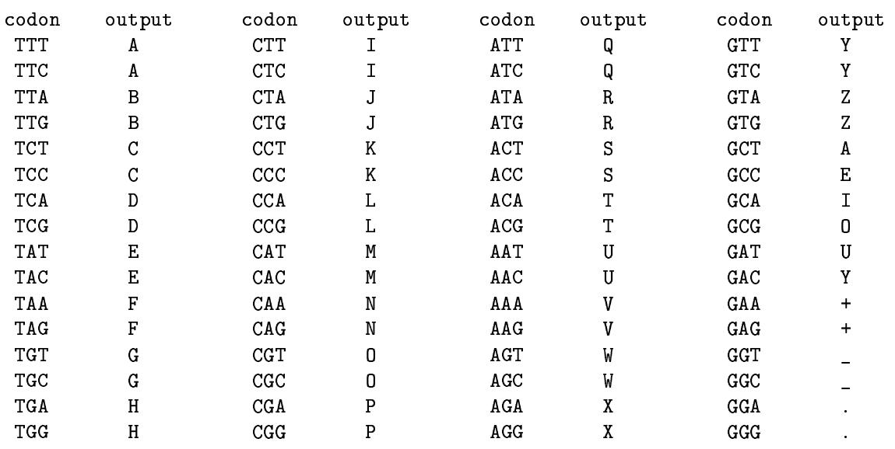  
Figure 1: The VIV artificial genetic code.

<table><tr><td colspan="3">Gene 1:</td><td colspan="2">Gene 2:</td></tr><tr><td>COTEWPSOTEEM</td><td></td><td>POLAMERADE</td><td>Gene 3: ENEVELOPE</td><td></td></tr><tr><td>=0.591</td><td></td><td></td><td>2 =0.8</td><td>= 0.938</td></tr></table>

Figure 2: Computation of a genome's raw fitness. The target phenotype is $\begin{array} { r l } { T } & { { } = } \end{array}$ {COREPROTEIN,POLYMERASE,ENVELOPE}. The output string of the active genes (the ones with the highest compatibility scores for the target terms) are shown. For each term $t _ { j }$ in $T$ the compatibility score $s _ { j }$ is shown beneath the corresponding active gene. The raw fitness of the genome is $r a w _ { - } f i t n e s s ( \acute { x } ) = ( 0 . 5 9 1 ^ { 2 } + 0 . 8 ^ { 2 } + 0 . 9 3 8 ^ { 2 } ) / 3 \approx 0 . 6 2 3 .$ .

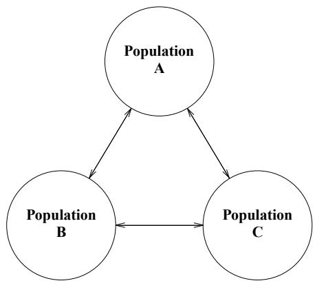  
Figure 3: A Multi-population Model. Each population represents the virus population infecting a specific species. Each species can have a distinct fitness landscape, specified by the user. At periodic intervals, individual viruses may transfer among the evolving populations. This permits the study of the effects of viral mutation and recombination in a multiple species system.

<table><tr><td rowspan=1 colspan=1>1:</td><td rowspan=1 colspan=1></td><td rowspan=1 colspan=1>A</td><td rowspan=1 colspan=1></td><td rowspan=1 colspan=1>B</td><td rowspan=1 colspan=1></td><td rowspan=1 colspan=1>C</td></tr></table>

<table><tr><td>Parent 2:</td><td>B&#x27;</td><td></td><td>A&#x27;</td><td>C&#x27;</td><td></td></tr></table>

<table><tr><td rowspan=1 colspan=1>Offspring 1:</td><td rowspan=1 colspan=1></td><td rowspan=1 colspan=1>A</td><td rowspan=1 colspan=1></td><td rowspan=1 colspan=1>B&#x27;</td><td rowspan=1 colspan=1></td><td rowspan=1 colspan=1>AF</td><td rowspan=1 colspan=1>C&#x27;</td></tr></table>

<table><tr><td>Offspring 2:</td><td>B&#x27;</td><td></td><td>C</td><td></td></tr></table>

Figure 4: Example of how genome length grows via homologous crossover. Crossover occurs within genes labeled $\mathrm { B }$ and $\mathrm { B ^ { \prime } }$ , producing the recombinant genes $\mathrm { B } ^ { \prime \prime }$ and $\mathrm { B } ^ { \prime \prime \prime }$ . One offspring also inherits both alternative candidate genes A and $\mathrm { A } ^ { \prime }$ , as well as gene $\mathrm { C } ^ { \prime }$ . The other offspring inherits neither gene A nor gene $\mathrm { A } ^ { \prime }$ from its parents.

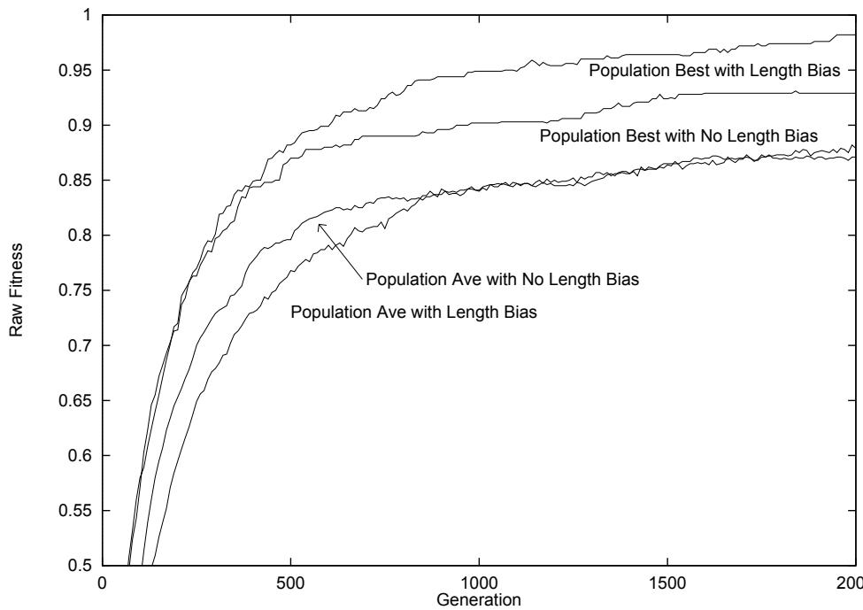  
Figure 5: Effects of length bias on performance.

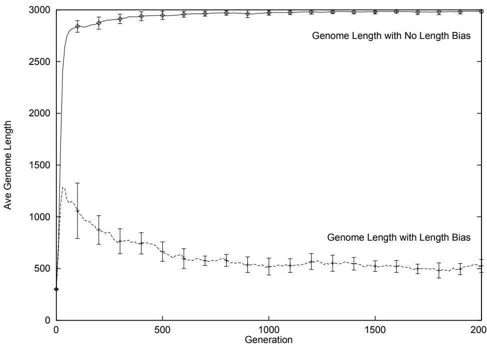  
Figure 6: Evolution of genome length with and without length bias.

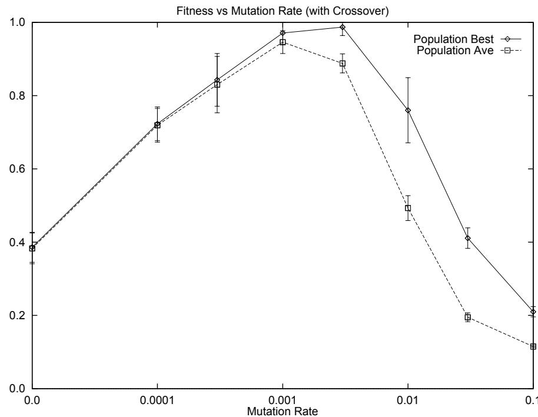  
Figure 7: Effects of mutation rates (with crossover enabled).

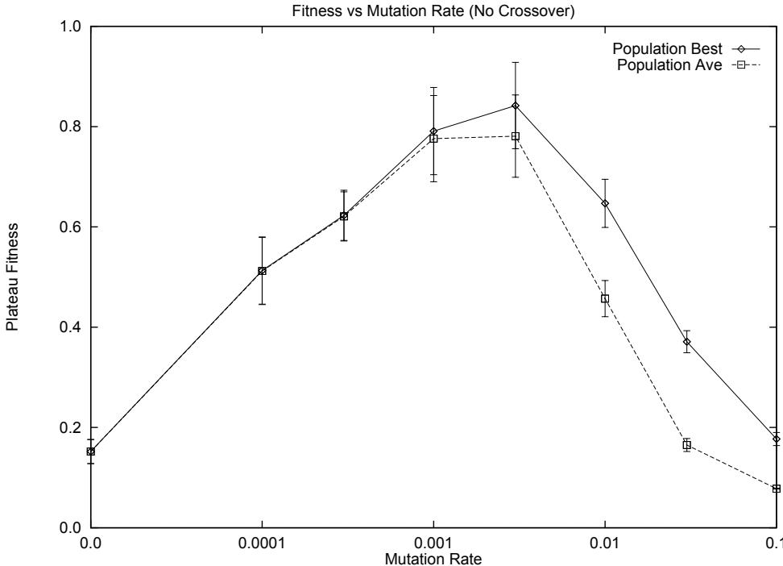  
Figure 8: Effects of mutation rates (with crossover disabled).

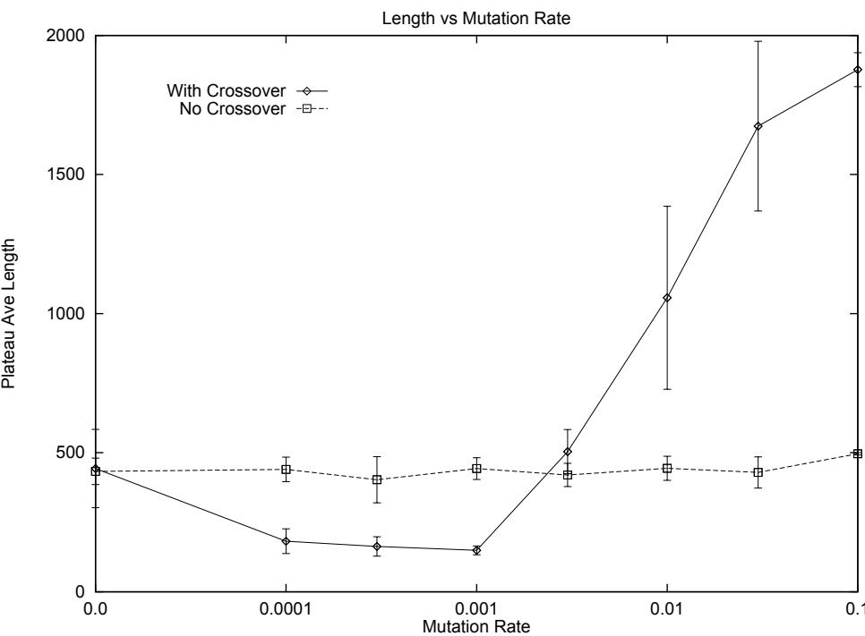  
Figure 9: Effects of mutation rates on genome length.

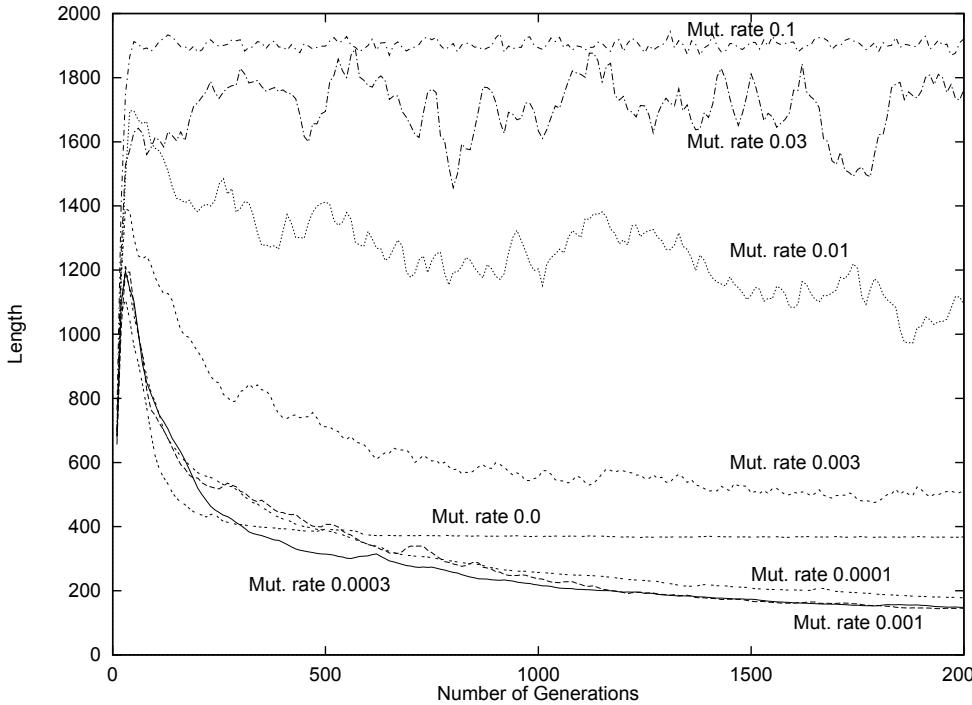  
Figure 10: Average length of individuals over 10 runs.

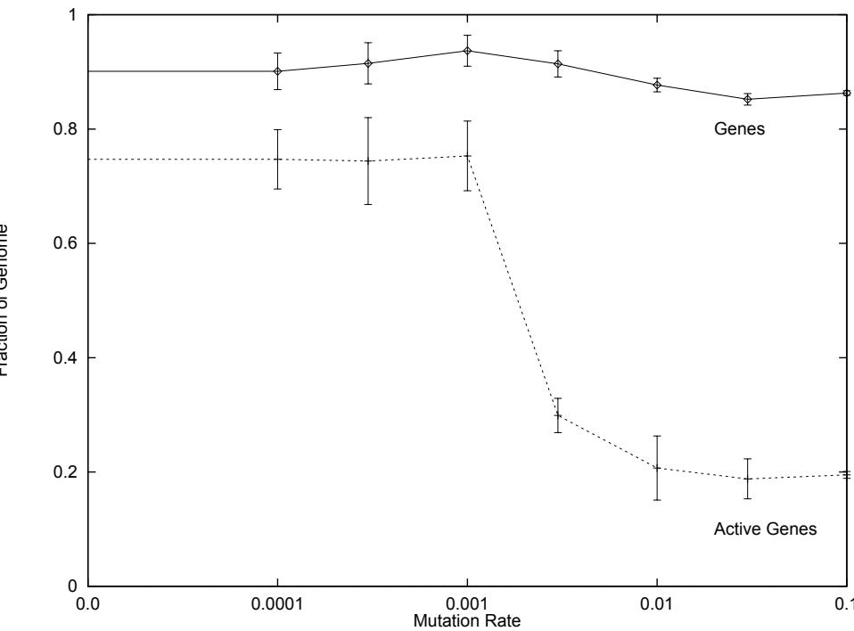  
Figure 11: Percent of genomes devoted to genes.

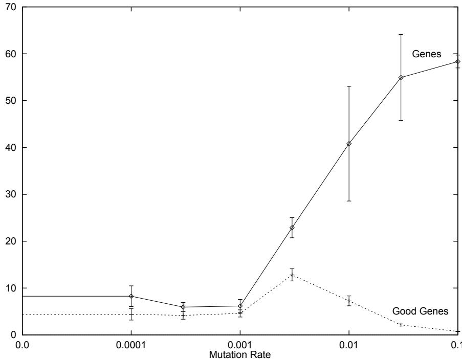  
Figure 12: Average gene counts per generation.

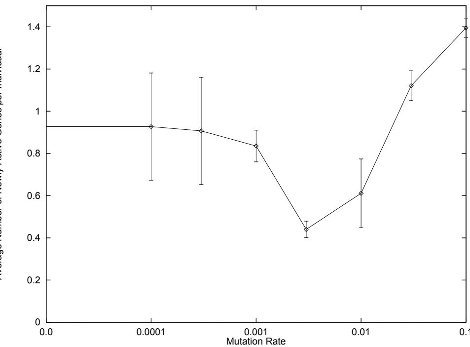  
Figure 13: Average number of previously inactive genes that become active.

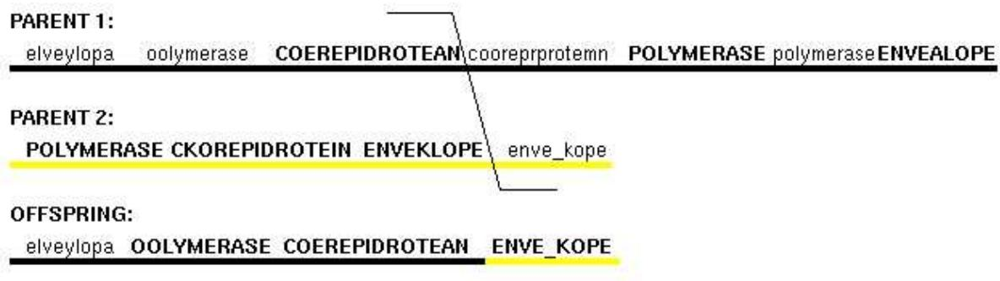  
Figure 14: Two inactive genes become active due to crossover. Details available in Appendix A.

PARENT 1:   
polgymuctzaseipPOLGYMEGCRASE polgymekrate CUOREPROTEIN ENVEGQLOPE   
Parent 2:   
POLOYMEUSRASE CYOREPROTEIN ENVEJQLOPE   
OFFSPRING 1:   
POLGYMUCTZASEIP CYOREPROTEIN ENVEJQLOPE   
OFFSPRING 2:   
poloymausrase POLGYMEGCRASE polgymekrate CUOREPROTEIN ENVEGQLOPE Figure 15: One inactive gene becomes active and one active gene becomes inactive due to crossover.   
Details available in Appendix B.

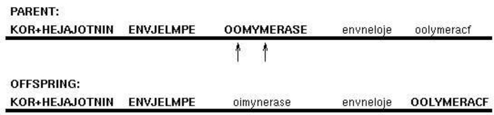  
Figure 16: Two mutations damage an active gene, causing a previously inactive gene to become active. Details available in Appendix C.