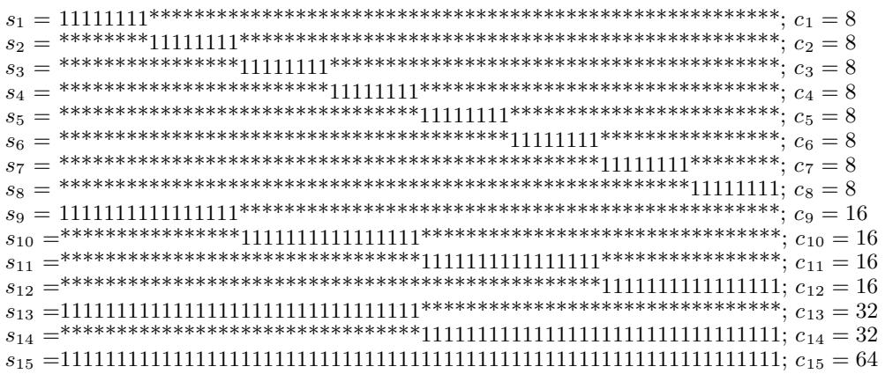

# The Royal Road for Genetic Algorithms: Fitness Landscapes and GA Performance

Melanie Mitchell   
AI Laboratory   
University of Michigan   
Ann Arbor, MI 48109   
melaniem@eecs.umich.edu

Stephanie Forrest Dept. of Computer Science University of New Mexico Albuquerque, NM 87131 forrest@unmvax.cs.unm.edu

John H. Holland Dept. of Psychology University of Michigan Ann Arbor, MI 48109

# Abstract

Genetic algorithms (GAs) play a major role in many artificial-life systems, but there is often little detailed understanding of why the GA performs as it does, and little theoretical basis on which to characterize the types of fitness landscapes that lead to successful GA performance. In this paper we propose a strategy for addressing these issues. Our strategy consists of defining a set of features of fitness landscapes that are particularly relevant to the GA, and experimentally studying how various configurations of these features affect the GA’s performance along a number of dimensions. In this paper we informally describe an initial set of proposed feature classes, describe in detail one such class (“Royal Road” functions), and present some initial experimental results concerning the role of crossover and “building blocks” on landscapes constructed from features of this class.

is to search a fitness landscape for high values (where fitness can be either explicitly or implicitly defined), and GAs have been demonstrated to be efficient and powerful search techniques for a range of such problems (e.g., there are several examples in [19]). However, the details of how the GA goes about searching a given landscape are not well understood. Consequently, there is little general understanding of what makes a problem hard or easy for a GA, and in particular, of the effects of various landscape features on the GA’s performance.

In this paper we propose some new methods for addressing these fundamental issues concerning GAs, and present some initial experimental results. Our strategy involves defining a set of landscape features that are of particular relevance to GAs, constructing classes of landscapes containing these features in varying degrees, and studying in detail the effects of these features on the GA’s behavior. The idea is that this strategy will lead to a better understanding of how the GA works, and a better ability to predict the GA’s likely performance on a given landscape. Such longterm results would be of great importance to all researchers who use GAs in their models; we hope that they will also shed light on natural evolutionary systems.

# 1 Introduction

Evolutionary processes are central to our understanding of natural living systems, and will play an equally central role in attempts to create and study artificial life. Genetic algorithms (GAs) [13, 9] are an idealized computational model of Darwinian evolution based on the principles of genetic variation and natural selection. GAs have been employed in many artificial-life systems as a means of evolving artificial organisms, simulating ecologies, and modeling population evolution. In these and other applications, the GA’s task

To date, several properties of fitness landscapes have been identified that can make the search for highfitness values easy or hard for the GA. These include deception, sampling error, and the number of local optima in the landscape (see Section 3 for details). However, almost all the theoretical work on GA performance has been based on the assumption that deception is the leading cause of difficulty for the GA. This paper extends this work by (1) proposing several new relevant fitness landscape features, (2) studying one of these features in detail, and (3) demonstrating that there are “GA-easy” functions [27] which are not necessarily easy for the GA.

# 2 GAs and Schema Processing

In a GA, chromosomes are represented by bit strings, with individual bits representing genes. An initial population of individuals (bit strings) is generated randomly, and each individual receives a numerical “fitness” value—often via an external “fitness function”— which is then used to make multiple copies of higherfitness individuals and eliminate lower-fitness individuals. Genetic operators such as mutation (flipping individual bits) and crossover (exchanging substrings of two parents to obtain two offspring) are then applied probabilistically to the population to produce a new population (or generation) of individuals. New generations can be produced synchronously, so that the old generation is completely replaced, or asynchronously, so that generations overlap. The GA is considered to be successful if a population of highly fit individuals evolves as a result of iterating this procedure. When the GA is being used in the context of function optimization, success is measured by the discovery of bit strings that represent values yielding an optimum (or near optimum) of the given function.

A common interpretation of GA behavior is that the GA is implicitly searching a space of patterns, the space of hyperplanes in $\{ 0 , 1 \} ^ { l }$ (where $\it { \Delta } l$ is the length of bit strings in the space). Hyperplanes are represented by schemas, which are defined over the alphabet $\{ 0 , 1 , * \}$ , where the \* symbol means “don’t care.” Thus, $^ * 0$ denotes the pattern, or schema, which requires that the second bit be set to 0 and will accept a $0$ or a $1$ in the first bit position. A bit string $x$ obeying a schema $s$ ’s pattern is said to be an instance of $s$ ; for example, 00 and 10 are both instances of $^ * 0$ . In schemas, 1’s and $0$ ’s are referred to as defined bits, and the order of a schema is simply the number of defined bits. The fitness of any bit string in the population provides an estimate of the average fitness of the $2 ^ { l }$ different schemas of which it is an instance, so an explicit evaluation of a population of $M$ individual strings is also an implicit evaluation of a much larger number of schemas. The GA’s operation can be thought of as a search for schemas of high average fitness, carried out by sampling individuals in a population and biasing future samples towards schemas that are estimated to have above-average fitness.

Holland’s Schema Theorem [13, 9] demonstrates that, under certain assumptions, schemas whose estimated average fitness remains above the population’s average fitness will receive an exponentially increasing number of samples. That is, schemas judged to be highly fit will be emphasized in the population. However, the Schema Theorem does not address the process by which new schemas are discovered; in fact, crossover appears in the Schema Theorem as a factor that slows the exploitation of good schemas. The “building-blocks hypothesis” [13, 9] states that new schemas are discovered via crossover, which combines instances of low-order schemas (partial solutions or “building blocks”) of estimated high fitness into higher-order schemas (composite solutions). For example, if a string’s fitness is a function of the number of $1$ ’s in the string, then a crossover between instances of two high-fitness schemas (each with many 1’s) has a better than average chance of creating instances of even higher-fitness schemas. However, the actual dynamics of the discovery process—and how it interacts with the emphasis process—are not well understood, and there is no general characterization of the types of landscapes on which crossover will lead to the discovery of highly fit schemas. Specifically, there is no firm theoretical grounding for what is perhaps the most prevalent “folk theorem” about GAs—that they will outperform hillclimbers and other common search and optimization techniques on a wide spectrum of difficult problems, because crossover allows the powerful combination of partial solutions.

Our main purpose in this paper is to outline a strategy for examining these questions in detail. In particular, we are interested in understanding more precisely the relation between various fitnesslandscape features and the performance of GAs, and we would like to confirm or disconfirm folk theorems such as the one mentioned above. Our approach stresses that there are many factors that make a landscape easy or difficult for the GA. Thus, we are interested in defining a set of landscape features that capture the various sources of facilitation and difficulty. We believe that such a set of features will be relevant both to practical domains in which people wish to apply the GA and to interesting biological phenomena. Once such a set of relevant features is defined, a large number of fitness landscapes can be “hand-designed,” where each landscape consists of some configuration of these features. Different landscapes will present different types and degrees of difficulty for the GA, depending on what features they contain and how the features are arranged. We can then study the performance of the GA on such landscapes to learn the effects of different configurations. A longer-term goal of this research is to develop statistical methods of classifying any given landscape in terms of our spectrum of hand-designed landscapes, thus being able to predict some aspects of the GA’s performance on the given landscape.

It should be noted that by stating this problem in terms of the GA’s performance on fitness landscapes, we are sidestepping the question of how a particular problem can best be represented to the GA. The success of the GA on a particular function is certainly related to how the function is “encoded” [9, 20] (e.g., using Gray codes for numerical parameters can greatly enhance the performance of the GA on some problems), but since we are interested in biases that pertain directly to the GA, we will simply consider the landscape that the GA “sees.”

# 3 Landscape Features and GA Performance

There is no comprehensive theory that relates characteristics of a fitness landscape directly to the performance of the GA, or that predicts what the GA’s performance will be on a given problem. Such a theory will be difficult to articulate because the GA has many conflicting tendencies (e.g., the need to continue exploring new regions of the search space versus the need to exploit the currently most promising directions). At different times in the search or on different problems, one of these tendencies may dominate the others.

However, several properties of fitness landscapes have been identified that can make the search for highfitness values easy or hard for the GA. Most research up to now has concentrated on three types of features: deception, sampling error, and the “ruggedness” of a fitness landscape. Bethke [2] defined a class of functions that are “misleading” for the GA and therefore hard to optimize. Goldberg extended this work, defining the class of $G A$ -deceptive functions [7, 8, 10], in which low-order schemas lead the GA away from the fittest higher-order schemas. There have been a number of studies of GA performance on deceptive landscapes (e.g., [7, 3, 21]). Grefenstette and Baker studied a function in which high variance in the fitness of a correct low-order schema leads to sampling error that misleads the GA [12]. Other authors also identify sampling error as a problem in GA performance (for example, [20, 11]). Kauffman [18] has studied how the degree of ruggedness of a landscape affects the ease of adaptation under mutation and crossover. Finally, Forrest and Mitchell have identified the existence of multiple mutually conflicting partial solutions as a cause of difficulty for GAs [5].

In our current research, we are studying parameterizable landscape features that are more directly connected to the building-block hypothesis. As a starting point, these include the degree to which schemas are hierarchically structured, the degree to which intermediate-order fit schemas act as “stepping stones” between low-order and high-order fit schemas, the degree of isolation of fit schemas, and the presence or absence of conflicts among fit schemas.

We can then “mix and match” the various landscape features to create a wide variety of fitness functions. We conjecture that interactions among the features are nontrivial, and that this is one reason that it is so difficult to understand and predict GA performance.

Our landscapes will be defined by constructing fitness functions ${ \cal F } : \{ 0 , 1 \} ^ { l } \to \Re$ , (where $\it { \Delta } l$ is the length of the bit string). Each function $F ^ { \prime }$ will be defined in terms of various numbers, or densities, of the different landscape features (for example, a schema tree (see below) would be considered to be a landscape feature). A landscape will be parameterized in two ways, with one set of parameters corresponding to the relative frequency and location of each type of feature, and with a set of local defining parameters for each feature (e.g., the height of a hill). This separation of parameters allows us to include the notion of features embedded within other features, allowing the possibility of defining fractal-like landscapes. For the remainder of this paper we focus on the properties of particular landscape features with the understanding that they can be combined with one another in the manner just described.

# Hierarchical Structure of Schemas, and Stepping Stones

The building blocks hypothesis implies that an important component of GA performance should be the extent to which the fitness landscape is hierarchical, in the sense that crossover between instances of fit low-order schemas will tend to yield fit higher-order schemas. Consider the fitness function defined in Figure 1, which we term a “Royal Road” function. This function involves a set of schemas $S = \{ s _ { 1 } , \ldots , s _ { 1 5 } \}$ , and is defined as

$$
F ( x ) = \sum _ { s \in S } c _ { s } \sigma _ { s } ( x ) ,
$$

where $x$ is a bit string, each $c _ { s }$ is a value assigned to the schema $s$ , and $\sigma _ { s } ( x )$ is as defined in the figure. In this example, $c _ { s } = o r d e r ( s )$ . The fitness of the optimum string (64 1’s) is $8 * 8 + 4 * 1 6 + 2 * 3 2 + 6 4 = 2 5 6$ .

As shown in Figure 1, a Royal Road function can be represented as a tree of increasingly higher-order schemas, with schemas of each order being composable to produce schemas of the next higher order. The hierarchical structure of such a function should in principle lead the GA, via crossover, very quickly to the optimum; in effect, this structure should in principle lay out a “royal road” for the GA to follow to the global optimum. In contrast, an algorithm such as hillclimbing that relies on single-bit mutations cannot easily find high values in such a function, since a large number of single bit-positions must be optimized simultaneously in order to move from an instance of one schema to an instance of a schema at the next higher-order level of the tree.

  
Figure 1: Example Royal Road Function. $\begin{array} { r } { F ( x ) = \sum _ { s \in S } c _ { s } \sigma _ { s } ( x ) } \end{array}$ , where $x$ is a bit string, $c _ { s }$ is a value assigned to the schema (here, ), and $\sigma _ { s } ( x ) = \left\{ \begin{array} { l l } { 1 } \\ { 0 } \end{array} \right.$ if ot $x$ is an instance of erwise. $s$ $s$ $c _ { s } = o r d e r ( s )$

The Royal Road functions provide the simplest examples of the features of schema hierarchies and intermediate stepping stones, and as we discuss later in this paper, they can be used to study in detail the effects of these features on the GA’s performance.

# Isolated High-Fitness Regions

A second type of feature is an isolated region of high average fitness (say, containing the global optimum) contained in a larger region of lower average fitness, which is in turn contained in an even larger area of intermediate average fitness [14]. These are related to cases of “isolated optima” described by Bethke [2]. For example, using the same notation as for the RoyalRoad functions, a simple isolate can be defined as follows:

$$
\begin{array} { r l } { F ( x ) = } & { 5 \sigma _ { * * 1 1 } ( x ) - 1 6 \sigma _ { * 1 1 1 } ( x ) + 5 \sigma _ { 1 1 * * } ( x ) - } \\ & { \qquad 1 6 \sigma _ { 1 1 1 * } ( x ) + 3 1 \sigma _ { 1 1 1 1 } ( x ) . } \end{array}
$$

Here the highest value is 9 (with optimum point $x ^ { \prime } = 1 1 1 1$ ), and the average fitnesses $u ( s )$ of the five schemas are:

$$
\begin{array} { l } { { u ( * * 1 1 ) = 2 } } \\ { { u ( * 1 1 1 ) = - 1 } } \\ { { u ( 1 1 * * ) = 2 } } \\ { { u ( 1 1 1 * ) = - 1 } } \\ { { u ( 1 1 1 1 ) = 9 . } } \end{array}
$$

In such a feature, the region of highest fitness is isolated from supporting (lower-order) schemas by the intervening region of lower fitness. A search algorithm such as hillclimbing will reach the largest areas of intermediate fitness ( $^ { * * } 1 1$ and $1 1 ^ { * * }$ ), but will in general be slow at crossing the intervening “deserts” of lower fitness ( $^ { * } 1 1 1$ and $1 1 1 ^ { * }$ ). One hypothesis [14] is that the GA should be better able to search landscapes containing such features because the lower-fitness deserts can be quickly crossed via crossover (here, between instances of $1 1 ^ { * * }$ and $^ { * * } 1 1$ ). Isolates are a special case of what have been called “partially deceptive functions” [8].

The idea of isolated regions of high fitness surrounded by flat deserts of low fitness is similar to the “mesa phenomenon” proposed by Minsky [24] and to the error surfaces identified by Hush et al. for multilayer perceptron neural networks [16]. Thus, the shape of the surface may be as important to GA performance as the actual direction of the gradient (deceptive functions emphasize direction). This feature allows us to control the shape as well as the direction of the surface the GA is searching.

# Multiple Conflicting Solutions

Finally, landscapes with multiple conflicting solutions can be difficult for the GA. For example, consider a function with two equal peaks: for example, $f ( x ) =$ $\textstyle ( x - \left( { \frac { 1 } { 2 } } \right) ) ^ { 2 }$ , which has two optima, 0 and 1. In this environment, a conventional GA initially samples both peaks, but eventually converges on one by exploiting random fluctuations in the sampling process (genetic drift). Since both peaks are equally good, the population may maintain samples of both for some time. However, if the solutions are mutually exclusive ( $0 0 \ldots 0$ vs. $1 1 \ldots 1$ in many encodings), crossover may be hindered by crossing good solutions from different peaks, creating useless hybrids.

Moving away from a strict function-optimization setting, similar difficulties are encountered for any kind of ecological environment in which the population needs to maintain multiple conflicting schemas. Examples include classifier systems [15] (where genetic operators are used to search for a useful set of rules that collectively performs well) and GA models of the immune system [6] (where a population of antibodies is evolving to cover a set of antigens). In functions with conflicting pressures, issues such as crossover disruption [17] and carrying capacity (how many different solutions a population of a given size can maintain) [4] are relevant factors.

The three categories of features sketched above constitute an initial set from which to construct landscapes for the purpose of studying GA performance. This set is by no means complete; two goals of our current work are to extend this set and to determine appropriate dimensions along which to parameterize both the individual features and the landscapes constructed out of such features. However, we believe that this initial set captures several important aspects of landscapes that to date have been largely ignored in the GA literature, and that experiments involving GA performance on landscapes constructed out of such features will yield a number of important insights. In the next section we describe experimental results concerning the Royal Road landscapes, thus illustrating our overall approach.

# 4 GA Performance on Royal Road Functions

According to the building-blocks hypothesis, the Royal Road function shown in Figure 1 defines a fitness landscape that is tailor-made for search by the GA, since crossover should allow the GA to follow the tree of building-block schemas directly to the optimum. It provides an ideal laboratory for studying the GA’s behavior for the following reasons: (1) all of the desired schemas are known in advance, since they are explicitly built into the function, so dynamics of the search process can be studied in detail by tracing the ontogenies of individual schemas; (2) the landscape can be varied in a number of ways, and the effects of these variations on the GA’s behavior can likewise be studied in detail; and (3) since the global optimum, and, in fact, all possible fitness values, are known in advance, it is easy to compare the GA’s performance on different instances of Royal Road functions.

There are several ways in which the degree of “regality” of the path to the optimum can be varied. For example, the number of levels (schema orders) in the tree can be varied. In Figure 1, there are four levels (schemas of orders 8, 16, 32, and 64); this could be changed to 3 levels, effectively truncating the hierarchy by eliminating all of the order-8 schemas. Another variation would be to introduce gaps in the hierarchical structure, say, by deleting an entire intermediate level in the tree (thus eliminating some of the intermediate stepping stones to the optimum). Another variation would be to modify the steepness of increase in the coefficients $c _ { s }$ as a function of height in the tree. Finally, deception can be introduced by mutating some of the supporting schemas, effectively creating low-order schemas that lead the GA away from the good higher-order schemas. Royal Road functions can be made arbitrarily difficult for the GA (e.g., by changing the values of the coefficients or by truncating the tree).

The Royal Road functions can be used to address a number of general questions about the effects of crossover on various landscapes, including the following: For a given landscape, to what extent does crossover help the GA find highly fit schemas? What is the effect of crossover on the waiting times for desirable schemas to be discovered? What are the bottlenecks in the discovery process: the waiting times to discover the components of desirable schemas, or, once the components are in the population, the waiting times for them to cross over in the desired manner? What is the cause of failure for desired schemas to be discovered? To what degree is a complete hierarchy (as opposed to an incomplete one with gaps in the tree) necessary for successful GA performance? Answering these questions in the context of the idealized Royal Road functions is a first step towards answering them in more general cases.

In the following subsections, we report results from our initial studies of Royal Road functions. These results address three basic questions:

1. What is the effect of crossover on the GA’s performance on different landscapes?   
2. More specifically, what is the effect of crossover on the waiting time for desirable schemas to be discovered, and how can we account for this effect?   
3. What is the role of intermediate levels in the hierarchy (intermediate-order supporting schemas) on the difficulty of these functions with respect to the GA?

We report results of computational experiments that test the GA’s performance on these functions, both with and without crossover. We also report results of control experiments which compare the GA’s performance with a stochastic iterated hillclimbing algorithm (see [26]) on these functions. For each of these experiments, we used functions with $l = 6 4$ (the individuals in the GA population were bit strings of length 64). The GA population size was always 128, and in each run the GA was allowed to continue until the optimum string was discovered, and the generation of this discovery was recorded. The GA we used was conventional [9], with single-point crossover and sigma scaling [26, 5] with the maximum expected offspring of any string being 1.5. The crossover rate was 0.7 per pair of parents and the mutation probability was 0.005 per bit.

# 4.1 Effect of crossover on GA performance

Our examination of the role of crossover on the Royal Road functions begins with the following question: To what extent does crossover contribute to the GA’s success on simple versions of these functions? That is, the initial set of experiments attempts to validate the building-blocks hypothesis on these functions. For these experiments, we ran the GA with and without crossover on the function given in Figure 1. We also ran hillclimbing on this function, allowing the equivalent of 2000 generations (256,000 function evaluations), which is more than three times as long as required by a typical GA run (see Table 1).

Table 1 summarizes the results of 50 runs of each algorithm on the function. As was expected, crossover considerably speeds up the GA’s discovery of the optimum. Both versions of the GA significantly outperform hillclimbing: in 50 runs of hillclimbing, the optimum was never found, and moreover, the highest fitness attained was only 38% of the optimum.

These results confirm our qualitative expectations: on landscapes in which fit schemas are organized in a hierarchy like the one in Figure 1, crossover helps to significantly speed up the discovery process. This result may seem obvious, but it is necessary to establish as a baseline the degree to which crossover speeds things up before we can study the effects of variations on the landscape.

As a next step, we look more closely at the effects of crossover on the GA’s performance, considering the effect of crossover on the waiting times for the various schemas defining the fitness function to be discovered. Table 2 displays the average generation at which the first schema of a given order is discovered for the runs with and without crossover for the Royal Road function (the values are averaged over 50 runs). The results given in the table show that, as expected, crossover significantly reduces the waiting time for discovering schemas at each level in the tree. However, even for the runs with crossover, there are, on average, significant gaps between the discovery of, say, the first order-16 schema and the first order-32 schema. What is the cause of these long gaps? That is, what are the bottlenecks in the discovery process?

To make this question more specific, we note that there are two stages in the discovery process of a given schema via crossover: the time for the schema’s lowerorder components to appear in the population, and the time for two instances to cross over in the right way in order to create the schema. Which of these stages contributes the most to the long gaps seen in Table 2?

The building-blocks hypothesis suggests that, once the lower-order components of a desired schema are present in the population, these components will then combine relatively quickly via crossover to form the desired schema. This would imply that the main bottleneck in the discovery process is the waiting time for the lower-order components to appear in the population, rather than the waiting time for them to cross over in the required way. We believe that this is the case, but the results of our experiments in this area were somewhat inconclusive. Given the importance of testing this rigorously, it is worth discussing some of the issues related to answering this question.

It seems that one could test this hypothesis in a straightforward manner by separately measuring the average time required for each stage and comparing the two times. We made several measurements to identify these separate stages. For each schema order in the tree, we measured the average difference in generations between the time when two components of a given order were both in the population and the time when the higher-order combination of the two occurred. For example, one of the measurements going into the order-8 average would be the difference between the discovery time for 11111111\*. . . \* or \*\*\*\*\*\*\*\*11111111\*. . . \* (whichever was discovered later), and the time when the combination 1111111111111111\*. . . \* is created. Table 3 gives the results of these measurements, averaged over all schemas of a given order, and over 50 runs. The data in the table seems to indicate that there is on average a large gap between the time the lower-order components are discovered and the time they are combined to form the higher-order schema.

However, there are several problems with this method of measurement. One problem is that there are times when one of the component schemas and the desired combination schema are created simultaneously through mutation (e.g., $1 1 1 1 1 1 1 1 \dots ^ { * }$ is in the population first, but $1 1 1 1 1 1 1 1 1 1 1 1 1 1 1 1 1 ^ { * } . . . ^ { * }$ and \*\*\*\*\*\*\*\*11111111\*. . . \* are created at the same time via mutation). Since the hypothesis we are consider

<table><tr><td rowspan=1 colspan=1></td><td rowspan=1 colspan=1>Mean gensto optimum</td><td rowspan=1 colspan=1>Median gens to optimum</td></tr><tr><td rowspan=1 colspan=1>GA with Xover</td><td rowspan=1 colspan=1>590(50)</td><td rowspan=1 colspan=1>542</td></tr><tr><td rowspan=1 colspan=1>GA, No Xover</td><td rowspan=1 colspan=1>1022(46)</td><td rowspan=1 colspan=1>1000</td></tr><tr><td rowspan=1 colspan=1>Hillclimbing</td><td rowspan=1 colspan=1>&gt;2000</td><td rowspan=1 colspan=1>&gt;2000</td></tr></table>

Table 1: Summary of results on the Royal Road function for GA with and without crossover, and for hillclimbing. Each result summarizes 50 runs. The numbers in parentheses are the standard errors. Each run of hillclimbing was for the equivalent of 2000 generations (256,000 function evaluations), but the optimum was never found.

<table><tr><td rowspan=1 colspan=1></td><td rowspan=1 colspan=1>Order 8</td><td rowspan=1 colspan=1>Order 16</td><td rowspan=1 colspan=1>Order 32</td><td rowspan=1 colspan=1>Order 64</td></tr><tr><td rowspan=1 colspan=1>GA with Xover</td><td rowspan=1 colspan=1>.01 (.1)</td><td rowspan=1 colspan=1>28 (4)</td><td rowspan=1 colspan=1>152(16)</td><td rowspan=1 colspan=1>590 (50)</td></tr><tr><td rowspan=1 colspan=1>GA, No Xover</td><td rowspan=1 colspan=1>.3 (.25)</td><td rowspan=1 colspan=1>106 (14)</td><td rowspan=1 colspan=1>386(26)</td><td rowspan=1 colspan=1>1022(46)</td></tr></table>

Table 2: The average generation of first appearance of a schema of each order for the Royal Road function. The values are averaged over 50 runs for the GA with and without crossover. The numbers in parentheses are the standard errors.

<table><tr><td></td><td>Order 8</td><td>Order 16</td><td>Order 32</td></tr><tr><td>Mean time</td><td>179 (26)</td><td>139 (27)</td><td>165 (21)</td></tr><tr><td>to combine</td><td>(110 cases)</td><td>(27 cases)</td><td>(21 cases)</td></tr></table>

Table 3: The average difference in generations between the first appearance of two component schemas of a given order and the appearance of the schema that is the combination of those two components. The numbers in parentheses are the standard errors. The number of cases being averaged is also given. Since the data for all schemas of a given order are being averaged, there are more cases for the order-8 schemas than for the higher-order schemas. Cases in which there was simultaneous discovery of a low-order component and a higher-order combination were not included in the averages. See the text for a discussion of the problems with the data in this table.

ing concerns cases where the component schemas are in the population before the combination schema, we did not include the cases of simultaneous discovery in the averages given in Table 3.

A second problem is using the discovery time of the lower-order components in this measurement. Further analysis of our data indicated that very often, a lower-order component (e.g., an instance of $1 1 1 1 1 1 1 1 ^ { * } . . . ^ { * } )$ would be discovered fleetingly, only to disappear in the next one or two generations. It would appear again later on, and only then be used in a crossover with another lower-order component (e.g., $* * * * * * * * 1 1 1 1 1 1 1 1 1 1 * \ldots * )$ to form the higherorder combination. So in essence, the component was discovered twice; in Table 3 we recorded only the original discovery time. This resulted in a large increase in the measured time to cross over.

<table><tr><td rowspan=1 colspan=1></td><td rowspan=1 colspan=1>Order 8</td><td rowspan=1 colspan=1>Order 16</td><td rowspan=1 colspan=1>Order 32</td></tr><tr><td rowspan=1 colspan=1>Mean timeto combine</td><td rowspan=1 colspan=1>118 (31)(55 cases)</td><td rowspan=1 colspan=1>20 (7)(13 cases)</td><td rowspan=1 colspan=1>1 (0)(3 cases)</td></tr></table>

Table 4: The same data as in Table 3 but with the first appearance of a component schema defined as the first appearance after which the schema persists in the population for at least 10 generations. This modification resulted in a decrease in the number of cases for each order, since under this new measurement, the number of cases of simultaneous discovery increased dramatically.

To remedy this problem, we recorded the discovery time of a component only if instances of it persisted in the population for at least 10 generations after the discovery. The results of those measurements are given in Table 4. Under this measurement, the average time for order-8 schemas to combine is still high, but seems to be much less for higher-order schemas. However, under this measurement, the number of cases of simultaneous discovery of a lower-order component and the higher-order combination increased dramatically, so the number of cases over which the average is being taken is much less in this case. This means that the results are less statistically reliable.

In summary, the various problems with the measurements cause these results to be somewhat inconclusive. The purpose of giving these data is to point out some of the problems. We believe that more appropriate measuring techniques will demonstrate that the main bottlenecks in the discovery process are the waiting times for components to appear rather than the waiting times for crossovers to take place. Testing this hypothesis is of great importance, and we are currently exploring methods that will enable us to do so.

Even though we were not able to satisfactorily confirm what the building-blocks hypothesis predicts— that the main bottleneck in the discovery process is the waiting time for the lower-order components to appear in the population—it turns out that some surprising results about the role of intermediate-order schemas (discussed in the next section) actually provide some validation for this prediction and thus give some clues as to the source of the long gaps seen in Table 2.

# 4.2 Do intermediate levels help?

To study the effect of intermediate levels on the performance of the GA, we ran the GA with crossover on a variant of the original Royal Road function—one in which the intermediate-order schemas were removed. The variant function contains eight order-8 schemas and one order-64 schema; the fitness of the optimum string (64 1’s) is now $8 * 8 + 6 4 = 1 2 8$ .

Table 5 shows the results of the standard GA, the GA without crossover, and hillclimbing on this function.

We expected the GA’s performance to be worse than on the original Royal Road function, since we believed that the intermediate-level schemas act as stepping-stones, providing reinforcement for the lowerorder schemas, and speeding up the process of finding the optimum. However, the results were the opposite of what we expected. On average, the GA finds the optimum faster on the function with no intermediate schemas.

What is the cause of this unexpected phenomenon? Further analysis led us to the conclusion that the intermediate schemas cause a kind of prematureconvergence phenomenon [9]. For example, suppose that, on the function with intermediate levels, the GA finds 11111111\*. . . \*, \*\*\*\*\*\*\*\*11111111\*. . . \*, andthen 1111111111111111\*. . . \*. Strings that are instances of the order-16 schema receive much higher fitness (since the fitness values go up exponentially with the level of the schema). The fitness differential between instances of 1111111111111111\*. . . \* and any order-8 schema (say, \*. . . \*11111111) is large enough (32 vs. 8) that the instances of 1111111111111111\*. . . \* will virtually take over the entire population in just a few generations, often with many zeros in the right half of the string “hitchhiking” along with the 16 1’s in the left half of the string. This convergence therefore can negate progress that the population has made towards good schemas in the right half of the string. Thus, once one order-16 schema is discovered, the GA must start over to discover the second order-16 schema. We observed this process directly by plotting the densities (percentage of the population that are instances) of the relevant schemas over time: on a typical run, once an order16 schema is discovered, its density in the population quickly rises, and the density of one or more of the disjoint order-8 schemas is simultaneously seen to drop significantly, sometimes to zero. Often, this effect will prevent an order-8 schema from being discovered for a long time. This explains the relatively long intervals between the first discoveries of an order-16 and an order-32 schema, shown in Table 2, and gives evidence that the main bottleneck in the discovery of a higher-order schema is the waiting time for its lowerorder components to come into the population.

In the function without the intermediate levels, this problem does not occur to such a devastating degree. The fitness of an order-16 combination of two order-8 schemas is only 16, so its discovery does not have such a dramatic effect on the discovery and persistence of other order-8 schemas in the tree. It seems that once order-8 schemas are discovered, crossover combines them relatively quickly to find the optimum. Contrary to our intuitions, it appears that reinforcement from the intermediate layers is not required in these functions. It is possible that larger problems (for example, defined over bit strings much longer than 64) or different coefficients may create landscapes in which reinforcement is an advantage rather than a detriment.

These results point to a pervasive and important issue in the performance of GAs in any domain: the problem of premature convergence. The fact that we observe a form of premature convergence even in this very simple setting suggests that it can be a factor in any GA search in which the population is simultaneously searching for two or more non-overlapping high fitness schemas (e.g., the two order-8 schemas discussed above), which is often the case. The fact that the population loses useful schemas once one of the disjoint good schemas is found suggests that the rate of effective implicit parallelism of the GA [13, 9] may need to be reconsidered.

It is suggestive that in many biological settings functionality is evolved sequentially rather than in parallel. For example, it is hypothesized that the immune system evolved by learning to recognize a base set of antigens and then successively extended the base set [25]. Thus, it may be completely appropriate for the GA to use sequential search (first learning one set of schemas, then another) under certain circumstances.

Table 5: Summary of results for the original Royal Road function (repeated from Table 1) and a variant with no intermediate-level schemas. Each result summarizes 50 runs. The numbers in parentheses are the standard errors. Each run of hillclimbing (on the function with no intermediate levels) was for the equivalent of 2000 generations (256,000 function evaluations), but the optimum was never found.   

<table><tr><td rowspan=1 colspan=1></td><td rowspan=1 colspan=1>Mean gens to optimum</td><td rowspan=1 colspan=1>Median gens to optimum</td></tr><tr><td rowspan=1 colspan=1>IntermediateLevels</td><td rowspan=1 colspan=1>590 (50)</td><td rowspan=1 colspan=1>542</td></tr><tr><td rowspan=1 colspan=1>No IntermediateLevels</td><td rowspan=1 colspan=1>427 (34)</td><td rowspan=1 colspan=1>372</td></tr><tr><td rowspan=1 colspan=1>HillclimbingNo IntermediateLevels</td><td rowspan=1 colspan=1>&gt; 2000</td><td rowspan=1 colspan=1>&gt; 2000</td></tr></table>

# 5 Conclusions

This paper reports the beginning of an investigation of the role of crossover in GAs and the characteristics of landscapes in which crossover improves the GA’s performance. We have proposed several features of fitness landscapes that we believe are relevant to the performance of GAs (hierarchy, isolation, and conflicts) and we have sketched a method of creating parameterized fitness landscapes built out of combinations of these features, on which the GA’s performance can be studied very clearly. To illustrate our overall approach, we have introduced a class of functions, the Royal Road functions, which isolate one important aspect of fitness landscapes: hierarchies of schemas. We presented experimental results that show how crossover contributes to GA performance on these functions, as well as more surprising experimental results that show the detrimental role of the intermediate-level schemas in the hierarchy.

Given that genetic algorithms have been applied to so many complex domains, it may seem like a backwards step to be studying their behavior on landscapes as simple as the Royal Road functions. However, the unexpected results we describe in this paper indicate that there is much about the GA’s behavior that is not well understood, even on very simple landscapes. The building-blocks hypothesis is generally taken as an article of faith by those using GAs, but making the meaning of this hypothesis more precise and characterizing the types of landscapes on which it is valid remain open topics of great importance. Understanding the detailed workings of the GA on these simple functions is a first step to understanding the degree to which crossover can be expected to help on more complex landscapes containing similar features.

Another long-term goal of this work is to develop a set of statistical measures that will make it possible to compare our hand-constructed landscapes with ones that arise more naturally in GA applications, and thus to be able to predict the GA’s performance on such landscapes. Statistical measures such as correlation length and length of adaptive walks to optima—both defined in terms of Hamming distance—have been applied to various landscapes for this purpose [18, 22]. These measures give some indication of the “ruggedness” of a landscape, which has some relation to the GA’s expected performance, but we believe that more useful characterizations may require statistical measures that take into account the way crossover operates and measure correlations in terms of some kind of “crossover distance” rather than Hamming distance (a version of this approach was studied in [23]).

Additionally, we are interested in understanding how our discoveries about the GA relate to biological systems, including in the following questions: What is the relation of function optimization to adaptation and evolution? What is the relation of our results on the role of crossover to current work in theoretical population genetics on the types of environments in which recombination is favored [1]? To what extent can we understand biological environments in terms of the features we are proposing for our fitness landscapes (e.g., hierarchies of building blocks)? We hope that studying the relation of landscape features to GA performance will not only shed light on what types of problems are likely to be suited to GAs, but will also lead to insights concerning the evolution of natural— and artificial—biological systems.

# Acknowledgments

The research reported here was supported by the Michigan Society of Fellows, University of Michigan, Ann Arbor, MI (support to M. Mitchell); the Center for Nonlinear Studies, Los Alamos National Laboratory, Los Alamos, NM and Associated Western Universities (support to S. Forrest); National Science Foundation grant IRI 8904203 (support to J. Holland); and the Santa Fe Institute, Santa Fe, NM (support to all the authors). We thank Robert Axelrod, Arthur Burks, Michael Cohen, Rick Riolo, and Carl Simon for helpful discussions, and we thank Greg Huber and Robert Smith for comments that helped to improve this paper.

References   
[1] A. Bergman and M. W. Feldman. More on selection for and against recombination. Theoretical Population Biology, 38(1):68–92, 1990.   
[2] A. D. Bethke. Genetic Algorithms as Function Optimizers. PhD thesis, The University of Michigan, Ann Arbor, MI, 1980. Dissertation Abstracts International, 41(9), 3503B (University Microfilms No. 8106101).   
[3] R. Das and L. D. Whitley. The only challenging problems are deceptive: Global search by solving order-1 hyperplanes. In R. K. Belew and L. B. Booker, editors, Proceedings of the Fourth International Conference on Genetic Algorithms, San Mateo, CA, 1991. Morgan Kaufmann.   
[4] K. Deb. Genetic algorithms in multimodal function optimization. Technical report, The Clearinghouse for Genetic Algorithms, Department of Engineering Mechanics, University of Alabama, Tuscaloosa, AL, 1989. (Master’s Thesis).   
[5] S. Forrest and M. Mitchell. The performance of genetic algorithms on Walsh polynomials: Some anomalous results and their explanation. In R. K. Belew and L. B. Booker, editors, Proceedings of the Fourth International Conference on Genetic Algorithms, San Mateo, CA, 1991. Morgan Kaufmann.   
[6] S. Forrest and A. S. Perelson. Genetic algorithms and the immune system. In H.-P. Schwefel and R. Maenner, editors, Parallel Problem Solving from Nature, Berlin, 1990. Springer-Verlag (Lecture Notes in Computer Science).   
[7] D. E. Goldberg. Simple genetic algorithms and the minimal deceptive problem. In L. D. Davis, editor, Genetic Algorithms and Simulated Annealing, Research Notes in Artificial Intelligence, Los Altos, CA, 1987. Morgan Kaufmann.   
[8] D. E. Goldberg. Genetic algorithms and Walsh functions: Part II, Deception and its analysis. Complex Systems, 3:153–171, 1989.   
[9] D. E. Goldberg. Genetic Algorithms in Search, Optimization, and Machine Learning. Addison-Wesley, Reading, MA, 1989.   
[10] D. E. Goldberg. Construction of high-order deceptive functions using low-order Walsh coefficients. Technical Report 90002, Illinois Genetic Algorithms Laboratory, Dept. of General Engineering, University of Illinois, Urbana, IL, 1990.   
[11] D. E. Goldberg and M. Rudnick. Schema variance from Walsh-schema transform. Complex Systems, 5:265–278, 1991.   
[12] J. J. Grefenstette and J. E. Baker. How genetic algorithms work: A critical look at implicit parallelism. In J. D. Schaffer, editor, Proceedings of the Third International Conference on Genetic Algorithms, San Mateo, CA, 1989. Morgan Kaufmann.   
[13] J. H. Holland. Adaptation in Natural and Artificial Systems. The University of Michigan Press, Ann Arbor, MI, 1975.   
[14] J. H. Holland. Using classifier systems to study adaptive nonlinear networks. In D. L. Stein, editor, Lectures in the Sciences of Complexity, Volume 1, pages 463–499, Reading, MA, 1989. Addison-Wesley.   
[15] J. H. Holland, K. J. Holyoak, R. E. Nisbett, and P. Thagard. Induction: Processes of Inference, Learning, and Discovery. MIT Press, 1986.   
[16] D. R. Hush, B. Horne, and J. M. Salas. Error surfaces for multi-layer perceptrons. Technical Report EECE 90-003, University of New Mexico, Dept. of Electrical and Computer Engineering, Albuquerque, N.M. 87131, 1990.   
[17] K. A. De Jong. An Analysis of the Behavior of a Class of Genetic Adaptive Systems. PhD thesis, The University of Michigan, Ann Arbor, MI, 1975.   
[18] S. A. Kauffman. Adaptation on rugged fitness landscapes. In D. Stein, editor, Lectures in the Sciences of Complexity, pages 527–618, Reading, MA, 1989. Addison-Wesley.   
[19] C. G. Langton, C. Taylor, J. D. Farmer, and S. Rasmussen, editors. Artificial Life II. Santa Fe Institute Studies in the Sciences of Complexity. AddisonWesley, Reading, MA, 1992.   
[20] G. E. Liepins and M. D. Vose. Representational issues in genetic optimization. Journal of Experimental and Theoretical Artificial Intelligence, 2:101–115, 1990.   
[21] G. E. Liepins and M. D. Vose. Deceptiveness and genetic algorithm dynamics. In G. Rawlins, editor, Foundations of Genetic Algorithms, San Mateo, CA, 1991. Morgan Kaufmann.   
[22] M. Lipsitch. Adaptation on rugged landscapes generated by local interactions of neighboring genes. In R. K. Belew and L. B. Booker, editors, Proceedings of the Fourth International Conference on Genetic Algorithms, San Mateo, CA, 1991. Morgan Kaufmann.   
[23] B. Manderick, M. de Weger, and P. Spiessens. The genetic algorithm and the structure of the fitness landscape. In R. K. Belew and L. B. Booker, editors, Proceedings of the Fourth International Conference on Genetic Algorithms, San Mateo, CA, 1991. Morgan Kaufmann.   
[24] M. Minsky. Steps toward artificial intelligence. In E. A. Feigenbaum and J. Feldman, editors, Computers and Thought, pages 406–452. McGraw-Hill, 1963.   
[25] A. S. Perelson. Personal communication.

[26] R. Tanese. Distributed Genetic Algorithms for Function Optimization. PhD thesis, The University of Michigan, Ann Arbor, MI, 1989.

[27] S. W. Wilson. GA-easy does not imply steepest-ascent optimizable. In R. K. Belew and L. B. Booker, editors, Proceedings of The Fourth International Conference on Genetic Algorithms, San Mateo, CA, 1991. Morgan Kaufmann.