# Estimation of Distribution Algorithms

Tom Hinton

# Origin

Natural Selection Genetic Algorithms EDAs (Darwin) (Holl) (Mühlenbein)

# Genetic Algorithms - Idea

Evolution has produced "good solutions" to difficult engineering problems   
It only acts through reproductive fitness The details of a problem/solution are hidden in a "black-box"   
Maybe something similar can work on manmade problems

# Epistasis and Other Issues

The standard GA has trouble with so-called epistasis or linkage

Non-monotonic non-linearity in the fitness function

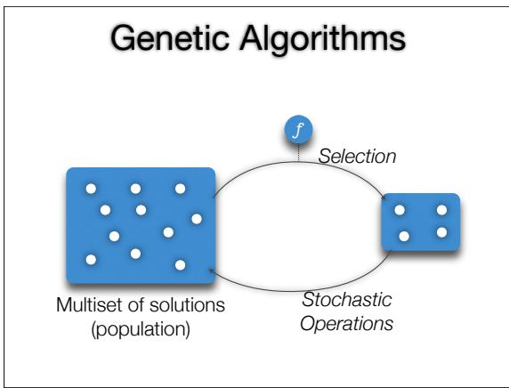

(1 ∀i : xi = 0 f (x) = < 0 ∀i : xi = 1 ∑i xi otherwise

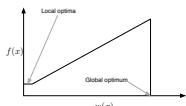

The global minimum here is hard to reach

Also issues with speed, population sizing, etc

# EDAs - Idea

In a genetic algorithm we select (stochasticaly from the population This is akin to sampling from a distribution

Replace population with a model, and the stochastic operators with repeated estimation of the model

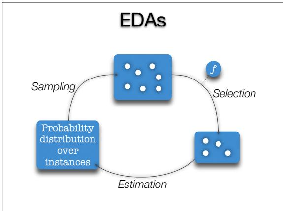

# Why is this a good idea?

Population sizing issues are reduced   
Dynamics and limitations may be easier to understand   
Sufficiently advanced models can learn problem structure for a range of problems Epistasis /linkage information is explicitly expressed in the joint distribution   
Experimentally faster

# Example : UMDA

Instances are strings in a finite alphabet e.g. (101011100101) Assume each variable (bit) is univariate Joint distribution is the product of marginal distributions for each position

$$
p ( \mathbf { x } ) = \prod _ { i } p ( \mathbf { x } _ { i } )
$$

# UMDA Sampling & Estimation

Distribution is a vector of probabilities

<0.1,0.8,0,1,0.5,...

Marginal probabilities estimated using marginal frequencies

# Laplace Correction

Imagine every selected instance in a generation has value O for a particular variable Estimated probability becomes a certainty that said variable takes value O All future generations wil take value

# UMDA - Why?

Solves boring functions much better than GAs UMDA (& other univariate algorithms) will work for problems which are already factored into independent variables These problems are boring

$$
p ( \mathbf { x } _ { i } = a ) \approx \frac { \sum _ { d \in D } \delta ( d _ { i } , a ) } { | D | }
$$

$$
\begin{array} { r } { p _ { l } ( x _ { i } = a ) \approx \frac { \sum _ { d \in D } \delta ( d _ { i } , a ) + 1 } { | D | + r _ { i } } } \end{array}
$$

A good explanatory tool, easy to analyse

Doesn't resolve the GA problems of epistasis

Better Models (x1) (x2) 5 (x3)   
Independent deSin Sne cy Mulipley ←   
Ease of Descriptive   
estimation power

# Bayesian Networks

Bayesian networks can capture any x which has an ordering of its variables such that

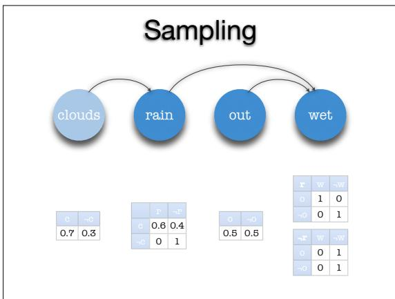

$\begin{array} { r } { p ( \mathbf { x } ) = \prod _ { i } p ( \mathbf { x } _ { i } | P _ { i } ) } \end{array}$ (Pigives the $\forall \mathbf { x } _ { j } \in P _ { i } : j < i$ parents of xi)

i.e. The conditional relationships form a DAG

$p ( \mathbf { x } ) = p ( x _ { 1 } ) \cdot p ( x _ { 2 } ) \cdot p ( x _ { 3 } | x _ { 1 } , x _ { 2 } ) \cdot p ( x _ { 4 } | x _ { 3 } )$

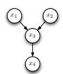

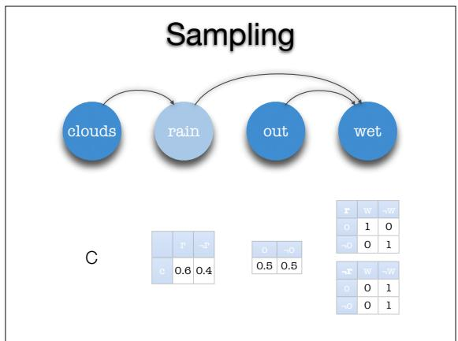

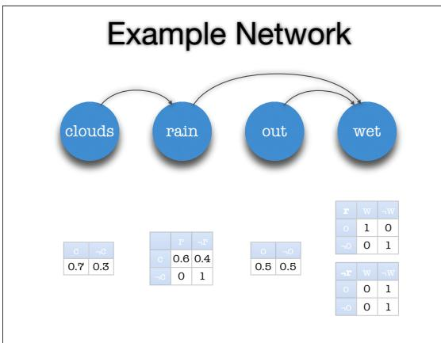

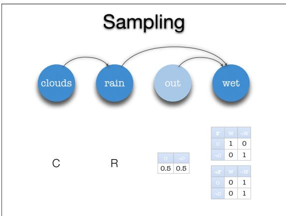

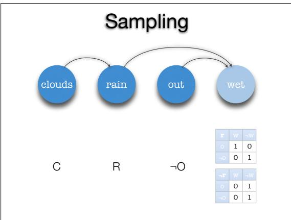

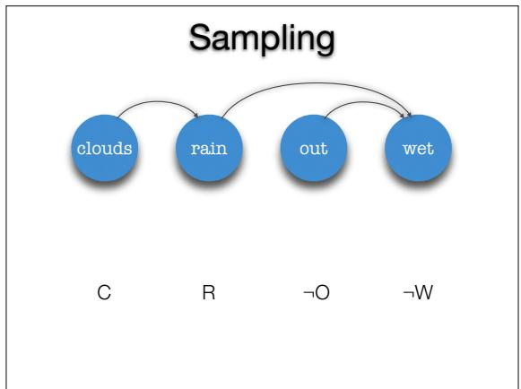

# Network Estimation

Estimation is the bottleneck when using graphical models

Once the structure is known, producing contingency tables is easy

There are lots of possible structures to consider, so an intelligent approach is required

$$
\begin{array} { r c l } { { f ( n ) } } & { { = } } & { { \displaystyle \sum _ { i = 1 } ^ { n } ( - 1 ) ^ { i + 1 } \binom { n } { i } 2 ^ { i ( n - i ) } \cdot f ( n - i ) } } \\ { { f ( 0 ) } } & { { = } } & { { f ( 1 ) = 1 } } \end{array}
$$

(lots)

# Detecting Independence

Take a database D of samples Start with the complete graph $K _ { n }$

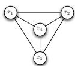

Use mutual information to determine independence and delete edges between independent vertices (PC algorithm)

# Scoring $^ +$ Searching

Most success has been had by using search algorithms to explore possible DAGs   
This requires two parts to be defined Some search procedure A scoring method for DAGs which informs the search Simple models are preferable High posterior probability given sample

# Example: BOA

Models instances using Bayesian Networks Estimation uses a greedy search which adds edges from the empty graph Networks are scored using Bayesian-Dirichlet Equivalence (BDe) metric

# Bayesian-Dirichlet Metric

# Example: BOA

$$
f ( X _ { 1 } , X _ { 2 } , X _ { 3 } ) = X _ { 1 } + ( X _ { 2 } \oplus X _ { 3 } )
$$

# BOA - Sampling

First we randomly sample f

Prior knowledge Instances of parents of Xi p(D, B| = p(B|IT=1Iπxi (m(m Ixi ≡(m′(xi,πXi)+m(xi,πXi)) ≡(m′(xi,πXi)) Prior probability Sample of B Proposed Instances of Xi Network Over variables (xi) $\Xi ( x ) = ( x - 1 ) !$ $\mathrm { m } ( \mathrm { x } _ { i } , \pi X _ { i } )$ # instances in D s.t. $\mathsf { X } _ { \mathrm { I } } =$ xi and pants of Xi = piXi $\begin{array} { r } { \operatorname { m } ( \pi x _ { i } ) = \sum _ { x _ { i } } m ( x _ { i } , \pi X _ { i } ) } \end{array}$

<table><tr><td rowspan=1 colspan=1>x1</td><td rowspan=1 colspan=1>X2</td><td rowspan=1 colspan=1>X3</td><td rowspan=1 colspan=1>f</td></tr><tr><td rowspan=1 colspan=1>0</td><td rowspan=1 colspan=1>0</td><td rowspan=1 colspan=1>0</td><td rowspan=1 colspan=1>0</td></tr><tr><td rowspan=1 colspan=1>0</td><td rowspan=1 colspan=1>0</td><td rowspan=1 colspan=1>1</td><td rowspan=1 colspan=1>1</td></tr><tr><td rowspan=1 colspan=1>0</td><td rowspan=1 colspan=1>1</td><td rowspan=1 colspan=1>0</td><td rowspan=1 colspan=1>1</td></tr><tr><td rowspan=1 colspan=1>0</td><td rowspan=1 colspan=1>1</td><td rowspan=1 colspan=1>1</td><td rowspan=1 colspan=1>0</td></tr><tr><td rowspan=1 colspan=1>1</td><td rowspan=1 colspan=1>0</td><td rowspan=1 colspan=1>0</td><td rowspan=1 colspan=1>1</td></tr><tr><td rowspan=1 colspan=1>1</td><td rowspan=1 colspan=1>0</td><td rowspan=1 colspan=1>1</td><td rowspan=1 colspan=1>2</td></tr><tr><td rowspan=1 colspan=1>1</td><td rowspan=1 colspan=1>1</td><td rowspan=1 colspan=1>0</td><td rowspan=1 colspan=1>2</td></tr><tr><td rowspan=1 colspan=1>1</td><td rowspan=1 colspan=1>1</td><td rowspan=1 colspan=1>1</td><td rowspan=1 colspan=1>1</td></tr></table>

<table><tr><td rowspan=1 colspan=1>X1</td><td rowspan=1 colspan=1>X2</td><td rowspan=1 colspan=1>X3</td><td rowspan=1 colspan=1>f</td></tr><tr><td rowspan=1 colspan=1>0</td><td rowspan=1 colspan=1>0</td><td rowspan=1 colspan=1>0</td><td rowspan=1 colspan=1>0</td></tr><tr><td rowspan=1 colspan=1>0</td><td rowspan=1 colspan=1>0</td><td rowspan=1 colspan=1>1</td><td rowspan=1 colspan=1>1</td></tr><tr><td rowspan=1 colspan=1>0</td><td rowspan=1 colspan=1>1</td><td rowspan=1 colspan=1>0</td><td rowspan=1 colspan=1>1</td></tr><tr><td rowspan=1 colspan=1>0</td><td rowspan=1 colspan=1>1</td><td rowspan=1 colspan=1>1</td><td rowspan=1 colspan=1>0</td></tr><tr><td rowspan=1 colspan=1>1</td><td rowspan=1 colspan=1>0</td><td rowspan=1 colspan=1>0</td><td rowspan=1 colspan=1>1</td></tr><tr><td rowspan=1 colspan=1>1</td><td rowspan=1 colspan=1>0</td><td rowspan=1 colspan=1>1</td><td rowspan=1 colspan=1>2</td></tr><tr><td rowspan=1 colspan=1>1</td><td rowspan=1 colspan=1>1</td><td rowspan=1 colspan=1>0</td><td rowspan=1 colspan=1>2</td></tr><tr><td rowspan=1 colspan=1>1</td><td rowspan=1 colspan=1>1</td><td rowspan=1 colspan=1>1</td><td rowspan=1 colspan=1>1</td></tr></table>

# BOA - Selection

# BOA - Estimation

# BOA - Estimation

Now we truncate our sample, keeping the best half

<table><tr><td rowspan=1 colspan=1>X1</td><td rowspan=1 colspan=1>X2</td><td rowspan=1 colspan=1>X3</td><td rowspan=1 colspan=1>f</td></tr><tr><td rowspan=1 colspan=1>0</td><td rowspan=1 colspan=1>0</td><td rowspan=1 colspan=1>0</td><td rowspan=1 colspan=1>0</td></tr><tr><td rowspan=1 colspan=1>0</td><td rowspan=1 colspan=1>0</td><td rowspan=1 colspan=1>1</td><td rowspan=1 colspan=1>1</td></tr><tr><td rowspan=1 colspan=1>0</td><td rowspan=1 colspan=1>1</td><td rowspan=1 colspan=1>0</td><td rowspan=1 colspan=1>1</td></tr><tr><td rowspan=1 colspan=1>0</td><td rowspan=1 colspan=1>1</td><td rowspan=1 colspan=1>1</td><td rowspan=1 colspan=1>0</td></tr><tr><td rowspan=1 colspan=1>1</td><td rowspan=1 colspan=1>0</td><td rowspan=1 colspan=1>0</td><td rowspan=1 colspan=1>1</td></tr><tr><td rowspan=1 colspan=1>1</td><td rowspan=1 colspan=1>0</td><td rowspan=1 colspan=1>1</td><td rowspan=1 colspan=1>2</td></tr><tr><td rowspan=1 colspan=1>1</td><td rowspan=1 colspan=1>1</td><td rowspan=1 colspan=1>0</td><td rowspan=1 colspan=1>2</td></tr><tr><td rowspan=1 colspan=1>1</td><td rowspan=1 colspan=1>1</td><td rowspan=1 colspan=1>1</td><td rowspan=1 colspan=1>1</td></tr></table>

<table><tr><td rowspan=1 colspan=1>X1</td><td rowspan=1 colspan=1>X2</td><td rowspan=1 colspan=1>X3</td><td rowspan=1 colspan=1>f</td></tr><tr><td rowspan=1 colspan=1>0</td><td rowspan=1 colspan=1>0</td><td rowspan=1 colspan=1>1</td><td rowspan=1 colspan=1>1</td></tr><tr><td rowspan=1 colspan=1>1</td><td rowspan=1 colspan=1>0</td><td rowspan=1 colspan=1>0</td><td rowspan=1 colspan=1>1</td></tr><tr><td rowspan=1 colspan=1>1</td><td rowspan=1 colspan=1>0</td><td rowspan=1 colspan=1>1</td><td rowspan=1 colspan=1>2</td></tr><tr><td rowspan=1 colspan=1>1</td><td rowspan=1 colspan=1>1</td><td rowspan=1 colspan=1>0</td><td rowspan=1 colspan=1>2</td></tr></table>

Next we estimate the distribution of our 'good' solutions

Consider all additions of a single edge:

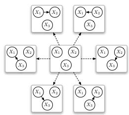

Next we estimate the distribution of our 'good' solutions

Choose model with best BDe

<table><tr><td>X1</td><td>X2</td><td>X3</td></tr><tr><td>0</td><td>0</td><td>1</td></tr><tr><td>1</td><td>0</td><td>0</td></tr><tr><td>1</td><td>0</td><td>1</td></tr><tr><td>1</td><td>1</td><td>0</td></tr></table>

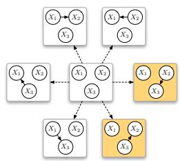

# BOA - Estimation

# BOA - Estimation

# Some results

Next we estimate the distribution of our 'good' solutions

Again consider all possible edge additions:

None of these improve the BDe, So we're done

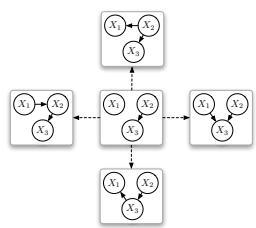

Next we estimate the distribution of our 'good' solutions

Now we find   
contingency tables   
from the data

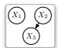

<table><tr><td>X1</td><td>X2</td><td>X3</td></tr><tr><td>0</td><td>0</td><td>1</td></tr><tr><td>1</td><td>0</td><td>0</td></tr><tr><td>1</td><td>0</td><td>1</td></tr><tr><td>1</td><td>1</td><td>0</td></tr></table>

x1 p X2 p 0 1/4 0 3/4 1 3/4 1 1/4 X2 = 0 X2 = 1 X p X p 0 1/3 0 1 1 2/3 1 0

To solve order-k decomposable problems of size n, (k<<n)

Cost per iteration should $\displaystyle \log O ( n ) - O ( n ^ { 1 . 0 5 } )$ Number of iterations should be $O ( { \sqrt { n } } ) - O ( n )$

Overall this is $O ( n ^ { 1 . 5 5 } ) - O ( n ^ { 2 } )$

# Some References

Fin.

# • Review papers

Published by Springer.

Univariate models

learning. Technical report CMU-CS-94-163, Carnegie Mellon University (1994)

•UMDA - Muhlenbein & Paa8, "From recombination of genes to the estimation of Distributions I. Binan eters", in Lecture Notes in Cpuer Sinc 11 PSN . p178-7

Single dependencies

IC De Bon, "MC: Find otia ing Systems, vol 9(1997)

C Technical rport CMU-CS-97-157, Carnegie Mellon University (1997)

Multiple dependencies

A IGA   
LF   
E ti   
o in Optimization by Building and Using Probabilistic Models p217-221 (2000)

Bayesian networks

Hecken Data, in Machine Learning vo/20 p197-243 (1995)