# Estimation of Distribution Algorithms

Tom Hinton

# Origin

# Genetic Algorithms - Idea

# Evolution has produced "good solutions" to difficult engineering problems

It only acts through reproductive fitness

The details of a problem/solution are hidden in a "black-box"

Maybe something similar can work on manmade problems

# Genetic Algorithms

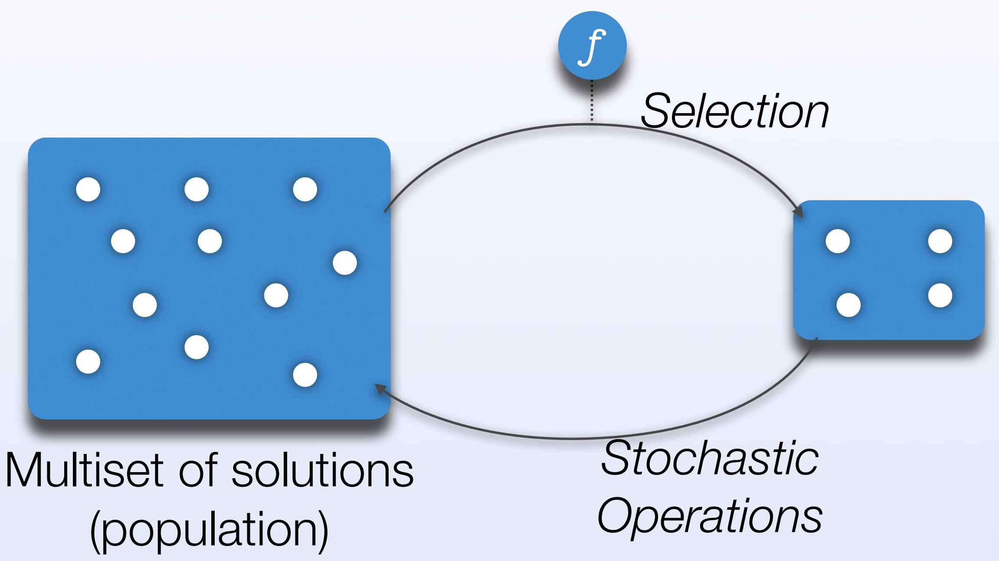

# Epistasis and Other Issues

The standard GA has trouble with so-called epistasis or linkage

Non-monotonic non-linearity in the fitness function

1 ∀i : xi = 0 f(x) 0 ∀i : xi = 1 ∑i xi otherwise

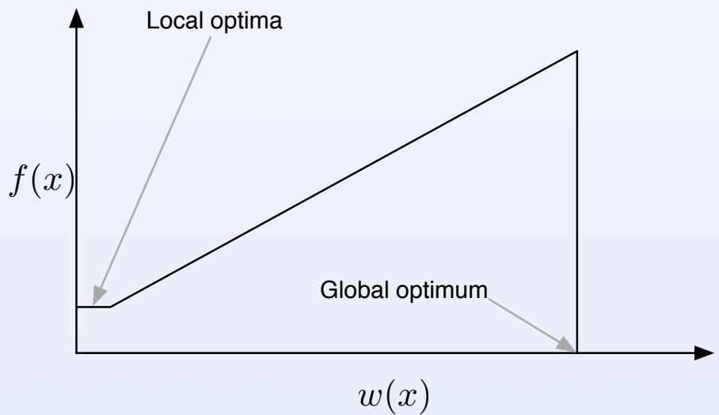

The global minimum here is hard to reach

•Also issues with speed, population sizing, eto

# EDAs - Idea

# In a genetic algorithm we select (stochastically) from the population

This is akin to sampling from a distribution

# Replace population with a model, and the stochastic operators with repeated estimation of the model

# EDAs

Sampling Selection   
Probability   
distribution over instances Estimation

# Why is this a good idea?

Population sizing issues are reduced

Dynamics and limitations may be easier to understand

Sufficiently advanced models can leam problem structure for a range of problems

Epistasis / linkage information is explicitly expressed in the joint distribution

Experimentally faster

# Example : UMDA

Instances are strings in a finite alphabet

e.g. (101011100101)

Assume each variable (bit) is univariate Joint distribution is the product of marginal distributions for each position

$$
p ( \mathbf { x } ) = \prod _ { i } p ( \mathbf { x } _ { i } )
$$

# UMDA Sampling & Estimation

# Distribution is a vector of probabilities

(0.1,0.8,0,1,0.5,..

# Marginal probabilites estimated using marginal frequencies

$$
p ( \mathbf { x } _ { i } = a ) \approx \frac { \sum _ { d \in D } \delta ( d _ { i } , a ) } { | D | }
$$

# Laplace Correction

Imagine every selected instance in a generation has value O for a particular variable

Estimated probability becomes a certainty that said variable takes value O

All future generations will take value O

$$
\begin{array} { r } { p _ { l } ( x _ { i } = a ) \approx \frac { \sum _ { d \in D } \delta ( d _ { i } , a ) + 1 } { | D | + r _ { i } } } \end{array}
$$

# UMDA - Why?

Solves boring functions much better than GAs

# UMDA (& other univariate algorithms) will work for problems which are already factored into independent variables

•These problems are boring

A good explanatory tool, easy to analyse

Doesn't resolve the GA problems of epistasis

# Better Models

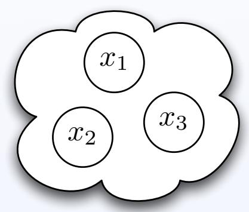

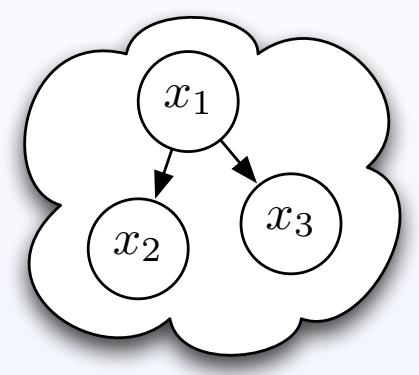

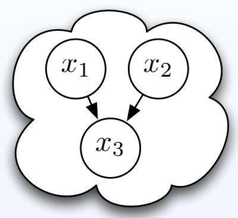

Independent

Single dependency

Multiple dependency

Ease of estimation

# Bayesian Networks

# Bayesian networks can capture any x which has an ordering of its variables such that

p(x) = Πi p(xi|Pi) (Pigives the $\forall \mathbf { x } _ { j } \in P _ { i } : j < i$ parents of xi)

i.e. The conditional relationships form a DAG

x1 x2   
5   
√   
x4

$$
p ( \mathbf { x } ) = p ( x _ { 1 } ) \cdot p ( x _ { 2 } ) \cdot p ( x _ { 3 } | x _ { 1 } , x _ { 2 } ) \cdot p ( x _ { 4 } | x _ { 3 } )
$$

# Example Network

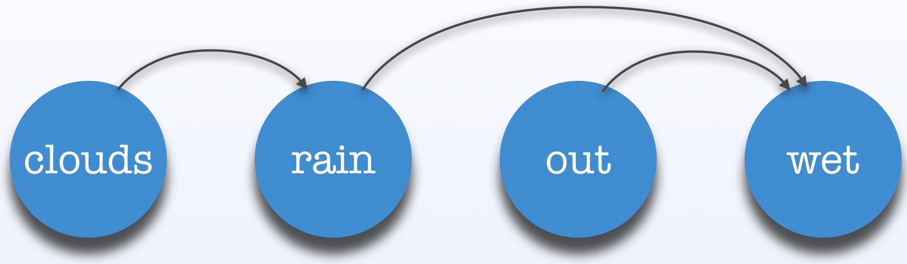

<table><tr><td>C</td><td>C</td></tr><tr><td>0.7</td><td>0.3</td></tr></table>

<table><tr><td></td><td>r</td><td>-r</td></tr><tr><td>C</td><td>0.6</td><td>0.4</td></tr><tr><td>C</td><td>0</td><td>1</td></tr></table>

<table><tr><td>O</td><td>O</td></tr><tr><td>0.5</td><td>0.5</td></tr></table>

<table><tr><td>r</td><td>W</td><td>W</td></tr><tr><td>O</td><td>1</td><td>0</td></tr><tr><td>O</td><td>0</td><td>1</td></tr></table>

<table><tr><td>r</td><td>W</td><td>W</td></tr><tr><td>O</td><td>0</td><td>1</td></tr><tr><td>O</td><td>0</td><td>1</td></tr></table>

# Sampling

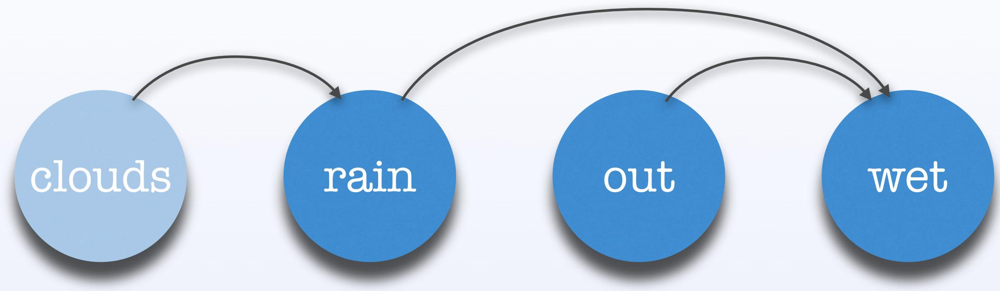

<table><tr><td>C</td><td>C</td></tr><tr><td>0.7</td><td>0.3</td></tr></table>

<table><tr><td></td><td>r</td><td>-r</td></tr><tr><td>C</td><td>0.6</td><td>0.4</td></tr><tr><td>C</td><td>0</td><td>1</td></tr></table>

<table><tr><td>O</td><td>O</td></tr><tr><td>0.5</td><td>0.5</td></tr></table>

<table><tr><td>r</td><td>W</td><td>W</td></tr><tr><td>O</td><td>1</td><td>0</td></tr><tr><td>O</td><td>0</td><td>1</td></tr></table>

<table><tr><td>r</td><td>W</td><td>W</td></tr><tr><td>O</td><td>0</td><td>1</td></tr><tr><td>O</td><td>0</td><td>1</td></tr></table>

# Sampling

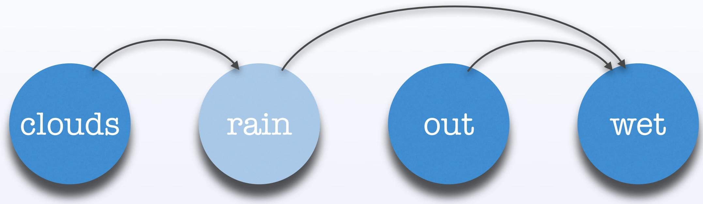

C

<table><tr><td></td><td>r</td><td>¬r</td></tr><tr><td>C</td><td>0.6</td><td>0.4</td></tr></table>

<table><tr><td>O</td><td>O</td></tr><tr><td>0.5</td><td>0.5</td></tr></table>

<table><tr><td>r</td><td>W</td><td>W</td></tr><tr><td>O</td><td>1</td><td>0</td></tr><tr><td>O</td><td>0</td><td>1</td></tr></table>

<table><tr><td>r</td><td>W</td><td>W</td></tr><tr><td>O</td><td>0</td><td>1</td></tr><tr><td>O</td><td>0</td><td>1</td></tr></table>

# Sampling

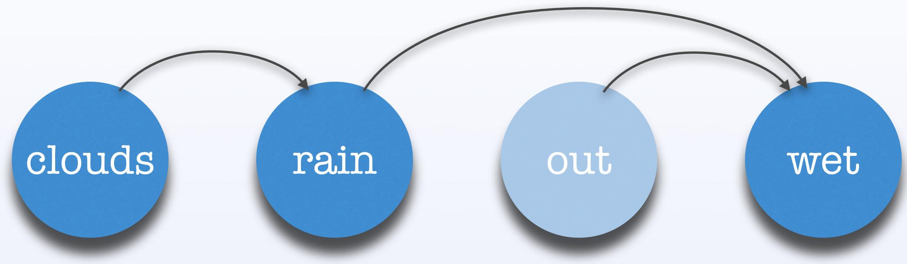

<table><tr><td>O</td><td>O</td></tr><tr><td>0.5</td><td>0.5</td></tr></table>

<table><tr><td>r</td><td>W</td><td>W</td></tr><tr><td>O</td><td>1</td><td>0</td></tr><tr><td>O</td><td>0</td><td>1</td></tr></table>

<table><tr><td>r</td><td>W</td><td>W</td></tr><tr><td>O</td><td>0</td><td>1</td></tr><tr><td>O</td><td>0</td><td>1</td></tr></table>

# Sampling

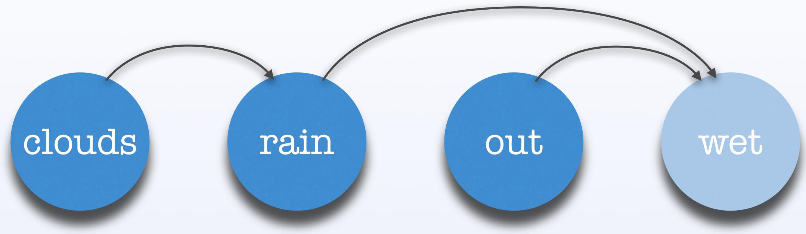

<table><tr><td>r</td><td>W</td><td>W</td></tr><tr><td>O</td><td>1</td><td>0</td></tr><tr><td>O</td><td>0</td><td>1</td></tr></table>

CR-O

<table><tr><td>r</td><td>W</td><td>W</td></tr><tr><td>O</td><td>0</td><td>1</td></tr><tr><td>O</td><td>0</td><td>1</td></tr></table>

# Sampling

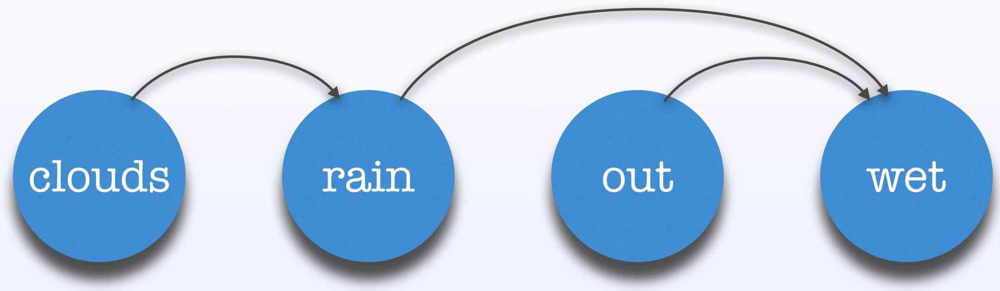

CR -O -W

# Network Estimation

Estimation is the bottleneck when using graphical models

Once the structure is known, producing contingency tables is easy

# T res to C ch is required

$$
\begin{array} { r c l } { { f ( n ) } } & { { = } } & { { \displaystyle \sum _ { i = 1 } ^ { n } ( - 1 ) ^ { i + 1 } \binom { n } { i } 2 ^ { i ( n - i ) } \cdot f ( n - i ) } } \\ { { f ( 0 ) } } & { { = } } & { { f ( 1 ) = 1 } } \end{array}
$$

# Detecting Independence

# Take a database D of samples

# Start with the complete graph Kn

$x _ { 2 }$ $x _ { 4 }$

# Use mutual information to determine independence and delete edges between independent vertices (PC algorithm)

# Scoring X Searching

# Most success has been had by using search algorithms to explore possible DAGs

This requires two parts to be defined

Some search procedure

A scoring method for DAGs which informs the search

Simple models are preferable

High posterior probability given sample

# Example: BOA

Models instances using Bayesian Networks

# Estimation uses a greedy search which adds edges from the empty graph

Networks are scored using Bayesian-Dirichlet Equivalence (BDe) metric

# Bayesian-Dirichlet Metric

Prior knowledge Instances of parents of Xi p(D, B|) = p(B| Πn=1 ΠπXi ≡(m(x+m(τXi) X Prior probability I ↑ ≡(m'(xi,πXi)+m(xi,πXi)) =(m′(xi,πXi)) Sample of B Proposed Instances of Xi Network Over variables (Xi) $\Xi ( x ) = ( x - 1 ) !$

$\operatorname { m } ( \mathrm { x } _ { i } , \pi X _ { i } )$ $\mathsf { X i } = \mathsf { p i }$ Xi $\begin{array} { r } { \operatorname { m } ( \pi x _ { i } ) = \sum _ { x _ { i } } m ( x _ { i } , \pi X _ { i } ) } \end{array}$

# Example: BOA

$$
f ( X _ { 1 } , X _ { 2 } , X _ { 3 } ) = X _ { 1 } + ( X _ { 2 } \oplus X _ { 3 } )
$$

<table><tr><td rowspan=1 colspan=1>X1</td><td rowspan=1 colspan=1>X2</td><td rowspan=1 colspan=1>X3</td><td rowspan=1 colspan=1>f</td></tr><tr><td rowspan=1 colspan=1>0</td><td rowspan=1 colspan=1>O</td><td rowspan=1 colspan=1>0</td><td rowspan=1 colspan=1>0</td></tr><tr><td rowspan=1 colspan=1>0</td><td rowspan=1 colspan=1>0</td><td rowspan=1 colspan=1>1</td><td rowspan=1 colspan=1>1</td></tr><tr><td rowspan=1 colspan=1>0</td><td rowspan=1 colspan=1>1</td><td rowspan=1 colspan=1>0</td><td rowspan=1 colspan=1>1</td></tr><tr><td rowspan=1 colspan=1>0</td><td rowspan=1 colspan=1>1</td><td rowspan=1 colspan=1>1</td><td rowspan=1 colspan=1>O</td></tr><tr><td rowspan=1 colspan=1>1</td><td rowspan=1 colspan=1>0</td><td rowspan=1 colspan=1>0</td><td rowspan=1 colspan=1>1</td></tr><tr><td rowspan=1 colspan=1>1</td><td rowspan=1 colspan=1>O</td><td rowspan=1 colspan=1>1</td><td rowspan=1 colspan=1>2</td></tr><tr><td rowspan=1 colspan=1>1</td><td rowspan=1 colspan=1>1</td><td rowspan=1 colspan=1>O</td><td rowspan=1 colspan=1>2</td></tr><tr><td rowspan=1 colspan=1>1</td><td rowspan=1 colspan=1>1</td><td rowspan=1 colspan=1>1</td><td rowspan=1 colspan=1>1</td></tr></table>

# BOA Sampling

First we randomly sample f

<table><tr><td rowspan=1 colspan=1>X1</td><td rowspan=1 colspan=1>X2</td><td rowspan=1 colspan=1>X3</td><td rowspan=1 colspan=1>f</td></tr><tr><td rowspan=1 colspan=1>0</td><td rowspan=1 colspan=1>O</td><td rowspan=1 colspan=1>0</td><td rowspan=1 colspan=1>0</td></tr><tr><td rowspan=1 colspan=1>0</td><td rowspan=1 colspan=1>O</td><td rowspan=1 colspan=1>1</td><td rowspan=1 colspan=1>1</td></tr><tr><td rowspan=1 colspan=1>0</td><td rowspan=1 colspan=1>1</td><td rowspan=1 colspan=1>0</td><td rowspan=1 colspan=1>1</td></tr><tr><td rowspan=1 colspan=1>0</td><td rowspan=1 colspan=1>1</td><td rowspan=1 colspan=1>1</td><td rowspan=1 colspan=1>O</td></tr><tr><td rowspan=1 colspan=1>1</td><td rowspan=1 colspan=1>O</td><td rowspan=1 colspan=1>O</td><td rowspan=1 colspan=1>1</td></tr><tr><td rowspan=1 colspan=1>1</td><td rowspan=1 colspan=1>0</td><td rowspan=1 colspan=1>1</td><td rowspan=1 colspan=1>2</td></tr><tr><td rowspan=1 colspan=1>1</td><td rowspan=1 colspan=1>1</td><td rowspan=1 colspan=1>O</td><td rowspan=1 colspan=1>2</td></tr><tr><td rowspan=1 colspan=1>1</td><td rowspan=1 colspan=1>1</td><td rowspan=1 colspan=1>1</td><td rowspan=1 colspan=1>1</td></tr></table>

# BOA - Selection

# Now we truncate our sample, keeping the best half

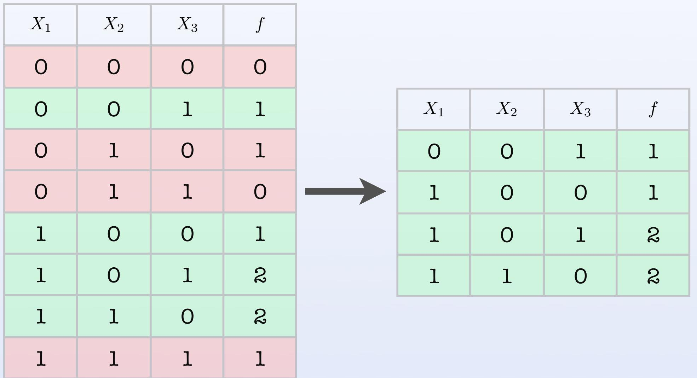

# BOA Estimation

Next we estimate the distribution of our 'good' solutions

Consider all additions of a single edge:

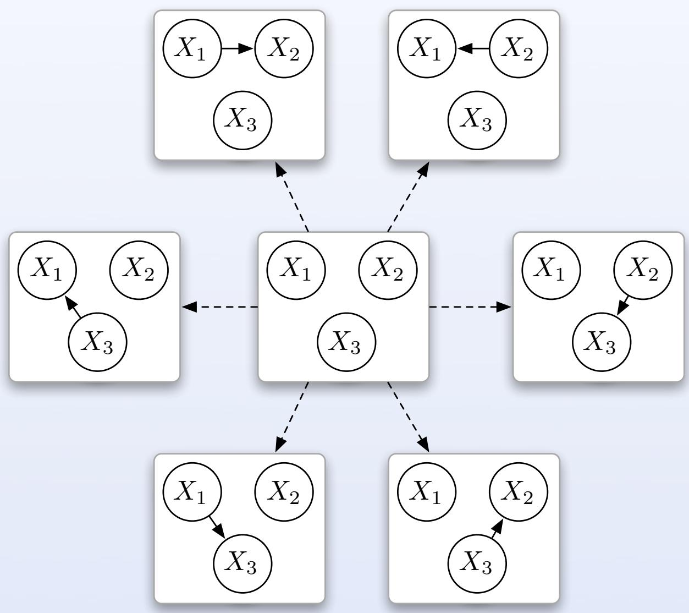

# BOA Estimation

Next we estimate the distribution of our 'good' solutions

Choose model with best BDe

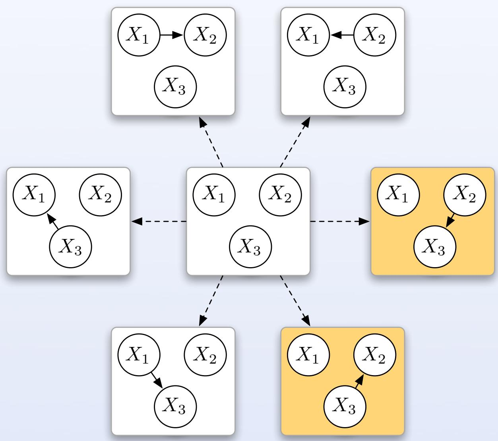

<table><tr><td rowspan=1 colspan=1>X1</td><td rowspan=1 colspan=1>X2</td><td rowspan=1 colspan=1>X3</td></tr><tr><td rowspan=1 colspan=1>O</td><td rowspan=1 colspan=1>O</td><td rowspan=1 colspan=1>1</td></tr><tr><td rowspan=1 colspan=1>1</td><td rowspan=1 colspan=1>O</td><td rowspan=1 colspan=1>O</td></tr><tr><td rowspan=1 colspan=1>1</td><td rowspan=1 colspan=1>O</td><td rowspan=1 colspan=1>1</td></tr><tr><td rowspan=1 colspan=1>1</td><td rowspan=1 colspan=1>1</td><td rowspan=1 colspan=1>O</td></tr></table>

# BOA Estimation

Next we estimate the distribution of our 'good' solutions

Again consider all possible edge additions:

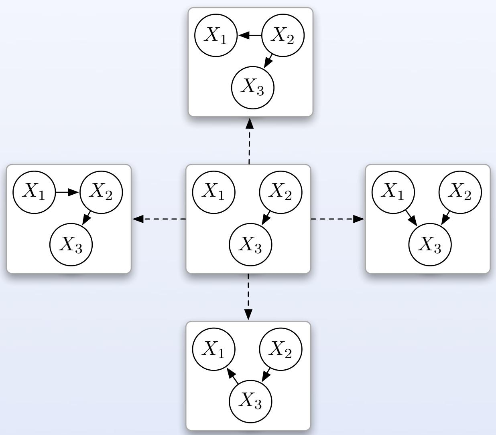

None of these improve the BDe, So we're done

# BOA Estimation

Next we estimate the distribution of our 'good' solutions

Now we find   
contingency tables   
from the data

x1 X2 (X3)

<table><tr><td rowspan=1 colspan=1>X1</td><td rowspan=1 colspan=1>p</td></tr><tr><td rowspan=1 colspan=1>O</td><td rowspan=1 colspan=1>1/4</td></tr><tr><td rowspan=1 colspan=1>1</td><td rowspan=1 colspan=1>3/4</td></tr></table>

<table><tr><td rowspan=1 colspan=1>X1</td><td rowspan=1 colspan=1>X2</td><td rowspan=1 colspan=1>X3</td></tr><tr><td rowspan=1 colspan=1>O</td><td rowspan=1 colspan=1>O</td><td rowspan=1 colspan=1>1</td></tr><tr><td rowspan=1 colspan=1>1</td><td rowspan=1 colspan=1>O</td><td rowspan=1 colspan=1>O</td></tr><tr><td rowspan=1 colspan=1>1</td><td rowspan=1 colspan=1>O</td><td rowspan=1 colspan=1>1</td></tr><tr><td rowspan=1 colspan=1>1</td><td rowspan=1 colspan=1>1</td><td rowspan=1 colspan=1>O</td></tr></table>

<table><tr><td rowspan=1 colspan=1>X2</td><td rowspan=1 colspan=1>p</td></tr><tr><td rowspan=1 colspan=1>O</td><td rowspan=1 colspan=1>3/4</td></tr><tr><td rowspan=1 colspan=1>1</td><td rowspan=1 colspan=1>1/4</td></tr></table>

$$
X _ { 2 } = 0
$$

$$
X _ { 2 } = 1
$$

<table><tr><td rowspan=1 colspan=1>X3</td><td rowspan=1 colspan=1>p</td></tr><tr><td rowspan=1 colspan=1>O</td><td rowspan=1 colspan=1>1/3</td></tr><tr><td rowspan=1 colspan=1>1</td><td rowspan=1 colspan=1>2/3</td></tr></table>

<table><tr><td rowspan=1 colspan=1>X3</td><td rowspan=1 colspan=1>p</td></tr><tr><td rowspan=1 colspan=1>O</td><td rowspan=1 colspan=1>1</td></tr><tr><td rowspan=1 colspan=1>1</td><td rowspan=1 colspan=1>O</td></tr></table>

# Some results

To solve order-k decomposable problems of size n, (k<<n)

Cost per iteration should be O(n) - O(n1.05)

Number of iterations should be O(√n) - O(n)

$$
\operatorname { O v e r a l l } \pm \mathsf { I n i S } \mathsf { l S } O ( n ^ { 1 . 5 5 } ) - O ( n ^ { 2 } )
$$

Fin.

# Some References

Review papers

Published by Springer.

Univariate models

learning. Technical report CMU-CS-94-163, Carnegie Mellon University (1994)

Computer Science 1411, PPSN IV, p178-187 (1996)

Single dependencies

Technical report CMU-CS-97-157, Carnegie Mellon University (1997)

Multiple dependencies

LF Evolutionaly Computation, vol 7 p 353-376 (1999)

hBOA - Pelikan & Goldberg "Hierarchical Bayesian Optimization Algorithm $=$ Bayesian Optimization Algorithm $^ +$ Niching $^ +$ Local Structures", in Optimization by Building and Using Probabilistic Models p217-221 (2000)

Bayesian networks