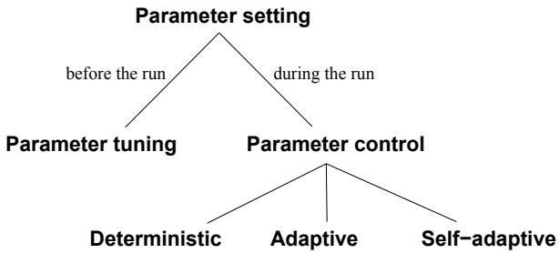
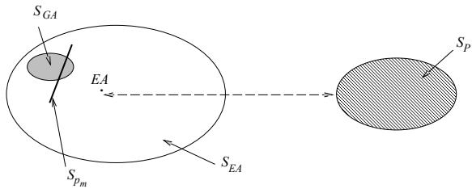

# Parameter Control in Evolutionary Algorithms

Ágoston E. Eiben Robert Hinterding and Zbigniew Michalewicz

Abstract— The issue of controlling values of various parameters of an evolutionary algorithm is one of the most important and promising areas of research in evolutionary computation: It has a potential of adjusting the algorithm to the problem while solving the problem. In this paper we (1) revise the terminology, which is unclear and confusing, thereby providing a classification of such control mechanisms and (2) survey various forms of control which have been studied by the evolutionary computation community in recent years. Our classification covers the major forms of parameter control in evolutionary computation and suggests some directions for further research.

# I. INTRODUCTION

The two major steps in applying any heuristic search algorithm to a particular problem are the specification of the representation and the evaluation (fitness) function. These two items form the bridge between the original problem context and the problem-solving framework. When defining an evolutionary algorithm (EA) one needs to choose its components, such as variation operators (mutation and recombination) that suit the representation, selection mechanisms for selecting parents and survivors, and an initial population. Each of these components may have parameters, for instance: the probability of mutation, the tournament size of selection, or the population size. The values of these parameters greatly determine whether the algorithm will find a near-optimum solution, and whether it will find such a solution efficiently. Choosing the right parameter values, however, is a time-consuming task and considerable effort has gone into developing good heuristics for it.

Globally, we distinguish two major forms of setting parameter values: parameter tuning and parameter control. By parameter tuning we mean the commonly practised approach that amounts to finding good values for the parameters before the run of the algorithm and then running the algorithm using these values, which remain fixed during the run. In Section II we give arguments that any static set of parameters, having the values fixed during an EA run, seems to be inappropriate. Parameter control forms an alternative, as it amounts to starting a run with initial parameter values which are changed during the run.

This paper has a two-fold objective. First, we provide a comprehensive discussion of parameter control and categorize different ways of performing it. The proposed classification is based on two aspects: how the mechanism of change works, and what component of the EA is effected by the mechanism. Such a classification can be useful to the evolutionary computation community, since many researchers interpret terms like "adaptation" or "self-adaptation" differently, which can be confusing. The framework we propose here is intended to eliminate ambiguities in the terminology. Second, we provide a survey of control techniques which can be found in the literature. This is intended as a guide to locate relevant work in the area, and as a collection of options one can use when applying an EA with changing parameters.

We are aware of other classification schemes, e.g., [2], [65], [119], that use other division criteria, resulting in different classification schemes. The classification of Angeline [2] is based on levels of adaptation and type of update rules. In particular, three levels of adaptation: population-level, individual-level, and component-level1 are considered, together with two types of update mechanisms: absolute and empirical rules. Absolute rules are predetermined and specify how modifications should be made. On the other hand, empirical update rules modify parameter values by competition among them (self-adaptation). Angeline's framework considers an EA as a whole, without dividing attention to its different components (e.g., mutation, recombination, selection, etc). The classification proposed by Hinterding, Michalewicz, and Eiben [65] extends that of [2] by considering an additional level of adaptation (environment-level), and makes a more detailed division of types of update mechanisms, dividing them into deterministic, adaptive, and selfadaptive categories. Here again, no attention is payed to what parts of an EA are adapted. The classification of Smith and Fogarty [119], [116] is probably the most comprehensive. It is based on three division criteria: what is being adapted, the scope of the adaptation, and the basis for change. The last criterion is further divided into two categories: the evidence the change is based upon and the rule/algorithm that executes the change. Moreover, there are two types of rule/algorithm: uncoupled/absolute and tightlycoupled/empirical, the latter one coinciding with selfadaptation.

The classification scheme proposed in this paper is based on the type of update mechanisms and the EA component that is adapted, as basic division criteria. This classification addresses the key issues of parameter control without getting lost in details (this aspect is discussed in more detail in section IV).

The paper is organized as follows. The next section discusses parameter tuning and parameter control. Section III presents an example which provides some basic intuitions on parameter control. Section IV develops a classification of control techniques in evolutionary algorithms, whereas Section V surveys the techniques proposed so far. Section VI discusses some combinations of various techniques and Section VII concludes the paper.

# II. PARAMETER TUNING VS. PARAMETER CONTROL

During the 1980s, a standard genetic algorithm (GA) based on bit-representation, one-point crossover, bitflip mutation and roulette wheel selection (with or without elitism) was widely applied. Algorithm design was thus limited to choosing the so-called control parameters, or strategy parameters2, such as mutation rate, crossover rate, and population size. Many researchers based their choices on tuning the control parameters "by hand", that is experimenting with different values and selecting the ones that gave the best results. Later, they reported their results of applying a particular EA to a particular problem, paraphrasing here:

...for these experiments, we have used the following parameters: population size of 100, probability of crossover equal to 0.85, etc.

without much justification of the choice made.

Two main approaches were tried to improve GA design in the past. First, De Jong [29] put a considerable effort into finding parameter values (for a traditional GA), which were good for a number of numeric test problems. He determined (experimentally) recommended values for the probabilities of single-point crossover and bit mutation. His conclusions were that the following parameters give reasonable performance for his test functions (for new problems these values may not be very good):

population size of 50   
probability of crossover equal to 0.6 probability of mutation equal to 0.001 generation gap of $1 0 0 \%$   
scaling window: $n = \infty$   
selection strategy: elitist.

Grefenstette [58], on the other hand, used a GA as a meta-algorithm to optimize values for the same parameters for both on-line and off-line performance³ of the algorithm. The best set of parameters to optimize the on-line (off-line) performance of the GA were (the values to optimize the off-line performance are given in parenthesis):

population size of 30 (80) probability of crossover equal to 0.95 (0.45) probability of mutation equal to 0.01 (0.01) generation gap of $1 0 0 \%$ $( 9 0 \% )$ scaling window: $n = 1 ~ ( n = 1 )$ selection strategy: elitist (non-elitist).

Note that in both of these approaches, an attempt was made to find the optimal and general set of parameters; in this context, the word 'general' means that the recommended values can be applied to a wide range of optimization problems. Formerly, genetic algorithms were seen as robust problem solvers that exhibit approximately the same performance over a wide range of problems [50], pp. 6. The contemporary view on EAs, however, acknowledges that specific problems (problem types) require specific EA setups for satisfactory performance [13]. Thus, the scope of 'optimal' parameter settings is necessarily narrow. Any quest for generally (near-)optimal parameter settings is lost a priori [140]. This stresses the need for efficient techniques that help finding good parameter settings for a given problem, in other words, the need for good parameter tuning methods.

As an alternative to tuning parameters before running the algorithm, controlling them during a run was realised quite early (e.g., mutation step sizes in the evolution strategy (ES) community). Analysis of the simple corridor and sphere problems in large dimensions led to Rechenberg's $1 / 5$ success rule (see section IIIA), where feedback was used to control the mutation step size [100]. Later, self-adaptation of mutation was used, where the mutation step size and the preferred direction of mutation were controlled without any direct feedback. For certain types of problems, self-adaptive mutation was very successful and its use spread to other branches of evolutionary computation (EC).

As mentioned earlier, parameter tuning by hand is a common practice in evolutionary computation. Typically one parameter is tuned at a time, which may cause some sub-optimal choices, since parameters often interact in a complex way. Simultaneous tuning of more parameters, however, leads to an enormous amount of experiments. The technical drawbacks to parameter tuning based on experimentation can be summarized as follows:

• Parameters are not independent, but trying all different combinations systematically is practically impossible.   
The process of parameter tuning is time consuming, even if parameters are optimized one by one, regardless to their interactions.   
• For a given problem the selected parameter values are not necessarily optimal, even if the effort made for setting them was significant.

Other options for designing a good set of static parameters for an evolutionary method to solve a particular problem include "parameter setting by analogy" and the use of theoretical analysis. Parameter setting by analogy amounts to the use of parameter settings that have been proved successful for "similar" problems. However, it is not clear whether similarity between problems as perceived by the user implies that the optimal set of EA parameters is also similar. As for the theoretical approach, the complexities of evolutionary processes and characteristics of interesting problems allow theoretical analysis only after significant simplifications in either the algorithm or the problem model. Therefore, the practical value of the current theoretical results on parameter settings is unclear.4 There are some theoretical investigations on the optimal population size [50], [132], [60], [52] or optimal operator probabilities [54], [131], [10], [108], however, these results were based on simple function optimization problems and their applicability for other types of problems is limited.

A general drawback of the parameter tuning approach, regardless of how the parameters are tuned, is based on the observation that a run of an EA is an intrinsically dynamic, adaptive process. The use of rigid parameters that do not change their values is thus in contrast to this spirit. Additionally, it is intuitively obvious that different values of parameters might be optimal at different stages of the evolutionary process [27], [127], [8], [9], [10], [62], [122]. For instance, large mutation steps can be good in the early generations helping the exploration of the search space and small mutation steps might be needed in the late generations to help fine tuning the sub-optimal chromosomes. This implies that the use of static parameters itself can lead to inferior algorithm performance. The straightforward way to treat this problem is by using parameters that may change over time, that is, by replacing a parameter $p$ by a function $p ( t )$ , where $t$ is the generation counter. However, as indicated earlier, the problem of finding optimal static parameters for a particular problem can be quite difficult, and the optimal values may depend on many other factors (like the applied recombination operator, the selection mechanism, etc). Hence designing an optimal function $p ( t )$ may be even more difficult. Another possible drawback to this approach is that the parameter value $p ( t )$ changes are caused by a deterministic rule triggered by the progress of time $t$ , without taking any notion of the actual progress in solving the problem, i.e., without taking into account the current state of the search. Yet researchers (see Section V) have improved their evolutionary algorithms, i.e., they improved the quality of results returned by their algorithms while working on particular problems, by using such simple deterministic rules. This can be explained simply by superiority of changing parameter values: suboptimal choice of $p ( t )$ often leads to better results than a suboptimal choice of $p$ .

To this end, recall that finding good parameter values for an evolutionary algorithm is a poorly structured, ill-defined, complex problem. But on this kind of problem, EAs are often considered to perform better than other methods! It is thus seemingly natural to use an evolutionary algorithm not only for finding solutions to a problem, but also for tuning the (same) algorithm to the particular problem. Technically speaking, this amounts to modifying the values of parameters during the run of the algorithm by taking the actual search process into account. Basically, there are two ways to do this. Either one can use some heuristic rule which takes feedback from the current state of the search and modifies the parameter values accordingly, or incorporate parameters into the chromosomes, thereby making them subject to evolution. The first option, using a heuristic feedback mechanism, allows one to base changes on triggers different from elapsing time, such as population diversity measures, relative improvements, absolute solution quality, etc. The second option, incorporating parameters into the chromosomes, leaves changes entirely based on the evolution mechanism. In particular, natural selection acting on solutions (chromosomes) will drive changes in parameter values associated with these solutions. In the following we discuss these options illustrated by an example.

# III. AN EXAMPLE

Let us assume we deal with a numerical optimization problem: optimize $f ( { \vec { x } } ) = f ( x _ { 1 } , \ldots , x _ { n } )$ subject to some inequality and equality constraints: $g _ { i } ( \vec { x } ) ~ \leq ~ 0 ~ ( i ~ = ~ 1 , \ldots , q )$ and $h _ { j } ( \vec { x } ) \ = \ 0$ $( j ~ = ~ q ~ +$ $1 , \ldots , m )$ , and bounds $l _ { i } \leq x _ { i } \leq u _ { i }$ for $1 \leq i \leq n$ , defining the domain of each variable.

For such a numerical optimization problem we may consider an evolutionary algorithm based on a floatingpoint representation, where each individual $\vec { x }$ in the population is represented as a vector of floating-point numbers ${ \vec { x } } = \langle x _ { 1 } , \ldots , x _ { n } \rangle$ .

# $A$ . Changing the mutation step size

Let us assume that we use Gaussian mutation together with arithmetical crossover to produce offspring for the next generation. A Gaussian mutation operator requires two parameters: the mean, which is often set to zero, and the standard deviation $\sigma$ , which can be interpreted as the mutation step size. Mutations then are realized by replacing components of the vector $\vec { x }$ by $x _ { i } ^ { \prime } = x _ { i } + N ( 0 , \sigma )$ ,

where $N ( 0 , \sigma )$ is a random Gaussian number with mean zero and standard deviation $\sigma$ . The simplest method to specify the mutation mechanism is to use the same $\sigma$ for all vectors in the population, for all variables of each vector, and for the whole evolutionary process, for instance, $x _ { i } ^ { \prime } = x _ { i } + N ( 0 , 1 )$ . As indicated in Section II, it might be beneficial to vary the mutation step size.5 We shall discuss several possibilities in turn.

First, we can replace the static parameter $\sigma$ by a dynamic parameter, i.e., a function $\sigma ( t )$ . This function can be defined by some heuristic rule assigning different values depending on the number of generations. For example, the mutation step size may be defined as: $\textstyle \sigma ( t ) = 1 - 0 . 9 \cdot { \frac { t } { T } }$ , where $t$ is the current generation number varying from 0 to $T$ , which is the maximum generation number. Here, the mutation step size $\sigma ( t )$ (used for all for vectors in the population and for all variables of each vector) will decrease slowly from 1 at the beginning of the run $\mathbf { \nabla } _ { t } =$ 0) to 0.1 as the number of generations $t$ approaches $T$ . Such decreases may assist the fine-tuning capabilities of the algorithm. In this approach, the value of the given parameter changes according to a fully deterministic scheme. The user thus has full control of the parameter and its value at a given time $t$ is completely determined and predictable.

Second, it is possible to incorporate feedback from the search process, still using the same $\sigma$ for all for vectors in the population and for all variables of each vector. A well-known example of this type of parameter adaptation is Rechenberg's $^ { \cdot } 1 / 5$ success rule' in $( 1 + 1 )$ . evolution strategies [100]. This rule states that the ratio of successful mutations6 to all mutations should be $1 / 5$ , hence if the ratio is greater than $1 / 5$ then the step size should be increased, and if the ratio is less than $1 / 5$ , the step size should be decreased:

$$
\begin{array} { r l } & { \mathbf { 1 o d } \ n = 0 ) \ \mathbf { t h e n } } \\ & { \boldsymbol { \sigma } ( t ) : = \left\{ \begin{array} { l l } { \sigma ( t - n ) / c , \quad } & { \mathrm { i f } \ p _ { s } > 1 / 5 } \\ { \sigma ( t - n ) \cdot c , \quad } & { \mathrm { i f } \ p _ { s } < 1 / 5 } \\ { \sigma ( t - n ) , \quad } & { \mathrm { i f } \ p _ { s } = 1 / 5 } \end{array} \right. } \\ & { \boldsymbol { \sigma } ( t ) : = \boldsymbol { \sigma } ( t - 1 ) ; } \end{array}
$$

else

fi

where $p _ { s }$ is the relative frequency of successful mutations, measured over some number of generations and $0 . 8 1 7 \leq c \leq 1$ , [11]. Using this mechanism, changes in the parameter values are now based on feedback from the search, and $\sigma$ -adaptation happens every $n$ generations. The influence of the user on the parameter values is much less direct here than in the deterministic scheme above. Of course, the mechanism that embodies the link between the search process and parameter values is still a heuristic rule indicating how the changes should be made, but the values of $\sigma ( t )$ are not deterministic.

Third, it is possible to assign an 'individual' mutation step size to each solution: extend the representation to individuals of length $n + 1$ as $\langle x _ { 1 } , \ldots , x _ { n } , \sigma \rangle$ , and apply some variation operators (e.g., Gaussian mutation and arithmetical crossover) to $x _ { i }$ 's as well as to the $\sigma$ value of an individual. In this way, not only the solution vector values $\left( x _ { i } ^ { \phantom { } } \mathrm { { s } } \right)$ , but also the mutation step size of an individual undergoes evolution. A typical variation would be: $\overrightharpoon { \boldsymbol { \sigma } ^ { \prime } } ^ { \prime } = \boldsymbol { \sigma } \cdot \boldsymbol { e } ^ { N ( 0 , \tau _ { 0 } ) }$ and $x _ { i } ^ { \prime } = x _ { i } + N ( 0 , \sigma ^ { \prime } )$ , where $\tau _ { 0 }$ is a parameter of the method. This mechanism is commonly called self-adapting the mutation step sizes. Observe that within the self-adaptive scheme the heuristic character of the mechanism resetting the parameter values is eliminated.7

$^ 6 \mathrm { A }$ mutation is considered successful if it produces an offspring that is better than the parent.

7It can be argued that the heuristic character of the mechanism resetting the parameter values is not eliminated, but rather

Note that in the above scheme the scope of application of a certain value of $\sigma$ was restricted to a single individual. However, it can be applied to all variables of the individual: it is possible to change the granularity of such applications and use a separate mutation step size to each $x _ { i }$ . If an individual is represented as $\langle x _ { 1 } , \ldots , x _ { n } , \sigma _ { 1 } , \ldots , \sigma _ { n } \rangle$

then mutations can be realized by replacing the above vector according to a similar formula as discussed above:

where $\tau _ { 0 }$ is a parameter of the method. However, as opposed to the previous case, each component $x _ { i }$ has its own mutation step size $\sigma _ { i }$ , which is being self-adapted. This mechanism implies a larger degree of freedom for adapting the search strategy to the topology of the fitness landscape.

# B. Changing the penalty coefficients

In the previous subsection we described different ways to modify a parameter controlling mutation. Several other components of an EA have natural parameters, and these parameters are traditionally tuned in one or another way. Here we show that other components, such as the evaluation function (and consequently the fitness function) can also be parameterized and thus tuned. While this is a less common option than tuning mutation (although it is practicized in the evolution of variable-length stuctures for parsimony pressure [144]), it may provide a useful mechanism for increasing the performance of an evolutionary algorithm.

When dealing with constrained optimization problems, penalty functions are often used. A common technique is the method of static penalties [92], which requires fixed user-supplied penalty parameters. The main reason for its wide spread use is that it is the simplest technique to implement: It requires only the straightforward modification of the evaluation function eval as follows:

where $f$ is the objective function, and penalty $( \vec { x } )$ is zero if no violation occurs, and is positive,8 otherwise. Usually, the penalty function is based on the distance of a solution from the feasible region, or on the effort to "repair" the solution, i.e., to force it into the feasible region. In many methods a set of functions $f _ { j }$ $( 1 \leq j \leq$ $m _ { , }$ is used to construct the penalty, where the function $f _ { j }$ measures the violation of the $j$ -th constraint in the following way:

$$
f _ { j } ( \vec { x } ) = \left\{ \begin{array} { l l } { \operatorname* { m a x } \{ 0 , g _ { j } ( \vec { x } ) \} , } & { i f ~ 1 \leq j \leq q } \\ { | h _ { j } ( \vec { x } ) | , } & { i f ~ q + 1 \leq j \leq m . } \end{array} \right.
$$

$W$ is a user-defined weight, prescribing how severely constraint violations are weighted.9 In the most traditional penalty approach the weight $W$ does not change during the evolution process. We sketch three possible methods of changing the value of $W$ .

First, we can replace the static parameter $W$ by a dynamic parameter, e.g., a function $W ( t )$ . Just as for the mutation parameter $\sigma$ , we can develop a heuristic which modifies the weight $W$ over time. For example, in the method proposed by Joines and Houck [76], the individuals are evaluated (at the iteration $t$ )by a formula, where   
$e v a l ( \vec { x } ) = f ( \vec { x } ) + ( C \cdot t ) ^ { \alpha } \cdot p e n a l t y ( \vec { x } )$ .   
where $C$ and $\alpha$ are constants. Clearly,   
$W ( t ) = ( C \cdot t ) ^ { \alpha }$ ,   
the penalty pressure grows with the evolution time.

Second, let us consider another option, which utilizes feedback from the search process. One example of such an approach was developed by Bean and HadjAlouane [19], where each individual is evaluated by the same formula as before, but $W ( t )$ is updated in every generation $t$ in the following way:

$$
W ( t + 1 ) = \left\{ \begin{array} { l l } { ( 1 / \beta _ { 1 } ) \cdot W ( t ) , } & { \mathrm { i f } \vec { b } ^ { i } \in \mathcal { F } } \\ & { \mathrm { f o r ~ a l l } \ t - k + 1 \le i \le t } \\ { \beta _ { 2 } \cdot W ( t ) , } & { \mathrm { i f } \vec { b } ^ { i } \in S - \mathcal { F } } \\ & { \mathrm { f o r ~ a l l } \ t - k + 1 \le i \le t } \\ { W ( t ) , } & { \mathrm { o t h e r w i s e . } } \end{array} \right.
$$

In this formula, $\mathcal { S }$ is the set of all search points (solutions), ${ \mathcal { F } } \subseteq S$ is a set of all feasible solutions, $\vec { b ^ { \imath } }$ denotes the best individual in terms of the function eval in generation $i$ , $\beta _ { 1 } , \beta _ { 2 } > 1$ and $\beta _ { 1 } \neq \beta _ { 2 }$ (to avoid cycling). In other words, the method decreases the penalty component $W ( t + 1 )$ for the generation $t + 1$ if all best individuals in the last $k$ generations were feasible (i.e., in $\mathcal { F }$ ), and increases penalties if all best individuals in the last $k$ generations were infeasible. If there are some feasible and infeasible individuals as best individuals in the last $k$ generations, $W ( t + 1 )$ remains without change.

Third, we could allow self-adaptation of the weight parameter, similarly to the mutation step sizes in the previous section. For example, it is possible to extend the representation of individuals into

9Of course, instead of $W$ it is possible to consider a vector of weights $\vec { w } = ( w _ { 1 } , \dots , w _ { m } )$ which are applied directly to violation functions $f _ { j } \left( { \vec { x } } \right)$ In such a case $\begin{array} { r } { p e n a l t y ( \vec { x } ) = \sum _ { j = 1 } ^ { m } w _ { j } f _ { j } ( \vec { x } ) } \end{array}$ The discussion in the remaining part of this section can be easily extended to this case.

$\langle x _ { 1 } , \ldots , x _ { n } , W \rangle$ ,

where $W$ is the weight. The weight component $W$ undergoes the same changes as any other variable $x _ { i }$ (e.g., Gaussian mutation, arithmetical crossover). However, it is unclear, how the evaluation function can benefit from such self-adaptation. Clearly, the smaller weight $W$ , the better an (infeasible) individual is, so it is unfair to apply different weights to different individuals within the same generation. It might be that a new weight can be defined (e.g., arithmetical average of all weights present in the population) and used for evaluation purpose; however, to our best knowledge, no one has experimented with such self-adaptive weights.

To this end, it is important to note the crucial difference between self-adapting mutation step sizes and constraint weights. Even if the mutation step sizes are encoded in the chromosomes, the evaluation of a chromosome is independent from the actual value of $\sigma ^ { \prime } \mathrm { s }$ . That is,

$$
e v a l ( \langle \vec { x } , \vec { \sigma } \rangle ) = f ( \vec { x } )
$$

for any chromosome $\langle \vec { x } , \vec { \sigma } \rangle$ . In contrast, if constraint weights are encoded in the chromosomes, then we have

$$
e v a l ( \langle \vec { x } , W \rangle ) = f _ { W } ( \vec { x } )
$$

for any chromosome $\langle \vec { x } , W \rangle$ . This enables the evolution to 'cheat' in the sense of making improvements by modifying the value of $W$ instead of optimizing $f$ and satisfying the constraints.

# C. Summary

In the previous subsections we illustrated how the mutation operator and the evaluation function can be controlled (adapted) during the evolutionary process. The latter case demonstrates that not only the traditionally adjusted components, such as mutation, recombination, selection, etc., can be controlled by parameters, but so can other components of an evolutionary algorithm. Obviously, there are many components and parameters that can be changed and tuned for optimal algorithm performance. In general, the three options we sketched for the mutation operator and the evaluation function are valid for any parameter of an evolutionary algorithm, whether it is population size, mutation step, the penalty coefficient, selection pressure, and so forth.

The mutation example of Section III-A also illustrates the phenomenon of the scope of a parameter. Namely, the mutation step size parameter can have different domains of influence, which we call scope. Using the $\langle x _ { 1 } , \ldots , x _ { n } , \sigma _ { 1 } , \ldots , \sigma _ { n } \rangle$ model, a particular mutation step size applies only to one variable of a single individual. Thus, the parameter $\sigma _ { i }$ acts on a subindividual level. In the $\langle x _ { 1 } , \ldots , x _ { n } , \sigma \rangle$ representation the scope of $\sigma$ is one individual, whereas the dynamic parameter $\sigma ( t )$ was defined to affect all individuals and thus has the whole population as its scope.

These remarks conclude the introductory examples of this section; we are now ready to attempt a classification of parameter control techniques for parameters of an evolutionary algorithm.

# IV. CLassificatioN OF COntroL TEcHniQuES

In classifying parameter control techniques of an evolutionary algorithm, many aspects can be taken into account. For example:   
1. What is changed? (e.g., representation, evaluation function, operators, selection process, mutation rate, etc.).   
2. How the change is made? (i.e., deterministic heuristic, feedback-based heuristic, or self-adaptive).   
3. The scope/level of change (e.g., population-level, individual-level, etc.).   
4. The evidence upon which the change is carried out (e.g., monitoring performance of operators, diversity of the population, etc.).   
In the following we discuss these items in more detail.

To classify parameter control techniques from the perspective of what is changed, it is necessary to agree on a list of all major components of an evolutionary algorithm (which is a difficult task in itself). For that purpose, assume the following components of an EA:

Representation of individuals.   
Evaluation function.   
Variation operators and their probabilities.   
Selection operator (parent selection or mating selection).   
• Replacement operator (survival selection or environmental selection).   
• Population (size, topology, etc.).   
Note that each component can be parameterized, and the number of parameters is not clearly defined. For example, an offspring produced by an arithmetical crossover of $k$ parents $\vec { x } _ { 1 } , \ldots , \vec { x } _ { k }$ can be defined by the following formula   
${ \vec { v } } = a _ { 1 } { \vec { x } } _ { 1 } + \ldots + a _ { k } { \vec { x } } _ { k } .$   
where $a _ { 1 } , \ldots , a _ { k }$ , and $k$ can be considered as parameters of this crossover. Parameters for a population can include the number and sizes of subpopulations, migration rates, etc. (this is for a general case, when more then one population is involved). Despite the somewhat arbitrary character of this list of components and of the list of parameters of each component, we will maintain the "what-aspect" as one of the main classification features. The reason for this is that it allows us to locate where a specific mechanism has its effect. Also, this is way we would expect people to

search through a survey, e.g., "I want to apply changing mutation rates, let me see how others did it".

As discussed and illustrated in Section III, methods for changing the value of a parameter (i.e., the "howaspect") can be classified into one of three categories:

Deterministic parameter control.

This takes place when the value of a strategy parameter is altered by some deterministic rule. This rule modifies the strategy parameter deterministically without using any feedback from the search. Usually, a time-varying schedule is used, i.e., the rule will be used when a set number of generations have elapsed since the last time the rule was activated.

• Adaptive parameter control.

This takes place when there is some form of feedback from the search that is used to determine the direction and/or magnitude of the change to the strategy parameter. The assignment of the value of the strategy parameter may involve credit assignment, and the action of the EA may determine whether or not the new value persists or propagates throughout the population.

• Self-adaptive parameter control.

The idea of the evolution of evolution can be used to implement the self-adaptation of parameters. Here the parameters to be adapted are encoded into the chromosomes and undergo mutation and recombination. The better values of these encoded parameters lead to better individuals, which in turn are more likely to survive and produce offspring and hence propagate these better parameter values.

This terminology leads to the taxonomy illustrated in Figure 1.

  
Fig. 1. Gobal taxonomy of paremeter setting in EAs

Some authors have introduced a different terminology. Angeline [2] distinguished absolute and empirical rules corresponding to uncoupled and tightlycoupled mechanisms of Spears [124]. Let us note that the uncoupled/absolute category encompasses deterministic and adaptive control, whereas the tightly-coupled/empirical category corresponds to selfadaptation. We feel that the distinction between deterministic and adaptive parameter control is essential, as the first one does not use any feedback from the search process. However, we acknowledge that the terminology proposed here is not perfect either. The term "deterministic" control might not be the most appropriate, as it is not determinism that matters, but the fact that the parameter-altering transformations take no input variables related to the progress of the search process. For example, one might randomly change the mutation probability after every 100 generations, which is not a deterministic process. The name "fixed" parameter control might form an alternative that also covers this latter example. Also, the terms "adaptive" and "self-adaptive" could be replaced by the equally meaningful "explicitly adaptive" and "implicitly adaptive" controls, respectively. We have chosen to use "adaptive" and "self-adaptive" for the widely accepted usage of the latter term.

As discussed earlier, any change within any component of an EA may affect a gene (parameter), whole chromosomes (individuals), the entire population, another component (e.g., selection), or even the evaluation function. This is the aspect of the scope or level of adaptation [2], [65], [119], [116]. Note, however, that the scope/level usually depends on the component of the EA where the change takes place. For example, a change of the mutation step size may affect a gene, a chromosome, or the entire population, depending on the particular implementation (i.e., scheme used), but a change in the penalty coefficients always affects the whole population. So, the scope/level feature is a secondary one, usually depending on the given component and its actual implementation.

The issue of the scope of the parameter might be more complicated than indicated in Section III-C, however. First of all, the scope depends on the interpretation mechanism of the given parameters. For example, an individual might be represented as

$$
\langle x _ { 1 } , \ldots , x _ { n } , \sigma _ { 1 } , \ldots , \sigma _ { n } , \alpha _ { 1 } , \ldots , \alpha _ { n ( n - 1 ) / 2 } \rangle ,
$$

where the vector $\vec { \alpha }$ denotes the covariances between the variables $\sigma _ { 1 } , \ldots , \sigma _ { n }$ . In this case the scope of the strategy parameters in $\vec { \alpha }$ is the whole individual, although the notation might suggest that they are act on a subindividual level.

The next example illustrates that the same parameter (encoded in the chromosomes) can be interpreted in different ways, leading to different algorithm variants with different scopes of this parameter. Spears [124], following [46], experimented with individuals containing an extra bit to determine whether onepoint crossover or uniform crossover is to be used (bit $1 / 0$ standing for one-point/uniform crossover, respectively). Two interpretations were considered. The first interpretation was based on a pairwise operator choice: If both parental bits are the same, the corresponding operator is used, otherwise, a random choice is made. Thus, this parameter in this interpretation acts at an individual level. The second interpretation was based on the bit-distribution over the whole population: If, for example $7 3 \%$ of the population had bit 1, then the probability of one-point crossover was 0.73. Thus this parameter under this interpretation acts on the population level. Note, that these two interpretations can be easily combined. For instance, similar to the first interpretation, if both parental bits are the same, the corresponding operator is used. However, if they differ, the operator is selected according to the bit-distribution, just as in the second interpretation. The scope/level of this parameter in this interpretation is neither individual, nor population, but rather both. This example shows that the notion of scope can be ill-defined and very complex. These examples, and the arguments that the scope/level entity is primarily a feature of the given parameter and only secondarily a feature of adaptation itself, motivate our decision to exclude it as a major classification criterion.

Another possible criterion for classification is the evidence used for determining the change of parameter value [119], [116]. Most commonly, the progress of the search is monitored, e.g., the performance of operators. It is also possible to look at other measures, like the diversity of the population. The information gathered by such a monitoring process is used as feedback for adjusting the parameters. Although this is a meaningful distinction, it appears only in adaptive parameter control. A similar distinction could be made in deterministic control, which might be based on any counter not related to search progress. One option is the number of fitness evaluations (as the description of deterministic control above indicates). There are, however, other possibilities, for instance, changing the probability of mutation on the basis of the number of executed mutations. We feel, however, that these distinctions are of a more specific level than other criteria and for that reason we have not included it as a major classification criterion.

So the main criteria for classifying methods that change the values of the strategy parameters of an algorithm during its execution are:

1. What is changed?   
2. How is the change made?

Our classification is thus two-dimensional: the type of control and the component of the evolutionary algorithm which incorporates the parameter. The type and component entries are orthogonal and encompass typical forms of parameter control within EAs. The type of parameters' change consists of three categories: deterministic, adaptive, and self-adaptive mechanisms. The component of parameters' change consists of six categories: representation, evaluation function, variation operators (mutation and recombination), selection, replacement, and population.

# V. SURVEY OF RELATED WORK

To discuss and survey the experimental efforts of many researchers to control the parameters of their evolutionary algorithms, we selected an ordering principle to group existing work based on what is being adapted. Consequently, the following subsections correspond to the earlier list of six components of an EA with one exception, and we just briefly indicate what the scope of the change is. Purely by the amount of work concerning the control of mutation and recombination (variation operators), we decided to treat them in two separate subsections.

# A. Representation

Representation forms an important distinguishing feature between different streams of evolutionary computing. GAs were traditionally associated with binary or some finite alphabet encoded in linear chromosomes. Classical ES is based on real valued vectors, just as modern evolutionary programming (EP) [11], [45]. Tradtional EP was based on finite state machines as chromosomes and in genetic programming (GP) individuals are trees or graphs [18], [79].

It is interesting to note that for the latter two branches of evolutionary algorithms it is an inherent feature that the shape and size of individuals is changing during the evolutionary search process. It could be argued that this implies an intrinsically adaptive representation in tradtional EP and GP. On the other hand, the main structure of the finite state machines is not changing during the search in tradtional EP, nor do the function and terminal sets in GP (without automatically defined functions, ADFs). If one identifies "representation" with the basic syntax (plus the encoding mechanism), then the differently sized and shaped finite state machines, respectively trees or graphs are only different expressions in this unchanging syntax. This view implies that the representations in tradtional EP and GP are not intrinsically adaptive.

Most on the work into adaptation of representation has been done by researchers from the genetic algorithms area. This is probably due to premature convergence and "Hamming cliff" problems which occurred when GAs were first applied to numeric optimization. The most comprehensive was the adaptive representation used by Shaefer [114] in his ARGOT strategy. Simpler schemes where later used by Mathias and Whitley [139] (delta coding), and by Schraudolph and Belew [111] (Dynamic Parameter Encoding). All the techniques described in this section use adaptive parameter control.

The ARGOT strategy used a flexible mapping of the function variables to the genes (one gene per function variable), which allows not only the number of bits used to represent the gene (resolution) to be adapted, but also adapts both the range (contraction/expansion) and center point of the range (shift left/right) of the values the genes are mapped into. Adaptation of the representation and mapping is based on the degree of convergence of the genes, the variance of the gene values, and how closely the gene values approach the current range boundaries.

Delta coding also modifies the representation of the function parameters, but in a different way. It uses a GA with multiple restarts, the first run is used to find an interim solution, subsequent runs decode the genes as distances (delta values) from the last interim solution. This way each restart forms a new hypercube with the interim solution at its origin, the resolution of the delta values can also be altered at the restarts to expand or contract the search space. The restarts are triggered when the Hamming distance between the best and worst strings of the continuing population are not greater than one. This technique was further refined in [87] to cope with deceptive problems.

The dynamic parameter encoding technique is not based on modifying the actual number of bits used to represent a function parameter, but rather, it alters the mapping of the gene to its phenotypic value. After each generation, population counts of the gene values for three overlapping target intervals for the current search interval for that gene are taken. If the largest count is greater than a given trigger threshold, the search interval is halved, and all values for that gene in the population are adjusted. Note that in this technique the resolutions of genes can be increased but not decreased.

Messy GAs (mGAs) [53] use a very different approach. This technique is targeted to fixed-length binary representations but allows the representation to be under or over specified. Each gene in the chromosome contains its value (a bit) and its position. The chromosomes are of variable length and may contain too few or too many bits for the representation. If more than one gene specifies a bit position the first one encountered is used, if bit positions are not specified by the chromosome, they are filled in from so-called competitive templates. Messy GAs do not use mutation and use cut and splice operators in place of crossover. A run of an $\mathrm { m G A }$ is in two phases: (1) a primordial phase which enriches the proportion of good building blocks and reduces the population size using only selection, and (2) a juxtapositional phase which uses all the reproduction operators. This technique is targeted to deceptive binary bit string problems. The algorithm adapts its representation to a particular instance of the problem being solved.

The earliest use of self-adaptive control is for the dominance mechanism of diploid chromosomes. Here there are two copies of each chromosome. The extra chromosomes encode alternate solutions and dominance decides which of the solutions will be expressed. Bagley [17] added an evolvable dominance value to each gene, and the gene with the highest dominance value was dominant, while Rosenberg [102] used a biologically-oriented model and the dominance effect was due to particular enzymes being expressed. Other early work (on stationary optimization problems and mixed results) was by Hollstein [67] and Brindle [23]. Goldberg and Smith [55] used diploid representation with Hollsteins triallelic dominance map for a nonstationary problem, and showed that it was better than using a haploid representation. Greene [56], [57] used a different approach that evaluates both the chromosomes and uses the chromosome with the highest fitness as the dominant one. In each of the cases above, the method of dominance control is self-adaptive as there is no explicit feedback to control dominance, and dominance is only altered by the normal reproduction operators.

Additional issue connected with adaptive representations concerns noncoding segments of a genotype. Wu and Lindsay [141] experimented with a method which explicitly define introns in the genotypes.

# B. Evaluation function

In [76] and [90] mechanisms for varying penalties according to a predefined deterministic schedule are reported. In Section III-B we discussed briefly the mechanism presented in [76]. The mechanism of [90] was based on the following idea. The evaluation function eval has an additional parameter $\tau$ : $\begin{array} { r } { \mathrm { { \it ~ \ e v a l } } ( \vec { x } , \tau ) = f ( \vec { x } ) + \frac { 1 } { 2 \tau } \dot { \sum } _ { J } f _ { j } ^ { 2 } ( \vec { x } ) } \end{array}$

which is decreased every time the evolutionary algorithm converges (usually, $\tau : = \tau / 1 0 $ . Copies of the best solution found are taken as the initial population of the next iteration with the new (decreased) value of $\tau$ . Thus there are several "cycles" within a single run of the system: For each particular cycle the evaluation function is fixed $( J \subseteq \{ 1 , \ldots , m \}$ is a set of active constraints at the end of a cycle) and the penalty pressure increases (changing the evaluation function) only when we switch from one cycle to another.

The method of Eiben and Ruttkay [36] falls somewhere between tuning and adaptive control of the fitness function. They apply a method for solving constraint satisfaction problems that changes the evaluation function based on the performance of an EA run: the penalties (weights) of those constraints which are violated by the best individual after termination are raised, and the new weights are used in the next run.

A technical report [19] from 1992 forms an early example on adaptive fitness functions for constraint satisfaction, where penalties of constraints in a constrained optimization problem are adapted during a run (see Section III-B). Adaptive penalties were further investigated by Smith and Tate [115], where the penalty measure depends on the number of violated constraints, the best feasible objective function found, and the best objective function value found. The breakout mechanism of [93] is applied in [31], [32], by re-evaluating the weights of constraints when the algorithm gets stuck in a local optimum. This amounts to adaptively changing the penalties during the evolution. Eiben and van der Hauw [39], [38] introduced the so-called SAW-ing (stepwise adaptation of weights) mechanism for solving constraint satisfaction problems with EAs. SAWing changes the evaluation function adaptively in an EA by periodically checking the best individual in the population and raising the penalties (weights) of those constraints this individual violates. Then the run continues with the new evaluation function. This mechanism has been applied in EAs with very good results for graph coloring, satisfiability, and random CSPs [40], [16], [41].

A recent paper [82] describes a decoder-based approach for solving constrained numerical optimization problems (the method defines a homomorphous mapping between $n$ -dimensional cube and a feasible search space). It was possible to enhance the performance of the system by introducing additional concepts, one of them being adaptive location of the reference point of the mapping [81], where the best individual in the current population serves as the next reference point. A change in a reference point results in changes in evaluation function for all individuals.

It is interesting to note that an analogy can be drawn between EAs applied to constrained problems and EAs operating on variable-length representation in light of parsimony, for instance in GP. In both cases the definition of the evaluation function contains a penalty term. For constrained problems this term is to suppress constraint violations [91], [89], [92], in case of GP it represents a bias against growing tree size and depth [101], [122], [123], [144]. Obviously, the amount of penalty can be different for different individuals, but if the penalty term itself is not varied along the evolution then we do not see these cases as examples of controlling the evaluation function. Nevertheless, the mechanisms for controlling the evaluation function for constrained problems could be imported into GP. So far, we are only aware of only one paper in this direction [33]. One real case of controlling the evaluation function in GP is the so-called rational allocation of trials (RAT) mechanism, where the number of fitness cases that determine the quality of an individual is determined adaptively [130].

Also, co-evolution can be seen as adapting the evaluation function [97], [98], [99], [96]. The adaptive mechanism here lies in the interaction of the two subpopulations, each subpopulation mutually influences the fitness of the members of the other subpopulation. This technique has been applied to constraint satisfaction, data mining, and many other tasks.

# C. Mutation operators and their probabilities

There has been quite significant effort in finding optimal values for mutation rates. Because of that, we discuss also their tuned 'optimal' rates before discussing attempts for control them.

There have been several efforts to tune the probability of mutation in GAs. Unfortunately, the results (and hence the recommended values) vary, leaving practitioners in dark. De Jong recommended $p _ { m } ~ = ~ 0 . 0 0 1$ [29], the meta-level GA used by Grefenstette [58] indicated $p _ { m } ~ = ~ 0 . 0 1$ , while Schaffer et al. came up with $p _ { m } ~ \in ~ [ 0 . 0 0 5 , 0 . 0 1 ]$ [106]. Following earlier work of Bremermann [22], Mühlenbein derived a formula for $p _ { m }$ which depends on the length of the bitstring $( L )$ namely $p _ { m } = 1 / L$ should be a generally 'optimal' static value for $p _ { m }$ [94]. This rate was compared with several fixed rates by Smith and Fogarty who found that $p _ { m } = 1 / L$ outperformed other values for $p _ { m }$ in their comparison [117]. Bäck also found $1 / L$ to be a good value for $p _ { m }$ together with Gray coding [11], p.229.

Fogarty [44] used deterministic control schemes decreasing $p _ { m }$ over time and over the loci. Although the exact formulas cannot be retrieved from the paper, they can be found in [12]. The observed improvement with this scheme makes it an important contribution, as it was first time (to our best knowledge) where the mutation rate was changed during the run of a GA (however, the improvement was achieved for an initial population of all zero bits). Hesser and Männer [62] derived theoretically optimal schedules for deterministically changing $p _ { m }$ for the counting-ones function. They suggest:

$$
p _ { m } ( t ) = \sqrt { \frac { \alpha } { \beta } } \times \frac { \exp { \left( \frac { - \gamma t } { 2 } \right) } } { \lambda \sqrt { L } }
$$

where $\alpha , \beta , \gamma$ are constants, $\lambda$ is the population size and $t$ is the time (generation counter).

Bäck [8] also presents an optimal mutation rate decrease schedule as a function of the distance to the

optimum (as opposed to a function of time), being

$$
p _ { m } ( f ( \vec { x } ) ) \approx \frac { 1 } { 2 ( f ( \vec { x } ) + 1 ) - L }
$$

The function to control the decrease of $p _ { m }$ by Bäck and Schütz [14] constrains $p _ { m } ( t )$ so that $p _ { m } ( 0 ) = 0 . 5$ and $\begin{array} { r } { p _ { m } ( T ) = \frac { 1 } { L } } \end{array}$ if a maximum of $T$ evaluations are used:

$$
p _ { m } ( t ) = \left( 2 + \frac { L - 2 } { T } \cdot t \right) ^ { - 1 } \mathrm { i f ~ } 0 \leq t \leq T .
$$

Janikow and Michalewicz [74] experimented with a nonuniform mutation, where

$$
\begin{array} { r } { x _ { k } ^ { t + 1 } = \left\{ \begin{array} { l l } { x _ { k } ^ { t } + \triangle ( t , r ( k ) - x _ { k } ) } & { \mathrm { ~ i f ~ a ~ r a n d o m } } \\ & { \mathrm { ~ b i n a r y ~ d i g i t ~ i s ~ } ( } \\ { x _ { k } ^ { t } - \triangle ( t , x _ { k } - l ( k ) ) } & { \mathrm { ~ i f ~ a ~ r a n d o m } } \\ & { \mathrm { ~ b i n a r y ~ d i g i t ~ i s ~ } 1 } \end{array} \right. } \end{array}
$$

for $k = 1 , \dots , n$ . The function $\triangle ( t , y )$ returns a value in the range $[ 0 , y ]$ such that the probability of $\triangle ( t , y )$ being close to 0 increases as $t$ increases ( $t$ is the generation number). This property causes this operator to search the space uniformly initially (when $t$ is small), and very locally at later stages. In experiments reported in [74], the following function was used:

$$
\triangle ( t , y ) = y \cdot r \cdot ( 1 - \frac { t } { T } ) ^ { b } ,
$$

where $r$ is a random number from [0..1], $T$ is the maximal generation number, and $b$ is a system parameter determining the degree of non-uniformity.

As we discussed in Section III-A, the $1 / 5$ rule of Rechenberg constitutes a classical example adaptive method for setting the mutation step size in ES [100]. The standard deviation $\sigma$ is increased, decreased, or left without change and the decision is made on the basis of the current (i.e., most recent) frequency of successful mutations. Julstrom's adaptive mechanism regulates the ratio between crossovers and mutations based on their performance [77]. Both operators are used separately to create an offspring, the algorithm keeps a tree of their recent contributions to new offspring and rewards them accordingly. Lis [83] adapts mutation rates in a parallel GA with a farming model, while Lis and Lis [84] adapt $p _ { m }$ , $p _ { c }$ and the population size in an algorithm of a parallel farming model. They use parallel populations and each of them has one value, out of a possible three different values, for $p _ { m } , p _ { c }$ and the population size. After a certain period of time the populations are compared. Then the values for $p _ { m } , p _ { c }$ and the population size are shifted one level towards the values of the most successful population.

Self-adaptive control of mutation step sizes is traditional in ES [11], [112]. Mutating a floating-point object variable $x _ { i }$ happens by

$$
x _ { i } { ' } = x _ { i } + \sigma _ { i } \cdot N ( 0 , 1 )
$$

and the mean step sizes are modified lognormally:

$$
\sigma _ { i } { ' } = \sigma _ { i } \cdot e x p ( \tau ^ { \prime } \cdot N ( 0 , 1 ) + \tau \cdot N _ { i } ( 0 , 1 ) ) ,
$$

where $\tau$ and $\tau ^ { \prime }$ are the so-called learning rates. In contemporary EP floating point representation is used too, and the so-called meta-EP scheme works by modifying $\sigma$ 's normally:

$$
{ \boldsymbol { \sigma _ { i } } } ^ { \prime } = { \boldsymbol { \sigma _ { i } } } + \zeta \cdot { \boldsymbol { \sigma _ { i } } } \cdot N ( 0 , 1 )
$$

where $\zeta$ is a scaling constant, [45]. There seems to be empirical evidence [104], [105] that lognormal perturbations of mutation rates is preferable to Gaussian perturbations on fixed-length real-valued representations. In the meanwhile, [5] suggest a slight advantage of Gaussian perturbations over lognormal updates when selfadaptively evolving finite state machines.

Hinterding et al. [63] apply self-adaptation of the mutation step size for optimizing numeric functions in a real valued GA. Srinivas and Patnaik [125] replace an individual by its child. Each chromosome has its own probabilities, $p _ { m }$ and $p _ { c }$ , added to their bitstring. Both are adapted in proportion to the population maximum and mean fitness. Bäck [9], [8] self-adapts the mutation rate of a GA by adding a rate for the $p _ { m }$ , coded in bits, to every individual. This value is the rate, which is used to mutate the $p _ { m }$ itself. Then this new $p _ { m }$ is used to mutate the individuals' object variables. The idea is that better $p _ { m }$ rates will produce better offspring and then hitchhike on their improved children to new generations, while bad rates will die out. Fogarty and Smith [117] used Bäck's idea, implemented it on a steady-state GA, and added an implementation of the $1 / 5$ success rule for mutation.

Self-adaptation of mutation has also been used for non-numeric problems. Fogel et al. [47] used selfadaptation to control the relative probabilities of the five mutation operators for the components of a finite state machine. Hinterding [64] used a multichromosome GA to implement the self-adaptation in the cutting stock problem with contiguity. One chromosome is used to represent the problem solution using a grouping representation, while the other represents the adaptive parameters using fixed point real nrepresentation. Here self-adaptation is used to adapt the probability of using one of the two available mutation operators, and the strength of the group mutation operator.

In [128] an new adaptive operator (so-called inverover) was proposed for permutation problems. The operator applies a variable number of inversions to a single individual. Moreover, the segment to be inverted is determined by another (randomly selected) individual.

# D. Crossover operators and their probabilities

Similarly to the previous subsection, we discuss tuned 'optimal' rates for recombination operators before discussing attempts for controlling them.

As opposed to the mutation rate $p _ { m }$ that is interpreted per bit, the crossover rate $p _ { c }$ acts on a pair of chromosomes, giving the probability that the selected pair undergoes crossover. Some common settings for $p _ { c }$ obtained by tuning traditional GAs are $p _ { c } = 0 . 6$ [29], $p _ { c } = 0 . 9 5$ [58] and $p _ { c } \in \left[ 0 . 7 5 , 0 . 9 5 \right]$ [106] [11], p.114. Currently, it is commonly accepted that the crossover rate should not be too low and values below 0.6 are rarely used.

In the following we will separately treat mechanisms regarding the control of crossover probabilities and mechanisms for controlling the crossover mechanism itself. Let us start with an overview of controlling the probability of crossover.

Davis's 'adaptive operator fitness' adapts the rate of operators by rewarding those that are successful in creating better offspring. This reward is diminishingly propagated back to operators of a few generations back, who helped setting it all up; the reward is a shift up in probability at the cost of other operators [28]. This, actually, is very close in spirit to the credit assignement principle used in classifier systems [50]. Julstrom's adaptive mechanism [77] regulates the ratio between crossovers and mutations based on their performance, as already mentioned in Section V-C. An extensive study of cost based operator rate adaptation (COBRA) on adaptive crossover rates is done by Tuson and Ross [133]. Lis and Lis [84] adapt $p _ { m }$ , $p _ { c }$ and the population size in an algorithm of a parallel farming model. They use parallel populations and each of them has one value, out of a possible three different values, for $p _ { m }$ $p _ { c }$ and the population size. After a certain period of time the populations are compared. Then the values for $p _ { m } , p _ { c }$ and the population size are shifted one level towards the values of the most successful population.

Adapting probabilities for allele exchange of uniform crossover was investigated by White and Oppacher in [138]. In particular, they assigned a discrete $p _ { c } \ \in \ [ 0 , \frac { 1 } { N } , \frac { 2 } { N } \cdot \cdot \cdot , 1 ]$ to each bit in each chromosome and exchange bits by crossover at position $i$ if $\sqrt { p ( p a r e n t _ { 1 } ) _ { c } ^ { \ i } \cdot p ( p a r e n t _ { 2 } ) _ { c } ^ { \ i } } \ge r n d ( 0 , 1 )$ Besides, the offspring inherits bit $x _ { i }$ and ${ p _ { c } } ^ { i }$ from its parents. The finite state automata they used amounts to updating

these probabilities ${ p _ { c } } ^ { i }$ in the offspring as follows:   
if $f ( c h i l d ) > f ( p a r e n t )$ then raise ${ { p } _ { c } } ^ { i }$ in child for $i$ s from parent   
if $f ( c h i l d ) < f ( p a r e n t )$ then lower ${ p _ { c } } ^ { i }$ in child for $i$ s from parent   
else modify randomly   
where $p a r e n t \in \{ p a r e n t _ { 1 } , p a r e n t _ { 2 } \}$ .

The mechanism of Spears [124] self-adapts the choice between two different crossovers, 2-point crossover and uniform crossover, by adding one extra bit to each individual (see Section IV). This extra bit decides which type of crossover is used for that individual. Offspring will inherit the choice for its type of crossover from its parents. Srinivas and Patnaik [125] replace an individual by its offspring. Each chromosome has its own probabilities, $p _ { m }$ and $p _ { c }$ , added to their bitstring. Both are adapted in proportion to the population maximum and mean fitness. In Schaffer and Morishima [108] the number and locations of crossover points was selfadapted. This was done by introducing special marks into string representation; these marks keep track of the sites in the string where crossover occurred. Experiments indicated [108] that adaptive crossover performed as well or better than a classical GA for a set of test problems.

When using multi-parent operators [34] a new parameter is introduced: the number of parents applied in recombination. In [37] an adaptive mechanism to adjust the arity of recombination is used, based on competing subpopulations [110]. In particular, the population is divided into disjoint subpopulations, each using a different crossover (arity). Subpopulations develop independently for a certain period of time and exchange information by allowing migration after each period. Quite naturally, migration is arranged in such a way that populations showing greater progress in the given period grow in size, while populations with small progress become smaller. Additionally, there is a mechanism keeping subpopulations (and thus crossover operators) from complete extinction. This method yielded a GA showing comparable performance with the traditional (one population, one crossover) version using a high quality six-parent crossover variant. In the meanwhile, the mechanism failed to clearly identify the better operators by making the corresponding subpopulations larger. This is, in fact, in accordance with the findings of Spears [124] in a self-adaptive framework.

In GP a few methods were proposed which allow adaptation of crossover operators by adapting the probability that a particular position is chosen as a crossing point [3], [68], [69]. Note also, that in GP there is also implicit adaptation of all variation operators because of variation of the genotype: e.g., introns, which appear in genotypes during the evolutionary process, change the probability that a variation operator is applied to particular regions.

A meta-evolution approach in the context of genetic programming is considered in [78]. The proposed system consists of several levels; each level consists of a population of graph programs. Programs on the first level (so-called base level) solve the desired problem, whereas programs on higher levels are considered as recombination operators.

# E. Parent selection

The family of the so-called Boltzmann selection mechanisms embodies a method that varies the selection pressure along the course of the evolution according to a pre-defined 'cooling schedule' [85]. The name originates from the Boltzmann trial from condensed matter physics, where a minimal energy level is sought by state transitions. Being in a state $i$ the chance of accepting state $j$ is

$$
P [ { \mathrm { a c c e p t ~ } } j ] = \exp \left( { \frac { E _ { i } - E _ { j } } { K _ { b } \cdot T } } \right) ,
$$

where $E _ { i } , E _ { j }$ are the energy levels, $K _ { b }$ is a parameter called the Boltzmann constant, and $_ \mathrm { T }$ is the temperature. This acceptance rule is called the Metropolis criterion. The mechanism proposed by de la Maza and Tidor [30] applies the Metropolis criterion for defining the evaluation of a chromosome. The grand deluge EA of Rudolph and Sprave [103] changes the selection pressure by changing the acceptation threshold over time in a multi-population GA framework.

It is interesting to note that the parent selection component of an EA has not been commonly used in an adaptive manner. However, there are selection methods whose parameters can be easily adapted. For example, linear ranking, which assigns a selection probability to each individual that is proportional to the individual's rank $i$ :10

$$
p ( i ) = \frac { 2 - b + 2 i ( b - 1 ) / ( p o p \_ s i z e - 1 ) } { p o p \_ s i z e } ,
$$

where the parameter $b$ represents the expected number of offspring to be allocated to the best individual. By changing this parameter within the range of [1.2] we can vary the selective pressure of the algorithm. Similar possibilities exist for other ranking and scaling methods and tournament selection.

# F. Replacement operator: survivor selection

Simulated annealing (SA) is a generate-and-test search technique based on a physical, rather than a biological analogy [1]. Formally, SA can be envisioned as an evolutionary process with population size of 1, undefined (problem dependent) representation and mutation mechanism, and a specific survivor selection mechanism. The selective pressure increases during the course of the algorithm in the Boltzmann-style. The main cycle in SA is as follows.

begin $g e n e r a t e ( j \in S _ { i } ) ;$ if $f ( j ) < f ( i ) \ \mathbf { t h e n } \ i : = j ,$ else $\begin{array} { r l } & { \mathbf { i f } \exp \left( \frac { f ( i ) - f ( j ) } { c _ { k } } \right) > r a n d o m [ 0 , 1 ) } \\ & { \mathbf { t h e n } \ i : = j ; } \end{array}$   
end

In this mechanism the parameter $c _ { k }$ , the temperature, is decreasing, making the probability of accepting inferior solutions smaller and smaller (for minimization problems, i.e., the evaluation function $f$ is being minimized). From an evolutionary point of view, we have here a $( 1 + 1 )$ EA with increasing selection pressure. Similarly to parent selection mechanisms, survivor selection is not commonly used in an adaptive fashion.

# G. Population

Several researchers have investigated population size for genetic algorithms from different perspectives. A few researchers provided a theoretical analysis of the optimal population size [51], [52], [121]. However, as usual, a large effort was made to find 'the optimal' population size empirically. As mentioned in the Introduction, De Jong [29] experimented with population sizes from 50 to 100, whereas Grefenstette [58] applied a meta-GA to control parameters of another GA (including populations size); the population size range was [30..80]. Additional empirical effort was made by Schaffer et al. [106]; the recommended range for population size was [20..30].

Additional experiments with population size were reported in [75] and [24]. Recently Smith [120] proposed an algorithm which adjusts the population size with respect to the probability of selection error. In [66] the authors experimented with an adaptive GAs which consisted of three subpopulations, and at regular intervals the sizes of these populations were adjusted on the basis of the current state of the search; see Section VI for a further discussion of this method.

Schlierkamp-Voosen and Mühlenbein [109] use a competition scheme that changes the sizes of subpopulations, while keeping the total number of individuals fixed - an idea which was also applied in [37]. In a follow-up to [109] a competition scheme is used on subpopulations that also changes the total population size [110].

The genetic algorithm with varying population size (GAVaPS) [7] does not use any variation of selection mechanism considered earlier but rather introduces the concept of the "age" of a chromosome, which is equivalent to the number of generations the chromosome stays "alive". Thus the age of the chromosome replaces the concept of selection and, since it depends on the fitness of the individual, influences the size of the population at every stage of the process.

# VI. COMBINING FORMS OF CONTROI

As we explained in the introduction, 'control of parameters in EAs' includes any change of any of the parameters that influence the action of the EA, whether it is done by a deterministic rule, feedback-based rule, or a self-adaptive mechanism.11 Also, as has been shown in the previous sections of this paper, it is possible to control the various parameters of an evolutionary algorithm during its run. However, most studies considered control of one parameter only (or a few parameters which relate to a single component of EA). This is probably because (1) the exploration of capabilities of adaptation was done experimentally, and (2) it is easier to report positive results in such simpler cases. Combining forms of control is much more difficult as the interactions of even static parameter settings for different components of EA's are not well understood, as they often depend on the objective function [61] and representation used [129]. Several empirical studies have been performed to investigate the interactions between various parameters of an EA [43], [106], [142]. Some stochastic models based on Markov chains were developed and analysed to understand these interactions [25], [95], [126], [137].

In combining forms of control, the most common method is related to mutation. With Gaussian mutation we can have a number of parameters that control its operation. We can distinguish the setting of the standard deviation of the mutations (mutation step size) at a global level, for each individual, or for genes (parameters) within an individual. We can also control the preferred direction of mutation.

In evolution strategies [112], the self-adaptation of the combination of the mutation step-size with the direction of mutation is quite common. Also the adaptation of the mutation step-size occurs at both the individual and the gene level. This combination has been used in EP as well [104]. Other examples of combining the adaptation of the different mutation parameters are given in Yao et al. [143] and Ghozeil and Fogel [49]. Yao et al. combine the adaptation of the step size with the mixing of Cauchy and Gaussian mutation in EP. Here the mutation step size is self-adapted, and the step size is used to generate two new individuals from one parent: one using Cauchy mutation and the other using Gaussian mutation; the "worse" individual in terms of fitness is discarded. The results indicate that the method is generally better or equal to using either just Gaussian or Cauchy mutations even though the population size was halved to compensate for generating two individuals from each parent. Ghozeil and Fogel compare the use of polar coordinates for the mutation step size and direction over the generally used cartesian representation. While their results are preliminary, they indicate that superior results can be obtained when a lognormal distribution is used to mutate the self-adaptive polar parameters on some problems.

Combining forms of control where the adapted parameters are taken from different components of the EA are much rarer. Hinterding et al. [66] combined selfadaptation of the mutation step size with the feedbackbased adaptation of the population size. Here feedback from a cluster of three EAs with different population sizes was used to adjust the population size of one or more of the EAs at 1,000 evaluation epochs, and selfadaptive Gaussian mutation was used in each of the EAs. The EA adapted different strategies for different type of test functions: for unimodal functions it adapted to small population sizes for all the EAs; while for multimodal functions, it adapted one of the EAs to a large but oscillating population size to help it escape from local optima. Smith and Fogarty [118] self-adapt both the mutation step size and preferred crossover points in a EA. Each gene in the chromosome includes: the problem encoding component; a mutation rate for the gene; and two linkage flags, one at each end of the gene which are used to link genes into larger blocks when two adjacent genes have their adjacent linkage flags set. Crossover is a multiparent crossover and occurs at block boundaries, whereas the mutation can affect all the components of a block and the rate is the average of the mutation rates in a block. Their method was tested against a similar EA on a variety of NK problems and produced better results on the more complex problems.

The most comprehensive combination of forms of control is by Lis and Lis [84], as they combine the adaptation of mutation probability, crossover rate and population size, using adaptive control. A parallel GA was used, over a number of epochs; in each epoch the parameter settings for the individual GAs was determined by using the Latin Squares experiment design.

This was done so that the best combination of three values for each of the three parameters could be determined using the fewest number of experiments. At the end of each epoch, the middle level parameters for the next epoch were set to be the best best values from the last epoch.

It is interesting to note that all but one of the EAs which combine various forms of control use selfadaptation. In Hinterding et al. [66] the reason that feedback-based rather than self-adaptation was used to control the population size, was to minimize the number of separate populations. This leads us to believe that while the interactions of static parameters setting for the various components of an EA are complex, the interactions of the dynamics of adapting parameters using either deterministic or feedback-based adaptation will be even more complex and hence much more difficult to work out. Hence it is likely that using self-adaptation is the most promising way of combining forms of control, as we leave it to evolution itself to determine the beneficial interactions among various components (while finding a near-optimal solution to the problem).

However, it should be pointed out that any combination of various forms of control may trigger additional problems related to "transitory" behavior of EAs. Assume, for eaxmple, that a population is arranged in a number of disjoint subpopulations, each using a different crossover (e.g., as described in Section V-D). If the current size of subpopulation depends on the merit of its crossover, the operator which performs poorly (at some stage of the process) would have difficulties "to recover" as the size of its subpopulation shrinked in the meantime (and smaller populations usually perform worse than larger ones). This would reduce the chances for utilizing "good" operators at later stages of the process.

# VII. DISCuSsioN

The effectiveness of an evolutionary algorithm depends on many of its components, e.g., representation, operators, etc., and the interactions among them. The variety of parameters included in these components, the many possible choices (e.g., to change or not to change?), and the complexity of the interactions between various components and parameters make the selection of a "perfect" evolutionary algorithm for a given problem very difficult, if not impossible.

So, how can we find the "best" EA for a given problem? As discussed earlier in the paper, we can perform some amount of parameter tuning, trying to find good values for all parameters before the run of the algorithm. However, even if we assume for a moment that there is a perfect configuration, finding it is an almost hopeless task. Figure 2 illustrates this point: the search space $S _ { E A }$ of all possible evolutionary algorithms is huge, much larger than the search space $S _ { P }$ of the given problem $P$ , so our chances of guessing the right configuration (if one exists!) for an EA are rather slim (e.g., much smaller than the chances of guessing the optimum permutation of cities for a large instance of the traveling salesman problem). Even if we restrict our attention to a relatively narrow subclass, say $S _ { G A }$ of classical GAs, the number of possibilities is still prohibitive.12 Note, that within this (relatively small) class there are many possible algorithms with different population sizes, different frequencies of the two basic operators (whether static or dynamic), etc. Besides, guessing the right values of parameters might be of limited value anyway: in this paper we have argued that any set of static parameters seems to be inappropriate, as any run of an EA is an intrinsically dynamic, adaptive process. So the use of rigid parameters that do not change their values may not be optimal, since different values of parameters may work better/worse at different stages of the evolutionary process.

  
Fig. 2. An evolutionary algorithm $E A$ for problem $P$ as a single point in the search space $S _ { E A }$ of all possible evolutionary algorithms. $E A$ searches (broken line) the solution space $S _ { P }$ of the problem $P$ . $S _ { G A }$ represents a subspace of classical GAs, whereas $S _ { p _ { m } } \mathrm { ~ - ~ } \mathbf { a }$ subspace which consists of evolutionary algorithms which are identical except their mutation rate $p _ { m }$ ·.

On the other hand, adaptation provides the opportunity to customize the evolutionary algorithm to the problem and to modify the configuration and the strategy parameters used while the problem solution is sought. This possibility enables us not only to incorporate domain information and multiple reproduction operators into the EA more easily, but, as indicated earlier, allows the algorithm itself to select those values and operators which provide better results. Of course, these values can be modified during the run of the EA to suit the situation during that part of the run. In other words, if we allow some degree of adaptation within an EA, we can talk about two different searches which take place simultaneously: while the problem $P$ is being solved (i.e., the search space $S _ { P }$ is being searched), a part of $S _ { E A }$ is searched as well for the best evolutionary algorithm $E A$ for some stage of the search of $S _ { P }$ . However, in all experiments reported by various researchers (see section V) only a tiny part of the search space $S _ { E A }$ was considered. For example, by adapting the mutation rate $p _ { m }$ we consider only a subspace $S _ { p _ { m } }$ (see Figure 2), which consists of all evolutionary algorithms with all parameters fixed except the mutation rate. Similarly, early experiments of Grefenstette [58] were restricted to the subspace $S _ { G A }$ only.

An important objective of this paper is to draw attention to the potentials of EAs adjusting their own parameters on-line. Given the present state of the art in evolutionary computation, what could be said about the feasibility and the limitations of this approach?

One of the main obstacles of optimizing parameter settings of EAs is formed by the epistasic interactions between these parameters. The mutual influence of different parameters on each other and the combined influence of parameters together on EA behaviour is very complex. A pessimistic conclusion would be that such an approach is not appropriate, since the ability of EAs to cope with epistasis is limited. On the other hand, parameter optimization falls in the category of ill-defined, not well-structured (at least not well understood) problems preventing an analytical approach — a problem class for which EAs usually provide a reasonable alternative to other methods. Roughly speaking, we might not have a better way to do it than letting the EA figuring it out. To this end, note that the selfadaptive approach represents the highest level of reliance on the EA itself in setting the parameters. With a high confidence in the capability of EAs to solve the problem of parameter setting this is the best option. A more sceptical approach would provide some assistance in the form of heuristics on how to adjust parameters, amounting to adaptive parameter control. At this moment there are not enough experimental or theoretical results available to make any reasonable conclusions on the (dis)advantages of different options.

A theoretical boundary on self-adjusting algorithms in general is formed by the no free lunch theorem [140]. However, while the theorem certainly applies to a selfadjusting EA, it represents a statement about the performance of the self-adjusting features in optimizing parameters compared to other algorithms for the same task. Therefore, the theorem is not relevant in the practical sense, because these other algorithms hardly exist in practice. Furthermore, the comparison should be drawn between the self-adjusting features and the human "oracles" setting the parameters, this latter being the common practice.

It could be argued that relying on human intelligence and expertise is the best way of drawing an EA design, including the parameter settings. After all, the "intelligence" of an EA would always be limited by the small fraction of the predefined problem space it encounters during the search, while human designers (may) have global insight of the problem to be solved. This, however, does not imply that the human insight leads to better paremeter settings (see our discussion of the approaches called parameter tuning and parameter setting by analogy in Section II). Furthermore, human experitse is costly and might not be easily available for the given problem at hand, so relying on computer power is often the most practicable option. The domain of applicability of the evolutionary problem solving technology as a whole could be significantly extended by EAs that are able to configurate themselves, at least partially.

At this stage of research it is unclear just "how much parameter control" might be useful. Is it feasible to consider the whole search space $S _ { E A }$ of evolutionary algorithms and allow the algorithm to select (and change) the representation of individuals together with operators? At the same time should the algorithm control probabilities of the operators used together with population size and selection method? It seems that more research on the combination of the types and levels of parameter control needs to be done. Clearly, this could lead to significant improvements to finding good solutions and to the speed of finding them.

Another aspect of the same issue is "how much parameter control is worthwhile"? In other words, what computational costs are acceptable? Some researchers have offered that adaptive control substantially complicates the task of EA and that the rewards in solution quality are not significant to justify the cost [20]. Clearly, there is some learning cost involved in adaptive and self-adaptive control mechanisms. Either some statistics are collected during the run, or additional operations are performed on extended individuals. Comparing the efficiency of algorithms with and without (self-)adaptive mechanisms might be misleading, since it disregards the time needed for the tuning process. A more fair comparison could be based on a model which includes the time needed to set up (to tune) and to run the algorithm. We are not aware of any such comparisons at the moment.

On-line parameter control mechanisms may have a particular significance in nonstationary environments. In such environments often it is necessary to modify the current solution due to various changes in the environment (e.g., machine breakdowns, sickness of employees, etc). The capabilities of evolutionary algorithm to consider such changes and to track the optimum efficiently have been studied [4], [15], [134], [135]. A few mechanisms were considered, including (self-)adaptation of various parameters of the algorithm, while other mechanisms were based on maintenance of genetic diversity and on redundancy of genetic material. These mechanisms often involved their own adaptive schemes, e.g., adaptive dominance function.

It seems that there are several exciting research issues connected with parameter control of EAs. These include:

Developing models for comparison of algorithms with and without (self-)adaptive mechanisms. These models should include stationary and dynamic environments. • Understanding the merit of parameter changes and interactions between them using simple deterministic controls. For example, one may consider an EA with a constant population-size versus an EA where population-size decreases, or increases, at a predefined rate such that the total number of function evaluations in both algorithms remain the same (it is relatively easy to find heuristic justifications for both scenarios).

• Justifying popular heuristics for adaptive control. For instance, why and how to modify mutation rates when the allele distribution of the population changes? • Trying to find the general conditions under which adaptive control works. For self-adative mutation step sizes there are some universal guidelines (e.g., surplus of offspring, extinctive selection), but so far we do not know of any results regarding adaptation.

• Understanding the interactions among adaptively controlled parameters. Usually feedback from the search triggers changes in one of the parameters of the algorithm. However, the same trigger can be used to change the values of other parameters. The parameters can also directly influence each other.

• Investigating the merits and drawbacks of selfadaptation of several (possibly all) parameters of an EA.

• Developing a formal mathematical basis for the proposed taxonomy for parameter control in evolutionary algorithms in terms of functionals which transform the operators and variables they require.

In the next few years we expect new results in these areas.

# ACkNowLedgMentS

The authors would like to thank Thomas Bäck and the anonymous reviewers for their valuable comments on the earlier draft of this paper. This material was partially supported by the the ESPRIT Project 20288 Cooperation Research in Information Technology (CRIT-2): "Evolutionary Real-time Optimisation

System for Ecological Power Control".

#

REFERENcES   
[1] E. Aarts and J. Korst. Simulated Annealing and Boltzmann Machines. Wiley and Sons, 1989.   
[2] P.J. Angeline. Adaptive and self-adaptive evolutionary computation. In Palaniswami M., Attikiouzel Y., Marks R.J., Fogel D., and Fukuda T., editors, Computational Intelligence: A Dynamic System Perspective, pages 152161. IEEE Press, 1995.   
[3] P.J. Angeline. Two self-adaptive crossover operations for genetic programming. In P.J. Angeline and K.E. Kinnear, editors, Advances in Genetic Programming 2. MIT Press, 1996.   
[4] P.J. Angeline. Tracking extrema in dynamic environments. In Angeline et al. [6], pages 335345.   
[5] P.J Angeline, D.B. Fogel, and L.J. Fogel. A comparison of self-adaptation methods for finite state machines in dynamic environments. In L.J. Fogel, P.J. Angeline, and T. Bäck, editors, Proceedings of the 5th Annual Conference on Evolutionary Programming. MIT Press, 1996.   
[6] P.J. Angeline, R.G. Reynolds, J.R. McDonnel, and R. Eberhart, editors. Proceedings of the 6th Annual Conference on Evolutionary Programming, number 1213 in Lecture Notes in Computer Science. Springer, Berlin, 1997.   
[7] J. Arabas, Z. Michalewicz, and J. Mulawka. GAVaPS a genetic algorithm with varying population size. In IEEE [70], pages 7378.   
[8] T. Bäck. The interaction of mutation rate, selection, and self-adaptation within a genetic algorithm. In Männer and Manderick [86], pages 8594.   
[9] T. Bäck. Self-adaption in genetic algorithms. In F.J. Varela and P. Bourgine, editors, Toward a Practice of Autonomous Systems: Proceedings of the 1st European Conference on Artificial Life, pages 263271. MIT Press, 1992.   
[10] T. Bäck. Optimal mutation rates in genetic search. In Forrest [48], pages 28.   
[11] T. Bäck. Evolutionary Algorithms in Theory and Practice. Oxford University Press, New York, 1996.   
[12] T. Bäck. Mutation parameters. In Bäck et al. [13], page E1.2.1:7.   
[13] T. Bäck, D. Fogel, and Z. Michalewicz, editors. Handbook of Evolutionary Computation. Institute of Physics Publishing Ltd, Bristol and Oxford University Press, New York, 1997.   
[14] T. Bäck and M. Schütz. Intelligent mutation rate control in canonical genetic algorithms. In Z. Ras and M. Michalewicz, editors, Foundations of Intelligent Systems, number 1079 in Lecture Notes in Artificial Intelligence, pages 158167. Springer-Verlag, 1996.   
[15] Th. Bäck. On the behavior of evolutionary algorithms in dynamic environments. In Proceedings of the 5th IEEE Conference on Evolutionary Computation, pages 446451. IEEE Press, 1998.   
[16] Th. Bäck, A.E. Eiben, and M.E. Vink. A superior evolutionary algorithm for 3-SAT. In V. William Porto, N. Saravanan, Don Waagen, and A.E. Eiben, editors, Proceedings of the 7th Annual Conference on Evolutionary Programming, number 1477 in LNCS, pages 125-136. Springer, Berlin, 1998.   
[17] J.D. Bagley. The behavior of adaptive systems which employ genetic and correlation algorithms. PhD thesis, University of Michigan, 1967. Dissertation Abstracts International, 28(12), 5106B. (University Microfilms No. 68-7556).   
[18] W. Banzhaf, P. Nordin, R.E. Keller, and F.D. Francone. Genetic Porgramming: An Introduction. Morgan Kaufmann, 1998.   
[19] J.C. Bean and A.B. Hadj-Alouane. A dual genetic algorithm for bounded integer programs. Tr 92-53, Department of Industrial and Operations Engineering, The University of Michigan 1992   
[20] D. Beasley, D.R. Bull, and R.R. Martin. An overview of genetic algorithms: Part 2, research topics. University Computing, 15(4):170181, 1993.   
[21] R.K. Belew and L.B. Booker, editors. Proceedings of the 4th International Conference on Genetic Algorithms. Morgan Kaufmann, 1991.   
[22] H.J. Bremermann, M. Rogson, and S. Salaff. Global properties of evolution processes. In H.H. Pattee, E.A. Edlsack, L. Fein, and A.B. Callahan, editors, Natural Automata and Useful Simulations, pages 3-41. Spartan Books, Washington DC, 1966.   
[23] A. Brindle. Genetic algorithms for function optimization. Unpublished doctoral dissertation, University of Alberta, Edmonton, 1981.   
[24] H.M. Cartwright and G.F. Mott. Looking around: Using clues from the data space to guide genetic algorithm searches. In Belew and Booker [21], pages 108114.   
[25] U. Chakraborty, K. Deb, and M. Chakraborty. Analysis of selection algorithms: A markov chain approach. Evolutionary Computation, 4(2):132167, 1996.   
[26] Y. Davidor, H.-P. Schwefel, and R. Männer, editors. Proceedings of the 3rd Conference on Parallel Problem Solving from Nature, number 866 in Lecture Notes in Computer Science. Springer-Verlag, 1994.   
[27] L. Davis. Adapting operator probabilities in genetic algorithms. In J.J. Grefenstette, editor, Proceedings of the 1st International Conference on Genetic Algorithms and Their Applications, pages 61-69. Lawrence Erlbaum Associates, 1989.   
[28] L. Davis. Handbook of Genetic Algorithms. Van Nostrand Reinhold, 1991.   
[29] K. De Jong. The Analysis of the Behavior of a Class of Genetic Adaptive Systems." PhD thesis, Department of Computer Science, University of Michigan, Ann Arbor, Michigan, 1975.   
[30] M. de la Maza and B. Tidor. An analysis of selection procedures with particular attention payed to Boltzmann selection. In Forrest [48], pages 124131.   
[31] G. Dozier, J. Bowen, and D. Bahler. Solving small and large constraint satisfaction problems using a heuristicbased microgenetic algorithms. In IEEE [70], pages 306- 311.   
[32] G. Dozier, J. Bowen, and D. Bahler. Solving randomly generated constraint satisfaction problems using a microevolutionary hybrid that evolves a population of hillclimbers. In IEEE [71], pages 614619.   
[33] J. Eggermont, A.E. Eiben, and J.I. van Hemert. Adapting the fitness function in GP for data mining. In P. Nordin and R. Poli, editors, Proceedings of Second European Workshop on Genetic Programming, LNCS. Springer, Berlin, 1999. in press.   
[34] A.E. Eiben. Multi-parent recombination. In T. Bäck, D. Fogel, and M. Michalewicz, editors, Handbook of Evolutionary Computation, pages C3.3.7:1-C3.3.7:8. IOP Publishing Ltd. and Oxford University Press, 1999. Appearing in the 1st supplement.   
[35] A.E. Eiben, Th. Bäck, M. Schoenauer, and H.-P. Schwefel, editors. Proceedings of the 5th Conference on Parallel Problem Solving from Nature, number 1498 in Lecture Notes in Computer Science. Springer, Berlin, 1998.   
[36] A.E. Eiben and Zs. Ruttkay. Self-adaptivity for constraint satisfaction: Learning penalty functions. In IEEE [72], pages 258261.   
[37] A.E. Eiben, I.G. Sprinkhuizen-Kuyper, and B.A. Thijssen. Competing crossovers in an adaptive GA framework. In Prceedings  the h EEE Conference n Evoluionay Computation, pages 787792. IEEE Press, 1998.   
[38] A.E. Eiben and J.K. van der Hauw. Adaptive penalties for evolutionary graph-coloring. In J.-K. Hao, E. Lutton, E. Ronald, M. Schoenauer, and D. Snyers, editors, Artificial Evolution'97, number 1363 in LNCS, pages 95106. Springer. Berlin. 1997.   
[39] A.E. Eiben and J.K. van der Hauw. Solving 3-SAT with adaptive Genetic Algorithms. In IEEE [73], pages 8186.   
[40] A.E. Eiben, J.K. van der Hauw, and J.I. van Hemert. Graph coloring with adaptive evolutionary algorithms. Journal of Heuristics, 4(1):2546, 1998.   
[41] A.E. Eiben, J.I. van Hemert, E. Marchiori, and A.G. Steenbeek. Solving binary constraint satisfaction problems using evolutionary algorithms with an adaptive fitness function. In Eiben et al. [35], pages 196205.   
[42] L. Eshelman, editor. Proceedings of the 6th International Conference on Genetic Algorithms. Morgan Kaufmann, 1995.   
[43] L.J. Eshelman and J.D. Schaffer. Crossover niche. In Forrest [48], pages 914.   
[44] T. Fogarty. Varying the probability of mutation in the genetic algorithm. In Schaffer [107], pages 104109.   
[45] D.B. Fogel. Evolutionary Computation. IEEE Press, 1995.   
[46] D.B. Fogel and J.W. Atmar. Comparing genetic operators with Gaussian mutations in simulated evolutionary processes using linear systems. Biological Cybernetics, 63:111- 114, 1990.   
[47] L.J. Fogel, P.J. Angeline, and D.B. Fogel. An evolutionary programming approach to self-adaption on finite state machines. In McDonnell et al. [88], pages 355-365.   
[48] S. Forrest, editor. Proceedings of the 5th International Conference on Genetic Algorithms. Morgan Kaufmann, 1993.   
[49] A. Ghozeil and D.B. Fogel. A preliminary investigation into directed mutations in evolutionary algorithms. In Voigt et al. [136], pages 329335.   
[50] D.E. Goldberg. Genetic Algorithms in Search, Optimization and Machine Learning. Addison-Wesley, 1989.   
[51] D.E. Goldberg, K. Deb, and J.H. Clark. Accounting for noise in the sizing of populations. In L.D. Whitley, editor, Foundations of Genetic Algorithms 2, pages 127-140. Morgan Kaufmann, 1992.   
[52] D.E. Goldberg, K. Deb, and J.H. Clark. Genetic algorithms, noise, and the sizing of populations. Complex Systems, 6:333362, 1992.   
[53] D.E. Goldberg, K. Deb, and B. Korb. Do not worry, be messy. In Belew and Booker [21], pages 2430.   
[54] D.E. Goldberg, K. Deb, and D. Theirens. Toward a better understanding of mixing in genetic algorithms. In Belew and Booker [21], pages 190195.   
[55] D.E. Goldberg and R.E. Smith. Nonstationary function optimization using genetic algorithms with dominance and diploidy. In J.J. Grefenstette, editor, Proceedings of the 2nd International Conference on Genetic Algorithms. Lawrence Erlbaum Associates, 1987. pp. 5968.   
[56] F. Greene. A method for utilizing diploid and dominance in genetic search. In Proceedings of the First IEEE Conference on Evolutionary Computation. IEEE Press, 1994. pp. 439444.   
[57] F. Greene. Performance of diploid dominance with genetically synthesized signal processing networks. In T. Bäck, editor, Proceedings of the Seventh International Conference on Genetic Algorithms. Morgan Kaufmann, 1997. pp. 615622.   
[58] J.J. Grefenstette. Optimization of control parameters for genetic algorithms. IEEE Transactions on Systems, Man, and Cybernetics, 16(1):122128, 1986.   
[59] J.J. Grefenstette, editor. Proceedings of the 2nd International Conference on Genetic Algorithms and Their Applications. Lawrence Erlbaum Associates, 1987.   
[60] G. Harik, E. Cantu-Paz, D.E. Goldberg, and B.L. Miller. The gambler's ruin problem, genetic algorithms, and the sizing of populations. In IEEE [73], pages 712.   
[61] W.E. Hart and R.K. Belew. Optimizing an arbitrary function is hard for the genetic algorithms. In Belew and Booker [21], pages 190195.   
[62] J. Hesser and R. Männer. Towards an optimal mutation probabilitv for genetic algorithms. In H.-P. Schwefel and Parallel Problem Solving from Nature, number 496 in Lecture Notes in Computer Science, pages 23-32. SpringerVerlag, 1991.   
[63] R. Hinterding. Gaussian mutation and self-adaption in numeric genetic algorithms. In IEEE [71], pages 384-389.   
[64] R Hinterding. Self-adaptation using multi-chromosomes. In IEEE [73], pages 87-91.   
[65] R. Hinterding, Z. Michalewicz, and A.E. Eiben. Adaptation in evolutionary computation: A survey. In IEEE [73], pages 6569.   
[66] R. Hinterding, Z. Michalewicz, and T.C. Peachey. Selfadaptive genetic algorithm for numeric functions. In Voigt et al. [136], pages 420429.   
[67] R. B Hollstein. Artificial Genetic Adaption in Computer Control Systems. PhD thesis, Department of Computer and Communication Sciences, University of Michigan, Ann Arbor, Michigan, 1971.   
[68] H. Iba and H. de Garis. Extended genetic programming with recombinative guidance. In P.J. Angeline and K.E. Kinnear, editors, Advances in Genetic Programming 2. MIT Press, 1996.   
[69] H. Iba, H. de Garis, and T. Sato. Recombination guidance for numerical genetic programming. In IEEE [71]   
[70] Proceedings of the 1st IEEE Conference on Evolutionary Computation. IEEE Press, 1994.   
[71] Proceedings of the 2nd IEEE Conference on Evolutionary Computation. IEEE Press, 1995.   
[72] Proceedings of the 3rd IEEE Conference on Evolutionary Computation. IEEE Press, 1996.   
[73] Proceedings of the 4th IEEE Conference on Evolutionary Computation. IEEE Press, 1997.   
[74] C. Janikow and Z. Michalewicz. An experimental comparison of binary and floating point representations in genetic algorithms. In Belew and Booker [21], pages 151157.   
[75] P. Jog, J.Y. Suh, and D.V. Gucht. The effects of population size, heuristic crossover, and local improvement on a genetic algorithm for the traveling salesman problem. In Schaffer [107], pages 110115.   
[76] J.A. Joines and C.R. Houck. On the use of non-stationary penalty functions to solve nonlinear constrained optimization problems with GAs. In IEEE [70], pages 579584.   
[77] B.A. Julstrom. What have you done for me lately? Adapting operator probabilities in a steady-state genetic algorithm. In Eshelman [42], pages 81-87.   
[78] W. Kantschik, P.D.M. Brameier, and W. Banzhaf. Empirical analysis of different levels of meta-evolution. Technical report, Department of Computer Science, Dortmund University, 1999.   
[79] J.R. Koza. Genetic Programming. MIT Press, 1992.   
[80] J.R. Koza, K. Deb, M. Dorigo, D.B. Fogel, M. Garzon, H. Iba, and R.L. Riolo, editors. Proceedings of the 2nd Annual Conference on Genetic Programming. MIT Press, 1997.   
[81] S. Koziel and Z. Michalewicz. A decoder-based evolutionary algorithm for constrained parameter optimization problems. In Eiben et al. [35], pages 231240.   
[82] S. Koziel and Z. Michalewicz. Evolutionary algorithms, homomorphous mappings, and constrained parameter optimization. Evolutionary Computation, 7(1):1944, 1999.   
[83] J. Lis. Parallel genetic algorithm with dynamic control parameter. In IEEE [72], pages 324-329.   
[84] J. Lis and M. Lis. Self-adapting parallel genetic algorithm with the dynamic mutation probability, crossover rate and population size. In J. Arabas, editor, Proceedings of the 1st Polish National Conference on Evolutionary Computation, pages 324-329. Oficina Wydawnica Politechniki Warszawskiej, 1996.   
[85] S.W. Mahfoud. Boltzmann selection. In Bäck et al. [13], pages C2.5:14.   
[86] R. Männer and B. Manderick, editors. Proceedings of the 2nd Conference on Parallel Problem Solving from Nature. North-Holland, 1992.   
[87] K. Mathias and D. Whitley. Remapping hyperspace during genetic search: Canonical delta folding. In L.D. Whitley, editor, Foundations of Genetic Algorithms, volume 2. Morgan Kauffmann, 1993. pp. 167186.   
[88] J.R. McDonnell, R.G. Reynolds, and D.B. Fogel, editors. Proceedings of the 4th Annual Conference on Evolutionary Programming. MIT Press, 1995.   
[89] Z. Michalewicz. Genetic algorithms, numerical optimization, and constraints. In Eshelman [42], pages 151158.   
[90] Z. Michalewicz and N. Attia. Evolutionary optimization of constrained problems. In Sebald and Fogel [113], pages 98108.   
[91] Z. Michalewicz and M. Michalewicz. Pro-life versus prochoice strategies in evolutionary computation techniques. In Palaniswami M., Attikiouzel Y., Marks R.J., Fogel D., and Fukuda T., editors, Computational Intelligence: A Dynamic System Perspective, pages 137-151. IEEE Press, 1995.   
[92] Z. Michalewicz and M. Schoenauer. Evolutionary algorithms for constrained parameter optimization problems. Evolutionary Computation, 4:132, 1996.   
[93] P. Morris. The breakout method for escaping from local minima. In Proceedings of the 11th National Conference on Artificial Intelligence, AAAI-93, pages 4045." AAAI Press/The MIT Press, 1993.   
[94] H. Mühlenbein. How genetic algorithms really work: I. mutation and hillclimbing. In Männer and Manderick [86], pages 1525.   
[95] A.E. Nix and M.D. Vose. Modelling genetic algorithms with markov chains. Annals of Mathematics and Artificial Intelligence, 5:7988, 1992.   
[96] L. Pagie and P. Hogeweg. Evolutionary consequences of coevolving targets. Evolutionary Computation, 5(4):401- 418, 1997.   
[97] J. Paredis. Co-evolutionary constraint satisfaction. In Davidor et al. [26], pages 4656.   
[98] J. Paredis. Coevolutionary computation. Artificial Life, 2(4):355375, 1995.   
[99] J. Paredis. The symbiotic evolution of solutions and their representations. In Eshelman [42], pages 359-365.   
[100] R. Rechenberg. Evolutionsstrategie: Optimierung technischer Syseme nach Prinzipien der biologischen Evolution. Frommann-Holzboog, Stuttgart, 1973.   
[101] J.P. Rosca. Analysis of complexity drift in genetic programming. In Koza et al. [80], pages 286-294.   
[102] R.S. Rosenberg. Simulation of genetic populations with biochemical properties. PhD thesis, University of Michigan, 1967. P Dissertation Abstracts International, 28(7), 2732B. (University Microfilms No. 67-17, 836).   
[103] G. Rudolph and J. Sprave. A cellular genetic algorithm with self-adjusting acceptance threshold. In Proceedings of the First IEE/IEEE International Conference on Genetic Algorithms in Engineering Systems: Innovations and Applications, pages 365372. IEE, London, 1995.   
[104] N. Saravanan and D.B. Fogel. Learning strategy parameters in evolutionary programming: An empirical study. In Sebald and Fogel [113].   
[105] N. Saravanan, D.B. Fogel, and K.M. Nelson. A comparison of methods for self-adaptation in evolutionary algorithms. BioSystems, 36:157166, 1995.   
[106] J. Schaffer, R. Caruana, L. Eshelman, and R. Das. A study of control parameters affecting online performance of genetic algorithms for function optimization. In Schaffer [107], pages 5160.   
[107] J.D. Schaffer, editor. Proceedings of the 3rd International Conference on Genetic Algorithms. Morgan Kaufmann, 1989.   
[108] J.D. Schaffer and A. Morishima. An adaptive crossover distribution mechanism for genetic algorithms. In Grefenstette [59], pages 3640.   
[109] D. Schlierkamp-Voosen and H. Mühlenbein. Strategy adaptation by competing subpopulations. In Davidor et al. [26], pages 199208.   
[110] D. Schlierkamp-Voosen and H. Mühlenbein. Adaptation of population sizes by competing subpopulations. In IEEE [72], pages 330335.   
[111] N. Schraudolph and R. Belew. Dynamic parameter encoding for genetic algorithms. Machine Learning, vol. 9(1):9- 21, 1992.   
[112] H.-P. Schwefel. Evolution and Optimum Seeking. Wiley, New York, 995.   
[113] A.V. Sebald and L.J. Fogel, editors. Proceedings of the 3rd Annual Conference on Evolutionary Programming. World Scientific, 1994.   
[114] C.G. Shaefer. The ARGOT strategy: Adaptive representation genetic optimizer technique. In Grefenstette [59], pages 5055.   
[115] A.E. Smith and D.M. Tate. Genetic optimization using a penalty function. In Forrest [48], pages 499-503.   
[116] J. Smith. Self Adaptation in Evolutionary Algorithms. PhD thesis, University of the West of England, Bristol, 1997.   
[117] J. Smith and T. Fogarty. Self-adaptation of mutation rates in a steady-state genetic algorithm. In IEEE [72], pages 318323.   
[118] J.E. Smith and T.C. Fogarty. Adaptively parameterised evolutionary systems: Self adative recombination and mutation in a genetic algorithm. In Voigt et al. [136], pages 441450.   
[119] J.E. Smith and T.C Fogarty. Operator and parameter adaptation in genetic algorithms. Soft Computing, 1(2):81 87, June 1997.   
[120] R. Smith. Adaptively resizing populations: An algorithm and analysis. In Forrest [48], page 653.   
[121] R. Smith. Population size. In Bäck et al. [13], pages E1.1:1- 5.   
[122] T. Soule and J.A. Foster. Code size and depthe fows in genetic programming. In Koza et al. [80], pages 313320.   
[123] T. Soule, J.A. Foster, and J. Dickinson. Using genetic programming to approximate maximum clique. In J.R. Koza, D.E. Goldberg, D.B. Fogel, and R.L. Riolo, editors, Proceedings of the 1st Annual Conference on Genetic Programming, pages 400405. MIT Press, 1996.   
[124] W.M. Spears. Adapting crossover in evolutionary algorithms. In McDonnell et al. [88]. 367-384.   
[125] M. Srinivas and L.M. Patnaik. Adaptive probabilities of crossover and mutation in genetic algorithms. IEEE Transactions on Systems, Man, and Cybernetics, vol. 24(4):17- 26, 1994.   
[126] J. Suzuki. A markov chain analysis on a genetic algorithm. In Forrest [48], pages 146153.   
[127] G. Syswerda. Schedule optimization using genetic algorithms. In Handbook of Genetic Algorithms [28], pages 332349.   
[128] G. Tao and Z. Michalewicz. Inver-over operator for the tsp. In Eiben et al. [35], pages 803812.   
[129] D.M. Tate and E.A. Smith. Expected allele coverage and the role of mutation in genetic algorithms. In Forrest [48], pages 31-37.   
[130] A. Teller and D. Andre. Automatically changing the number of fitness cases: The rational allocation of trials. In Koza et al. [80], pages 321328.   
[131] D. Theirens and D.E. Goldberg. Mixing in genetic algorithms. In Belew and Booker [21], pages 31-37.   
[132] D. Thierens. Dimensional analysis of allele-wise mixing revisited. In Voigt et al. [136], pages 255265.   
[133] A. Tuson and P. Ross. Cost based operator rate adaptation: An investigation. In Voigt et al. [136], pages 461469.   
[134] F. Vavak, T.C. Fogarty, and K. Jukes. A genetic algorithm with varable rang o lol search for tracking chaing anvironments In Voigt ot al [136l nages 376385   
[135] F. Vavak, K. Jukes, and T.C. Fogarty. Learning the local search range for genetic optimisation in nonstationary environments. In IEEE [73], pages 355-360.   
[136] H.-M. Voigt, W. Ebeling, I. Rechenberg, and H.-P. Schwefel, editors. Proceedings of the 4th Conference on Parallel Problem Solving from Nature, number 1141 in Lecture Notes in Computer Science. Springer, Berlin, 1996.   
[137] M.D. Vose. Modeling simple genetic algorithms. In Whitley [87], pages 6374. pp. 167186.   
[138] T. White and F. Oppacher. Adaptive crossover using automata. In Davidor et al. [26], pages 229238.   
[139] L.D. Whitley, K. Mathias, and P. Fitzhorn. Delta coding: An iterative strategy for genetic algorithms. In Belew and Booker [21]. pp. 77-84.   
[140] D.H. Wolpert and W.G. Macready. No free luch theorems for optimization. IEEE Transactions on Evolutionary Computation, 1(1):6782, 1997.   
[141] A. Wu and R.K. Lindsay. Empirical studies of the genetic algorithm with non-coding segments. Evolutionary Computation, 3(2), 1995.   
[142] A. Wu, R.K. Lindsay, and R.L. Riolo. Empirical observation on the roles of crossover and mutation. In T. Bäck, editor, Proceedings of the 7th International Conference on Genetic Algorithms, pages 362369. Morgan Kaufmann, 1997.   
[143] X. Yao, G. Lin, and Y. Liu. An analysis of evolutionary algorithms based on neighbourhood and step sizes. In Angeline et al. [6], pages 297307.   
[144] B. Zhang and H. Mühlenbein. Balancing accuracy and parsimony in genetic programming. Evolutionary Computation, 3(3):1738, 1995.