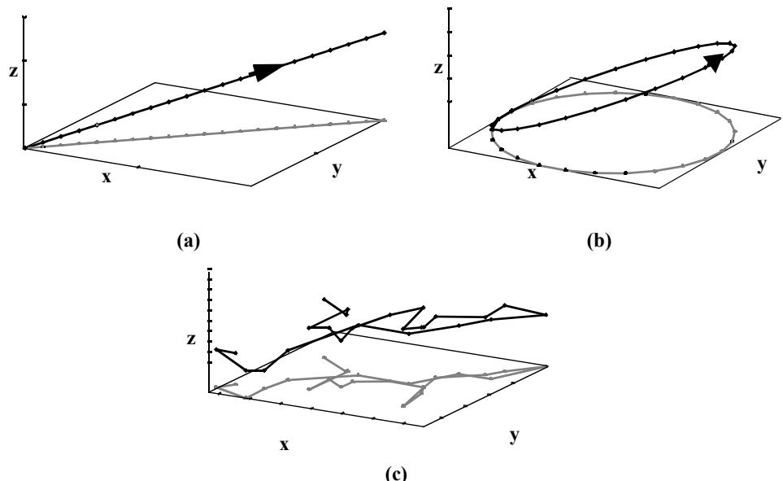
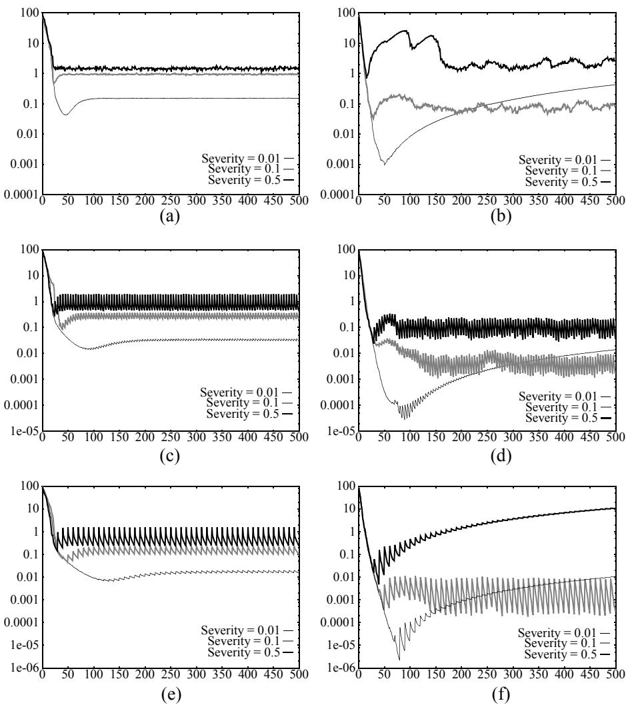
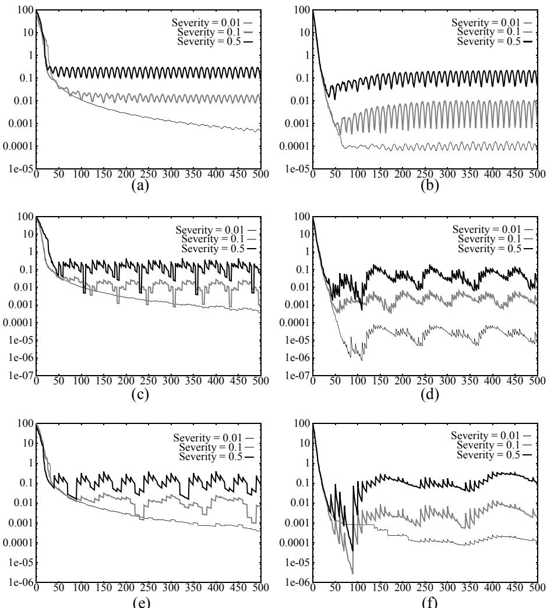
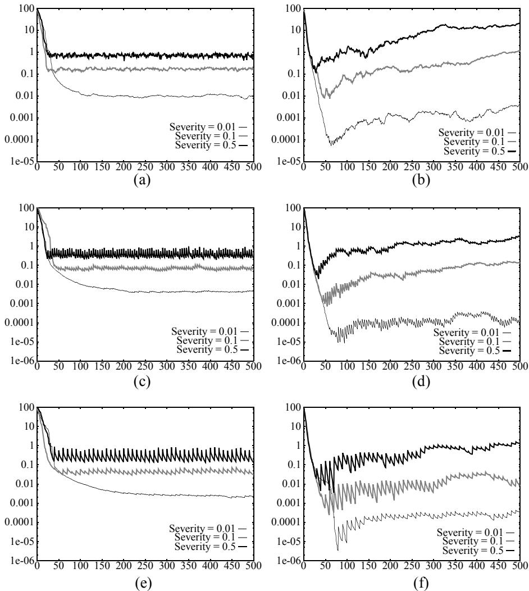

# Tracking Extrema in Dynamic Environments

# Peter J. Angeline

Loral Federal Systems 1801 State Route 17C Owego, NY 13823 peter.angeline@lmco.com

# ABSTRACT

Abstract. Typical applications of evolutionary optimization involve the off-line approximation of extrema of static multi-modal functions. Methods which use a variety of techniques to self-adapt mutation parameters have been shown to be more successful than methods which do not use self-adaptation. For dynamic functions, the interest is not to obtain the extrema but to follow it as closely as possible. This paper compares the on-line extrema tracking performance of an evolutionary program without self-adaptation against an evolutionary program using a self-adaptive Gaussian update rule over a number of dynamics applied to a simple static function. The experiments demonstrate that for some dynamic functions, self-adaptation is effective while for others it is detrimental.

# 1 Introduction

Self-adaptive evolutionary computations, methods that evolve mutation parameters for each population member along with the solution vector, have been shown to be exceptional function optimizers for many difficult static functions ([9]; [4]; and others). These methods work by evolving separate mutation variances for each dimension of an individual. The mutation variances, when correctly acquired, serve to direct the creation of the individual’s offspring along the gradient of the local fitness landscape. In essence, the evolving variance parameters in an individual dynamically acquire gradient information for the fitness function at the point of the search space represented by the individual’s solution vector.

When the function being optimized is dynamic, then the goal is not to acquire the extrema but to track their progression through the space as closely as possible. One method for achieving this is to evolve a function off-line that models the dynamics of the environment directly ([9]) while another is to use the dynamics of the evolutionary process itself on-line to track the progression of the extrema. Evolving a function that describes extrema dynamics is preferable when the dynamics can be modeled accurately off-line. When a single function cannot describe the dynamic accurately enough, an on-line approach using the dynamics of the evolutionary computation is preferable. While self-adaptive methods that evolve mutation variances perform well in static environments, it is not clear that these same methods are beneficial when the gradient at each point is constantly in flux as in most dynamic environments.

This paper reports results of experiments that test the performance of evolutionary programs in dynamic environments. The primary goal is to determine if a self-adaptive evolutionary program that evolves mutation variances can perform in dynamic environments. The secondary goal is to demonstrate the ability of evolutionary programs to perform as on-line extrema tracking methods. A number of non-trivial dynamic functions are defined by applying different temporal dynamics to a simple static base function. The results show that the mutation variance settings dynamically acquired by the self-adaptive method can occasionally inhibit its ability to closely track moving extrema. This paper begins with a review of adaptive and self-adaptive evolutionary computations and the potential effects of dynamic environments on methods that evolve mutation variances. This is followed by a description of the evolutionary optimization methods and dynamic environments investigated and the experimental results. The paper ends with conclusions and suggestions for future work.

# 2 Background

[1] categorizes adaptive evolutionary optimizations using two distinct dimensions. The first dimension asks at what level the adaptive parameters are associated with the evolutionary computation. Population-level adaptive parameters are adaptive parameters that affect the entire population, for instance the rate of crossover or mutation performed on the evolving population. Individual-level adaptive parameters are associated with each individual in the population and determine which component in the individual is to be manipulated. Component-level adaptive parameters are also associated with individuals but determine instead the severity of manipulating a particular component in the individual.

The second dimension used to categorize adaptive evolutionary computations in [1] is the method’s adaptive parameter update rule. Update rules are applied to the adaptive parameters in order to modify their values over time to more accurately reflect the optimal parameter settings given the current environment. There are essentially two forms of update rules currently in use. Absolute update rules are statistical measures or similarly induced heuristics that are determined prior to a run and dictate in an absolute manner how the adaptive parameters change over time. Empirical update rules are a distinct type of update rule that uses the dynamics of the evolutionary process to determine the appropriate values for the adaptive parameters. Empirical update rules are typically more reactive to the idiosyncrasies of the landscape being traversed. Evolutionary computations that use empirical update rules are usually called self-adaptive.

When performing function optimization on real-valued functions, evolutionary programming ([4]) represents a candidate point in the space with a fixed length real-valued vector of the same dimension as the function being optimized. To create offspring, [4] uses a Gaussian mutation to manipulate an individual’s components as follows:

$$
x _ { i } ^ { \prime } = x _ { i } + \sigma _ { i } \mathrm { N } \left( 0 , 1 \right)
$$

where $\boldsymbol { x } _ { i }$ is the ith component of the individual, $\textrm { N } ( 0 , 1 )$ is a Gaussian random variable with mean zero and variance 1 and $\mathbb { \Sigma } _ { i } ^ { \sigma _ {  } }$ is the standard deviation of the Gaussian noise added to the component being modified. Rather than set the standard deviations for the mutation noise individually, [4] associates $n$ component-level adaptive parameters with each individual in the population and co-evolves the associated variances for an individual’s components along with the individual. To modify the variances, [4] uses a Gaussian update rule similar to the Gaussian mutation above:

$$
{ \boldsymbol { \sigma } _ { i } } ^ { \prime } = { \boldsymbol { \sigma } _ { i } } + { \boldsymbol { \alpha } } \cdot { \boldsymbol { \sigma } _ { i } } \cdot \mathrm { N } \left( 0 , 1 \right)
$$

where $\mathbb { \sigma } _ { i }$ is the self-adaptive parameter being updated and $\alpha$ is a scaling factor. When the application of Equation 2 results in a negative parameter value, the parameter is set to an arbitrary small value greater than 0.

The mutation variances typically evolved with the solution vector in self-adaptive EP methods have been shown to be very effective when optimizing stationary functions off-line. In these methods, the variance information can restrict the reproduction of offspring to lie on the gradient passing through the parent’s position.

When tracking a dynamic function’s extrema on-line, the gradient information acquired by self-adaptive methods, such as that of Equation 2, may become obsolete or even detrimental once the extrema moves. Even in simple dynamic functions, the gradient may be continuously changing at every point in the space placing doubt on the usefulness of evolved variances. In some cases the outdated gradient information encoded as mutation variances may actually be a liability, continuously steering the generation of offspring in directions orthogonal to the progression of extrema.

[6] and [2] demonstrate that it is possible for self-adaptive methods to acquire useful mutation information in some very simple discrete dynamic environments. These studies evolved finite state automata (FSA) that self-adapted mutation probabilities along with each component of the FSA representation. Both environments tested were language prediction tasks where the evolving FSAs were asked to predict the next symbol from the environment string given the sequence preceding it. Each environment used a base string that was extended by a single symbol every five generations. For instance, in one experiment the environment string was $( 1 0 1 1 1 0 0 1 1 1 0 1 ) ^ { * }$ and the machines were asked to predict an increasing number of symbols from this string starting at ten symbols on the first generation and rising up to 160 symbols by the end of the run. Consequently, the change in the environment was relatively small; one additional character every five generations. [6] demonstrated that two alternate forms of self-adaptation applied to FSAs performed better than without any self-adaptation while [2] showed that both the Gaussian update rule of Equation 2 and the lognormal rule generally used in evolution strategies ([3]; [9]) supplied an advantage over no selfadaptive update rule or a random update rule.

# 3 Experimental Setup

The study performed in this paper compares the ability of an evolutionary program that does not evolve mutation variance parameters to one that does over a number of simple but non-trivial dynamic environments. The dynamic functions defined below were designed specifically to test various potential situations that could compromise a selfadaptive method when the function is non-stationary. Specifically, the dynamic functions were created to vary the gradient information at every point in the space in different ways to determine if the self-adaptive method could adjust its parameters appropriately. This section begins by defining the evolutionary programs tested followed by the dynamic environments used for the experiments.

# 3.1 Evolutionary Programs Tested

In the experiments that follow, two evolutionary programs were compared. Both used identical algorithms and were executed with identical parameters. The sole difference between the two was the computation of the variance applied to the mutation of parents to create offspring. The first evolutionary program uses a self-adaptive update rule that employs evolved variance parameters while the other uses an adaptive technique based on fitness. The self-adaptive evolutionary program used the Gaussian update rule given in Equation 2 with $\alpha = 0 . 3$ , a value experimentally determined in [8] to give good results across a broad range of functions.

The adaptive evolutionary program used in the experiments created offspring using the equation defined for mutating parents from [4, p. 136], given as:

$$
{ x _ { i } } ^ { \prime } = { x _ { i } } + ( \beta \nu ( x ) + z ) \mathrm { N } \left( 0 , 1 \right)
$$

where $\nu ( x )$ is the fitness of the population member $x , \ \beta$ is a scaling factor and $z$ is a minimum variation applied to create offspring. In the experiments below, $z = 0$ and

$$
\beta = \frac { 1 } { d ^ { 2 } }
$$

where $d$ is the dimension of the function being optimized. Note that this is an individual-level adaptive method given the variance of the mutation performed on the whole individual, described by Equation 3, is dependent on the fitness of the individual. This function encodes a heuristic that reduces the amount of variance applied to produce offspring as the extremum is approached.1

# 3.2 Dynamic Environments

In order to compare the relative abilities of the two described evolutionary programs for on-line tracking of dynamic extrema, a number of dynamical environments were created from a simple static convex function, referred to as the base function below. Dynamic environments were obtained by translating the base function along a number of distinct temporal trajectories. This setup allows complete control of the dynamics and generates simple yet non-trivial dynamic functions with know properties.

The base function used here is the parabolic equation for three dimensions:

$$
f ( x , y , z ) = x ^ { 2 } + y ^ { 2 } + z ^ { 2 }
$$

which has its minima at (0,0,0). This function has been investigated in a number of studies involving adaptive and self-adaptive evolutionary optimization ([9]; [4]; [10]; and many others) and also has been used to derive theoretical results for evolutionary computations ([9]).

The temporal dynamics applied to the base function involve three distinct parameters: dynamic type; step size; and update frequency. Dynamic type identifies one of three distinct parameterized methods for translating the base function. Severity is a parameter used as input to each of the dynamics to determine the amount the base function is displacement from its current position. Update frequency determines the number of generations between each movement of the base function. Translation of the base function was implemented as an offset in each dimension from (0,0,0).

  
Figure 1: Example dynamics used for the trajectory of the base function over time in this study along with their projection onto the $\mathbf { \Phi } ( \mathbf { x } , \mathbf { y } )$ -plane (grey). (a) Linear dynamic given by Equation 6; (b) Circular dynamic given by Equation 7; (c) Example random dynamic using Gaussian noise given by Equation 8.

Three different dynamic types were investigated in the experiments below: linear; circular; and random. Given a severity of $s$ , the linear dynamic updates the current offset for dimension $k _ { * }$ , denoted as $\Delta _ { k }$ , as follows:

$$
\Delta _ { k } ^ { \prime } = \Delta _ { k } + s
$$

which simply adds a constant displacement to the offset in each dimension equivalent to the severity parameter’s setting. A schematic of the linear dynamic is shown in Figure 1a. For this dynamic, the initial displacement is set to $( 0 , 0 , 0 )$ .

The circular dynamic was computed as follows:

$$
\begin{array} { l l l } { { \Delta _ { k } ^ { ^ { \prime } } = \Delta _ { k } + s { \sin } { \frac { 2 \pi t } { 2 5 } } } } & { { \qquad } } & { { k = 1 , 3 } } \\ { { } } & { { } } & { { } } \\ { { \Delta _ { k } ^ { ^ { \prime } } = \Delta _ { k } + s { \cos } { \frac { 2 \pi t } { 2 5 } } } } & { { \qquad } } & { { k = 2 } } \end{array}
$$

where $t$ is the number of applications of the dynamic thus far. Equation 3 describes a trajectory that translates the base function in a circular path through all three dimensions. The equation is designed to cycle the values of the offset every 25 applications with the severity parameter determining the radius of the circular path. A schematic of this dynamic is shown in Figure 1b. For the circular dynamic, the initial displacement is set to $( 0 , \mathsf { s } , 0 )$ .

For the random dynamic, random noise is added to the offset as follows:

$$
{ \Delta _ { k } } ^ { \prime } = { \Delta _ { k } } + s \mathrm { N } ( 0 , 1 )
$$

where N(0,1) is a Gaussian random variable with mean 0 and variance 1. Here, the severity parameter determines the variance of the noise added to the base function offset. Figure 1c shows an example of a random trajectory generated by this dynamic. The initial displacement for runs using this dynamic is set to $( 0 , 0 , 0 )$ .

This collection of dynamics when used with the parabolic base function of Equation 5 has a number of nice features for testing the performance of self-adaptive evolutionary optimization. The linear dynamic will always move away from the position that the population is converging towards with the severity parameter determining how quickly it moves away. For a stationary point, the direction of the gradient will not change for points along the path of the trajectory but the magnitude will increase as the offset increases. For stationary points not along the linear dynamic’s trajectory the gradient’s magnitude will also steadily increase while its direction will change by smaller and smaller amounts proportional to the angle between the direction of the linear trajectory and a line extended between the stationary point and the minima. When the circular dynamic is used, it will complete a circuit every 25 generations returning the minima to its original position. For a stationary point in this environment both the magnitude and the direction of the gradient will constantly change, rising and falling in a regular pattern. The magnitude of the changes in the gradient is determined by the point’s distance from the center of the circular trajectory. When using the random dynamic the direction and magnitude of the gradient at a stationary point will constantly fluctuate randomly with the potential change in magnitude determined by the severity parameter and the distance of the point from the extrema. The values for the severity parameter used in the experiments below were 0.01, 0.1 and 0.5 for all dynamic types described above.

The update frequency parameter is used to vary the number of generations between updates of the offsets by the dynamic. In the experiments below, three different update frequencies are investigated: 1, 5 and 10 generations. When a small number of generations is used then the offsets are updated more frequently and the population has less time to adapt to the previous change before the next change occurs. A larger number of generations between updates allows the population to converge before the next change is made, allowing an individual’s offspring to oscillate around the extrema and which could significantly alter the self-adapted variance parameters.

# 3.3 Experimental Parameters

The parameters for all runs were as follows. The population size was 200 with half of the population reserved as parents for the next generation. All parents created a single offspring. The members of the initial population were restricted to be within the range (-50.0, 50.0) for all dimensions. A total of 54 experiments were run, one for each evolutionary program using each dynamic type at each severity setting for each of the three update frequencies. A total of 50 trials were made for each experiment with each run continuing through to generation 500 before being stopped.

# 4 Results and Discussion

The results for all experiments are shown in Figures 2-4. Each Figure shows the mean best-of-generation fitness $y$ -axis) over the 50 runs plotted against generation $x$ -axis). Each figure pairs plots of the adaptive EP on the left with the self-adaptive EP using the same parameter settings on the right. The $y$ -axis for each pair of plots is scaled identically to facilitate visual comparison. Each plot shows three graphs, one for each of the three severity levels tested. The setting of the update frequency parameter of a plot is determined by its vertical position in a figure with the number of generations between updates increasing from top to bottom. Plots at the top of each figure show results for updates every generation, middle plots show results for updates every 5 generations and bottom plots show results for updates every 10 generations.

Figure 2 shows the results for the experiments using the linear dynamic. The first feature to note is the regularity of the adaptive method over all values of the various parameters (all graphs in all plots on left side of Figure 2). For the runs using an update every generation (Figure 2a), the evolutionary program settles into a consistent tracking of the minima for all severity values. When the updates are made less frequently, then the method settles to an oscillatory tracking pattern, repeatedly approaching the minima until the dynamic is reapplied (Figures 2c and 2e). The plots on the right side of Figure 2 show the performance of the self-adaptive method to be less regular for this dynamic. When updates are performed every generation (Figure 2b), the method appears to have significant trouble early in the runs when the severity is large and steadily falls further behind the minima when severity is 0.01. For larger updates, more regular performance is seen (Figures 2d and 2f) but the self-adaptive method still has trouble tracking the minima for some parameter settings. When the self-adaptive method is able to track the minima it appears to track closer than the adaptive method.

Figure 3 shows the results for the experiments using the circular dynamic. Once again the adaptive method displays a more regular tracking pattern than the self-adaptive method although the tracking pattern becomes more complex as the number of generations between updates increases (Figures 3a, 3c, and 3e). The self-adaptive method displays a long term regular pattern at all severity values when updates are performed every generation (Figure 3b) but becomes more erratic as the number of generations between updates increases (Figures 3d and 3f). For all of the parameter settings using the circular dynamic the self-adaptive method appears to track the minima more closely on average.

Figure 4 shows the results of the experiments using the random dynamic. Once again the adaptive method produces a fairly regular tracking pattern over all parameter values (Figures 4a, 4c, and 4e) showing an ability to move back towards the optima quickly when several generations pass before the dynamic is reapplied (Figures 4c and 4e). Performance for the self-adaptive method is again more erratic. With an update every generation (Figure 4b), this method performs very well early in the run but allows an increasing amount of distance to the optima to build up over time until by the end of the run it is performing worse than the adaptive method for severity settings 0.1 and 0.5. Visual continuation of the curves suggest that in time the same may be true for a severity of 0.01 as well. When updates are performed less frequently (Figures 4d and 4f) the self-adaptive method looses ground more slowly, occasionally staying significantly closer to the minima than the adaptive method throughout the run. In general, when the variance of the random update is large, the self-adaptive method appears to perform worse than the adaptive method.

  
Figure 2: Results for the various experiments using the linear dynamic. Plots are horizontally paired with all results for the self-adaptive method on the right. The yaxis (fitness) is consistent between horizontal pairs to aid visual comparison. The xaxis in all plots is generations. Each plot shows three graphs, one for each severity setting. (a) adaptive, update $\mathbf { \Lambda } = \mathbf { 1 }$ ; (b) self-adaptive, update $\mathbf { \Lambda } = \mathbf { 1 }$ ; (c) adaptive, update=5; (d) self-adaptive, update $\mathtt { = 5 }$ ; (e) adaptive, updat $\mathbf { \tau = 1 0 }$ ; (f) self-adaptive, update $\mathbf { \tau = 1 0 }$ .

  
Figure 3: Results for the various experiments using the circular dynamic. Plots are horizontally paired with all results for the self-adaptive method on the right. The yaxis (fitness) is consistent between horizontal pairs to aid visual comparison. The xaxis in all plots is generations. Each plot shows three graphs, one for each severity setting. (a) adaptive, update $\mathbf { \delta } = \mathbf { 1 }$ ; (b) self-adaptive, update $\mathbf { \Lambda } = \mathbf { 1 }$ ; (c) adaptive, update $\mathbf { = } \mathbf { 5 }$ ; (d) self-adaptive, update $\mathtt { = 5 }$ ; (e) adaptive, update $\mathbf { \tau = 1 0 }$ ; (f) self-adaptive, update $\mathbf { \tau = 1 0 }$ .

# 5 Conclusions

In general, the adaptive method using the fitness information to determine mutation variance was able to track the progression of the extrema reasonably smoothly for all problems at all parameter settings. In many cases, the self-adaptive method initially moves very close to the extrema at the beginning of a run only to allow the distance to the minima to steadily increase over time. While the self-adaptive method was able to track the minima much more closely for some problems, its performance was typically erratic. It appears that for many of the dynamic environments investigated evolving mutation variances along with the solution vector can impeded this method’s ability to accurately track extrema and the more simple adaptive method should generally be preferred for on-line extrema tracking. The chaotic nature of self-adaptive technique displayed in many of the above graphs the suggest that this technique is in general not well suited to these tasks.

  
Figure 4: Results for the various experiments using the random dynamic. Plots are horizontally paired with all results for the self-adaptive method on the right. The yaxis (fitness) is consistent between horizontal pairs to aid visual comparison. The $\mathbf { X } \cdot$ - axis in all plots is generations. Each plot shows three graphs, one for each severity setting. (a) adaptive, update $\mathbf { \Lambda } = \mathbf { 1 }$ ; (b) self-adaptive, update $\mathbf { \Lambda } = \mathbf { 1 }$ ; (c) adaptive, update $\mathtt { = 5 }$ ; (d) self-adaptive, update $\mathtt { = 5 }$ ; (e) adaptive, update $\mathbf { \omega = 1 0 }$ ; (f) self-adaptive, update $\mathbf { \tau = 1 0 }$ .

This study was intended to demonstrate the applicability of evolutionary programming as an on-line dynamic method while investigating the ability of a standard selfadaptive technique in dynamic environments. For the simple dynamic environments tested, these experiments show that it is feasible to use the dynamics inherent in an evolutionary program to smoothly track extrema through time. The single selection and variation process employed by these algorithms shows an ability to reasonably track distinct categories of dynamics on-line including those employing random variation. Additional work should include more complicated dynamics in order to determine the limits of evolutionary programs as on-line tracking methods. In addition, formal comparisons between on-line evolutionary programs and other on-line techniques are required to gauge the effectiveness and feasibility of this technique in actual problems.

# 6 References

1. Angeline, P. J. (1995). Adaptive and Self-Adaptive Evolutionary Computations. In Computational Intelligence: A Dynamic System Perspective, M. Palaniswami, Y. Attikiouzel, R. Marks, D. Fogel and T. Fukuda (eds.), Piscataway, NJ: IEEE Press, pp. 152-163.   
2. Angeline, P. J., Fogel, D. B. and Fogel, L. J (1996). A Comparison of Self-Adaptive Update Rules for Finite State Machines in Dynamic Environments. In Evolutionary Programming V: Proceedings of the Fifth Annual Conference on Evolutionary Programming, L. Fogel, P. Angeline and T. Bäck (eds.). Cambridge, MA: MIT Press, pp. 441-450.   
3. Bäck, T. and Schwefel, H.-P. (1993). An Overview of Evolutionary Algorithms for Parameter Optimization, Evolutionary Computation, 1 (1), pp. 1-24.   
4. Fogel, D.B. (1995). Evolutionary Computation: Toward a New Philosophy of Machine Intelligence, Piscataway, NJ: IEEE Press.   
5. Fogel, D.B., Fogel, L.J. and Atmar, J.W. (1991). Meta-Evolutionary Programming. Proc. of the 25th Asilomar Conference on Signals, Systems and Computers, R.R. Chen (ed.), San Jose, CA: Maple Press, pp. 540-545.   
6. Fogel, L.J., Owens, A.J. and Walsh, M.J. (1966). Artificial Intelligence through Simulated Evolution, New York: John Wiley & Sons.   
7. Fogel, L.J., Angeline, P.J. and Fogel, D.B. (1995). An Evolutionary Programming Approach to Self-Adaptation on Finite State Machines. In Evolutionary Programming IV: Proceedings of the Fourth Annual Conference on Evolutionary Programming. J. McDonnell, R. Reynolds, and D. Fogel (eds), Cambridge, MA: MIT Press, pp. 355-366.   
8. Saravanan, N., Fogel, D. B. and Nelson, K. M. (1995) A Comparison of Methods for Self-Adaptation in Evolutionary Algorithms. BioSystems, 36, pp. 157-166.   
9. Schwefel, H.-P. (1995). Evolution and Optimum Seeking. New York: John Wiley & Sons.   
10. Yao, X. and Liu, Y. (1996). Fast Evolutionary Programming, In Evolutionary Programming V: Proceedings of the Fifth Annual Conference on Evolutionary Programming, L. Fogel, P. Angeline and T. Bäck (eds.). Cambridge, MA: MIT Press, pp. 451-460.