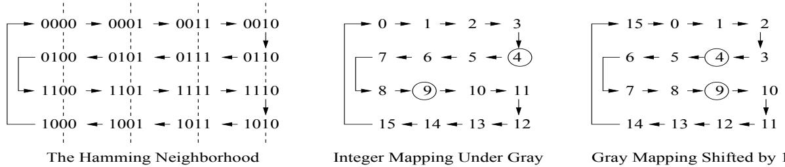
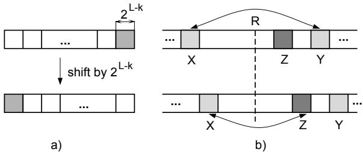

# Dynamic Representations and Escaping Local Optima: Improving Genetic Algorithms and Local Search

Laura Barbulescu, Jean-Paul Watson, and L. Darrell Whitley

Computer Science Department Colorado State University Fort Collins, CO 80523 e-mail: laura,watsonj,whitley @cs.colostate.edu

# Abstract

Local search algorithms often get trapped in local optima. Algorithms such as tabu search and simulated annealing ’escape’ local optima by accepting nonimproving moves. Another possibility is to dynamically change between representations; a local optimum under one representation may not be a local optimum under another. Shifting is a mechanism which dynamically switches between Gray code representations in order to escape local optima. Gray codes are widely used in conjunction with genetic algorithms and bit-climbing algorithms for parameter optimization problems. We present new theoretical results that substantially improve our understanding of the shifting mechanism, on the number of Gray codes accessible via shifting, and on how neighborhood structure changes during shifting. We show that shifting can significantly improve the performance of a simple hill-climber; it can also help to improve one of the best genetic algorithms currently available.

# Introduction

Given a representation and a neighborhood operator, local search methods (Aarts & Lenstra 1997) proceed by gradual manipulation of some initial solution. Because of its myopic nature, local search can become trapped in local optima. Methods such as simulated annealing and tabu search attempt to ’escape’ by accepting non-improving or inferior neighbors, with the goal of moving out of the local optimum’s basin of attraction. Local optima are induced by the selected representation and neighborhood operator; a local optimum under one representation may not be a local optimum under another representation. Thus, dynamic representations are a potentially important, although relatively unexplored, class of escape mechanism.

We focus on parameter optimization. Functions are discretized so that search proceeds in a bit space, with $L$ -bit Gray or Binary encoded function inputs; this is common with Genetic Algorithms (GAs). Empirically, Gray encodings usually perform better than Binary encodings for many real-world functions (Caruana & Schaffer 1988). Gray codes preserve the neighborhood structure of the discretized realvalued search space (Whitley et al. 1996). As a result, a

Gray code can induce no more optima than exist in the original function. Further, because there are more neighbors under the Gray code $\mathit { l }$ bits for each dimension) than in the discretized real-valued function (2 for each dimension), there are usually significantly fewer optima in the Gray code’s search space. In contrast, Binary codes often create new optima where none existed in the original function. Finally, many distinct Gray codes exist, each inducing a different neighborhood structure, and potentially different local optima.

These properties motivated (Rana & Whitley 1997) to introduce shifting as a mechanism for changing between a restricted set of Gray codes in an effort to escape local optima. A simple hill-climbing algorithm and a state-of-the-art GA were augmented with the shifting mechanism, and evaluated using test functions empirically proven to be both resistant to simple hill-climbing algorithms, and still pose a challenge to GAs.

We establish a new bound on the number of unique Gray codes accessible via shifting. This allows us to focus on a significantly smaller set of representations. We demonstrate that similar Gray codes induce similar search spaces; to escape optima, one must consider dissimilar Gray codes. We use these results to improve the performance of a hillclimbing algorithm, to the point where it is competitive with a state-of-the-art GA.

# On Dynamic Representations

For any function, there are multiple representations which make optimization trivial (Liepins & Vose 1990). However, the space of all possible representations is a larger search space than the search space of the function being optimizing. Furthermore, randomly switching between representations is doomed to failure. Suppose we have $N$ unique points in our search space and a neighborhood operator which explores $k$ points before selecting a move. A point is considered a local optimum from a steepest-ascent perspective if its evaluation is better than each of its $k$ neighbors. We can sort the $N$ points in the search space to create a ranking, $R = r _ { 1 } , r _ { 2 } , . . . , r _ { N } ,$ in terms of their function evaluation (where $r _ { 1 }$ is the best point in the space and $r _ { N }$ is the worst point in the space). Using this ranking, we can compute the probability that a point ranked in the $_ { i }$ -th position in $R$ is a local optimum under an arbitrary representation of the search

space:

$$
\begin{array} { r l } { P ( i ) = \frac { \binom { N - i } { k } } { \binom { N - 1 } { k } } } & { { } [ 1 \leq i \leq ( N - k ) ] } \end{array}
$$

Using this result, one can prove that the expected number of local optima under all possible representations for a search pace with is given eckendor $N$ od operator of size(Whitley, Rana, & $k$ $\bar { \sum _ { i = 1 } ^ { N - k } { P ( i ) } } \overset { \cdot } { = } N \bar { / ( k + 1 ) }$

These equations make it clear that highly ranked points in the search space are local optima under almost all representations. To exploit dynamic representations we cannot randomly change representations. So how do we proceed? First, we assume that most real-world optimization problems have a complexity which is less than that expected from random functions. Two measures of this complexity are: smoothness and number of local optima. We have shown empirically that many test functions and real-world problems tend to be relatively smooth compared to random functions, and that the number of induced local optima are fewer than the expected number of local optima associated with random functions (Rana & Whitley 1997).

It follows that one should use a form of dynamic representation that respects and preserves smoothness and which bounds the number of local optima that can result while changing problem representation. Dynamic Gray codes have these desirable properties.

# Gray Codes and Shifting

A Gray code is any integer bit encoding such that adjacent integers are Hamming distance-1 apart. The standard reflected Gray encoding of an integer is constructed by applying the exclusive-or operator to a) the standard Binary encoding of the integer and b) the same Binary encoding, shifted one position to the right; the last bit is then truncated. Gray encoding and decoding can be concisely expressed through matrix operations. Let $x$ and $y$ be L-bit Binary-encoded and Gray-encoded integers, respectively, and let $G$ be a transform matrix containing 1’s on both the diagonal and upper minor diagonal and 0’s elsewhere. The Gray encoding and decoding processes are then simply given by $x ^ { T } G$ and $y ^ { T } G ^ { - 1 }$ , respectively.

It can be shown that every permutation of the columns of the $G$ matrix results in another Gray code transform matrix. Note that we can also treat the sequence of integers as a circular chain. Shifting the chain also results in a Gray code. In practice, one can 1) de-Gray a bit string, 2) treat the resulting string as a Binary coded integer and 3) add a constant offset (i.e., a shift) to the integer, mod $2 ^ { L }$ (Rana & Whitley 1997).

There are $2 ^ { L }$ possible shifting values, and $L !$ permutations over the columns of the Gray transformation matrix. In this paper we prove that all of the $L !$ permutations of the $G$ matrix result in identical Hamming-1 neighborhoods, and only $2 ^ { L } / 4$ of the possible $2 ^ { L }$ shifts actually change the Hamming1 neighborhood.

Given a discretized real-valued function, the number of optima in any Gray encoding under a Hamming-1 neighborhood operator, is less than or equal to the number of optima in the original function. Furthermore, the surface of the original function is a subset of the set of paths induced by the Gray encoding; hence the surface of the original function is preserved and enhanced with greater connectivity by the Gray code (Rana & Whitley 1997). In contrast, the standard Binary coding actually increases the number of optima for many test functions (Whitley 1999). This is consistent with the fact that, in practice, search algorithms appear to work better under Gray than Binary encodings.

We now better understand why shifting works. Reflected Gray codes form a circuit. This circuit represents the inputs to a real-valued function. In a Gray coded string of length $L$ , there are $L$ folds, or reflections. As the circuit is shifted, points pass by other points in different reflections. This can be seen in Figure 1 for $L = 4$ . The 4 neighbors are NorthSouth-East-West and the graph is a torus. At the order-3 reflection, strings differ only in the 3rd bit; this connects the North-South neighbors in rows 1 and 2, as well as rows 3 and 4. The directional arrows show that these points move in opposite directions when shifting occurs, and hence neighbors flow past each other. The order-4 reflection (where the 4th bit differs) are the North-South connections between rows 2 and 3, as well as the toroidal North-South wrap around between rows 1 and 4. When two local optima “pass” one another in the shifted Gray encoding, one of the two optima must collapse. For example, in Figure 1 positions 4 and 9 are not neighbors in the normal integer mapping induced under standard Gray code. However, when the integer space is shifted by 1, positions 4 and 9 become neighbors. If there are local optima at positions 4 an 9, one of these optima must collapse when the search space is shifted.

We first prove that all permutations of the columns of the Gray transform matrix $G$ yields a transform matrix that induces an identical neighborhood structure.

Theorem 1 Let $G$ be the $L$ -bit standard reflective Gray transform matrix, and construct $G ^ { \pi }$ by applying a permutation $\pi$ to the columns of $\mathbf { \Delta } _ { G }$ . Let $x$ be some integer, and let $x _ { G }$ and $x _ { G } \pi$ be the set of $L$ neighboring integers under $G$ and $G ^ { \pi }$ , respectively. Then $x _ { G } = x _ { G } \pi$ .

Proof: The columns of $G$ and $G ^ { \pi }$ independently produce a single bit of $x _ { G }$ and $x _ { G } \pi$ , respectively; viewing $\pi$ as a permutation of the bits of $x _ { G }$ or the columns of $G$ is equivalent. Permuting the bits of each element of $x _ { G }$ does not change the Hamming distance between any element in the set and $x$ , so the Hamming distance-1 neighbors of $x$ under both $G$ and $G ^ { \pi }$ are invariant. 

Next, we show that for any given transform matrix $G$ , only $2 ^ { { \scriptstyle { \dot { L } } - 2 } }$ shifts result in distinct neighborhood structures. First, note that a reflected Gray code is a symmetric reflection. If we flip the leading bit of each string, the Hamming neighborhood does not change. This is exactly what happens when one shifts by $2 ^ { L - 1 }$ . It follows that every shift from $\textit { i } = \textit { 0 }$ to $2 ^ { L - 1 } - 1$ is identical to the corresponding shift at $j = 2 ^ { L - 1 } + i$ . As will be shown, shifting by $2 ^ { { \scriptstyle { \cal { L } } } - 2 }$ also will not change the neighborhood structure, and in general, shifting by $2 ^ { L - k }$ will result in a change of exactly $k - 2$ neighbors. This can be seen by studying Figure 1: a shift of $2 ^ { 4 - 2 } = 4$ (or any multiple of 4) leaves the neighborhood structure unchanged. For numbers that are powers of 2, smaller shifts change more neighbors. Note that a shift of 1 implies $1 = 2 ^ { 0 } = 2 ^ { L - L }$ , which changes L-2 neighbors. This is the largest number of neighbors which can change in a Gray code. Numbers that are not powers of 2 can be viewed as a combination of large and small shifts.

  
Figure 1: A simple example of shifting. Note that integers are associated with the corresponding positions in the Hamming Neighborhood. Neighbors are N-S-E-W and the arrows map the surface of the real-valued function.

Theorem 2 For any Gray encoding, shifting by $2 ^ { L - k }$ where $k \geq 2$ will result in a change of exactly $k - 2$ neighbors for any point in the search space.

Proof: Consider an arbitrary Gray coding, and $k \geq 2$ . Next, divide the $2 ^ { L }$ positions into $2 ^ { \bar { k } }$ continuous blocks of equal size, starting from position 0. Each block contains exactly $2 ^ { L - k }$ positions (see Figure 2a). Consider an arbitrary block $X$ and arbitrary position $P$ within $X$ . Exactly $L - k$ neighbors of $P$ are contained in $X$ . The periodicity of both Binary and Gray bit encodings ensures that the $L - k$ neighbors of $P$ in $X$ do not change when shifting by $2 ^ { L - k }$ . Two of the remaining $k$ neighbors are contained in the blocks preceding and following $X$ , respectively. Since the adjacency between blocks does not change under shifting, the two neighbors in the adjacent blocks must stay the same.

The remaining $k { - } 2$ neighbors are contained in blocks that are not adjacent to $X$ . We prove that the rest of these $k - 2$ neighbors change. Consider a block $Y$ that contains a neighbor of $P$ . A fundamental property of a Reflected Gray code is that there is a reflection point exactly halfway between any pair of neighbors. For all neighbors outside of block $X$ and which are not contained in the adjacent blocks, the reflection points must be separated by more than $2 ^ { L - k }$ positions. Shifting $X$ by $2 ^ { L - k }$ will move it closer to the Reflection point, while $Y$ is moved exactly $2 ^ { L - k }$ positions farther away from the reflection point (see Figure 2b). Point $P$ in $X$ must now have a new neighbor (also $\sum ^ { L - k }$ closer to the reflection point) in the block $Z$ . If the reflection point between $X$ and $Z$ is at location $R$ , then for the previous neighbor in $Y$ to still be a neighbor of $P$ in $X$ it must have a reflection point at exactly $R \overset { \smile } { + } 2 ^ { L - k }$ . This is impossible since for all neighbors outside of block $X$ which are not contained in the adjacent blocks, the reflection points must be separated by more than $2 ^ { L - \acute { k } }$ positions. A similar argument goes for the case when shifting by $2 ^ { L - k }$ moves $X$ farther away from the reflection point (while $Y$ is moved closer). Thus, none of the previous $k - 2$ neighbors are neighbors after shifting by $2 ^ { L - { \bf \hat { k } } }$ . 

To better understand how various shifts affect the neighborhood structure, we consider a 1-dimensional version of Rastrigin’s function (described in the experimental section). In Table 1, we list all the function optima under the standard Reflective Gray Code, with $L = 1 0$ . For each optimum, each shift which collapses the optimum is recorded. Clearly, worse optima are collapsible by a larger number of shifts (minimization of $F ( X )$ is the objective), simply because a large fraction of the domain $( X )$ has a better evaluation. However, the ’bands’ of collapsing shift values were unexpected; similar shifts result in similar neighborhood structures. Next, we formalize this observation by characterizing the difference between neighbors under adjacent shift values; the proof is somewhat lengthy, and is documented in (Barbulescu 2000).

  
Figure 2: Shifting by $2 ^ { L - k }$ . a). An unwound representation of the Gray codes circuit. b). For an arbitrary position in a block $X$ , and an arbitrary neighbor of this position in the block $Y$ , after shifting by $2 ^ { L - \widetilde { k } }$ , the neighbor moves from block $Y$ to block $Z$ .

Theorem 3 For any Gray code, consider two alternative shifts, i and $i + 1$ $\dot { ( 0 } \leq \dot { i } \leq 2 ^ { L } - 2 )$ . Consider an integer point p in the search space such that its position is not a multiple of 8 after shifting by $i + 1$ . Then, $L - 3$ neighbors of p under the shift $i + 1$ are obtained by subtracting 2 from the neighbors under shift i.

Table 1: Enumeration of shifts which collapse the optima of the 1-D Rastrigin’s function   

<table><tr><td rowspan=1 colspan=1>X</td><td rowspan=1 colspan=1>F(X)</td><td rowspan=1 colspan=1>Collapsing Shifts</td></tr><tr><td rowspan=1 colspan=1>-2.0</td><td rowspan=1 colspan=1>3.9768</td><td rowspan=1 colspan=1>22-49,102-113, 150-177, 201-212, 230-241</td></tr><tr><td rowspan=1 colspan=1>-1.0</td><td rowspan=1 colspan=1>0.9983</td><td rowspan=1 colspan=1>12-18,76-82, 140-146, 204-210</td></tr><tr><td rowspan=1 colspan=1>0.0</td><td rowspan=1 colspan=1>0.0</td><td rowspan=1 colspan=1>None</td></tr><tr><td rowspan=1 colspan=1>-1.0</td><td rowspan=1 colspan=1>0.9983</td><td rowspan=1 colspan=1>47-53,111-117, 175-181, 239-245</td></tr><tr><td rowspan=1 colspan=1>-2.0</td><td rowspan=1 colspan=1>3.9768</td><td rowspan=1 colspan=1>16-27, 45-56, 80-107, 144-155, 208-235</td></tr></table>

Theorems 1 and 2 might suggest that only small shifts are needed, since small shifts can change a large number of neighbors. Theorem 3 proves that small shifts result in new neighbors that are near to the old neighbors. Empirically, we have found uniform sampling is the best a-priori mechanism for selecting ’good’ shifting values. Intensive sampling from the set of shift values can collapse inferior local optima (more sampling increases the probability of collapsing optima). However, not all local optima are collapsible under shifting. The result is formalized in Theorem 4, below.

Theorem 4 Given an arbitrary Gray code $G$ , let $X$ and $Y$ be two distinct integers with encodings under $G$ given by $X _ { G }$ and $Y _ { G }$ , respectively. Further assume that both $X$ and $Y$ are optima of a function $F$ . If parity $( X _ { G } ) = p a r i t y ( Y _ { G } )$ then no shift exists which allows hammingDistanc ${ \mathcal { P } } ( x _ { G } , y _ { G } ) =$ 1.

Proof: If $X ~ \neq ~ Y$ , and parit $y ( X _ { G } ) ~ = ~ p a r i t y ( Y _ { G } ) .$ , then hammingDistance $( x _ { G } , y _ { G } )$ is clearly greater than 1. Select an arbitrary shift $T$ to produce a new Gray code $G ^ { ' }$ from $G _ { : }$ , resulting in $X _ { G } ^ { ' }$ and $Y _ { G } ^ { ' }$ . Application of $T$ produces identical changes in $p a r i t y ( X _ { G } ^ { ' } )$ and $p a r i t y ( Y _ { G } ^ { ' } )$ . Thus, $p a r i t y ( X _ { G } ^ { ' } ) = p a r i t y ( Y _ { G } ^ { ' } )$ , and $X \neq Y$ , implying hammingDistance $( X _ { G } ^ { ' } , Y _ { G } ^ { ' } ) \ge 2$ . 

Theorem 4 asserts that there may exist optima which cannot be ’collapsed’ by shifting. In the next section, we provide an example of such a function.

# Experiments

We investigate the utility of incorporating shifting into both a simple hill-climbing algorithm, RBC, and a state-of-theart genetic algorithm, CHC. Shift values are uniformly sampled from the set of unique shifts. We use the test functions described in (Whitley et al. 1996), shown in Table 2 (along with the associated variable domains). These test functions range from simple, separable functions which are easily solved by hill-climbers to more complex non-linear, non-separable functions.

RBC (Random Bit Climber) (Davis 1991) is a nextdescent hill-climbing algorithm. Search begins from a random bit string, and proceeds by testing each of the $L$ Hamming-1 neighbors in some randomized order. Both equal and improving moves are accepted. If the search is stuck in a local optimum, it is re-started from a new random bit string. Otherwise, a new random visitation sequence of the $L$ neighbors is generated.

Once a local optimum is detected by RBC, the representation can be shifted to try to escape the local optimum. Search then proceeds from the new bit-string until convergence is reestablished. We use two types of restarts: ’soft’ and ’hard’. The ’soft’ re-start merely changes the representation, without changing the current point in the search space. A ’hard’ re-start reinitializes search from a new random point in the search space. Depending on the experiment, we perform either 10 or 50 soft re-starts before each hard re-start.

The Hamming-1 neighborhood at the bit-string level translates into a neighborhood which is capable, in one step, of altering only a single parameter value. This restriction suggests that RBC should perform well on separable test functions, and perform worse on non-separable, non-linear test functions which may require simultaneous manipulation of multiple parameters to yield improvements in the evaluation function. These hypotheses are supported by our experimental results.

The CHC genetic algorithm (Eshelman 1991) maintains a parent population ofsize $\mu ( = 5 0$ in our experiments). CHC randomly pairs members of the parent population for reproduction. Once paired, reproduction is only permitted if the Hamming distance between the two parents is greater than some threshold value, resulting in a child population of size $\lambda$ . The HUX crossover operator is used which ensures that each child is of maximal Hamming distance from the parents. The $\mu$ best of the $\mu + \lambda$ individuals form the parent population for the next generation. CHC guarantees survival of the best $\mu$ individuals encountered during the search.

CHC also uses a re-start mechanism if the parent population remains unchanged for some number of generations. During a re-start, a population containing $\mu$ copies of the best individual is formed; all but one copy undergo extensive mutation ( $3 5 \%$ of the bits). Shifting can be applied each time CHC converges. The best individual is re-encoded using a new, randomly selected shift value.

# Methodology

We ran 30 trials of both RBC and CHC on each test function, allowing a maximum of 500K evaluations per run. With the exception of Powell’s function (whose dimension was fixed at 4), 10-dimensional versions of each test function were used, with each variable encoded using 10 bits except for Powell’s function, which used 20-bit encodings. For the Rana and Whitley functions, 10-dimension versions were constructed using the Weighted-Wrap expansion method, described in (Whitley et al. 1996). Two versions of CHC, both with and without shifting, were considered. We tested RBC without shifting, in addition to versions using both 10 and 50 soft re-starts between hard-restarts, denoted RBC-10 and RBC-50 respectively.

# Results and Discussion

The results for RBC and CHC are reported in Tables 3 and 4, respectively. The ’Number Solved’ column indicates the number of times the algorithm found the optimal solution, out ofthe 30 total trials. The statistics for both solution quality and number of evaluations are taken over all 30 trials. All statistical comparisons between algorithms are made using two-tailed t-tests (significance level $p < 0 . 0 1$ ).

For RBC (Table 3, RBC-10), shifting yields a statistically significant improvement in both solution quality and number of evaluations for the Rastrigin, Schwefel, and Whitley test functions; for Rana’s function, the improvement applies only to solution quality. For both the Powell and Griewangk test functions, no difference in either measure was observed. For CHC (Table 4), shifting fails to yield any significant differences in mean solution quality. However, shifting does significantly reduce the number of evaluations required for the Rastrigin, Griewangk, and Powell test functions. While substantially improving the performance of both RBC and CHC, significant performance differences between the algorithms still exist. Next, we increase the number ofsoft re-starts used with RBC (RBC-50), and compare the resulting performance with CHC.

Table 2: The test functions described in (Whitley et al. 1996).   

<table><tr><td rowspan=1 colspan=2>xi </td><td rowspan=1 colspan=1>−5.12, 5.11]</td><td></td></tr><tr><td rowspan=1 colspan=1>Rastrigin</td><td rowspan=1 colspan=3>F (xi|i=1,N) = (N * 10) + [∑ i−1(x2 − 10cos(2πxi)]</td></tr><tr><td rowspan=1 colspan=4>xi −512, 511]</td></tr><tr><td rowspan=1 colspan=1>Schwefel</td><td rowspan=1 colspan=3>F(xi|i=1,N)= ∑ i−1 −xisin(/xi)</td></tr><tr><td rowspan=1 colspan=1>Griewangk</td><td></td><td></td><td></td></tr><tr><td rowspan=1 colspan=1>Powell</td><td rowspan=1 colspan=3>F(x1, x2, x3, x4) = (x1 + 10x2)2 + (√5(x3 − x4))2 + (x2 − 2x3)2)2 + (√10(x1 − x4)2)2</td></tr><tr><td rowspan=1 colspan=1>Whitley</td><td rowspan=1 colspan=3>F(x,y) = −xin(/|x − ) − (y + 47)sin(√y + 47 + )</td></tr><tr><td rowspan=1 colspan=1>Rana</td><td rowspan=1 colspan=2>F (x, y) = xsin(√|y + 1 − x|)cos(√|x + y + 1|) + (y + 1)cos(√|y + 1 − x|)sin(√|x + y + 1|)</td><td rowspan=1 colspan=1>y + 1 − x|)sin(√|x + y + 1|)</td></tr></table>

Table 3: RBC results on six test functions, with 10 and 50 shift attempts before a hard re-start is performed. Results are averaged over 30 independent trials of 500K function evaluations apiece. All functions are being minimized.   

<table><tr><td rowspan=1 colspan=1>Function</td><td rowspan=1 colspan=1>Experiment</td><td rowspan=1 colspan=1>Mean Sol.</td><td rowspan=1 colspan=1>σ</td><td rowspan=1 colspan=1>Mean Evals.</td><td rowspan=1 colspan=1>σ</td><td rowspan=1 colspan=1>Number Solved</td></tr><tr><td rowspan=3 colspan=1>Rastrigin</td><td rowspan=1 colspan=1>no shift</td><td rowspan=1 colspan=1>6.35088</td><td rowspan=1 colspan=1>1.34344</td><td rowspan=1 colspan=1>500000</td><td rowspan=1 colspan=1>0.0</td><td rowspan=1 colspan=1>0</td></tr><tr><td rowspan=1 colspan=1>shift-10</td><td rowspan=1 colspan=1>0.0</td><td rowspan=1 colspan=1>0.0</td><td rowspan=1 colspan=1>38368</td><td rowspan=1 colspan=1>39201</td><td rowspan=1 colspan=1>30</td></tr><tr><td rowspan=1 colspan=1>shift-50</td><td rowspan=1 colspan=1>0.0</td><td rowspan=1 colspan=1>0.0</td><td rowspan=1 colspan=1>4488</td><td rowspan=1 colspan=1>1384</td><td rowspan=1 colspan=1>30</td></tr><tr><td rowspan=3 colspan=1>Schwefel</td><td rowspan=1 colspan=1>no shift</td><td rowspan=1 colspan=1>-3860.79</td><td rowspan=1 colspan=1>116.343</td><td rowspan=1 colspan=1>500000</td><td rowspan=1 colspan=1>0.0</td><td rowspan=1 colspan=1>0</td></tr><tr><td rowspan=1 colspan=1>shift-10</td><td rowspan=1 colspan=1>-4189.0</td><td rowspan=1 colspan=1>0.0</td><td rowspan=1 colspan=1>6888</td><td rowspan=1 colspan=1>5481</td><td rowspan=1 colspan=1>30</td></tr><tr><td rowspan=1 colspan=1>shift-50</td><td rowspan=1 colspan=1>-4189.0</td><td rowspan=1 colspan=1>0.0</td><td rowspan=1 colspan=1>3588</td><td rowspan=1 colspan=1>1058</td><td rowspan=1 colspan=1>30</td></tr><tr><td rowspan=3 colspan=1>Griewangk</td><td rowspan=1 colspan=1>no shift</td><td rowspan=1 colspan=1>0.001894</td><td rowspan=1 colspan=1>0.007322</td><td rowspan=1 colspan=1>160318</td><td rowspan=1 colspan=1>150648</td><td rowspan=1 colspan=1>28</td></tr><tr><td rowspan=1 colspan=1>shift-10</td><td rowspan=1 colspan=1>0.000818</td><td rowspan=1 colspan=1>0.00448</td><td rowspan=1 colspan=1>93488</td><td rowspan=1 colspan=1>99037</td><td rowspan=1 colspan=1>29</td></tr><tr><td rowspan=1 colspan=1>shift-50</td><td rowspan=1 colspan=1>0.009069</td><td rowspan=1 colspan=1>0.013182</td><td rowspan=1 colspan=1>289021</td><td rowspan=1 colspan=1>193251</td><td rowspan=1 colspan=1>20</td></tr><tr><td rowspan=3 colspan=1>Powell</td><td rowspan=1 colspan=1>no shift</td><td rowspan=1 colspan=1>0.000258</td><td rowspan=1 colspan=1>6.009e-5</td><td rowspan=1 colspan=1>500000</td><td rowspan=1 colspan=1>0.0</td><td rowspan=1 colspan=1>0</td></tr><tr><td rowspan=1 colspan=1>shift-10</td><td rowspan=1 colspan=1>0.000224</td><td rowspan=1 colspan=1>6.53e-5</td><td rowspan=1 colspan=1>500000</td><td rowspan=1 colspan=1>0.0</td><td rowspan=1 colspan=1>0</td></tr><tr><td rowspan=1 colspan=1>shift-50</td><td rowspan=1 colspan=1>0.000235</td><td rowspan=1 colspan=1>6.95e-5</td><td rowspan=1 colspan=1>500000</td><td rowspan=1 colspan=1>0.0</td><td rowspan=1 colspan=1>0</td></tr><tr><td rowspan=3 colspan=1>Whitley</td><td rowspan=1 colspan=1>no shift</td><td rowspan=1 colspan=1>-770.518</td><td rowspan=1 colspan=1>29.7811</td><td rowspan=1 colspan=1>500000</td><td rowspan=1 colspan=1>0.0</td><td rowspan=1 colspan=1>0</td></tr><tr><td rowspan=1 colspan=1>shift-10</td><td rowspan=1 colspan=1>-905.879</td><td rowspan=1 colspan=1>43.9736</td><td rowspan=1 colspan=1>351004</td><td rowspan=1 colspan=1>187004</td><td rowspan=1 colspan=1>14</td></tr><tr><td rowspan=1 colspan=1>shift-50</td><td rowspan=1 colspan=1>-909.183</td><td rowspan=1 colspan=1>45.014</td><td rowspan=1 colspan=1>303511</td><td rowspan=1 colspan=1>201526</td><td rowspan=1 colspan=1>19</td></tr><tr><td rowspan=3 colspan=1>Rana</td><td rowspan=1 colspan=1>no shift</td><td rowspan=1 colspan=1>-449.115</td><td rowspan=1 colspan=1>8.88101</td><td rowspan=1 colspan=1>500000</td><td rowspan=1 colspan=1>0.0</td><td rowspan=1 colspan=1>0</td></tr><tr><td rowspan=1 colspan=1>shift-10</td><td rowspan=1 colspan=1>-469.255</td><td rowspan=1 colspan=1>7.58475</td><td rowspan=1 colspan=1>500000</td><td rowspan=1 colspan=1>0.0</td><td rowspan=1 colspan=1>0</td></tr><tr><td rowspan=1 colspan=1>shift-50</td><td rowspan=1 colspan=1>-488.151</td><td rowspan=1 colspan=1>5.59812</td><td rowspan=1 colspan=1>500000</td><td rowspan=1 colspan=1>0.0</td><td rowspan=1 colspan=1>0</td></tr></table>

On Rastrigin’s and Schwefel’s functions, both versions of RBC (RBC-10 and RBC-50) and CHC found the global optimum in all trials. Both of these functions are separable. While there was no statistical difference between RBC-10 and CHC, RBC-50 required significantly fewer evaluations than CHC. Using 50 instead of 10 soft re-starts reduces the variance of the RBC results. The performance improvement can be explained, since all the local optima are collapsible under some shift: Theorem 4 is not applicable. Ten and fifty soft re-starts sample a maximum of $3 . 9 \%$ and $1 9 . 6 \%$ of the possible (255) unique shifts, respectively. Thus, sampling more shifts increases the chances of collapsing a particular local optimum.

Griewangk’s function is the simplest non-separable test function considered: (Whitley et al. 1996) show that the function becomes easier (more parabolic) as the dimensionality is increased. Intuitively, a highly parabolic structure should be easily solved by a hill-climbing algorithm. However, CHC significantly outperforms both versions of RBC for the number of evaluations. Furthermore, increasing the number ofsoft re-starts resulted in poorer RBC performance. To explain this apparent anomaly, we examined the shifting properties of a 1-dimensional version of Griewangk’s function. For each local optimum, we enumerated all possible shifts and recorded which shifts were able to collapse the local optimum. We found that Theorem 4 was directly applicable: the two best local optima were not collapsible by any shift - i.e., not collapsible with the global optimum. In addition, these local optima ’flank’ the global optimum; to find the global optimum, the initial starting point of RBC must be in its attraction basin to begin with, which is relatively small. Here, shifting is futile - hard re-starts are the only way to find the global optimum.

For both the Powell and Whitley functions, the performance of RBC-10 and RBC-50 is indistinguishable (the increase in the number of trials identifying the global optimum of Whitley’s function is a statistical artifact), and both were strongly outperformed by CHC. Although no run of either CHC or RBC ever solved Rana’s function to optimality, RBC-50 significantly outperformed RBC-10 in terms of solution quality. While CHC does slightly outperform RBC50, the difference is minimal (though still statistically significant). This result is particularly interesting, as Rana’s function proved to be the most difficult for CHC.

<table><tr><td rowspan=1 colspan=1>Function</td><td rowspan=1 colspan=1>Experiment</td><td rowspan=1 colspan=1>Mean Sol.</td><td rowspan=1 colspan=1>σ</td><td rowspan=1 colspan=1>Mean Evals.</td><td rowspan=1 colspan=1>σ</td><td rowspan=1 colspan=1>Number Solved</td></tr><tr><td rowspan=2 colspan=1>Rastrigin</td><td rowspan=1 colspan=1>no shift</td><td rowspan=1 colspan=1>0.0</td><td rowspan=1 colspan=1>0.0</td><td rowspan=1 colspan=1>34998</td><td rowspan=1 colspan=1>14365</td><td rowspan=1 colspan=1>30</td></tr><tr><td rowspan=1 colspan=1>shift</td><td rowspan=1 colspan=1>0.0</td><td rowspan=1 colspan=1>0.0</td><td rowspan=1 colspan=1>22297</td><td rowspan=1 colspan=1>7299</td><td rowspan=1 colspan=1>30</td></tr><tr><td rowspan=2 colspan=1>Schwefel</td><td rowspan=1 colspan=1>no shift</td><td rowspan=1 colspan=1>-4189.0</td><td rowspan=1 colspan=1>0.0</td><td rowspan=1 colspan=1>9667</td><td rowspan=1 colspan=1>31579</td><td rowspan=1 colspan=1>30</td></tr><tr><td rowspan=1 colspan=1>shift</td><td rowspan=1 colspan=1>-4189.0</td><td rowspan=1 colspan=1>0.0</td><td rowspan=1 colspan=1>7148</td><td rowspan=1 colspan=1>2224</td><td rowspan=1 colspan=1>30</td></tr><tr><td rowspan=2 colspan=1>Griewangk</td><td rowspan=1 colspan=1>no shift</td><td rowspan=1 colspan=1>0.0</td><td rowspan=1 colspan=1>0.0</td><td rowspan=1 colspan=1>58723</td><td rowspan=1 colspan=1>52101</td><td rowspan=1 colspan=1>30</td></tr><tr><td rowspan=1 colspan=1>shift</td><td rowspan=1 colspan=1>0.0</td><td rowspan=1 colspan=1>0.0</td><td rowspan=1 colspan=1>24354</td><td rowspan=1 colspan=1>12890</td><td rowspan=1 colspan=1>30</td></tr><tr><td rowspan=2 colspan=1>Powell</td><td rowspan=1 colspan=1>no shift</td><td rowspan=1 colspan=1>0.0</td><td rowspan=1 colspan=1>0.0</td><td rowspan=1 colspan=1>200184</td><td rowspan=1 colspan=1>80041</td><td rowspan=1 colspan=1>30</td></tr><tr><td rowspan=1 colspan=1>shift</td><td rowspan=1 colspan=1>0.0</td><td rowspan=1 colspan=1>0.0</td><td rowspan=1 colspan=1>96497</td><td rowspan=1 colspan=1>36756</td><td rowspan=1 colspan=1>30</td></tr><tr><td rowspan=2 colspan=1>Whitley</td><td rowspan=1 colspan=1>no shift</td><td rowspan=1 colspan=1>-939.88</td><td rowspan=1 colspan=1>0.0</td><td rowspan=1 colspan=1>23798</td><td rowspan=1 colspan=1>9038</td><td rowspan=1 colspan=1>30</td></tr><tr><td rowspan=1 colspan=1>shift</td><td rowspan=1 colspan=1>-939.88</td><td rowspan=1 colspan=1>0.0</td><td rowspan=1 colspan=1>25331</td><td rowspan=1 colspan=1>12881</td><td rowspan=1 colspan=1>30</td></tr><tr><td rowspan=2 colspan=1>Rana</td><td rowspan=1 colspan=1>no shift</td><td rowspan=1 colspan=1>-497.10</td><td rowspan=1 colspan=1>5.304</td><td rowspan=1 colspan=1>500000</td><td rowspan=1 colspan=1>0.0</td><td rowspan=1 colspan=1>0</td></tr><tr><td rowspan=1 colspan=1>shift</td><td rowspan=1 colspan=1>-494.50</td><td rowspan=1 colspan=1>5.207</td><td rowspan=1 colspan=1>500000</td><td rowspan=1 colspan=1>0.0</td><td rowspan=1 colspan=1>0</td></tr></table>

Our results demonstrate that a deeper understanding of shifting can be used to significantly improve the performance of RBC. Looking at both solution quality and number of evaluations, RBC statistically outperforms CHC on Rastrigin’s and Schwefel’s separable functions, and nearly equals the performance of CHC on non-linear, non-separable problems (Griewangk and Rana’s). But on Powell’s and Whitley’s function, CHC outperforms RBC.

# Conclusions

Dynamic representations are an alternative to mechanisms that escape local optima such as re-starts, tabu search, and simulated annealing. Shifting uses multiple Gray code representations to escape local optima. New upper bounds on the number of unique Gray codes under shifting are established. We also characterized neighborhood structures under similar shifted Gray codes. We incorporated the shifting mechanism into both a simple hill-climber and a genetic algorithm. On a test suite containing problems shown to be resistant to hillclimbing strategies, shifting significantly improves the performance of both algorithms. Thus, by augmenting a simple hill-climber with a dynamic representation scheme, we achieve improved performance on test functions which both proved 1) difficult to a simple hill-climbing algorithm and 2) a challenge to a state-of-the-art genetic algorithm.

# Acknowledgments

This work was sponsored by the Air Force Office of Scientific Research, Air Force Materiel Command, USAF, under grant number F49620-97-1-0271. The U.S. Government is authorized to reproduce and distribute reprints for Governmental purposes notwithstanding any copyright notation thereon.

#

References   
Aarts, E., and Lenstra, J. K. 1997. Local Search in Combinatorial Optimization. John Wiley and Sons.   
Barbulescu, L. 2000. Shifting gray codes: The impact on the neighborhood structure. Internal Technical Report, Colorado State University.   
Caruana, R., and Schaffer, J. 1988. Representation and Hidden Bias: Gray vs. Binary Coding for Genetic Algorithms. In Proceedings of the 5th International Conference on Machine Learning. Morgan Kaufmann.   
Davis, L. 1991. Bit-climbing, representation bias, and test suite design. In Proceedings of the Fourth International Conference on Genetic Algorithms. Morgan Kaufmann. Eshelman, L. J. 1991. The chc adapative search algorithm: How to have safe search when engaging in non-traditional genetic recombination. In Rawlins, G. J., ed., Foundations of Genetic Algorithms-1. Morgan Kaufmann.   
Liepins, G., and Vose, M. 1990. Representation Issues in Genetic Algorithms. Journal of Experimental and Theoretical Artificial Intelligence 2.   
Rana, S. B., and Whitley, L. D. 1997. Bit representations with a twist. In Proceedings of the Seventh International Conference on Genetic Algorithms (ICGA-97). Morgan Kaufmann.   
Whitley, D.; Mathias, K.; Rana, S.; and Dzubera, J. 1996. Evaluating evolutionary algorithms. Artificial Intelligence Journal 85.   
Whitley, L. D.; Rana, S.; and Heckendorn, R. 1997. Representation issues in neighborhood search and evolutionary algorithms. In Quagliarelli, D.; Periaux, J.; Poloni, C.; and Winter, G., eds., Genetic Algorithms in Engineering and Computer Science. John Wiley.   
Whitley, L. D. 1999. A free lunch proof for gray versus binary encodings. In Proceedings of the Genetic and Evolutionary Computation Conference. Morgan Kaufmann.