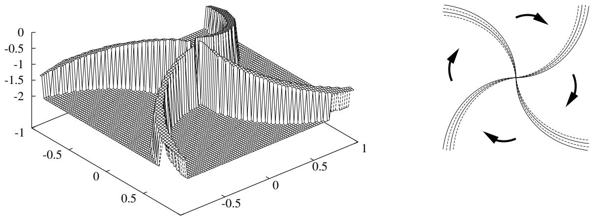
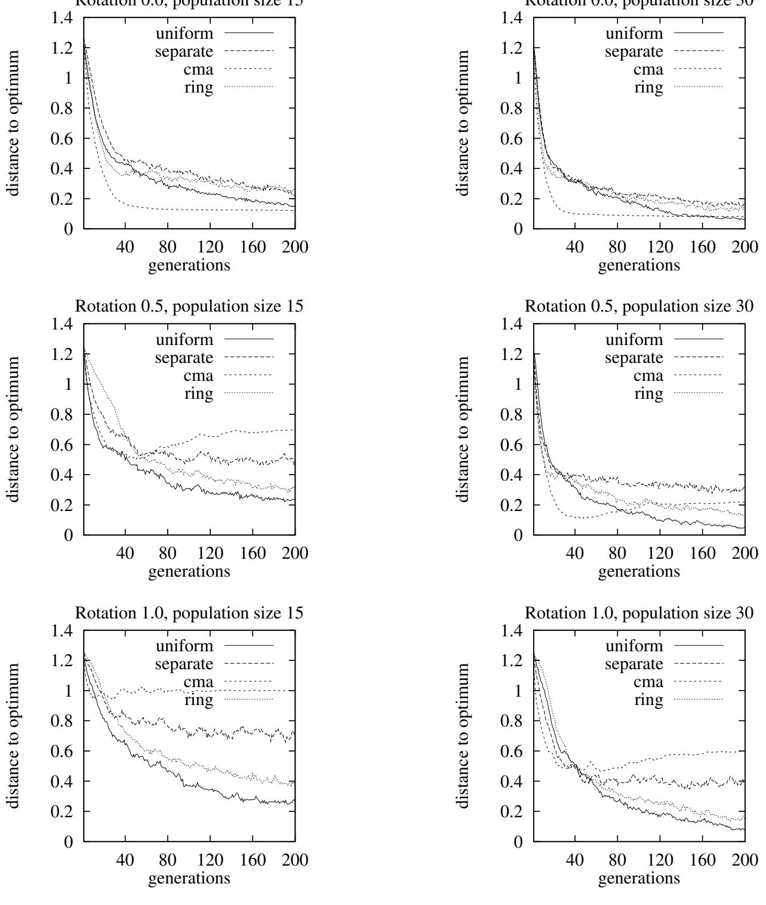
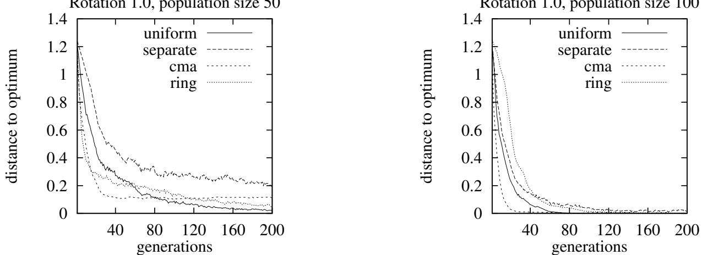
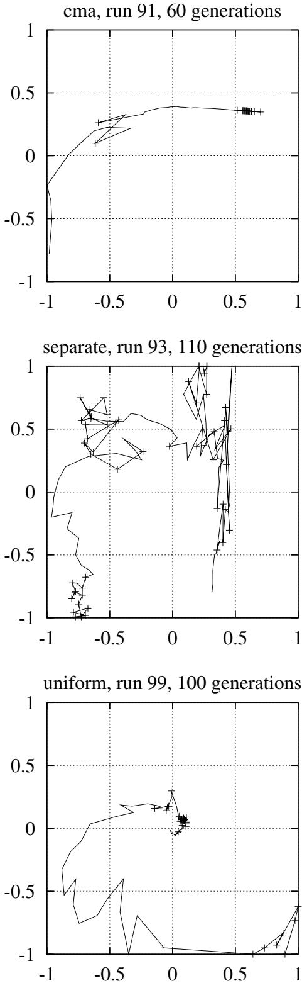
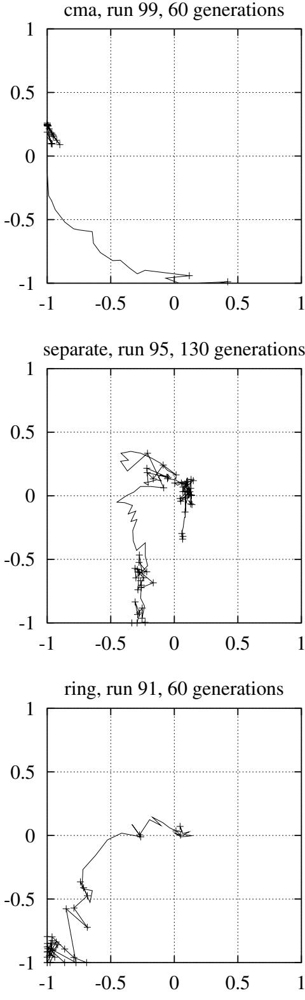
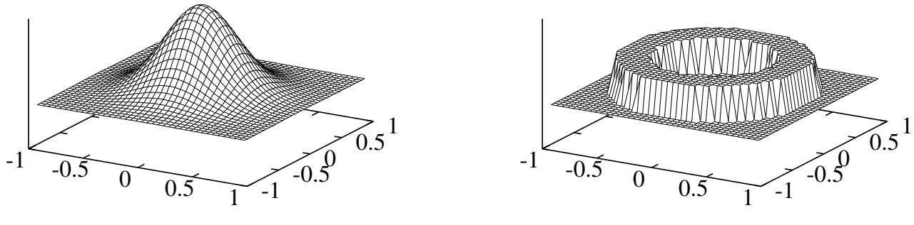
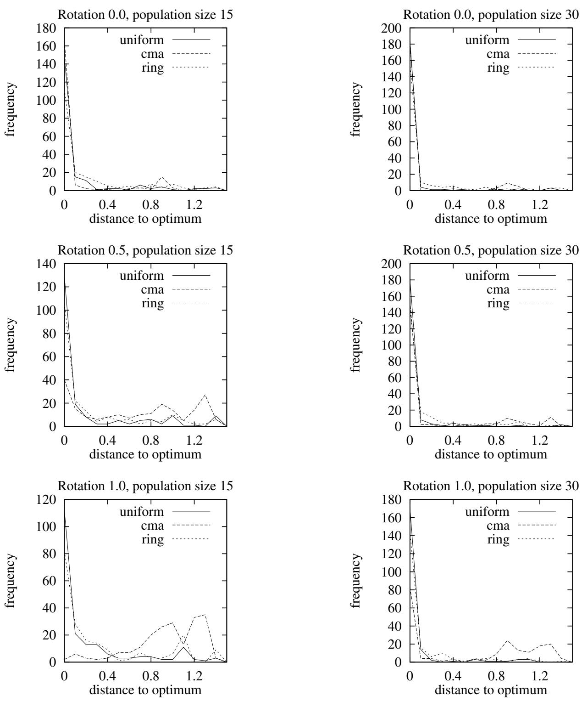

# On evolution strategy optimization in dynamic environments

Karsten Weicker Institute of Computer Science, Dept. Formal Concepts University of Stuttgart, Breitwiesenstr. 20–22 70565 Stuttgart, Germany Karsten.Weicker@informatik.uni-stuttgart.de

Nicole Weicker Institute of Computer Science, Dept. Formal Concepts University of Stuttgart, Breitwiesenstr. 20–22 70565 Stuttgart, Germany Nicole.Weicker@informatik.uni-stuttgart.de

Abstract- This work analyzes the behavior of evolution strategies and their current mutation variants on a simple rotating dynamic problem. The degree of rotation is a parameter for the involved dynamism which enables systematic examinations. As a result the complex covariance matrix adaptation proves to be superior with slow rotation but with increasing dynamism those adaptation mechanism seldom find the optimum where the simple uniform adaptation produces stable results. Moreover, this examination gives rise to question the principle of small mutation changes with high probablity in the dynamic context.

# 1 Introduction

Optimization in dynamically changing environments is a hard problem. Although almost all real–world applications have a dynamic character, evolutionary algorithms (EA) have been developed and examined for statical problems nearly exclusively. While static problems are already hard problems, dynamism adds a new complex degree of difficulty. Depending on the kind of dynamism, different optimization methods, e.g. evolution strategies (ES) with different self–adaptation mechanisms, are more or less suited and adapted to the problem.

This work examines and compares how different kinds of ES self-adaptation (cf. Back, ¨ 1996) are able to cope with various differently changing environments by means of an artificial test function. This fitness function incorporates a special kind of dynamism: the underlying fitness landscape is static but the information (segment) visible to the optimizer is changing dynamically. In addition to examining known ES mutation techniques, a new mutation operator is presented which breaks with one of the usual conventions for mutation operators in ES theory.

# 2 Principles of ES mutation

Evolution strategies as well as evolutionary programming (EP) have proven to be powerful tools for the optimization of static problems - in particular because of polished selfadaptation mechanisms. For the original mutations (Rechenberg, 1973, 1994; Schwefel, 1977, 1995) and most modifications (e.g. Rudoph, 1992; Hansen & Ostermeier, 1996; Back, ¨ 1997) the following conventions (similar to those summarized by Schwefel, 1977) are true.

(1) zero-mean: an average neutrality implies that an object variable may be increased with the same probability as it may be decreased,   
(2) small changes occur with a higher probability than big changes.   
(3) mostly a Gaussian normal distribution is used, but there have been also works with Cauchy (Yao & Liu, 1996) and Laplace (Montana & Davis, 1989) distributions.

Those paradigms make sense for static optimization problems as convergence examinations show (cf. Rudolph, 1997). Nevertheless, Ostermeier (1992) and Ghozeil and Fogel (1996) examined to what extent non-zero-mean mutations may be used to improve the optimization algorithm. Ostermeier (1992) used the expectation vector as additional strategy parameters to control the Gaussian distribution and Ghozeil and Fogel (1996) perturbed the creation of a new offspring in a random direction from the parent. Where those mutation operators – breaking with above conventions (1) and (2) – could improve convergence speed for certain static problems, the focus of this paper is the question whether the second convention is sensible in a dynamic environment.

Besides above conventions, one research focus during the past years was the improvement of self-adaptation in such a way that the orientation is learned which promises the biggest improvement. This is achieved by a covariance matrix (e.g. Hansen & Ostermeier, 1996; Rudolph & Sprave, 1996). Especially because of those self-adaptation mechanisms evolution strategies are considered to be a successful means for tackling dynamic problems since they promise quick adaptation to changing circumstances – they have been applied successfully for various problems (e.g. Sullivan & Pipe, 1996). Therefore, another focus of this work is the examination to which extent those mechanisms come up to these expectations. The following nuances of self-adaptation have been analyzed in the experiments of this paper.

Mutation with uniform step-adaptation, where one strategy parameter is used for the variance of all directions.   
Mutation with separate step-adaptation, where for each direction’s variance a separate strategy parameter is used.   
• Mutation with covariance matrix adaptation (cma), where a complete matrix is used as strategy parameters

  
Figure 1: Reversed fitness landscape of problem with optimum at $( 0 , 0 )$ – due to technical problems the figure shows an erratic discontinuity around the optimum – (left) and outline of the dynamism (right)

to adapt the orientation in the search space, as proposed by Hansen and Ostermeier (1996). This matrix incorporates the relative variances for each direction as well as the rotation angles for the adjustment of the mutation to the fitness landscape. Also a global variance is adapted which controls the step sizes. The reason for this twofold adaptation is that adaptation of the mean step size should be able to change faster than the rather slow matrix adaptation.

# 3 A 2-dimensional dynamic problem

In order to revise the mutation conventions for dynamic problems this paper considers a simple minimization problem: a cone turned upside down where only spiral-shaped segments are visible for the optimization and all other points are regarded constantly “bad”. This is turned into a dynamic problem by shifting the visible segments with each generation. Since the focus of this work is the complexity dynamism adds to a static problem, only a 2–dimensional problem is examined.

For the 2–dimensional case four visible segments are considered which span each $1 / 7 2$ -th of the search space. One visible segment is defined in polar coordinates $( r , \varphi )$ by the following predicate.

$$
{ \begin{array} { r c l } { P _ { \mathrm { { r o t } } } ( r , \varphi ) } & { \equiv } & { ( \varphi + \mathrm { r o t } ) { \frac { 4 { \sqrt { 2 } } } { \pi } } - { \frac { \sqrt { 2 } } { 9 } } } \\ & & { \leq r \leq ( \varphi + \mathrm { r o t } ) { \frac { 4 { \sqrt { 2 } } } { \pi } } } \end{array} }
$$

Then , the static fitness function is defined as

$$
\begin{array} { r l r } { f ( r , \varphi ) } & { = } & { \left\{ \begin{array} { l l } { r , \quad } & { \mathrm { i f } \ P _ { 0 } ( r , \varphi ) \lor P _ { \frac { \pi } { 2 } } ( r , \varphi ) \lor } \\ & { } & { P _ { \pi } ( r , \varphi ) \lor P _ { \frac { 3 \pi } { 2 } } ( r , \varphi ) } \\ { 2 . 0 , } & { \mathrm { o t h e r w i s e } } \end{array} \right. } \end{array}
$$

The left part of Figure 1 shows the resulting reversed fitness landscape.

Now, the optimization problem is turned into a dynamic problem by shifting (rotating) the visible range slightly from each generation to the next (cf. right part of Figure 1). We can control the degree of dynamism by the extent of the rotation. In the considered problem the width of a visible segment is $5 ^ { \circ } \equiv \frac { \pi } { 3 6 }$ . Then, $\gamma \in \ [ 0 . 0 , 1 . 0 ]$ denotes the rotation of the visible segment by $\gamma \cdot 5 ^ { \circ }$ from one generation to the next. Formally, the dynamic fitness function is defined as

$$
\begin{array} { r l r } { f ^ { ( t ) } ( r , \varphi ) } & { = } & { \left\{ \begin{array} { l l } { r , \quad } & { \mathrm { i f ~ } P _ { \frac { \pi } { 2 } - t } ( r , \varphi ) \vee P _ { \pi - t } ( r , \varphi ) \vee } \\ & { } & { P _ { \frac { 3 \pi } { 2 } - t } ( r , \varphi ) \vee P _ { 2 \pi - t } ( r , \varphi ) } \\ { 2 . 0 , } & { \mathrm { o t h e r w i s e } } \end{array} \right. } \end{array}
$$

where t changes from each generation to the next with the steps t = γπ36 , 2γπ36 , $\textstyle { \frac { 2 \gamma \pi } { 3 6 } } , \ldots , { \frac { \pi } { 2 } }$ (assuming for simplicity that there exists a $n \in \mathbb { N }$ with $n \gamma = 9$ ).

The following two sections examine to which extent the different kinds of mutation are able to deal with the different degrees of dynamism.

# 4 Behavior of ES mutation

All experiments have been carried out as $( 1 , \lambda )$ –strategies with $\lambda \in \{ 1 0 , 1 5 , 2 0 , 2 5 , 3 0 , 3 5 , 5 0 , 7 5 , 1 0 0 \}$ and with initial mean step sizes between 0.01 and 0.12. Nevertheless, considering the low dimensionality of the static problem, only small offspring population sizes , e.g. smaller than 35, should be reasonable. Because of the dynamic nature of the problem, the comma strategy was chosen in order to avoid reevaluation of individuals of previous generations. The parent population size $\mu = 1$ is a consequence of the low dimensionality and the desire to track individuals in the search space.

  
Figure 2: Average convergence for small populations and various degrees of rotation.

  
Figure 3: Average convergence for big populations and full degree of rotation.

Each experiment was repeated 200 times with different initial random seeds. Since different kinds of mutation require different initial mean step sizes, all experiments have been executed with various initial mean step sizes and those experiments have been chosen yielding the best average results. Therefore, those initial values differ for the regarded kinds of mutation and the degrees of rotation. Moreover, for all experiments not the fitness values based on the partially visible information are used to rate the experiments’ results but rather the distance to the optimum.

A few statistics of the results and examples are shown in Figures 2, 3, 4, and 6 and may be summarized as follows.

Figure 2 shows the results for small population sizes by using the distance to the optimum as convergence criterion. (Note, that all figures include another mutation variant ring which is introduced and discussed in Section 5.) The results may be summarized as follows.

Uniform step-adaptation leads to the best results compared to all other considered adaptation mechanisms. This holds in the static case as well as with increasing dynamism.   
Separate step-adaptation produces worse results at all times.   
• Covariance matrix adaptation (cma) produces very good results in the static case. But with increasing dynamism the results deteriorate for small populations. Nevertheless, if a sufficiently large number $\lambda$ of offspring are computed (cf. Figure 3) cma becomes competitive again.

By examining the runs closer, a few explanations for this behavior are found. Obviously the simple adaptation technique is able to adapt quickly to the dynamically changing environments where the more sophisticated mechanisms are too inert to adapt. The information is not steady enough to enable successful adaptation. In the case of covariance matrix adaptation two exemplary runs in Figure 4 show an often occurring behavior for full rotation with a small populations size: the mutation is able to track the visible segment for some generations but then gets lost and can very seldom recover, though visible information is passing by. Figure 6 reflects this behavior and shows that a high percentage of the experiments got lost far from the optimum.

In the case of separate adaptation, the exemplary runs in Figure 4 show that, although the visible segment is tracked for periods, the behavior is rather erratic. In one example, it is not attracted by the optimum and only moves in a big circle around it. In the other example, it gets close to the optimum but moves away again. Moreover, it seems as if the separate adaptation only adapts in one dimension at a time.

Also, Figure 4 shows in a typical run for the uniform adaptation that the visible segment is tracked very well and the search is drawn towards the optimum. This is also reflected in the final fitness distributions in Figure 6.

This comparison illustrates that sometimes the simple selfadapting mutations are more successful than complex, smart adaptation mechanisms. The reason for this behavior is the underlying supposition for those mechanisms that the fitness landscape remains firm until the adaptation takes place. In the case of dynamic landscapes this supposition is seldom true.

As for the good results with large populations, the bigger random sample causes a bigger probability that a good offspring is found. Thus, the covariance adaptation mechanism seems to again get enough information to adapt successfully. This is one presumable reason for the better performance of big populations since in the dynamic case a certain step size is important to cope with the dynamic effects.

  
Figure 4: Path of the best individuals for exemplary runs with full rotation and population size 15. The points where the visible segments are lost are marked with a $^ +$ . Note that the visible segments rotates clockwise.

  
Figure 5: Offspring probability for Gaussian mutation and sphere mutation

# 5 Questioning ES mutation principles

Since the previous section has shown that the advanced covariance matrix adaptation mechanisms of ES mutation is not appropriate to the examined dynamic problem with small populations, this section examines to what extent an alternative mutation is able to master those problems. The last section has shown that bigger populations sizes come along with a higher probability for the occurrence of one bigger mutation step which is essential in the examined problem with full rotation. As a consequence from this behavior, this section questions convention (2) presented in Section 2 where a high probability was assigned to small steps. In order to do this a sphere mutation (or in the 2–dimensional case: ring mutation) is introduced and examined in the following. Note, that the mutations introduced by Ostermeier (1992) and Ghozeil and Fogel (1996) could have been used instead – but they violate convention (1) as well. Therefore, the sphere mutation was chosen to compete with the standard mutations.

The sphere mutation is defined as follows. Two strategy parameters define the smallest possible mutation step $m$ and the width of the mutation range $w$ . For the 2–dimensional case, the variation of one mutation step is defined in polar coordinates as follows.

$$
\begin{array} { l c l } { { \Delta \varphi } } & { { = } } & { { U ( 0 , 2 \pi ) } } \\ { { \Delta r } } & { { = } } & { { m + U ( 0 , w ) } } \end{array}
$$

where $U$ are random variables with a uniform distribution (cf. Figure 5). Obviously, on the one hand the sphere mutation guarantees a smallest variation, on the other hand it is still zero–mean.

Figure 2 shows that, for small numbers of offspring, the sphere mutation yields results that are almost as good as the uniform mutation’s results with respect to convergence speed and distance to the optimum. Especially with a high degree of dynamism the ring mutation clearly outperforms the separate adaptation as well as the covariance matrix adaptation. When analyzing the distributions of the final fitness values averaged over all runs (Figure 6), it becomes obvious that the sphere mutation produces similar stable results as uniform mutation, whereas cma often gets stuck far away from the optimum. Also an exemplary run in Figure 4 shows that there is a rather directed search towards the optimum although it got a bad start. This may be interpreted as an indication that the second convention may be questioned.

Note, that we do not claim that the sphere mutation is sensible for all dynamic problems. Rather it is defined in such a way that the fundamental examinations are enabled.

# 6 Conclusion

The introduced spiral problem is a dynamic function which is a hard optimization problem despite the low dimensionality. In contrary to many other dynamic applications, it makes a parameter available which controls the degree of dynamism. This enables systematical examinations of the interplay between dynamism and the various mutations.

The results can be summarized as follows. It seems that with increasing degree of dynamism simple mutations are better than complicated covariance matrix adaptations. Moreover, the sphere mutation seems to be a stable alternative to the uniform standard mutation. Since this mutation contradicts the convention that small changes should occur with high probabilities, the examinations are an indicator that in the case of dynamic environments the ES mutation conventions should be thought over. This is especially the case if fitness evaluation is expensive and the dynamic change happens continuously – then there is a correlation between the size of the population and the degree of dynamism. A small population size implies small dynamism and a big population size implies big dynamism. In order to keep the dynamism fairly low we need to choose small populations and an optimization technique which is able to handle those small populations. Due to the results in this paper traditional complex self-adaptation mechanisms might not be the preferred means. Nevertheless, future work has to show to what extent these results may be transfered to problems with another kind of dynamism, bigger problems, or even real–world problems.

  
Figure 6: Distribution of the final fitness values of the 200 experiments for each parameter setting for a qualitative comparison of the reliability of the different algorithms. Here the separate mutation is omitted.

Acknowledgements We like to thank Prof. Dr. Andreas Zell and Jur¨ gen Wakunda from the University of Tubingen ¨ where the first author was funded during the research for this work. Their optimization tool $E \nu A -$ especially the module vees for evolution strategies – was used for the experiments in this paper.

# Список литературы

Back, ¨ T. (1996). Evolutionary algorithms in theory and practice. New York: Oxford University Press.

Back, ¨ T. (1997). Self-adaptation. In T. Back, ¨ D. B. Fogel, & Z. Michalewicz (Eds.), Handbook of Evolutionary Computation (pp. C7.1:1–15). Bristol, New York: Institute of Physics Publishing and Oxford University Press.

Ghozeil, A., & Fogel, D. B. (1996). A preliminary investigation into directed mutations in evolutionary algorithms. In H. Voigt, W. Ebeling, & I. Rechenberg (Eds.), Parallel Problem Solving from Nature – PPSN IV (Berlin, 1996) (Lecture Notes in Computer Science 1141) (pp. 329–335). Berlin: Springer.

Hansen, N., & Ostermeier, A. (1996). Adapting arbitrary normal mutation distributions in evolution strategies: the covariance matrix adaptation. In Proc. of the 1996 IEEE Int. Conf. on Evolutionary Computation (pp. 312–317). Piscataway, NJ: IEEE Service Center.

Montana, D. J., & Davis, L. (1989). Training feedforward neural networks using genetic algorithms. In N. S. Sridharan (Ed.), Proc. 11th Joint Conf. on Artificial Intelligence (pp. 762–767). San Mateo, CA: Morgan Kaufmann.

Ostermeier, A. (1992). An evolution strategy with momentum adaptation of the random number distribution. In R. Manner¨ & B. Manderick (Eds.), Parallel Problem Solving from Nature 2 (pp. 197–206). Amsterdam: Elsevier Science.

Rechenberg, I. (1973). Evolutionsstrategie: Optimierung technischer Systeme nach Prinzipien der biologischen Evolution [Evolution strategy: Optimizing technical systems with principles of biological evolution]. Stuttgart: Friedrich Frommann Verlag. (German)

Rechenberg, I. (1994). Evolutionsstrategie ’94. Stuttgart, Germany: Frommann-Holzboog.

Rudolph, G. (1997). Models of stochastic convergence. In T. Back, ¨ D. B. Fogel, & Z. Michalewicz (Eds.), Handbook of Evolutionary Computation (pp. B2.3:1– 3). Bristol, New York: Institute of Physics Publishing and Oxford University Press.

Rudolph, G., & Sprave, J. (1996). Significance of locality and selection pressure in the grand deluge evolutionary algorithm. In H. Voigt, W. Ebeling, & I. Rechenberg (Eds.), Parallel Problem Solving from Nature – PPSN IV (Berlin, 1996) (Lecture Notes in Computer Science 1141) (pp. 686–694). Berlin: Springer.

Rudoph, G. (1992). On correlated mutations in evolution strategies. In R. Manner ¨ & B. Manderick (Eds.), Parallel Problem Solving from Nature 2 (Proc. 2nd Int. Conf. on Parallel Problem Solving from Nature, Brussels 1992) (pp. 105–114). Amsterdam: Elsevier.

Schwefel, H.-P. (1977). Numerische Optimierung von Computer-Modellen mittels der Evolutionsstrategie [Numeric optimization of computer models using the evolution strategy]. Basel: Birkhauser ¨ . (Volume 26 of Interdisciplinary Systems Research)

Schwefel, H.-P. (1995). Evolution and optimum seeking. New-York: Wiley. (Series: Sixth-Generation Computer Technology)

Sullivan, J. C. W., & Pipe, A. G. (1996). An evolution strategy for on-line optimisation of dynamic objective functions. In H. Voigt, W. Ebeling, & I. Rechenberg (Eds.), Parallel Problem Solving from Nature – PPSN IV (Berlin, 1996) (Lecture Notes in Computer Science 1141) (pp. 781–790). Berlin: Springer.

Yao, X., & Liu, Y. (1996). Fast evolutionary programming. In L. J. Fogel, P. J. Angeline, & T. Back ¨ (Eds.), Proc. 5th Ann. Conf. on Evolutionary Programming. Cambridge, MA: MIT Press.