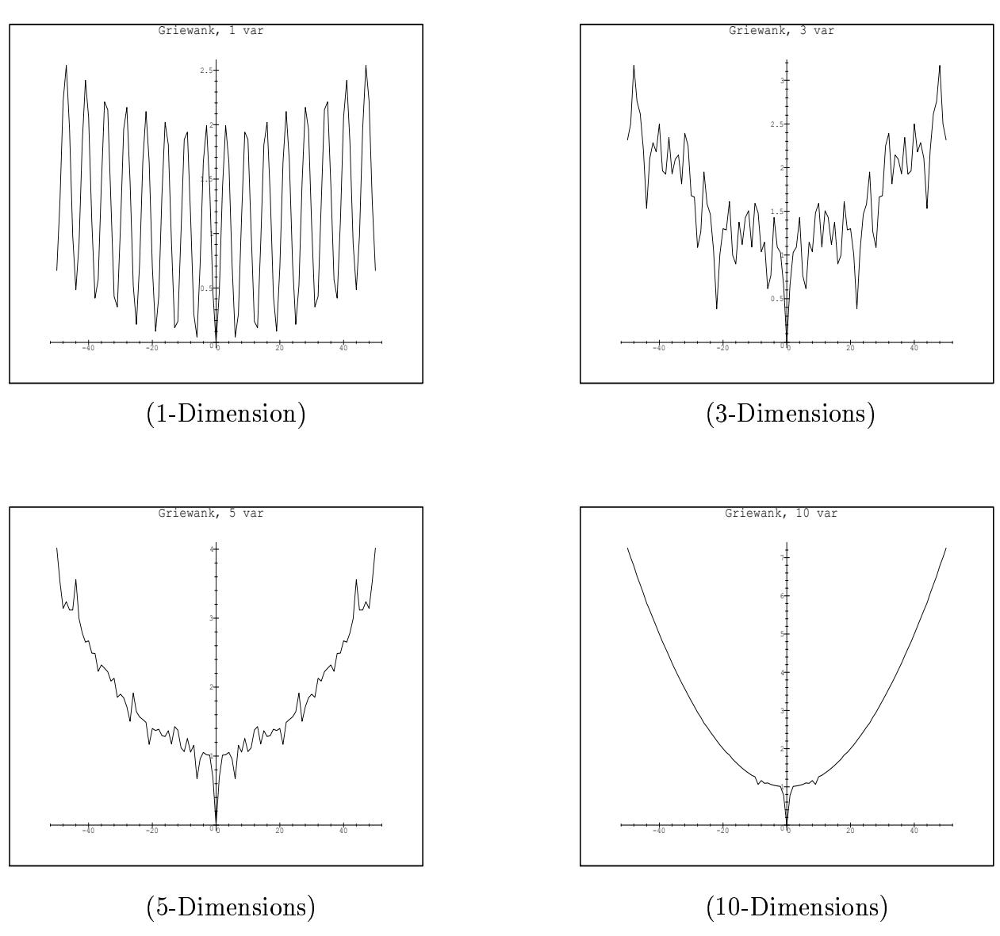
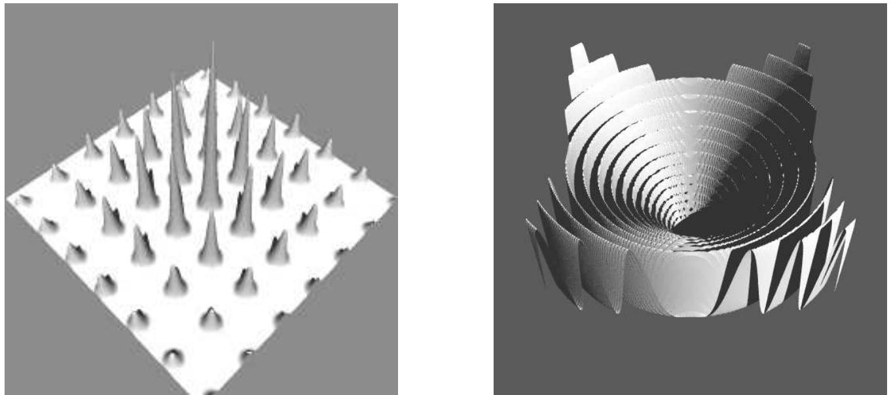
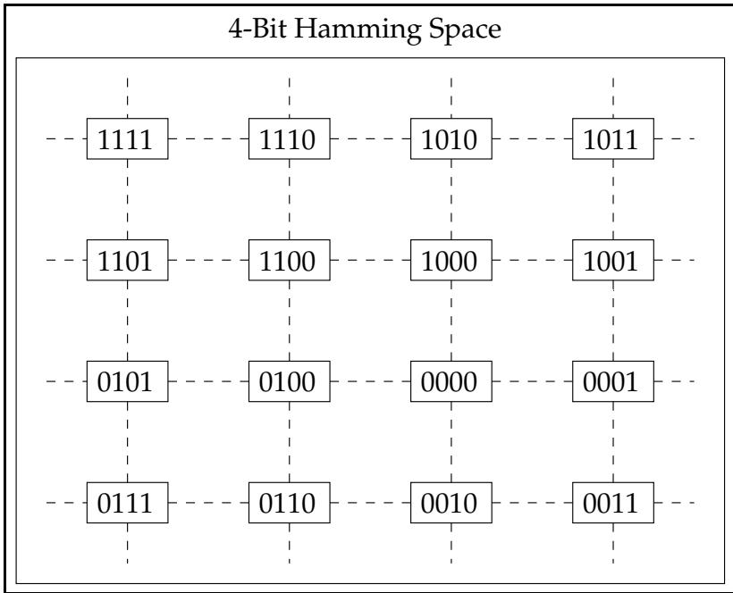
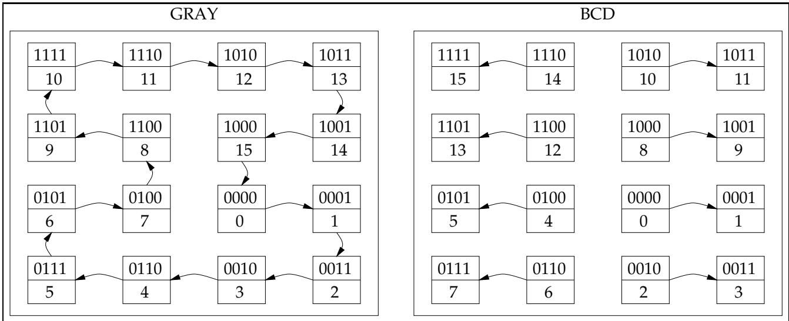
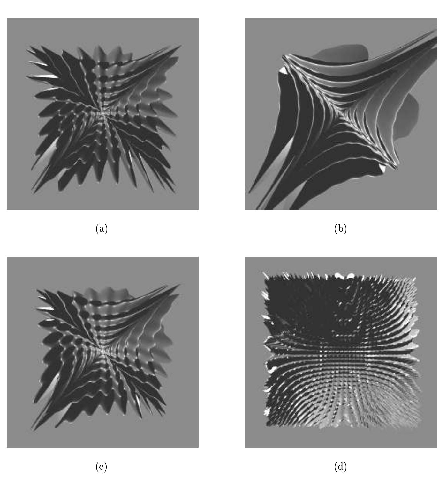
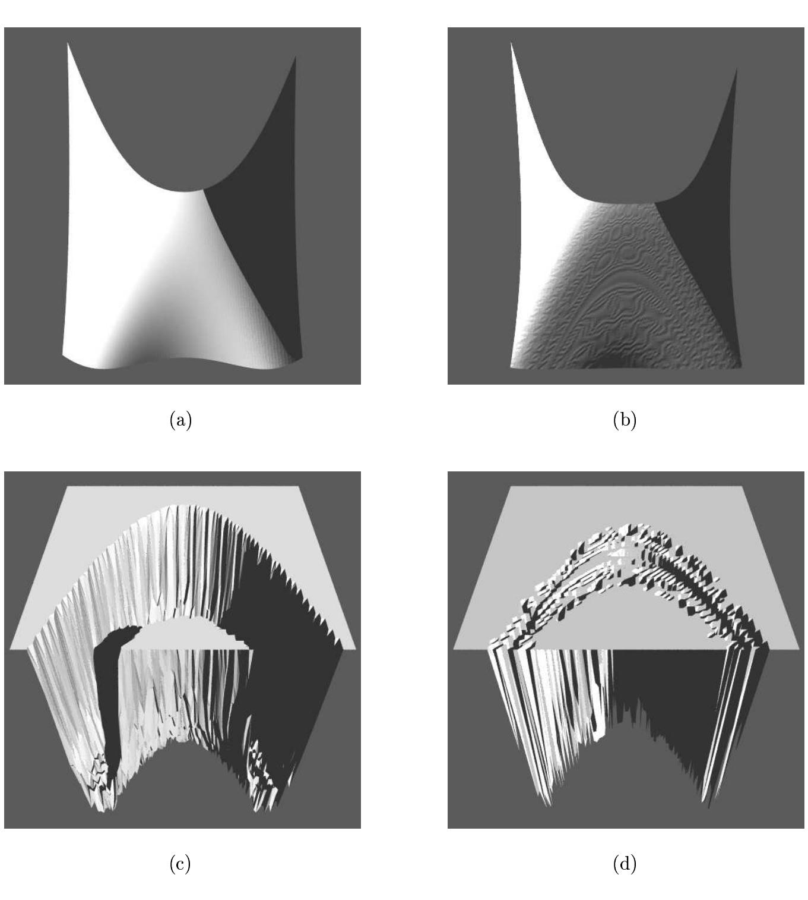
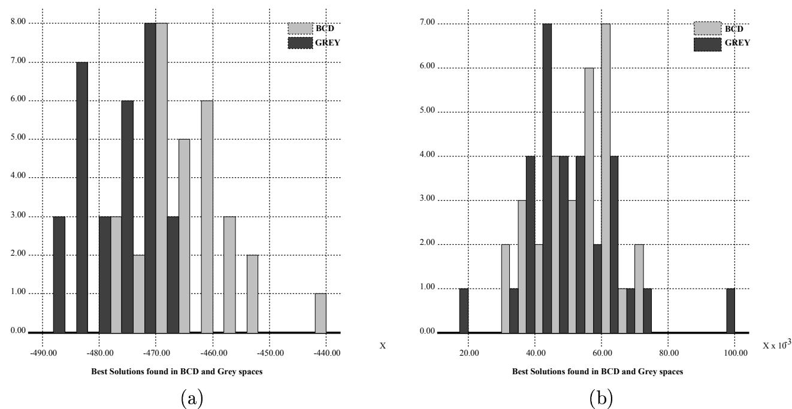

# Evaluating Evolutionary Algorithms

D. Whitley, K. Mathias, S. Rana, J. Dzubera

Department of Computer Science Colorado State University   
Fort Collins, Colorado 80523 USA whitley@cs.colostate.edu

# Abstract

Test functions are commonly used to evaluate the effectiveness of different search algorithms. However, the results of evaluation are as dependent on the test problems as they are on the algorithms that are the subject of comparison. Unfortunately, developing a test suite for evaluating competing search algorithms is difficult without clearly defined evaluation goals. In this paper we discuss some basic principles that can be used to develop test suites and we examine the role of test suites as they have been used to evaluate evolutionary search algorithms. Current test suites include functions that are easily solved by simple search methods such as greedy hill-climbers. Some test functions also have undesirable characteristics that are exaggerated as the dimensionality of the search space is increased. New methods are examined for constructing functions with different degrees of nonlinearity, where the interactions and the cost of evaluation scale with respect to the dimensionality of the search space.

# 1 Introduction

Numerous empirical studies have attempted to show the effectiveness of some particular search algorithm. Empirical and experimental approaches to comparing algorithms have many disadvantages, especially when the algorithms are designed to be robust, general purpose optimization and search tools. One obvious danger with empirically evaluating search algorithms is that the resulting conclusions depend as much on what problems are used for testing as they do on the algorithms that are being compared. This can have the side effect that algorithms are designed and tuned to perform well on a particular test suite; the resulting specialization may or may not translate into improved performance on other problems or applications. It is therefore important that test suites be challenging and diverse.

In this paper we examine new and existing methodologies for constructing test functions for comparing the effectiveness of evolutionary algorithms on parameter optimization problems. The end result is not a new test suite, but rather principles for designing test functions to be used for different evaluation purposes. We propose guidelines concerning the types of problems that should be used for comparative studies of evolutionary algorithms, how these studies should be carried out and some of the limitations of such studies. Methods for constructing scalable test functions are also introduced. These methodologies and guidelines should make it possible to perform more critical comparisons in the future between different evolutionary algorithms as well as facilitate comparisons with other heuristic search methods.

First, we consider some of the limitations of current test suites, particularly as related to the evaluation of evolutionary algorithms for parameter optimization. We argue that problems should not be separable; problems are separable if there are no nonlinear interactions between variables. Separable functions may be nonlinear in that the objective function may involve nonlinearities when determining the contribution of a single variable to the overall evaluation. Nevertheless, the optimal value for each parameter can be determined independently of all other parameters. Surprisingly, almost all of the functions in current evolutionary search test suites are separable. Such test problems have been used to demonstrate the effectiveness of algorithms such as simulated annealing over evolutionary search algorithms. This is problematic in that separable functions can be solved by exact methods. Such functions are also often readily solved by local search methods and hence may be easily solved by any algorithm that explicitly builds on local search, such as simulated annealing (Kirkpatrick et al. 1983) or TABU search (Glover 1989).

Test functions can also display symmetries which may make them easier to solve by some methods. For 2-dimensional functions symmetry exists if $\operatorname { F } ( \mathrm { x } , \mathrm { y } ) = \operatorname { F } ( \mathrm { y } , \mathrm { x } )$ . In higher dimensions, up to N! equivalent solutions may exists for a function of N variables. We also show that higher order symmetries can exist which may make some types of genetic algorithms an inappropriate method of search.

Separable functions are commonly used as test problems because they are scalable. This allows search algorithms to be tested on problems with progressively higher dimensionality (Mühlenbein, 1991). Scalability is indeed desirable, but the nonlinear interactions in a test function should also be sensitive to scaling. We show that simple methods can be used for constructing test functions that allow nonlinear interactions between variables to be selectively scaled as the dimensionality of the problem is increased. We also consider how scaling impacts the cost of evaluation.

The use of BCD (Binary Coded Decimal) and binary reflective Gray encodings as discrete problem representations is another major consideration when applying evolutionary algorithms to parameter optimization problems with bit encodings. We explore the relationship between Gray and BCD representations, how they relate to real-valued representations and how these representations relate to search behavior.

We do not consider combinatorial optimization problems in this paper. Well known test cases exist for problems such as the Traveling Salesman Problem. The inherent difficulty of these problems and their status as NP-Complete problems is more thoroughly documented than the difficulty of most parameter optimization problems (Cormen, et al. 1990). Furthermore, researchers often use specialized representations and operators when applying evolutionary algorithms and other heuristic search methods to this class of problems. Parameter optimization problems have simple representations (e.g. bit strings or foat strings) that are manipulated by a general set of operators. Given the specialized representations and operators, combinatorial optimization problems are not often used for general comparative purposes, perhaps because the results are seen as being application dependent. In the long term, such problems should make up a specialized component of a thorough test suite.

The design principles for parameter optimization problems proposed in this paper cannot solve the general problem of discriminating between search algorithms in terms of their effectiveness. However, the principles developed here will help to establish guidelines for comparative studies and focus the evaluation effort on classes of test problems that are most likely to be of relevance to basic evaluation goals.

# 2 Evaluating Evolutionary Algorithms

In recent years, the terms evolutionary algorithms and evolutionary computation have come to refer to a set of algorithms that use evolutionary principles to build adaptive systems. Genetic algorithms, as introduced by John Holland in the 1970's (Holland, 1970), are perhaps best known. Around the same time in Germany, researchers such as Ingo Rechenberg (1973) and Hans-Paul Schwefel (1981) were developing algorithms known as evolution strategies. Work in the 1960's by Fogel, Owens and Walsh (1966) define yet another set of methods referred to as evolutionary programming.

Evolutionary algorithms are population based search methods that employ some form of selection to bias the search toward good solutions. Mutation and recombination are applied to strings representing candidate solutions to some optimization or search problem. Genetic algorithms tend to emphasize recombination of string pairs, while evolutionary programming tends to emphasize a mutation driven search, where mutation acts on single strings. Evolution strategies place more emphasis on mutation than genetic algorithms, but do not exclude recombination to the same degree normally associated with evolutionary programming. Genetic algorithms as defined by Holland have also been associated with binary encodings and the notions of schema processing and hyperplane sampling, whereas real-valued encodings tend to be used in evolution strategies. Several publications provide detailed descriptions of the these algorithms and their relationship to one another (Bäck and Schwefel, 1993; Hoffmeister and Bäck, 1991; Bäck, Hoffmeister and Schwefel, 1992; Fogel, 1993; Fogel, 1994; Whitley, 1994).

# 2.1 The Limitations of the Existing Test Problems

For almost twenty years, De Jong's test suite (De Jong, 1975) has continually been used as the standard for measuring the performance of various genetic algorithms. The De Jong test suite (table 1, F1 - F5) includes a variety of characteristics that may affect algorithmic performance. This test suite was never meant to serve as a "Gold Standard," but rather was designed to illustrate the broad efficacy of genetic algorithms for different basic types of parameter optimization problems (Belew, 1992). These functions include a unimodal function (F1), a nonlinear function over 2 variables (F2), a discontinuous function (F3), a noisy function (F4) and a multi-modal function with several local optima (F5).

Other test sets have been introduced over the years (Ackley, 1987; Schaffer, Caruana, Eshelman and Das, 1989; Davidor, 1991; Mülenbein et al., 1991; Forrest and Mitchell, 1993). Some of the best known of these problems are illustrated in table 1. Functions F6 through

Table 1: Common Test Functions.   

<table><tr><td>F 1 : f (xi |i=1,3) = ∑i=1 x2 xi  [−5.12, 5.11]</td></tr><tr><td>F2 : f (xi |i=1,2) = 100(x2 − x2)2 + (1 − x1)2 xi  [−2.048, 2.047]</td></tr><tr><td>F 3 : f (xi |i=1,5) = ∑i=1 [xi] xi  [−5.12, 5.11]</td></tr><tr><td>F 4 : f (xi |i=1,30) = [Σi=1 ix4] + Gauss(0, 1) xi  [−1.28, 1.27]</td></tr><tr><td>[0.002 + ∑j=1 j+Σi=1(xi−ai)6] F5 : f (xi |i=1,2) = 25 1 xi  [−65.536, 65.535]</td></tr><tr><td>F 6 : f (xi |i=1,N) = (N * 10) + [∑N=1 (x2 − 10c0s(2πxi))] xi  [−5.12, 5.11]</td></tr><tr><td>F7 : f (xi |i=1,N) = ∑i=1 −xisin(|xi |) xi  [-512, 511]</td></tr><tr><td>− Πi=1(cos(xi/√i))</td></tr><tr><td>xi  [−512, 511] sin2√x2+x2 -0.5</td></tr><tr><td>F9 : f (xi |i=1,2) = 0.5 + xi  [−100, 100] [1.0+0.001(x2+x2)]2</td></tr><tr><td>F10 : f (xi |i=1,2) = (x2 + x2)0.25[sin2(50(x2 + x2)0.1) + 1.0] xi  [−100, 100]</td></tr></table>

F8 are known as the Rastrigin (F6), Schwefel (F7) and Griewangk (F8) functions and can be scaled to any number of variables (Mühlenbein, 1991). The functions labeled F9 and F10 are known as the sine envelope sine wave and the stretched V sine wave functions (Schaffer, et. al., 1989).

These test problems have often been used to tune and refine variants of a single evolutionary algorithm and to argue the superiority of one approach over another. The danger in this practice is that algorithms can become customized for a particular set of test problems; this is troubling if the test problems do not represent the types of problems that evolutionary algorithms are best suited for in practice.

Davis (1991) has shown that many of these functions are quickly solved by a random bit climber. Davis has also shown that the performance of a random bit climber is sensitive to the representation of the problem. Additionally, Mühlenbein et al. (1993) have used empirical evidence based on test functions F6, F7 and F8 to argue that the "Breeder Genetic Algorithm" scales such that $O ( n \ l n ( n ) )$ function evaluations are needed to locate the global optimum, where $n$ is the number of parameters used by these functions. However, we show that search methods exist that require only $O ( n )$ function evaluations to exactly solve F6 and F7. In addition, we show that F8 becomes easier as the dimensionality of this function is increased.

Table 2: Results of One Pass of Line Search on Nonlinear Nonseparable Functions. The optimal solution for these problems is 0.   

<table><tr><td rowspan=1 colspan=1>Function</td><td rowspan=1 colspan=1>Mean Soln</td><td rowspan=1 colspan=1>Mean Sigma</td><td rowspan=1 colspan=1>Number Solved</td></tr><tr><td rowspan=1 colspan=1>f2</td><td rowspan=1 colspan=1>0.2647818</td><td rowspan=1 colspan=1>0.3033391</td><td rowspan=1 colspan=1>0</td></tr><tr><td rowspan=1 colspan=1>f9</td><td rowspan=1 colspan=1>0.1215778</td><td rowspan=1 colspan=1>0.0773996</td><td rowspan=1 colspan=1>0</td></tr><tr><td rowspan=1 colspan=1>f10</td><td rowspan=1 colspan=1>3.807974</td><td rowspan=1 colspan=1>1.777144</td><td rowspan=1 colspan=1>0</td></tr></table>

One can immediately identify problems F1, F3, F5, F6 and F7 as separable functions. F4 is also separable, although the addition of noise might prevent an algorithm from locating the optimal solution. The line search algorithm exploits separability by solving for each parameter independently through enumeration. Given a separable function which accepts $n$ variables that are coded using $k$ bits, the total search space has a size of $2 ^ { n k }$ . Line search checks each of the $2 ^ { k }$ points that are associated with each of the $n$ variables. Thus one complete iteration of line search has a cost of $n ( 2 ^ { k } )$ . Assuming $k$ is constant, the result is an $O ( n )$ exact method for solving discretized separable functions. For example, many of the test problems are encoded using 10 bits per parameter. For a 10 parameter problem, the effective size of the search space is not $2 ^ { 1 0 0 }$ , but rather only $1 0 ( 2 ^ { 1 0 } )$ , which is easily enumerated. For general nonlinear functions, line search is not an exact method but rather serves as a heuristic form of local search which can be run multiple times with random restarts. The representation need not be binary; given any discretization of the variables, line search can be applied without regard to problem encoding.

This leaves only F2, F8, F9 and F10 as nonseparable, nonlinear problems. Of these problems, F2, F9 and F10 are not scalable; the results obtained after one pass of line search for these three problems given in table 2. All of these problems are also solved by various evolutionary algorithms using dramatically fewer evaluations (Eshelman, 1991; Mathias and Whitley, 1994a).

It should be noted that line search is not an effective heuristic for F2, F9 and F10 in part because the number of values assigned to each parameter is large: F9 and F10 are coded using 22 bits per parameter and F2 is coded using 12 bits per parameter. All the other test functions are coded using 10 bits. Thus, a single iteration of line search requires more than 8 million evaluations for F9 and F10. Compare this to line search on a problem with 10 bits per parameter and 10 parameters (i.e., a search space of $2 ^ { 1 0 0 }$ ): line search can enumerate all 10 parameters 800 times given 8 million evaluations. If F9 and F10 are sampled at a rate of $2 ^ { 1 0 }$ per parameter, they are also solved by line search using multiple iterations.

F2 is also known as Rosenbrock's function (1960) in the optimization literature. Solutions to this function can be obtained using minimization methods that do not require derivatives and which employ linear search (Brent 1973).

Of all the test problems in table 1, only F8 (Griewangk's function) is scalable, nonlinear and nonseparable. Nevertheless we have found that F8 exhibits undesirable properties as the dimensionality of the function is increased. The summation term of the F8 function induces a parabolic shape while the cosine function in the product term creates "waves" over the parabolic surface; these waves create local optima. It has been shown by enumeration of low dimensional versions of this function that the basin of attraction containing the global optimum appears to encompass a larger percentage of the total space as the search space grows (Mathias and Whitley, 1994a).

We now note that the product term involving the cosine is such that as the dimensionality of the search space is increased the contribution of the product term becomes smaller and the local optima induced by the cosine term become smaller. This suggests that this function becomes easier as the dimensionality of the search space is increased for numeric real-valued representations. Since Gray coding preserves the adjacency contained in numeric space (Mathias and Whitley, 1994b) any path that walks the adjacency neighborhood that corresponds to the discretized numeric representation of the search space also exists as a subset of the paths that traverse the Gray space representation. (See section 3.2.) Unlike the BCD representation, the Gray space contains the discretized numeric representation. Therefore, we can conclude that Gray coded representations of this function also become easier as the dimensionality of the search space is increased.

Figure 1 illustrates Griewangk's function for 1, 3, 5 and 10 variables. These figures are 1-dimensional slices of the function taken along the diagonal of the hypercube. The effects of increasing the dimensionality of the problem with respect to the product term that includes the cosine are clearly illustrated. The function becomes simpler and smoother as the dimensionality of the search space is increased.

# 2.1.1 Symmetry

Another property that many of these functions exhibit is symmetry. Functions F9 and F10 are symmetric as can be seen by examining the evaluation functions (also see figure 2 for F10). Two dimensional versions of the type of separable functions found in table 1 are also symmetric. Separable functions can also display increased symmetry at higher dimensions.

Observation: Given a vector $a$ representing the parameter values 1 to $N$ of any potential solution to a separable function of the form $F ( x _ { 1 } , x _ { 2 } , . . . , x _ { n } ) = \textstyle \sum _ { i = 1 } ^ { n } S ( x _ { i } )$ constructed using subfunction S, all $N$ permutations of $a$ represent equivalent solutions.

Proof: The evaluation of each component of $a$ is independent of all other components of $a$ , and so the order of evaluation is irrelevant. Since the same subfunction is applied to each component of $a$ , the $N$ permutations of $a$ yield equivalent evaluations.

A corollary of this observation is that if the components of $a$ are unique (i.e., no two components of $a$ are equal) then the $N !$ unique permutations are all distinct but equivalent solutions.

For the separable functions in table 1, the global optimum is unique because at the global optimum each component of $a$ has the same value and all permutations of $a$ represent exactly the same solution. Thus, there is a single global optimum regardless of the dimension of the function. Nevertheless, this symmetry partitions much of the search space into large equivalence classes. In general, if there are $\mathcal { Q }$ values per parameter and $N$ parameters, $\mathcal { Q } >$ $N )$ , there are $\binom { \mathcal { Q } } { N }$ combinations where ll parmeer values are nique nd the $N !$ equivalent permutations for each of these combinations. The set of combinations containing single duplicate is given by $\binom { \mathcal { Q } } { N - 1 } \binom { N - 1 } { \cdot }$ of which $\textstyle { \frac { N ! } { 2 ! } }$ combinations are equivalent.

Applications with multiple equivalent solutions are not unknown. Such problems are alsc not necessarily easy. Multiple equivalent solutions exist for some classes of neural networks.

  
Figure 1: The graphs represent slices of the Griewangk's function for 1, 3, 5 and 10-dimensional versions of this problem. As these graphs clearly illustrate, as the dimensionality increases the local optima induced by the cosine decrease in number and complexity.

Consider a neural network with $\mathcal { H }$ hidden nodes, all of which are fully connected to an input layer and an output layer. Let the vector $a$ represent the set of weights in the neural networks. Furthermore, let the weights of $a$ be organized so that all weights that connect to any given hidden unit (i.e., all fan-in and fan-out connections) are adjacent on vector $a$ . This partitions $a$ into $\mathcal { H }$ pieces corresponding to the hidden units. For every possible vector there are then $\mathcal { H } !$ reorderings that are equivalent solutions, since reordering the $\mathcal { H }$ partitions on $a$ moves the positions of the hidden nodes in the network without changing the neural network's functionality. In this case a set of weights which minimizes error is also likely to have different weights for different connections in the networks, and thus there are potentially $O ( \mathcal { H } ! )$ multiple equivalent solutions.

The existence of multiple symmetric solutions induces a known mode of failure for certain forms of genetic algorithms. Assume that there are two symmetric solutions to a neural network optimization problem,

$$
a _ { 1 } , a _ { 2 } , . . . , a _ { N - 1 } , a _ { N } \mathrm { a n d } b _ { 1 } , b _ { 2 } , . . . , b _ { N - 1 } , b _ { N }
$$

where $a _ { 1 } = b _ { N } , a _ { 2 } = b _ { N - 1 } , . . . , a _ { N } = b _ { 1 }$ Instead of a single parameter, assume component $a _ { i }$ represents a set of weights that attach the $i ^ { t h }$ hidden node to the input and output layer of the neural network. Strings $a$ and $b$ represent a different ordering of the hidden units, but result in identical functionality. Recombining $a$ and $b$ , however, will mean that certain hidden nodes contained in both parents will be duplicated in the offspring, while other hidden nodes shared by both parents will be lost. If the parents represent good solutions, the offspring is likely to lose functionality. The problem has been noted by several researchers (Montana and Davis, 1989; Whitley et al. 1990; Radcliffe, 1990; Schaffer et al. 1992). Goldberg (1989:189) refers to offspring produced by dissimilar near-optimal parents as "lethals". The issues of symmetry and of lethals are significant for the new test problems introduced in section 4.

For the separable functions in table 1 two factors mitigate the negative effects of having $O ( N ! )$ symmetric equivalent solutions for an extremely large number of points in the search space. First, there is still a single global optimum. Second, each subfunction is independent from each other subfunction. Thus recombining a vector of parameters $a$ and its inverse $b$ poses no particular problem: if the individual components are good, the offspring is good. At the same time, because such problems have no nonlinear interaction across variables, recombination operators that preserve interacting subsets of variables in the form of "schemata" or "building blocks" (Goldberg, 1989) have no particular advantage and may be at a disadvantage since they less vigorously explore the search space.

# 2.2 General Guidelines for Test Suite Problems

Test suites should include problems which are representative of the types of applications for which the algorithm is appropriate. For example, it would be inappropriate to test heuristic search algorithms on a test suite made up of only linear functions, since other methods are generally more appropriate. Ideally, test suites should include problems which are representative of real world applications. However, given more powerful algorithms, the range of problems that are of practical interest is likely to expand. Thus, test suites should also include some problems that push the limits of the methods that are being tested. In addition, test suites should be open ended: testing should be hypothesis driven and different comparative goals may demand different test problems that may not be well served by a fixed test suite.

If evolutionary algorithms are to be of practical interest, it should be established that there exist functions where evolutionary algorithms outperform simpler methods. In particular, if application problems can be solved by simple local search and line search methods then heuristic search methods such as evolutionary algorithms, simulated annealing and TABU search are unnecessarily complex and costly. A related goal would be to compare different types of evolutionary algorithms and heuristic search methods. Comparisons based on test problems solved by simpler methods might lead to different conclusions than comparisons based on more difficult problems. The following are guidelines which we propose for evaluating evolutionary algorithms.

1. Test Suites Should Contain Problems That Are Resistant To Hill-Climbing

When measuring the relative performance of evolutionary algorithms we would argue that the test suite used for comparison purposes should be composed largely of problems that are resistant to simple search strategies. To validate a test suite, all problems used for comparison purposes should be benchmarked using various hill-climbing strategies (including line search) for those representations that are to be used in the comparisons. 1 We are mainly interested in identifying problems that are readily solved by hill-climbing. This does not mean that all problems which are solved by hill-climbing should be automatically removed from a test suite. It is also important not to disallow problems that are difficult, but where certain hill-climbing methods may still yield competitive solutions. If problems are solved by hill-climbing, this should be well documented and comparative results should be interpreted accordingly.

When hill-climbing strategies are successful, they are typically faster than evolutionary algorithms and have less algorithmic overhead. Other forms of heuristic search which use strategies to escape local optima do so at additional computational cost. If evolutionary algorithms have advantages over hill-climbing algorithms and other stochastic search methods, these advantages may be lost if algorithm designers customize their evolutionary algorithms by adding mechanisms that promote hill-climbing.

It can be proven that for any given problem there are multiple problem representations that can be easily hill-climbed (Liepins and Vose, 1990); however, the space of all possible representations is dramatically larger than the search space itself. Therefore, if standard representations such as real-valued, BCD or Gray encodings are not hill-climbable, then finding a representation that is easily hill-climbed is likely to be far more difficult than solving the optimization problem itself. Here, we focus our attention on binary encoded problems using either BCD or Gray encodings; however, a number of the concepts and methods developed in this paper apply to real-valued encodings of problems as well.

# 2. Test Suites Should Contain Problems That Are Nonlinear, Nonseparable and Nonsymmetric.

These issues have been shown to be relevant in light of the limitations of current test problems. Test suites should contain functions that have nonlinear interactions across variables and which are not easily solved by decomposing the problem and solving the individual parts. Similarly, not all functions should be symmetric. Having some problems with known symmetries is acceptable as long as comparative studies interpret data accordingly.

# 3. Test Suites Should Contain Scalable Functions.

Scalability is an important characteristic for test functions as it forms the basis for predicting the performance of algorithms as the search space becomes larger. This is often relevant to real world applications. Additionally, the difficulty of the problem should also scale up as the dimensionality of the problem increases and some mechanism should be provided for controlling the nonlinearity of the function.

If one considers the class of combinatorial optimization problems, it is clear that the scale of such problems is critical. Exact methods, such as branch and bound algorithms (Horowitz and Sahni, 1978), exactly solve many NP-Complete problems when these problems are relatively small. For example, Padberg and Rinaldi (1987) have solved 500 city problems using exact methods; it is also relatively easy to solve knapsack problems with up to 100,000 variables (Martello and Toth, 1990). It is only as these problems are scaled that the inherent difficulty of the problem is expressed.

# 4. Test Suites Should Contain Problems with Scalable Evaluation Cost.

For most common test functions, evaluation is extremely fast; thus the overhead of the search method is often a significant part of the total computation cost. The nature of these test functions stands in sharp contrast to some real world applications. For example, for some problems in seismic data interpretation, changing one parameter changes the partial evaluations associated with every other parameter and the cost of the full evaluation function grows as a function of $O ( N ^ { 2 } )$ , where $N$ is the number of parameters (Mathias, Whitley, Stork and Kusuma, 1994). This represents a significant computational challenge where the number of variables in large seismic data interpretations may be 600 variables. It is sometimes desirable for the cost of evaluation in test problems to increase as the size of the problem is scaled up.

On the other hand, for some objective functions evaluation can be relatively fast. Many NP-Complete problems have simple objective functions, where the cost of evaluation scales in a linear fashion (Cormen et al. 1990). Therefore, the designer of a test suite should consider how the cost of evaluation scales with respect to the dimensionality of the search problem.

# 5. Test Problems Should Have a Canonical Form.

While the test functions in table 1 have been widely used, under closer examination one is often likely to find that the representations used to solve the problems are actually different. First, the problems may be represented as binary or real-valued strings. Furthermore, even if two representations are both in BCD form, the method for translating binary strings into real valued parameters may difer. In the simplest case, the degree of discretization may be different. But there are more insidious ways in which representations can differ. For example, it is common to transform the binary string into a positive integer and then shift and scale the integer value to map onto the range associated with a particular parameter. Alternatively, representations such as two's-complement might also be used. Finally, even if parameters are translated into binary strings in the same fashion, some researchers convert the BCD representations into a Gray coded representation. The practice of using different problem representations has created a great deal of confusion in the comparative literature. Such changes in representation have potentially dramatic impacts on search algorithms.

If one is trying to solve a particular problem, or even a particular class of problems, then changing the representation of the problem is reasonable and valuable. But for general comparative purposes, these differences change the difficulty of the problem. Different problem representations induce different numbers of local optima with different sized attraction basins. Solving a problem using two different representations equates to solving two different problems. Thus, results obtained using one representation of a problem for algorithm $A$ may not be valid for comparing the performance of algorithm $B$ if a different representation has been used.

The only solution to this representation problem is to be precise not only about how the problem is defined, but also about how it is represented. One way to adequately achieve this is to use a electronic archive and to design test problems so that representation is part of the problem specification.

# 2.3 Building New Test Problems

The methods discussed here for building test functions employ a strategy whereby more complex functions are built from simpler 2-D primitive functions. These 2-D functions have the advantage that they can be visualized and even enumerated. The construction methods also allow one to directly determine the global optimum in the higher order constructed functions.

# 3 Testing Strategies and Baseline Comparisons

# 3.1 Selected Algorithms

To illustrate our test suite construction strategies, we initially tested three forms of hillclimbers and two forms of evolutionary algorithms. The hill-climbers include a next-ascent random bit climber (RBC) as defined by Davis (1991), a random mutation hill-climber (RMHC) defined by Forrest and Mitchell (1993) as well as the line search algorithm presented in section 2.1. The first two search strategies are typically identified with binary encodings of search problems, but any of these search methods can be redefined in conjunction with any discretization of a parameter optimization problem.

Davis' random bit climber (RBC) starts by changing 1 bit at a time beginning at a random position. The sequence in which the bits are tested is also randomly determined. When an improvement is found, it is accepted. After the climber has flipped every bit in the string, a new random sequence for testing the bits is chosen and RBC again checks every bit for an improvement. If RBC has checked every bit in the string and no improvement is found, a local optima has been located and RBC is restarted from a new random point in the space by generating a new random string.

Random Mutation Hill Climbing (RMHC) uses a "mutation" operator to make random changes to a single string. Every bit in the string is mutated with a low probability (we used $2 / \mathrm { L }$ where L is the length of the string); any improvements are accepted. One motivation for testing RMHC was that this algorithm does not define a fixed neighborhood and thus can potentially reach every point in the search space; local optima are not encountered. However, we ran RMHC and RBC on dozens of functions at different dimensions. In every case the performance of RMHC was poorer than RBC using multiple restarts. Thus, we have elected to use only RBC for comparative illustrations.

Line search, on the other hand, often outperformed the other local search algorithms as well as the evolutionary algorithms. As long as the number of values assigned to each parameter is relatively small (e.g. 1024), it is practical to run line search multiple times. In the spirit of RBC, line search enumerates the individual parameters in a randomly determined order. If it enumerates all the parameter values twice and arrives at the same value, a local optima has been reached. Line search is then restarted from a new random point in the space with a new random ordering of the parameters.

While line search does encounter local minima, it is not sensitive to gradient information in the same way as is a simple gradient descent algorithm. Line search is not sensitive to local minima encountered along the line which is enumerated. It has the advantage of a greedy search while at the same time it can exploit global structure: line search has a distinct advantage when the best point in the dimension currently being searched remains in a relatively good region of the search space as the other parameters are also enumerated. For example, figure 2 illustrates two functions given as examples by Ackley (1987) of functions with global structure. The first function, $F ( x , y ) = e ^ { - . 2 { \sqrt { x ^ { 2 } + y ^ { 2 } } } + 3 ( c o s 2 x + s i n 2 y ) }$ , is a maximization problem that is solved by a single pass of line. The best point along the first line will be at the center of the space which will take the second line through the global optimum. The second function, F10, is posed as a minimization problem and the global structure is slightly harder to exploit. If the initial cut through the space made by line search is near the outer edge of one the concentric channels, then the next cut through the space will pass through the global optimum. However, if the first cut does not lie near the outer edge of one of the concentric channels, then line search will become stuck without reaching the optimum. In this case, multiple iterations of line search may be required to find the global optimum. The practicality of running line search multiple times depends on the number of variables as well as the discretization of the variables. Compared to RBC, RMHC, CHC and ESGAT, line search is the least affected by representation, since it relies on enumeration of individual parameter values and thus is not affected by intraparameter neighborhood connectivity or how individual parameters are coded.

Along with the various local search methods, we applied the CHC adaptive search algorithm (Eshelman, 1991), as well as an elitist simple genetic algorithm with tournament selection (ESGAT). The elitist simple genetic algorithm is meant to be representative of Holland's genetic algorithm. Elitist genetic algorithms date back to De Jong (1975). The use of tournament selection (Goldberg, 1990) is somewhat nonstandard, but it is well known that genetic algorithms that do not use some form of fitness scaling quickly lose selective pressure, thus making the genetic algorithm ineffective for optimization purposes (Goldberg, 1989).

  
Figure 2: 3-dimensional renderings of two functions using ray shading using to illustrate global structure. Both functions are viewed from the top looking down. The function on the right is F10.

Most fitness scaling methods also have the disadvantage that the scaling algorithm impacts the effectiveness of the search and are difficult to tune. Tournament selection is self scaling, simple to understand and implement, and effective.

Tournament selection is a stochastic form of rank-based selection. Instead of duplicating strings directly according to fitness, tournament selection randomly picks two strings and keeps the best of the two (Goldberg, 1990). This is done N-1 times to create an intermediate population of N-1 strings. Recombination and mutation are then probabilistically applied to the N-1 strings to create the population of N-1 offspring. The algorithm is elitist, which means that the best string from the previous generation is then copied to the offspring population, restoring it to size N.

The population size for the elitist simple genetic algorithm was 200. Recombination was accomplished using a 2-point reduced-surrogate crossover operator (Booker, 1987) applied with probability of 0.9. Mutation was applied to each individual bit with a probability of 1/L, where L is the length of the string.

The CHC Adaptive Search Algorithm (Eshelman, 1991) has many features in common with genetic algorithms, such as its strong emphasis on recombination, but it also has characteristics that would classify it as a $( \mu + \lambda )$ evolution strategy. CHC employs a parent population of size $\mu$ but instead of selecting highly fit parents for recombination as is typical of most genetic algorithms, the parents are randomly and uniformly paired and conditionally mated to produce $\lambda$ offspring. The algorithm then chooses the $\mu$ best strings from the combined parent and offspring populations as the next generation of reproducing parents. Thus, the CHC algorithm maintains the best $\mu$ strings that have been encountered over the course of the search.

CHC is run here with a $\mu = 5 0$ , which is typical of most comparative work using this algorithm (Eshelman, 1991; Mathias and Whitley, 1994a). Although the target value for $\lambda$ is also 50, the full set of offspring may not be produced due to threshold mating conditions which attempt to prevent "incest" (i.e., mating of similar strings). If two potential parents do not differ in more positions than specified by an adaptive threshold value they are not mated.

CHC also implements a form of "heterogeneous recombination" using HUX, a special recombination operator. HUX exchanges half of the bits that differ between parents, where the bit positions to be exchanged are randomly determined. CHC uses only recombination to execute search; search terminates when no new offspring can be inserted into the new population. At this point, a restart mechanism known as cataclysmic mutation (Eshelman, 1991) is used to introduce new diversity to the search. The string representing the best solution found over the course of the search is used as a template to re-seed the population. Re-seeding of the population is accomplished by randomly changing $3 5 \%$ of the bits in the template string to form each of the other $\mu - 1$ new strings in the population. Search is then resumed.

# 3.2 Gray and BCD Encodings

Before building and testing new functions, the issue of representation must be considered. The most commonly used representations among evolutionary algorithms that use bit representations are BCD (i.e. standard binary) and Gray encodings. The conversion from BCD to Gray encoding can be performed using a simple conversion matrix. There exists an $n \times n$ matrix $G _ { n }$ that maps a string of length $n$ from BCD to the binary reflective Gray representation. There also exists a matrix $D _ { n }$ that maps the binary reflective Gray string back to its original representation. 2 The $G _ { 4 }$ and $D _ { 4 }$ matrices (for use with a 4-bit string) are given below.

$$
G _ { 4 } = \left| \begin{array} { l l l l } { 1 } & { 1 } & { 0 } & { 0 } \\ { 0 } & { 1 } & { 1 } & { 0 } \\ { 0 } & { 0 } & { 1 } & { 1 } \\ { 0 } & { 0 } & { 0 } & { 1 } \end{array} \right| \qquad D _ { 4 } = \left| \begin{array} { l l l l } { 1 } & { 1 } & { 1 } & { 1 } \\ { 0 } & { 1 } & { 1 } & { 1 } \\ { 0 } & { 0 } & { 1 } & { 1 } \\ { 0 } & { 0 } & { 0 } & { 1 } \end{array} \right|
$$

In higher dimensions the $G _ { n }$ matrix continues to have 1 bits along the diagonal and the upper minor diagonal, and $D _ { n }$ has 1 bits in the diagonal and the upper triangle. Using binary matrix multiplication (i.e. matrix multiplication mod 2), $x ^ { T } G _ { n }$ produces a Gray coding of $x$ and $x ^ { T } D _ { n }$ reverses this process, where $x$ is an $n$ -bit column vector. For example, if $x ^ { T } = | 1 0 0 1 |$ , then $( x ^ { T } G _ { 4 } ) ^ { T } = | 1 1 0 1 |$ . Similarly, if $x ^ { T } = \left| 1 1 0 1 \right|$ , then $( x ^ { T } D _ { 4 } ) ^ { T } = | 1 0 0 1 |$ .

While the matrix shown here that converts BCD to binary reflective Gray coding represents the most common form of Gray encoding, all reorderings of the columns of the matrix produce a matrix that is also a Gray transformation. Furthermore, all rotations of any Gray representation produces a Gray representation. This produces a very large number of possible Gray codings; rotations of the space, however, do not change the structure of the space with respect to genetic algorithms or neighborhood search. The exact number of possible Gray representations is an open question.

  
Figure 3: Adjacency in 4-bit Hamming space.

Gray coding is often used in the genetic algorithm literature because it removes Hamming cliffs. A Hamming cliff corresponds to a pair of numbers in numeric space whose bit representations are complementary. Thus in a four bit space, 7 and 8 are adjacent in numeric space but their representations as bit strings are 0111 and 1000. But Gray coding does more than just remove Hamming cliffs. As noted earlier, Gray codings preserve the adjacency found in numeric representations of functions. Figure 3 illustrates the adjacency between all 4-bit strings in Hamming space.

Note that the above space wraps around on all edges. The graph on the right in figure 4 shows that all the adjacency relationships found in the numeric representation are preserved in Gray space. On the left, one can see that only half of the adjacency edges found in numeric representations are preserved in BCD space; for representations of arbitrary length it continues to be true that half of the edges from the numeric representation are preserved under BCD representations.3 The set of possible functions under Gray and BCD encodings is identical since there is an affine transform between the two representation spaces. It has been shown that there are many other ways in which Gray and BCD encodings are equivalent (Mathias and Whitley, 1994b). However, these representations are clearly different in terms of adjacency.

  
Figure 4: Adjacency in 4-bit Hamming space for Gray and BCD encodings.

# 3.2.1 Invariance under Gray and BCD Encodings

It is possible to construct functions that are insensitive to whether the representation is a BCD encoding or the binary reflective Gray code.

For select N, there exists a set of equivalences for the $G _ { n }$ and $D _ { n }$ matrices such that:

$$
\mathrm { f o r } \ k = 1 . . ( n - 1 ) , ( G _ { n } ) ^ { k } = ( D _ { n } ) ^ { ( n - k ) } \quad \mathrm { a n d } \quad ( G _ { n } ) ^ { n } = ( D _ { n } ) ^ { n } = I _ { n }
$$

where $I _ { n }$ is the $n \times n$ identity matrix. For simplicity, $( D _ { n } ) ^ { k } = D _ { n } ^ { k }$ In 4-bit space, $G _ { 4 } ^ { 1 } = D _ { 4 } ^ { 3 }$ , $G _ { 4 } ^ { 2 } = D _ { 4 } ^ { 2 }$ , $G _ { 4 } ^ { 3 } = D _ { 4 } ^ { 1 }$ and ${ \cal G } _ { 4 } ^ { 4 } = { \cal D } _ { 4 } ^ { 4 } = I _ { 4 }$ ; also note that $G _ { 4 } \cdot D _ { 4 } = I _ { 4 }$ Using these equivalences, it is possible to construct a function that results in the same evaluation for both BCD and Gray coded strings. Thus a BCD-Gray coding equivalent function $C E _ { 4 } ( x )$ exists for evaluation function $F ( x )$ , where $x$ is a 4-bit vector in column form, such that

$$
C E _ { 4 } ( x ) = F ( x ) + F ( x ^ { T } D _ { 4 } ) + F ( x ^ { T } D _ { 4 } ^ { 2 } ) + F ( x ^ { T } D _ { 4 } ^ { 3 } )
$$

Now assume that the input to $C E _ { 4 }$ is Gray coded:

$$
C E _ { 4 } ( x ^ { T } G _ { 4 } ) = F ( x ^ { T } G _ { 4 } ) + F ( ( x ^ { T } G _ { 4 } ) D _ { 4 } ) + F ( ( x ^ { T } G _ { 4 } ) D _ { 4 } ^ { 2 } ) + F ( ( x ^ { T } G _ { 4 } ) D _ { 4 } ^ { 3 } ) .
$$

Simplifying this expression yields,

$$
C E _ { 4 } ( x ^ { T } G _ { 4 } ) = F ( x ^ { T } D _ { 4 } ^ { 3 } ) + F ( x ) + F ( x ^ { T } D _ { 4 } ) + F ( x ^ { T } D _ { 4 } ^ { 2 } ) .
$$

For bit strings of length 5 to 8, the corresponding matrix $D _ { n } ^ { 4 }$ is not an identity matrix; rather $D _ { n } ^ { 8 }$ is the first occurrence of the identity matrix. In general for strings (or substrings) of length $n$ where $2 ^ { q - 1 } < n \leq 2 ^ { q }$ the first corresponding $D _ { n } ^ { k }$ matrix that is an identity matrix is $D _ { n } ^ { 2 ^ { q } }$ and $D _ { n } ^ { ( 2 ^ { q } - 1 ) } = G _ { n }$ .

Whitley et al. (1995) show how to use these principle to build functions that are insensitive to binary reflective Gray coding or BCD encoding. At the same time, the resulting functions would not be insensitive to other forms of Gray coding or other transformations of the space.

These coding insensitive problems also require that a function be solved simultaneously in multiple representations; it is unclear what relationship these functions would have to actual applications. Thus, we note the potential for constructing coding insensitive functions, but in the current study we use both BCD and Gray codings instead. We also argue that Gray coding should be the default given its relationship to the numeric representation.

# 4 Constructing Nonseparable Scalable Functions

One way to introduce nonlinear interactions and still retain scalability is to use a nonlinear function of two variables, $F ( x , y )$ , as a starting function. The function can then be scaled to N variables, for example, by constructing a new function E- $\operatorname { F } ( x _ { 1 } , x _ { 2 } , . . . , x _ { N } )$ where:

$$
\operatorname { E } \mathrm { - } \mathrm { F } ( x _ { 1 } , x _ { 2 } , . . . , x _ { N } ) = F ( x _ { 1 } , x _ { 2 } ) + F ( x _ { 2 } , x _ { 3 } ) + . . . + \operatorname { E } \mathrm { - } \mathrm { F } ( x _ { N - 1 } , x _ { N } ) + F ( x _ { N } , x _ { 1 } ) .
$$

We will refer to E-F as an expanded function. The expanded function E-F is no longer separable and induces nonlinear interactions across multiple variables. A function with $O ( N )$ subterms or with $O ( N ^ { 2 } )$ terms can be easily constructed. Consider the following matrices:

<table><tr><td></td><td>x1</td><td>x2</td><td>x3</td><td>x4</td><td></td><td>x1</td><td>x2</td><td>x3</td><td>x4</td></tr><tr><td>x1</td><td></td><td>x1, x2</td><td></td><td></td><td>x1</td><td></td><td>x1, x2</td><td>x1, x3</td><td>x1, x4</td></tr><tr><td>x2</td><td></td><td></td><td>x2, x3</td><td></td><td>x2</td><td>x2, x1</td><td></td><td>x2, x3</td><td>x2, X4</td></tr><tr><td>x3</td><td></td><td></td><td></td><td>x3, x4</td><td>x3</td><td>x3, x1</td><td>x3, x2</td><td></td><td>x3, x4</td></tr><tr><td>x4</td><td>x4x1</td><td></td><td></td><td></td><td>x4</td><td>x4, x1</td><td>x4, x2</td><td>x4, X3</td><td></td></tr></table>

where the variables $x _ { 1 } , x _ { 2 } , x _ { 3 } , x _ { 4 }$ are labels along the left and top edges and appear as variable pairs in the matrix.

The minor diagonal scaling strategy injects paired arguments into the subfunction $\mathrm { F }$ by choosing those variable pairs along the upper minor diagonal of the matrix (i.e. $( x _ { 1 } , x _ { 2 } )$ , $( x _ { 2 } , x _ { 3 } )$ , and $\left( x _ { 3 } , x _ { 4 } \right) )$ and the pair of arguments from the lower left corner of the matrix (i.e., $( x _ { 4 } , x _ { 1 } ) )$ . This results in $O ( N )$ evaluations; every variable interacts with two other variables and appears in both parameter positions of F. We will also refer to this as a "wrap" scaling strategy. A similar use of paired variables appears in Powell's Singular function (1962):

$$
F ( \mathbf { x } ) = ( x _ { 1 } + 1 0 x _ { 2 } ) ^ { 2 } + ( x _ { 2 } - 2 x _ { 3 } ) ^ { 4 } + 5 ( x _ { 3 } - x 4 ) ^ { 2 } + 1 0 ( x _ { 1 } - x _ { 4 } ) ^ { 4 } .
$$

The expanded evaluation function can also use either the upper or lower triangle of the matrix to choose variable pairs, or the full matrix (including or excluding the main diagonal). Scaling the test functions using this pairing technique provides a method for scaling the cost of evaluation. Furthermore, expanded functions are similar to application problems such as the statics" problem in seismic data interpretation mentioned earlier. In this case, the evaluation is summed over a matrix representing the cross-correlation terms associated with each pair of parameters (Mathias, Whitley, Stork and Kusuma, 1994). The parameters represent time adjustments to seismic signals and maximizing the cross-correlations between signal pairs aligns the signals to reveal geologic features. This problem appears to be similar to other visualization and signal processing problems in fields such as Magnetic Resonance Imaging.

# 4.1 Properties of Separable and Expanded Functions

If the primitive function $\mathrm { F }$ is symmetric along the diagonal of the search space then it may be easier to find values for expanded functions that simultaneously reduce error in both the x and y dimensions. Note that $\mathrm { E \mathrm { - } F ( \mathrm { x } , \mathrm { y } ) = F ( \mathrm { x } , \mathrm { y } ) + F ( \mathrm { y } , \mathrm { x } ) = 2 F ( \mathrm { x } , \mathrm { y } ) }$ when $\mathrm { F }$ is symmetric. This collapse of symmetric functions at higher dimensions occurs in other contexts as well. For example, the upper and lower triangles of the full evaluation matrix have identical pairs of variables, except that the order of the variables is reversed. If a function $\mathrm { F }$ is symmetric, then any expanded function E-F has identical evaluations for the expanded upper and lower matrix expansions. Thus, in general evaluation of a full matrix expansion (not including the diagonal) is equal to 2 times the evaluation of the lower or upper triangle matrix expansions. As will be seen, this has significant implications for search algorithms. This kind of simple symmetry can be avoided by using nonsymmetric primitive functions.

As with the separable functions in section 2.1, another form of symmetry occurs as functions undergo expansion. Again consider

$$
\mathrm { E - F } ( x , y ) = F ( x , y ) + F ( y , x ) .
$$

Clearly, if the optimum of $\operatorname { F } ( \mathrm { x } , \mathrm { y } )$ is such that $\mathrm { ~ x ~ } = \mathrm { ~ y ~ }$ , then the optimum of E-F(x,y) has the property $\mathrm { { x } = \mathrm { { y } } }$ This pattern holds for higher dimensional versions of E-F, thus making it possible to infer the global optimum of E-F from F. If the optimum of a symmetric function $\mathrm { F } ( \mathrm { x } , \mathrm { y } )$ is such that $x \neq y$ , then there are two equal global optima for the 2-D E-F(x,y) at $x = a , y = b$ and at $x = b , y = a$ . This is due to symmetry in E-F(x,y) as well as $\operatorname { F } ( \mathrm { x } , \mathrm { y } )$ . Even if $\operatorname { F } ( \mathrm { x } , \mathrm { y } )$ is not symmetric, this duplication of global optima can potentially occur.

At higher dimensions symmetry problems become more extreme. Consider E-F $( x _ { 1 } , x _ { 2 } , x _ { 3 } , x _ { 4 } )$ If for $F ( p _ { 1 } , p _ { 2 } )$ , $p _ { 1 } \neq p _ { 2 }$ at the global optimum of F, then it is possible that $\dot { x } _ { 1 } = a , x _ { 2 } =$ $b , x _ { 3 } = c , x _ { 4 } = d )$ for E-F such that each parameter value at the global optimum is unique. In this case, all shifts of this sequence of parameter values are also distinct yet equivalent global optima for both the minor diagonal scaling strategy and the full matrix scaling strategy. For the full matrix scaling strategy, other equivalence classes also exist.

Theorem: Given any vector $a$ representing the parameter values 1 to $N$ of any potential solution to an expanded function constructed with full matrix evaluation, all $N !$ permutations of $a$ are equivalent solutions.

Proof: For the expanded full matrix evaluation constructed using $F ( x , y )$ , each parameter value $a _ { i }$ appears at the $x$ value in combination with all other components $a _ { j }$ . In addition, each $a _ { i }$ appears as the $y$ value in combination with all other components $a _ { j }$ . Thus, the same set of $\mathrm { F } ( \mathrm { x } , \mathrm { y } )$ evaluations occur for all N! permutations of vector $a$ . This holds regardless of whether the full matrix expansion include the diagonal or not, since the diagonal itself is symmetric. QED

If the components of $a$ are unique (i.e., no two components of $a$ are equal) then the N! unique permutations are all equivalent solutions. If $a$ is a global optimum, then all unique permutations of $a$ are equivalent global optima. Thus, there exists up to N! global optima.

By placing the global optimum of the primitive function $\mathrm { F }$ on the diagonal such that at the global optimum $\operatorname { F } ( \mathrm { x } , \mathrm { y } )$ has $\mathrm {  ~ x ~ } = \mathrm {  ~ y ~ }$ the problem of multiple global optima can be avoided and the optimum of E-F can be determined by enumerating the space for $\operatorname { F } ( \mathrm { x } , \mathrm { y } )$ . But this does not change the fact that there are many equivalent solutions in general. The same counting arguments apply to expanded functions using the full matrix evaluation as applied to the separable functions in section 2.1. In this case, if vectors $a$ and $b$ are parameter values, where $b$ and $a$ are inverse vectors, then recombining $a$ and $b$ may indeed result in a "lethals" problem. Unlike simple separable functions, there are nonlinear interactions between variables for expanded functions. Thus, this case is more analogous to the problem that can occur when recombining neural networks.

There are several ways to avoid the lethals problem associated with having numerous equivalent solutions. One solution is to weight the various calls to the subfunctions differently. Another way to deal with the problem is to use only the lower triangle of the matrix for subfunction evaluation. In addition, primitive functions should also be nonsymmetric.

One final property of expanded functions is that they allow for partial incremental evaluation. When a single variable is changed, it is possible to update only those subcomputations that are effected. For a matrix expansion with $O ( N ^ { 2 } )$ subterms, only $O ( N )$ subterms change; for a wrap expansion, only 2 subterms change. In the current study we did not distinguish between partial and full evaluations, but many applications allow for partial evaluation. The use of partial evaluation has been exploited for combinatorial optimization problems such as the TSP when comparing algorithms (e.g., Mühlenbein, 1991; Eshelman, 1991) but have not been considered for parameter optimization problems.

# 4.1.1 Expanded Functions and N-K Landscapes

Expanded functions that use pairs of variables provide a limited degree of nonlinearity. Nonlinearity implies potential interactions over the power set of input variables. Functions could be built that more fully exploit interactions over the power set, or over some $K$ combinations of variables. This idea appears in a related form in Kauffman's (1989) N-K landscapes. These problems are expressed as bit strings of length N where each bit interacts with K other randomly chosen bits to determine its contribution to the fitness function. While these functions have several desirable properties, they are different from the types of problems that have typically been used in parameter optimization and are not scalable in the sense of being able to scale a specific function with known properties to a higher dimensional space.

It is possible, however, that principles used in the construction of N-K landscapes could be combined with the construction methods proposed in this paper. One could build primitive functions of K variables and apply the N-K landscape expansion principles in an analogous fashion. At the same time, it might be difficult to characterize the types of functions which result from randomly selecting K variables. In this paper we limit our attention to expanded functions build from nonsymmetric primitive functions of two variables.

# 4.2 New Primitive Functions

The following 2-dimensional functions were constructed to be nonsymmetric, to have many local minima and to have a unique global solution on the diagonal.

$$
F 1 0 1 ( x , y ) = - x s i n ( { \sqrt { \left| x - ( y + 4 7 ) \right| } } ) - ( y + 4 7 ) s i n ( { \sqrt { \left| y + 4 7 + x / 2 \right| } } )
$$

$$
; y ) = x s i n ( \sqrt { | y + 1 - x | } ) c o s ( \sqrt { | x + y + 1 | } ) + ( y + 1 ) c o s ( \sqrt { | y + 1 - x | } ) s i n ( \sqrt { | x + 1 - x | } )
$$

$$
F 1 0 3 ( x , y ) = 0 . 5 + \frac { s i n ^ { 2 } \sqrt { 1 0 0 . 0 x ^ { 2 } + y ^ { 2 } x ^ { 2 } } - 0 . 5 } { [ 1 . 0 + 0 . 0 0 1 ( x ^ { 2 } - 2 x y + y ^ { 2 } ) ] ^ { 2 } }
$$

F101 was constructed to be analogous to the structure of Schwefel's functions. Figure 5a plots Rana's function: $F 1 0 2 ( x , y )$ .For F101 and F102 $\{ x , y \} \epsilon$ [-512,511] using 10 bits. It is instructive to examine the 2-D expansion for $\mathrm { E - F 1 0 2 } ( x , y ) = F 1 0 2 ( x , y ) + F 1 0 2 ( y , x )$ in figure 5b. This simple 2-D expansion causes local minima to coalesce. To help to combat this problem we weighted the subfunctions for F102. Figure 5d plots $\mathrm { E - F 1 0 2 } ( x , y ) = 3 * F 1 0 2 ( x , y ) + F 1 0 2 ( y , x )$ and illustrates how weighting can also ameliorate coalescence. Figure 5d plots $\operatorname { E - F 1 0 3 } ( x , y ) =$ $3 * F 1 0 3 ( x , y ) + F 1 0 3 ( y , x )$ . F103 was constructed to be analogous to $\mathrm { F 9 }$ ,the sine envelope sine wave. For F103 $\{ x , y \} \epsilon \left[ - 1 0 0 , 1 0 0 \right]$ using 10 bits.

# 4.2.1 Composite Functions

Many of the test functions that have been introduced into the literature have interesting properties, but may have limited usefulness in their current form. The proposed composition starts with a primitive function of one variable and composes it with an inner function that takes in two variables and outputs a single value which falls into the domain of the outer primitive function. A separable function such as Rastrigin (F6) or Schwefel (F7) might be expanded as follows.

$$
F ( x _ { 1 } , x _ { 2 } , . . . , x _ { n } ) = \sum _ { i = 1 } ^ { n } S ( x _ { i } )
$$

becomes

$$
\operatorname { E } \mathrm { - } \mathrm { F } ( x _ { 1 } , x _ { 2 } , . . . , x _ { n } ) = S ( T ( x _ { n } , x _ { 1 } ) ) + \sum _ { i = 1 } ^ { n - 1 } S ( T ( x _ { i } , x _ { i + 1 } ) )
$$

where S is the subfunction used in the original function and the transformation function $T$ maps two variables onto the domain of S. If the resulting function is to have a single global optimum then $T$ must uniquely map a set of input parameters to the value which yields the global optimum of S. For example, if an input of z yields the global optimum of S, then using a transformation function such as $\mathrm { { T } ( x , y ) = ( x + y ) / 2 }$ may yield many solutions if for most inputs in the domain of x, there is a value in the domain of y such that $( \mathrm { x } + \mathrm { y } ) / 2 = \mathrm { z }$ .

We composed the Griewangk function (F8) with De Jong's F2 in the following manner (here illustrated with wrap expansion):

$$
\begin{array} { r } { { \mathrm {  ~ { \scriptstyle \gamma } _ { 1 } , { \mathrm {  ~ { \scriptstyle \it ~ x } _ { 2 } } , { \mathrm {  ~ { \scriptstyle \beta } _ { 3 } } , \ldots , { \mathrm {  ~ { \scriptstyle \it ~ x } _ { n } } } } } } } = F 8 ( F 2 ( { \mathrm {  ~ { \scriptstyle \alpha } _ { 1 } , { \mathrm {  ~ { \scriptstyle \chi } _ { 2 } } } } } ) ) + F 8 ( F 2 ( { \mathrm {  ~ { \scriptstyle \chi } _ { 2 } } } , { \mathrm { \scriptstyle \chi } _ { 3 } } ) ) + \ldots + F 8 ( F 2 ( { \mathrm {  ~ { \scriptstyle \chi } _ { n - 1 } , { \mathrm {  ~ { \scriptstyle \chi } _ { n } } } } } ) ) + F 8 ( F 2 ( { \mathrm {  ~ { \scriptstyle \chi } _ { 3 } } } , { \mathrm { \scriptstyle \chi } _ { 3 } } ) ) + \ldots } \end{array}
$$

  
Figure 5: Illustration (a) is a rendering of the primitive function F102, while (b) is E-F102. Image (c) represents a weighted version of E-F102. Image (d) is a weighted version of E-F103. All of these views are from below the functions.

  
Figure 6: Illustration (a) is a rendering of the original De Jong F2 test function view from the top looking down. Image (b) represents the same view of the simple function composition of the Griewangk and F2 test functions (i.e., $\mathrm { F 8 ( F 2 ( x , y ) ) }$ . The $\mathrm { F 8 ( F 2 ( x , y ) ) }$ composition with all fitness values above 10.0 clipped is shown in figure (c), while all fitness values above 1.0 are clipped in illustration (d).

The resulting function is nonsymmetric (because F2 is nonsymmetric) with many local minima. The expanded functions also avoid the scale-up problems associated with the simple version of F8, since F8 is used in its 1-dimensional form. Figure 6(a) shows a 3-dimensional view of the fitness landscape for the test function $F 2 ( x , y )$ . Figure 6(b) shows a 3-dimensional view of the fitness landscape for the function composition $F 8 ( F 2 ( x , y ) )$ . By inspection the two fitness landscapes are similar, with the "horn of the saddle" in the F2 landscape being smoothed somewhat in the landscape of the function composition. Upon closer examination a great deal of texture exists over much of the new function. Clipping all fitness values above the value of 10.0 reveals a crescent shaped canyon illustrated in figure $6 ( \mathrm { c ) }$ . Clipping all fitness values of the landscape above 1.0 highlights the bottom of the canyon (figure 6(d)) and numerous local minima.

# 5 Some Example Tests

The comparisons offered in this paper are designed to illustrate characteristics of the test problems and their interactions with specific algorithms. The comparisons made here are not intended to definitively compare one algorithm against another, but rather to motivate hypotheses for future research. All of the test problems are posed as minimization problems. The best mean solutions are compared for various algorithms after 500,000 evaluations. These comparisons are affected by the amount of time that algorithms are allowed to search (e.g., the number of evaluations). This is particularly true for functions where it may be possible to quickly locate globally competitive solutions, but much more difficult to make subsequent progress or to locate the global optimum.

We begin by illustrating the effects of the scaling problem associated with the simple F8 function. Results are presented only for Gray coding. The results in table 3 show that CHC is able to locate the optimal solution with a high degree of regularity at 10 and 20 dimensions. At 50 and 100 dimensions the problem becomes easier for RBC. Note that while the dimensionality of the space is increasing, the number of restarts required to locate the global optimum is decreasing for RBC. Surprisingly, line search does not solve this problem as reliably as RBC or CHC. These results illustrate that not all search methods exploit the same features of the search space. It is possible that the additional work of parameter enumeration carried out by line search actually hinders the algorithm: RBC checks the 10 neighbors instead of the $2 ^ { 1 0 }$ possible values per parameter exploits the simplicity of the problem structure. More complex algorithms may therefore be at a disadvantage on such problems.

Of the three new 2-dimensional nonsymmetric primitive functions we developed, E-F101 proved to be the easiest. We tested this function for both the lower triangle and wrap expansions without weighting; both CHC and line search consistently solved the unweighted problem in all of its various forms, although CHC did so up to an order of magnitude faster. The weighted versions of E-F101 proved to be more difficult. Table 4 presents results for the various algorithms at 10 and 20 dimensions for E-F101 using a weighted lower triangle expansion as well as a weighted wrap. CHC clearly gives the best performance here, solving all variants of the problem every time. At 20 dimensions, ESGAT has lower means solutions compared to RBC and line search and thus is at least competitive with these algorithms.

Table 5 shows results for Rana's function, E-F102, using a weighted lower triangle expansion as well as a weighted wrap expansion at 10 and 20 variables. An analysis of variance

Table 3: Simple F8 - Gray Coded   

<table><tr><td rowspan=1 colspan=2></td><td rowspan=1 colspan=5>Griewangk&#x27;s F8</td></tr><tr><td rowspan=1 colspan=1>Alg</td><td rowspan=1 colspan=1>NbVar</td><td rowspan=1 colspan=1>MeanSoln.</td><td rowspan=1 colspan=1>σ</td><td rowspan=1 colspan=1>Succ</td><td rowspan=1 colspan=1>MeanTrials</td><td rowspan=1 colspan=1>Restarts</td></tr><tr><td rowspan=1 colspan=7>CHC</td></tr><tr><td rowspan=4 colspan=1>CHC</td><td rowspan=1 colspan=1>10</td><td rowspan=1 colspan=1>0.00</td><td rowspan=1 colspan=1></td><td rowspan=1 colspan=1>30</td><td rowspan=1 colspan=1>51015</td><td rowspan=1 colspan=1></td></tr><tr><td rowspan=1 colspan=1>20</td><td rowspan=1 colspan=1>0.00</td><td rowspan=1 colspan=1></td><td rowspan=1 colspan=1>30</td><td rowspan=1 colspan=1>50509</td><td rowspan=1 colspan=1></td></tr><tr><td rowspan=1 colspan=1>50</td><td rowspan=1 colspan=1>0.00104</td><td rowspan=1 colspan=1>0.00569</td><td rowspan=1 colspan=1>29</td><td rowspan=1 colspan=1>182943</td><td rowspan=1 colspan=1></td></tr><tr><td rowspan=1 colspan=1>100</td><td rowspan=1 colspan=1>0.0145</td><td rowspan=1 colspan=1>0.0231</td><td rowspan=1 colspan=1>20</td><td rowspan=1 colspan=1>242633</td><td rowspan=1 colspan=1></td></tr><tr><td rowspan=1 colspan=7>RBC</td></tr><tr><td rowspan=4 colspan=1>RBC</td><td rowspan=1 colspan=1>10</td><td rowspan=1 colspan=1>0.00212</td><td rowspan=1 colspan=1>0.00808</td><td rowspan=1 colspan=1>28</td><td rowspan=1 colspan=1>184105</td><td rowspan=1 colspan=1>313.3</td></tr><tr><td rowspan=1 colspan=1>20</td><td rowspan=1 colspan=1>0.00</td><td rowspan=1 colspan=1></td><td rowspan=1 colspan=1>30</td><td rowspan=1 colspan=1>82215</td><td rowspan=1 colspan=1>56.9</td></tr><tr><td rowspan=1 colspan=1>50</td><td rowspan=1 colspan=1>0.00</td><td rowspan=1 colspan=1></td><td rowspan=1 colspan=1>30</td><td rowspan=1 colspan=1>33789</td><td rowspan=1 colspan=1>7.4</td></tr><tr><td rowspan=1 colspan=1>100</td><td rowspan=1 colspan=1>0.00</td><td rowspan=1 colspan=1></td><td rowspan=1 colspan=1>30</td><td rowspan=1 colspan=1>34119</td><td rowspan=1 colspan=1>3.0</td></tr><tr><td rowspan=1 colspan=7>ESGAT</td></tr><tr><td rowspan=4 colspan=1>ESGAT</td><td rowspan=1 colspan=1>10</td><td rowspan=1 colspan=1>0.0515</td><td rowspan=1 colspan=1>0.0381</td><td rowspan=1 colspan=1>6</td><td rowspan=1 colspan=1>354422</td><td rowspan=1 colspan=1></td></tr><tr><td rowspan=1 colspan=1>20</td><td rowspan=1 colspan=1>0.0622</td><td rowspan=1 colspan=1>0.0400</td><td rowspan=1 colspan=1>5</td><td rowspan=1 colspan=1>405068</td><td rowspan=1 colspan=1></td></tr><tr><td rowspan=1 colspan=1>50</td><td rowspan=1 colspan=1>0.0990</td><td rowspan=1 colspan=1>0.0564</td><td rowspan=1 colspan=1>0</td><td rowspan=1 colspan=1></td><td rowspan=1 colspan=1></td></tr><tr><td rowspan=1 colspan=1>100</td><td rowspan=1 colspan=1>0.262</td><td rowspan=1 colspan=1>0.0459</td><td rowspan=1 colspan=1>0</td><td rowspan=1 colspan=1></td><td rowspan=1 colspan=1></td></tr><tr><td rowspan=1 colspan=7>Line Search</td></tr><tr><td rowspan=4 colspan=1>Line</td><td rowspan=1 colspan=1>10</td><td rowspan=1 colspan=1>0.0137</td><td rowspan=1 colspan=1>0.0174</td><td rowspan=1 colspan=1>18</td><td rowspan=1 colspan=1>175587</td><td rowspan=1 colspan=1></td></tr><tr><td rowspan=1 colspan=1>20</td><td rowspan=1 colspan=1>0.0286</td><td rowspan=1 colspan=1>0.0252</td><td rowspan=1 colspan=1>11</td><td rowspan=1 colspan=1>259231</td><td rowspan=1 colspan=1></td></tr><tr><td rowspan=1 colspan=1>50</td><td rowspan=1 colspan=1>0.0814</td><td rowspan=1 colspan=1>0.0640</td><td rowspan=1 colspan=1>8</td><td rowspan=1 colspan=1>266500</td><td rowspan=1 colspan=1></td></tr><tr><td rowspan=1 colspan=1>100</td><td rowspan=1 colspan=1>0.1899</td><td rowspan=1 colspan=1>0.1503</td><td rowspan=1 colspan=1>6</td><td rowspan=1 colspan=1>217983</td><td rowspan=1 colspan=1></td></tr></table>

<table><tr><td rowspan=1 colspan=1>Alg.</td><td rowspan=1 colspan=1>NbVar</td><td rowspan=1 colspan=1>MeanSolution</td><td rowspan=1 colspan=1>σ</td><td rowspan=1 colspan=1>Succ</td><td rowspan=1 colspan=1>MeanEvals</td><td rowspan=1 colspan=1>σ</td><td rowspan=1 colspan=1>Succ</td></tr><tr><td rowspan=1 colspan=8>F101-LowerTriangle-GRAY     F101-Wrap-GRAY</td></tr><tr><td rowspan=2 colspan=1>CHC</td><td rowspan=1 colspan=1>10</td><td rowspan=1 colspan=1>-939.880</td><td rowspan=1 colspan=1>0.000</td><td rowspan=1 colspan=1>30</td><td rowspan=1 colspan=1>-939.879</td><td rowspan=1 colspan=1>0.0</td><td rowspan=1 colspan=1>30</td></tr><tr><td rowspan=1 colspan=1>20</td><td rowspan=1 colspan=1>-939.880</td><td rowspan=1 colspan=1>0.000</td><td rowspan=1 colspan=1>30</td><td rowspan=1 colspan=1>-939.879</td><td rowspan=1 colspan=1>0.0</td><td rowspan=1 colspan=1>30</td></tr><tr><td rowspan=2 colspan=1>RBC</td><td rowspan=1 colspan=1>10</td><td rowspan=1 colspan=1>-924.753</td><td rowspan=1 colspan=1>39.284</td><td rowspan=1 colspan=1>24</td><td rowspan=1 colspan=1>-747.814</td><td rowspan=1 colspan=1>35.924</td><td rowspan=1 colspan=1>0</td></tr><tr><td rowspan=1 colspan=1>20</td><td rowspan=1 colspan=1>-806.934</td><td rowspan=1 colspan=1>68.243</td><td rowspan=1 colspan=1>2</td><td rowspan=1 colspan=1>-663.248</td><td rowspan=1 colspan=1>21.494</td><td rowspan=1 colspan=1>0</td></tr><tr><td rowspan=2 colspan=1>ESGAT</td><td rowspan=1 colspan=1>10</td><td rowspan=1 colspan=1>-826.415</td><td rowspan=1 colspan=1>179.785</td><td rowspan=1 colspan=1>21</td><td rowspan=1 colspan=1>-816.147</td><td rowspan=1 colspan=1>96.457</td><td rowspan=1 colspan=1>10</td></tr><tr><td rowspan=1 colspan=1>20</td><td rowspan=1 colspan=1>-907.947</td><td rowspan=1 colspan=1>98.324</td><td rowspan=1 colspan=1>0</td><td rowspan=1 colspan=1>-816.497</td><td rowspan=1 colspan=1>78.416</td><td rowspan=1 colspan=1>0</td></tr><tr><td rowspan=1 colspan=8>F101-LowerTriangle-BCD       F101-Wrap-BCD</td></tr><tr><td rowspan=2 colspan=1>CHC</td><td rowspan=1 colspan=1>10</td><td rowspan=1 colspan=1>-939.880</td><td rowspan=1 colspan=1>0.0</td><td rowspan=1 colspan=1>30</td><td rowspan=1 colspan=1>-939.879</td><td rowspan=1 colspan=1>0.0</td><td rowspan=1 colspan=1>30</td></tr><tr><td rowspan=1 colspan=1>20</td><td rowspan=1 colspan=1>-869.196</td><td rowspan=1 colspan=1>155.826</td><td rowspan=1 colspan=1>19</td><td rowspan=1 colspan=1>-939.862</td><td rowspan=1 colspan=1>0.048</td><td rowspan=1 colspan=1>24</td></tr><tr><td rowspan=2 colspan=1>RBC</td><td rowspan=1 colspan=1>10</td><td rowspan=1 colspan=1>-939.643</td><td rowspan=1 colspan=1>10.346</td><td rowspan=1 colspan=1>0</td><td rowspan=1 colspan=1>-807.982</td><td rowspan=1 colspan=1>44.149</td><td rowspan=1 colspan=1>0</td></tr><tr><td rowspan=1 colspan=1>20</td><td rowspan=1 colspan=1>-840.329</td><td rowspan=1 colspan=1>45.019</td><td rowspan=1 colspan=1>0</td><td rowspan=1 colspan=1>-696.061</td><td rowspan=1 colspan=1>26.085</td><td rowspan=1 colspan=1>0</td></tr><tr><td rowspan=2 colspan=1>ESGAT</td><td rowspan=1 colspan=1>10</td><td rowspan=1 colspan=1>-834.478</td><td rowspan=1 colspan=1>178.832</td><td rowspan=1 colspan=1>3</td><td rowspan=1 colspan=1>-809.973</td><td rowspan=1 colspan=1>74.127</td><td rowspan=1 colspan=1>0</td></tr><tr><td rowspan=1 colspan=1>20</td><td rowspan=1 colspan=1>-783.533</td><td rowspan=1 colspan=1>210.115</td><td rowspan=1 colspan=1>0</td><td rowspan=1 colspan=1>-820.326</td><td rowspan=1 colspan=1>70.475</td><td rowspan=1 colspan=1>0</td></tr><tr><td rowspan=1 colspan=8>F101-LowerTriangle                F101-Wrap</td></tr><tr><td rowspan=2 colspan=1>LINE</td><td rowspan=1 colspan=1>10</td><td rowspan=1 colspan=1>-939.879</td><td rowspan=1 colspan=1>0.00383</td><td rowspan=1 colspan=1>29</td><td rowspan=1 colspan=1>-817.231</td><td rowspan=1 colspan=1>48.204</td><td rowspan=1 colspan=1>3</td></tr><tr><td rowspan=1 colspan=1>20</td><td rowspan=1 colspan=1>-929.057</td><td rowspan=1 colspan=1>59.271</td><td rowspan=1 colspan=1>28</td><td rowspan=1 colspan=1>-767.276</td><td rowspan=1 colspan=1>45.821</td><td rowspan=1 colspan=1>1</td></tr></table>

Table 4: Results for F101. This functions was quickly and consistently solved by CHC when Gray Coded. The optimum evaluation is -939.880.

<table><tr><td rowspan=1 colspan=1>Alg.</td><td rowspan=1 colspan=1>NbVar</td><td rowspan=1 colspan=1>MeanSolution</td><td rowspan=1 colspan=1>σ</td><td rowspan=1 colspan=1>Succ</td><td rowspan=1 colspan=1>MeanSoln.</td><td rowspan=1 colspan=1>σ</td><td rowspan=1 colspan=1>Succ</td></tr><tr><td rowspan=1 colspan=8>F102-LowerTriangle-Gray     F102-WRAP-Gray</td></tr><tr><td rowspan=2 colspan=1>CHC</td><td rowspan=1 colspan=1>10</td><td rowspan=1 colspan=1>-491.571</td><td rowspan=1 colspan=1>6.845</td><td rowspan=1 colspan=1>0</td><td rowspan=1 colspan=1>-494.927</td><td rowspan=1 colspan=1>4.392</td><td rowspan=1 colspan=1>0</td></tr><tr><td rowspan=1 colspan=1>20</td><td rowspan=1 colspan=1>-473.131</td><td rowspan=1 colspan=1>11.420</td><td rowspan=1 colspan=1>0</td><td rowspan=1 colspan=1>-477.594</td><td rowspan=1 colspan=1>6.812</td><td rowspan=1 colspan=1>0</td></tr><tr><td rowspan=2 colspan=1>RBC</td><td rowspan=1 colspan=1>10</td><td rowspan=1 colspan=1>-403.569</td><td rowspan=1 colspan=1>15.912</td><td rowspan=1 colspan=1>0</td><td rowspan=1 colspan=1>-445.163</td><td rowspan=1 colspan=1>9.3987</td><td rowspan=1 colspan=1>0</td></tr><tr><td rowspan=1 colspan=1>20</td><td rowspan=1 colspan=1>-336.284</td><td rowspan=1 colspan=1>21.536</td><td rowspan=1 colspan=1>0</td><td rowspan=1 colspan=1>-404.399</td><td rowspan=1 colspan=1>8.7111</td><td rowspan=1 colspan=1>0</td></tr><tr><td rowspan=2 colspan=1>ESGAT</td><td rowspan=1 colspan=1>10</td><td rowspan=1 colspan=1>-443.238</td><td rowspan=1 colspan=1>45.353</td><td rowspan=1 colspan=1>0</td><td rowspan=1 colspan=1>-459.992</td><td rowspan=1 colspan=1>17.787</td><td rowspan=1 colspan=1>0</td></tr><tr><td rowspan=1 colspan=1>20</td><td rowspan=1 colspan=1>-334.712</td><td rowspan=1 colspan=1>31.556</td><td rowspan=1 colspan=1>0</td><td rowspan=1 colspan=1>-407.920</td><td rowspan=1 colspan=1>13.553</td><td rowspan=1 colspan=1>0</td></tr><tr><td rowspan=1 colspan=8>F102-LowerTriangle-BCD     F102-WRAP-BCD</td></tr><tr><td rowspan=2 colspan=1>CHC</td><td rowspan=1 colspan=1>10</td><td rowspan=1 colspan=1>-433.786</td><td rowspan=1 colspan=1>41.050</td><td rowspan=1 colspan=1>0</td><td rowspan=1 colspan=1>-481.951</td><td rowspan=1 colspan=1>8.638</td><td rowspan=1 colspan=1>0</td></tr><tr><td rowspan=1 colspan=1>20</td><td rowspan=1 colspan=1>-412.461</td><td rowspan=1 colspan=1>37.715</td><td rowspan=1 colspan=1>0</td><td rowspan=1 colspan=1>-463.813</td><td rowspan=1 colspan=1>7.715</td><td rowspan=1 colspan=1>0</td></tr><tr><td rowspan=2 colspan=1>RBC</td><td rowspan=1 colspan=1>10</td><td rowspan=1 colspan=1>-395.076</td><td rowspan=1 colspan=1>14.5324</td><td rowspan=1 colspan=1>0</td><td rowspan=1 colspan=1>-438.556</td><td rowspan=1 colspan=1>11.321</td><td rowspan=1 colspan=1>0</td></tr><tr><td rowspan=1 colspan=1>20</td><td rowspan=1 colspan=1>-323.742</td><td rowspan=1 colspan=1>12.8602</td><td rowspan=1 colspan=1>0</td><td rowspan=1 colspan=1>-399.368</td><td rowspan=1 colspan=1>10.493</td><td rowspan=1 colspan=1>0</td></tr><tr><td rowspan=2 colspan=1>ESGAT</td><td rowspan=1 colspan=1>10</td><td rowspan=1 colspan=1>-409.919</td><td rowspan=1 colspan=1>45.0622</td><td rowspan=1 colspan=1>0</td><td rowspan=1 colspan=1>-460.171</td><td rowspan=1 colspan=1>16.019</td><td rowspan=1 colspan=1>0</td></tr><tr><td rowspan=1 colspan=1>20</td><td rowspan=1 colspan=1>-300.282</td><td rowspan=1 colspan=1>22.1167</td><td rowspan=1 colspan=1>0</td><td rowspan=1 colspan=1>-402.922</td><td rowspan=1 colspan=1>15.082</td><td rowspan=1 colspan=1>0</td></tr><tr><td rowspan=1 colspan=8>F102-LowerTriangle             F102-WRAP</td></tr><tr><td rowspan=2 colspan=1>Line</td><td rowspan=1 colspan=1>10</td><td rowspan=1 colspan=1>-507.330</td><td rowspan=1 colspan=1>10.292</td><td rowspan=1 colspan=1>20</td><td rowspan=1 colspan=1>-490.517</td><td rowspan=1 colspan=1>7.25</td><td rowspan=1 colspan=1>0</td></tr><tr><td rowspan=1 colspan=1>20</td><td rowspan=1 colspan=1>-487.277</td><td rowspan=1 colspan=1>36.662</td><td rowspan=1 colspan=1>13</td><td rowspan=1 colspan=1>-481.586</td><td rowspan=1 colspan=1>5.95</td><td rowspan=1 colspan=1>0</td></tr></table>

Table 5: Rana's function ran at 10 and 20 variables using Gray and BCD encoding. The optimal evaluation is -511.

(ANOVA) comparing line search to CHC across the 4 variants of this problem also indicates significant differences exist $\mathrm { ^ { \prime } F = 9 1 . 1 4 4 }$ ). Line search typically generates the best results, although a one-tailed $\mathrm { t }$ -test indicated that CHC produced the best results at 10 dimensions for the wrap expansion.4 For 20 dimensions a one-tailed t-test suggests that line search produced superior results compared to CHC for the wrap expansion of F102.

An ANOVA was used to test whether there were significant differences in performance based on a comparison of results for BCD and Gray encodings across the genetic algorithms and RBC; line search was not included since it is not sensitive to coding. The results were significantly different $\mathrm { ~ F = 1 8 . 7 5 0 }$ ). The results for E-F102 using Gray coding were better than the results using the BCD coding for all algorithms in every individual case except one: the results for ESGAT at 10 dimensions yielded very similar results for both BCD (-460.171) and Gray (-459.992).

Table 6 shows results for F103 using a weighted lower triangle expansion as well as a weighted wrap expansion to 10 and 20 variables. Of the 3 new primitive functions, F103 has the most local optima. Line search typically generated the best results, although CHC produced the best results at 10 dimension for the wrap. A t-test indicated that line search produced the best results at 20 dimensions for the wrap expansion, but at 10 dimensions a ttest failed to show a significant difference between line search and CHC for the wrap expansion of E-F103. Gray coding made less of a difference in this case. Figure 7 gives histograms for the mean solution distributions across problems E-F102 and E-F103 at 20 variables when using CHC on the wrap expansion. For E-F103 the Gray and BCD distributions are very similar while for E-F102 the differences between the distributions are more evident. An ANOVA failed to demonstrate a significant difference between BCD and Gray encodings for the genetic algorithms and BCD in this case. One conjecture which deserves more exploration is that if a function has a numeric representation that is very complex then using a coding that is more closely related to the numeric representation could actually be a disadvantage.

  
Figure 7: Histograms for Mean Solution of E-F102 and E-F103 at 20 variables plotted with respect to Gray and BCD encoding across algorithms.

E-F102, Rana's function, and E-F103 proved to be more difficult than E-F101. Line search did particularly well on lower triangle expanded functions. Note that the distributions of mean solutions are often skewed for the lower triangle results since the global optimum was often located more than half the time by both CHC and line search for functions such as E-F103. We conjecture that the coalescence of local minima may explain why some functions such as E-F102 and E-F103 appear to be more difficult for line search when using the minor diagonal "wrap" evaluation function as opposed to the lower triangle matrix evaluation. With fewer expansion terms coalescence may be less of a problem.

Finally we look at results using the composite function F8F2. However, E-F8F2 was evaluated using a full unweighted matrix expansion. The full unweighted matrix expansion has the symmetry properties discussed in section 4.1 and this may represent a difficulty to the algorithms that use recombination, particularly at higher dimensions as $N !$ grows extremely large. This is also more true for ESGAT than CHC because ESGAT uses the reduces surrogate operator which is designed to preserve blocks of bits representing hyperplane samples during recombination. CHC on the other hand typically "chops" the parents strings by randomly assorting individual bits from the two parents. Only Gray coded results are presented.

<table><tr><td rowspan=1 colspan=1>Alg.</td><td rowspan=1 colspan=1>NbVar</td><td rowspan=1 colspan=1>MeanSolution</td><td rowspan=1 colspan=1>σ</td><td rowspan=1 colspan=1>Succ</td><td rowspan=1 colspan=1>MeanSoln.</td><td rowspan=1 colspan=1>σ</td><td rowspan=1 colspan=1>Succ</td></tr><tr><td rowspan=1 colspan=8>E-F103-LowerTriangle-Gray  E-F103-Wrap-Gray</td></tr><tr><td rowspan=2 colspan=1>CHC</td><td rowspan=1 colspan=1>10</td><td rowspan=1 colspan=1>0.00079</td><td rowspan=1 colspan=1>0.0027</td><td rowspan=1 colspan=1>17</td><td rowspan=1 colspan=1>0.0289</td><td rowspan=1 colspan=1>0.021</td><td rowspan=1 colspan=1>0</td></tr><tr><td rowspan=1 colspan=1>20</td><td rowspan=1 colspan=1>0.00408</td><td rowspan=1 colspan=1>0.0191</td><td rowspan=1 colspan=1>25</td><td rowspan=1 colspan=1>0.050</td><td rowspan=1 colspan=1>0.014</td><td rowspan=1 colspan=1>0</td></tr><tr><td rowspan=2 colspan=1>RBC</td><td rowspan=1 colspan=1>10</td><td rowspan=1 colspan=1>0.14101</td><td rowspan=1 colspan=1>0.0295</td><td rowspan=1 colspan=1>0</td><td rowspan=1 colspan=1>0.0814</td><td rowspan=1 colspan=1>0.013</td><td rowspan=1 colspan=1>0</td></tr><tr><td rowspan=1 colspan=1>20</td><td rowspan=1 colspan=1>0.25323</td><td rowspan=1 colspan=1>0.4017</td><td rowspan=1 colspan=1>0</td><td rowspan=1 colspan=1>0.1255</td><td rowspan=1 colspan=1>0.010</td><td rowspan=1 colspan=1>0</td></tr><tr><td rowspan=2 colspan=1>ESGAT</td><td rowspan=1 colspan=1>10</td><td rowspan=1 colspan=1>0.01941</td><td rowspan=1 colspan=1>0.0352</td><td rowspan=1 colspan=1>12</td><td rowspan=1 colspan=1>0.0571</td><td rowspan=1 colspan=1>0.021</td><td rowspan=1 colspan=1>0</td></tr><tr><td rowspan=1 colspan=1>20</td><td rowspan=1 colspan=1>0.15689</td><td rowspan=1 colspan=1>0.0228</td><td rowspan=1 colspan=1>0</td><td rowspan=1 colspan=1>0.1754</td><td rowspan=1 colspan=1>0.022</td><td rowspan=1 colspan=1>0</td></tr><tr><td rowspan=1 colspan=8>E-F103-LowerTriangle-BCD  E-F103-Wrap-BCD</td></tr><tr><td rowspan=2 colspan=1>CHC</td><td rowspan=1 colspan=1>10</td><td rowspan=1 colspan=1>0.00149</td><td rowspan=1 colspan=1>0.0061</td><td rowspan=1 colspan=1>22</td><td rowspan=1 colspan=1>0.0289</td><td rowspan=1 colspan=1>0.018</td><td rowspan=1 colspan=1>1</td></tr><tr><td rowspan=1 colspan=1>20</td><td rowspan=1 colspan=1>0.00178</td><td rowspan=1 colspan=1>0.0079</td><td rowspan=1 colspan=1>12</td><td rowspan=1 colspan=1>0.0533</td><td rowspan=1 colspan=1>0.011</td><td rowspan=1 colspan=1>0</td></tr><tr><td rowspan=2 colspan=1>RBC</td><td rowspan=1 colspan=1>10</td><td rowspan=1 colspan=1>0.07391</td><td rowspan=1 colspan=1>0.0240</td><td rowspan=1 colspan=1>0</td><td rowspan=1 colspan=1>0.0816</td><td rowspan=1 colspan=1>0.124</td><td rowspan=1 colspan=1>0</td></tr><tr><td rowspan=1 colspan=1>20</td><td rowspan=1 colspan=1>0.14471</td><td rowspan=1 colspan=1>0.0402</td><td rowspan=1 colspan=1>0</td><td rowspan=1 colspan=1>0.1306</td><td rowspan=1 colspan=1>0.008</td><td rowspan=1 colspan=1>0</td></tr><tr><td rowspan=2 colspan=1>ESGAT</td><td rowspan=1 colspan=1>10</td><td rowspan=1 colspan=1>0.02433</td><td rowspan=1 colspan=1>0.0301</td><td rowspan=1 colspan=1>0</td><td rowspan=1 colspan=1>0.0560</td><td rowspan=1 colspan=1>0.021</td><td rowspan=1 colspan=1>0</td></tr><tr><td rowspan=1 colspan=1>20</td><td rowspan=1 colspan=1>0.16185</td><td rowspan=1 colspan=1>0.0299</td><td rowspan=1 colspan=1>0</td><td rowspan=1 colspan=1>0.1856</td><td rowspan=1 colspan=1>0.022</td><td rowspan=1 colspan=1>0</td></tr><tr><td rowspan=1 colspan=8>E-F103-LowerTriangle-Gray  E-F103-Wrap-Gray</td></tr><tr><td rowspan=2 colspan=1>LINE</td><td rowspan=1 colspan=1>10</td><td rowspan=1 colspan=1>0.00005</td><td rowspan=1 colspan=1>0.0002</td><td rowspan=1 colspan=1>27</td><td rowspan=1 colspan=1>0.0227</td><td rowspan=1 colspan=1>0.011</td><td rowspan=1 colspan=1>0</td></tr><tr><td rowspan=1 colspan=1>20</td><td rowspan=1 colspan=1>0.00023</td><td rowspan=1 colspan=1>0.0006</td><td rowspan=1 colspan=1>25</td><td rowspan=1 colspan=1>0.0297</td><td rowspan=1 colspan=1>0.015</td><td rowspan=1 colspan=1>0</td></tr></table>

Table 6: Results for E-F103 using weighted lower triangle and weighted wrap.

<table><tr><td rowspan=1 colspan=3>F8F2 Full Matrix GRAY</td></tr><tr><td rowspan=1 colspan=1>Alg.</td><td rowspan=1 colspan=1>NbVar</td><td rowspan=1 colspan=1>MeanSolution</td><td rowspan=1 colspan=1>σ</td><td rowspan=1 colspan=1>Succ</td></tr><tr><td rowspan=4 colspan=1>CHC</td><td rowspan=1 colspan=1>10</td><td rowspan=1 colspan=1>1.344</td><td rowspan=1 colspan=1>0.921</td><td rowspan=1 colspan=1>0</td></tr><tr><td rowspan=1 colspan=1>20</td><td rowspan=1 colspan=1>5.630</td><td rowspan=1 colspan=1>2.862</td><td rowspan=1 colspan=1>0</td></tr><tr><td rowspan=1 colspan=1>50</td><td rowspan=1 colspan=1>75.0995</td><td rowspan=1 colspan=1>49.644</td><td rowspan=1 colspan=1>0</td></tr><tr><td rowspan=1 colspan=1>100</td><td rowspan=1 colspan=1>670.223</td><td rowspan=1 colspan=1>377.59</td><td rowspan=1 colspan=1>0</td></tr><tr><td rowspan=4 colspan=1>RBC</td><td rowspan=1 colspan=1>10</td><td rowspan=1 colspan=1>0.139</td><td rowspan=1 colspan=1>0.422</td><td rowspan=1 colspan=1>0</td></tr><tr><td rowspan=1 colspan=1>20</td><td rowspan=1 colspan=1>7.243</td><td rowspan=1 colspan=1>11.289</td><td rowspan=1 colspan=1>0</td></tr><tr><td rowspan=1 colspan=1>50</td><td rowspan=1 colspan=1>301.561</td><td rowspan=1 colspan=1>72.745</td><td rowspan=1 colspan=1>0</td></tr><tr><td rowspan=1 colspan=1>100</td><td rowspan=1 colspan=1>1655.557</td><td rowspan=1 colspan=1>605.268</td><td rowspan=1 colspan=1>0</td></tr><tr><td rowspan=4 colspan=1>ESGAT</td><td rowspan=1 colspan=1>10</td><td rowspan=1 colspan=1>4.077</td><td rowspan=1 colspan=1>2.742</td><td rowspan=1 colspan=1>0</td></tr><tr><td rowspan=1 colspan=1>20</td><td rowspan=1 colspan=1>47.998</td><td rowspan=1 colspan=1>32.615</td><td rowspan=1 colspan=1>0</td></tr><tr><td rowspan=1 colspan=1>50</td><td rowspan=1 colspan=1>527.100</td><td rowspan=1 colspan=1>176.988</td><td rowspan=1 colspan=1>0</td></tr><tr><td rowspan=1 colspan=1>100</td><td rowspan=1 colspan=1>2991.89</td><td rowspan=1 colspan=1>596.470</td><td rowspan=1 colspan=1>0</td></tr><tr><td rowspan=4 colspan=1>GENITOR</td><td rowspan=1 colspan=1>10</td><td rowspan=1 colspan=1>4.365</td><td rowspan=1 colspan=1>2.741</td><td rowspan=1 colspan=1>0</td></tr><tr><td rowspan=1 colspan=1>20</td><td rowspan=1 colspan=1>21.452</td><td rowspan=1 colspan=1>19.459</td><td rowspan=1 colspan=1>0</td></tr><tr><td rowspan=1 colspan=1>50</td><td rowspan=1 colspan=1>398.120</td><td rowspan=1 colspan=1>220.284</td><td rowspan=1 colspan=1>0</td></tr><tr><td rowspan=1 colspan=1>100</td><td rowspan=1 colspan=1>2844.389</td><td rowspan=1 colspan=1>655.159</td><td rowspan=1 colspan=1>0</td></tr><tr><td rowspan=4 colspan=1>Line</td><td rowspan=1 colspan=1>10</td><td rowspan=1 colspan=1>3.0294</td><td rowspan=1 colspan=1>5.1526</td><td rowspan=1 colspan=1>0</td></tr><tr><td rowspan=1 colspan=1>20</td><td rowspan=1 colspan=1>2.5025</td><td rowspan=1 colspan=1>3.2801</td><td rowspan=1 colspan=1>0</td></tr><tr><td rowspan=1 colspan=1>50</td><td rowspan=1 colspan=1>2.6519</td><td rowspan=1 colspan=1>2.5583</td><td rowspan=1 colspan=1>0</td></tr><tr><td rowspan=1 colspan=1>100</td><td rowspan=1 colspan=1>1606.4</td><td rowspan=1 colspan=1>1583.5</td><td rowspan=1 colspan=1>0</td></tr></table>

Table 7: The F8F2 composition using an unweighted full matrix evaluation. This particular function has properties which may make it a poor test function for some genetic algorithms.

To further explore the hypothesis that symmetries makes this problem difficult for certain types of genetic algorithms at higher dimensions we ran all of the algorithms at 10, 20, 50 and 100 dimensions and included one additional algorithm: the Genitor algorithm. This a steady state genetic algorithm, which like CHC, maintains the best strings in the population. Genitor selects pairs of parents for recombination and produces one offspring which immediately displaces the worst member of the population. Selection was done using an explicit linearly biased ranking of a population of size 1000. Genitor uses the same recombination operator as ESGAT. The reduced surrogate operator (Booker 1987) is especially designed to promote unbiased hyperplane sampling and to preserve linkage between interacting parameters.

In other studies, Genitor's search behavior has more closely tracked CHC than ESGAT (Mathias and Whitley, 1994a). As can be seen in table 7, Genitor's behavior on this problem is more similar to that of ESGAT. While these results are not conclusive, there is sufficient evidence to warrant further investigation of the hypothesis that this particular class of functions are not well suited to search by genetic algorithms which attempt to preserve linkage between blocks of interacting parameters during recombination.

Line search yields the best performance at 20 and 50 dimensions. CHC produced the best performance at 10 dimensions and a t-test indicates that CHC produced significantly better results at 100 dimensions. The poor performance of line search at 100 dimensions can be attributed in part to the fact that at 12 bits per parameter, one full iteration of line search requires 409,600 evaluations for 100 variables. Thus, little more than one full iteration of line search is possible given 500,000 evaluations.

# 6 Discussion

We do not want to overly interpret the current set of results from a comparative point of view. Our goal was to run the algorithms on problems with known properties to motivate the need for a better understanding of how problem characteristics can potentially interact with different search algorithms. We wish to promote the idea that specific types of functions should be used to test specific hypotheses about the behavior of search algorithms. Do nonseparable problems with multiple symmetric solutions induce a predictable mode of failure for evolutionary algorithms that use recombination? Do evolutionary algorithms that rely on mutation rather than recombination exhibit behaviors that are more correlated with hillclimbing algorithms such at RBC? Conjectures similar to these appear in the literature, but have not been adequately tested—in part, because test functions have not been designed that would allow one perform adequate experiments.

The experiments presented here also further motivate the guidelines given in section 2.1. It is critical to know whether a function is solved by simple hill-climbing. Scaling can make a significant difference: different problems display different interactions with algorithms at different dimensions. Problem representation can sometimes be critical.

Line search did surprisingly well in the current set of comparisons. However, in some cases (e.g. F101), CHC decisively outperformed line search. Wrap expanded functions using F102 and F103 were not actually solved by line search, but line search still sometimes found solutions with lower average means that the other algorithms. It should also be pointed out that comparing performance after 500,000 evaluations is somewhat arbitrary and different results might be obtained after 200,000 or 1 million evaluations. Brent (1973) suggests another approach to comparing algorithms: measure the number of evaluations required to obtain a solution within $\pm \delta$ of the optimal solution. Such a metric could provide a different view of algorithm performance.

In the current study we intentionally gave line search a sporting chance by using only 10 bits per parameter when discretizing most of these functions. Using 15 bits per parameter would allow line search approximately 1.5 iterations over a set of 10 parameter values given 500,000 evaluations. Also, keeping the number of bits per parameter at 10 and increasing the number of variables to 100 or more has a similar effect. Thus line search may not be appropriate if parameters must be represented at a fine level of discretization or for problems with hundreds of variables.

The relatively poor performance of ESGAT compared to CHC also demands discussion. Because ESGAT replaces the parent population after each generation (except for the best string) it does not display the greedy behavior of CHC. Many steady state genetic algorithms and $\left( \mu { + } \lambda \right)$ evolution strategies are similar to CHC in that they always maintain the best strings found so far in the population. Such algorithms tend to be better optimizers than simple genetic algorithms. One the other hand, part of Holland's original theoretical analysis for genetic algorithms was developed to show that genetic algorithms minimized loss of potential fitness payoff in terms of allocating trials to regions in the search space that on average contain good solutions. Loosely interpreted, the aggregate fitness values of all strings sampled each generation was considered as a performance metric rather than just the value of the best solution found at the end of the search. The relevance of this to real biological populations is obvious. In addition, real biological systems have fitness landscapes that dynamically change over time, so monotonically saving the best solutions can be a poor strategy in such situations. Some of the performance criteria discussed by Holland conficts with a high risk search strategy that might examine many strings with poor evaluation in the hope of finding a string with a good evaluation. It also conficts with enumerative methods and local search methods that look at al strings in a fixed neighborhood in order to find some improvement. There are also other ways in which simple genetic algorithms are more stable than other search methods: the trajectory of the population through a search space appears to be less affected by the composition of the initial population than algorithms such as CHC or Genitor (e.g. Syswerda, 1991). Thus Holland suggests in the preface to the 1992 edition of Adaptation in Natural and Artificial Systems that canonical genetic algorithms are suited to the study of complex adaptive systems whose "behavior is not not well described by the trajectories around global optima." De Jong (1993) has also pointed out that Holland's canonical genetic algorithms were not necessarily designed as function optimizers.

Theory and empirical studies have often been at odds in the genetic algorithms community. Theory lead to the development of recombination operators such as Booker's reduced surrogate operator, while empirical studies lead to the use of operators such as HUX and uniform crossover, which both randomly assort the individual bits found in the parent strings. However, in hindsight the existing empirical studies are suspect: if there are no nonlinear interactions between variables, then there is no penalty for chopping up the parents during recombination and there is no benefit to preserving building blocks of interacting parameters. Thus, better empirical studies are needed to better understand the relative merit of different approaches to genetic recombination.

Finally, we have said little about the canonical form of the new test functions. For example, bit strings were mapped onto a positive integer corresponding to the discretization of the function, then the integers were shifted onto the actual domain. The results are also not reproducible without the weighting factors used to weight the expanded functions. Because independent implementations can invite differences in the resulting functions, the test problems used in this paper can be obtained electronically by contacting the authors.

# 7 Conclusions

Several problems have been exposed with existing test functions and guidelines have been proposed for constructing parameter optimization test problems. The guidelines address many shortcomings of test suites currently being used in the evolutionary algorithms community.

We also introduced methods that should be useful in constructing more robust test functions for comparing evolutionary algorithms. Understanding the critical features of different test problems is difficult. The ability to visualize and analyze primitive functions proved to be helpful in the current study, but it is not sufficient for determining the complexity of the function. In order to provide a baseline for test functions, local search and hill-climbing algorithms should be included in any comparative study. There is also a body of literature on optimization without derivatives (e.g. Brent 1973) that seems to have been largely ignored by the evolutionary algorithms communities and perhaps by other heuristic search communities.

We would also argue that the use of test suites should be hypothesis driven. John Hooker (1995) has also made similar arguments for more "scientific testing" and less "competitive testing" in the heuristic search community. Only after a testable hypothesis has been posed can researchers choose test problems in an informed fashion. It should also be possible to develop and test basic hypotheses about the relationship between test function characteristics and the computational behavior of local search and evolutionary algorithms when applied to constructed functions of higher dimensionality.

Finally, the results presented in this paper should alert researchers using common test suites for experimental evaluation on evolutionary algorithms, or for comparisons of evolutionary algorithms to other methods such as TABU search (Glover 1989) and simulated annealing (Kirkpatrick et al. 1983). Evolutionary algorithms are best applied where simpler methods fail. If satisfactory solutions can be obtained for application problems using simpler optimization methods, then there may be no advantage in using evolutionary algorithms. It follows, therefore, that comparative studies aimed at evaluating the performance of evolutionary algorithms with that of other methods should include test problems that display characteristics that make evolutionary algorithms an appropriate choice of search method.

# Acknowledgements

Thanks to Larry Eshelman for providing the original code for the sine envelope sin wave (F9) and stretched V sine wave (F10) test functions and for answering our questions about CHC. Thanks to Dave Houlton for providing the tools used to generate the fitness landscape ray-shade renderings used in this paper. Two other members of the GENITOR research group sat in on numerous discussions of this work and offered guidance from time to time: Larry Pyeatt and Frederic Gruau. Adele Howe also offered useful comments on this work. This research was supported by NSF grant IRI-9312748 and IRI-9503366 and by the Colorado Advanced Software Institute (CASI). CASI is sponsored in part by the Colorado Advanced Technology Institute for purposes of economic development.

# Список литературы

David Ackley. A Connectionist Machine for Genetic Hillclimbing. Kluwer Academic Publishers, 1987.

T. Bäck, F. Hoffmeister, and H.P. Schwefel. A Survey of Evolution Strategies. In L. Booker and R. Belew, editors, Proc. of the Fourth International Conference on Genetic Algorithms, pages 29. Morgan Kauffman, 1991.

T. Bäck and H.P. Schwefel. An Overview of Evolutionary Algorithms for Parameter Optimization.   
Evolutionary Computation, 1:123, 1993.

Richard Belew. Paradigmatic over-fitting. GA-Digest, 6(18), May 1992.

Lashon Booker. Improving Search in Genetic Algorithms. In Lawrence Davis, editor, Genetic Algorithms and Simulated Annealing, chapter 5, pages 61-73. Morgan Kaufmann, 1987.

R. Brent. Algorithms for Minimization without Derivatives. Prentice-Hall, Englewood Clifs, NJ, 1973.

T. Cormen, C. Leiserson and R. Rivest. Introduction to Algorithms. MIT Press, 1990.

Yuval Davidor. A Naturally Occurring Niche & Species Phenomenon: The Model and First Results. In L. Booker and R. Belew, editors, Proc. of the Fourth International Conference on Genetic Algorithms, pages 257-263. Morgan Kauffman, 1991.

Lawrence Davis. Bit-Climbing, Representational Bias, and Test Suite Design. In L. Booker and R. Belew, editors, Proc. of the Fourth International Conference on Genetic Algorithms, pages 18- 23. Morgan Kauffman, 1991.

Ken De Jong. An Analysis of the Behavior of a Class of Genetic Adaptive Systems. PhD thesis, University of Michigan, Dept. Computer and Communication Sciences. Ann Arbor, Michigan, 1975.

Ken De Jong. Genetic Algorithms are NOT Function Optimizers. In D. Whitley, editor, Foundations of Genetic Algorithms 2, pages 5-17. Morgan Kaufmann, 1993.

Larry Eshelman. The CHC Adaptive Search Algorithm. How to Have Safe Search When Engaging in Nontraditional Genetic Recombination. In G. Rawlins, editor, Foundations of Genetic Algorithms, pages 265283. Morgan Kaufmann, 1991.

L.J. Fogel, Owens A.J., and M.J. Walsh. Artificial Intelligence Through Simulated Evolution. John Wiley, 1966.

D. B. Fogel. On the philosophical differences between evolutionary algorithms and genetic algorithms. In D. B. Fogel and W. Atmar, editors, Proc. 2nd Annual Conference on Evolutionary Programming, pages 23-29. Evolutionary Programming Society, 1993.

D. B. Fogel. Evolutionary programming: an introduction and some current directions. Statistics and Computing, 4:113130, 1994.

Stephanie Forrest and Melanie Mitchell. Relative Building-Block Fitness and the Building Block Hypothesis. In L. Darrell Whitley, editor, Foundations of Genetic Algorithms - 2, pages 109-126. Morgan Kaufmann, 1993.

F. Glover. Tabu search, Part I. ORSA Journal on Computing, 1:190-206, 1989. David Goldberg. Genetic Algorithms in Search, Optimization and Machine Learning. AddisonWesley, Reading, MA, 1989.

David Goldberg. A Note on Boltzmann Tournament Selection for Genetic Algorithms and Populationoriented Simulated Annealing. Technical Report Nb. 90003, Department of Engineering Mechanics, University of Alabama, 1990.

Frank Hoffmeister and Thomas Bäck. Genetic Algorithms and Evolution Strategies: Similarities and Differences. In H.P. Schwefel and Reinhard Männer, editors, Parallel Problem Solving from Nature, pages 455-469. Springer/Verlag, 1991.

John Holland. Adaptation in Natural and Artificial Systems. University of Michigan Press, 1975. (1992 edition, MIT Press.)

J. Hooker. Testing Heuristics: We Have It All Wrong. Journal of Heuristics, 1(1), to appear, 1995.

E. Horowitz and S. Sahni. Fundamentals of Computer Algorithms. Computer Science Press, 1978.

Kauffman, S. (1989). Adaptation on Rugged Fitness Landscapes. In Stein, D., editor, Lectures in the Science of Complexity, pages 527-618. Addison-Wesley.   
S. Kirkpatrick, C. Gelatt, and M. Vecchi. Optimization by Simulated Annealing. Science, 220:671- 680, 1983.   
G. Liepins and M. Vose. Representation Issues in Genetic Algorithms. Journal of Experimental and Theoretical Artificial Intelligence, 2:101-115, 1990.

S. Martello and P. Toth. Knapsack Problems: Algorithms and Computer Implementations. J. Wiley and Sons, 1990.

Keith E. Mathias and L. Darrell Whitley. Changing Representations During Search: A Comparative Study of Delta Coding. Journal of Evolutionary Computation, 1994a.

Keith E. Mathias and L. Darrell Whitley. Transforming the Search Space with Gray Coding. In J. D. Schaffer, editor, Proc. of the IEEE International Conference on Evolutionary Computation, pages 513518. IEEE Service Center, 1994b.

Keith E. Mathias, L. Darrell Whitley, Christof Stork, and Tony Kusuma. Staged Hybrid Genetic Search for Seismic Data Imaging. In J. D. Schaffer, editor, Proc. of the IEEE International Conference on Evolutionary Computation, pages 356-361. IEEE Service Center, 1994.

D. Montana and L. Davis. Training Feedforward Neural Networks Using Genetic Algorithms. Proc.   
11th International Joint Conf. on Artificial Intelligence, pages 762767. Morgan Kaufmann, 1989. H. Mühlenbein. Evolution in Time and Space: The Parallel Genetic Algorithm. In G. Rawlins.   
editor, Foundations of Genetic Algorithms, pages 316-337. Morgan Kaufmann, 1991.

H. Mühlenbein, M. Schomisch and J. Born. The Parallel Genetic Genetic Algorithm as Function Optimizer. In L. Booker and R. Belew, editors, Proc. of the Fourth International Conference on Genetic Algorithms, pages 271-278. Morgan Kauffman, 1991.

H. Mühlenbein and D. Schlierkamp-Voosen. Predictive Models for the Breeder Genetic Algorithm.   
Journal of Evolutionary Computation, 1(1):2549, 1993.

Padberg and Rinaldi (1987) W. Padberg and G. Rinaldi, Optimization of a 532 City Symmetric TSP. Optimization Research Letters, 6(1):1-7, 1987.

M.J.D. Powell. An Iterative Method for Finding Stationary Values of a Function of Several Variables.   
Comp. J., 5:147-151, 1962.

N.J. Radcliffe. Genetic Neural Networks on MIMD Computers. PhD thesis, University of Edinburgh, Edinburgh Scotland, 1990.

I. Rechenberg. Evolutionsstrategie: Optimierung technischer Systeme nach Prinzipien der biologischen Evolution. Frommann-Holzboof, Stuttgart, 1973.

H.H. Rosenbrock. An Automatic Method for Finding the Greatest or Least Values of a Function Comp. J., 3:175-184, 1960.

J.D. Schaffer, R.A. Caruana, L.J. Eshelman, and R. Das. A Study of Control Parameters Affecting Online Performance of Genetic Algorithms for Function Optimization. In J. D. Schaffer, editor, Proc. of the Third International Conference on Genetic Algorithms, pages 51-60. Morgan Kauffman, 1989.

J.D. Schaffer, D. Whitley and L.J. Eshelman. Combinations of Genetic Algorithms and Neural Networks: A Survey of the State of the Art In D. Whitley and J.D. Schaffer, editors, Proc. of an International Workshop on Combinations of Genetic Algorithms and Neural Networks, pages 1-37. IEEE Computer Society Press, 1992.

Hans-Paul Schwefel. Numerical Optimization of Computer Models. Wiley, 1981.

Gilbert Syswerda. A Study of Reproduction in Generational and Steady State Genetic Algorithms.   
In G. Rawlins, editor, Foundations of Genetic Algorithms, pages 94-101. Morgan Kaufmann, 1991.

Darrell Whitley. A Genetic Algorithm Tutorial. Statistics and Computing, 4:65-85, 1994.

D. Whitley, T. Starkweather and C. Bogart. Genetic Algorithms and Neural Networks: Optimizing Connections and Connectivity. Parallel Computing, 14:347-361, 1990.

D. Whitley, K. Mathias, R. Rana, and J. Dzubera. Building Better Test Functions. In L.J. Schaffer, editor, Proc. of the Fifth International Conference on Genetic Algorithms, Morgan Kauffman, 1995.