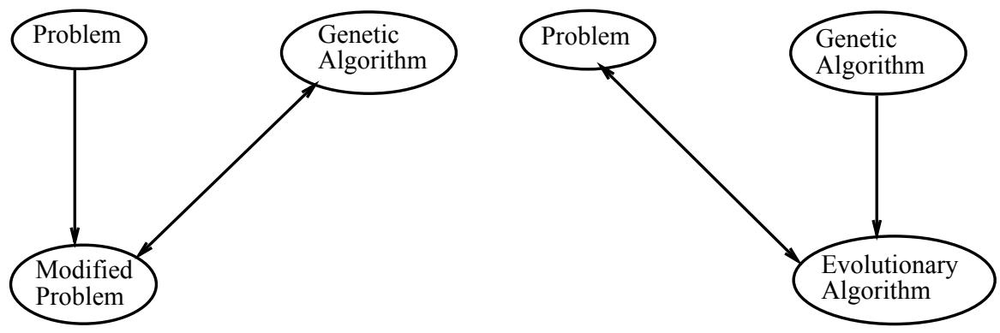

# Evolutionary Computation

Published in Control and Cybernetics 26(3) pp 307-338

Marc Schoenauer\* and Zbigniew Michalewicz†

# Abstract

Evolutionary computation techniques have received a lot of attention regarding their potential as optimization techniques for complex real-world problems. These techniques, based on the powerful principle of "survival of the fittest", model some natural phenomena of genetic inheritance and Darwinian strife for survival; they also constitute an interesting category of modern heuristic search. This introductory article presents the main paradigms of evolutionary algorithms (genetic algorithms, evolution strategies, evolutionary programming, genetic programming) as well as other (hybrid) methods of evolutionary computation. Two particular research directions (parallel evolutionary techniques and self-adaptation) are discussed further in the last part of this paper.

# 1 Introduction

The evolutionary computation (EC) techniques are stochastic algorithms whose search methods model some natural phenomena: genetic inheritance and Darwinian strife for survival. As stated in [33]:

"... the metaphor underlying genetic algorithms1 is that of natural evolution. In evolution, the problem each species faces is one of searching for beneficial adaptations to a complicated and changing environment. The 'knowledge' that each species has gained is embodied in the makeup of the chromosomes of its members."

It seems that EC, as a domain of Computer Sciences, is presently reaching a steady and more mature state. There are several, well established international conferences that attract hundreds of participants (International Conferences on Genetic Algorithms—ICGA [67, 69, 120, 21, 60, 46], Parallel Problem Solving from Nature—PPSN [128, 82, 29, 137],

Annual Conferences on Evolutionary Programming—EP [55, 56, 129, 83, 57]); new annual conferences are getting started, e.g., IEEE International Conferences on Evolutionary Computation [108, 109, 110, 111]. Also, there are many workshops, special sessions, and local conferences every year, all around the world. A relatively new journal, Evolutionary Computation (MIT Press) [36], is devoted entirely to evolutionary computation techniques; the first issue of the next journal, IEEE Transactions on Evolutionary Computation, will appear in May 1997. Many other journals organized special issues on evolutionary computation (e.g., [52, 86]). Many excellent tutorial papers [19, 20, 114, 138, 50] and technical reports provide more-or-less complete bibliographies of the field [2, 65, 119, 97]. There is also The Hitch-Hiker's Guide to Evolutionary Computation prepared initially by Jörg Heitkötter and currently by David Beasley [70], available on comp.ai.genetic interest group (Internet), and a new text, Handbook of Evolutionary Computation, has just appeared [13].

From the point of view of optimization, EC is a powerful stochastic zeroth order method (i.e., requiring only values of the function to optimize) that can find the global optimum of very rough functions. This allows EC to tackle optimization problems for which standard optimization methods (e.g., gradient-based algorithms requiring the existence and computation of derivatives) are not applicable. Moreover, most traditional methods are local in scope, thus they identify only the local optimum closest to their starting point.

Also, it is worthwhile to note that the process of problem solving usually is a two-steps activity:

and for most real-world problems, the model must be simplified to allow classical methods to be applied. For example, transportation problems are often approximated by linear cost functions, since, in a general case, no algorithm will guarantee a global solution for non-linear cost functions. So the question is whether it is better to use an approximate (i.e., simplified) model of the real problem and then find its precise solution, or rather to use an exact model of the problem and find its approximate solution? Very often the latter approach provides with much better results!

However, the price to pay is twofold: firstly, because of its stochastic nature, EC does not offer any guarantee as to its convergence during a given run (the few convergence studies prove some convergence in probability results, or address very restricted classes of functions  see section 3.2); furthermore, the computational cost of an EC run is generally very high, and a large number of function evaluations must be performed for a satisfying result to be (hopefully) found. The first common-sense conclusion (unfortunately often forgotten) is that EC should not be used whenever some quality deterministic optimization method is applicable! On the other hand, there are some clear benefits; the evolutionary paradigm is an example of a weak method, which makes few assumptions about problem domain, so it can be used as an optimization engine for almost any optimization problem.

In this introductory paper we provide with a general outline of a structure of an evolutionary algorithm (EA), discuss the main paradigms of evolutionary computation, and summarize theoretical foundations of EC techniques. The next section provides a personal perspective (of both authors) on the developments in this area, and the last section concludes the paper, with some additional discussion on issues of parallel models and self-adaptation.

For the sake of clarity, we shall try to introduce a general framework accounting as much as possible for most of existing Evolutionary Algorithms.

Let the search space be a metric space $E$ ,and let $F$ be a function $E \to \mathbb { R }$ called the objective function. The problem of evolutionary optimization is to find the maximum of $F$ on $E$ (the case of minimization is easily handled by considering $- F )$ .

A population of size $P \in \mathbb { N }$ is a set of $P$ individuals (points of $E$ ) not necessarily distinct. This population is generally initialized randomly (at time $t = 0$ ) and uniformly on $E$ . The fitnesses of all individuals are computed (on the basis of the values of the objective function); a fitness value is represented as a positive real number—the higher the number, the better the individual. The population then undergoes a succession of generations; the process is illustrated in Figure 1:

procedure evolutionary algorithm   
begin $t  0$ initialize population evaluate population while (not termination-condition) do begin $t \gets t + 1$ select individuals for reproduction apply operators evaluate newborn offspring replace some parents by some offspring end   
end

Several aspects of the evolutionary procedure (Figure 1) require additional comments:

Statistics and stopping criterion: The simplest stopping criterion is based on the generation counter $t$ (or on the number of function evaluations). However, it is possible to use more complex stopping criteria, which depends either on the evolution of the best fitness in the population along generations (i.e., measurements of the gradient of the gains over some number of generations), or on some measure of the diversity of the population.

•Selection: Choice of some individuals that will generate offspring. Numerous selection processes can be used, either deterministic or stochastic. All are based on the fitness of the individuals. Depending on the selection scheme used, some individuals can be selected more than once. At that point, selected individuals give birth to copies of themselves (clones).

Application of evolution operators: To each one of these copies some operator(s) are applied, giving birth to one or more offspring. The choice among possible operators is stochastic, according to user-supplied probabilities. These operators are always stochastic operators, and one usually distinguish between crossover (or recombination) and mutation operators:

crossover operators are operators from $E ^ { k }$ into $E$ , i.e., some parents exchange genetic material to build up one offspring2. In most cases, crossover involves just two parents $k = 2$ ), however, it need not be the case. In a recent studies [44], further continued in this volume [45], the authors investigated the merits of 'orgies', where more than two parents are involved in the reproduction process. Evolution Strategies [127] and Scatter Search techniques [61] also proposed the use of multiple parents. - mutation operators are stochastic operators from $E$ into $E$ .

Evaluation: Computation of the fitnesses of all newborn offspring. As mentioned earlier, the fitness measure of an individual is directly related to its objective function value.

•Replacement: Choice of which individuals will be part of next generation. The choice can be made either from the set of offspring only (in which case all parents "die") or from both sets of offspring and parents. In either case, the this replacement procedure can be deterministic or stochastic.

Sometimes the operators are defined on the same space as the objective function (called phenotype space or behavioral space); in other cases, an intermediate space is introduced (called genotype space or representation space). The mapping from the phenotype space in the genotype space is termed coding. The inverse mapping from the genotype space in the phenotype space is termed decoding. Genotypes undergo evolution operators, and their fitness is evaluated on the corresponding phenotype. The properties of the coding mappings can greatly modify the global behavior of the evolutionary algorithm.

There is a general "agreement" that EC is "made up" of 4 main branches (by alphabetical order):

Evolution Strategies, born in Germany in the 60's [113, 127], to deal with parameter optimization problems.   
•Evolutionary Programming, a branch that appeared in California in the 60's as well, and was first applied on Finite State Automata ([59]).   
• Genetic Algorithms, which emerged in Michigan in the late 60's [72], and were primarily designed to optimally solve sequential decision processes more than to perform function optimization [38].   
•Genetic Programming [80], at first considered a subset of GAs, but now turning into a research field by itself,3 addressing the challenging problem of employing evolution to teach computers to do things without being explicitly programmed to do so.

In the following subsections we discuss in turn the main historical paradigms of these evolutionary computation techniques.

# 2.1 Genetic Algorithms

In the canonical genetic algorithm (GA) [72, 62], the genotype space is $\{ 0 , 1 \} ^ { n }$ . Note that the phenotype space can be any space, as long as it can be coded into bitstring genotypes. The selection scheme is proportional selection (the best-known being the roulette wheel selection): $P$ random choices are made in the whole population, each individual having a probability proportional to its fitness of being selected. The crossover operators replace a segment of bits in the first parent string by the corresponding segment of bits from the second parent, and the mutation operator randomly flips the bits of the parent according to a fixed user-supplied probability. In the replacement phase, all $P$ offspring replace all parents. Due to that generational replacement, the best fitness in the population can decrease: the original GA strategy is not elitist.

In more recent works [84, 112], the genotype space can be almost any space, as long as some crossover and mutation operators are provided. Moreover, proportional selection has been gradually replaced by ranking selection (the selection is performed on the rank of the individuals rather than on their actual fitness), or tournament selection (one selects the best individual among a uniform choice of $T$ individuals, $T$ ranging from 2 to 10). See, e.g., [63, 11, 28] for a discussion on these selection schemes. Finally, most users use the elitist variant of replacement, in which the best individual of generation $t$ is included in generation $t + 1$ , whenever the best fitness value in the population decreases.

# 2.2 Evolution Strategies

The original evolution strategy (ES) algorithm [113, 127] handles a "population" made of a single individual given as a real valued vector. This individual undergoes a Gaussian mutation: addition of zero-mean Gaussian variable of standard deviation $\sigma$ . The fittest from the parent and the offspring becomes the parent of next generation. The critical feature is the choice of parameter $\sigma$ : Originally, the so-called $1 / 5$ thumb rule4 was used to adjust parameter $\sigma$ along evolution.

More recent ES algorithms [127, 12] are population-based algorithms, termed $( \mu , \lambda )$ -ES or $\left( \mu + \lambda \right) { \mathrm { - E S } } \colon \mu$ parents generate $\lambda$ offspring5.

The main operator remains mutation. When working on real-valued vectors (still their favorite universe) ESs generally use the powerful paradigm of self-adaptive mutation: the standard deviations of Gaussian mutations are part of the individuals, and undergo mutation as well. Last, ESs now frequently use a global recombination operator involving all individuals in the population.

The replacement step is deterministic, i.e., the best $\mu$ individuals become the parents of the next generation, chosen among the $\mu + \lambda$ parents plus offspring in the elitist $\left( \mu + \lambda \right) - \mathrm { E S }$ scheme, or among the $\lambda$ offspring in the non-elitist $( \mu , \lambda ) { \mathrm { - E S } }$ scheme (with $\lambda \geq \mu$ ). Typical values for $( \mu , \lambda )$ are $( 1 , 7 )$ , (10, 100) or (30, 200).

# 2.3 Evolutionary Programming

Originally designed to evolve finite state machines [59], evolutionary programming (EP) emphasizes the phenotype space. As in ESs, there is no initial selection: Every individual in the population generates one offspring. Moreover, the only evolution operator is mutation. Finally, the best $P$ individuals among parents and offspring become the parents of the next generation.

Recent advances [51] handle any space, still emphasize the use of mutation as only operator, independently designed the self-adaptive Gaussian deviations for real-valued variables [53], and now use a stochastic tournament replacement scheme: each individual (among the $2 P$ parents plus offspring) encounters $T$ random opponents, increasing its score by one point if it has better fitness. The $P$ individuals having the highest scores get along to the next generation. Note that EP replacement scheme is always elitist.

# 2.4 Genetic Programming

Genetic Programming as a method for evolving computer programs first appeared as an application of GAs [80] to tree-like structures. Original GP evolves tree structures representing LISP-like S-expressions. This allows to define very easily a closed crossover operator (by swapping sub-trees between two valid S-expressions, one always gets a valid S-expression). The usual evolution scheme is the steady state genetic algorithm (SSGA) [139, 133]: a parent is selected by tournament (of size 2 to 7 typically), generates an offspring by crossover only (the other parent is selected by a tournament of usually smaller size). The offspring is then put back in the population using a death-tournament: $T$ individuals are uniformly chosen, and the one with the worse fitness gets replaced by the newborn offspring.

More recently, mutation operators, e.g., random replacement of a subtree or random change of a node or a leaf, have been used (see the state-of-the-art books [79, 6], and the GP paper of this volume [99]). But, though GP can be considered now as the fourth wheel of EC, its actual efficiency is still passionately debated [100].

# 2.5 Modern Trends: Hybrid Methods

Many researchers modified further evolutionary algorithms by 'adding' some problem specific knowledge to the algorithm. Several papers have discussed initialization techniques, different representations, decoding techniques (mapping from genetic representations to phenotypic representations), and the use of heuristics for genetic operators. Davis [32] wrote (in the context of classical, binary GAs):

"It has seemed true to me for some time that we cannot handle most realworld problems with binary representations and an operator set consisting only of binary crossover and binary mutation. One reason for this is that nearly every real-world domain has associated domain knowledge that is of use when one is considering a transformation of a solution in the domain [...] I believe that genetic algorithms are the appropriate algorithms to use in a great many real-world applications. I also believe that one should incorporate real-world knowledge in one's algorithm by adding it to one's decoder or by expanding one's operator set."

Such hybrid/nonstandard systems enjoy a significant popularity in evolutionary computation community. Very often these systems, extended by the problem-specific knowledge, outperform other classical evolutionary methods as well as other standard techniques. For example, a system Genetic-2N [85] constructed for the nonlinear transportation problem used a matrix representation for its chromosomes, a problem-specific mutation (main operator, used with probability 0.4) and arithmetical crossover (background operator, used with probability 0.05). It is hard to classify this system: it is not really a genetic algorithm, since it can run with mutation operator only without any significant decrease of quality of results. Moreover, all matrix entries are foating point numbers. It is not an evolution strategy, since it did not use Gaussian mutation, nor did it encode any control parameters in its chromosomal structures. Clearly, it has nothing to do with genetic programming and very little (matrix representation) with evolutionary programming approaches. It is just an evolutionary computation technique aimed at particular problem.

# 3 Evolutionary Computation: A Discussion

In this section we provide with a discussion on some aspects of genetic algorithms, evolution strategies, evolutionary programming, and genetic programming. We start with some remarks on comparison between these directions, then we summarize briefly some theoretical results, and we conclude this section by providing a (personal) perspective on the development in this field.

# 3.1 Comparison

Many papers have been written on the similarities and differences between these approaches [17, 51, 12]. Clearly, different points of view can be adopted.

The representation issue: Original EP, ESs and GAs address only finite state machines, real numbers and bitstrings, respectively. However, recent tendencies (as discussed briefly in section 2.5) indicate that this is not a major difference. More important is the adequation of the operators to the chosen representation and the objective function (i.e., the fitness landscape) [84, 112].   
Bottom-up versus top-down, and the usefulness of crossover: According to the Schema Theorem [72, 62] (see also the complete survey in this volume [135]), GA main strength comes from the crossover operator: better and better solutions are built by exchanging building blocks from partially good solutions previously built, in a bottom-up approach. The mutation operator is then considered as a background operator. On the other hand, the philosophy behind EP and ESs is that such building blocks might not exist, at least for most real world problems. This top-down view considers that selective pressure plus genotypic variability brought by mutation are sufficient. The discussion on crossover has been going on for a long time [47, 54]. And even when crossover was experimentally demonstrated beneficial to evolution, it could be because it acts like a large mutation; recent experiments [77] suggest that the answer is highly problem dependent.

Yet another example of the duality between crossover and mutation comes from GP history: the original GP algorithm [80] used only crossover, with no mutation at all, the very large population size being supposed to provide all the necessary building blocks to represent at least one sufficiently good solution. But more recent works on GP (including the one presented in this volume [99]) accommodate mutation also, on a much smaller population.

Mutation operators:

The way mutation operators are applied differ from one algorithm to another.

GA uses a static mutation rate, or user-prescribed evolution scheme to globally adjust either the mutation rate (i.e., the number of individuals that undergo mutation) or the strength of mutation (i.e., the average number of bits that are flipped in an individual undergoing mutation).

Originally, ES used a heuristic adaptation mechanism (the $1 / 5$ rule [113]), which was later turned into the modern self-adaptive mutation [127]: All individuals carry their own copy of the standard deviation(s) of the mutation. These variances undergo in turn mutation, and the individual is further modified according to the new value of the variance, which is therefore evolved and optimized "for free" (see also section 4.2 of this paper). The strength of mutation in EP is historically defined as a function of the relative fitness of the individual at hand [49], before independantly turning to self-adaptation [53].

Note that self-adaptive mutation rates (i.e., dependent on the individual) have a significant impact only when all individuals undergo mutation, which is not true for GAs where the mutation rate is generally low. However, the importance of local mutation is confirmed by theoretical results in ESs (see section 3.2). A prerequisite for convergence is the strong causality principle emphasized in [113] of ESs: small mutations should have small effects on the fitness. This is not the case when floating point numbers are encoded into binary strings (as the case is in classical GAs).

The selection-replacement mechanisms range from the totally stochastic fitness proportional selection of GAs with generational replacement, to the deterministic $( \mu , \lambda )$ replacement of ES, through the stochastic, but elitist tournament replacement of EP and the Steady-State scheme (tournament selection and death tournament replacement) used in GP. Though some studies have been devoted to selection/replacement mechanisms (see e.g., [11, 94, 28]), the choice of a selection scheme for a given problem (fitness-representation-operators) is still an open question (and probably is problem-dependent).

The current trend in the EC community is to mix up all these features to best fit the application at hand, on a few pragmatic basis: some ESs applications deal with discrete or mixed real-integer spaces [15], the "binary is the best" credo of GAs has been successfully attacked [8], and the Schema Theorem extended to any representation [112]. Note that some ESs variation incorporate crossover, mutation has been added to GP, etc. And the different selection operators are more and more being used now by the whole community.

On the other hand, such hybrid algorithms, by getting away from the simple original algorithms, also escape the few available theoretical results. Thus, the study of the actual complexity of the resulting algorithms remains unreachable.

# 3.2 Theoretical results

Theoretical studies of Evolutionary Algorithms are of two types: an Evolutionary Algorithm can be viewed as a Markov chain in the space of populations, as population at time $t + 1$ only depends on population at time $t$ (at least in the standard algorithms). The full theory of Markov chains can then be applied. On the other hand, the specific nature of Evolution Strategies allowed precise theoretical studies on the rate of convergence of these algorithms using probability calculus (at least for locally convex functions).

Results based on Markov chains analysis are available for the standard GA scheme (proportional selection with fixed mutation rate) [43, 98]. The need for an elitist strategy is emphasized by Rudolph [116]. When the mutation rate is allowed to decrease along generations, techniques borrowed from the field of Simulated Annealing give more precise convergence results in probability [34, 35]. Yet a different approach is used by Cerf [27], which considers the GA as a stochastic perturbation of a dynamical system (a caricature GA). The powerful Friedlin-Wentzell theory can then be applied, resulting in a lower bound on the population size for a convergence in finite time of a modified GA (in which the selection strength and mutation rate are carefully modified along generations). However, even this last result is non-constructive, i.e., of limited use when actually designing an instance of Evolutionary Algorithm for a particular problem.

On the other hand, ESs have considered theoretical studies from the very beginning: studies on the sphere and corridor models gave birth to the $1 / 5$ rule [113], with determination of the optimal update coefficients for the mutation rate [127]. The theory of ESs later developed to consider global convergence results in probability for the elitist models [14], as well as for the non-elitist $( 1 , \lambda ) { \mathrm { - E S } }$ [117]. The whole body of work by Beyer [22, 23, 24, 25] concentrate on the optimal progress rate for different variants of Evolution Strategies (and for instance justify some parameter settings for self-adaptive mutation given by Schwefel [127]). An example of sucg result is given in Rudolph's paper in this volume [118]. The main weakness of these results remains that they were derived on simple models of function; their main results (e.g., optimal parameter settings) are nevertheless applied without further justification to any function — and usually prove to be efficient hints.

However, one should keep in mind that all the above theoretical analyses address some simple models of Evolutionary Algorithms. As stated in section 2.5, the modern trends of EC gave birth to hybrid algorithms, for which generally no theory is applicable.

# 3.3 A Perspective

The most popular textbook on EC techniques (namely, genetic algorithms) has long been the book by Goldberg [62]. The book provided an easy introduction to binary string GAs and influenced many researchers and practitioners at that time. Most of us, while developing the first evolutionary system, wrote a pure $\grave { a }$ la Goldberg bitstrings GA, which looks like:

randomly initialize the population do forever

decode and evaluate each chromosome (application-specific)   
statistics and display   
stopping criterion ?

if yes then return best chromosome(s) select the parents crossover and mutate replace all parents by offspring end

The specific part is limited to the decoding and evaluation of chromosomes. The statistics and display part allows a posteriori plots of the best and mean values of the fitness along generations, as well as close examination of the whole population. The stopping criterion is either a maximum total number of generation, or a number of generations without improvement of the best-so-far fitness, whichever comes first. User-supplied parameters other than these stopping parameters are the population size, the selective pressure6 for the roulette wheel selection and the crossover and mutation rates. Their adjustment is a trial-and-error process (see [31] for a survey of some possible alternative techniques).

Then, at some stage of experimenting, trying to apply the developed algorithm to a particular real-world problem, most of us realized that some modifications are necessary. For example, when the first author experimented with the constrained trajectory planning problem several years ago [41], he realized the need for a varying length representation for the trajectories, and that was the end of the bitstring representation for him: why enforce all problems to fit into a bitstring representation while handling varying length representations is both feasible and more powerful?

The second author experimented with the nonlinear transportation problem (see [136, 92]) and realized, that the binary representation is not appropriate for this problem. Consequently, the chromosome (in the developed system, Genetic-2N) was represented as a matrix of real values (the genes), and some operators (arithmetical crossover and mutations), which drove the evolution process, were defined. These first experiments from 8 years ago lead to a conclusion that classical genetic algorithms, which operate on binary strings, require a modification of an original problem into appropriate (suitable for GA) form (see the left part of Figure 2); this would include mapping between potential solutions and binary representation and need not be an easy task. On the other hand, a general evolutionary algorithm would leave the problem unchanged, modifying a chromosome representation of a potential solution and applying appropriate operators (the right part of Figure 2).

So, at that time, the issue was as follows: to solve a nontrivial problem using an evolutionary approach, we can either transform the problem into a form appropriate for the genetic algorithm (left part of Figure 2), or we can build a special evolutionary system (this was viewed as transformation of the genetic algorithm at that time, right part of Figure 2) to suit the problem. The experimental evidence indicated that the latter approach was much more successful.

  
Figure 2: Genetic algorithm approach (left) versus the general EC approach (right)

The idea of building specialized evolutionary system which captures characteristic of the problem matured further with additional experiments; few years later (in 1992) the first edition of Genetic Algorithms $^ +$ Data Structures $=$ Evolution Programs was published7[84].

Looking closer at a classical GA it is clear that some of its steps are related to phenotypes whereas others were related to genotypes. More precisely, selection and replacement only know of individuals from their fitness (phenotype space) while recombination and mutation only deal with the actual representation of individuals, i.e., their genotypes. This allows to encapsulate the domain dependent knowledge within the representation of genotypes, with their specific random initialization and operators. The second personal GA simulator (of the first author) witnessed that change of perspective: written in $\mathrm { C } + +$ , it did separate the evolutionary part of GAs from the application-specific design of the individuals. A specific representation is a derived class of the abstract class individual, and must provide the basic methods: random initialization, copy, cross over and mutation (plus i/o functions). The evolution part (concerned with the population) only knows about the abstract class.

randomly initialize the population <specific>   
do forever evaluate each individual <specific> statistics display <specific> stopping criterion ? if yes then return best individual(s) select the parents apply evolution operators <specific> replace all parents by offspring   
and

At that stage, the selection and replacement mechanisms concerned with genotypes were still the standard GAs': proportional selection, crossover and global mutation (same operator for the whole population), all offspring replacing their parents. Apart from problem-specific parameters, the same evolution parameters as in the bitstring algorithm have to be supplied. The sharing scheme [66] has been added in the statistics procedure: the actual fitness of each individual is modulated according to the density of the population around it: the fitness of isolated individuals is increased, while that of individuals in wellrepresented regions of the search space is decreased.

The final step came with applications which required a chromosomal representation for which crossover operators fail to make sense: the problem is that of function identification using recurrent Neural Nets [48]. Taking into account the developments in evolution strategies and evolutionary programming, which were based primarily (or exclusively) on mutations, it is not surprising that mutation-only evolutionary systems represent another alternative in this field.

Thus the next stage of the development of the GA simulator (of the first author) reflected this change of perspective. A population of individuals (still viewed as an abstract class by the population) undergoes evolution using specific operators. Both the selection step and the replacement step are now performed using derived class of an abstract class selector. Moreover, two new selection-related features have been added. The choice of a mate now depends on the first selected parent, allowing to use advanced techniques like restricted mating [62] or the SelSed scheme [115]. An intermediate selection among one (or two) parent(s) and their possibly multiple offspring allows hybrid schemes like the simulated annealing-like tournament between parents and offsprings described in [81], and successfully used on many difficult problems.

Of course, the number of user-supplied parameters has increased. The initial selection, intermediate selection and replacement mechanisms have to be designated. Furthermore, even for the same problem, the dependency of the operators on the individual has to be chosen, e.g., the standard deviation for the Gaussian mutation of real-valued variables can be fixed8, depending on the relative performance of the individual at hand or coded in the individual itself, i.e., determined in a GA-like, EP-like or ES-like manner.

Depending upon the choice of those parameters, the standard evolution schemes of GAs (both generational and steady state), ESs and EP (with or without adaptive mutations) can be reproduced. Note that standard simulated annealing takes place in that framework, using the Metropolis tournament on a population of size 1. Moreover, any new combinations can be experimented with.

# 4 Evolutionary Computation: A Summary

There is a huge experimental evidence of successful applications of Evolutionary Algorithms to difficult optimization problems. Most of these problems could hardly be solved by standard deterministic methods, and often resisted other stochastic or heuristic-based optimization methods. We feel that one key of the successes for applying EA lies in the careful adaptation of the algorithm to the problem at hand. The design of the search space (the genotype space, defined by the representation) is the first crucial step, as demonstrated on different applications over the last twenty years. But the choice of evolution operators has also a critical impact on both the quality of the solution and the computing time to find it. Finally, the definition of the objective function can also turn successful evolutionary optimization into a disaster. The selection of the objective function often depends on additional, problem-specific requirements (e.g., almost all optimization problems include various types of constraints). The issue of constraint-handling is quite complex (see [91, 87]) and often the choice of an appropriate method depends heavily on the characteristic of the problem, e.g., (1) the type of the objective function, (2) the number of variables, (3) number of constraints, (4) types of constraints, (5) number of active constraints at the optimum, (6) the ratio between the sizes of the feasible search space and the whole search space, (7) topology of the feasible search space, etc. Additional considerations should be given to other aspects of evolutionary technique, like the selection method, probabilities of selected operators, population size, etc.

Following [85], we would compare the present situation of EC to that of AI regarding problem solvers some years ago: during a first enthusiastic phase, people had been looking for the general problem solver that would address all possible problems; it progressively occurred that this was merely a mirage, and that taking into account the specificities of the problem at hand could indeed be beneficial.

Recent works in Evolutionary Computation witness the same phenomenon: the idea of a general evolutionary optimizer, mainly present in canonical GAs, has to be abandoned. When facing an optimization problem resisting classical deterministic methods, whatever domain knowledge is available should be sought for and used to design and improve an evolutionary algorithm.

There are several interesting developments and research opportunities in the field of evolutionary computation; these are summarized nicely in a separate article in this volume [39] by Ken De Jong. Our article provides only some comments on two research directions, which, in our opinion, are of utmost importance. These are (1) parallel developments of evolutionary systems and (2) self-adaptation capabilities of evolutionary algorithms. We discuss these two aspects in the following two subsections.

# 4.1 Parallel EC

The computational cost is the Achilles heel of all evolutionary algorithms. A partial solution can be provided by parallelism. Many approaches have been experimented with on parallel evolutionary algorithms, from the simple master-slave model, in which only the evaluation of individuals (function $F$ of section 2) is performed in parallel, to the massively parallel algorithm (called also: finely grained diffusion model), in which each node homes one to a few individuals (these mate with their neighbors only) [134], through the island model (called also: coarsely grained island model), where a small number of subpopulations evolve on different nodes, exchanging individuals with neighboring populations [105]. Due to the high cost of the computation of evaluation of a single individual in many applications we have been working on, we feel the simplest model (i.e., master-slave model) offers the best ratio of (programming work)/(increase of performance), though the increase of performance due to other models can sometimes be super-linear [1].

There are several interesting issues connected with parallel evolutionary algorithms. The central questions to be answered include:

how do they differ from traditional evolutionary algorithms? what are the expected speed improvements? what are the expected improvements in the quality of the solutions? what is the underlying theory behind parallel evolutionary algorithms?

Additionally, all particular approaches of parallel implementations of evolutionary algorithms have their own specific issues. For example, the island model requires decisions on the following parameters [37]:

1. the total number of subpopulations,

2. the number of individuals in each subpopulation,

3. the type of evolutionary algorithm operating on each subpopulation,

4. the connectivity topology between subpopulations,

5. selection of a migration mechanism:

(a) the frequency of migration process, (b) selection of individual(s) to migrate, (c) selection of individual(s) for replacement.

Needless to say, that each of the above decision may have a significant influence on the performance (in terms of computational effort or quality of the final solution) of the algorithm. It might be that (for a particular application) the best performance is achieved with 3 subpopulations of size 70 individuals each, low migration rate, with a random individual replacing another random individual in one of the two other subpopulations. Moreover, it may happen that a change in the population size, or in the migration rate, or in selection of the individual for migration (e.g., the best instead of random), decreases the performance of the algorithm. What does it prove?

It seems that not that much. It would be nice to get some partial results (theoretical or experimental) which would demonstrate a relationship between some factors (e.g., connection between migration rates and selection of individuals for migration). However, such results would be most likely valid for a particular configuration of other decisions (type of evolutionary algorithm, selection of individuals for replacement, etc); it is also quite likely, that the choices listed earlier are (to some degree) problem-dependent.

Anyway, in the above case of an island model, the most typical decision is to have from a few to several subpopulations, all of the same, fixed size. The same evolutionary algorithm (e.g., whether GA or ES) is executed over all subpopulations (eventually with different parameter settings [16]), which are either fully connected or interconnected in some special way (e.g., ring, hypercube, etc). The migration rules usually are set in arbitrary way (or they are fixed after some initial runs of the algorithm—a very much the same way as standard parameters for an evolutionary algorithm for a particular application are determined).

In [26] the author stated that the study of parallel systems is fourishing and that evolutionary algorithms

"...are easy to parallelize and many variants on the basic models have been tried with good results on different classes of problems. However, most of the research has been empirical [..] We found that the research in this field is dominated by the description of experimental results and that very little work has been conducted to give an analytical explanation of what is observed".

Clearly, parallel (distributed) evolutionary algorithms constitute an interesting direction for future research.

# 4.2 Self-adaptation

As evolutionary algorithms implement the idea of evolution, and as evolution itself must have evolved to reach its current state of sophistication, it is natural to expect adaptation to be used in not only for finding solutions to a problem, but also for tuning the algorithm to the particular problem.

In EAs, not only do we need to choose the algorithm, representation and operators for the problem, but we also need to choose parameter values and operator probabilities for the evolutionary algorithm so that it willfind the solution and, what is also important, find it effciently. This is a time consuming task and a lot of effort has gone into automating this process. Researchers have used various ways of finding good values for the strategy parameters as these can affect the performance of the algorithm in a significantly. Many researchers experimented with problems from a particular domain, tuning the strategy parameters on the basis of such experimentation (tuning "by hand"). Later, they reported their results of applying a particular EA to a particular problem, stating:

For these experiments, we have used the following parameters: population $\mathrm { s i z e } = 8 0$ , probability of crossover $= 0 . 7$ , etc.

without much justification of the choice made. Other researchers tried to modify the values of strategy parameters during the run of the algorithm; it is possible to do this by using some (possibly heuristic) rule, by taking feedback from the current state of the search, or by employing some self-adaptive mechanism. Note that these changes may effect a single component of a chromosome, the whole chromosome (individual), or even the whole population. Clearly, by changing these values while the algorithm is searching for the solution of the problem, further efficiencies can be gained.

Self-adaptation, based on the evolution of evolution, was pioneered in Evolution Strategies to adapt mutation parameters to suit the problem during the run. The method was very successful in improving effciency of the algorithm. This technique has been extended to other areas of evolutionary computation, but fixed representations, operators, and control parameters are still the norm.

Other research areas based on the inclusion of adapting mechanisms are:

• representation of individuals (as proposed by Schaffer [130]; the Dynamic Parameter Encoding technique, Schraudolph & Belew [125] and messy genetic algorithms, Goldberg et al. [64] also fall into this category).

•operators. It is clear that different operators play different roles at different stages of the evolutionary process. The operators should adapt (e.g., adaptive crossover Schaffer & Morishima [121], Spears [131]). This is true especially for time-varying fitness landscapes. • control parameters. There have been various experiments aimed at adaptive probabilities of operators [32, 78, 132]. However, much more remains to be done.

The action of determining the variables and parameters of an EA to suit the problem has been termed adapting the algorithm to the problem, and in EAs this can be done while the algorithm is finding the problem solution.

In [71] a comprehensive classification of adaptation was provided. The classification is based on the mechanism of adaptation and the level (in the EA) it occurs: these two classifications are orthogonal and encompass all forms of adaptation within EAs.

For example, one of the possible mechanism for adaptation is deterministic dynamic adaptation, which takes place if the value of a strategy parameter is altered by some deterministic rule; this rule modifies the strategy parameter deterministically without using any feedback from the EA. Usually, the rule will be used when a set number of generations have elapsed since the last time the rule was activated.

This method of adaptation can be used to alter the probability of mutation so that the probability of mutation changes with the number of generations. For example:

$$
m u t \% = 0 . 5 + 0 . 3 \cdot \frac { g } { G } ,
$$

where $g$ is the generation number from $1 \ldots G$ Here the mutation probability $m u t \%$ will increase from 0.5 to 0.8 as the number of generations increases to $G$ .

This method of adaptation was used also in defining a mutation operator for floatingpoint representations [84]: non-uniform mutation. For a parent $\vec { x }$ , if the element $x _ { k }$ was selected for this mutation, the result is $\vec { x } ^ { \prime } = ( x _ { 1 } , \dots , x _ { k } ^ { \prime } , \dots , x _ { n } )$ , where

$$
\begin{array} { r } { x _ { k } ^ { \prime } = \left\{ \begin{array} { l l } { x _ { k } + \triangle ( t , r i g h t ( k ) - x _ { k } ) } \\ { \qquad \mathrm { i f ~ a ~ r a n d o m ~ b i n a r y ~ d i g i t ~ i s ~ 0 ~ } } \\ { x _ { k } - \triangle ( t , x _ { k } - l e f t ( k ) ) } \\ { \qquad \mathrm { i f ~ a ~ r a n d o m ~ b i n a r y ~ d i g i t ~ i s ~ 1 } . } \end{array} \right. } \end{array}
$$

The function $\triangle ( t , y )$ returns a value in the range $[ 0 , y ]$ such that the probability of $\triangle ( t , y )$ being close to 0 increases as $t$ increases $t$ is the generation number). This property causes this operator to search the space uniformly initially (when $t$ is small), and very locally at later stages.

Deterministic dynamic adaptation was also used for changing the objective function of the problem; the point was to increase the penalties for violated constraints with evolution time [76, 88]. Joines $\&$ Houck used the following formula:

$$
\begin{array} { r } { F ( \vec { x } ) = f ( \vec { x } ) + ( C \times t ) ^ { \alpha } \sum _ { j = 1 } ^ { m } f _ { j } ^ { \beta } ( \vec { x } ) , } \end{array}
$$

whereas Michalewicz and Attia experimented with

$$
\begin{array} { r } { F ( \vec { x } , \tau ) = f ( \vec { x } ) + \frac { 1 } { 2 \tau } \sum _ { j = 1 } ^ { m } f _ { j } ^ { 2 } ( \vec { x } ) . } \end{array}
$$

In both cases, functions $f _ { j }$ measure the violation of the $j$ -th constraint.

On the other hand, adaptive dynamic adaptation takes place if there is some form of feedback from the EA that is used to determine the direction and/or magnitude of the change to the strategy parameter. The assignment of the value of the strategy parameter may involve credit assignment, and the action of the EA may determine whether or not the new value persists or propagates throughout the population.

Early examples of this type of adaptation include Rechenberg's $^ { 6 } 1 / 5$ success rule', which was used to vary the step size of mutation [113]. This rule states that the ratio of successful mutations to all mutations should be $1 / 5$ , hence if the ratio is greater than $1 / 5$ then decrease the step size, and if the ration is less than $1 / 5$ then decrease the step size. Another example is Davis's 'adaptive operator fitness', which used feedback from the performance of reproduction operators to adjust their probability of being used [32].

Adaptation was also used to change the objective function by increasing or decreasing penalty coefficients for violated constraints. For example, Bean & Hadj-Alouane [18] designed a penalty function where its one component takes a feedback from the search process. Each individual is evaluated by the formula:

$$
\begin{array} { r } { F ( \vec { x } ) = f ( \vec { x } ) + \lambda ( t ) \sum _ { j = 1 } ^ { m } f _ { j } ^ { 2 } ( \vec { x } ) , } \end{array}
$$

where $\lambda ( t )$ is updated every generation $t$ in the following way:

$$
\lambda ( t + 1 ) = \left\{ \begin{array} { l l } { ( 1 / \beta _ { 1 } ) \cdot \lambda ( t ) , } \\ { \qquad \mathrm { i f } \ddot { \beta } ( i ) \in \mathcal { F } \mathrm { ~ f o r ~ a l l } } \\ { \qquad t - k + 1 \le i \le t } \\ { \beta _ { 2 } \cdot \lambda ( t ) , } \\ { \qquad \mathrm { i f } \ddot { \beta } ( i ) \in \mathcal { S } - \mathcal { F } \mathrm { ~ f o r ~ a l l } } \\ { \qquad t - k + 1 \le i \le t } \\ { \qquad \lambda ( t ) , \ \mathrm { o t h e r w i s e } , } \end{array} \right.
$$

where $\vec { b } ( i )$ denotes the best individual, in terms of function eval, in generation $i$ $, \beta _ { 1 } , \beta _ { 2 } > 1$ and $\beta _ { 1 } \neq \beta _ { 2 }$ (to avoid cycling). In other words, the method (1) decreases the penalty component $\lambda ( t + 1 )$ for the generation $t + 1$ , if all best individuals in the last $k$ generations were feasible, and (2) increases penalties, if all best individuals in the last $k$ generations were infeasible. If there are some feasible and infeasible individuals as best individuals in the last $k$ generations, $\lambda ( t + 1 )$ remains without change.

Other examples include adaptation of probabilities of eight operators for adaptive planner/navigator [140], where the feedback from the evolutionary process includes, through the operator performance index, effectiveness of operators in improving the fitness of a path, their operation time, and their side effect to future generations.

The most challenging idea in this context is that the evolution of evolution can be used to implement the self-adaptation of parameters. Here the parameters to be adapted are encoded onto the chromosome(s) of the individual and undergo mutation and recombination. These encoded parameters do not affect the fitness of individuals directly, but "better" values will lead to "better" individuals and these individuals will be more likely to survive and product offspring and hence propagate these "better" parameter values.

Schwefel [127] pioneered this method to self-adapt the mutation step size and the mutation rotation angles in Evolution Strategies. Self-adaption was extended to EP by Fogel et al. [58] and to GAs by Bäck [10] and Hinterding [73].

The parameters to self adapt can be parameter values or probabilities of using alternative processes, and as these are numeric quantities this type of self-adaptation has been used mainly for the optimization of numeric functions. This has been the case when single chromosome representations are used (which is the overwhelming case), as otherwise numerical and non-numerical representations would need to be combined on the same chromosome. Examples of self-adaptation for non-numerical problems are Fogel et al. [58] where they self-adapted the relative probabilities of five mutation operators for the components of a finite state machine. The other example is Hinterding [73], where a multi-chromosome GA is used to implement the self-adaptation in the Cutting Stock Problem with contiguity. Here self-adaptation is used to adapt the probability of using one of the two available mutation operators, and the strength of the group mutation operator.

We can also define at what level within the EA and the solution representation adaptation takes place: level of environment, population, individual or component. These levels of adaptation can be used with each of the types of adaptation, and a mixture of levels and types of adaptation can be used within an EA. (for all full discussion, see [71]). These types can be mixed together: the classic example of combining forms of adaptation is in ESs, where the algorithm can be configured for individual level adaptation (one mutation step size per individual), component level adaptation (one mutation step size per component) or with two types of component level adaptation where both the mutation step size and rotation angle is self-adapted for individual components [126].

Hinterding et al. [74] combine global level adaptation of the population size with individual level self-adaptation of the mutation step size for optimizing numeric functions.

Combining forms of adaptation has not been used much as the interactions are complex, hence deterministic or adaptive rules will be difficult to work out. But self-adaptation where we use evolution to determine the beneficial interactions (as in finding solutions to problems) would seem to be the best approach.

# Список литературы

[1] M. Ahuactzin, E. Talbi, P. Bessiere, and E. Mazer. Using genetic algorithms for robot motion planning. In Proceedings of European Conference on Artificial Intelligence, 1992.   
[2] J.T. Alander. An Indexed Bibliography of Genetic Algorithms: Years 1957-1993. Department of Information Technology and Production Economics, University of Vaasa, Finland, Report Series No.94-1, 1994.   
[3] J.-M. Alliot, E. Lutton, E. Ronald, and M. Schoenauer, editors. Actes de la Conférence Evolution Artificielle. Toulouse, Cepadues, September 1994.   
[4] J.-M. Alliot, E. Lutton, E. Ronald, M. Schoenauer, and D. Snyers, editors. Artificial Evolution. Brest, Springer Verlag, 1995.   
[5] P.J. Angeline. Adaptive and Self-Adaptive Evolutionary Computation. In Palaniswami, M., Attikiouzel, Y., Marks, R.J.II, Fogel, D., and Fukuda, T. (Eds), Computational Intelligence, A Dynamic System Perspective, IEEE Press, pp.152161, 1995.   
[6] P. J. Angeline and Jr K. E. Kinnear, editors, Advances in Genetic Programming II, Cambridge, MA, 1996. MIT Press.   
[7] P.J. Angeline, G. M. Saunders, and J. B. Pollack. An evolutionary algorithm that constructs recurrent neural networks. IEEE Transactions on Neural Networks, 5(2):86- 91, 1993.   
[8] J. Antonisse. A new interpretation of schema notation that overturns the binary encoding constraint. In [120], pp. 8691.   
[9] J. Arabas, Z. Michalewicz, and J. Mulawka. GAVaPS — a Genetic Algorithm with Varying Population Size. In [108], pp.7378.   
[10] T. Bäck. Self-adaption in genetic algorithms. In Proceedings of the First European Conference on Artificial Life, Cambridge, 1992. MIT Press. pp. 263-271.   
[11] T. Bäck. Generalized convergence models for tournament- and $( \mu , \lambda )$ -selections. In L. J. Eshelman, editor, Proceedings of the $6 ^ { t h }$ International Conference on Genetic Algorithms, pages 28. Morgan Kaufmann, 1995.   
[12] T. Bäck. Evolutionary Algorithms in theory and practice. New-York:Oxford University Press, 1995.   
[13] T. Bäck, D. Fogel, and Z. Michalewicz, Z. Handbook of Evolutionary Computation. Oxford University Press, New York, February 1997.   
[14] T. Bäck, G. Rudolph, and H.-P. Schwefel. Evolutionary programming and evolution strategies: Similarities and differences. In [56], pp. 1122.   
[15] T. Bäck and M. Schütz. Evolution strategies for mixed-integer optimization of optical multilayer systems. In [83].   
[16] Th. Bäck, J. Heistermann, C. Kappler, and M.Gzamparelli. Evolutionary Algorithms Support Refuling of Pressurized Water Reactors. In [110], pp 104-108.   
[17] T. Bäck and H.-P. Schwefel. An overview of evolutionary algorithms for parameter optimization. Evolutionary Computation, 1(1):1-23, 1993.   
[18] J.C. Bean and A.B. Hadj-Alouane. A dual genetic algorithm for bounded integer programs. Tr 92-53, Department of Industrial and Operations Engineering, The University of Michigan, 1992.   
[19] D. Beasley, D.R. Bull, and R.R. Martin. An Overview of Genetic Algorithms: Part 1, Foundations. University Computing, Vol.15, No.2, pp.58-69, 1993.   
[20] D. Beasley, D.R. Bull, and R.R. Martin. An Overview of Genetic Algorithms: Part 2, Research Topics. University Computing, Vol.15, No.4, pp.170-181, 1993.   
[21] R. Belew and L. Booker (Editors). Procedings of the Fourth International Conference on Genetic Algorithms, Morgan Kaufmann Publishers, Los Altos, CA, 1991.   
[22] H.-G. Beyer. Toward a theory of evolution strategies: Some asymptotical results for the $( 1 , + \lambda )$ -theory. Evolutionary Computation, 1(2):165-188, 1993.   
[23] H.-G. Beyer. Toward a theory of evolution strategies: The $( \mu , \lambda )$ -theory. Evolutionary Computation, 2(4):381407, 1994.   
[24] H.-G. Beyer. Toward a theory of evolution strategies: On the benefit of sex - the $( \mu / \mu , \lambda )$ -theory. Evolutionary Computation, 3(1):81-111, 1995.   
[5] H.-G. Beyer. Toward a theory of evolution strategies: Self-adaptation. Evolutionary Computation, 3(3):311347, 1995.   
[26] E. Cantú-Paz. A summary of research on parallel genetic algorithms. IlliGAL Report No. 95007, University of Illinois at Urbana-Champaign, July 1995.   
[27] R. Cerf. An asymptotic theory of genetic algorithms. In J.-M. Alliot, E. Lutton, E. Ronald, M. Schoenauer, and D. Snyers, editors, Artificial Evolution, volume 1063 of LNCS. Springer Verlag, 1996.   
[28] U. Chakraborty, K. Deb, and M. Chakraborty. Analysis of selection algorithms: A markov chain approach. Evolutionary Computation, 4(2):133-168, Summer 1996.   
[29] Y. Davidor, H.-P. Schwefel, and R. Männer (Editors). Proceedings of the Third International Conference on Parallel Problem Solving from Nature (PPSN), SpringerVerlag, New York, 1994.   
[30] L. Davis (Editor). Genetic Algorithms and Simulated Annealing, Morgan Kaufmann Publishers, Los Altos, CA, 1987.   
[31] L. Davis. Handbook of Genetic Algorithms. Van Nostram Reinhold, New York, 1991.   
[32] L. Davis. Adapting Operator Probabilities in Genetic Algorithms. In [120], pp.6169.   
[33] L. Davis and M. Steenstrup. Genetic Algorithms and Simulated Annealing: An Overview. In [30], pp.1-11.   
[34] T.E. Davis and J. C. Principe. A simulated annealing like convergence theory for simple genetic algorithm. In R. K. Belew and L. B. Booker, editors, Proceedings of the $4 ^ { t h }$ International Conference on Genetic Algorithms, pages 174-181. Morgan Kaufmann, 1991.   
[35] T.E. Davis and J. C. Principe. A markov chain framework for the simple genetic algorithm. Evolutionary Computation, 1(3):269-292, 1993.   
[36] K.A. De Jong (Editor). Evolutionary Computation, MIT Press, 1993.   
[37] K.A. De Jong. Parallel and distributed evolutionary algorithms. Presented at the workshop Evolutionary Algorithms, organized by Institute for Mathematics and Its Applications, University of Minnesota, Minneapolis, Minnesota, October 21-25, 1996.   
[38] K.A. De Jong. Are genetic algorithms function optimizers ? In [82], pp. 3-13.   
[39] K.A. De Jong. Evolutionary computation: recent developments and open issues. This special issue.   
[40] K.A. De Jong and J. Sarma. On decentralizing selection algorithms. In [46], pp. 1723. Morgan Kaufmann, 1995.   
[41] C. Desquilbet. Détermination de trajets optimaux par algorithmes génétiques. Rapport de stage d'option B2 de l'Ecole Polytechnique. Palaiseau, Juin 1992.   
[42] C. Desquilbet and P. Sassus. Reconnaissance de détails en niveaux de gris par algorithmes génétiques. Rapport de travail personnel. Majeure SICS de l'Ecole Polytechnique. Palaiseau, March 1992.   
[43] A.E. Eiben, E.H.L. Aarts, and K.M. Van Hee. Global convergence of genetic algorithms: a markov chain analysis. In Hans-Paul Schwefel and Reinhard Männer, editors, Proceedings of the $1 ^ { s t }$ Parallel Problem Solving from Nature, pages 4-12. Springer Verlag, 1991.   
[44] A.E. Eiben, P.-E. Raue, and Zs. Ruttkay. Genetic Algorithms with Multi-parent Recombination, in [29], pp.7887.   
[45] A.E. Eiben, and C.H.M. van Keremade. Diagonal Crossover in Genetic Algorithms for Nmerical Optimization, Control and Cybernetics, this volume, 1997.   
[46] L.J. Eshelman (Editor), Proceedings of the Sixth International Conference on Genetic Algorithms, Morgan Kaufmann, San Mateo, CA, 1995.   
[47] L.J. Eshelman, R. A. Caruana, and J. D. Schaffer. Biases in the crossover landscape. In [120], pp. 1019.   
[48] A. Fadda and M. Schoenauer. Evolutionary chromatographic law identification by recurrent neural nets. In J. R. McDonnell, R. G. Reynolds, and D. B. Fogel, editors, Proceedings of the 4th Annual Conference on Evolutionary Programming, pages 219- 235. MIT Press, March 1995.   
[49] D. B. Fogel. An analysis of evolutionary programming. In [55], pp 4351.   
[50] D.B. Fogel. An Introduction to Simulated Evolutionary Optimization, IEEE Transactions on Neural Networks, special issue on Evolutionary Computation, Vol.5, No.1, 1994.   
[51] D. B. Fogel. Evolutionary Computation. Toward a New Philosophy of Machine Intelligence. IEEE Press, Piscataway, NJ, 1995.   
[52] D.B. Fogel (Editor). IEEE Transactions on Neural Networks, special issue on Evolutionary Computation 5(1), 1994.   
[53] D. B. Fogel, L. J. Fogel, W. Atmar, and G. B. Fogel. Hierarchic methods of evolutionary programming. In [55], pp. 175-182.   
[54] D.B. Fogel and L.C. Stayton. On the effectiveness of crossover in simulated evolutionary optimization. BioSystems, 32:171182, 1994.   
[55] D.B. Fogel and W. Atmar. Proceedings of the First Annual Conference on Evolutionary Programming, La Jolla, CA, 1992, Evolutionary Programming Society.   
[56] D.B. Fogel and W. Atmar. Proceedings of the Second Annual Conference on Evolutionary Programming, La Jolla, CA, 1993, Evolutionary Programming Society.   
[57] L.J. Fogel, P. Angeline, T. Bäck (Editors). Proceedings of the Fifth Annual Conference on Evolutionary Programming, The MIT Press, 1996.   
[58] L.J. Fogel, P.J. Angeline, and D.B. Fogel. An evolutionary programming approach to self-adaption on finite state machines. In [83], pp. 355-365.   
[59] L. J. Fogel, A. J. Owens, and M. J. Walsh. Artificial Intelligence through Simulated Evolution. New York: John Wiley, 1966.   
[60] S. Forrest (Editor). Proceedings of the Fifth International Conference on Genetic Algorithms. Morgan Kaufmann Publishers, Los Altos, CA, 1993.   
[61] F. Glover. Heuristics for Integer Programming Using Surrogate Constraints. Decision Sciences 8(1), pp.156166, 1977.   
[62] D.E. Goldberg. Genetic algorithms in search, optimization and machine learning. Addison Wesley, 1989.   
[63] D.E. Goldberg and K. Deb. A comparative study of selection schemes used in genetic algorithms. In G. J. E. Rawlins, editor, Foundations of Genetic Algorithms, pp. 69-93. Morgan Kaufmann, 1991.   
[64] D.E. Goldberg, K. Deb, and B. Korb. Do not worry, be messy. In Proceedings of the 4th International Conference on Genetic Algorithms. Morgan Kaufmann, 1991. pp. 2430.   
[65] D.E. Goldberg, K. Milman, and C. Tidd. Genetic Algorithms: A Bibliography. IlliGAL Technical Report 92008, 1992.   
[66] D.E. Goldberg and J. Richardson. Genetic algorithms with sharing for multi-modal function optimization. In J. J. Grefenstette, editor, Proceedings of the $2 ^ { n d }$ International Conference on Genetic Algorithms, pp. 41-49. Lawrence Erlbaum Associates, 1987.   
[67] J.J. Grefenstette (Editor). Proceedings of the First International Conference on Genetic Algorithms. Lawrence Erlbaum Associates, Hillsdale, NJ, 1985.   
[68] J.J. Grefenstette. Optimization of Control Parameters for Genetic Algorithms. IEEE Transactions on Systems, Man, and Cybernetics 16(1), pp.122128, 1986.   
[69] J.J. Grefenstette (Editor). Proceedings of the Second International Conference on Genetic Algorithms. Lawrence Erlbaum Associates, Hillsdale, NJ, 1987.   
[70] J. Heitkötter, J. The Hitch-Hiker's Guide to Evolutionary Computation. FAQ in comp.ai.genetic, issue 1.10, 20 December 1993.   
[71] R. Hinterding, Z. Michalewicz, and A.E. Eiben. Adaptation in Evolutionary Computation: A Survey. In [111].   
[72] J. H. Holland. Adaptation in natural and artificial systems. University of Michigan Press, Ann Arbor, 1975.   
[73] R. Hinterding. Gaussian mutation and self-adaption in numeric genetic algorithms. In [110], pp. 384389.   
[74] R. Hinterding, Z. Michalewicz, and T.C. Peachey. Self-adaptive genetic algorithm for numeric functions. In [137], pp. 420429.   
[75] C. Z. Janikow and Z. Michalewicz. An experimental comparison of binary and foating point representations in genetic algorithms. In [21], pp. 31-36.   
[76] J.A. Joines and C.R. Houck. On the use of non-stationary penalty functions to solve nonlinear constrained optimization problems with gas. In [108], pp. 579584.   
[77] T. Jones. Crossover, macromutation and population-based search. In [46], pp. 7380.   
[78] B.A. Julstrom. What have you done for me lately? adapting operator probabilities in a steady-state genetic algorithm. In [46], pp. 81-87.   
[79] Jr K. E. Kinnear, editor, Advances in Genetic Programming, Cambridge, MA, 1996. MIT Press.   
[80] J.R. Koza. Genetic Programming: On the Programming of Computers by means of Natural Evolution. MIT Press, Massachussetts, 1994.   
[81] S.W. Mahfoud and D. E. Goldberg. A genetic algorithm for parallel simulated annealing. In [82], pp. 301310.   
[82] R. Männer and B. Manderick (Editors). Proceedings of the Second International Conference on Parallel Problem Solving from Nature (PPSN). North-Holland, Elsevier Science Publishers, Amsterdam, 1992.   
[83] J.R. McDonnell, R.G. Reynolds, and D.B. Fogel (Editors). Proceedings of the Fourth Annual Conference on Evolutionary Programming. The MIT Press, 1995.   
[84] Z. Michalewicz. Genetic Algorithms+Data Structures $=$ Evolution Programs. Springer Verlag, New-York, 1996. 3rd edition.   
[85] Z. Michalewicz. A Hierarchy of Evolution Programs: An Experimental Study. Evolutionary Computation, 1(1), pp. 5176.   
[86] Z. Michalewicz (Editor). Statistics & Computing, special issue on evolutionary computation, 4(2), 1994.   
[87] Z. Michalewicz Heuristic Methods for Evolutionary Computation Techniques. Journal of Heuristics 1(2), 1995, pp.177-206.   
[88] Z. Michalewicz and N. Attia. Evolutionary Optimization of Constrained Problems. In [129], pp.98108.   
[89] Z. Michalewicz, D. Dasgupta, R.G. Le Riche, and M. Schoenauer. Evolutionary Algorithms for Constrained Engineering Problems. Computers & Industrial Engineering Journal, 30(4), 1996, pp.851870.   
[90] Z. Michalewicz and G. Nazhiyath. Genocop III: A Co-evolutionary Algorithm for Numerical Optimization Problems with Nonlinear Constraints. In [109], pp.647-651.   
[91] Z. Michalewicz. and M. Schoenauer. Evolutionary Algorithms for Constrained Parameter Optimization Problems. Evolutionary Computation, 4(1), pp. 1-32.   
[92] Z. Michalewicz, G.A. Vignaux, and M. Hobbs. A Non-Standard Genetic Algorithm for the Nonlinear Transportation Problem. ORSA Journal on Computing, 3(4), 1991, pp.307-316.   
[93] Z. Michalewicz and J. Xiao. Evaluation of Paths in Evolutionary Planner/Navigator. In Proceedings of the 1995 International Workshop on Biologically Inspired Evolutionary Systems, Tokyo, Japan, May 30-31, 1995, pp.4552.   
[94] B.L. Miler nd D.E. Golber. Genic aorhs,elecin shemes, an the a effects of noise. Evolutionary Computation, 4(2):113-132, Summer 1996.   
[95] H. Mühlenbein. Parallel Genetic Algorithms, Population Genetics and Combinatorial Optimization. In [120], pp.416-421.   
[96] H. Mühlenbein and D. Schlierkamp-Vosen. Predictive Models for the Breeder Genetic Algorithm. Evolutionary Computation, 1(1), pp.25-49, 1993.   
[97] V. Nissen. Evolutionary Algorithms in Management Science: An Overview and List of References. European Study Group for Evolutionary Economics, 1993.   
[98] A.E. Nix and M.D. Vose. Modeling genetic algorithms with markov chains. Annals of Mathematics and Artificial Intelligence, 5(1):79-88, 1992.   
[99] P. Nordin and W. Banzhaf. Real Time Control of a Khepera Robot using Genetic Programming. Control and Cybernetics, this volume, 1997.   
[100] U.-M. O'Reilly. An Analysis of Genetic Programming. PhD thesis, Carleton University, Ottawa, Ontario, Canada, 1995.   
[101] D. Orvosh and L. Davis. Shall We Repair? Genetic Algorithms, Combinatorial Optimization, and Feasibility Constraints. In [60], p.650.   
[102] C.C. Palmer and A. Kershenbaum. Representing Trees in Genetic Algorithms. In [108], pp.379384.   
[103] J. Paredis. Genetic State-Space Search for Constrained Optimization Problems. Proceedings of the Thirteen International Joint Conference on Artificial Intelligence, Morgan Kaufmann, San Mateo, CA, 1993.   
[104] J. Paredis. Co-evolutionary Constraint Satisfaction. In [29], pp.46-55.   
[105] C.B. Petty, M.R. Leuze, and J.J. Grefenstette. A parallel genetic algorithm. In [69], pp. 155161.   
[106] D. Powell and M.M. Skolnick. Using Genetic Algorithms in Engineering Design Optimization with Non-linear Constraints. In [60], pp.424430.   
[107] M. Potter and K.A. De Jong. A Cooperative Coevolutionary Approach to Function Optimization. In [29], pp.249257.   
[108] Proceedings of the First IEEE International Conference on Evolutionary Computation, Orlando, 26 June - 2 July, 1994.   
[109] Proceedings of the Second IEEE International Conference on Evolutionary Computation, Perth, 29 November - 1 December, 1995.   
[110] Proceedings of the Third IEEE International Conference on Evolutionary Computation, Nagoya, 1822 May, 1996.   
[111] Proceedings of the Forth IEEE International Conference on Evolutionary Computation, Indianapolis, 1316 April, 1996.   
[112] N. J. Radcliffe. Equivalence class analysis of genetic algorithms. Complex Systems, 5pp.18320, 1991.   
[113] I. Rechenberg. Evolutionstrategie: Optimierung Technisher Systeme nach Prinzipien des Biologischen Evolution. Fromman-Holzboog Verlag, Stuttgart, 1973.   
[114] C.R. Reeves. it Modern Heuristic Techniques for Combinatorial Problems, Blackwell Scientific Publications, London, 1993.   
[115] E. Ronald. When selection meets seduction. In L. J. Eshelman, editor, Proceedings of the $6 ^ { t h }$ International Conference on Genetic Algorithms, pp. 167-173. Morgan Kaufmann, 1995.   
[116] G. Rudolph. Convergence analysis of canonical genetic algorithm. IEEE Transactions on Neural Networks, 5(1)pp.96-101, 1994.   
[117] G. Rudolph. Convergence of non-elitist strategies. In Z. Michalewicz, J. D. Schaffer, H.-P. Schwefel, D. B. Fogel, and H. Kitano, editors, Proceedings of the First IEEE International Conference on Evolutionary Computation, pp. 63-66. IEEE Press, 1994.   
[118] G. Rudolph Convergence rates of Evolutionary Algorithms for a Class of Convex Objective Functions. Control and Cybernetics, this volume, 1997.   
[119] N. Saravanan and D.B. Fogel. A Bibliography of Evolutionary Computation & Applications. Department of Mechanical Engineering, Florida Atlantic University, Technical Report No. FAU-ME-93-100, 1993.   
[120] J.D. Schaffer (Editor). Proceedings of the Third International Conference on Genetic Algorithms. Morgan Kaufmann Publishers, Los Altos, CA, 1989.   
[121] J.D. Schaffer and A. Morishima. An adaptive crossover distribution mechanism for genetic algorithms. In Proceedings of the 2nd International Conference on Genetic Algorithms. Lawrence Erlbaum Associates, 1987. pp. 3640.   
[122] M. Schoenauer. Iterated genetic algorithms. Technical Report 304, Centre de Mathématiques Appliquées de l'Ecole Polytechnique, October 1994.   
[ . M.S, F. Joe, B.Ly,  H. Ma. : Eoly identification of macro-mechanical models. In P. J. Angeline and Jr K. E. Kinnear, editors, Advances in Genetic Programming II, pp. 467-488, Cambridge, MA, 1996. MIT Press.   
[124] M. Schoenauer and S. Xanthakis. Constrained GA optimization. In S. Forrest, editor, Proceedings of the $5 ^ { t h }$ International Conference on Genetic Algorithms, pp. 573580. Morgan Kaufmann, 1993.   
[125] N. Schraudolph and R. Belew. Dynamic parameter encoding for genetic algorithms. Machine Learning, vol. 9(1):pp. 921, 1992.   
[126] H-P. Schwefel. Numerische Optimierung von Computer-Modellen mittels der Evolutionsstrategie, volume 26 of Interdisciplinary systems research. Birhäuser, Basel, 1977.   
[127] H.-P. Schwefel. Numerical Optimization of Computer Models. John Wiley & Sons, New-York, 1981. 1995 - 2nd edition.   
[128] H.-P. Schwefel and R. Männer (Editors). Proceedings of the First International Conference on Parallel Problem Solving from Nature (PPSN). Springer-Verlag, Lecture Notes in Computer Science, Vol.496, 1991.   
[129] A.V. Sebald and L.J. Fogel. Proceedings of the Third Annual Conference on Evolutionary Programming, San Diego, CA, 1994, World Scientific.   
[130] C.G. Shaefer. The argot strategy: Adaptive representation genetic optimizer technique. In Proceedings of the 2nd International Conference on Genetic Algorithms. Lawrence Erlbaum Associates, 1987. pp. 5055.   
[131] W.M. Spears. Adapting crossover in evolutionary algorithms. In J.R. McDonnell, R.G. Reynolds, and D.B. Fogel, editors, Proceedings of the Fourth Annual Conference on Evolutionary Programming. The MIT Press, 1995. pp. 367-384.   
[132] M. Srinivas and L.M. Patnaik. Adaptive probabilities of crossover and mutation in genetic algorithms. IEEE Transactions on Systems, Man, and Cybernetics, vol. 24(4):pp. 1726, 1994.   
[133] G. Syswerda. A study of reproduction in generational and steady state genetic algorithm. In G. J. E. Rawlins, editor, Foundations of Genetic Algorithms, pages 94101. Morgan Kaufmann, 1991.   
[134] H. Tamaki and Y. Nishikawa. A parallel genetic algorithm based on a neighborhood model and its application ot job-shop scheduling. In R. Manner and B. Manderick, editors, Proceedings of the $2 ^ { n d }$ Conference on Parallel Problems Solving from Nature, pp. 573582, 1992.   
[135] G. Venturini, S. Rochet, and M. Slimane. Schemata and deception in binary genetic algorithms: a tutorial. Control and Cybernetics, this volume, 1997.   
[136] G.A. Vignaux and Z. Michalewicz. A Genetic Algorithm for the Linear Transportation Problem. IEEE Transactions on Systems, Man, and Cybernetics, 21(2), 1991, pp.445452.   
[137] H.-M. Voigt, W. Ebeling, I. Rechenberg, and H.-P. Schwefel (Editors). Proceedings of the Fourth International Conference on Parallel Problem Solving from Nature (PPSN). Springer-Verlag, New York, 1996.   
[138] D. Whitley. Genetic Algorithms: A Tutorial. In [86], pp.65-85.   
[139] D. Whitley. The GENITOR algorithm and selection pressure: Why rank-based allocation of reproductive trials is best. In J. D. Schaffer, editor, Proceedings of the $3 ^ { r d }$ International Conference on Genetic Algorithms, pages 116-121. Morgan Kaufmann, 1989.   
[140] J. Xiao, Z. Michalewicz, L. Zhang, and K. Trojanowski. Adaptive Evolutionary Planner/Navigator for Mobile Robots. IEEE Transactions on Evolutionary Computation, 1(1), 1997.