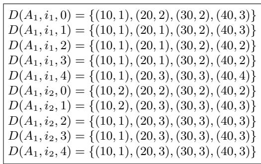
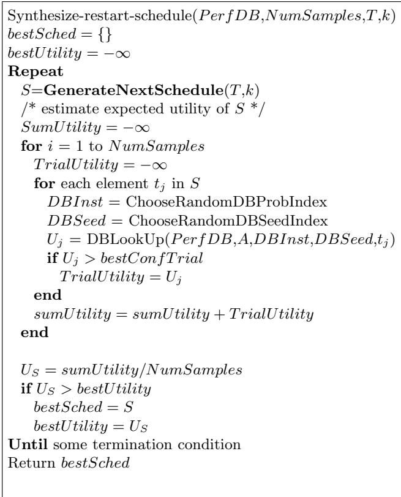
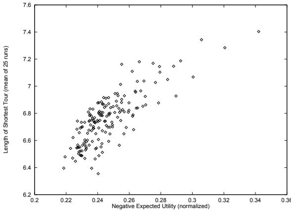
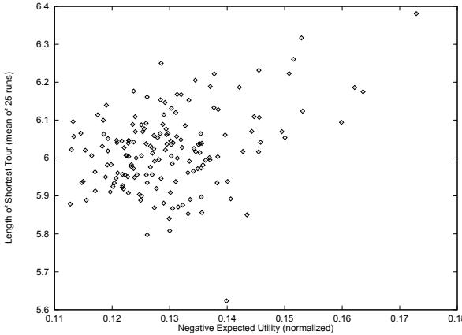
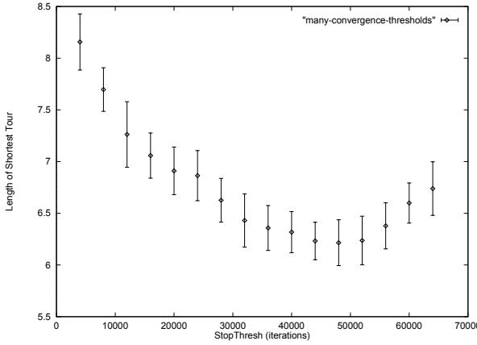

# Restart Scheduling for Genetic Algorithms

Alex S. Fukunaga

Jet Propulsion Laboratory, California Institute of Technology, 4800 Oak Grove Dr., Mail Stop 126-347, Pasadena, CA 91109-8099, alex.fukunaga@jpl.nasa.gov

Abstract. In order to escape from local optima, it is standard practice to periodically restart a genetic algorithm according to some restart criteria/policy. This paper addresses the issue of finding a good restart strategy in the context of resource-bounded optimization scenarios, in which the goal is to generate the best possible solution given a fixed amount of time. We propose the use of a restart scheduling strategy which generates a static restart strategies with optimal expected utility, based on a database of past performance of the algorithm on a class of problem instances. We show that the performance of static restart schedules generated by the approach can be competitive to that of a commonly used dynamic restart strategy based on detection of lack of progress.

# 1 Introduction

It is well-known that genetic algorithms (GAs) often converge to local optima before discovering a globally optimal solution. Much research has focused on the problem of preventing premature convergence, including various niching/speciation/mating neighborhood models (c.f. [4, 6, 3, 2, 5]). However, even when mechanisms for preventing premature convergence are implemented, extended runs of GAs still reach a point of significantly diminishing marginal return, i.e., convergence. Furthermore, for most real-world problems, it is not possible to know whether a GA has found the global optimum, or whether it has become stuck at a local optimum (there are some exceptional cases when a bound on the optimum can be computed).

Thus, it is standard practice to periodically restart GAs according to some restart criteria/policy. However, to date, the subject of restart policies for GAs has been neglected. A common technique is to apply some metric of progress or convergence, and to terminate the current run and restart with a new seed when some threshold is reached (typically when no progress has been made for a long time, or when convergence is detected using some other metric).

In this paper, we address the issue of finding a good restart strategy in the context of resource-bounded optimization scenarios, in which the goal is to generate the best possible solution given a fixed amount of time. We first define a framework for resource-bounded optimization, and describe a restart scheduling approach which uses performance data from previous runs of the algorithm on similar problems. We experimentally evaluate the restart scheduling approach by comparing its performance to that of a restart strategy based on performance improvement probability bound on a genetic algorithm for the traveling salesperson problem (TSP). The paper concludes with a review of related work and a discussion of our results.

# 2 Restart Strategies for Resource-Bounded Optimization

We define the problem of resource-bounded optimization as follows: Let $A$ be an optimization algorithm, and $d$ be a problem instance (an objective function). Let $T$ be a resource usage limit for $A$ . In this paper, we assume that $T$ is measured in a number of discrete “steps”, or objective function evaluations – we assume that all objective function evaluations take approximately the same amount of time. Let $U ( A , d , T )$ , the utility of the algorithm $A$ on $d$ given time $T$ , be the utility of the best solution found by the algorithm within the time bound. The task of resource-bounded optimization is to maximize $U$ (i.e., obtain the best possible solution quality within a given time).

We assume that it does not matter when the maximal value of $U$ is obtained within the time window $[ 0 , T ]$ . This is a reasonable model of many real-world optimization scenarios, in which an optimization expert is given a hard deadline at which to present the best solution found. In this problem framework, the only thing that matters is the utility of the best solution found within the deadline. Metrics such as rate of improvement of the best-so-far solution, or convergence of the population are irrelevant with respect to how an algorithm’s performance is evaluated.

In many cases, particularly if $T$ is large enough, it is possible to start a run of $A$ , terminate it after $t _ { 1 }$ steps, restart $A$ and run for $t _ { 1 }$ steps, and repeat this process $n$ times, where $\textstyle \sum _ { i = 1 } ^ { n } t _ { i } = T$ .

A restart strategy determines $t _ { 1 } , \ldots t _ { n }$ , and can be either static or dynamic. Static restart strategies determine $t _ { 1 } , . . . t _ { n }$ prior to running the algorithm. For example, a strategy which allocates resources equally among $n$ restarts is a static strategy. Dynamic strategies, on the other hand, decide during runtime when a restart should take place. For example, we could repeat the following until the total number of steps taken is $T$ : run $A$ until a convergence criterion is met, then restart.

In the remainder of this paper, we focus on an approach to generating good static restart strategies based on performance data collected for previous runs of the optimization algorithm on similar problems.

# 3 Optimizing a Restart Schedule Based on Past Performance Data

If we assume that we are applying a GA to a class of resource-bounded optimization problem instances where the members of the class are somewhat similar to each other with respect to how a restart strategy performs on them, then a reasonable approach to developing a restart schedule is to design a strategy which has high expected utility for the class of problems.

We define a static restart schedule to be the set $S = \{ t _ { 1 } , t _ { 2 } , . . . t _ { n } \}$ , where $\textstyle \sum _ { i = 1 } ^ { n } t _ { i } = T$ . Given an algorithm $A$ and problem instance $d$ , $A$ is executed with $d$ as the input for $t _ { i }$ steps, for each $_ i$ , $1 \leq i \leq n$ . The best solution found among all of the restarts is stored and returned as the result of the restart schedule execution. The schedule is defined as a set, rather than a sequence, since the order in which the elements are executed does not matter.

Let $U ( A , d , t )$ denote the random variable which determines the utility (best objective function value found) when algorithm $A$ is run for time $t$ on problem instance $d$ . Then, $U ( S , A , d , T )$ the utility of a restart schedule is also a random value related to those of the individual elements of the schedule by $U ( S , A , d , T ) = m a x ( U ( A , d , t _ { 1 } ) , U ( A , d , t _ { 2 } ) , . . . U ( A , d , t _ { n } ) )$ .

In order to maximize $E [ U ( S , A , d , T ) ]$ , we propose an approach which uses algorithm performance data collected in previous applications of $A$ to problems similar to $d$ (i.e., problems drawn from the same class of problems) to determine the schedule $S$ . We assume that “similarity” has been defined elsewhere, and that classes of problems have been previously identified prior to application of the restart scheduling algorithm.

When $A$ is executed on an instance $d$ , we output the quality of the best-so-far solution at every $q$ iterations in a performance database entry, $D B ( A , d , r u n I D ) =$ $\{ ( q , u _ { 1 } ) , ( 2 q , u _ { 2 } ) , ( 3 q , u _ { 3 } ) , . . . ( m q , u _ { m } ) \}$ , where $r u n I D$ is a tag which uniquely identifies the run (e.g., the random seed). By collecting a set of such entries, we collect a performance database which can serve as an empirical approximation of the distributions corresponding to the set of random variables $\mathop { } \mathcal { U } _ { A d } ~ =$ $\{ U ( A , d , q ) , U ( A , d , 2 q ) , . . . U ( A , d , m q ) \}$ . In principle, it is possible to try to approximate $U ( A , d , t )$ for some arbitrary $t$ by interpolation. However, our current scheduling algorithm (see below) only requires the random values in ${ \lambda } _ { A d }$ . It is also possible to combine data from runs on different problem instances in order to approximations for $U ( A , t )$ .

Figure 1 shows a sample performance database, based on a set of 5 independent runs of algorithm $A _ { 1 }$ on problem instance $i _ { 1 }$ and 3 independent runs of $A _ { 1 }$ on $i _ { 2 }$ . From the database, we can compute, for example, that an approximation for the expected value of $U ( A _ { 1 } , i _ { 1 } , 3 0 )$ is $( 2 + 2 + 2 + 2 + 3 ) / 5 = 2 . 2$ , and $U ( A _ { 1 } , 2 0 ) = 2 2 / 1 0 = 2 . 2$ .

We now have the infrastructure necessary to automatically synthesize a static restart strategy that maximizes the expected utility $U ( A , T )$ , based on a performance database.

Synthesize-restart-schedule (Figure 2) is a simple generate-and-test approach for static restart optimization. 2. Given a schedule increment size constant parameter $k$ , where $T$ mod $k = 0$ , our current implementation of GenerateNextSchedule simply enumerates all schedules $\{ k , 2 k , . . . ( T / k ) k = T \}$ , where all components of the problem are chunks of time which are a multiple of $k$ . For example, if $T = 7 5 0 0 0 , k = 2 5 0 0 0$ (i.e., total resource allocation is 100000 objective function evaluations, and the schedule elements are multiples of 25000 iterations), the schedules which are generated and evaluated are $S _ { 0 } { = } \{ 2 5 0 0 0 { , } 2 5 0 0 0 { , } 2 5 0 0 0 \}$ , $S _ { 1 } { = } \{ 2 5 0 0 0 { , } 5 0 0 0 0 \}$ , and $S _ { 2 }$ ={75000}. Each candidate schedule is evaluated by estimating its expected utility via resampling (with replacement) from the performance database. It is important to note that evaluating a candidate schedule by sampling the performance database is typically orders of magnitude less expensive than actually executing the schedule. Thus, the meta-level search is able to evaluate thousands of candidate schedules per second on a workstation, and is much more efficient than evaluating strategies by actually executing them.

  
Fig. 1. Sample performance database, based on a set of 5 independent runs of algorithm $A _ { 1 }$ on problem instance $i _ { 1 }$ and 5 runs of $A _ { 1 }$ on instance $i _ { 2 }$ .

Of course, as $T / k$ grows, the number of candidate schedules grows exponentially, so it eventually becomes infeasible to enumerate and evaluate every single candidate schedule. Future work will focus on efficient heuristic search algorithms for meta-level search. However, as shown below, the exhaustive search algorithm is more than adequate for our current empirical studies.

Note that we have discussed restart schedule optimization from a utility theoretic point of view, i.e., maximizing expected utility of a schedule. In practice, for optimization problems where the objective is to minimize an objective function (as in the following section), we simply treat the objective function as a negative utility.

# 4 Experiments and Results

We evaluated the restart scheduling approach using a class of symmetric Traveling Salesperson Problem (TSP) instances.

The TSP instances were generated by placing $N = 3 2$ cities on randomly selected $( x , y )$ coordinates (where $x$ and $y$ are floating point values between $0$ and 1) on a 1.0 by 1.0 rectangle. The cost of traveling between two cities $c _ { i }$ and $c _ { j }$ is the Euclidean distance between them, $d ( c _ { i } , c _ { j } )$ .

The objective is to find a tour $\pi$ (a permutation of the cities) with minimal cost, $\begin{array} { r } { C o s t _ { \pi } = \sum _ { i = 1 } ^ { n - 1 } d \bigl ( c _ { \pi ( i ) } , c _ { \pi ( i + 1 ) } \bigr ) + d \bigl ( c _ { \pi ( n ) } , c _ { \pi ( 1 ) } \bigr ) } \end{array}$

The problem representation used was a Gray-coded binary genome which was interpreted as follows: The $\imath$ th allele (substring) was an integer between 1 and $N$ , representing the ordering in the TSP tour for city $i$ . Ties were broken in left to right order. For example, the genome $( 3 , 2 , 1 , 5 , 3 )$ for a 4-city TSP problem means that City1 is visited third, City2 second, City3 first, City4 fifth, City5 is fourth, and tour completes by returning to City3.

  
Fig. 2. Synthesize-restart-schedule: Returns a restart schedule with highest expected utility.

A standard, generational GA [6] was used. The crossover operator was singlepoint crossover, and the mutation operator was single-bit flips.

Note that this is not a particularly good encoding of the TSP for a GA; nor are the operators used by the GA tuned for the TSP. GA operators/representations better tuned for the TSP have been studied by a number of researchers (c.f. [10, 7]). However, our goal was to evaluate restart strategies (as opposed to finding good solutions for the TSP), and we used the TSP as a testbed because it is a well-known, convenient class of problems for which problem instances can be easily generated, encoded, and rapidly evaluated.

# 4.1 Performance Database Generation

We generated a performance database as follows:

Ten random 32-city TSP instances were generated as described above.

Sixteen different configurations of the GA were generated, by selecting values for four control parameters (population size, crossover probability, mutation probability, selection method), where:

$- \ p o p u l a t i o n \in \{ 5 0 , 1 0 0 \}$ ,   
$- \ P r ( C r o s s o v e r ) \in \{ 0 . 2 5 , 0 . 5 \}$ (probability of a one-point crossover).,   
$- \ P r ( M u t a t e ) \in \{ 0 . 0 1 , 0 . 0 5 \}$ (probability of each bit being flipped), and   
– $- \ s e l e c t i o n M e t h o d \in \{ r o u l e t t e , t o u r n a m e n t \} .$ . 1

For each of the TSP instances, we executed each of the GA configurations using 50 different random seeds. Each run was for 100000 iterations (objective function evaluations), i.e., the number of generations was chosen so that the $p o p u l a t i o n \times N u m G e n e r a t i o n s = 1 0 0 0 0 0$ . Every 10000 iterations, the length of the shortest tour found so far by the current GA configuration for the current TSP instance for the current random seed was stored in a file.

For each TSP instance, we found the $\iota _ { m a x }$ and $l _ { m i n }$ , the longest and shortest tour lengths found (by all GA configurations and random seeds), and normalized all of the performance database entries by rescaling each value to a range between [0,1], according to the formula $v _ { r e s c a l e d } = ( v _ { o r i g i n a l } - l _ { m i n } ) / ( l _ { m a x } - l _ { m i n } )$ .

# 4.2 The Effectiveness of Restart Schedules for Unseen Problems

Our first experiment sought to verify that the expected utilities of the restart schedules were in fact correlated with the actual performance of the restart schedules on unseen problems – otherwise, optimization of restart schedules based on the performance database would not be very useful.

Using the performance database described in the subsection above, we executed Synthesize-restart-schedule to generate restart schedules for the GA configuration with $p o p u l a t i o n = 1 0 0$ , ${ P r ( C r o s s ) = 0 . 5 }$ , $P r ( M u t a t e ) = 0 . 0 5$ , and $S e l e c t i o n = r o u l e t t e$ , where the resource allocation $T$ was set to 150000 total iterations. The increment size constant used by GenerateNextSchedule was 10000. This was repeated for $N u m S a m p l e s = 1 0 0$ and $N u m S a m p l e s = 1 0 0 0$ . The algorithm was slightly modified to output all schedules which were enumerated as well as their expected utilities.

A new random 32 city TSP instance was generated, and for each enumerated schedule, we executed the schedule with the new TSP instance as the input 25 times, and the mean utility of the schedule on the new instance was computed. In Figures 4 and 3, we plot the expected utility of each schedule against their actual (mean) performance on the new TSP instance.

Figure 3 shows that for $N u m S a m p l e s = 1 0 0 0$ , there is indeed a high linear correlation between the expected utility of a schedule and its performance on the new instance. There is a weaker correlation for $N u m S a m p l e s = 1 0 0$ (Figure 4). The schedule with best expected utility found for $N u m S a m p l e s = 1 0 0$ was $S =$ $\nmid t _ { 1 } = 4 0 0 0 0 , t _ { 2 } = 4 0 0 0 0 , t _ { 3 } = 4 0 0 0 0 , t _ { 4 } = 1 0 0 0 0 , t _ { 5 } = 1 0 0 0 0 , t _ { 6 } = 1 0 0 0 0 , t _ { 7 } = 1 0 0 0 0 0 , t _ { 8 } = 4 0 0 0 0 0 , t _ { 9 } = 5 0 0 0 0 0 0 , t _ { 8 } = 5 0 0 0 0 0 0$ $1 0 0 0 0 \}$ . The schedule with best expected utility found for $N u m S a m p l e s = 1 0 0 0$ was $S = \{ t _ { 1 } = 3 0 0 0 0 , t _ { 2 } = 3 0 0 0 0 , t _ { 3 } = 3 0 0 0 0 , t _ { 4 } =$ $\qquad = 3 0 0 0 0 , t _ { 3 } = 3 0 0 0 0 , t _ { 4 } = 3 0 0 0 0 , t _ { 5 } = 3 0 0 0 0 \}$ . These discrepancies are due to the fact that the estimates of expected utility of a schedule depends on the depth of the sampling. It is important for NumSamples to be high enough that the expected utilities for the candidate schedules are accurately estimated.

  
Fig. 3. Negative Expected utility of a restart schedule (smaller is better) vs. shortest tour length (mean of 25 runs), for problem instance tsp-t-32-0. The restart schedules were generated by Synthesize-restart-schedule, where NumSamples = 1000

# 4.3 Static Restart Scheduling vs. Dynamic Restart Strategies

We evaluated the relative effectiveness of the restart scheduling approach by comparing its performance on a set of test TSP problem instances with that of a dynamic restart strategy.

For each of the 16 GA configurations for which the performance database had been created (see 4.1), we ran the Synthesize-restart-schedule algorithm to generate a restart schedules for a resource bound of $T = 2 0 0 0 0 0$ iterations. We used $N u m S a m p l e s = 1 0 0 0$ , $k = 1 0 0 0 0$ . Executing Synthesize-restart-schedule only took a few seconds for each GA configuration.

Using these schedules, we executed each of the GA configurations on two new, randomly generated 32 city TSP instances. 25 independent trials were executed.

  
Fig. 4. Negative Expected utility of a restart schedule (smaller is better) vs. shortest tour length (mean of 25 runs), for problem instance tsp-t-32-0. The restart schedules were generated by Synthesize-restart-schedule, where NumSamples = 100

The mean and standard deviation of the best (shortest) tour lengths for each of the configurations for each of the problems are shown in Tables 1-3.

A commonly used dynamic restart strategy in practice is to restart a GA run after no improvement has been found after some threshold number of objective function calls, StopT hresh. We compared static restart scheduling against this dynamic strategy.

We varied StopT hresh between 4000 and 64000, in increments of 4000. For each value of StopT hresh, we ran each GA configuration 25 times on each test TSP instance. The mean and standard deviation of the performances for the value of StopT hresh which performed best for each GA configuration and problem are shown in Tables 1-3. Thus, for each GA configuration and problem instance, we are comparing the performance of the schedule generated by Synthesize-restart-schedule against the dynamic strategy which performed best.

Figure 5 shows the mean and standard deviation for each value of StopT hresh for a randomly generated TSP instances (mean of 100 runs). Figure 5 shows significant variation in performance for the dynamic strategy as StopT hresh is changed. Note that the optimal value of StopT hresh depends on the problem instance, as well as the GA configuration – we found that among the StopT hresh we tried, values between between 32000 and 56000 generally yielded the best performances.

Tables 1-3 show that for each of the 16 GA configurations and the test problem instances, the static restart scheduling approach is able to generate schedules whose performance is competitive with the best, tuned dynamic restart strategy.

Similar results were obtained for three additional, new random TSP instances, but are not included due to space constraints.

  
Fig. 5. Mean and Standard deviation (100 runs) of shortest tour length found vs. StopT hresh.

# 5 Related Work

The problem of termination criteria for a genetic algorithm (GA) is closely related to the problem of restart policies. A stop criterion determines the termination condition for a GA. Intuitively, a “good” termination criterion stops an optimization algorithm run when an significant improvement can not be expected according to the observed performance behavior of the current run. Surprisingly, relatively little work has been done in the area of determining good termination criteria.

Common termination criteria used in practice include:2

– Cost bound: stop when a solution with quality at least as good as a threshold $\mathrm { C } _ { t h r e s h }$ was found Time bound: stop after a fixed run time or number of iterations   
Improvement probability bound: stop after no improvement had been found after some threshold number of generations.   
Convergence bound: stop after the population seems to have converged. This can be measured by phenotype-based metrics such as the standard deviation of the fitnesses of the population, or by measuring the diversity in the genomes based on sharing functions [6].

Recently, Hulin [9] proposed a loss minimization stop criterion which terminates the GA run when the cost of additional computation exceeds the expected

<table><tr><td rowspan=1 colspan=1>Problem</td><td rowspan=1 colspan=1>population</td><td rowspan=1 colspan=1>[Pr(Cross)</td><td rowspan=1 colspan=1>[Pr(Mutate)</td><td rowspan=1 colspan=1>Selection</td><td rowspan=1 colspan=3>best static</td><td rowspan=1 colspan=1>best dynamic</td></tr><tr><td rowspan=1 colspan=1>tsp-32-1</td><td rowspan=1 colspan=1>50</td><td rowspan=1 colspan=1>0.25</td><td rowspan=1 colspan=1>0.01</td><td rowspan=1 colspan=1>roulette</td><td rowspan=1 colspan=3>6.22703(0.457675)</td><td rowspan=3 colspan=1>6.2922(0.399801)6.43133(0.466828)8.0099(0.493834)</td></tr><tr><td rowspan=1 colspan=1>tsp-32-1</td><td rowspan=1 colspan=1>100</td><td rowspan=1 colspan=1>0.25</td><td rowspan=1 colspan=1>0.01</td><td rowspan=1 colspan=1>roulette</td><td rowspan=1 colspan=2>6.19613(0.522442)</td><td></td></tr><tr><td rowspan=1 colspan=1>tsp-32-1</td><td rowspan=1 colspan=1>50</td><td rowspan=1 colspan=1>0.25</td><td rowspan=1 colspan=1>0.05</td><td rowspan=1 colspan=1>roulette</td><td rowspan=1 colspan=3>7.8229(0.631012)</td></tr><tr><td rowspan=1 colspan=1>tsp-32-1</td><td rowspan=1 colspan=1>100</td><td rowspan=1 colspan=1>0.25</td><td rowspan=1 colspan=1>0.05</td><td rowspan=1 colspan=1>roulette</td><td rowspan=1 colspan=3>8.23017(0.740634</td><td rowspan=1 colspan=1>8.55337(0.437836)</td></tr><tr><td rowspan=1 colspan=1>tsp-32-1</td><td rowspan=1 colspan=1>50</td><td rowspan=1 colspan=1>0.5</td><td rowspan=1 colspan=1>0.01</td><td rowspan=1 colspan=1>roulette</td><td rowspan=1 colspan=3>6.30237(0.555965)</td><td rowspan=2 colspan=1>5.97833(0.422097)6.4511(0.366967)</td></tr><tr><td rowspan=1 colspan=1>tsp-32-1</td><td rowspan=1 colspan=1>100</td><td rowspan=1 colspan=1>0.5</td><td rowspan=1 colspan=1>0.01</td><td rowspan=1 colspan=1>roulette</td><td rowspan=1 colspan=3>6.25037(0.466949)</td></tr><tr><td rowspan=1 colspan=1>tsp-32-1</td><td rowspan=1 colspan=1>50</td><td rowspan=1 colspan=1>0.5</td><td rowspan=1 colspan=1>0.05</td><td rowspan=1 colspan=1>roulette</td><td rowspan=1 colspan=3>7.84767(0.642956)</td><td rowspan=2 colspan=1>8.3059(0.468121)8.75057(0.554124)</td></tr><tr><td rowspan=1 colspan=1>tsp-32-1</td><td rowspan=1 colspan=1>100</td><td rowspan=1 colspan=1>0.5</td><td rowspan=1 colspan=1>0.05</td><td rowspan=1 colspan=1>roulette</td><td rowspan=1 colspan=3>8.31783(0.578251)</td></tr><tr><td rowspan=1 colspan=1>tsp-32-1</td><td rowspan=1 colspan=1>50</td><td rowspan=1 colspan=1>0.25</td><td rowspan=1 colspan=1>0.01</td><td rowspan=1 colspan=1>tournament</td><td rowspan=1 colspan=3>5.49603(0.477722)</td><td rowspan=1 colspan=1>5.55043(0.335943)</td></tr><tr><td rowspan=1 colspan=1>tsp-32-1</td><td rowspan=1 colspan=1>100</td><td rowspan=1 colspan=1>0.25</td><td rowspan=1 colspan=1>0.01</td><td rowspan=1 colspan=1>tournament</td><td rowspan=1 colspan=3>5.22473(0.431969)</td><td rowspan=1 colspan=1>5.38883(0.407333)</td></tr><tr><td rowspan=1 colspan=1>tsp-32-1</td><td rowspan=1 colspan=1>50</td><td rowspan=1 colspan=1>0.25</td><td rowspan=1 colspan=1>0.05</td><td rowspan=1 colspan=1>tournament</td><td rowspan=1 colspan=3>7.1813(0.723369)</td><td rowspan=1 colspan=1>7.44867(0.451588)</td></tr><tr><td rowspan=1 colspan=1>tsp-32-1</td><td rowspan=1 colspan=1>100</td><td rowspan=1 colspan=1>0.25</td><td rowspan=1 colspan=1>0.05</td><td rowspan=1 colspan=1>tournament</td><td rowspan=1 colspan=1>7.36763</td><td rowspan=1 colspan=2>(0.462157)</td><td rowspan=1 colspan=1>7.55813(0.516443)</td></tr><tr><td rowspan=1 colspan=1>tsp-32-1</td><td rowspan=1 colspan=1>50</td><td rowspan=1 colspan=1>0.5</td><td rowspan=1 colspan=1>0.01</td><td rowspan=1 colspan=1>tournament</td><td rowspan=1 colspan=1>5.43813</td><td rowspan=1 colspan=2>(0.381509)</td><td rowspan=1 colspan=1>5.40433(0.409401)</td></tr><tr><td rowspan=1 colspan=1>tsp-32-1</td><td rowspan=1 colspan=1>100</td><td rowspan=1 colspan=1>0.5</td><td rowspan=1 colspan=1>0.01</td><td rowspan=1 colspan=1>tournament</td><td rowspan=1 colspan=3>5.2392(0.440509)</td><td rowspan=1 colspan=1>5.4483(0.402273)</td></tr><tr><td rowspan=1 colspan=1>tsp-32-1</td><td rowspan=1 colspan=1>50</td><td rowspan=1 colspan=1>0.5</td><td rowspan=1 colspan=1>0.05</td><td rowspan=1 colspan=1>tournament</td><td rowspan=1 colspan=3>7.24613(0.5631)</td><td rowspan=1 colspan=1>7.37287(0.409981)</td></tr><tr><td rowspan=1 colspan=1>tsp-32-1</td><td rowspan=1 colspan=1>100</td><td rowspan=1 colspan=1>0.5</td><td rowspan=1 colspan=1>0.05</td><td rowspan=1 colspan=1>tournament</td><td rowspan=1 colspan=3>7.2487(0.458588)</td><td rowspan=1 colspan=1>7.7404(0.312084)</td></tr></table>

Table 1. Shortest tour lengths found by restart schedules for problem instance tsp-32-1. Mean and standard deviation (in parentheses) shown for 25 runs. Data for the schedule with maximal expected utility static schedule, as well as the mean and standard deviation for the dynamic schedule with the best StopT hresh parameter value for the problem instance and GA configuration are shown.

Table 3. tsp-32-2   

<table><tr><td rowspan=1 colspan=1>[Problem]</td><td rowspan=1 colspan=1>population</td><td rowspan=1 colspan=1>[Pr(Cross)</td><td rowspan=1 colspan=1>[Pr(Mutate)</td><td rowspan=1 colspan=1>Selection</td><td rowspan=1 colspan=1>best static</td><td rowspan=1 colspan=1>best dynamic</td></tr><tr><td rowspan=1 colspan=1>tsp-32-2</td><td rowspan=1 colspan=1>50</td><td rowspan=1 colspan=1>0.25</td><td rowspan=1 colspan=1>0.01</td><td rowspan=1 colspan=1>roulette</td><td rowspan=1 colspan=1>6.4891(0.460724)</td><td rowspan=1 colspan=1>6.46407(0.375901)</td></tr><tr><td rowspan=1 colspan=1>tsp-32-2</td><td rowspan=1 colspan=1>100</td><td rowspan=1 colspan=1>0.25</td><td rowspan=1 colspan=1>0.01</td><td rowspan=1 colspan=1>roulette</td><td rowspan=1 colspan=1>6.537(0.5541)</td><td rowspan=2 colspan=1>6.84553(0.429402)8.5762(0.449611)</td></tr><tr><td rowspan=1 colspan=1>tsp-32-2</td><td rowspan=1 colspan=1>50</td><td rowspan=1 colspan=1>0.25</td><td rowspan=1 colspan=1>0.05</td><td rowspan=1 colspan=1>roulette</td><td rowspan=1 colspan=1>8.3541(0.477071)</td></tr><tr><td rowspan=1 colspan=1>tsp-32-2</td><td rowspan=1 colspan=1>100</td><td rowspan=1 colspan=1>0.25</td><td rowspan=1 colspan=1>0.05</td><td rowspan=1 colspan=1>roulette</td><td rowspan=1 colspan=1>8.4946(0.588569)</td><td rowspan=1 colspan=1>8.9746(0.507336)</td></tr><tr><td rowspan=1 colspan=1>tsp-32-2</td><td rowspan=1 colspan=1>50</td><td rowspan=1 colspan=1>0.5</td><td rowspan=1 colspan=1>0.01</td><td rowspan=1 colspan=1>roulette</td><td rowspan=1 colspan=1>6.41293(0.601407)</td><td rowspan=3 colspan=1>6.5119(0.443905)6.71707(0.338523)8.5873(0.443472)</td></tr><tr><td rowspan=1 colspan=1>tsp-32-2</td><td rowspan=1 colspan=1>100</td><td rowspan=1 colspan=1>0.5</td><td rowspan=1 colspan=1>0.01</td><td rowspan=1 colspan=1>roulette</td><td rowspan=1 colspan=1>6.57543(0.428749)</td></tr><tr><td rowspan=1 colspan=1>tsp-32-2</td><td rowspan=1 colspan=1>50</td><td rowspan=1 colspan=1>0.5</td><td rowspan=1 colspan=1>0.05</td><td rowspan=1 colspan=1>roulette</td><td rowspan=1 colspan=1>8.48043(0.545569)</td></tr><tr><td rowspan=1 colspan=1>tsp-32-2</td><td rowspan=1 colspan=1>100</td><td rowspan=1 colspan=1>0.5</td><td rowspan=1 colspan=1>0.05</td><td rowspan=1 colspan=1>roulette</td><td rowspan=1 colspan=1>8.81603(0.376364)</td><td rowspan=1 colspan=1>8.9811(0.617244)</td></tr><tr><td rowspan=1 colspan=1>tsp-32-2</td><td rowspan=1 colspan=1>50</td><td rowspan=1 colspan=1>0.25</td><td rowspan=1 colspan=1>0.01</td><td rowspan=1 colspan=1>tournament</td><td rowspan=1 colspan=1>6.0375(0.402551)</td><td rowspan=1 colspan=1>5.84723(0.308051)</td></tr><tr><td rowspan=1 colspan=1>tsp-32-2</td><td rowspan=1 colspan=1>100</td><td rowspan=1 colspan=1>0.25</td><td rowspan=1 colspan=1>0.01</td><td rowspan=1 colspan=1>tournament</td><td rowspan=1 colspan=1>5.69883(0.467829)</td><td rowspan=1 colspan=1>5.9716(0.365863)</td></tr><tr><td rowspan=1 colspan=1>tsp-32-2</td><td rowspan=1 colspan=1>50</td><td rowspan=1 colspan=1>0.25</td><td rowspan=1 colspan=1>0.05</td><td rowspan=1 colspan=1>tournament</td><td rowspan=1 colspan=1>7.82907(0.480873)</td><td rowspan=1 colspan=1>7.65477(0.508069)</td></tr><tr><td rowspan=1 colspan=1>tsp-32-2</td><td rowspan=1 colspan=1>100</td><td rowspan=1 colspan=1>0.25</td><td rowspan=1 colspan=1>0.05</td><td rowspan=1 colspan=1>tournament</td><td rowspan=1 colspan=1>8.01903(0.53193)</td><td rowspan=1 colspan=1>8.01567(0.451157)</td></tr><tr><td rowspan=1 colspan=1>tsp-32-2</td><td rowspan=1 colspan=1>50</td><td rowspan=1 colspan=1>0.5</td><td rowspan=1 colspan=1>0.01</td><td rowspan=1 colspan=1>tournament</td><td rowspan=1 colspan=1>5.766(0.32631)</td><td rowspan=2 colspan=1>5.78477(0.390074)5.91053(0.312927)</td></tr><tr><td rowspan=1 colspan=1>tsp-32-2</td><td rowspan=1 colspan=1>100</td><td rowspan=1 colspan=1>0.5</td><td rowspan=1 colspan=1>0.01</td><td rowspan=1 colspan=1>tournament</td><td rowspan=1 colspan=1>5.6374(0.380343)</td></tr><tr><td rowspan=1 colspan=1>tsp-32-2</td><td rowspan=1 colspan=1>50</td><td rowspan=1 colspan=1>0.5</td><td rowspan=1 colspan=1>0.05</td><td rowspan=1 colspan=1>tournament</td><td rowspan=1 colspan=1>7.64027(0.646444)</td><td rowspan=1 colspan=1>7.84763(0.535034)</td></tr><tr><td rowspan=1 colspan=1>tsp-32-2</td><td rowspan=1 colspan=1>100</td><td rowspan=1 colspan=1>0.5</td><td rowspan=1 colspan=1>0.05</td><td rowspan=1 colspan=1>tournament</td><td rowspan=1 colspan=1>[7.95973(0.435137)</td><td rowspan=1 colspan=1>8.06997(0.464582)</td></tr></table>

Table 2. Shortest tour lengths found by restart schedules for problem instance tsp-32-2. Mean and standard deviation (in parentheses) shown for 25 runs. Data for the schedule with maximal expected utility static schedule, as well as the mean and standard deviation for the dynamic schedule with the best StopT hresh parameter value for the problem instance and GA configuration are shown.

gain (i.e., when the marginal utility of continuing the run is expected to be negative), and showed that the loss minimization criterion stopped significantly earlier than the improvement probability bound criteria, while obtaining virtually the same quality solutions.

Note that the cost bound, time bound, and improvement probability bound criteria, are algorithm independent, and can be applied as a stop criterion for any iterative optimization algorithm (e.g., simulated annealing, greedy local search, etc.). In contrast, the loss minimization approach exploits algorithm structure (cost distributions in a GA population, although loss minimization criterion can be similarly derived for other optimization algorithms.

Static restart scheduling is related to algorithm portfolios [8], which use similar techniques to minimize the expected time to solve a satisficing (as opposed to optimization) problem by combining runs of different algorithms. The major differences between restart scheduling and algorithm portfolios arise from the fact that while restart scheduling optimizes expected utility for optimization problems, algorithm portfolios minimizes expected runtime for satisficing problems. Also, restart scheduling assumes a resource bound; algorithm portfolios are assumed to execute until a solution is found.

# 6 Discussion/Conclusions

This paper proposed the use of a restart scheduling strategy which generates schedules with optimal expected utility, based on a database of past performance of the algorithm on a class of problem instances. We showed that the performance of static restart schedules generated by the approach can be competitive to that of a commonly used, tuned, dynamic restart strategy.

It is somewhat counterintuitive that a restart schedule which dictates a series of algorithm restarts, completely oblivious to run-time metrics such as rate of progress, convergence, etc. can be competitive with a strategy which is explicitly designed restart when progress is not being made. We believe that one reason why the dynamic strategy does not outperform a static schedule is that restart decisions being made based only on local information about the current run, using a progress metrics which monitors whether the current run is progressing or not.

Our empirical results supports the argument that in the context of resourcebounded optimization, the control strategy should explicitly seek to maximize expected utility, instead of focusing solely on runtime progress metrics. It is important to keep in mind that the ultimate purpose of optimization strategies is to find high-quality solutions, not merely to make progress relative to (a possibly poor) previously discovered solution. An interesting direction for future work is to combine the schedule based and dynamic strategies. For example, we could generate a static schedule, and also monitor individual runs so that if, after a while, a run is not likely to find a better solution than a previous run in the schedule, it is terminated.

When generating our static schedules, we exploit the knowledge that we are solving numerous problem instances from a class of problems, while dynamic strategies are problem class independent. It may seem that collecting the data for a performance database could be quite expensive. However, our results indicate that a relatively small database can be used to generate high quality restart schedules. The performance database used in our experiments required 50 runs each for 10 TSP instances, or 500 runs of 100000 iterations per performance database entry for a single GA configuration. Note that this is no more than the computational resources needed to tune a dynamic restart strategy for a single $G A$ configuration – for our dynamic strategy, we would need to try each candidate value of StopT hresh several times on numerous TSP instances to find the value of StopT hresh which yields the best average performance. It is interesting to note that based on performance database entries for which the maximum number of iterations was 100000, we were able to generate schedules for a resource bound of 200000 iterations which were competitive with a dynamic strategy which was tuned by comparing multiple StopT hresh values at 200000 iterations.

An important area for future research is scaling the approach for much larger resource bounds. As noted in Section 3, the meta-level search performed by Synthesize-restart-schedule becomes exponentially more expensive as $T / k$ , the ratio of the resource bound to the schedule increment size, grows larger. Efficient, non-exhaustive algorithms for meta-level schedule optimization need to be developed in order to scale up the method significantly. In addition, evaluation of a single candidate schedule could be sped up significantly if efficient, statistical hypothesis ranking methods were used (c.f. [1]).

Our restart scheduling approach is algorithm independent, in that it can be applied to generating a restart schedule for any optimization algorithm. Furthermore, it is a straightforward extension to generate schedules which combine multiple algorithms for resource-bounded optimization, much as algorithm portfolios [8] combine multiple algorithms for satisficing algorithms. Currently, we are investigating an extension to the approach which redefines a schedule to be a set of pairs $S = \{ ( a _ { 1 } , t _ { 1 } ) , ( a _ { 2 } , t _ { 2 } ) , . . . ( a _ { n } , t _ { n } ) \}$ , where the $a _ { 1 } , . . . a _ { n }$ denote different algorithms (e.g., different GA configurations), and the $t _ { 1 } , . . t _ { n }$ denote their resource allocations (as in the restart schedules discussed in this paper). We believe that this will be effective when the class of problems from which instances are drawn are diverse enough that differnet algorithms perform well on different subsets of the problem distribution.

# Acknowledgments

Portions of this research was performed by the Jet Propulsion Laboratory, California Institute of Technology, under contract with the National Aeronautics and Space Administration, and was supported in part by the Center for Integrated Space Microsystems (CISM). Thanks to Andre Stechert for helpful comments on a draft of this paper.

# Список литературы

1. S. Chien, J. Gratch, and M. Burl. On the efficient allocation of resources for hypothesis evaluation: A statistical approach. IEEE Transactions on Pattern Analysis and Machine Intelligence, 17(7):652–665, 1995.   
2. R.J. Collins and D.R. Jefferson. Selection in massively parallel genetic algorithms. In Proc. International Conf. on Genetic Algorithms (ICGA), pages 249–256, 1991.   
3. Y. Davidor, T. Yamada, and R. Nakano. The ECOlogical Framework II: Improving GA performance at virtually zero cost. In Proc. International Conf. on Genetic Algorithms (ICGA), pages 171–176, 1993.   
4. K. DeJong. An Analysis of the Behavior of a Class of Genetic Adaptive Systems. PhD thesis, University of Michigan, Department of Computer and Communication Sciences, Ann Arbor, Michigan, 1975.   
5. L.J. Eshelman and J.D. Schaffer. Preventing premature convergence in genetic algorithms by preventing incest. In Proc. International Conf. on Genetic Algorithms (ICGA), pages 115–122, 1991.   
6. D.E. Goldberg. Genetic Algorithms in Search, Optimization and Machine Learning. Addison-Wesley, 1989.   
7. A. Homaifar, S. Guan, and G.E. Liepins. A new approach on the traveling salesman problem by genetic algorithms. In Proc. International Conf. on Genetic Algorithms (ICGA), pages 460–466, 1993.   
8. B.A. Huberman, R.M. Lukose, and T. Hogg. An economics approach to hard computational problems. Science, 275(5269):51–4, January 1997.   
9. M. Hulin. An optimal stop criterion for genetic algorithms: a Bayesian approach. In Proc. International Conf. on Genetic Algorithms (ICGA), pages 135–141, 1997.   
10. T. Starkweather, S. McDaniel, K. Mathias, D. Whitley, and C. Whitley. A comparison of genetic sequencing operators. In Proc. International Conf. on Genetic Algorithms (ICGA), pages 69–76, 1991.