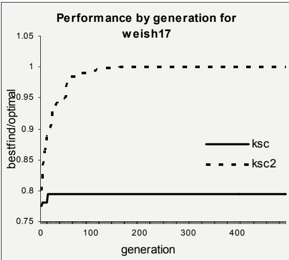
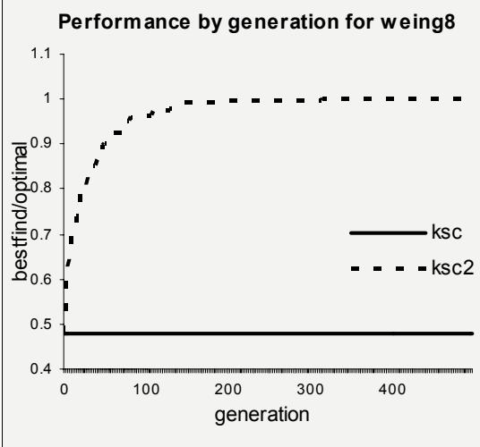
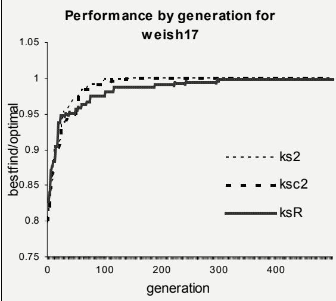
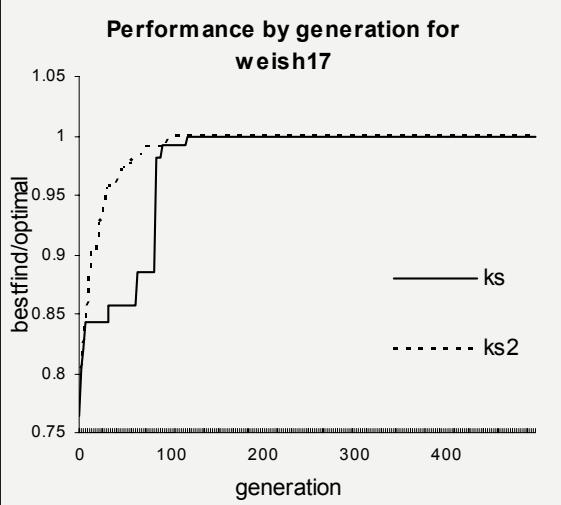
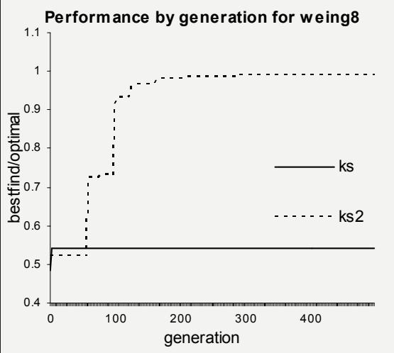
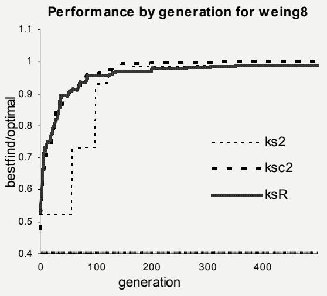

# Exploring a Two-Market Genetic Algorithm

Steven O. Kimbrough∗ Ming Lu

David Harlan Wood   
CIS Dept.   
University of Delaware   
Newark, DE 19716   
D.J. Wu   
LeBow College of Business   
Drexel University   
Philadelphia, PA 19104

University of Pennsylvania Operations & Information Man. Dept. Philadelphia, PA 19104

# Abstract

The ordinary genetic algorithm may be thought of as conducting a single market in which solutions compete for success, as measured by the fitness funtion. We introduce a two-market genetic algorithm, consisting of two phases, each of which is an ordinary single-market genetic algorithm. The twomarket genetic algorithm has a natural interpretation as a method of solving constrained optimization problems. Phase 1 is optimality improvement; it works on the problem without regard to constraints. Phase 2 is feasibility improvement; it works on the existing population of solutions and drives it towards feasibility. We tested this concept on 14 standard knapsack test problems for genetic algorithms, with excellent results. The paper concludes with discussions of why the twomarket genetic algorithm is successful and of how this work can be extended.

# 1 Motivation & Experimental Setup

Genetic algorithms (GAs), and more generally evolutionary computation, have much to recommend them as heuristics for unconstrained optimization. These problems are often otherwise intractable and experience has yielded broadly successful results. The case of constrained optimization is more problematic for evolutionary computation and GAs in particular. In spite of considerable attention paid to the matter (see [2, 5, 6] for excellent reviews), there is no clearly best approach to encoding constrained optimization problems as GAs. Techniques are available and used, largely based on penalty functions. Still, this important class of problems remains somewhat recalcitrant.

We explore a conceptually new approach to constrained optimization, at least in the GA context.1 We interpret a constrained optimization problem as a market between two players adapting as GAs: the objective function player and the constraint player. We explore how their markets behave (and how good the solutions are they find), compared to standard GA approaches for handling constraints. We use 14 wellstudied knapsack test problems for our benchmarking [8]. Although the knapsack is perhaps the simplest of integer constrained optimization problems, it is NPcomplete. Thus, we may hope its lessons apply to other problems of interest.

# 1.1 Penalty Functions & Fitness Evaluation

Given a solution, $\vec { s }$ , to a constrained optimization problem, its absolute fitness, $W ( \vec { s } )$ , in the presence of penalties for constraint violation is commonly (“standardly”) measured as:

$$
W ( \vec { s } ) = Z ( \vec { s } ) - P ( \vec { s } )
$$

where $Z ( \vec { s } )$ is the objective function value produced by $\vec { s }$ ,2 and $P ( \vec { s } )$ is the total penalty (if any) associated with constraint violations by $\vec { s }$ . We employed two widely-used penalty functions in our investigations. Both assume that constraint $i$ has the form: $\textstyle \sum _ { j = 1 } ^ { n } a _ { i , j } x _ { j } \leq b _ { i }$ . (The $x _ { j }$ s are the decision variables.)

sum-of-violations. With the $\alpha _ { i }$ s as weights $P ( \vec { s } ) =$ $\begin{array} { r } { \sum _ { i = 1 } ^ { m } \alpha _ { i } \operatorname* { m a x } \lbrace 0 , \left( \sum _ { j = 1 } ^ { n } a _ { i , j } x _ { j } - b _ { i } \right) \rbrace } \end{array}$ (We set $\alpha _ { i } = 1$ .)

violation-product. $P ( \vec { s } ) = s \cdot \operatorname* { m a x } \{ c _ { i } \}$ , where $s$ is the number of violated constraints and $\operatorname* { m a x } \{ c _ { i } \}$ is the largest objective function coefficient. This is the method used by Khuri [4] and others.

# 1.2 The Two-Market GA

In a GA the individuals in the population compete for success in a single market, driven by the fitness function and the consequences of the genetic operations. In our two-market GA (for constrained optimization problems), two single-market GAs alternate in acting upon a single (evolving) population of solutions. A single two-market generation consists of a phase 1 single-market treatment, “optimality improvement”, followed by a phase 2 single-market treatment, “feasibility improvement”.

During phase 1 of the two-market GA, a single-market (standard) GA is conducted using only the unconstrained objective function, $Z$ , as the fitness function. Upon completion of phase 1, phase 2 commences. Phase 2 feasibility improvement uses a single-market GA whose fitness function is a penalized version of the problem’s constraint set. All solutions meeting the constraint set are given an absolute fitness of 0. Any solution, $\vec { s }$ , violating one or more constraints receives an absolute fitness of $- P ( \vec { s } )$ , where $P$ is the penalty function in use. In our experiments we investigated two such functions, as indicated above: (a) sum-ofviolations (b) violation-product.3

In our experiments, one two-market generation consists of one optimality improvement generation followed by one feasibility improvement generation.4 Specifically, our experiments ran for 500 generations. Our two-market GAs ran 250 phase 1 generations and 250 phase 2 generations. In contrast, we ran standard GAs (used for comparison) for the full 500 generations. Thus, the number of fitness evaluations were equal between our experimental two-market GAs and the standard GAs.

# 1.3 Benchmark Problems

We investigated 14 knapsack test problems from a standard GA source site [8]. The problems and their basic characteristics are indicated in Tables 1 and 2. We conducted experiments on the 14 knapsack test problems with 5 GAs: ksR, ks, ks2, ksc, and ksc2. ksR is a standard, one-market GA, using a repair approach to the 14 knapsack problems; it is present mainly for comparison purposes. The remaining four cover the four combinations of one- vs. two-market GA, and sum-of-violations vs. violation-product penalties, as follows:

Table 1: Test Problems   

<table><tr><td rowspan=1 colspan=1>ProblemName</td><td rowspan=1 colspan=1>Number ofVariables</td><td rowspan=1 colspan=1>Number ofConstraints</td><td rowspan=1 colspan=1>OptimalValue</td></tr><tr><td rowspan=1 colspan=1>hp2</td><td rowspan=1 colspan=1>35</td><td rowspan=1 colspan=1>4</td><td rowspan=1 colspan=1>3186</td></tr><tr><td rowspan=1 colspan=1>pb6</td><td rowspan=1 colspan=1>40</td><td rowspan=1 colspan=1>30</td><td rowspan=1 colspan=1>776</td></tr><tr><td rowspan=1 colspan=1>pb7</td><td rowspan=1 colspan=1>37</td><td rowspan=1 colspan=1>30</td><td rowspan=1 colspan=1>1035</td></tr><tr><td rowspan=1 colspan=1>pet7</td><td rowspan=1 colspan=1>50</td><td rowspan=1 colspan=1>5</td><td rowspan=1 colspan=1>16537</td></tr><tr><td rowspan=1 colspan=1>sento1</td><td rowspan=1 colspan=1>60</td><td rowspan=1 colspan=1>30</td><td rowspan=1 colspan=1>7772</td></tr><tr><td rowspan=1 colspan=1>sento2</td><td rowspan=1 colspan=1>60</td><td rowspan=1 colspan=1>30</td><td rowspan=1 colspan=1>8722</td></tr><tr><td rowspan=1 colspan=1>weing7</td><td rowspan=1 colspan=1>105</td><td rowspan=1 colspan=1>2</td><td rowspan=1 colspan=1>1095445</td></tr><tr><td rowspan=1 colspan=1>weing8</td><td rowspan=1 colspan=1>105</td><td rowspan=1 colspan=1>2</td><td rowspan=1 colspan=1>624319</td></tr><tr><td rowspan=1 colspan=1>weish12</td><td rowspan=1 colspan=1>50</td><td rowspan=1 colspan=1>5</td><td rowspan=1 colspan=1>6339</td></tr><tr><td rowspan=1 colspan=1>weish17</td><td rowspan=1 colspan=1>60</td><td rowspan=1 colspan=1>5</td><td rowspan=1 colspan=1>8633</td></tr><tr><td rowspan=1 colspan=1>weish21</td><td rowspan=1 colspan=1>70</td><td rowspan=1 colspan=1>5</td><td rowspan=1 colspan=1>9074</td></tr><tr><td rowspan=1 colspan=1>weish22</td><td rowspan=1 colspan=1>80</td><td rowspan=1 colspan=1>5</td><td rowspan=1 colspan=1>8947</td></tr><tr><td rowspan=1 colspan=1>weish25</td><td rowspan=1 colspan=1>80</td><td rowspan=1 colspan=1>5</td><td rowspan=1 colspan=1>9939</td></tr><tr><td rowspan=1 colspan=1>weish29</td><td rowspan=1 colspan=1>90</td><td rowspan=1 colspan=1>5</td><td rowspan=1 colspan=1>9410</td></tr></table>

<table><tr><td rowspan=1 colspan=1></td><td rowspan=1 colspan=1>sum-of-violations</td><td rowspan=1 colspan=1>violation-product</td></tr><tr><td rowspan=1 colspan=1>one-market</td><td rowspan=1 colspan=1>ks</td><td rowspan=1 colspan=1>ksc</td></tr><tr><td rowspan=1 colspan=1>two-market</td><td rowspan=1 colspan=1>ks2</td><td rowspan=1 colspan=1>ksc2</td></tr></table>

Thus, the ks-ks2 and ksc-ksc2 pairs are directly comparable because they use the same penalty functions.

We experimented with population sizes of 50, 500, and 5000. Results were comparable; we focus here on population size 5000. The number of generations was 250 $\times$ 2 for the two-market GAs, and 500 $\times$ 1 for the standard one-market GAs (which are used for comparison). Single-point crossover was used with a rate of 0.6, and the mutation rate was 0.1. (Sensitivity runs did not raise any anomalies.)

# 1.4 Initialization of Populations

We did use an innovative approach to initializing the populations. Commonly, populations are initialized with 1s and 0s by picking a probability that a site is a 1 and drawing random numbers to make the specific assignments. Khuri et al. [12] call this the biased approach to initialization. One has to wonder how the choice of that probability affects the outcomes, especially when different methods are being compared. We note that in the weing8 problem, Khuri et al. [12] have to use a biased random initialization of the population such that the probability of a zero at a site is 0.95. This allows, they discovered empirically, the initial population to have enough feasible solutions for their algorithm to work. The feasible region in this problem is extremely sparse. This biased approach introduces two concerns. First, the biased population may favor searching only initially and may lead to a sub-optimal solution. A second concern is that choosing the right probability is not trivial.

We introduce an alternate, non-empirical method of randomly initializing a GA’s population. Khuri et al. claim the purpose of the biased initial population is to make sure the initial population has feasible solutions. Our alternative method for population initialization is very likely to have feasible solutions with large population size.5 Our non-empirical procedure to generate the initial population is given in Figure 0.

Set incr, popsize; Prob=0; popsofar=0; Do until popsofar $= =$ popsize Produce one solution based on Prob; Put the solution into the population; popsofar $^ { + + }$ ; Prob $=$ Prob+incr; If Prob $> 1$ , Prob $1 =$ incr; }//End of Do until we reach the population size

Figure 0: Procedure to generate an initial population. Prob, probability of a 1 bit in a solution; incr, small number to increment Prob for each solution; popsize, total size of population; popsofar, number of solutions generated. In our experiments, $\mathtt { i n c r } = \mathtt { ( \# }$ of variables) $^ { - 1 }$ .

2 and 3 report means and standard deviations for runs using a penalty function based on the sum of the violations of the constraints. Column 2 is the standard, single-market GA; column 3 is the two-market GA. Columns 4 and 5 report means and standard deviations for runs using a penalty function based on the number of constraint violations times the maximum objective function coefficient. The means and standard deviations are for the best feasible solution in the 500th generation, across 5 runs using differentlyseeded random number streams.

Examination of Table 2 reveals a general pattern: As we move from columns 2 to 3, and from 4 to 5, the means increase and the standard deviations decrease. That is, the two-market GAs typically find (on average, across 5 runs) a better feasible solution and do so with a lower variance. (A standard deviation of 0 indicates that in all 5 runs the best solution in the last generation was the same.) The comparison is summarized in column 0, with the $+ / \mathrm { - / M }$ notation. Of the 14 problems, in just two cases—pb6 and pb7—the two two-market GAs did (slightly) worse than the two onemarket GAs. In one case—weing7—the results were mixed: on one regime of constraint violation the twomarket GA did better and on the other it did worse, albeit just slightly so. (We also note that in hp2, ksc and ksc2 both find the optimal solution. Since ks2 does significantly better than ks, we award the two-market GA the $^ +$ .) Finally, in 5 of 14 cases the two-market GA did substantially better $( + + )$ than the one-market.

# 2 Results

Our results for populations of 5000 are summarized in Table 2. These data are qualitatively similar to those we got for populations of 50 and 500, except that there is a general trend, as expected, towards better solutions with larger populations.

We draw the reader’s attention to Table 2 as follows. Column 1 reports the results of ksR, a single-market (standard) GA using repair to maintain a population of feasible solutions. ksR is useful for comparison purposes, but its computational cost was at least an order of magnitude greater than the other 4 methods.

We shall focus on columns 2-5. Columns 2 and 3 are directly comparable, as are columns 4 and 5. Columns

Even though it is not possible to have a random sample of knapsack problems, statistical-style reasoning nonetheless offers some insight.6 We can take the null hypothesis as stating that the two-market GA should get a $^ +$ as often as the one-market GA. Charitably, we credit the M to the one-market GA, giving it a total of 3 victories in 14 trials. If the null hypothesis is 14 trials is $\textstyle \sum _ { x = 0 } ^ { 3 } { \left( \begin{array} { l } { 1 4 } \\ { x } \end{array} \right) } \left( { \frac { 1 } { 2 } } \right) ^ { 1 4 } = 0 . 0 2 9$ which is better than the generally accepted standard of $5 \%$ . That there should be 5 of 14 cases highly favorable to the two-market GA and 0 of 14 similarly favorable to the one-market GA is highly improbable, if the null hypothesis is true.

We note further that there are 3 smaller problems— hp2, pb6 and pb7—having 35, 40 and 37 variables respectively. These are the ones on which the one-market GA did generally better, although the differences in its favor are not great. The other 11 problems had between 50 and 105 variables. Among these problems, the two-market GAs did substantially better on 5, and clearly better on 5. On one, there was a tie.7

Thus, for these knapsack problems it appears that the two two-market GA is definitely superior to its two one-market analogs.8 We do want to note, however, that four problems stand out in having larger numbers of constraints. On two of these—pb6 and pb7— the standard one-market GA did better, and on two— sento1 and sento2—the two-market GA did better. One explanation (cf. discussion below) is that what matters is how tightly the problem is constrained, not how many constraints it has. Perhaps it is easy to find feasible solutions for pb6 and pb7, and harder for sento1 and sento2. At this point, conjecture would be premature. We leave the issue for future research.

# 3.1 Case 1: Feasible and Far from Frontier

First, all members of our population are feasible and far from the (feasible) frontier. Here, all penalties will be zero and a GA will favor—in the special case of the knapsack—adding items to the knapsack having high objective function coefficients, regardless of how much of the constrained resources they consume. (The point is generally valid, beyond just the knapsack problem.) In this situation, the penalty functions do not come into play; the standard GA (with penalties) becomes simply a GA; and the two-market GA becomes a slower version of the standard GA. (On the last point, recall that for comparison purposes we do $\textstyle { \frac { 1 } { 2 } }$ generation of two-market GA per generation of standard GA.) Thus, when all (or most) solutions are feasible and far from incurring penalties, we would expect the standard GA to outperform the two-market GA.

# 3 Discussion

What might explain why the two-market GA does so much better than the standard GAs, especially on the more complex problems (at least those with a higher number of variables)? A full answer requires both analytic and empirical work, which we are conducting. A conjecture, however, is worth discussing. The intuition may be explained as follows.

Recall from Expression (1) that given a solution, $\bar { s }$ , to a constrained optimization problem, its absolute fitness, $W ( \vec { s } )$ , in the presence of penalties for constraint violation is: $W ( \vec { s } ) = Z ( \vec { s } ) - P ( \vec { s } )$ , where $Z ( \vec { s } )$ is the objective function value produced by $\bar { s }$ , and $P ( \vec { s } )$ is the total penalty (if any) associated with constraint violation by $\bar { s }$ .

We discuss three cases. They are distinguished by their positions with regard to what we shall call the (feasible) frontier. This is the border in fitness space between the feasible and infeasible regions.

# 3.2 Case 2: Population Infeasible

The second case to consider is when all (or most) members of our population are infeasible. Let us assume (without, we think, any real loss of generality) that fitness proportional selection is being used and is roughly correct; i.e., assume we agree that fitness proportional selection is approximately correct in setting the incentives to the GA for its search. Keeping the example simple (but again, without essential loss of generality), consider a population with just two solutions, $\vec { s _ { 1 } }$ and $\vec { s _ { 2 } }$ . Let’s say that $\vec { s _ { 1 } }$ is twice as good as $\vec { s _ { 2 } }$ , i.e., $Z ( \vec { s _ { 1 } } ) = 2 Z ( \vec { s _ { 2 } } )$ . When the penalties are zero (case 1), the relative fitnesses, are:

$$
F ( { \vec { s _ { 1 } } } ) = { \frac { Z ( { \vec { s _ { 1 } } } ) } { ( Z ( { \vec { s _ { 1 } } } ) + Z ( { \vec { s _ { 2 } } } ) ) } } = { \frac { 2 } { 3 } }
$$

and $\begin{array} { r } { F ( \vec { s _ { 2 } } ) = 1 - F ( \vec { s _ { 1 } } ) = \frac { 1 } { 3 } } \end{array}$ . What if both solutions are infeasible? Let us assume both solutions are equally infeasible, so that their penalties are identical (again, with essential loss of generality). Note that penalties, however they are set, need to be relatively large in order to drive the search towards feasible solutions. In general, if $P ( \vec { s } ) > 0$ (that is, if there is any constraint violation at all by $\bar { s }$ ) then $P ( \vec { s } ) \gg Z ( \vec { s } )$ . Thus, with penalties kicking in, $F ( \vec { s _ { 1 } } ) =$

$$
\frac { ( Z ( \vec { s _ { 1 } } ) - P ( \vec { s _ { 1 } } ) ) } { ( ( Z ( \vec { s _ { 1 } } ) - P ( \vec { s _ { 1 } } ) ) + ( Z ( \vec { s _ { 2 } } ) - P ( \vec { s _ { 2 } } ) ) ) } \approx \frac { 1 } { 2 } .
$$

The large $P$ values overwhelm the $Z$ values, greatly reducing the relative fitness differences between infeasible solutions. Penalty functions may be excellent at distinguishing feasible from infeasible solutions, but at the price of obfuscating the differences between infeasible solutions. Note a numerical example. Let:

<table><tr><td rowspan=1 colspan=1>0</td><td rowspan=1 colspan=1>1</td><td rowspan=1 colspan=1>2</td><td rowspan=1 colspan=1>3</td><td rowspan=1 colspan=1>4</td><td rowspan=1 colspan=1>5</td></tr><tr><td rowspan=1 colspan=1>Problem</td><td rowspan=1 colspan=1>ksR</td><td rowspan=1 colspan=1>ks</td><td rowspan=1 colspan=1>ks2</td><td rowspan=1 colspan=1>ksc</td><td rowspan=1 colspan=1>ksc2</td></tr><tr><td rowspan=1 colspan=1>hp2+</td><td rowspan=1 colspan=1>3186(0)</td><td rowspan=1 colspan=1>2948.6(16.772)</td><td rowspan=1 colspan=1>3114.8(14.307)</td><td rowspan=1 colspan=1>3186(0)</td><td rowspan=1 colspan=1>3186(0)</td></tr><tr><td rowspan=1 colspan=1>pb6-</td><td rowspan=1 colspan=1>776(0)</td><td rowspan=1 colspan=1>740.8(19.176)</td><td rowspan=1 colspan=1>646.2(45.252)</td><td rowspan=1 colspan=1>776(0)</td><td rowspan=1 colspan=1>730.2(17.283)</td></tr><tr><td rowspan=1 colspan=1>pb7-</td><td rowspan=1 colspan=1>1034.8(0.447)</td><td rowspan=1 colspan=1>994.2(11.946)</td><td rowspan=1 colspan=1>966(23.292)</td><td rowspan=1 colspan=1>1034.4(0.894)</td><td rowspan=1 colspan=1>1033(4.472)</td></tr><tr><td rowspan=1 colspan=1>pet7+</td><td rowspan=1 colspan=1>16483.2(20.969)</td><td rowspan=1 colspan=1>15811.8(169.428)</td><td rowspan=1 colspan=1>16452(11.726)</td><td rowspan=1 colspan=1>16457(38.085)</td><td rowspan=1 colspan=1>16486.6(21.984)</td></tr><tr><td rowspan=1 colspan=1>sento1+</td><td rowspan=1 colspan=1>7743.2(27.905)</td><td rowspan=1 colspan=1>7732.2(23.626)</td><td rowspan=1 colspan=1>7758.2(11.987)</td><td rowspan=1 colspan=1>7739.2(27.563)</td><td rowspan=1 colspan=1>7769.8(4.919)</td></tr><tr><td rowspan=1 colspan=1>sento2+</td><td rowspan=1 colspan=1>8672.4(20.379)</td><td rowspan=1 colspan=1>8669.2(19.690)</td><td rowspan=1 colspan=1>8720.4(3.050)</td><td rowspan=1 colspan=1>8671.4(16.410)</td><td rowspan=1 colspan=1>8703.2(3.701)</td></tr><tr><td rowspan=1 colspan=1>weing7M</td><td rowspan=1 colspan=1>1089914(268.319)</td><td rowspan=1 colspan=1>1084623(3168.344)</td><td rowspan=1 colspan=1>1094727(398.92)</td><td rowspan=1 colspan=1>1094677(385.755)</td><td rowspan=1 colspan=1>1094409(407.547)</td></tr><tr><td rowspan=1 colspan=1>weing8++</td><td rowspan=1 colspan=1>619925(1461.077)</td><td rowspan=1 colspan=1>342959(56711.01)</td><td rowspan=1 colspan=1>611820.2(6930.155)</td><td rowspan=1 colspan=1>321133.8(44832.01)</td><td rowspan=1 colspan=1>623627.8(867.579)</td></tr><tr><td rowspan=1 colspan=1>weish12+</td><td rowspan=1 colspan=1>6339(0)</td><td rowspan=1 colspan=1>6009.2(435.119)</td><td rowspan=1 colspan=1>6338.8(0.447)</td><td rowspan=1 colspan=1>5689.4(242.683)</td><td rowspan=1 colspan=1>6339(0)</td></tr><tr><td rowspan=1 colspan=1>weish17+</td><td rowspan=1 colspan=1>8624.2(4.919)</td><td rowspan=1 colspan=1>8630.6(5.366)</td><td rowspan=1 colspan=1>8633(0)</td><td rowspan=1 colspan=1>7692.6(522.115)</td><td rowspan=1 colspan=1>8633(0)</td></tr><tr><td rowspan=1 colspan=1>weish21++</td><td rowspan=1 colspan=1>9053(7.969)</td><td rowspan=1 colspan=1>8538(424.229)</td><td rowspan=1 colspan=1>9013.4(21.686)</td><td rowspan=1 colspan=1>5369.4(354.420)</td><td rowspan=1 colspan=1>9074(0)</td></tr><tr><td rowspan=1 colspan=1>weish22++</td><td rowspan=1 colspan=1>8921.4(22.03)</td><td rowspan=1 colspan=1>5575(436.584)</td><td rowspan=1 colspan=1>8891.4(20.403)</td><td rowspan=1 colspan=1>5451.2(189.254)</td><td rowspan=1 colspan=1>8939.8(9.859)</td></tr><tr><td rowspan=1 colspan=1>weish25++</td><td rowspan=1 colspan=1>9904(16.325)</td><td rowspan=1 colspan=1>9758.4(214.057)</td><td rowspan=1 colspan=1>9903.6(30.411)</td><td rowspan=1 colspan=1>6083(291.32)</td><td rowspan=1 colspan=1>9939(0)</td></tr><tr><td rowspan=1 colspan=1>weish29++</td><td rowspan=1 colspan=1>9383.2(9.859)</td><td rowspan=1 colspan=1>5425(215.431)</td><td rowspan=1 colspan=1>9203.2(116.154)</td><td rowspan=1 colspan=1>5068(267.685)</td><td rowspan=1 colspan=1>7530.2(315.906)</td></tr></table>

Table 2: $\mathrm { k s R = }$ one market GA (repair). ks = standard GA, penalty based on sum of violations. $\mathrm { k s 2 = 2 }$ market GA, penalty based on sum of violations. ksc= standard GA, penalty based on number of violations $\times$ max coefficient. $\mathrm { k s c 2 } \mathrm { = 2 }$ market GA, penalty based on number of violations $\times$ max coefficient. The problem names are key to their original sources: hp2, pb6, and pb7 [3]; pet7 [7]; sento\* [9]; weing\* [12]; and weish $^ *$ [10]. (In virtue of being knapsack problems, all 14 are maximization problems.) Key: mean , (standard deviation); for best solution after 500 generations, population size 5000, five runs. $^ +$ two-market GAs did better. $^ { + + }$ two-market GAs did much better. - two-market GAs did worse. M mixed.

$Z ( \vec { s _ { 1 } } ) = 1$ , $Z ( \vec { s _ { 2 } } ) ~ = ~ 0 . 5$ , $P = 2 . 2 5$ . Then the relative fitnesses are $F ( \vec { s _ { 1 } } ) = 1 - 0 . 4 1 7 = 0 . 5 8 3$ and $F ( \vec { s _ { 2 } } ) = 1 - 0 . 5 8 3 = 0 . 4 1 7$ (switching signs for comparison purposes) compared to 0.667 and 0.333 without penalties. Even a small $P$ value noticeably blurs the differences.

The two-market GA in its phase 1 (optimality improvement) sees the $Z$ values of the solutions, unencumbered by the fog of penalties. Phase 2 of the twomarket GA (feasibility improvement) edits the population in favor of feasibility. The process drives towards feasible optimality. The advantage of the two-market GA lies in its ability to respond more usefully to infeasible solutions. If you are going to have a population with a large number of infeasible solutions, the twomarket GA is the GA for you.9

# 3.3 Case 3: Population on the Frontier

Finally, consider a third case: the solutions in the population are all (precisely) on the frontier (and thus feasible). In the case of the knapsack this means that setting any 0 to 1 (indeed increasing the value of any variable) will turn a feasible solution infeasible.

The standard GA sees the relative fitnesses clearly as in equation (2). The more optimal solutions (with higher $Z$ values) will contribute proportionately more to the next generation. Since the GA operators (e.g., mutation and crossing over) are blind, a large percentage of the products of these operations will be infeasible, and receive very low fitness in the next generation. If the operations find a better schema (setting values higher for certain variables), the solution will be infeasible unless the values of other variables are reduced sufficiently to ensure feasibility. Often it will be the case that this does not happen; and the better schema has no real chance to be tried in the population.

Suppose instead that we are in case three, with solutions all on the frontier, and we are also in phase 2 of the two-market GA. Because the population is entirely feasible, the GA here sees each solution as equally fit. A new population is accordingly formed after application of the genetic operators. Again, suppose that the genetic operations find a better schema. Phase 1 will recognize it and with fitness proportional selection try it out in relatively more solutions in the new population it sends to phase 2. This mechanism (probabilistically) gives the better schemas more chances to locate themselves in feasible solutions. If it does, phase 2 will let it pass and the schema stands a chance of surviving.

The considerations of this section lead us to conjecture that the two-market GA will be superior to the standard, penalty-function GAs (on constrained optimization problems), when feasible solutions are hard to find and the GA must process many infeasible solutions. (Compare cases 1 and 2 above.) Further, we conjecture (case 3) that the two-market GA has a superior “end-game” performance. Given a population on the (feasible) frontier, the two-market GA provides a better opportunity for trying out advantageous schemas.

Table 2 provides some evidence in favor of the case 3 factor. Note that ksR, a one-market GA using a repair approach, maintains (at great computational expense) a feasible population. The GA will drive this population to the frontier. Because ksR keeps generating solutions to maintain a feasible population, it does not have the case 3 problem that the standard (penalty function) GA has in not being able to explore with new schemas once it gets to the frontier. For case 3, neglecting computational costs, we expect ksR and the two-market GA to perform similarly. We note in this regard that in, and only in, the five cases in which the two-market GA performs substantially better than the standard GA ( $^ { + + }$ in table 2), ksR also performs substantially better than the standard GA.

Suggestive evidence is also available in Figures 1 through 6, comparing the progress over generations of the 5 knapsack algorithms (ksR, ks, ks2, ksc, and ks2) as they work on weish17 and weing8. The Figures show typical runs. weish17 is a problem on which the two-market GA does slightly better. We see in the Figures ksc quickly reaches a plateau of $8 0 \%$ of optimality and gets stuck. ks does better and quickly reaches a plateau close to optimality, but not as quickly as ks2. weing8 is a problem on which the two-market GA does substantially better than the standard GA. We see in the Figures that the two-market GAs level off near optimality by about 150 generations, while ksc and ks level off immediately at less than $6 0 \%$ of optimality and never improve. This suggests a case 3 situation.

On extensions to these ideas, we are particularly intrigued with the prospect of applying these results to non-standard computational regimes, especially DNA computing. Genetic Algorithms seem particularly suited to implementation in DNA Computing [11, 1]. An originating impetus for this work was our formulation of a bargaining problem as a two-market GA for DNA computing. In DNA computing, it is awkward to make computations that combine both the objective functions and the penalty functions—thus the incentive for a two-market approach. Happily, this paper reflects advantages of the two-market approach beyond its convenience for DNA computing. In turn, DNA is quite suitable for two-market GAs; the results here are encouraging.

DNA computing features massively parallel processing of huge populations of candidate solutions. Thus, our work has an interesting sidelight in that there was a clear benefit of increasing population size. We performed runs with population sizes of 50, 500, and 5000. The results for 50 and 500 were qualitatively like those in Table 2, except that the general quality of the solutions increased with population size. For example, for ksc2 and averaging across all 14 problems, the mean solution was $1 . 1 \%$ higher at 500 generations than it was at 50 generations, and 3.2% higher at 5000 generations than it was at 50 generations. For the twomarket GAs, excellent results were obtained in much less than 500 generations.

This has been an exploratory study. Much remains to be done by way of testing our conjectures and investigating the two-market GA, including: study of more knapsack problems, extension to other kinds of constrained optimization problems, deepening and refining mathematically the intuitions behind the three cases, extending the 2-market case to N-markets, and looking carefully at the GA histories. Finally, we remark that all this is most encouraging for DNA computing. Indeed, the results suggest many avenues of fruitful exploration.

# Acknowledgments

This material is based upon work supported by, or in part by, DARPA contract DASW01 97 K 0007. GA202.

# Список литературы

[1] Junghuei Chen and David Harlan Wood. Computation with biomolecules. Proceedings of the National Academy of Sciences, USA, 97(4):1328– 1330, 2000. Commentary.   
[2] Carlos Artemio Coello Coello. A survey of constraint handling techniques used with evolutionary algorithms. technical report Lania-RI-99-04, Laboratorio Nacional de Inform´atica Avanzada, Veracruz, M´exico, 1999. http://www.lania.mx/˜ccoello/constraint.html.   
[3] A. Freville and G. Plateau. Hard 0-1 multiknapsack test problems for size reduction methods. Investigation Operativa, 1:251–270, 1990.   
[4] Sami Khuri, Thomas B¨ack, and J¨org Heitk¨otter. The zero/one multiple knapsack problem and genetic algorithms. In Proc. of the ACM Symp. of Applied Comp. (SAC’94). ACM Press, 1993.   
[5] Zbigniew Michalewicz. A survey of constraint handling techniques in evolutionary computation methods. In Proceedings of the 4th Annual Conference on Evolutionary Programming, pages 135–155, Cambridge, MA, 1995. MIT Press. http://www.coe.uncc.edu/˜zbyszek/papers.html.   
[6] Zbigniew Michalewicz. Genetic Algorithms + Data Structures = Evolution Programs. Springer, Berlin, Germany, third edition, 1996.   
[7] C. C. Petersen. Computational experience with variants of the Balas algorithm applied to the selection of R&D projects. Management Science, 13:736–750, 1967.   
[8] CMU Artificial Intelligence Repository. SAC94 Suite: Collection of multiple knapsack problems. World Wide Web, Accessed January 2002. http://www-2.cs.cmu.edu/afs/cs/project/airepository/ai/areas/genetic/ga/test/sac/.   
[9] S. Senyu and Y. Toyada. An approach to linear programming with 0-1 variables. Management Science, 15:B196–B207, 1967.   
[10] W. Shi. A branch and bound method for the multiconstraint zero one knapsack problem. J. Opl. Res. Soc., 30:369–378, 1979.   
[11] Willem P. C. Stemmer. The evolution of molecular computation. Science, 270:1510–1510, December 1, 1995.   
[12] H. M. Weingartner and D. N. Ness. Methods for the solution of the multi-dimensional 0/1 knapsack problem. Operations Research, 15:83–103, 1967.

  
Figure 1: ksc vs. ksc2 for weish17

  
Figure 3: ksc vs. ksc2 for weing8

  
Figure 5: ks2 and ksc2 vs. ksR for weish17

  
Figure 2: ks vs. ks2 for weish17

  
Figure 4: ks vs. ks2 for weing8

  
Figure 6: ks2 and ksc2 vs. ksR for weing8