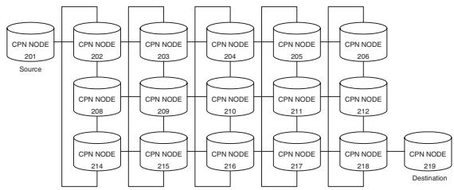
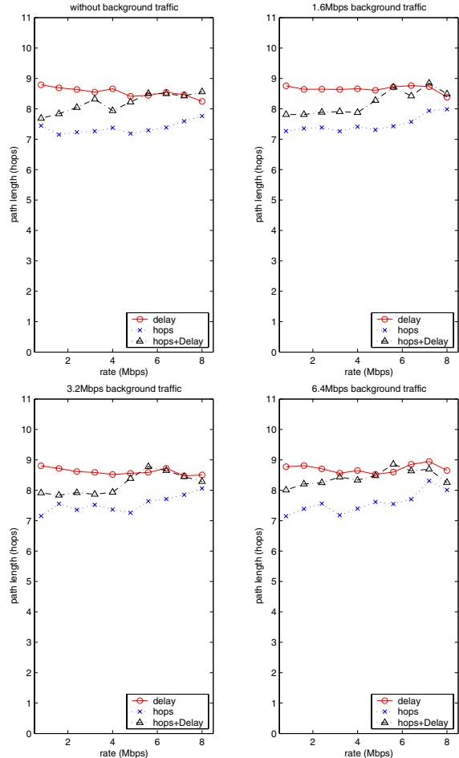
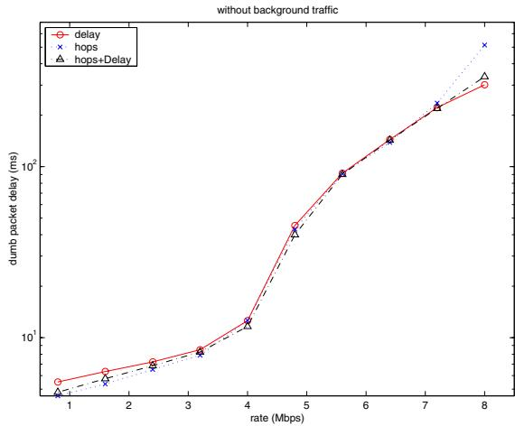
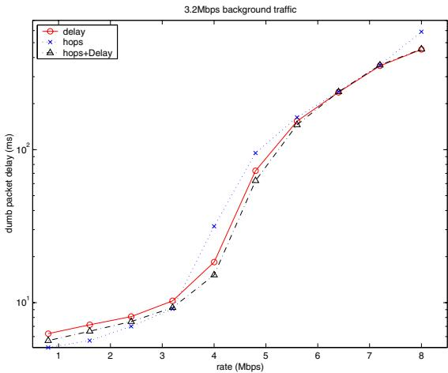
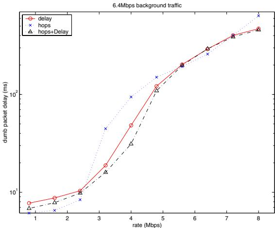
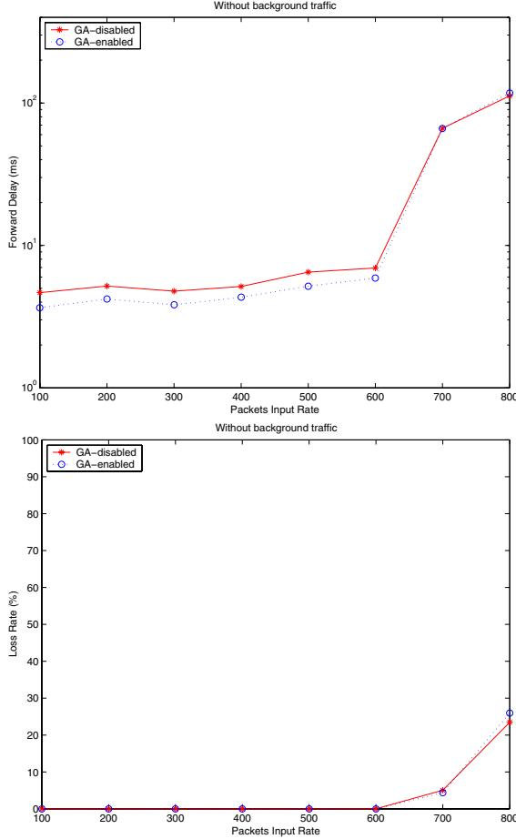
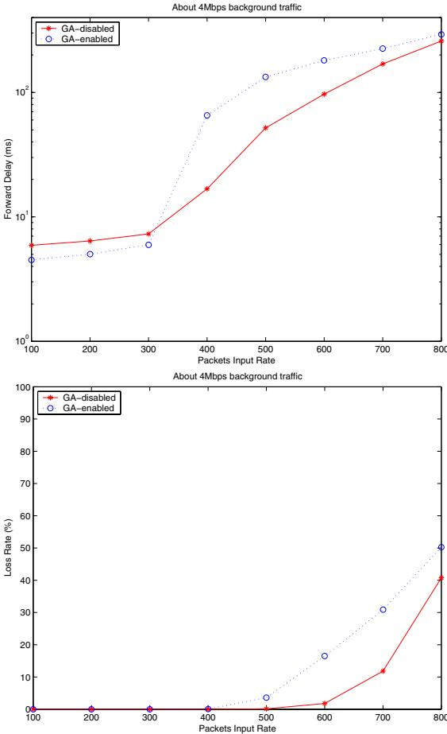
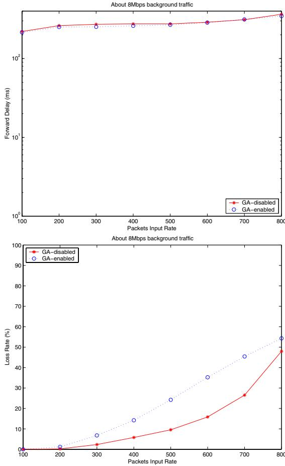

# Genetic Algorithms for Autonomic Route Discovery

Erol Gelenbe, Peixiang Liu and Jeremy Laine´ Electrical and Electronic Engineering, Imperial College London SW7 2BT, UK {e.gelenbe,p.liu}@imperial.ac.uk, jeremy.laine $@$ polytechnique.fr

# Abstract

This paper describes an experimental investigation of adaptive path discovery using genetic algorithms (GA). We start with the Quality of Service (QoS) driven routing protocol called “Cognitive Packet Network” (CPN) which uses Smart Packets $( S P s )$ to dynamically select routes in a distributed autonomic manner based on the user’s QoS requirements. We extend it by introducing GA at the source routers, which modifies and filters the paths discovered by CPN. The GA can combine paths that were previously discovered to create new untested but valid source-todestination paths, which are then selected on the basis of their “fitness”. We implement this approach and the measurements which we have conducted on a network test-bed indicate that when the network’s background traffic load is light to medium, the GA can result in improved QoS. When the background traffic load is high, it appears that the use of the GA may be detrimental to the QoS experienced by users as compared to CPN routing, because of the fact that the GA uses less timely state information in its decision making.

# 1 Introduction

Routes in networks are selected so that some criterion of performance can be satisfied, in addition to the most elementary need of transferring data from a specified source to a specified destination. For instance, the Internet uses prior agreements between autonomous systems (AS) to carry each other’s traffic based on economic considerations, while routing within each AS is generally based on the selection of a “shortest path” or the “smallest number of hops” from source to destination [9]. ATM [10, 6] and MPLS [9] networks establish a fixed path for a given “call” so as to satisfy Quality of Service (QoS) requirements such as delay or cell loss, within overall traffic engineering constraints imposed by the collection of calls that a network may be handling.

In earlier work [3, 5] we reported an autonomic distributed routing protocol called “Cognitive Packet Network” (CPN) [2] which dynamically selects paths through a store and forward packet network so as to route peerto-peer user traffic based on QoS. CPN’s ability to satisfy different user QoS metrics based on Random Neural Networks(RNNs) [1] and Reinforcement Learning(RL)[11, 7], distributed at each network node, was discussed in [3]. Its extension to a wireless ad hoc environment is covered in [4]. CPN uses Smart Packets (SPs) and Acknowledgement Packets (ACKs) to select routes from a user’s source node to its destination based on the user’s QoS requirement. At each CPN node, RNNs with RL are used to make routing decisions. Each output link from a CPN node is represented by a neuron in the RNN. The arrival of a SP triggers the execution of the RNN algorithm and the output link corresponding to the most excited neuron is chosen as the routing decision. SPs behave as scouts which are sent out to look for routes to a destination. As a SP moves from node to node, it collects measurements at the nodes (e.g. the time at which the visit took place). After the SP reaches its destination, an ACK packet is sent back to the source along the reverse of the path used by the SP; the reverse path is chosen, however, so that any loops in the SP’s path are removed. The ACK carries the route discoved by the SP along with its QoS measurements. The measured QoS information is then used to update the synaptic weights of the RNNs at each of the nodes using the RL algorithm which increases the excitatory value of weights which have led to successful outcomes, and weakens the others. Thus the RL algorithm uses the observed outcome of a decision to “reward” or “punish” the corresponding decision of the routing algorithm so that its future decisions are more likely meet the desired QoS goal [3]. The path discovery process continues throughout each user’s session, and the most recently discovered best path is the one that is used by Dumb Packets (DPs) carrying the user’s payload to destination.

In this paper we exploit an analogy between “genotypes” and network paths, where each path is viewed as the encoding of a genotype so that a genetic algorithm (GA) [8] can be used at the source node of each connection to discover new paths that may not have been discovered by SPs.

The GA daemon software runs in background mode at the source node of a connection and uses the crossover operation to splice existing paths and create valid new paths. Through successive crossover and selection operations, the GA daemon enables the source node both to compose new routes from existing ones and to select which routes to use based on their “fitness” which is estimated based on QoS. We discuss this approach in detail and present the implementation. We also provide measurements on a network test-bed. These measurements indicate that when the background traffic load is light to medium, the GA can result in improved QoS. However when the background traffic load is heavy, the use of the GA may actually be detrimental to QoS as compared to the original CPN routing protocol.

The paper is organized as follows. Section 2 presents a GA approach to autonomic routing and its implementation. In Section 3 we present measurements on CPN without the GA, and then a set of experiments to evaluate the conditions under which the GA will, or will not provide useful QoS improvements. Section 4 concludes the paper.

# 2 GA Approach to Autonomic Routing

GA is a search strategy that is inspired by biological evolution [8], and which is based on the following features:

• A population of individuals (or genotypes) where each individual represents a potential solution to the problem being considered. In the present case, an individual is a path from source $s$ to destination $D$ , represented by the labels of each node on the path. A fitness function which evaluates the utility of each individual’s possible contribution to solving the problem. In our case, the fitness of a given path is the observed or estimated QoS of the path. A selection function which selects individuals for reproduction based on their fitness. This means that we would choose paths with better QoS. The genetic operators which are used to alter or combine individuals to create new individuals, namely mutation and crossover. If $S x N y D$ and $S u N \nu D$ are two valid paths from source $s$ to destination $D$ that both use the intermediate node $N$ , and $x , y , u , \nu$ are sequences of nodes on the two paths, then $S u N y D$ and $S x N \nu D$ are two paths that result from the crossover operation applied to the two previous paths.

A path $w$ is a variable length sequence of nodes which begins with the source node $s$ and ends with the destination $D$ . For any nodes $a$ and $b , a b$ is a subsequence in $w$ only if there is a link (i.e. path of length 1) going from $a$ to $^ b$ . Thus $w$ represents any viable path from $s$ to $D$ . Each path $w$ has a goal value $G ( w )$ which is the observed QoS for that path. $G$ describes how effective the path $w$ is. Thus, a smaller value of $G ( w )$ means that $w$ is more desirable. A simple example is when $G ( w )$ is the number of links on the path from $s$ to $D$ , i.e. the number of hops. Thus conventional shortest path routing [9] in the Internet Protocol (IP) tries to minimize the function $G$ if the goal function is the number of hops. However $G ( w )$ may also be the delay or loss of packets that is observed over the path $w$ , or the variance in packet delay, or the power consumed for processing and forwarding the packet in the hops of a wireless network [4], or the overall security level of the path, or combinations of many of these metrics.

We shall say that $G$ is additive, if for any path $w = \alpha \beta$ which is the concatenation of two paths $\alpha$ and $\beta$ , we have $G ( w ) = G ( \alpha ) + G ( \beta )$ . Examples of additive goal functions include packet delay, path length and power consumption. Since the CPN algorithm [3, 2] measures the forward delay of SPs and DPs using the information brought back by ACKs, it in fact not only collects at the source the sourceto-destination delay, but the ACK also brings back the delay from any intermediate node on the path to the destination.

In our GA implementation, which uses the pre-existing CPN system, new paths are generated in two different ways: (1), SPs discover routes, and ACK packets bring back valid routes to the source, which are stored into the Stack. Conceptually we may think that this is some kind of “mutation” operation that CPN already offers to the GA. The paths in the Stack are organized in a list sorted in order of increasing $G ( w )$ value. Therefore the first path in the list is the fittest path; (2), at the source we also generate additional paths using the path crossover operation that we described earlier. If some new path SuNcD generated by a crossover from $S u N \nu D$ and SaNcD was not already in the Stack, then it is placed there with the new goal value $G ( S u N c D ) = G ( S u ) + G ( N c D )$ , assuming that the goal is additive.

In summary, the GA operates as follows. Every path discovered by SPs and brought back by ACKs naturally becomes an individual in the GA population. The paths with the same source S and destination $D$ form a GA route repository that we call the Stack which is limited to some maximum size. Paths in the same repository are combined to form new paths, provided they share the same intermediate node. Their QoS metric, or fitness, is synthesized from those of their constituents. Whenever a DP needs to be forwarded to the destination, the path at the top of the Stack (i.e. the one with the smallest goal value) will be used as the source route.

We have implemented the GA algorithm as a system daemon which runs in the background. The GA daemon consists of a main loop which is in charge of polling the kernel for new paths, checking its internal data structures for size and consistency, selecting individuals for crossover and doing the actual crossover and periodically updating the CPN module’s dumb packet route repository. The data exchange operations between the CPN kernel module and the GA daemon is bidirectional as the module passes measurements to the daemon and in return the daemon periodically updates the module’s route repository with the paths which have the best fitness at that time. GA daemon, in round robin mode, provides the identity of each of the paths whose QoS are better than $9 5 \%$ of the best QoS. The round-robin policy on the best routes then acts as a simple load balancing mechanism to avoid saturation of any given path, and also offers the possibility to gather measurement data concerning a much bigger set of hops. Another way of increasing the measurement data available to all connections from a given source, is to share the hops pool among several different connections emanating from the same source.

# 3 Performance measurements

Measurements were conducted on the test-bed shown in Figure 1. Each node is a PC equipped with four Ethernet point-to-point ports, where the number of ports is related to the cost of the cards that we were able to use. Each port uses a 10 Mbps Ethernet link connected by point-to-point copper cable to another node. The CPN software is integrated into the Linux kernel 2.4.x. with minimal changes in the existing networking code, and is independent of the physical transport layer. The network interface is compatible with the popular BSD4.3 socket layer in Linux, and provides a single application program interface (API) for the programmer to access the CPN protocol. To maximize the length of the paths, and also have a large number of possible paths from source to destination, we chose the source node to be the one at the left edge of the test-bed, with the destination being the one at the right edge.

  
Figure 1. The test-bed topology

# 3.1 CPN with different QoS goals

First we show experiments results for CPN, without the GA daemon running, and using different QoS goals for the user’s connection, as indicated below. The user’s connection is constituted by a flow of 1024 byte UDP packets at constant bit rate (CBR). Each measurement point is based on 10,000 packets that were sent from the source to the destination, and we inserted background traffic into each link in the network with the possibility of fixing its rate at different levels including “no background traffic”, 3.2MBs background traffic, 6.4MBs background traffic and higher levels as well.

The CPN routing algorithm was used throughout the experiments using three different QoS goals: (a) delay [Algorithm- $D$ ], (b) hop count [Algorithm-H], and (c) the combination of hop count and forward delay [AlgorithmHD]. Measurements concern average hop count and the forward delay under different background traffic conditions.

  
Figure 2. Path length comparison

In Figure 2 we report the measured average number of hops traversed from source to destination when different algorithms are used. When hop count is used as the QoS goal, we see that the average number of hops under different background traffic conditions is close to 7, which is the shortest path length from the source node (#201) to the destination node (#209) in Figure 1. In other words, the adaptive and distributed approximation to minimum hop routing which is being offered by CPN is actually working well. From Figure 3, we are surprised to observe that when the connection’s traffic rate is less than 3.2Mbps, the Algorithm- $H$ achieves the smallest delay, while Algorithm$D$ is the worst. However, when the connection’s traffic rate is between 3.2Mbps and 5.6Mbps, the performance of Algorithm-HD is better but Algorithm- $H$ and Algorithm- $D$ are almost the same. All algorithms are equivalent with respect to measured delay when the connection’s traffic rate is between 5.6Mpbs and 7Mbps. When the connection’s traffic rate is extremely $\mathrm { \ h i g h { ( > 7 M b p s ) } }$ Algorithm- $. D$ gives the smallest delay, the and Algorithm- $\mathbf { \nabla } \cdot \mathbf { \nabla } H$ is the worst.

  
Figure 3. Delay without background traffic

  
Figure 4. Delay with medium bg-traffic

Then we introduced 3.2Mbps background traffic over each link (Figure 4). In this case, when the connection’s traffic rate is less than 3.2Mbps Algorithm- $H$ is still the best, and again Algorithm- $. D$ is the worst. But if the connection’s traffic rate is between 3.2Mbps and 6.4Mpbs, Algorithm$H D$ is the best and Algorithm- $H$ is the worst. When the connection’s traffic rate is higher than 6.4Mbps, Algorithm$D$ performs as well as Algorithm- $. H D$ and both of them are better than Algorithm-H. Results are similar with 6.4Mbps background traffic over each link, except that the threshold points change (Figure 5). Thus, if the network topology is stable and the network is lightly loaded, the shortest path is the best choice as far as the forward delay is concerned. When the network is heavily loaded or saturated, sticking to the shortest path is a bad choice, and longer paths offer lower delay.

  
Figure 5. Delay with heavy bg-traffic

# 3.2 Performance evaluation of GA

To evaluation the performance of GA, the CBR traffic is sent out from the source to destination. The average delay and loss for the payload traffic carried by DPs are measured and reported, since the objective is to support the QoS needs of users. Forward delay was approximated as half of the round trip delay; loss $l$ was measured simply by counting the number of ACKs for the DPs received at the source $r$ and the number of DPs that were transmitted $s$ , which can be expressed as $l = 1 - r / s$ . Note that this value is a pessimistic estimate because some ACKs will also be lost so that we are in fact measuring the total loss of DPs plus ACKs.

In all the experiments, we used only delay as the QoS goal. The experiments were run with different rates of background traffic, composed of 512 byte packets travelling in both directions of each link. The size of all DPs was fixed to 1024 bytes. We varied the connections’ DP rate between 100 and 800 packets/sec. For each value we ran $1 0 ~ \mathrm { e x - }$ periments and in each experiment the source node sent out 10,000 DPs to the destination. The average forward delay and loss rate were computed as an average for each DP transmission rate over all the 10 experiments. The same set of experiments was run twice, one running was on “pure” CPN and the other was on CPN with GA daemon.

  
Figure 6. GA vs. Non-GA (no bg-traffic)

  
Figure 7. GA vs. Non-GA (medium bg-traffic)

The results without background traffic are shown in Figure 6. We observe that in the absence of background traffic, CPN with the GA outperforms “pure” CPN. When the DP input rate is less than 600 packets/sec, the delay with the GA is only $80 \%$ of that without GA; loss rates are both small enough to be considered to be zero. When the DP input rate exceeds 600 packets/sec, some packet loss is observed and the average delay increases significantly. The delay is still somewhat smaller with the GA, but the loss rates are indistinguishable. We suggest that the positive effect of the GA at light background traffic rates may be due to the fact that when its information is up-to-date, the GA focuses its selection on better overall performance. When background traffic rates are high, state information changes very rapidly and “fresher” measurement information is used by CPN, while the GA mixes this with “older” and hence less relevant data.

We increased the background traffic level to 4 Mbps on each link, and the resulting measurements are shown in Figure 7. We observe that the QoS is still better with the GA than without it, provided that the input rate is low. When the DPs input rate exceeds a certain threshold (e.g. 300 packets/sec in the 4Mbps per link background traffic scenario), the GA actually results in worse QoS. We may explain this as follows: at heavier network load, since the DP traffic has an additive effect on the existing link traffic, the DP traffic will significantly increase the observed delay. SPs will try other routes and the corresponding ACKs will bring back information about paths which are momentarily less loaded. These paths will be immediately used by CPN when the GA is not enabled, leading to path switching and the distribution of the traffic on multiple paths. On the other hand, when the GA daemon is enabled, less recent information is necessarily being used overall to select paths, and the resulting QoS will also be worse.

At a very heavy background traffic of 8Mbps per link which is shown in Figure 8, we notice that since the network is saturated, whether we use or not use the GA makes very little difference.

  
Figure 8. GA vs. Non-GA (heavy bg-traffic)

# 4 Conclusions

This paper describes an innovative use of GA at the ingress level, for dynamic adaptive routing in packet networks. We have presented the basic concept, as well as its implementation in our existing CPN test-bed. We have also reported measurements obtained under different background traffic and connection traffic levels. We have implemented the GA daemon at the source nodes of connections so that through crossover and selection operations, the GA enables the source node both to compose new routes from existing ones and to select routes based on their QoS. Furthermore, we have introduced a round-robin policy on the best routes to act as a simple load balancing mechanism and as a way to collect measurement data for decision making from a wider variety of network hops.

The measurements with “pure” CPN show that CPN actually works, in the sense that, using hop count as the QoS goal actually does come close to minimising the number of hops. The results also show that under medium to heavy traffic conditions, trying to minimise the number of hops will not in itself minimise packet delay. Thus the use of composite QoS goals, including delay for instance, does provide an improvement to the QoS that the user will perceive. The experiments also indicate that when the overall network load is light to medium, or when the user’s packet input rate is low, the GA clearly improves the observed QoS, over the levels observed when only CPN is used. On the other hand, when the background traffic becomes heavier and also when the packet input rates are high for the connection itself, the user end-to-end delay measured for the DPs with the GA in operation is actually somewhat worse than when the GA is turned off.

The main conclusion of this work may be that smart techniques, such as the GA approach, which operate at the ingress nodes of a network, or at the peer points of a peer-topeer network, of connections, cannot beat techniques where smart decision making is taking place in a distributed manner throughout the newtork, such as “pure” CPN. Thus one possible direction of future research would be to investgate the use of GA type decision mechanisms in a staged manner, at intermediate nodes in the network, to move the decision making closer to the locations where the actual traffic related events are taking place.

# Список литературы

[1] E. Gelenbe. Learning in the recurrent random neural network. Neural Computation, 5(1):154–164, 1993.   
[2] E. Gelenbe. Cognitive packet network. U.S. Patent No. 6,804,201, October 2004.   
[3] E. Gelenbe, M. Gellman, R. Lent, P. Liu, and P. Su. Autonomous smart routing for network QoS. Proc. First International Conference on Autonomic Computing (IEEE Computer Society), pages 232–239, May 2004.   
[4] E. Gelenbe and R. Lent. Power-aware ad hoc cognitive packet networks. Ad Hoc Networks Journal, 2(3):2004, July 2004.   
[5] E. Gelenbe, R. Lent, and A. Nunez. Self-aware networks and QoS. Proceedings of the IEEE, 92(9):1478–1489, September 2004.   
[6] E. Gelenbe, X. Mang, and R. Onvural. Diffusion based call ¨ admission control in ATM. Performance Evaluation, 27 & 28:411–436, 1996.   
[7] U. Halici. Reinforcement learning with internal expectation for the random neural network. Eur. J. Oper. Res., 126(2):288–307, 2000.   
[8] J. H. Holland. Adaptation in natural and artificial system. University of Michigan Press, 1975.   
[9] C. Huitema. Routing in the Internet, 2nd Ed. Prentice Hall, Upper Saddle River, N.J., 1999.   
[10] V. Srinivasan, A. Ghanwani, and E. Gelenbe. Block cell loss reduction in ATM systems. Computer Communications, 19:1077–1091, 1996.   
[11] R. S. Sutton. Learning to predict the methods of temporal difference. Machine Learning, 3:9–44, 1988.