# Secondary Immune Response for Evolutionary Time Dependent Optimization

Alessio Gaspar Technical Report July 2002 DIUF, PAI group, University of Fribourg (Switzerland)

July 5, 2002

Keywords: Articial Immune Systems, Evolutionary Computation, Time Dependent Optimization

# Abstract

In this paper, we investigate the relevance of two simple computational models of immunization in Time Dependent optimization (TDO) problems.

At rst, we propose a Simple Articial Immune System (Sais) and experimentally compare its reactiveness and robustness to well known evolutionist approaches. Sais is then applied to a cyclic dynamical environment in order to evaluate its ability to feature an improved robustness when facing previously encountered optima. After discussing the limits of this approach, we propose a second algorithm (Yasais) designed to improve this so-called immunization process by stabilizing the way optima are memorized. Eventually, we discuss the results of both algorithms and underline how the latter features a quasi-optimal behavior.

# 1 Introduction

This section introduces some ideas and vocabulary that we borrowed from immunology. It also underlines that immune systems constitute evolutionist solutions to a dynamical Pattern Tracking problem similar to the ones encountered in TDO. We conclude by an overview of successfull applications of articial immune systems.

# 1.1 Biological Metaphor

Animals are protected from harmful pathogens by humors, and other non-specic defense mechanisms classied as Natural Immunity. Vertebrates also feature an adaptive immunity characterized by two immune responses: The primary one, which specically destroys antigens recognized as non-self and the secondary response which is based on a memory of previously encountered antigens and enables more ecient responses to similar infections. Let us consider a brief overview of the main actors by which immune responses are processed:

 Lymphocytes: These white blood cells are characterised by the antigens their receptors enable them to match. While being generated in the bone marrow, the lymphocytes matching the 3D molecular structures of body cells are eliminated by a so-called negative selection process. The, some lymphocytes migrate to lymphoid organs and specialize into B-cells which are either released in the 
uids (humoral immunity) or processed in the Thymus to become T-Cells (Cellular Immunity).

 T-Cel ls (Thymus originated cells) can be either Helper T-Cel ls which, along with BCells, build up the immune response (cf below), or Cytotoxic T-Cel ls which eliminate the detected antigens.

 B-Cel ls (Bone marrow originated cells) produce antibodies (a special group of blood proteins aka immunoglobins) which bind to antigens in order to tag them for disposal by Cytotoxic T-Cells, to immobilize them, to prevent them from entering sane cells, or to catalyse a destructive reaction with a so-called complement system.

We can now sketch a simplied view of how the immune response occurs. The primary response is originated by the antibodies and the B-Cells which they are related to. When matching an antigen, antibodies produce the Il1 interleukin which causes the helper T-Cells carrying them to transform into LymphoBlast cells and trigger the immune response at various levels:

At rst, the production of blood cells (and therefore lymphocytes) is increased in the bone marrow. Then, the growth of killer T-Cells is promoted and, simultaneously, a so-called clonal selection process reinforces their presence. More precisely, the B-Cells are cloned into Plasma Cells which undergo a phase of Somatic Hypermutation during which their DNA is modied in order to explore other antibody shapes in a local search manner. By doing so, a B-Cell that barely matched the antigen can be improved to achieve a better recognition.

The secondary response is induced by the presence, prior to an infection, of B-Cells matching the antigen responsible for it. Once triggered, the reaction is similar to the primary response and therfore only the mechanism responsible for memorizing previously usefull BCells has been added. This immunization process can be compared to a learning process ([Far90, Ste94]) in so far that the system, in addition to preserve an arbitrary diversity used to face a large amount of infections ([Per89]), also preserves a specic diversity representing a memory of the previously usefull B-Cells.

Several hypothesis have been drawn concerning the source of this capability. The oldest one, involves the existence of Memory B-Cel ls which role is to preserve in the population the B-Cells related to the antibodies successful in neutralizing the previously encountered anti-genes. On the other hand, more recent theories suggest that B-Cells are able to activate each other by mutual matching ([FPP86, Per89, Jer74, Jer84]). The key idea is that matched B-Cells are going to tend to be targetted for removal by the immune system while matching B-Cells will be reproduced. If several B-Cells are matching each other in a circular manner, i.e. A matches B matches C matches A, then all components of this functional structure will be maintained in the population. Immunologists refer to such network of self reinforcing B-Cells as Idiotypic Networks. In the simplest case, two B-Cells only are involved but larger idiotypic networks have been reported to be found experimentally in mammals.

The main interest of these structures is that, once cloned in the population because of its usefullness to match a give anti-gene, a B-Cell can be kept activated if it is integrated in an idiotypic network. Consequently, the activation of B-Cells can be due to either external (exogenic) or internal (endogenic) factors. This suggests that B-Cells evolve according to two criteria enforcing respectively the search for the current anti-gene and the preservation of previously useful individuals in the population.

# 1.2 Immune Systems, Diversity, Tdo and Adaptation

The goal of the immune system is to produce B-Cells which antibodies match the antigens that went round the humoral defenses to infect the body. The analogy with an evolutionist system tackling a Pattern Tracking problem comes from the fact that, in both cases, being adaptive means keeping diversied populations containing instances of previously encountered optima.

The Immune System naturally tends to preserve a \preventive" diversity in its population of B-Cells, but also maintains a more \oriented" one. The former is due to the necessity for the system to be able to react to the virtually innite number of antigens that may infect the body. Several mechanisms are responsible for the good coverage of possibilities which is actually featured by the system: daily renewal of about $5 \%$ of the B-Cells, ability to realize a local search during clonal selection, etc. On the other hand, the latter kind of diversity comes from the immunization process which ensures that, once useful, a B-Cell will be kept represented in the population.

Consequently, the immune system features three of the ma jor properties which can be found in any adaptive system. Each is implemented by managing dierently the diversity of the B-Cells population:

 The Reactiveness characterizes the ability to recover from a transition by quickening the reconvergence toward the new optimum. In the Immune System, this property relies on the use of a Local Search realized by the Clonal Selection and the Hypermutation. It is therefore comparable to memetic evolutionist approaches (Vavak's Shift Register [VJF97]) and other forms of mutation rate control (Cobb's Hypermutation, Grefenstette's Random Immigrant [Gre92, CG93], Back's Self Adaptive Mutation Rates [Bac91] and Mori et al.'s Thermodynamical Genetic Algorithm [MKN96]).  The Robustness can be measured in terms of the depth of the tness drop o consecutive to transitions. A Robust adaptive system must be able to feature a diversied populaiton. This diversity level has to be sucient so that, whatever the new optimum may be, there will still be at least one individual close enough to it to provide the system with an advantage comparing to restarting a new search from scratch. This principle is intrinsic to the immune system which has only a nite number of B-Cells to \cover" a virtually innite number of possible antigens ([Per89]).  The Immunization (i.e. experience acquisition) is based on the use of an endogenic selective pressure in complement to the exogenic one. While the latter ensures that currently useful B-Cells will be reproduced, the former favors the cloning of B-Cells on the basis of their previous usefulness. Consequently, the diversity preserved is not purely random but progressively keeps track of interesting individuals.

To sum up, there is actually a strong analogy between the immune system and evolutionist systems adapting in 
uctuating environments. Besides this analogy can be further detailed by adopting an algorithmic perspective which reveals that most of its mechanisms have been \rediscovered" by the Evolutionary Computation community over the past 20 years of research on Evolutionist Time Dependent Optimization.

At rst, Clonal Selection mimics evolutionary dynamics as activated elements spread exponentially. The exploitation of this information is guaranteed by the Somatic Hypermutation mechanism that can be compared, as we did previously, to a local search operator ([HFP96]) similar to the one already used by F. Vavak et al. ([VFJ96]). Above average individuals are randomly perturbed to locally explore their neighborhood. Therefore, the good information is used to lead the search and start on already interesting areas.

The recruitment mechanism has been also often investigated ([BV90, SFP93]) as the keystone of the immune system's adaptiveness and compared to sharing or crowding methods insofar that it also maintains stable heterogeneous populations. Besides, Stephany Forrest has pointed out how models of Articial Immune Systems could be seen as emergent tness sharing techniques ([SFP93]).

Moreover, the mechanism itself is very similar and the analogy has even been extended to machine learning algorithms such as Classier Systems and Case Based Learning ([Far90, HCH95]) which tremendously rely on such heterogeneous populations.

The combination of such state-of-the-art mechanisms which already proved independently to improve GAs' adaptiveness makes Articial Immune Systems valuable candidates for solving Tdo problems.

Beyond this eciency, Immune Systems represent more than a synthesis of the work realized so far on the adaptiveness of Genetic Algorithms. It is important to underline what makes them qualitatively dierent and thus innovative in comparison to previous evolutionary approaches.

Because most evolutionary approaches were designed on the basis of the neo-darwinian theory of evolution, theirs elitist selective schemes imply that the system ends up converging toward a dominant genotype. In immune systems, the convergent search for the best antibodies represents only a part of the dynamics: the exogenic one. In parallel, it is important to keep in mind that individuals also feature an endogenic selective value which drive the overall evolutionary dynamic as well. This results in a dynamical and self adaptive tradeo as a solution to the exploitation vs. exploration dilemma rst pointed out by John Holland ([Hol92]). In the proceeding of the First European Conference on Articial Life, Paul Bourgine stated that a living system is characterized by its ability to remain in viable state. Similarly, to be adaptive a system must be able to remain in states enabling further adaptations. Otherwize, it would cease instantly to be adaptive as surely as a living system would cease to be alive at the second it enter a non viable state. Moreover, Immune Systems open a cognitive perspective by enabling an online learning process to take place and guarantee better reactions to previously encountered transitions. Both improvement have convinced us that this approach was worth being further investigated in the context of Time Dependent Optimization.

# 1.3 Synthesis: Articial Models of Immune Systems

We are going to conclude this introduction by reviewing some of the most recent developments concerning Articial Immune Systems (AIS). We distinguished three main research axis:

 Novelty Detection:

The analogy between natural immune systems reacting to the unknown and change detectors is quite straightforward. Work in this area led so far to successful applications in the eld of computer network security in which AIS turned out to be powerfull tools for detecting intrusions in computer systems ([DFH96, Me98]).

 Case Based Learning:

This research axis is concerned with cognitive applications such as case based learning and associative memorisation. The former has been thoroughly investigated by Plotter ([Plo97]) and by the Isys pro ject ([HCH95, HC96]) with encouraging results in the generalization of the self / non-self discrimination ability to various machine learning problems. The associative memorization ability induced by the secondary response has been also applied with success to image processing ([ADGD96, SFP97]). In both case, the cognitive features of the immune system made it a promizing challenger to neural networks or classier systems ([Far90, DA97, Das97, VCDV88, Ber91, IKWU96]).

 Optimization:

To our knowledge, few studies have been conducted on the application of AIS to the optimization area. Bersini and Varela ([BV90]) and Stephany Forrest ([SFP93]) have independently investigated this research axis. In the latter, the focus has been put on analyzing the way AIS implement an emergent tness sharing to preserve diversity. Nevertheless, many points still remain to be further investigated especially concerning the type of problems that can be easily solved by such a system.

This overview is by no way exhaustive and left out, for instance, some applications of the immune system to Fault Tolerant Computing ([XKPR95]). Despite of numerous analogies with evolutionary optimization, which make the immune system a good candidate for tackling Time Dependent Optimization problems, very little work has been devoted to date to further investigate this potential. This is precisely the goal of the work here presented. In the following, we are going to introduce computational models inspired from the principles of natural immune systems. Our purpose will be to focus on the essential mechanisms that provide the adaptive properties pointed out above in order to propose a more adaptive solution to Time Dependent Optimization.

# 2 Sais: A Simple Articial Immune System

This section proposes a Simple Articial Immune System (Sais) as an attempt to capture the features of the immune system that may boost up the adaptiveness in dynamical environments. After detailing the implementation, we conduct an experimental comparison with evolutionist approaches on the basis of three properties featured by adaptive systems: reactiveness, robustness and immunization (experience acquisition).

# 2.1 General Sketch

An articial immune system implicitly solves a pattern tracking problem in which the antigen structure and the receptors of the B-Cells are binary vectors. In this context, the current optimum represents the antigen for a population of B-Cells evolved to recognize it. The Simple Articial Immune System (Sais) proposed in this section is based on this analogy and is expected to feature both primary (reactive) and secondary (memory) immune responses in a pattern tracking context.

Sais starts with an initial random B-Cells population ( $\lambda$ bit long string) on which three operators are applied each generation: Evaluation, Clonal Selection and Recruitment.

# 2.1.1 Evaluation Phase

In a Pattern Tracking problem, B-Cells are evaluated by matching the antigen. Their tness is measured as the Hamming distance seperating them from the optimum and will be refered to as their exogenic activation $\alpha _ { e x } ^ { i } = \lambda - \delta _ { h } ( B _ { i } , O ^ { t } )$ .

Where $B _ { i }$ refers to the $i ^ { t h }$ B-Cell of the population, $O ^ { t }$ to the optimum at time $t$ , and $\delta _ { h }$ to the Hamming distance between them. This evaluation will allow us to consider the group of the $_ n$ B-Cells featuring the highest exo-activation ( $_ n$ being an heuristic value).

Because B-Cells, contrary to chromosomes in genetic algorithms, can also be activated according to the presence of similar B-Cells, we compute the endogenic activation of the remaining ones as follows: $\alpha _ { e n } ^ { i } = ( ( 1 / N _ { s } ) - d _ { i } ) + 1$

where $N _ { s }$ is the number of dierent types of B-Cells in the population and $d _ { i }$ the density of the $i ^ { t h }$ B-Cell of the population. This method implicitly embeds a sharing principle as it tends to enforce the convergence toward a set of equally represented categories. This model attempts to capture the memory capacity of natural immune systems and more specically the principles underlying the Idiotypic Network Hypothesis ([Jer74, Jer84, Per89]): endogenic reinforcement of B-Cells' activation.

# 2.1.2 Clonal Selection Phase

This phase mimics the core of the immune system's evolutionary dynamics ([HFP96]) which clones the B-Cells activated by an antigen. We select the B-Cells featuring the best $\alpha _ { e x }$ values and use them to generate a population $P _ { e x }$ . Then, we simulate the Somatic Hypermutation1 by applying a random number of one-point mutations to each member of $P _ { e x }$ and preserving only the mutants featuring an improved $\alpha _ { e x }$ .

Concerning endo-activated B-Cells, the clonal selection applies dierently. They are also selected to generate an intermediate population $P _ { e n }$ but do not undergo any mutation. This favorises a balanced distribution of all B-Cells that have been useful. Their densities in the population will fade with time causing the oldest B-Cells to disappear. But meanwhile, no disruptiveness due to mutation or crossover will perturbate the memorization contrary to what happens with niches ([Gol89]) in GAs.

# 2.1.3 Recruitment Phase

At this point, $P _ { e x }$ and $P _ { e n }$ respectively contain the osprings of exo and endo activated BCells. The recruitment consists in reintroducing worthy B-Cells in $P$ at next generation while discarding old and worthless ones. Once again, the mechanism used diers according to the category of B-Cell concerned. Elements from $P _ { e n }$ replace directly their counterparts in $P$ . This is due to the role of equilibration of the memory dynamics as we implemented it here. Then, elements from $P$ and $P _ { e x }$ undergo a selection based on their exo-activation. Practically, we used a $K$ -Tournament scheme opposing each element of $P$ with the osprings of $P _ { e } x$ .

# 2.1.4 Remarks

Sais is an immune algorithm designed to be minimal while still capturing the essential mechanisms of primary and secondary immune responses to dynamical environments. Among the things keeping Sais away from its natural counterpart, let us cite the choice of binary strings, the fact that we assimilate antibodies and B-Cells, and that we implement the somatic hypermutation as a Lamarckian operator ([HFP96]). We also rely on the idiotypic networks hypothesis which, if advocated by theorists ([Jer74, Jer84, Per89]), is still contested by some experimental immunologists. The following results will show that Sais nevertheless captures the essence of the Immune Adaptive Response and is therefore, from an Articial Life point of view, an alternative worth being further studied.

# 2.2 First Experimental Results

We compare various evolutionist algorithms on a pattern tracking problem involving $\lambda = 4 0$ bit long chromosomes. Experiments are conducted over 400 generations, the optimum is replaced every 50 generations by a random one located at a varying Hamming distance from it. This so-called transition range is set to 5 for the rst transition and is increased by 5 at each change thus making the transitions more and more dicult to adapt to. The curves in Figure 1 plot the best tness vs generation, averaged over 200 experiments.

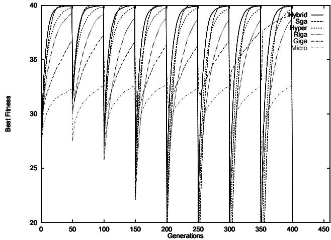  
Figure 1: Classical GAs on Pattern Tracking

At rst, we compare the following GAs: Goldberg's Simple Genetic Algorithm (Sga) with a mutation rate $\mu = 0 . 0 8$ , and an Hybrid GA (Hybrid) featuring a Lamarckian Local Search with radius 40 to locally improve tness. Then, we also evaluate a Random Immigrant GA (Riga) with rate 0:05, Hypermutation (Hyper) with rate 0:2, the $\mu \mathrm { G A }$ (Popsize 5) and Giga. We used the authors' standard settings or values that improved the eciency during preliminary experiments. Non specic parameters were set as follows: Crossover rate 0.7, population size 40, Selection by K-Tournament $\mathrm { \ K t = 4 }$ ) and worst-individuals replacement scheme.

The resulting curves are plotted by order of eciency (Fig. 1) which is evaluated both by the level of tness achieved and inversely to the depth of drop o at each transition. The Hybrid GA revealed to be the most ecient while other GAs featured qualitatively similar behaviors at dierent levels of eciency. Only Giga featured a tness level drop o depth diminishing over time which is the sign of an improved robustness.

The Figure 2 is an attempt to dene more accurately Sais' eciency in comparison to the Hybrid GA and the Hypermutation. We can observe that:

1. Sais converges quicker than Hypermutation and maintains a higher tness on average

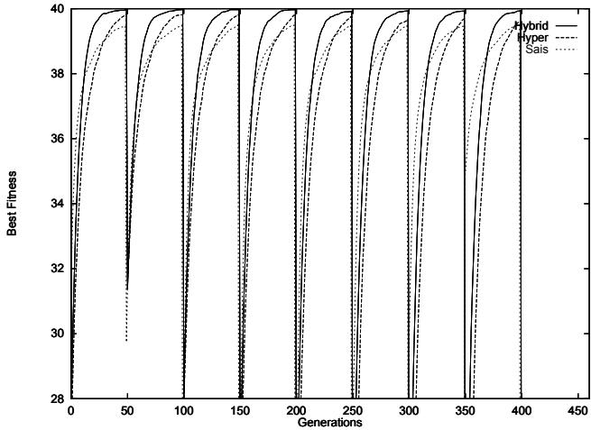  
Figure 2: Sais, Hybrid and Hypermutation

2. It is very close to Hybrid (overall ranked 3 over the 7 algorithms tested)

3. Drops o are less important despite of increasingly dicult transitions

The following sections will focus on comparing more accurately Sais with Hybrid (Local Search / reactiveness) and Giga (robustness) in order to clarify the two last observations made.

# 2.3 Reactiveness: Sais vs Local Search

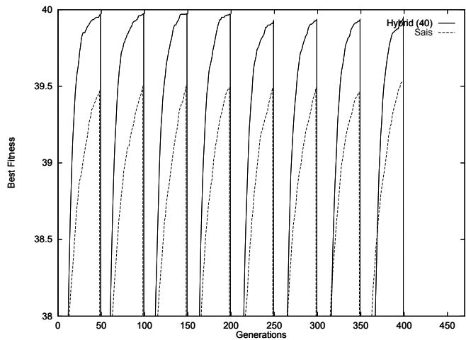  
Figure 3: Hybrid Method and Sais

Although, Sais uses a local search which radius is identical to the one used in Hybrid (maximum 40), previous results revealed that it was less reactive than the latter. In order to make up for this bad use of its Local Search operator, we increase the number of clones copied from each exo-activated B-Cell in Sais. This increased Clonal Factor has direct consequences on the eciency of the Local Search but also on its computational cost since each clone has to be evaluated.

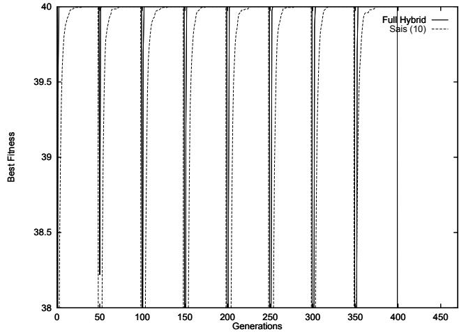  
Figure 4: Improved Sais and Hybrid Methods

The Figure 3 compares (with a zoom) Hybrid to a version of Sais in which the Clonal Factor has been increased from 1 to 10. In order to provide fair comparisons, we enable Hybrid to 
ip each of the 40 bits and only keep tness improving alterations (Full Hybrid). From a Computational standpoint, Full Hybrid is very expensive (40 evaluations per local search). It will serve us as a upper bound of the eciency of a Local Search method2. The experimental results (Fig. 4) show that, despite of its previously discussed weakness, Sais makes a good use of the computational resources that it is provided with. Indeed, it comes very close to the Full Hybrid's results while only using a fourth of its ressources in terms of number of evaluations (10 for Sais vs 40 for Full Hybrid).

# 2.4 Robustness: Sais vs. Giga

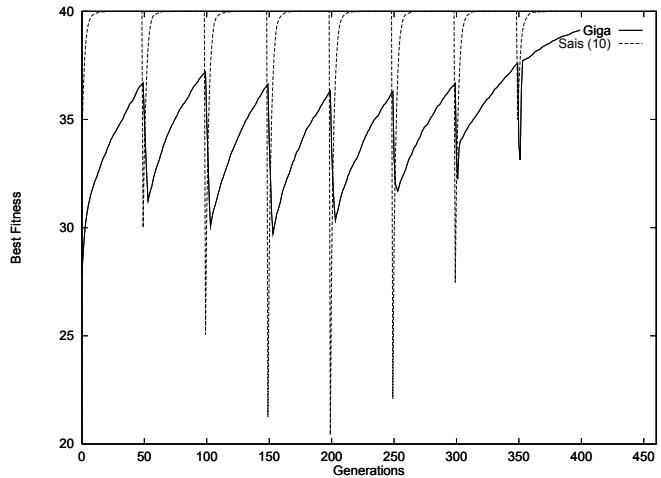  
Figure 5: Sais vs Giga : Memory Eect

Sais and Giga are the two only algorithms to limit signicantly the magnitude of the dropping o phenomenon. During dicult transitions, a diversied population helps to maintain the tness level. Nevertheless, the GAs featuring a high mutation rate, even if they introduce diversity, do not limit dropping o depth. This one is therefore independent of the reactiveness of the system and is rather correlated to its robustness to new transitions.

The Figure 5 compares Sais to Culberson's Giga. The former realizes a tradeo between diversity preservation and convergence (i.e. between robustness and reactiveness) as it simultaneously features both a higher tness level and a lower diversity than Giga.

It can be observed that, as transitions get more dicult, Sais gets better at reducing the dropping o phenomenon. We interpreted it as a sign that the diversity of populations was due to the preservation of past optima rather than pure randomness. The key hypothesis is that as the distance between two consecutive optima increases, we are more about to pick up a new optimum which will be in the neighbourhood of a previous one. In such a context, a good robustness can equally indicate an over-average ability to preserve a diversied population, or to remember previously encountered optima. In order to clarify whether Sais is able of such an immunization process, we are going to use a cyclic pattern tracking environment.

# 2.5 Immunization: Experimental Study

This section evaluates Sais' immunization ability on a Cyclic Pattern Tracking problem.

# 2.5.1 Pointing Out the Immunization Phenomenon

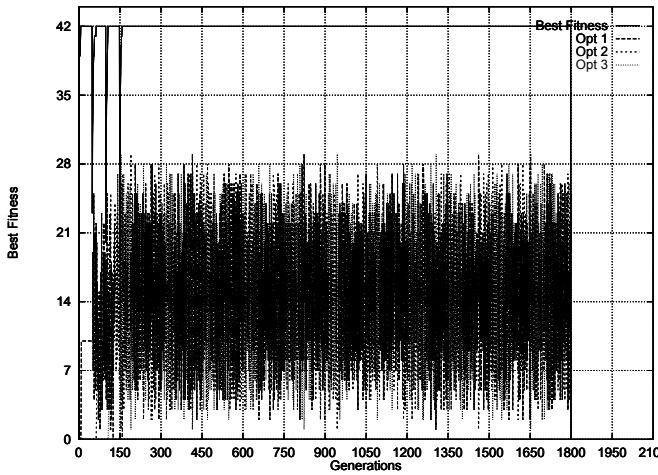  
Figure 6: Sais on Cpt (one exp)

The chosen problem involves 42 bit long strings and has 3 successive optima: 100, 010, 001 (each digit stands for 14 bits). The other parameters have been kept identical to previous experiments so that every 150 generations a new cycle starts with 100 being optimal again. The Figure 7 plots, for each generation, the best tness and the density of each of the 3 optima in the population. Please note that these results stand for a single run. After encountering each optimum, Sais keeps them represented in its population and therefore faces further cycles 
awlessly in so far that the optimum being already represented there is absolutely no drop o when the transition occurs. In this \ideal" situation, one can nevertheless already note the rocky variations of the optima's densities which could (and will) cause an instable memorisation.

This single experiment illustrates the potential of Sais but we conducted another experiment averaged on 200 runs in order to provide fair results. The Figure 6 reveals that, even if the immunization dynamics is unstable, it reduces on average the search eort needed to retrieve an optimal tness level after each transition. Globally, the robustness has been therefore increased and the ability to remember previously encountered optima is appearant when averaging their densities over time. Moreover, this suggests that the catastrophic forgetting may be a punctual and contingent accident in this dynamics.

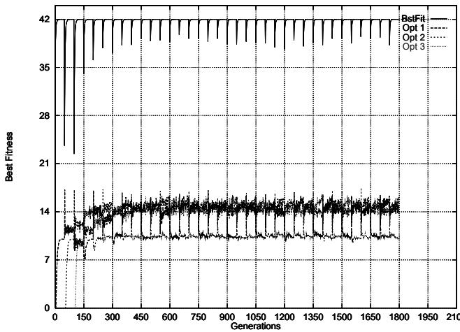  
Figure 7: Sais on a Cpt (200 exps)

# 2.5.2 In
uence of the Number of Optima

To evaluate the danger of forgetting optima, we experiment with a Cyclic Pattern Tracking dened over 40 bits long strings and play with various number of optima per cycle. All other parameters are kept identical. The cycles are still composed of a serie of optima built by shifting one block of $\lambda / n ^ { 3 }$ consecutive '1' from left to right at each transition.

We experimented with 2, 4, 5, 8, 10 and 20 optima as illustrated in Figure 11 (results averaged over 200 runs). We plotted in the upper part of the graph the best tness of each generation and, in the lower part, the densities of all or only some of the successive optima.

Globally, as the number of optima increases, the memorisation capacity of the system decreases. The plotting of the best tness is somewhat misleading in so far that the magnitude of the drop o decreases when the number of optima increases. Nevertheless, this decrease is only due to the decrease of the Hamming distance between optima as they get more numerous. Basically, they always only dier of two blocs, i.e. of $\lambda / n$ bits for each problem. As $_ n$ increases, their reduced distance to each other explains that the drop o decreases. Indeed, the population contains previous optima which are close enough to the new one to make the system feature an apparently good robustness.

Taking a closer look at the densities of the optima represented in the population reveals that, despite of this good performance, Sais looses systematically every optimum when it comes to tackle problems featuring a large number of optima. This constitutes a serious limitation to the use of Sais as a black box optimization system.

# 2.6 Synthesis

For now, Sais features an over average reactiveness in TDO problems and uses to its best the computational resources it is provided with. It also reduces the drop o phenomenon on average thus featuring an improved robustness and even experience acquisition abilities.

Concerning the latter, the results are not yet satisfying despite of an encouraging potential. On average, the system remembers previously encountered optima but there is always a probability for catastrophic forgettings to occur and force the system to have to search again an already memorized structure. The plotting over time of the densities of the optima suggests that this could be due to the unstability of the immunization dynamics induced by the use of an endotness. In the following, we are going to consider an alternative approach to model the immunization process in order to reach a stable memorization of previously encountered optima.

# 3 YaSais: Yet Another Simple Articial Immune System

Our guideline is that the unstability of Sais' immunization is due to the endotness scheme used. Instead of letting the size of the idiotypic networks evolve freely, we propose to x it and therefore introduce explicit sets of B-Cells in the population (Gatherings).

# 3.1 Using Gatherings with Sais

This section describes YaSais in comparison to Sais.

# 3.1.1 Explicit Idiotypic Cycles

Our idea is to use explicit sub-populations isolating sets of B-Cells like idiotypic nets would in order to preserve previous optima. In comparison to Sais, a new parameter is introduced: the number $\mathcal { G }$ of such gatherings of B-Cells.

In YaSais, the ExoActivation only concerns a certain amount of B-Cells per gathering. In our experiments, we started by exoactivating only one B-Cell per Gathering with the hope that if the population contains gatherings which size equals the number of optima, then in the long run the gatherings will each contain an instance of each optimum.

Once ExoActivated B-Cells have been selected, they undergo Clonal Selection and Somatic Hypermutation as previously described but, contrary to what happensin Sais, no B-Cell is EndoActivated. All the remaining B-Cells are just preserved in the population in their respective gatherings. The endo dynamics is therefore very simple and should not feature any unstable dynamics.

We implemented two variants of YaSais diering on the way endoactivated B-Cells are picked up. A rst version allows the activation of a xed number of B-Cells per gathering (1 to start o with) like previously detailed. Then, we estimated that this strict topological restriction on evolution could be too much of a severe handicap in converging toward global optima. Therefore, we implemented a second version which enables the exoactivation of the same number of B-Cells but with no constraint uppon their belonging to any particular gathering. This version was completed with an operator in charge of relocating the exoactivated B-Cells after each generation so that they are equally present in each gathering.

We conducted an experimental comparison of both approaches over a $\lambda = 5 0$ bits long pattern tracking problem featuring 5 consecutive optima determined as for previous experiments with Sais and with a Transition Period of 50 generations. The results revealed that both approaches were quasi identical with a very light advantage in favor of the second version. This advantage was more appearant as we investigated various number of gatherings. As this number increased, the second version seemed to deal slightly better with the problem than the rst one. For this reason we focussed on it since then. We plotted in the Figure 8 two typical experiments to illustrate this point.

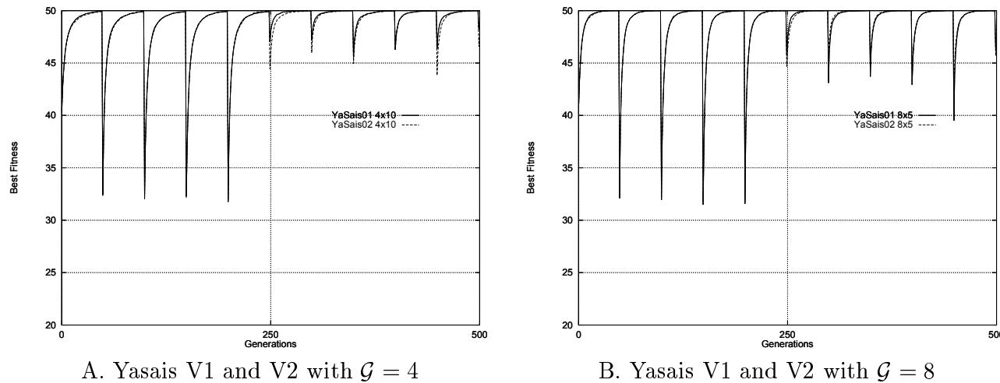  
Figure 8: Comparing versions 1 and 2 of YaSais

The following sections are going to detail the results of the experimental study we conducted on the second version of YaSais.After comparing its reactiveness and robustness to Sais and investigating further the in
uence of the number of gatherings, we are going to focus on the immunization capacity.

# 3.2 First Experimental Results

In this section, we investigate the eect of the number of gatherings on YaSais. For this purpose, we use the same 50 bits, 5 optima, Cyclic Pattern Tracking problem than in previous experiments.

# 3.2.1 The Eect of $\mathcal { G }$

The Figure 12 sums up the results obtained with various $\mathcal { G }$ . As only one B-Cell per gathering is exoactivated, this parameter also represents the search potential of the algorithm at each generation. This can be noticed on the curves as the maximal density of each optimum which is upper bounded by $\mathcal { G }$ .

As the problem features 5 optima, we expected the best setting to be $\mathcal { G } = 8$ as it induces a size of gathering equal to 5. Ideally, we hoped the system to evolve gatherings composed of all optima and therefore immunized to all environmental changes. In practice, the results revealed that, as $\mathcal { G }$ increases, the immunization process gets less and less accurate. This can be especially seen from the plottings of the densities of the optima: for high values of $\mathscr { G }$ , the system has to rediscover some optima which could not be memorized correctly.

# 3.2.2 Comparison with Sais

This section compares the best results obtained with YaSais to the ones provided by Sais. The Figure 9 shows that the reactivity is globally equivalent, being only slightly inferior when using two gatherings but along with a clearly improved robustness.

It is nevertheless not yet obvious why the number of gatherings is such a sensitive parameter in respect with the memorization ability of the system whereas it could be expected to be only relevant as far as the reactiveness is concerned. We believe that, on non epistasic problems, the local search implemented via the Somatic Hypermutation process takes care of most of the exploration eort. Yet, this still does not provide us with any insights about the unability to use eciently a larger number of gatherings. This question is going to be investigated in more details in the following subsection.

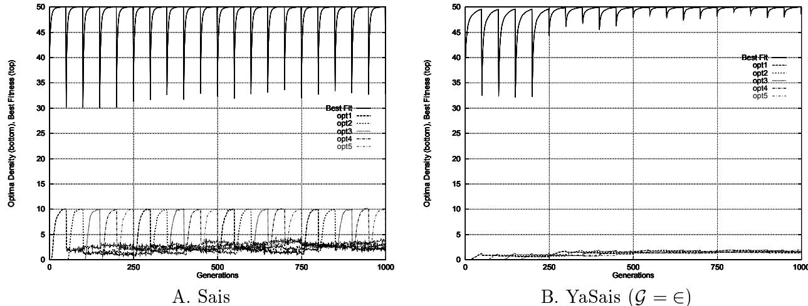  
Figure 9: Comparing the Best YaSais to Sais

# 3.3 Taking a closer look to the Immunization Process

The question that still remains opened at this point of our discussion is why is the immunization phenomenon still not optimal despite of the improvements achieved on robustness. To answer this question, we are going to take a closer look to the in
uence of the number of optima on the sensitivity of the $\mathcal { G }$ parameter over YaSais' Eciency.

# 3.3.1 Where do the previous optima go ?

If previous optima are not kept long enough to be already present in the population during the next cycle, then it is essential to understand what makes them disappear from the population. YaSais' selective pressure preserves most B-Cells unchanged from generation to generation; only a relatively small percentage is exoactivated and therefore participates actively to the exploration process. Because of this particularity, chances are that the exoactivation mechanism is responsible for immunization problems. This hypothesis is advocated by the fact that the number of gatherings is also the number of B-Cells being exoactivated.

We consider a single run of YaSais in the same environment than previously with 5 gatherings containing 8 B-Cells each. The Figure 10.A only plots the density of the second optimum of the cycle. It is appearant that, as soon as the second optimum is replaced by the third one, its density in the population decreases abruptly. Moreover, the decrease continues during other transitions.

This can be interpreted as the use of the B-Cells encoding the 2nd optimum in the search for the new optimum. In other terms, instead of being preserved in the population, those B-Cells that revealed to be usefull during the period of the second optimum are discarded or, more probably, re-used via local search to explore the environment toward the new optima. According to the way we apply the local search, this means that these B-Cells constitute a good starting point for reaching new optima. In other terms, their distance to the new optimum is small enough to enable the local search to reach it quicker than if it was applied to another individual of the population.

Let us take a closer look to the densities of the optima during the transition 1000 in the Figure 10. The Table 1 details the relevant information and reveals that 6 B-Cells that should have been conserved have been lost and that, on the other hand, the 2 B-Cells already encoding the new optimum had their number rised by 6. In other terms, the system only used B-Cells encoding the previous optimum to converge toward the new one whereas it was expected to use the reminder of the population which is not encoding any previous optimum and should therefore be used in priority for further explorations.

Table 1: Taking a closer look to a Transition with Yasais   

<table><tr><td rowspan=1 colspan=1>Optimum</td><td rowspan=1 colspan=1>Generation 999</td><td rowspan=1 colspan=1>Generation 1000</td><td rowspan=1 colspan=1>Change</td></tr><tr><td rowspan=1 colspan=1>Opt1</td><td rowspan=1 colspan=1>2</td><td rowspan=1 colspan=1>8</td><td rowspan=1 colspan=1>+6</td></tr><tr><td rowspan=1 colspan=1>Opt2</td><td rowspan=1 colspan=1>1</td><td rowspan=1 colspan=1>0</td><td rowspan=1 colspan=1>−1</td></tr><tr><td rowspan=1 colspan=1>Opt3</td><td rowspan=1 colspan=1>3</td><td rowspan=1 colspan=1>3</td><td rowspan=1 colspan=1>No Change</td></tr><tr><td rowspan=1 colspan=1>Opt4</td><td rowspan=1 colspan=1>3</td><td rowspan=1 colspan=1>2</td><td rowspan=1 colspan=1>−1</td></tr><tr><td rowspan=1 colspan=1>Opt5</td><td rowspan=1 colspan=1>8</td><td rowspan=1 colspan=1>5</td><td rowspan=1 colspan=1>-4</td></tr></table>

The reason for which previous optima appear to be so interesting to be used as a basis for further exploration is to be found in the distance separating each consecutive optimum from the others. The $_ n$ optima are determined by shifting from left to right a block of $\lambda / n$ '1'. As previously discussed, each optimum is distant of only two blocks from the others. In our case, where $n = 5$ and $\lambda = 5 0$ , this means that they are at a Hamming distance of 20 from each other.

In this context, YaSais will systematically exoactivate in priority the B-Cells which are located at this distance (or below) from the new optimum. The question that arises now is to know what is the probability for a non previously optimal B-Cell to be located that close to the new optimum. If we look again to the transition occuring at the generation 1000, we can count 17 individuals which are or were optimal. This lets only 23 B-Cells in the population. How many are potentially interesting among them ?

The probability of a randomly generated string (we assume these 23 individuals to be random) to match the new optimum is $0 . 5 ^ { \lambda }$ . Now, if we consider all the possible Hamming distances between such a bit string and the optimum we can state that this probability for it ot be at a distance less or equal to 20 is:

$$
P = \sum _ { d = 0 } ^ { 2 0 } 0 . 5 ^ { 5 } 0 . C _ { \lambda } ^ { d }
$$

In our case, this probability equals approximatively to $1 0 \%$ . In other terms, only 3 individuals on average among the 23 remaining in the population may be more interesting as a starting point than the B-Cells encoding a previously encountered optimum. As we are going to exoactivate 8 individuals (one per gathering), this means that if these 3 ones are selected, 5 B-Cells encoding a previous optimum will be used to reconverge toward the new one. This is coherent with the fact that 6 B-Cells were used that way in this experiment.

Therefore, the 
aws in immunization seem to be due to the nature of the considered problem. More generally, as soon as two optima are too close, one may be used by the system to reach the other one and vice et versa. The global performance of the system is kept acceptable because when the distance is short previous optima are lost but the consequences on the tness drop o are limited. On the other hand, if the distance is large, the consequences could be more harmful but in this case the immunization seems to work ne.

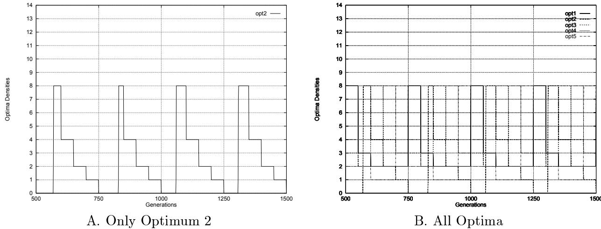  
Figure 10: YaSais $\mathcal { G } = 8$ ) Single Run

# 3.3.2 In
uence of the Distance between Optima

We realized a variation of the previous experiment using an cyclic pattern tracking featuring two optima only. Their relative distance was varied in order to establish if the number of optima can be held responsible of the encountered immunization diculties or if their distance does.

The results (Fig. 13) conrm our hypothesis: as the distance between the two optima increases, the immunization gets more and more ecient. We already pointed out ealier that, when observing the best tness per generation, one must be carefull. Indeed, even if a high tness level is kept when consecutive optima are close to each other, it is not due to the ability of the system to remember them. In fact, only this proximity makes the current optimum a good approximation of the next one. Our conclusions have been conrmed by taking a closer look to the optima densities: for low distances, optima are systematically lost, when optima are chosen far enough appart, their densities are maintained over time. This is the external sign of an ongoing immunization dynamics.

# Список литературы
# 4 Discussion and Further Work

This paper investigated a new evolutionst approach to Time Dependent Optimization based on the Immune System metaphor. The experimental results on a pattern tracking problem revealed that both proposed algorithms (Sais and then YaSais) are ecient Dynamical optimization Tools. A restriction should be kept in mind as we only considered so far non epistasic problems for which we suspect the somatic hypermutation to play a central role in improving the system's reactiveness.

Nevertheless, independently of their reactiveness, Sais and YaSais also featured an improved robustness to environmental changes. This robustness took two complementary aspects. Whenever the transitions are easy (low distance between consecutive optima), the natural diversity kept in the population is enough to ensure a good level of tness to be kept during the transitions. On the other hand, when confronted to dicult transitions, YaSais takes advantage of any relevant information in the population such as previous optima. Therefore, an implicit tradeo is realized between the use of the random diversity and the oriented one induced by the immunization process. The rule seems to be \if it is hard to nd, remember it, otherwize, just drop it". Even if not reaching a perfect immunization ability as we initially expected when switching from Sais to YaSais, we must admit that though being more \lazy", YaSais still features an optimal use of its capabilities.

Further work on these models will be concerned with an investigation of the relevance of the coevolutionary dynamics to articial immune systems. Coevolution has been reported as an ecient way to fasten evolutionary dynamics by introducing competitive or symbiotic schemes between isolated subpopulations. In our case, two points may be of particular interest: At rst modelling and analyzing the potential of a coevolutionary maintained random diversity, and then investigating the possibility of applying the same scheme to maintain previously encountered optima by switching them form an exogenic population to an endogenic one.

# References

[ADGD96] F. Abbattista, G. DiGioia, and A.M. Fanelli G. DiSanto. An associative memory based on the immune networks. In Proc. of the International Conference on Neural Networks (ICNN), 1996.

[Bac91] T. Back. Self adaptation in genetic algorithms. In F.J. Varela and P. Bourgine, editors, Toward a Practice of Autonomous Systems -First European Conference on Articial Life-. MIT Press, 1991.   
[Ber91] H. Bersini. Immune network and adaptive control. In F.J. Varela and P. Bourgine, editors, Toward a Practice of Autonomous Systems -First European Conference on Articial Life-, pages 217{226. MIT Press, 1991.   
[BV90] H. Bersini and F. Varela. Hints for adaptive problem solving gleaned from immune networks. In Proceedings of the First Conference on Paral lel Problem Solving From Nature, pages 343{354, 1990.   
[CG93] H.C. Cobb and J.J. Grefenstette. Genetic algorithms for tracking changing environments. In Icga-5, 1993.   
[DA97] D. Dasgupta and N. AttohOkine. Immunity-based systems: A survey. In Proceedings of the IEEE International Conference on Systems, Man and Cybernetics, October 12-15 1997.   
[Das97] D. Dasgupta. Articial immune systems: Similarities and dierences. In Proceedings of the IEEE International Conference on Systems, Man and Cybernetics, October 12-15 1997.   
[DFH96] P. D'haeseleer, S. Forrest, and P. Helman. An immunological approach to change detection : algorithms, analysis and implications. In Proceedings of the 1996 IEEE Symposium on Computer Security and Privacy, 1996.   
[Far90] J.D. Farmer. A rosetta stone for connectionism. Physica D, 42:153{187, 1990.   
[FPP86] J.D. Farmer, N.H. PAckard, and A.S. Perelson. The immune system, adaptation and machine learning. Physica D, 22:187{204, 1986.   
[Gol89] D.E. Goldberg. Genetic Learning in optimization, search and machine learning. Addisson Wesley, 1989.   
[Gre92] J.J. Grefenstette. Genetic algorithms for changing environments. In R. Manner and B. Manderick, editors, Paral lel Problem Solving from Nature 2, pages 465{ 501. Elsevier Science Publishers B.V., 1992.   
[HC96] J. E. Hunt and D. E. Cooke. Learning using an articial immune system. In Journal of Network and Computer Applications: Special Issue on Intel ligent Systems: Design and Application, 1996.   
[HCH95] J.E. Hunt, D.E. Cooke, and H. Holstein. Case memory and retrieval based on the immune system. Lecture Note in Articial Intel ligence : Case-Based Reasoning Research and Development, 1010:205{216, 1995.   
[HFP96] R. Hightower, S. Forrest, and A.S. Perelson. The Baldwin Eect in the Immune System : Learning by Somatic Hypermutation. Addisson Wesley, 1996.   
[Hol92] J. H. Holland. Adaptation in Natural and Articial Systems. MIT Press, 2nd edition, 1992.   
[IKWU96] A. Ishiguro, T. Kondo, Y. Watanabe, and Y. Uchikawa. Immunoid: An immunological approach to decentralized behavior arbitration of autonomous mobilerobots. In Voigt et al. [VERS96], pages 670{675.   
[Jer74] N.K. Jerne. Towards a network theory of the immune system. Annals of Immunology, 125(C):373{389, 1974.   
[Jer84] N.K. Jerne. Idiotypic networks and other preconceived ideas. Immunological Reviews, (79):5{24, 1984.   
[Me98] L. Me. Gassata, a genetic algorithm as an alternative tool for security audit trails analysis. In First International Workshop on the Recent Advances in Intrusion Detection (RAID98), September 1998.   
[MKN96] N. Mori, H. Kita, and Y. Nishikawa. Adaptation to a changing environment by means of the thermodynamical genetic algorithm. In Voigt et al. [VERS96], pages 513{522.   
[Per89] A.S. Perelson. Immune network theory. Immunological Review, 110:5{36, 1989.   
[Plo97] M.A. Plotter. The Design and Analysis of a Computational Model of Cooperative Coevolution. Phd thesis, George Masson University, 1997.   
[SFP93] R.E. Smith, S. Forrest, and A.S. Perelson. Searching for diverse, cooperative populations with genetic algorithms. Evolutionary Computation, 1(2):127{149, 1993.   
[SFP97] D.J. Smith, S. Forrest, and A.S. Perelson. Immunological memory is associative. In Workshop Notes, Worshop 4: Immunity Based Systems, International Conference on Multiagent Systems, pages 62{70, 1997.   
[Ste94] J. Stewart. Un systeme cognitif sans neurones: les capacites d'adaptation, d'apprentissage et de memoiredy systeme immunitaire. Intel lectica, 1(18):15{43, 1994.   
[VCDV88] F. Varela, A. Coutinho, B. Dupire, and N.N. Vaz. Cognitive Networks: Immune, Neural, and Otherwize, pages 359{375. SFI Studies in the Science of Complexity. Addisson Wesley Publishing Company, 1988.   
[VERS96] H-M Voigt, W. Ebeling, I. Rechenberg, and H-P Schwefel, editors. International Conference on Evolutionary Computation : Paral lel Problem Solving from Nature IV, volume 1141 of Lecture Notes in Computer Science, Berlin Germany, September 1996. Springer Verlag.   
[VFJ96] F. Vavak, T.C. Fogarty, and K. Jukes. A genetic algorithm with variable range of local search for adaptive control of the dynamic systems. In Mendel'96 : Proceedings of the 2nd Mendelian Conference on Genetic Algorithms, 1996.   
[VJF97] F. Vavak, K. Jukes, and T.C. Fogarty. Adaptive combustion balancing in multiple burner boiler using a genetic algorithm with variable range of local search. In Proceedings of the Seventh International Conference on Genetic Algorithms and their Applications, pages 719{726. Morgan Kaufman, 1997.

[XKPR95] S. Xanthakis, S. Karapoulios, R. Pa jot, and A. Rozz. Immune system and faulttolerant computing. In J.J. Merelo F. Moran, A. Moreno and P. Chacon, editors, Advances in Articial Life: Proceedings of the European Conference on Articial Life ECAL95, number 929 in Lecture Notes in Computer Science (LNCS), pages 181{197. Springer Verlag, 1995.

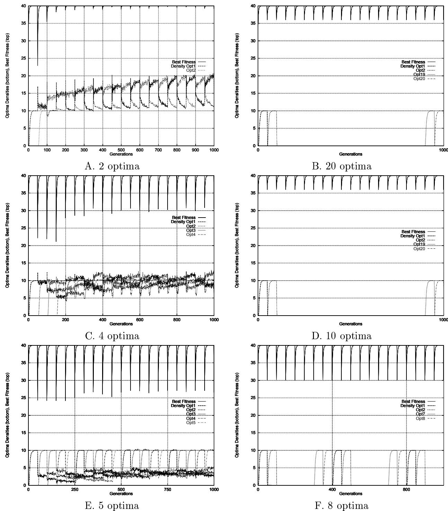  
Figure 11: Varying the number of optima to check Sais's memory capacity

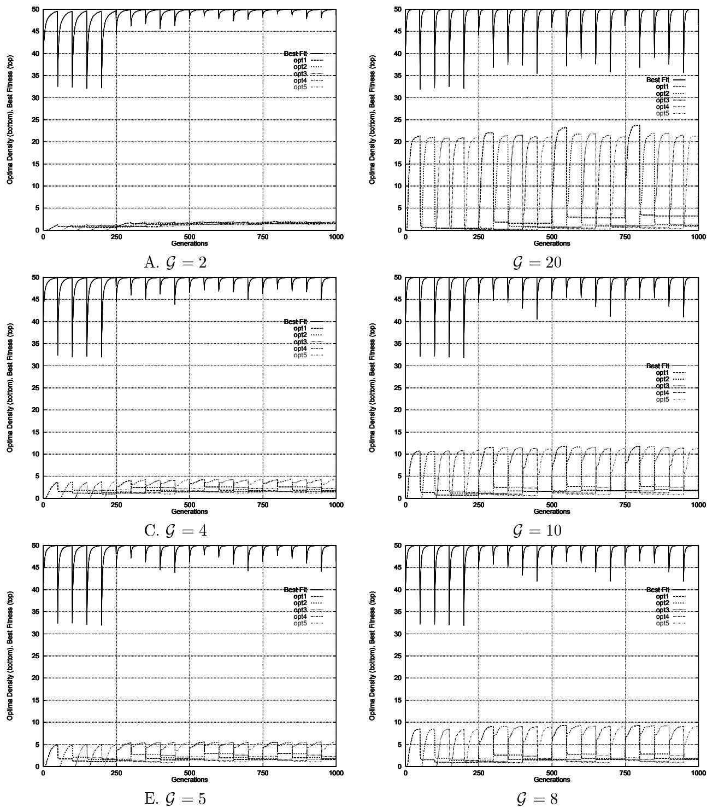  
Figure 12: Varying $\mathcal { G }$ with YaSais

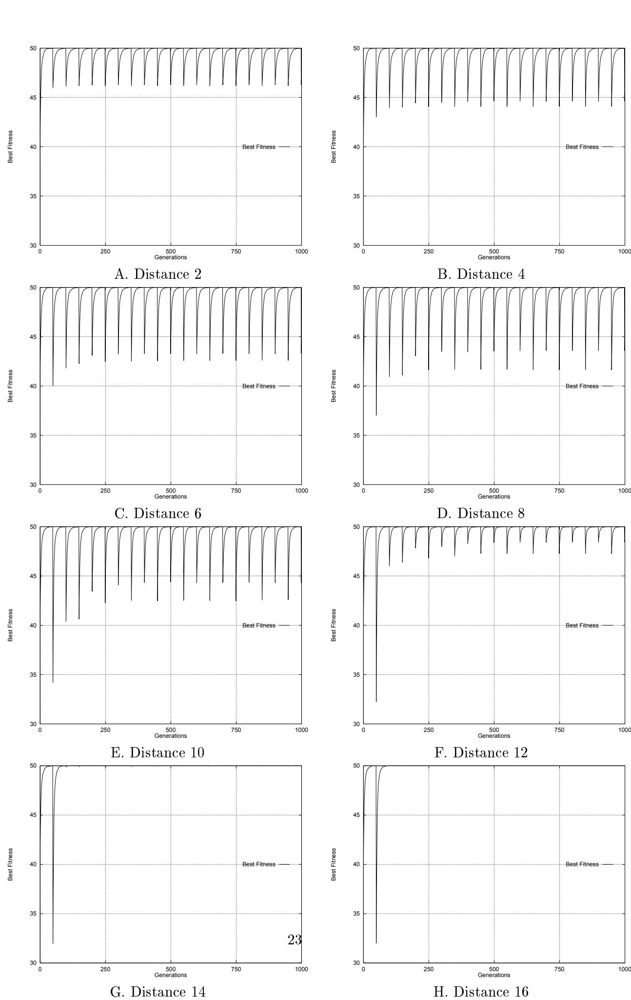  
Figure 13: In
uence of the Distance Between Optima on YaSais' Immunization Capability