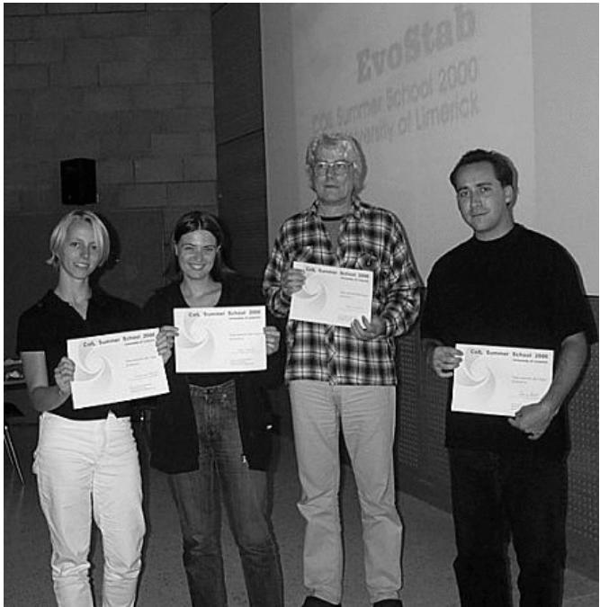
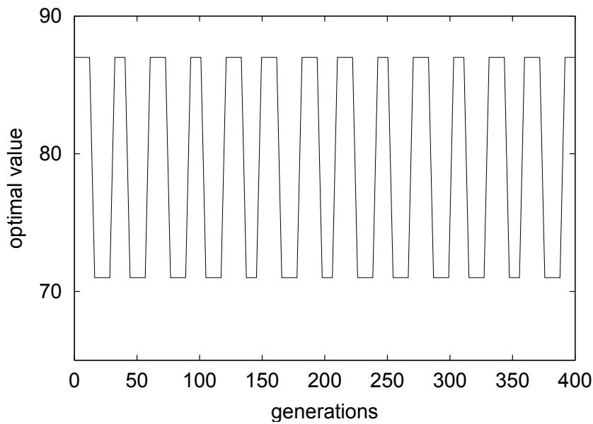
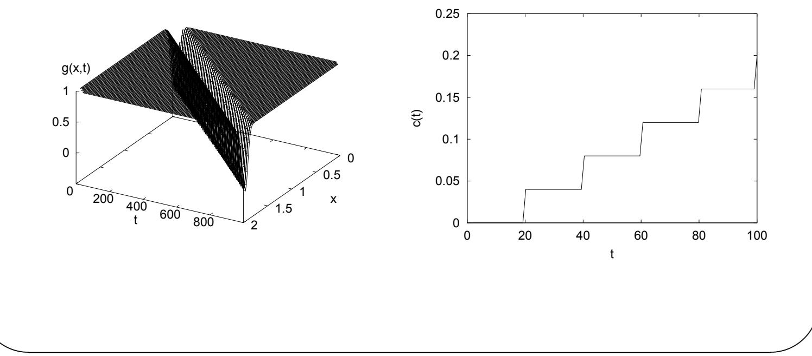
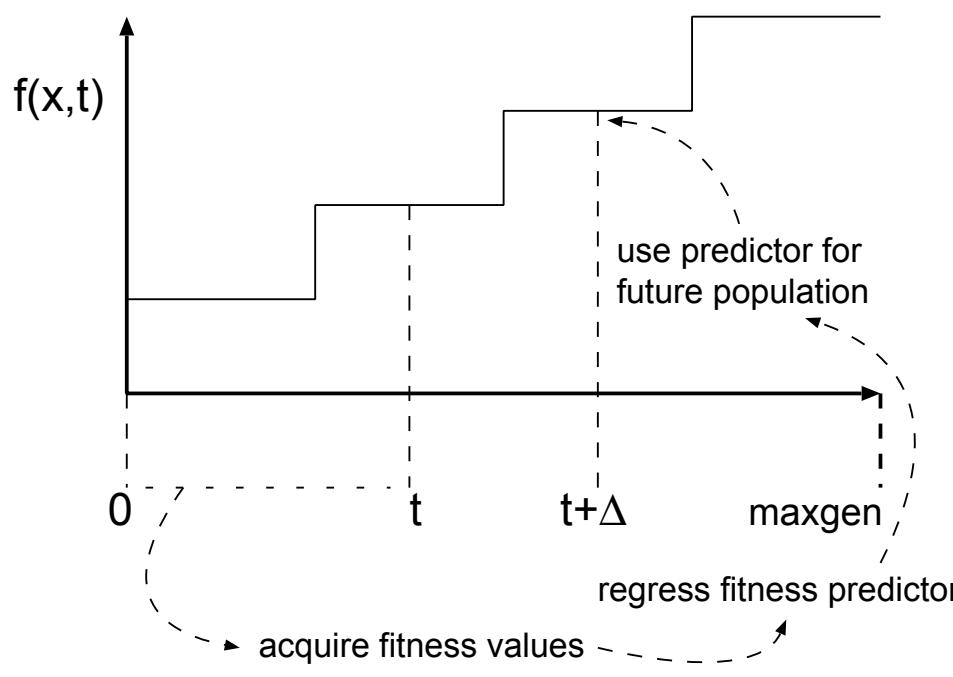
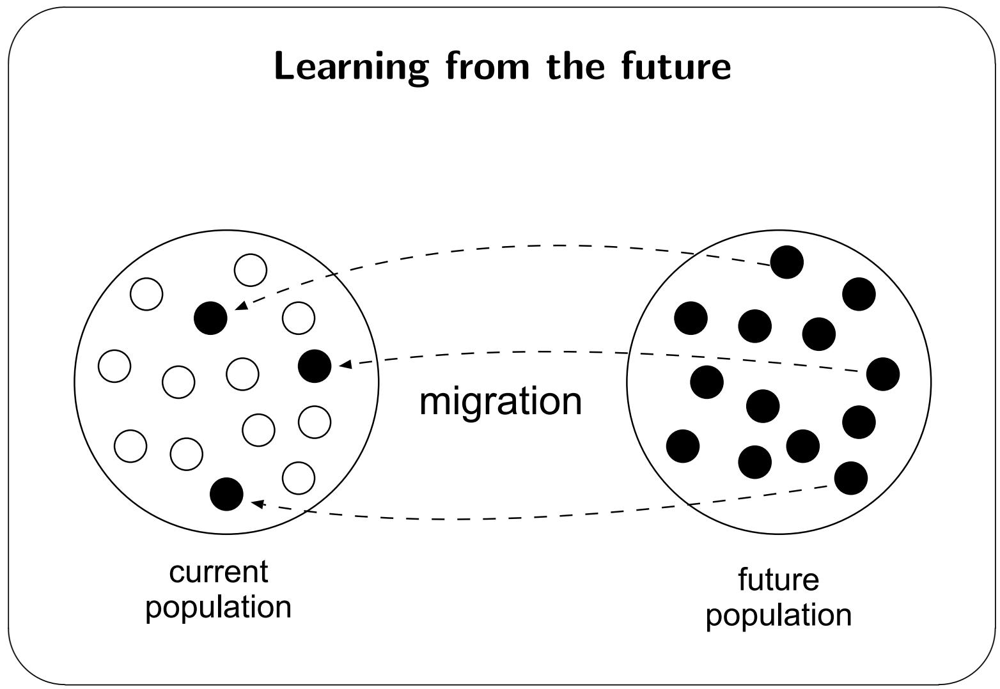
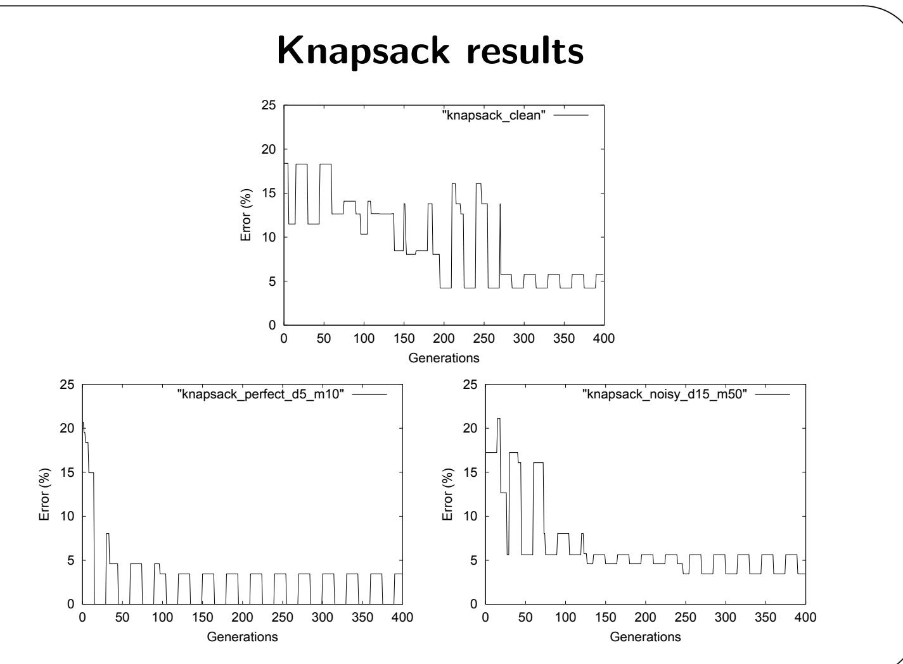
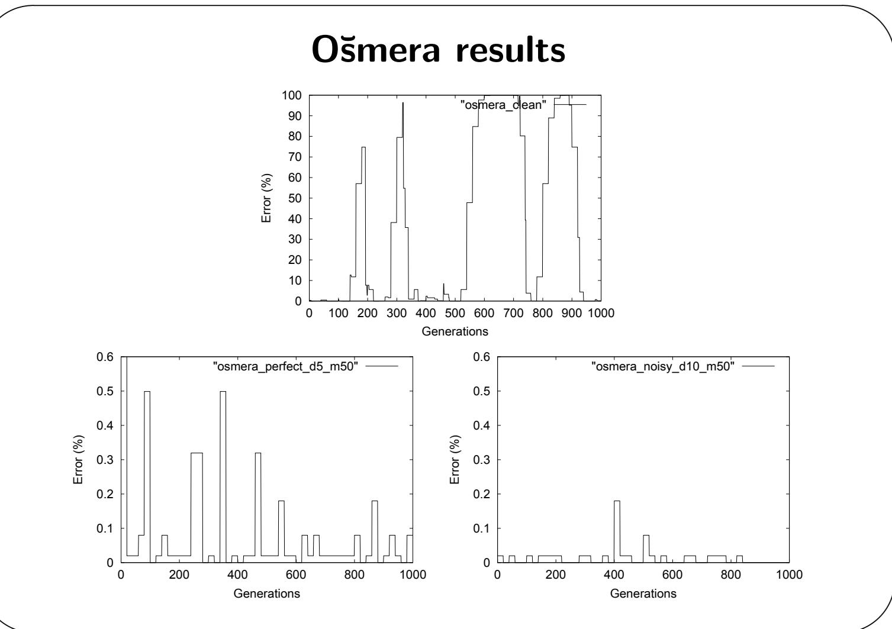

# A “Futurist” approach to dynamic environments

Jano van Hemert, Leiden University, The Netherlands   
$\boldsymbol { \mathscr { E } } \boldsymbol { \mathscr { z } }$   
Clarissa Van Hoyweghen, University of Antwerp, Belgium   
&   
Eduard Lukschandl, Ericsson & Hewlett-Packard   
&   
Katja Verbeeck, University of Brussels, Belgium   
presented by   
Jano van Hemert   
jvhemert@liacs.nl   
http://www.liacs.nl/\~jvhemert

# How it all started

Coil Summer School 2000, Limerick, Ireland $\lll$ People assigned to groups to solve different problems $\lll$ Conor Ryan provided our group with two dynamic problems $\lll$ He has attempted to solve those problems using diploid chromosomes $\lll$ Our objective set was to try to solve them using one of the techniques presented at the summer school

# How it all started

Coil Summer School 2000, Limerick, Ireland

# The next half hour

$\textcircled{1}$ Problem descriptions $\textcircled{2}$ General idea $\textcircled{3}$ Two tested implementation $\textcircled{4}$ Experiments & Results $\textcircled{5}$ Conclusions & Future Work $\textcircled{6}$ Questions & Discussion

# 0  1 Knapsack – Definition

Goal is to fill a knapsack with objects   
Each object has a weight and value assigned   
Every 15 generations the maximum allowed weight is changed   
Maximum weight is switched between $5 0 \%$ and $8 0 \%$ of the total weight   
of all the objects   
Total of 400 generations (time steps) is used

# 0  1 Knapsack – Behaviour

☞ Optimum changes over time

# O˘smera’s function — Definition

$$
\boxed { g _ { 1 } ( x , t ) = 1 - e ^ { 2 0 0 ( x - c ( t ) ) ^ { 2 } } }
$$

with $c ( t ) = 0 . 0 4 ( \lfloor t / 2 0 \rfloor )$ , $x \in \{ 0 . 0 0 0 , \ldots 2 . 0 0 0 \} ,$ each time step $t \in \{ 0 , \ldots 1 0 0 0 \}$ equal to one generation

# O˘smera’s function — Behaviour

# Predicting the future

Workshop on Dynamic Optimization

# Parameters

✔ m determines how many individuals are copied to the current population, best m from the future are selected and overwrite the worst m in the current population

$\Delta$ determines how many generations ahead the future population lives

# Two experiments

# Perfect prediction

$\lll$ Idea is that the best what could happen is that you have a perfect prediction of the future

$\lll$ With these problems this is very easy to implement as we know exactly the optimum for $t + \Delta$

$\lll$ If this is not successful, we could ask ourselves if it is useful to continue with the idea of predicting the future

# Noisy prediction

$\lll$ Could the use of a predictor be harmful?

$\lll$ We give the algorithm noisy and deceptive predictions of the future

$\lll$ Knapsack problem gets wrong optimum (deceptive) and O˘smera gets a random value

# Experimental setup

# For both problems we do

a test without any future population   
tests with four parameter settings (two pairs) for perfect prediction   
tests with four parameter settings (two pairs) for noisy / deceptive   
predictor   
50 runs for each test with unique random seeds

# Knapsack results

<table><tr><td>predictor</td><td>∆</td><td>m</td><td>error</td><td>stdev</td><td>best run</td></tr><tr><td>none</td><td>×</td><td>×</td><td>16.6%</td><td>3.52</td><td>8.96%</td></tr><tr><td>perfect</td><td>5</td><td>10</td><td>11.9%</td><td>3.77</td><td>4.85%</td></tr><tr><td>perfect</td><td>15</td><td>10</td><td>20.3%</td><td>4.26</td><td>11.7%</td></tr><tr><td>perfect</td><td>5</td><td>50</td><td>11.8%</td><td>3.70</td><td>5.97%</td></tr><tr><td>perfect</td><td>15</td><td>50</td><td>21.4%</td><td>6.06</td><td>12.0%</td></tr><tr><td>deceptive</td><td>5</td><td>10</td><td>12.6%</td><td>4.12</td><td>6.77%</td></tr><tr><td>deceptive</td><td>15</td><td>10</td><td>13.0%</td><td>3.74</td><td>7.50%</td></tr><tr><td>deceptive</td><td>5</td><td>50</td><td>12.7%</td><td>4.02</td><td>6.47%</td></tr><tr><td>deceptive</td><td>15</td><td>50</td><td>12.8%</td><td>4.07</td><td>4.99%</td></tr></table>

Workshop on Dynamic Optimization

# O˘smera results

<table><tr><td>predictor</td><td>∆</td><td>m</td><td>error</td><td>stdev</td><td>best run</td></tr><tr><td>none</td><td>×</td><td>X</td><td>63.8%</td><td>10.3</td><td>41.2%</td></tr><tr><td>perfect</td><td>5</td><td>10</td><td>0.261%</td><td>0.153</td><td>0.0751%</td></tr><tr><td>perfect</td><td>5</td><td>50</td><td>0.168%</td><td>0.148</td><td>0.0266%</td></tr><tr><td>perfect</td><td>10</td><td>10</td><td>0.241%</td><td>0.220</td><td>0.0680%</td></tr><tr><td>perfect</td><td>10</td><td>50</td><td>0.203%</td><td>0.099</td><td>0.0698%</td></tr><tr><td>noisy</td><td>5</td><td>10</td><td>0.241%</td><td>0.186</td><td>0.0488%</td></tr><tr><td>noisy</td><td>5</td><td>50</td><td>0.144%</td><td>0.122</td><td>0.0358%</td></tr><tr><td>noisy</td><td>10</td><td>10</td><td>0.241%</td><td>0.186</td><td>0.0488%</td></tr><tr><td>noisy</td><td>10</td><td>50</td><td>0.168%</td><td>0.148</td><td>0.0266%</td></tr></table>

Workshop on Dynamic Optimization

# Conclusions

Pros and cons

$\pmb { \mathscr { k } }$ Knapsack problem is better solved with a look-a-head time of 5 generations as opposed to 15, which is the length of the cycle

$\pmb { \nu }$ Adding future predictions when solving the knapsack problem slightly improves the performance when using a deceptive function or when using small values for m

Adding future predictions when solving O˘smera’s function seems to help

$\pmb { \mathscr { k } }$ There is little difference in performance between using a perfect or noisy predictor...

✔ There is little difference in performance between using a perfect or noisy predictor...

# Future Research

$\lll$ How sensitive are the parameters $m$ and $\Delta$ ?

$\lll$ Why does this work well for a real-valued problem and not for a problem from a discrete domain?

$\lll$ Could we replace this whole complicated process by adding more disturbance? For instance with a high mutation rate?