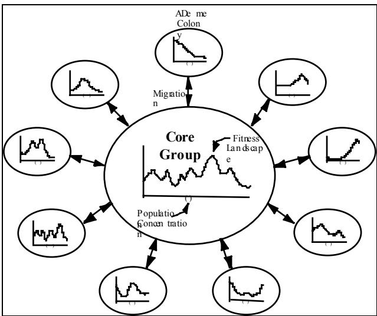
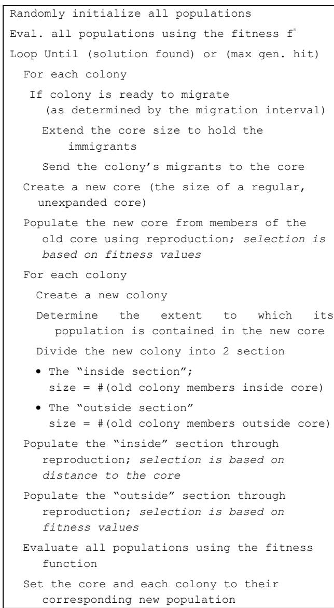
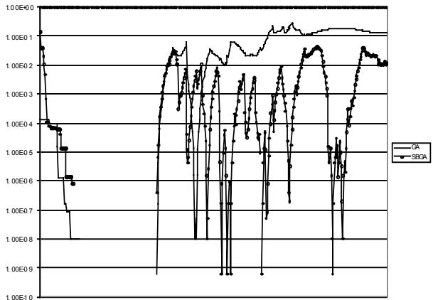

# The Shifting Balance Genetic Algorithm: Improving the GA in a Dynamic Environment

# Franz Oppacher

# Mark Wineberg

Intelligent Systems Research Unit   
School of Computer Science   
Carleton University   
Ottawa, Canada, K1S 5B6   
Intelligent Systems Research Unit   
School of Computer Science   
Carleton University   
Ottawa, Canada, K1S 5B6

# Abstract:

Two observed deficiencies of the GA are its tendency to get trapped at local maxima and the difficulty it has handling a changing environment after convergence has occurred. A mechanism proposed by Sewall Wright in the 1930s addresses the problem of premature convergence: his Shifting Balance Theory (SBT) of evolution. In this work the SBT has been modified to remove defects inherent in its original formulation, while keeping the properties that should both increase the adaptive abilities of the GA and prevent it from prematurely converging. The system has been implemented and is called the Shifting Balance Genetic Algorithm (SBGA). Experimental results and analysis are presented demonstrating that the SBGA does, in fact, lessen the problem of premature convergence and also improves performance under a dynamic environment, thereby mitigating both deficiencies.

which is usually set very low. Consequently, after convergence has occurred, the GA will have lost much of its ability to find other solutions. However, if the fitness function is not static, and the optimum changes to some other point in the gene-space, or even just drifts away from the current optimum, the GA will be nearly powerless to follow it.

Sewall Wright, one of the founders of population genetics, proposed a mechanism for solving the problem of premature convergence in the 1930s. His theory, known as the Shifting Balance Theory, while conceptually fertile and influential, has never been developed in enough detail to enable its testing and application in genetics. We wish to abstract the conceptual core of his theory and render it applicable to evolutionary computation. In doing so, we have found that the resulting modified theory not only helps prevent premature convergence but also improves the behavior of the GA in dynamically changing environments.

# 1 INTRODUCTION

While the Genetic Algorithm (GA) has been very successful when applied to a wide range of problems, in some respects the GA does not behave as adaptively as expected. A perennial problem is that of premature convergence, where a GA will become fixated on a single solution that comes to dominate the population. Many modifications of the original GA are motivated by reducing the risk of premature convergence.

However, there is a second problem attendant on premature convergence even when the GA does not get trapped at any local maxima and finds the global maximum. The GA would then converge on that solution, and thereby lose the diversity in the population. With the loss of diversity, crossover loses its effectiveness and the only way for the GA to change is by mutation,

The primary interest of this paper is the behavior of evolutionary systems when faced with dynamic environments. While fundamental to the purpose behind Hollandís creation of the Genetic Algorithm, little research has been published on the topic. Some of this work is concerned with diploid chromosomes ((Goldberg and Smith, 1987), $\mathrm { ( N g }$ and Wong, 1995)), and with classifier systems ((Holland, 1986), (Zhou and Grefenstette, 1989)).

The approach used in this paper for improving the GAís behavior in dynamic environments is based on the Shifting Balance Theory proposed by the population geneticist Sewall Wright. Wrightís theory has been popular in the GA community, with many authors quoting his theory (often referred to as Sewall Wrightís demes) when justifying the introduction of a novel feature in their GA. This is particularly true in parallel GA research ((Tanese, 1989), (Whitley and Starkweather, 1990), (M¸hlenbein, 1989), (Davidor, 1991), (Spiessens and Manderick, 1991)). The deme approach is not exclusive to parallel implementations of the GA. Taking inspiration from Wrightís shifting balance theory which uses interdemic selection this more restrictive mating policy has been used for sequential GAs as well with moderate success over the more global mating strategies (see (Collins, 1994), (P·l, 1994), and (Sumida and Hamilton, 1994)).

# 2 SEWALL WRIGHT’S SHIFTINGBALANCE THEORY

The population geneticist Sewall Wright (Wright, 1932) realized the problem of an evolutionary system getting trapped at local maxima back in the $1 9 3 0 ^ { \circ } \mathrm { s }$ . Wright called the (hypothetical) function that was being optimized by the evolutionary system the ìfitness landscapeî and thought that each species was, over time, hill climbing through the process of mutation and natural selection. Having this view, he naturally became aware of the problem of local maxima and also proposed a mechanism to cope with it which he called ìthe shifting balance theoryî (SBT).

(Hartl and Clark, 1989) present a good summary of the shifting balance theory:

... [the] subdivision of a population into small, semiisolated demes gives the best chance for the populations to explore the full range of their adaptive topography. Temporary reductions in fitness that would be prevented by selection in large populations become possible in small ones because of the random drift in allele frequencies that occurs in small populations. The lucky subpopulations that reach higher adaptive peaks on the fitness surface increase in size and send out more migrants than other subpopulations, and the favorable gene combinations are gradually spread throughout the entire set of subpopulations by means of interdeme selection. The shifting balance process includes three distinct phases:

• An exploratory phase, in which random genetic drift plays an important role in allowing small populations to explore their adaptive topography. • A phase of mass selection, in which favorable gene combinations created by chance in phase 1 rapidly become incorporated into the genome of local populations by the action of natural selection. • A phase of interdeme selection, in which the more successful demes increase in size and rate of migration, and the excess migration shifts the allele frequencies of nearby population until they also come under the control of the higher fitness peak... there is a continual shifting of control from one adaptive peak to a superior one.1

In the above explanation the term random drift refers to a statistical process that occurs in populations because of the random sampling of alleles produced by random mating. This effectively causes a random walk in the relative proportions of two competing alleles; the smaller the population, the more erratic the random walk.

All of the parallel GA implementers of the ìDeme Modelî appeal to Wrightís shifting balance theory, hoping to see the advantage that random drift with interdemic selection will bring. However, most do not comment on the importance of random drift, and just mention that Wright proposed that interdeme selection was a powerful mechanism in natural evolutionary processes. An exception is (Sumida and Hamilton, 1994), who purposely kept the demes in their system small to facilitate the random drift that Wright postulated was necessary. But even when random drift is taken into account, there are still many problems with the unadorned mechanism as proposed by Wright. Hartl and Clark point out a few:

For the theory to work as envisaged, ... [t]he population must be split up into smaller demes, which must be small enough for random genetic drift to be important but large enough for mass selection to fix favorable combinations of alleles. While migration between demes is necessary, neighboring demes must be sufficiently isolated for genetic differentiation to occur, but sufficiently connected for favorable gene combinations to spread.2

# 3 ABSTRACTING THE SBT: THE SHIFTING BALANCE GENETIC ALGORITHM (SBGA)

# 3.1 THE FIRST LEVEL OF ABSTRACTION:CORE GROUP AND COLONIES

The SBT holds out the hope that, through its incorporation into the GA it will overcome the problem of prematurely converging on local maxima. Yet the SBT by itself is of questionable worth because of the contradictory reliance on both random drift and selection. We have chosen to change the SBT so that it only relies on selection.

The following summarizes the modified SBT (see Figure 1). The large central population called core group experiences a single environment and consequently is

under the selective pressure of a single fitness landscape. While adapting to this landscape the core group can get stuck on a local maximum, at which point no evolutionary progress is occurring. However, the core group is constantly sending out members to the periphery. These small groups, or colonies, find themselves in a different environment, hence each experiences a fitness landscape different from that of the others and of the core group.

Consequently the new landscape for each colony may not have the same local maximum as the landscape of the core group. The colonies are then forced to adapt through selection to these new landscapes, thus changing the genetic makeup of its constituents. The modified colony members who migrate back to the core are now different from its members. Furthermore they may be on a better hill in the fitness landscape of the central area. Thus, through the use of the colonies, the species as a whole can now jump over valleys in the fitness landscape and continue to evolve.

  
Figure 1: A depiction of the new Shifting Balance Theory.

Note that the new model only depends on selection. While random drift may occur, it can only help add to the variation being produced by selection, and is not mandatory to the system anymore. Furthermore, the population sizes of the colonies, while much smaller than the core group, are set large enough to prevent undue effects due to random drift.

# 3.2 THE COLONIES AS EXPLORATORY SUBPOPULATIONS: A FURTHER ABSTRACTION

# 3.2.1 Fitness in the Colony

The reader will have noticed that the colonies are supposed to be in different fitness landscapes. Yet no method exists in the model to determine how the environments should differ from that of the core. Specifically, these environments should be capable of moving the system off local maxima. We propose to solve the problem through identifying the purpose of the alternate fitness functions and provide a new mechanism for accomplishing the task.

The alternate fitness functions encourage the colonies to search different areas of the search space than the core group. Any mechanism that encourages such an exploration will thus achieve the goal of moving the system off local maxima. Instead of trying to create new fitness functions to do this, we can directly determine whether the colony is searching in the same area as the core group. If it is, the colony should be forced away from the core. This can be accomplished by selecting members for reproduction according to their distance from the core rather than according to their original fitness values.

If selection based on distance to the core is used exclusively, the colonies will just move as far from the core as possible. This will most likely send them into unpromising territories. A balance must therefore be kept. The colonies must be allowed to search for good solutions (using the regular fitness function) when searching in areas where the core is not; when searching in the part of gene-space near the core, they must be selected for distance from the core, thus moving them away. To accomplish this, a measure of overlap between populations (core and colony) in gene-space must be developed. This will be addressed next.

# 3.2.2 Population Diversity, Distance, and Containment

To complete the design of the SBGA, a few measures need to be developed: diversity of a population, the distance from a chromosome to a population in genespace, and a measurement of the extent to which one population is contained within another.

The diversity measure of a population is familiar in the GA community. Although there are a few variations, the standard measure is the sum of the Hamming distances between all possible pairs in the population. This, when normalized, is the measure we use:

$$
D i \nu e r s i t y ( P ) = \frac { 1 } { L N ( N - 1 ) } \sum _ { i = 1 } ^ { N } \sum _ { j = 1 } ^ { N } H D \big ( p _ { i } , p _ { j } \big ) ,
$$

where $L$ is the length of a chromosome, $N$ is the size of population $P , p _ { i }$ is the $\mathrm { i } ^ { \mathrm { n } }$ chromosome in the population, and $H D$ is the Hamming distance function.

The second measure, the distance between a single chromosome and a population in gene-space, is a modification of the diversity measure. We have defined that distance as the sum of the Hamming distances between the chromosome and each member of the ìtargetî population. Again we normalize the result. The formula for the distance between a chromosome and a population therefore becomes:

$$
D i s t a n c e ( c , P ) = \frac { 1 } { L N } \sum _ { i = 1 } ^ { N } H D \big ( c , p _ { i } \big ) ,
$$

where c is the chromosome whose distance is being calculated, and the rest of the symbols are the same as in the diversity formula. Notice that if the population has a size of 1, the distance reduces to the usual Hamming distance.

The final measure is the most complex. For the algorithm to work we need to know how many members of a population should be considered lying ìinsideî versus ìoutsideî another population in gene-space. Suppose that we want to know how many members of population A are inside of population B. To do this we first record the distance of every member in A to population B using the distance formula above. Next we need a characterization of the ìspanî in gene space of population B. This is accomplished by recording the distance of every member in population B to the complete population B. We then define any member of population A as being outside of B when that memberís distance to population B is greater than the distance of every member of population B to itself.

Unfortunately if we use the above definition directly, a single outlier in population B could force every member of population A to be considered ìinsideî of B. Consequently we have created a second procedure to remedy this problem. Let the function WithinDistance $( c , P )$ be defined as ìthe number of members in population $P$ that have a distance to population $P$ that is less than the distance of chromosome $c$ to $P ^ { \ast }$ . This is intuitively a non-parametric measure of how far chromosome c is ìinsideî population $P$ . We then normalize this measure by dividing by the size of population P. If we calculate the normalized WithinDistance values for every member in population A relative to population B, the average of these values is defined as the extent to which population A is contained in population B. Since this is a non-parametric measure, it eliminates the outlier problem that was hindering us in the previous technique. The formula for the extent of containment of population A in B is:

Containment function, then that colony must be pushed away from the core group.

If the offending colony is in the periphery of the core, then it should only be gently nudged away; if it is almost entirely contained in the core, strong pressure should be applied to push it into novel territory. The Containment function is used for this purpose as well. When the colony is ready for reproduction, the new population to be created is divided into two parts. The first part of the next generationís population will consist of members that have been selected using the regular fitness function. The other part will be created from members that have been selected based on their distance from the core group (the greater the distance the higher the ìfitnessî). The ratio between the sizes of these two parts of the new population is set equal to the value of the Containment function of the colony relative to the core.

# 3.2.4 Migration from Colony to Core

While the core gains information about the colonies through immigration of colony members, sending members from the core to the colony, as stipulated by the original SBT model, actually creates some problems. Since the core has a very large population, most of the time it will find far better solutions than a colony. These solutions, if allowed into the colony, would surely begin to dominate the colony population within a few generations, forcing the colonies to search in the same area as the core. This would interfere with the mechanism that prevents the colony from overlapping the core. Thus no migration from core to colony is allowed in the system although the colony still sends ìmigrantsî back to the core.

$$
\begin{array} { c l c r } { { C o n t a i n m e n t ( A , B ) { = } \displaystyle \frac { 1 } { M } \sum _ { i = 1 } ^ { M } W i t h i n D i s t a n c e ( a _ { i } , B ) } } \\ { { { } } } & { { { } { = } \displaystyle \frac { 1 } { M N } \sum _ { i = 1 } ^ { M } \sum _ { j = 1 } ^ { N } \delta _ { P } \left( a _ { i } , b _ { j } \right) } } \end{array}
$$

The colony may send all of its members to the core or only some portion thereof. The colony members could be randomly selected, selected stochastically according to fitness, or, as is the case in the present system, represent an elite subgroup. The immigrants into the core are added to the core population, temporarily increasing its size. When the population is reduced to its normal size during reproduction, the selection pressure exerted on the core exceeds that of a normal GA.

$\mathit { W i t h i n D i s t a n c e } ( c , P ) = \frac { 1 } { N } \sum _ { i = 1 } ^ { N } \delta _ { P } \left( c , p _ { i } \right) ,$

$$
\delta _ { P } ( \alpha , \beta ) = \left\{ \begin{array} { l r } { 1 } & { \mathrm { i f } \ D i s t a n c e ( \alpha , P ) < D i s t a n c e ( \beta , P ) } \\ { 0 } & { \qquad \ o . w . } \end{array} \right. ,
$$

$a _ { i }$ and $b _ { i }$ are the $\mathrm { i } ^ { \mathrm { n } }$ members of the populations $A$ and $B$ respectively, $M$ is the population size of $A$ and $N$ is the population size of $B$ .

# 3.2.3 Keeping the Colonies Away from the Core

As long as a colony remains completely outside the core, it freely evolves using the regular fitness function. This allows the colony to follow the fitness landscape and look at potentially interesting areas that the core group is ignoring. However, if a colony has wandered into the area searched by the core group, as determined by the

Since migration of the colony members disrupts the core group, time is given for the colony to evolve potentially useful members. The number of generations between the dumping of colony members into the core is called the ìmigration intervalî. Immigration to the core is staggered between the colonies. For example, if there are 8 colonies and the migration interval is 4, two of the colonies send immigrants to the core each generation. However, for any given colony, 4 generations pass before colony members are allowed to migrate again.

With migration in place the algorithm is now complete.   
An overview of the SBGA algorithm is given in Figure 2.

  
Figure 2: The SBGA Algorithm

# 3.3 ADVANTAGES OF THE SBGA

The SBGA should prevent premature convergence as Wright intended. The colonies are designed to search areas of the fitness landscape that the core group has not been looking at. The influx of colony members into the core group increases the diversity of the core, preventing premature convergence.

Furthermore, the SBGA should also perform better in dynamic environments.

To an extent a regular GA can already handle dynamic environments. The dynamic environments that we focus on in this paper have global optima that shift in the fitness landscape over time. The GA may lose the ability to track a moving optimum if - before moving - the optimum remains stable long enough for the population to converge significantly.

Under the SBGA, if the peak shifts away from the core group the colonies are already in areas away from the core. Consequently some of the colonies should encounter the shifted peak. Members from the colonies are then sent back to the core. The children of members from the area of the shifted peak will begin to do well in the core; thus those members will shift the balance of the core towards the ìluckyî colony. This in turn produces pressure on the colony to search elsewhere, keeping the colonies constantly moving trying to find the shifting global optimum. Furthermore, since the colonies are always forced away from the core, the ability of the colonies to track a moving hill remains independent of how long the hill remains stationary.

# 4 EXPERIMENTATION

To test whether the SBGA prevents premature convergence and handles dynamic environments better than a normal GA, two experiments were run. The first experiment tests for premature convergence using a stationary environment, the second for behavior in dynamic environments.

Both types of experiments were done using the F2 function from the De Jong test suite composed with the one dimensional version of the Griewangk Function (F8). The combined function is called the F8F2 function, described in (Whitley, 1997), see Table 1. This minimization function is non-symmetric, linearly separable, increases in difficulty as the dimension increases, and has a known minimum at (1, 1). The solutions to F8F2 were encoded using Gray coding.

Table 1: The F8F2 fitness function   

<table><tr><td>F2 : f(x,y)= 100(x2 − y)2 +(1 −)2 x, y  [−2.048, 2.047] Minimum when x1 = x2 = 1 ( F2 = 0)</td></tr><tr><td>$x$ F8 : ()= 1 + −cosx x  [−512,511] 4000 Minimum when x = 0 ( F8 = 0)</td></tr><tr><td>F8F2(x1,X2,X3,. . .,Xn) = F8(F2(x1,X2)) + F8(F2(x2,X3)) + ... + F8(F2(xn-1,xn)) +F8(F2(xn, X1)) Minimum when xi = xj = 1 (F8F2 = 0)</td></tr></table>

In all experiments, both the GA and SBGA were given the following parameter settings: probability of mutation $= 0 . 0 0 6$ per bit, and probability of one-point crossover $=$ 0.7. Linear rank selection with elitism was used. The slope was set to be as steep as possible (i.e. with $\mathbf { M } \mathbf { a x } =$ 2.0, see (Baker, 1985)).

The SBGA was given 10 colonies of 100 members each. The colony size was chosen to reduce the amount of random drift, yet keep the colonies relatively small in size. The core group size was set to 1000, an amount equal to the size of all the colonies combined. During migration 25 elite members of a colony are sent to the core group. The GA was given a population of 2000, equal to the total population of the SBGA system.

# 4.1 EXPERIMENTS USING A STATIONARY ENVIRONMENT

To determine whether the SBGA is less likely to get stuck on a local optimum than the GA, both algorithms are run with fitness functions F8F2 for 300 generations. The best fitness value obtained during the entire run is recorded. To see the effects of migration, the migration interval is set to 2, 6 and 10 generations. Each run is repeated 35 times to gain statistical significance.

Preliminary analysis showed that neither the GA nor the SBGA produced normally distributed results under all settings. Consequently the GA was compared with the SBGA using the Wilcoxon Rank Sum test (a nonparametric statistic) to determine which system finds the lowest fitness values. If the Wilcoxon Rank Sum test produces a Z-Score $> 1 . 9 6$ , then the results from the two programs are considered to be significantly different with a confidence level $> 9 5 \%$ . A Z-Score $> 2 . 5 6$ shows a difference with a confidence level $> 9 9 \%$ .

Table 2: Experiment Results from the Stationary Env.   

<table><tr><td></td><td colspan="2">GA vs. Imm2</td><td colspan="2">GA vs. Imm6</td><td colspan="2">GA vs. Imm10</td></tr><tr><td>Dim</td><td>Winner</td><td>Z-Score</td><td>Winner</td><td>Z-Score</td><td>Winner</td><td>Z-Score</td></tr><tr><td>2</td><td>GA</td><td>2.090</td><td>SBGA</td><td>2.430</td><td>SBGA</td><td>2.140</td></tr><tr><td>3</td><td>SBGA</td><td>5.736</td><td>SBGA</td><td>4.278</td><td>SBGA</td><td>4.227</td></tr><tr><td>4</td><td>SBGA</td><td>6.472</td><td>SBGA</td><td>5.709</td><td>SBGA</td><td>5.029</td></tr><tr><td>5</td><td>SBGA</td><td>6.019</td><td>SBGA</td><td>5.659</td><td>SBGA</td><td>4.880</td></tr><tr><td>6</td><td>SBGA</td><td>2.989</td><td>SBGA</td><td>3.811</td><td>SBGA</td><td>2.746</td></tr><tr><td>7</td><td>SBGA</td><td>2.514</td><td>SBGA</td><td>3.778</td><td>SBGA</td><td>3.173</td></tr><tr><td>8</td><td>SBGA</td><td>1.746</td><td>SBGA</td><td>1.611</td><td>SBGA</td><td>1.465</td></tr></table>

Looking at the results in Table 2 we see that the SBGA is significantly better than the regular GA. Only when F8F2 is restricted to 2 dimensions, and the SBGA allows migration every 2 generations does the GA win over the SBGA. With these results, we can readily draw the conclusion that the SBGA is better at preventing the system from being trapped at local maxima.

One further note: As the dimension increases, the SBGA improves relative to the regular GA, peaking at dimension 4. By Dimension 8 the Z-Scores have dropped so low that we have less than $9 5 \%$ confidence that the SBGA is performing any differently than the regular GA. There are two possible reasons for this. First, it is possible that as the dimensionality increases the difficulty increases so greatly that neither system can do well. Alternatively, it is possible that the SBGA needs more colonies to handle the greater number of dimensions, and so its efficiency drops off. Only further experimentation will determine which (if either) of the two possibilities obtain.

# 4.2 EXPERIMENTS USING A DYNAMIC ENVIRONMENT

To see if the SBGA would handle itself better in a dynamic environment from a converged starting point, we extended the Stationary Experiment. The environment is kept stationary for 150 generation to give the two systems the chance to converge. In this experiment convergence occurs after about 89-90 generations, so the 150 generations is more than sufficient.

The environment undergoes a simple translation in phenotype space along the hyper-diagonal. This motion is kept at a constant speed for 300 generations, at which point the global minimum has moved from the point (1, 1) to the point (1.75, 1.75).

The dimensionality of the fitness function is set to 2 and the migration interval to 2 generations. These were the most favourable settings for the GA in the stationary experiments. Therefore if the SBGA manages to do better than the GA it has done so under adverse conditions.

In the stationary experiment only the best fitness in the entire run was recorded. This is insufficient for a dynamic environment since we are interested in how close the system can keep to the moving optimum. Consequently the best fitness per generation must be kept for every generation.

Figure 3 represents a typical run. Since the fitness is plotted on a log scale, when a system finds the solution, which has a fitness of 0, it is plotted as -∞. As can be seen, both the GA and the SBGA find the solution by generation 40. At generation 150 the function starts to move and what was the perfect solution no longer is; the fitness values start to increase (get worse). By generation 170 the SBGA starts to recover; the GA only starts to recover at around generation 190. The GA has a good showing until generation 210 at which point the SBGA remains closer to the global optimum, even occasionally finding it, for the rest of the run.

These results are very encouraging. Due to the time needed to run the dynamic experiments, only 3 runs per setting were done (where migration interval, dimensionality and speed are all varied in a fully crossed design); however all the results are qualitatively comparable with the one presented above, except for very high dimensionalities. A linear statistical model is being developed to test whether the observed differences are as significant as they look upon visual inspection.

  
Figure 3: Results from a typical run under a dynamic environment

# 5 CONCLUSION AND FUTURE WORK

We have presented a modification of S. Wrightís Shifting Balance Theory that remedies the shortcomings inherent in the original formulation and at the same time lends itself to implementation: the SBGA. Through experimentation we have determined that the advantages expected from the SBGA, the mitigation of the phenomenon of premature convergence and the enhancement of the behavior of the GA in dynamic environments, do indeed occur. The experiments dealing with the avoidance of premature convergence in stationary environments have established to a high level of statistical significance that SBGA outperforms the regular GA on F8F2, an very difficult although contrived mathematical function. While the experiments on dynamic environments are as yet preliminary and have not been fully statistically verified, the results look extremely promising to detailed inspection.

In future work we plan to do the following: (i) develop a linear statistical model for the dynamic environment experiments so that the results reported above can be verified to statistical significance; (ii) establish similar results for naturally dynamic rather than contrived problems; (iii) study the behavior of SBGA with different numbers of colonies, and possibly with automatically varying numbers of colonies.

# 6 REFERENCES

J. E. Baker (1985). Adaptive Selection Methods for Genetic Algorithms. In J. J. Grefenstette (Ed.), Proc. 1st Int. Conf. GA (pp. 101-111). Hillsdale: Lawrence Erlbaum Associates.

R. J. Collins (1994). Artificial Evolution and the Paradox of Sex. . In R. Paton (Ed.), Computing With Biological Metaphors (pp. 244-263). London U.K.: Chapman & Hall.

Y. Davidor, (1991). A Naturally Occurring Niche & Species Phenomenon: The Model and First Results. In R. K. Belew, and L. B. Booker (Eds.), Proc. $\boldsymbol { 4 } ^ { t h }$ Int. Conf. on GA (pp. 257-263). San Mateo: Morgan Kaufmann. D. E. Goldberg and R. E. Smith (1987). Nonstationary function optimization using genetic algorithms with dominance and diploidy. In J.J. Grefenstette (Ed.), Proc. $2 ^ { n d }$ Int. Conf. on GA (pp. 59-68). Hillsdale: Lawrence Erlbaum Associates.   
Daniel L. Hartl and Andrew G. Clark (1989). Principles of Population Genetics: Second Edition. Sunderland, Massachusetts: Sinauer Associates.   
J. H. Holland, K. J. Holyoak, R. E. Nisbett (1986). Induction; processes of inference, learning, and discovery. Cambridge, Mass., M.I.T. Press. 1986.   
K. P. Ng and K. C. Wong (1995). A New Diploid Scheme and Dominance Change Mechanism for NonStationary Function Optimization. In L. J. Eshelman (Ed.), Proc. $\boldsymbol { \delta } ^ { t h }$ Int. Conf. on GA (pp. 159-166). San Mateo: Morgan Kaufmann.   
K. F. P·l (1994). Selection Schemes with Spatial Isolation for Genetic Optimization. In Y. Davidor, H-P. Schwefel, R. M‰nner (Eds.) PPSN III (pp. 170-179). Berlin: Springer-Verlag.   
P. Spiessens and B. Manderick (1991). A Massively Parallel Genetic Algorithm. In R. K. Belew, and L. B. Booker (Eds.), Proc. $\boldsymbol { 4 } ^ { t h }$ Int. Conf. on GA (pp. 279-286). San Mateo: Morgan Kaufmann.   
B. H. Sumida and W. D. Hamilton (1994). Both Wrightian and ëParasiteí Peak Shifts Enhance Genetic Algorithm Performance in the Traveling Salesman Problem. In R. Paton (Ed.), Computing With Biological Metaphors (pp. 264-279). London U.K.: Chapman & Hall.   
R. Tanese (1989). Distributed Genetic Algorithms. In J. D. Schaffer (Ed.), Proc. $3 ^ { r d }$ Int. Conf. on GA (pp. 434- 439). San Mateo: Morgan Kaufmann.   
D. Whitley and T. Starkweather (1990). Genitor II: A Distributed Genetic Algorithm. In Journal of Experimental and Theoretical Artificial Intelligence, 2, 189-214.   
D. Whitley, K. Mathias, S. Rana and J. Dzubera (1996). Evaluating Evolutionary Algorithms. In Artificial Intelligence Volume 85, pp. 245-2761, 1996.   
S. Wright (1932). The Roles of Mutation, Inbreeding, Crossbreeding and Selection in Evolution. In W. B. Provine (Ed.), Sewall Wright Evolution; Selected Papers. Chicago, Ill.: University of Chicago Press, 1986. 162-164. H. H. Zhou and J. J. Grefenstette (1989). Learning by Analogy in Genetic Classifier Systems. In J. D. Schaffer (Ed.), Proc. $3 ^ { r d }$ Int. Conf. on GA (pp. 291-297). San Mateo: Morgan Kaufman