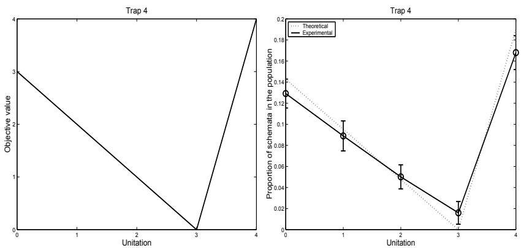
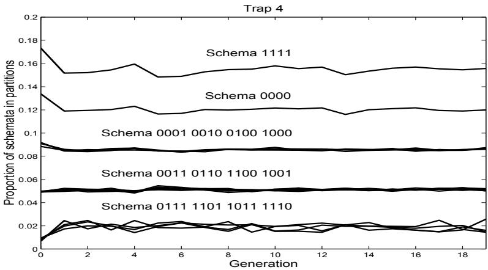
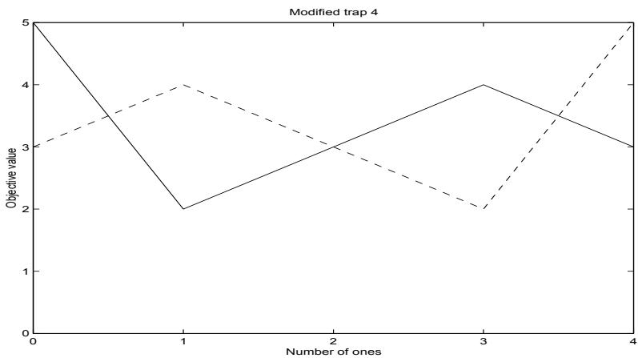
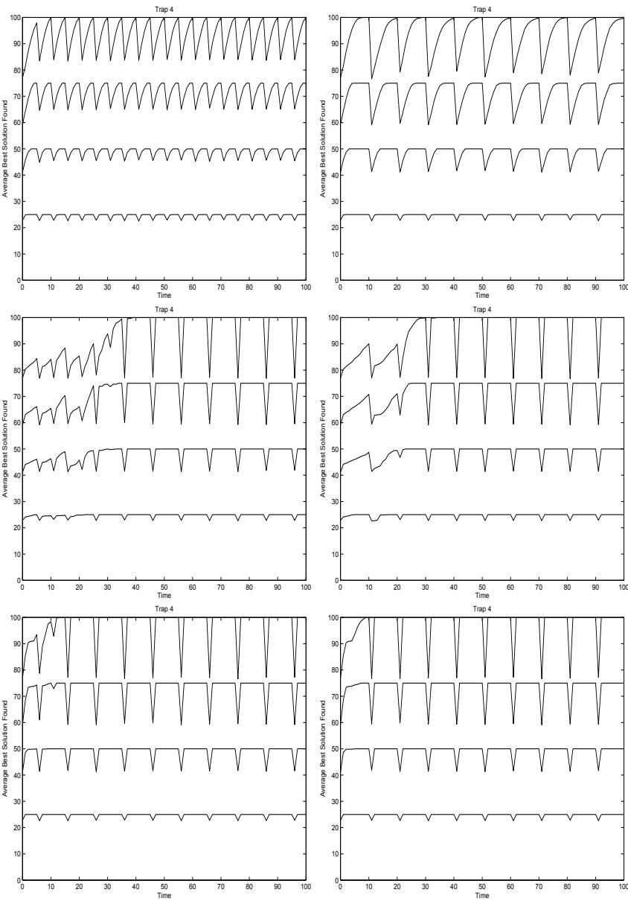
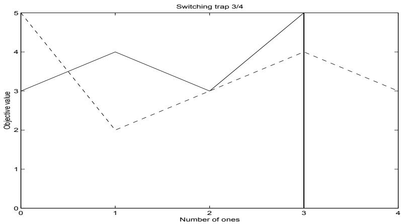
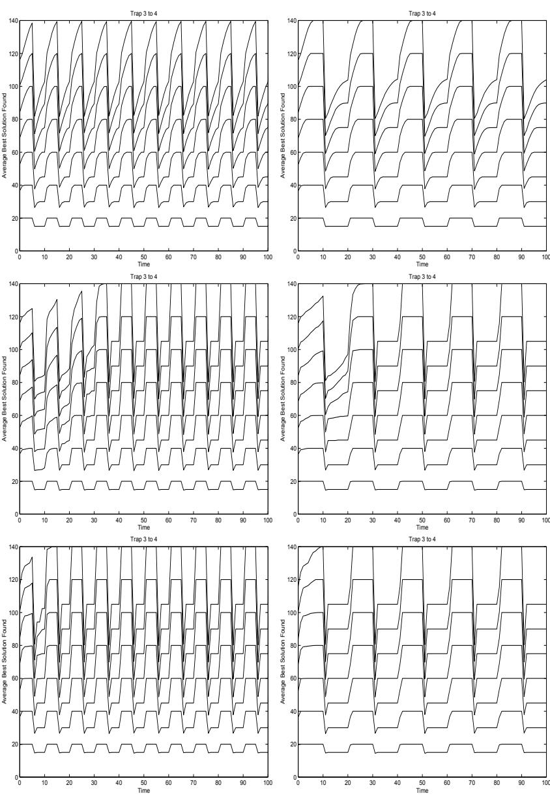

# Sub–Structural Niching in Non–Stationary Environments

Kumara Sastry Hussein A. Abbass David E. Goldberg

# Sub–Structural Niching in Non–Stationary Environments

†Kumara Sastry, $^ \ddag$ Hussein A. Abbass, and †David Goldberg †Illinois Genetic Algorithms Laboratory University of Illinois at Urbana-Champaign 104 S.Mathews Ave., Urbana, IL 61801 {kumara,deg} $@$ illigal.ge.uiuc.edu ‡Artificial Life and Adaptive Robotics Laboratory School of Information Technology and Electrical Engineering University of New South Wales, Australian Defence Force Academy, Canberra, ACT 2600, Australia h.abbass@adfa.edu.au

# Abstract

Niching enables a genetic algorithm (GA) to maintain diversity in a population. It is particularly useful when the problem has multiple optima where the aim is to find all or as many as possible of these optima. When the fitness landscape of a problem changes overtime, the problem is called non–stationary, dynamic or time–variant problem. In these problems, niching can maintain useful solutions to respond quickly, reliably and accurately to a change in the environment. In this paper, we present a niching method that works on the problem substructures rather than the whole solution, therefore it has less space complexity than previously known niching mechanisms. We show that the method is responding accurately when environmental changes occur.

# 1 Introduction

The systematic design of genetic operators and parameters is a challenging task in the literature. Goldberg [14] used Holland’s [21] notion of building blocks to propose a design–decomposition theory for designing effective genetic algorithms (GAs). This theory is based on the correct identification of substructures in a problem to ensure scalability and efficient problem solving. The theory establishes the principles for effective supply, exchange and manipulation of sub–structures to ensure that a GA will solve problems quickly, reliably, and accurately. These types of GAs are called competent GAs to emphasize their robust behavior for many problems.

A wide range of literature exists for competent GAs. This literature encompasses three broad categories based on the mechanism used to unfold the substructures in a problem. The first category is Perturbation techniques which work by effective permutation of the genes in such a way that those belonging to the same substructure are closer to each other. Methods fall in this category include the messy GAs [16], fast messy GAs [15], gene expression messy GAs [22], linkage identification by nonlinearity check GA, linkage identification by monotonicity detection GA [27], dependency structure matrix driven GA [34], and linkage identification by limited probing [20].

The second category is linkage adaptation techniques, where promoters are used to enable genes to move across the chromosome; therefore facilitating the emergence of genes’ linkages as in [7]. The third category is probabilistic model building techniques, where a probabilistic model is used to approximate the dependency between genes. Models in this category include population-based incremental learning [3], the bivariate marginal distribution algorithm [29], the extended compact GA (ecGA) [19], iterated distribution estimation algorithm [5], and the Bayesian optimization algorithm (BOA) [28].

When the fitness landscape of a problem changes overtime, the problem is called non–stationary, dynamic or time–variant problem. To date, there have been three main evolutionary approaches to solve optimization problems in changing environments. These approaches are: (1) diversity control either by increasing diversity when a change occurs as in the hyper–mutation method [8], the variable local search technique [33] and others [4, 23]; or maintaining high diversity as in redundancy [17, 9, 10], random immigrants [18], aging [12], and the thermodynamical GAs [26]; (2) memory-based approaches by using either implicit [17] or explicit [25] memory; and (3) speciation and multi–populations as in the self-organizingscouts method [6].

Niching is a diversity mechanism that is capable of maintaining multiple optima simultaneously. The early study of Goldberg, Deb and Horn [13] demonstrated the use of niching for massive multimodality and deception. Mahfoud [24] conducted a detailed study of niching in stationary (static) environments. Despite that many of the studies found niching particularly useful for maintaining all the global optima of a problem, when the number of global optima grows, the number of niches can grow exponentially.

In this paper, we propose a niching mechanism that is based on the automatic identification and maintaining sub–structures in non–stationary problems. We incorporate bounded changes to both the problem structure and the fitness landscape. It should be noted that if the environment changes either unboundedly or randomly, on average no method will outperform restarting the solver from scratch every time a change occurs. We use a dynamic version of the extended compact genetic algorithm (ecGA) [19], called the dynamic compact genetic algorithm (dcGA) [1]. We show that the proposed method can respond quickly, reliably, and accurately to changes in the environment. The structure of the paper is as follows: in the next section, we will present dcGA and niching, then a feasibility study to test niching is undertaken followed by experiments and discussions.

# 2 Dynamic Compact Genetic Algorithm (dcGA)

Harik [19] proposed a conjecture that linkage learning is equivalent to a good model that learns the structure underlying a set of genotypes. He focused on probabilistic models to learn linkage and proposed the ecGA method using the minimum description length (MDL) principle [30] to compress good genotypes into partitions of the shortest possible representations. The MDL measure is a tradeoff between the information contents of a population, called compressed population complexity (CPC), and the size of the model, called model complexity (MC).

The CPC measure is based on Shannon’s entropy [31], $E ( \chi _ { I } )$ , of the population where each partition of variables $\chi _ { I }$ is a random variable with probability $p _ { i }$ . The measure is given by

$$
E ( \chi _ { I } ) = - C \sum _ { i } ^ { \sigma } p _ { i } \log p _ { i }
$$

where $C$ is a constant related to the base chosen to express the logarithm and $\sigma$ is the number of all possible bit sequences for the variables belonging to partition $\chi _ { I }$ ; that is, if the cardinality of $\chi _ { I }$ is $\nu _ { I }$ , $\sigma = 2 ^ { \nu _ { I } }$ . This measures the amount of disorder associated within a population under a decomposition scheme. The MDL

measure is the sum of CPC and MC as follows

$$
\mathrm { M D L } \ = N \sum _ { I } \left( - C \sum _ { i } ^ { \sigma } p _ { i } \log p _ { i } \right) + \log ( N ) 2 ^ { \nu _ { I } }
$$

With the first term measures CPC while the second term measures MC.

In this paper, we assume that we have a mechanism to detect the change in the environment. Detecting a change in the environment can be done in several ways including: (1) re–evaluating a number of previous solutions; and (2) monitoring statistical measures such as the average fitness of the population [6]. The focus of this paper is not, however, on how to detect a change in the environment; therefore, we assume that we can simply detect it. The dynamic compact genetic algorithm (dcGA) works as follows:

1. Initialize the population at random with $n$ individuals;

2. If a change in the environment is being detected, do:

(a) Re–initialize the population at random with $n$ individuals;   
(b) Evaluate all individuals in the population;   
(c) Use tournament selection with replacement to select $n$ individuals;   
(d) Use the last found partition to shuffle the building blocks (building block–wise crossover) to generate a new population of $n$ individuals;

3. Evaluate all individuals in the population;

4. Use tournament selection with replacement to select $n$ individuals;

5. Use the MDL measure to recursively partition the variables until the measure increases;

6. Use the partition to shuffle the building blocks (building block–wise crossover) to generate a new population of $n$ individuals;

7. If the termination condition is not satisfied, go to 2; otherwise stop.

Once a change is detected, a new population is generated at random then the last learnt model is used to bias the re–start mechanism using selection and crossover. The method then continues with the new population. In ecGA, the model is re-built from scratch in every generation. This has the advantage of recovering from possible problems that may exist from the use of a hill–climber in learning the model.

In the original ecGA and dcGA, the probabilities are estimated using the frequencies of the bits after selection. The motivation is that, after selection, the population contains only those solutions which are good enough to survive the selection process. Therefore, approximating the model on the selected individuals inherently utilizes fitness information. However, if explicit fitness information is used, problems may arise from the magnitude of these fitness values or the scaling method.

Traditional niching algorithms work on the level of the individual. For example, re-scaling the fitness of individuals based on some similarity measures. These types of niching require the niche radius, which defines the threshold beyond which individuals are dissimilar. The results of a niching method are normally sensitive to the niche radius. A smaller niche radius would increase the number of niches in the problem and is more suitable when multiple optima are located closer to each other, while a larger niche radius would reduce the number of niches but will miss out some optima if the optima are close to each other. Overall, finding a reasonable value for the niche radius is a challenging task.

When looking at ecGA, for example, the variables in the model are decomposed into subsets with each subset represents variables that are tight together. In a problem with $m$ building blocks and $n$ global optima within each building block, the number of global optima for the problem is $n ^ { m }$ . This is an exponentially large number and it will require an exponentially large number of niches. However, since the problem is decomposable, one can maintain the niches within each building block separately. Therefore, we will need only $n \times m$ niches. Obviously, we do not know in advance if the problem is decomposable or not; that is the power of ecGA and similar models. If the problem is decomposable, it will find the decomposition, we can identify the niches on the level of the sub–structures, and we save unnecessary niches. If the problem is not decomposable, the model will return a single partition, the niches will be identified on the overall solution, and we are back to the normal case. ecGA learns the decomposition in an adaptive manner, therefore, the niches will also be learnt adaptively.

We propose two types of niches in dcGA for dynamic environments. We will call them Schem1 and Schem2 respectively. For each sub-structure (partition), the average fitness of each schema $s$ is calculated for partition $\chi _ { I }$ as follows:

$$
\mathrm { F i t } ( s \in \chi _ { I } ) = \frac { \sum _ { i } ^ { p } \dot { f } _ { i s } } { \sigma }
$$

$$
\dot { f } _ { i s } = \left\{ \begin{array} { l l } { \dot { f } i t _ { i } } & { \mathrm { ~ } i f \mathrm { ~ } i \mapsto s } \\ { 0 } & { o t h e r w i s e } \end{array} \right.
$$

where, $f i t _ { i }$ is the fitness value of individual i, $\dot { f } _ { i s }$ is the fitness value of individual $i$ if the schema $s$ is part of $i$ and 0 otherwise. The schema fitness is calculated in Schem1 using the previous equation. In Schem2, the schema fitness is set to zero if its original value is less than the average population fitness. In theory, it is good to maintain all schemas in the population. In practice, however, maintaining all schemas will disturb the convergence of the probabilistic model. In addition, due to selection, some below average schemas will disappear overtime. Therefore, the choice will largely depend on the problem in hand. The dcGA algorithm is modified into Schem1 and Schem2 by calculating the probabilities for sampling each schema based on the schema fitness rather than the frequencies alone. This re–scaling maintains schemas when their frequencies is small but their average fitness is high.

# 3 Feasibility of the method

Before we proceed with the experiments in the non–stationary environment, we need to check the performance of the method on a stationary function. The function we use here is trap–4. Trap functions were introduced by Ackley [2] and subsequently analyzed in details by others [11, 14, 32]. A trap function is defined as follows

$$
t r a p _ { k } = { \left\{ \begin{array} { l l } { h i g h } & { { \mathrm { i f ~ } } u = k } \\ { l o w - u * { \frac { l o w } { k - 1 } } } & { o t h e r w i s e } \end{array} \right. }
$$

where, low and high are scalars, $u$ is the number of 1’s in the string, and $k$ is the order of the trap function. Figure 1–left depicts the trap–4 function we use in this experiment. The first key question in these experiments is whether or not during the first generation of niching, the niching method correctly samples the actual fitness function. We define a unitation as a function which counts the number of 1’s in a chromosome.

  
Figure 1: On left, trap–4. On right, theoretical and experimental fitness sample.

Given an order $k$ trap, the theoretical proportion of a schema $s$ with a unitation of $i$ is calculated as follows:

$$
p ( s = i ) = \frac { C ( k , i ) \times f ( s = i ) } { \sum _ { j = 0 } ^ { k } C ( k , j ) \times f ( s = j ) }
$$

Figure 1–right depicts the theoretical and experimental proportion of the schemas, where it is clear that the building blocks exist in proportion to their schema fitness.

  
Figure 2: The modified trap function 4 in a changing environment.

Once we ensure that the building block exists in proportion to their fitness, the second question to answer is whether the niching method we propose is sufficient to maintain the relative proportion of the different schemas correctly. Figure 2 confirms this behavior, where one can see that the niching method was able to maintain the relative proportion of the different schemas.

We can conclude from the previous experiment that the niching method is successful in maintaining the schemas. These results do not require any additional experiments in a changing environment where the environment switches between the already maintained schemas. For example, if the environment is switching between schema 0000 and schema 1111 as the global optima, the previous results is sufficient to guarantee the best performance in a changing environment. One of the main reason for that is the environment is only manipulating the good schemas. However, what will happen if the bad schemas become the good ones and the environment is reversing the definition of a good and bad schemas. We already know that the maintenance of all schemas will slow down the convergence and because of selection pressures, below average schemas will eventually disappear. Therefore, we construct our experimental setup in a changing environment problem with two challenging problems for niching. The first problem alters the definition of above and below average schemas, while the second problem manipulates the boundaries of the building blocks (switching between two values of k).

# 4 Experiments

We repeated each experiment 30 times with different seeds. All results are presented for the average performance over the 30 runs. The population size is chosen large enough to provide enough samples for the probabilistic model to learn the structure and is fixed to 5000 in all experiments. Termination occurs when the algorithm reaches the maximum number of generations of 100. We assume that the environment changes between generations and the changes in the environment are assumed to be cyclic, where we tested two cycles of length 5 and 10 generations respectively. The crossover probability is 1, and the tournament size is 16 in all experiments based on Harik’s default values.

# 4.1 Experiment 1

In the initial set of experiments, we modified the trap function of order 4 to break the symmetry in the attractors. In this section, we choose $l o w = k$ , $h i g h = k + 1$ . Symmetry can be utilized by a solver to easily track optima. The new function is visualized in Figure 3. At time 0 and in even cycles, the optimal solution is when all variables are set to $0 \mathrm { { s } }$ and the second attractor is when the sum of 1’s is equal to 3. When the environment changes during the odd cycles, the new solution is optimal when all variables are set to 1’s and the new deceptive attractor is when the sum of 1’s is 1 or alternatively the number of 0’s is 3.

  
Figure 3: The modified trap function 4 in a changing environment.

Figure 4 depicts the behavior of the three methods using the modified trap–4 function. By looking at the results for dcGA, the response rate (i.e. the time between a change and reaching the new optimal solution) is almost at the edge of 5 for 20 building blocks. This means that the algorithm requires on average 5 generations to get close to the new optimal. By looking at the cycle of length 10, it becomes clearer that the algorithm takes a bit more than 5 generations (between 6-7 generations) to converge.

When looking at Schem1, we can see that the algorithm takes longer in the first phase to get to the optimal solution. On the average, it takes 30 generations to do so. We will call this period the “warming up” phase of the model. The niching method delays the convergence during this stage. However, once the warming up stage is completed, the response rate is spontaneous; once the change occurs, a drop occurs then the method recovers instantly and gets back to the original optima. By comparing Schem1 and Schem2, we find the two methods are very similar except for the warming–up stage, where Schem2, which uses the above average schemas only, has a shorter time to warm-up than Schem1.

# 4.2 Experiment 2

In this experiment, we subjected the environment under a severe change from linkage point of view. Here, the linkage boundary changes as well as the attractors. As being depicted in Figure 5, the environment is switching between trap–3 with all optima at 1’s and trap–4 with all optima at $0 \mathrm { { ^ { s } s } }$ . Moreover, in trap–3, a deceptive attractor exists when the number of 1’s is 1 while in trap–4, a deceptive attractor exists when the number of 1’s is 3. This setup is tricky in the sense that, if a hill climber gets trapped at the deceptive attractor for trap–4, the behavior will be good for trap–3. However, this hill–climber won’t escape this attractor when the environment switches back to trap-4 since the solution will be surrounded with solutions of lower qualities. This setup tests also whether any of the methods is behaving similar to a hill–climber.

Figure 6 shows the performance of dcGA, Schem1, and Schem2. We varied the string length between 12 and 84 in a step of 12 so that the string length is dividable by 3 and 4 (the order of the trap). For example, if the string length is 84 bits, the optimal solution for trap 4 is $5 \times { \frac { 8 4 } { 4 } } = 1 0 5$ and for trap 3 is $5 \times { \frac { 8 4 } { 3 } } = 1 2 0$ . Therefore, the objective value will alternate between these two values at the optimal between cycles. The results in Figure 6 are very similar to the previous experiment. The dcGA method responds effectively to environmental changes but Schem1 and Schem2 respond faster. Also, the warming up period for Schem1 is longer than Schem2.

# 5 Conclusion

In this paper, we presented a niching method based on an automatic problem decomposition approach using competent GAs. We have demonstrated the innovative idea that niching is possible on the sub–structural level despite that the learning of these sub–structures is adaptive and may be noise. We tested changes where the functions maintain their linkage boundaries but switches between optima, as well as drastic changes where the functions change their optima simultaneously with a change in their linkage boundaries. In all cases, niching on the sub–structural level is a robust mechanism for changing environments.

# 6 Acknowledgment

This work was sponsored by the Air Force Office of Scientific Research, Air Force Materiel Command, USAF, under grant F49620-00-0163 and F49620-03-1-0129, by the Technology Research, Education, and Commercialization Center (TRECC), at UIUC by NCSA and funded by the Office of Naval Research (grant N00014-01-1-0175), the

  
Figure 4: Modified Trap 4 (left) Cycle 5 (Right) Cycle 10, (top) dcGA, (middle) Schem1, (Bottom) Schem2. In each graph, the four curves correspond to 5, 10, 15, and 20 building blocks ordered from bottom up.

  
Figure 5: The switching trap function with $\mathrm { k } { = } 3 , 4$ in a changing environment.

# Список литературы

[1] H.A. Abbass, K. Sastry, and D. Goldberg. Oiling the wheels of change: The role of adaptive automatic problem decomposition in nonstationary environments. Technical Report Illigal TR-2004029, University of Illinois, Urbana–Champaign, 2004.   
[2] D.H. Ackley. A connectionist machine for genetic hill climbing. Kluwer Academic publishers, 1987.   
[3] S. Baluja. Population–based incremental learning: A method for integrating genetic search based function optimization and competitive learning. Technical Report CMU-CS-94-163, Carnegie Mellon University, 1994.   
[4] C. Bierwirth and D.C. Mattfeld. Production scheduling and rescheduling with genetic algorithms. Evolutionary Computation, 7(1):1–18, 1999.   
[5] P. Bosman and D. Thierens. Linkage information processing in distribution estimation algorithms. Proceedings of the Genetic and Evolutionary Computation Conference, pages 60–67, 1999.   
[6] J. Branke. Evolutionary Optimization in Dynamic Environments. Kluwer Academic Publishers, Boston, 2001.   
[7] Y.-p. Chen. Extending the Scalability of Linkage Learning Genetic Algorithms: Theory and Practice. PhD thesis, University of Illinois at Urbana-Champaign, Urbana, IL, 2004. (Also IlliGAL Report No. 2004018).   
[8] H.G. Cobb. An investigation into the use of hypermutation as an adaptive operator in genetic algorithms having continuous, time-dependent nonstationary environments. Technical Report AIC-90-001, Naval Research Laboratory, 1990.   
[9] P. Collard, C. Escazut, and E. Gaspar. An evolutionnary approach for time dependant optimization. International Journal on Artificial Intelligence Tools, 6(4):665–695, 1997.

  
Figure 6: Switching Trap 3–4 (left) Cycle 5 (Right) Cycle 10, (top) dcGA, (middle) Schem1, (Bottom) Schem2. In each graph, the seven curves correspond to strings of length 12, 24, 36, 48, 60, 72, and 84 bits ordered from bottom up.

[10] D. Dasgupta. Incorporating redundancy and gene activation mechanisms in genetic search. In L. Chambers, editor, Practical Handbook of Genetic Algorithms, pages 303–316. CRC Press, 1995.

[11] K. Deb and D.E. Goldberg. Analyzing deception in trap functions. Foundations of Genetic Algorithms, pages 93–108. Morgan Kaufmann, 1993.

[12] A. Ghosh, S. Tstutsui, and H. Tanaka. Function optimisation in nonstationary environment using steady state genetic algorithms with aging of individuals. IEEE International Conference on Evolutionary

Computation, pages 666–671. IEEE Publishing, 1998.

[13] D. E. Goldberg, K. Deb, and J. Horn. Massive multimodality, deception, and genetic algorithms. Proceedings of parallel problem solving from nature II, pages 37–46. Elsevier Science Publishers, 1992.

[14] D.E. Goldberg. The design of innovation: lessons from and for competent genetic algorithms. Kluwer Academic Publishers, Massachusetts, USA, 2002.

[15] D.E. Goldberg, K. Deb, H. Kargupta, and G. Harik. Rapid, accurate optimization of difficult problems using fast messy genetic algorithms. Proceedings of the Fifth International Conference on Genetic Algorithms, San Mateo, California, pages 56–530. Morgan Kauffman Publishers, 1993.

[16] D.E. Goldberg, B. Korb, and K. Deb. Messy genetic algorithms: motivation, analysis, and first results. Complex Systems, 3(5):493–530, 1989.

[17] D.E. Goldberg and R.E. Smith. Nonstationary function optimisation using genetic algorithms with dominance and diploidy. Second International Conference on Genetic Algorithms, pages 59–68. Lawrence Erlbaum Associates, 1987.

[18] J.J. Grefenstette. Genetic algorithms for changing environments. Proceedings of Parallel Problem Solving from Nature, pages 137–144. Elsevier Science Publisher, 1992.

[19] G. Harik. Linkage Learning via Probabilistic Modeling in the ECGA. PhD thesis, University of Illinois at Urbana–Champaign, 1999.

[20] R. B. Heckendorn and A. H. Wright. Efficient linkage discovery by limited probing. Proceedings of the Genetic and Evolutionary Computation Conference, pages 1003–1014, 2003.

[21] J. H. Holland. Adaptation in Natural and Artificial Systems. University of Michigan Press, Ann Arbor, MI, 1975.

[22] H. Kargupta. The gene expression messy genetic algorithm. In Proceedings of the IEEE International Conference on Evolutionary Computation, pages 814–819, Piscataway, NJ, 1996. IEEE Service Centre.

[23] S.C. Lin, E.D. Goodman, and W.F. Punch. A genetic algorithm approach to dynamic job shop scheduling problems. In Seventh International Conference on Genetic Algorithms, pages 139–148. Morgan Kaufmann, 1997.

[24] S.W. Mahfoud. Bayesian. PhD thesis, University of Illinois at Urbana-Champaign, Urbana, IL, 1995. (Also IlliGAL Report No. 95001).

[25] N. Mori, S. Imanishia, H. Kita, and Y. Nishikawa. Adaptation to changing environments by means of the memory based thermodynamical genetic algorithms. Proceedings of the Seventh International Conference on Genetic Algorithms, pages 299–306. Morgan Kaufmann, 1997.

[26] N. Mori, H. Kita, and Y. Nishikawa. Adaptation to changing environments by means of the thermodynamical genetic algorithms. Proceedings of Parallel Problem Solving from Nature, volume 1411 of Lecture Notes in Computer Science, pages 513–522, Berlin, 1996. Elsevier Science Publisher.

[27] M. Munetomo and D. Goldberg. Linkage identification by non-monotonicity detection for overlapping functions. Evolutionary Computation, 7(4):377–398, 1999.

[28] M. Pelikan, D. E. Goldberg, and E. Cant´u-Paz. Linkage learning, estimation distribution, and Bayesian networks. Evolutionary Computation, 8(3):314–341, 2000. (Also IlliGAL Report No. 98013).

[29] M. Pelikan and H. M¨uhlenbein. The bivariate marginal distribution algorithm. In R. Roy, T. Furuhashi, and P. K. Chawdhry, editors, Advances in Soft Computing - Engineering Design and Manufacturing, pages 521–535, London, 1999. Springer-Verlag.

[30] J. J. Rissanen. Modelling by shortest data description. Automatica, 14:465–471, 1978.

[31] Claude E. Shannon. A mathematical theory of communication. The Bell System Technical Journal, 27(3):379–423, 1948.

[32] D. Thierens and D.E. Goldberg. Mixing in genetic algorithms. Proceedings of the Fifth International Conference on Genetic Algorithms (ICGA-93), pages 38–45, San Mateo, CA, 1993. Morgan Kaufmann.

[33] F. Vavak, K. Jukes, and T.C. Fogarty. Learning the local search range for genetic optimisation in nonstationary environments. In IEEE International Conference on Evolutionary Computation, pages 355–360. IEEE Publishing, 1997.

[34] T.-L. Yu, D. E. Goldberg, A. Yassine, and Y.-P. Chen. A genetic algorithm design inspired by organizational theory: Pilot study of a dependency structure matrix driven genetic algorithm. Artificial Neural Networks in Engineering, pages 327–332, 2003. (Also IlliGAL Report No. 2003007).