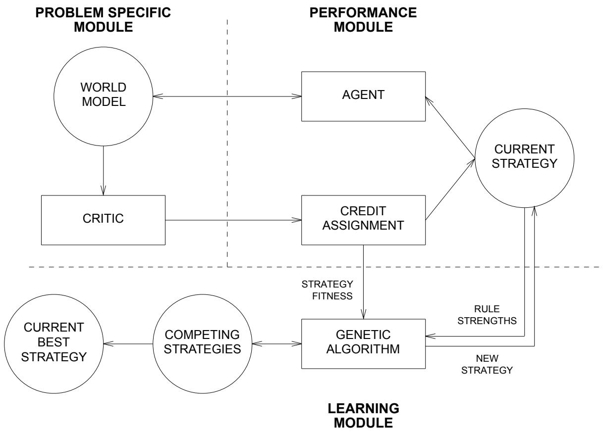
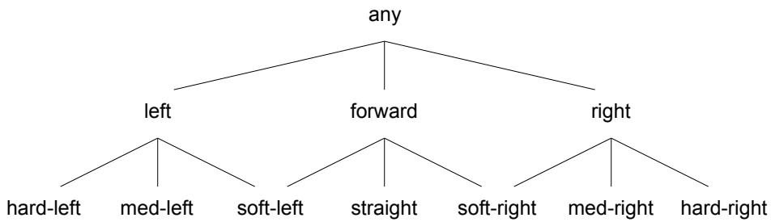
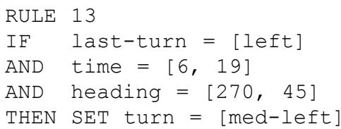
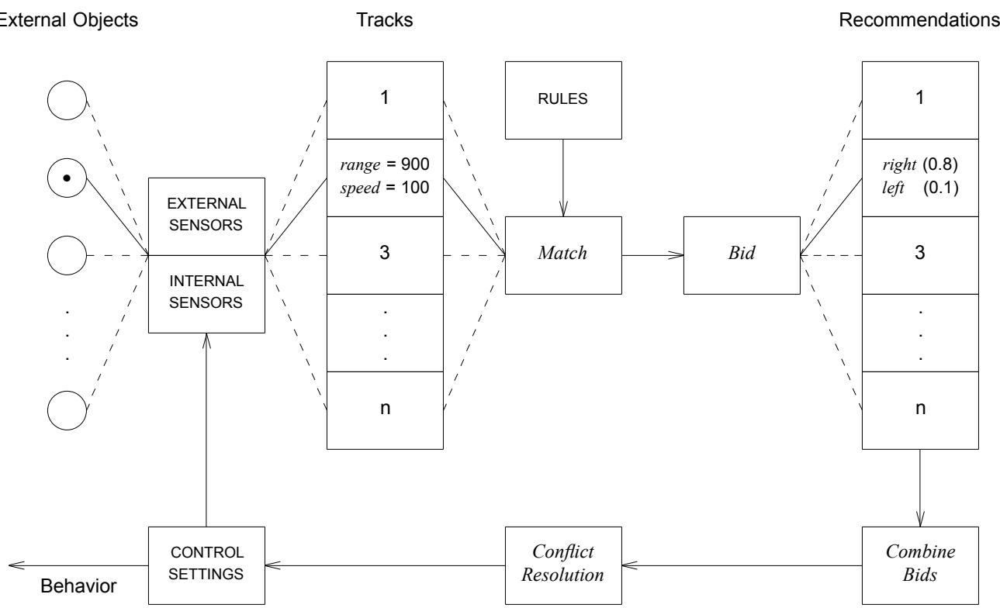
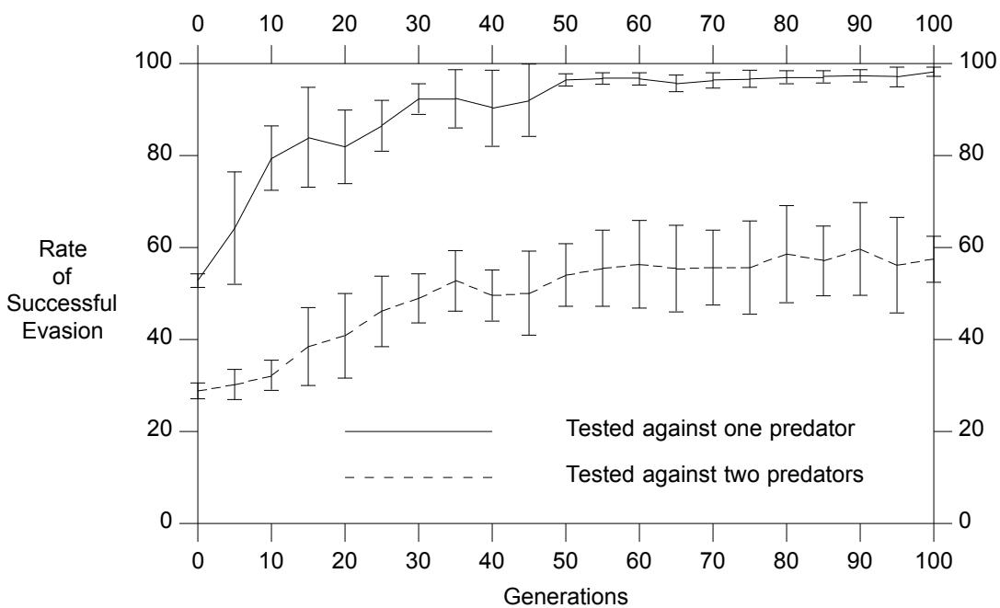
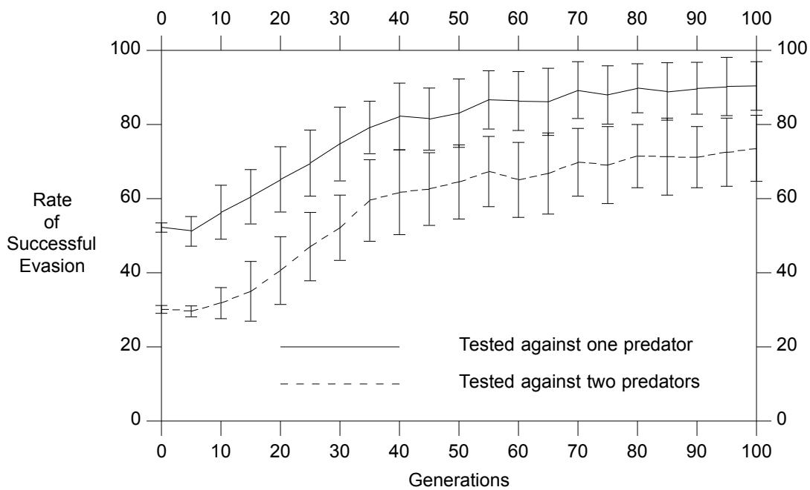
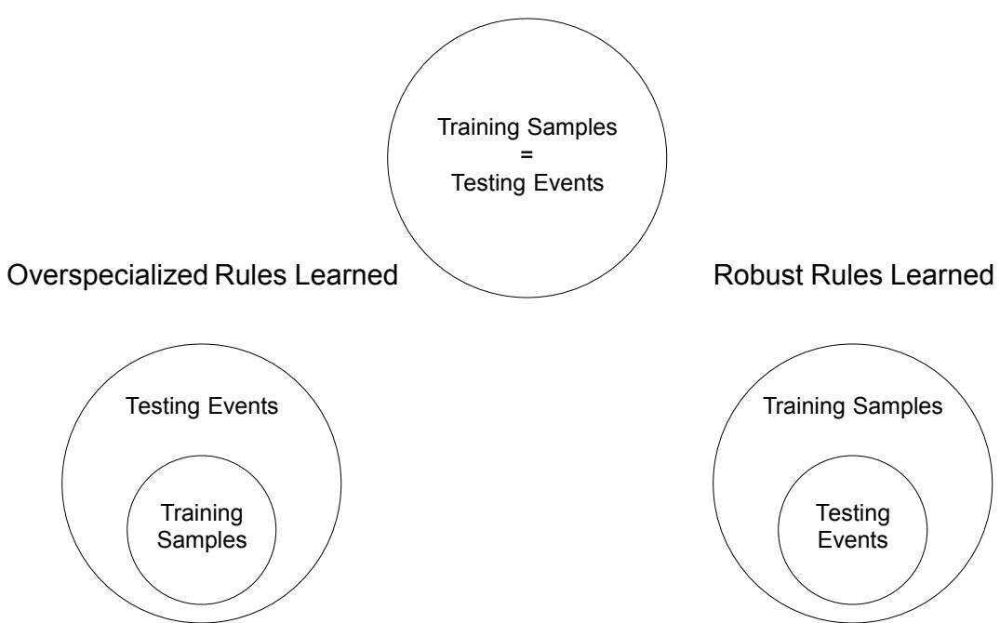
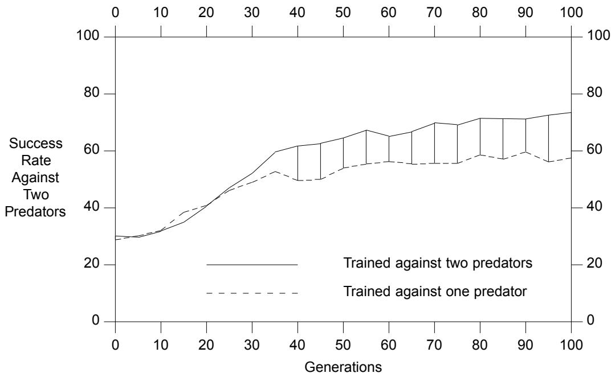
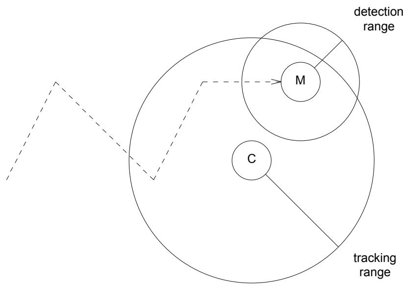
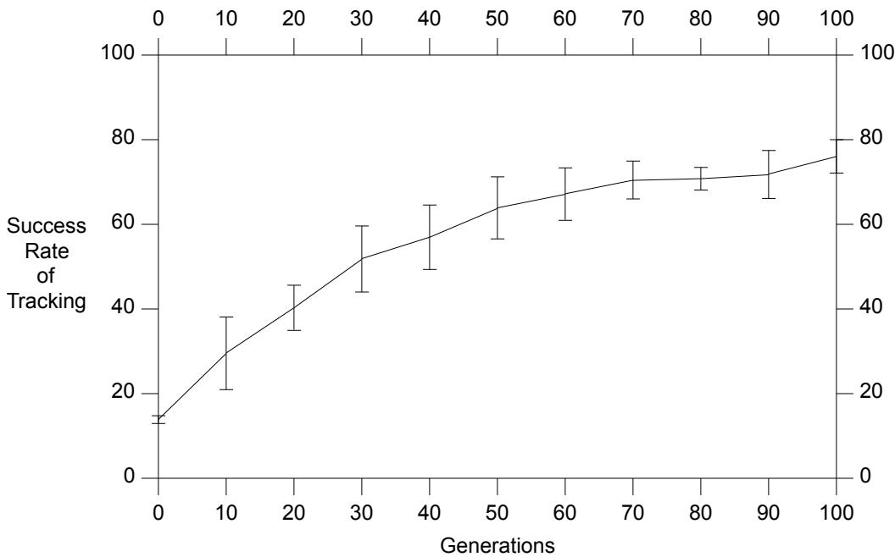

# The Evolution of Strategies for Multi-agent Environments

John J. Grefenstette

Navy Center for Applied Research in Artificial Intelligence Naval Research Laboratory Washington, DC 20375-5000, U.S.A.

Email: GREF@AIC.NRL.NAVY.MIL Phone: (202) 767-2685 FAX: (202) 767-5103

# ABSTRACT

SAMUEL is an experimental learning system that uses genetic algorithms and other learning methods to evolve reactive decision rules from simulations of multi-agent environments. The basic approach is to explore a range of behavior within a simulation model, using feedback to adapt its decision strategies over time. One of the main themes in this research is that the learning system should be able to take advantage of existing knowledge where available. This has led to the adoption of rule representations that ease the expression existing knowledge. A second theme is that adaptation can be driven by competition among knowledge structures. Competition is applied at two levels in SAMUEL. Within a strategy composed of decision rules, rules compete with one another to influence the behavior of the system. At a higher level of granularity, entire strategies compete with one another, driven by a genetic algorithm. This article focuses on recent elaborations of the agent model of SAMUEL that are specifically designed to respond to multiple external agents. Experimental results are presented that illustrate the behavior of SAMUEL on two multi-agent predator-prey tasks.

# The Evolution of Strategies for Multi-agent Environments

# 1. INTRODUCTION

Designing autonomous systems that exhibit adaptive behavior is especially challenging if the environment is only partially modeled, contains other independent agents, or permits only limited sensing of important state variables. Such features reduce the utility of traditional projective planning methods from artificial intelligence (Carbonell, Knoblock and Minton, 1990) and favor the use of reactive control rules that respond to current information and suggest useful actions (Agre & Chapman, 1987; Schoppers, 1987). This article describes the current status of an ongoing study of the use of genetic algorithms and other competition-based heuristics to evolve high-performance reactive rules for multi-agent environments.

The particular class of tasks under study can be characterized as sequential decision problems: The decision making agent interacts with a discrete-time dynamical system in an iterative fashion. At the beginning of each time step, the agent observes a representation of the current state and selects one of a finite set of actions, based on the agent’s decision rules. As a result, the dynamical system enters a new state (perhaps based on the actions of other agents in the environment) and returns a (perhaps null) payoff. This cycle repeats indefinitely. The learning task is to find a set of decision rules that maximizes the expected total payoff. For many interesting problems, including those considered here, payoff is delayed in the sense that non-null payoff occurs only at the end of an episode that may span several decision steps.1

In multi-agent environments, a complete mathematical analysis is usually impossible, because of the complexity of the multi-agent interactions and the inherent uncertainty about the future actions of other agents. One manual approach to such problems is to develop a policy expressed as a set of decision rules, or strategy, that specifies an appropriate response to any given situation. The behavior of a strategy can be monitored in a simulation to discover any weaknesses or inadequacies. Knowledge engineers can use this information to modify the rules, which can then be re-evaluated in the simulation. Such a generate-and-test cycle can be repeated until a satisfactory set of rules is found. The current system was designed with this approach in mind. The goal is to reduce or eliminate the manual effort involved in the generate-and-test cycle in evolving high-performance strategies. In the remainder of this article, we describe our approach to the design of systems that can automatically assess and modify their heuristic rules for sequential decision tasks, given a simulation model of the task environment.

The notion of evolving decision strategies for sequential decision problems with genetic algorithms (Holland, 1975) has received attention in a number of recent studies (De Jong, 1990). One interesting dimension along which these approaches can be distinguished is the complexity of representation of the decision rules that are evolved. Work on classifier systems (Holland, 1986; Riolo, 1987; Wilson, 1987a; Booker, 1988) has focused on the evolution of sets of pattern-matching rules based on low-level (usually binary-valued) primitives processed by a simple message-passing mechanisms. This approach is motivated by an interest in generality and in modeling low level cognitive mechanisms. At the other extreme along this dimension, the Genetic Programming paradigm described by Koza (1989) uses genetic algorithms to evolve LISP expressions as decision rules. In Genetic Programming, the agent model is essentially a LISP interpreter. We have explored a middle ground. In our approach, which has been implemented in a system called SAMUEL, decision rules are of intermediate complexity between the pattern matching rules in classifier systems and the LISP rules in the Genetic Programming approach. Likewise, our agent model has more elaborate structure than a classifier system, but does not require the complexity of a LISP interpreter. We believe that this intermediate level model strikes a balance that will facilitate the use of the approach in the construction of autonomous systems for realistic tasks.

The design of SAMUEL builds on De Jong and Smith’s LS-1 approach (Smith, 1980) as well as our own previous system called RUDI (Grefenstette, 1988). Some of the key features of SAMUEL are:

• A flexible language for expressing rules.   
• Incremental rule-level credit assignment.   
• Competition both at the rule level and at the strategy level.   
• A genetic algorithm for searching the space of strategies.   
• A set of heuristic rule learning operators that are integrated with the genetic operators.

Initial studies on competitive, multi-agent tasks have demonstrated that

• SAMUEL can learn robust decision strategies that are effective against adversaries with a broad range of characteristics, and under a variety of initial conditions (Grefenstette, Ramsey and Schultz, 1990).   
• SAMUEL can learn high-performance strategies even with noisy sensors (Ramsey, Schultz and Grefenstette, 1990).   
• SAMUEL can effectively use existing knowledge to speed up learning (Schultz and Grefenstette, 1990).

A detailed description of SAMUEL is available elsewhere (Grefenstette et al., 1990; Grefenstette and Cobb, 1991). In this article, we emphasize the recent extensions to SAMUEL, and illustrate their use on two multi-agent environments. The remainder of this article is organized as follows: The next section presents an overview of the SAMUEL system, describing the knowledge representation, the rule-level learning mechanisms, and the genetic learning mechanisms. Section 3 discusses the agent model in more detail, focusing on recent extensions that represent a specific approach to responding to multiple external agents. Section 4 presents some experimental studies that demonstrate the effectiveness of SAMUEL in evolving strategies for a challenging multiple predator avoidance task. Section 5 highlights SAMUEL’s mechanisms for allowing the user to define constraints which help to focus the actions of the learning mechanisms on plausible behavior. Results are presented for a cat-and-mouse tracking task. Section 6 provides a brief survey of other recent studies with the SAMUEL system. The final section summarizes some directions for further research with this approach.

# 2. OVERVIEW OF SAMUEL

SAMUEL was designed as a platform to investigate the utility of machine learning techniques for the design of autonomous systems. The basic approach is to enable a system to explore a range of behavior within a simulation model, using feedback to revise its decision strategies over time. The ultimate goal is to design a system that, with a minimum of externally provided guidance, can refine and improve upon its initial knowledge. Thus, one of the main themes in this research is that the learning system should be able to take advantage of existing knowledge where available. This has led to our consideration of rule representations that would ease the expression of manually derived strategies.

A second theme in this project is that adaptation can be driven by competition among knowledge structures. Competition is applied at two levels in SAMUEL. Within a strategy composed of decision rules, rules compete with one another to influence the behavior of the system. Some of the ideas for rule-level competition in SAMUEL derive from the mechanisms in traditional classifier systems (Holland, 1986; Riolo, 1987). At a higher level of granularity, entire strategies compete with one another using a genetic algorithm (Holland, 1975). Genetic algorithms provide a robust approach to searching extremely large and complex spaces, such as the space of strategies.

From a genetic algorithms perspective, SAMUEL represents a demonstration that a genetic algorithm is not limited to binary representations of its search space. From a machine learning perspective, SAMUEL shows that traditional rule modification operators, such as specialization and generalization, can be integrated smoothly with a genetic algorithm. The remainder of this section will illustrate these ideas in more detail.

# 2.1. System Architecture

SAMUEL is designed is learn decision rules for an agent interacting with a world model. The overall system design is shown in Figure 1.

  
Figure 1: SAMUEL Learning System Architecture

The agent’s perception facilities are modeled by a set of discrete-valued sensors. In general, SAMUEL makes no assumptions about the semantics of the agent’s sensors. Sensors may include external sensors that inform the agent about other agents and objects in the environment and internal sensors that capture features of the agent’s own state. There is also a fixed set of control variables that may be set by the decision making agent. Again, SAMUEL makes no assumptions about the semantics of control variables, so they may refer to both physical actuators that change the agent’s state with respect to the external environment, as well as internal states such as the agent’s current goal.

In our investigations to date, we typical assume that the ‘‘sensors’’ that occur within decision rules in SAMUEL are fairly high level indicators of the current state. For example, a sensor might indicate the distance to another agent. Obviously, we do not mean to model the earliest phase of the agent’s signal processing. Rather, we are more interested in developing strategies that use the sort of environmental data that might plausibly be available to a sophisticated autonomous robot. Likewise, we typically consider actions that may need to be mediated by various lower level control loops, e.g., turn right. Again, our motivation is to develop tactical strategies for multi-agent interactions, not to replace traditional control mechanisms.

Any learning system requires some form of feedback. In SAMUEL, the feedback is provided by a critic module that observes the behavior of the agent in the environment and judges its overall effectiveness of the task to be learned. In order to make the approach applicable to tasks for which no expert level knowledge exists, we do not require that the critic provide explanations for its scoring. Instead, the critic provides intermittent feedback in terms of a scalar quantity that reflects the quality of the agent’s recent behavior.

# 2.2. Knowledge Representation

One of the key features of SAMUEL is that, unlike many previous genetic learning systems, the knowledge representation consists of symbolic condition-action rules, rather than low-level binary pattern matching primitives.2 The use of a symbolic language offers several advantages. First, it is easier to transfer the knowledge learned to human operators. Second, it makes it easier to combine genetic algorithms with analytic learning methods that explain the success of the empirically derived rules (Gordon and Grefenstette, 1990). Finally, it makes it easier to incorporate existing knowledge (Schultz and Grefenstette, 1990).

A learning agent in SAMUEL makes decisions based on its current strategy, consisting of a set of condition-action decision rules. Each rule recommends one or more responses to a set of situations. The details of how responses are selected will be discussed in a later section. First, we describe the format of the decision rules themselves.

A rule’s left-hand side specifies a conjunctive set of conditions that are compared against the current sensor readings. The right-hand side specifies a set of recommended actions, each qualified by a numeric strength. Sensors and control variables correspond to either numeric or nominal attributes. Numeric attributes take on discrete values from a linearly or cyclicly ordered numeric range. A nominal attribute can assume values from a partially ordered set of symbolic values. For example, the nominal attribute turn might assume values from the partial order shown in Figure 2.

  
Figure 2: A Structured Attribute

Conditions for numeric attributes specify upper and lower bounds for the corresponding sensor. Conditions for nominal sensors specify a list of values, and the condition matches if the sensor’s current value occurs in a subtree labeled by one of the values in the list. Actions likewise specify a set of values for the corresponding control variable. For example, a typical SAMUEL rule is shown in Figure 3. The rule specifies that last-turn must match any value in the subtree with root left, the time sensor must have a value between 6 and 19, inclusive, and the heading, (a cyclic sensor), must have a value between 270 and 45 degrees. If these conditions are met, the rule recommends a medium-left turn with high confidence (indicated by the strength value 0.9).

  
Figure 3: A Rule in SAMUEL

The next section will describe how the strength of a rule is modified through experience.

# 2.3. Rule Level Learning

Each rule in SAMUEL has an associated strength that estimates the rule’s utility for the task environment. If a rule’s recommendation has been followed during a particular episode, the rule is said to be active. At the end of episode $\tau$ , the critic provides a payoff $r ( \tau )$ . For each active rule $R _ { i }$ , the estimate of its mean payoff, $\mu _ { i }$ , is updated as follows:

$$
\mu _ { i } ( \tau { + } 1 ) = ( 1 - \alpha ) \mu _ { i } ( \tau ) + \alpha r ( \tau )
$$

This is just the traditional perceptron learning rule, applied to update the utility of a rule. It is easy to show that $\mu$ approximates a time-weighted running average of the payoff received whenever the rule was active:

$$
\mu _ { i } ( \tau ) \approx \propto \sum _ { j = 1 } ^ { \tau } ( 1 - \alpha ) ^ { \tau - j } r ( j - 1 )
$$

The estimate of the variance in its payoff, ${ \sigma _ { i } } ^ { 2 }$ , is updated similarly:

$$
{ \sigma _ { i } } ^ { 2 } ( \tau + 1 ) = ( 1 - \alpha ) { \sigma _ { i } } ^ { 2 } ( \tau ) + \alpha \left( { \mu _ { i } } ( \tau ) - r ( \tau ) \right) ^ { 2 }
$$

The constant $\alpha$ in the equations above is a learning-rate parameter (typically, ${ \alpha } = 0 . 0 1$ ). If rule $R _ { i }$ has an estimated payoff with mean $\mu _ { i }$ and variance ${ \sigma _ { i } } ^ { 2 }$ , we define the strength of $R _ { i }$ as:

$$
\mathrm { s t r e n g t h } ( R _ { i } ) = \mu _ { i } - \sigma _ { i } .
$$

Thus, a high strength rule must have both high mean and low variance in its estimated payoff. By biasing conflict resolution toward high strength rules, we expect to select actions for which we have high confidence of success. Conflict resolution proceeds as follows:

1. Find the match set, consisting of all rules that most nearly match the current sensor readings.   
2. For each possible action, define the action’s bid as the maximum strength of any rule in the match set that specifies that action.   
3. Select an action by choosing among all the actions with the highest bids.

Once an action is selected, all rules in the match set that recommended the selected action are considered active, and will have their strengths adjusted at the end of the episode.

# 2.4. Genetic Learning

The previous section has described learning as modification of the strengths of rules over time. This section describes the generation of rules and strategies. SAMUEL evolves strategies for its task environment by performing a genetic search through the space of possible strategies, using a genetic algorithm as outlined in Figure 4.

procedure $G A$   
begin $t = 0$ ; initialize $P ( t )$ ; evaluate strategies in $P ( t )$ ; while termination condition not satisfied do begin $t = t + 1 ;$ select $P ( t )$ from $P ( t - 1 )$ ; recombine strategies in $P ( t )$ ; evaluate strategies in $P ( t )$ ; mutate strategies in $P ( t )$ ; end   
end.

SAMUEL maintains a population of alternative strategies.3 Given the complexity of the environments of interest to us, it is usually impossible to exhaustively evaluate each strategy under all possible situations. Instead, each strategy is evaluated by executing a small number of randomly selected episodes (typically, 20) on the simulation model. The fitness of the strategy is the average payoffreceived from the critic during the evaluation episodes. After the current strategies have been evaluated, a new population of strategies is formed in two steps. First, strategies in the current population are selected to be reproduced on the basis of their relative fitness. That is, high-performing strategies may be chosen several times for replication, and poorly performing strategies may not be chosen at all. Second, the selected strategies are recombined using a specialized CROSSOVER operator. Crossover proceeds by exchanging selected groups of rules between the parent strategies. Rules that have fired in sequence during a successful episode are inherited as a group (Grefenstette at al, 1990).

In addition to Darwinian principles of survival-of-the-fittest, SAMUEL includes several mutation operators that are more Lamarckian in nature, in the sense that they modify the rules within a strategy as a direct result of the strategy’s experience with the task environment.4 These changes are subsequently passed along to the strategy’s offspring. We have already described one Lamarckian feature of SAMUEL: the association of strengths with individual rules is inherited from one generation to the next. We now describe the Lamarckian mutation operators in SAMUEL.

SAMUEL currently includes six mutation operators that modify the rules within a single strategy: MUTATION, CREEP, SPECIALIZE, GENERALIZE, MERGE, and DELETE. The first five are creative in the sense that modifications are made on a new copy of the original rule. The original rule is retained in competition with the new rule.

Once created, a rule survives intact unless its strategy is not selected for reproduction or it is explicitly deleted by the DELETE operator. A rule may be deleted from a strategy if it meets one or more of the following criteria: (1) the rule has low activity level (has not fired recently); (2) the rule has low strength;

or (3) the rule is subsumed by a more general rule with higher strength. Since this operator will eliminate the maladaptive mutations, SAMUEL requires only that creative mutation operators produce plausible variants of the existing rules. The interaction between the creative operators and the DELETE operator provide the sort of competitive pressure at the rule level that the genetic algorithm provides at the strategy level.

MUTATION and CREEP make random changes to existing rules. MUTATION can change any condition or action to an arbitrary value, whereas CREEP is restricted to make the smallest possible change. Since these operators are similar to traditional forms of mutation in genetic algorithms, they will not be further described here. (See (Grefenstette, 1991) for more details.) The remaining operators are variations of familiar learning operators used in symbolic machine learning (Michalski, 1983). We will briefly describe each of these.

The SPECIALIZE operator is triggered when a general rule fires in a high payoff episode. (The generality threshold and the payoff threshold for the operator are run-time parameters). The operator creates a new rule whose left-hand side more closely matches the current sensor values and whose right-hand side more closely matches the current action value. For numeric conditions (i.e., linear or cyclic), the operator creates a new condition with roughly half the generality of the previous condition by moving each endpoint half way toward the sensor reading. For structured conditions, SPECIALIZE replaces each value in the list by each of its children that covers the current sensor reading. For example, if the original rule is:

where the turn attribute is described by Figure 2. If the sensor readings are:

$$
( \mathsf { t i m e \ } = \ 2 , \mathsf { s p e e d \ } = \ 5 0 0 )
$$

and the action taken is:

then the new rule would be:

This new rule would now compete with the original rule and the other rules within the strategy. If the new rule turns out to be an appropriate specialization, its strength will rise and it will be protected from deletion. On the other hand, if the new rule is an inappropriate specialization, its strength will fall, and it may be deleted by the subsumption clause of DELETE.

The GENERALIZE operator can be applied when a rule fires due to a partial match, during a high payoff episode. A partial match occurs when there is no rule that completely matches all the current sensor readings. The operator creates a new rule whose left-hand side is generalized enough to match the current sensor values. For numeric conditions, the operator creates a new condition with one of the end points set to the sensor reading. For example, if the original rule is:

If the sensor readings are:

$$
( \mathsf { t i m e \ } = \ 2 , \mathsf { s p e e d \ } = \ 2 0 0 )
$$

then the new rule would be:

IF time $=$ [0, 20] AND speed $=$ [200, 1500] THEN SET turn $=$ [left, straight] (0.8)

The MERGE operator creates a new rule from two existing high-strength rules that have identical right-hand sides. The new rule will match any sensor value matched by either of the original rules. The right-hand side of the new rule is the same as both of the original rules. The MERGE operator, in combination with the DELETE operator, helps to eliminate overspecialized rules from the strategy.

The operators SPECIALIZE and GENERALIZE are clearly Lamarckian in the sense that they are triggered only by successful experiences and they change a strategy to more closely reflect this experience. MERGE and DELETE are indirectly Lamarckian in the sense that they are sensitive to the strength or activity level of the rules, and these statistics directly reflect the rule’s past experience in the environment.

# 3. AGENT MODEL

An important issue in multi-agent learning is how to refer to multiple external objects. One possibility is for each decision rule to have distinct conditions that match against the current state of each agent. While this approach is expressive, it is also inconvenient if the number of external agents is unknown or changing. We adopt a simpler approach that allows the rule representation to be independent of the number of external agents. The agent model is shown in Figure 5.

  
Figure 5: The Agent Model in SAMUEL

Each external agent is assigned a track in which the sensor readings for that object are stored, decision rules are applied to individual tracks, and recommendations are combined into a final decision. In particular, during each decision cycle the learning agent’s action is determined according to the following

procedure:

1. For each external agent in the environment, compute a set of bids for recommended actions, as follows:   
1.1 Record the sensor readings from the external agent, along with any internal sensor readings, in a sensor track.   
1.2 Find all decision rules that match the sensor readings in the current track. This is the match set for the track.   
1.3 For each possible action, the bid for that action is equal to the maximum strength of any rule in the match set that recommends that action.

For example, suppose the sensor readings for one external object are:

INTERNAL SENSORS: (time $= 1 0$ , fuel $=$ low) EXTERNAL SENSORS: (speed $= 7 0 0$ , range $= 5 0 0$ )

and suppose the rules in the match set are:

RULE 10   
IF time $= [ 5 , 1 5 ]$ AND fuel [low, medium]   
AND speed $= [ 6 0 0 , 8 0 0 ]$ AND range $= [ 4 0 0 , 8 0 0 ]$   
THEN SET turn $=$ right (0.9)   
RULE 25   
if time $= [ 7 , 1 2 ]$ AND $\mathrm { f u e l } = [ \mathrm { l o w } ]$   
AND speed $= [ 3 0 0 , 7 0 0 ]$ AND range $= [ 0 , 1 0 0 0 ]$   
THEN SET turn $=$ left (0.4)

Then the bids for this track would be ( right (0.9), left (0.4) )

2. Combine the bids for all tracks.

Currently, bids are combined by taking products of corresponding actions for each track. For example, if there were two tracks with bids

( right (0.9), left (0.4) ) and ( right (0.8), left (0.9) )

then the combined bids would be ( right (0.72), left (0.36) )

3. Select among the actions with the highest bids.5

# 4. AN ILLUSTRATION OF MULTI-AGENT LEARNING

Previous studies (Grefenstette at al., 1990; Schultz and Grefenstette, 1990) have demonstrated that SAMUEL can learn highly effective decision rules for an evasive maneuvers task, in which the learning agent must avoid an approaching predator. Our purpose in this study is to examine the effectiveness of SAMUEL’s mechanisms for handling multiple external agents. We will assume that the learning agent has the same set of sensors as in the previous studies of the evasive maneuvers task. These sensors are described briefly below, but the significant feature is that the set does not include a sensor that explicitly distinguishes the different predators in a multi-predator environment. In other words, the same rules can be applied regardless of the number of external agents. As described in the previous section, SAMUEL proceeds by applying the rules against the track corresponding to each external agent in turn, collecting the recommended actions associated with each track, and finally combining these recommendations into a single action. A careful comparison of the effectiveness of this approach with other possible alternatives is beyond the scope of this discussion. However, we can test whether this approach results in learning more appropriate rules for an environment with multiple external agents, compared to learning against a single adversary. To this end, we performed two sets of experiments. In one set of runs, the learning agent faced a single adversary.6 In the second set of runs, there were two predators pursuing the learning agent.

We begin by briefly describing the learning environment. The learning agent plays the role of a prey in an environment with one or more adversaries, or predators, that can track the motion of the prey and steer toward the prey’s anticipated position. The learning agent has a set of sensors, namely: time (since the beginning of the episode), last-turn (by the agent), bearing (direction to the predator’s position), heading (relative direction of the predator’s motion), speed (of the predator), and range (distance to the predator). The time, speed, and range sensors are all linear attributes, while last-turn, bearing, and heading are cyclic attributes. Each sensor has fairly large granularity. That is, the mapping from the true world state to observed world state is many-to-one. The sensors are also noisy, and may report incorrect values.7 In this environment, the agent learns only its turning rate, which can take on nine possible values from -180 to 180 degrees in 45 degree increments. An example of a rule for this task is shown in Figure 2.

In this first task, the agent’s speed is determined by the turning rate. Like its sensors, the agent’s actions are noisy. That is, the agent may select a 90 degree turn, but in fact, it may turn a little more or a little less than it had indicated. The combination of the coarse granularity and the noise in both the sensors and the effectors means that, unlike an agent in a typical AI planning program, our agent cannot accurately predict the next state on the basis of the current observed state and the action it selects. These assumptions, which are intended to capture some of the flavor of robotic interactions with the real world, preclude the use of traditional AI planning techniques, and argue in favor of SAMUEL’s more reactive approach.

The predator initially travels at a greater speed but is less maneuverable than the prey (i.e., the predator has a greater turning radius than the prey) and gradually loses energy (i.e., speed) as it maneuvers. The episode ends when either the predator captures the prey or the predator’s energy drops below a threshold and it gives up. Each episode requires between 2 and 20 decision steps, depending on how many turns the predator performs while tracking the prey. At the end of each episode, the critic provides full payoff if the agent evades the adversary, and partial payoff otherwise, proportional to the amount of time before the agent’s capture.

The learning process is divided into episodes that begin with each agent placed at a random initial state, determined by three characteristics. First, the initial distance between the predator and the prey was chosen uniformly from the range [1000 .. 3000]. Second, the initial speed of the predator was chosen uniformly from the range [500 .. 700]. Third, the initial angle of approach from the predator to the prey was selected at random from 0 to 360 degrees. The initial speed of the prey was fixed at 333. In the case of the two-predator problem, the distribution of initial conditions meant that the prey had to deal with a range of qualitatively different situations, such as two predators attacking at once, or two predators attacking one at a time.

The performance curves shown in this section were generated as follows: At periodic intervals (5 generations in the current experiments), a single strategy was extracted from the current population to represent the learning system’s current hypothesis. The extraction was accomplished by re-evaluating the top $20 \%$ of the current population on 100 randomly chosen episodes on the simulation model. The strategy with the best performance in this phase was designated the current hypothesis of the learning system. The hypothesis was then evaluated on the two test environments, one with one predator and one with two predators. The results are shown in Figures 6 and 7. Because SAMUEL employs probabilistic learning methods, all graphs represent the mean performance of 10 independent runs of the genetic algorithm. The error bars indicate one standard deviation on either side of the mean.

Figure 6 shows the performance of strategies that were learned in the one-predator environment, when tested in both the one-predator environment (solid line) and two-predator environment (dashed line).

  
Figure 6: Performance of Strategies Trained Against One Predator

It is clear that performance degrades substantially when a second predator is present. This result confirms our previous experience with genetic learning systems: SAMUEL is an opportunistic learner that exploits regularities in its training environment. Consequently, it tends to learn rules that are fairly specialized to the task it was required to learn. In this case, the strategies that were developed for dealing with single predator do not generalize to the case of two predators.

Figure 7 shows the performance of strategies that were learned in the two-predator environment, when tested in both the one-predator environment (solid line) and two-predator environment (dashed

  
Figure 7: Performance of Strategies Trained Against Two Predators

There are two significant conclusions to draw from this data. First, the strategies learned for the twopredator case do perform well in the one-predator case. (In fact, they perform better against a single predator than they do against multiple predators.) At first sight, this may seem to contradict our previous comment about the opportunistic nature of genetic learning. However, it must be remembered that the single-predator case actually arises as a special case of the two-predator case: when two predators are initialized near one another, they tend to behave very similarly to a single predator. Since the learning system was required to handle such cases, the rules that were learned are robust enough to handle the special case of one predator as well as the more general, and more difficult, case of two predators. This result is consistent with previous studies with SAMUEL that may be summarized as in Figure 8.

  
Figure 8: Effects of Simulator Accuracy

SAMUEL learns best when the training environment matches the test environment. If this ideal cannot be achieved, then training on an environment that is more general (e.g., multiple predators) than the test environment is more likely to produce robust strategies than training on an environment with spurious regularities (e.g., only one predator) that may not hold in the test environment. Grefenstette et al. (1990) provides other instances of this phenomenon.

The second conclusion from this study is that the system that was trained on two predators did in fact learn strategies that are significantly superior to the previous experiment, when tested against two predators. Figure 9 extracts from the previous figures the performance of the two learning systems when tested against two predators.8

  
Figure 9: Effects of Training Environment of Multiple Predator Task

This figure shows that the system trained against multiple predators learns strategies that are significantly more successful in handling the two-predator case than the system trained against a single predator. This result supports the hypothesis that the mechanisms in SAMUEL for handling multiple external agents are in fact appropriate in some cases. Future studies will attempt to further illuminate the strengths and weaknesses of this approach for multi-agent tasks in general.

# 5. LEARNING CONSTRAINED BEHAVIORS

As we continue to scale up SAMUEL towards realistic applications, it becomes increasingly clear that, while machine learning provides a significant opportunity for decreasing the knowledge acquisition bottleneck, it will still be important to use available knowledge when it is available. The learning system need not develop its knowledge from tabula rasa. A more useful system would be able to take general advice, and refine and modify that advice as required. To facilitate the use of existing knowledge, we have augmented SAMUEL with several mechanisms through which the strategies it learns can be constrained by prior knowledge. This section will illustrate one such mechanism.

All of the rule creation operators described in Section 2 are triggered by successful behavior. If SAMUEL is given a task for which its initial rules perform poorly, the rule creation operators will not have useful experiences upon which to build new rules. More importantly, for many tasks, certain behaviors are clearly counterproductive or dangerous. For example, if SAMUEL is controlling an autonomous airplane, then it should never learn a rule that recommends diving if the altitude is below a certain threshold. One might design such constraints into the payoff function and permit SAMUEL to learn the appropriate behavior, but a more direct solution has been implemented. The user may specify a list of constraints using the SAMUEL rule language. Constraints specify conditions under which the specified actions may or may not be considered. For example, if altitude is a sensor for an aircraft control task, the user might place the following rule in the constraint file:

Constraints are fixed rules and are not modified through learning. The idea is to provide a mechanism for bounding the behavior of the strategies learned by SAMUEL. If the user wants to provide additional advice that can be modified by learning, the user may provide initial sets of rules as a starting point (Schultz and Grefenstette, 1990).

We illustrate the use of constraints on a slightly different predator-prey task in which the learning agent plays the predator. In this task, called Cat-and-Mouse, the goal is to stalk the prey at a distance. The two agents move in a two-dimensional world, as shown in Figure 10.

  
Figure 10: Cat-and-Mouse Task

The mouse (the prey) follows a random course and speed. The cat must learn to control both its speed and its direction. It is assumed that the cat has sensors that operate at a greater distance than the mouse’s sensors. The object is to keep the mouse within range of the cat’s sensors, without being detected by the mouse. If the cat enters the range of the mouse’s sensors, it will be detected with a probability that depends on the cat’s distance and speed. If the cat is detected, the mouse flees the area at high speed.

The sensors for the cat are essentially the same as in the evasive maneuvers task, except that, for these experiments, the sensors are all structured attributes with symbolic values. At the end of each episode, the critic provides full payoff if the cat keeps the mouse within tracking distance for $7 5 \%$ of the episode (20 steps). Otherwise, the cat’s partial payoff is equal to the portion of time that it tracks the mouse.

Because the behavior required for this task is so constrained, it is necessary to provide some initial knowledge, or the cat will never successfully track the moving mouse. In (Grefenstette, 1991), we showed an example of learning this task from an initial set of over-general rules. Here, we illustrate the use of constraints. Figure 11 shows a set of constraints provided prior to learning.

THEN ENABLE turn $=$ any AND speed $=$ high

CONSTRAINT 2   
IF range $=$ [close, low, medium]   
THEN ENABLE turn $=$ any AND speed $=$ [low, medium]

CONSTRAINT 3 IF range $=$ high AND bearing $=$ right THEN DISABLE turn $=$ left

CONSTRAINT 4 IF range $=$ high AND bearing $=$ directly-behind THEN DISABLE turn $=$ forward

CONSTRAINT 5 IF range $=$ high AND bearing $=$ left THEN DISABLE turn $=$ right

CONSTRAINT 6   
IF range $=$ high AND bearing $=$ ahead   
THEN DISABLE turn $=$ [hard-right, med-right, med-left, hard-left]

The first constraint forces the cat to consider only high speeds if the mouse is far away (there are several particular speeds that qualify as "high" in this problem). Likewise, the second constraint requires a lesser speed if the mouse is near. The final four constraints prevent the cat from turning away from the direction of the mouse if the mouse is far away. Taken together, these rules constrain the mouse to consider only plausible alternatives, but they are not sufficient to specify highly successful behavior by the mouse. However, the rule creation operators specified in Section 2 will create rules that refine these pieces of advice, as shown in Figure 12. The initial strategy specifies a random walk on the part of the cat, but the actual behavior is constrained, so the cat successfully tracks the mouse about $1 5 \%$ of the time. Rules that conform to the constraints are quickly generated and refined, and after 100 generations, the cat typical performs at a $7 5 \%$ success rate.

  
Figure 12: Learning Curve on Cat-and-Mouse Task

This result illustrates that the use of constraints can enable SAMUEL to learn strategies that it could not have discovered without prior knowledge. This demonstrates a useful paradigm for creating high performance strategies in autonomous systems. The user initially specifies enough knowledge to permit the system to function at a minimal level of competence. The system then refines the initial knowledge to improve its own performance on the task. We believe that this hybrid approach is likely to produce robust, autonomous systems with less total effort than either traditional manual knowledge engineering or machine learning methods do not exploit existing knowledge.

# 6. OTHER STUDIES OF SAMUEL

In this section, we will briefly describe a number of recent studies on this approach. The reader is referred to the published articles for more complete details.

The foundations for SAMUEL can be traced to the analysis of the credit assignment problem in (Grefenstette, 1988). The credit assignment problem arises when long sequences of rules fire between successive external rewards. It can be shown that the two distinct approaches to rule learning with genetic algorithms each offer a useful solution to a different level of the credit assignment problem. Analytic and experimental results are presented that support the hypothesis that multiple levels of credit assignment, at both the levels of the individual rules and at the level of rule sets, can improve the performance of rule learning systems based on genetic algorithms. These multiple levels are both present in SAMUEL.

One focus of our experimental work has been on the robustness of the rules learned in simulated environments. Robustness can be measured by testing the learned rules in new environments that have been systematically altered from the simulation environment in which the rules were learned. For example, either the learning environment or the target environment may contain noise. Experiments reported in (Ramsey, Schultz, and Grefenstette, 1990) examine the effect of learning tactical plans without noise and then testing the plans in a noisy environment, and the effect of learning plans in a noisy simulator and then testing the plans in a noise-free environment. Empirical results show that, while best results are obtained when the training model closely matches the target environment, using a training environment that is more noisy than the target environment is better than using using a training environment that has less noise than the target environment, as illustrated above in Figure 8.

In (Schultz and Grefenstette, 1990), the use of available heuristic domain knowledge to initialize the population to produce better plans is investigated, and two methods for initialization of the knowledge base are empirically compared. These results provide an interesting contrast with most published work on genetic algorithms, which usually assume tabula rasa initial conditions. The results presented here show that genetic algorithms can be used to improve partially correct decision rules, as well as to learn rules from scratch.

The use of a high-level language also facilitates the explanation of the learned rules. Gordon (1991) describes a method for improving the comprehensibility, accuracy, and generality of reactive plans learned by genetic algorithms. The method involves two phases: (1) formulate explanations of execution traces, and (2) generate new reactive rules from the explanations. The explanation phase involves translating the execution trace of a reactive planner into an abstract language, and then using Explanation-Based Learning to identify general strategies within the abstract trace. The rule generation phase consists of taking a subset of the explanations and using these explanations to generate a set of new reactive rules to add to the original set for the purpose of performance improvement. The particular subset of the explanations that is chosen yields rules that provide new domain knowledge for handling knowledge gaps in the original rule set. The original rule set, in a complimentary manner, provides expertise to fill the gaps where the domain knowledge provided by the new rules is incomplete.

Cobb and Grefenstette (1991) explore the effect of explicitly searching for the persistence of each decision in a time-dependent sequential decision task. Prior studies showed the effectiveness of SAMUEL in solving a simulation problem where an agent learns how to evade a predator that is in pursuit. In the previous work, an agent applies a control action at each time step. This paper examines a reformulation of the problem: the agent learns not only the level of response of a control action, but also how long to apply that control action. By examining this problem, the work shows that it is appropriate to choose a representation of the state space that compresses time information when solving a time-dependent sequential decision problem. By compressing time information, critical events in the decision sequence become apparent.

We have begun to apply the SAMUEL approach to more complex learning environments. In (Schultz, 1991), SAMUEL is used to learn high-performance reactive strategies for navigation and collision avoidance. The task requires an autonomous underwater vehicle to navigate through a randomly generated, dense mine field and then rendezvous with a stationary object. The vehicle has a limited set of sensors, including sonar, and can set its speed and direction. The strategy that is learned is expressed as a set of reactive rules that map sensor readings to actions to be performed at each decision time-step. Simulation results demonstrate that an initial, human-designed strategy which has an average success rate of only eight percent on randomly generated mine fields can be improved by this system so that the final strategy can achieve a success rate of 96 percent. This study provides encouraging evidence that this approach to machine learning may scale up to realistic problems.

# 7. SUMMARY AND FUTURE DIRECTIONS

In our tests to date, SAMUEL has consistently evolved high-performance strategies in a variety of task environments. While these results show promise, one of the areas that clearly requires further effort is the analysis of the range of applications of this approach. There are some obvious limitations with the current system: the rule representation does not support explicit comparisons among the external objects in the environment, for example. More generally, there seems to be a window of task complexity in which SAMUEL performs well. If the environment is too simple, other methods such as traditional control theory or explanation-based learning may be more efficient ways to develop high performance control rules. If the environment is too complex, SAMUEL flounders badly unless given sufficient initial knowledge to perform at a respectable level. As an example, the cat-and-mouse environment requires some initial knowledge in order to provide a minimum level of successful experience upon which

SAMUEL can build better strategies. The user should not expect SAMUEL to develop strategies for a difficult environment on its own. Nonetheless, we believe that SAMUEL can be part of a methodology that combines knowledge engineering and machine learning in a way that significantly reduces the overall development effort for systems that exhibit expert performance in complex environments. Future work will aim at quantifying the benefits of this overall approach.

Another useful avenue for exploration is to try to combine the reactive style of SAMUEL with more deliberative planning approaches. A simple step toward such a combination would be to include the agent’s current goal as one of the sensors. A planning module, running in parallel with the current agent model, could interact with the reactive rules by changing the value of the goal sensor. A more ambitious approach would be to have SAMUEL learn rules that could alter the agent’s goal. Wilson (1987b) has proposed some interesting ideas for learning in a hierarchical classifier system, and similar techniques might be useful within the SAMUEL framework as well.

# ACKNOWLEDGMENTS

I want to acknowledge the contributions toward the development of SAMUEL by the members of the Machine Learning Group at NRL, especially Alan Schultz, Connie Ramsey, Diana Gordon, Helen Cobb, and Ken De Jong. This work is supported in part by ONR under Work Request N00014-91- WX24011.

References   
Agre, P. E. & Chapman, D. (1987). Pengi: An implementation of a theory of activity. Proceedings Sixth National Conference on Artificial Intelligence, Vol. 1 (pp. 268-272). Los Altos, CA: Morgan Kaufman.   
Barto, A. G., Sutton, R. S., & Watkins, C.J.C.H. (1990). Learning and sequential decision making. In M. Gabriel & J.W. Moore (Eds.), Learning and computational neuroscience. Cambridge, MA: MIT Press.   
Booker, L. B. (1988). Classifier systems that learn internal world models. Machine Learning, 3(2/3), (pp. 161-192).   
Booker, L. B. (1991). Representing attribute-based concepts in classifier systems. In G. J. E. Rawlins (Ed.), Foundations of genetic algorithms. San Mateo, CA: Morgan Kaufmann.   
Carbonell, J. G., Knoblock, C. A. & Minton, S. (1990). Prodigy: An integrated architecture for planning and learning. In K. Van Lehn (Ed.), Architectures for intelligence. Hillsdale, NJ: Lawrence Erlbaum Associates.   
Cobb, H. G. and J. J. Grefenstette (1991). Learning the persistence of actions in reactive control rules. Proceedings of the Eighth International Machine Learning Workshop (pp. 293-297). San Mateo, CA: Morgan Kaufmann.   
De Jong, K. A. (1990). Genetic-algorithm-based learning. In Y. Kodratoff, & R. Michalski (Eds.), Machine learning: An artificial intelligence approach (Vol. 3). San Mateo, CA: Morgan Kaufmann.   
Gordon, D. G., & Grefenstette, J. J. (1990). Explanations of empirically derived reactive plans. Proceedings of the Seventh International Conference on Machine Learning (pp. 198-203). San Mateo, CA: Morgan Kaufmann.   
Gould, S. J. (1980). The panda’s thumb. New York, NY: Norton & Co.   
Grefenstette, J. J. (1988). Credit assignment in rule discovery system based on genetic algorithms. Machine Learning 3(2/3), 225-245.   
Grefenstette, J. J. (1991). Lamarckian learning in multi-agent environments. Proceedings of the Fourth International Conference of Genetic Algorithms (pp. 303-310). San Mateo, CA: Morgan Kaufmann.   
Grefenstette, J. J., C. L. Ramsey, and A. C. Schultz (1990). Learning sequential decision rules using simulation models and competition. Machine Learning, 5(4), (pp. 355-381).   
Grefenstette, J. J., and H. C. Cobb (1991). User’s guide for SAMUEL. (NRL Memorandum Report 6820), Washington, DC: Naval Research Laboratory.   
Holland, J. H. (1975). Adaptation in natural and artificial systems. Ann Arbor: University of Michigan Press.   
Holland J. H. (1986). Escaping brittleness: The possibilities of general-purpose learning algorithms applied to parallel rule-based systems. In R. S. Michalski, J. G. Carbonell, & T. M. Mitchell (Eds.), Machine learning: An artificial intelligence approach (Vol. 2). Los Altos, CA: Morgan Kaufmann.   
Koza, J. R. (1989). Hierarchical genetic algorithms operating on populations of computer programs. Proceedings of the 11th International Joint Conference on Artificial Intelligence, Vol. 1 (pp. 768- 774). San Mateo, CA: Morgan Kaufmann.   
Michalski, R. S. (1983). A theory and methodology for inductive learning. Artificial Intelligence, 20(2), 111-161.   
Ramsey, C. L., Schultz, A. C. & Grefenstette, J. J. (1990). Simulation-assisted learning by competition: Effects of noise differences between training model and target environment. Proceedings of the Seventh International Conference on Machine Learning (pp. 211-215). San Mateo, CA: Morgan Kaufmann.   
Riolo, R. L. (1987). Bucket brigade performance II: Default hierarchies. Proceedings of the Second International Conference on Genetic Algorithms (pp. 196-201). Hillsdale, NJ: Lawrence Erlbaum Associates.   
Schoppers, M. J. (1987). Universal plans for reactive robots in unpredictable environments. Proceedings of the Tenth International Joint Conference on Artificial Intelligence (pp. 1039-1046). Los Altos, CA: Morgan Kaufmann.   
Schultz. A. C. (1991). Using a genetic algorithm to learn strategies for collision avoidance and local navigation. Proceedings of the Seventh International Symposium on Unmanned, Untethered Submersible Technology (pp. 213-225). Durham, NH: University of New Hampshire.   
Schultz, A. C. and J. J. Grefenstette (1990). Improving tactical plans with genetic algorithms. Proceeding of IEEE Conference on Tools for AI 90 (pp. 328-334). Washington, DC: IEEE   
Smith, S. F. (1980). A learning system based on genetic adaptive algorithms, Unpublished doctoral dissertation, Department of Computer Science, University of Pittsburgh, Pittsburgh.   
Wilson, S. W. (1987a). Classifier systems and the animat problem. Machine Learning, 2(3), 199-228.   
Wilson, S. W. (1987b). Hierarchical credit allocation in a classifier system. In L. Davis (Ed.), Genetic algorithms and simulated annealing. London, Engl.: Pitman.