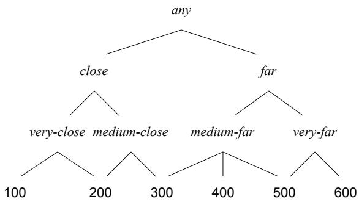
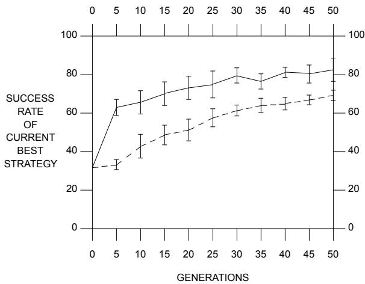
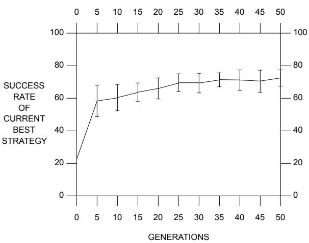
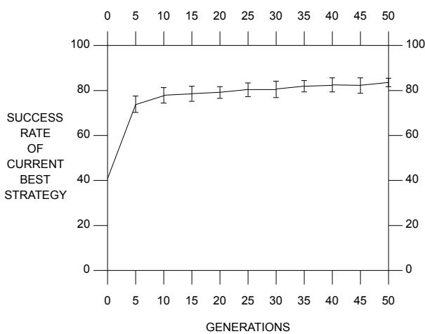

# Lamarckian Learning in Multi-agent Environments

John J. Grefenstette Navy Center for Applied Research in Artificial Intelligence Code 5514 Naval Research Laboratory Washington, DC 20375-5000 E-mail: GREF@AIC.NRL.NAVY.MIL

# Abstract

Genetic algorithms gain much of their power from mechanisms derived from the field of population genetics. However, it is possible, and in some cases desirable, to augment the standard mechanisms with additional features not available in biological systems. In this paper, we examine the use of Lamarckian learning operators in the SAMUEL architecture. The use of the operators is illustrated on three tasks in multi-agent environments.

# 1 INTRODUCTION

The goal of this work is to explore the application of machine learning techniques to reactive control problems arising in competitive, multi-agent domains. In such domains, traditional AI planning approaches are usually infeasible, because of the complexity of the multi-agent interactions and the inherent uncertainty about the future actions of other agents. On the other hand, genetic algorithms [11] appear to be a promising approach to developing high performance control strategies. SAMUEL is our platform for exploring the use of genetic algorithms to learn control strategies, expressed as sets of condition/action rules, for sequential decision problems.

Several new features have recently been added to SAMUEL that improve significantly both the quality of the rules that are learned and the computational cost of learning those rules. These improvements have been achieved by complementing the Darwinian principles embodied in SAMUEL with a number of mechanisms that are more Lamarckian in flavor. While such mechanisms may not be appropriate for systems intended to accurately model biological adaptive systems, they are appropriate for systems like SAMUEL whose primary motivation is the practical demonstration of genetic learning in interesting domains. This report will emphasize the new mechanisms in SAMUEL, and illustrate their utility in learning some interesting behaviors in multi-agent environments.

The reactive systems we consider here may be characterized by the following general scenario: The decision making agent interacts with a discrete-time dynamical system in an iterative fashion. At the beginning of each time step, the agent observes a representation of the current state and selects one of a finite set of actions, based on the agent’s decision rules. As a result, the dynamical system enters a new state (perhaps based on the actions of other agents in the environment) and returns a (perhaps null) payoff. This cycle repeats indefinitely. The objective is to find a set of decision rules that maximizes the expected total payoff.1 Several tasks for which reactive systems are appropriate have been investigated in the machine learning literature, including pole balancing [15], gas pipeline control [3], and the animat problem [18]. For many interesting problems, including those considered here, payoff is delayed in the sense that non-null payoff occurs only at the end of an episode that may span several decision steps.

SAMUEL is a genetic learning system designed for sequential decision problems. The design of SAMUEL builds on De Jong and Smith’s LS-1 approach [17] as well as our own previous system called RUDI [7]. Some of the key features of SAMUEL are:

• A flexible and natural language for expressing rules.   
• Incremental rule-level credit assignment.   
• Competition both at the rule level and at the strategy level.   
• A genetic algorithm for search the space of strategies. A set of heuristic rule learning operators that are integrated with the genetic operators.

Initial studies on an evasive maneuvers task have demonstrated that

SAMUEL can learn general strategies for evasion that are effective against adversaries with a broad range of maneuverability characteristics, and under a variety of initial conditions (e.g., initial speed and range) [9].

SAMUEL can learn high-performance strategies even with with noisy sensors [13].   
SAMUEL can effectively use existing knowledge to speed up learning [16].

Rather than detail a particular application, this report will try to illustrate how SAMUEL can be applied to learn several different behaviors, with a focus on tasks for an autonomous agent in a hostile environment. New results with three such environments are presented. We believe that these illustrations convey something of the generality of the approach.

The remainder of the paper is organized as follows: Section 2 offers a brief overview of the SAMUEL architecture. The next section presents the newest enhancements to SAMUEL, including a more strongly biased conflict resolution algorithm, an extension of the rule language to include symbolic attributes organized into a generalization hierarchy, and heuristic rule learning operators, including SPECIALIZE, GENERALIZE, MERGE, and DELETE. Section 4 presents a test suite of environments that each requires the system to learn a different kind of behavior. This is followed by some empirical studies of SAMUEL’s performance on these environments. The last section contains a few final comments.

to incorporate existing knowledge. A recent study [16] addressed this final point by comparing two mechanisms for initializing the knowledge structures in SAMUEL. The results show that genetic algorithms can be used to improve partially correct strategies, as well as to learn strategies given no initial knowledge.

The genetic algorithm in SAMUEL is generational and includes the standard genetic operators, SELECTION, CROSSOVER, and MUTATION. SAMUEL uses a proportional selection algorithm and Baker’s SUS sampling algorithm. CROSSOVER consists of exchanging rules between two selected parents. (CROSSOVER occurs on rule boundaries only.) MUTATION consists of making a random change to a value in a rule. For example, MUTATION might change the condition

SAMUEL adopts a number of assumptions that make the system potentially applicable to real-world problems. First, the learning agent’s perception facilities are limited to a fixed set of discrete, possibly noisy, sensors. There is also a fixed set of control variables that may be set by the decision making agent. Reflecting our primary interest in rapidly changing and uncertain environments, the agent’s decision rules are limited to simple condition/action rules of the form

# 2 OVERVIEW OF SAMUEL

A restricted form of mutation, called CREEP, makes a minimal change to a value in a rule. For example, CREEP might change the condition

but not to

For further details on the operation of SAMUEL, see [9] and [10].

# 3 LAMARCKIAN ASPECTS OF SAMUEL

where each condition $c _ { i }$ specifies a set of values for one of the sensors and each action $a _ { j }$ specifies a setting for one of the control variables. We call a set of such decision rules is called a reactive control strategy.

One of the key features of SAMUEL is that, unlike many previous genetic learning systems, the knowledge representation consists of symbolic condition-action rules, rather than low-level binary pattern matching primitives.2 The use of a symbolic language offers several advantages. First, it is easier to transfer the knowledge learned to human operators. Second, it makes it easier to combine genetic algorithms with analytic learning methods that explain the success of the empirically derived rules [5]. Finally, it makes it easier

This section describes some of the more recently developed features of SAMUEL, especially those which modify the internal knowledge structures of a strategy as a direct result of the strategy’s experience with the task domain. These changes are subsequently passed along to the strategy’s offspring, reflecting an evolutionary theory most often connected with the work of Jean Baptiste Lamarck [6]. Lamarck developed a theory that stressed the inheritance of acquired characteristics, in particular acquired characteristics that are well adapted to the surrounding environment. Of course, Lamarck’s theory was superseded by Darwin’s emphasis on two-stage adaptation: undirected variation followed by selection. Research has generally failed to substantiate any Lamarckian mechanisms in biological systems. Fortunately, in artificial systems, we can easily provide that which nature cannot.3 The primary Lamarckian feature SAMUEL is the association of strengths with individual rules, and the use of this information for conflict resolution. In addition, many of the rule modification operators are Lamarckian in that they are triggered either directly by a strategy’s interaction with the environment or indirectly by the strength of the rules within a strategy.

The next two sections describe these mechanisms in detail.

# 3.1 CREDIT ASSIGNMENT AND CONFLICT RESOLUTION

Each rule in SAMUEL has an associated strength that estimates the rule’s utility for the learning task [7].4 When a rule is inherited by a newly formed strategy, the rule’s strength is passed along as well. The primary way that rule strength is used in SAMUEL is in conflict resolution, which runs as follows:

1. Find the match set, consisting of all rules that most nearly match the current sensor readings.   
2. For each possible action, define the action’s bid as the maximum strength of any rule in the match set that specifies that action.   
3. Raise each (non-null) bid to a power specified by a parameter called the bid bias.   
4. Select an action by sampling from the probability distribution defined by the modified bids.

The bid bias serves as kind of a Lamarckian control knob.5 For example, if the bid bias $= 0$ , all non-null bids are considered equal, and the impact of the inherited strength information on conflict resolution is nullified. Any non-zero value for the bid bias results in a Lamarckian system, with a varying degree of greediness. For example, if the bid bias $= 1$ , we get a roulette wheel selection based on the maximum strength associated with each action.6 If the bid bias $> 1$ , we get a bias toward the higher bids. (Any value of bid bias $\geq 1 0$ is treated as infinite -- all bids less than the maximum bid are deleted.) Initial experience indicates that the best performance is obtained with the maximum value for the bid bias. This is the default value used in the experiments described below.

# 3.2 LEARNING OPERATORS

SAMUEL has one binary recombination operator, CROSSOVER. CROSSOVER exchanges rules between two strategies.7 In its default mode, CROSSOVER first clusters rules so that rules that fire in sequence within a highpayoff environment tend to be assigned to the same offspring. The idea is to promote the inheritance of behavior associated with high payoff. This form of CROSSOVER is Lamarckian since the clustering depends directly on the strategy’s past experience with the environment.

SAMUEL currently includes six unary operators that modify the rules within a single strategy: MUTATION, CREEP, SPECIALIZE, GENERALIZE, MERGE, and DELETE. Unlike previous versions of the system, SAMUEL has now adopted the policy, common in classifier systems [12], that all of these operators (except DELETE, of course) are creative, i.e., any modifications are made on a new copy of the original rule. Once created, a rule survives intact unless it is explicitly deleted or lost when its strategy is not selected for reproduction. We have found that this policy allows a much more aggressive application of rule modification operators with little damage if the changes are maladaptive.

A little more detail on the rule language is necessary before we discuss the new rule creation operators. Each sensor and control variable has an attribute type declared by the user. There are four type of attributes: linear, cyclic, structured, pattern. Linear and cyclic attributes take on values from a linearly or cyclicly ordered numeric range, respectively. For example, the sensor time might be a linear attribute with values between 0 and 20. A condition for this attribute might be

which would be matched if $5 \leq t i m e \leq 1 0$ . The cyclic attribute direction might take on value between 0 and 360, and a condition for this attribute might be

which would be satisfied if $( 2 7 0 \leq d i r e c t i o n \leq 3 6 0$ or $0 \leq$ direction $\leq 9 0$ ). A pattern attribute is associated with a fixed-length string over the alphabet $\{ \ 0 , \ 1 , \# \ \}$ , like classifiers in classifier systems [12]. For example, the pattern attribute visual-field might be defined as a six-bit string, and a condition for this attribute might be

which would be matched if the first bit of visual-field is 0 and the last bit is 1. A structured attribute can assume values from a hierarchy of symbolic values specified by the user. For example, an attribute called distance might be defined as shown in Figure 1. Conditions for structured sensors specify a list of values, and the condition matches if the sensor’s current value occurs in a subtree labeled by one of the values in the list. A condition for the distance sensor might be

This would match if the sensor distance had the value close, medium-close, very-close, 100, 200, 300, or 400.

The user also specifies an ordering for the structured hierarchy that indicates the order relationship among the nodes at each level of the hierarchy. The order may be linear, cyclic, or none. For example, the distance attribute above has a linear order among the leaves, as well as among the nodes at each higher level. On the other hand, a hierarchy having to do with an object’s color may have no inherent order among the nodes at a given level of generality. An example of a hierarchy with cyclic order would be one based on compass direction, with leaf values such as due-north, north-east, due-east, north-west. The structured type allows the user to bias the learning operators to reflect the semantics of the sensor. We will now discuss the new rule creation operators, emphasizing their action on the structured type.

  
Figure 1: A Structured Attribute

# SPECIALIZE

The SPECIALIZE operator can be applied when a general rule fires in a high payoff episode. (The generality threshold and the payoff threshold for the operator are runtime parameters). The operator creates a new rule whose left-hand-side more closely matches the current sensor values and whose right-hand-side more closely matches the current action value. For numeric conditions (i.e., linear or cyclic), the operator creates a new condition with roughly half the generality of the previous condition by moving each endpoint half way toward the sensor reading. For example, if the original condition is

(speed is [100 .. 1500])

and the sensor reading is

$$
\mathtt { s p e e d } \ = \ \mathtt { 5 0 0 }
$$

then the new condition would be (speed is [300 .. 1000])

For structured conditions, SPECIALIZE replaces each value in the disjunct by each of its children that covers the current sensor reading. For example, if the original condition is

and the sensor reading is distance $= \ 3 0 0$ then the new condition would be (distance is [medium-close, medium-far])

If the sensor reading is distance $= \phantom { - } 4 0 0$ then the new condition would be (distance is [medium-far])

since there is no specialization of close that covers the sensor reading.

# GENERALIZE

The GENERALIZE operator can be applied when a rule fires due to a partial match, during a high payoff episode. (The payoff threshold for the operator is a run-time parameter). A partial match occurs when there is no rule that completely matches all the current sensor readings. The operator creates a new rule whose left-hand-side is generalized enough to match the current sensor values. For numeric conditions, the operator creates a new condition with one of the end points set to the sensor reading. For example, if the original condition is

and the sensor reading is

$$
\mathtt { s p e e d } \ = \ \mathtt { 5 0 0 }
$$

then the new condition would be

For structured conditions, GENERALIZE adds the current sensor value to the disjunct and generalizes up the hierarchy if all the children of a given node are present in the disjunct. For example, if the original condition is

and the sensor reading is then the new condition would be (distance is [close, very-far])

# MERGE

The MERGE operator creates a new rule from two existing high-strength rules that have identical right-hand-sides. The new rule will match any sensor value matched by either of the original rules. The right-hand-side of the new rule is the same as both of the original rules. For example, the result of MERGE of two rules:

if ((time is [1 .. 5]) (distance is [very-close])) then ((turn is [right])) and

if ((time is [3 .. 8]) (distance is [medium-close, medium-far]))   
then ((turn is [right]))   
would be   
if ((time is [1 .. 8]) (distance is [close, medium-far]))   
then ((turn is [right]))

The MERGE operator, in combination with the DELETE operator below, helps to eliminate overspecialized rules from the strategy.

# DELETE

The DELETE operator is the only mechanism for removing rules from a strategy. A rule may be deleted if it meets one or more of the following criteria: (1) the rule has low activity level (hasn’t fired recently); (2) the rule has low strength; or (3) the rule is subsumed by another rule with higher strength. All of these criteria are controlled by run-time parameters.

The operators SPECIALIZE and GENERALIZE are clearly Lamarckian in the sense that they are triggered only by successful experiences and they change a strategy to more closely reflect this experience. MERGE and DELETE are indirectly Lamarckian in the sense that they are sensitive to the strength or activity level of the rules, and these statistics directly reflect the rule’s past experience with the environment. It should be noted, however, that with the proper selection of run-time parameters, the degree of Lamarckism in all these operators can be reduced or eliminated. Future studies will explored the effects of Lamarckism in SAMUEL in more depth.

# 4 A TEST SUITE OF COMPETITIVE ENVIRONMENTS

This section describes three rather challenging testing environments we have designed for SAMUEL. In each environment there is one learning agent and another adversary agent. This adversary may behave unpredictably (within certain bounds). The learning agent is the same for all three environments, but the adversaries and the performance tasks differ. This arrangement provides an interesting test of SAMUEL’s ability to learn various tasks with an agent with only general purpose sensors and effectors.8

We first describe the learning agent. The agent has a fixed set of sensors, namely: time (since the beginning of the episode), last-turn (by the agent), bearing (direction to adversary’s position), heading (relative direction of adversary’s motion), speed (of adversary), and range (to adversary). Each sensor has a fixed granularity that is fairly large.9 That is, the mapping from the true world state to observed world state is many-to-one. The sensors are also noisy, and may report incorrect values. The agent has two actions: it can change its own direction and speed. (In two cases, the agent only learns to directly control its turning rate, and its speed is determined by its turning rate.) Finally, the agent’s own actions are noisy. That is, the agent may select a 90 degree turn, but in fact, it may turn a little less or a little more than it had indicated. Unlike an agent in a typical AI planning program, our agent generally cannot accurately predict the next state on the basis of the current observed state and the action it selects. These assumptions, which are intended to capture some of the flavor of robotic interactions with the real world, preclude the use of traditional AI planning techniques, and argue in favor of SAMUEL’s more reactive approach. We now describe the three test environments.

# 4.1 EVASION

The first environment is a model of predator-prey situation in which the learning agent plays the role of prey.10 The adversary, or predator, can track the motion of the prey and steer toward the prey’s anticipated position. In this environment, the agent learns only its turning rate; its speed is determined by the turning rate. The process is divided into episodes that begin with the predator approaching the prey from a randomly chosen direction. The predator initially travels at a far greater speed but is less maneuverable than the prey (i.e., the predator has a greater turning radius than the prey) and gradually loses energy (i.e., speed) as it maneuvers. The episode ends when either the predator captures the prey or the predator’s energy drops below a threshold and it gives up. This requires between 2 and 20 decision steps, depending on how many turns the predator performs while tracking the prey. At the end of each episode, the critic provides full payoff if the agent evades the adversary, and partial payoff otherwise, proportional to the amount of time before the agent’s capture.

# 4.2 TRACKING

The second environment is a slightly different predatorprey model in which the learning agent plays the predator. In this model, the goal is to stalk the prey at a distance. The adversary (the prey) follows a random course and speed. The tracker must learn to control both its speed and its direction. It is assumed that the tracker has sensors that operate at a greater distance than the prey’s sensors. The object is to keep the prey within range of the tracker’s sensors, without being detected by the prey. If the tracker enters the range of the prey’s sensors, it will be detected and captured with a probability that depends on the tracker’s distance and speed. At the end of each episode, the critic provides full payoff if the tracker keeps within a certain average range of the prey, proportionately less payoff if the average range exceeds the threshold, and 0 payoff if the tracker is captured by the prey.

# 4.3 DOGFIGHT

The final environment pits the learning agent against a rule-based adversary with identical sensor and action capabilities. Like the learner in the Evasion environment, each agent controls its own turning rate, but its speed is a deterministic function of its turning rate. Each agent has a weapon that allows it to destroy the opponent if the agent is heading toward the opponent and is within the weapon’s range. The object, therefore, is both to evade the opponent’s fire while getting in position to make an attack. The learner receives full payoff for an episode in which the adversary is destroyed, partial payoff for a draw, and 0 payoff if the learner is destroyed. The adversary operates according to a fixed set of rules, and does not learn during these experiments.11

# 5 PERFORMANCE OF SAMUEL ON TEST ENVIRONMENTS

This section presents some initial empirical studies of the performance of SAMUEL on the test environments. At intervals of five generations, a single strategy is extracted by running extended tests on the top $20 \%$ of the current population. The performance of the extracted strategy is shown in the graph. All graphs represent the mean performance over 10 independent runs of the system, each run using a different seed for the random number generator. The error bars indicate one standard deviation across the runs. All experiments used a common set of parameters.12

In Figure 2 the solid line shows the performance of the current version of SAMUEL on the Evasion environment. The initial strategy (a random walk) evades the adversary about $31 \%$ of the time. After 50 generations, the final strategy evades the adversary about $82 \%$ of the time. Due to differences in the rule representation language, a direct comparison with the previous version of SAMUEL could not be performed. However, a good approximation of the previous behavior of SAMUEL can be obtained by lowering the bid bias to 1, disabling the GENERALIZE, MERGE, and CREEP operators, and restricting SPECIALIZE to the maximally general rules. The resulting learning rate is shown by the dashed line in Figure 2. The mechanisms in the current version appear to yield significantly better performance, particularly in the early stages of learning. Note again that this environment is much more challenging than our earlier studies of the EM problem [8, 9].

  
Figure 2: SAMUEL on Evasion Environment

  
Figure 3 shows a typical learning curve for the Tracking environment.   
Figure 3: SAMUEL on Tracking Environment

This environment is more difficult than the Evasion environment in the sense that a random walk has very little chance of producing acceptable behavior. An initial plausible strategy, shown in Figure 4, provides an overgeneral but plausible initial starting point. The initial strategy successfully tracks the adversary approximately $22 \%$ of the time. After 50 generations, the final strategy evades the adversary over $72 \%$ of the time. It is not currently known whether there exists a completely successful strategy for this environment. Since the adver

if (and (bearing is [directly-ahead]) (range is [high]))   
then (and (turn is [straight]) (speed is [medium high]))   
if (and (bearing is [hard-right, behind-right]) (range is [high]))   
then (and (turn is [soft-right]) (speed is [medium, high]))   
if (and (bearing is [directly-behind]) (range is [high]))   
then (and (turn is [hard-right]) (speed is [medium, high]))   
if (and (bearing is [hard-left behind-left) (range is [high]))   
then (and (turn is [soft-left]) (speed is [medium, high]))   
if (and (range is [close low medium]))   
then (and (turn is [straight]) (speed is [low, medium]))

of the time. Again, it is not currently known whether there exists a completely successful strategy for this environment.

SAMUEL appears to perform well in these initial studies on the new environments. Although the current version represents a significant improvement in learning speed over previous versions, some limitations of the system remain. There seems to be a window of environmental complexity in which SAMUEL performs best. If the environment is too simple, other methods such as traditional control theory or explanation-based learning may be much more efficient ways to develop high performance control rules. If the environment is too complex, SAMUEL flounders badly. As an example, the Tracking environment requires some initial knowledge in order to provide a minimum level of successful experience upon which SAMUEL can build better strategies. The user should not expect SAMUEL to develop strategies for a difficult environment on its own. Nonetheless, we believe that SAMUEL can be part of a methodology that combines knowledge engineering and machine learning in a way that significantly reduces the overall development effort for systems that exhibit expert performance in complex environments.

# 6 SUMMARY

sary follows a random route, it can, and often does, turn directly toward the tracker and approach at high speed. Since the probability of detection depends in part on the tracker’s own speed, it can easily be surprised and trapped by the adversary. Future studies will shed more light on the ultimate level of performance that can be obtained in this setting.

  
Figure 4: Initial Strategy for Tracking Environment   
Figure 5 shows a typical learning curve for the Dogfight environment.   
Figure 5: SAMUEL on Dogfight Environment

The initial strategy (a random walk) defeats the adversary approximately $40 \%$ of the time. After 50 generations, the final strategy evades the adversary about $83 \%$

This paper has presented a number of recent enhancements to SAMUEL, emphasizing the enhanced rule representation language and learning operators that take advantage of this new representation. It is expected that the inclusion of these operators will present new opportunities to merge to power of genetic algorithms with traditional machine learning approaches.

The performance of the system has been illustrated on three competitive environments. We encourage others in the GA community to explore learning in environments of at least this complexity. Complex, uncertain environments offer a promising niche for genetic learning approaches, a niche that has not been addressed adequately by traditional learning methods.

Finally, SAMUEL represents an integration of the two major genetic approaches to machine learning, the Michigan approach (i.e., Holland’s classifier systems [12]) and the Pittsburgh approach (i.e., De Jong and Smith’s LS-1 approach [17]). It is interesting to note that the more Lamarckian features of SAMUEL — using rule strengths for conflict resolution, and the triggered rule creation operators — were inspired by mechanisms in classifier systems. This suggests a fascinating question: Is John Holland a Lamarckian?

# Acknowledgments

I want to acknowledge the contributions toward the development of SAMUEL by the members of the Machine Learning Group at NRL, especially Alan Schultz, Connie Ramsey, Diana Gordon, Helen Cobb, and Ken De Jong. This work is supported in part by ONR under Work Request N00014-91-WX24011.

# Список литературы

[1] Barto, A. G., R. S. Sutton and C. J. C. H. Watkins (1989). Learning and sequential decision making. COINS Technical Report, University of Massachusetts, Amherst.   
[2] Booker, L. B. (1991). The classifier system concept description language. Proceedings of the 1990 Foundations of Genetic Algorithms Workshop. Bloomington, IN: Morgan Kaufmann.   
[3] Goldberg, D. E. (1983). Computer-aided gas pipeline operation using genetic algorithms and machine learning, Doctoral dissertation, Department Civil Engineering, University of Michigan, Ann Arbor.   
[4] Goldberg, D. E. (1988). Probability matching, the magnitude of reinforcement, and classifier system bidding. (TCGA Report No. 88002). Tuscaloosa: University of Alabama, Department of Engineering Mechanics.   
[5] Gordon, D. G and J. J. Grefenstette (1990). Explanations of empirically derived reactive plans. Proceedings of the Seventh International Conference on Machine Learning. Austin, TX: Morgan Kaufmann (pp. 198-203).   
[6] Gould, S. J. (1980). The Panda’s Thumb. New York: Norton & Co.   
[7] Grefenstette, J. J. (1988). Credit assignment in rule discovery system based on genetic algorithms. Machine Learning, 3(2/3), (pp. 225-245).   
[8] Grefenstette, J. J. (1989). A system for learning control strategies with genetic algorithms. Proceedings of the Third International Conference on Genetic Algorithms. Fairfax, VA: Morgan Kaufmann (pp. 183-190)   
[9] Grefenstette, J. J., C. L. Ramsey, and A. C. Schultz (1990). Learning sequential decision rules using simulation models and competition. Machine Learning, 5(4), (pp. 355-381).   
[10] Grefenstette, J. J., and H. C. Cobb (1991). User’s guide for SAMUEL. NRL Report, Naval Research Lab, Washington, DC.   
[11] Holland, J. H. (1975). Adaptation in natural and artificial systems. Ann Arbor: University Michigan Press.   
[12] Holland J. H. (1986). Escaping brittleness: The possibilities of general-purpose learning algorithms applied to parallel rule-based systems. In R. S. Michalski, J. G. Carbonell, & T. M. Mitchell (Eds.), Machine learning: An artificial intelligence approach (Vol. 2). Los Altos, CA: Morgan Kaufmann.   
[13] Ramsey, C. L., A. C. Schultz and J. J. Grefenstette (1990). Simulation-assisted learning by competition: Effects of noise differences between training model and target environment. Proceedings of the Seventh International Conference on Machine Learning. Austin, TX: Morgan Kaufmann (pp. 211-215).   
[14] Riolo, R. L. (1987). Bucket brigade performance II: Default hierarchies. Proceedings of the Second International Conference on Genetic Algorithms. Cambridge, MA: Lawrence Erlbaum Assoc. (pp. 196-201)   
[15] Selfridge, O., R. S. Sutton and A. G. Barto (1985). Training and tracking in robotics. Proceedings of the Ninth International Conference on Artificial Intelligence. Los Angeles, CA. August, 1985.   
[16] Schultz, A. C. and J. J. Grefenstette (1990). Improving tactical plans with genetic algorithms. Proceeding of IEEE Conference on Tools for AI 90, Washington, DC: IEEE (pp. 328-334).   
[17] Smith, S. F. (1980). A learning system based on genetic adaptive algorithms, Doctoral dissertation, Department of Computer Science, University of Pittsburgh.   
[18] Wilson, S. W. (1987). Classifier systems and the animat problem. Machine Learning, 2(3), (pp. 199-228).