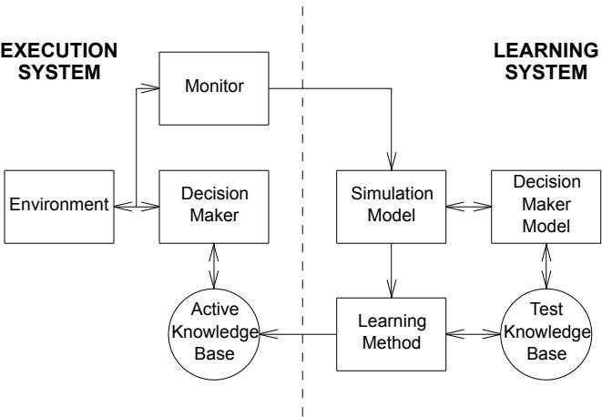
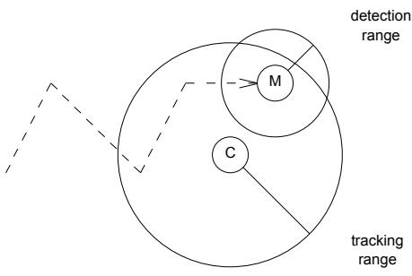
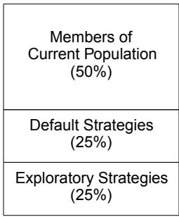
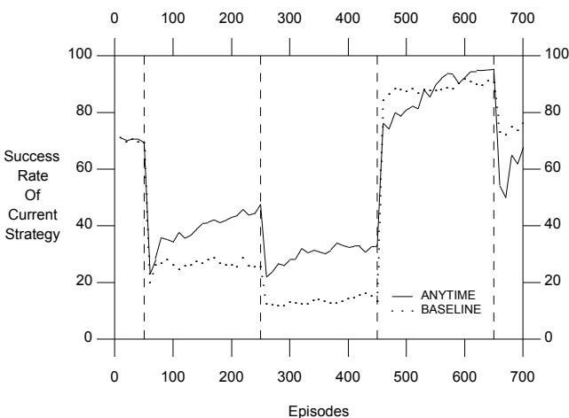

# An Approach to Anytime Learning

John J. Grefenstette and Connie Loggia Ramsey Navy Center for Applied Research in Artificial Intelligence Naval Research Laboratory Washington, DC 20375-5000

# Abstract

Anytime learning is a general approach to continuous learning in a changing environment. The agent’s learning module continuously tests new strategies against a simulation model of the task environment, and dynamically updates the knowledge base used by the agent on the basis of the results. The execution module controls the agent’s interaction with the environment, and includes a monitor that can dynamically modify the simulation model based on its observations of the environment. When the simulation model is modified, the learning process is restarted on the modified model. The learning system is assumed to operate indefinitely, and the execution system uses the results of learning as they become available. An experimental study tests one of the key aspects of this design using a two-agent cat-and-mouse game as the task environment.

# 1 INTRODUCTION

An intelligent robot will need extensive knowledge to interact effectively with its external environment. The acquisition of this knowledge is likely to present a significant challenge to the widespread deployment of intelligent robots. This challenge also represents an important opportunity for machine learning. Several previous studies have explored different methods for automating knowledge acquisition for intelligent robots, each approach typically depending on different assumptions about what is already known about the task environment. If the robot’s task environment is well understood, it may be most efficient to depend largely on a preprogrammed model of the environment, and to use learning to improve efficiency and reactivity (Laird et al., 1991). If the effects of the robot’s actions can not be easily predicted but there are only a few important state variables that affect the robot’s decisions, the robot might use an internal model to accelerate its learning of stateaction mappings (Sutton, 1990). If the environment is assumed to exhibit perpetual novelty, it might be useful to enable the robot to learn a wide variety of cognitive structures based on low-level perceptual stimuli (Booker, 1988). The key issue is not necessarily how complex the environment is, but how easy it is to provide the robot with the knowledge it needs, given the available knowledge we have. Some decision-making environments may be quite complex, e.g., the space shuttle, but may have fairly accurate models already available. How might an intelligent agent use these models to acquire the knowledge it needs to perform its tasks?

We will focus on learning in environments which have a partial model available in the form of a simulation of the task environment. We will assume that the simulation provides enough fidelity to evaluate the likely effectiveness of some course of action, but that the environment is too complex to be modeled by an efficient, completely faithful, deterministic simulation that could be used by a traditional AI planner. For example, in the case considered in our empirical study, the task involves a probabilistic, continuous environment with other agents. Other complexities may include sensor noise, uncertainties about the future actions of other agents in the environment, and uncertainties about the effects of the agent’s own actions.

This study is motivated in part by the widespread availability of simulation models currently in use, especially in the area of training for human operators. For example, there exist many flight simulators in which a pilot can practice maneuvers. The more sophisticated simulators include other computer-simulated agents (e.g., other planes, ships, etc.). Many aspects of such simulators, such as weather conditions, terrain characteristics, even the skill levels of the other simulated pilots, are usually parameterized to allow a range of training experiences, or to model probabilistic events. Besides training simulators, there are simulators that have been used to evaluate rule-based systems prior to deployment in an operational setting (Fogarty, 1989). Both training simulators and testing simulators usually include an evaluation mechanism for the decisions made during the simulation run. The goal of this study is to examine ways to utilize these simulations as sources for knowledge acquisition for intelligent agents.

Machine learning with simulators has been explored by Goldberg (1983) in the area of gas pipeline control, and by Buchanan et al. (1988) to learn error classification rules for particle beam accelerators. Our approach explores the effect of permitting the learning system to modify the simulation based on its experience with the operational environment.

We call the approach anytime learning to emphasize its relationship to recent work on anytime planning and scheduling (Dean and Boddy, 1988; Zweben, Deale and Gargan, 1990). The basic characteristics of anytime algorithms, as outlined by Dean and Boddy, are: (1) the algorithm can be suspended and resumed with negligible overhead, (2) the algorithm can be terminated at any time and will return some answer, and (3) the answers returned improve over time. Actually, the definition of an anytime algorithm is essentially the same as the familiar notion of iterative optimization algorithms. While it may be considered novel to use iterative improvement techniques in planning and scheduling, the application of iterative improvement methods such as genetic algorithms or reinforcement methods has a long history in machine learning.

However, our use of the term anytime learning is meant to denote a particular way of integrating execution and learning. The basic idea is to integrate two continuously running modules: an execution module and a learning module. The agent’s learning module continuously tests new strategies against the simulation model, and updates the knowledge base used by the agent on the basis of the results. The execution module controls the agent’s interaction with the environment, and includes a monitor that can dynamically modify the simulation model based on its observations of the environment. When the simulation model is modified, the learning process is restarted on the modified model. The learning system is assumed to operate indefinitely, and the execution system uses the results of learning as they become available.

This work is part of an ongoing investigation of machine learning techniques for sequential decision problems. The SAMUEL learning system employed in this study has been described in detail elsewhere (Cobb and Grefenstette, 1991; Gordon, 1991; Grefenstette, 1991; Grefenstette, Ramsey and Schultz, 1990; Schultz, 1991). SAMUEL is a system for learning reactive strategies expressed as condition-action rules, given a simulation model of the environment. It uses a modified genetic algorithm, applied to sets of symbolic reactive rules, to generate increasingly competent strategies. SAMUEL has successfully learned strategies for a number of multiagent tasks, including evading attackers, tracking other agents at a distance, and dogfighting. While the basic ideas of anytime learning could be applied using a number of other learning methods, especially other reinforcement learning methods (Barto, Sutton and Watkins, 1990), SAMUEL has some important advantages for this approach. The ability of SAMUEL to learn rapidly from partially correct strategies and with limited fidelity simulation models has been established by previous studies (Schultz and Grefenstette, 1990; Ramsey, Schultz & Grefenstette, 1990). We believe that these features make SAMUEL especially well-suited for anytime learning.

The remainder of the paper is organized as follows: Section 2 presents some of the fundamental issues in the design of an anytime learning system. Section 3 describes an empirical study with a particular instantiation of the anytime learning approach, applied to a twoagent cat-and-mouse task. Section 4 contains a summary and outlines directions for further work.

# 2 AN ARCHITECTURE FOR ANYTIME LEARNING

An architecture for anytime learning is shown in Figure 1. The system consists of two main components, the execution system and the learning system. The execution system includes a decision maker that controls the agent’s interaction with the external environment based on its active knowledge base, or current strategy. The learning system attempts to provide the execution system with an improved strategy by experimenting with alternative strategies on a simulation model of the environment.

  
Figure 1: Anytime Learning System

There are two forms of communication between the execution system and the learning system. First, the learning system notifies the execution system when it finds what appears to be a more desirable strategy, based on tests performed on the simulation model. When the execution system receives such notification, it replaces its current strategy with the new strategy. The second form of communication occurs when the monitor module in the execution system notifies the learning system that the simulation model needs to be adjusted. The monitor’s task is to determine when its observations of the environment conflict with the simulation model and what adjustments should be made in the model to accommodate the observations.1 The learning system responds to a notice from the monitor by adjusting the simulation model, and possibly restarting the learning process.

There are several fundamental decisions that will affect the performance of an anytime learner. The success of this approach clearly depends on the proper design of the simulation. The simulation designer must identify those aspects of the environment that are initially uncertain or subject to change or drift. The designer must parameterize these aspects so that the actual observed values are within the space described by the parameters, and, finally, design procedures for measuring the parameters in the environment. Parameters can have qualitative or quantitative values, and might be expressed as numeric ranges, or as probability distributions. Typical parameters include the speed and maneuverability of other agents, maps of the environment, the weight of objects that the agent must manipulate, or the probability distribution for certain events. In all cases, the monitor must have some way to measure the appropriate values in the environment. Measurement might be direct, through appropriate sensors, or might be indirect, through experiments or computations applied to sensor data. The selection of simulation parameters is a crucial decision, and encapsulates much of the domain knowledge available to the simulation designer. Selection or definition of new simulation parameters is not being considered as a learning task in this paper.2

The implementation of anytime learning also requires two policies for updating the learning model. First, the conditions for restarting the learning system must be selected. There are two important sources of information for the monitor to consider in deciding that the simulation model fails to fit the environment: parameter observations and performance observations. The monitor can compare measurable aspects of the environment with the parameters provided by the simulation design. The monitor might also detect differences between the expected and actual performance of the current strategy in the environment.3 For example, if the performance level degrades in the environment, that is a sign that the current strategy is no longer applicable. If the performance of the current strategy improves unexpectedly, it may indicate that the environment has changed, and that another strategy may perform even better.

Second, a policy for how to re-initialize the learning system must be specified. The range of options for restarting the learning system depends largely on the particular learning method being used. Some learning methods may require a complete restart when the simulation model changes, and others may permit a more graceful adaptation. For example, if a feed-forward neural net learning method is being used, it may be difficult to decide which weights should be modified when the model changes, and a complete restart may be required. As the case study will show, the population-based competition in a genetic learning system provides a convenient mechanism for changing the behavior of the learning system without completely starting over.

# 3 A CASE STUDY

This section describes an initial case study using the anytime learning architecture. We begin by describing the task environment, the execution system and the learning system. This is followed by the experimental design and a discussion of the results.

# 3.1 TASK ENVIRONMENT

The task used in this case study is a two-agent game of cat-and-mouse. The tracker agent, playing the role of the cat, must learn to keep the mouse agent, or target, within a certain distance, called the tracking distance, as shown in Figure 2. The target (the mouse) follows a random course and speed. The learning agent has a set of sensors, namely: time (since the beginning of the episode), lastturn (by the agent), bearing (direction to target’s position), heading (relative direction of target’s motion), speed (of the target), and range (to the target). Each sensor has fairly large granularity. That is, the mapping from the true world state to observed world state is many-toone. The sensors are also noisy, and may report incorrect values. The tracker must learn to control both its speed and its direction. It is assumed that the tracker has sensors that operate at a greater distance than the target’s sensors.

  
Figure 2: Cat-and-Mouse Task

The object is to keep the target within range of the tracker’s sensors, without being detected by the target. The usual behavior of the target agent is a random walk, occasionally changing its speed and direction. However, if the target detects the tracker, the target immediately flees the area at high speed. The target can only detect the tracker if the tracker is within the detection radius of the target. Furthermore, when the tracker is within the detection radius of the target, the probability of detection depends upon both the tracker’s speed and distance from the target. The tracker does not initially have any information concerning the relationship between its behavior and its probability of detection by the target. In particular, the tracker does not know the detection radius or the range of speeds that the target might assume. For further details, see (Grefenstette, 1992).

The task is broken down into individual tracking episodes. Each episode begins with a random placement of the two agents, and lasts for 20 time steps. At the end of each episode, the critic provides full payoff if the tracker keeps the target within tracking distance for $7 5 \%$ of the episode. Otherwise, the tracker’s partial payoff is equal to the portion of time that it tracks the target.

While this particular task may be easy enough to yield to traditional analysis, it is representative of the kinds of uncertain environments in which a learning agent might be useful. And in fact, the environment can be made much more complex by adding additional agents on both sides, taking fuel constraints into account, and so on.

# 3.2 EXECUTION SYSTEM

In SAMUEL the execution system’s knowledge base is a reactive strategy consisting of a set of situation-response rules. The execution system interacts with the external environment through a process of reading its sensors, finding rules in its strategy that match (or partially match) the current sensors, resolving conflicts among the rules in the match set, and selecting an action based upon the selected rules (possibly constrained by other knowledge sources).

Since these experiments were performed using a simulation model in the role of the external environment, as well as in the learning system, it was necessary to make some assumptions about the relative speeds of the execution and learning systems. In general, it is safe to assume that anytime learning will only be used when the simulation model of the environment can be run faster than real-time. In this study, the execution system was restricted to execute one episode for every 1000 episodes executed in the learning simulation model. This is based on an assumption that an episode in the real environment would take about two minutes of real time. Since this is probably an optimistic assumption for real robotic agents, the 1000-to-1 relative speed of the learning simulator is actually a fairly conservative estimate.

# 3.3 LEARNING SYSTEM

A number of learning systems are compatible with the anytime learning approach. This study builds on our previous experience with SAMUEL, a system that uses competition-based machine learning to develop reactive strategies. The operation of SAMUEL has been described in detail in the literature (Grefenstette, Ramsey and Schultz, 1990; Grefenstette, 1991). Space permits us only to mention some of the features that make SAMUEL an appropriate method for anytime learning. SAMUEL is specifically designed for reactive agents whose perception facilities are limited to a fixed set of discrete, possibly noisy, sensors. SAMUEL allows a fixed set of control variables that may be set by the decision making agent. The system’s decision rules are limited to simple condition/action rules of the form

In this case study, the monitor focuses on a single aspect of the environment, the speed distribution of the target agent. In the simulation model, when the target changes direction, the speed of the target is selected from a normal distribution. The mean and standard deviation of the speed distribution are two parameters of the simulation model. The monitor’s task is to measure how well the observed speeds of the target in the environment match the current distribution assumed in the simulation model. Using the 50 most recent samples of the target’s speed, the monitor computes the observed mean and variance of these samples, and compares the observed values with the current simulation parameters, using the F-test to compare the variances and the t-test to compare the means. If either statistical test fails, the monitor changes the simulation parameters to reflect the observed mean and variance of the target speed, and notifies the genetic algorithm to restart. The monitor considers only parameter changes when deciding whether to restart the learning system.4

where each $c _ { i }$ is a condition on one of the sensors and each action $a _ { j }$ specifies a setting for one of the control variables. A reactive strategy in SAMUEL comprises a set of such decision rules.

The knowledge base in SAMUEL can be initialized with strategies that provide a minimal level of competence on the performance tasks (Schultz and Grefenstette, 1990). SAMUEL improves its reactive strategies through the application of competition at two levels. First, SAMUEL maintains a population of alternative strategies. These strategies compete with one another using a genetic algorithm (Holland, 1975), as follows: Each strategy in the current population is evaluated on a number of tasks from the problem domain (typically, 20 tasks in the experiments described here). As a result of these evaluations, strategies with high performance are selected and recombined, using idealized genetic operators such as CROSSOVER and MUTATION, producing plausible new strategies for the next iteration. Second, at the rule level, each rule is assigned a strength that estimates its utility on the basis of its record of past payoff (Grefenstette, 1988). Conflict resolution is implemented as a probabilistic competition among rules based on rule strength. Low strength rules are eventually deleted to make room for variants of current hypothesis outperforms (in the simulation model) the execution system’s current strategy (in the operational environment), the execution system accepts the learning system’s strategy as its new current strategy.

# 3.4 EXPERIMENTAL DESIGN

The experiments were designed to explore how well the anytime learning system can respond to changing environmental conditions, in this case the speed distribution of the target agent. During the experiments, the speed distribution of the target agent varied according to the schedule in Table 1.

higher strength rules. Plausible variants of high strength rules may be introduced by traditional learning operators such as SPECIALIZE and GENERALIZE (Grefenstette, 1991).

Figure 3: Population when Resetting the Learning System   
Table 1: Environmental Distribution of Target Speeds   

<table><tr><td rowspan=1 colspan=1>Episodes</td><td rowspan=1 colspan=1>Mean Target Speed</td><td rowspan=1 colspan=1>Std. Dev.</td></tr><tr><td rowspan=1 colspan=1>1-50</td><td rowspan=1 colspan=1>250</td><td rowspan=1 colspan=1>33.3</td></tr><tr><td rowspan=1 colspan=1>51 - 250</td><td rowspan=1 colspan=1>400</td><td rowspan=1 colspan=1>10.0</td></tr><tr><td rowspan=1 colspan=1>251 - 450</td><td rowspan=1 colspan=1>450</td><td rowspan=1 colspan=1>10.0</td></tr><tr><td rowspan=1 colspan=1>451 - 650</td><td rowspan=1 colspan=1>50</td><td rowspan=1 colspan=1>16.6</td></tr><tr><td rowspan=1 colspan=1>651 - 700</td><td rowspan=1 colspan=1>250</td><td rowspan=1 colspan=1>33.3</td></tr></table>

When the learning system receives a restart notice from the monitor, it begins by formulating a new initial population for the genetic algorithm. The initial population represents the system’s initial set of hypothetical strategies for the new environment. In this study, we form the initial population from three classes of strategies, as shown in Figure 3. First, half of the strategies in the current population are chosen to survive intact. This provides a bias in favor of the assumption that the new environment is essentially similar to the previous one. Second, part of the population is initialized with default strategies that are known to perform well against a broad range of speed values for the target, centered on its medium speed setting. The default strategies will provide useful starting points for the learner if the environment is changing from an extreme special case back to what the simulation designer considered a more normal case. Finally, part of the population is initialized with strategies that generate essentially random behavior by the tracker. These strategies will provide useful starting points for the genetic algorithm if the environment is changing in a direction that has not been encountered before. This restart policy illustrates the advantage of the population-based approach used by the genetic algorithm: it allows the learning system to hedge its bets, since the competition among the strategies in the population will quickly eliminate the strategies that are not appropriate for the new environment, and will converge toward the appropriate strategies.

We will refer to the various environmental conditions by giving the mean and standard deviation for the speed distributions. The (250, 33.3) distribution in the first and last segments of the run is considered the normal case for this task. During the second segment, the target agent assumes relatively high speeds of (400, 10.0), making the tracking task much more difficult. This is followed by a similar, but even more difficult, distribution of (450, 10.0). During the fourth segment, the target assumes a distribution of (50, 16.6) that is radically different from the previous case, but should be relatively simple since the target is moving so slowly. The final segment returns to the normal case.

In order to test the anytime learning design, we performed a lesion study, disabling the key element in the feedback loop between the execution system and the learning system, namely, the monitor module. This study allows us to test the following hypothesis:

Dynamically modifying the simulation model will accelerate learning in a changing environment.

Strategies are selected by the learning system for use by the execution system, as follows: The genetic algorithm in SAMUEL evaluates each strategy by measuring the performance of the given strategy when solving tasks on the simulation model. At periodic intervals (10 generations in the current experiments), a single strategy is extracted from the current population to represent the learning system’s current hypothetical strategy.5 If the

We performed two separate series of runs. In the baseline runs, the monitor was disabled. The learning system ran continuously using the normal case distribution of (250, 33.3) for the entire course of the run. Whenever the learning system found a strategy that tested better on the simulation model, it passed the new strategy to the execution system for use against the environment. In the anytime learning runs, the monitor was enabled, and updated the simulation model whenever it detected statistically significant changes in the observed speed distribution. Whenever the learning system found a strategy that tested better than the current performance of the active strategy, it updated the strategy of the execution system.

Note that, in a broad sense, even the baseline system is an anytime algorithm. The experiment described here focuses on testing the effectiveness of the closed-loop form of the anytime learning approach.

# 3.5 RESULTS AND COMMENTS

The experimental comparison between the baseline run and the anytime learning runs is shown in Figure 4. The vertical lines indicate the points at which the environment changes, as shown in Table 1. The anytime learning performance is shown as the solid graph. The baseline learning performance is shown as the dotted graph. The graphs were generated as follows: During each run of the system, the strategy used during each 10-episode block by the execution system was stored, and later tested on 1000 randomly selected episodes, using the same environment that it encountered during the run. Each data point in the graphs represents the average performance of a strategy over these 1000 episodes. The data was averaged over 5 independent sets of runs for each of the baseline and the anytime learning experiments.

Since the baseline learning system received no feedback about the changes in the environment, the performance declined significantly when the more difficult speed distributions arose. The performance of the anytime learning system also declined initially during the first two environmental shifts, but, unlike the baseline system, made significant progress in re-learning against the new environments. Also note than when the environment returned to the normal case at the end of the experiment, the baseline learning system exhibited an advantage over the anytime learner. This is to be expected, since the baseline learner continued to concentrate its efforts on learning improved strategies against the normal case throughout the run. Obviously, the value of monitoring the environment will be most significant when the operational environment fails to meet the simulation designer’s initial assumptions.

The most promising aspects of the results are that, within each of the epochs after an environmental change, the anytime learning system consistently improves the performance of the execution system over the course of the epoch. Of course, the anytime learning system pays a price in terms of the initial part of each epoch, when the learning system is restarted. Additional refinement of the restart policy can be expected to reduce the initial cost of relearning. And, the longer the epochs last, the greater the expected benefit of anytime learning will be.

A $t$ -test between corresponding points on the two graphs indicates a statistically significant difference at the 0.95 level at nearly every point, with the exception of the region between 500 and 600 generations, where the two graphs cross. In all three cases of evironmental change, the anytime learning run eventually achieves a significantly better performance than the baseline run. Based on this data, we are justified in accepting the hypothesis that the mechanisms in the anytime learning system outperform the baseline system on this changing

  
Figure 4: Anytime Learning vs. Baseline Learning

environment.

# 4 SUMMARY

The contribution of this paper is to examine one approach to dividing the total learning effort between the execution and learning systems. The particular approach presented here assumes that there is a simulation model available for learning, and that environmental changes can be accommodated by changing the simulation parameters. If the complexity and uncertainty about the environment prevents the use of look-up tables, and the environment changes slowly with respect to the speed of the learning system, the approach to anytime learning based on the SAMUEL architecture is promising. This approach has been designed to scale up to cases in which several environmental variables are changing simultaneously.

Many of the particular decisions we made during this initial study require further explorations. Some of the major issues to address include:

• The restart policy. This study considered only parameter differences between the observed environment and the simulation model. Performance triggers, e.g., when a strategy does not perform as well in the operational environment as in the learning simulation, should also be incorporated.

• The re-initialization policy for the learning system. Case-based approaches for initializing the population might also be considered. For example, given a new set of simulation parameters, initialize the population with strategies from the most similar previously learned cases. This approach has been considered in other genetic learning systems (Zhou, 1990).

• More sophisticated monitors. It might be interesting to design the monitor so that it could detect when the simulation cannot be brought into sufficient agreement with the observed environment. It would be useful for the system to indicate when extensive re-programming of the simulation model is required.

As simulation technology improves, it will become possible to provide autonomous systems with high fidelity simulations of environments whose complexity or uncertainty precludes the use of traditional knowledge engineering methods. This study provides further evidence that machine learning techniques may enable the design of high performance autonomous agents that learn through interactions with a simulation of the task environment. Further developments along these lines can be expected to reduce the manual knowledge acquisition effort required to build intelligent robotic systems with expert performance in complex domains.

# Список литературы

Barto, A. B., R. S. Sutton and C. Watkins (1990). Learning and sequential decision making. In Learning and computational neuroscience, M. Gabrial and J. W. Moore, eds., Cambridge: MIT Press.   
Booker, L. B. (1988). Classifier systems that learn internal world models. Machine Learning 3(2/3), 161-192. Buchanan, B. G., J. Sullivan, T. P. Cheng and S. H. Clearwater (1988). Simulation-assisted inductive learning. Proceedings Seventh National Conference on Artificial Intelligence. (pp. 552-557).   
Cobb, H. G. and J. J. Grefenstette (1991). Learning the persistence of actions in reactive control rules. Proceedings of the Eighth International Machine Learning Workshop (pp. 293-297). Evanston, IL: Morgan Kaufmann,   
Dean, T. and M. Boddy (1988). An analysis of timedependent planning. Proceedings of the Seventh National Conference on AI (AAAI-88). (pp. 49-54). St. Paul, MN: Morgan Kaufmann.   
Fogarty, T. (1989). The machine learning of rules for combustion control in multiple burner installations. Proceedings of the Fifth IEEE Conference on AI Applications (pp. 215-221).   
Goldberg, D. E. (1983). Computer-aided gas pipeline operation using genetic algorithms and machine learning, Doctoral dissertation, Department Civil Engineering, University of Michigan, Ann Arbor.   
Gordon, D. F. (1991). An enhancer for reactive plans. Proceedings of the Eighth International Machine Learning Workshop (pp 505-508). Evanston, IL: Morgan Kaufmann.   
Grefenstette, J. J. (1988). Credit assignment in rule discovery system based on genetic algorithms. Machine Learning 3(2/3), 225-245.   
Grefenstette, J. J. (1991). Lamarckian learning in multiagent environments. Proceedings of the Fourth International Conference of Genetic Algorithms (pp 303-310). San Diego, CA: Morgan Kaufmann. Grefenstette, J. J. (1992). The evolution of strategies in multi-agent environments. Adaptive Behavior 1(1).   
Grefenstette, J. J., C. L. Ramsey and A. C. Schultz (1990). Learning sequential decision rules using simulation models and competition. Machine Learning 5(4), 355- 381.   
Hart, D. M., S. Anderson and P. R. Cohen (1990) Envelopes as a vehicle for improving the efficiency of plan execution. Proceedings of a Workshop on Innovative Approaches to Planning, Scheduling and Control (pp. 71-76). San Diego: Morgan Kaufmann.   
Holland, J. H. (1975). Adaptation in natural and artificial systems. Ann Arbor: University Michigan Press. Howe, A. E. and P. R. Cohen (1990). Responding to environmental change. Proceedings of a Workshop on Innovative Approaches to Planning, Scheduling and Control (pp. 85-92). San Diego: Morgan Kaufmann.   
Laird, J. E., E. S. Yager, M. Hucka and C. M. Tuck (1991). Robo-Soar: An integration of external interaction, planning, and learning using Soar. Robotics and Autonomous Systems 8(1-2) 113-129.   
Ramsey, C. L., A. C. Schultz and J. J. Grefenstette (1990). Simulation-assisted learning by competition: Effects of noise differences between training model and target environment. Proceedings of Seventh International Conference on Machine Learning (pp 211-215). Austin, TX: Morgan Kaufmann.   
Schultz, A. C. (1991). Using a genetic algorithm to learn strategies for collision avoidance and local navigation. Proceedings of the Seventh International Symposium on Unmanned, Untethered Submersible Technology (pp 213-225). Durham, NH.   
Schultz, A. C. and J. J. Grefenstette (1990). Improving tactical plans with genetic algorithms. Proceedings of IEEE Conference on Tools for AI 90 (pp 328-334). Washington, DC: IEEE.   
Sutton, R. S. (1990). Integrated architectures for learning, planning, and reacting based on approximating dynamic programming. Proceedings of the Seventh International Conference on Machine Learning (ML-90), Porter, B. W. and R. J. Mooney, eds., (pp 216-224). Austin, TX: Morgan Kaufmann.   
Truxal, J. (1961). Indentification of process dynamics, in Adaptive Control Systems, 51-90, E. Mishkin and L. Braun, eds., McGraw-Hill.   
Zhou, H. H. (1990). CSM: A computational models of cumulative learning. Machine Learning 5(4), 383-406. Zweben, M., M. Deale and R. Gargan (1990). Anytime rescheduling. Proceedings of a Workshop on Innovative Approaches to Planning, Scheduling and Control (pp. 251-259). San Diego: Morgan Kaufmann.