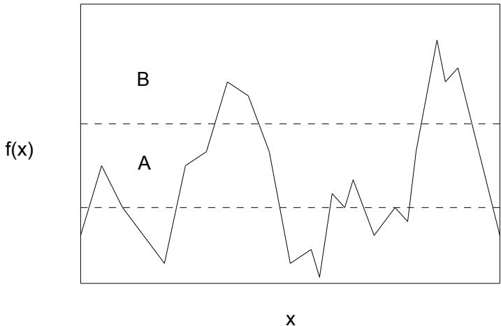
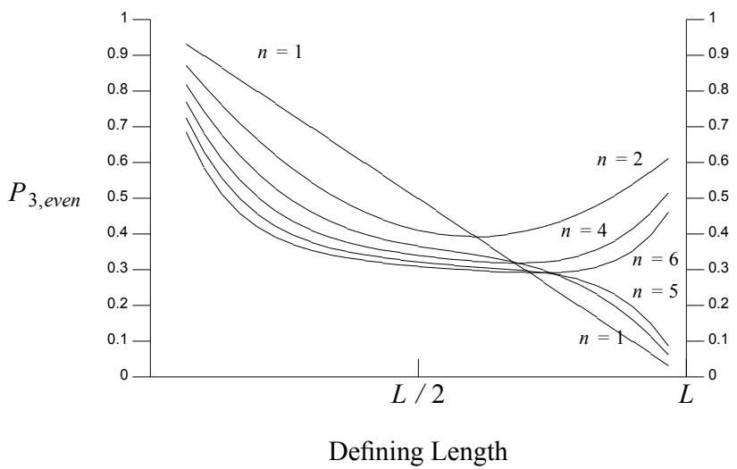
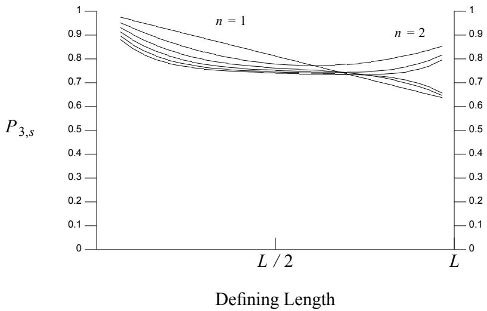

# Competition-Based Learning1

John J. Grefenstette, Kenneth A. De Jong, William M. Spears

Navy Center for Applied Research in Artificial Intelligence Information Technology Division Naval Research Laboratory Washington, DC 20375-5000

# Abstract

This paper summarizes recent research on competition-based learning procedures performed by the Navy Center for Applied Research in Artificial Intelligence at the Naval Research Laboratory. We have focused on a particularly interesting class of competition-based techniques called genetic algorithms. Genetic algorithms are adaptive search algorithms based on principles derived from the mechanisms of biological evolution. Recent results on the analysis of the implicit parallelism of alternative selection algorithms are summarized, along with an analysis of alternative crossover operators. Applications of these results in practical learning systems for sequential decision problems and for concept classification are also presented.

# INTRODUCTION

One approach to the design of more flexible computer systems is to extract heuristics from existing adaptive systems. We have focused on a class of learning systems that use competition-based procedures, called genetic algorithms (GAs). GAs are based on principles derived from one of the most impressive examples of adaptation available: the adaptation achieved by natural systems to their environment through the mechanisms of biological evolution. The principles were first elucidated in a computational framework by John Holland (1975). Holland’s analysis of natural adaptive systems shows that biological evolution embodies a sophisticated kind of generate-and-test strategy that rapidly identifies and exploits regularities in the environment. By extracting these processes from the specific context of genetics, the algorithms can be applied to a wide range of optimization and learning problems. GAs have in fact been applied successfully to routing and scheduling problems, machine vision, engineering design optimization, gas pipeline control systems, and others. In the area of machine learning, GAs have been used to learn rules for sequential decision problems as well as to learn classification rules from examples (De Jong, 1990). GAs have also been widely used for learning both the topology and the weights of neural nets.

Our research efforts for the past few years have fallen into two main categories: the analysis of genetic algorithms, and the application of genetic algorithms to machine learning problems. This article will focus primarily on recent progress in the analysis of genetic algorithms. The remainder of the article is organized as follows: The next section contains a brief tutorial on genetic algorithms. This is followed by two sections that outline recent progress in the analysis of two fundamental topics in the field: how knowledge structures are selected for reproduction, and how the selected structures are recombined to create new plausible knowledge structures. These sections are followed by a brief overview of our work in developing machine learning systems based on genetic algorithms. The final section describes the directions of current work.

# OVERVIEW OF GENETIC ALGORITHMS

Genetic algorithms are adaptive search procedures based on principles derived from the dynamics of natural population genetics. GAs are distinguished from other search methods by the following features:

• A population of structures that can be interpreted as candidate solutions to the given problem. • The competitive selection of structures for reproduction, based on each structure’s fitness as a solution to the given problem. • Idealized genetic operators that alter the selected structures in order to create new structures for further testing.

These features enable the GA to exploit the accumulating knowledge obtained during the search in such a way as to achieve an efficient balance between the need to explore new areas of the search space and the need to focus on high performance regions of the space. This section provides a general overview of a simple form of genetic algorithm. For more detailed

procedure $G A$   
begin $\mathrm { t } = 0 ;$ ; initialize P(t); evaluate structures in P(t); while termination condition not satisfied do begin $\mathbf { t } = \mathbf { t } + 1 \mathbf { \Omega }$ ; select P(t) from P(t-1); alter structures in P(t); evaluate structures in $\mathrm { P ( t ) }$ ; end   
end.

discussions, see (Holland, 1975; Goldberg, 1989).

A genetic algorithm simulates the dynamics of population genetics by maintaining a knowledge base of structures that evolves over time in response to the observed performance of its structures in their operational environment. A specific interpretation of each structure (e.g. as a collection of parameter settings, a condition/action rule, etc.) yields a point in the space of alternative solutions to the problem at hand, which can then be subjected to an evaluation process and assigned a measure called its fitness, reflecting its potential worth as a solution. The search proceeds by repeatedly selecting structures from the current knowledge base on the basis of fitness and applying idealized genetic search operators to these structures to produce new structures (ofspring) for evaluation. The basic paradigm is shown in Figure 1, and is explained in more detail below.

At iteration t, the GA maintains a population of structures $P ( t )$ representing candidate solutions to the given problem. Population $P ( 0 )$ may be initialized using whatever knowledge is available about possible solutions. In the absence of such knowledge, the initial population should represent a random sample of the search space. Each structure is evaluated and assigned a measure of its fitness as a solution to the problem at hand. When each structure in the population has been evaluated, a new population of structures is formed in two steps. First, structures in the current population are selected to be reproduced on the basis of their relative fitness. That is, high performing structures may be chosen several times for replication and poorly performing structures may not be chosen at all. In the absence of any other mechanisms, the resulting selective pressure would cause the best performing structures in the initial knowledge base to occupy a larger and larger proportion of the knowledge base over time.

Next the selected structures are altered using idealized genetic operators to form a new set of structures for evaluation. The primary genetic search operator is the crossover operator, which combines the features of two parent structures to form two similar ofspring. There are many possible forms of crossover. The simplest version operates by swapping corresponding segments of a string or list representation of the parents. For example, if the parents are represented by the lists:

$$
( a _ { 1 } ~ a _ { 2 } ~ a _ { 3 } ~ a _ { 4 } ~ a _ { 5 } ) ~ { \mathrm { a n d } } ~ ( b _ { 1 } ~ b _ { 2 } ~ b _ { 3 } ~ b _ { 4 } ~ b _ { 5 } )
$$

then crossover might produce the offspring

$$
( a _ { 1 } a _ { 2 } b _ { 3 } b _ { 4 } b _ { 5 } ) \mathrm { a n d } ( b _ { 1 } b _ { 2 } a _ { 3 } a _ { 4 } a _ { 5 } ) .
$$

Other forms of crossover operators have been defined for other representations (e.g., Whitley et al, 1989; Koza, 1989; Grefenstette, 1991b). Specific decisions as to whether both resulting structures are to be entered into the knowledge base, whether the precursors are to be retained, and which other structures, if any, are to be purged define a range of alternative implementations.

The crossover operator usually draws only on the information present in the structures of the current knowledge base in generating new structures for testing. If specific information is missing, due to storage limitations or loss incurred during the selection process of a previous iteration, then crossover is unable to produce new structures that contain it. A mutation operator, which alters one or more components of a selected structure, provides the means for introducing new information into the knowledge base. Again, a wide range of mutation operators have been proposed, ranging from completely random alterations to more heuristically motivated local search operators. In most cases, mutation serves as a secondary search operator that ensures the reachability of all points in the search space.

The power of the GA lies not in the testing of individual structures but in the efficient exploitation of the wealth of information that the testing of structures provides with regards to the interactions among the components comprising these structures. Specific configurations of component values observed to contribute to good performance (e.g. a specific pair of parameter settings, a specific group of rule conditions, etc.) are preserved and propagated through the structures in the knowledge base in a highly parallel fashion. This, in turn, forms the basis for subsequent exploitation of larger and larger such configurations. Intuitively, we can view these structural configurations as the regularities in the space that emerge as individual structures are generated and tested. Once encountered, they serve as building blocks in the generation of new structures. That is, GAs actually search the space of all feature combinations, quickly identifying and exploiting combinations that are associated with high performance. The ability to perform such a search on the basis of the evaluation of completely specified candidate solutions is called the implicit parallelism of GAs.

To summarize, the power of a GA derives from its ability to exploit, in a near-optimal fashion, information about the utility of a very large number of structural configurations without the computational burden of explicit calculation and storage. This leads to a focused exploration of the search space wherein attention is concentrated in regions that contain structures of above average utility. The knowledge base, nonetheless, is widely distributed over the space, insulating the search from susceptibility to stagnation at a local optima.

A great variety of genetic algorithms have been studied and compared. Often these comparisons take the form of empirical studies, but the generality of the results are often difficult to assess, since they usually depend on the particular characteristics of the search space. More analytic tools for comparison need to be developed. Our recent efforts have included new analyses of the fundamental components of genetic algorithms: the rules for selecting knowledge structures for reproduction, and the effects of various crossover operators. The following two sections describe our progress on these two topics.

# ANALYSIS OF SELECTION ALGORITHMS

One way to improve our understanding of genetic algorithms is to identify properties that are invariant across the many seemingly different versions of the algorithms. (Grefenstette, 1991a) focuses on invariances among genetic algorithms that differ along two dimensions: (1) the way the user-defined objective function is mapped to a fitness measure, and (2) the way the fitness measure is used to assign offspring to parents. The remainder of this section summarizes those results.

The process of reproducing knowledge structures in a genetic algorithm can be decomposed into four steps. First, each structure $x$ is evaluated according to an objective function $u ( x )$ that defines problem-specific criterion for success. Second, a fitness function is applied to the result of the evaluation to obtain $f ( x )$ , the fitness of $x$ . The range of $f$ must be a non-negative interval, and larger values of $f ( x )$ indicate more desirable solutions to the objective function.2 Third, a selection algorithm assigns a target number of offspring to each population member. Finally, a probabilistic sampling algorithm assigns to each member of the population an integer number of offspring. The first step is, of course, entirely problem dependent, and will not concern us further. For the final step, several sampling algorithms have been investigated, culminating in one called stochastic universal sampling by Baker (1987), which appears to provide an optimal sampling method. Accordingly, variations on the sampling algorithm will not concern us further. That leaves the middle two steps open for variations, and in fact, many variations are in current use. A short discussion of some of the major variants of fitness functions and selection algorithms will give a fair indication of the range of possibilities.

The fitness function maps the raw score of the objective function to a non-negative interval. Such a mapping is always necessary if the goal is to minimize the objective function, since higher fitness values correspond to lower objective function values in that case. More generally, the fitness function often serves to scale the raw values returned by the objective function in order to provide a high level of selective pressure. Scaling that accentuates small differences is especially desirable late in the search, when the variance in objective performance tends to diminish. One popular approach to scaling (Grefenstette, 1986) is to define the fitness function as a dynamic, linear transformation of the objective value:

$$
f ( x ) = a ( u ( x ) - b ( t ) )
$$

where $a$ is positive for maximization problems and negative for minimization problems, and $b ( t )$ represents the worst value seen in the last few generations. The trajectory of $b ( t )$ generally rises over time, providing greater selection pressure later in the search. This method is sensitive, however, to "lethals", i.e., poor performing individuals that may occasionally arise through crossover or mutation. A more robust method has been called sigma scaling (Goldberg, 1989):

$$
\begin{array} { c } { { f ( x ) = u ( x ) - ( \mu - c \tau ^ { * } \sigma ) \mathrm { ~ i f ~ } u ( x ) > ( \mu - c \tau ^ { * } \sigma ) } } \\ { { { } } } \\ { { f ( x ) = 0 \mathrm { ~ , ~ o t h e r w i s e . } } } \end{array}
$$

where $\mu$ is the mean objective function value of the current population and $\boldsymbol { \sigma }$ is the current population standard deviation. Sigma scaling provides a level of selective pressure that is sensitive to the spread of performance values in the population. Besides these two forms of fitness functions, many other variations have been proposed and implemented (Goldberg, 1989). We next consider variations in the selection phase.

The selection algorithm assigns an expected number of children $C ( x )$ to each population member $x _ { i }$ , based on the fitness values. The most widely used method is proportional selection, defined as:

$$
C ( x ) = f ( x ) / \overline { { f } }
$$

where $\overline { { f } }$ is the average fitness of the current population. This method was originally proposed and analyzed by Holland, who showed that it results in a nearly-optimal allocation of trials, under certain circumstances (Holland, 1975). In practice, this selection algorithm may lead to premature convergence, based on the unlimited number of offspring that may be assigned to "super individuals" that may arise early in a search (Baker, 1989). Other forms of selection are less brittle in this respect. For example, rank-based selection assigns offspring according to the formula:

$$
C ( x ) = a + b * r a n k ( x )
$$

where rank $( x )$ indicates the relative position of $x$ in the population, from 0 for the worst performer to 1 for the best, and $a$ and $^ { b }$ are constants chosen so that $a$ is the minimum number of offsping and $a { + } b$ is the maximum. Rankbased selection eliminates the problem of premature convergence to "super individuals" by providing a strict upper bound on the number of offspring assigned to any one member in a given generation. In practice, rank-based selection tends to provide a slower, steady rate of convergence than proportional selection. A final example is threshold selection in which all population members whose objective function falls below a (possibly time-varying) threshold are deleted, and the survivers are assigned an equal number of offspring to fill the vacated slots. These three examples should give an indication of the range of selection algorithms that have been explored in genetic algorithms. Understanding the similarities and differences between these options is a fundamental step toward a deeper understanding of genetic algorithms.

Given these two dimensions of variations in the design of genetic algorithms, we say that a genetic algorithm is admissible if it meets what appear to be the weakest reasonable requirements along these dimensions. We can then show that any admissible genetic algorithm exhibits a form of implicit parallelism, meaning that it allocates search effort in way that differentiates among a large number of competing areas of the search space on the basis of a limited number of explicit evaluations of knowledge structures. These results provide a sense of coherence to the field, in that commonalities are exposed among superficially different versions of the genetic algorithm. These results can also serve to spotlight the features which distinguish broad classes of genetic algorithms from one another.

A few definitions are required to make these ideas concrete. We say that a fitness function is monotonic if

$$
f ( x ) \leq f ( y ) i f f u ( x ) \leq u ( y )
$$

A fitness function is strictly monotonic if it is monotonic and

$$
u \left( x \right) < u \left( y \right) t h e n f \left( x \right) < f \left( y \right)
$$

That is, a monotonic fitness function does not reverse the sense of any pairwise ranking provided by the objective function. A strictly monotonic fitness function preserves the relative ranking of any two points in the search space with distinct objective function values. Referring to the examples mentioned earlier, the linear dynamic fitness function is strictly monotonic, but sigma scaling is monotonic but not strict, since it may assign zero fitness to knowledge structures that have different objective function values. A selection algorithm is monotonic if

$$
C ( x ) \leq C ( y ) i f f ( x ) \leq f ( y )
$$

A selection algorithm is strictly monotonic if it is monotonic and

$$
f ( x ) < f ( y ) t h e n C ( x ) < C ( y )
$$

A monotonic selection algorithms is one that respects the "survival-of-thefittest" heuristic. A strictly monotonic selection algorithm assigns a higher expectation of reproduction to more knowledge structures with more deserving fitness values. For example, proportional selection and rank selection are both strictly monotonic, whereas threshold selection is monotonic but not strict, since it may assign the same number of offspring to knowledge structures with different fitness values. Finally, we say that a GA is admissible if its fitness function and selection algorithm are both monotonic. A GA is strict iff its fitness function and selection algorithm are both strictly monotonic.

The main results in (Grefenstette, 1991a) relate the dynamic behavior of monotonic and strict genetic algorithms to the notion of partial domination of one set by another. Consider two arbitrary subsets of the solution space, $A$ and $B$ . Let the representatives of subset $A$ in the population at time $t$ be

$$
A \left( t \right) = < a _ { 1 } \ , a _ { 2 } \ , \ \cdot \ \cdot \ , a _ { n } >
$$

sorted3 such that $u \left( a _ { i } \right) \geq u \left( a _ { i + 1 } \right)$ for $1 \leq i < n$ . Let the representatives of subset $B$ at time $t$ be

$$
B ( t ) = < b _ { 1 } , b _ { 2 } , \cdots , b _ { n } >
$$

also sorted in order of decreasing $u$ . Finally, we say $B$ partially dominates $A$ $( A < _ { p } B )$ at time $t$ iff

$$
u \left( a _ { i } \right) \leq u \left( b _ { i } \right) { \mathrm { ~ f o r ~ } } 1 \leq i \leq n
$$

and at least one inequality is strict. Intuitively, if $A < _ { p } B$ , then $B$ is ‘‘better’’ than $A$ in the sense that each representative of $B$ is at least as good as the corresponding representative of $A$ .4 Given these definitions, it can be shown that if set A is partially dominated by set B within a given population, then the proportion of the population allocated to set B grows at least as fast as the proportion allocated to set A, in any admissible GA. Furthermore, in any strict GA, the proportion allocated to set B grows strictly faster than the proportion allocated to set A.

One illustration of this result is shown in Figure 2. Let set A be the points in the space with objective function values between the dotted lines. Let set B be the points in the space with objective values above the region between the dotted lines. Then, in any population that contains points from both set A and set B, the number of offspring allocated to B by any strict GA grows strictly faster than the number allocated to set A, since any subset of B dominates any subset of A. The effect of this strategy, compounded over succeeding generations, is that the search effort allocated to set B will grow exponentially faster than the search effort allocated to set A. This is a highly plausible heuristic, and in some cases is the optimal adaptive strategy (Holland, 1975). This example illustrates implicit parallelism because it holds no matter where the dotted lines are drawn. The contribution of this new analysis is to extend Holland’s original result, which applied only to a particular form of genetic algorithm, to the entire class of admissible genetic algorithms. The result is independent of the precise fitness function or selection algorithm, as long as they satisfy the requirement of admissibility (or strictness). These results provide new insights into the common characteristics of genetic search algorithms.

  
Figure 2: Two Regions Defined by Range of Objective Values

# ANALYSIS OF CROSSOVER

The analysis in the previous section refers exclusively to the distribution of search effort resulting from the selection, or reproduction, phase of the genetic algorithm. The selection phase is followed by operations that create modified structures from the selected parent structures. There are usual two distinct forms of structural alteration: crossover and mutation. Crossover refers to operations in which pairs of selected knowledge structures exchange information, producing new structures that inherit similarities from both parents. In contrast, mutation operations apply to individual structures to create small variations in the newly formed structures. Without crossover and mutation, the population in a genetic algorithm would quickly converge to multiple copies of the most fit structure in the initial population. With crossover and mutation, genetic algorithms combine the focus of attention, or exploitation, provided by selection with exploration of new structures created by these idealized genetic operators. In order to gain a complete picture of the operation of a genetic algorithm, it is necessary to complement our previous analysis of the selection phase with an analysis of the effects of the crossover and mutation operators on the search. Since mutations generally play a relatively minor role as a background search operator in genetic algorithms, our recent efforts have focused on the more dominant crossover operators.

As in the case of fitness functions and selection algorithms, there have been an interesting variety of crossover operators developed for genetic algorithms. Traditionally, genetic algorithms have relied upon 1-point or 2- point crossover operators. Many recent empirical studies, however, have shown the benefits of higher numbers of crossover points. Syswerda (1989) introduced a "uniform" crossover operator in which the allele (i.e., gene value) of any position in an offspring was determined by a random selection from the corresponding alleles of the two parents. He provided an initial analysis of the disruptive effects of uniform crossover, and compared it with both 1-point and 2-point crossover. He presented some provocative results suggesting that, in spite of higher disruption properties, uniform crossover can exhibit better recombination behavior, which can improve empirical performance. One of the goals of our analysis has been to better understand the effects of these various crossover operators.

Holland (1975) provided the initial formal analysis of the behavior of GAs by characterizing how they bias the makeup of new offspring in response to feedback on the fitness of previously generated individuals. More specifically, let $H$ be a hyperplane in the representation space. For example, if the structures are represented by six binary features, then the hyperplane denoted by $H = 0 \# 1$ ### consists of all structures in which the first feature is absent and the third feature is present. The order of a hyperplane is the number of features that are defined as either 0 or 1. For example, the hyperplane $H$ specified above is a 2nd-order hyperplane. By focusing on hyperplane subspaces of $L$ -dimensional spaces, Holland showed that the expected number of samples (individuals) allocated to a particular kth order hyperplane $H _ { k }$ at time $t + 1$ is given by:

$$
m \left( H _ { k } , t + 1 \right) \geq m \left( H _ { k } , t \right) \ast \frac { f \left( H _ { k } \right) } { \overline { { f } } } \ast \left( 1 - P _ { m } k - P _ { c } P _ { d } ( H _ { k } ) \right)
$$

In this expression, _ $( H _ { k } )$ is the average fitness of the current samples allocated to $H _ { k } , { \overline { { f } } }$ is the average fitness of the current population, $P _ { m }$ is the probability of using the mutation operator, $P _ { c }$ is the probability of using the crossover operator, and $P _ { d } ( H _ { k } )$ is the probability that the crossover operator will be "disruptive" in the sense that the children produced will not be members of the same subspace as their parents. The usual interpretation of this result is that subspaces with higher than average payoffs will be allocated exponentially more trials over time, while those subspaces with below average payoffs will be allocated exponentially fewer trials. This assumes that there are enough samples to provide reliable estimates of hyperplane fitness, and that the effects of crossover and mutation are not too disruptive. The effects of mutation are generally insignificant in practice and may be neglected in a first-order analysis. Considerable attention has been given to estimating $P _ { d }$ , the probability that a particular application of crossover will be disruptive.

Holland (1975) provided a simple and intuitive analysis of the disruption of 1-point crossover: as long as the crossover point does not occur within the defining boundaries of $H _ { k }$ (i.e., in between any of the $k$ fixed defining positions), the children produced from parents in $H _ { k }$ will also reside in $H _ { k }$ . De Jong (1975) extended this analysis to $n$ -point crossover by noting that no disruption can occur if there is an even number of crossover points (including 0) between each of the defining positions of a hyperplane. De Jong’s original analysis applied to the special case of 2nd-order hyperplanes, i.e., hyperplanes with exactly two defining positions. This analysis was extended by Spears and De Jong (1991a) to arbitrary higher-order hyperplanes. A result of the general analysis for the particular case of 3rd-order hyperplanes is shown in Figure 3. The term $P _ { 3 , e \nu e n }$ is the probability there is an even number of crossover points (including 0) between each of the defining positions of a 3rd-order hyperplane. The number of crossover points is indicated by $n$ . These results show that by choosing an even number of crossover points, we can reduce the representational bias of crossover, in the sense that the influence of defining length on the disruption of hyperplanes declines as the number of crossover points increases. However, this reduction in bias comes at the expense of increasing the disruption of the shorter definition length hyperplanes. If we interpret the area above a particular curve as measure of the cumulative disruption potential of its associated crossover operator, then these curves suggest that 2-point crossover is the best as far as minimizing disruption. This confirms De Jong’s original analysis, and much of the standard practice in the field.

  
Figure 3: $P _ { k , e v e n }$ on 3rd-Order Hyperplanes

This line of analysis may be overly conservative in the sense that it assumes a worst case scenario: the parents are assumed to be complementary strings, differing at every position along the chromosome. As a result, the $P _ { k , e v e n }$ curves are very weak bounds on $P _ { d }$ . A more realistic bound on the disruption caused by crossover requires a better estimate of the true disruption probability $P _ { d }$ . The primary reason for the weakness of the $P _ { k , e v e n }$ bound is that it ignores the fact that many of the cases in which an odd number of crossover points fall between hyperplane defining positions are not disruptive to the sampling process. This occurs whenever the second parent happens to have identical alleles on the hyperplane defining positions which are exchanged by "odd" crossovers. (Note that an "odd" crossover occurs when an odd number of crossover points falls within two adjacent defining positions of the hyperplane.) Deriving an expression for the probability that both parents will share common alleles on the defining positions of a particular hyperplane is difficult in general because of the complexity of the population dynamics. We can, however, get a feeling for the effects of shared alleles on disruption by making the following simplifying assumption: the probability $P _ { e q }$ of two parents sharing an allele is constant across all loci. With this assumption we can generalize $P _ { k , e v e n }$ to $P _ { k , s }$ (i.e., the probability of survival ) by including "odd" crossovers which are not disruptive. Figure 4 shows the effects of counting the non-disruptive "odd" crossovers, assuming a value of $P _ { e q } = 0 . 5$ , which is likely to hold in the early generations when matches are least likely. Note that the amount of expected disruption has been significantly reduced, compared to Figure 3, and the relative difference in disruption among different numbers of crossover points is reduced as well. At the same time, note that the curves for the various number of crossover points have held their relative position with respect to one another.

  
Figure 4: $P _ { k , s }$ on 3rd-Order Hyperplanes with $P _ { e q } = 0 . 5$

In (Spears and De Jong, 1991b), a similar analysis is applied to uniform crossover. The results show that, as expected, uniform crossover eliminates all representational bias, yielding a horizontal line in graphs like Figure 4. The precise location of the line depends upon $P _ { 0 }$ , the probability of swapping at any one position. The higher the value of $P _ { 0 }$ , the lower the horizontal curve in Figure 4 and the higher the rate of disruption. A value of $P _ { 0 } = 0 . 2$ can be shown to produce roughly the same overall disruption as 2- point crossover. In summary, this analysis highlights three important properties of uniform crossover. The first is the ease with which the disruptive effect of uniform crossover can be precisely controlled by varying $P _ { 0 }$ . The second important property is that the disruptive potential of uniform crossover is independent of the defining length of hyperplanes. This allows uniform crossover to perform equally well, regardless of the distribution of important genes. Finally, when disruption does occur, it can be shown (De Jong and Spears, 1992) that uniform crossover results in a minimally biased exploration of the search space. We are currently extending these results toward a more complete theory for recombination operators. Our goal is to understand these interactions well enough to design genetic algorithms that can make adaptive decisions about the proper balance between exploration and exploitation.

# MACHINE LEARNING WITH GENETIC ALGORITHMS

We have been using the powerful adaptive search strategies embodied in genetic algorithms to design and implement a variety of performanceoriented learning systems. The general context is one in which the environment defines one or more tasks to be performed, and the learning problem involves both skill acquisition (how to perform a task) and skill refinement (improving task performance). The approach taken is to identify a set of structures which control the performance aspects of the system, and to use a genetic algorithm to search the space of admissible structures to find ones that result in good performance on the tasks to be learned.

The projects described in the following sections fall into two general categories based on the space of admissible structures being searched. The SAMUEL and GABIL systems search the space of admissible production rules for sets of rules which solve difficult sequential decision problems and concept classification tasks. The applications of GAs to NP-complete problems and neural networks takes a more parameterized system point of view. Here the performance of the problem solved is controlled by a fixed set of predefined parameters, and GAs are used to search the associated parameter space for combinations of parameters which result in good performance. Each of these projects is described in more detail in the following sections.

# Competition-Based Learning for Sequential Decision Tasks

When the behavior of a rule-based system can be tested in a simulated environment, it becomes possible to consider generating and testing sets of rules off-line before they are used in the real task domain. The behavior of a set of rules can be monitored in a simulation to discover any weaknesses or inadequacies. We are investigating techniques that allow a learning system to actively explore alternative behaviors in simulation, and to construct high performance rules from this experience. If we can design a payof function that quantitatively measures the performance of the system with a given rule set, we can then view the learning process as a heuristic optimization problem, i.e., a search through a space of knowledge structures looking for structures that lead to high performance. Our research is currently focused on learning rules for a variety of tactical scenarios, using genetic algorithms as the method for exploring the space of possible rule sets.

Our approach has been implemented in a system called SAMUEL (Grefenstette and Cobb, 1991). The primary features of SAMUEL are:

• A restricted but high level rule language;   
• Partial matching;   
• Utility-driven conflict resolution;   
• Numeric credit assignment at the level of individual rules; and • Genetic learning at the level of rule sets.

The system is described in detail in (Grefenstette, Ramsey and Schultz, 1990). We have experimented with SAMUEL on a variety of tasks involving multiple-agent environments, including evading a predator, stalking a prey, and dog-fighting. SAMUEL has been able to learn high performance strategies for each of these tasks. In this section, we will briefly describe a number of recent studies on this approach. The reader is referred to the published articles for more complete details.

The foundations for SAMUEL can be traced to the analysis of the credit assignment problem in (Grefenstette, 1988). The credit assignment problem arises when long sequences of rules fire between successive external rewards. It can be shown that the two distinct approaches to rule learning with genetic algorithms each offer a useful solution to a different level of the credit assignment problem. Analytic and experimental results are presented that support the hypothesis that multiple levels of credit assignment, at both the levels of the individual rules and at the level of rule sets, can improve the performance of rule learning systems based on genetic algorithms. These multiple levels are both present in SAMUEL.

One focus of our experimental work has been the robustness the rules learned in simulated environments. Robustness can be measured by testing the learned rules in new environments that have been systematically altered from the simulation environment in which the rules were learned. For example, either the learning environment or the target environment may contain noise. Experiments reported in (Ramsey, Schultz, and Grefenstette, 1990) examine the effect of learning tactical plans without noise and then testing the plans in a noisy environment, and the effect of learning plans in a noisy simulator and then testing the plans in a noise-free environment. Empirical results show that, while best results are obtained when the training model closely matches the target environment, using a training environment that is more noisy than the target environment is better than using a training environment that has less noise than the target environment.

One of the interesting aspects of SAMUEL is that it employs a symbolic, attribute-value rule language, rather than the low-level representations adopted by many genetic algorithm-based systems. The use of a symbolic rule language in SAMUEL is intended to facilitate the incorporation of traditional machine learning methods into the system where appropriate. The rule language in SAMUEL also makes it easier to incorporate existing knowledge, whether acquired from experts or by symbolic learning programs. In (Schultz and Grefenstette, 1990), the use of available heuristic domain knowledge to initialize the population to produce better plans is investigated, and two methods for initialization of the knowledge base are empirically compared. These results provide an interesting contrast with most published work on genetic algorithms, which usually assume tabula rasa initial conditions. The results presented here show that genetic algorithms can be used to improve partially correct decision rules, as well as to learn rules from scratch.

The use of a high-level language also facilitates the explanation of the learned rules. Gordon (1991a, 1991b) describes a method for improving the comprehensibility, accuracy, and generality of reactive plans learned by genetic algorithms. The method involves two phases: (1) formulate explanations of execution traces, and (2) generate new reactive rules from the explanations. The explanation phase involves translating the execution trace of a reactive planner into an abstract language, and then using Explanation Based Learning to identify general strategies within the abstract trace. The rule generation phase consists of taking a subset of the explanations and using these explanations to generate a set of new reactive rules to add to the original set for the purpose of performance improvement. The particular subset of the explanations that is chosen yields rules that provide new domain knowledge for handling knowledge gaps in the original rule set. The original rule set, in a complimentary manner, provides expertise to fill the gaps where the domain knowledge provided by the new rules is incomplete.

Genetic algorithms gain much of their power from mechanisms derived from the field of population genetics. However, it is possible, and in some cases desirable, to augment the standard mechanisms with additional features not available in biological systems. In (Grefenstette, 1991b), we examine the use of Lamarckian learning operators in the SAMUEL architecture. The operators are Lamarckian in the sense that strategies are modified through the addition or deletion of rules, based on the experience of the strategy in the test environment. These changes are then passed along as "genetic material" to subsequent generations of strategies. The use of this mechanism is illustrated on three tasks in multi-agent environments.

Cobb and Grefenstette (1991) explore the effect of explicitly searching for the persistence of each decision in a time-dependent sequential decision task. Prior studies showed the effectiveness of SAMUEL in solving a simulation problem where an agent learns how to evade a predator that is in pursuit. In the previous work, an agent applies a control action at each time step. This paper examines a reformulation of the problem: the agent learns not only the level of response of a control action, but also how long to apply that control action. By examining this problem, the work shows that it is appropriate to choose a representation of the state space that compresses time information when solving a time-dependent sequential decision problem. By compressing time information, critical events in the decision sequence become apparent.

We have begun to apply the SAMUEL approach to more complex learning environments. In (Schultz, 1991), SAMUEL is used to learn highperformance reactive strategies for navigation and collision avoidance. The task domain requires an autonomous underwater vehicle to navigate through a randomly generated, dense mine field and then rendezvous with a stationary object. The vehicle has a limited set of sensors, including sonar, and can set its speed and direction. The strategy that is learned is expressed as a set of reactive rules, (i.e. stimulus-response rules) that map sensor readings to actions to be performed at each decision time-step. Simulation results demonstrate that an initial, human-designed strategy which has an average success rate of only eight percent on randomly generated mine fields can be improved by this system so that the final strategy can achieve a success rate of 96 percent. This study provides encouraging evidence that this approach to machine learning may scale up to realistic problems. We will continue to advance these techniques, with the intention of exploring possible applications to laboratory robots and Navy research vehicles in the near future.

# Genetic Algorithms for Concept Learning

Genetic algorithms (GAs) have traditionally been used for non-symbolic learning tasks. In (Spears and De Jong, 1990a) we consider the application of a GA to a symbolic learning task, supervised concept learning from examples. A GA concept learner (GABIL) is implemented that learns a concept from a set of positive and negative examples. The performance of the system is measured on a set of concept learning problems and compared with the performance of two existing systems: ID5R and C4.5. Preliminary results support that, despite minimal system bias, GABIL is an effective concept learner and is quite competitive with ID5R and C4.5 as the target concept increases in complexity. In (Spears and Gordon, 1991) we identify strategies responsible for the success of these concept learners. We then implement a subset of these strategies within GABIL to produce a multistrategy concept learner. Finally, this multistrategy concept learner is further enhanced by allowing the GAs to adaptively select the appropriate strategies.

# GA and Neural Nets

Genetic algorithms and neural nets (NNs) have been used as heuristics for some NP-Complete problems. Unfortunately, the results have been mixed because NP-Complete problems are not equivalent with respect to how well they map onto NN (or GA) representations. The Traveling Salesman Problem is a classic example of a problem that does not map naturally to either NNs or GAs. Suppose we are able to identify an NP-complete problem that has an effective representation in the methodology of interest (GAs or NNs) and develop an efficient problem solver for that particular case. Other NPcomplete problems which do not have effective representations can then be solved by transforming them into the canonical problem, solving it, and transforming the solution back to the original one. Spears and De Jong (1990b) outline GA and NN paradigms that solve boolean satisfiability (SAT) problems, and uses Hamiltonian circuit problems to illustrate how either paradigm can be used to solve other NP-Complete problems after they are transformed into equivalent SAT problems. Initial empirical results are presented which indicate that although both paradigms are effective for solving SAT problems, the GA paradigm may be superior for more complex boolean expressions.

Recently, genetic algorithms have been used to design neural network modules and their control circuits. In these studies, a genetic algorithm without crossover outperformed a genetic algorithm with crossover. Spears and Anand (1991) re-examine these studies, and conclude that the results were caused by an inadequate population size. New results are presented that illustrate the effectiveness of crossover when the population size is adequate.

# CURRENT DIRECTIONS

Each phase of the research described here has suggested areas for further study. The analysis of the effects of the fitness function and selection algorithms have addressed only the broadest differences among the alternatives. Future analysis could focus on the issue of sensitivity of the fitness functions and selection algorithms. For example, genetic algorithms with linear fitness functions and proportional selection are highly sensitive to the objective function. That is, large differences in objective function values are reflected as large differences in growth rates. The use of dynamic scaling fitness functions reducing sensitivity. Rank-based selection schemes reduce sensitivity to the objective function even more. Empirical studies have shown a general correlation between convergence and sensitivity that should be explored in a more formal setting. It is not clear that more sensitivity is necessarily better. Given that genetic algorithms will often be used to optimize a surface with unknown properties, the genetic algorithm designer should be prepared to use algorithms with the appropriate sensitivity for the application at hand. We conjecture that, given appropriate formal definitions of sensitivity, theorems similar to those in (Grefenstette, 1990b) could be developed to characterize the searches performed by various sub-classes of admissible genetic algorithms distinguished by the sensitivity of the selection algorithm.

We will continue the analysis of crossover by focusing in "construction theory", the dual to the disruption theory reported here. Construction theory refers to the analysis of how effectively various crossover operators can build more elaborated structures from the patterns existing in the population. Understanding the constructive effects of crossover is a key element in understanding genetic algorithms.

Our machine learning applications of genetic algorithms will continue to explore the use of traditional, symbolic machine learning operators (e.g., specialization, generalization, etc.) as mutation operators within the genetic framework of SAMUEL. The approach is currently being tested on more challenging, multi-agent tasks, including tasks that require the cooperative efforts of several learning agents. Based on the rate of progress to date, we expect to see continued progress toward the development of practical machine learning systems that exploit the power of genetic algorithms.

# ACKNOWLEDGMENTS

The authors acknowledge the contributions to this project by the other members of the Machine Learning Group at NRL: Helen Cobb, Diana Gordon, Connie Ramsey, and Alan Schultz.

# Список литературы

Baker, J. E. (1987). Reducing bias and inefficiency in the selection algorithm. Proceedings of the Second International Conference Genetic Algorithms and Their Applications (pp. 14-21). Cambridge, MA: Erlbaum.   
Baker, J. E. (1989). Analysis of the ef ects of selection in genetic algorithms, Doctoral dissertation, Department of Computer Science, Vanderbilt University, Nashville.   
Cobb, H. G. and J. J. Grefenstette (1991). Learning the persistence of actions in reactive control rules. Proceedings of the Eighth International Machine Learning Workshop (pp. 293-297). Evanston, IL: Morgan Kaufmann,   
De Jong, K. A. (1975). An analysis of the behavior of a class of genetic adaptive systems. Doctoral dissertation, Department of Computer and Communication Sciences, University of Michigan, Ann Arbor.   
De Jong, K. A. (1990). Genetic-algorithm-based learning. In Machine Learning: An artificial intelligence approach, Vol. 3, Y. Kodratoff and R. Michalski (eds.), Morgan Kaufmann.   
De Jong, K. A. and W. M. Spears (1992). A formal analysis of the role of multi-point crossover in genetic algorithms. Annals of Mathematics and

Artificial Intelligence.

Goldberg, D. E. (1989). Genetic algorithms in search, optimization, and machine learning. Reading: Addison-Wesley.   
Gordon, D. F. (1991a). An enhancer for reactive plans. Proceedings of the Eighth International Machine Learning Workshop (pp. 505-508). Evanston, IL: Morgan Kaufmann.   
Gordon, D. F. (1991b). Improving the comprehensibility, accuracy, and generality of reactive plans. Proceedings of the Sixth International Symposium on Methodologies for Intelligent Systems (pp. 358-367). Charlotte, NC: Springer-Verlag.   
Grefenstette, J. J. (1986). Optimization of control parameters for genetic algorithms. IEEE Transactions on Systems, Man, and Cybernetics, SMC-16(1), 122-128.   
Grefenstette, J. J. (1988). Credit assignment in rule discovery system based on genetic algorithms. Machine Learning 3(2/3), 225-245.   
Grefenstette, J. J. (1991a). Conditions for implicit parallelism. In Foundations of Genetic Algorithms, G. J. E. Rawlins (ed.), Bloomington, IN: Morgan Kaufmann.   
Grefenstette, J. J. (1991b). Lamarckian learning in multi-agent environments. Proceedings of the Fourth International Conference of Genetic Algorithms (pp. 303-310). San Diego, CA: Morgan Kaufmann.   
Grefenstette, J. J. and H. G. Cobb (1991). User’s guide for SAMUEL, Version 1.3. NRL Memorandum Report 6820. Washington, DC.   
Grefenstette, J. J., C. L. Ramsey and A. C. Schultz (1990). Learning sequential decision rules using simulation models and competition. Machine Learning 5(4), 355-381.   
Holland, J. H. (1975). Adaptation in natural and artificial systems. Ann Arbor: University of Michigan Press.   
Koza, J. R. (1989). Hierarchical genetic algorithms operating on populations of computer programs. Proceedings of the 11th International Joint Conference on Artificial Intelligence. San Mateo, CA: Morgan Kaufmann.   
Ramsey, C. L., A. C. Schultz and J. J. Grefenstette (1990). Simulationassisted learning by competition: Effects of noise differences between training model and target environment. Proceedings of Seventh International Conference on Machine Learning (pp. 211-215). Austin, TX:

Morgan Kaufmann.

Schultz. A. C. (1991). Using a genetic algorithm to learn strategies for collision avoidance and local navigation. Proceedings of the Seventh International Symposium on Unmanned, Untethered Submersible Technology (pp. 213-225). Durham, NH.   
Schultz, A. C. and J. J. Grefenstette (1990). Improving tactical plans with genetic algorithms. Proceedings of IEEE Conference on Tools for AI 90 (pp. 328-334). Washington, DC: IEEE.   
Spears, W. M. and V. Anand (1991). A study of crossover operators in genetic programming. Proceedings of the Sixth International Symposium on Methodologies for Intelligent Systems (pp. 409-418). Charlotte, NC: Springer-Verlag.   
Spears, W. M. and K. A. De Jong (1990a). Using genetic algorithms for supervised concept learning. Proceedings of IEEE Conference on Tools for AI 90 (pp. 335-341). Washington, DC: IEEE.   
Spears, W. M. and K. A. De Jong (1990b). Using neural networks and genetic algorithms as heuristics for NP-complete problems. International Joint Conference on Neural Networks (pp. 118-121). Washington D.C: Lawrence Erlbaum Associates.   
Spears, W. M. and K. A. De Jong (1991a). An analysis of multi-point crossover. In Foundations of Genetic Algorithms, G. J. E. Rawlins (ed.), Bloomington, IN: Morgan Kaufmann.   
Spears, W. M. and K. A. De Jong (1991b). On the virtues of parameterized uniform crossover. Proceedings of the Fourth International Conference of Genetic Algorithms (pp. 230-236). San Diego, CA: Morgan Kaufmann.   
Spears, W. M. and D. F. Gordon (1991). Adaptive strategy selection for concept learning. Proceedings of the Workshop on Multistrategy Learning (pp. 231-246). Harpers Ferry, WV: George Mason University.   
Syswerda, G. (1989). Uniform crossover in genetic algorithms. Proceedings of the Third International Conference on Genetic Algorithms (pp. 2-9). Fairfax, VA: Morgan Kaufmann.   
Whitley, D., T. Starkweather and D. Fuquay (1989). Scheduling problems and traveling salesmen: The genetic edge recombination. Proceedings of the Third International Conference on Genetic Algorithms (pp. 133- 141). Fairfax, VA: Morgan Kaufmann.