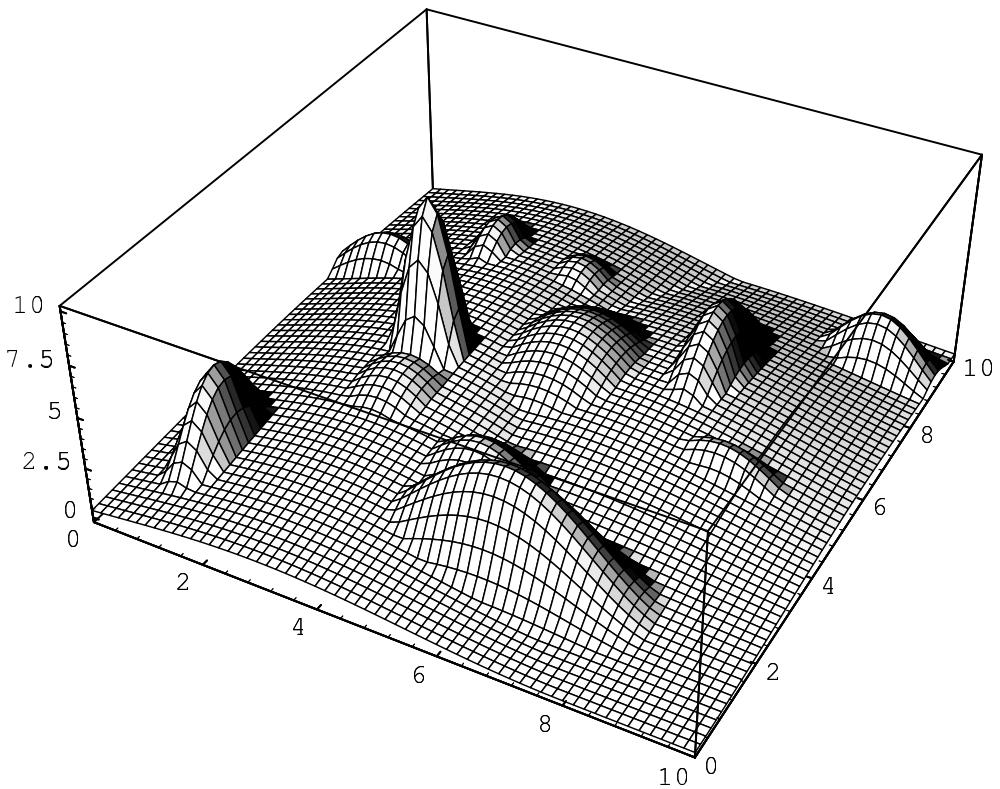
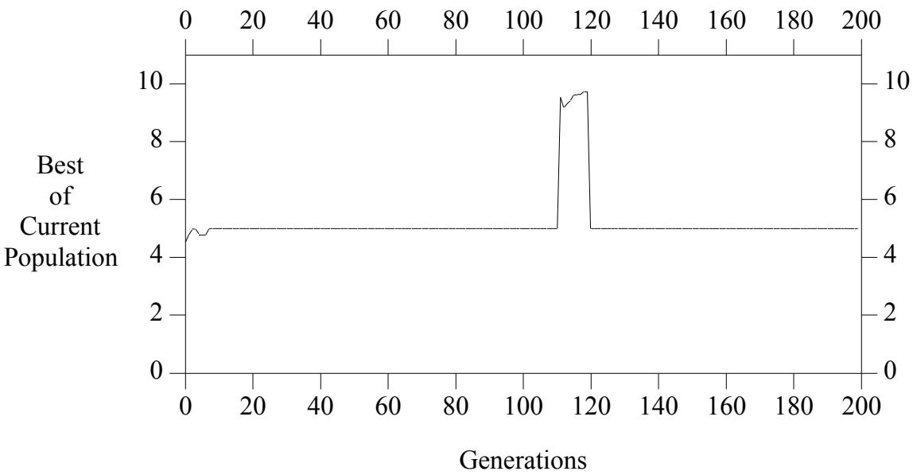
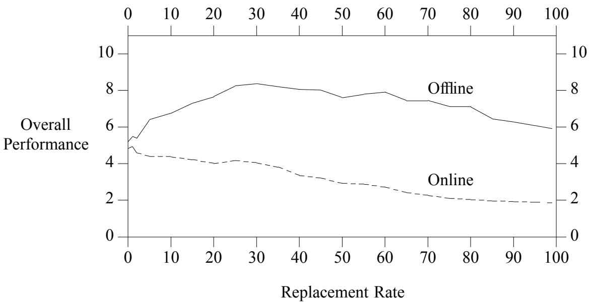
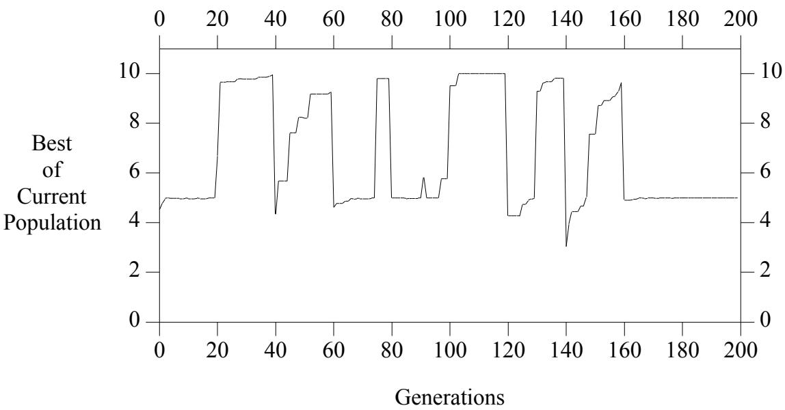
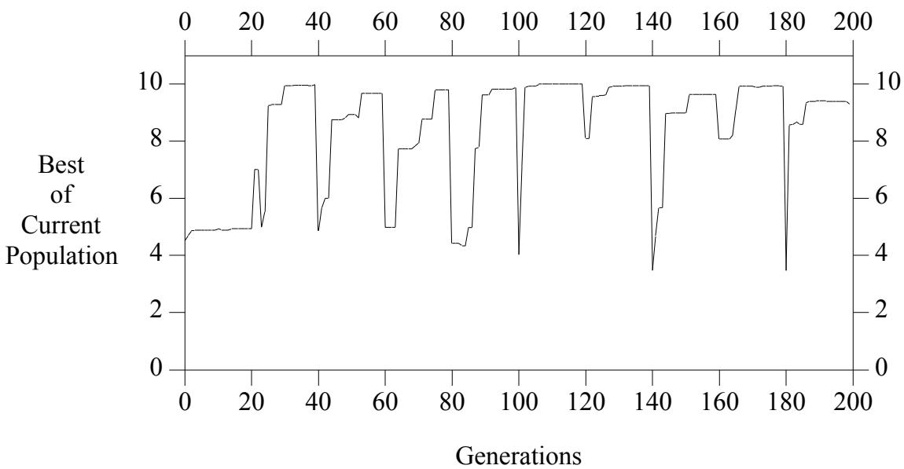
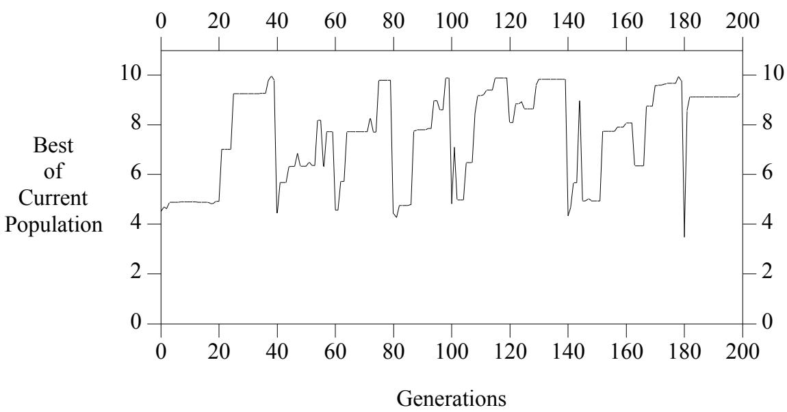

# Genetic algorithms for changing environments

John J. Grefenstette

Navy Center for Applied Research in Artificial Intelligence, Naval Research Laboratory, Washington, DC 20375, USA gref@aic.nrl.navy.mil

# Abstract

Genetic algorithms perform an adaptive search by maintaining a population of candidate solutions that are allocated dynamically to promising regions of the search space. The distributed nature of the genetic search provides a natural source of power for searching in changing environments. As long as sufficient diversity remains in the population the genetic algorithm can respond to a changing response surface by reallocating future trials. However, the tendency of genetic algorithms to converge rapidly reduces their ability to identify regions of the search space that might suddenly become more attractive as the environment changes. This paper presents a modification of the standard generational genetic algorithm that is designed to maintain the diversity required to track a changing response surface. An experimental study shows some promise for the new technique.

# 1. INTRODUCTION

Genetic algorithms (GAs) have been shown to be a useful alternative to traditional search and optimization methods, especially for problems with highly complex and ill-behaved objective functions. A key element in a genetic algorithm is that it maintains a population of candidate solutions that evolves over time. The population allows the genetic algorithm to continue to explore a number of regions of the search space that appear to be associated with high performance solutions. Much of the analysis of genetic algorithms has been concerned with the so called implicit parallelism of genetic search, meaning that many alternative subspaces are dynamically sampled in parallel, resulting in an efficient use of the information implicit in the evaluation of the members of the population (Holland, 1975). The distributed nature of the genetic search should provide a natural source of power for searching in changing environments. As long as the population remains distributed over the search space, there is good reason to expect the genetic algorithm to adapt to changes in the objective function by reallocating future search effort toward whatever region of the search space is currently favored by the objective function. However, the natural tendency of genetic algorithms to converge rapidly reduces their ability to identify regions of the search space that become more attractive over time. In this paper, we consider a modification to a standard GA that may provide improved search performance in changing environments.

There are many examples of applications in which the objective function may change over time. For example, suppose we are using a genetic algorithm to optimize the fuel mixture for a jet engine, based on the measurement of the engine output. The mapping from fuel mixture to engine output might change gradually due to the degradation of component parts over time, or might change rapidly due to a part failure. As another example, we have developed a machine learning system based on genetic algorithms for learning the strategy for one player in a multiplayer game (Grefenstette, Ramsey and Schultz, 1990). However, the objective function, e.g., the performance of the learning player, may change over time due to changes in strategies by the opposing players.

There have been several previous studies that have addressed the use of genetic algorithms in changing environments. Goldberg and Smith (1987) study the behavior of genetic algorithms on a two-state response surface, and show that genetic diploidy with dominance can store sufficient information to handle certain forms of non-stationary environments. This approach, however, does not appear to scale up to more general cases. Pettit and Swigger (1983) present an early study of GAs in a randomly fluctuating environment, but their study provides limited insights due to the extremely small population size adopted. Likewise, Krishnakumar (1989) uses a genetic algorithm with a very limited population to track a rapidly changing response surface. The current paper explores some of Krishnakumar’s ideas for maintaining diversity, but in the context of a much larger population.

Cobb (1990) has proposed a simple adaptive mutation mechanism called triggered hypermutation to deal with continuously changing environments. Cobb’s approach is to monitor the quality of the best performers in the population over time. When this measure declines, it is a plausible indicator that the environment has changed. Hypermutation then essentially restarts the search from scratch. The most attractive feature of this approach is that it is adaptive; for example, it emulates a standard GA in a stationary environment. However, as we note below, there are some classes of non-stationary environments that may fail to trigger the hypermutation, leaving the GA converged in a suboptimal area of the search space. We present one approach that may overcome some of these limitations.

The remainder of this paper is organized as follows: Section 2 contains a brief description of the genetic algorithm used in our study. This is a rather standard, generational, Holland-style genetic algorithm. Section 2 also presents a non-stationary objective function and illustrates the behavior of the standard GA on this function. Section 3 presents a modification to the standard GA, and shows its improved behavior on the non-stationary test case. The Conclusion discusses some directions for the further development of this topic.

# 2. A STANDARD GA ON A CHANGING ENVIRONMENT

This section focuses on the behavior of a standard genetic algorithm on a certain class of non-stationary environments. The GA used is shown in Figure 1. The details of this algorithm have been described in Grefenstette (1986).

To illustrate a problem that will cause problems for both the standard GA as well as Cobb’s triggered hypermutation, we consider a particular test function, shown in Figure 2. Keeping in mind that the goal here is only to illustrate some of the behavior of GAs on nonstationary environments, we have defined our particular example for ease of analysis, rather than as a representative of any particular application. The test function is defined on a two dimensional domain, namely the set $0 . 0 \leq x _ { i } \leq 1 0 . 0$ , for $i = 1 , 2$ , where each $x _ { i }$ has 20 bits of precision, giving a total search space of $2 ^ { 4 0 }$ points. The objective function is multi-modal and continuous, with 14 local optima scattered around the search space.

procedure GA   
begin $\mathrm { { t } = 0 ; }$ initialize P(t); evaluate structures in $\mathrm { P ( t ) }$ ; while termination condition not satisfied do begin $\mathbf { t } = \mathbf { t } + 1 { \boldsymbol { \mathbf { \mathit { \Phi } } } } _ { \mathbf { \mathit { \Phi } } }$ ; select P(t) from P(t-1); mutate structures in $\mathrm { P ( t ) }$ ; crossover structures in $\mathrm { P ( t ) }$ ; evaluate structures in P(t); end   
end.

The test function is non-stationary, with optima that change over time. The original optimum is at (6, 2) with a value of 5. After 20 generations, a new optimal peak appears with value 10. The new peak is replaced by another in a random location every 20 generations. The width of the new peak is selected at random, but the height remains constant (with value 10). The objective is to maximize the function, and maintain the maximum over time.

  
Figure 1: A genetic algorithm.   
Figure 2. A non-stationary test function.

The fact that the new optimum point is chosen at regular intervals is not relevant to the performance of the GA, since 20 generations is sufficient time for the GA to converge to the vicinity of the new optimum. The regularity was chosen only to ease the interpretation of the experimental data.

In all experiments, we adopt the following experimental parameters: the population size is 100, the crossover rate is 0.6, and the mutation rate is 0.001. Every member of the population is evaluated during each generation. We ran the GA for 200 generations.

We begin by executing the standard GA on the test function. Figure 3 shows the best current value for each generation.

  
Figure 3. Performance of standard GA on test function.

As expected, the GA quickly converges to the area near the original optimum at (6, 2) with value 5. The appearances of the first four new optimal peaks, at generations 20, 40, 60 and 80, go undetected by the GA, and it remains converged around the point (6, 2). At generation 100, a new optimum appears at (5.1, 2.1), and this is close enough to the original optimum that the GA is able to find points very close to the new optimum (at about generation 110). When the optimal peak moves away at generation 120, the GA is again left converged at the local optimum. Clearly the GA has converged too much for this kind of nonstationary environment.

Now consider how a GA that uses Cobb’s triggered hypermutation operator would perform on this kind of environment. Hypermutation would be triggered only when a change in the environment decreases the value of the best current population members. If the environment changes such that a new optimum appears in an area of the search space that is not currently represented in the population, then a GA with triggered hypermutation is unlikely to detect the environmental change, unless the objective function happens to degrade the value of the local optimum. In the example, the GA with hypermutation would behave the same as the standard GA for the first 120 generations. There would be no trigger for hypermutation until the performance degrades at generation 120. At that point, hypermutation would be triggered and could then probably track the moving optimum for the remainder of the run. However, the GA would not detect the optimal peaks that arise at generations 20, 40, 60 or 80. In general, the GA may not detect an environmental change for an arbitrarily long period, until a new optimum appears in close proximity to the current local optimum. In fact, one could construct a slightly more elaborate example, e.g., in which old peaks remain in place and each new optimum has a monotonically increasing value, that would never trigger hypermutation. Given these considerations, it seems useful to complement the standard GA with a mechanism for maintaining a healthy exploration of the search space. The next section shows one approach.

# 3. A MODIFIED GA

In order to promote a continuous exploration of the search space, we propose to augment the standard GA as follows: After the mutation step in Figure 1, we insert a partial hypermutation step, that replaces a percentage of the population by randomly generated individuals. The percentage replaced is called the replacement rate. The intended effect is to maintain a continuous level of exploration of the search space, while trying to minimize the disruption of the ongoing search.

In order to measure the effect of the replacement rate, we ran 23 modified GAs on the non-stationary test function, varying the percentage of the population subject to random replacement from 0 to 99 per cent. For each GA, we measured two aspects of the overall performance of each GA, its offline performance and its online performance (De Jong, 1975). The offline measure is the best value in the current population, averaged over the entire run (200 generations). The online performance is simply the average of all evaluations of the entire run. The results are shown in Figure 4. The offline performance indicates how well the GA tracked the moving optimum. Higher offline measures correspond to more successful tracking. Figure 4 shows that a replacement of $30 \%$ of the population by random points gives the best performance. The online performance measure shows the impact on the focus of the search. With higher replacement rates, the online measure steadily declines, as the GA becomes more like random search.

  
Figure 4. Performance of modified GAs on test function.

A more detailed comparison is shown in the next three figures. Figure 5 shows the performance of a modified GA with a $10 \%$ random replacement rate. Comparing this with the performance of the standard GA in Figure 3, it is clear that the modified GA tracks the moving optimum better than the standard GA.

  
Figure 5. GA with $10 \%$ replacement rate on test function.

Figure 6 shows that $30 \%$ replacement (solid line) gives even better tracking performance, as predicted by the offline performance measure shown in Figure 4. Figure 7, showing the result of $50 \%$ replacement, shows that too much random exploration can prevent the GA from quickly locating the optimum before it moves on. Thus, it is necessary to balance exploration and exploitation for non-stationary environments.

# 4. CONCLUSIONS

This paper is a preliminary look at a new way to modify the standard GA in order to make it more applicable to rapidly changing environments. Many important issues need to be examined in more detail. A more careful empirical study will need to consider a variety of non-stationary environments, including functions with optima that move through the search space in a more continuous fashion. Cobb (1990) presents a good discussion of different classes of non-stationarity. It would of interest to try to characterize classes of nonstationary environments that may be suitable to one approach over another. It would also be interesting to define a more adaptive form of random replacement, perhaps one that was sensitive to the rate of environmental change.

These first results show that the level of random replacement must be chosen to properly balance the need for exploration and focused search. It will be interesting to see if there is a level of random replacement that is generally useful across a variety of non-stationary functions. We need to more carefully consider the impact of random replacement on the online aspects of the search, especially with respect to performance on stationary environments. An alternative to the random replacement we propose here is to increase the overall mutation rate to maintain the require population diversity. We expect that a level of ordinary mutation that would produce an equivalent level of diversity would produce a more negative impact on online performance, but this needs to be verified experimentally.

  
Figure 6. GA with $30 \%$ replacement rate on test function.

  
Figure 7. GA with $50 \%$ replacement rate on test function.

One might also compare this approach with a variety of other genetic algorithms. For example, the PGA described by Muhlenbein (1990) could be applied to non-stationary environments, allowing various subpopulations to apply different levels of mutation. In this regard, our approach might be viewed as allowing a limited "migration" of fresh genes from another population in which there is a very high mutation rate. Future reports will consider these issues in more detail.

# Список литературы

Cobb, H. G. (1990). An investigation into the use of hypermutation as an adaptive operator in genetic algorithms having continuous, time-dependent nonstationary environment. NRL Memorandum Report 6760.   
De Jong, K. A. (1975). An analysis of the behavior of a class of genetic adaptive systems. Doctoral dissertation, University of Michigan   
Goldberg, D. E. and R. E. Smith (1987). Nonstationary function optimization using genetic dominance and diploidy. Proceedings of the Second International Conference on Genetic Algorithms, (pp. 59-68), Lawrence Erlbaum Associates.   
Grefenstette, J. J. (1986). Optimization of control parameters for genetic algorithms. IEEE Transactions on Systems, Man and Cybernetics 16(1), 122-128.   
Grefenstette, J. J., C. L. Ramsey and A. C. Schultz (1990). Learning sequential decision rules using simulation models and competition. Machine Learning 5(4), 355-381.   
Holland, J. H. (1975). Adaptation in natural and artificial systems. Ann Arbor: University Michigan Press.   
Krishnakumar, K. (1989). Micro-genetic algorithms for stationary and non-stationary function optimization. SPIE, Intelligent Control and Adaptive Systems, (pp. 289-296).   
Muhlenbien, H. (1990). Evolution in time and space: The parallel genetic algorithm. Foundation of Genetic Algorithms, (G. Rawlins, ed.), Morgan Kaufmann.   
Pettit, K. and E. Swigger (1983). An analysis of genetic based pattern tracking and cognitive-based component tracking models of adaptation. Proceedings of National Conference on AI (AAAI-83), (pp. 327-332), Morgan Kaufmann.