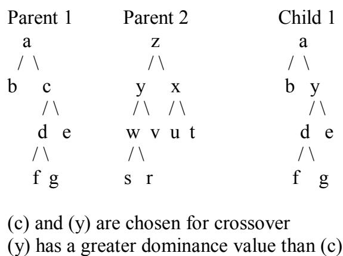
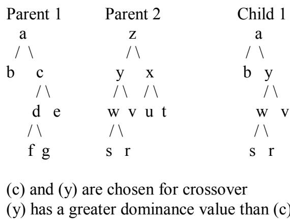

# Haploid Genetic Programming with Dominance

Kanta Vekaria and Chris Clack   
Department of Computer Science   
University College London   
Gower Street   
London WC1E 6BT   
United Kingdom   
Email: {K.Vekaria, C.Clack}@cs.ucl.ac.uk

[Departmental Research Note (RN/97/121)]

# Abstract

This paper presents a new crossover operator for genetic programming – dominance crossover. Dominance crossover is similar to the use of dominance in nature. In nature, dominance is used as a genotype to phenotype mapping when an organism carries pairs (or more than one) chromosome, but here we use dominance on a haploid structure. The haploid form contains all the information relevant to the problem, and is the structure that is widely used in evolutionary algorithms. Dominance crossover is used as a way of retaining and promoting successful genes (those which increased the individual’s fitness in the current generation) into the next generation. Current crossover operators fail to exploit knowledge acquired in previous generations and rely highly on selection pressures. Dominance crossover in theory allows this exploitation to occur during crossover but we highlight a problem with the application of dominance crossover with genetic programming.

# Introduction

Dawkin’s model of evolution is based on the gene. He presents his theory of the gene as the fundamental unit of natural selection [Dawk89]. Chromosomes have a life span of one generation but a genetic unit lasts for many generations, thus natural selection favours the genetic unit. Genetic material in complex organisms is often presented using diploid chromosomes. In the diploid form a genotype carries one or more pairs of chromosomes, each containing information for the same functions. The genes contained in one set can be regarded as a direct alternative to the genes in the other set. When building the body the genes in one set compete with those in the other set. Genes that are expressed in the phenotype of an organism are dominant and those that are not are recessive. The relationship between a dominant and recessive gene is not a simple binary relationship [Merr94]: some genes that have been known to be dominant have become more recessive in successive generations and vice versa. These dominance characteristics have evolved over generations and have been promoted via natural selection.

Much work (see next section) has been done to model diploidy and dominance in GA but dominance has not been used as an evolving factor for crossover on haploid structures. Assuming a correlation between program fitness and subtree fitness, an alternative method of crossover “Dominance Crossover” was proposed [VeCl97] for

GP. Dominance crossover is not what happens in nature although it extracts the same characteristics as used in nature. Dominance is used here during crossover in haploid structures rather than a genotype to phenotype mapping, it evolves over successive generations and these characteristics are promoted via selection pressures. In addition dominance is used to exploit knowledge acquired in previous generations.

# Diploidy and Dominance in GAs

Hollstien (1971) (in [Gold89]), $[ \mathrm { G o S m } 8 7 ]$ and most recently [HaEi97] have modelled diploidy or polyploidy and dominance in genetic algorithms. Hollstien’s (1971) work done on diploidy and dominance contained diploid genotypes. Each individual in the population carried a pair of chromosomes. A dominance map was proposed to map a diploid chromosome pair to a particular phenotype and the phenotype was used for fitness evaluation. He used a triallelic dominance map. His chromosomes were drawn up from the 3-alphabet $\{ 0 , 1 , 2 \}$ where both 2 and 1 map to a phenotype value of ' 1' (in the case of a binary functional gene), but 2 dominates 0 and 0 dominates 1. This results in a dominance map like this:

<table><tr><td></td><td>|0 1</td><td>2</td></tr><tr><td>0</td><td>0 0</td><td>1</td></tr><tr><td>1</td><td>0 1</td><td>1</td></tr><tr><td>2</td><td>1 1</td><td>1</td></tr></table>

The triallelic scheme allows dominance to evolve at each locus as the chromosomes are drawn from the 3-alphabet and hence 2 plays the role of a dominant $^ { \mathfrak { c } } 1 ^ { \mathfrak { d } }$ and 1 plays the role of a recessive $^ { \circ } 1 ^ { \circ }$ . Dominance shift (change) is handled like the mutation operator i.e. mapping a 2 to a 1 or vice versa. His scheme maintained better population diversity than his haploid simulations, but no improvement in average or ultimate performance.

Goldberg and Smith [GoSm87] concentrated on the role of dominance and diploidy as abeyance structures (shielding information that may be useful when situations change). They compared a haploid GA with a diploid GA, which used fixed dominance map (1' s dominate $0 ^ { \prime } \mathrm { ~ s ~ } _ { \prime }$ ) on a non-stationary knapsack problem. The simulations showed that the haploid GA could not track the oscillation whilst the diploid GA did to some extent. They then tried using the triallelic scheme for the diploid GA and this showed a vast improvement. This improvement was due to the fact that the triallelic scheme allowed dominance to evolve at each locus; hence the population was able to adapt more quickly to the change.

Hadad and Eick [HaEi97] showed that polyploidy (two or more sets of chromosomes) is beneficial for adapting to changing environment. They introduced an extra vector, the crossover control vector, which dictates where a chromosome can split to create gametes. These gametes are later combined to form another individual (similar to natural reproduction).

The diploid GA used dominance characteristics, where the dominance map was decided beforehand, thus the dominance was not used as an evolving characteristic, or as a way of promoting individual genes. The motivation behind the use of dominance with diploidy was as abeyance structures for changing environments. Here we use dominance, during crossover, to exploit knowledge acquired in previous generations to promote genes onto the next generation.

# Dominance Crossover in GP

The idea for dominance crossover was originally proposed in $[ \mathrm { V e C l 9 7 } ]$ and is described here in more depth. Genetic programming [Koza92] traditionally uses a haploid chromosome: the haploid form contains all the information relevant to the problem and the genes do not have associated dominance values.

With dominance crossover the parse tree contains the normal defined function and terminal sets. Each use of a function or terminal will have an associated dominance value. This dominance value will reflect how good each one is with respect to the fitness of the entire program. These dominance values are real numbers in the range [0,1] on initialisation but are increased (promoted) as described in the next section.

During crossover two parent trees are selected and the position for crossover is selected at random. Once the subtrees are chosen, the nodes from each subtree are compared, breadth first. The node with greater dominance is used to create a new subtree. This is a recursive process. In the case where one tree is greater than the other the remaining component in the larger tree is simply copied to the new subtree. This new subtree is then attached to the trees of the parent where crossover occurred. Figure 1 shows an example of dominance crossover. In dominance crossover a single subtree is created from the parents and is attached to the original parents at the point chosen for crossover, hence creating two children.

<table><tr><td rowspan="7">Parent 1 a /1 b C /\ d e /\</td><td>Parent 2</td><td>Child 1</td><td>Child 2</td></tr><tr><td>Z</td><td>a</td><td>Z</td></tr><tr><td>/\</td><td>/1</td><td>/\</td></tr><tr><td>y X</td><td>b y</td><td>y X</td></tr><tr><td>//</td><td>/\</td><td>/\ /</td></tr><tr><td>Wvut</td><td>d e</td><td>de ut</td></tr><tr><td>/\</td><td>/</td><td>/\</td></tr><tr><td>f g</td><td>s r</td><td>s r</td><td>s r</td></tr></table>

(c) and (y) are chosen for crossover (y) has a greater dominance value than (c) (d) has a greater dominance than (w) (e) has a greater dominance than (v) (s), (r) are dominant over (f), (g)

# Evolution of Dominance Values

The dominance characteristics of each gene in the tree evolve in each generation. Before ‘parents’ undergo crossover their fitness values are recorded along with those genes that have been changed. After the new children are evaluated their fitness is compared with that of their parents. If the child has a higher fitness than that of at least one of its parents the dominance values of the changed genes are increased. The increase is the difference between the parent fitness and the child fitness. This dominance increase introduces a bias to those genes, which are deemed better for the individual, thus increasing the genes likelihood of being passed to the next generation.

Unfortunately dominance crossover was inappropriate for current tree structures in GP. Since functions take different number of arguments they distort the shape of the trees thus the breadth first technique employed by dominance crossover failed to find appropriate points of crossover where the integrity was respected. This led to empirical studies of two alternative methods of crossover “Single-Node Dominance Crossover”(SNDC) and “Sub-Tree Dominance Crossover”(STDC). Like dominance crossover each use of a function or terminal has associated with it a dominance value.

# Single-Node Dominance Crossover

In single-node dominance crossover two parents create a single child. A crossover point is chosen randomly as normal. In the subtrees chosen for crossover the dominance values of the top nodes are compared. The node that has a higher dominance value replaces the other. This is illustrated in figure 2. The dominance values were increased using the algorithm mentioned earlier.

# Sub-Tree Dominance Crossover

Sub-tree dominance crossover is very much like SNDC. The difference being that in STDC the top node with the higher dominance value replaces the other tree as depicted in figure 3.

  
Figure 1 Crossover using dominance   
Figure 2: Single-node dominance crossover

  
Figure 3: Sub-tree dominance crossover

# Experiments and Results

Both SNDC and STDC were applied to the symbolic regression, lawnmower and Santa Fe Trail problems [Fras94].

The following properties were found for SNDC: The population converged too early. Sometimes it failed to find a solution. This is probably because trees were not allowed to grow.

The following properties were found for STDC:

The trees bloated to the maximum size. Although solutions were found there was no increase in performance. A gross repetition of sub-trees was noted in the trees.

# Conclusions

Dominance crossover is not an appropriate crossover operator to use with current GP structures. Since functions take different number of arguments they distort the shape of the GP trees thus the breadth first technique employed by dominance crossover failed to find appropriate points of crossover where the integrity was respected. Alternative ways of promotion were used in single-node dominance crossover and sub-tree dominance crossover but both operators failed to increase GP performance. The first did not allow tress to grow thus reducing exploration and the second exploited trees rather than genes, thus leading to excessive growth. Neither technique (single-node dominance crossover and sub-tree dominance crossover) meets our original motivation but our experiments show how essential it is for crossover operators to maintain a balance between exploration and exploitation.

# Future Directions

Current research goals include the use of a crossover operator (“Selective Crossover”), similar to dominance crossover, in GA. If this study proves the success of selective crossover in GA, it will also prove that the current GP structure is unable to exploit advance operators.

# Acknowledgements

I’d like to thank Adam Fraser [Fras94] for the use of his GP system throughout the experiments.

# Список литературы

[Dawk89] Dawkins, R. (1989). The Selfish Gene - New Ed. Oxford University Press, Great Britain.   
[Fras94] Fraser, A. P. (1994). Genetic Programming in $\mathrm { C } { + + }$ . Technical report 040, University of Salford.   
[GoSm87] Goldberg, D. E. & Smith, R. E. (1987) Nonstationary Function Optimization using Genetic Algorithms with Diploidy and Dominance. In J.J Grefenstette, editor, Proceedings of the Second International Conference on Genetic Algorithms, 59-68. Lawrence Erlbaum Associates.   
[HaEi97] Hadad B. S. & Eick C. F. (1997) Supporting Polyploidy in Genetic Algorithms Using Dominance Vectors. In P.J. Angeline et al. (eds.), Proceedings of the Sixth International Conference on Evolutionary Programming, 223-234. Berlin: Springer-Verlag.   
[Holl75] Holland. J. H. (1975) Adaptation in Natural and Artificial Systems. MIT Press.   
[Koza92] Koza, J.R. (1992). Genetic Programming: On the Programming of Computers by Means of Natural Selection. Cambridge, MA:MIT Press.   
[Merr94] Merrell, D. J. (1994) The Adaptive Seascape: The Mechanism for Evolution. University of Minnesota Press, Minneapolis.   
[VeCl97] Vekaria K. & Clack C. (1997) Genetic Programming with Gene Dominance. In J. Koza (editor). Late Breaking Papers at the Genetic Programming 1997 Conference, 300. Stanford CA:Stanford University Bookstore.