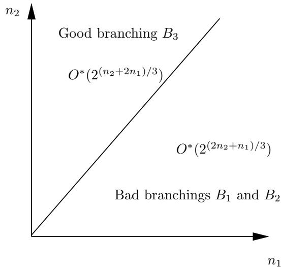
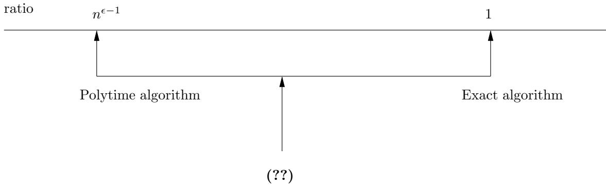
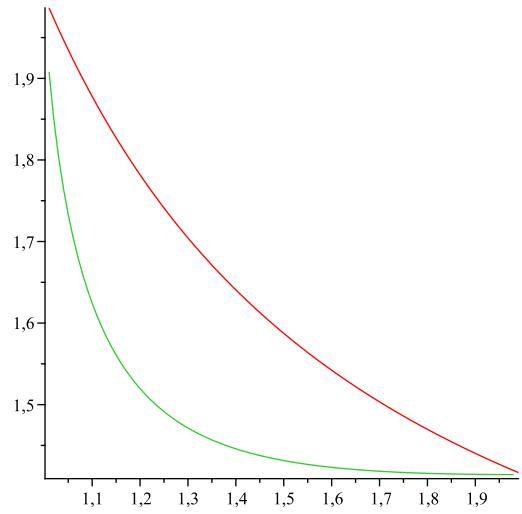
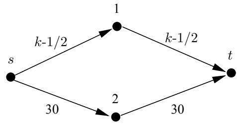
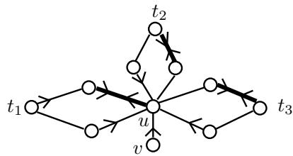
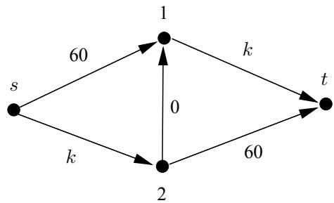

# Universit´e Paris Dauphine Paris Sciences et Lettres

Thesis entitled

# Models and algorithms in combinatorial optimization: some recent developments

by

Bruno Escoffier

for the diploma

# Habilitation \`a Diriger des Recherches

Committee members

Vangelis Th. PASCHOS (advisor) Professor at Universit´e Paris-Dauphine

Dieter KRATSCH (reviewer) Professor at Universit´e Lorraine - Metz

Paul SPIRAKIS (reviewer) Professor at Patras University, Greece

Peter WIDMAYER (reviewer) Professor at ETH Z¨urich, Switzerland

Christoph DURR¨ Directeur de Recherche CNRS, Universit´e Pierre et Marie Curie, Paris

J´erˆome LANG Directeur de Recherche CNRS, Universit´e Paris-Dauphine

Christophe PAUL Directeur de Recherche CNRS, Universit´e Montpellier II

# Contents

# Introduction

# 1

ontent of this document . .

Acknowledgements . . 2

# I Super polynomial time algorithms 5

1 Exact algorithms 7

# 1.1 Introduction . . 7

1.2 Main tools . . 8

1.2.1 Pruning the search tree 8   
1.2.2 Measure and conquer 10   
1.2.3 Dynamic programming and memorization 10   
1.2.4 Inclusion-exclusion principle . 11

1.3 Focus on Max Independent Set: a bottom-up method 1 2

1.4 Negative results . . 1 4

1.5 Conclusion and perspectives . . 1 5

1.5.1 Parameterized complexity and exponential time algorithms 1 5   
1.5.2 Negative results . 1 5   
1.5.3 Analysis of branching algorithms . . 16

# Approximation algorithms 19

2.1 Introduction . . 19

2.2 Generating a “small” subset of solutions 2 0   
2.3 Divide and approximate 2 2   
2.4 Randomization 23   
2.5 Approximately pruning the search tree 2 4   
2.6 Ad-hoc methods . 26   
2.7 Conclusion and perspectives 2 6   
2.7.1 Approximation algorithms and parameterized complexity 2 6   
2.7.2 Negative results . 2 8   
2.7.3 A research axis to be developed . . 2 9

# II Alternative models 31

# 3 Multiagent aspects 33

3.1 Introduction . . 3 3

3.2 A few words on computational social choice 3 3

3.2.1 Vote: a few algorithmic problems . 33   
3.2.2 Combinatorial problems and fairness 3 5

3.3 Algorithmic game theory . . . . 3 6

3.3.1 Measure of the system’s efficiency 3 7   
3.3.2 Improving the system’s efficiency 3 9   
3.3.3 And many other questions... . 42

# 4 Incomplete or evolutive instances 45

4.1 Introduction . . 4 5

.2 Decision under uncertainty: a multi-scenario setting 4 6   
4.2.1 Decision under risk: an example of multi-stage optimization 46   
4.2.2 Decision under total uncertainty: an example of robust decision 47

4.3 Reoptimization 48

4.3.1 Traveling salesman problems 4 9   
4.3.2 Min Steiner Tree 5 0   
4.3.3 Other problems . 5 0   
4.3.4 Negative results . . 5 0   
4.3.5 Towards solving dynamic instances? 5 1

# Bibliography

#

Personal publications . . 5 2

Other publications 5 5

Appendix. Definition of the considered optimization problems

67

# Introduction

# Content of this document

The seminal works by Cook and Karp [65, 118] provided a theoretical framework to study the time complexity of solving combinatorial problems, with the key notion of $N P$ -completeness. Many problems, either arising in other domains (logic, graph theory. . . ) or coming from (simplified) models of industrial problems, have been studied in this complexity setting. Many works lying in several frameworks aimed at determining to what extend it is possible to solve $N P$ -hard problems. Polynomial time approximation is one of the main such research domains, born in the seventies: if it seems difficult to solve exactly an optimization problem in polynomial time, maybe we can hope for a computation of a “good” solution in polynomial time. The quality of a solution is measured by a criterion, the most common one being the so-called approximation ratio, which is the ratio between the value of the solution and the optimal value. The framework of polynomial time approximation has exhibited strong differences between problems: for some of them, it is possible to compute a solution “arbitrarily close” to optimum (approximation scheme), for others it is impossible to reach any constant approximation ratio. Beyond the study of one particular problem, the field of polynomial time approximation has provided a vast set of tools for devising and analyzing algorithms (greedy algorithms, local search, primal-dual algorithms for instance); a structural approach (approximation classes, approximation preserving reductions, logical classes . . . ) and negative results (some of them being surprising, using PCP systems) have also been developed. About 40 years of research in this field have drawn a rich and quite precise landscape about solving $N P$ -hard problems by polynomial time approximation algorithms. Of course, some questions are still open, and devising approximation algorithms remains an interesting way to handle hard combinatorial problems.

However, in parallel with these works or following some of them, alternative approaches aiming at solving combinatorial problems have been developed. The goal of these approaches may be either to study the same problems in another theoretical framework, in order to improve our knowledge and provide complementary answers about how we can solve them, or to consider different models in order to take into account specificities of practical situations from which the problems come from, the goal being to be closer to real world situations. My PhD thesis was in the field of polynomial time approximation and I am still interested in this topic (with the studies of Min Connected Vertex Cover [EGM07, EGM10a] and of the differential approximation of some traveling salesman problems [EM08]), but in the main part of my research activities since then I have considered some of these alternative approaches. The techniques and concepts developed in the field of polynomial time approximation turn out to be fruitful when studying these new topics. I present in this “habilitation \`a diriger des recherches” the main concepts and tools in the frameworks I have worked on, and my contributions. The document is divided into two parts, corresponding to the two approaches that I have mentioned earlier:

• The first part deals with the study of “classical” optimization problems in a different paradigm. More precisely, it deals with solving combinatorial optimization problems by super polynomial time algorithms (exponential time for most of them), either exact (Chapter 1) or approximate (Chapter 2). This domain, particularly active for about 10 years, tries to answer the following simple but fundamental question: how can I solve either exactly or approximately an optimization problem with an algorithm whose complexity is as low as possible?

• The second part deals with the study of different ways of modeling specificities of practical situations, leading to more complex formulation of optimization problems. In the classical framework of combinatorial optimization, an input is usually an instance of a problem, and the goal is to compute, generally as fast as possible, an optimal/approximate/feasible solution. The following two facts are assumed:

– First, there is a clearly defined function to be optimized. This seems reasonable when there is only one person involved in the decision process $^ { 1 }$ , but the situation is widely more complex when the problem involves several agents whose own interests may be (and often are) opposite. In this situation, how can we aggregate the several opinions, trying to find solutions that are satisfactory for all the agents? Moreover, what happens if agents act selfishly in a decentralized system? These questions are linked to the fields of computational social choice and of algorithmic game theory and will be handled in Chapter 3.

– Second, the instance of the problem is completely known. However, there are situations where the data of a problem are incompletely known, due to the fact that some part is unknown, uncertain, or because the data may evolve with time. I will present in Chapter 4 some topics in the theory of decision under uncertainty (with situations where a set of scenarios is possible) and in the setting called reoptimization (an instance, already solved, is subject to some modification, and the goal is to solve the modified instance).

N.B.: This document contains also some open problems and research topics that I find interesting to consider in future works. They are often stated as questions (more or less precise and formalized) all along the document. Moreover, the definitions of the considered problems are given in an appendix at the end of the document. Finally, the bibliography is divided into two parts: the publications corresponding to my own works, cited with the initials of the authors followed by the year of publication (style alpha in latex), and the other publications, cited as a number (style plain in latex).

# Acknowledgements

In this document are presented works lying in several research domains, or at least in several research topics. Some of these topics are in the heart of my research activities, and many discussions with enthusiastic colleagues gave me the opportunity to discover and study other related topics. All the works that I present, done in very nice scientific and human conditions within the Lamsade, are the results of many working meetings with passionate colleagues (and friends): thanks to all, research is done in teams, and this is also why we enjoy it so much.

Among these colleagues and friends there is of course Vangelis, who accepted to be advisor of this “habilitation \`a diriger des recherches”, with whom I started working in exponential time algorithms. We considered the possibility to devise exponential time approximation algorithms, and this topic has been in the heart of the thesis of Nicolas, and then of the (on-going) ones of Emeric and Edouard, students that I had and have the great opportunity to co-advise. Federico, J´erˆome M., Johan, Eun Jung and Mingyu have also worked with us on these topics. My works in algorithmic game theory have been largely inspired by Laurent, with whom I share the office at Dauphine for several years, and by J´erˆome M., with whom I have the luck to work since the beginning of my PhD thesis. Discussions with Olivier and Fanny led us to work out a research project, to which participate also Thang and Stefano. J´erˆome L. (speaking of enthusiastic colleagues!) initiated me to computational social choice. The few works that I did in this domain are on his initiative. Meltem, with whom I have the pleasure to share my life, also participated, as well as J´erˆome M. and Laurent. Giorgio gave me the opportunity to discover the Eternel City as well as the topics of reoptimization (also with Vangelis, J´erˆome M., Martin and Vincenzo) and of data stream, in collaboration with Camil, Andrea and Gabriel.

These works lead to this “habilitation \`a diriger des recherches”, defended on November 23rd 2012. I would like to warmly thank the persons who accepted to evaluate the quality of this thesis: professors Dieter Kratsch, Paul Spirakis and Peter Widmayer, reviewers of this work, and “directeurs de recherche” Christoph D¨urr, J´erˆome Lang and Christophe Paul.

More generally, many other persons (other colleagues, persons working in administration, family, friends) helped me, supported me, motivated me, read this document or allowed me to write it in optimal conditions (Ah, Gelibolu),. . . Thanks to all!

# Part I

# Super polynomial time algorithms

# Chapter 1

# Exact algorithms

# 1.1 Introduction

A central question, in the design of algorithms in general and in combinatorial optimization in particular, is to know to what extend we can solve a given problem with the (time and space) available resources. The efficiency of an algorithm is usually measured as its worst case (time and space) complexity; this complexity is generally expressed as a function of the size of the instance, even if other parameters might be taken into account as in the field of parameterized complexity (see Section 1.5.1). The following complexities are classical (where $n$ is the size of the instance):

• $O ( n )$ : linear complexity   
• $O ( n ^ { 2 } )$ : quadratic complexity   
• $p ( n )$ for some polynomial $p$ : polynomial complexity   
• $O ( 2 ^ { p ( \log n ) } )$ for some polynomial $p$ : quasi-polynomial complexity   
• $O ( 2 ^ { f ( n ) } )$ with $f ( n ) = o ( n )$ : subexponential complexity   
• $O ( \alpha ^ { n } )$ for some $\alpha > 1$ : exponential complexity

A problem is solvable in time $f ( n )$ if there exists an algorithm with time complexity $f ( n )$ which solves this problem; this defines complexity classes for problems 1. We know that the inclusion of these classes is strict, but determining whether a given problem belongs to a given class or not remains usually widely open (is this problem solvable in linear, quadratic, polynomial time?). The complexity theory particularly focuses on solving problems by polynomial time algorithms, with the notion of $N P$ -hardness. However, even when a first answer “the problem is polynomial”/“the problem is $N P$ -hard” is found, we can still wonder what is the best complexity we can reach to solve the problem. In particular :

• If the problem is polynomial, is it quadratic? Linear? These are very important questions when dealing with large size instances, for which polynomiality is far from being sufficient. • If the problem is not polynomial (if $P \neq N P$ ), is it quasi-polynomial? Subexponential ? Exponential ?

The goal of this chapter is to study the latter point: trying to solve hard problems with an algorithm whose complexity, even non polynomial, is as low as possible2.

The exact computation of hard optimization problems has led to numerous and fruitful research works from the early stage of combinatorial optimization, as well as to solvers whose efficiency grows quickly. However, the precise evaluation of the worst case complexity of exact algorithms has only been marginally considered until the nineties, with works such as the dynamic programming algorithm of Held and Karp for Min Traveling Salesman [106]. The numerous negative results in the field of polynomial time approximation have been one of the main reasons for the renewal of interest of the researchers for this topic. In the early 2000 a growing community has emerged, around events like conferences (IPEC in particular), seminars, summer schools . . . In parallel with this development, new algorithmic techniques and analysis methods have emerged. The field is however still young and no doubt that other methods will appear in order to solve open questions. In this chapter, I will first briefly present the main methods used in the field of exponential time algorithms (Section 1.2), illustrating them on the works I have done (for the ones I have used). I will focus in Section 1.3 on a method that Nicolas Bourgeois, Vangelis Paschos and myself have proposed and with which we have improved several results for Max Independent Set. Section 1.4 will deal with negative results. In Section 1.5, I will shortly discuss about parameterized complexity and I will give some perspectives, dealing with negative results and with the analysis of branching algorithms, which could be interesting to consider.

# 1.2 Main tools

For classical combinatorial optimization problems, the set of feasible solutions of an instance is finite and a “trivial” algorithm consists of enumerating all the solutions and outputting the best one. More precisely, for problems in the class $N P O$ , the size (number of bits in memory) of a feasible solution of an instance of size $n$ is bounded by a polynomial $p ( n )$ . Furthermore, it is polynomial to check whether a solution is feasible or not, and to compute the value of a solution. A trivial exhaustive algorithm enumerates all the strings of size at most $p ( n )$ and has a complexity $q ( n ) 2 ^ { p ( n ) }$ for some polynomial $q$ , which will be denoted by $O ^ { * } ( 2 ^ { p ( n ) } )$ as usual. Hence, for a problem where solutions are subsets of a set of size $n$ this exhaustive algorithm is in $O ^ { * } ( 2 ^ { n } )$ ; if the solutions are permutations of a set of size $n$ the complexity is $O ^ { * } ( n ! ) = O ^ { * } ( 2 ^ { n \log n + o ( n \log n ) } )$ . . . A minima, the goal is to improve the complexity of this trivial algorithm. To do so, several methods for devising and analyzing algorithms have been developed. I will mention in this section the methods pruning the search tree, measure and conquer, memorization, dynamic programming, and the one based on the inclusion-exclusion principle. The goal is not to present the methods in a very detailed way but rather to sketch the main ideas. The interested reader is referred to the very informative book of Fomin and Kratsch [92], which is accessible to a non specialist but also contains the main results achieved up to now, or, in a more condensed way, to the book chapter [BEP12]. To have a presentation in French, see the corresponding chapter in the PhD thesis of Nicolas Bourgeois [40].

# 1.2.1 Pruning the search tree

Building a search tree is one of the most classical tools used to solve in practice combinatorial problems (branch and bound methods in particular). It is also the main tool used up to now in the field of exact exponential time algorithms: it is a (conceptually) simple method which leads to very good results. Its use in exponential time algorithms is based on a branching rule, with which solving an instance is boiled down to solving instances of smaller size. Usually, reduction rules are also used to reduce the size of an instance without branching. The number of leaves in the tree, (an upper bound of which being) computed by solving an equation coming from the recurrence given by the branching rule, gives the complexity of the algorithm (up to a polynomial factor). Here is a very classical example for Max Independent Set. Every vertex of degree 0 is in an optimal solution, as well as any vertex of degree 1 (its neighbor has to be removed from the graph). This very simple reduction rule brings us to the case where every vertex has degree at least 2. The branching rule consisting either to take a vertex $\boldsymbol { v }$ (and to remove its neighbors) or not to take it, gives the following recurrence on the number of leaves in the obtained tree: $T ( n ) \leq T ( n - 3 ) + T ( n - 1 ) ^ { 3 }$ . Indeed, branching builds to two subinstances where the number of vertices reduces by at least 3 (when we take $v$ ) and at least 1 (when we do not take $v$ ). The complexity is then $O ^ { * } ( \alpha ^ { n } )$ where $\alpha$ is the positive solution of $1 = { \alpha } ^ { - 3 } + { \alpha } ^ { - 1 }$ , $O ^ { * } ( 1 . 4 7 ^ { n } )$ here. The gain with respect to an exhaustive algorithm is then quite high. It is worth noticing that using depth first search, the algorithm uses polynomial space.

This technique has been applied on a large set of problems, using sometimes very complex branching and reduction rules to reduce the running time. Kratsch and Liedloff [127] devised an algorithm solving Min Dominating Clique in time $O ( 1 . 3 3 8 7 ^ { n } )$ . For this problem, an additional difficulty appears: if we try to apply the same branching as for Max Independent Set (either take a vertex in the solution or not), the resulting instance can not be solved independently of the branchings that have been done before. Indeed, we have to know if a vertex is already dominated or not; we cannot simply remove from the graph the vertex that we have taken (or not) in the solution. Kratsch and Liedloff [127] overcome this difficulty by solving a more general problem (the set of vertices $V$ is partitioned into two sets $V _ { 1 }$ and $V _ { 2 }$ and we want to know if there exists a dominating clique included in $V _ { 1 }$ ) on which the branching can be applied. Following this idea, in a work with Nicolas Bourgeois, Federico Della Croce and Vangelis Paschos [BCEP09, BCEP], we proposed a more efficient branching rule that led us to improve the results of [127] on Min Dominating Clique and in a more significant way on Existing Dominating Clique (deciding whether a graph has a dominating clique or not is an $N P$ -complete problem), and to obtain a result on Max Dominating Clique.

Theorem 1.1 [BCEP09, BCEP]4 Existing Dominating Clique, Min Dominating Clique and Max Dominating Clique are solvable respectively in time $O ( 1 . 2 6 2 8 ^ { n } )$ , $O ( 1 . 3 2 4 8 ^ { n } )$ and $O ( 1 . 3 1 9 6 ^ { n } )$ , and polynomial space.

Search tree algorithms yield also interesting results when we study a problem on a specific class of instances. A usual approach face to a hard problem is indeed to study it on particular instances: is the problem still difficult on this family of graphs? Is it difficult to approximate on that family of graphs? Similarly, it is worth considering the possibility to devise faster exact algorithms on set of instances where the problem remains hard. For instance, it is well known that Max Independent Set can be solved by dynamic programming (c.f. Section 1.2.3) in $O ^ { * } ( 2 ^ { t w ( G ) } )$ where $t w ( G )$ is the treewidth of $G$ (see for instance [8])5. In planar graphs (where the problem remains $N P$ -hard [97]), the treewidth is bounded by $O ( { \sqrt { n } } )$ , and the problem is consequently solvable in subexponential time $O ^ { * } ( 2 ^ { O ( \sqrt { n } ) } )$ .

In the same spirit, we proposed in the work [BCEP09] (previously mentioned) complexity results which are function of the density of the graph. By exploiting properties of the solutions, when the density is very high or very low, the running time of the computation can be reduced.

The most prolific example (considering the number of works dedicated to it) of the study of a problem on a particular set of instances is certainly Max Independent Set in graphs of low maximum (or low average) degree, in particular in graphs of maximum degree 3. One of the reasons is that when the graph contains a “high” degree vertex (let us say at least 9), the basic branching previously seen (either take a vertex and remove its neighbors, or do not take it) gives a recurrence relation leading to a very low complexity (better than the best complexity known for solving the problem). In other words, the hard cases are in some sense the graphs with low maximum degree, which motivates their study. By the way, we will see later (Section 1.3) that the algorithm we proposed for Max Independent Set in general graphs is based on the result on graphs of average degree 3. Many articles have been published on this particular problem (see for instance [16, 91, 95, 146] and [BEP08, BEPvR10b] for some of these works).

The work [BEPvR10b] accomplished with Nicolas Bourgeois, Vangelis Paschos and Johan M.M. Van Rooij led to the best known complexity $O ( 1 . 0 8 5 4 ^ { n } )$ . This is actually a consequence of the following result:

Theorem 1.2 [BEPvR10b] Max Independent Set is solvable in time $O ( 1 . 1 7 8 1 ^ { m - n } )$ and polynomial space.

Let us note the following consequence in the field of parameterized complexity (c.f. Section 1.5.1): in graphs of maximum degree 3, Max Independent Set is solvable in $O ( 1 . 1 7 8 1 ^ { k } )$ where the parameter $k$ is the size of the solution (this is the best known result).

# 1.2.2 Measure and conquer

As we have just seen, the running time $O ( 1 . 0 8 5 4 ^ { n } )$ for Max Independent Set in graphs of maximum degree 3 is a corollary of Theorem 1.2 where the running time is not expressed directly as a function of the number of vertices but rather as a function of the measure $p = m - n$ . Recurrence relations given by the branching rules are expressed as a function of this measure $p$ . This idea to express the complexity not as a function of the parameter we are interested in, but using a measure $p$ which depends on the instance has been used in [46], then formalized in a very general form by Fomin et al. in [88] and [89] (see [90] for a long version) under the name “measure and conquer”. The principle for Max Independent Set in [89] is to give a weight $w _ { i }$ in $[ 0 , 1 ]$ to vertices of degree $i$ . The measure of a graph is the sum $p$ of the weight of vertices, i.e., $\begin{array} { r } { p \ = \ \sum _ { v \in V } w _ { d ( v ) } } \end{array}$ . Branchings induce recurrence relations on $p$ , and this gives ∈a complexity which depends on the weights $w _ { i }$ . These weights are then optimized so as to get the best possible complexity $O ^ { * } ( \alpha ^ { p } )$ . Since $p \leq n$ , we immediately get a complexity $O ^ { * } ( \alpha ^ { n } )$ . It is worth noticing that this is a method to analyze the complexity of algorithms: a “measure and conquer” analysis often allows to show that an algorithm is much faster than what one would expect from a “standard” analysis (expressing the recurrence relations as a function of the number of vertices). Concerning Max Independent Set, Fomin et al. [89] obtained the following result.

Theorem 1.3 [89] Max Independent Set is solvable in time $O ^ { * } ( 1 . 2 2 1 ^ { n } )$ and polynomial space.

The “measure and conquer” paradigm allows to take into account in a better way the reduction of the size of the instance when branching; in the previous example it takes into account the reduction of the degree of vertices when neighbors are removed from the graph. The refinement of such an analysis led to improvements for some problems using very simple algorithms, for instance for Min Dominating Set in [88]. It avoids a tedious case analysis (such as the ones used to derive the results in the previous section!).

In a work with Federico Della Croce and Vangelis Paschos [CEP07] we used this method to get an algorithm with complexity $O ( 1 . 3 9 6 ^ { m } )$ (where $m$ is the number of sets) for Min Set Cover in instances where each set contains at most 3 elements. With Nicolas Bourgeois, Federico Della Croce and Vangelis Paschos we have studied Min Independent Dominating Set. Gaspers and Liedloff proposed in [99] a branching algorithm whose complexity is $O ( 1 . 3 5 8 ^ { n } )$ . We slightly improved this result thanks to a different branching rule, and using the measure and conquer method, where the weight of a vertex depends on its degree and on its status with respect to the current partial solution (already dominated or not).

Theorem 1.4 [BEP10, BEP] Min Independent Dominating Set is solvable in time $O ( 1 . 3 3 5 1 ^ { n } )$ and polynomial space.

# 1.2.3 Dynamic programming and memorization

Dynamic programming, formalized by the work of Bellmann [18], has been widely studied to solve optimization problems, c.f. [ES05] for a presentation of the methods and of some of its applications. The idea is to decompose the initial problem in a sequence of subproblems $I _ { 1 } , \ldots , I _ { k }$ , that we solve one after the other, from $I _ { 1 }$ to $I _ { k }$ . When the optimality principle of Bellmann holds, the problem $I _ { j }$ can be quickly solved if we know an optimal solution on $I _ { j - 1 }$ , and the combinatorial explosion is limited: only a subset of the feasible solutions is considered. Moreover, it is usually very easy to compute the number of feasible solutions considered (and hence the computation of the complexity is also usually easy). It is then obviously interesting in the framework of exact exponential time algorithms. Let us illustrate it on Min Feedback Edge Set. If $S$ is a set of vertices, let us denote $v ^ { * } ( S )$ the optimal value on the subgraph induced by $S$ , ie. the minimum number of reward arcs in an ordering of the vertices in $S$ . We have the following relation: $v ^ { * } ( S ) = \operatorname* { m i n } \{ V ^ { * } ( S \setminus \{ j \} ) + N ( j ) : j \in S \}$ where $N ( j )$ is the number of arcs $( i , j )$ with $i \in S$ . Indeed, $V ^ { * } ( S \setminus \{ j \} ) + N ( j )$ corresponds to the best order of the vertices in $S$ where $j$ is placed first, because this is clearly obtained by optimally ordering the vertices in $S \ : \backslash \ : \{ j \}$ (optimality principle of Bellmann for this problem). Hence, considering the subsets of vertices by increasing size, the algorithm has a complexity $O ^ { * } ( 2 ^ { n } )$ . A drawback of this method is that the memory space is itself exponential in the input size (we have to store in memory a solution for each subset of size $j - 1$ in order to solve subproblems with subsets of size $j$ ). This technique can be applied to several problems, in particular Min Traveling Salesman that can be solved in time (and space) $O ^ { * } ( 2 ^ { n } )$ [106], which is still the best known deterministic complexity 6.

Dynamic programming is often used in the idea, called memorization, consisting of improving the running time of an algorithm by increasing its space complexity. A branching algorithm usually takes polynomial space. Hence it typically solves the same subproblem several times (even a very large number of times) in different branches: an exponential number of leaves corresponds for instance to instances with one vertex, i.e., to $n$ subgraphs of the initial graph, each appearing an exponential number of times. This phenomenon is in opposition with the principle of dynamic programming where the memory space is exponential but where we solve only once a subinstance of the initial instance. Robson [148] introduced the following natural idea, leading to an improvement of the running time of a branching algorithm while increasing the space complexity. The idea is to solve in a first phase all the subinstances of size smaller than a given threshold (and to store the results); then we run the branching algorithm but we stop it as soon as we reach a subinstance of size smaller than the previous threshold, this instance being already solved. Typically, if the branching algorithm is in $O ( \alpha ^ { n } )$ , memorization with a threshold $\beta n$ gives a time complexity $O ^ { * } \bigl ( \binom { n } { \beta n } + \alpha ^ { n ( 1 - \beta ) } \bigr )$ with a memory space $O ^ { * } ( \binom { n } { \beta n } )$ . The only remaining thing is to choose the value of $\beta$ in order to optimize the time complexity. It is worth noticing that the method can be used when in the branching algorithm the subproblems that we obtain correspond to the same problem on subinstances of the initial instance. This is not always the case, for instance due to some reduction rules, such as folding a degree 2 vertex in the case of Max Independent Set: this reduction removes a degree 2 vertex from the graph but add edges to the neighbors of the removed vertex. The graph produced by a folding is not a subgraph of the initial graph (edges are added).

In [BCEP09, BCEP] we used memorization to improve the results given in Theorem 1.1 (but with an exponential space complexity of course).

Theorem 1.5 Existing Dominating Clique, Min Dominating Clique and Max Dominating Clique are solvable respectively in time $O ( 1 . 2 4 6 ^ { n } )$ , $O ( 1 . 2 9 8 ^ { n } )$ and $O ( 1 . 2 9 4 ^ { n } )$ .

# 1.2.4 Inclusion-exclusion principle

Recently used in the field of exact exponential time algorithms for combinatorial problems, the inclusion-exclusion principle had an immediate success in particular because it allowed to answer a widely studied open question: Min Coloring is solvable in time $O ^ { * } ( 2 ^ { n } )$ [27, 122]. Since then, this principle together with other techniques have led to many articles such as [28, 136, 26]. Let us give the basic idea. The principle is to use a combinatorial formula on the cardinality of an intersection of sets. Let $Z$ be a finite set, and $( Z _ { i } ) _ { i \in I }$ a finite family of subsets of $Z$ . Then:

$$
\left| \bigcup _ { i \in I } Z _ { i } \right| = \sum _ { i \in I } \left| Z _ { i } \right| - \sum _ { i \neq j \in I } \left| Z _ { i } \cap Z _ { j } \right| + \ldots + ( - 1 ) ^ { | I | + 1 } \left| \bigcap _ { i \in I } Z _ { i } \right|
$$

or alternatively:

$$
\left| \bigcap _ { i \in I } { \overline { { Z _ { i } } } } \right| = \sum _ { X \subseteq I } ( - 1 ) ^ { | X | } \left| \bigcap _ { i \in X } Z _ { i } \right|
$$

The idea is to express the existence of a solution as a property (often non nullity) of the left hand side in expression (1.1). The evaluation of the right hand side by an algorithm then gives the answer to the existence of a solution.

Given a graph, determining whether there exists a $k$ -coloring of the graph or not can be formulated as follows: let $Z$ be the set of independent sets of $G$ . Define $Z _ { i }$ as the set of families of $k$ elements of $Z$ whose union does not contain $i$ . The left hand side of expression (1.1) is the number of families of $k$ independent sets whose union contains all the vertices. This number differs from 0 if and only if there is at least one $k$ -coloring in the graph.

To compute the right hand side, we use dynamic programming. $\left| \bigcap _ { i \in X } Z _ { i } \right|$ is the number of families of $k$ independent sets whose union does not contain any element in $X$ . It is then $a _ { X } ^ { k }$ , where $a x$ is the number of independent sets not containing any element in $X$ . Then for $i \not \in X$ , by considering the possibility to take $i$ or not in the independent set, we have $a _ { X } = a _ { X \cup \{ i \} } + a _ { X \cup N [ i ] }$ (where $N [ i ] = i \cup N ( i )$ is the closed neighborhood of $i$ ). Considering sets $X$ by decreasing size, we can compute all the terms $a x$ in space and time $O ^ { * } ( 2 ^ { n } )$ , and then evaluate the right hand side in $O ^ { * } ( 2 ^ { n } )$ . By testing the values of $k$ from $^ { 1 }$ to $n$ , we get:

Theorem 1.6 [27, 122] Min Coloring is solvable in time $O ^ { * } ( 2 ^ { n } )$ .

Let us conclude by some remarks:

• The use of dynamic programming makes the memory space exponential. However, it is possible to compute the right hand side using polynomial space in time $O ^ { * } ( 2 . 4 5 ^ { n } )$ , due to the fact that it is possible to enumerate all the maximal independent sets of a graph in time $O ^ { * } ( 1 . 4 5 ^ { n } )$ [115]. A polynomial space algorithm with running time $O ( 2 . 2 4 6 1 ^ { n } )$ has been given in [27].   
• From the algorithm that determines whether there exists a $k$ -coloring or not, it is possible to build a $k$ -coloring (by using a polynomial number of times the algorithm for the existence of a solution).   
• The use of the inclusion-exclusion principle gives also the number of $k$ -colorings (not only the existence of a $k$ -coloring).   
The basic principle and its use for Min Coloring can be interpreted as a search tree [161].   
• Other examples of problems formulated using the inclusion-exclusion principle are given in [92].

# 1.3 Focus on Max Independent Set: a bottom-up method

As indicated in the previous section, Max Independent Set has the following two properties: first, it has been widely studied in graphs with small maximum or average degree, in particular in graphs with maximum or average degree 3. Second, the denser the graph, the larger the number of edges and vertices removed by the basic branching. With Nicolas Bourgeois and Vangelis Paschos we considered the possibility to devise a method which would fruitfully use these two properties by:

• using as a stepping stone the results known for solving the problem in graphs with small degree (degree 3);   
• identifying as a function of the graph density the quality of a branching we can do;   
• deducing in a bottom-up way a complexity for classes of graph with growing density (this complexity of course increases with the density).

More precisely, if we know an algorithm let us say for graphs of average degree at most $d$ , and if we show that it is always possible to make a “good” branching when the average degree is greater than $d$ , we define the algorithm that makes the “good” branching as long as the degree is greater than $d$ , then uses the algorithm known for graphs of degree at most $d$ . More generally, if we find a sequence of degrees $3 < d _ { 1 } < d _ { 2 } < . . .$ associated to better and better branchings, then we apply sequentially this principle from the average degree 3 (stepping stone) to average degree $d _ { 1 }$ , then to $d _ { 2 }$ , . . . .

I will now present this idea on a toy problem which does not claim to be realistic but which allows to understand how the idea works and why it can be interesting with respect to a measure and conquer analysis. Consider a graph problem (Max Independent Set for instance) where there are two types of vertices: type 1 (of degree at most 3 for instance) and type 2 (of degree at least 4 for instance). Denote $n _ { 1 }$ the number of vertices of type 1 and $n _ { 2 }$ the number of vertices of type 2. Generally, two branchings may occur: branching $B _ { 1 }$ where in each branch we delete 3 vertices of type 1, and branching $B _ { 2 }$ where in each branch we delete two vertices of type 2 and add at most one vertex of type 1 (the degree of a vertex decreases for instance). Finally, we know thanks to density arguments that when $n _ { 2 } ~ \ge ~ n _ { 1 }$ , a good branching is always possible, namely branching $B _ { 3 }$ where we delete 3 vertices of type 2 in each branch (see Figure 1.1).

A standard analysis (looking at the total number of vertices in the graph) of this branching “algorithm” would give a complexity $O ^ { * } ( 2 ^ { n } )$ due to $B _ { 2 }$ where the number of vertices decreases by 1 in each branch. A measure and conquer analysis would associate weights $w _ { 1 }$ and $w _ { 2 }$ to vertices of type 1 and 2. The analysis is very simple here, we have to fix $w _ { 2 } = 1$ and $w _ { 1 } = 1 / 2$ (in order to balance the bad branchings $B _ { 1 }$ and $B _ { 2 }$ ): then, in both branching, the total weight $p = w _ { 1 } n _ { 1 } + w _ { 2 } n _ { 2 } = n _ { 1 } / 2 + n _ { 2 }$ of the graph reduces by $3 / 2$ in each branch. This gives a complexity $O ^ { * } ( 2 ^ { 2 p / 3 } ) = O ^ { * } ( 2 ^ { ( n _ { 1 } + 2 n _ { 2 } ) / 3 } ) = O ^ { * } ( 2 ^ { 2 n / 3 } )$ . This analysis does not take into account the branching $B _ { 3 }$ .

The principle of the method we devised is to define as stepping stone an algorithm of graphs with “low” average degree, here the case where $n _ { 1 } ~ \le ~ n _ { 2 }$ . The previous measure and conquer analysis gives a complexity $O ^ { * } ( 2 ^ { ( 2 n _ { 2 } + n _ { 1 } ) / 3 } )$ . Then, we want to solve the problem when $n _ { 2 } \geq n _ { 1 }$ . The idea is to look in this part of the plane for a complexity of the form $y ^ { n _ { 2 } - n _ { 1 } } 2 ^ { ( 2 n _ { 2 } + n _ { 1 } ) / 3 }$ . We write the recurrence induced by $B _ { 3 }$ (valid as long as $n _ { 2 } > n _ { 1 }$ ) to find $y$ , and at the border $n _ { 2 } = n _ { 1 }$ we obtain the complexity of the “stepping stone” and we can legally use the initial algorithm conceived for this case. The recurrence relation of $B _ { 3 }$ gives $2 y ^ { - 3 } 2 ^ { - 2 } = 1$ hence $y = 2 ^ { - 1 / 3 }$ , leading to a complexity $O ^ { * } ( 2 ^ { ( n _ { 2 } + 2 n _ { 1 } ) / 3 } )$ . Finally, we get:

• a complexity $O ^ { * } ( 2 ^ { ( 2 n _ { 2 } + n _ { 1 } ) / 3 } )$ when $n _ { 1 } \geq n _ { 2 }$ • a complexity $O ^ { * } ( 2 ^ { ( n _ { 2 } + 2 n _ { 1 } ) / 3 } )$ when $n _ { 1 } \leq n _ { 2 }$

  
Figure 1.1: Dense and sparse region.

In both cases we get $O ^ { * } ( 2 ^ { n / 2 } )$ , improving the measure and conquer analysis. This improvement comes from the fact that we have been able to take into account the good branching when the density is high.

In [BEPvR10a, BEPvR12], we applied this method for Max Independent Set. The stepping stone was the algorithm (already mentioned) in $O ^ { * } ( 1 . 0 8 6 ^ { n } )$ in graphs of average degree 3. The key result was to link the density to the quality of the basic branching “take a vertex” or “do not take it”7. The method allows then to get complexities for increasing densities. We obtained the following results (which are the best known polynomial space results).

Theorem 1.7 Max Independent Set is solvable in time $O ^ { * } ( 1 . 2 1 1 4 ^ { n } )$ and polynomial space. In graphs of maximum degree 4, 5 and 6 it is solvable respectively in time $O ^ { * } ( 1 . 1 5 7 1 ^ { n } )$ , $O ^ { * } ( 1 . 1 8 9 5 ^ { n } )$ and $O ^ { * } ( 1 . 2 0 5 0 ^ { n } )$ and polynomial space.

Actually, to improve existing results (cf Theorem 1.3), we had to mix this idea with a quite long and tedious case analysis, and with a measure and conquer analysis beyond some degree; it is hard to really evaluate the precise contribution of the method in this particular result. However, the introducing example is, I hope, quite convincing, and I will come back to it in Section 1.5.3.

# 1.4 Negative results

The previous techniques lead to many results for many problems; however, to evaluate the quality of these results, it would be interesting to know whether it is possible to do “much better” or not. In the field of polynomial time approximation for instance, approximation ratios of algorithms are usually compared to known negative results8. Max 3-SAT is a classical example where we know both a $7 / 8$ -approximation algorithm [114], and the fact that for any $\epsilon > 0$ the existence of a $( 7 / 8 + \epsilon )$ -approximation algorithm would imply $P ~ = ~ N P$ [105]. Dealing with the topic of this chapter, most of the obtained results are exponential time complexities $O ( \alpha ^ { n } )$ for some $\alpha > 1$ . These results would be deeper in some sense if we had lower complexity bounds (under some complexity hypothesis) stronger than polynomial or pseudo-polynomial time, in particular subexponential time lower bounds. Ideally, we would like to show that if $P \neq N P$ , then the problem we are dealing with is not solvable in subexponential time. However, such a result (for all the problems we have considered here) is still an open question. To get through this lack of answer, Impagliazzo and Paturi [111] introduced a new hypothesis, called ETH [112] (for Exponential Time Hypothesis).

ETH. For any $k \geq 3$ , there exists a real number $s _ { k } > 0$ such that no algorithm can solve $k$ -Sat in time $O ( 2 ^ { s _ { k } n } )$

where $n$ is the number of variables in the instance. This hypothesis stipulates that $k$ -Sat problems are not solvable in subexponential time (in $n$ ). The main point of the work of Impagliazzo and Paturi [111] is to show that this hypothesis is plausible (or even probable): similarly as for $N P$ - completeness, the idea is to show using an ad-hoc reduction (called SERF-reduction) preserving solvability in subexponential time, that if ETH were false then many classical problems would have been solvable in subexponential time. More precisely, the equivalence of the following three items has been established:

• ETH

There exists $s > 0$ such that 3-Sat is not solvable in time $O ( 2 ^ { s n } )$

• There exists a problem in $S N P ^ { \mathrm { ~ y ~ } }$ which is not solvable in time $O ( 2 ^ { s n } )$ for some $s > 0$ .

Once this hypothesis formulated, we can use it to derive negative results saying that one particular problem is not solvable in subexponential time under ETH. This work is made easier by one of the key results of Impagliazzo and Paturi, the sparsification lemma, allowing to reduce an instance of $k$ -Sat to an equivalent set of instances of $k$ -Sat where the number of clauses is linearly bounded in the number of variables. Then a classical reduction [98] from 3-Sat to Max Independent Set shows for instance that Max Independent Set is not solvable in subexponential time (in $n$ ) under ETH; this is also the case for Min Dominating Set [93]. . .

It is worth noticing that ETH has also been used as an hypothesis under which some problems are not solvable in exponential time (and even in time $O ( 2 ^ { o ( n \log n ) } ) _ { \prime } ^ { \mathrm { { \tiny ~ ( 2 ^ { o ( n \log n ) } ) } } } ,$ [128, 121].

# 1.5 Conclusion and perspectives

# 1.5.1 Parameterized complexity and exponential time algorithms

This chapter deals with exponential time algorithms and does not mention the field of parameterized complexity, despite its major importance and its current vitality. This is due to the fact that up to now I have only marginally worked in this field. The principle is to measure the complexity of an algorithm not only with respect to the size of the instance but also with respect to another parameter which depends on the instance. The goal is to determine to what extend the combinatorial explosion can be linked to this latter parameter, and to obtain in particular efficient algorithms for instances where the parameter is small.

More formally, the input of a parameterized problem is a “classical” instance of a problem and an integer $k \in \mathbb N$ (and of course a question to be answered). For instance:

• Given a graph $G$ and an integer $k$ (the parameter), determine whether there exists in $G$ a n independent set of size at least $k$ or not; • given a graph $G$ of treewidth $k$ (the parameter), find a maximum independent set in $G$ .

The first parameterization (that naturally extends to other problems, where we ask for the existence of a solution of some given value) is called the standard parameterization. If we know how to solve this problem in time $f ( k ) p ( | I | )$ for some function $f$ and some polynomial $p$ (independent of $k$ ), then the parameterized problem is in the class $F P T$ (this is the case for the problem parameterized by the treewidth, by dynamic programming). If we know how to solve it in time $p _ { k } ( | I | )$ where $p _ { k }$ is a polynomial (which may depend on $k$ ) then the problem is in the class $X P$ (this is the case for the first problem, by exhaustive search). The seminal works by Downey and Fellows (see their book [76] for a detailed presentation of the field) led to the definition of a hierarchy of complexity classes ( $F P T \subseteq W [ { \cal { I } } ] \subseteq W [ { \cal { Q } } ] \cdot \cdot \cdot \subseteq X P )$ . A notion of reduction which preserves membership in $F P T$ led to negative results (completeness in the $W / i J$ classes). For instance, the previous problem of deciding whether there is an independent set of size $k$ or not, is not in $F P T$ if $W [ \imath ] \ne F P T$ ; similarly, Min Dominating Set (with the same parameter) is not in $F P T$ if $W | \mathcal { Z } | \ne F P T$ .

In parallel to these negative results, many problems have been shown to belong to $F P T$ . The techniques are various and largely intersect the ones leading to exponential time algorithms presented earlier in this chapter. Specific tools are also used, such as kernelization.

Very interesting links between $\mathbf { E T H }$ and parameterized complexity have been established, and this is the topic of many recent works. Here are some particular elements that we can find in the survey [52] (see also [131] for some other results of the same flavor):

• Under ETH, $F P T \neq W \vert \boldsymbol { \mathit { 1 } } \vert$ [76]. Downey et al. [75] defined a complexity class $M | \boldsymbol { \mathit { 1 } } | \subseteq W | \boldsymbol { \mathit { 1 } } |$ such that $M \vert { \cal { 1 } } \vert \neq F P T$ if and only if ETH is true, thus creating a strong link between the two fields.   
• Under $\mathbf { E T H }$ stronger negative results (stronger than the one obtained using the hypothesis $W [ { \boldsymbol { 1 } } ] \neq F P T$ ) have been shown for some problems. For instance, under ETH, Max Independent Set parameterized by the size of the solutions is not solvable in time $f ( k ) m ^ { o ( k ) }$ for any function $f$ [51]. This is a very strong negative result since the problem is trivially solvable in time $O ( m ^ { O ( k ) } )$ by exhaustive search.   
• ETH leads also to negative results for $F P T$ problems. For instance, under $\mathbf { E T H }$ , Min Vertex Cover parameterized by the size of the solution is not solvable in time $2 ^ { o ( k ) } p ( n )$ for any polynomial $p$ [49]. Here again, this result has to be compared to the fact that it is very easy to solve the problem in time $2 ^ { k } p ( n )$ using a search tree.

# 1.5.2 Negative results

As we have just seen, strong negative results have been obtained in parameterized complexity. In the field of exponential time algorithm, few new elements have appeared from the works of Impagliazzo et al. [112, 111] on ETH. Note that sometimes exponential time algorithms are given for problems for which hardness under ETH has not been shown, so there is still some work to do here.

More generally, obtaining negative results “thiner” than subexponential time computation is a question that deserves in my opinion more attention. Similarly as we look for polynomial time inapproximability results for $N P$ -hard problems, once we know that a problem is not solvable in subexponential time under $\mathbf { E T H }$ , we could try to show that it is not solvable in time $O ( \gamma ^ { n } )$ for some specific $\gamma > 1$ . The question is then to know which hypothesis we shall consider to derive such results. It seems delicate to consider only $\mathbf { E T H }$ , at least for classical problems; the hypothesis SETH, formulated also in [111], seems more pertinent since it assumes a precise impossibility threshold. For $k \geq 3$ , let $s _ { k }$ be the infimum of $s$ such that $k$ -Sat is solvable in time $O ( 2 ^ { s n } )$ . ETH can be reformulated as $^ { \ast } s _ { k } > 0$ for any $k \geq 3$ ”. Each $k$ -Sat problem can be solved in $O ^ { * } ( 2 ^ { n } )$ , and we have $s _ { k } \leq 1$ . ( $s _ { k }$ ) is a non decreasing sequence, and an interesting question is to consider the limit $s _ { \infty }$ of $\left( \boldsymbol { s } _ { k } \right)$ . The hypothesis SETH stipulates that this limit is 1.

(SETH) $s _ { \infty } = 1$

This hypothesis implies in particular that Sat is not solvable in time $O ( \gamma ^ { n } )$ for any $\gamma < 2$ which is one of the main current open questions in the field. Then, is it possible to deduce from this hypothesis inapproximability bounds for other problems?

(Q1) Under SETH, find negative results (non solvability in time $O ( \gamma ^ { n } )$ ) pour Max Independent Set, Min Coloring, Min Dominating Set, Min Independent Dominating Set. . .

In the same direction, exhibiting direct relations between exponential time computation for solving problems would be interesting. The work [111] is a first result dealing with this consideration: Impagliazzo and Paturi have shown that for any $k$ , $s _ { k } \le c _ { k } s _ { \infty }$ (under $\mathbf { E T H }$ ) where $c _ { k } < 1$ . This allows for instance to transfer some potential negative results for $k$ -Sat into a stronger negative result for Sat. This gives also a better understanding of the behavior of the sequence ( $s _ { k }$ ) which is strictly growing infinitely many times: there is no $k$ from which ( $s _ { k }$ ) is constant, there always exists a $k ^ { \prime } > k$ for which solving $k ^ { \prime }$ -Sat is strictly harder than solving $k$ -Sat. This does not directly give lower bounds, but finding such links between problems remains really a step forward in my opinion. Relatively to this very vast question, we can try to solve the more precise following ones.

(Q2) [52] Does the existence of a subexponential algorithm for 3-Sat imply that Sat is solvable in time $O ( 2 ^ { c n } )$ for some $c < 1 :$ Is the reverse true?

(Q3) (from the Daghstul seminar Moderately Exponential Time Algorithms, 2008) Among Min Coloring, Sat, Min Traveling Salesman, or other problems whose best known algorithm is in $O ^ { * } ( 2 ^ { n } )$ , does the existence of an algorithm with running time $O ( 2 ^ { c n } )$ for one of them imply the existence of algorithms in $O ( 2 ^ { c ^ { \prime } n } )$ for other one (for some $c , c ^ { \prime } < 1 $ )?

(Q4) Find a γ such that if Max Independent Set is solvable in time $O ( \gamma ^ { n } )$ then Min Coloring is solvable in time $O ( 2 ^ { c ^ { \prime } n } )$ for some $c ^ { \prime } < 1$ .

One of the main difficulty to get interesting reductions for exponential time computation is that the size amplification of the instance has to be linear, and no more only polynomial. On the other side, the running time is now less constrained, we can use subexponential time to build the instance in the reduction. To my knowledge, this relaxation of the running time (with respect to usual polynomial time reductions) has not really been fruitfully used up to now 10.

(Q5) Is it possible to fruitfully use subexponential or even “low” exponential time to devise reductions with linear size amplification?

# 1.5.3 Analysis of branching algorithms

I have presented in Section 1.3 an idea for a method which is able to take into account the fact that the quality of branching is linked to the density of the graph. More generally, this method can be applied when in the space of parameters used for measuring the complexity (types of vertices in a measure and conquer analysis) we identify some region(s) where a good branching necessarily occurs. Moreover, the method can be generalized and improved by the choice of the measure. Instead of looking for a complexity of a particular form in the “dense” region as in the example of Section $1 . 3 ^ { 1 1 }$ , we can adopt a measure as in measure and conquer for this “dense” region, by giving weights $w _ { i }$ to vertices according to their types, and writing the recurrence relations with these weights. Then we have to ensure that on the border $\sum \beta _ { i } n _ { i } = 0$ , the complexity of the dense region is at least as large as the complexity known for the sparse region (this can be written as a consequence of some linear inequalities).

Doing so, when analyzing an algorithm, we can find in the space of $n _ { i }$ ’s regions where we are sure to do a good branching. A method would be to associate a set of weights to each of these regions. The recurrence relations induced by the branchings in each region, together with the border conditions, constitute a program which gives the complexity as a function of the weights in the regions, which should be optimized. We have formalized this idea in a preliminary work with Nicolas Bourgeois and Vangelis Paschos. The toy example shows that such a method allows to improve a measure and conquer analysis in some situation. Can we find concrete examples of applications?

# (Q6) Study this method and show its practical interest.

This question lies in the more general consideration of the quality of analysis of branching algorithms. Measure and conquer has shown that the classical analysis is sometimes very bad. However, we have seen that other elements can be taken into account to improve this analysis. Then, what is the quality of these analysis? Are we close to the true complexity. How to find families of instances leading to lower bounds, as it has been done for some algorithms? What does an optimal analysis look like? Few answers until now. . .

# Chapter 2

# Approximation algorithms

# 2.1 Introduction

In the previous chapter I discussed how tackling hard problems by exact algorithms whose complexity, even non polynomial, is as low as possible. On the other hand, as mentioned in introduction, the field of polynomial time approximation, very active from the early seventies, brings complementary answers for solving hard problems. In this latter field, we aim at devising polynomial time algorithms which, on each instance $I$ of a given problem, compute a solution of value at least $r o p t ( I )$ for a maximization problem ( $r \in \left[ 0 , 1 \right]$ ), of value at most $r o p t ( I )$ for a minimization problem ( $r \geq 1$ ). Of course, the closer $r$ to $1$ the better the algorithm. For some problems, the existence of such algorithms would contradict the hypothesis $P \neq N P$ : we are then interested in ratios $r ( n )$ that depend on the size $n$ of the instance. Books [12, 108] (in English) and [141] (in French) present the main techniques and results of the domain. From the early nineties, with the use of the famous PCP Theorem [9], many optimization problems have been shown to be hard to approximate in polynomial time. Among them:

for any $\epsilon > 0$ , Max Independent Set is not approximable within ratio $n ^ { \epsilon - 1 }$ if $P \neq$ NP [164];   
• Min Vertex Cover is not approximable within ratio 1.36 [74] if $P \neq N P$ ; it is not approximable within ratio $2 - \epsilon$ (for any $\epsilon > 0$ ) under the Unique Games Conjecture [120];   
• Min Set Cover is not approximable within ratio $o ( \log n )$ [82], where $n$ is the size of the ground set, if $P \neq N P$ ;   
• for any $\epsilon > 0$ , Min Independent Dominating Set is not approximable within ratio $n ^ { 1 - \epsilon }$ if $P \neq N P$ [103];   
• for any $\epsilon > 0$ , Min Coloring is not approximable within ratio $n ^ { 1 - \epsilon }$ if $P \neq N P$ [164].

These results hold of course for polynomial time algorithms. It is worth noticing that these negative results are very close to ratios that are reachable - sometimes trivially - in polynomial time (taking one vertex gives a ratio $1 / n$ for Max Independent Set, greedy algorithms give ratios 2 for Min Vertex Cover and $O ( \log n )$ for Min Set Cover, taking any maximal independent set (resp. a color for each vertex) gives a ratio $n$ for Min Independent Dominating Set (resp. Min Coloring)).

The central questioning of this chapter is the following: for an optimization problem which is hard to approximate (in polynomial time), can we find an approximation algorithm whose complexity, though non polynomial, is much lower than the one known for exact algorithms? Let us take the example of Max Independent Set, non approximable within ratio $r$ for any constant $r > 0$ if $P \neq N P$ : with what running time can we compute an $r$ -approximate solution? In particular:

• Can we devise for some ratio $r$ an $r$ -approximation algorithm with a running time better than the one of exact computation?

• Is this possible for any ratio $r < 0$ , can we exhibit a global tradeoff between running time and approximation? (Figure 2.1).

  
Figure 2.1: Inapproximability of Max Independent Set.

The same question holds for any problem that is hard to approximate (for some ratio). First answers have been given in [71, 113, 107]. In 2007, Nicolas Bourgeois, Vangelis Paschos and I found this question intriguing; it became the main subject of Nicolas’ PhD Thesis. Motivated by the first answers we gave, we kept working on this topic with the (on-going) thesis of Emeric Tourniaire. In the same time, this question has motivated works by other researchers in the field of exponential time algorithms, and we have now some answers for a bunch or problems (satisfiability problems, graph partitioning, covering or domination, network design . . . ). I try in this chapter to group together some of these results in order to enlight the algorithmic techniques that were devised to achieve them. This classification is largely based on a (more detailed) book chapter recently published [BEPT12].

A first method (Section 2.2) consists of generating only a subset of solutions from which we can get a solution reaching the ratio we want. Next, I will present (Section 2.3) a fairly general technique consisting of partitioning the instance into several subinstances of smaller size. This technique will be improved in Section 2.4 thanks to the use of randomized algorithms. Section 2.5 will be devoted to a method which builds an approximate solution based on a carefully pruned search tree. Then, I will give a few examples of ad hoc methods that have been devised for specific problems (Section 2.6). The last section of this chapter will present some concluding remarks and perspectives.

# 2.2 Generating a “small” subset of solutions

Let us consider the case where we have to solve a graph problem consisting of finding the smallest subset of vertices satisfying some given property, and let us suppose (as it is generally the case) that we can compute a feasible solution in polynomial time. An exact exhaustive algorithm runs in time $O ^ { * } ( 2 ^ { n } )$ (we assume that the property is checkable in polynomial time). If we want an $r$ -approximation algorithm, then we have the very simple following strategy:

• Generate all the subsets of size at most $n / r$ ;

• If at least one of these subsets verifies the property, then output the smallest one; otherwise output any feasible solution.

This is obviously an $r$ -approximation algorithm. If $r \ > \ 2$ , the running time is $O ^ { * } ( \binom { n } { n / r } ) =$ O∗(cnr ) where cr = 1(1/r)1/r(1 1/r)1−1/r < 2. Let us remark that cr → 1 when r → ∞. Several approximation algorithms are based on this very simple idea of generating only solutions of small size. Let us mention the cases of Min Independent Dominating Set, Dominating Clique and Capacitated Domination.

Min Independent Dominating Set

For Min Independent Dominating Set, the previous idea can be improved by generating only the maximal independent sets (ie, the independent dominating sets) of bounded size, thanks to the following lemma.

Lemma 2.1 ([47]) For all $r \geq 3$ , it is possible to enumerate all the maximal independent sets of size at most $n / r$ of a graph in time $O ^ { * } ( r ^ { n / r } )$ .

Generating these maximal independent sets leads to an $r$ -approximation algorithm whose running time is $O ^ { * } ( 2 ^ { n \log _ { 2 } r / r } )$ [BEP10].

In the same article [BEP10], we further improved this result in the two following ways.

• First, we improved the complexity by considering only specific maximal independent sets. More precisely, by partitioning the graph into small subgraphs, our algorithm generates only maximal independent sets included in one of the subgraphs, and then turns these partial solutions into global solutions. The improvement is quite important: for instance, the running time of a 3-approximation algorithm is reduced from $O ( 1 . 4 4 3 ^ { n } )$ to $O ( 1 . 2 9 8 ^ { n } )$ . • Second, we improved the complexity in triangle-free graphs and in bipartite graphs. To reach these results, we showed an upper bound on the number of maximal independent sets of size at most $k$ in these graphs, result which is interesting in itself. For a 5-approximation algorithm for instance, the running time is $O ( 1 . 3 8 0 ^ { n } )$ in general graphs by the basic method, $O ( 1 . 2 4 5 ^ { n } )$ by the improved method (previous item), $O ( 1 . 2 2 1 ^ { n } )$ for triangle-free graphs and $O ( 1 . 2 0 3 ^ { n } )$ for bipartite graphs.

However, this method does not provide interesting results for ratios close to 1, since generating the “small” subset of solutions (maximal independent sets here) is already too costly. I will come back to this point in Section 2.6.

# Dominating Clique

As seen in Chapter 1, Min Dominating Clique and Max Dominating Clique are particular in the sense that finding a feasible solution is already an $N P$ -complete problem (Existing Dominating Clique). Let us recall also that the best known complexities (in polynomial space) are $O ( 1 . 2 6 2 8 ^ { n } )$ , $O ( 1 . 3 2 4 8 ^ { n } )$ and $O ( 1 . 3 1 9 6 ^ { n } )$ for respectively Existing Dominating Clique, Min Dominating Clique and Max Dominating Clique (Theorem 1.1). Every approximation algorithm for Min Dominating Clique et Max Dominating Clique clearly allows to solve Existing Dominating Clique. Then, it is quite hopeless to reach for approximation algorithms with running time $O ( \gamma ^ { n } )$ with $\gamma < 1 . 2 6 2 7 . . .$ (unless we improve the complexity of solving Existing Dominating Clique).

For Min Dominating Clique, a direct adaptation of the idea given in the beginning of this section provides a tradeoff between approximation and complexity (just output one dominating clique when there is one, in exponential time). For Max Dominating Clique, the situation is a bit more complex but it is also possible to get interesting results [BCEP09, BCEP] by generating first a set of “small” cliques and then by determining whether there exists a feasible solution containing one of these “small” cliques.

# Capacitated Domination

The existence of an algorithm whose running time is $O ^ { \ast } ( \gamma ^ { n } )$ with $\gamma < 2$ for Capacitated Domination has been shown in [70], by reducing the problem to a more constraint version of it where we want to extend (under some conditions) a partial solution $U \subseteq V$ to a global one. In the same article, Cygan et al. provided an approximation algorithm solving this constrained problem on subsets $U$ of bounded size. More precisely, considering sets of size at most $c n$ for $c \leq 1 / 3$ (leading to a complexity $O ^ { * } { \bigl ( } ( c ^ { c } ( 1 - c ) ^ { 1 - c } ) ^ { - n } { \bigr ) } { \bigr ) }$ , they reach an approximation ratio of $( 1 / 4 c ) + c$ for $c \leq 1 / 4$ and $2 - 3 c$ for $c \ge 1 / 4$ .

# 2.3 Divide and approximate

The key idea of this technique is to devise the instance into a set of “small” instances, the size of which depends on the desired ratio, in such a way that we are able to build a “good” solution on the global instance from optimal solutions on the small instances. This obviously leads to an improvement of the running time, improvement which is directly related to the size of the subinstances.

Let us illustrate this technique on Max Independent Set. Suppose that we want a ratio $r \leq 1$ , and let $G$ be a graph on $n$ vertices. Suppose that $r = p / q \in \mathbb { Q }$ $( p , q \in \mathbb { N } )$ , and consider the following algorithm, taking as parameters the graph $G = ( V , E )$ and the ratio $r = p / q$ :

1. arbitrarily partition $V$ into $q$ subsets $V _ { 1 } , \ldots , V _ { q }$ of size $\lceil n / q \rceil$ or $\lfloor n / q \rfloor$ ;

2. build the $q$ induced subgraphs $G _ { 1 } , \ldots . G _ { q }$ where $G _ { i }$ is the subgraph induced by $V _ { i + 1 } \cup . . . \cup V _ { i + p }$ $i = 1 , \ldots , q$ (where obviously $V _ { q + 1 } = G _ { 1 } , \dots ,$ );

3. solve optimally Max Independent Set in each $G _ { i }$ , $i = 1 , \ldots , q$ ;

4. output the best solution computed at the previous step.

Let us analyze this algorithm. The complexity immediately follows from the one of the exact algorithm we use in Step 3 and from the fact that we use it on instances with $p n / q = r n$ vertices (maybe one more). What about the approximation ratio? Let $S$ be the solution computed by the algorithm and $S ^ { * }$ be an optimal solution on $G$ . Then $| S | \geqslant ( p / q ) | S ^ { * } | = r o p t ( G )$ . Indeed, let $S _ { i } ^ { * } = S ^ { * } \cap G _ { i }$ . Since Max Independent Set is hereditary $^ { 1 }$ , $| S _ { i + 1 } ^ { * } | + | S _ { i + 2 } ^ { * } | + . . . + | S _ { i + p } ^ { * } | \leq$ $o p t ( G _ { i } ) \leq | S |$ . Summing this inequality for $i = 1 , 2 , \ldots , q$ , we obtain $\begin{array} { r } { p | S ^ { * } | = p \sum _ { i = 1 } ^ { q } | S _ { i } ^ { * } | \leq q | S | } \end{array}$ hence $| S | \ge r | S ^ { * } |$ .

This analysis shows the following result, from the first work that Nicolas Bourgeois, Vangelis Paschos and I did on this topic of exponential time approximation algorithms [BEP09b, BEP11].

Theorem 2.1 [BEP09b, BEP11] If there exists for Max Independent Set an exact algorithm with running time $O ^ { \ast } ( \gamma ^ { n } )$ $\gamma > 1$ ), then for any $r \in \mathbb { Q }$ , $r \leqslant 1$ , there exists an $r$ -approximation algorithm with running time $O ^ { * } ( \gamma ^ { r n } )$ .

It is worth noticing that the result of Theorem 2.1 is not based on a particular exact algorithm. Any improvement in the complexity of exact computation of Max Independent Set immediately transfers to an improvement of approximate computation of Max Independent Set. Another interpretation of this result is to say that approximate computation of Max Independent Set is strictly “easier” (for any ratio) than exact computation.

This idea to divide the instance into smaller subinstances can be used in different ways and applied to several problems. Here are some other possible applications.

First, the main argument in the proof is heredity. The same result holds for other hereditary problems such as maximum planar subgraph, maximum bipartite subgraph, . . . We also applied this technique to satisfiability problems in [EPT12a], where we got tradeoffs between approximation and complexity, both in the case where we measure the complexity as a function of the number of clauses (this can be easily seen as an hereditary problem) and in the case where we use the number of variables (the algorithm is a bit more involved in this latter case).

Second, this technique can be used to derive results for non hereditary problems. For instance, using the graph preprocessing of [137] as a first step, an adaptation of the given algorithm for Max Independent Set leads to an analogous result for Min Vertex Cover.

Theorem 2.2 [BEP09b] If there exists for Min Vertex Cover an exact algorithm with complexity $O ^ { \ast } ( \gamma ^ { n } )$ $( \gamma > 1 ,$ ), then for any $r \in \mathbb { Q }$ , $r \leqslant 1$ , there exists $a$ $( 2 - r )$ -approximation algorithm for Min Vertex Cover with complexity $O ^ { * } ( \gamma ^ { r n } )$ .

By combining this approach and known results on parameterized complexity for Min Vertex Cover, we have been able to improve this result in [BEP09b].

In [68] this idea of reducing the size of the instance is used in a different way for a non hereditary problem, Min Set Cover. There, the size of the instance is reduced by grouping together several subsets, in order to reduce the total number of subsets. Then we apply an exact algorithm on this reduced instance. The authors obtain the following result (valid even in the weighted case).

Theorem 2.3 [68] If there exists an exact algorithm for Min Set Cover with complexity $O ^ { * } ( \gamma ^ { m } )$ $( \gamma > 1$ ), then for any $r > 1$ there exists an $r$ -approximation algorithm with complexity $O ^ { * } ( \gamma ^ { m / r } )$ .

Finally, this technique can be combined with some polynomial time approximation algorithms when such algorithms exist. By solving the problem exhaustively on one part of the instance and approximately on another part, it is possible to improve the result of Theorem 2.1 for some ratios. If for instance we consider a family of graphs where we know a (polynomial time) $\rho$ -approximation algorithm for Max Independent Set (such as bounded degree graphs), then we showed in [BEP09b] that for any $r \in [ 0 , 1 ]$ we can reach a ratio $( r + ( 1 - r ) \rho )$ with a running time $O ^ { * } ( 2 ^ { r n } )$ .

We used a similar approach in [BBEP11] to obtain exponential time approximation algorithms for some versions of Min Traveling Salesman. The idea is to solve exactly the problem on small subinstances, to use an approximation algorithm on the remaining part of the instance, and to somehow combine these two partial solutions in a global one. In the same article, we gave results for Min Steiner Tree where the reduction of the instance size is made by contracting a subset of terminal vertices with specific properties in the graph.

# 2.4 Randomization

Let us revisit the previous technique for Max Independent Set. To get say a ratio $1 / 2$ , just divide the graph into two induced subgraphs of the same size and solve the problem on these subgraphs. The ratio is obtained whatever the way we divide the instance. A natural question is then to wonder whether there exists a smart way to make this division in order to get a ratio better than $1 / 2$ . Can we find $V _ { 1 } , V _ { 2 }$ (of equal size $n / 2$ ) in order to be sure that either $V _ { 1 }$ or $V _ { 2 }$ contains a proportion $\alpha$ of the vertices of $S ^ { * }$ with $\alpha > 1 / 2$ ? We have not been able to answer this question, at least using a deterministic method. By the way, this is still an open question.

(Q7) Can we improve the running time in Theorem 2.1 using a deterministic algorithm?

However, with Nicolas Bourgeois and Vangelis Paschos we gave a positive answer using a randomization. The principle is very simple: if we divide the graph into two pieces at random, in the worst case we get a ratio $1 / 2$ , but in many cases we get better (all the cases where $S ^ { * }$ is not equally divided in $V _ { 1 }$ and $V _ { 2 }$ ). By repeating this random division a large number of times, we may hope to reach a ratio better than $1 / 2$ with high probability. And this is indeed the case!

More generally, if we want a ratio $r$ , the improvement of Theorem 2.1 is obtained using the following arguments:

• randomly divide the graph into induced subgraphs $G _ { i }$ of order $\beta n$ for some $\beta < r$ ; • compute the probability $\mathrm { P r } [ r , \beta ]$ to have $| S ^ { * } \cap G _ { i } | \geqslant r | S ^ { * } |$ (the probability to have an $r$ -approximate solution is at least $\mathrm { P r } [ r , \beta ]$ ); • repeat the random division (independently) $N ( r , \beta )$ times so that $\operatorname* { P r } [ r , \beta ] \ge 1 - \epsilon$ .

This gives an $r$ -approximate solution with probability $1 - \epsilon$ in time $O ^ { * } \left( N ( r , \beta ) \gamma ^ { \beta n } \right) )$ .

Then it remains to compute the best value for $\beta$ (and to hope that the running time we get is smaller than $O ^ { \ast } ( \gamma ^ { r n } ) )$ .

We applied this technique for Max Independent Set first. By repeating the division an exponential number of times, we improved the running time of Theorem 2.1 for any ratio $r < 1$ . Rather than stating the precise result (which is a bit hard to interpret at first sight), I rather present the improvement for some approximation ratios. In Table 2.1 the running times for the deterministic and the randomized algorithms are given (using as a basis an exact algorithm in $O ( 1 . 1 8 ^ { n } ) )$ . The last column gives the optimal size of the division. In other words, to reach a ratio $1 / 2$ , instead of dividing the graph into subgraphs of order $n / 2$ , we shall rather divide it into subgraphs of order $0 . 4 5 9 n$ (and repeat this division an exponential number of times).

Table 2.1: Comparison of the deterministic and randomized algorithms.   

<table><tr><td rowspan="2">Ratio</td><td rowspan="2">Deterministic</td><td colspan="2">Randomized</td></tr><tr><td>Running time</td><td>β</td></tr><tr><td>0.1</td><td>1.017n</td><td>1.016n</td><td>0.088</td></tr><tr><td>0.2</td><td>1.034n</td><td>1.032n</td><td>0.177</td></tr><tr><td>0.3</td><td>1.051n</td><td>1.048n</td><td>0.269</td></tr><tr><td>0.4</td><td>1.068n</td><td>1.065n</td><td>0.363</td></tr><tr><td>0.5</td><td>1.086n</td><td>1.083n</td><td>0.459</td></tr><tr><td>0.6</td><td>1.104n</td><td>1.101n</td><td>0.559</td></tr><tr><td>0.7</td><td>1.123n</td><td>1.119n</td><td>0.662</td></tr><tr><td>0.8</td><td>1.142n</td><td>1.139n</td><td>0.769</td></tr><tr><td>0.9</td><td>1.161n</td><td>1.159n</td><td>0.882</td></tr></table>

By a combination of this approach with parameterized algorithms for Min Vertex Cover we further improve (in a more significant way) the running time of the deterministic algorithm for Max Independent Set. A similar approach leads to improved results for Min Vertex Cover as well (all these results are in [BEP09b, BEP11]).

We also used this randomization technique in [BEP09c] for Min Set Cover. By grouping the sets in a randomized way (and by repeating this an exponential number of times), we can obtain a ratio $r$ with a running time smaller than $O ^ { * } ( 2 ^ { m / r } )$ corresponding to the deterministic algorithm in Theorem 2.3. Figure 2.2 illustrates the improvement (the horizontal axis is the ratio, the vertical axis is the basis of the exponential part of the running time).

  
Figure 2.2: Randomized algorithm (lower curve) versus deterministic algorithm.

# 2.5 Approximately pruning the search tree

As mentioned in Chapter 1, pruning a search tree is the most widely used technique to devise exponential time algorithms. The complexity is related to how much we can prune the tree. When we seek an approximation algorithm, it is quite natural to think that a more powerful pruning should exist: probably some branches do not need to be visited if an exact solution is no more required. This intuition allows indeed to reach interesting tradeoffs between approximation and running time by building approximate search trees.

Let us illustrate this technique on Min Set Cover, based on a work by Nicolas Bourgeois, Vangelis Paschos and myself [BEP09c]. Devising algorithms with complexity $O ^ { * } ( \gamma ^ { m + n } )$ for this problem is classical since in particular by a well known reduction this directly provides a result for Min Dominating Set [88]. Let us start with the simplest branching algorithm: build a search tree where the branching rule is to choose a set of maximum size and either to take it in the solution or not. If we want an $r$ -approximate solution (consider $r$ integer to make things simple), it is possible to improve the branching algorithm in two ways:

• First, it is not useful to keep branching when we know how to compute (in polynomial time) an $r$ -approximate solution on the remaining instance; we can just stop exploring in these nodes.   
Second, each time we branch, in the branch where we take the set, we can safely take $( r - 1 )$ other sets in our solution under construction: this solution will contain at most $r$ times more sets than an optimal one.

Using these two improvements for Min Set Cover (using the approximation algorithm of [60] for the first point, and taking the largest union of $( r - 1 )$ sets for the second point), we obtained the following result.

Theorem 2.4 [BEP09c] For any $r \geq 1$ , we can compute in time $O ^ { * } ( \alpha ^ { d } )$ an $r$ -approximate solution for Min Set Cover, where $\alpha$ is the positive solution of:

$$
x ^ { q ( 2 + p ) } - x ^ { q ( 1 + p ) } - 1 = 0
$$

and $p$ the largest integer such that $\ln { p } + 1 / 2 \leq r$ .

Numerically, this result is quite surprising. Though Min Set Cover is not approximable within constant ratio, this result states that there is a 4-approximation algorithm with complexity $O ( 1 . 0 1 5 ^ { n } )$ , and an 8-approximation algorithm with complexity $O ( 1 . 0 0 0 3 ^ { n } )$ . The exponential part of the complexity does not seem really problematic anymore for small instances.

The idea to develop approximate search trees has been considered in [71] for Max SAT, where the following result is shown (where $\phi = ( 1 + { \sqrt { 5 } } ) / 2$ and $m$ is the number of clauses in the formula).

Theorem 2.5 [71] Let $\alpha \leq 1$ . If there exists a polynomial time $\alpha$ -approximation algorithm for Max SAT, then for any $\epsilon \in [ 0 , 1 - \alpha ]$ there exists an $( \alpha + \epsilon )$ -approximation algorithm with complexity $O ^ { * } \mathopen { } \mathclose \bgroup \left( \phi ^ { \epsilon m / ( 1 - \alpha ) } \aftergroup \egroup \right)$ .

Other results dealing with other versions of satisfiability problems are given in [71, 107].

In a joint work with Emeric Tourniaire and Vangelis Paschos [EPT12a], we improved several of these results. In particular, we devised a significantly better algorithm based on an approximate search tree. A way of improvement was to introduce in the tree a rule for removing a set of clauses, in the same spirit as the second item mentioned for Min Set Cover.

Building an approximate search tree has also been used in [69], in combination with more involved arguments specific to the problem dealt, Min Bandwidth.

Motivated by these multiple applications of this method, and trying to express it in a general way, with Emeric Tourniaire and Vangelis Paschos we gave some (sufficient) conditions for using it on a given problem [EPT12b]. More precisely, we considered the following question: suppose that we know a search tree based (exact) algorithm whose complexity, given by the recurrence coming from the branching rule, is $O ^ { \ast } ( \gamma ^ { n } )$ . Under which condition on the algorithm and/or the problem can we devise, for any $\epsilon > 0$ , an approximate search tree leading to a ratio $1 \pm \epsilon$ with complexity $O ^ { \ast } ( \gamma _ { \epsilon } ^ { n } )$ with $\gamma _ { \epsilon } < \gamma$ ?

This is a kind of exponential time approximation scheme: the complexity is improved for any ratio (different from 1). We showed in [EPT12b] that two conditions (usually quite simple to check) are sufficient to obtain this “scheme”:

• A condition that we called strict monotonicity which concerns the branching rule of the exact algorithm; The existence of a rule that we called diminution rule which concerns the problem itself.

These two conditions are not very restrictive and examples of applications are given in [EPT12b].

# 2.6 Ad-hoc methods

The divide and approximate method given in Section 2.3 consists of solving subinstances of smaller size. Another idea is to first quickly build (in polynomial time) a partial approximate solution on a first part of the instance, and then to extend it to a whole solution by solving exactly the remaining (smaller) instance. This (rough) technique is actually interesting in the case where we know a good greedy algorithm for the problem under consideration. Indeed, we can first apply some number of steps of this greedy algorithm, making hopefully good choices, until the remaining instance is sufficiently small and we can then apply an exact algorithm on it. This is precisely the idea that has been applied for Min Set Cover independently by Cygan et al. [68] and by Nicolas Bourgeois, Vangelis Paschos and myself [BEP09c].

Theorem 2.6 [68],[BEP09c] If there exists for Min Set Cover an exact algorithm with complexity $O ^ { * } ( c ^ { n } )$ (for some $c > 1$ ), then for any $r \in \mathbb { Q }$ , there exists a $( 1 + \ln r )$ -approximation algorithm with complexity $O ^ { * } ( c ^ { n / r } )$ .

In the same spirit, for Min Coloring a greedy strategy consists of excavating some large independent sets. Bj¨orklund et Husfeldt [27] used an exact (exponential time) algorithm to find maximum independent sets, reaching a tradeoff between complexity and approximation. With Nicolas Bourgeois and Vangelis Paschos [BEP09a], we improved these results for some ratios by considering an (exponential time) approximation algorithm to excavate independent sets (the same result has been obtained independently in [67]).

Besides, [69] and [96] study Min Bandwidth in the context of exponential time approximation algorithms. The principle used in both articles strongly relies on the structure of the problem. One of the main ideas is to assign to each vertex an interval of possible positions (in the order of vertices we are looking for): the edges induce some constraints on intervals assigned to two neighbor vertices, and the size of the intervals is linked to the approximation ratio. In [96] is given a 2-approximation algorithm with complexity $O ( 1 . 9 8 ^ { n } )$ (and polynomial space), while the best polynomial time approximation ratio is polylogarithmic, and the best known exact complexity (in polynomial space) is $O ^ { * } ( 1 0 ^ { n } )$ [83].

Finally, let us revisit Min Independent Dominating Set. The idea of generating only “small” maximal independent sets allowed to obtain results for ratios at least 3 (see Section 2.2). Then, can we reach a ratio $1 + \epsilon$ in time $O ( \gamma _ { \epsilon } ^ { n } )$ with $\gamma _ { \epsilon } < \gamma \simeq 1 . 3 3 5 1$ (best known exact complexity)? We showed with Nicolas Bourgeois and Vangelis Paschos [BEP10, BEPvR12] that this is indeed the case. The algorithm is a combination of several of the previous techniques: first determine if there exists a small solution (this gives a lower bound on the optimum value otherwise), do the same branching as in the exact algorithm when this branching is good enough, take a vertex in a greedy fashion otherwise. Note however that this result is based on the exact algorithm considered and cannot be extended in the same spirit as Theorem 2.1 (Section 2.3) for instance.

# 2.7 Conclusion and perspectives

# 2.7.1 Approximation algorithms and parameterized complexity

As in Chapter 1, I have not mentioned yet parameterized complexity and the recent research axis studying the links between parameterized complexity and approximation algorithms (again because I have started working very recently on this topic). The notion of FPT approximation algorithms has been introduced simultaneously in three articles [48, 57, 77] at the conference IWPEC 2006. Let us consider a problem under the standard parameterization (we want to know if there exists a solution of value at least/at most $k$ ). An FPT $r$ -approximation algorithm for this problem is an algorithm that, on an instance $( I , k )$ :

Outputs either a solution of value at least $r k$ for a maximization problem (at most $r k$ for a minimisation), or “NO” asserting in this latter case that there is no solution of value at least/at most $k$ ; • Runs in FPT time $f _ { r } ( k ) p _ { r } ( n )$ (for some function $f _ { r }$ and polynomial $p _ { r }$ ).

The (parameterized) problem is FPT $r$ -approximable if there exists an FPT $r$ -approximation algorithm. Obviously, an FPT problem is $r$ -FPT $^ { 1 2 }$ for any $r$ . Let us remark also that the solution returned by an FPT $r$ -approximation algorithm is not necessarily $r$ -approximate in the usual meaning (of value at least/at most $r O P T ( I )$ ). However, by repeating the algorithm from $k = 0$ to the first/last time it outputs a solution, an FPT $r$ -approximation algorithm allows to output an $r$ -approximate solution (in the usual meaning) in time $g ( O P T ) p ( n )$ where $O P T$ is the optimal value. Finally, as in polynomial time approximation where we are interested in ratios expressed as functions of the instance size (for problems not approximable within constant ratio), we can consider ratios that depend on $k$ , defining FPT $r ( k )$ -approximation algorithms (in an obvious way)3.

Then we have the following questions:

• Given a $W / 1 J$ -hard problem, is it FPT $r$ -approximable for some $r \neq 1$ ? For any $r \neq 1$ ? • Given a FPT problem solvable in time $f ( k ) p ( n )$ , can we find an FPT $r$ -approximation algorithm with complexity $f _ { r } ( k ) p _ { r } ( n )$ where $f _ { r }$ is significantly smaller than $f$ ?

Here are some of the answers that have been given until now (see also the survey [129]). Dealing with the first question, Downey et al. [77] showed that for any function $r ( . )$ , there is no $F P T$ $r ( k )$ -approximation algorithm for Min Independent Dominating Set if $W [ { \mathcal { Q } } ] { \ne } F P T$ . Similar negative results have been obtained for other problems in [130]. A few positive results have been also obtained, such as for Topological Bandwidth which is $W / 1 J$ -hard but $k$ -approximable in FPT time [129]. However, to my knowledge, no FPT constant approximation algorithm has been obtained for a “natural” $W / 1 J$ -hard problem.

(Q8) [129] Find a “natural” problem which is W[1]-hard (standard parameterization) and FPT $r$ -approximable for some constant $r$ .

Note that such results have been obtained for other parameterizations, such as Partial Vertex Cover which, while being $W / 1 J$ -hard when parameterized by the number of vertices, has an FPT $r$ -approximation algorithm for any $r \neq 1$ [129], or a Min Traveling Salesman problem with deadlines which is not even in $X P$ [29].

Following the negative result of [77] for Min Independent Dominating Set, the question of the approximability in FPT time of Max Independent Set and Min Dominating Set has been asked and is still open (I will mention some elements about this question in the next section).

(Q9) [77, 129] Assuming $W / { \imath } / { \not = } F P T$ , is there an FPT $r$ -approximation algorithm for Max Independent Set? For Min Dominating Set? A FPT $r ( k )$ -approximation algorithm $^ 4 \ell$ Can we link the questions for both problems?

About the question of the tradeoff between approximation and complexity for FPT problems, with Nicolas Bourgeois and Vangelis Paschos we showed in [BEP09b, BEP11] that the divide and approximate technique presented in Section 2.3 provides for Min Vertex Cover the following positive answer: if there exists an FPT algorithm with complexity $O ^ { * } ( \gamma ^ { k } )$ , then for any $r \in \left[ 1 , 2 \right]$ there exists an FPT $r$ -approximation algorithm with complexity $O ^ { * } ( \gamma ^ { ( 2 - r ) k } )$ . This result has been improved for some ratios by an ad hoc technique in [43]. It is worth noticing that these results provide a link between the parameterized computation (in $O ^ { * } ( \gamma ^ { k } )$ ) and polynomial time approximation (Min Vertex Cover is 2-approximable): we have a complexity $O ^ { * } ( \gamma _ { r } ^ { k } )$ with $\gamma _ { r }$ strictly decreasing, $\gamma _ { 1 } = \gamma$ and $\gamma _ { 2 } = 1$ (polynomial time algorithm). Then, can we exhibit similar tradeoffs between approximation and parameterized complexity for other problems? This is precisely the topic of the article [85] in which the authors, using a notion of reduction called $\alpha$ -fidelity shrinking, provide positive answers for problems such as Min Connected Vertex Cover or 3-Hitting Set (see also [44] for results on Hitting Set). By the way, results on Min Vertex Cover can be transferred to Min SAT as noted in [EPT12a].

In a recent work [EMPX12] we partially answered the question (asked in [43]) for Min Edge Dominating Set by devising an FPT $r$ -approximation algorithm for any $r \in [ 1 , 2 ]$ (the best known polynomial time ratio is 2); however, in the obtained complexity $O ^ { * } ( \gamma _ { r } ^ { k } )$ , $\gamma _ { r }$ does not go to 1 when $r$ goes to 2.

(Q10) For Min Edge Dominating Set, find for any $r \in [ 1 , 2 ]$ an FPT $r$ -approximation algorithm with complexity $O ^ { * } ( \gamma _ { r } ^ { k } )$ where $\gamma _ { r }$ is strictly decreasing and $\gamma _ { r }  1$ when $r  2$ .

Finally, in [BBEP11], with Nicolas Boria, Nicolas Bourgeois and Vangelis Paschos we studied this question for Min Steiner Tree parameterized by the number of terminal vertices and obtained tradeoffs for ratios close to one on the one hand, for ratios close to the best known ratios in polynomial time on the other hand.

To conclude this section, let us mention another axis which has been proposed in [85]: a notion of approximate kernelization is defined there (together with examples of applications), where the reduction is such that solving the kernel leads to an approximate solution in the initial instance. Such notion of approximate kernel, and the size of the kernel we can build, deserves to be more widely studied (and will certainly be).

(Q11) Study the notion of approximate kernelization.

# 2.7.2 Negative results

All the results given in this chapter (previous section excepted) are results of existence of approximation algorithms achieving some ratio. It is worth considering the possible negative results, stating the impossibility to achieve some specific ratio with some specific running time under some complexity hypothesis. Can we in particular extend some polynomial time inapproximability results to non polynomial time?

A first question deals with the existence of subexponential time approximation algorithms. Indeed, the results given in this chapter are exponential time approximation algorithms. It is however easy to see that some results allow to reach in subexponential time ratios that are impossible to reach in polynomial time (if $P \neq N P$ ). For instance, as we noted in [BEP09b, BEP11], for any ratio $r ( n ) = o ( 1 )$ there exists an $r ( n )$ -approximation algorithm with complexity $2 ^ { o ( n ) }$ for Max Independent Set. This is a direct consequence of Theorem 2.1 (divide and approximate method), which is by the way valid for other problems (hereditary problems and Min Coloring in particular). What about constant ratios?

An inapproximability result being of course stronger than a hardness result for exact computation, ETH seems to be a “minimal” hypothesis to obtain an inapproximability result in subexponential time. We can actually derive some first results based on ETH: for any $\epsilon > 0$ , Min Coloring is not $( 4 / 3 - \epsilon )$ -approximable in subexponential time since a $( 4 / 3 - \epsilon )$ -approximation algorithm solves the problem 3-Coloring (which is not solvable in subexponential time under ETH). However, to obtain stronger results (for Max Independent Set for instance) such an easy argument will certainly not be sufficient and much more powerful tools should be used (since showing the inapproximability of Max Independent Set in polynomial time already requires such tools). A direction that it seems worth considering for proving strong inapproximability results is then the use of probabilistic checkable proofs (PCP). Presenting the PCP’s and the main results linked with approximation algorithms in this field is well beyond the scope of this document. The interested reader is referred the book chapter [160]. The heart of the problem for getting inapproximability results in subexponential time lies in the size amplification in a reduction5. With reductions using PCP’s, this amplification is strongly linked to the number of random bits used by the PCP. By showing the existence of a specific PCP for 3-Sat, Moshkovitz and Raz [134] proved the following result (where $m$ is the number of clauses).

Theorem 2.7 [134] Under ETH, for any $\epsilon > 0$ and any $\delta > 0$ , it is impossible to distinguish in time $O ( 2 ^ { m ^ { 1 - \delta } } )$ between instances of Max 3-SAT where $( 1 - \epsilon ) m$ clauses are satisfiable from instances of Max 3-SAT where at most $( 7 / 8 + \epsilon ) m$ clauses are satisfiable.

In other words, the famous inapproximability result of $7 / 8 + \epsilon$ in polynomial time is valid (under ETH) in time $O ( 2 ^ { m ^ { 1 - \delta } } )$ for any $\delta > 0$ . This does not exclude any subexponential running time but is clearly a great step forward about the hardness of getting subexponential time approximation algorithms.

In a recent work with Eun Jung Kim and Vangelis Paschos [EKP12], we mentioned other consequences of PCP results on subexponential time approximation, namely:

under $\mathbf { E T H }$ , for any $\delta > 0$ , there is no constant approximation algorithm working in time $O ( 2 ^ { n ^ { 1 - \delta } } )$ neither for Max Independent Set nor for Min Coloring. With the same running time there is no $( 7 / 6 - \epsilon )$ -approximation algorithm for Min Vertex Cover. • Under a hypothesis dealing with the existence of linear PCP for 3-Sat (see [EKP12] for the precise hypothesis), then the results of the previous item are valid in time $2 ^ { o ( n ) }$ .

However, proving these last results without the use of an hypothetical PCP result is still open.

(Q12) Show that under ETH there is no constant ratio approximation algorithm for Max Independent Set or Min Coloring in time $2 ^ { o ( n ) }$ . At least, show it for some specific ratio. Show it (for some ratio) for Max 3-SAT and Min Vertex Cover.

In the same work [EKP12], we gave two first partial answers to the question of the approximability of Max Independent Set and Min Dominating Set in FPT time (Section 2.7.1):

• First, we showed that if Max 3-SAT is not approximable for some ratio $r$ in time $2 ^ { o ( m ) }$ (this is a stronger version of the result in Theorem 2.7) then Max Independent Set is not approximable within any constant ratio in FPT time.   
• Second, thanks to an FPT approximation preserving reduction from Max Independent Set to Min Dominating Set we showed that under the hypothesis of the previous item there exists a ratio $r > 1$ for which Min Dominating Set is not approximable in FPT time. Generalizing this reduction to non constant ratios and devising a reduction in the other direction are still open questions.

Although not providing a complete answer to the question of inapproximability in subexponential time, the previous idea of linking the approximability properties of several problems seems however worth being considered. Similarly as in Chapter 1 (Section 1.5.2), devising approximation preserving reduction where the size amplification is linear would allow to make such a link. We could even define an “approximate version of ETH” and try to derive some inapproximability results based on it.

(Q13) Show inapproximability results in subexponential time under the hypothesis that there is an $r < 1$ for which Max 3-SAT is not $r$ -approximable in time $2 ^ { o ( n ) }$ .

Finally, the goal of most of the works mentioned in this chapter is to devise approximation algorithms whose complexity is smaller than the one of exact algorithms. We may wonder if this is always possible. It is very easy to build an ad hoc problem which shows that the answer is negative; however, this seems also quite improbable for problems that are very hard to approximate, such as Min Traveling Salesman (with unrestricted weights).

(Q14) Find a “classical” problem for which if there exists an $r$ -approximation algorithm (for some $r$ ) working in time $O ( \gamma ^ { n } )$ then there exists an exact algorithm working in time $O ( \gamma ^ { n } )$ .

Linking SETH with the existence of an approximation algorithm with improved running time with respect to the running time of exact algorithms would be also a nice negative result.

# 2.7.3 A research axis to be developed

I have presented in this chapter some techniques used to derive exponential time approximation algorithms. The literature on this topic is however not very wide up to now6. Developing this field would certainly require new methods, either original or inspired by methods from polynomial time approximation or from exponential time exact algorithms. Can we for instance use local search methods with an exponential size neighborhood, and derive good approximation ratios? Can we devise greedy-like methods where the computation at each step is exponential, like the work mentioned on Min Coloring? Even if this seems quite hypothetical, can we use combinatorial arguments in the spirit of the inclusion-exclusion principle used for exact algorithms? In order to give a more concrete example, as already mentioned Min Traveling Salesman is solvable in time $O ^ { * } ( 2 ^ { n } )$ and, by a recent result [26], in time $O ^ { * } ( 1 . 6 6 ^ { n } )$ when the weights are polynomially bounded. Can we use this latter result to obtain an approximate solution when there is no weight restriction, using a classical scaling technique?

Besides, beyond the study of a specific problem and in parallel with the conception of solution methods, obtaining more general results is an interesting target, in the spirit of what has been presented for hereditary problems by the divide and approximate method, or even on the possibility of devising an approximate search tree. Finally, classifying problems could also be a pertinent issue, following what has been done in the field of polynomial time approximation. Then, what properties shall lead to this classification? Which classes are pertinent? All these “structural” questions are also worth being considered.

# Part II

# Alternative models

# Chapter 3

# Multiagent aspects

# 3.1 Introduction

In the framework of Chapters 1 and 2 we assume that the problem under consideration is clearly defined by a precise set of feasible solutions and by a precise objective function. However, this hypothesis is not verified when several persons are involved in the decision process. Indeed, each person has his own interest, his own view of the problem, and hence his own objective function. Then, how can we take into account these possibly conflicting opinions? Which models, which solutions are pertinent?

A first distinction has to be made regarding how the system works: does the final decision come from a centralized process, or from a decentralized one? In the first case, I mean that there exists a central entity which, given the individual preferences of agents, will take a decision. This decision, which will be imposed to agents, is usually taken in order to satisfy in “the best” possible way each agent. Then, how to define a pertinent aggregation rule of these individual preferences? These questions lie in the field of social choice theory and collective decision making.

On the other hand, in a decentralized system, no global decision is imposed, each agent is free to act as he wants to. Then, each agent acts according to his own interest, he tries to optimize his own objective function, the difficulty being that his utility depends on his behavior but also on the behavior of the other agents. We are in the field of game theory1.

Let us notice that aspects linked to “practical” considerations - in particular algorithmic consequences - of procedures and concepts of collective decision making on the one hand, and game theory on the other hand, gave birth to two relatively recent research domains: computational social choice and algorithmic game theory. I will speak about the first one, in which I have only marginally worked up to now, in Section 3.2; I will speak more at length about the second one in Section 3.3.

# 3.2 A few words on computational social choice

My goal is not to give a detailed presentation of social choice and its computational aspects, and I encourage the interested reader to read [41] for a longer introduction to social choice and [59] for a presentation of the main computational aspects.

# 3.2.1 Vote: a few algorithmic problems

The basic question in social choice is, given a set of alternatives and a set of agents having preferences on these alternatives, to aggregate these different preferences into a collective preference which represents at best the individual preferences of agents. In a voting rule, we have to select one alternative (sometimes several ones) in order to satisfy at best all the agents. Many aggregation functions and voting rules have been defined in order to catch the many possible interpretations of what should be this “social preference”: what does “representing at best individual preferences” mean? What does “satisfy at best all the agents” mean? An important part of works in social choice has dealt with these questions on the notion of “social preference”, on the objective that one should have in mind when defining a voting rule or an aggregation function. Several properties have been proposed and formalized (neutrality with respect to alternatives, anonymity of agents, monotonicity, unanimity,. . . ), together with voting rules satisfying some of these properties. This work is hard - and interesting - because some impossibility results assert that no voting rule/aggregation function can satisfy simultaneously a set of desirable properties. The following three paradoxes are well known2:

• the paradox of Condorcet [64]: preferences of agents may form a “Condorcet cycle”, which is a sequence $( x _ { 1 } , \ldots , x _ { k } )$ of alternatives such that a strict majority of agents prefer $x _ { i }$ to $x _ { i + 1 }$ $( i \leq k - 1 )$ and $x _ { k }$ to $x _ { 1 }$ . The existence of such cycles makes impossible the construction of a collective preference compatible with pairwise comparison of alternatives. • Arrow’s Theorem [10]: in the presence of at least 3 alternatives, any aggregation function which satisfies unanimity3 and independence to irrelevant alternatives4, is dictatorship5. • Gibbard-Satterthwaite’s Theorem [100]: in the presence of at least 3 alternatives, any non dictatorial and surjective 6 voting rule is manipulable, in the sense that one agent may have interest in declaring false preferences so that the chosen alternative is better for him.

Among the existing voting rules, we can think of the one (sometimes used in elections) which elects the candidate who is ranked first most often. This rule is in the set of scoring rules where a candidate receives points depending of his position in each individual preference. These simple voting rules can obviously be computed efficiently.

Other rules aim at electing a candidate which is “close” (in a sense to be defined) to be a Condorcet winner, ie. a candidate $i$ for which, for any other candidate $j$ , a strict majority of voters prefer $i$ to $j ^ { 7 }$ . A first algorithmic difficulty arises in the computation of the elected candidate: it turns out to be $N P$ -hard form several voting rules (Young’s rule [149], Lewis Caroll’s rule [14]. . . ). It is worth noticing that, unlike classical problems in combinatorial optimization, the hardness does not come from the number of feasible solutions (alternatives, candidates) but in the computation of the objective function (score of a candidate). Many works (see for instance [4, 50, 162, 81]) considered approximation algorithms and parameterized algorithms for computing voting rules.

A second algorithmic aspect deals with Gibbard-Satterthwaite’s Theorem. “All” the voting rules being manipulable, the following question is legitimate: how can I manipulate the election in a good way for me? What algorithm can I use to optimize the result of the voting rule? This question has also motivated many works in computational social choice. In some cases, manipulation is polynomial, in other cases it is $N P$ -hard (see for instance [22, 21]). It is one of the very few cases where $N P$ -hardness is a good property!

These paradoxes usually assume that any preference is possible for an agent, there is a priori no impossible or forbidden preference for an agent (this is called universality). Let us consider the context of a political election. Candidates are typically positioned on the left-right political axis, according to their political opinions, for instance M´elenchon-Hollande-Bayrou-Sarkozy-Le Pen for some candidates of the French presidential election in 2012 (or Tsipras-Kouvelis-SamarasKammenos-Michaloliakos for the Greek election!). Then, it is natural to think that if a voter’s preferred candidate is Fran¸cois Hollande (resp. Kouvelis), his second favorite candidate will not be Marine Le Pen (resp. Michaloliakos): he will very probably prefer Fran¸cois Bayrou (resp. Samaras), who has closer political ideas. The idea according to which such an axis implies a structure on agents’ preferences has been formalized by the notion of single-peaked preferences, where we consider that the preferences of one agent will decrease when we move away from his preferred position on the axis. A preference of this kind has also a great advantage: a Condorcet winner always exists. In a work with J´erˆome Lang and Meltem Ozt¨urk [EL ¨ O08], we considered ¨ the question of determining whether a preference profile is single-peaked or not: given individual preferences, does there exist an axis “explaining” the preferences as the previous political axis? We showed that this problem is polynomial, even linear. In recent works this result has been extended to the study of profiles which are close to be single-peaked [66, 78].

# 3.2.2 Combinatorial problems and fairness

In the previous section we have considered that agents classify the set of alternatives according to their preferences. This is conceivable in the context of a political election for instance, where the number of alternatives is not large, but what happens when the set of alternatives has itself a combinatorial structure? Let us consider the following example: a highway has to be built between two cities $s$ and $t$ . To do this, a set of possible sections has been identified (forming a graph) and we have to choose the location of the highway, ie. to choose a set of sections which forms a path from $s$ to $t$ . Clearly, this is a delicate choice, mainly because several agents influence the decision and have very different opinions on each section: this mayor wants the highway to be close to the city where he is elected, the green party evaluates sections according to the damage for the environment, the State looks at the global budget,. . . Each agent can measure his own utility associated to each arc of the graph (each section). Then, we have a problem of path in a graph where each agent has his own evaluation on the arcs. Which criteria shall we use to reconcile these different opinions and to choose the location of the highway?

This example has the two following characteristics:

the set of feasible solutions has a combinatorial structure;   
each feasible solution (each alternative) is evaluated by an agent with a numerical value (its cost or its utility) which is easily computable (the utility of the path here), thus inducing a preorder of preferences for each agent.

These two characteristics arise as soon as we consider a collective decision problem based on a combinatorial problem, where each agent has his own vision of the problem (his own costs, his own utilities. . . )8. The first characteristic makes the use of complex social choice methods (in particular those which are $N P$ -hard when the set of alternatives is small) very difficult. On the other hand, we can benefit from the second point by using very simple but pertinent “voting” rules: a first idea is to choose an alternative which maximizes the sum of individual utilities (utilitarian criterion); a second idea, based on a fairness goal, is to choose an alternative which maximizes the smallest utility of agents.

Let us formalize this idea: we have an instance of a combinatorial problem where each agent $_ i$ has his own utility $u _ { i } ( S )$ for the solution $S$ . We define the collective utility $U ( S ) = \mathrm { m i n } \{ u _ { i } ( S ) :$ $i \in \mathcal { N } \}$ (where $\mathcal { N }$ is the set of agents), and we want to find $S$ maximizing $U$ . This criterion seems pertinent from a fairness viewpoint, but has a bias: if an agent has (or declares) very small utility values, then only the preferences of this agents will be taken into account; more generally, it seems convenient to normalize the utility of agents. Kalai and Smorodinsky [116] proposed to use for normalization the maximum utility of an agent if he were alone. Then we can define the satisfaction of agent $i$ by solution $S$ as $h _ { i } ( S ) = u ( S ) / O P T _ { i }$ where $O P T _ { i }$ is the maximal value $\operatorname* { m a x } \{ u _ { i } ( S ) \}$ according to $i$ . In other words, if agent $i$ could have utility 100 and if we choose a solution for which his utility is 50, his satisfaction is 0.5.

The fairness criterion consists of maximizing the minimal satisfaction of agents: we want to maximize $H ( S ) = \operatorname* { m i n } \{ h _ { i } ( S ) : i \in \mathcal { N } \}$ . The ideal situation corresponds of course to a solution $S$ such that $H ( S ) = 1$ , but in general there is no such solution. In [20] the price of fairness is defined as the maximal value of $H ( S )$ : it is a measure of the loss for (at least) one agent due to the necessity of choosing a shared solution.

With Laurent Gourv\`es and J´erˆome Monnot [EGMa] we studied this fairness criterion for several collective decision problems: a spanning tree problem where each agent has his own utility on the edges of the graph (as in the example of the highway), a constraint satisfaction problem defined as a Max SAT problem where each agent has his own weights on clauses, and a cut like problem where each agent has his own weights on edges. We have obtained various results on the price of fairness, showing very different behaviors of the considered problems with respect to collective decision making. We devised polynomial time algorithms reaching some satisfaction level for each agent, and we obtained negative results showing that the reached satisfaction level is the best possible.

# 3.3 Algorithmic game theory

As mentioned in introduction, game theory is a pertinent framework to represent decentralized multiagent systems and is a model for many practical situations, for instance when several agents share a common resource (a network for example); the quality of service for each user depends on the load on the part of the network he is using. As for example (from Pigou[142]), consider the following situation, that I will mention several times in this section: we have a set $\mathcal { N }$ of 60 agents, and each agent goes from home (node $s$ ) to work (node $t$ ) in the morning. To this aim, he has two possibilities: route 1 $( s , 1 , t )$ and route 2 $( s , 2 , t )$ , see Figure 3.1.

  
Figure 3.1: A very simple routing problem

The first route is fast when there is few people on it but is very traffic dependent: if $k > 0$ agents take this route, then the travel time for home to work is $2 k - 1$ minutes. On the other side, route 2 is slow but is not traffic dependent: the travel time for this route is one hour, independently of the number of users. What can we say about the behavior of this system? As an individual agent, my goal is to go to work as fast as possible. Clearly, if at least 30 agents (other than me) choose route 1, then I shall use route 2, otherwise I shall use route 1. Then a situation is very particular: when 30 agents take route 1 and 30 agents take route 2, no agent has an incentive to change route (this would increase his travel time): this is a Nash equilibrium, and this is by the way the unique one here9.

Let us formalize things. A (discrete) strategic game is define on a set of players (or agents) $\mathcal { N } = \{ 1 , 2 , . . . , n \}$ . With each agent $i$ is associated a finite set of strategies $S _ { i }$ . A state of the game (or a strategy profile) is an element $\sigma = ( \sigma _ { 1 } , \ldots , \sigma _ { n } )$ from $S = S _ { 1 } \times S _ { 2 } \times \cdot \cdot \cdot \times S _ { n }$ . Each agent has an objective function from $\boldsymbol { S }$ to $\mathbb { R }$ , usually called utility function and denoted by $u _ { i }$ when he wants to maximize this function, usually called cost and denoted by $c _ { i }$ when he wants to minimize it. The utility or the cost of an agent depends on the state $\sigma$ ; each agent is selfish and acts in order to optimize his utility or its cost. The most popular concept in this domain of non cooperative games, introduced in the previous example, is arguably Nash equilibrium [135]: this is a situation where no agent can improve his utility by changing his strategy (the strategies of the other agents remaining the same). It is hence a situation in which the system is stable, and it is often considered as a possible outcome of the game. Formally, this is a state $\sigma = ( \sigma _ { 1 } , \ldots , \sigma _ { n } )$ such that:

$$
\forall i \in { \mathcal { N } } , \forall \sigma _ { i } ^ { \prime } \in S _ { i } , u _ { i } ( \sigma ) \geq u _ { i } ( \sigma _ { 1 } , \dotsc , \sigma _ { i - 1 } , \sigma _ { i } ^ { \prime } , \sigma _ { i + 1 } , \dotsc , \sigma _ { n } )
$$

More precisely, this is the definition of a pure equilibrium (each agent chooses a unique strategy deterministically). I will not use in this chapter the concept of mixed equilibrium (where each agent gives a probability distribution on its set of strategies).

Stronger notions of equilibrium have been introduced in order to take into account the possibility for a coalition of agents to collectively choose a strategy which is better of for each of them.

In 1974, Aumann [11] defined a strong equilibrium as a state where no such coalition is possible. Formally, a strong equilibrium is a state $\sigma = ( \sigma _ { 1 } , \ldots , \sigma _ { n } )$ such that:

More recently, the notion of $k$ -strong equilibrium has been introduced [5]: it is a state where no improving coalition of at most $k$ agents exist (formally, just restrict the previous definition to sets ${ \mathcal { N } } ^ { \prime }$ of size at most $k$ ). Thus, a 1-strong equilibrium is a Nash equilibrium and an $n$ -strong equilibrium is a strong equilibrium 10.

Many works in computer science, most of them quite recent, lie in the framework of game theory. As in computational social choice, they are typically interested in implementing methods, looking at computational issues in particular. In game theory, one of the first questions for computer scientists has been the computation of Nash equilibrium. Does there exist an efficient algorithm to build a Nash equilibrium, either a mixed one (which always exists) or a pure one (when there is one)? Maybe the most famous result is the completeness in the class $P P A D$ (Polynomial Parity Arguments on Directed graphs) of the computation of a mixed Nash equilibrium with at least 2 agents [56, 72]. The computation of a pure equilibrium in some congestion games has been shown $P L S$ -complete $^ { 1 1 }$ [80] ( $P L S$ , for Polynomial Local Search, is a class linked to the hardness of computing a local optimum for an optimization problem).

Computer scientists have then looked at the question of the loss of global efficiency of the system due to the presence of selfish agents, compared to the situation where a central entity could impose a global state. Section 3.3.1 is devoted to this price of anarchy. In Section 3.3.2 I will mention some ways which have been proposed in order to improve the efficiency of the system. I will conclude in Section 3.3.3 by a brief discussion on some other topics in the field of algorithmic game theory.

# 3.3.1 Measure of the system’s efficiency

Let us go back to the “home to work” example. In a Nash equilibrium, the travel time is one hour for 30 agents and 59 minutes for the other 30 agents. The average travel time is then 59 minutes 30 seconds. It is easy to see that globally this is not a good situation for agents. For instance, if 45 agents take route 2 and 15 agents take route 1, the travel time is one hour for 45 agents and 29 minutes for 15 agents, with an average travel time of 52 minutes and 15 seconds, which is here the best possible average travel time.

Koutsoupias and Papadimitriou [125] proposed to measure the loss of efficiency of a decentralized system composed by selfish agents as the ratio between the social cost in the worst Nash equilibrium (there may exist several ones) and the optimal social cost. This ratio, called the price of anarchy, relies on the definition on a social cost for each state; it is classically defined as the sum of the individual costs, as in the previous example.

In the previous example, the price of anarchy is nearly 1.14. Can we find another instance of this game where the price of anarchy is higher, by changing for instance the travel time of arcs? The answer is yes: take $k - \epsilon$ as the travel time of route 1 if $k > 0$ agents take this route. Clearly, the unique Nash equilibrium is the state where all the agents take route 1, with an average travel time of $6 0 - \epsilon$ minutes. If only 30 agents take this route, then the average travel time is $4 5 - \epsilon / 2$ minutes, and the price of anarchy is $4 / 3 - \epsilon$ . Can we find another instance where the price of anarchy is higher? Can it be arbitrary high? Roughgarden and Tardos [152] showed the following surprising result (one of the most famous dealing with the price of anarchy):

Theorem 3.1 [152] The price of anarchy in a routing network game where the travel time of an arc is an affine function of the traffic on it, is at most 4/3.

To be more precise, this result concerns non atomic games (we have a flow to route from a source to a destination, in a model called Wardrop’s model), and is valid even if there are several flows to route from several sources to several destinations.

Popularized in particular by this result and by the initial results of [125] on scheduling games, the price of anarchy has become a classical issue on strategic games. It is very close to the approximation ratio for optimization problems, and this point also made it attractive to computer scientists.

Let us consider a situation where we have a set of resources (energy supplies, network connections,. . . ), and a set of agents (clients) who want to use one resource (being furnished in energy, being connected to the network,. . . ). Each agent has to choose the resource he will use among the set of resources available to him. If a resource is chosen by at least one agent, then it has to be activated (or built,. . . ), and this activation has a cost. If the resource is not used, its cost is 0. A common pricing policy is to equally divide the activation cost of a resource among the agents that have chosen this resource. What is then the additional cost brought by letting the agents choose the resource they want to use? We studied this question in [EGM10a] (and more generally the conception of pricing policies to reduce this additional cost, see Section 3.3.2). The problem can be modeled as a weighted Min Set Cover game where elements are agents and subsets are resources. It is easy to see that the price of anarchy is very high: consider the instance where there are $n$ agents and $n + 1$ resources. Resource $i$ ( $1 \leq i \leq n$ ) is available only to agent $_ i$ , resource $n + 1$ is available to all agents. The cost of each resource is the same, say 1. The state where each agent chooses the resource which is available only to him is a Nash equilibrium with social cost $n$ , while the situation where all the agents choose resource $n + 1$ has cost 1. The price of anarchy is unbounded; expressed as a function of the number $n$ of agents, the price is $_ { 1 2 }$ (on the worst case) $n$ .

This example is also interesting because it illustrates the fact that the price of anarchy is sometimes restrictive: in such a situation, we can think that some agents (two agents are sufficient) can make an agreement and share the common resource, instead of using their own resource. The existence of possible coalitions leads to the optimal state where each agent uses resource $n + 1$ : this is the unique strong equilibrium, and even the unique $k$ -strong equilibrium for any $k \geq 2$ . Then what is the deterioration of the system when coalitions of agents (still selfish) are possible? Andelman et al. [5] proposed to use the notion of strong price of anarchy defined as the ratio between the worst case social cost in a strong equilibrium and the optimal social cost (and similarly the $k$ -strong price of anarchy by taking into account $k$ -strong equilibria). In the previous game, these prices are $1$ in the given instance; we showed in [EGM10a] that in the Min Set Cover game the price of anarchy is $H ( n )$ , and more generally for any $k$ the $k$ -strong price of anarchy is $H ( k ) - 1 + n / k$ (where $H ( k )$ is the $k ^ { t h }$ harmonic number). Thus, the strong price of anarchy is much lower than the price of anarchy (making coalitions is useful) but it is still unbounded.

Again with Laurent Gourv\`es and J´erˆome Monnot, we studied two other games: a matching game [EGM11] and a coloring game [EGM10b, EGMb]. In these games, each vertex of a graph is an agent who chooses his strategy: another vertex (among its neighbors) with whom he wants to be matched in the matching game, a color in the coloring game. In the matching game, if agent $i$ chooses a vertex $j$ and if $j$ chooses $i$ , then they are matched together and their utility is 1. If $j$ does not choose $i$ , then $i$ is not matched and his utility is 0. It is easy to see that the lack of coordination is crucial here: the price of anarchy is unbounded (it is $n / 2$ ). In Section 3.3.2, I will revisit this game and propose Stackelberg strategies to reduce the price of anarchy. It is worth noticing that when coalitions may form, the system’s efficiency is much better: the strong price of anarchy, as well as the $k$ -strong price of anarchy (for any $k \geq 2$ ), equal 2.

The coloring game that we studied has been introduced in [140]. The utility of an agent is 0 if he chooses the same color as one of its neighbors, it is equal to the number of agents who have chosen this color otherwise (in order to encourage agents to form large colors). By characterizing the Nash equilibria and the strong equilibria, we have given bounds on the price of anarchy and on the strong price of anarchy both in general graphs and in some graph classes [EGM10b, EGMb]: the price of anarchy is of the order of $\sqrt { m }$ (number of edges) in general graphs as well as in bipartite graphs, but becomes logarithmic in trees. The strong price of anarchy is logarithmic in both general graphs and trees. We have also studied the version of the game where the edges of the graph are colored.

Let us conclude this section by a few words on the price of stability, introduced in [6]: it is defined as the ratio between the social cost in the best Nash equilibrium and the optimal social cost. This price is often not equal to 1 (an optimal state is not always an equilibrium), but can be much better than the price of anarchy when there are several equilibria. The price of stability can be seen as an optimistic vision of the system, hoping that agents will converge to a good equilibrium, but its main interest is in my opinion the following: going back to the initial dichotomy between centralized and decentralized systems, suppose that a central entity wants to propose a solution (that it has computed itself) to agents. If the agents are not forced to follow this situation, this solution has to be a Nash equilibrium, so that no agent will deviate from it. The central entity has to compute the best Nash equilibrium (according to the social cost), and the price of stability measures the loss of efficiency with respect to a socially optimal solution (which has to be completely imposed by the entity). This notion of central entity proposing a solution is an interesting intermediate point of view between fully decentralized and fully centralized visions of the problem.

# 3.3.2 Improving the system’s efficiency

As we have just seen in several of the previous examples, the high price of anarchy in some strategic games shows that giving the opportunity to agents to freely choose their (selfish) actions may induce a large additional cost for the society13. What happens if an entity aims at orientating the outcome of the game towards a situation which is globally satisfying for the society? How could it achieve such a goal?

Let us consider once more the home-to-work example. When the travel time of route 1 is $k - \epsilon$ , the Nash equilibrium corresponds (up to $\epsilon$ ) to the worst situation where the travel time for each agent is one hour. How can we improve this? Here are some propositions:

• A first idea could be to improve the network by building for instance a new road.   
• A second idea consists of modifying the cost of agents in such a way that flows on arcs are more balanced. Using tolls is a typical example of such a strategy.   
• A third idea is to force some of the players to use a specific route, which could clearly allow to reduce the average travel time in our example. This might seem somehow less natural in this framework, but I recall the example of the city council of London which, a few years ago, forbade the access to the downtown to some vehicle some days, in order to make the traffic more fluid.

The question for the central entity is to improve as much as possible the system’s efficiency by modifying the least possible the rules of the game: building new roads is costly, using tolls is unpopular, forcing agents to use some strategy is either costly or unpopular . . .

Is is possible to use some of these strategies in the previous games? To what extend? I will present a few examples of works done in this framework, in particular using Stackelberg strategies (the strategy of some agents are fixed by the central entity) or modifying the cost functions.

Note that these questions can be seen as part of the topic called algorithmic mechanism design [138] in which a designer specifies a protocol (the rules of the game) so as to reach a goal, the system’s efficiency in particular, assuming that agents will act in a rational way trying to optimize their own utility (which depends on the designed protocol)14. This captures for instance cost allocation protocols in resource allocation games. Moreover, coordination mechanisms have been introduced [61] for scheduling problems where given a set of tasks, controlled by selfish agents, which is to be processed on machines, the goal is to define a scheduling rule for the machines so that agents will have incentive to reach a nearly optimal (global) scheduling [110].

# Stackelberg strategies

In the instance of the home-to-work game, it is clear that if we force half of the agents to use route 2 and let the other half to act freely, the unique equilibrium for these “free” agents occurs when they all use route 1. This equilibrium is an optimal solution, the price of anarchy becomes 1. It is also clear that if we force a proportion $\alpha < 1 / 2$ of agents, we can reduce the price of anarchy (less than $4 / 3$ ) but we cannot make the Nash equilibrium a socially optimal state. More generally, given a game, the following questions arise:

• What is the minimal number of agents such that, by forcing them to use some specific strategy, all Stackelberg equilibria 15 are optimal? This number is called the price of optimum [117].   
• On the other hand, if one can control the strategy of a given number $k$ of agents, how much can one reduce the induced price of anarchy?

To answer these questions, we first need to determine which agents one should force (in a non symmetric game), who are the important agents in the game that will allow to influence the behavior of other agents. Second, one has to determine how one should force these agents: which strategy shall we impose to them?

These questions are close to Stackelberg games where a leader imposes a strategy to a set of agents; the other agents, called followers, act with respect to the leader’s choice16.

Roughgarden [150] studied these Stackelberg strategies in network routing games with non atomic players (as in our home-to-work example, but we have a continuous flow to route). He showed that the optimal strategy is hard to compute, but he also obtained positive results relating the reduction of the price of anarchy we can reach, to the proportion of the flow we control. Other results have been obtained on this problem, see in particular [36, 117, 158].

In the work [EGM11] with Laurent Gourv\`es and J´erˆome Monnot, we studied the price of optimum in the matching game where each vertex corresponds to an agent who has to choose among his neighbors the agents with whom he wants to be matched. Now, we want to determine a (minimal size) vertex set $V ^ { * }$ , and a strategy $\sigma _ { i } ^ { * }$ for each vertex $i \in V ^ { * }$ , such that any equilibrium on the other agents induces a maximum matching in the graph. The example of Figure 3.2 illustrates the problem. If no agent is forced ( $V ^ { * } = \varnothing$ ), then there exists an equilibrium inducing the non maximum matching $M$ (bold edges): the arrows represent the strategies of agents. However, if we force $u$ to play $v$ , then any equilibrium induces a maximum matching: $u$ and $\boldsymbol { v }$ will be matched together, and the three vertices $t _ { 1 }$ , $t _ { 2 }$ et $t _ { 3 }$ will necessarily be matched (non together). Forcing $u$ to play $v$ is then an optimal Stackelberg strategy, the price of optimum is 1.

  
Figure 3.2: Example with a non optimal equilibirum.

Since the goal is to determine the minimum number of agents to force, it implies in particular to be able to determine in polynomial time if an intervention (forcing the strategy of one agent) is needed or not. In other words, can one determine if every Nash equilibrium is a socially optimal state? Can one characterize the instances where the price of anarchy is 1? This question is interesting in itself.

We showed that this is possible in the matching game, by identifying a set of local configurations for which an intervention is needed, and by showing that these are the only cases where an intervention is needed. However, the computation of the price of optimum is an $N P$ -hard problem. Yet, despite the seemingly hardness of this problem, we managed to devise a constant approximation algorithm (with ratio 6) for the price of optimum. We left open the complexity in bipartite graphs, which is an important case corresponding to the assignment problem.

(Q15) Determine the complexity of the computation of the price of optimum in bipartite graphs in the matching game.

The study of the price of optimum, and more generally of Stackelberg strategies, is quite recent for discrete games such as the previous one. It leads to complex algorithmic problems and deserves in my opinion further consideration. In this direction, in a preliminary work we have studied these strategies on a scheduling game where each agent has a task to realize and has to choose the machine on which it will be processed. However, we were not able to determine the complexity of computing the price of optimum.

# (Q16) Study the price of optimum in scheduling games.

For the two last questions, we could more generally exhibit a link between the reduction of the price of anarchy and the number of agents whose strategy is fixed.

Besides, the notion of price of optimum is defined with respect to Nash equilibrium. We can extend it in a easy way to strong and $k$ -strong equilibria, thus defining the strong price of optimum and the $k$ -strong price of optimum, which have not been studied yet. When considering the possibility of an intervention of a central entity, a maybe more pertinent notion would be the minimum number of agents one must force so that the price of stability becomes 1: the central entity could simultaneously fix the strategy of some agents and propose a strategy to other ones so that no agent in this second set of agents has incentive to deviate from the proposal.

(Q17) Study the strong price of optimum for the matching game. Study for other games the price of optimum with respect to the best Nash equilibrium.

# Pricing policies

As mentioned previously, playing with the agents’ utility functions is a common technique when trying to lead the system towards socially good solutions (as in coordination mechanisms for scheduling games [61], or with the use of tolls in network routing games [63, 158],. . . ). We do not force agents anymore, we rather encourage them to follow some strategy.

Let us revisit the Min Set Cover game introduced in Section 3.3.1. When the pricing policy is to fairly divide the cost of a resource among its users, the price of anarchy equals $n$ (the number of agents). Suppose that the cost of a resource is an environmental cost (linked to the use of a source of energy for instance); the goal for a central entity like a public administration can be to minimize the global environmental cost thanks to possible financial support to some resources (some types of energy for instance). We introduced in [EGM10a] the following model, which seems to be very flexible for the central entity: if the resource has a cost $c _ { j }$ , is accessible to $p _ { j }$ agents and is used by $n _ { j }$ agents, then each of the $n _ { j }$ agents pays $C ( c _ { j } , p _ { j } , n _ { j } )$ where $C$ is a nonnegative function chosen by the entity, non decreasing with $n _ { j }$ . Can the entity find a cost function $C$ leading to a small price of anarchy? The unique real constraint imposed to the entity is fairness among agents: the users of a given resource pay the same amount. We showed on the one hand that it is indeed possible with a specific pricing policy to reduce the price of anarchy down to $0 . 6 6 n ^ { 1 7 }$ . However, this reduction is rather small; we have shown a quite surprising negative result: for any cost function $C$ , the price of anarchy will be linear in $n$ (a lower bound of $n / 4$ is valid even in the unweighted case!). The impact of a pricing policy is then very limited here.

In a recent work with Laurent Gourv\`es, J´erˆome Monnot and Stefano Moretti [EGMM12], we considered a cost allocation protocol in a network connection situation. The situation is the following: a set of agents $\mathcal { N } = \{ 1 , 2 , . . . , n \}$ want to be connected to a network which is accessible via a node denoted by 0. Each agent may decide to be connected directly to the source $0$ , or to be connected to another agent hopefully connected (directly or not) to $0$ . There is a connection cost $w _ { i j }$ between agent $i$ and agent $j$ (or with the source if $j = 0$ ). If, in a given state, an agent is not connected, his cost is infinite. We tried to design some protocols - if any - which, given a state where the set ${ \mathcal { N } } ^ { \prime }$ of agents is connected, assign a cost $C ( i )$ to each agent in ${ \mathcal { N } } ^ { \prime }$ such that:

• The protocol is budget balanced: the sum of $C ( i )$ equals the total cost of the chosen network allowing to connect agents in ${ \mathcal { N } } ^ { \prime }$ ;

• The Nash equilibria correspond to minimum cost spanning trees in the graph.

We proposed two protocols which in addition have the property that any minimum cost spanning tree is a Nash equilibrium, and that the better response dynamics converges in polynomial time. Note that in [101] it is shown that simple and natural cost allocation protocols have a high price of anarchy.

# Other strategies?

In the previous paragraph, the idea was to modify the cost function of agents. We can also try to modify the set of possible strategies for agents, for instance by adding an arc in the home-to-work example. A nice paradox seems to indicate that this is not an easy task: the Braess’ paradox [42]. Let us go back to the example in Figure 3.1 where now the travel time of $( s , 1 )$ and that of $( 2 , t )$ are 60 minutes, independently on the number of agents, and those of arcs $( s , 2 )$ and $( 1 , t )$ are $k$ minutes if $k$ agents use them (there are still 60 agents in total). In this case the “unique” Nash equlibrium corresponds to an optimal situation where the travel time of each agent is 1 hour and 30 minutes: 30 agents take the route $( s , 1 , t )$ and 30 agents take the route $( s , 2 , t )$ . What happens if we want to reduce this average travel time by adding the road $( 2 , 1 )$ (Figure 3.3)? Imagine that we are in the ideal case where the travel time of this arc is 0. All the agents will choose the route $( s , 2 , 1 , t )$ leading to a Nash equilibrium where the average travel time is 2 hours!18

  
Figure 3.3: Braess’ paradox

More generally, Roughgarden [151] proved the hardness of this network design problem19. However, playing with the set of strategies of agents is a natural idea which is worth being considered.

A last possibility that I would like to mention for an entity aiming at improving the system’s efficiency, is to join the game as a new agent. For instance, an intervention is made in France on the housing market by a city council which has the right to preempt a house for sale, or by the States on the financial markets in order to support the banks during the crisis of these last years. In our context, can we introduce a new agent in such a way that his action orients the other ones toward a socially good state? Take for instance a usual scheduling game where each agent has a task to accomplish, and chooses the machine on which it will be processed. His goal is that the task is processed as soon as possible, the social cost is measured as the completion time of the last task in the schedule. Can the introduction of a fictitious task in the system (and the choice of its processing time and of the machine where it will be processed) improve the system’s efficiency? This seems to be true at least in some particular cases and deserves further studies.

(Q18) Study the possible reduction of the price of anarchy in scheduling games when a central entity introduces a fictitious task in the system.

# 3.3.3 And many other questions...

To conclude this chapter, I mention in this section some other topics in algorithmic game theory;   
the interested reader is referred to [139] and [132] to have a much wider view of this domain.

Convergence. The concept of Nash equilibrium clearly represents a notion of stability in the system. However, in order to be considered as the possible issues of the game, it is in my opinion really pertinent only if there are convergence properties toward these states (in a repeated game); from an initial state, will the agents “naturally” converge to an equilibrium? A first question to be answered in the dynamics of the game: do the agents play simultaneously? Or one after the other? In a given order? Convergence to an equilibrium is usually considered in the better response dynamics where the agents play one after the other, without specified order; when it is possible, an agent plays a strategy which is better for him than his current strategy20. The convergence speed is also classically studied. However, if we go back (for the last time) to the home-to-work example, a more natural dynamics is to consider that agents play simultaneously every morning, and choose their route based on the traffic congestion the day before. In this case, the system does not converge at all to a Nash equilibrium: one day everybody will take the route 1, the next day everybody will take the route 2, and so on. Is the concept of Nash equilibrium still pertinent here? And more generally when there is no property of convergence?

• Formation of coalitions. Nash equilibria are stable when no coalition of agents is possible. To weaken this hypothesis, strong (and $k$ -strong) equilibria have been introduced, where a coalition will form if all the agents strictly improve their utility. However, we may think that a coalition of agents will form only under some condition, for instance the agents must know each other, or trust each other. This could be represented as a graph $G = ( V , E )$ where vertices are agents and an edge $( i , j )$ means that $i$ and $j$ know or trust each other21. The coalitions which may form would be the sets $V ^ { \prime }$ inducing a connected subgraph (or a clique in a more restrictive version). This very broad model could be closer to real situations; it generalizes Nash equilibria ( $E = \emptyset$ ) and strong equilibria ( $E = V ^ { 2 }$ ).

(Q19) Study the notion of equilibrium with this principle of formation of coalitions linked to a graph (existence of equilibrium, convergence, price of anarchy depending on the graph,. . . ).

Note also that the formation of coalitions if the heart of the domain of cooperative games, where agents want to cooperate when it is profitable. Questions such as the existence of a stable set of coalitions, or the reward of agents in a coalition, are classically considered in this field.

Truthfulness. I have presented in Section 3.3.2 situations where a central entity wants to modify some rules in order to meet some goals; more generally, the topic of algorithmic mechanism design deals with the conception of protocols to achieve these goals. To be really efficient, this presumes that the designer (the central entity) has a complete knowledge of the system. But what happens when each agent has some private information, such as his own cost? It is indeed possible that with some protocols an agent has incentive to lie in order to improve his utility (this is a similar phenomenon as manipulation of elections, cf. Section 3.2). To avoid this, we need to design protocols ensuring that agents will truthfully report their private information, and this is one of the central questions in algorithmic mechanism design. In a work with Laurent Gourv\`es, Kim Thang NGuyen, Fanny Pascual and Olivier Spanjaard [EGT $^ +$ 11], we considered in this framework a facility location problem. Some facilities have to be built, and their location has to be chosen as a function of the location of agents (in such a way that facilities are “close” to agents). Following in particular the works [143, 159], we analyzed the global efficiency of a truthful protocol for which the agents have incentive to report their true location (this is somehow similar to the price of anarchy but with respect to truthfulness, not to stability).

• Finally, in a more prospective way, we could investigate the possibility to take into account some of the concepts in collective decision making (cf Section 3.2) in algorithmic game theory. Can we take into account fairness notions when defining the social welfare (which is usually defined as the sum of the individual utilities)? Can we compute “fair” Nash equilibria? What about the price of anarchy? Also, what happens if preferences of agents are ordinal? How to define a social welfare? A price of anarchy? These are questions which might deserve consideration.

# Chapter 4

# Incomplete or evolutive instances

# 4.1 Introduction

The fact that several agents, each with his own opinions, may be part of a decision process makes the decision more difficult to be made. However, even in a mono-agent setting, the precise definition of an objective function and a clear formulation of the underlying optimization problem (as assumed in the first part of this document) is not always an easy task. One difficulty appears when solutions are evaluated with respect to several criteria that may be contradictory (this is actually more the general case than an exception). Another difficulty deals with the case where we only have a partial knowledge on the data: we may have incomplete or uncertain knowledge, data may evolve in the future,. . . This latter point is the subject of this chapter. Many frameworks have been proposed to deal with this difficulty, corresponding to many practical situations and specific objectives. Among them, we can mention (this is far from being an exhaustive list):

The on-line optimization aims at representing situations where we do not initially know the instance to solve. This instance is “revealed” step by step, and we have also to build a solution step by step by operating irrevocable choices when a part of the instance is given (see for instance [87]). This last restriction often makes impossible the construction of an optimal solution (the choice we make at one step may not be the best one with respect to the unknown part of the instance), independently of the running time. The quality of the solution built by an on-line algorithm is measured by the so-called competitive ratio, defined as the ratio between the value of the solution and the optimal (off-line) value.

The data stream is another framework which deals with situations where we have no leverage on the access to data (and in particular on the order we access to them). Here, we suppose that the data are given in an unknown order (a stream of data arrives). Our working memory is too small to store the whole instance, and we wonder to what extend it is possible to solve a given problem with this small working memory. Can one solve the problem if one reads the data stream only once? With what memory size? In a work with Camil Demestrescu, Gabriel Moruz and Andrea Ribichini [DEMR07, DEMR10], we studied graph problems in this framework (connected and biconnected components, spanning trees); more precisely, we have given matching upper and lower bounds on the number of times we have to read the data stream as a function of the memory size (see for instance [3, 73] for other works on graph problems in this setting).

Several frameworks consider the case where we are given an instance with multiple possible scenarios. In a priori optimization (also sometimes called probabilistic optimization) we are given an instance where each item (vertex or a graph, edge,. . . ) is given with a probability of occurrence. The real instance will be only a subinstance of this initial instance (where each item is present with the given probability). The goal is to devise algorithms which compute a global solution which will be “good” on the final instance. The criteria is usually the average value of the solution.

Multi-stage optimization is a close framework, on which I will come back in Section 4.2, where the problem has several steps (it lasts several days for instance). At each step, a set of parameters is given (such as the prices at a given day). We have to build a solution by making decisions at each step, while having only a partial knowledge (probabilistic evaluations) on what will happen in the future (the prices of tomorrow). Then, should one buy today or wait for tomorrow?

Finally, the fact that several scenarios are possible often comes from the fact that there are uncertainties on some values of parameters in the instance, such as the duration of an arc in a shortest path problem (the duration depends on the traffic load which we can estimate but do not a priori know). The estimation gives generally a set of possible values (such as an interval for some parameters). Without any other information (on the probability of occurrence of scenarios for instance), the goal is often to find a robust solution, meaning that the solution is “good” whatever the scenario which finally occurs. I will come back to this point in Section 4.2.

• The data of a given problem may also change with time. Algorithms solving in a dynamic fashion optimization problems (they maintain an optimal solution when an instance evolves) have been devised for problems such as shortest path [79]. Section 4.3 is devoted to the framework called reoptimization where, given an already solved instance that is slightly modified, the goal is to solve the instance after modification.

# 4.2 Decision under uncertainty: a multi-scenario setting

A classical way to take into account uncertainty or incomplete knowledge on the data is to define a set of possible scenarios. Due to some constraints, we have to make a decision (build the solution or part of it) without knowing which scenario will occur. The objective depends on our knowledge on the scenarios. Two cases are generally distinguished: when we estimate some probability distribution on these scenarios, and when we do not have such estimations. The former case is referred as decision under risk and the latter case as decision under total uncertainty. I will give one example in each case respectively in Section 4.2.1 with a multi-stage problem, and in Section 4.2.2 with a robust optimization problem. These two examples illustrate only a tiny part of the field of decision under uncertainty. The interested reader is referred to the habilitation $\grave { a }$ diriger des recherches of Olivier Spanjaard for a wide presentation of this field.

# 4.2.1 Decision under risk: an example of multi-stage optimization

We are in the following situation: we have an instance of an optimization problem with a set $\boldsymbol { \mathscr { C } }$ of possible scenarios. These scenarios often consist of different values for parameters of the instance, such as costs or durations, but can also take into account probability of occurrence of parts of the instance (an edge that might be damaged in a network design problem for example). The set of scenarios may be finite (I will assume this in this section) or infinite (when we have an interval of possible values, as in the example of the next section). The value of a feasible solution $S$ of the instance $I$ depends on the scenario $s$ which will finally occur; it will be denoted $v _ { s } ( I , S )$ . Each scenario $s \in { \mathcal { C } }$ is given with its probability of occurrence $p ( s )$ . A natural objective is to find a solution $S$ which optimizes the expected value $\textstyle \sum _ { s \in { \mathcal { C } } } p ( s ) v _ { s } ( I , S )$ . Researchers in decision theory have proposed other models that I will not mention aiming at taking into account more accurately the behavior of a decision maker (such as risk aversion) [157].

In this framework, two approaches are usually considered. In the first one (sometimes called closed loop), we are asked to compute initially once and for all a complete feasible solution. This solution is evaluated under the chosen criterion (expected value). This is the case for instance in the a priori optimization mentioned in introduction where the probability concerns the presence of an item of the instance in the real instance. However, some situations are less restrictive: we can build the solution in several steps. This is the multi-stage approach (sometimes called open loop), lying in the more general setting of sequential decision making under risk. At each step a particular scenario occurs, scenario which was unknown at the previous step, and a decision has to be made. The pertinence of this decision depends of course on the future scenarios that will occur in the subsequent steps.

In [EGMS10], with Laurent Gourv\`es, J´erˆome Monnot and Olivier Spanjaard we dealt with multi-stage optimization, more precisely 2-stage optimization. Consider an instance of an optimization problem, say minimum spanning tree. We know today (first step) the cost $c _ { 1 } ( e )$ of each edge $e$ of the graph $G = ( V , E )$ . We also know a set $c$ of possible scenarios for tomorrow (second step), and the probability $p ( s )$ of occurrence of each scenario $s \in { \mathcal { C } }$ . For each scenario $s \in { \mathcal { C } }$ is given a cost $c _ { 2 } ^ { s } ( e )$ for each edge $e$ . We have to choose a strategy in order to build a spanning tree during these two days. We can build a set $E _ { 1 }$ of edges the first day, and complete this set with a set $E _ { 2 }$ of edges chosen the second day once we know which scenario occurs. If there are $r$ scenarios, a strategy is then a $( r + 1 )$ -tuple $( E _ { 1 } , E _ { 2 } ^ { \bot } , \ldots , E _ { 2 } ^ { r } )$ where $E _ { 2 } ^ { s }$ is the set of edges built the second day if scenario $s$ occurs. Of course, $E _ { 1 } \cup E _ { 2 } ^ { s }$ has to be a feasible solution. The cost of an edge $e$ built the first day is $c _ { 1 } ( e )$ . The cost of an edge $e$ built the second day in scenario $s$ is $c _ { 2 } ^ { s } ( e )$ . The goal is to build a spanning tree with minimum expected cost $\begin{array} { r } { c _ { 1 } ( E _ { 1 } ) + \sum _ { s \in \mathcal { C } } p ( s ) c _ { 2 } ^ { s } ( E _ { 2 } ^ { s } ) } \end{array}$ .

2-stage optimization has been studied for several combinatorial optimization problem such as shortest path, vertex cover, minimum flow [109, 144]. . . In [124] the maximum weight matching is studied. The authors show, on the one hand, that the problem is $N P$ -hard and, on the other hand, that there exists a $1 / 2$ -approximation algorithm. The strategy consists of taking the best of the two following solutions: either build everything the first day (a maximum weight matching with the weights of day 1), or build nothing the first day and build an optimal matching the second day once the scenario is known. In our work [EGMS10], we improved and generalized these results. Using a mixed strategy, (build part of the solution the first day and the remaining part the second day), we can for instance obtain a $( r / ( 2 r - 1 ) )$ -approximate solution, where $r$ is the number of scenarios; this is actually valid for a wide range of polynomial optimization problems. We have also shown that the problem does not admit approximation scheme if $P { \neq } N P$ .

# 4.2.2 Decision under total uncertainty: an example of robust decision

In this section, we have a problem where a set of possible scenarios has been identified, but we have no information on the likelihood of these scenarios (or we do not want to use this information). Then how should we compare two solutions? What objective function is meaningful in such a situation? We should not maximize a weighted sum of the possible values of a solution, since this would correspond to introduce probabilities of occurrence. When we do not take into account the likelihood of scenarios, the behavior of the decision maker toward risk leads to interesting objective functions. Two classical criteria model the risk aversion of a decision maker, and try to select a solution which is “good” whatever the scenario which finally occurs:

The Wald criterion is to choose a solution whose worst case evaluation is as good as possible. In other words, for a maximization problem, the value according to Wald of a solution $S$ o n the instance $I$ is $W ( I , S ) = \operatorname* { m i n } \{ v _ { s } ( I , S ) , s \in \mathcal { C } \}$ . The goal is to maximize $W ( I , S )$ . • The maximum regret criterion evaluates a solution by comparing it on each scenario to an optimal solution on the scenario. More precisely, let $S _ { s } ^ { * }$ be an optimal solution in scenario $s$ ; the regret of a solution $S$ in the scenario $s$ is $| v _ { s } ( I , S _ { s } ^ { * } ) - v _ { s } ( I , S ) |$ . The value of a solution according to this criterion is its maximum regret $R ( I , S ) = \operatorname* { m a x } \{ | v _ { s } ( I , S _ { s } ^ { * } ) - v _ { s } ( I , S ) | , s \in \mathcal { C } \}$ . The goal is to minimize $R ( I , S )$ .

Other criteria have been proposed, such as the criterion of Hurwicz, allowing to take into account other elements than only risk aversion.

In weighted problems such as minimum spanning tree, shortest path or minimum weight matching, the uncertainty on data usually concerns weights on edges. Two models are classically used to represent uncertainty: the discrete scenario model and the interval model. In the former (which is similar to the one studied in Section 4.2.1), a finite set $c$ of scenarios is given and to each $s \in { \mathcal { C } }$ corresponds a weight $w _ { s } ( e )$ for edge $e$ . In the interval model, each edge $e$ is given with an interval $[ l ( e ) , u ( e ) ]$ (possibly $l ( e ) = u ( e )$ ) of possible values for the weight $w ( e )$ . The (infinite) set of scenarios is implicitly defined as $\begin{array} { r } { \mathcal { C } = \prod _ { e \in E } [ l ( e ) , u ( e ) ] } \end{array}$ .

For a classical optimization problem, the choice of a criterion and a model of uncertainty define a new optimization problem usually called robust problem. A wide literature has been devoted to the study of these problems. The interested reader is encouraged to consult the book [126].

For the Wild criterion, problems such as shortest path, maximum weight matching, minimum spanning tree remain polynomial in the interval model (just set the weight of each edge to its worst value and solve the corresponding instance), but become $N P$ -hard in the discrete scenario model. For the criterion of the maximum regret, the previous problems become $N P$ -hard in both uncertainty models.

In a work with J´erˆome Monnot and Olivier Spanjaard [EMS08b, EMS08a], we tried to exhibit some polynomial cases of the previous problems in the interval model using the criterion of the maximum regret. More precisely, our approach was to:

• Identify a set of trivial (or at least solvable in polynomial time) instances; • Determine whether the solution remains polynomial for instances “close” to these trivial instances.

This approach can be seen as a work in parameterized complexity (cf Section 1.5), the parameter being the distance between the instance to solve and a set of trivial instances [102]. Here are three examples of results in [EMS08b, EMS08a]:

We can determine in polynomial time if in an instance there exists a solution of regret 0 (this is a solution which is optimal in all scenarios) for shortest path and maximum weight matching. We have shown that deciding whether there exists a solution of regret at most $k$ or not is polynomial for any fixed $k$ (the parameterized problem is in $X P$ ). As far as I know, determining if the problem is $F P T$ is by the way an open question.   
• When the intersection of any two intervals is empty, the robust version of minimum spanning tree reduces to the standard version (put any feasible weight on the edges). We have shown that the problem is $F P T$ when the parameter is the number of non empty intersections of pairs of intervals.   
• The robust shortest path was known to be polynomial in series-parallel graphs. We have shown that the problem is $F P T$ when the parameter is a distance to series-parallel graphs introduced in [17].

# 4.3 Reoptimization

Let us consider the situation where, given a problem $\mathrm { I I }$ , the instances of $\mathrm { I I }$ that we need to solve are all obtained by means of a slight perturbation of a given reference instance $I$ . In such case we can devote enough time to solve exactly the reference instance $I$ and then, any time that the solution for a new instance $I ^ { \prime }$ is required, we can apply a simple heuristic which efficiently provides a good approximate solution to $I ^ { \prime }$ . Let us imagine, for example, that we know that a traveling salesman has to visit a set $S$ of, say, one hundred cities plus a few more cities that may change from time to time. In such case it is quite reasonable to devote a conspicuous amount of time to find the exact solution of the traveling salesman problem on the set $S$ and then to reoptimize the solution whenever the modified instance is known, with a (hopefully) very small computational effort.

This concept of reoptimization follows a similar approach applied from the early 80’s to polynomial problems (such as minimum spanning trees [94] or shortest path [79]) where the goal is to maintain an optimal solution when the instance evolves (a weight is modified, an edge or a vertex is added or removed). Of course, the goal is to devise algorithms which solve the modified instance much faster than a computation from scratch.

When we consider the reoptimization of an $N P$ -hard problem, what algorithmic performance can we expect? On the one hand, the knowledge of an optimal solution on the initial instance is a strong hypothesis and we expect reoptimization to be much easier than optimization. On the other hand, we can easily see than in most of the cases reoptimization remains $N P$ -hard. Let us take for instance the previous case of Min Traveling Salesman where adding a vertex (a city) is a possible modification. If the reoptimization were polynomial, then starting from a trivial instance with one vertex and adding vertices one by one, an iterative reoptimization would solve any instance of Min Traveling Salesman in polynomial time. An analogous argument often suffices to show $N P$ -hardness of the reoptimization version of a problem1.

A reoptimization is then defined from a usual optimization problem by the specification of a set of allowed modifications (removal of a vertex, addition of a vertex,. . . ). An instance is constituted by an instance $I$ of the classical problem together with an optimal solution $S ^ { * }$ on $I$ , and by an instance $I ^ { \prime }$ obtained from $I$ by one of the allowed modifications. The goal is to solve the problem on $I ^ { \prime }$ . Of course we hope to improve a computation from scratch on $I ^ { \prime }$ . Hence, we look for approximation algorithms which either have a better approximation ratio than what is known for the classical version2, or have a much faster running time. I will present some of the results I have obtained in this topic, and some of the other results appeared in the literature. The interested reader is referred to a survey that I wrote with Giorgio Ausiello and Vincenzo Bonifaci [ABE11] (from which this section is inspired) and to the PhD thesis of Nicolas Boria [37].

# 4.3.1 Traveling salesman problems

Min Traveling Salesman seems to fit very well the framework of reoptimization, and this is indeed the subject of one of the very first articles on reoptimization [7]. If in its classical version the problem is not approximable (even within exponential ratios) when there is no restriction on distances, the famous algorithm by Christofides [62] is a 3/2-approximation algorithm for the metric version (when the distances satisfy the triangle inequality). Dealing with reoptimization, when the modification is a vertex addition, in a joint work with Giorgio Ausiello, J´erˆome Monnot and Vangelis Paschos [AEMP06, AEMP09] we showed that when there is no restriction on distances the problem is still highly inapproximable. The metric version is more interesting. In the same work, we showed that the ratio $3 / 2$ can be improved. The idea is simply to take the best of the two following solutions:

• the first one is obtained by the insertion of the new vertex in the best position between two consecutive vertices in the solution $S ^ { * }$ given on the initial instance; • the second one is given by applying the $3 / 2$ -approximation algorithm of [62] on the final instance.

Theorem 4.1 [AEMP06, AEMP09] In the metric case, when the modification is a vertex addition, there exists a (polynomial time) 4/3-approximation algorithm for the reoptimization of Min Traveling Salesman.

In the same work [AEMP06, AEMP09], as well as in the survey [ABE11] (which also contains some original results), we obtained results on the reoptimization of other traveling salesman problems, among which:

a 2-approximation algorithm for the reoptimization of the directed case of metric Min Traveling Salesman, when a vertex is inserted or deleted, while the best known ratio for the classical version is $\Theta ( \log n )$ [84]. This result is very simple (it follows from the triangle inequality when inserting the new vertex in $S ^ { * }$ ) but exhibits a large gap between the classical and the reoptimization versions of the problem.   
a $4 / 5$ -approximation algorithm for the reoptimization of the maximization version of the traveling salesman problem, when a vertex is inserted, the best known ratio for the classical version being (arbitrarily close to) 61/81 [58]. The adopted strategy is more complex here, and is based on the computation of a particular 2-matching (partition of the vertices in vertex-disjoint cycles), on which we apply a technique similar to the one of Serdyukov [155].   
• a $( 1 - O ( 1 / n ^ { 1 / 2 } ) ) $ )-approximation algorithm for the previous problem in the metric case, the best known ratio for the classical version being 17/20 [58] (a randomized algorithm with expected ratio $7 / 8$ is given in [104]). This result is obtained with a fast and simple strategy: insert the new vertex in the best position in $S ^ { * }$ .

This last result is quite surprising: the reoptimization strategy is asymptotically optimal. We deduce in particular that the reoptimization problem has an approximation scheme.

Other versions of traveling salesman problems have been studied in the reoptimization setting, considering another modification (a distance) [31, 19], another objective function [ABE11], and constraints on delivery deadlines [33].

# 4.3.2 Min Steiner Tree

In a work with Martin Milanic and Vangelis Paschos [EMP09], we studied the reoptimization of Min Steiner Tree. When a vertex (either terminal or not) is added, we considered a very fast reoptimization strategy based on a similar idea as the one in Theorem 4.1: make a good insertion of the new vertex in the solution given on the initial instance, or compute an approximate solution on the final instance (and take the best solution among them). More precisely, the second solution we consider is a minimum spanning tree on the set of terminal vertices. This reoptimization strategy is 3/2-approximate. This ratio was improving the best known ratio for the classical version (nearly 1.55 [147]) when our work was published; a recent work [45] significantly improved this ratio with a 1.38-approximation algorithm. The theoretical interest of our work in no more really obvious, but this is still an analysis of a very fast and simple reoptimization strategy, while the previous approximation algorithms for the classical version are fairly complex to implement. By the way, in works on reoptimization, it is quite common to analyze fast and simple strategies, even if they do not lead to very good ratios (because they may be easy to use in real life situations).

In parallel, the reoptimization of Min Steiner Tree has been studied under another modification: the graph is unchanged, but a terminal vertex becomes non terminal, or vice-versa. In both cases, a 1.26-approximation reoptimization strategy has been devised in [165], improving previous results on the same problem [23, 30].

It would be interesting to see if similar results can be obtained on the reoptimization when one vertex is added or deleted.

(Q20) Find a reoptimization strategy for Min Steiner Tree, when a vertex is added or removed, with an approximation ratio better than 1.38.

# 4.3.3 Other problems

The reoptimization setting is of course pertinent for other optimization problems. In particular, scheduling problems have been studied in this framework (see [15, 153]). More recently, a problem on strings (find the smallest string containing a set of given strings) with applications in biology [24], and a set cover problem [133] have been studied.

Beyond these particular problems, more general answers have been given for reoptimization of combinatorial problems. As a matter of fact, it is easy to see that for unweighted problems such as Max Independent Set, the reoptimization is very easy to approximate. Indeed, if for instance a vertex is added $^ 3$ , the size of an optimal solution differs by at most 1. The initial solution $S ^ { * }$ is then already a very good solution on the final instance4. We easily deduce that the reoptimization of Max Independent Set (or more generally of unweighted hereditary problems) has an approximation scheme [ABE11]. The weighted versions of hereditary problems are more interesting. When a vertex is added, a strategy is to consider the best solution among the following two solutions: on the one hand $S ^ { * }$ , on the other hand the solution $S ^ { \prime }$ constituted by the new vertex (the new element if it is not a graph problem) that we try to improve by adding elements of the initial instance. This strategy is $1 / 2$ -approximate for problems such as the weighted version of Max Independent Set (or more generally for hereditary problems) and leads for instance to a ratio 0.81 for the weighted version of Max SAT, as we showed in [ABE11]. A similar strategy can be applied to other optimization problems, leading for instance to a $3 / 2$ -approximation for the weighted version of Min Vertex Cover.

Similar results have been obtained in [25] for other types of modifications and other problems (Min Dominating Set and Min Set Cover in particular). Boria et al. [38, 39] improved the previous reoptimization technique to specific hereditary problems (max $k$ -colorable subgraph, max $P _ { k }$ -free subgraph, max planar subgraph. . . ).

# 4.3.4 Negative results

As pointed out above, it is usually quite easy to show that reoptimizing a problem is a $N P$ -hard task; showing inapproximability results is often a much more delicate question. Except in few particular cases (such as the unweighted hereditary problems in the previous section), the ratios obtained for reoptimization are constant and no approximation scheme has been found so far. Then, can we find inapproximability bounds?

The answer is yes in a few cases using a classical gap-reduction. Suppose for instance that there exists a polytime $r$ -approximation algorithm with $r < 4 / 3$ for reoptimizing Min Coloring when a vertex is added. Then, starting from an empty graph and by instering one by one the vertices, this algorithm would solve 3-Coloring in polynomial time. This gives an inapproximability bound of $4 / 3 - \epsilon$ if $P { \neq } N P$ . It is worth noticing that a simple reoptimization strategy reaches this ratio of $4 / 3$ : if the final instance is bipartite then output an optimal solution, otherwise output the initial solution plus one new color for the new vertex.

This very good situation - when lower and upper approximability bounds match - also holds for other problems (with more complex reductions for lower bounds), such as:

• Several weighted problems like Max Independent Set mentioned in the previous section, where the proposed reoptimization strategy reaches the best possible ratio [25, 38]; for instance, it is impossible to reoptimize the weighted version of Max Independent Set with a ratio $1 / 2 + \epsilon$ when a new vertex is added.   
• Max $k$ -Cover when an element is added or removed from a set, where a ratio of $1 - 1 / ( e + 1 )$ and a lower bound of $1 - 1 / ( e + 1 ) + \epsilon$ have been obtained [133].

Other negative results have been found (I have mentioned one on Min Traveling Salesman without weight restriction), but the question remains widely open for several problems, in particular Min Traveling Salesman in the metric case.

(Q21) Show that the reoptimization of Min Traveling Salesman in the metric case has no approximation scheme (if P=6 NP) in the case where a vertex is added/a vertex is removed/a distance is modified.

Another analysis may also give some intuition on the hardness of reoptimization. In the reoptimization setting, we want to know to what extend the knowledge of an optimal solution in the initial instance helps to solve the final instance. We can also look at a kind of stability property of the problem under slight instance modification: does there exist on the final instance an optimal solution or a good solution which is “close” to the optimal solution of the initial instance? A contrario, must one modify a large part of the initial solution $S ^ { * }$ to get a good solution on the final instance? For instance, in the maximization version of Min Traveling Salesman in the metric case, a simple insertion of the new vertex in the right position gives a ratio $1 - o ( 1 )$ . In other cases, negative answers have been given. For instance:

In the metric case of Min Traveling Salesman (when a vertex is added), a direct link can be made between the approximation ratio we want and the proportion of edges we have to remove from $S ^ { * }$ ; in particular, if we wish to get a ratio better than $3 / 2$ , then we have to modify in some cases a significative part of $S ^ { * }$ [AEMP06].   
In the case of Min Steiner Tree when a vertex is deleted, we showed in [EMP09] that if we look for solutions that are included in the initial solution, then we cannot reach a ratio better than $7 / 5$ .

This kind of results, weaker than inapproximability results, still give information on the reoptimization strategies that we have to consider if we want to reach some ratio. In the same direction, a recent article [156] deals with a kind of bicriteria problem where we want to find a solution which is good on the final instance and as close as possible to the initial solution.

Finally, let us mention the article [32] where the question is whether reoptimization becomes easier or not when we know all the optimal solutions on the initial instance. The authors show that reoptimizing Min Traveling Salesman (when there is no weight restriction) when a weight is modified is still very hard to approximate even if we know initially all the optimal solutions.

# 4.3.5 Towards solving dynamic instances?

The previous results deal with reoptimization when an instance for which we know an optimal solution is slightly modified. A next step would be to solve dynamic instances, where an initial instance is modified in a sequence of steps, in the same way as it has been done for (polynomial) problems such as shortest path or minimum spanning tree. Two kinds of results are oriented towards this direction, though being still far from really tackling dynamic instances, for the problems mentioned in the previous sections.

• A first generalization is to consider larger modifications: instead of considering that one vertex is added, what happens if $k$ new vertices arrive? If $k$ edge weights are modified? Can we extend the results obtained for the modification of one item? In [AEMP06, AEMP09] we generalized the $4 / 3$ -approximation algorithm for Min Traveling Salesman (metric case) when one vertex is added, to the case where $k$ vertices are added for which we have a $( 3 / 2 - 1 / ( 4 k + 2 ) )$ -approximation algorithm. In the same spirit, in [EMP09] we generalized the $3 / 2$ -approximation algorithm for Min Steiner Tree when one vertex is added to the case where $k$ vertices are added. When $k$ non terminal vertices are added, we have a $3 / 2$ -approximation strategy (no degradation of the ratio, but the algorithm is exponential in $k$ ), and when $k$ terminal vertices are added the ratio goes to 2 (but the algorithm is polynomial in $k$ ). Other examples of generalizations have been proposed for Max Independent Set in the weighted case [25].

Two remarks should be made on this approach:

– First, it is not really a dynamic approach where $k$ modifications successively occur. The algorithms assume that the $k$ new elements arrive together in one step. This may not be really restrictive (just keep in memory the last vertices arrived to deal with a dynamic situation) but does not correspond to several iterations of a reoptimization procedure. Second, there is an intrinsic limit to this approach: if we want a fast strategy (polynomial in $| I |$ and in $k$ ), then the approximation ratio cannot be very good (the best case is the best possible ratio for the classical version). Hence, either we want a fast algorithm but with a “bad” ratio when $k$ is large, or we want to keep a good ratio but then the complexity will quickly increase with $k$ . Our results on Min Steiner Tree illustrates this situation. • A second generalization is to assume that we do not have an optimal solution on the initial instance but an $r$ -approximate solution. Suppose that we had a $\rho$ -approximation reoptimization algorithm when we had an optimal solution on the initial instance. What ratio $f ( r , \rho )$ can we obtain if we only have initially an $r$ -approximate solution? Several results indeed generalize when we start with an $r$ -approximate solution. For the maximization version of Min Traveling Salesman in the metric case, the $( 1 - o ( 1 ) )$ - approximation strategy becomes $r ( 1 - o ( 1 ) )$ -approximate. Other similar results are given for instance in [25, 39]. This kind of results are interesting on two aspects: first it may be more adequate to practical situations, second it allows to derive results in a dynamic framework. If $k$ vertices successively appear in the maximization version of Min Traveling Salesman where we have initially an optimal instance, we directly obtain a ratio $( 1 - o ( 1 ) ) ^ { k }$ . As indicated in [AEMP06, AEMP09], the reoptimization strategy remains asymptotically optimal for the insertion of $o ( \sqrt { n } )$ vertices!

However, approaches that capture dynamic situations for hard problems are not really considered in the literature to my knowledge. It should be interesting to investigate this point, despite the theoretical limits one can expect. A first approach could be to consider the framework of fixed parameter tractability: when $k$ modifications occur on the instance, we could look for a reoptimization strategy whose complexity is $f ( k ) p ( | I | )$ for some function $f$ and polynomial $p$ (i.e., FPT with respect to parameter $k$ ). Such a strategy would on the one side be efficient as long as the number of modifications is not too large (in opposition with an algorithm which is exponential in $| I |$ ), would on the other side possibly reach approximation ratios not achievable (or not yet achieved) in polynomial time.

(Q22) Study the pertinence of an FPT approach for dynamic instances of NP-hard problems.   
Propose possible other pertinent frameworks.

# Personal publications

[ABE11] Giogio Ausiello, Vincenzo Bonifaci, and Bruno Escoffier. Complexity and approximation in reoptimization (chapitre 4). In S.B. Cooper and A. Sorbi, editors, Computability in Context: Computation and Logic in the Real World, pages 101–130. Imperial College Press, 2011.

[AEMP06] Giorgio Ausiello, Bruno Escoffier, J´erˆome Monnot, and Vangelis Th. Paschos. Reoptimization of minimum and maximum traveling salesman’s tours. In Lars Arge and Rusins Freivalds, editors, $S W A T$ , volume 4059 of Lecture Notes in Computer Science, pages 196–207. Springer, 2006.

[AEMP09] Giorgio Ausiello, Bruno Escoffier, J´erˆome Monnot, and Vangelis Th. Paschos. Reoptimization of minimum and maximum traveling salesman’s tours. J. Discrete Algorithms, 7(4):453–463, 2009.

[BBEP11] Nicolas Boria, Nicolas Bourgeois, Bruno Escoffier, and Vangelis Th. Paschos. Exponential approximation schemata for some network design problems. Cahier du LAMSADE 303, LAMSADE, Universite Paris-Dauphine, 2011.

CEP] Nicolas Bourgeois, Federico Della Croce, Bruno Escoffier, and Vangelis Th. Paschos. Exact algorithms for dominating clique problems. Theoretical Computer Science (to appear).

CEP09] Nicolas Bourgeois, Federico Della Croce, Bruno Escoffier, and Vangelis Th. Paschos. Exact algorithms for dominating clique problems. In Yingfei Dong, Ding-Zhu Du, and Oscar H. Ibarra, editors, ISAAC, volume 5878 of Lecture Notes in Computer Science, pages 4–13. Springer, 2009.

[BEP] Nicolas Bourgeois, Bruno Escoffier, and Vangelis Th. Paschos. Fast algorithms for min independent dominating set. Discrete Applied Mathematics (to appear).

P08] Nicolas Bourgeois, Bruno Escoffier, and Vangelis Th. Paschos. An $O ^ { * } ( 1 . 0 9 7 7 ^ { n } )$ exact algorithm for max independent set in sparse graphs. In Martin Grohe and Rolf Niedermeier, editors, IWPEC, volume 5018 of Lecture Notes in Computer Science, pages 55–65. Springer, 2008.

EP09a] Nicolas Bourgeois, Bruno Escoffier, and Vangelis Th. Paschos. Approximation of min coloring by moderately exponential algorithms. Inf. Process. Lett., 109(16):950–954, 2009.

b] Nicolas Bourgeois, Bruno Escoffier, and Vangelis Th. Paschos. Efficient approximation of combinatorial problems by moderately exponential algorithms. In Frank K. H. A. Dehne, Marina L. Gavrilova, J¨org-R¨udiger Sack, and Csaba D. T´oth, editors, WADS, volume 5664 of Lecture Notes in Computer Science, pages 507–518. Springer, 2009.

c] Nicolas Bourgeois, Bruno Escoffier, and Vangelis Th. Paschos. Efficient approximation of min set cover by moderately exponential algorithms. Theoretical Computer Science, 410(21-23):2184–2195, 2009.

<table><tr><td>[BEP10]</td><td>Nicolas Bourgeois, Bruno Escoffier, and Vangelis Th. Paschos. Fast algorithms for min independent dominating set. In Boaz Patt-Shamir and Tinaz Ekim, editors, SIROCCO, volume 6058 of Lecture Notes in Computer Science, pages 247-261.</td></tr><tr><td>[BEP11]</td><td>Nicolas Bourgeois, Bruno Escoffier, and Vangelis Th. Paschos. Approximation of max independent set, min vertex cover and related problems by moderately exponential algorithms. Discrete Applied Mathematics, 159(17):19541970, 2011.</td></tr><tr><td>[BEP12]</td><td>Nicolas Bourgeois, Bruno Escoffier, and Vangelis Th. Paschos. An introduction to exponential time exact algorithms for solving np-hard problems (chapitre 15). In Ali R. Mahjoub, editor, Combinatorial Optimization: Recent Progress. Iste - Wiley and Sons, 2012.</td></tr><tr><td>[BEPT12]</td><td>Nicolas Bourgeois, Bruno Escoffier, Vangelis Th. Paschos, and Emeric Tourniaire. Moderately exponential approximation (chapitre 16). In Ali R. Mahjoub, editor, Combinatorial Optimization: Recent Progress. Iste - Wiley and Sons, 2012.</td></tr><tr><td></td><td>[BEPvR10a] Nicolas Bourgeois, Bruno Escoffier, Vangelis Th. Paschos, and Johan M. M. van Rooij. A bottom-up method and fast algorithms for max independent set. In Haim Kaplan, editor, SWAT, volume 6139 of Lecture Notes in Computer Science, pages 6273. Springer, 2010.</td></tr><tr><td></td><td>[BEPvR10b] Nicolas Bourgeois, Bruno Escoffer, Vangelis Th. Paschos, and Johan M. M. van Rooij. Maximum independent set in graphs of average degree at most three in O(1.08537n). In Jan Kratochvíl, Angsheng Li, Jirí Fiala, and Petr Kolman, editors, TAMC, volume 6108 of Lecture Notes in Computer Science, pages 373384. Springer,</td></tr><tr><td>[BEPvR12]</td><td>2010. Nicolas Bourgeois, Bruno Escoffier, Vangelis Th. Paschos, and Johan M. M. van Rooij. Fast algorithms for max independent set. Algorithmica, 62(1-2):382415,</td></tr><tr><td>[CEP07]</td><td>2012. Federico Della Croce, Bruno Escoffier, and Vangelis Th. Paschos. Improved worst- case complexity for the min 3-set covering problem. Oper. Res. Lett., 35(2):205210,</td></tr><tr><td>[DEMR07]</td><td>2007. Camil Demetrescu, Bruno Escoffier, Gabriel Moruz, and Andrea Ribichini. Adapting parallel algorithms to the w-stream model, with applications to graph problems. In</td></tr><tr><td>[DEMR10]</td><td>Ludek Kucera and Antonín Kucera, editors, MFCS, volume 4708 of Lecture Notes in Computer Science, pages 194205. Springer, 2007. Camil Demetrescu, Bruno Escoffier, Gabriel Moruz, and Andrea Ribichini. Adapting parallel algorithms to the w-stream model, with applications to graph problems.</td></tr><tr><td>[EGMa]</td><td>Theor. Comput. Sci., 411(44-46):39944004, 2010. Bruno Escoffier, Laurent Gourvès, and Jérôme Monnot. Fair solutions for some multiagent optimization problems. Journal of Autonomous Agents and Multi-Agent</td></tr><tr><td>[EGMb]</td><td></td></tr><tr><td></td><td></td></tr><tr><td></td><td></td></tr><tr><td></td><td></td></tr><tr><td></td><td></td></tr><tr><td></td><td></td></tr><tr><td></td><td>Systems (to appear).</td></tr><tr><td></td><td></td></tr><tr><td></td><td></td></tr><tr><td></td><td>Bruno Escoffier, Laurent Gourvès, and Jérôme Monnot. Strategic coloring of a graph.</td></tr><tr><td></td><td></td></tr><tr><td></td><td>Internet Mathematics (to appear).</td></tr><tr><td></td><td></td></tr><tr><td>[EGM07]</td><td></td></tr><tr><td></td><td>Bruno Escoffier, Laurent Gourvès, and Jérôme Monnot. Complexity and approxima-</td></tr><tr><td></td><td></td></tr><tr><td></td><td></td></tr><tr><td></td><td>tion results for the connected vertex cover problem. In Andreas Brandstädt, Dieter</td></tr><tr><td></td><td></td></tr><tr><td></td><td></td></tr><tr><td></td><td></td></tr><tr><td></td><td></td></tr><tr><td></td><td>Kratsch, and Haiko Müller, editors, WG, volume 4769 of Lecture Notes in Computer</td></tr><tr><td></td><td></td></tr><tr><td></td><td></td></tr><tr><td></td><td></td></tr><tr><td></td><td></td></tr><tr><td></td><td></td></tr><tr><td></td><td></td></tr><tr><td></td><td>Science, pages 202213. Springer, 2007.</td></tr><tr><td></td><td></td></tr><tr><td></td><td></td></tr><tr><td></td><td></td></tr><tr><td></td><td></td></tr><tr><td></td><td></td></tr><tr><td></td><td></td></tr><tr><td></td><td></td></tr><tr><td></td><td></td></tr><tr><td></td><td></td></tr><tr><td>[EGM10a]</td><td></td></tr><tr><td></td><td></td></tr><tr><td></td><td></td></tr><tr><td></td><td></td></tr><tr><td></td><td></td></tr><tr><td></td><td></td></tr><tr><td></td><td>Bruno Escoffier, Laurent Gourvès, and Jérôme Monnot. On the impact of local taxes</td></tr><tr><td></td><td></td></tr><tr><td></td><td></td></tr><tr><td></td><td></td></tr><tr><td></td><td></td></tr><tr><td></td><td></td></tr><tr><td></td><td></td></tr><tr><td></td><td></td></tr><tr><td></td><td>in a set cover game. In Boaz Patt-Shamir and Tinaz Ekim, editors, SIROCCO,</td></tr><tr><td></td><td></td></tr><tr><td></td><td></td></tr><tr><td></td><td></td></tr><tr><td></td><td></td></tr><tr><td></td><td></td></tr><tr><td></td><td></td></tr><tr><td></td><td></td></tr><tr><td></td><td></td></tr><tr><td></td><td></td></tr><tr><td></td><td></td></tr><tr><td></td><td></td></tr><tr><td></td><td></td></tr><tr><td></td><td></td></tr><tr><td></td><td></td></tr><tr><td></td><td></td></tr><tr><td></td><td></td></tr><tr><td></td><td></td></tr><tr><td></td><td></td></tr><tr><td></td><td></td></tr><tr><td></td><td>volume 6058 of Lecture Notes in Computer Science, pages 213. Springer, 2010.</td></tr><tr><td></td><td></td></tr><tr><td></td><td></td></tr><tr><td></td><td></td></tr><tr><td></td><td></td></tr><tr><td></td><td></td></tr><tr><td colspan="2">PERSONAL PUBLICATIONS</td></tr><tr><td>[EGM10b]</td><td>Bruno Escoffier, Laurent Gourvès, and Jérôme Monnot. Strategic coloring of a graph. In Tiziana Calamoneri and Josep Díaz, editors, CIAC, volume 6078 of Lecture Notes in Computer Science, pages 155166. Springer, 2010.</td></tr><tr><td>[EGM11]</td><td>Bruno Escoffier, Laurent Gourvès, and Jérôme Monnot. The price of optimum in a matching game. In Giuseppe Persiano, editor, SAGT, volume 6982 of Lecture Notes in Computer Science, pages 8192. Springer, 2011.</td></tr><tr><td>[EGMM12]</td><td>Bruno Escoffier, Laurent Gourvès, Jérôme Monnot, and Stefano Moretti. Cost al- location protocols for network formation on connection situations. In ValueTools, 2012.</td></tr><tr><td>[EGMS10]</td><td>Bruno Escoffier, Laurent Gourvès, Jérôme Monnot, and Olivier Spanjaard. Two- stage stochastic matching and spanning tree problems: Polynomial instances and approximation. European Journal of Operational Research, 205(1):1930, 2010.</td></tr><tr><td>[EGT+11]</td><td>Bruno Escoffier, Laurent Gourvès, Nguyen Kim Thang, Fanny Pascual, and Olivier Spanjaard. Strategy-proof mechanisms for facility location games with many facil- ities. In Ronen I. Brafman, Fred S. Roberts, and Alexis Tsoukiàs, editors, ADT, volume 6992 of Lecture Notes in Computer Science, pages 6781. Springer, 2011.</td></tr><tr><td>[EKP12]</td><td>Bruno Escoffier, Eun Jung Kim, and Vangelis Th. Paschos. Subexponential and FPT-time inapproximability of independent set and related problems. Cahier du LAMSADE 321, LAMSADE, Universite Paris-Dauphine, 2012, 2012.</td></tr><tr><td>[ELÖ08]</td><td>Bruno Escoffier, Jérôme Lang, and Meltem Öztürk. Single-peaked consistency and its complexity. In Malik Ghallab, Constantine D. Spyropoulos, Nikos Fakotakis, and Nikolaos M. Avouris, editors, ECAI, volume 178 of Frontiers in Artificial Intelligence and Applications, pages 366370. IOS Press, 2008.</td></tr><tr><td>[EM08]</td><td>Bruno Escoffier and Jérôme Monnot. A better differential approximation ratio for symmetric TSP. Theor. Comput. Sci., 396(1-3):6370, 2008.</td></tr><tr><td>[EMP09]</td><td>Bruno Escoffier, Martin Milanic, and Vangelis Th. Paschos. Simple and fast reopti- mizations for the Steiner tree problem. Algorithmic Operations Research, 4(2):8694, 2009.</td></tr><tr><td>[EMPX12]</td><td>Bruno Escoffier, Jérôme Monnot, Vangelis Th. Paschos, and Mingyu Xiao. New results on polynomial inapproximability and fixed parameter approximability of edge dominating set. In IPEC'12 (to appear), 2012.</td></tr><tr><td>[EMS08a]</td><td>Bruno Escoffier, Jérôme Monnot, and Olivier Spanjaard. Some tractable instances of interval data minmax regret problems. Oper. Res. Lett., 36(4):424429, 2008.</td></tr><tr><td>[EMS08b]</td><td>Bruno Escoffier, Jérôme Monnot, and Olivier Spanjaard. Some tractable instances of interval data minmax regret problems: Bounded distance from triviality. In Viliam Geffert, Juhani Karhumäki, Alberto Bertoni, Bart Preneel, Pavol Návrat, and Mária Bieliková, editors, SOFSEM, volume 4910 of Lecture Notes in Computer Science, pages 280291. Springer, 2008.</td></tr><tr><td>[EPT12a]</td><td>Bruno Escoffier, Vangelis Th. Paschos, and Emeric Tourniaire. Approximating max sat by moderately exponential and parameterized algorithms. In Manindra Agrawal, S. Barry Cooper, and Angsheng Li, editors, TAMC, volume 7287 of Lecture Notes in Computer Science, pages 202213. Springer, 2012.</td></tr><tr><td>[EPT12b]</td><td>Bruno Escoffier, Vangelis Th. Paschos, and Emeric Tourniaire. Exponential time algorithms, approximation and FPT. Cahier du LAMSADE, 2012.</td></tr><tr><td>[ES05]</td><td>Bruno Escoffier and Olivier Spanjaard. Programmation dynamique (chapitre 4). In Vangelis Th. Paschos, editor, Optimisation Combinatoire: concepts fondamentaux, volume 1, pages 95124. Hermes science, 2005.</td></tr></table>

# Other publications

[1] 45th Symposium on Foundations of Computer Science (FOCS 2004), 17-19 October 2004, Rome, Italy, Proceedings. IEEE Computer Society, 2004.

[2] 47th Annual IEEE Symposium on Foundations of Computer Science (FOCS 2006), 21-24 October 2006, Berkeley, California, USA, Proceedings. IEEE Computer Society, 2006.

[3] Gagan Aggarwal, Mayur Datar, Sridhar Rajagopalan, and Matthias Ruhl. On the streaming model augmented with a sorting primitive. In FOCS [1], pages 540–549.

[4] Nir Ailon, Moses Charikar, and Alantha Newman. Aggregating inconsistent information: ranking and clustering. In Harold N. Gabow and Ronald Fagin, editors, STOC, pages 684– 693. ACM, 2005.

[5] Nir Andelman, Michal Feldman, and Yishay Mansour. Strong price of anarchy. In Bansal et al. [13], pages 189–198.

[6] Elliot Anshelevich, Anirban Dasgupta, Jon M. Kleinberg, Eva Tardos, Tom Wexler, and ´ Tim Roughgarden. The price of stability for network design with fair cost allocation. In FOCS [1], pages 295–304.

[7] Claudia Archetti, Luca Bertazzi, and Maria Grazia Speranza. Reoptimizing the traveling salesman problem. Networks, 42(3):154–159, 2003.

[8] Stefan Arnborg. Efficient algorithms for combinatorial problems with bounded decomposability - a survey. BIT, 25(1):2–23, 1985.

[9] Sanjeev Arora, Carsten Lund, Rajeev Motwani, Madhu Sudan, and Mario Szegedy. Proof verification and the hardness of approximation problems. J. ACM, 45(3):501–555, 1998.

[10] Kenneth J. Arrow. Social choice and individual values. J. Wiley, New York, 1951. 2nd edition, 1963.

[11] Robert J. Aumann. Subjectivity and correlation in randomized strategies. Journal of Mathematical Economics, 1:67–96, 1974.

[12] Giorgio Ausiello, Pierluigi Crescenzi, Giorgio Gambosi, Viggo Kann, Alberto MarchettiSpaccamela, and M. Protasi. Complexity and approximation. Combinatorial optimization problems and their approximability properties. Springer-Verlag, 1999.

[13] Nikhil Bansal, Kirk Pruhs, and Clifford Stein, editors. Proceedings of the Eighteenth Annual ACM-SIAM Symposium on Discrete Algorithms, SODA 2007, New Orleans, Louisiana, USA, January 7-9, 2007. SIAM, 2007.

[14] J. Bartholdi, C. A. Tovey, and M. A. Trick. Voting schemes for which it can be difficult to tell who won the election. Social Choice and Welfare, 6(2):157–165, 1989.

[15] M. Bartusch, Rolf M¨ohring, and Franz J. Radermacher. Scheduling project networks with resource constraints and time windows. Annals of Operations Research, 16:201–240, 1988.

[16] Richard Beigel. Finding maximum independent sets in sparse and general graphs. In Proceedings of the 10th Annual ACM-SIAM Symposium on Discrete Algorithms, SODA 1999, pages 856–857, 1999.

[17] W. W. Bein, J. Kamburowski, and M. F. M. Stallmann. Optimal reduction of two-terminal directed acyclic graphs. SIAM J. on Computing, 21(6):1112–1129, 1992.   
[18] Richard Bellman. Some applications of the theory of dynamic programming - a review. Journal of the Operational Research Society of America, 2(3):275–288, 1954.   
[19] Tobias Berg and Harald Hempel. Reoptimization of traveling salesperson problems: Changing single edge-weights. In Adrian Horia Dediu, Armand-Mihai Ionescu, and Carlos Mart´ınVide, editors, LATA, volume 5457 of Lecture Notes in Computer Science, pages 141–151. Springer, 2009.   
[20] Dimitris Bertsimas, Vivek F. Farias, and Nikolaos Trichakis. The price of fairness. Operations Research, 59(1):17–31, 2011.   
[21] Nadja Betzler, Jiong Guo, and Rolf Niedermeier. Parameterized computational complexity of dodgson and young elections. Inf. Comput., 208(2):165–177, 2010.   
[22] Nadja Betzler, Susanne Hemmann, and Rolf Niedermeier. A multivariate complexity analysis of determining possible winners given incomplete votes. In Craig Boutilier, editor, IJCAI, pages 53–58, 2009.   
[23] Davide Bil\`o, Hans-Joachim B¨ockenhauer, Juraj Hromkovic, Richard Kr´alovic, Tobias M¨omke, Peter Widmayer, and Anna Zych. Reoptimization of Steiner trees. In Joachim Gudmundsson, editor, $S W A T$ , volume 5124 of Lecture Notes in Computer Science, pages 258–269. Springer, 2008.   
[24] Davide Bil\`o, Hans-Joachim B¨ockenhauer, Dennis Komm, Richard Kr´alovic, Tobias M¨omke, Sebastian Seibert, and Anna Zych. Reoptimization of the shortest common superstring problem. Algorithmica, 61(2):227–251, 2011.   
[25] Davide Bil\`o, Peter Widmayer, and Anna Zych. Reoptimization of weighted graph and covering problems. In Evripidis Bampis and Martin Skutella, editors, WAOA, volume 5426 of Lecture Notes in Computer Science, pages 201–213. Springer, 2008.   
[26] Andreas Bj¨orklund. Determinant sums for undirected hamiltonicity. In FOCS, pages 173– 182. IEEE Computer Society, 2010.   
[27] Andreas Bj¨orklund and Thore Husfeldt. Inclusion–exclusion algorithms for counting set partitions. In FOCS [2], pages 575–582.   
[28] Andreas Bj¨orklund, Thore Husfeldt, Petteri Kaski, and Mikko Koivisto. Fourier meets m¨obius: fast subset convolution. In David S. Johnson and Uriel Feige, editors, STOC, pages 67–74. ACM, 2007.   
[29] Hans-Joachim B¨ockenhauer, Juraj Hromkovic, Joachim Kneis, and Joachim Kupke. The parameterized approximability of TSP with deadlines. Theory Comput. Syst., 41(3):431– 444, 2007.   
[30] Hans-Joachim B¨ockenhauer, Juraj Hromkovic, Richard Kr´alovic, Tobias M¨omke, and Peter Rossmanith. Reoptimization of Steiner trees: Changing the terminal set. Theor. Comput. Sci., 410(36):3428–3435, 2009.   
[31] Hans-Joachim B¨ockenhauer, Juraj Hromkovic, Tobias M¨omke, and Peter Widmayer. On the hardness of reoptimization. In Viliam Geffert, Juhani Karhum¨aki, Alberto Bertoni, Bart Preneel, Pavol N´avrat, and M´aria Bielikov´a, editors, SOFSEM, volume 4910 of Lecture Notes in Computer Science, pages 50–65. Springer, 2008.   
[32] Hans-Joachim B¨ockenhauer, Juraj Hromkovic, and Andreas Sprock. Knowing all optimal solutions does not help for TSP reoptimization. In Jozef Kelemen and Alica Kelemenov´a, editors, Computation, Cooperation, and Life, volume 6610 of Lecture Notes in Computer Science, pages 7–15. Springer, 2011.   
[33] Hans-Joachim B¨ockenhauer and Dennis Komm. Reoptimization of the metric deadline TSP. J. Discrete Algorithms, 8(1):87–100, 2010.   
[34] Hans L. Bodlaender, Rod Downey, Fedor V. Fomin, and D´aniel Marx, editors. The Multivariate Algorithmic Revolution and Beyond - Essays Dedicated to Michael R. Fellows on the Occasion of His 60th Birthday, volume 7370 of Lecture Notes in Computer Science. Springer, 2012.   
[35] Hans L. Bodlaender and Michael A. Langston, editors. Parameterized and Exact Computation, Second International Workshop, IWPEC 2006, Z¨urich, Switzerland, September 13-15, 2006, Proceedings, volume 4169 of Lecture Notes in Computer Science. Springer, 2006.   
[36] Vincenzo Bonifaci, Tobias Harks, and Guido Sch¨afer. Stackelberg routing in arbitrary networks. Math. Oper. Res., 35(2):330–346, 2010.   
[37] Nicolas Boria. Combinatorial optimization and dynamic environments. PhD thesis, Universit´e Paris Dauphine, 2011.   
[38] Nicolas Boria, J´erˆome Monnot, and Vangelis Th. Paschos. Reoptimization of some maximum weight induced hereditary subgraph problems. In Fern´andez-Baca [86], pages 73–84.   
[39] Nicolas Boria, J´erˆome Monnot, and Vangelis Th. Paschos. Reoptimization of the maximum weighted p k -free subgraph problem under vertex insertion. In Md. Saidur Rahman and Shin-Ichi Nakano, editors, WALCOM, volume 7157 of Lecture Notes in Computer Science, pages 76–87. Springer, 2012.   
[40] Nicolas Bourgeois. Algorithmes exponentiels pour la r´esolution exacte et approch´ee de probl\`emes NP-difficiles. PhD thesis, Universit´e Paris Dauphine, 2010.   
[41] Denis Bouyssou and Patrice Perny. Aide multicrit\`ere \`a la d´ecision et th´eorie du choix social. In Nouvelles de la Science et des Technologie, pages 61–72. 1997.   
[42] D. Braess. Uber ein paradoxon der verkehrsplanung. ¨ Unternehmenforschung, 11:258–268, 1968.   
[43] Ljiljana Brankovic and Henning Fernau. Combining two worlds: Parameterised approximation for vertex cover. In Otfried Cheong, Kyung-Yong Chwa, and Kunsoo Park, editors, ISAAC (1), volume 6506 of Lecture Notes in Computer Science, pages 390–402. Springer, 2010.   
[44] Ljiljana Brankovic and Henning Fernau. Parameterized approximation algorithms for hitting set. In Roberto Solis-Oba and Giuseppe Persiano, editors, WAOA, volume 7164 of Lecture Notes in Computer Science, pages 63–76. Springer, 2011.   
[45] Jaroslaw Byrka, Fabrizio Grandoni, Thomas Rothvoß, and Laura Sanit\`a. An improved lp-based approximation for Steiner tree. In Schulman [154], pages 583–592.   
[46] Jesper M. Byskov. Exact algorithms for graph colouring and exact satisfiability. PhD thesis, University of Aarhus, 2004.   
[47] Jesper Makholm Byskov. Enumerating maximal independent sets with applications to graph colouring. Oper. Res. Lett., 32(6):547–556, 2004.   
[48] Liming Cai and Xiuzhen Huang. Fixed-parameter approximation: Conceptual framework and approximability results. In Bodlaender and Langston [35], pages 96–108.   
[49] Liming Cai and David W. Juedes. On the existence of subexponential parameterized algorithms. J. Comput. Syst. Sci., 67(4):789–807, 2003.   
[50] Ioannis Caragiannis, Jason A. Covey, Michal Feldman, Christopher M. Homan, Christos Kaklamanis, Nikos Karanikolas, Ariel D. Procaccia, and Jeffrey S. Rosenschein. On the approximability of dodgson and young elections. In Claire Mathieu, editor, SODA, pages 1058–1067. SIAM, 2009.   
[51] Jianer Chen, Xiuzhen Huang, Iyad A. Kanj, and Ge Xia. Strong computational lower bounds via parameterized complexity. J. Comput. Syst. Sci., 72(8):1346–1367, 2006.   
[52] Jianer Chen and Iyad A. Kanj. Parameterized complexity and subexponential-time computability. In Bodlaender et al. [34], pages 162–195.   
[53] Jianer Chen, Iyad A. Kanj, and Weijia Jia. Vertex cover: Further observations and further improvements. Journal of Algorithms, 41(2):280–301, 2001.   
[54] Jianer Chen, Iyad A. Kanj, and Ge Xia. Labeled search trees and amortized analysis: Improved upper bounds for NP-hard problems. Algorithmica, 43(4):245–273, 2005.   
[55] Jianer Chen, Lihua Liu, and Weijia Jia. Improvement on vertex cover for low-degree graphs. Networks, 35(4):253–259, 2000.   
[56] Xi Chen, Xiaotie Deng, and Shang-Hua Teng. Settling the complexity of computing twoplayer nash equilibria. J. ACM, 56(3), 2009.   
[57] Yijia Chen, Martin Grohe, and Magdalena Gr¨uber. On parameterized approximability. In Bodlaender and Langston [35], pages 109–120.   
[58] Zhi-Zhong Chen, Yuusuke Okamoto, and Lusheng Wang. Improved deterministic approximation algorithms for Max TSP. Information Processessing Letters, 95:333–342, 2005.   
[59] Yann Chevaleyre, Ulle Endriss, J´erˆome Lang, and Nicolas Maudet. A short introduction to computational social choice. In Jan van Leeuwen, Giuseppe F. Italiano, Wiebe van der Hoek, Christoph Meinel, Harald Sack, and Frantisek Plasil, editors, SOFSEM (1), volume 4362 of Lecture Notes in Computer Science, pages 51–69. Springer, 2007.   
[60] Rong chii Duh and Martin F¨urer. Approximation of $k$ -set cover by semi-local optimization. In Frank Thomson Leighton and Peter W. Shor, editors, STOC, pages 256–264. ACM, 1997.   
[61] George Christodoulou, Elias Koutsoupias, and Akash Nanavati. Coordination mechanisms. In Josep D´ıaz, Juhani Karhum¨aki, Arto Lepist¨o, and Donald Sannella, editors, ICALP, volume 3142 of Lecture Notes in Computer Science, pages 345–357. Springer, 2004.   
[62] Nicos Christofides. Worst-case analysis of a new heuristic for the traveling salesman problem. Technical report 338, Grad. School of Industrial Administration, CMU, 1976.   
[63] Richard Cole, Yevgeniy Dodis, and Tim Roughgarden. Pricing network edges for heterogeneous selfish users. In Lawrence L. Larmore and Michel X. Goemans, editors, STOC, pages 521–530. ACM, 2003.   
[64] Marquis de Condorcet. Essai sur l’application de l’analyse \`a la probabilit´e des d´ecisions rendues \`a la pluralit´e des voix. Imprimerie Royale, Paris, 1785.   
[65] Stephen A. Cook. The complexity of theorem-proving procedures. In Michael A. Harrison, Ranan B. Banerji, and Jeffrey D. Ullman, editors, STOC, pages 151–158. ACM, 1971.   
[66] Denis Cornaz, Lucie Galand, and Olivier Spanjaard. Bounded single-peaked width and proportional representation. In ECAI, 2012.   
[67] Marek Cygan, Lukasz Kowalik, Marcin Pilipczuk, and Mateusz Wykurz. Exponential-time approximation of hard problems. CoRR, abs/0810.4934, 2008.   
[68] Marek Cygan, Lukasz Kowalik, and Mateusz Wykurz. Exponential-time approximation of weighted set cover. Inf. Process. Lett., 109(16):957–961, 2009.   
[69] Marek Cygan and Marcin Pilipczuk. Exact and approximate bandwidth. Theor. Comput. Sci., 411(40-42):3701–3713, 2010.   
[70] Marek Cygan, Marcin Pilipczuk, and Jakub Onufry Wojtaszczyk. Capacitated domination faster than $o ( 2 ^ { \pi } )$ . In Haim Kaplan, editor, SWAT, volume 6139 of Lecture Notes in Computer Science, pages 74–80. Springer, 2010.   
[71] Evgeny Dantsin, Michael Gavrilovich, Edward A. Hirsch, and Boris Konev. Max sat approximation beyond the limits of polynomial-time approximation. Ann. Pure Appl. Logic, 113(1-3):81–94, 2001.   
[109] Nicole Immorlica, David R. Karger, Maria Minkoff, and Vahab S. Mirrokni. On the costs and benefits of procrastination: approximation algorithms for stochastic combinatorial optimization problems. Proc. of the Fifteenth Annual ACM-SIAM Symposium on Discrete Algorithms (SODA 2004), pages 691–700, 2004.   
[110] Nicole Immorlica, Li Li, Vahab S. Mirrokni, and Andreas S. Schulz. Coordination mechanisms for selfish scheduling. In Xiaotie Deng and Yinyu Ye, editors, WINE, volume 3828 of Lecture Notes in Computer Science, pages 55–69. Springer, 2005.   
[111] Russell Impagliazzo and Ramamohan Paturi. On the complexity of k-sat. J. Comput. Syst. Sci., 62(2):367–375, 2001.   
[112] Russell Impagliazzo, Ramamohan Paturi, and Francis Zane. Which problems have strongly exponential complexity? J. Comput. Syst. Sci., 63(4):512–530, 2001.   
[113] Mark Jerrum and Umesh V. Vazirani. A mildly exponential approximation algorithm for the permanent. Algorithmica, 16(4/5):392–401, 1996.   
[114] David S. Johnson. Approximation algorithms for combinatorial problems. J. Comput. Syst. Sci., 9(3):256–278, 1974.   
[115] David S. Johnson, Christos H. Papadimitriou, and Mihalis Yannakakis. On generating all maximal independent sets. Inf. Process. Lett., 27(3):119–123, 1988.   
[116] Ehud Kalai and Meir Smorodinsky. Other solutions to Nash’s bargaining problem. Econometrica, 43:513–518, 1975.   
[117] Alexis C. Kaporis and Paul G. Spirakis. The price of optimum in stackelberg games on arbitrary single commodity networks and latency functions. In Phillip B. Gibbons and Uzi Vishkin, editors, SPAA, pages 19–28. ACM, 2006.   
[118] Richard M. Karp. Reducibility among combinatorial problems. In Raymond E. Miller and James W. Thatcher, editors, Complexity of Computer Computations, The IBM Research Symposia Series, pages 85–103. Plenum Press, New York, 1972.   
[119] Michael Kearns. Graphical games. In Noam Nisan, Tim Roughgarden, Eva Tardos, and Vijay V. Vazirani, editors, Algorithmic Game Theory. Cambridge University Press, 2007.   
[120] Subhash Khot and Oded Regev. Vertex cover might be hard to approximate to within $2 - \varepsilon$ . In IEEE Conference on Computational Complexity, pages 379–. IEEE Computer Society, 2003.   
[121] Eun Jung Kim and Daniel Goncalves. On exact algorithms for permutation CSP. CoRR, abs/1203.2801, 2012.   
[122] Mikko Koivisto. An $O ^ { * } ( 2 ^ { n } )$ algorithm for graph coloring and other partitioning problems via inclusion–exclusion. In FOCS [2], pages 583–590.   
[123] Arist Kojevnikov and Alexander S. Kulikov. A new approach to proving upper bounds for max-2-sat. In Proceedings of the 17th Annual ACM-SIAM Symposium on Discrete Algorithms, SODA 2006, pages 11–17. ACM Press, 2006.   
[124] Nan Kong and Andrew J. Schaefer. A factor 1/2 approximation algorithm for two-stage stochastic matching problems. European Journal of Operational Research, 172(3):740–746, 2006.   
[125] Elias Koutsoupias and Christos H. Papadimitriou. Worst-case equilibria. In Christoph Meinel and Sophie Tison, editors, STACS, volume 1563 of Lecture Notes in Computer Science, pages 404–413. Springer, 1999.   
[126] Panos Kouvelis and Gang Yu. Robust Discrete Optimization and Its Applications. Kluwer Academic Publishers, 1997.   
[127] Dieter Kratsch and Mathieu Liedloff. An exact algorithm for the minimum dominating clique problem. Theor. Comput. Sci., 385(1-3):226–240, 2007.   
[128] Daniel Lokshtanov, D´aniel Marx, and Saket Saurabh. Slightly superexponential parameterized problems. In Dana Randall, editor, SODA, pages 760–776. SIAM, 2011.   
[129] D´aniel Marx. Parameterized complexity and approximation algorithms. Comput. J., 51(1):60–78, 2008.   
[130] D´aniel Marx. Completely inapproximable monotone and antimonotone parameterized problems. In IEEE Conference on Computational Complexity, pages 181–187. IEEE Computer Society, 2010.   
[131] D´aniel Marx. What’s next? future directions in parameterized complexity. In Bodlaender et al. [34], pages 469–496.   
[132] Marios Mavronicolas, Vicky Papadopoulou, and Paul Spirakis. Algorithmic game theory and applications (chapitre 10). In A. Nayak and I. Stojmenovic, editors, Handbook of Applied Algorithms: Solving Scientific, Engineering, and Practical Problems, pages 287–316. John Wiley and Sons, 2008.   
[133] V. A. Mikhailyuk. Reoptimization of max- $k$ -cover: approximation ratio threshold. Cybernetics and Systems Analysis, 48(2):242–248, 2012.   
[134] Dana Moshkovitz and Ran Raz. Two query PCP with sub-constant error. In FOCS, pages 314–323. IEEE Computer Society, 2008.   
[135] John Nash. Non-cooperative games. Annals of Mathematics, 54:286–295, 1951.   
[136] Jesper Nederlof. Fast polynomial-space algorithms using m¨obius inversion: Improving on Steiner tree and related problems. In Susanne Albers, Alberto Marchetti-Spaccamela, Yossi Matias, Sotiris E. Nikoletseas, and Wolfgang Thomas, editors, ICALP (1), volume 5555 of Lecture Notes in Computer Science, pages 713–725. Springer, 2009.   
[137] George L. Nemhauser and L. E. Trotter. Vertex packings: structural properties and algorithms. Math. Programming, 8:232–248, 1975.   
[138] Noam Nisan and Amir Ronen. Algorithmic mechanism design (extended abstract). In Jeffrey Scott Vitter, Lawrence L. Larmore, and Frank Thomson Leighton, editors, STOC, pages 129–140. ACM, 1999.   
[139] Noam Nisan, Tim Roughgarden, Eva Tardos, and Vijay V. Vazirani, editors. Algorithmic Game Theory. Cambridge University Press, 2007.   
[140] Panagiota N. Panagopoulou and Paul G. Spirakis. A game theoretic approach for efficient graph coloring. In Seok-Hee Hong, Hiroshi Nagamochi, and Takuro Fukunaga, editors, ISAAC, volume 5369 of Lecture Notes in Computer Science, pages 183–195. Springer, 2008.   
[141] Vangelis Th. Paschos. Complexit´e et approximation polynomiale. Herm\`es, 2004.   
[142] Arthur C. Pigou. The Economics of Welfare. MacMillan, 1920.   
[143] Ariel D. Procaccia and Moshe Tennenholtz. Approximate mechanism design without money. In John Chuang, Lance Fortnow, and Pearl Pu, editors, ACM Conference on Electronic Commerce, pages 177–186. ACM, 2009.   
[144] R. Ravi and Amitabh Sinha. Hedging uncertainty: Approximation algorithms for stochastic optimization problems. Math. Program., 108(1):97–114, 2006.   
[145] Igor Razgon. A faster solving of the maximum independent set problem for graphs with maximal degree 3. In Algorithms and Complexity in Durham 2006 - Proceedings of the Second ACiD Workshop, volume 7 of Texts in Algorithmics, pages 131–142. King’s College, London, 2006.

# Appendix. Definition of the considered optimization problems

# Logic

• Sat

Given $n$ boolean variables and $m$ clauses (disjonctions of literals), does there exist a truth value of variables for which all the clauses are satisfied?

Restriction :

• $k$ -Sat: restriction of Sat to instances where each clause contains exactly $k$ literals.

Max SAT

An instance is a set of $n$ boolean variables and a set of $m$ clauses on these variables. Feasible solutions are truth values. We have to find a truth value which maximized the number of satisfied clauses.

Restriction:

Max $k$ -Sat: restriction of Max SAT to instances where each clause contains exactly $k$ literals.

# Min SAT

This problem has the same instances, the same feasible solutions and the same objective function as Max SAT, but now we want to minimize the objective function. Min $k$ -Sat is the restriction to clauses of size $k$ .

# Graphs

Min Traveling Salesman

We are given a complete graph $K _ { n }$ with a weight $w ( v _ { i } , v _ { j } )$ on each edge $( v _ { i } , v _ { j } )$ . The goal is to find an Hamiltonian cycle $v _ { p ( 1 ) } , \cdots , v _ { p ( n ) }$ which minimizes the total weight $w ( v _ { p ( n ) } , v _ { p ( 1 ) } ) +$ $\begin{array} { r } { \sum _ { i = 1 } ^ { n - 1 } w ( v _ { p ( i ) } , v _ { p ( i + 1 ) } ) } \end{array}$ .

Max Independent Set

We are given a graph $G = ( V , E )$ . Feasible solutions are independent sets, i.e., set of pairwise non adjacent vertices. The goal is to find an independent set of maximal size.

Min Vertex Cover

We are given a graph $G = ( V , E )$ . Feasible solutions are vertex covers, i.e., sets $V ^ { \prime }$ of vertices such that for each edge $( v _ { 1 } , v _ { 2 } ) \in E$ , $v _ { 1 } \in V ^ { \prime }$ or $v _ { 2 } \in V ^ { \prime }$ . The goal is to find a vertex cover of minimal size.

Variant

Min Connected Vertex Cover Version where the feasible solutions are vertex covers inducing a connected subgraph..

Partial Vertex Cover

We are given a graph $G = ( V , E )$ and an integer $k$ . Feasible solutions are subsets of $k$ vertices. The value (to be maximized) of a solution $V ^ { \prime }$ is the number of edges having at least one endpoint in $V ^ { \prime }$ .

Min Dominating Set

We are given a graph $G = ( V , E )$ . Feasible solutions are dominating sets, i.e., sets $V ^ { \prime }$ of vertices such that each vertex $v \not \in V ^ { \prime }$ has at least one neighbor in $V ^ { \prime }$ . The goal is to find a dominating set of maximal size.

Variant

• Capacitated Domination Each vertex $\boldsymbol { v }$ has a capacity $c ( v ) \in \mathbb { N }$ . A feasible solution is a dominating set $V ^ { \prime }$ for which it is possible to assign each vertex $v \not \in V ^ { \prime }$ to a vertex $\boldsymbol { v } ^ { \prime } \in V ^ { \prime }$ in such a way that at most $c ( v ^ { \prime } )$ vertices are assigned to $v ^ { \prime }$ (for all $\boldsymbol { v } ^ { \prime } \in V ^ { \prime }$ ). The goal is to find such a set of minimal size.

Min Independent Dominating Set

We are given a graph $G = ( V , E )$ . Feasible solutions are the sets which are both independent and dominating. The goal is to find such a set of minimal size.

• Existing Dominating Clique

We are given a graph $G = ( V , E )$ . The goal is to determine if there exists a clique which is also a dominating set (dominating clique).

Variants

• Min Dominating Clique: find a dominating clique of minimal size (when there is one).   
• Max Dominating Clique: find a dominating clique of maximal size (when there is one).

Min Edge Dominating Set We are given a graph $G = ( V , E )$ . Feasible solutions are the sets of edges $E ^ { \prime } \subseteq E$ such that each edge $e \notin E ^ { \prime }$ is adjacent to at least on edge in $E ^ { \prime }$ .

Min Coloring

We are given a graph $G = ( V , E )$ . Feasible solutions are the coloring of $V$ , i.e., the partitions of $V$ into independent sets. The goal is to minimize the size of the partition.

Variants:

3-Coloring Given a graph $G = ( V , E )$ , the goal is to determine whether there exists a 3-coloring or not.   
• Max Unused Colors Same problem as Min Coloring up to the fact that the value (to be maximized) to a $k$ -coloring is $n - k$ .

Min Bandwidth

We are given a graph $G = ( V , E )$ . Feasible solutions are permutations of $V$ . The value of a permutation $f$ is $\operatorname* { m a x } \{ | f ( u ) - f ( v ) | , ( u , v ) \in E \}$ . The goal is to minimize this value.

Variant:

Topological Bandwidth: The goal is to find the minimum bandwidth among the graphs obtained from $G$ by edge subdivisions (replace an edge $( u , v )$ by two edges $( u , w )$ , $( w , v )$ where $w$ is a new vertex).

Min Feedback Edge Set

We are given a directed graph $G = ( V , E )$ . Feasible solutions are sets $E ^ { \prime }$ of arcs such that $G ^ { \prime } = ( V , E \setminus E ^ { \prime } )$ is acyclic. The goal is to minimize the size of $E ^ { \prime }$ .

Min Steiner Tree

We are given a graph $G = ( V , E )$ where each edge $e$ has a weight $w ( e )$ , and a subset $T \subseteq V$ whose elements are called terminals. Feasible solutions are trees which span all the vertices in $T$ . The value of a tree (to be minimized) is its total weight.

# Other problems

Min Set Cover

We are given a set ${ \mathcal { C } } = ( c _ { 1 } , \cdots , c _ { m } )$ and a set $\boldsymbol { S } = ( S _ { 1 } , \cdots , S _ { n } )$ where $S _ { i } \subseteq { \mathcal { C } }$ such that $\cup _ { i = 1 } ^ { n } S _ { i } = { \mathcal { C } }$ . Feasible solutions are set covers of $c$ , i.e., subsets $S ^ { \prime }$ of $\boldsymbol { S }$ such that $\cup _ { S _ { i } \in S ^ { \prime } } S _ { i } = C$ . The goal is to find a set cover of minimal size.

Hitting Set

We are given a set $\mathcal { C } = ( c _ { 1 } , \cdots , c _ { m } )$ and a set $\boldsymbol { S } = ( S _ { 1 } , \cdots , S _ { n } )$ where $S _ { i } \subseteq { \mathcal { C } }$ . Feasible solutions are subsets $C ^ { \prime } \subseteq { \mathcal { C } }$ which contain at least one element from each $S _ { i }$ . The goal is to find such a set of minimal size.

Variant:

3-Hitting Set: restriction to instances where all the sets in $\boldsymbol { S }$ have at most 3 elements.

Max $k$ -Cover

We are given a set ${ \mathcal { C } } = ( c _ { 1 } , \cdots , c _ { m } )$ , a set $\boldsymbol { S } = ( S _ { 1 } , \cdots , S _ { n } )$ where $S _ { i } \subseteq { \mathcal { C } }$ , and an integer $k$ The goal is to find $k$ elements of $\boldsymbol { S }$ whose union is as large as possible.