# Discrete Tomography and Nonograms

Walter Kosters, Universiteit Leiden

April 16, 2009; Helvoirt www.liacs.nl/home/kosters/

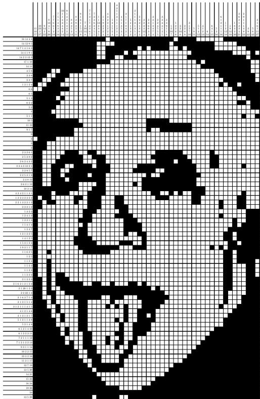

When talking about Japanese puzzles, everyone thinks of Sudoku.

<table><tr><td rowspan=1 colspan=1>5</td><td rowspan=1 colspan=1>|3</td><td rowspan=1 colspan=1></td><td rowspan=1 colspan=1></td><td rowspan=1 colspan=1>7</td><td rowspan=1 colspan=1></td><td rowspan=1 colspan=1></td><td rowspan=1 colspan=1></td><td rowspan=1 colspan=1></td></tr><tr><td rowspan=1 colspan=1>6</td><td rowspan=1 colspan=1></td><td rowspan=1 colspan=1></td><td rowspan=1 colspan=1>1</td><td rowspan=1 colspan=1>9</td><td rowspan=1 colspan=1>5</td><td rowspan=1 colspan=1></td><td rowspan=1 colspan=1></td><td rowspan=1 colspan=1></td></tr><tr><td rowspan=1 colspan=1></td><td rowspan=1 colspan=1>9</td><td rowspan=1 colspan=1>|8</td><td rowspan=1 colspan=1></td><td rowspan=1 colspan=1></td><td rowspan=1 colspan=1></td><td rowspan=1 colspan=1></td><td rowspan=1 colspan=1>6</td><td rowspan=1 colspan=1></td></tr><tr><td rowspan=1 colspan=1>8</td><td rowspan=1 colspan=1></td><td rowspan=1 colspan=1></td><td rowspan=1 colspan=1></td><td rowspan=1 colspan=1>6</td><td rowspan=1 colspan=1></td><td rowspan=1 colspan=1></td><td rowspan=1 colspan=1></td><td rowspan=1 colspan=1>3</td></tr><tr><td rowspan=1 colspan=1>4</td><td rowspan=1 colspan=1></td><td rowspan=1 colspan=1></td><td rowspan=1 colspan=1>8</td><td rowspan=1 colspan=1></td><td rowspan=1 colspan=1>3</td><td rowspan=1 colspan=1></td><td rowspan=1 colspan=1></td><td rowspan=1 colspan=1>1</td></tr><tr><td rowspan=1 colspan=1>7</td><td rowspan=1 colspan=1></td><td rowspan=1 colspan=1></td><td rowspan=1 colspan=1></td><td rowspan=1 colspan=1>2</td><td rowspan=1 colspan=1></td><td rowspan=1 colspan=1></td><td rowspan=1 colspan=1></td><td rowspan=1 colspan=1>6</td></tr><tr><td rowspan=1 colspan=1></td><td rowspan=1 colspan=1>6</td><td rowspan=1 colspan=1></td><td rowspan=1 colspan=1></td><td rowspan=1 colspan=1></td><td rowspan=1 colspan=1></td><td rowspan=1 colspan=1>2</td><td rowspan=1 colspan=1>8</td><td rowspan=1 colspan=1></td></tr><tr><td rowspan=1 colspan=1></td><td rowspan=1 colspan=1></td><td rowspan=1 colspan=1></td><td rowspan=1 colspan=1>4</td><td rowspan=1 colspan=1>1</td><td rowspan=1 colspan=1>9</td><td rowspan=1 colspan=1></td><td rowspan=1 colspan=1></td><td rowspan=1 colspan=1>5</td></tr><tr><td rowspan=1 colspan=1></td><td rowspan=1 colspan=1></td><td rowspan=1 colspan=1></td><td rowspan=1 colspan=1></td><td rowspan=1 colspan=1>8</td><td rowspan=1 colspan=1></td><td rowspan=1 colspan=1></td><td rowspan=1 colspan=1>7 9</td><td rowspan=1 colspan=1>7 9</td></tr></table>

When talking about Japanese puzzles, everyone thinks of Sudoku.

<table><tr><td rowspan=1 colspan=1>5</td><td rowspan=1 colspan=1>3</td><td rowspan=1 colspan=1>4</td><td rowspan=1 colspan=1>6</td><td rowspan=1 colspan=1>7</td><td rowspan=1 colspan=1>8</td><td rowspan=1 colspan=1>9</td><td rowspan=1 colspan=1></td><td rowspan=1 colspan=1>2</td></tr><tr><td rowspan=1 colspan=1>6</td><td rowspan=1 colspan=1>7</td><td rowspan=1 colspan=1>2</td><td rowspan=1 colspan=1></td><td rowspan=1 colspan=1>9</td><td rowspan=1 colspan=1>5</td><td rowspan=1 colspan=1>3</td><td rowspan=1 colspan=1>4</td><td rowspan=1 colspan=1>8</td></tr><tr><td rowspan=1 colspan=1></td><td rowspan=1 colspan=1>9</td><td rowspan=1 colspan=1>8</td><td rowspan=1 colspan=1>3</td><td rowspan=1 colspan=1>4</td><td rowspan=1 colspan=1>2</td><td rowspan=1 colspan=1>5</td><td rowspan=1 colspan=1>6</td><td rowspan=1 colspan=1>7</td></tr><tr><td rowspan=1 colspan=1>8</td><td rowspan=1 colspan=1>5</td><td rowspan=1 colspan=1>9</td><td rowspan=1 colspan=1>7</td><td rowspan=1 colspan=1>6</td><td rowspan=1 colspan=1></td><td rowspan=1 colspan=1>4</td><td rowspan=1 colspan=1>2</td><td rowspan=1 colspan=1>3</td></tr><tr><td rowspan=1 colspan=1>4</td><td rowspan=1 colspan=1>2</td><td rowspan=1 colspan=1>6</td><td rowspan=1 colspan=1>8</td><td rowspan=1 colspan=1>5</td><td rowspan=1 colspan=1>3</td><td rowspan=1 colspan=1>7</td><td rowspan=1 colspan=1>9</td><td rowspan=1 colspan=1></td></tr><tr><td rowspan=1 colspan=1>7</td><td rowspan=1 colspan=1></td><td rowspan=1 colspan=1>3</td><td rowspan=1 colspan=1>9</td><td rowspan=1 colspan=1>2</td><td rowspan=1 colspan=1>4</td><td rowspan=1 colspan=1>8</td><td rowspan=1 colspan=1>5</td><td rowspan=1 colspan=1>6</td></tr><tr><td rowspan=1 colspan=1>9</td><td rowspan=1 colspan=1>6</td><td rowspan=1 colspan=1></td><td rowspan=1 colspan=1>5</td><td rowspan=1 colspan=1>3</td><td rowspan=1 colspan=1>7</td><td rowspan=1 colspan=1>2</td><td rowspan=1 colspan=1>8</td><td rowspan=1 colspan=1>4</td></tr><tr><td rowspan=1 colspan=1>2</td><td rowspan=1 colspan=1>8</td><td rowspan=1 colspan=1>7</td><td rowspan=1 colspan=1>4</td><td rowspan=1 colspan=1></td><td rowspan=1 colspan=1>9</td><td rowspan=1 colspan=1>6</td><td rowspan=1 colspan=1>3</td><td rowspan=1 colspan=1>5</td></tr><tr><td rowspan=1 colspan=1>3</td><td rowspan=1 colspan=1>4</td><td rowspan=1 colspan=1>5</td><td rowspan=1 colspan=1>2</td><td rowspan=1 colspan=1>8</td><td rowspan=1 colspan=1>6</td><td rowspan=1 colspan=1></td><td rowspan=1 colspan=1>7</td><td rowspan=1 colspan=1>9</td></tr></table>

source: Wikipedia

But we will talk about Nonograms today.

A Nonogram is a puzzle; a small example:

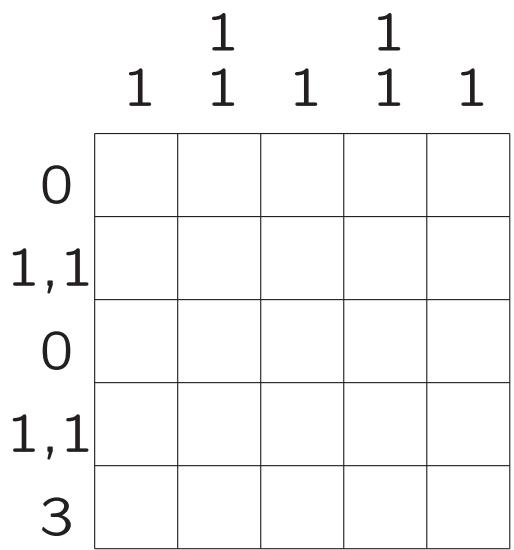

Next to each row and column we enumerate the lengths of consecutive series of red pixels.

Where are these red = black pixels?

The (unique) solution looks like this:

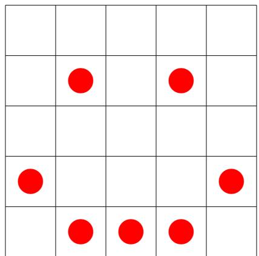

Next to each row and column we enumerate the lengths of consecutive series of red pixels — in order.

Why are scientists interested in Nonograms?

Tomography tries to solve the following problem: How to reconstruct an object from projections?

Examples:

0 Solve Nonograms

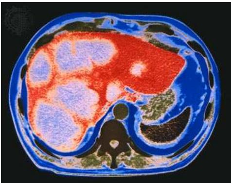

How do we look like, given CT-scans? (Computerized Tomography = CT 2 DT = Discrete Tomography)

Where are the "holes" in a diamond?

In Discrete Tomography we try to reconstruct an object from its projections.

An object "is" a finite subset of $\mathbf { Z } ^ { 2 }$ (so integer points in 2D space).

A projection gives all relevant "linesums" over lines parallel to a given line, e.g., all horizontal lines and all vertical lines (2 projections). It is also possible to use all lines through a given point.

In CT one typically has many projections, in DT a few.

A small example of a Discrete Tomography problem:

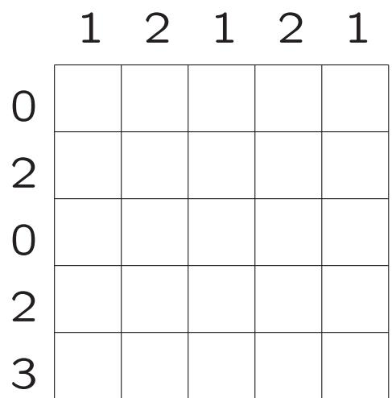

Next to each row and column we give the (total) number of red pixels.

Where are these red = black pixels?

A (non-unique) solution looks like this:

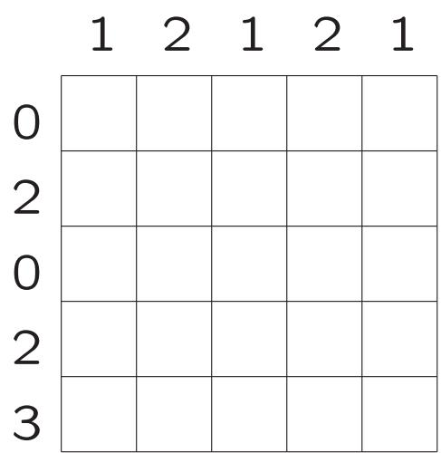

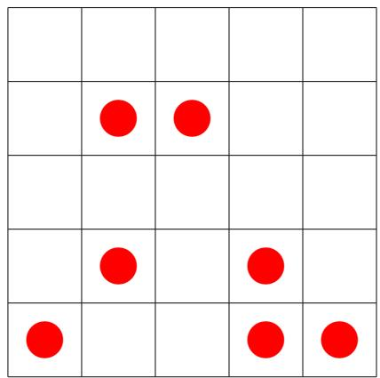

Next to each row and column we give the (total) number of red pixels.

The problem can be defined more general:

Given an unknown function $f$ on some domain $D$ (discrete, or just some subset of $\mathbf { R } ^ { n }$ ), with a discrete range $\subseteq \mathbf { R }$ , the task is to (approximately) reconstruct $f$ , given sums (integrals) over certain subsets of $D$

In our case, the range is $\{ 0 , 1 \} = \{ { \mathsf { w h i t e } } , { \mathsf { b l a c k } } \} .$

General reference: G.T. Herman & A. Kuba, Discrete tomography, Foundations, algorithms and applications, Birkhäuser, 1999.

Usually we have three tasks:

Consistency Does an object with the given projection values (a "solution to the puzzle") exist?

Uniqueness Suppose there is a solution. Does there exist another one?

Reconstruction Construct a solution.

All three problems, with horizontal and vertical projections, are solved in polynomial time by Ryser's Theorem from 1957.

But the problems for 3 or more projections are NP-hard!

If you were to use a flashlight in 2D, it would flicker like when throwing a stone into the water.

Ryser's Theorem Given two vectors $R = ( r _ { 1 } , \ldots , r _ { m } ) \in$ $\mathbf { N } _ { 0 } ^ { m }$ (the row sums) and $S = ( s _ { 1 } , \ldots , s _ { n } ) \in \mathbb { N } _ { 0 } ^ { n }$ (the column sums). Then there is a binary matrix $A = ( a _ { i j } )$ with $\Sigma _ { j = 1 } ^ { n } a _ { i j } = r _ { i }$ $( 1 \leq i \leq m )$ and $\Sigma _ { i = 1 } ^ { m } a _ { i j } = s _ { i }$ $( 1 \leq j \leq n )$ and only if $\Sigma _ { j = \ell } ^ { n } s _ { j } ^ { \prime } \geq \Sigma _ { j = \ell } ^ { n } \overline { { s } } _ { j }$ $( 2 \leq \ell \leq n )$

Here the $s _ { j } ^ { \prime }$ r the (non-increasing) sorted $s _ { j }$ , and the $\overline { { s } } _ { j }$ are the column sums of the matrix with the $r _ { i }$ as row sums, and ones in the leftmost positions.

Furthermore, all solutions can be obtained from one another by a series of switchings with switching components.

Ryser's algorithm constructs a solution working backward from the last column. The column sums are already sorted in non-increasing order $( s = s ^ { \prime } \ \mathsf { a n d } \ \overline { { s } } )$

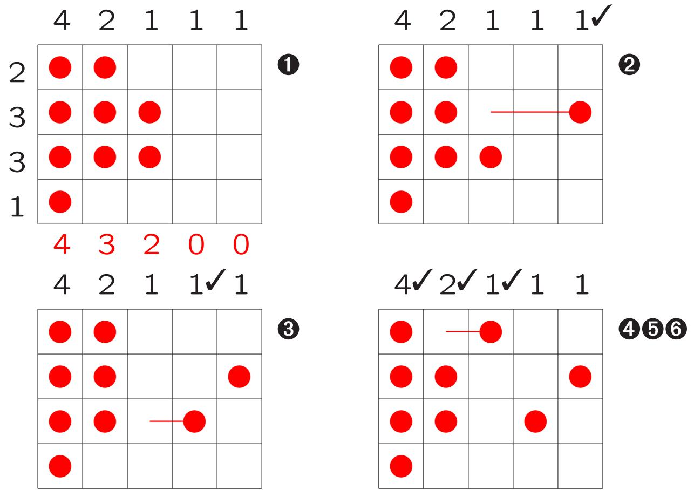

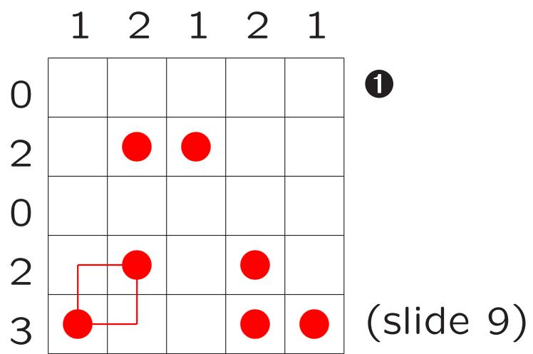

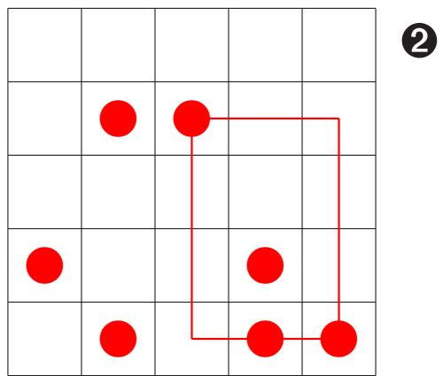

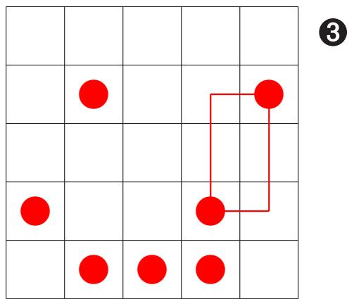

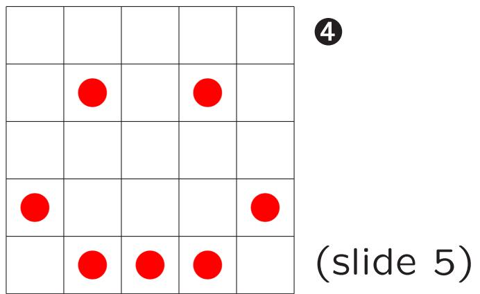

In an $h$ -convex object all rows must consist of consecutive black pixels: the rows have the "Nonogram property"

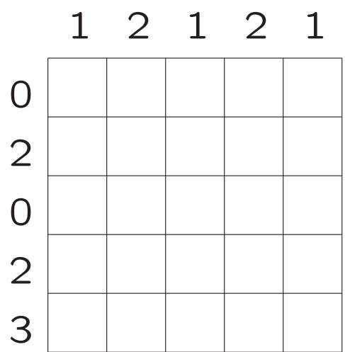

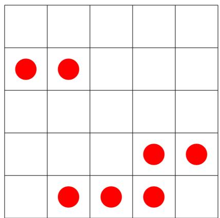

For $h$ -convex objects the 2 projections Reconstruction problem is NP-complete . ..

Now back to Nonograms: how to solve them?

Most humans use logic rules, combined with heuristics like "interchange row reasoning and column reasoning"

An example of a logic rule is: "if the number 3 is next to a row/column of width 5, the middle pixel must be red". In this particular rule one looks at one row or column at a time.

Suppose you already know:

<table><tr><td>3,2,1</td><td>??</td><td></td><td></td><td></td><td>?</td><td>•</td><td>?????</td><td></td><td></td><td></td><td></td></tr></table>

A • means a known white/empty pixel, a denotes a known filled pixel. The rest is still unknown.

Remember that we enumerate the lengths of consecutive series of red $=$ black pixels — in order.

What can we conclude?

We conclude that for this row:

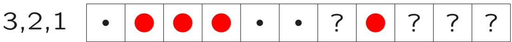

A • means a known white/empty pixel, a denotes a known filled pixel. The rest is still unknown.

So by examining a single row or column we can make progression.

How can a computer program draw such conclusions?

A first option is to use brute-force: try "all" possibilities. But a $5 \times 5$ Nonogram has

$$
2 ^ { 2 5 } = 2 ^ { 1 0 } \cdot 2 ^ { 1 0 } \cdot 2 ^ { 5 } = 1 0 2 4 \cdot 1 0 2 4 \cdot 3 2 \approx 3 2
$$

possible solutions! And the $^ { 1 1 } 8 0 \times 5 0$ Einstein" has $\cdot$ 101200 possibilities.

So ... no way! (But for small parts it might work.) We therefore first try some logic reasoning for a single line = row or column.

For a single line one can use Dynamic Programming.

We want a string $s _ { 1 } s _ { 2 } \ldots s _ { \ell }$ over the alphabet $\Sigma \cup \{ ? \}$ to match a regular expression $d _ { 1 } d _ { 2 } \ldots = \sigma _ { 1 } \{ a _ { 1 } , b _ { 1 } \} \sigma _ { 2 } \{ a _ { 2 } , b _ { 2 } \}$ (so first between $a _ { 1 }$ and $b _ { 1 }$ times the character $\sigma _ { 1 }$ , . . . ) in the following sense: $F i x ( i , j )$ is true if and only if the prefix $s _ { 1 } s _ { 2 } \ldots s _ { i }$ can be made to match $d _ { 1 } d _ { 2 } \dots d _ { j }$ by "fixing" ?'s to elements from ∑ (e.g., $\Sigma = \{ \bullet , \quad \} )$

$$
\begin{array} { r }  x ( i , j ) = \bigcirc { \bigcirc } { \bigcirc } { \bigcirc } { \bigcirc } { \bigcirc } { \bigcirc } { \bigcirc } { \bigcirc } { \bigcirc } { \bigcirc } { \bigcirc } { \bigcirc } { \bigcirc } { \bigcirc } { \bigcirc } { \bigcirc } { \bigcirc } { \bigcirc } { \bigcirc } { \bigcirc } { \bigcirc } { \bigcirc } { \bigcirc } { \bigcirc } { \bigcirc } { \bigcirc } { \bigcirc } { \bigcirc } { \bigcirc } { \bigcirc } { \bigcirc } { \bigcirc } { \bigcirc } { \bigcirc } { \bigcirc } { \bigcirc } { \bigcirc } { \bigcirc } { \bigcirc } { \bigcirc } { \bigcirc } { \bigcirc } { \bigcirc } { \bigcirc } { \bigcirc } { \bigcirc } { \bigcirc } { \bigcirc } { \bigcirc } { \bigcirc } { \bigcirc } { \bigcirc } { \bigcirc } { \bigcirc } { \bigcirc } { \bigcirc } { \bigcirc } { \bigcirc } { \bigcirc } { \bigcirc } { \bigcirc } { \bigcirc } { \bigcirc } { \bigcirc } { \bigcirc } { \bigcirc } { \bigcirc } { \bigcirc } { \bigcirc } { \bigcirc } { \bigcirc } { \bigcirc } { \bigcirc } { \bigcirc } { \bigcirc } { \bigcirc } { \bigcirc } { \bigcirc } { \bigcirc } { \bigcirc } { \bigcirc } { \bigcirc } { \bigcirc } { \bigcirc } { \bigcirc } { \bigcirc } { \bigcirc } { \bigcirc } { \bigcirc } { \bigcirc } { \bigcirc } { \bigcirc } { \bigcirc } { \bigcirc } { \bigcirc } { \bigcirc } { \bigcirc } { \bigcirc } { \bigcirc } { \bigcirc } { \bigcirc } { \bigcirc } { \bigcirc } { \bigcirc } { \bigcirc } { \bigcirc } { \bigcirc } { \bigcirc } { \bigcirc } { \bigcirc } { \bigcirc } { \bigcirc } { \bigcirc } { \bigcirc } { \bigcirc } { \bigcirc } { \bigcirc } { \bigcirc } { \bigcirc } { \bigcirc } { \bigcirc } { \bigcirc } { \bigcirc } { \bigcirc } { \bigcirc } { \bigcirc } { \bigcirc } { \bigcirc } { \bigcirc } { \bigcirc } { \bigcirc } { \bigcirc } { \bigcirc } { \bigcirc } { \bigcirc } { \bigcirc } { \bigcirc } { \bigcirc } { \bigcirc } { \bigcirc } { \bigcirc } { \bigcirc } { \bigcirc } { \bigcirc } { \bigcirc } { \bigcirc } { \bigcirc } { \bigcirc } { \bigcirc } { \bigcirc } { \bigcirc } { \bigcirc } { \bigcirc }  { \bigcirc \bigcirc } { \bigcirc } { \bigcirc } { \bigcirc } { \bigcirc } { \bigcirc } { \bigcirc } { \bigcirc }  { \bigcirc } { \bigcirc }  \ \end{array}
$$

Here $A _ { j } = \textstyle \sum _ { p = 1 } ^ { j } a _ { p } , B _ { j } = \textstyle \sum _ { p = 1 } ^ { j } b _ { p }$ and $L _ { i } ^ { \sigma } ( s )$ is the argest index $h \leq i$ with $s _ { h } \notin \{ \sigma , ? \}$ if this exists (and O otherwise).

This polynomial time Dynamic Programming approach allows for efficient solving of most puzzles from newspapers. One can repeatedly apply the method to all rows and columns, thereby also introducing a difficulty measure.

See K.J. Batenburg & WAK, Solving Nonograms by combining relaxations, Pattern Recognition, 2009.

percentage unsolved pixels for randomly generated puzzles of different size, black percentage

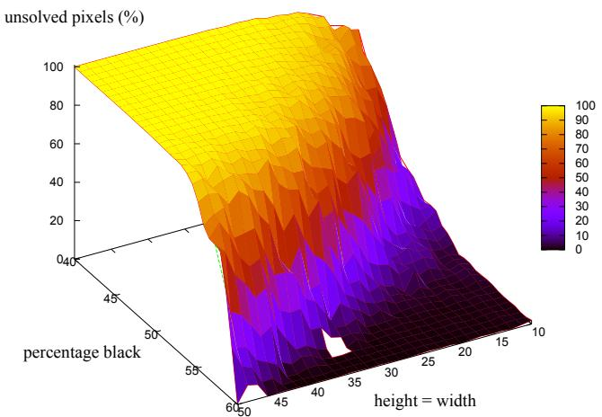

How far can we get by looking at a single row/column? Again, with • for a white pixel, and for a filled one:

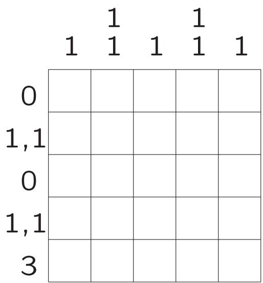

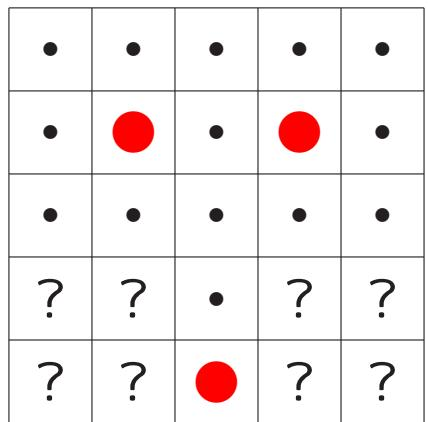

But now we are stuck . .. unless we use rows and columns together.

We have this:

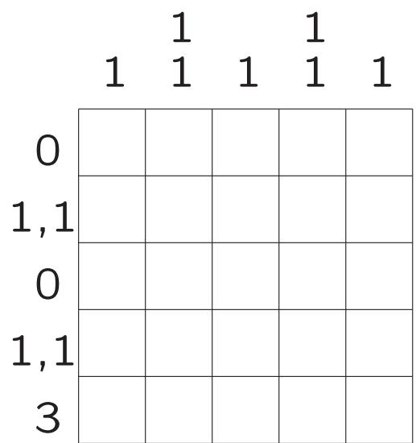

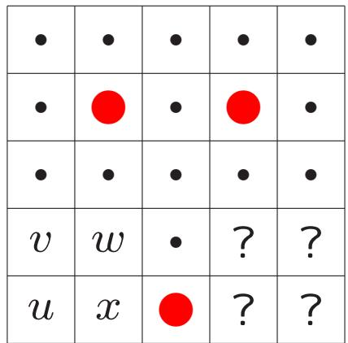

Suppose that $u =$ , then (column) v must be empty, and so (row) $w = \bullet$ , and therefore (column) $x$ must be empty. Contradiction (row)! So u must be empty.

The rest is simple.

The logic we used here has rules like "if this pixel is red, that pixel must be white" . This can be modeled through a 2-SAT problem, which happens to be solvable in polynomial time — in contrast with 3-SAT, which is NP-complete.

This adds another difficult measure.

Solving a Nonogram in general is NP-complete.

As an illustration that this 2-SAT logic sometimes fails to catch everything:

<table><tr><td rowspan="5"></td><td></td><td>2 1</td><td>1</td><td>1 1 1</td><td></td></tr><tr><td>1 ?</td><td></td><td>?</td><td></td><td>?</td></tr><tr><td></td><td></td><td></td><td>2?????</td><td></td></tr><tr><td>1 ?</td><td></td><td>?</td><td></td><td>0</td></tr><tr><td></td><td></td><td>2?????</td><td></td><td></td></tr><tr><td></td><td>1 ?</td><td></td><td>?</td><td></td><td>?</td></tr></table>

Partially solved $5 \times 5$ Nonogram, where the fact that pixel $\bigcirc$ must be white is hard to infer.

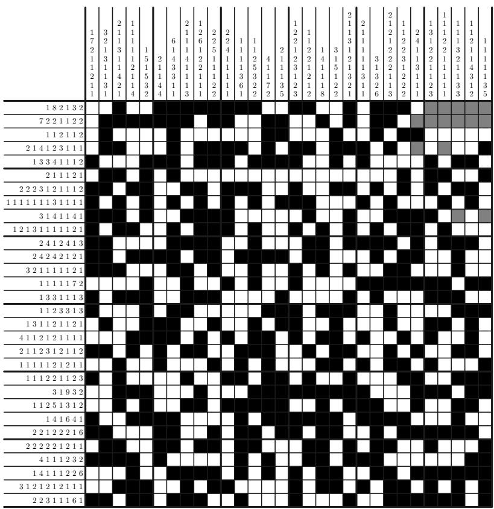

Randomly generated partially solved $3 0 \times 3 0$ Nonogram, with 50 $\%$ black pixels; the grey cells denote the unknown pixels. This Nonogram has six solutions.

# How to build $=$ design your own Nonogram?

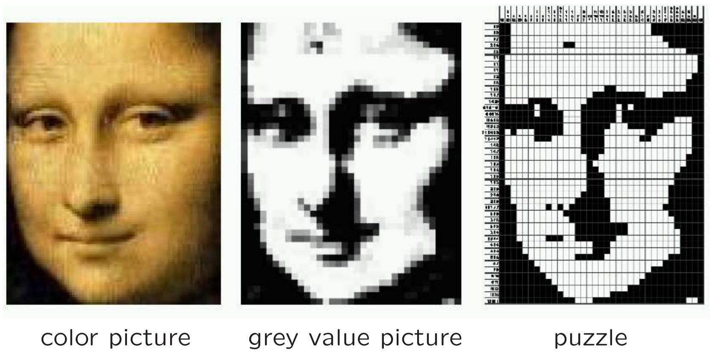

http://www.liacs.nl/home/kosters/nono/

Remember that a good Nonogram should have a unique solution.

In general they have many different solutions with switching components!

1 1 1 1 1 1 1 →

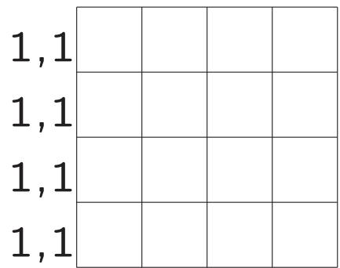

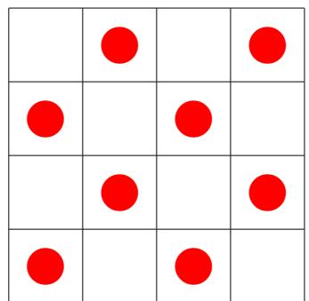

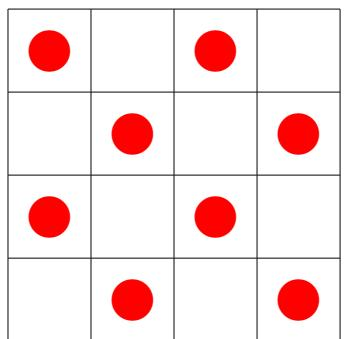

There are several interesting questions attached to a game like Tetris:

How to play well? (AI — Artificial Intelligence)

C How hard is it? (complexity)

• What might happen?

It has been shown that certain Tetris-problems are NPcomplete (joint work with researchers from MIT & HJH), that you can reach almost all configurations, but that not all problems are "decidable".

The 7 Tetris-pieces:

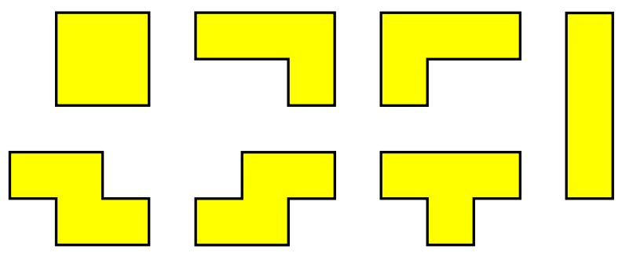

Random pieces fall down, and filled lines are cleared.

The question "Is it possible, given a finite ordered series of these pieces, to clear a partially filled game board?" is NP-complete.

If someone clears the board, this is easy to verify. If clearing is not possible however, up till now the only thing one can do to prove this is to check all possibilities, one by one!

An "arbitrary" configuration:

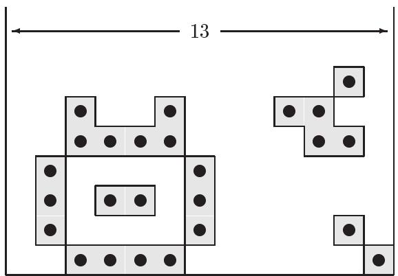

This figure can be made by dropping 276 suitable Tetrispieces in the appropriate way, see

http://www.liacs.nl/home/kosters/tetris/

Claim: on a game board of odd width every configuration is reachable.