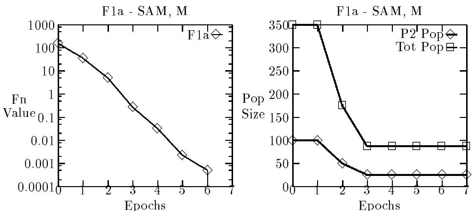
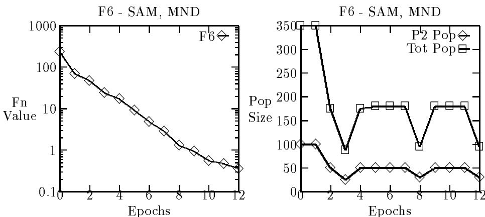
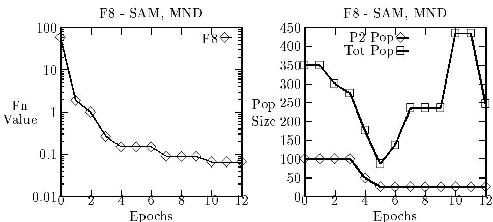

# DEPARTMENT OF COMPUTER AND MATHEMATICAL SCIENCES

# Self-Adaptive Genetic Algorithm for Numeric Functions1

Robert Hinterding email: rhh@matilda.vut.edu.au

Zbigniew Michalewicz Department of Computer Science, University of North Carolina, Charlotte, NC 28223, USA email:zbyszek@uncc.edu

T. C. Peachey email: tom@matilda.vut.edu.au

# Abstract

Self-adaption is one of the most promising areas of research in evolutionary computation as it adapts the algorithm to the problem while solving the problem. In this paper we extend self-adaption to operate on more than one aspect of evolutionary computation and at more than one level of adaption. We developed a genetic algorithm which self-adapts both mutation strength and population size; the results indicate that the approach works quite well.

# 1 Introduction

Since evolutionary algorithms implement the idea of evolution, it is more than natural to expect some self-adapting characteristics of these techniques. Apart from evolutionary strategies, which incorporate some of its control parameters in the solution vectors, most other techniques use fixed representations, operators, and control parameters. Some of the promising research areas based on the inclusion of self adapting mechanisms are:

• representation of individuals (as proposed by Shaefer (1987); the Dynamic Parameter Encoding technique, Schraudolph & Belew (1992) and messy genetic algorithms, Goldberg et al. (1991) also fall into this category). • operators. It is clear that different operators play different roles at different stages of the evolutionary process. The operators should adapt (e.g., adaptive crossover Schaffer & Morishima (1987), Spears (1995)). This is true especially for time-varying fitness landscapes. control parameters. There have been various experiments aimed at adaptive probabilities of operators (Davis, 1989; Julstrom, 1995; Srinivas & Patnaik, 1994). However, much more remains to be done.

It seems that this is one of the most promising directions of research; after all, the power of evolutionary algorithms lies in their adaptiveness. The advantages of self-adaption are that for the parameters being self-adapted hand tuning is not required, they dynamically adapt to the changing requirements during the run and this is done while evolving a problem solution.

Angeline (1995) provides a classification of adaptive and self-adaptive evolutionary computation (EC) techniques:

"Adaptive evolutionary computations can be separated largely by the level at which the adaptive parameters operate. Populationlevel techniques dynamically adjust parameters that are global to the entire population, such as global crossover frequency. Individual-level adaptive methods modify how a particular individual within the population is affected by the [...] operators. Component-level adaptive ECs dynamically alter how the individual components of each individual will be manipulated independently from each other."

Additionally, the EC systems can be classified as adaptive or self-adaptive on the basis whether or not they evolve the values for the adaptive parameters.

In this paper we discuss a particular self-adaptive system (SAGA) for numerical optimisation problems, which combines population-level and individuallevel techniques. The paper is organized as follows. The next section explains population-level and individual-level techniques incorporated in the proposed system; it also includes a discussion on adaptation of the population sizes. Section 3 reports the results of experiments and section 4 concludes the paper.

# 2 SAGA—A Self-Adaptive Genetic Algorithm

SAGA (Self-Adaptive Genetic Algorithm) uses population-level and individuallevel adaptive parameters to self-adapt the population size and the mutation strength during the runs. While the self-adaptiveness for the mutation strength was explored in earlier work (Hoffmeister & Bäck, 1992; Hinterding, 1995), the addition of population-level techniques to control the size of the EC populations is discussed in this paper.

There have been empirical studies (De Jong, 1975; Grefenstette, 1986; Schaffer et al. , 1989) that address the question "how large should a GA population be for a given problem?"; there are also a number of heuristics on sizing GA populations. Some researchers studied the problem from a theoretical point of view, e.g., to maximize schemata processing ability (Goldberg, 1989) or to maximize GA performance by insuring accurate sampling (Goldberg et al. , 1992).

There are also two attempts reported at dynamically adjusting (selfadapting) the population size. One method (Smith, 1993) is based on the absolute expected selection loss; the other (Arabas et al. , 1994) — on the concept of the age of individuals in the population. SAGA proposes a new approach which is based on the concepts of co-evolution: there is a community of three individual genetic algorithms (IGAs) with different population sizes. The population sizes are adapted by using a mutation function which is activated after a set number of function evaluations (an epoch) for each of the IGAs. This mutation function uses either the best fitness value or best fitness improvement found during an epoch to adjust the population size for each or the IGAs for the next epoch. We explain this process in detail in the next section of the paper.

Also, the IGA can self-adapt the mutation strength during the run. This requires addition of one value ms to each chromosome (which is allowed to vary from 0.000001 to 0.2); this value controls the standard deviation of the Gaussian mutation applied to the genes in the chromosome to be mutated. This value is allowed to participate in crossover and mutation, but does not contribute directly to the fitness of the solution. When the chromosome is to be mutated the following steps are followed:

1. decode the gene ms to a value,

2. apply Gaussian noise to the ms value using a standard deviation of 0.013 (meta-mutation).   
3. use the ms value as the standard deviation for the Gaussian noise to mutate the other genes in the chromosome,   
4. write the mutated genes (including ms) back to the chromosome.

During the initialization process, the value of ms for all chromosomes is set using a Gaussian distributed random variable with mean O.1 and standard deviation 0.01. When fixed Gaussian mutation is used (for experiments described later in the paper), the standard deviation for the Gaussian noise is set to 0.1.

# 2.1 Adaptation of the population size

Three IGAs (with population sizes of P1, P2, and P3, respectively, and initial values of 50, 100 and 200) are used. The population sizes are adapted to maximize the performance of the IGA-P2 system; the best fitness found during an epoch of 1,000 evaluations for each IGA is used as the criteria to alter the population sizes.

Fitness refers to the fitness of the best individual or improvement of the best fitness value found, measured at the start and end of the epoch. IGAP1, IGA-P2, and IGA-P3 are referred to as: P1, P2, and P3; P1 has always the smallest population, and P3 — the largest.

The population sizes are allowed to range from 10 to 1,000, and the differences between the population sizes are kept to at least 20. There are two categories of rules; those activated when the fitnesses of the IGAs converge and those activated when the fitness values are distinct.

The rules in the first category, when two or three fitnesses from the IGAs are the same $( < 1 e - 9 )$ , are to move the populations further apart. That is, the smallest population size is decreased and the largest population size is increased. Given the assumption that population size effects performance, the justification for these rules is that if the fitnesses converge, the population sizes are too close together, or a (local) optimum has been found. In either case adjusting the population sizes so that they are further apart could help. Note that the case when P1, P2 and P3 have the same fitness is covered by the first rule as the fitness of P2 is not considered for this rule.

P1 & P3 have the same fitness: expand left and expand right P1 & P2 have the same fitness: expand left P2 & P3 have the same fitness: expand right

where the adjustment operator 'expand' is defined as:

expand left: $\mathrm { s i z e ( P 1 ) : = s i z e ( P 1 ) / 2 }$ ; rest unaltered expand right: $\mathrm { s i z e ( P 3 ) : = s i z e ( P 3 ) ^ { * } 2 }$ ; rest unaltered

The second category covers the situation where the best fitness values from P1, P2, and P3 are distinct. Here we try to adjust the population sizes so that the performance of P2 is maximized. The following set of rules gives a list of appropriate actions (in terms of adjustment operators being invoked) for each possible case (these cases are ordered by fitness, smallest fitness value on the left, largest on right):

P1 P2 P3: move right   
P1 P3 P2 or P2 P1 P3: compress left P2 P3 P1 or P3 P1 P2: compress right P3 P2 P1: move left

where the adjustment operators 'move' and 'compress' are defined as:

move right: $\mathrm { s i z e ( P 1 ) } : = \mathrm { s i z e ( P 2 ) } ; \mathrm { s i z e ( P 2 ) } : = \mathrm { s i z e ( P 3 ) } ; \mathrm { s i z e ( P 3 ) } : =$ $\mathrm { s i z e ( P 3 ) ^ { * } 2 }$   
move left: $\mathrm { s i z e ( P 1 ) } : = \mathrm { s i z e ( P 1 ) } / 2 ; \mathrm { s i z e ( P 2 ) } : = \mathrm { s i z e ( P 1 ) } ; \mathrm { s i z e ( P 3 ) } : =$ size(P2)   
compress left: $\mathrm { s i z e ( P 1 ) : = ( s i z e ( P 1 ) + s i z e ( P 2 ) ) / 2 }$ ; rest unaltered compress right: $\mathrm { s i z e ( P 3 ) : = ( s i z e ( P 2 ) + s i z e ( P 3 ) ) / 2 }$ rest unaltered

We justify these heuristic rules on the following grounds. As we used three IGAs (the minimum we thought would work), it seemed sensible to have rules that would maximize the performance of the "middle IGA" (i.e., the IGA with the middle population size). Then we could have rules that would adjust all the population sizes to be larger or smaller if the best population size could be outside the range of the current population sizes ('move' rules). We can also have rules to adjust the population size of the worse IGA so that it is closer in size to the others. The idea was to design rules that would explore different population sizes, try to maximize the performance of IGA-P2, and, if it was unclear how to adjust the population sizes then to take some action that could lead to future improvements.

As SAGA contains three IGAs we have the option of keeping the populations from the IGAs separate or we can allow them to mix at the end of each epoch. In the latter case, the three populations are collected into a single population pool at the end of an epoch, and after the sizes of the populations are adjusted, the three IGAs will draw their members from the population pool randomly. If the number of individuals in the population pool is insufficient to meet the needs of the IGAs, the number of individuals they get from the population pool is proportional to their desired population size. For example, if desired population sizes of the three IGAs are 10, 30 and 60, and the population pool contains only 50 individuals, then they will get 5, 15 and 30 individuals respectively.

When a population size is to decrease the worst individuals in the IGA or population pool are removed. When a population size is to be increased, we can either randomly generate new individuals and add them to the IGA or population pool or we can allow the population of an IGA to grow to the desired size by not deleting individuals for a number of generations.

<table><tr><td>F1 f (xi) |i=1,3) = 3 x2</td></tr><tr><td>F1a f(xi) |i=1,30) = P30 x 2~ =</td></tr><tr><td>F2 f (xi) |i=1,2) = 100(x2 − x2)2 + (1 − x1)2</td></tr><tr><td>F3 25 1</td></tr><tr><td>f (xi) |i=1,2) = 1 + ∑ j=1 j+∑ i=1 (xi−aij)6 F5 xi  [65.536, 65.536]</td></tr><tr><td>K = 500</td></tr><tr><td>F6 xi  [−512, 512]</td></tr><tr><td>F7 V = 4189.827601614</td></tr><tr><td>x2 F8 xi  [−512, 512] xi  [65.536, 65.536] f(xi) |i=1,45) = min(x25 + ∑k=0(x2 + uz))</td></tr><tr><td>F9 i</td></tr></table>

# 2.2 The IGAs

The GA used for the IGAs is a steady-state GA (Davis, 1991) using tournament selection with a tournament size of two. It uses bit-string representation, but the genes are considered to be the function variables rather than the binary bits. Crossover and mutation are used as independent reproduction operators; that is a new individual is produced by either crossover or mutation and never by both. The crossover/mutation rate determines the proportion of new individuals produced by crossover or mutation. Two point crossover is used and crossover points operate at the bit level. Mutation modifies genes and Gaussian mutation is used. Two parameters control mutation: Poisson mean—which is the mean number of genes that will be mutated in a chromosome; and mutation strength—which is the standard deviation of the Gaussian noise used in the mutation of a gene.

When a new individual is created, and it duplicates an individual already in the population, it is discarded and still counted as an evaluation. The other major parameter is the replacement rate, which is the percentage of the population to be replaced in one generation.

# 3 Experiments and Results

For the experiments, test functions have been taken from a number of sources, and more difficult functions have been included. F1 - F5 are from De Jong (1975), F6 - F8 are from Gordon & Whitley (1993), F1a and $\mathrm { F 9 }$ are from Hoffmeister and Bäck (1992), and F10 is from Michalewicz (1994). The test functions include a range of function types and include nonlinear, non-separable and scalable functions. The functions are shown in Table 1. Gray coded binary representation was used for each function.

SAGA was allowed to run for up to 12 epochs on the test functions except for F10 where 20 epochs were allowed. All parameter settings for the

Table 2: Results — average number of epochs or average best value   

<table><tr><td rowspan="2">Fn. CTRL</td><td colspan="3">FM - fixed mutation</td><td colspan="6">S AM self-adaptive mutation</td></tr><tr><td></td><td>NM</td><td>M</td><td>CTRL</td><td>NM</td><td>M</td><td>MND</td><td>MG</td><td>MGND</td></tr><tr><td>F1</td><td>2.3</td><td>1.9</td><td>2.1</td><td>2.5</td><td>2.3</td><td>2.5</td><td>2.2</td><td>2.7</td><td>2.5</td></tr><tr><td>F1a</td><td>0/1.1e-1</td><td>0/1.8e-2</td><td>1/1.4e-8</td><td>3/7.1e-4</td><td>8.1</td><td>7.3</td><td>8.6</td><td>7.9</td><td>7.8</td></tr><tr><td>F2</td><td>7/3e-7</td><td>7/8e-7</td><td>7/1.8e-6</td><td>4.2</td><td>4.3</td><td>3.6</td><td>4</td><td>3.4</td><td>3.5</td></tr><tr><td>F3</td><td>2.2</td><td>2</td><td>2.2</td><td>2</td><td>2</td><td>1.8</td><td>1.8</td><td>2</td><td>1.7</td></tr><tr><td>F5</td><td>1.6</td><td>1.3</td><td>1.6</td><td>2.1</td><td>2.1</td><td>1.8</td><td>2.2</td><td>1.9</td><td>1.7</td></tr><tr><td>F6</td><td>0/1.8e1</td><td>0/2.3e1</td><td>0/2e1</td><td>0/4e0</td><td>0/2.6e0</td><td>0/6.4e0</td><td>1/1.1e0</td><td>0/3.5e0</td><td>1/2.2e0</td></tr><tr><td>F7</td><td>-0/4.8e1</td><td>2/8.9e1</td><td>6/5.9e1</td><td>1/2.5e0</td><td>4/2.6e1</td><td>8/2.4e1</td><td>8/1.3e-2</td><td>9/3.4e1</td><td>6.7</td></tr><tr><td>F8</td><td>0/1.2e-1</td><td>1/1.1e-1</td><td>0/1.8e-1</td><td>0/6.2e-2</td><td>2/7.1e-2</td><td>0/7e-2</td><td>2/4.7e-2</td><td>1/6e-2</td><td>2/4.1e-2</td></tr><tr><td>F9</td><td>0/1.5e3</td><td>&#x27;0/1.5e3</td><td>0/7.9e2</td><td>0/1.4e2</td><td>0/3.4e1</td><td>0/1.6e1</td><td>0/2.3e1</td><td>0/2.1e1</td><td>&#x27;0/3.1e1</td></tr><tr><td>F10</td><td>0/1.3e5</td><td>0/1.3e5</td><td>0/4.2e4</td><td>0/2.7e4</td><td>0/1.7e4</td><td>0/1.67e4</td><td>0/1.7e4</td><td>0/1.68e4</td><td>0/1.7e4</td></tr></table>

IGAs, except for population size was taken from Hinterding (1995).

SAGA was run on these ten test functions in nine different configurations. The configurations can be divided into two major groups: where fixed strength Gaussian mutation was used (FM), and where self-adaption of the mutation strength was used (SAM). The sub-configurations common to both groups are:

• Control (CTRL) — Populations sizes remain fixed, populations are kept separate, extra individuals generated randomly. • No Mix (NM) — Population size allowed to self-adapt, populations kept separate, extra individuals generated randomly. • Mix (M) — Population size allowed to self-adapt, populations mix at epochs, extra individuals generated randomly.

The following three sub-configurations were only used with self-adaption of mutation strength.

• Mix, No Dups (MND) — population size allowed to self-adapt, populations mix at epochs, extra individuals generated randomly, duplicates removed from population pool.   
• Mix, Grow (MG) - population size allowed to self-adapt, populations mix at epochs, populations grow to desired size.   
• Mix, Grow, No Dups (MGND) — population size allowed to self-adapt, populations mix at epochs, populations grow to desired size, duplicates removed from population pool.

Results are produced by averaging the results from ten runs of SAGA on each of the functions. The results are summarised in Table 2. In this table, an entry consisting of a single number indicates the problem was always solved and gives the average number of epochs to solve the problem, while entries of the form $x / y$ should be interpreted as follows: $x$ gives the number of times the problem was solved and $y$ gives the average best value found. Average number of epochs rather than average number of evaluations to solve are reported as SAGA can act as three independent GAs or as three interconnected GAs depending on whether or not the populations are allowed to mix.

Table 3: Results — average total population size   

<table><tr><td>Epochs</td><td>0</td><td>1</td><td>2</td><td>3</td><td>4</td><td>5</td><td>6</td><td>7</td><td>8</td><td>9</td><td>10</td><td>11</td><td>12</td></tr><tr><td>F1a</td><td>350</td><td>350</td><td>175</td><td>87</td><td>85.5</td><td>85.5</td><td>85</td><td>89.5</td><td>133</td><td></td><td></td><td></td><td></td></tr><tr><td>F6</td><td>350</td><td>350</td><td>187.5</td><td>134</td><td>128.3</td><td>133</td><td>134.2</td><td>123.9</td><td>138.7</td><td>160.1</td><td>147.2</td><td>154.5</td><td>128.5</td></tr><tr><td>F8</td><td>350</td><td>350</td><td>212.5</td><td>154.9</td><td>112.2</td><td>101.2</td><td>130</td><td>104.9</td><td>131.7</td><td>203.2</td><td>347</td><td>340</td><td>415.4</td></tr></table>

The results from Table 2 show that for the set of runs where fixed Gaussian mutation is used, adaptation of the population size is not always beneficial, and (surprisingly) that allowing the populations to mix can also be detrimental. The situation is very different when we enable self-adaption of the mutation strength. Now adaption of the population size and allowing the populations to mix both give improved results. In fact, except for the simple functions F1, F3, and F5, these configurations give the best results. The other point to notice is that the configurations where duplicates are removed give better results for the multimodal functions.

Table 3 displays the trends in the total population sizes for a few of the functions in the following configurations: F1a - SAM, M; F6 & F8 - SAM, MND. For problem F1a (sphere in 30 dimensions) the trend is clearly to get the population sizes small and keep them small, as this is a simple function and exploitation (rather than exploration) gives better results. In a few of the runs, the population size increases at the end of the run as the values found by the three IGAs converge. With problems F6 (Rastrigin's function) and F8 (Griewank's function) the populations do not decrease to the same extent, and increase again to facilitate escaping local optima and to change the mode to exploration. In some runs (e.g., on F6), it can be seen that the population size fluctuates as the SAGA increases the population size to escape a local optimum and then decreases the population size again to find the next optimum (see Fig. 2).

# 4 Conclusions and Future Research

Self-adaption is an important area of research in EC as it adapts the algorithm to the problem while solving the problem. SAGA, the system developed, combines population-level and individual-level adaption; and selfadapts two different parameters, population size and mutation strength.

SAGA can adopt different strategies for different test functions. On continuous unimodal functions (F1, F1a, F9 & F10) it is able to adapt to small population sizes for all the IGAs; to maximize their exploitation capabilities. A small population size leads to a greater number of generations per epoch and increases the average fitness of the individuals selected.

For functions where exploration is more important, some interesting trends can be seen. The removal of duplicates from the population pool is beneficial as this lowers the average fitness of individuals selected and increases the diversity of the population. IGA-P1 tends towards a small population size, and IGA-P3 tends to a large population size. Here we get an interesting maximization of both exploitation and exploration by using different population sizes. While at the same time using mixing of the populations to minimize their respective problems: converging to local optima, and lack of progress. So some ideas of co-evolutionary computation were used in a new and interesting manner.

  
Figure 1: Function value $\&$ population size in single run of F1a

  
Figure 2: Function value $\&$ population size in single run of F6

  
Figure 3: Function value & population size in single run of F8

While previous work has dealt with self-adapting only one aspect of EC systems, we have shown that self-adapting more than one is both possible and beneficial. A natural extension to this research is to include selfadaption of other parameters as well. We self-adapt only one parameter per adaption level, but just as ECs can optimise many function variables, it should be possible to self-adapt many parameters concurrently. This is summarised well by Angeline (1995):

"There is no reason to believe that having only one level of adaption in an evolutionary computation is optimal. On the contrary, combining methods at different levels may actually provide significant advantages in some environments. Some effort is required to determine effective methods for combining adaptive methods at different levels and determine when they are useful."

# Список литературы

Angeline, P.J. 1995. Adaptive and Self-Adaptive Evolutionary Computation. In: Computational Intelligence, A Dynamic System Perspective. IEEE Press. pp.152161.

Arabas, J., Michalewicz, Z., & Mulawka, J. 1994. GAVaPS — a Genetic Algorithm with Varying Population Size. In: Proceedings of the First IEEE Conference on Evolutionary Computation. Orlando, Florida: IEEE Press. pp. 7378.

Davis, L. 1989. Adapting Operator Probabilities in Genetic Algorithms. In: Proceedings of the 3rd International Conference on Genetic Algorithms. Morgan Kaufmann.

Davis, L. (ed). 1991. Handbook of Genetic Algorithms. Van Nostrand Reinhold.

De Jong, K. A. 1975. An Analysis of the Behaviour of a Class of Genetic Adaptive System. Doctoral dissertation, University of Michigan. Dissertation Abstract International, 36(10), 5140B. (University Microfilms No 76-9381).

Goldberg, D.E. 1989. Sizing Populations for Serial and Parallel Genetic Algorithms. In: Proceedings of the 3rd International Conference on Genetic Algorithms. Morgan Kaufmann. pp.51-60.

Goldberg, D.E., Deb, K., & Korb, B. 1991. Do not Worry, Be Messy. In: Proceedings of the 4th International Conference on Genetic Algorithms. Morgan Kaufmann. pp.2430.

Goldberg, D.E., Deb, K., & Clark, J.H. 1992. Accounting for Noise in the Sizing of Populations. In: Whitley, D. (ed), Foundations of genetic Algorithms 2. Morgan Kaufmann. pp. 127-140.   
Gordon, V. S., & Whitley, D. 1993. Serial and Parallel Genetic Algorithms as Function Optimizers. In: Proceeding of the Fifth International Conference on Genetic Algorithms. Morgan Kaufmann. pp 177-183.   
Grefenstette, J.J. 1986. Optimization of Control Parameters for Genetic Algorithms. IEEE Transactions on Systems, Man, and Cybernetics, 16(1), pp.122128.   
Hinterding, R. 1995. Gaussian Mutation and Self-adaption in Numeric Genetic Algorithms. In: IEEE International Conference on Evolutionary Computation. IEEE Press. pp 384-389.   
Hoffmeister, F., & Bäck, T. 1992 (Feb). Genetic Algorithms and Evolution Strategies: Similarities and Differences. Technical Report No. SYS1/92. Systems Analysis Research Group, University of Dortmund, Germany.   
Julstrom, B.A. 1995. What Have You Done for Me Lately? Adapting Operator Probabilities in a Steady-State Genetic Algorithm. In: Proceedings of the Sixth International Conference on Genetic Algorithms. Morgan Kaufmann. pp.81-87.   
Michalewicz, Z. 1994. Genetic Algorithms $^ +$ Data Structures $=$ Evolution Programs. 2nd edn. Springer - Verlag.   
Schaffer, J., Caruana, R., Eshelman, L., & Das, R. 1989. A Study of Control Parameters Affecting Online Performance of Genetic Algorithms for Function Optimization. In: Proceedings of the 3rd International Conference on Genetic Algorithms. Morgan Kaufmann. pp.51-60.   
Schaffer, J.D., & Morishima, A. 1987. An Adaptive Crossover Distribution Mechanism for Genetic Algorithms. In: Proceedings of the 2nd International Conference on Genetic Algorithms. Lawrence Erlbaum Associates. pp.3640.   
Schraudolph, N., & Belew, R. 1992. Dynamic Parameter Encoding for Genetic Algorithms. Machine Learning, 9(1), pp.921.   
Shaefer, C.G. 1987. The ARGOT Strategy: Adaptive Representation Genetic Optimizer Technique. In: Proceedings of the 2nd International Conference on Genetic Algorithms. Lawrence Erlbaum Associates. pp.50-55.   
Smith, R. 1993. Adaptively Resizing Populations: An Algorithm and Analysis. In: Proceedings of the 5th International Conference on Genetic Algorithms. Morgan Kaufmann. p.653.

Spears, W.M. 1995. Adapting Crossover in Evolutionary Algorithms. In: McDonnell, J.R., Reynolds, R.G., & Fogel, D.B. (eds), Proceedings of the Fourth Annual Conference on Evolutionary Programming. The MIT Press. pp.367384.

Srinivas, M., & Patnaik, L.M. 1994. Adaptive Probabilities of Crossover and Mutation in Genetic Algorithms. IEEE Transactions on Systems, Man, and Cybernetics, 24(4), pp.1726.