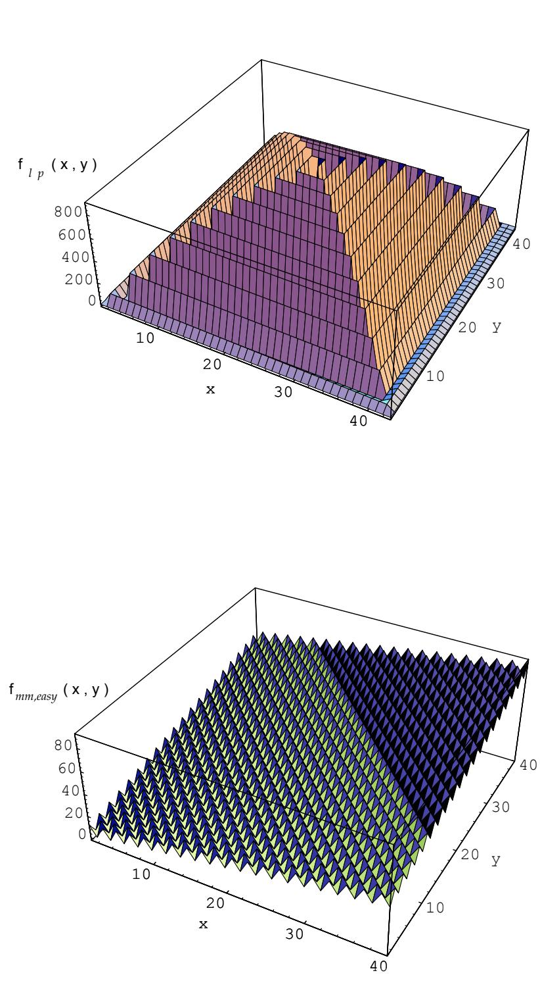
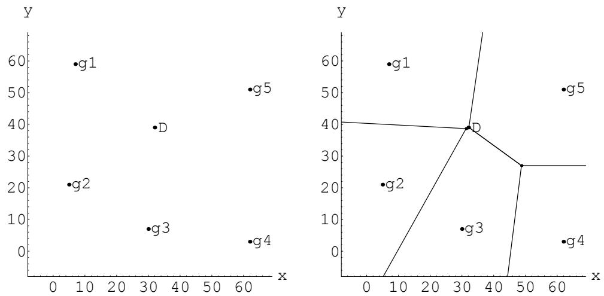
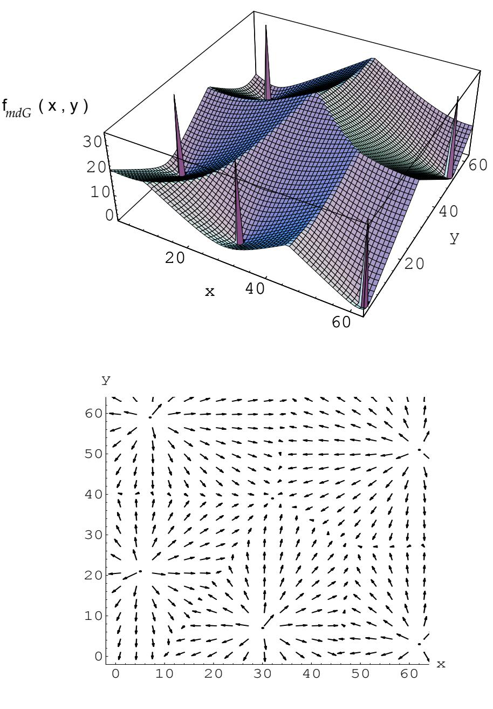
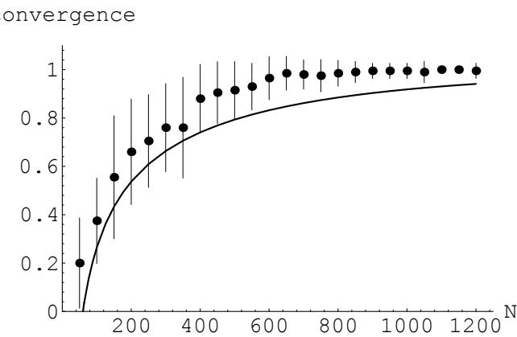

# Genetic Algorithm Difficulty and the Modality of Fitness Landscapes

Jeffrey Horn and David E. Goldberg

PREPRINT (camera-ready)

as accepted for final publication in Foundations of Genetic Algorithms 3 (1995) Edited by L. Darrell Whitley and Michael D. Vose Published by Morgan Kaufmann San Francisco, CA, USA (pp. 243269)

# Genetic Algorithm Difficulty and the Modality of Fitness Landscapes

Jeffrey Horn\* and David E. Goldberg1 Illinois Genetic Algorithms Laboratory   
University of Illinois at Urbana-Champaign 117 Transportation Building 104 South Mathews Avenue Urbana, IL 61801-2996

# Abstract

We assume that the modality (i.e., number of local optima) of a fitness landscape is related to the difficulty of finding the best point on that landscape by evolutionary computation (e.g., hillclimbers and genetic algorithms (GAs)). We first examine the limits of modality by constructing a unimodal function and a maximally multimodal function. At such extremes our intuition breaks down. A fitness landscape consisting entirely of a single hill leading to the global optimum proves to be harder for hillclimbers than GAs. A provably maximally multimodal function, in which half the points in the search space are local optima, can be easier than the unimodal, single hill problem for both hillclimbers and GAs. Exploring the more realistic intermediate range between the extremes of modality, we construct local optima with varying degrees of "attraction" to our evolutionary algorithms. Most work on optima and their basins of attraction has focused on hills and hillclimbers, while some research has explored attraction for the GA's crossover operator. We extend the latter results by defining and implementing maximal partial deception in problems with $k$ arbitrarily placed global optima. This allows us to create functions, such as the minimum distance function $f _ { m d G }$ , with $k$ isolated global optima and multiple local optima attractive to both crossover and hillclimbers. The function $f _ { m d G }$ seems to be a powerful new tool for generalizing deception and relating hillclimbers (and Hamming space) to GAs and crossover.

# 1 INTRODUCTION

Genetic algorithms (GAs) are robust adaptive systems that have been applied successfully to hard optimization problems, both artificial and real world. Yet GAs do fail. When and why do they fail? The question of what makes a problem hard for a GA has received a good deal of attention - and some controversy - as of late. The controversy is largely a tempest in a teapot. If we are ever to understand how hard a problem GAs can solve, how quickly, and with what reliability, we must get our hands around what "hard" is. Goldberg (1993) suggests several quasi-separable dimensions of GA problem difficulty:

- Isolation - Misleadingness - Noise - Multimodality - Crosstalk

Important progress has been made (Goldberg, 1994) in understanding the role of each of these facets of difficulty. Example work includes the study of deception (the combination of solution isolation and suboptimum misleadingness) by Whitley (1991), Goldberg (1989b, 1989c, 1991) and others. Rudnick and Goldberg (1991), Goldberg and Rudnick (1991), Goldberg, Deb, and Clark (1992) and Kargupta and Goldberg (1994), among others, try to quantify and bound both deterministic and stochastic noise introduced by GA operators and the fitness function itself. Goldberg, Deb, and Horn (1992) introduce massively multimodal functions, and Kargupta and Goldberg (1994) look at crosstalk. These and other studies have yielded important insights and practical prescriptions, but a significant amount of work remains.

Some have suggested that we first create a ful-fledged description of problem difficulty, with all the notation necessary to be complete and exact, but complex systems understanding is not achieved via this route (Goldberg, 1993, 1994). The more usual method is to design or prescribe problems that maximally but boundedly challenge a GA along one or more dimensions of problem difficulty. The work presented here continues largely in that vein by investigating deception and modality jointly. We believe that work like this ultimately will be assembled to form a rough patchquilt of models and metrics that help us quantify and analyze how hard a problem is for a particular GA.

# 2 PRELIMINARIES: LANDSCAPES AND OPTIMA

We make use of the paradigm of a fitness landscape (Wright, 1988), which we define here as a search space $S$ , a metric $d$ , and scalar fitness function $f$ defined over elements $s$ of $S$ . Assuming the goal is to maximize fitness, we can imagine the globally best solutions (the global optima, or "globals") as "peaks" in the search space. For the purposes of this paper, we define local optimality as follows. We first assume a non-negative-real valued, scalar fitness function $f ( s )$ over fixed length $\ell .$ bit binary strings $s$ , $f ( s ) \in \Re \geq 0$ . Without loss of generality, we assume $f$ is to be maximized. A local optimum in a discrete search space $S$ is a point, or region, with fitness function value strictly greater than those of all of its nearest neighbors. By "region" we mean a set of interconnected points of equal fitness.

That is, we treat as a single optimum the set of points related by the transitive closure of the nearest-neighbor relation such that all points are of equal fitness1. This definition allows us to include flat plateaus and ridges as single optima, and to treat a flat fitness function as having no local optima. The "nearest neighbor" relation assumes a metric on the search space, call it $d$ ,where $d ( s _ { 1 } , s _ { 2 } ) \in \Re \geq 0$ is the metric's distance between points $s _ { 1 }$ and $s _ { 2 }$ . Then the nearest neighbors of a point $s ^ { \prime }$ are all points $s \in S , s \neq s ^ { \prime }$ such that $d ( s ^ { \prime } , s ) \leq k$ , for some neighborhood radius $k$ . In this paper we use only Hamming distance (number of bit positions at which two binary strings differ) as the metric2, and assume $k = 1$ . Thus a point $s$ (or connected region of equal fitness) with fitness $f ( s )$ greater than that of all its immediate neighbors (strings differing from $s$ in only one bit position) is a local optimum.

# 3 MINIMUM MODALITY CAN BE HARD

At one extreme of the modality spectrum we have unimodality. Unimodal functions have only one local optimum, which is therefore the global optimum. It is well-known that such problems can be hard when the optimum is isolated, with little or no information available elsewhere in the search space. Such isolated peaks on otherwise flat fitness landscapes have been called needle-in-a-haystack (NIAH) problems (Goldberg, 1989a), and are clearly solvable only by enumeration of the space. But if we decrease the isolation of the single optimum, increase the size of its basin of attraction, and add information to larger portions of the search space, intuition tells us that the search should become easier and shorter than enumeration. In particular, if we make the entire search space a single hill, where every point is on a path to the global optimum, even simple evolutionary algorithms, such as a 1-bit hillclimber, should quickly optimize the function. But Horn, Goldberg, and Deb (1994) show otherwise.

# 3.1 CONSTRUCTION OF THE LONG PATH

Horn, Goldberg, and Deb (1994) construct two different functions of $\ell$ -bit strings in which all points are on the path to the only optimum, but in which path length grows exponentially in $\ell$ . Thus even a 1-bit hillclimber is guaranteed not only to find the global optimum but to make constant progress toward it. However, for reasonably large $\ell$ $\mathit { \Theta } > 9 0$ , for example), the hillclimber, and many other local searchers, effectively will never converge to the global. Below we summarize one of the two constructions from (Horn, Goldberg, & Deb, 1994), namely the Root2path.

We choose a stepsize $k = 1$ to illustrate the construction of the Root2path. Each point on the path must be exactly $k = 1$ bit different from the point behind it and the point ahead of it on the path, while also being at least $k + 1 = 2$ bits away from any other point on the path.

The construction of the path is intuitive. If we have a Root2path $P _ { \ell }$ of dimension $\ell \ ( =$ number of bits), we can basically double it by moving up two dimensions to $( \ell + 2 )$ as follows. Let $P _ { \ell }$ be a list of binary strings representing consecutive steps on the path (e.g.,

$P _ { 4 } = \{ 0 0 0 0 , 0 0 0 1 , 0 0 1 1 , . . . \} )$ . Make two copies of $P _ { \ell }$ , say copy00 and copy11. Add $^ { 6 6 } 0 0 ^ { 5 }$ to the beginning of each string (point) in copy00, and add $^ { 6 6 } 1 1 ^ { , 9 }$ to each point in copy $1 1 ^ { 3 }$ . Now each point in copy00 is at least two bits different from all points in copy11. Also, copy00 and copy11 are both paths of stepsize one and of dimension $\ell + 2$ . Furthermore, the endpoint of copy00 and the endpoint of copyl1 differ only in their first two bit positions ( $^ { 6 6 } 0 0 ^ { 5 }$ versus "11"). By adding a "bridge" point that is the same as the endpoint of copy00 but with $^ { 6 } 0 1 ^ { \mathfrak { s } }$ in the first two bit positions, we can connect the end of copy00 and the end of copy $1 1 ^ { 4 }$ . Reversing the list in copy11, we concatenate copy00, the bridge point, and Reverse[copy11] to create the Root2path $P _ { \ell + 2 }$ of dimension $\ell + 2$ , with length essentially twice that of $P _ { \ell }$ .

$$
\left| P _ { \ell + 2 } \right| = 2 \left| P _ { \ell } \right| + 1 .
$$

For the dimensions in between the doublings, $P _ { \ell + 1 }$ , we can simply use the path $P _ { \ell }$ by adding a $^ { 6 } 0 ^ { 9 }$ to each point in $P _ { \ell }$ . If $| P _ { \ell } |$ is exponentional in $\ell$ , then $| P _ { \ell + 1 } |$ is exponential in $\ell + 1$ .

For the base case, we use the first dimension $\ell = 1$ . Here we have only two points in the search space: 0 and 1. We put them both on the Root2path for $\ell = 1$ . Thus, $P _ { 1 } = \{ 0 , 1 \}$ , where 0 is the beginning and 1 is the end (i.e., the global optimum).

So with every other incremental increase in dimension $\ell$ , we have an effective doubling of the path length. We can solve the recurrence relation in Equation 1 exactly, but it is clear that the path length increases in proportion to $2 ^ { \ell / 2 }$ or $( { \sqrt { 2 } } ) ^ { \ell }$ . Thus the path length grows exponentially in $\ell$ with base $\approx 1 . 4 1 4$ , although it is an ever-decreasing fraction of the space5.

We make one end of the path the global optimum, and adjust the fitnesses of the rest of the path so that fitness decreases as we move along the path away from the global optimum and towards the beginning of the path. If we choose the all zeroes point to be the beginning of the path (rather than the end), we can easily make the rest of the search space (all points not on the path) lead to the beginning of the path. We do this by setting the fitness of ofpath points to some increasing function of the number of zeros (nilness) in the string, such as $f ( s ) = f ( 0 0 0 0 . . . 0 ) - u ( s )$ . Here $f ( 0 0 0 0 . . . 0 )$ is the fitness at the beginning of the path6 and $u ( s )$ is the unitation (number of ones) of string s.

Horn, Goldberg, and Deb (1994) also show how to extend this construction to create paths of stepsize $k > 1$ , where nonconsecutive points on the path are separated by at least $k + 1$ bits. Paths constructed this way are of order $O ( 2 ^ { \ell / ( k + 1 ) } )$ steps in length, which is exponential in $\ell$ for fixed $k$ . They then show empirically that various types of one-bit hillclimbers do indeed take exponential time, in expectation, to climb such paths7.

# 3.2 VISUALIZATION IN TWO DIMENSIONS

We try to visualize a long path in two dimensions in Figure 1, top. Here the fitness is a function of the integers $x$ and $y$ : $f _ { l p } \left( x , y \right)$ , for the "long path" function. As with the Root2path and Fibonacci paths constructed in (Horn, Goldberg, & Deb, 1994), the two dimensional spiral path is generated by induction on the size of the search space, in this case $s ^ { 2 }$ . Here $s$ is the integer range over which $x$ and $y$ each vary. For the base case $s = 1$ , the single point is the global optimum, with fitness 1, and is the only point on the path. Informally, the inductive step is to take a path of dimension $s$ , add a ring (or rather, square) of points around the outside, each with fitness 0, then add another ring of points and add them to the path, incrementing the fitness of every point on the $s$ -dimensional path by the number of new path points added. This gives us a long path of dimension $s + 2$ . In other words, every other increment of $s$ adds another ring to the spiral and pushes up the old, inner spiral to maintain the slope up to the global at the center. Thus the construction of the two dimensional spiral path has the same inductive form as those of binary-space long paths. However, in two dimensions we can actually put half the search space on the spiraling path to achieve path lengths of O(|search space|). Again, we can separate nonadjacent points on the two dimensional spiral path by any number $k$ of steps8 by simply adding rings to the spiral every $k$ increments of $s$ instead of every other increment.

# 3.3 EMPIRICAL RESULTS

The long path problem is clearly and demonstrably difficult for local searchers (that is, algorithms that search small neighborhoods with high probability, and larger neighborhoods with vanishingly small probability). Such algorithms include hillclimbers and the GA's mutation operator. Apparently, however, such long path problems are amenable to GA crossover. It is obvious from their inductive construction that these paths have structure. The same basic subsequences of steps are used over and over again on larger scales, resulting in fractal self-similarity. Such structure might induce building blocks exploitable by crossover (Holland, 1992). In particular, patterns such as $0 0 ^ { \mathfrak { s } }$ and $^ { \circ } 1 1 ^ { \circ }$ are common to all points on the (binary-space) path, and are used over and over again in the construction of the path.

Although we have not yet performed a schema analysis (Bethke, 1981) of these functions9, we have some preliminary empirical results (Horn, Goldberg, & Deb, 1994). These early results indicate that a GA with crossover alone $\overset { \cdot } { p } _ { m } = 0 \overset { \cdot } { \underset { \cdot } { \mathrm { ~ ~ } } }$ outperforms $k = 1$ step hillclimbers (e.g., steepest ascent, next ascent) and several mutation algorithms (e.g., random mutation hillclimbing (RMHC)) by reaching the global optimum using several orders of magnitude fewer function evaluations. More testing and analysis are required, but if the GA is superior to hillclimbing (ie., finds the global in $< \cal { O } ( 2 ^ { \ell / c k } )$ time), then we have found a problem that distinguishes GAs from hillclimbers. Such a result might be of particular interest to those looking at when GAs outperform hillclimbers (Mitchell & Holland, 1993). One answer might be "on a hill".

Although GA crossover can outperform some simple hillclimbers on some long path problems, fairly large population sizes are apparently required for crossover to succeed. Horn, Goldberg, and Deb (1994) report reliable performance (in converging to the global optimum)

  
Figure 1: The two extremes of modality. Top: A unimodal problem, $f _ { l p } ( x , y )$ , in which every point in the space is on an long path (growing exponentially in $\mathscr { X }$ and $y$ )to the global optimum. Bottom: A maximally multimodal function, $f _ { m m , e a s y } ( x , y )$ that is easy for a GA to optimize.

only with population sizes of $N = 4 0 0 0 , 5 0 0 0$ , and 6000, on Root2path problem lengths of $\ell = 2 9 , 3 9$ , and 49 respectively. As we show in the next section on "maximum modality", the GA does not optimize the long path problems reliably with small population sizes (e.g., $N = 3 0 0$ ).

The long path function is interesting also because it points out that the modality of a search space, if measured solely as the number of local optima, is at best a first order estimate of the amenability of the space to search by hillclimbers, mutation, or by evolutionary search algorithms in general.

# 4 MAXIMUM MODALITY CAN BE EASY

At the other extreme of the modality spectrum, what is the maximum number of local optima possible in a binary problem of size $\ell .$ -bits? We assume minimum radius (1-bit) peaks, so that our requirement for local optimality is minimal. That is, a point is a local optimum if and only if all adjacent points have inferior fitness values. We can calculate an upper bound on the number of such optima.

Let $p$ be the number of local "peaks". In an $\ell .$ -bit problem, each peak must have exactly $\ell$ immediate neighbors that are not local optima (call them "nonoptima"). Thus the number of adjacent pairs of optimum-nonoptimum is $p * { \ell }$ . That is, for a problem to have $p$ local optima it must have $p * \ell$ different pairings of optima and adjacent nonoptima. There are exactly $2 ^ { \ell } - p$ nonoptima. Each of these nonoptima can have at most $\ell$ adjacent optima. Thus an upper bound on the number of optimum-nonoptimum pairings is $( 2 ^ { \ell } - p ) * \ell$ . We can increase $p$ until the number of optimum-nonoptimum pairs equals the maximum: $p * \ell = ( 2 ^ { \ell } - p ) * \ell$ . We derive $p = 2 ^ { \ell - 1 }$ , which is half the size of the search space10. This is an upper bound on the number of local optima.

Using the concept of unitation, we can construct a function with $2 ^ { \ell - 1 }$ local optima, thus showing that our upper bound is indeed the exact maximum number of local optima. Ackley (1985, 1987) constructs such a "fine-grained local maxima" function, naming it the porcupine function. Although he neither claims nor shows that the porcupine function has the maximum number of local optima, Ackley does point out that it has "an exponential number of local maxima" (Ackley, 1987). Here we construct a strictly non-negative variant of the porcupine function and prove that it does indeed contain $2 ^ { \ell - 1 }$ local optima.

# 4.1 CONSTRUCTION

A maximally multimodal function $f _ { m m } \left( s \right)$ of unitation assigns a high fitness to all bit strings $s$ of odd unitation, for example, and a low fitness to all strings of even unitation:

$$
f _ { m m } ( s ) = \left\{ \begin{array} { l l } { 1 } & { \mathrm { i f ~ O d d } ( u ( s ) ) } \\ { 0 } & { \mathrm { o t h e r w i s e } . } \end{array} \right.
$$

Since all strings of odd unitation are separated from each other by strings of even unitation, odd unitation strings are indeed local optima. Strings of odd unitation occupy exactly half the search space11.

A maximally multimodal function has the maximum number of possible "attractors" on which a search algorithm might get stuck. But of course each optimum's basin of attraction is at a minimum size. To illustrate that massive multimodality by itself does not imply difficulty for GAs or hillclimbers in general, we can add a gentle slope to the function that leads quickly to the global optimum (all ones in this case)12, as Ackley did in his porcupine function (Ackley, 1985, 1987):

$$
f _ { m m , e a s y } ( s ) = u ( s ) + 2 * f _ { m m } ( s ) .
$$

The function $f _ { m m , e a s y } ( s )$ resembles a one-max function "with bumps". A hillclimber with a non-zero probability $p _ { u p 2 }$ of taking a step of size two or more bits uphill will climb to the global optimum in at most $\ell / p _ { u p 2 }$ steps13. For any $p _ { u p 2 }$ that decreases no faster than linearly in $\ell$ , and in particular for a constant $p _ { u p 2 }$ , the hillclimber will climb the hill in expected $O ( \ell )$ steps14.

# 4.2 SCHEMA ANALYSIS

A GA is also unlikely to have difficulty in quickly optimizing this function. In addition to being amenable to search by the GA's mutation operator, the function appears easy for crossover when we apply a static analysis of schema partitions. In every schema partition, the schema containing the global optimum (the all ones schema) must have a higher average fitness than all other schemata competing in that partition. To see why the all ones schema always wins, we first calculate the schema average fitness for any schema as a function of the schema's unitation (number of ones in the defined bits). In a partition of order $O$ , the fitness of a schema $\hat { s }$ is equal to the unitation of the schema $\mathbf { \mu } ( = u ( \hat { s } ) )$ plus the average unitation of the $( \ell - o )$ undefined bit positions $( = ( \ell - o ) / 2 )$ , plus twice the average contribution of $f _ { m m } \left( s \right)$ , the parity of unitation function, which will be $2 * 1 / 2$ :

$$
\bar { f } _ { m m , e a s y } ( \hat { s } ) = u ( \hat { s } ) + ( \ell - o ) / 2 + 1 .
$$

The schemata with highest unitation will always be the winners of their partition competitions.

all orders $i$ are zero, except for $w _ { 0 } = \ell / 2 + 1$ , $w _ { 1 } ^ { \prime } = - 1 / 2$ , and $w _ { \ell } = - 1$ , where $w _ { 1 } ^ { \prime }$ stands for all of the order-1 Walsh coefficients, which are identically valued in a function of unitation. The fitness of a schema $\hat { s }$ with order $o < \ell$ is simply expressed:

$$
\bar { f } _ { m m , e a s y } \bigl ( \hat { s } \bigr ) = w _ { 0 } + u \bigl ( \hat { s } \bigr ) \bigl ( - w _ { 1 } ^ { \prime } \bigr ) = \ell / 2 + 1 + \frac { u \bigl ( \hat { s } \bigr ) } { 2 } .
$$

Again it is clear that for all competition partitions the schemata with highest unitation will have the greatest schema average fitness, thus pointing the way to the global optimum (the all ones point).

# 4.3 VISUALIZATION IN TWO DIMENSIONS

Figure 1, bottom, is a visualization of a maximally multimodal function in two dimensions. Here the decision variables are the positive integers $x$ and $y$ , and the fitness function is

$$
f _ { m m , e a s y } ( x , y ) = ( x + y ) + \left\{ \begin{array} { l l } { { 1 0 } } & { { \mathrm { i f ~ } \mathrm { E v e n } ( x + y ) } } \\ { { 0 } } & { { \mathrm { o t h e r w i s e } . } } \end{array} \right.
$$

Just as in the case of binary strings, our 2-D formulation makes half the search space local optima while providing a constant gradient pointed straight at the global (for any $\geq 2$ bit hillclimber) as well as plenty of schema information for crossover (at least for binary coded integers).

# 4.4 EMPIRICAL RESULTS

Empirical results confirm the prediction that a crossover-based GA will perform well on $f _ { m m , e a s y } \left( s \right)$ . (Here we switch back to the $\ell .$ dimensional version of $f _ { m m , e a s y }$ over binary strings $s$ ) Table 1 summarizes a brief experiment in which we ran a GA with crossover alone (probability of mutation $p _ { m } \ = \ 0$ ) on three different sizes ( $\ell = 2 9 , 3 9$ and 49 bits) of both the long path problem $f _ { l p } ( s )$ and the maximally multimodal problem $f _ { m m , e a s y } \left( s \right)$ . The GA used in the experiment was a simple, generational GA with probability of (single point) crossover $p _ { c } = 1 . 0$ , (deterministic) binary tournament selection, and population size $N = 3 0 0$ . For each problem type and size (e.g., 39-bit long path problem) we ran 40 trials (i.e., 40 different random initial populations). The long path problems were all Root2paths with step size $k = 1$ as specified (by pseudocode) in (Horn, Goldberg, & Deb, 1994). The maximally multimodal problem $f _ { m m , e a s y } \left( s \right)$ used in the experiment is the same as that described in Equation 3 above. For each trial, the GA was run until the convergence criterion (uniform fitness of the population) was met. The final, converged population was then checked for the global optimum.

As Table 1 indicates, the GA performs much better on $f _ { m m , e a s y } \left( s \right)$ than on $f _ { l p } ( s )$ for the three problem sizes shown. The GA with crossover alone cannot find reliably the end of the long path (i.e., the global optimum) for the larger problem sizes (i.e., $\ell = 3 9$ , 49), except at higher population sizes (e.g., $N = 5 0 0 0 , 6 0 0 0$ (Horn, Goldberg, & Deb, 1994). The relative ease with which the GA solves $f _ { m m , e a s y } \left( s \right)$ is consistent with our analysis above, with Ackley's reported observations of GA performance on his porcupine function (Ackley, 1985, 1987), and with our intuitions based on knowledge of the problem's construction. The relative performance of GA crossover is certainly not predicted, however, by a simple count of local optima in the search space. The maximally multimodal function is interesting if only because it points out that the modality of a search space, if measured solely as the number of local optima, is at best a first order estimate of GA difficulty (or difficulty for evolutionary search algorithms in general).

Table 1: Unimodal versus Multimodal Problem Difficulty   

<table><tr><td rowspan=1 colspan=4>GA PERFORMANCE (Long Path vs. Max. Multimodal)</td></tr><tr><td rowspan=2 colspan=1>problem type</td><td rowspan=1 colspan=3>No. of Trials (of 40)Converging to Global</td></tr><tr><td rowspan=1 colspan=3>problem size = 29 | = 39 | = 49</td></tr><tr><td rowspan=1 colspan=1>Long Path (Root2path, k = 1) flp</td><td rowspan=1 colspan=1>5</td><td rowspan=1 colspan=1>2</td><td rowspan=1 colspan=1>0</td></tr><tr><td rowspan=1 colspan=1>Maximally Multimodal fmm,easy</td><td rowspan=1 colspan=1>40</td><td rowspan=1 colspan=1>39</td><td rowspan=1 colspan=1>39</td></tr></table>

# 5 INTERMEDIATE MODALITY: LOCAL OPTIMA AND THEIR BASINS OF ATTRACTION

The results of the previous two sections remind us that the fitness landscapes of interest to us (i.e., those that challenge the GA in a realistic and general manner) have intermediate modality. But it is not clear how to add modality to the long path problem, or to reduce the modality of the maximally multimodal function. For example, we might be tempted to generalize the work on maximum modality by maximizing the number of optima that are $k$ or more bits apart (i.e., each optimum has a local neighborhood of radius $\geq ( k - 1 )$ bits in which it is optimal). Unfortunately, calculating the maximum number of such optima for arbitrary $k$ is an open problem in coding theory known as sphere packing (Harary, Hayes, & Wu, 1988; MacWilliams $\&$ Sloane, 1977). We can calculate an upper bound by simpli divdig earch p? $2 ^ { \ell }$ y he hipe erl   
$\sum _ { r = 0 } [ { k \atop r } ] ^ { k } { \overset { \prime } { \mathop { \mathrm { 2 } } } } ] - 1  ( { \overset { \ell } { \mathop { \mathrm { 2 } } } } )$   
$k = 2$ $2 ^ { \ell }$ while we know that the actual maximum is half that15.

# 5.1 BACKGROUND

Although maximizing the number of local optima with neighborhoods of radius $k$ is an open problem, work has proceeded along the lines of measuring and controlling the number of optima and their basins of attraction (or the "attractiveness" of the optima). Such work can be divided into two types: that which assumes hillclimbing attraction and that which assumes GA crossover attraction. That is, most papers analyzing local optima assume one type of algorithm or the other. We give some background on both approaches, but focus on GA crossover.

# 5.1.1 Hillclimbing Attraction

A number of recent papers define peaks (i.e., local optima together with their basins of attraction) in terms of hillclimbing. Goldberg (1991) formally defines basins of attraction to a point $x ^ { * }$ as all points $x$ such that a given hillclimber has a non-zero probability of climbing to within some $\epsilon$ of $x ^ { * }$ if started within some $\delta$ -neighborhood of $x$ . Jones and Rawlins (1993) introduce reverse hillclimbing and probabilistic ascent as techniques for defining the basin of attraction of a particular local optimum in a fitness landscape for hillclimbers with known probabilities of ascent. Mahfoud (1993) analyzes the performance of multimodal GAs on multi-niche problems, where each niche is a local optimum with a basin of attraction defined by the probability of a hillclimber reaching the local optimum from a point in the basin.

# 5.1.2 GA Attraction

The literature on the attraction of peaks and regions in the landscape to the GA's crossover operator is largely based on Holland's schema theorem (Holland, 1992) and schema average fitness calculations (Bethke, 1981). Goldberg (1987, 1989a, 1989b, 1989c) and later others (Whitley, 1991; Homaifar, Qi, & Frost, 1991; Deb, Horn, & Goldberg, 1993) defined and constructed deceptive landscapes, in which the GA should be attracted to suboptimal local optima and led away from the global optimum. Schema analysis has also been used to construct "GA-easy" functions (Wilson, 1991) which have large basins of attraction for the global optimum 16. More recently, Mitchell and Holland (1993) have begun to weaken the GA-easy conditions by limiting the number and order of schema partitions leading toward the global17.

We look to deception for guidelines on how to lead or mislead a GA both toward and away from multiple optima. Since a function with more than two global optima implies partial (and not full) deception18, we first review and define partial deception.

# 5.1.3 Partial Deception Defined

One must be careful in defining partial deception. It is easy to weaken the requirements for full deception such that a GA can easily find the global optimum of some functions meeting those requirements. We briefly present the definitions we use in this paper.

A deceptive attractor (Whitley, 1991) is the suboptimal point $D$ toward which a GA is (mis)led. In a particular schema partition, the schema containing the deceptive attractor is called the deceptive schema, while the schemata containing the global optima are called the global schemata. In general, a deceptive partition is a partition in which the deceptive schema has a high (schema average) fitness and/or all of the global schemata have low fitness. The rather vague concept of deceptive schemata "beating" global schemata, in terms of schema average fitness, has been interpreted in several different ways by different researchers. Here we list three specific definitions of interest to us (the order of labeling has only chronological

meaning):

Type I deceptive - global schemata lose to all other schemata (Bethke, 1981). Type II deceptive  deceptive schema wins over all other schemata (Goldberg, 1987). Type III deceptive - deceptive schema has higher fitness than all global schemata (Grefenstette, 1992).

It is not yet clear which, if any, of these definitions implies more difficulty for the GA on partially deceptive landscapes19. For fully deceptive functions, all partitions of order $< \ell$ are type II and III deceptive20 . But in general (i.e., partial deception), deceptive and global schemata can be placed anywhere in the fitness ordering of a partition's schemata.

In the design of maximally misleading functions, our goal is to choose $D$ and define the landscape such that the GA converges to $D$ with high probability. We assume that we are given one or more globals (that is, their locations and perhaps their fitness value). In the case of a single global optimum $g$ , the above definitions are sufficient to unambiguously identify a unique $D$ , which is the complement of $g$ (Whitley, 1991). We can then construct fully deceptive functions in which the schema containing $D$ is the winner of every partition (i.e., types II and III deception) at every order up to the string length $\ell$ (Goldberg, 1989a, 1989b, 1990). Full deception is clearly maximally misleading to a GA. It is also clearly bimodal, with local optima21 at $D$ and at $g$ . To add more optima, and basins of GA attraction, we need to define partial deception.

Deception becomes a more practical tool of GA theory when it is embedded in fitness landscapes as partial deception. But at the moment, we can only define partial deception vaguely as less misleading than full deception and more misleading than GA-easy. Trying to order partially deceptive functions according to some scalar measure of deception is problematic. Goldberg recognized the need to generalize full deception and did so by defining order $k$ full deception (Goldberg, 1991). Homaifar, Qi, and Frost (1991) call such limited deception reduced order k deception. Although it has gone by other names, this kind of partial deception is most widely known as bounded deception. A problem has bounded deception of order $k$ if and only if all partitions of order $( k - 1 )$ or less are deceptive 22. Partitions of order $\geq k$ might or might not be deceptive. Thus for $k = \ell$ , bounded deception is full deception. Goldberg, Deb, and Korb (1991) construct examples of boundedly deceptive problems by concatenating some number $m$ of fully deceptive subfunctions of length $\ell _ { s }$ to get an $( m * \ell _ { s } )$ -bit function of order $\ell _ { s }$ bounded deception. Such functions have $2 ^ { m }$ local optima, one of which is global.

The order $k$ of bounded deception establishes a partial order over functions. We can safely say that a function of order $k$ bounded deception is at least as difficult for a GA as a function of order $k ^ { \prime } < k$ bounded deception, all other problem dimensions (e.g., noise, crosstalk) being roughly equal.

Other attempts to define, quantify, or order the degree of partial deception have resulted in unnecessarily weakening the requirements for deception. For example, Grefenstette (1992) described an $\ell = 2 0$ -bit function in which all partitions defined over the first ten bits lead toward the deceptive attractor (i.e., type II deception) and all partitions defined over the last ten bits lead toward the global optimum. "Despite this high level of Deception [sic]," this function was easily optimized by a GA with population size 200. However, as Goldberg pointed out with his analysis of a similarly constructed partially deceptive function (Goldberg, 1991), we do not want to call such problems highly deceptive. Any function with low order partitions that lead toward the global optimum (i.e., any function with building blocks) is amenable to GA search. Adding additional misleading bits does not necessarily make the problem any more deceptive, let alone "arbitrarily more Deceptive.." (Grefenstette, 1992), because the number of low order building blocks remains undiminished. A function of low order $k$ bounded deception is probably more difficult for a GA than Grefenstette's function with some arbitrarily large number of misleading bits, even though the boundedly deceptive problem will have fewer deceptive partitions overall23.

The above example points out the importance of both number and order of deceptive partitions. As discussed above, order $k$ bounded deception only allows comparisons between functions with the same number of deceptive partitions, $\binom { \ell } { o }$ , at each order $o < \operatorname* { m i n } ( k _ { 1 } , k _ { 2 } )$ , where $k _ { i }$ are the orders of bounded deception for two functions. Goldberg, Deb, and Horn found another way to construct and order partially deceptive functions without losing essential misleadingness (Goldberg, Deb, $\&$ Horn, 1992; Deb, Horn, $\&$ Goldberg, 1993). They constrain a "bipolar deceptive function" to be a function of folded unitation $u _ { f l d } ( s )$ , which is simply the number of ones minus the number of zeros: $u _ { f l d } ( s ) = u ( s ) - ( \ell - u ( s ) ) = 2 \ u ( s ) - \ell .$ This leads to a symmetric function of unitation, $f _ { b i p } ( u _ { f l d } ( s ) )$ . Enforcing full deception in the composite function $f _ { b i p } \circ u _ { f l d }$ leads to two globals (all ones and all zeros) in the unfolded a sull g  Hica $\left( { \ell _ { \ell } } _ { 2 } \right)$ deceptive attractors (all points consisting of half ones and half zeros, for even $\ell$ ). The symmetry of the function, induced by the folding, means that the single global optimum in the folded unitation space corresponds to two (complementary) global optima in Hamming space. The single deceptive attractor in the folded unitation space maps to many deceptive attractors in Hamming space.

Goldberg, Deb, and Horn show that the full deception enforced on the folded unitation function led to partitions in the unfolded function in which the schemata containing the most deceptive attractors won (type II deception). This occurs in all partitions where the schemata containing the globals (the global schemata) can be distinguished from the schemata containing the deceptive attractors. Thus, at order one, where the two schemata .….#1#.. and ..#0#... compete, there is no possible distinction between the globals and the deceptive optima, and thus no preference between the schemata (i.e., they had equal fitness). But at order two, and above, the deceptive attractors can be distinguished, hence ...#01#... and ..##10#.. beat ...#11#... and ...#00#... in all order two partitions.

Note that having two distinct globals precludes full deception and therefore requires some kind of partial deception at best (or worst!). By constraining the function to be of folded unitation, Goldberg, Deb, and Horn are able to make the overall function maximally deceptive by enforcing full deception in the folded function. They are then able to examine its implications in the unfolded space. The result is a function that has deceptive attractors located maximally far from both globals, and in which the deceptive schemata win in all partitions (type II), up to order $\ell$ , in which it is possible to distinguish globals from deceptives.

# 5.2 MAXIMAL BI-GLOBAL DECEPTION

We first generalize the work of Goldberg, Deb, and Horn on bipolar deceptive functions to the case of bi-global deceptive functions. We do not assume a function of unitation, folded or not, nor do we assume bipolarity (i.e., where the two globals are full complements of each other). We only assume two globals arbitrarily placed in the space. Rather than first choosing the deceptive attractor, as is usually done, we will instead try to maximize deception and see what deceptive attractor emerges. We use such terms as "maximal deception" loosely at first, and define them rigorously later.

Let the two arbitrarily chosen globals in an $\ell .$ bit problem be $G \ = \ \{ g _ { 1 } , g _ { 2 } \}$ , and let the distance between them be $d _ { G }$ bits. How do we choose a deceptive attractor $D$ that maximizes deceptive partitions? An upper bound on the number of possibly deceptive partitions is the number of partitions in which we can distinguish $D$ from the $G$ . We shall call these simply resolvable partitions. We now try to place $D$ so as to maximize the number of resolvable partitions at every order $O$ .

We first note that there are $( \ell - d _ { G } )$ bits in which the two globals agree. Intuitively, our deceptive attractor should disagree with both globals in these bit positions to maximize the number of resolvable partitions. For each of the $( \ell - d _ { G } )$ bits of agreement between the globals, setting the corresponding bit position in $D$ to be the complement of the globals' bit setting gives one more bit position in which deceptive schemata can be distinguished from global schemata. Thus giving $D$ the complement of the $( \ell - d _ { G } )$ global bit settings only increases the number of resolvable partitions at every order. We therefore assume such complementary bit settings for the $( \ell - d _ { G } )$ bit positions of $D$ (in which $g _ { 1 }$ and $g _ { 2 }$ agree) and next consider only how to set the $d _ { G }$ bit positions in which the globals disagree.

Let $d _ { 1 } ^ { D }$ be the Hamming distance from $D$ to $g _ { 1 }$ . Then $d _ { G } - d _ { 1 } ^ { D }$ is the distance from $D$ to $g _ { 2 }$ . At any order $O$ schema partition there ar $\scriptstyle { \binom { d _ { G } } { o } }$ partitions24. For exactly $\left( { d _ { 1 } ^ { D } } \right)$ of tese partitions, we cannot distinguish $D$ from $g _ { 2 }$ , since all $O$ defined bits are chosen from the $d _ { 1 } ^ { D }$ bits that distinguish $D$ from $g _ { 1 }$ and hence are positions at which $D$ and $g _ { 2 }$ are in agreement. Smilarly, there  ealy $\binom { d _ { G } - d _ { 1 } ^ { D } } { o }$ partitions in which we cannot distinguish $D$ from $g _ { 1 }$ . So the total number of resolvable partitions, $N _ { r p } ( o )$ at order $O$ is

$$
\begin{array} { r } { N _ { r p } ( o ) = { \binom { d _ { G } } { o } } - \left[ { \binom { d _ { 1 } ^ { D } } { o } } + { \binom { d _ { G } - d _ { 1 } ^ { D } } { o } } . \right] . } \end{array}
$$

To maximize $N _ { r p }$ we must minimize the sum of the two binomial coefficients in the square brackets above. Since $\binom { d _ { 1 } ^ { D } } { \cal O }$ $d _ { 1 } ^ { D }$ , and (do-d) is strictly decreasing in $d _ { 1 } ^ { D }$ , the minimum of their sum will occur when $d _ { 1 } ^ { D } = d _ { G } - d _ { 1 } ^ { D } \Rightarrow d _ { 1 } ^ { D } = d _ { G } / 2$ for even $d _ { G }$ , and $d _ { 1 } ^ { D } = \lfloor d _ { G } / 2 \rfloor$ or $\lceil d _ { G } / 2 \rceil$ , for odd $d _ { G }$ . That is, we will have the maximum possible number of resolvable partitions when we our deceptive attractor lies equally distant from $g _ { 1 }$ and $g _ { 2 }$ , which means it is maximally minimally distant from $G$ . Here we define minimal distance from a point $D$ to a set $G$ of $k$ points as the minimum of the distances from $D$ to each point $g _ { i } \in G$ , $1 \leq i \leq k$ . The maximally minimally distant point from a set $G$ is simply the point25 in the space with the greatest minimal distance to $G$ .

Note that we have maximized the resolvable partitions in the sense that we have the maximum number of resolvable partitions at every order. Assume that we can make all resolvable partitions deceptive, in at least one of the three senses defined earlier (we show that we can in the next section). We conjecture that a function $f _ { 1 }$ with more deceptive partitions at every order $o < \ell$ than another function $f _ { 2 }$ is more misleading to a GA, all other problem dimensions being roughly equal. Thus we are suggesting another relation that induces a partial ordering on the space of partially deceptive functions, just as Goldberg's bounded deception does. And just as bounded deception has full deception at the extreme, our ordering has a maximum for a given placement of globals. A maximally deceptive function has no fewer deceptive partitions at each order than any other deceptive function possible given the set of globals. When the global set consists of only one global, the maximally deceptive function is a fully deceptive function. Otherwise, it is partially deceptive26.

# 5.3 A FUNCTION TO MEET THE BI-GLOBAL DECEPTIVE CONDITIONS

In the section above we showed that to maximize the number of resolvable partitions at every order in a bi-global problem, we should choose the deceptive attractor to be the point that is maximally minimally distant from the two globals. Such a result is meaningless if we cannot define a function that is actually misleading to a GA in those resolvable partitions. In other words, is it possible to make all the resolvable partitions deceptive? Or does this lead to too many constraints? In this section we construct a function that satisfies our deceptive conditions in all of the resolvable partitions.

# 5.3.1 Construction

The use of maximal minimal distance to $G$ in choosing our deceptive attractor suggests the use of such a function as the fitness function itself. That is, let the fitness of a point/string $s$ be its Hamming distance to the nearest global. Let us call such a minimum distance function simply $f _ { m d } ( s )$ .

$$
f _ { m d } ( s ) = \operatorname* { m i n } _ { \forall g \in G } H ( s , g ) ,
$$

where $H ( s , g )$ is the Hamming distance from a point $s$ to the global $g$ . At the globals themselves, of course, we substitute some globally optimal value $f _ { m a x }$ to get a function of

minimum distance "plus globals":

$$
f _ { m d G } ( s ) = \left\{ \begin{array} { l l } { f _ { m a x } } & { \mathrm { i f ~ } s \in G } \\ { f _ { m d } ( s ) } & { \mathrm { o t h e r w i s e , } } \end{array} \right.
$$

The min-dist function, with globals, $f _ { m d G } ( s )$ , has some very interesting properties. Like trap and unitation functions, it is easy to define, is readily visualized, has mostly linear gradients, and is amenable to schema analysis.

Our first observation is that the max-min-dist deceptive attractor is clearly a local optimum of $f _ { m d G } ( s )$ and indeed must be the global optimum of $f _ { m d } ( s )$ . This is true by definition of $D$ as the point of maximal min-dist. To guarantee that $f _ { m a x }$ is globally optimal, we could set $f _ { m a x } = f _ { m d } ( D ) + 1$ . Or, to avoid having to find $D$ , we can simply let $f _ { m a x } = \ell + 1$ , which is guaranteed to be global since the greatest Hamming distance in an $\ell$ bit problem is $\ell$ .

Another observation is that $f _ { m d G } ( s )$ essentially reduces to a simple trap function (Goldberg, Deb, & Clark, 1992; Deb $\&$ Goldberg, 1993) when $G$ contains a single global optimum. Similarly, when $G$ contains only two complementary strings, such as the all zeroes and all ones strings, $f _ { m d G } ( s )$ reduces to a bipolar deceptive trap function (Goldberg, Deb, & Horn, 1992; Deb, Horn, & Goldberg, 1993). For example, if we set $f _ { m a x } = \ell + 1$ then the function

$$
f _ { m d G } ^ { t r a p } ( s ) = f _ { m d G } ( s ) - 1
$$

$f _ { m d G } ^ { t r a p } ( s )$ is eero.-valed $\ell = 4$ and $G = \left\{ 1 1 1 1 \right\}$ , $f _ { m d G } ^ { t r a p } ( s )$ $f _ { 4 }$ in (Goldberg, Deb, & Clark, 1992)27.

A final observation is that $f _ { m d G } ( s )$ illustrates the separability of misleadingness and isolation as dimensions of problem difficulty. One can view the function $f _ { m d } ( s )$ as providing the essential misleadingness of $f _ { m d G } ( s )$ , while we could define a function

$$
f _ { G } ( s ) = { \left\{ \begin{array} { l l } { f _ { m a x } } & { { \mathrm { i f ~ } } s \in G } \\ { 0 } & { { \mathrm { o t h e r w i s e } } } \end{array} \right. }
$$

that provides the isolation of the globals. The function $f _ { m d G } ( s ) = f _ { m d } ( s ) + f _ { G } ( s )$ is then literally the additive combination of misleadingness and solution isolation.

# 5.3.2 Schema Analysis

Next we perform a modified schema analysis of $f _ { m d G } ( s )$ looking for deceptive partitions. Our modification to regular schema analysis is this: we ignore the global optima. That is, we assume their fitness is zero by simply analyzing $f _ { m d } ( s )$ rather than $f _ { m d G } ( s )$ . Adding the globally optimal values $f _ { m a x }$ to our schema fitness calculations would complicate them. The only point of doing so would be to find constraints on $f _ { m a x }$ in order to meet deception conditions on schema average fitnesses. We are not very interested in such constraints, since it really doesn't matter how large $f _ { m a x }$ is, as long as it is globally optimal. The value of the global optima do not enter into the GA's schema processing until a global is found, at which time the search is over and we are no longer interested in GA schema processing. We are modeling GA performance in the search for global optima; that is, during the generations preceding the discovery of a global.

We begin our schema analysis by assuming two globals $g _ { 1 }$ and $g _ { 2 }$ . As before, we ignore the bit positions in which $g _ { 1 }$ and $g _ { 2 }$ agree, since considering the fitness contributions of these bits does not change the ranking of schemata within a competition partition. To see why this is so, remember that the fitness of a schema $\hat { s }$ of $f _ { m d } ( s )$ is the average distance to the nearest global over all strings instantiating $\hat { s }$ Thus the bit positions at which $g _ { 1 }$ and $g _ { 2 }$ agree always add the same amount to the average fitness of each schema within a particular partition, regardless of the schema.

We assume $\ell$ bit positions in which $g _ { 1 }$ and $g _ { 2 }$ differ. We now calculate exact schema average fitnesses for any schema in an order $O$ partition. Let $\hat { s }$ be a schema in the given order $O$ partition, and let $d _ { 1 } ^ { \hat { s } }$ be the distance from $\hat { \boldsymbol s }$ to global $g _ { 1 }$ , making $( o - d _ { 1 } ^ { \hat { s } } )$ the distance from $\hat { s }$ to $g _ { 2 }$ . (We define the distance from a schema $\hat { \boldsymbol s }$ to a point, such as global $g _ { 1 }$ , to be the number of bit positions, over the $O$ defined bit positions in $\hat { s }$ , in which $\hat { s }$ and $g _ { 1 }$ differ. Note that $0 \leq d _ { 1 } ^ { s } \leq o$ )

To calculate the average fitness of $\hat { s }$ in $f _ { m d } ( s )$ , we add up the fitnesses of all strings contained in $\hat { s }$ and divide by the number of such strings:

$$
\bar { f } _ { m d } ( \hat { s } ) = \frac { \sum _ { s \in \hat { s } } { f _ { m d } ( s ) } } { 2 ^ { \ell - o } } .
$$

We concentrate now on the sum in the numerator, since this will order the average fitnesses of schemata in the partition. The $2 ^ { \ell - o }$ strings in the summation can be divided into two groups, those that are closest to $g _ { 1 }$ and those that are closest to $g _ { 2 }$ . Let $d$ be the number of bit positions from the $\ell - o$ undefined bit positions at which a particular string $s$ disagrees with $g _ { 1 }$ . That is, the total distance from $s$ to $g _ { 1 }$ is $d + d _ { 1 } ^ { s }$ . When this total distance is less than half of $\ell$ , then $s$ is closer to $g _ { 1 }$ than to , and the fitness of $s$ is its distance to $g _ { 1 }$ . $d + d _ { 1 } ^ { \hat { s } }$ There are exactly $\binom { \ell - o } { d }$ strings in $\hat { s }$ that are $d$ bits difeent from $g _ { 1 }$ in the $\ell - o$ undefined bits of the partition. Furthermore, $g _ { 1 }$ will be the closest global to $s$ for $d = 0$ up to $d + d _ { 1 } ^ { \hat { s } } = \lfloor \ell / 2 \rfloor \Rightarrow d \leq \lfloor \ell / 2 \rfloor - d _ { 1 } ^ { \hat { s } }$ . Thus the total contribution of strings near $g _ { 1 }$ to the average fitness of $\hat { s }$ is

$$
\sum _ { d = 0 } ^ { \lfloor \ell / 2 \rfloor - d _ { 1 } ^ { \hat { s } } } ( d + d _ { 1 } ^ { \hat { s } } ) { \binom { \ell - o } { d } } .
$$

We calculate a similar sum for the remaining points, which are all closer to $g _ { 2 }$ . These points have fitness $\big ( \ell - \big ( d + d _ { 1 } ^ { \hat { s } } \big ) \big )$ , which is their distance to $g _ { 2 }$ , and they occur when $( \lfloor \ell / 2 \rfloor - d _ { 1 } ^ { \hat { s } } + 1 ) \leq$ $d \leq ( \ell - o )$ . Adding these two sums together, we get the exact schema average fitness of any schema $\hat { s }$ in an order $O$ partition of $f _ { m d } ( s )$ :

$$
2 ^ { \ell - o } \bar { f } _ { m d } \big ( \hat { s } \big ) = \sum _ { d = 0 } ^ { \lfloor l / 2 \rfloor - d _ { 1 } ^ { \hat { s } } } \big ( d + d _ { 1 } ^ { \hat { s } } \big ) \binom { \ell - o } { d } + \sum _ { d = \lfloor \ell / 2 \rfloor - d _ { 1 } ^ { \hat { s } } + 1 } ^ { \ell - o } \big ( \ell - d - d _ { 1 } ^ { \hat { s } } \big ) \binom { \ell - o } { d } .
$$

We can show that this sum increases as $d _ { 1 } ^ { \hat { s } }$ approaches $d _ { 1 } ^ { \hat { s } } = \lfloor o / 2 \rfloor$ from $d _ { 1 } ^ { \hat { s } } = 0$ and as it approaches $d _ { 1 } ^ { \hat { s } } = \lceil o / 2 \rceil$ from $d _ { 1 } ^ { \hat { s } } = o$ . Thus the more maximally minimally distant a schema is from the schemata containing the globals, the higher its average fitness. In particular, the maximum of ${ \bar { f } } _ { m d } ( { \hat { s } } )$ occurs at $d _ { 1 } ^ { \hat { s } } = \lceil o / 2 \rceil$ and $d _ { 1 } ^ { \hat { s } } = \lfloor o / 2 \rfloor$ .

This last result has several important implications for $f _ { m d } ( s )$ . First, it means that in all the resolvable partitions, the schema containing the deceptive attractor $D$ has greater average fitness than the schemata containing the globals. Since $f _ { m d } ( s )$ maximizes the number of resolvable partitions at every order, it also therefore maximizes the number of partitions where the global schemata lose to the deceptive schema (type III deceptive partitions). Second, in all but the order one and order $\ell$ partitions, the global schemata lose to all other schemata28. Thus $f _ { m d } ( s )$ is maximally deceptive according to type I partition deception.

Third, the above result implies that the winning schema (i.e., superior to all others) in every partition is the schema that is maximally minimally different from the global schemata. If the winning schema contains the deceptive attractor $D$ , the partition is type II deceptive. How many type II deceptive partitions can a deceptive attractor possibly have, at a given order $O$ ? The analysis is similar to our previous analysis. Let $d _ { 1 } ^ { D }$ be the distance from a deceptive attractor $D$ to global optimum $g _ { 1 }$ with $\ell .$ bits of separation between $g _ { 1 }$ and $g _ { 2 }$ . Assume an even partition order $O$ . We can choose half the order $O$ bit positions, from among the $d _ { 1 } ^ { D }$ bit positions in which $D$ and $g _ { 1 }$ differ, in exactly $\binom { d _ { 1 } ^ { D } } { o / 2 }$ ways. We can choose the other $o / 2$ bits, from among the $\ell - d _ { 1 } ^ { D }$ bit positions that diffe from $g _ { 2 }$ , in exactly $\binom { \ell - d _ { 1 } ^ { D } } { o / 2 }$ ways. So there are $\binom { d _ { 1 } ^ { D } } { o / 2 } \left( \ell - d _ { 1 } ^ { D } \right)$ partitions of even order $O$ in which the deceptive schema wins. Similarly, f $O$ partitions this number is $\binom { d _ { 1 } ^ { D } } { \lfloor o / 2 \rfloor } \binom { \ell - d _ { 1 } ^ { D } } { \lceil o / 2 \rceil } + \binom { d _ { 1 } ^ { D } } { \lceil o / 2 \rceil } \binom { \ell - d _ { 1 } ^ { D } } { \lfloor o / 2 \rfloor }$ It is clear that the number of type II deceptive partitions is maximized when $d _ { 1 } ^ { D } = \ell - d _ { 1 } ^ { D }$ , $\Rightarrow d _ { 1 } ^ { D } = \ell / 2$ for even $\ell$ (and either of $\lfloor \ell / 2 \rfloor$ or $\lceil \ell / 2 \rceil$ , for odd $\ell$ . Thus the choice of $D$ as the deceptive attractor maximizes the number of type $\mathrm { I I }$ deceptive partitions at every order. The function $f _ { m d } ( s )$ is therefore maximally deceptive according to all three types of partition deception we defined.

# 5.4 GENERALIZATION TO $k$ GLOBALS

We would like to immediately generalize our results to the case of $k$ globals placed arbitrarily. That is, given any set $G$ of $k$ globals in an $\ell .$ -bit problem, we should place the deceptive attractor(s) at those points maximally minimally distant from the entire set $G$ in order to maximally mislead the GA. Unfortunately the analysis used above becomes much more complicated when applied to $k$ globals. With more than two globals we lose the symmetry of bit position agreement/disagreement (where agreement with $g _ { 1 }$ at a position means disagreement with $g _ { 2 }$ at that position, and where being $d _ { 1 } ^ { D }$ bits away from $g _ { 1 }$ means being $\ell - d _ { 1 } ^ { D }$ bits away from $g _ { 2 }$ ).

While we are continuing to explore the generalization to $k$ globals, we can present some intriguing initial results.

# 5.4.1 Visualization in Two Dimensions

It is instructive to visualize the spatial relationship of the deceptive attractor $D$ (the maxmin-dist point) to the set $G$ of $k$ globals. We therefore return to our use of two dimensional analogues of our binary search spaces and functions. In Figure 2 we show $k = 5$ global optima located at grid positions $G = \left\{ ( 7 , 5 9 ) , ( 5 , 2 1 ) , ( 3 0 , 7 ) , ( 6 2 , 3 ) , ( 6 2 , 5 1 ) \right\}$ . Here we assume two integer-valued decision variables $\{ x , y \}$ each taking values in the range (0..63). The maximally minimally distant point from $G$ is $D = ( 3 2 , 3 9 )$ , as shown on the left of Figure 2.

  
Figure 2: Left: A two dimensional problem with $\qquad k \quad = \quad 5$ globals at $\begin{array} { r l } { G } & { { } = } \end{array}$ $\{ ( \bar { 7 } , 5 9 )$ , (5, 21), (30, 7), $( 6 2 , 3 )$ , (62, 51)}, and a maximally minimally distant point at $D = \left( 3 2 , 3 9 \right)$ . Right: The Voronoi diagram of the set $G$ .

Interestingly, this point lies at the intersection of Voronoi lines in the Voronoi diagram of $G$ , shown on the right of Figure 2. Since the lines in a Voronoi diagram divide the space into neighborhoods of elements of $G$ and their nearest neighbors (Conway & Sloane, 1993), and thus lie on points equidistant from the nearest two globals, $D$ must lie at an intersection of at least three Voronoi lines.

To better illustrate the relationship between the Voronoi diagram and our maximum minimum distance criterion, we redefine $f _ { m d }$ to be a function of integers $x$ and $y$ rather than of binary strings:

$$
f _ { m d } ( x , y ) = \operatorname* { m i n } _ { \forall ( x _ { g } , y _ { g } ) \in G } \sqrt { ( x _ { g } - x ) ^ { 2 } + ( y _ { g } - y ) ^ { 2 } } .
$$

Noting that the maximum value is $f _ { m d } ( D ) \approx 3 2 . 0 1 5 6$ , we choose $f _ { m a x }$ to be 34:

$$
f _ { m d G } ( x , y ) = \left\{ \begin{array} { l l } { 3 4 } & { \mathrm { i f ~ } ( x , y ) \in G } \\ { f _ { m d } ( x , y ) } & { \mathrm { o t h e r w i s e . } } \end{array} \right.
$$

We plot $f _ { m d G } ( x , y )$ , at the top of Figure 3, for the five globals. We note how the ridges correspond to the lines of the Voronoi diagram, and how each local optimum (except the globals) occurs at intersections of such lines. By definition of $f _ { m d } ( x , y )$ and Voronoi diagrams, this must be the case. Thus the min-dist function $f _ { m d } \left( x , y \right)$ leads to an interesting, rugged, multimodal landscape with apparent basins of attraction for hillclimbers. To see that there are indeed basins of attraction for the local optima, we plot the local gradients of $f _ { m d } \left( x , y \right)$ at the bottom of Figure 3. As expected, these gradients point away from the nearest globals and towards the nearest ridge. We would expect a simple hillclimber to follow the local gradients up to the nearest ridge and thence to a local optimum. Finally we note that the max-min-point $D$ seems to have the largest basin of attraction (of all optima shown) for a simple hillclimber.

  
Figure 3: Top: A surface plot of $f _ { m d G } ( x , y )$ . Bottom: This function is difficult for a hillclimber because all gradients lead away from the nearest global and, eventually, to a local optimum, as shown in this vector plot of $f _ { m d G } ( x , y )$ .

# 5.4.2 Schema Analysis

Again, to be of interest in the study of GA diffculty and multimodality, the min-dist function $f _ { m d G } ( s )$ with $k$ globals must be misleading to the GA's crossover operator as well as to mutation. The schema analysis of $f _ { m d G } ( s )$ is complicated by the interactions of the multiple globals. We can however make a quick observation that indicates we are headed in the right direction (in order to make the GA head in the wrong direction!).

Assume any order o resolvable partition in an $\ell$ -bit problem with $k$ globals. Let $D$ be our choice of deceptive attractor. Let $\hat { s } _ { D }$ be the schema containing the deceptive attractor and let $\hat { \boldsymbol { s } } _ { i }$ be the schema containing2 global $g _ { i }$ , $1 \leq i \leq k$ . We define $\vec { d ^ { D } } = \{ d _ { 1 } ^ { D } , d _ { 2 } ^ { D } , . . . , d _ { k } ^ { D } \}$ to be the vector of distances from the deceptive schema $\hat { s } _ { D }$ to each of the global schemata $\hat { s } _ { i }$ . Thus $d _ { i } ^ { D }$ , where $0 \leq d _ { i } ^ { D } \leq o )$ , is the Hamming distance from $\hat { s } _ { D }$ to $\hat { \boldsymbol { s } } _ { i }$ , defined only over the $O$ fixed bit positions. We also define similar distance vectors for each of the global schemata $\hat { s } _ { i }$ . $\vec { d ^ { i } } = \{ d _ { 1 } ^ { i } , d _ { 2 } ^ { i } , . . . , d _ { k } ^ { i } \}$ , for $( i \in 1 . . k )$ where $d _ { j } ^ { i }$ is the Hamming distance $( 0 ~ \leq ~ d _ { j } ^ { i } ~ \leq ~ o )$ between $\hat { s } _ { i }$ and $\hat { \boldsymbol { s } } _ { j }$ . Finally, for each possible setting $s$ of the $( \ell - o )$ bits undefined in this partition, we associate another vector of distances to the globals: $\vec { d } _ { s } = \left\{ d _ { 1 } ^ { s } , d _ { 2 } ^ { s } , . . . , d _ { k } ^ { s } \right\}$ , where $d _ { i } ^ { s }$ is the number of bits $\left( 0 \leq d _ { i } ^ { s } \leq \ell - o \right)$ , in which $s$ differs from global $g _ { i }$ over the $( \ell - o )$ bits undefined by the partition (but defined by $s$ ).

To calculate the average fitness of a global schema $\hat { s } _ { i }$ , we generate the $2 ^ { \ell - o }$ substrings $s$ in the hyperplane defined by $\hat { s } _ { i }$ . For each $s$ we calculate its distance vector $\vec { d } _ { s }$ and add to it the distance vector $\vec { d ^ { i } }$ for $\hat { s } _ { i }$ . We then take the minimum component of the vector resulting from this summation as the distance to the nearest global from $s$ . Summing the minimum components of these summed distance vectors over all $\boldsymbol { s } \in \hat { \boldsymbol { s } } _ { i }$ and dividing by $2 ^ { \ell - o }$ gives the average schema fitness30 ${ \bar { f } } _ { m d } ( { \hat { s } } _ { i } )$ . We calculate $\bar { f } _ { m d } ( \hat { s } _ { D } )$ similarly, using $\vec { d } _ { s }$ and $d ^ { \vec { D } }$ .

Now if $d ^ { \vec { D } } \geq \vec { d } ^ { i }$ in all components (that is $d _ { j } ^ { D } \geq d _ { j } ^ { i } , \forall j \in { 1 . . k } )$ , for a particular global $g _ { i }$ , then clearly $\bar { f } _ { m d } ( \hat { s } _ { D } ) > \bar { f } _ { m d } ( \hat { s } _ { i } )$ , and the deceptive schema will beat the ith global schema. If $\vec { d ^ { D } }$ is superior (i.e., greater in all $k$ components) to all $k$ of the $\vec { d ^ { i } }$ , then the deceptive schema will be superior to all the global schemata in that partition. Such a partition would thus be type III deceptive. To maximize the number of such partitions, we should try to increase the number of partitions in which the deceptive schema is as different as possible from all of the global schemata. Note that $\vec { d ^ { D } } \geq \vec { d ^ { i } }$ is only a sufficient condition for type III deception in a partition. Thus the number of partitions satisfying $d ^ { \vec { D } } \geq \vec { d } ^ { i }$ is only a lower bound on the number of type III deceptive partitions. However, this sufficient condition is met more often (i.e., at more partitions at every order) by the max-min-dist point $D$ than by any other string. This in turn suggests that the max-min-dist point $D$ will turn out to be the most attractive local optimum for GA crossover on the min-dist function with $k$ globals.

# 5.4.3 Empirical Results

To verify that $f _ { m d G } ( s )$ is misleading to a GA, in the sense that the GA will tend to converge to a deceptive local optimum rather than a member of the global set $G$ , we perform an experiment on a constructed function. We employ the methodology presented in (Goldberg,

Deb, & Clark, 1992) and used again in (Goldberg, Deb, $\&$ Horn, 1992) to construct an order $\ell _ { s }$ boundedly deceptive problem.

We first define a (partially) deceptive subfunction $f _ { s }$ of length $\ell _ { s }$ bits. We then concatenate $m$ identical copies of these subfunctions to form a length $\ell = m \ell _ { s }$ problem $f$ that is a linear combination of the $m$ $f ( s )$ issimply $\Sigma _ { i = 1 } ^ { m } f _ { s } \left( s _ { i } \right)$ where $s _ { i }$ is the $i ^ { t h }$ substring of $\ell _ { s }$ bits in string $s$ Thus the first subfunction is defined over the first $\ell _ { s }$ bits, the second subfunction is defined over the next $\ell _ { s }$ bits, and so on. Since each of the $m$ subfunctions is defined over groups of adjacent bits, the problem assumes a tight ordering of loci in the encoding. Because the problem is a linear combination of the (partially) deceptive subfunctions, deceptive schema partitions are additive across subfunction boundaries. That is, any deceptive partition from one copy of $f _ { s }$ can be combined with any deceptive partitions from any other copies of $f _ { s }$ to form a higher order deceptive partition of the larger function $f$ . This means that the essential misleadingness of $f _ { s }$ is preserved in $f$ . However, the additive combination of the subfunctions also means that if the GA can solve each of the order- $\ell _ { s }$ partitions corresponding to the $f _ { s }$ , then it can simply recombine those solutions (instances of the $k$ subfunction global optima) through crossover to find one of the $k ^ { m }$ global optimum of $f$ .

Our subfunction $f _ { m d 5 G } ( s _ { i } )$ is a $k = 5$ global, $\ell _ { s } ~ = ~ 1 0$ -bit instance of the trap function ersion of $f _ { m d G } ^ { t r a p } ( s )$

$$
G = \{ 0 0 0 0 0 0 0 0 0 0 0 , 0 0 1 0 1 1 0 0 0 1 , 1 1 0 1 1 1 0 0 1 1 , 0 1 0 1 0 1 0 0 1 0 , 1 0 0 0 1 0 1 1 1 1 \} .
$$

This fully defines the $2 ^ { 1 0 } = 1 0 2 4$ values of $f _ { m d 5 G } ( s _ { i } )$ .

$$
f _ { m d 5 G } ( s _ { i } ) = \left\{ \begin{array} { l l } { 1 0 } & { \mathrm { i f ~ } s _ { i } \in \mathrm { G } } \\ { f _ { m d } ( s _ { i } ) - 1 } & { \mathrm { o t h e r w i s e . } } \end{array} \right.
$$

We c $m = 5$ $f _ { m d 5 G } ( s _ { i } )$ iso re an $\ell = 5 0$ bit prc b $f _ { 5 m d 5 G } ( s )$ $\begin{array} { r } { f _ { 5 m d 5 G } ( s ) = \sum _ { i = 1 } ^ { 5 } f _ { m d 5 G } ( s _ { i } ) } \end{array}$ $s _ { i }$ $i ^ { t h }$ $s$ $f _ { 5 m d 5 G } ( s )$ $k ^ { m } = 5 ^ { 5 } = 3 1 2 5$ global optima with fitness $f _ { 5 m d 5 G } ^ { m a x } = 5 * f _ { m d 5 G } ( g \in G ) = 5 * 1 0 = 5 0$ When we enumerate the 1024 values of $f _ { m d 5 G } ( s _ { i } )$ we find five deceptive local optima:

$$
D = \{ 0 1 1 1 0 0 1 1 0 1 , 0 1 1 1 1 0 1 1 0 0 , 1 0 1 1 0 1 1 1 0 0 , 1 1 1 0 0 1 1 1 0 0 , 1 1 1 1 0 0 1 1 0 \} ,
$$

each with fitness ${ f _ { m d 5 G } ( d \in D ) = 6 - 1 = 5 }$ since they are each exactly six bits different from the most similar global optimum. Thus $f _ { 5 m d 5 G }$ has $5 ^ { 5 } = 3 1 2 5$ deceptive local optima of fitness $5 * 5 = 2 5$ (where all five copies of $f _ { m d 5 G }$ are converged to members of $D$ ). It also has ${ \binom { 5 } { 1 } } * 5 * 5 ^ { 4 } = 1 5 6 2 5$ local optima of fitness $1 0 + 4 * 5 = 3 0$ (where four copies of $f _ { m d 5 G } ( s _ { i } )$ have converged to members of $D$ , and one has converged to a global optimum). In general $f _ { 5 m d 5 G } ( s )$ has $\left( \mathsf { 5 } \right) 5 ^ { i } 5 ^ { 5 - i }$ local optima, with fitness $1 0 i + ( 5 - i ) 5$ , in which exactly $i$ of the subfunctions are converged to members of $G$ and the rest are converged to members of $D$ .Thus $f _ { 5 m d 5 G } ( s )$ has a total of 100, 000 local optima, of which 3125 are global. Not only could we call $f _ { 5 m d 5 G } ( s )$ massively multimodal (Goldberg, Horn, & Deb, 1992), but we could introduce the term massively multiglobal as well, since the number of global optima in functions like $f _ { 5 m d 5 G } ( s )$ grows as $k ^ { m }$ . Yet despite the large number of global optima, $f _ { 5 m d 5 G } ( s )$ apparently is not as easy for the GA to solve as is a uniglobal function like $f _ { m m , e a s y }$

We run the same simple GA on $f$ as was described earlier in its application to $f _ { m m , e a s y }$ and $f _ { l p }$ (Table 1): a generational GA with deterministic binary tournament selection, single point crossover with $p _ { c } = 1 . 0$ , and no mutation ( $\dot { p } _ { m } = 0 ,$ . Here we run the GA at several different population sizes, using 40 different trials (different random initial populations) at each population size. For each trial we run the GA to convergence31, and then measure the number of subfunctions optimized (i.e., number of subfunction global optima in an individual). Dividing the number of subfunctions optimized (zero to five) by five normalizes our convergence measure (zero to one).

  
Figure 4: Predicted and actual GA performance on a boundedly, partially deceptive problem $f _ { 5 m d 5 G } ( s )$ . The plotted points are the average convergence values over 40 trials. Error bars extend one standard deviation above the mean, and one below. The solid line is the lower bound on expectation given by Goldberg, Deb, and Clark's (1992) population sizing equation. $N$ is population size.

We plot this convergence measure in Figure 4 for population sizes $N = 5 0$ to 1200, sampling every fifty generations. The plotted points track the mean convergence of each set of 40 trials, while the error bars extend one standard deviation above and one standard deviation below each plotted mean value. Figure 4 illustrates the difficulty of the problem for the GA with inadequate population size. A brief examination of the some of the final populations revealed that the GA usually converges to deceptive optima (members of $D$ ) when it fails to converge to a global optimum in a particular subfunction. With sufficient population sizes, however, the GA can overcome the partial deception of the $f _ { m d 5 G } ( s _ { i } )$ and reliably find a global optimum of $f _ { 5 m d 5 G } ( s )$ .

Clearly population sizing is critical to overcoming this type of bounded, maximal partial deception. We turn briefly to (Goldberg, Deb, & Clark, 1992) for some analytical guidance. The population sizing equations developed by Goldberg, Deb, and Clark (1992) can provide a lower bound on the expected performance of a simple GA on problems of bounded difficulty. Their framework is applied successfully to fully deceptive subfunctions in (Goldberg, Deb, & Clark, 1992), and to bipolar deceptive subfunctions in (Goldberg, Deb, & Horn, 1992). We apply it to our $k$ -global, maximal partial deceptive subfunctions. The reader is referred to (Goldberg, Deb, & Clark, 1992) for guidance on applying the population sizing equations. Here we give only the problem specific parameters necessary to the equation.

One can extract from (Goldberg, Deb, & Clark, 1992) the expected convergence (normalized)

on a problem of bounded deception:

$$
E [ c o n v ( N ) ] = 1 - \frac { \exp { [ g ( N , d , \ell _ { s } , \sigma _ { M } ^ { 2 } ) / 2 ] } } { \sqrt { 2 \pi g ( N , d , \ell _ { s } , \sigma _ { M } ^ { 2 } ) } } ,
$$

where

$$
g ( N , d , \ell _ { s } , \sigma _ { M } ^ { 2 } ) = \frac { n d ^ { 2 } } { 2 ^ { ( \ell _ { s } + 1 ) } \sigma _ { M } ^ { 2 } } ,
$$

$N$ is population size, $\ell _ { s }$ is the length of the subfunction, and $d$ is the "signal" of the subfunction's global optima to be detected among the "noise" (variance) $\sigma _ { M } ^ { 2 }$ of the entire function. For our functions $f _ { m d 5 G } ( s _ { i } )$ and $f _ { 5 m d 5 G } ( s )$ , $\ell _ { s } = 1 0$ , and the signal $d$ is simply the difference between the global fitness and the fitness of the nearest competitor (the deceptive optima) $d = 1 0 - 5 = 5$ Fnally, $\sigma _ { M } ^ { 2 } = ( m - 1 ) \sigma _ { m } ^ { 2 }$ where $m$   
and $\sigma _ { m } ^ { 2 }$ is the variance in a single subfunction. For us $m = 5$ . One can approximate $\sigma _ { m } ^ { 2 }$ by $f _ { m d 5 G } ( s _ { i } )$ we calculate it exactly as $\sigma _ { m } ^ { 2 } = 1 . 3 1 0 9 5$ so that $\sigma _ { M } ^ { 2 } = ( 5 - 1 ) * 1 . 3 1 0 9 5 = 5 . 2 4 3 8$ .

Plugging the above calculated values into Equation 18, we can plot the lower bound on expected convergence as the solid line in Figure 4. From this plot it appears that the population sizing equation provides an adequate lower bound on expected GA convergence on our multiglobal, multimodal, partially deceptive problem.

# 5.4.4 Extensions

Increasing the number of global optima $k$ in the subfunctions, and increasing the number $m$ of subfunctions, can lead to very high degrees of modality. For example, Goldberg, Deb, and Horn (1992) use five copies of their six bit bipolar deceptive function resulting in 32 global optima among over five million local optima. Five million is approximately $0 . 5 \%$ of the $2 ^ { 3 0 }$ total size of the search space, and is thus within two orders of magnitude of the absolute maximum number of local optima $( 5 0 \% )$ .

Adding global optima to the subfunction $f _ { m d 5 G } ( s _ { i } )$ (i.e., increasing $k$ ) should in general decrease the misleadingness of the problem. Thus a fully deceptive subfunction (e.g., a uniglobal trap function) should be more difficult to optimize (i.e., require larger population sizes) than a bi-global deceptive subfunction (e.g., a bipolar deceptive trap function), which should in turn be more difficult than a $k \geq 3$ -global subfunction. Preliminary experiments indicate that this is the case. It would be interesting, however, to try to isolate the decrease in difficulty due to simply having more globals in the initial population (due to higher $k$ ) from the decrease in difficulty due to having fewer deceptive partitions at higher $k$ , if indeed these two effects are separable.

The $f _ { m d G } ( s )$ function, although general with respect to the number and placement of globals, can be generalized further. We could make each global more attractive by simply increasing the radii $r _ { g , i }$ of each global $g _ { i }$ . Thus $f _ { m d } ( s )$ would be defined as before outside of the $r _ { g , i }$ bit neighborhoods of each global. Within each neighborhood, however, the $f _ { m d G } ( s )$ could be a plateau of optimal fitness, or a hill leading to the global.

Finally, we note that the function $f _ { m d }$ is not analytic at the globals nor any of the points on the Voronoi lines. A differentiable version of $f _ { m d }$ could allow additional analysis (e.g., of the function's gradients, schema average fitnesses, etc.). Selecting the minimum (or maximum) distance from a set of distances can be done using the maximum Holder norm. Using any lower order (i.e., finite) Holder norm in place of the maximum (or infinite order) Holder norm yields a function $d f _ { m d }$ that is differentiable everywhere and can be made arbitrarily close to $f _ { m d }$ by increasing the order of the norm. We use such a technique to quickly and easily generate the gradient plot in Figure 3, bottom, taking the derivative of an approximation to $f _ { m d G } ( x , y )$ using a finite order Holder norm for $f _ { m d } ( x , y )$ .

# 6 CONCLUSIONS

Modality by itself, if defined solely as the number of local optima, actually tells us little about the diffiulty of searching a space. Similarly, full deception and GA-easiness in unior bimodal landscapes tell us only about the extreme boundaries of GA success and failure. But maximally deceptive multimodal functions allow us to embed deception in much more rugged and general landscapes, and to define arbitrarily sized and spaced local optima and their basins of attraction to a GA. These more realistic instances of deception illustrate the difficulty of generalizing simple approaches to solving fully deceptive problems, such as a complement operator (Grefenstette, 1992). The complement of the deceptive attractor in a fully deceptive problem is indeed the global optimum, but this does not hold in the more general case of partial deception. For example, in a bipolar deceptive problem the complement of every deceptive optimum is another deceptive optimum.

However, generalizing the definitions of full deception in order to characterize partial deception is tricky. It is all too easy to lose the essential quality of misleadingness. We have introduced a general method of relaxing the deception conditions that partially orders problem spaces according to GA misleadingness. We can now make more connections between crossover's search of hyperplanes and the population's movement over the fitness landscape. For example, in the past we have generally chosen the deceptive attractor $D$ first, and then defined deceptive partitions in terms of $D$ . Here we saw how maximizing the number of deceptive partitions of all orders leads to a unique choice of deceptive local optimum, since the number of deceptive partitions increases with distance to the set of globals. Finally, we defined a simple, general, deceptive multimodal problem, the min-dist function, that seems to relate the attraction of crossover to interesting geometric features of the landscape, such as Voronoi diagrams and Delaunay triangularizations (Conway & Sloane, 1993), in addition to local optima, ridges, and the landscape's gradient field. We must define landscape characteristics important to crossover or we will continue to look at fitness surfaces from a hillclimber's rather limited point of view.

# Acknowledgments

We thank Georges R. Harik, Kaitlin Sherwood, Joseph C. Culberson, Terry Jones, and several anonymous referees for their comments and suggestions. The first author acknowledges support provided by NASA under Contract NGT-50873. The second author acknowledges support provided by AFOSR under Grant F49620-94-1-0103 and by the US Army under Contract DASG60-90-C-0153.

# Список литературы

Ackley, D. H. (1985). A connectionist algorithm for genetic search. In J. J. Greffenstette (Ed.), Proceedings of an International Conference on Genetic Algorithms (pp. 121- 135). Hillsdale, NJ: Lawrence Erlbaum Associates, Publishers.

Ackley, D. H. (1987). An empirical study of bit vector function optimization. In L. Davis (Ed.), Genetic algorithms and simulated annealing (pp. 170-204). London: Pitman Publishing.   
Bethke, A. D. (1981). Genetic algorithms as function optimizers. (Doctoral dissertation, University of Michigan at Ann Arbor). Dissertation Abstracts International, 41(9), 3503B. (University Microfilms No. 81-06101).   
Conway, J. H., & Sloane, N. J. A. (1993). Sphere packings, lattices, and groups (2nd ed.). New York: Springer-Verlag.   
Deb, K., & Goldberg, D. E. (1992). Sufficient conditions for deceptive and easy binary functions (IlliGAL Report No. 92001). Urbana-Champaign, IL: University of Illinois at Urbana-Champaign, Illinois Genetic Algorithms Laboratory, Department of General Engineering.   
Deb, K., & Goldberg, D. E. (1993). Analyzing deception in trap functions. In D. Whitley (Ed.), Foundations of Genetic Algorithms 2. San Mateo, CA: Morgan Kaufmann.   
Deb, K., Horn, J., & Goldberg, D. E. (1993). Multimodal deceptive functions. Complex Systems, 7, 131153.   
Goldberg, D. E. (1987). Simple genetic algorithms and the minimal deceptive problem. In L. Davis (Ed.), Genetic algorithms and simulated annealing (pp. 74-88). London: Pitman Publishing.   
Goldberg, D.E.(198a). Genetic algorithms in search, optimization, and machine learning. Reading, MA: Addison-Wesley.   
Goldberg, D. E. (1989b). Genetic algorithms and Walsh functions: part I, a gentle introduction. Complex Systems, 3, 129-152.   
Goldberg, D. E. (1989c). Genetic algorithms and Walsh functions: part II, deception and its analysis. Complex Systems, 3, 153171.   
Goldberg, D. E. (1991). Construction of high-order deceptive functions using low-order Walsh coefficients. Annals of Mathematics and Artificial Intelligence, 5, 3548.   
Goldberg, D. E. (1993, February). Making genetic algorithms fly: a lesson from the Wright brothers. Advanced Technology for Developers, 2, 1-8.   
Goldberg, D. E. (1994, March). Genetic and evolutionary algorithms come of age. Communications of the Association for Computing Machinery, 37(3), 113-119.   
Goldberg, D. E. Deb, K., & Clark, J. H. 199). Genetic algorithms, noise, and the szig of populations. Complex Systems, 6, 333362.   
Goldberg, D. E., Deb, K., & Horn, J. (1992). Massive multimodality, deception, and genetic algorithms. In R. Männer, & B. Manderick (Ed.), Parallel Problem Solving from Nature, 2 (pp. 37-46). Amsterdam: North-Holland.   
Goldberg, D. E., Deb, K., & Korb, B. (1991). Don't worry, be messy. In R. K. Belew, & L. B. Booker (Ed.s), Proceedings of the Fourth International Conference on Genetic Algorithms (pp. 24-30). San Mateo, CA: Morgan Kaufmann.   
Goldberg, D. E. & Rudnick, M. (1991). Genetic algorithms and the variance of fitness. Complex Systems, 5, 266278.   
Grefenstette, J.J. (1992). Deception considered harmful. In L. D. Whitley (Ed.), Foundations of Genetic Algorithms, 2 (pp. 75-91). San Mateo, CA: Morgan Kaufmann.   
Harary, F., Hayes, J. P., & Wu, H-J. (1988). A survey of the theory of hypercube graphs. Computational Mathematical Applications, 15(4), 277-289.   
Holland, J. H. (1992). Adaptation in natural and artificial systems (2nd ed.). Cambridge, MA: The MIT Press.   
Homaifar, A., Qi, X., & Foster, J. (1991). Analysis and design of a general GA deceptive problem. In R. K. Belew, & L. B. Booker (Ed.s), Proceedings of the Fourth International Conference on Genetic Algorithms (pp. 196-203). San Mateo, CA: Morgan Kaufmann.   
Horn, J., Goldberg, D. E., & Deb, K. (1994). Long path problems. In Y. Davidor, H.-P. Schwefel, & R. Männer (Ed.s), Lecture Notes in Computer Science: Vol. 866. Parallel Problem Solving From nature - PPSN III (pp. 149158). Berlin: Springer-Verlag.   
Jones, T., & Rawlins, G. J. E. (1993). Reverse hillclimbing, genetic algorithms and the busy beaver problem. In S. Forrest (Ed.), Proceedings of the Fifth International Conference on Genetic Algorithms (pp. 70-75). San Mateo, CA: Morgan Kaufmann.   
Kargupta, H. & Goldberg, D. E. (1994). Decision making in genetic algorithms: a signalto-noise perspective (IlliGAL Report No. 94004). Urbana-Champaign, IL: University of Illinois at Urbana-Champaign, Illinois Genetic Algorithms Laboratory, Department of General Engineering.   
MacWilliams, F. J., & Sloane, N. J. A. (1977). The Theory of Error Correcting Codes. Amsterdam: North-Holland.   
Mahfoud, S. W. (1993). Simple analytical models for genetic algorithms for multimodal function optimization. In S. Forrest (Ed.), Proceedings of the Fifth International Conference on Genetic Algorithms (p. 643). San Mateo, CA: Morgan Kaufmann.   
Mitchell, M., Forrest, S., & Holland, J. H. (1991). The royal road for genetic algorithms: fitness landscapes and GA performance. In J. Varela, & P. Bourgine (Ed.s), Toward a Practice of Autonomous Systems: Proceedings of the First European Conference on Artifi cial Life (pp. 245-254). Cambridge, MA: The MIT Press.   
Mitchell, M., & Holland, J. H. (1993). When will a genetic algorithm outperform a hill climbing? In S. Forrest (Ed.), Proceedings of the Fifth International Conference on Genetic Algorithms (p. 647). San Mateo, CA: Morgan Kaufmann.   
Preparata, F. P. (1974, September). Difference-preserving codes. IEEE Transactions on Information Theory (IT), 20(5), 643649.   
Rudnick, M. & Goldberg, D.E. (1991). Signal, noise, and genetic algorithms (IlliGAL Report No. 91005). Urbana-Champaign, IL: University of Illinois at Urbana-Champaign, Illinois Genetic Algorithms Laboratory, Department of General Engineering.   
Whitley, D. L. (1991). Fundamental principles of deception in genetic search. In G. J. E. Rawlins (Ed.), Foundations of Genetic Algorithms (pp. 221-241). San Mateo, CA: Morgan Kaufmann.   
Wilson, S. W. (1991). GA-easy does not imply steepest-ascent optimizable. In R. K. Belew, & L. B. Booker (Ed.s), Proceedings of the Fourth International Conference on Genetic Algorithms (pp. 85-89). San Mateo, CA: Morgan Kaufmann.   
Wright, S. (1988). Surfaces of selective value revisited. American Naturalist, 131, 115123.