University of Alberta

Library Release Form

Name of Author: Gregory Scott Hornby

Title of Thesis: The Recombination Operator, its Correlation to the Fitness Landscape and Search Performance

Degree: Masters of Science

Year this Degree Granted: 1996

Permission is hereby granted to the University of Alberta Library to reproduce single copies of this thesis and to lend or sell such copies for private, scholarly or scientific research purposes only.

The author reserves all other publication and other rights in association with the copyright in the thesis, and except as hereinbefore provided, neither the thesis nor any substantial portion thereof may be printed or otherwise reproduced in any material form whatever without the author's prior written permission.

Gregory Scott Hornby 242 S. Thulin St. Campbell River, B.C. Canada, V9W 2K1

Date: . . . .

University of Alberta

# The Recombination Operator, Its CorreLation to the Fitness Landscape ane Search Performance

by

# Gregory Scott Hornby

A thesis submitted to the Faculty of Graduate Studies and Research in partial fulfllment of the requirements for the degree of Masters of Science.

Department of Computing Science

Edmonton, Alberta Fall 1996

# University of Alberta

# Faculty of Graduate Studies and Research

The undersigned certify that they have read, and recommend to the Faculty of Graduate Studies and Research for acceptance, a thesis entitled The Recombination Operator, its Correlation to the Fitness Landscape and Search Performance submitted by Gregory Scott Hornby in partial fulfillment of the requirements for the degree of Masters of Science.

Joseph C. Culberson

Francis Yeh

Ehab Elmallah

Date: . . . .

# Abstract

A common misconception in evolutionary algorithms (EAs) is that one recombination operator is universally better than another. In fact, a recombination operator will only get better performance on a function if it incorporates some knowledge about that function-called tuning it to the function's fitness landscape. In this thesis we identify three ways in which a recombination operator can be tuned to a real-valued landscape: distance, directionality, and distributional bias. We empirically show that a directionally tuned recombination operator gives better search performance than an untuned operator. We also show that a recombination operator that is tuned to one landscape can be mis-tuned to a similar landscape. In addition we find several surprises that contradict our initial intuition but yield to further analysis. For example one interesting observation is a decrease in the number of individuals on the global optimum. We show this to be caused by the attractive pull of a larger group of individuals on a peak with a larger basin of attraction.

# Acknowledgements

I would like to thank: my supervisor, Joe Culberson, and my thesis committee for their help with this thesis; Paul Ferry, for his help with the graphics routines for GAVIN; Mark Green and John Buchanan for giving me access to the Graphics lab; and Hong Zhang, for giving me access to the SGI in the Robotics lab. Finally, I would like to thank my parents for their help and support.

# Contents

# 1 Introduction

# 2 Background

# 4

# 2.1 Definitions . . 4

2.2 Recombination 6   
2.2.1 Genotypic Recombination Operators 6   
2.2.2 Phenotypic Recombination Methods 9   
2.3 Related Research . . . 11

# Experimental Design and Methodology 15

1 Overview of Experiments

3.2 Landscapes 17   
3.2.1 Royal Road Landscape . 17   
3.2.2 Interpolation Landscape 19   
3.2.3 Extrapolation Landscape 21   
3.2.4 Random Peaks Landscape 22   
3.2.5 One-peak Landscape . 25   
3.3 Recombination Operators 25   
3.3.1 Headless Chicken Recombination 25   
3.3.2 Interpolating and Extrapolating Recombination 25   
3.3.3 Rotational Unbiased Recombination 26   
3.4 The Evolutionary Algorithm Used for the Experiments 27   
3.5 Performance and Convergence Graphs 28   
3.6 Outline of Experiments 29

# 4 GAVIN

# 4.1 Introduction . . 31

4.2 Overview 32   
4.3 The Visualization Library 33   
4.4 Using GAVIN . 35   
4.5 Future Enhancements 40

# 5 Experimental Results 41

# 5.1 Linearly Related Genes 41

5.2 Non-linearly Related Genes 44   
5.2.1 $R _ { I E }$ vs. $R _ { H C }$ 44   
5.2.2 Comparing Against Random-Peaks 47   
5.2.3 One-peak Landscape 55   
5.3 Rotating the Landscape 57   
5.3.1 Rotating the Line of Peaks 57   
5.3.2 Rotational Unbiased Recombination 69   
5.4 Summary 75

# 3 Conclusions and Future Work 78

6.1 Conclusions 78   
6.2 Future Work 79

# Introduction to Evolutionary Algorithms 85

A.1 The General Evolutionary Algorithm 86   
A.1.1 Terminology 86   
A.1.2 Canonical Evolutionary Algorithm 86   
A.2 Formal Description of an EA 87   
A.2.1 Initialization 88   
A.2.2 Evaluation 88   
A.2.3 Selection 89   
A.2.4 Stopping Criteria 92   
A.2.5 Replacement 92   
A.2.6 Variation 93   
A.3 Specific Evolutionary Algorithms 94   
A.3.1 Genetic Algorithms . . 94   
A.3.2 Evolutionary Strategies 95   
A.3.3 Steady-state EAs . 95   
A.3.4 Parallel Evolutionary Algorithms 96

# B GAVIN Visualization Library 97

Data Model . . 91   
B.2 GAVIN Interface 98   
B.3 GAVIN Commands . 99   
B.3.1 int gav_InitializeGL(int x, int y, int color, char \*name) 99   
B.3.2 int gav_DrawLandscapeArray(void) 99   
BB.3.3 int gav_make_color_map(int xdim, int ydim) 99   
B.3.4 int gav_DrawPopulation(double \*pPop, int \*pColor, int numberIndi  
viduals 100   
B.3.5 Rotation Commands . 100   
BB.3.6 int gav _InitializeLandscape(double \*pLandscape, int xsize, int ysize) 100   
B.3.7 int gav_InitializePopLocation(int numIndivids, int numColors) 101   
B.3.8 int gav_SetPopLocation(double \*pIndividLoc, int \*pColor) 101   
B.3.9 void gav_DrawScene() , 101   
B.4 Example Program . . .

101

# List of Figures

2.1 1-point crossover. . 7   
2.2 N-point crossover with 6 crossover points. 7   
2.3 Crossover on a smooth peak. 10   
2.4 With parameter exchanging crossover, offspring $o _ { 1 }$ and $O _ { 2 }$ are less fit than their parents, $p _ { 1 }$ and $p _ { 2 }$ . . . . . . 10   
2.5 Blend crossover's $\left( \mathrm { B L X } { - } \alpha \right)$ line for potential offspring. 11   
2.6 Eshelman and Shaffer's test set: f-incline, f-V and f-cliff. 13   
3.1 Real-valued royal road landscape. . . 18   
3.2 Interpolating on a non-smooth peak. 19   
3.3 An interpolation landscape. . . 20   
3.4 Extrapolating on a non-smooth peak. 22   
3.5 An extrapolation landscape. 23   
3.6 A random-peaks landscape. 24   
3.7 RIE : Range for recombination on a gene. 26   
3.8 $R _ { I E }$ : Range for recombination on an individual. 26   
3.9 RRU.. 27   
4.1 1-D, 2-D and 3-D meshes. 34   
4.2 Colour assignments on a 1-D and 2-D topography. 34   
4.3 Rotational-unbiased recombination $( R _ { R U } )$ with deterministic crowding on the royal road landscape. 35   
4.4 Nine independent sub-populations searching a landscape; screen shots are at 10 generation intervals. . 37   
4.5 Strictly extrapolating recombination on the extrapolation landscape. 38   
4.6 Strictly interpolating recombination on the extrapolation landscape. 39   
5.1 $R _ { I }$ compared against the headless chicken test on the 2-gene RRV landscape. 41   
5.2 Convergences on the 2-gene RRV landscape. . . 42   
5.3 $R _ { I E }$ compared against $R _ { H C }$ with the dimensions varied for different road widths. Test function is the RRV landscape with ridges randomly located. . 43   
5.4 $R _ { I E }$ compared against $R _ { H C }$ on the interpolation (left) and extrapolation (right) landscapes. 46   
5.5 ${ \dot { R } } _ { I E }$ compared against $R _ { H C }$ on the interpolation (left) and extrapolation (right) landscapes. 47   
5.6 $\bar { R } _ { I E }$ compared against $R _ { H C }$ on the random-peaks landscape. 48   
5.7 Search on the interpolation (left) and extrapolation (right) landscapes compared against the random-peaks landscape.. 49   
5.8 $R _ { I E }$ on the interpolation (left) and extrapolation (right) landscapes compared against its performance on the random peaks landscape. 50   
5.9 Convergences with $R _ { I E }$ ; graphs are (from left to right): interpolation, random peaks and extrapolation landscapes. 51   
5.10 Convergences with $\bar { R _ { I E } }$ ; graphs are (from left to right): interpolation, random peaks and extrapolation landscapes. 52   
5.11 $R _ { I E }$ on the interpolation (left) and extrapolation (right) compared against $R _ { I E }$ on the one-peak landscape. . . . 56   
5.12 $R _ { I E }$ compared against $R _ { H C }$ on the interpolation (left) and extrapolation (right) landscapes with the line of peaks at $4 5 ^ { o }$ . 58   
5.13 Convergences on the interpolation landscape; graphs on the left have line parallel to an axis, on the right the line is at $4 5 ^ { \overline { { o } } }$ . 59   
5.14 Convergences on the interpolation landscape; graphs on the left have line parallel to an axis, on the right the line is at $4 5 ^ { o }$ . 60   
5.15 Convergences on the interpolation landscape; graphs on the left have line parallel to an axis, on the right the line is at $4 5 ^ { o }$ . 61   
5.16 Convergences on the extrapolation landscape; graphs on the left have line parallel to an axis, on the right the line is at $4 5 ^ { o }$ . 62   
5.17 Convergences on the extrapolation landscape; graphs on the left have line parallel to an axis, on the right the line is at $4 5 ^ { o }$ . 63   
5.18 Convergences on the extrapolation landscape; graphs on the left have line parallel to an axis, on the right the line is at $4 5 ^ { o }$ . 64   
5.19 Peak labels for computing probabilities. 64   
5.20 $R _ { I E }$ compared against $\bar { R } _ { \bar { H } C }$ on the interpolation (left) and extrapolation (right) landscapes with the line at $4 5 ^ { o }$ : 66   
5.21 $\bar { R } _ { I E }$ compared against $R _ { H C }$ on the interpolation (left) and extrapolation (right) landscapes with peak radii adjusted with the number of dimensions and the line at $\dot { 4 } 5 ^ { o }$ . 67   
5.22 $R _ { I E }$ (left graph) and $R _ { R U }$ (right graph) on the interpolation landscape where the line of peaks is rotated. 69   
5.23 $R _ { R U }$ compared against $R _ { H C }$ on the interpolation (left) and extrapolation (right) landscapes with peak radii adjusted with the number of dimensions and the line at $\overline { { 4 5 } } ^ { o }$ . 71   
5.24 $R _ { R U }$ compared against $R _ { H C }$ on the random-peaks landscape with peak radii adjusted with the number of dimensions. . 72   
5.25 Convergences on interpolation landscape; graphs on the left have the line parallel to an axis, on the right the line is at $4 5 ^ { o }$ . 73   
5.26 Convergences on interpolation landscape; graphs on the left have the line parallel to an axis, on the right the line is at $4 \bar { 5 } ^ { o }$ . 74   
A.1 An individual. . 86

# List of Tables

3.1 Summary of experiments. 29

5.1 Summary of results for the royal road landscape. 44   
5.2 Summary of results for comparing $R _ { I E }$ against $R _ { H C }$ . 47   
5.3 Expected proportion of the population on the high peak after one generation   
for $p = 0 . 1$ . 53   
5.4 Expected proportion of the population on the high peak after one generation   
for $p = 0 . 2$ . 54   
5.5 Summary of results for the random-peaks landscape. 55   
5.6 Summary of results for the one-peak landscape. 57   
5.7 Probability of finding the high peak on the interpolation landscape on $n$ genes. 66   
5.8 Summary of results when the line of peaks is rotated. 68   
5.9 Probability of finding the high peak on the interpolation landscape on $d$ genes. 70   
5.10 Summary of results for $R _ { R U }$ p 75

# Chapter 1

# Introduction

Evolutionary algorithms, EAs, are a family of stochastic search and optimization strategies. One trait that distinguishes EAs from similar search strategies (such as hill-climbing and simulated annealing) is that they maintain a population of search points. Search consists of starting with some initial population, selecting promising points in the population and from these promising points a new population is generated. This cycle proceeds until the search is halted and the best point found is returned. Applications for which evolutionary algorithms have been used include optimization of discrete and numerical problems, neural networks, classifier systems and scheduling problems.

The idea for using evolutionary techniques was developed independently by different researchers. Others have modified the existing types to come up with new ones. Currently the family of evolutionary algorithms consists of Evolutionary Programming (EP), Evolutionary Strategies (ESs), Genetic Algorithms (GAs), Genetic Programming (GP), Parallel Evolutionary Algorithms (PEAs) and Steady-State EAs.

An evolutionary algorithm is made up of several phases. First an initial population is created through an initialization process. The EA then iterates through a process of: evaluation, selection and replacement on the population until a halting criteria is reached. Each iteration through these four phases is called a generation. The evaluation (or fitness) function assigns a fitness value to each individual in the population. The selection phase consists of picking individuals, based on their fitness value, to be used in the creation of new individuals for the next generation's population. These selected individuals are called parents and the individuals created are offspring. Offspring are created by applying variation operators - the two most common being mutation and recombination - to parents. The replacement method then determines which individuals in the old population are replaced by the newly generated offspring. The search stops when the halting criteria is met.

Typically an EA manipulates its population by selecting the more promising individuals as parents (usually either the best half, or by selecting stochastically on fitness). The offspring are generated through a combination of mutation, which takes one parent and modifies it slightly; and recombination, which takes two parents and combines them to create new individuals. Search is controlled by the selection of individuals for parents, by the variation operators and by the representation strategy.

There are different ways in which an EA can be tuned to get better performance on a given problem. Most often different representation, selection, and/or variation strategies are used. In this thesis we look at one of the main variation strategies, the recombination operator.

Not surprisingly there are many comparisons between the different recombination operators. After running experiments on several test functions one operator frequently stands out as being better than the others. It is then often concluded that this operator is universally better.

This belief that one recombination operator is universally better than another is a common misconception in the field of evolutionary algorithms. Under the appropriate model the No Free Lunch theorems for search [49] state that when averaged over the set of all functions all algorithms perform equally well (this is more formally described in section 2.3). To achieve better than average performance a search algorithm must incorporate some knowledge about the problem it is searching. This says that a recombination operator will be useful only if it uses some knowledge about the problem.

To tune a recombination operator to a problem's fitness landscape it is necessary to determine the features of that landscape. While there has been much research into recombination operators on genotypic encodings (see for example [11], [40] and [5]) visualizing the landscapes for genotypic EAs is very difficult. Thus we use a phenotypic representation as it is easier to identify the features of the landscape and tailor the recombination operator to them (both [38] and [27] also find the phenotypic space easier to work with).

On a phenotypic landscape there are at least three ways in which a recombination operator can be tuned to a landscape: directionality, using knowledge about the landscape to limit the directions in which offspring are located from the parents; distance, the amount moved can be controlled by the location of the parents and assumptions about the landscape; and distribution bias, rather than using a uniform distribution along the range in which offspring are located the distribution can be biased (such as biased towards points in between the two parents, centered around each parent, or based on the relative fitness of the parents).

In this thesis we concentrate on directionality. We show that increasing the degree to which a recombination operator is directionally tuned to the landscape features results in more successful exploitation and better search performance. We also show that predicting the directional ability of operators is not intuitive. Even simple changes to the orientation of the landscape can have an unexpected impact on search performance.

This thesis is organized as follows. Chapter 2 contains some definitions and background on evolutionary algorithms and recombination operators. Chapter 3 is an overview of the experiments. We state the objectives of our experiments and how these will show our thesis. Chapter 4 describes G.A.V.IN., the research tool implemented to assist in this thesis. In chapter 5 we present our experimental results. These results show recombination operators can take advantage of features in the landscape (such as the location of local optima) in the search for the global optima and that tailoring a recombination operator to a given landscape will improve the performance of the EA on that landscape. We find that the degree of improvement is based on how well tuned the operator is to features of the landscape and the ease with which these features are found. We also find that what appears to be a well tuned operator is in fact worse than randomly moving about the landscape. This shows that a recombination operator tuned to one landscape may not be well tuned to a similar landscape. Chapter 6 provides a conclusion and gives suggestions for future work.

# Chapter 2

# Background

In this chapter we review the terminology of the field, recombination operators and research related to this thesis. For a more in-depth description of EAs the reader is referred to appendix A, [16], [33], and [2].

# 2.1 Definitions

Evolutionary algorithms are a search and optimization technique. To search a problem domain an evolutionary algorithm processes a population. A population is a collection of individuals. Each individual is made up of the same number of genes, where each gene represents a variable in the problem being optimized. The value contained by a gene is called an allele.

In describing how an evolutionary algorithm works one of the most commonly used terms is schema. A schema is an equivalence relation between members of a population. An individual belongs to a given schema if it has the specified value for each of its genes. Alternatively to specifying a particular value for a gene a schema can allow any value to be assigned to the gene - usually represented by the 6\*' character. For example one schema for a binary alphabet is $[ 1 0 * * 1 1 ]$ . The set of individuals that are instances of this schema is {[100011], [100111], [101011], [101111]}. Thus for a given alphabet $A$ on individuals of length $l$ a schema $H$ is a member of,

$$
H = \{ A \cup \{ * \} \} ^ { l }
$$

Two measures of a schema $H$ are order and defining length. The order of a schema, $o ( H )$ , is the number of gene's which have a specified value: $o ( 1 0 * * 1 1 ) = 4$ . A schema's defining length, $\delta ( H )$ , is the distance between the first and the last specified gene in the schema: $\delta ( 1 0 * * 1 1 ) = 5$ $\delta ( * 1 0 * * * ) = 1$ . This is equal to the number of crossover points between the first and the last specified genes. A building-block is then defined as a short, low-order schema.

Originally schema were defined for discrete alphabets  as this term comes from the GA community - and later extended by Wright ([50]) to real-valued encodings which he called interval schema.

Also of interest is monitoring schema through the variation phase. A schema is exploited, or survives, if it exists in one of the parents and one of the offspring.

In maintaining a population of search points one tradeoff is diversity versus convergence. If the points are kept spread apart more of the domain is covered, although not in great detail allowing for small spikes to go unnoticed. Alternatively, keeping individuals close together reduces the chances of spikes going unnoticed in a given region but at the cost of some regions not being examined. At early stages of the search the population tends to be well distributed about the domain. Selection and replacement of individuals pushes the population such that individuals tend to become more similar ([19]). This happens even in the absence of a difference in fitnesses and is known as genetic drift. The degree to which selection picks better individuals and less fit individuals die offis known as selective pressure. Most often the change of diversity in the population is known as convergence  a term also used to describe convergence to the global optima. Competing against convergence of the population through selective pressure is the diversification of the population by the variation operators. If selective pressure is very high then premature convergence of the population to a local optima, or premature convergence, can occur. Premature convergence is when the population concentrates to a sub-domain that does not contain the global optima and is not likely to generate individuals outside this sub-domain. If convergence occurs too rapidly, many useful alleles are lost before being thoroughly explored. This can result in the population converging on a local maximum instead of the global one.

For the visualization of the search space we use Wright's adaptive fitness landscape metaphor ([51]). A (fitness) landscape is defined by a domain, a distance metric between points in the domain and a fitness function for points in the domain. Such a landscape allows us to define: local optima, a point in the domain higher than its neighbours; basin of attraction, the neighborhood of points for which a hill climber will reach a given local optima; and (fitness) peak, the part of a domain that is a basin of attraction for a local optima.

# 2.2 Recombination

In evolutionary algorithms, recombination is one of the two most common operators used to create new individuals (the other being mutation). Some researchers (see [24] and [16]) believe it to be the more powerful search operator. It is thought that the power of the recombination operator comes from its communication between individuals ([11], [40], and [28]).

It is not settled that recombination is better than mutation. The evolutionary programming community uses strictly mutation with no recombination. In [13], Fogel and Atmar argue that mutation is the more powerful operator.

One way of changing the EA to better suit a problem is to change the operators. Over the years many different recombination operators have been developed and used. The most common features among recombination operators are that they take two individuals (called parents) and create two new individuals (called offspring) by mixing the values of their genes.

Recombination operators can be classified into two different types, genotypic recombination and phenotypic recombination. A genotypic representation is one where each individual has the encoding for each variable of a solution and the EA processes the encoding. For example, a string for a real-value, multi-variable problem might consist of a sequence of 1s and Os; where groups of 1s and Os are the binary encoding of some real value. In a phenotypic representation the individuals store the values for the variables and the EA processes these values. In the phenotypic representation for the above problem a string would consist of a sequence of real values (and not binary encodings of these values). Genetic algorithms work predominantly on encodings of values. Thus GA recombination operators are usually genotypic. The alternative to processing encodings of the solution is to process the actual solution - move about in the domain instead of an encoding of the domain. Evolutionary strategies, and some work in genetic algorithms, operate on real values and not encodings of these values. From this work we find phenotypic recombination operators. In this section we will review first genotypic then phenotypic recombination operators.

# 2.2.1 Genotypic Recombination Operators

In the family of EAs, genetic algorithms most commonly work in the genotype space. Typical recombination operators are:

# One-point Crossover (1X)

One-point crossover (1X) is the initial recombination operator for GAs developed by Holland ([24]). 1X picks a random point between the genes, before which the first child gets the alleles from the first parent and after this point the first child receives the alleles from the second parent; the second child receives its alleles from the other parent (see figure 2.1).

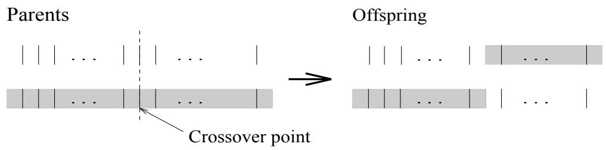  
Figure 2.1: 1-point crossover.

In examining 1X, Eshelman et al. ([11]) found that it suffers from severe positional bias. Schema involving genes that are far apart are very likely to be disrupted whereas schema whose genes are close together are likely to survive. One side affect is called spurious correlation; short clusters of non-interacting genes will tend to be passed to the same offspring. If the alleles for some genes in an individual are good and result in the individual having a high fitness, then the alleles for the other genes will also propagate through the population.

# Multi-point Crossover (MX)

A method of reducing the positional bias found in 1X is to use multiple crossover points (figure 2.2). 2-point crossover (2X) was first studied by Cavicchio ([7]) and later multi-point crossover schemes were examined by De Jong ([10]). Since these studies 2-point crossover has become the most commonly used crossover operator in the GA community.

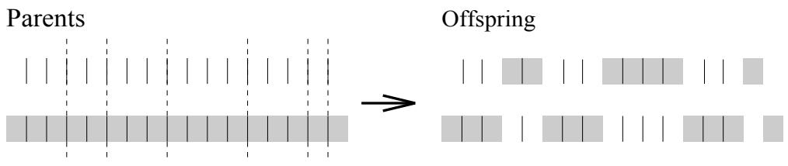  
Figure 2.2: N-point crossover with 6 crossover points.

# Segmented Crossover (SX)

A variation on MX is segmented crossover, developed by Eshelman et al. [11]. In this method it is randomly determined whether the genetic material should be taken from the current parent or whether to switch to the other parent.

for $\mathrm { ~ i ~ } = \mathrm { ~ 1 ~ }$ to L if (random val < switch probability) swap(child1, child2) child1[i] $=$ parent1[i] child2[i] $=$ parent2[i]

# Uniform crossover (UX)

Uniform crossover was first used by Ackley in [1]. With this operator, for each gene, a child has equal probability of receiving the alele from either parent with the other child receiving the other allele. Syswerda ([42]) found that UX has a lower survival average than 1X or 2X but as the length of a schema gets longer UX is better at combining schema.

$$
\forall i , \ c l _ { i } = { \left\{ \begin{array} { l l } { p 1 _ { i } , } & { \alpha _ { i } = 0 } \\ { p 2 _ { i } , } & { \alpha _ { i } = 1 } \end{array} \right. } c 2 _ { i } = { \left\{ \begin{array} { l l } { p 2 _ { i } , \quad \alpha _ { i } = 0 } & { \alpha _ { i } = \{ 0 | 1 \} } \\ { p 1 _ { i } , \quad \alpha _ { i } = 1 } & { \alpha _ { i } = \{ 0 | 1 \} } \end{array} \right. }
$$

A more general version of UX, parameterized uniform crossover (PUX), was developed by Spears and De Jong, [41]. Rather than picking which parent to receive an allele from with equal probability there is a bias towards one parent (see 2.3).

$$
\forall i , \ c l _ { i } = \left\{ \begin{array} { l l } { p 1 _ { i } , } & { \alpha _ { i } < P _ { \alpha } } \\ { p 2 _ { i } , } & { \alpha _ { i } \geq P _ { \alpha } } \end{array} \right. \ c 2 _ { i } = \left\{ \begin{array} { l l } { p 2 _ { i } , \quad \alpha _ { i } < P _ { \alpha } } \\ { p 1 _ { i } , } & { \alpha _ { i } \geq P _ { \alpha } } \end{array} \right. \ \alpha _ { i } , \ P _ { \alpha } \in [ 0 \ . . . \ 1 ]
$$

A study of the different crossover operators ([11]) found that as the number of crossover points increase the positional bias of the operator decreases. The tradeoff is that the distributional bias increases. Distributional bias is the extent that the amount of genetic material expected to be exchanged is clumped around some value, or values, instead of being uniformly distributed between 1 and $( L - 1 ) / 2$ (where $L$ is the length of an individual). It is not clear that a uniform distribution is better than some bias.

# Other Crossover Operators and Variations

All of the above crossover operators, with the exception of UX, suffer from some degree of positional bias. To remove the positional bias Holland ([24]) developed an inversion operator that reorders the genes. This operator is no longer in common use. Shuffle crossover (developed by Eshelman et al. [11]) incorporates inversion into a crossover operator by reordering the genes before crossover takes place.

One method of using the entire population to generate a new individual is bit-based simulated crossover (BSC) developed by Syswerda ([43]). This is not a true recombination operator in that it does not mix alleles between parents. Instead, BSC uses the frequency with which each allele appears in the population to stochastically create a new individual.

# 2.2.2 Phenotypic Recombination Methods

Evolutionary strategies have always searched the phenotypic space. As a result they have several phenotypic recombination operators. In the last ten years the use of real-valued encodings has grown in the GA community, resulting in the development of phenotypic operators. First we will present the recombination operators in use with ESs. Then we will review the development of phenotypic recombination operators in GAs.

Evolutionary strategies have several different recombination operators ([3], [2]) For every $x _ { i } \in x$

$$
\begin{array} { r l } { x _ { i } = p _ { a , i } \ o r \ p _ { b , i } } & { d i s c r e t e } \\ { x _ { i } = ( p _ { a , i } + p _ { b , i } ) / 2 } & { i n t e r m e d i a t e } \\ { x _ { i } = \delta p _ { a , i } + ( 1 - \delta ) p _ { b , i } } & { 0 \leq \delta \leq 1 \ g \ e n e r a l i z e d \ i n t e r m e d i a t e } \\ { x _ { i } = p _ { b , i } } & { p a n m i c t i c \ d i s c r e t e } \\ { x _ { i } = ( p _ { a , i } + p _ { b , i } ) / 2 } & { p a n m i c t i c \ i n t e r m e d i a t e } \\ { x _ { i } = \delta p _ { a , i } + ( 1 - \delta ) p _ { b , i } , } & { 0 \leq \delta \leq 1 \ p a n m i c t i c \ g e n e r a l i z e d \ i n t e r m e d i a t e } \end{array}
$$

For these operators $p _ { a }$ and $p _ { b }$ are the parent individuals and $x$ is an offspring. $p _ { a , i } , p _ { b , i }$ and $x _ { i }$ refer to the ith gene of the individual. Operators 2.5 and 2.6 are intended to take advantage of the case when one parent is on one side of the peak and the other parent is on the other side of the peak (figure 2.3). One disadvantage of a strictly interpolating recombination operator is that areas outside the populations enclosure cannot be reached. Operators 2.7, 2.8 and 2.9 are panmictic recombination operators; the first parent, $p _ { a }$ , is the same for assigning all gene values while a new second parent, $p _ { b _ { i } }$ , is selected for each gene. With panmictic recombination the entire population's gene pool is available for the creation of each new individual.

Early GA recombination operators for real-valued encodings did not modify the genes (also called parameters) but exchanged them (for example [13])  similar to discrete recombination, equation 2.4. In effect they operated like genotypic recombination operators where crossover points could fall only on parameter boundaries. One of the first recombination operators in the GA community to do more than parameter swapping is Davis' averaging crossover ([9]) which averages some of the parameter values (similar to intermediate recombination, equation 2.5). This is a less general operator than Radcliffe's fat crossover ([37]) in which the range of values of the offspring range uniformly between that of the parents (equivalent to generalized intermediate recombination, equation 2.6).

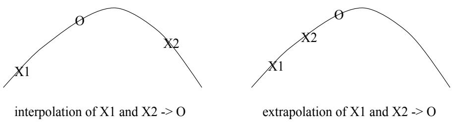  
Figure 2.3: Crossover on a smooth peak.

There is another case that is not mentioned (right diagram of figure 2.3) where both parents are on the same side of the peak. When both parents are on the same side of a peak then extrapolating beyond one parent can lead to the global optima. The final two operators we look at have this capability.

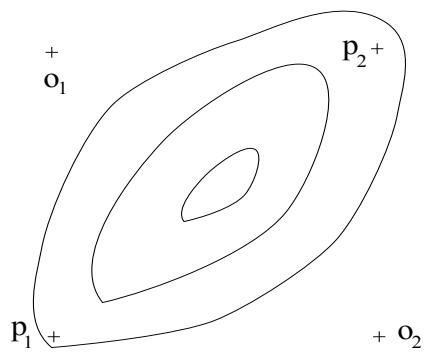  
Figure 2.4: With parameter exchanging crossover, offspring $o _ { 1 }$ and $O _ { 2 }$ are less fit than their parents, $p _ { 1 }$ and $p _ { 2 }$ .

The previous two operators work on each gene independently. In [50] Wright examined recombination operators for a real-valued encoding and developed one that treats individuals as points in an euclidean space. He developed linear crossover to get around the problem where strict exchange of alleles produced individuals of lower fitness (figure 2.4). Linear crossover takes the values from $p _ { 1 }$ and $p _ { 2 }$ and the resulting offspring receive the best of:

$$
\frac { 1 } { 2 } p _ { 1 } + \frac { 1 } { 2 } p _ { 2 } \quad \frac { 3 } { 2 } p _ { 1 } - \frac { 1 } { 2 } p _ { 2 } \quad \frac { 1 } { 2 } p _ { 1 } + \frac { 3 } { 2 } p _ { 2 }
$$

The latter two have the potential to extrapolate from their parents' positions unlike any of the previous phenotypic recombination operators mentioned so far.

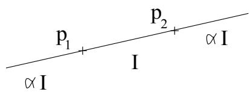  
Figure 2.5: Blend crossover's (BLX- $\alpha$ ) line for potential offspring.

Building on Wright's work ([50]), Eshelman et al. ([12]) define a recombination operator called blend crossover, BLX- $\alpha$ . BLX- $\alpha$ has similarities to both linear and fat crossover. Like linear crossover BLX- $\alpha$ treats individuals as points and creates offspring on the line through $p _ { 1 }$ and $p _ { 2 }$ and will sometimes extrapolate beyond one parent. Like flat crossover these offspring are selected with uniform probability across the range. With BLX- $\alpha$ offspring take their values from the line through $p _ { 1 }$ and $p _ { 2 }$ with equal probability along the interval from $\alpha I$ beyond $p _ { 1 }$ to $\alpha I$ beyond $p _ { 2 }$ (see figure 2.5). The ability to extrapolate allows an EA using only the recombination operator to reach points outside the population's enclosure something not possible with strictly interpolating recombination. Another advantage of this operator is that the balance between convergence and divergence can be controlled by changing the value of $\alpha$ .

In addition to these recombination operators there are ones created for specific problems or encodings. For example there are a large number of recombination operators for the traveling salesman problem. Other examples of phenotypic encodings are where the individuals are programs, such as in genetic programming, [30], or finite state machines as in evolutionary programming, [14]

# 2.3 Related Research

This section reviews some research related to this thesis. First we mention some results where non-traditional encodings and operators have improved the performance of the EA. This shows that as well as using different operators another way of tuning an EA to a problem is to change the encoding. Next Eshelman and Schaffer's work [12] is described. The two directionally tuned operators used in this thesis are modifications of their BLX- $\alpha$ operator and this thesis can be though of as an extension of their study of this operator. Finally we cover Wolpart and Macready's No Free Lunch theorems for search - which provide theoretical limitations on any operator.

Even though the majority of work in EAs has used a binary encoding and operators there are those who have used non-binary representations with non-traditional operators and found them to work better. In [38], Radcliffe argues that the conventional binary operators and encoding are ill-suited to many problems. Comparisons between EAs on real-valued functions have generally shown the algorithm using the real-valued encoding gives better results (see [27], [50] and [12]). Graph problems, such as the TSP, are another class of problems for which non-binary encodings have been found to work better (for example Whitley et al.'s genetic edge recombination [48], Laszewski's partition swapping crossover [44], and Homaifar et al.'s adjacency matrix representation and matrix crossover [25]). Other classes of problems for which alternative operators and encodings are used include evolving computer code and neural network trees (both can use Koza's sub-tree swap [30]). Each of these operators (and encodings) has been tailored for a specific class of problems, each with its own assumptions about the problem space.

In tailoring recombination operators to specific problems it is better to work in the phenotype space than the genotype space. Both Radcliffe ([38]) and Janikow and Michalewicz ([27]) arrive at this conclusion. With a phenotypic encoding the representation space is the same as the problem space making it easier to design problem specific operators.

Eshelman and Schaffer ([12]) examine EAs with a real-valued encoding to determine when they fail to search well. In their paper BLX-0.0 and BLX-0.5 are compared against each other and against some binary encoded EAs. The initial test functions consist of: f-needles, f-incline, f-V and f-cliff (the last three are shown in figure 2.6) on which they are minimizing. They find that the recombination operators for a binary encoding outperform BLX on the f-needles problem (a problem intended for a binary encoding) but are outperformed by BLX on the other three problems (real value problems)  with the exception of BLX-0.0 on f-incline where BLX-0.0 fails because it does not extrapolate.

BLX and the binary crossover operators are then tried on a test suite of 14 functions. They find that BLX-0.5 is better than the binary recombination operators on functions that are smooth and continuous with a real-valued representation. BLX-0.5 is outperformed on those functions which involve building blocks of bits or where the binary representation places the global optima a few bits away from the local optima. In this latter case shifting the locations of the local and global optima reduces the performance of the binary encoded

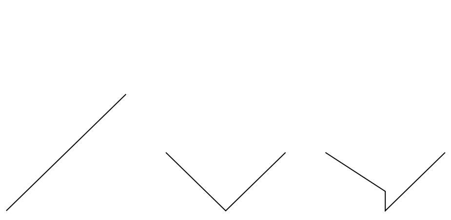  
Figure 2.6: Eshelman and Shaffer's test set: f-incline, f-V and f-cliff.

EAs to that of BLX-0.5.

In [49] Wolpert and Macready present what they call the No Free Lunch theorems for search, or NFL theorems. The essence of their paper is that all search algorithms perform equally well when averaged over a uniform distribution of all functions. Corollaries to these theorems are: on average no search algorithm outperforms random search; to achieve better than random search on some subset of all problems the search algorithm must incorporate some knowledge of these problems; and improved performance on a subset of all problems comes at the cost of reduced performance on the other problems.

The model in which the NFL theorems hold makes the following assumptions. First, the average performance of an algorithm is that algorithm's performance averaged over a uniform distribution of all functions, $f : X \to R$ . Second, this performance is measured as a function of the histogram of all values seen. Finally, the algorithm must eventually generate and evaluate all points in the domain.

In their work it is shown that when all functions are equally likely to be chosen the probability of generating a given histogram is independent of the algorithm used. The significance of this finding is that the average performance over all problems is independent of the algorithm. Similarly, if we know something about our landscape but make algorithm $a$ independent of this knowledge then NFL applies and we cannot expect $a$ to do better than a random search. To achieve better than random performance the search algorithm must incorporate knowledge about the landscape. It is also shown that if $a$ and $b$ are two search algorithms where the average performance of $a$ on $S$ $S \subset \Gamma , \Gamma$ the set of all problems) is better than the average performance of $b$ on $S$ then the average performance of $b$ on $\Gamma \backslash S$ is better than the average performance of $a$ on $\Gamma \backslash S$ .

When using EAs the NFL theorems are often disregarded. Most users take their favorite EA and apply it as is to a given problem. They use the same operators (usually 2-pt crossover or intermediate recombination) without any regard to the problem being searched.

General claims on recombination operators are made based on experiments comparing a few recombination operators on a handful of problems. Some of these claims conclude that operator $a$ is better than operator $b$ . Such claims go against a corollary of the NFL theorems: averaged over all problems all variation operators will perform equally well (assuming that the variation operators do not violate the assumptions that the NFL theorems make).

Improved performance of algorithm (or operator) $a$ can only be achieved on some subset S of all problems. Incorporating problem specific knowledge into $a$ to create $a ^ { \prime }$ will result in $a ^ { \prime }$ outperforming $a$ on subset S (on average), but then $a$ will on average outperform $a ^ { \prime }$ on problems not in S. Getting better performance with an operator that has been modified for a problem has been reported in several papers (including [27], [45] and [38]).

In this section we reviewed work on improving EA performance. Initial work showed that by tuning the EA (either by choice of representation or variation operators) better performance on a given problem or class of problems could be achieved. Later the NFL theorems showed that this improved performance on some problems comes at the cost of reduced performance on other problems.

# Chapter 3

# Experimental Design and Methodology

For an EA to perform better than the average search algorithm (specifically, better than random search) the recombination operator must have some knowledge about the fitness landscape built into it. In chapter 1 we identified three properties by which knowledge about a landscape can be incorporated into a recombination operator for a real-valued landscape. By changing these properties for a given recombination operator to improve the performance on a function we say the operator is tuned to the function. The degree to which this tuning affects the performance of the EA is affected by both the problem's fitness landscape and the methods chosen for the different phases of the EA.

In this thesis we examine how an operator's directional tuning to a landscape affects search performance. We compare operators with different degrees of directional tuning to landscapes with different directional properties to their features. We find that a more directionally tuned operator gives better search performance than a less directionally tuned operator. On one landscape we find that an operator we believe to be directionally tuned to a landscape gives worse performance than an operator with no directional tuning. Thus it may not be intuitive if an operator is tuned to a landscape; and an operator tuned to one landscape can be mis-tuned to a similar one.

This chapter is organized as follows. Section 3.1 is an overview of our experiments. In section 3.2 we describe the different landscapes used in our experiments. In section 3.3 we describe the different recombination operators we use. Section 3.4 defines the EA used in our experiments. Section 3.5 describes the graphs used for analyzing our results. Finally, section 3.6 is an outline of the experiments performed in chapter 5.

# 3.1 Overview of Experiments

After selection has taken place we have a collection of parents that are paired up for recombination. How should pairs of good points be used to create new points? Ackley ([1]) states,

If we are given two good points, we can guess that the reason they are both good is that they are lying at different points on a ridge in the space. Under such an assumption, it would be rational to search on the line through the points, both interpolating between them and extrapolating beyond them, in hopes of finding even better points elsewhere on the presumed ridge.

In our examination of directionality we study interpolation and extrapolation.

The relationships between the different phases of an EA are very complex. When the test landscape is also complex it is difficult to determine the cause of unexpected behaviours in the population. The use of simple landscapes has been advocated by Forrest and Mitchell ([15]) and Eshelman et al. ([12]). The intent is not to create a challenging problem, rather it is to create simple landscapes for which it is easy to determine why a given behaviour occurs. Also, in designing these functions we wanted simple landscapes for which it would be easy to tune operators. These landscapes also scale up in the number of genes that are used. As we are interested only in the recombination operator no mutation is used.

There are five classes of landscapes we run experiments on. In the first class, a royal road function ([15]), the genes are linearly related (the genes contribute independently to an individual's fitness). This landscape has smooth ridges on which it is easy to move along and find the global optima. With the next two classes of landscapes we examine the case when the genes are non-linearly related (the genes do not contribute independently to the individual's fitness)-the interpolation and extrapolation landscapes. Again the global optima is found by moving along a ridge but now it is a ridge of peaks. On these two landscapes we compare performance against two other landscapes which have no such ridges-the random-peaks and one-peak landscapes. Finally we rotate the interpolation and extrapolation landscapes to see how this affects search performance.

The recombination operators we use differ in the degree to which they are directionally tuned to these landscapes. The untuned operator, $R _ { H C }$ , has no knowledge of landscape features built into it. It creates offspring in random directions. The second recombination operator, $R _ { I E }$ , does not assume any linkage between the genes. $R _ { I E }$ is good for moving along ridges parallel to an axis. Our third recombination operator is $R _ { R U }$ . Like $R _ { I E }$ it has the assumption that the landscape consists of ridges built into it. $R _ { R U }$ is also directionally tuned to moving along these ridges regardless of their orientation on the landscape.

# 3.2 Landscapes

Landscapes can be generalized into ones where the genes contribute independently to an individual's fitness and landscapes where the genes are not independent. For our first landscape we want one in which the genes contribute to an individual's fitness independently (linearly). That is the fitness of the individual $I$ is the sum of the fitnesses for each gene $( f ( I ) = f _ { 1 } ( I _ { 1 } ) + f _ { 2 } ( I _ { 2 } ) + . . . f _ { n } ( I _ { n } ) )$ . We use a royal road function which consists of ridges that intersect at the global optimum. For the non-linear landscapes we use two classes of landscape, one for interpolation and one for extrapolation. For the non-linear landscapes we again want the global optima to be found along a ridge of local optima but the function must be non-linear. We use a ridge of peaks where the global optima is found either in the middle of the ridge (the interpolation landscape) or at one end of the ridge (the extrapolation landscape).

As a basis of comparison we use two additional landscapes. The first such landscape, the random-peaks landscape, has all the local optima as in the interpolation and extrapolation landscapes but these local optima are not in line with the global optima. Instead the local optima are randomly placed on the landscape. The second control landscape is the onepeak landscape. This landscape has no ridge of peaks to move along, just the peak with the global optima.

# 3.2.1 Royal Road Landscape

It is generally believed that EAs and recombination work best when the relation between the genes is linear ([28], [40] and [39]). One class of functions designed explicitly to examine an EA's ability to optimize independent genes is Forrest and Mitchell's royal road functions [15]. The first such function, R1, is for binary individuals of length 64. This function has 8 building blocks, one for each of the sets of genes: 1-8, 9-16, 17-24, ., 57-64. For each of these sets, if the value of all the genes is 1 then the individual's fitness is increased by 8. If an individual has none of these building blocks its fitness is 0.

As we are working in a phenotypic space we cannot use the royal road functions as defined. Instead we define our own real-valued royal road function, RRV. The properties we want to maintain are that values of the roads are 0 and individuals on more than one road have a fitness equal to the sum of the fitnesses for being on each. Rather than having all locations on the road equally good, we want the fitness to depend on the distance from the center of the road  low fitness near the edge and highest fitness at the center. One function that satisfies these properties assigns fitness based on the square root of the distance from the center,

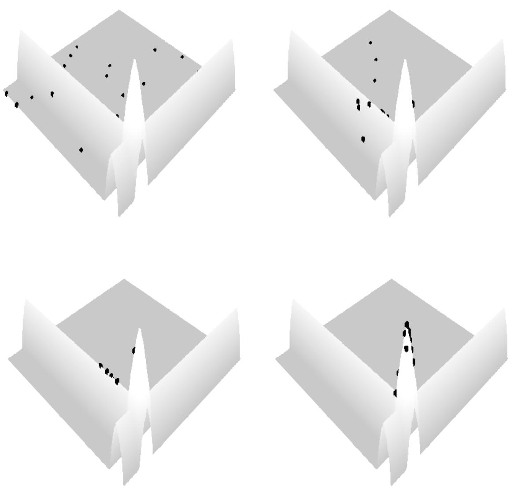  
Figure 3.1: Real-valued royal road landscape.

$$
f = \sum _ { i } { \sqrt { { \frac { 1 } { 2 } } w _ { i } - | c _ { i } - g _ { i } | } } , \quad { \frac { 1 } { 2 } } w _ { i } \geq | c _ { i } - g _ { i } |
$$

where $w _ { i }$ is the width of the road, $c _ { i }$ is the center of the road and $g _ { i }$ is the domain value of the $i$ th gene in the individual. As the domain is the unit hypercube, none of $w _ { i } , c _ { i }$ or $g _ { i }$ exceed 1. Figure 3.1 shows this landscape on two dimensions.

RRV is linear - that is each gene can be optimized independently - and it contains ridges along which the global optima can be found. An instance of RRV is generated by randomly locating the center of each road (one road for each gene) such that no part of the road falls outside the domain.

# 3.2.2 Interpolation Landscape

One way in which to generate a new point from two good ones is to pick a point between them and interpolate as in figure 2.3. This figure shows a smooth peak, one easily climbed by a hill-climbing algorithm. A more challenging landscape is one where the peak is not smooth, as in figure 3.2. On such a landscape it is likely that different sub-populations of a multi-deme EA will converge to different local optima (as $X _ { 1 }$ and $X _ { 2 }$ are in the figure).

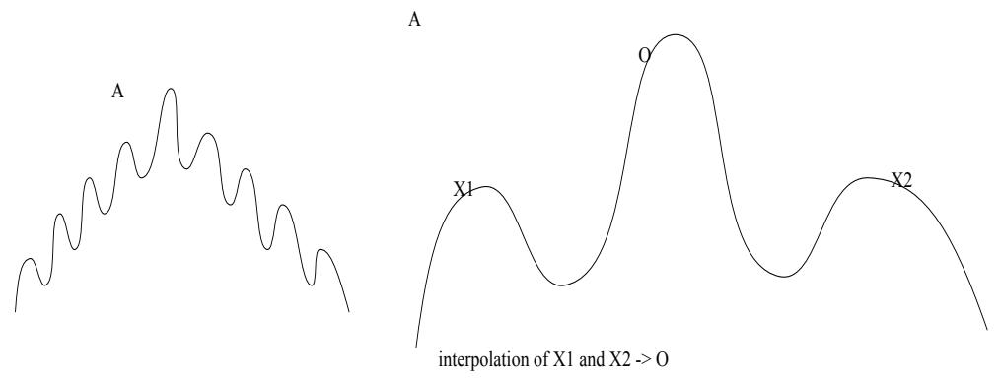  
Figure 3.2: Interpolating on a non-smooth peak.

We expect that an interpolating recombination operator can use local optima in the search for the global optima even when there is a non-linear relationship between the genes. The interpolation landscape, figure 3.3, consists of five peaks along a line. A peak is a hyper-spherical (circle in two dimensions) region of the domain. The height of a point in the domain is determined by its distance from a peak. If a point is outside the radius of all peaks it is assigned a fitness value of 0 (in the figures of the landscapes this fitness value is the height of the point). Points within the radius of a peak are given a fitness based on their distance from the center.

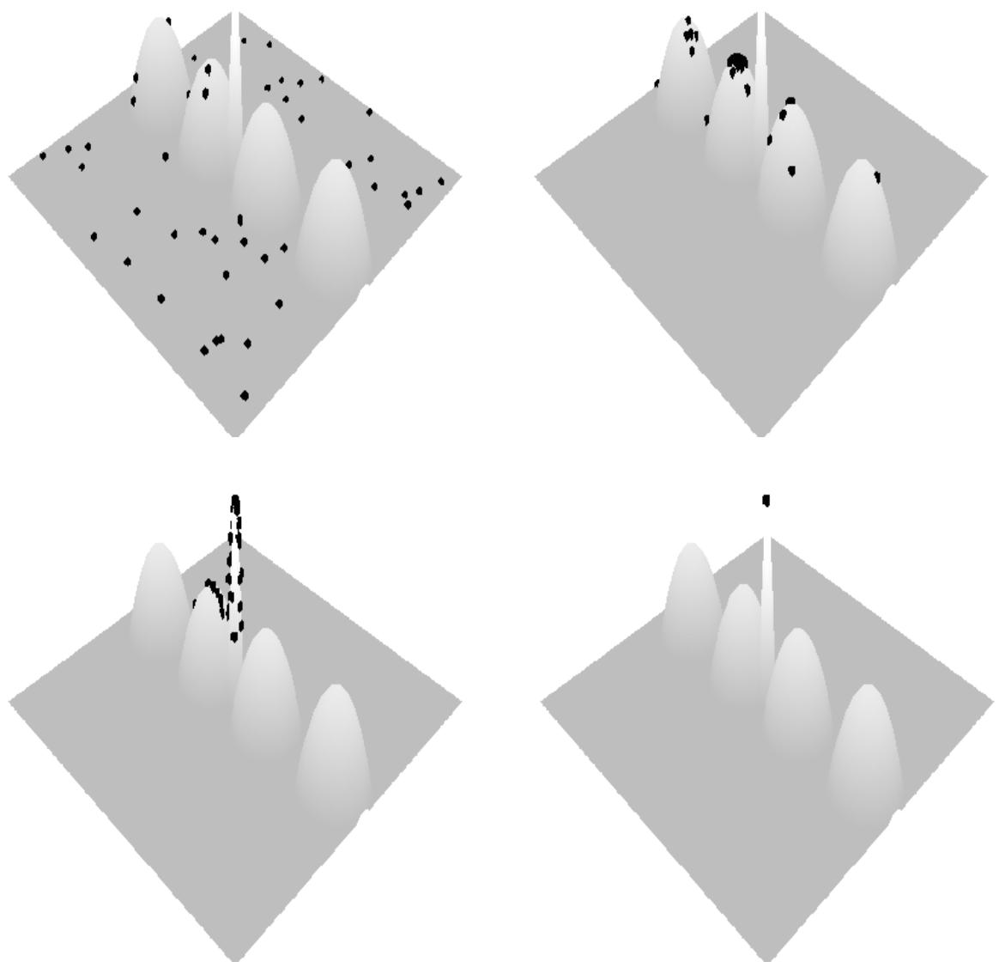  
Figure 3.3: An interpolation landscape.

In assigning a fitness value to a point on the peak we want the following properties. First, we use a hyper-sphere so that the peak is symmetrical in all dimensions. Height must depend on distance to the center with the maximum height at the center. The maximum height must be inversely proportional to the radius of the peak (for our functions it is a non-linear relation). If we divide the distance from the center by $r ^ { 2 }$ then all peaks will have the same radius, yet if we divide the distance from the center by $r ^ { 3 }$ then the height of a peak is $\textstyle { \frac { 1 } { r } }$ which is too strong. Thus we chose to divide the distance from the center by $r ^ { 2 . 5 }$ ,

$$
f = ( r _ { i } ^ { 2 } - d _ { i } ^ { 2 } ) / r _ { i } ^ { 2 . 5 }
$$

In equation 3.2, $d _ { i }$ is the Euclidean distance from the point to the center of peak $i$ and $r _ { i }$ is the radius of peak $i$ . If a point falls within the radius of more than one peak its fitness value is the greater of the values generated by equation 3.2.

In our interpolation landscape we use four short peaks so that the line going through the centers of the peaks is well represented yet not too crowded. All the short peaks are the same height as we want each of the short peaks to be equally attractive to the population. These short peaks have large basins of attraction, thus the population should find and climb them easily. The global optima can then be found by interpolating between individuals from peaks on either side of it.

An instance of the interpolation landscape is created by locating the centers of all the peaks at equal intervals along a line of length 1 (this is the longest line that will fit in the domain at all angles) with the high peak in the middle. These locations are perturbed by a small amount in the range of [-0.05, 0.05]. This perturbation is done so as to spread the peaks out along the line while keeping them from overlapping each other. The line of peaks is then rotated by a specified angle, A, and centered in the domain. For each dimension the angle between the line and it's projection onto the other dimension's is $A ^ { o }$ .

# 3.2.3 Extrapolation Landscape

Another way in which a new point can be generated from two good ones is by extrapolating beyond one of them, as shown in figure 2.3. As with interpolating, extrapolating from individuals on local optima can lead to a better point in the domain, see figure 3.4. The extrapolation landscape, figure 3.5, contains five peaks along a line. Four peaks have the same height and radius and are short, the fifth peak contains the global optima and is located at one end of the line.

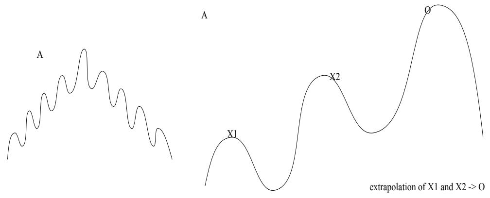  
Figure 3.4: Extrapolating on a non-smooth peak.

An instance of the extrapolation landscape is created by locating the centers of all the peaks at equal intervals along a line of length 1 with the high peak at one end. These locations are perturbed by a small amount in the range of [-0.05, 0.05]. The line of peaks is then rotated by a specified angle, A, and centered in the domain. For each dimension beyond the first the line is rotated to A degrees from the axis of the first dimension.

# 3.2.4 Random Peaks Landscape

To compare the performance of the EA on the previous two landscapes we need one in which there is no ridge through the short peaks and the high peak. For this we use a landscape where the highest peak is located in the center of the search space, and four short peaks are randomly located around it, see figure 3.6. If we had used two short peaks instead of four the likelihood that they would fall nearly in line with the high peak is large. By using four short peaks the chances of them all falling on a line is greatly reduced.

An instance of the random-peaks landscape is created by locating the high peak in the center of the domain and then randomly placing the short peaks. As with the other landscapes we do not want large portions of the peaks to fall outside the domain so we restrict their centers from falling in the band 0.1 from the edge. As with the interpolation and extrapolation landscapes we do not want the high peak to be encompassed by a short peak, in which case the population after finding the short peak would have an easy time climbing it to the global optimum. To reduce this effect any short peak whose center falls within the radius of the high peak is moved away such that its center no longer falls within the radius of the high peak.

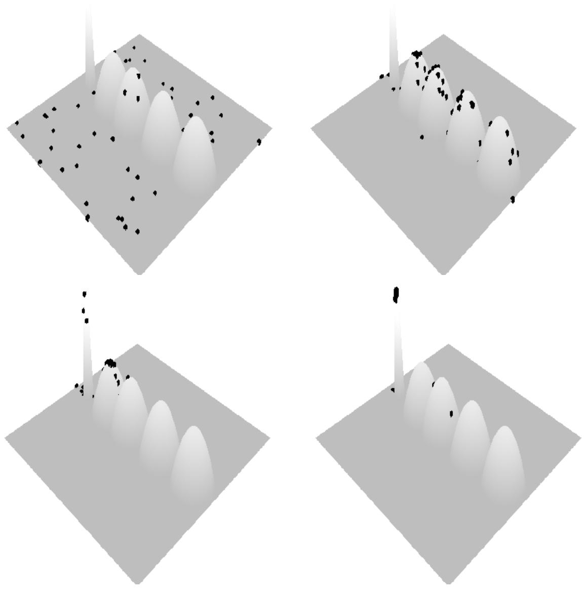  
Figure 3.5: An extrapolation landscape.

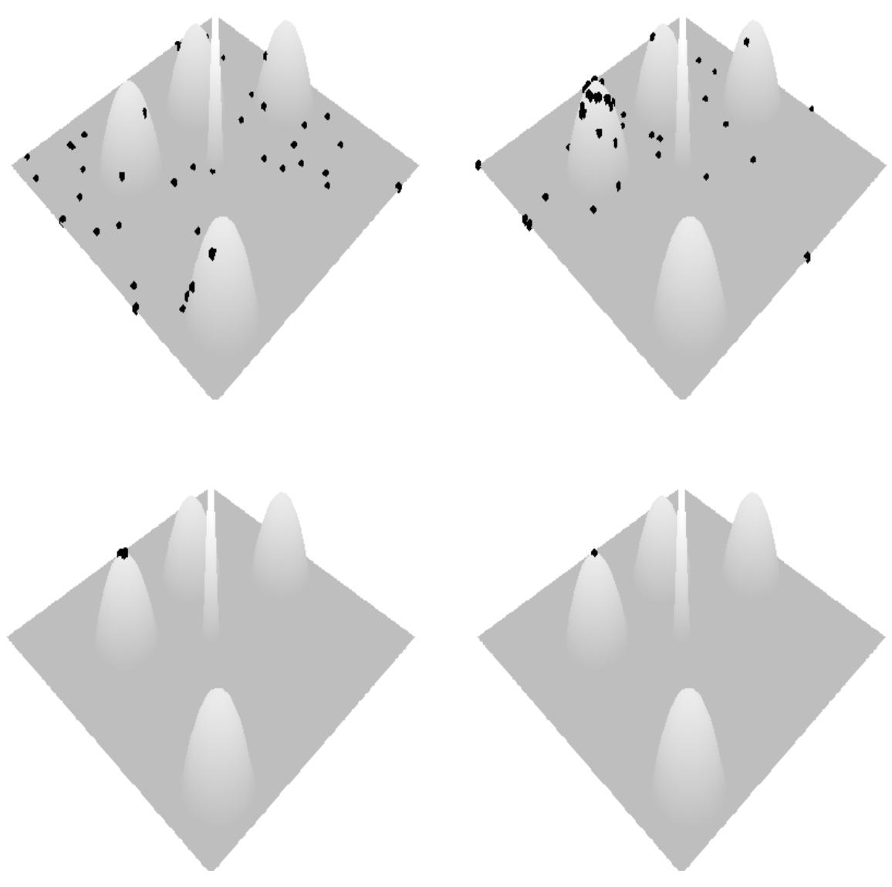  
Figure 3.6: A random-peaks landscape.

# 3.2.5 One-peak Landscape

Another way of showing that the search algorithm is using the ridge of peaks to find the global optima is to compare its performance against a landscape with no local optima but only a global optima. The one-peak landscape contains one high peak and no short peaks. An instance of the one-peak landscape is created by placing its peak at the center of the domain.

# 3.3 Recombination Operators

In this section we define the three recombination operators used in this thesis.

# 3.3.1 Headless Chicken Recombination

Recombination between two individuals is an attempt to find a better point through using/combining information from two individuals. One test to see if the recombination operator is doing more than blindly moving the population about the landscape is the headless chicken test. The headless chicken test was developed by Jones [29] to see if a given recombination operator is using information from the two parent individuals to create better offspring than would be created by a large mutation.

Jones' headless chicken operator, $R _ { H C }$ , uses the recombination operator which it is compared against. Instead of both parents being individuals selected from the population one individual is a randomly generated (with uniform distribution) point from the domain. As we are comparing against $R _ { I E }$ and $R _ { R U }$ our $R _ { H C }$ uses these two operators (depending on which is being compared against $R _ { H C }$ ) with one parent selected from the population and the other parent being a randomly generated individual. Since this second parent is a randomly generated individual the offspring will be created in a random direction. Thus $R _ { H C }$ has no directional tuning to any landscape.

# 3.3.2 Interpolating and Extrapolating Recombination

The interpolating and extrapolating recombination operator we use, $R _ { I E ^ { - } } \alpha$ , is similar to Radcliffe's flat crossover ([37]) and generalized intermediate recombination. $R _ { I E }$ $\alpha$ interpolates or extrapolates for each gene independently. This causes it to be directionally tuned to moving along ridges parallel to an axis.

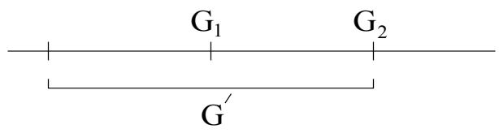  
Figure 3.7: $R _ { I E }$ : Range for recombination on a gene.

$R _ { I E ^ { - } } \alpha$ uses two parents to create two offspring. The value of the ith gene for the two offspring is generated by,

$$
\begin{array} { r } { x _ { i } = a _ { i } + \delta _ { 1 } \big ( a _ { i } - b _ { i } \big ) \quad 0 \le \delta _ { 1 } \le \alpha } \\ { \qquad \quad } \\ { y _ { i } = b _ { i } + \delta _ { 2 } \big ( b _ { i } - a _ { i } \big ) \quad 0 \le \delta _ { 2 } \le \alpha } \end{array}
$$

where $a _ { i }$ and $b _ { i }$ are the values for the $i$ th gene of parents 1 and 2, $x _ { i }$ and $y _ { i }$ are the values given to the $i$ th gene of offspring 1 and 2 and $\delta _ { 1 }$ and $\delta _ { 2 }$ are independent random variables with a uniform distribution. Figure 3.7 shows the range in which a value for a gene will be generated with $\alpha = 1$ . Figure 3.8 shows the range in which offspring will be created when individuals have two genes.

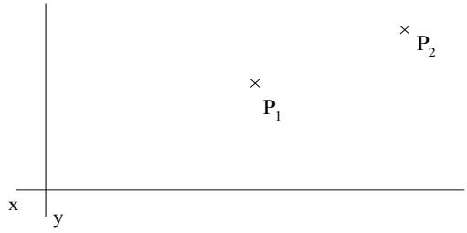  
Figure 3.8: $R _ { I E }$ : Range for recombination on an individual.

It is possible that the range for extrapolation will fall outside the domain. If the value for an offspring's gene is outside the domain it is assigned the value of the nearest boundary. For example if the domain is [0-1] and an offspring is given a value of -0.5 it is changed to 0.

# 3.3.3 Rotational Unbiased Recombination

Since $R _ { I E }$ interpolates and extrapolates each gene independently we expect better performance on landscapes whose ridges are aligned with one of the axes. A variation of BLX- $\alpha$ ([12]) is rotational unbiased recombination, $R _ { R U }$ . $R _ { R U }$ interpolates and extrapolates along the line passing through the two parents (see figure 3.9) and has the same range as BLX- $\alpha$ but offspring 1 never extrapolates beyond the first parent and offspring 2 never extrapolates beyond the second parent. $R _ { R U }$ is directionally tuned to moving along a straight ridge regardless of the angle. $R _ { R U }$ should perform as well as $R _ { I E }$ when the ridges are parallel to an axis. In cases where the ridge is not parallel to an axis we expect $R _ { R U }$ to outperform $R _ { I E }$ .

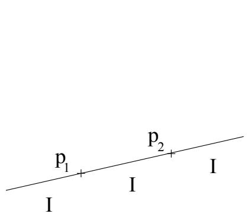  
Figure 3.9: $R _ { R U }$ .

# 3.4 The Evolutionary Algorithm Used for the Experiments

The evolutionary algorithm used in the following experiments consists of (see appendix A for notation):

$P$ : Our population consists of 50 individuals.   
$E$ : We use the double floating-point representation.   
I: Initially we randomly generate individuals uniformly about the domain by assigning each gene of an individual a random number in the range 0 to 1 with a uniform distribution.   
$O$ : For each EA used in the experiments it is specified which recombination operator is used (one of $R _ { I E }$ , $R _ { H C }$ or $R _ { R U }$ ). No mutation operators are used.   
$S$ : Individuals are selected through a combination of exponential ranking and stochastic remainder selection. Exponential ranking is first used to scale the fitness values, with which we use $c = 0 . 0 3 \textrm { - a }$ standard setting ([33]) that was verified to work well after some experimentation. This reduces the chances of premature convergence by preventing an exceptionally fit individual from dominating the selection phase. Parents are then selected using stochastic remainder selection, one of the most commonly used selection methods ([2]). We also use elitism to copy the best individual to the next generation.

R: The new generation consists entirely of offspring created from the previous generation.

T: We halt the search after 50 generations.

# 3.5 Performance and Convergence Graphs

The graphs in this chapter fall into two classes: performance graphs, which plot the performance as a parameter is varied; and convergence graphs, measuring the convergence across the generations. Each point in a performance graph is the average of the best point found after 50 generations for 100 trials. The total number of trials run for a performance graph varies from 1000 (when varying the number of dimensions) up to 19000 (when varying the radii of the short peaks). Convergence graphs are generated by running trials and recording the value of the convergence measure at each generation for each trial. Each point on the graph is the average value of all the trials. So that a comparable number of trials are run for convergence graphs as for performance graphs, the number of trials run for each convergence graph is 1000.

A performance graph plots the fraction of optimum found of the best individual at the end of a run for a given parameter setting. Fraction of optimum is calculated by taking the fitness of the best individual in the final population and dividing it by the global optimum. In all landscapes we know the value of the global optimum - on the royal road landscape it is at the center of all the roads, on the peaks landscapes it is the center of the peak with the smallest radius. As elitism is always used the best individual in the final generation is the same as the best individual ever found throughout the course of the search.

On performance graphs where the radius of some peak is varied a line plotting the ratio of the heights of the short peaks to the high peak is included. Comparing the performance of an EA relative to this line shows how well it searches: the degree to which the EA's performance lies above this line is an indicator of how often the EA finds the high peak. As the radius increases a peak's area increases exponentially faster than its height. Since the probability of finding a peak is based on its basin of attraction (area) the performance of an EA may not change at the same rate as the low/high ratio.

To assist in understanding what the population is doing while it is searching we use five convergence measures. The first is a measure of concentration of the population. It is an upper bound on the volume of the population calculated by taking the distance between the minimum and maximum value of each gene and multiplying these distances together. The second measure is the minimum distance from an individual in the population to the maximum point in the domain. With the third and fourth measures we monitor the concentration of the population onto peaks. The third measure is a count of the number of individuals that are within the radius of some peak in the landscape, and the fourth measure is a count of the number of individuals on the highest peak in the landscape. Finally, as two of our landscapes consist of a line of peaks, the fifth measure is the average distance of the population from the line through the center of the peaks. The random peaks landscape has no such line of peaks; there we determine the least squares line through the population and find the average distance to it.

# 3.6 Outline of Experiments

This section is an outline of the experiments performed in chapter 5. Table 3.1 contains a summary.

Table 3.1: Summary of experiments.   

<table><tr><td rowspan=1 colspan=1>Operators</td><td rowspan=1 colspan=1>Landscapes</td></tr><tr><td rowspan=1 colspan=2>linear landscapes</td></tr><tr><td rowspan=1 colspan=1>RIE VS. RHC</td><td rowspan=1 colspan=1>royal road</td></tr><tr><td rowspan=1 colspan=2>non-linear landscapes</td></tr><tr><td rowspan=1 colspan=1>RIE VS. RHC</td><td rowspan=1 colspan=1>interpolation</td></tr><tr><td rowspan=1 colspan=1>RIE VS. RHC</td><td rowspan=1 colspan=1>extrapolation</td></tr><tr><td rowspan=1 colspan=1>RIE VS. RHC</td><td rowspan=1 colspan=1>random-peaks</td></tr><tr><td rowspan=1 colspan=1>RIE</td><td rowspan=1 colspan=1>interpolation vs. random-peaks</td></tr><tr><td rowspan=1 colspan=1>RIE</td><td rowspan=1 colspan=1>extrapolation vs. random-peaks</td></tr><tr><td rowspan=1 colspan=1>RIE</td><td rowspan=1 colspan=1>interpolation vs. one-peak</td></tr><tr><td rowspan=1 colspan=1>RIE</td><td rowspan=1 colspan=1>extrapolation vs. one-peak</td></tr><tr><td rowspan=1 colspan=2>rotated non-linear landscapes</td></tr><tr><td rowspan=1 colspan=1>RIE VS. RHC</td><td rowspan=1 colspan=1>rotated interpolation</td></tr><tr><td rowspan=1 colspan=1>RIE VS. RHC</td><td rowspan=1 colspan=1>rotated extrapolation</td></tr><tr><td rowspan=1 colspan=1>RRU VS. RHC</td><td rowspan=1 colspan=1>rotated interpolation</td></tr><tr><td rowspan=1 colspan=1>RRU VS. RHC</td><td rowspan=1 colspan=1>rotated extrapolation</td></tr><tr><td rowspan=1 colspan=1>RIE VS. RRU</td><td rowspan=1 colspan=1>rotated interpolation</td></tr><tr><td rowspan=1 colspan=1>RIE VS. RRU</td><td rowspan=1 colspan=1>rotated extrapolation</td></tr><tr><td rowspan=1 colspan=1>RRU VS. RHC</td><td rowspan=1 colspan=1>random-peaks</td></tr></table>

First we compare the performance of $R _ { I E }$ against that of $R _ { H C }$ on the royal-road landscape. The royal-road landscape has smooth ridges along which the global optima is located. $R _ { I E }$ is directionally tuned to moving along such ridges so it should perform better than $R _ { H C }$ .

Next we compare $R _ { I E }$ against $R _ { H C }$ on the interpolation and extrapolation landscapes. As $R _ { I E }$ is directionally tuned to interpolating and extrapolating and $R _ { H C }$ is not, we expect that $R _ { I E }$ will get better performance. On the random-peaks landscape $R _ { I E }$ interpolating and extrapolating assumptions do not hold, so it should not perform as well on this landscape as on the interpolation and extrapolation landscapes. In contrast, $R _ { R U }$ 's performance should remain constant.

$R _ { I E }$ 's directional tuning operates on each gene independently. This is good for moving along ridges parallel to an axis, but not as good for moving along ridges at some angle to the axes. If the landscape is rotated we expect its performance to change. We compare $R _ { I E }$ to $R _ { H C }$ on the rotated interpolation and extrapolation landscapes.

Finally we try $R _ { R U } { - } \mathrm { a n }$ interpolating and extrapolating recombination operator that is directionally tuned to moving along ridges regardless of the ridge's angle. We compare $R _ { R U }$ against $R _ { H C }$ and $R _ { I E }$ on the interpolation and extrapolation landscapes and expect it to perform better than both. Also, we expect the performance of $R _ { R U }$ to remain constant for all angles of the line of peaks.

# Chapter 4

# GAVIN

# 4.1 Introduction

In studying evolutionary algorithms one problem is determining how the different phases interact  there are various different methods for each phase of an EA (initialization, selection, variation, replacement and halting) - and how different sub-population configurations of a parallel evolutionary algorithm affect the search. The standard statistical and convergence methods for understanding how the population is moving do not provide enough information. The statistical measures can give information such as how good the best individual is or the average fitness in the population but some information is lost on how the fitness values are distributed among individuals in the population and how the distribution changes. The convergence measures give individuals' locations relative to each other but not in relation to the landscape. Both of these are poor at showing how multiple sub-populations interact. Through computer visualization the search process can be graphically displayed. The user sees exactly how the population is moving on the fitness landscape and how individuals from different sub-populations are interacting.

Most of the public domain EA software packages available for UNIX workstations have the capability for generating statistical and convergence graphs for the population. Of these some software packages have the ability to run PEAs (either actual or simulated), for example:

GAlib: a $\mathrm { C } + +$ library of objects for an evolutionary algorithm. Most variations are available, or custom methods can be added. Parallelization is possible with PVM (over a network or with sub-populations on the same CPU) using the island model.

DGenesis: a distributed package based on John Grefenstette's GENESIS ([21]). This program runs on a network of UNIX workstations using Berkeley sockets for communication. The user is able to set the sub-population topology, migration interval and rate as well as options available on Genesis 5.0.

PGAPack: an evolutionary algorithm library offering most common choices for selection and variation operators. The library also supports parallel sub-populations, either on a single processor, a parallel computer or a workstation network.

Of the software packages available for UNIX workstations none we are aware of have the capability to graphically display the population searching the fitness landscape. A complete listing of available software (and instructions for downloading them) can be found in part 5 of the comp.ai.genetic FAQ ([22]).

As none of these packages used graphics to display information about the search I developed GAVIN.

# 4.2 Overview

GAVIN (Genetic Algorithm Visualization and INteraction) was built by myself in collaboration with the University of Alberta's computer graphics research group. This tool is valuable because it shows how the population is moving, which sub-population individuals belong to, and displays the structure of the landscape. Being able to see how the population is moving allows one to get an intuitive feel for how the EA searches under different configurations. Knowing which sub-population individuals belong to shows how individuals in different population structures behave and interact. With the landscape displayed on screen its features can be identified. Once a landscape's features are known recombination operators can be designed to make use of them. It would be difficult to gain as good an understanding of the EA and the fitness landscape without a visualization tool such as GAVIN.

GAVIN consists of two independent C libraries: an EA population processing library and a visualization library (the latter uses the SGI Graphic's Library, GL). Functions in both libraries are used through an application program. Each library is independent of the other so the exchange of information from the population processing library to the visualization library is handled by the application program. One advantage of the library independence is that a different EA library can be used with the visualization library.

The EA library provides the user with most variations on the canonical evolutionary algorithm. These include:

fitness processing: linear scaling, linear and exponential ranking and unprocessed.

selection: select all, $n$ best, remainder stochastic with replacement and roulette wheel.   
replacement: replace all, replace if better than parent, replace parent stochastically.   
population structures: island model, multi-deme model and neighborhood model.   
representation: binary (with multiple levels of Gray-coding) and real-valued.   
variation operators: mutation and recombination (2-point, uniform, and various realvalued ones).

Descriptions of these different methods for each phase can be found in appendix A and section 2.2. In addition there are many test functions available and several different statistical measures.

# 4.3 The Visualization Library

In designing the visualization library there are two qualities it had to have. First, the graphics must display the population's movement on the fitness landscape. Second, the display should show the sub-population topology (if one exists) and it must be possible to determine which sub-population an individual belongs to. One method of drawing the fitness landscape is a contour map; but this does not fully convey all of a landscape's nuances or structure. More commonly used (in papers to display a single generation) is a wire-frame drawing of the landscape with the population. On complex landscapes it can be difficult to understand the resulting tangle of lines. Our visualization library uses a solid surface with brightness to indicate height. The drawback to a solid surface is that some features can be hidden behind others. To alleviate this problem the library includes functions to rotate the landscape about all three axes. Individuals are drawn as small cubes and after each generation their locations are updated, showing the user how the population is moving.

Watching the population of a PEA is not useful for determining sub-population interaction unless the graphics also provide information about an individual's sub-population. Our second goal was to find a way such that individuals from different sub-populations could be easily distinguished. An individual has two traits  shape and colour. We chose to use colour to signify which sub-population an individual belongs to.

Depending on the population model used there can be restrictions on which migrations between sub-populations. Generally the model used is dictated by the hardware. One of the more common models is the [rectangular] mesh. A 1-D mesh is a line of processing elements (PEs) each connected to its two neighbors, a 2-D mesh is a number of adjacent 1-D meshes with adjacent PEs connected to each other, a 3-D mesh is a stack of 2-D meshes, etc. (see figure 4.1). The corresponding PEA has a sub-population on each PE with migration restricted to adjacent sub-populations.

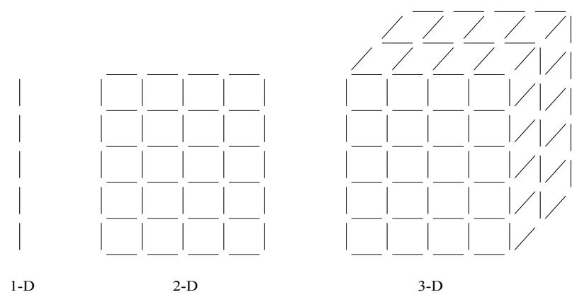  
Figure 4.1: 1-D, 2-D and 3-D meshes.

GAVIN's visualization library can colour sub-populations with a 1-D or 2-D mesh topology. Colours are selected by varying HSV values. The HSV colour model (left drawing in figure 4.2) is a distortion of the RGB cube into a cone with coordinates hue, saturation and value. Going around the HSV cone varies hue, value  the colour's intensity - varies along the line through the cone's axis, and saturation  the amount of white - is the distance to the value axis. With a 1-D mesh topology colours are selected by varying the hue and with a 2-D mesh topology both hue and saturation are varied.

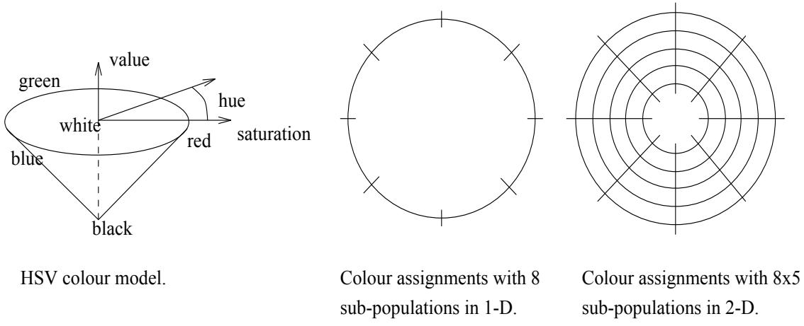  
Figure 4.2: Colour assignments on a 1-D and 2-D topography.

Figure 4.2 shows how the colours are selected for the 1-D and 2-D mesh topologies. The middle diagram is the top of the HSV cone with lines along the circle indicating the hues chosen for a 1-D mesh topology with 8 sub-populations. The right diagram is also the top of the HSV cone; intersections show the hue and saturation values for an $8 \times 5$ 2-D mesh topology.

# 4.4 Using GAVIN

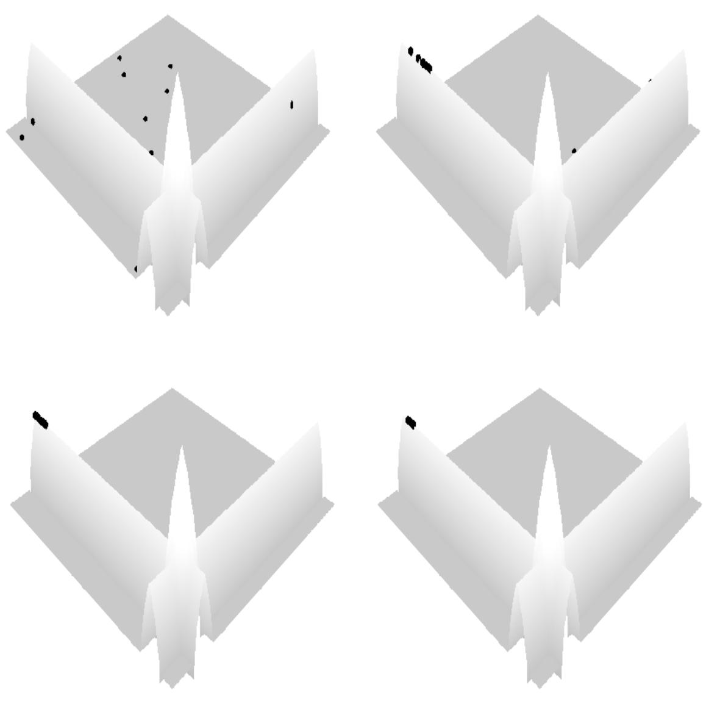  
Figure 4.3: Rotational-unbiased recombination $( R _ { R U } )$ with deterministic crowding on the royal road landscape.

The visualization of EA search is an invaluable aid in learning about EAs. For example one unexpected behavior was noticed while trying different configurations on the royal road function (see section 3.2.1). Using one recombination operator ( $R _ { R U }$ , a variation on BSC-1 described in section 3.3.3) with deterministic crowding (described in section A.2.5) it was noticed that the population was grouping on top of a ridge and would not move along it. This behaviour is shown in the series of screen shots in figure 4.3. With a different replacement method (such as stochastic deterministic crowding) the population did not get stuck but moved along the ridge to the global optimum (see the screen shots in figure 3.1). On the royal road landscape the only way to move along a ridge is by extrapolating away from the parents. But in extrapolating from the parents the offspring were located farther from the center of the road than their parents. As a result their fitness was lower so the they did not replace their parents. When the replacement method is changed to stochastic deterministic crowding the population is able to move along the ridge and find the global optimum.

Convergence measures show the population converging in both cases and performance measures show that one EA seldom finds the global optimum while the other nearly always does. Neither give any indication of why. With GAVIN it can be seen that the population of one EA moves along the ridge to the global optimum whereas the population under the other EA does not. This relation between the replacement method, recombination operator and the resulting behavior of the population came as a result of being able to observe the population on a three dimensional landscape. On a landscape of only two dimensions such complex relationships might not be noticeable.

Other behaviours can be seen with GAvIN. The screen shots in figure 4.4 show nine independent sub-populations searching a landscape. With GAVIN it is easy to see that the individuals in each sub-population converge to one peak and each sub-population tends to converge to a different part of the domain. Figures 4.5, 4.6 and 3.5 show how search progresses under different recombination operators. In figure 4.5 the recombination operator extrapolates away from the parents and it can be seen that the population moves to the edges of the landscape (with one individual kept on a peak in the middle by elitism). Figure 4.6 shows a recombination operator that interpolates between the parents. Here the population quickly converges to a local optimum. Finally in figure 3.5 we see a recombination operator that can both interpolate and extrapolate. It does not converge as fast as the strictly interpolating recombination operator nor does it end up spread out along the edges as with the strictly extrapolating recombination operator. In addition to observing the effects of different recombination operators the mutation operator can be used, the selective pressure can be varied and different selection and replacement methods can be used. Once an interesting behavior has been observed a more formal set of tests can be devised to determine (or verify) its cause. Alternatively GAVIN can be used to assist in generating plausible hypotheses to explain experimental results.

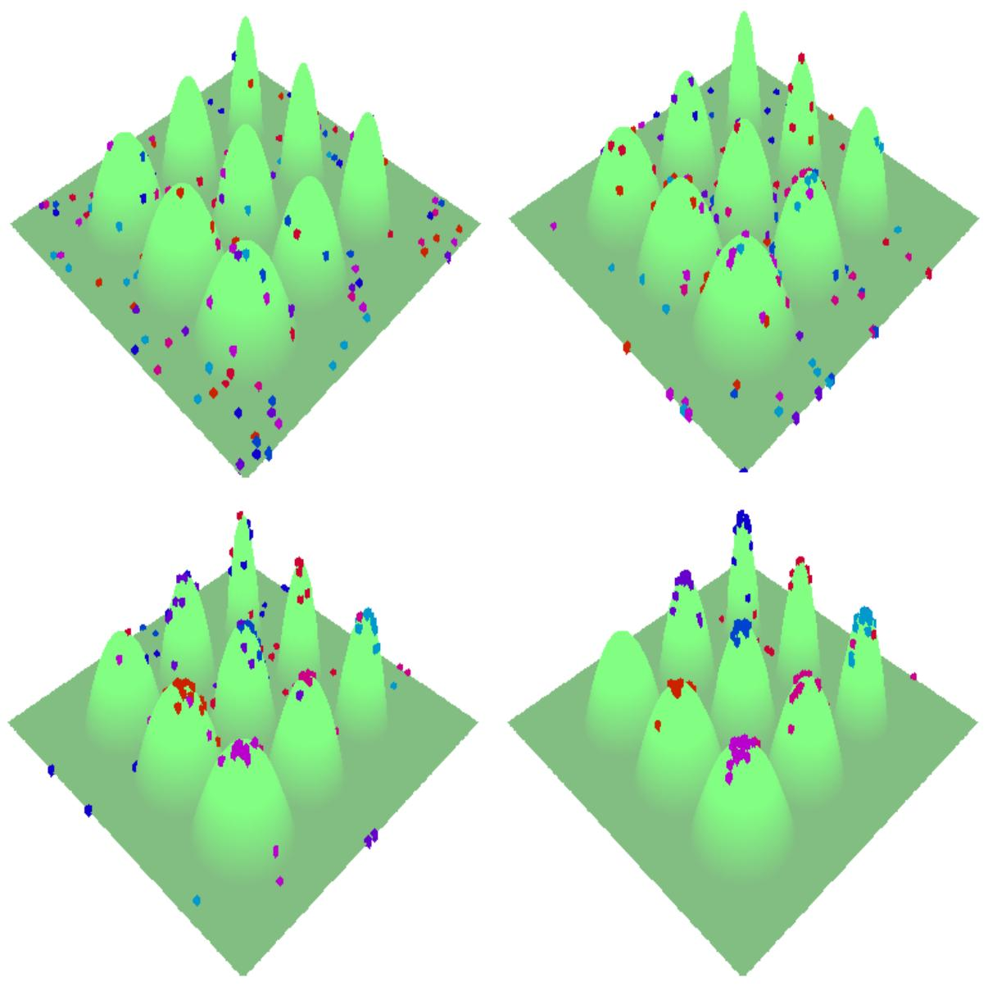  
Figure 4.4: Nine independent sub-populations searching a landscape; screen shots are at 10 generation intervals.

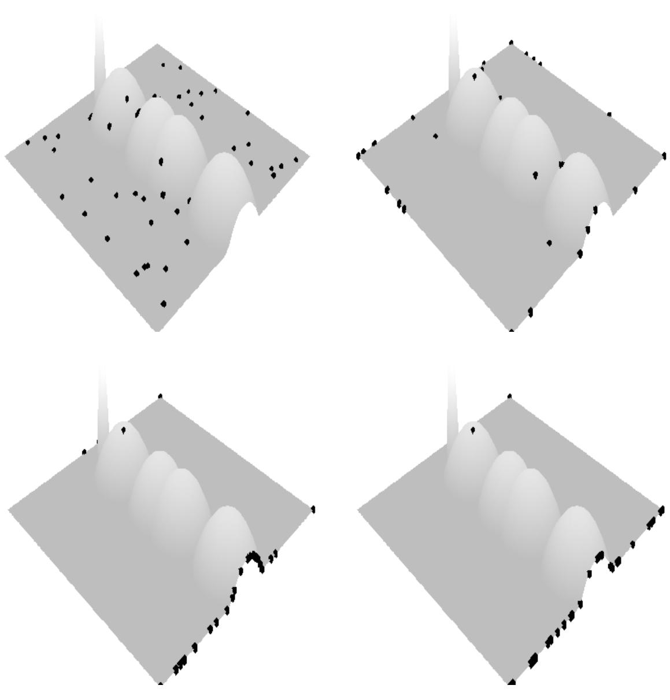  
Figure 4.5: Strictly extrapolating recombination on the extrapolation landscape.

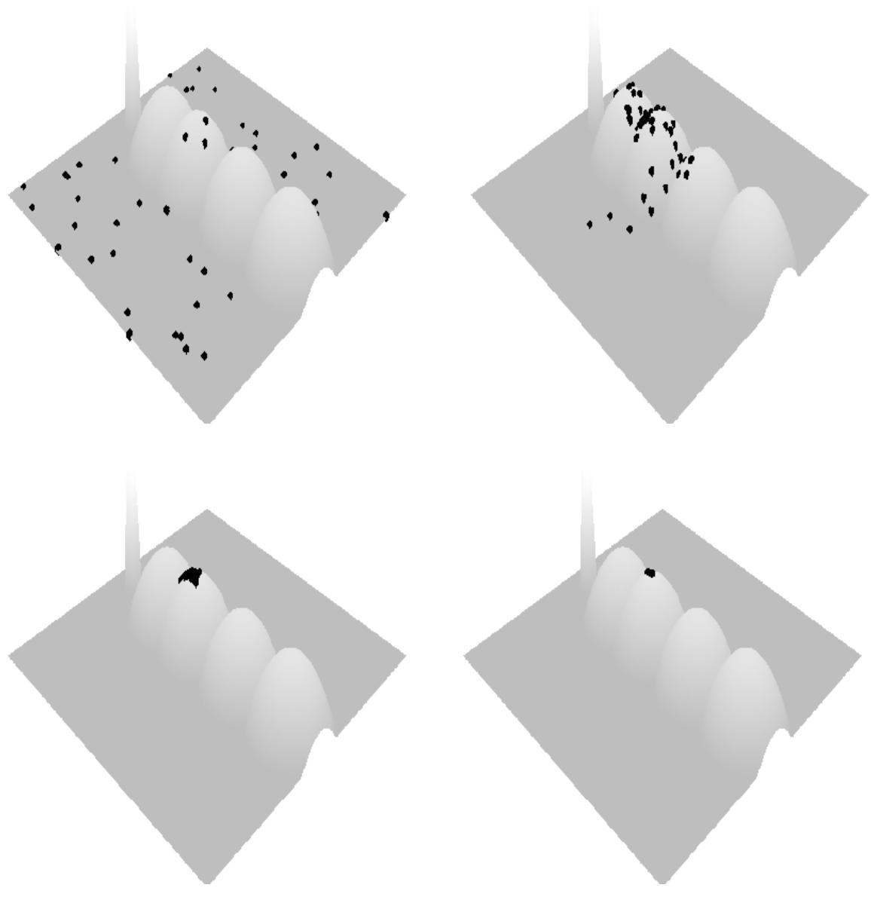  
Figure 4.6: Strictly interpolating recombination on the extrapolation landscape.

# 4.5 Future Enhancements

The next stage in the development of GAVIN is the addition of an interaction library. This will be a graphical user interface allowing the user to configure the EA and interact with the search. By using a mouse the user could select individuals for manipulation  move them to another part of the landscape, delete them, or use them to create offspring - or change the parameters while the search is in progress. In addition we would like to be able to use colour to show which individuals are selected for parents and then show the offspring created by each set of parents.

# Chapter 5

# Experimental Results

# 5.1 Linearly Related Genes

We start our experiments by showing that a directionally tuned operator searches better than a non-directionally tuned operator. To show this we run $R _ { I E }$ on the real-valued royal road function (RRV), our easiest landscape because the relationship amongst the genes is linear, and compare it against an operator that does not have any directional tuning to the landscape, $R _ { H C } , \ R _ { I E }$ interpolates and extrapolates from the parent points so it should move along the roads and find the global optimum. As the roads become wider and easier to find $R _ { I E }$ 's performance should improve. $R _ { H C }$ does not use features of the landscape like $R _ { I E }$ , but with wider roads the population should converge to them faster and then find the global optimum faster.

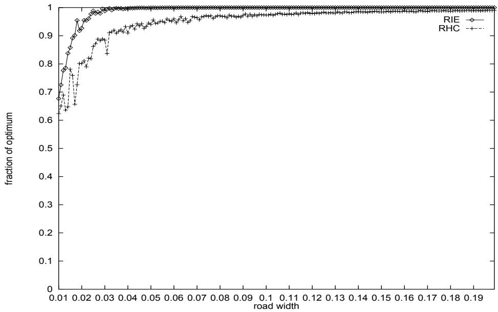  
Figure 5.1: $R _ { I }$ compared against the headless chicken test on the 2-gene RRV landscape.

Figure 5.1 contains a graph plotting the performance of $R _ { I E }$ and $R _ { H C }$ with varying road widths on the 2-gene RRV landscape. This graph shows that both operators are improving their performance as the width increases with $R _ { I E }$ improving faster than $R _ { H C }$ . In fact, after a road width of $0 . 0 3 ~ R _ { I E }$ appears to always find the global optimum. Next we will look at the convergence graphs on this landscape. What we expect to find is that $R _ { I E }$ is converging onto the roads more so than $R _ { H C }$ ; resulting in $R _ { I E }$ putting more individuals on the global optimum (on all roads) than is $R _ { H C }$ .

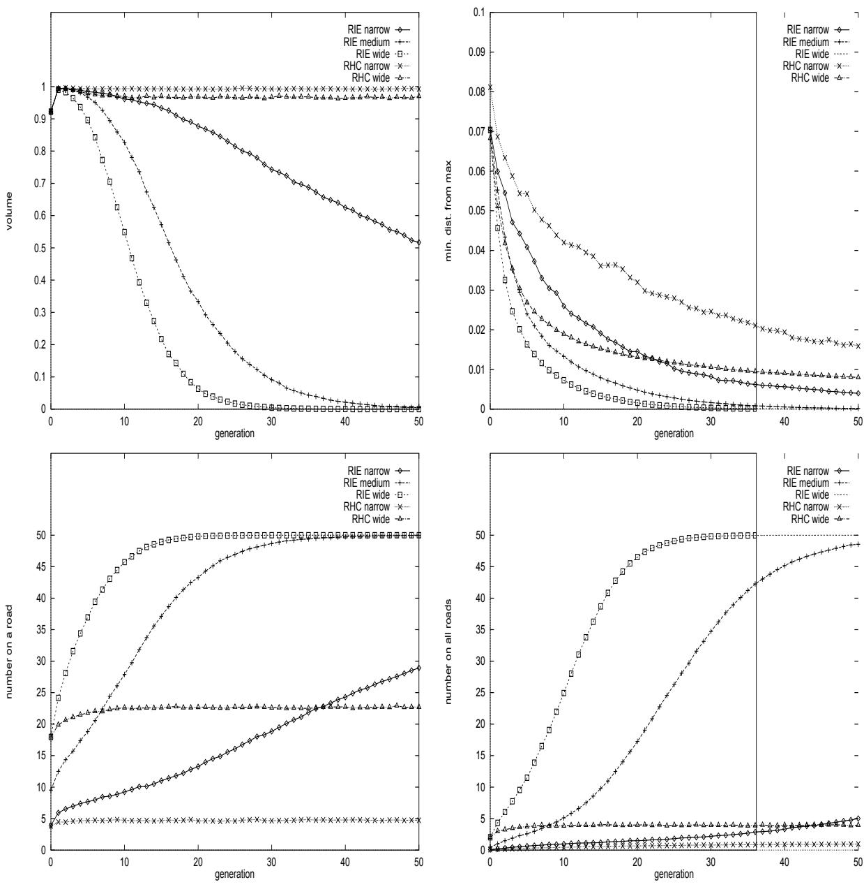  
Figure 5.2: Convergences on the 2-gene RRV landscape.

The convergence graphs (figure 5.2) plot four different convergence measures for $R _ { I E }$ and $R _ { H C }$ on the 2-gene RRV landscape. For different road widths narrow, medium and wide correspond to 0.02, 0.05 and 0.10 respectively. From these graphs we can see that $R _ { I E }$ has difficulties in finding the narrow roads, width 0.02. With a population of 50 individuals we expect only 1 individual to be on a given road ( $\textstyle { \frac { 2 } { 1 0 0 } } 5 0 = 1 $ similar to what Forrest and Mitchell had on their royal road functions ([15]). They attributed the poor performance in finding the global optimum to sampling errors and premature convergence. As the roads get wider they are easier to find so the initial population will have individuals on more roads, explaining why $R _ { I E }$ and $R _ { H C }$ perform better on wider roads.

The convergence graphs also show that $R _ { I E }$ is converging to the roads and into a smaller volume as the search progresses; $R _ { H C }$ is maintaining a constant number of individuals on roads and is keeping its population spread throughout the domain. Both $R _ { I E }$ and $R _ { H C }$ are converging to the global optimum with $R _ { I E }$ being faster than $R _ { H C }$ . This is strong support for our hypothesis that directionally tuning an operator improves search performance.

Now we will compare the performance of $R _ { I E }$ and $R _ { H C }$ when the number of dimensions are varied. In a larger domain the advantage to using landscape features should be much larger over random search. Thus we expect the difference in performance between $R _ { I E }$ and $R _ { H C }$ to be larger as the number of dimensions is increased.

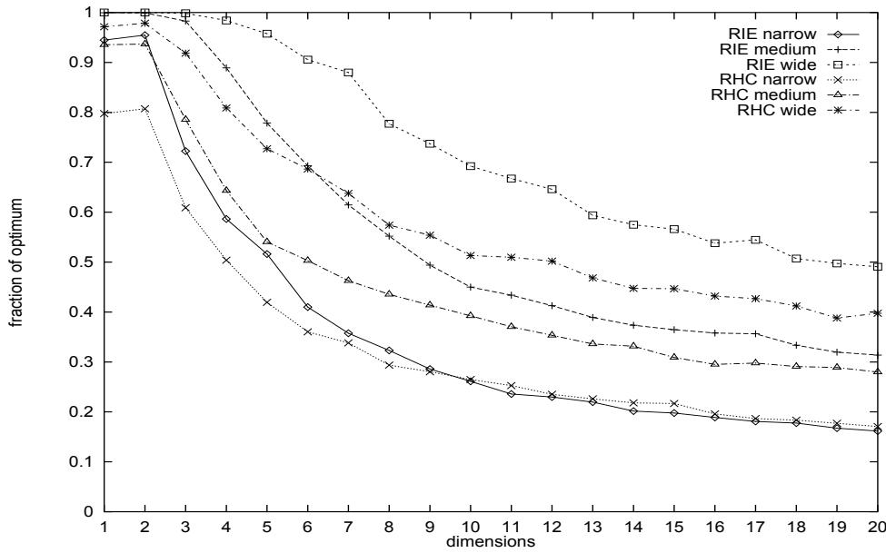  
Figure 5.3: $R _ { I E }$ compared against $R _ { H C }$ with the dimensions varied for different road widths Test function is the RRV landscape with ridges randomly located.

Figure 5.3 contains a graph plotting the performance of $R _ { I E }$ and $R _ { H C }$ for different road widths as the number of dimensions is varied.

When the width of the road is medium or wide $R _ { I E }$ finds higher points than $R _ { H C }$ , as we expected. On the narrow roads $R _ { I E }$ outperforms $R _ { H C }$ when there are fewer than 9 genes. That $R _ { H C }$ performs equally well as $R _ { I E }$ when there are more than 9 genes is a little surprising. This is likely because the roads are so narrow that $R _ { I E }$ has problems finding them and is reduced to random search. Also, as the number of genes increase premature convergence is more likely to occur.

In this set of experiments we showed that $R _ { I E }$ , because it is directionally tuned to the landscape, will move along ridges to the global optimum giving better performance than an untuned recombination operator. $R _ { H C }$ , which is not tuned to any landscape features, does not converge to any features on the landscape. $R _ { I E }$ , which is directionally tuned to ridges, converges to the ridges. This suggests that an operator tuned to using a feature of the landscape will converge to that feature. We also found that as the landscape features become harder to find the performance of operators tuned to these features degrades to that of random search. These findings are summarized in table 5.1.

<table><tr><td>observation</td><td>conclusion</td></tr><tr><td>RHC does not converge to the roads, RIE converges to roads.</td><td>An operator that is directionally tuned to using a given feature will converge to that feature.</td></tr><tr><td>the narrow roads.</td><td>RIE performs about the same as RHC on As a feature becomes harder to find the performance of an operator tuned to using that feature will degrade to random search.</td></tr></table>

Table 5.1: Summary of results for the royal road landscape.

# 5.2 Non-linearly Related Genes

In this section we will investigate the performance of the interpolating and extrapolating recombination operator $R _ { I E }$ on a landscape where the genes are non-linearly related.

# 5.2.1 $R _ { I E }$ Vs. RHC

Again we show that a directionally tuned operator searches better than an untuned operator. For this we compare $R _ { I E }$ against $R _ { H C }$ on the interpolation and extrapolation landscapes. We also compare $R _ { I E }$ against $R _ { H C }$ on the random-peaks landscape. The features to which $R _ { I E }$ is directionally tuned are not on the random-peaks landscape so we expect to find that

$R _ { H C }$ performs at least as well on it.

In our comparison we vary the radius of the high peak and the radii of the short peaks. When the radius of the high peak is very small the landscape becomes a needle-in-a-haystack problem (NIAH problem, [16]) so we expect $R _ { I E }$ to converge to the short peaks on all three landscapes. As the radius of the high peak increases it becomes easier to find so the EA's performance should increase. The performance increase should be faster on the interpolation and extrapolation landscapes than on the random-peaks landscape. When the radii of the short peaks are varied the population will converge to them faster. Since fewer generations are used to converge to the short peaks there are more generations to find the high peak. As a result the average performance on the interpolation and extrapolation landscapes should improve. $R _ { I E }$ is not directionally tuned to the random-peaks landscape because there is no relation between the location of the short peaks and the high peak. As a result increased convergence time to the short peaks reduces the time to search for the high peak. We expect the performance on the random-peaks landscape to remain constant or drop as the radii of the short peaks is increased.

For $R _ { H C }$ we expect that it will not outperform $R _ { I E }$ but make no predictions as to where it will fall relative to the low/high line. Instead we predict how its performance will change as the radii are varied. As the radius of the high peak increases $R _ { H C }$ 's performance should improve. Since $R _ { H C }$ is randomly moving individuals it should not be affected by any convergence to the short peaks. Thus we expect the performance of $R _ { H C }$ to be independent of the radii of the short peaks.

In figure 5.4 we compare the performances of these two recombination operators on the two gene instances of the interpolation and extrapolation landscapes. The radii of the short peaks is 0.1 and the radius of the highest peak is varied from 0.001 to 0.1. As expected $R _ { I E }$ performs better than $R _ { H C }$ .

Figure 5.5 contains performance graphs of $R _ { I E }$ and $R _ { H C }$ where the radii of the short peaks are varied from 0.05 to 0.25 and the radius of the high peak is fixed at 0.015. Again we find that $R _ { I E }$ performs better than $R _ { H C }$ , as predicted. On the interpolation landscape $R _ { H C }$ 's performance level is constant as the radii of the short peaks is varied but decreases slightly on the extrapolation landscape. Also, $R _ { H C }$ does not perform as well on the extrapolation landscape as on the interpolation landscape.

There are at least two possible reasons why $R _ { H C }$ performs better on the interpolation landscape than on the extrapolation landscape. If we assume that $R _ { H C }$ is unaffected by the short peaks then one explanation for why $R _ { H C }$ performs better on the interpolation landscape than the extrapolation landscape is that $R _ { H C }$ is biased towards finding optima in the center of the domain (where the interpolation landscape has its global optimum). The convergence graphs show that the population under $R _ { H C }$ is converging to the peaks, although slowly, so the assumption may not be true. The other explanation is based on the average distance between the short peaks and the high peak. On the extrapolation landscape the average distance from a short peak to the high peak is greater than it is on the interpolation landscape. $R _ { H C }$ is less likely to find the high peak if it has to make a longer jump thus $R _ { H C }$ should operate better on the interpolation landscape.

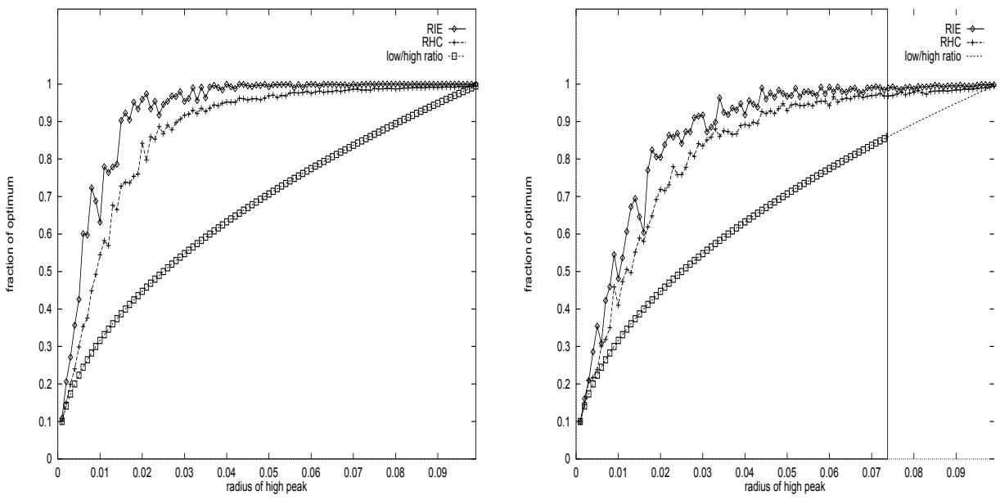  
Figure 5.4: $R _ { I E }$ compared against $R _ { H C }$ on the interpolation (left) and extrapolation (rih landscapes.

Now we compare $R _ { H C }$ against $R _ { I E }$ on the random-peaks landscape. Since $R _ { I E }$ is not directionally tuned to this landscape its performance should be no better than randomly moving about the landscape $( R _ { H C } )$ . It is also possible that $R _ { I E }$ 's tuning will hinder it from finding the global optima on this landscape, in which case it will perform worse than $R _ { H C }$ .

In figure 5.6 we see that $R _ { H C }$ outperforms $R _ { I E }$ . This shows that $R _ { I E }$ is not a globally better operator then $R _ { H C }$ and that operators tuned to one landscape will be mistuned to other landscapes.

With this set of experiments we set out to show that a directionally tuned operator searches better than an untuned operator. On the landscapes which $R _ { I E }$ is directionally tuned (the interpolation and extrapolation landscapes) it outperforms $R _ { H C }$ -supporting our hypothesis. On the random-peaks landscape (to which $R _ { I E }$ is not tuned) $R _ { I E }$ performs worse than $R _ { H C }$ . This is likely because $R _ { I E }$ 's assumptions about the structure of the landscape hinder it on the random-peaks landscape where these assumptions are not true. That is, $R _ { I E }$ is mistuned to this landscape. Table 5.2 summarizes the findings for this set of experiments.

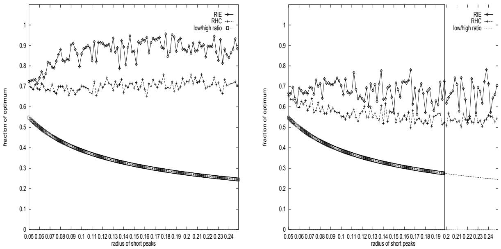  
Figure 5.5: $R _ { I E }$ compared against $R _ { H C }$ on the interpolation (left) and extrapolation (right) landscapes.

Table 5.2: Summary of results for comparing $R _ { I E }$ against $R _ { H C }$   

<table><tr><td>observation</td><td>conclusion</td></tr><tr><td>RIE outperforms RHC on the interpolation and extrapolation landscapes.</td><td>A tuned operator outperforms an untuned operator.</td></tr><tr><td>random-peaks landscape.</td><td>RIE is outperformed by RHC on the An operator directionally tuned to one landscape may not be directionally tuned to a similar landscape.</td></tr></table>

# 5.2.2 Comparing Against Random-Peaks

$R _ { I E }$ is directionally tuned to the interpolation and extrapolation landscapes but not to the random-peaks landscape. Here we examine $R _ { I E }$ on the three landscapes.

First we compare the performance of $R _ { I E }$ on the interpolation and extrapolation landscapes against its performance on the random-peaks landscape. For all three landscapes the population should converge to the short peaks. On the interpolation and extrapolation landscapes $R _ { I E }$ (because of its assumptions about the landscape) will find the highest peak but on the random-peaks landscape there is no obvious relation between the location of the short peaks and of the high peak so we do not expect $R _ { I E }$ to find the high peak as often.

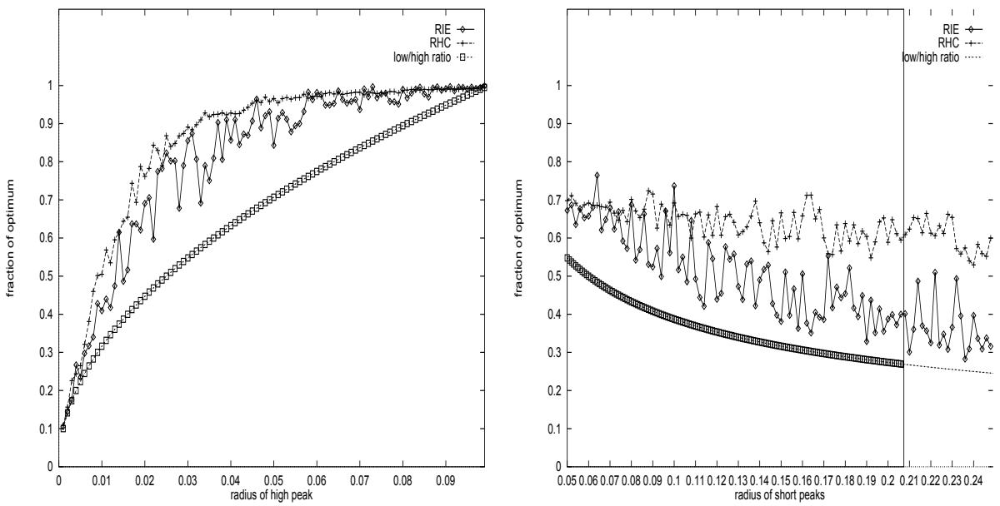  
Figure 5.6: $R _ { I E }$ compared against $R _ { H C }$ on the random-peaks landscape.

As in the previous section we vary first the radius of the high peaks then the radii of the short peaks. The results for $R _ { I E }$ are the same as in the previous section thus we do not need to re-state our expectations.

Our first graph, figure 5.7, compares the performance of $R _ { I E }$ on the interpolation and extrapolation landscapes against that of $R _ { I E }$ on the random peaks landscapes. The radius of the highest peak is varied and the radii of the short peaks are fixed at 0.1.

One observation is that the performance on the interpolation landscape is better than on the extrapolation landscape. One explanation for this is that unlike interpolation there are two directions in which to extrapolate. As each parent-child combination can extrapolate in one of these directions only half the extrapolations are in the correct direction. Thus recombination is less likely to arrive at the high peak on the extrapolation landscape. Another factor is that extrapolating from two peaks on the interpolation landscape will sometimes lead to the high peak but interpolating from two different peaks on the extrapolation landscape will never lead to the high peak. Thus $R _ { I E }$ is more directionally tuned to the interpolation landscape than the extrapolation landscape.

Figure 5.8 contains the graphs comparing the performance when the radii of the short peaks is varied. For these plots the radius of the high peak is fixed at 0.015.

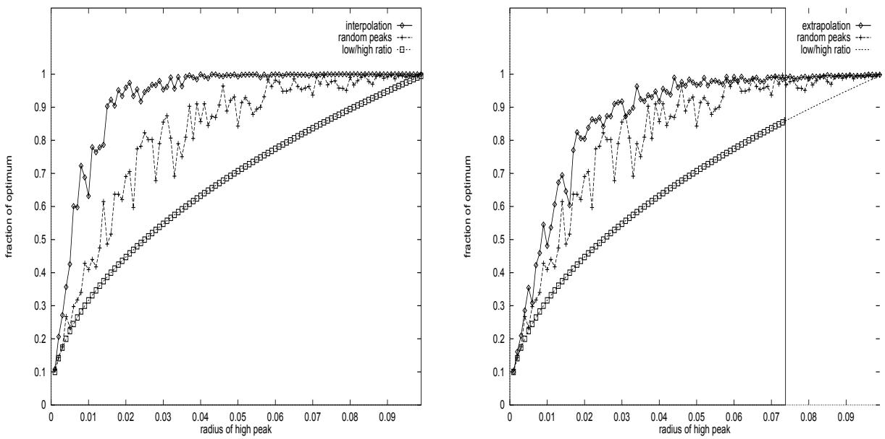  
Figure 5.7: Search on the interpolation (left) and extrapolation (right) landscapes compared against the random-peaks landscape.

We notice that the performance increases on the interpolation landscape but remains level on the extrapolation landscape. On the random-peaks landscape the performance decreases. We also see that the performance on the interpolation landscape levels off after the radii of the short peaks goes beyond 0.15.

The leveling of of the performance on the interpolation landscape is caused by the leveling in convergence time to the short peaks. As the radii of the short peaks increases the population converges to them faster (shown in figure 5.9). Yet this rate of convergence must level off after some value as there is some minimum number of generations necessary for the population to converge to the peaks. After some threshold radius there is no increase in time to find the high peak, so the performance remains constant. As for the performance on the extrapolation landscape, $R _ { I E }$ may not be sufficiently tuned to the landscape to take advantage of the increase in the radii of the short peaks. Examining convergence graphs may confirm this hypothesis or suggest a new one.

On the convergence graphs we expect to find that increasing the radius of the peaks decreases the number of generations needed to converge to the peaks. We also expect more individuals to find the high peak on the interpolation and extrapolation landscapes than on the random-peaks landscape.

Figures 5.9 and 5.10 are convergence graphs for the interpolation, random peaks and extrapolation landscapes. Each graph plots the convergence measure for peaks with small, medium and large radius. The value for each setting is: 0.1 for the short peaks and 0.01 for the high peaks; 0.15 for the short peaks and 0.015 for the high peak; and 0.2 for the short peaks and 0.02 for the high peak respectively.

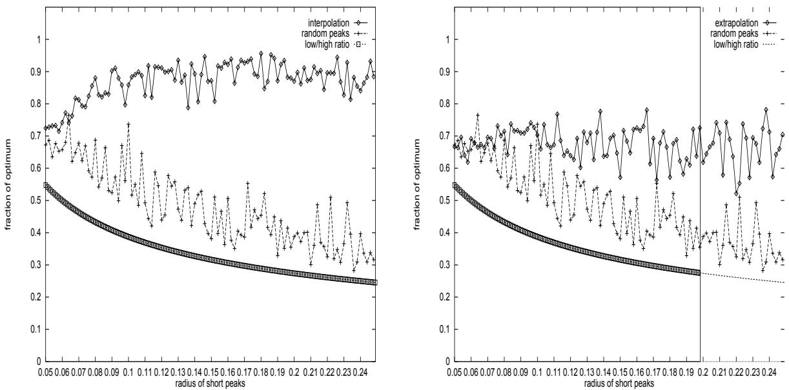  
Figure 5.8: $R _ { I E }$ on the interpolation (left) and extrapolation (right) landscapes compared against its performance on the random peaks landscape.

These graphs confirm that the population converges onto peaks with larger radii faster and that this increase in convergence levels off. The graphs also confirm that the population is not converging as quickly or finding the high peak as well on the random-peaks landscape as on the other two landscapes. Finally, they confirm that $R _ { I E }$ on the extrapolation landscape is converging to a line, onto the peaks and into a smaller volume as fast as on the interpolation landscape but not as many individuals are ending up on the high peak, or are getting as near to the global optimum. Given that $R _ { I E }$ is not as well tuned to the extrapolation landscape as the interpolation landscape this shows that a more tuned operator gets better search performance.

There are two surprises in these graphs. The first is that the minimum distance to the global optimum, after decreasing for some generations, increases. The second is that the number of individuals on the high peak drops after roughly 20 generations on the interpolation and extrapolation landscapes. Both of these unexpected observations have a similar cause  the short peaks' large basins of attraction and the large number of individuals on them.

The reason that the minimum distance to the global optimum increases is because in converging to the short peaks the population is moving away from the high peak. We know that the population is converging onto the peaks (from the number on peaks graph) and into a smaller volume (volume graph) so it must be converging onto a short peak.

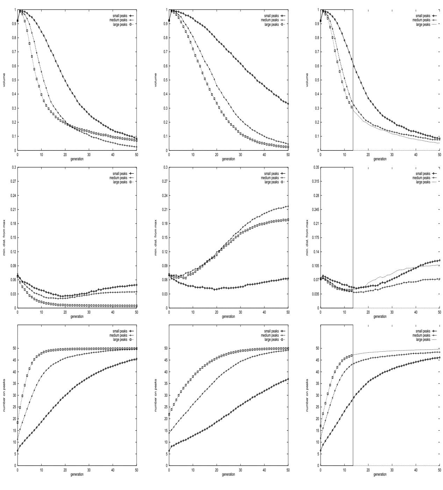  
Figure 5.9: Convergences with $R _ { I E }$ ; graphs are (from left to right): interpolation, random peaks and extrapolation landscapes.

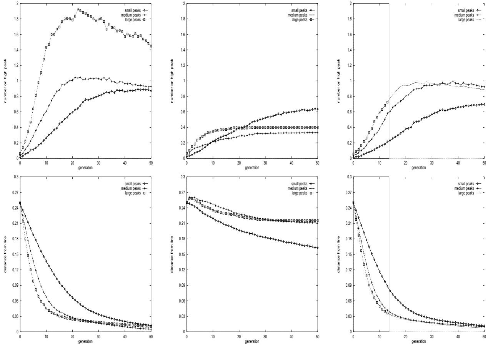  
Figure 5.10: Convergences with $R _ { I E }$ ; graphs are (from left to right): interpolation, random peaks and extrapolation landscapes.

The decrease in the number of individuals on the high peak is caused by the larger number of individuals on a short peak (as well as the larger basin of attraction of the short peak). With most of the individuals on a short peak, parent individuals from the short peak will frequently be paired with other individuals from the same peak and individuals from the high peak will also be paired with individuals from the short peak. After recombination the pairs with both parents from the short peak will produce offspring on that peak. The pairs that had one parent from a high peak and one from the short peak will be more likely to produce individuals on the short peak (it has a larger basin of attraction than the high peak) than on the high peak.

The following is a mathematical argument that a large group of individuals on a short peak with a large basin of attraction will pull individuals from a smaller group on a higher peak. First some simplifying assumptions. Assume that:

the $( \mu , \lambda )$ selection and replacement method is used (the best $\mu$ individuals are selected for parents to create the $\lambda$ individuals for the next generation).   
• $s$ is the fraction of the population selected as parents $\begin{array} { r } { ( s = \frac { \mu } { \lambda } ) } \end{array}$ .   
• $n _ { s }$ is the number of individuals in the small group   
all the individuals in the small group are selected as parents (as they are on a high peak).   
the remaining parents are selected from the large group on the short peak.   
•recombination between parents from the same peak will produce offspring on that peak, otherwise offspring will fall on the high peak with probability $p$ .

The fraction of parents from the small group is $\frac { n _ { s } } { s }$ and the fraction of parents from the large group is $\frac { s - n _ { s } } { s }$ T the small group of individuals are is: $\scriptstyle \left( { \frac { n _ { s } } { s } } \right) \ \left( { \frac { n _ { s } } { s } } \right)$ individuals when both parents are from the small group and $2 p \ : ( \frac { s - n _ { s } } { s } ) \ : \left( \frac { n _ { s } } { s } \right)$ individuals when the parents come from different peaks. If $n _ { s } ( t )$ is the number of individuals on the high peak at generation $t$ then the number of individuals on the high peak at generation $t + 1$ is:

$$
n _ { s } ( t + 1 ) = \left( \frac { n _ { s } ( t ) } { s } \right) \left( \frac { n _ { s } ( t ) } { s } \right) + 2 p \left( \frac { s - n _ { s } ( t ) } { s } \right) \left( \frac { n _ { s } ( t ) } { s } \right)
$$

Table 5.3: Expected proportion of the population on the high peak after one generation for $p = 0 . 1$ .   

<table><tr><td colspan="1" rowspan="1">S</td><td colspan="8" rowspan="1">n_s$</td></tr><tr><td colspan="1" rowspan="1"></td><td colspan="1" rowspan="1">0.0300</td><td colspan="1" rowspan="1">0.0600</td><td colspan="1" rowspan="1">0.0900</td><td colspan="1" rowspan="1">0.1200</td><td colspan="1" rowspan="1">0.1500</td><td colspan="1" rowspan="1">0.1800</td><td colspan="1" rowspan="1">0.2100</td><td colspan="1" rowspan="1">0.2400</td></tr><tr><td colspan="1" rowspan="1">0.3000</td><td colspan="1" rowspan="1">0.0280</td><td colspan="1" rowspan="1">0.0720</td><td colspan="1" rowspan="1">0.1320</td><td colspan="1" rowspan="1">0.2080</td><td colspan="1" rowspan="1">0.3000</td><td colspan="1" rowspan="1">0.4080</td><td colspan="1" rowspan="1">0.5320</td><td colspan="1" rowspan="1">0.6720</td></tr><tr><td colspan="1" rowspan="1">0.4000</td><td colspan="1" rowspan="1">0.0195</td><td colspan="1" rowspan="1">0.0480</td><td colspan="1" rowspan="1">0.0855</td><td colspan="1" rowspan="1">0.1320</td><td colspan="1" rowspan="1">0.1875</td><td colspan="1" rowspan="1">0.2520</td><td colspan="1" rowspan="1">0.3255</td><td colspan="1" rowspan="1">0.4080</td></tr><tr><td colspan="1" rowspan="1">0.5000</td><td colspan="1" rowspan="1">0.0149</td><td colspan="1" rowspan="1">0.0355</td><td colspan="1" rowspan="1">0.0619</td><td colspan="1" rowspan="1">0.0941</td><td colspan="1" rowspan="1">0.1320</td><td colspan="1" rowspan="1">0.1757</td><td colspan="1" rowspan="1">0.2251</td><td colspan="1" rowspan="1">0.2803</td></tr><tr><td colspan="1" rowspan="1">0.6000</td><td colspan="1" rowspan="1">0.0120</td><td colspan="1" rowspan="1">0.0280</td><td colspan="1" rowspan="1">0.0480</td><td colspan="1" rowspan="1">0.0720</td><td colspan="1" rowspan="1">0.1000</td><td colspan="1" rowspan="1">0.1320</td><td colspan="1" rowspan="1">0.1680</td><td colspan="1" rowspan="1">0.2080</td></tr><tr><td colspan="1" rowspan="1">0.7000</td><td colspan="1" rowspan="1">0.0100</td><td colspan="1" rowspan="1">0.0230</td><td colspan="1" rowspan="1">0.0389</td><td colspan="1" rowspan="1">0.0578</td><td colspan="1" rowspan="1">0.0796</td><td colspan="1" rowspan="1">0.1043</td><td colspan="1" rowspan="1">0.1320</td><td colspan="1" rowspan="1">0.1626</td></tr><tr><td colspan="1" rowspan="1">0.8000</td><td colspan="1" rowspan="1">0.0086</td><td colspan="1" rowspan="1">0.0195</td><td colspan="1" rowspan="1">0.0326</td><td colspan="1" rowspan="1">0.0480</td><td colspan="1" rowspan="1">0.0656</td><td colspan="1" rowspan="1">0.0855</td><td colspan="1" rowspan="1">0.1076</td><td colspan="1" rowspan="1">0.1320</td></tr><tr><td colspan="1" rowspan="1">0.9000</td><td colspan="1" rowspan="1">0.0076</td><td colspan="1" rowspan="1">0.0169</td><td colspan="1" rowspan="1">0.0280</td><td colspan="1" rowspan="1">0.0409</td><td colspan="1" rowspan="1">0.0556</td><td colspan="1" rowspan="1">0.0720</td><td colspan="1" rowspan="1">0.0902</td><td colspan="1" rowspan="1">0.1102</td></tr><tr><td colspan="1" rowspan="1">1.0000</td><td colspan="1" rowspan="1">0.0067</td><td colspan="1" rowspan="1">0.0149</td><td colspan="1" rowspan="1">0.0245</td><td colspan="1" rowspan="1">0.0355</td><td colspan="1" rowspan="1">0.0480</td><td colspan="1" rowspan="1">0.0619</td><td colspan="1" rowspan="1">0.0773</td><td colspan="1" rowspan="1">0.0941</td></tr><tr><td colspan="1" rowspan="1">S</td><td colspan="8" rowspan="1">$n_s$</td></tr><tr><td colspan="1" rowspan="1"></td><td colspan="1" rowspan="1">0.0300</td><td colspan="1" rowspan="1">0.0600</td><td colspan="1" rowspan="1">0.0900</td><td colspan="1" rowspan="1">0.1200</td><td colspan="1" rowspan="1">0.1500</td><td colspan="1" rowspan="1">0.1800</td><td colspan="1" rowspan="1">0.2100</td><td colspan="1" rowspan="1">0.2400</td></tr><tr><td colspan="1" rowspan="1">0.3000</td><td colspan="1" rowspan="1">0.0460</td><td colspan="1" rowspan="1">0.1040</td><td colspan="1" rowspan="1">0.1740</td><td colspan="1" rowspan="1">0.2560</td><td colspan="1" rowspan="1">0.3500</td><td colspan="1" rowspan="1">0.4560</td><td colspan="1" rowspan="1">0.5740</td><td colspan="1" rowspan="1">0.7040</td></tr><tr><td colspan="1" rowspan="1">0.4000</td><td colspan="1" rowspan="1">0.0334</td><td colspan="1" rowspan="1">0.0735</td><td colspan="1" rowspan="1">0.1204</td><td colspan="1" rowspan="1">0.1740</td><td colspan="1" rowspan="1">0.2344</td><td colspan="1" rowspan="1">0.3015</td><td colspan="1" rowspan="1">0.3754</td><td colspan="1" rowspan="1">0.4560</td></tr><tr><td colspan="1" rowspan="1">0.5000</td><td colspan="1" rowspan="1">0.0262</td><td colspan="1" rowspan="1">0.0566</td><td colspan="1" rowspan="1">0.0914</td><td colspan="1" rowspan="1">0.1306</td><td colspan="1" rowspan="1">0.1740</td><td colspan="1" rowspan="1">0.2218</td><td colspan="1" rowspan="1">0.2738</td><td colspan="1" rowspan="1">0.3302</td></tr><tr><td colspan="1" rowspan="1">0.6000</td><td colspan="1" rowspan="1">0.0215</td><td colspan="1" rowspan="1">0.0460</td><td colspan="1" rowspan="1">0.0735</td><td colspan="1" rowspan="1">0.1040</td><td colspan="1" rowspan="1">0.1375</td><td colspan="1" rowspan="1">0.1740</td><td colspan="1" rowspan="1">0.2135</td><td colspan="1" rowspan="1">0.2560</td></tr><tr><td colspan="1" rowspan="1">0.7000</td><td colspan="1" rowspan="1">0.0182</td><td colspan="1" rowspan="1">0.0387</td><td colspan="1" rowspan="1">0.0613</td><td colspan="1" rowspan="1">0.0862</td><td colspan="1" rowspan="1">0.1133</td><td colspan="1" rowspan="1">0.1425</td><td colspan="1" rowspan="1">0.1740</td><td colspan="1" rowspan="1">0.2077</td></tr><tr><td colspan="1" rowspan="1">0.8000</td><td colspan="1" rowspan="1">0.0158</td><td colspan="1" rowspan="1">0.0334</td><td colspan="1" rowspan="1">0.0526</td><td colspan="1" rowspan="1">0.0735</td><td colspan="1" rowspan="1">0.0961</td><td colspan="1" rowspan="1">0.1204</td><td colspan="1" rowspan="1">0.1463</td><td colspan="1" rowspan="1">0.1740</td></tr><tr><td colspan="1" rowspan="1">0.9000</td><td colspan="1" rowspan="1">0.0140</td><td colspan="1" rowspan="1">0.0293</td><td colspan="1" rowspan="1">0.0460</td><td colspan="1" rowspan="1">0.0640</td><td colspan="1" rowspan="1">0.0833</td><td colspan="1" rowspan="1">0.1040</td><td colspan="1" rowspan="1">0.1260</td><td colspan="1" rowspan="1">0.1493</td></tr><tr><td colspan="1" rowspan="1">1.0000</td><td colspan="1" rowspan="1">0.0125</td><td colspan="1" rowspan="1">0.0262</td><td colspan="1" rowspan="1">0.0409</td><td colspan="1" rowspan="1">0.0566</td><td colspan="1" rowspan="1">0.0735</td><td colspan="1" rowspan="1">0.0914</td><td colspan="1" rowspan="1">0.1105</td><td colspan="1" rowspan="1">0.1306</td></tr></table>

Table 5.4: Expected proportion of the population on the high peak after one generation for $p = 0 . 2$ .

Using equation 5.1, tables 5.3 and 5.4 give the expected number of individuals that will be on the high peak after one generation for different values of $s$ , $n _ { s }$ and $p$ . These tables show that recombination is not good at maintaining a small group of individuals on a peak.

Recombination has also been thought of as a diversification operator whose role is to generate variation and cause the population to explore the landscape (see [11] and [36]). Thus it may not be surprising that it is not good at keeping individuals on peaks. For this reason we used elitism to keep the best individual from generation to generation. Trials without elitism resulted in the population converging to one or two short peaks with no individuals on the high peak.

The difference in degree to which the population is moving away from the high peak on the different landscapes is explained by the degree of directional tuning of the recombination operator to the landscape. On the random-peaks landscape there is no relation between the location of the short peaks and the high peak. As a result once the population has converged onto the short peaks it is very unlikely to ever reach the high peak. On the interpolation and extrapolation landscapes there is a relation between the location of the high and short peaks with this relation built into the recombination operator. Even though the population converges to the short peaks, recombination between individuals from the short peaks produces individuals on the high peaks. As $R _ { I E }$ is more directionally tuned to the interpolation landscape its minimum distance from max graph does not increase as fast as for the extrapolation landscape.

Another reason why the minimum distance to the global optimum increases more on the extrapolation landscape than the interpolation landscape is that on average the distance between the short peaks and the high peak is greater on the extrapolation landscape.

In this set of experiments we wanted to compare the performance of an operator on a landscape to which it is directionally tuned against its performance on a landscape to which it is not tuned. We found that the operator works better on the landscape on which it is tuned. We also found that the number of individuals on the high peaks decreases. We showed that this is caused by the attractive pull of a larger group of individuals. Table 5.5 is a summary of our findings for this set of experiments.

<table><tr><td>observation</td><td>conclusion</td></tr><tr><td>RIE performs at least as good on both the</td><td>Directionally tuning the recombination op-</td></tr><tr><td>interpolation and extrapolation landscapes erator improves search performance.</td><td></td></tr><tr><td>as on the random-peaks landscape</td><td></td></tr></table>

Increasing the radii of the short peaks improves $R _ { I E }$ 's performance on the interpolation landscape but not the random-peaks landscape

An operator that is directionally tuned to a landscape will search better as the feature(s) to which it is tuned are easier to find. The performance of an operator not tuned to this feature will not improve.

The number of individuals on the high peak decreases.

A large group of individuals can draw individuals from a small group.

Table 5.5: Summary of results for the random-peaks landscape.

# 5.2.3 One-peak Landscape

Figures 5.5 and 5.8 are graphs of $R _ { I E }$ with the radii of the short peaks varied. None of them show any significant change in performance on the interpolation and extrapolation landscapes as the radius varies. This suggests that perhaps the population is not using the short peaks to help find the high peak. One way to see if the short peaks are being used is to compare the performance of $R _ { I E }$ on the interpolation and extrapolation landscapes against its performance on a landscape with just one high peak.

As plotting average performance is misleading (on the one-peak landscape if the population does not find the high peak it will get $0 \%$ of optimum whereas on the interpolation and extrapolation landscapes the population will find a short peak) we will monitor the number of individuals that end up on the high peak. Figure 5.11 has graphs comparing the number of individuals that find the high peak after 50 generations on the interpolation and extrapolation landscapes against that on the one-peak landscape. In this graph the radius of the high peak is fixed at 0.015 and the radii of the short peaks is varied. The variances for these plots are typically between: 0.2 and 0.4 on the interpolation landscape, 0.05 and

0.2 on the extrapolation landscape; and on the one-peak landscape it is 0.19 when the high peak is at the center (for comparison against the interpolation landscape) and 0.13 when the high peak is near the edge (for comparison against the extrapolation landscape).

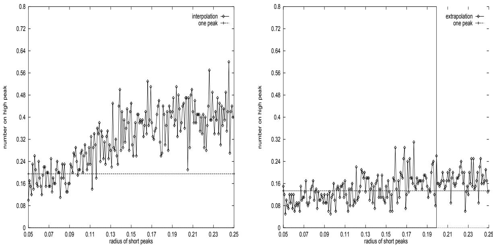  
Figure 5.11: $R _ { I E }$ on the interpolation (left) and extrapolation (right) compared against $R _ { I E }$ on the one-peak landscape.

The graphs show that the short peaks are helping the search on the interpolation landscape but not the extrapolation landscape. On the interpolation landscape the number of individuals that end on the high peak starts smaller than on the one-peak landscape. As the radii of the short peaks increase the number of individuals that find the high peak on the interpolation landscape increase and becomes greater than on the one-peak landscape. This shows that the short peaks are being used to find the high peak. On the extrapolation landscape the number of individuals finding the high peak remains almost constant but does increase a little above the level of the one-peak landscape. From this we conclude that $R _ { I E }$ is not making much use of the short peaks to find the high peak on the extrapolation landscape-which should be the case as $R _ { I E }$ is not as well directionally tuned to this landscape as it is to the interpolation landscape. Table 5.6 summarizes the results for the one-peak landscape.

As the radii of the short peaks increase the number of individuals finding the high peak on the interpolation and extrapolation landscapes increase above the number that find the high peak on the one-peak landscape.

$R _ { I E }$ is using the short peaks to find the high peaks.

The increase in the number of individuals finding the high peak is much larger on the interpolation landscape than the extrapolation landscape.

A more tuned operator gets better performance.

Table 5.6: Summary of results for the one-peak landscape.

# 5.3 Rotating the Landscape

# 5.3.1 Rotating the Line of Peaks

So far the line of peaks has been parallel to one of the axes. When this is the case the population under $R _ { I E }$ has only to converge along the line of peaks and then find the high peak somewhere along this line. This involves optimizing first one gene then the other - similar to when the genes are independent. Meanwhile $R _ { H C }$ is not making use of features on the landscape so it must optimize both genes simultaneously, which is considerably more difficult. Let us rotate the line of peaks to $4 5 ^ { o }$ so that $R _ { I E }$ must also optimize both genes simultaneously.

$R _ { I E }$ is tuned to moving along ridges parallel to an axis. With the line rotated $R _ { I E }$ will not be as well directionally tuned to the interpolation and extrapolation landscapes. Therefore we expect the performance of $R _ { I E }$ to drop on both landscapes and the performance of $R _ { H C }$ to remain the same. $R _ { H C }$ is not directionally tuned to these landscapes, so we expect its performance to remain constant regardless of the orientation of the line of peaks.

Figure 5.12 is a graph of the performance of $R _ { I E }$ against $R _ { H C }$ where the line of peaks is $4 5 ^ { o }$ . The radius of the high peak is fixed at 0.015 and the radii of the short peaks are varied.

As expected $R _ { I E }$ does not search as well when the line is rotated to $4 5 ^ { o }$ and $R _ { H C }$ 's performance remains the same. It is interesting to note that $R _ { I E }$ 's performance on the interpolation landscape drops slightly as the radii of the short peaks increases whereas its performance on the extrapolation landscape is at a fixed amount above the low/high line (dropping considerably).

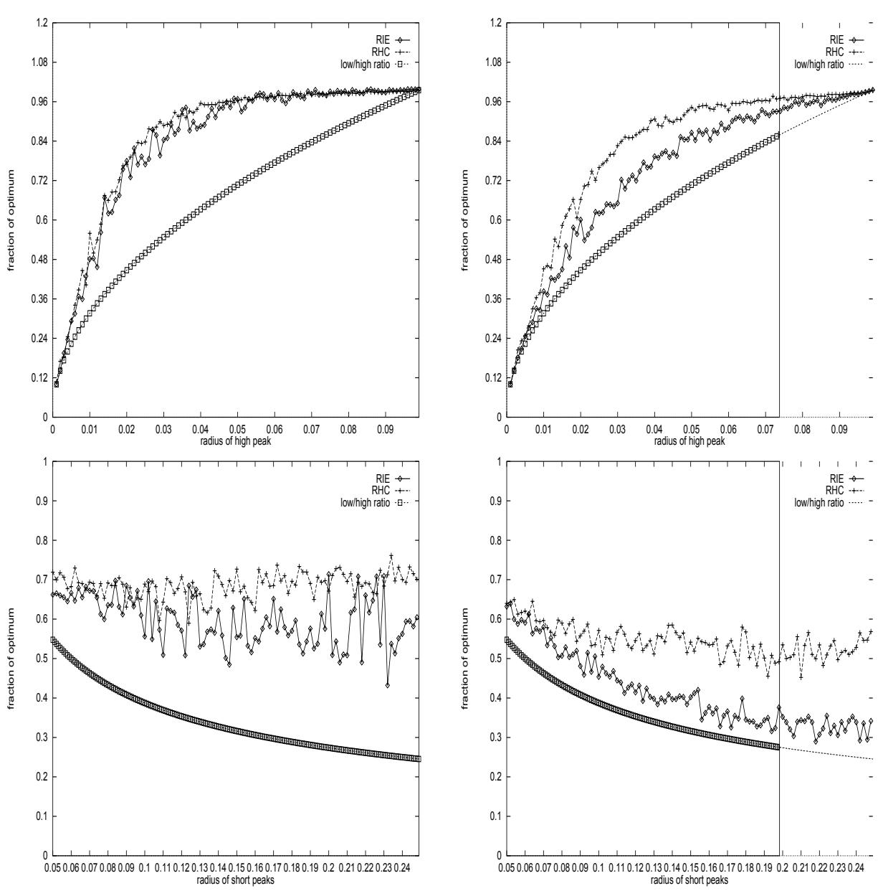  
Figure 5.12: $R _ { I E }$ compared against $R _ { H C }$ on the interpolation (left) and extrapolation (right) landscapes with the line of peaks at $4 5 ^ { o }$ .

The drop in performance (as the radii of the short peaks is increased) is caused by the decrease in the height of the short peaks. Converging to the short peaks (instead of the high peak) with the same frequency will result in a performance drop because the height of the short peaks is decreasing as their radii increase. The degree of this drop is determined by the frequency with which the population converges to a short peak instead of the high peak. Thus both $R _ { H C }$ and $R _ { I E }$ are better at finding the high peak on the interpolation landscape than the extrapolation landscape (as their performance drops more on the extrapolation landscape than on the interpolation landscape).

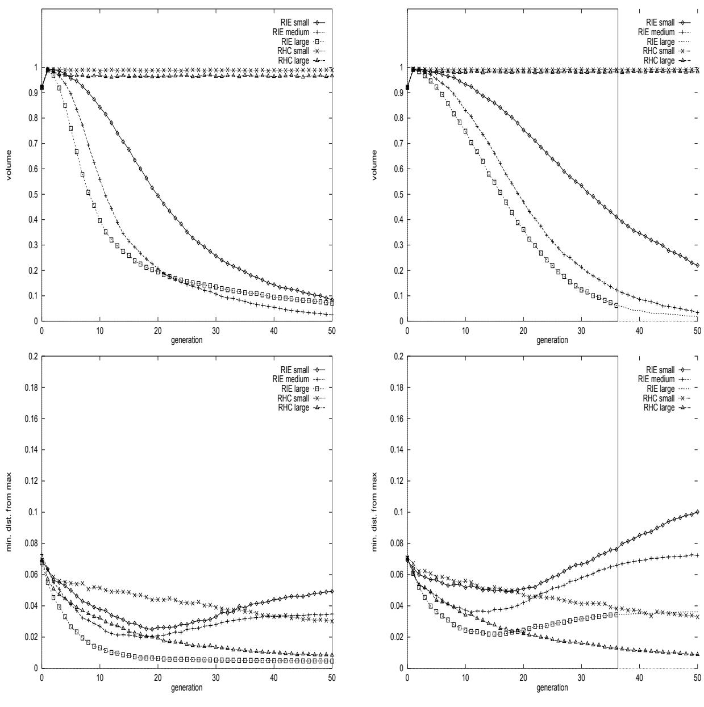  
Figure 5.13: Convergences on the interpolation landscape; graphs on the left have line parallel to an axis, on the right the line is at $4 5 ^ { o }$ .

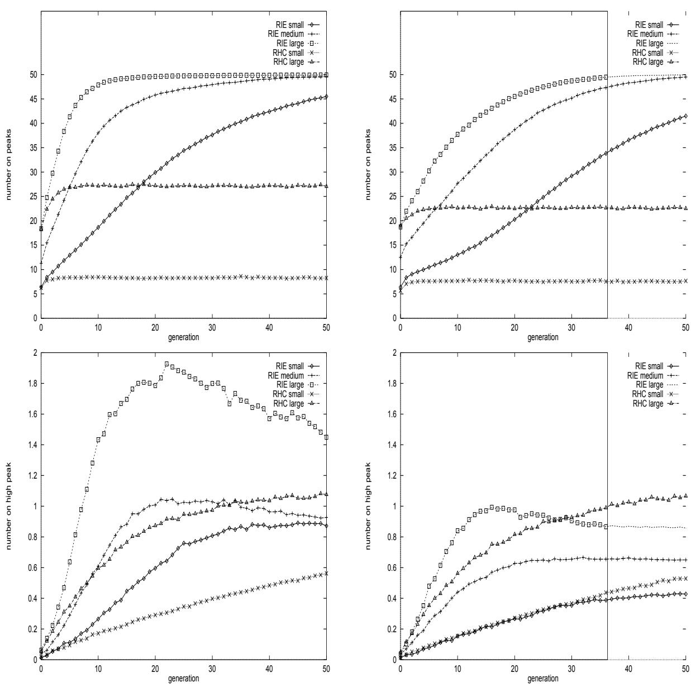  
Figure 5.14: Convergences on the interpolation landscape; graphs on the left have line parallel to an axis, on the right the line is at $4 5 ^ { o }$ .

The plots of convergence measures (figures 5.13, 5.14, 5.15, 5.16, 5.17 and 5.18) show that when the line of peaks is at $4 5 ^ { o }$ the population under $R _ { I E }$ is slower at: concentrating into less volume; concentrating onto peaks; and concentrating along the line than when the line is parallel to an axis.

$R _ { H C }$ is outperforming $R _ { I E }$ when the line of peaks is at $4 5 ^ { o }$ . Yet the only convergence measures for which $R _ { H C }$ is better than $R _ { I E }$ are for minimum distance to the global optimum and number of individuals on the highest peak. Thus $R _ { I E }$ is still finding the short peaks but is not successfully using them to find the high peak.

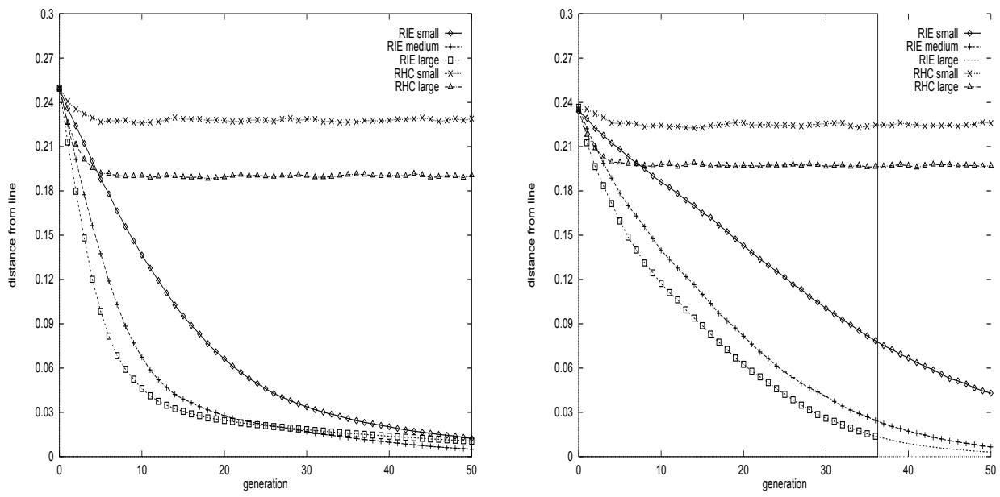  
Figure 5.15: Convergences on the interpolation landscape; graphs on the left have line parallel to an axis, on the right the line is at $4 5 ^ { o }$ .

Let us compare the probability of finding the high peak for $R _ { I E }$ and $R _ { H C }$ . We will use the probability that the offspring of recombination using $R _ { I E } ~ [ R _ { H C } ]$ is generated on the high peak. First some simplifying assumptions. From observing $R _ { I E }$ on the interpolation landscape with GAVIN the population usually converges to two peaks. So assume that under $R _ { I E }$ the parents come from different peaks with probability $\textstyle { \frac { 1 } { 2 } }$ otherwise they are equally likely to be on a given short peak. With $R _ { H C }$ the population does not appear to converge together so assume that the first parent comes from any point in the domain with equal probability - note that $R _ { H C }$ generates the second parent at random with a uniform distribution across the domain. Finally, we assume that instead of a circle, the high peak is a square of width $w$ . This last assumption allows us to calculate the probability for each gene independently.

First the analysis for $R _ { I E }$ .

If we label the short peaks A, B, C and D (from left to right as in figure 5.19), then the probabilities for the different peak combinations are: $P ( A B ) = 1 / 6$ $P ( A C ) = 1 / 6$ , $P ( A D ) = 1 / 6 , P ( B A ) = 1 / 6 , P ( B C ) = 1 / 6$ ,and $P ( B D ) = 1 / 6$ . Since the probability of the offspring being generated on the high peak is the same for (AB) and (BA) as well as for (AC) and (BD) we combine these cases to get: $P ( A B ) = 2 / 6 , P ( A C ) = 2 / 6 , P ( A D ) = 1 / 6$ and $P ( B C ) = 1 / 6$ .

The probabilty that the spring will be in the desid range is equal o $\frac { g o a l ~ r a n g e } { p o s s i b l e ~ r a n g e }$

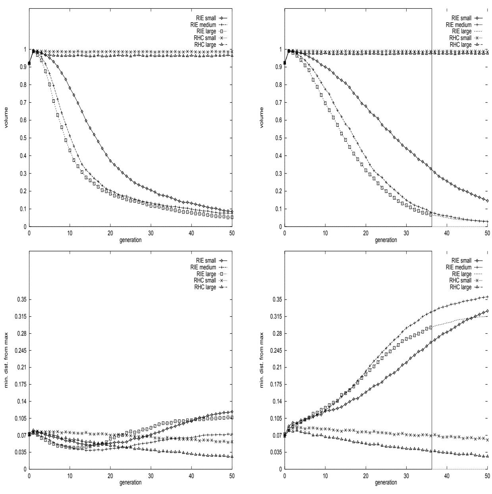  
Figure 5.16: Convergences on the extrapolation landscape; graphs on the left have line parallel to an axis, on the right the line is at $4 5 ^ { o }$ .

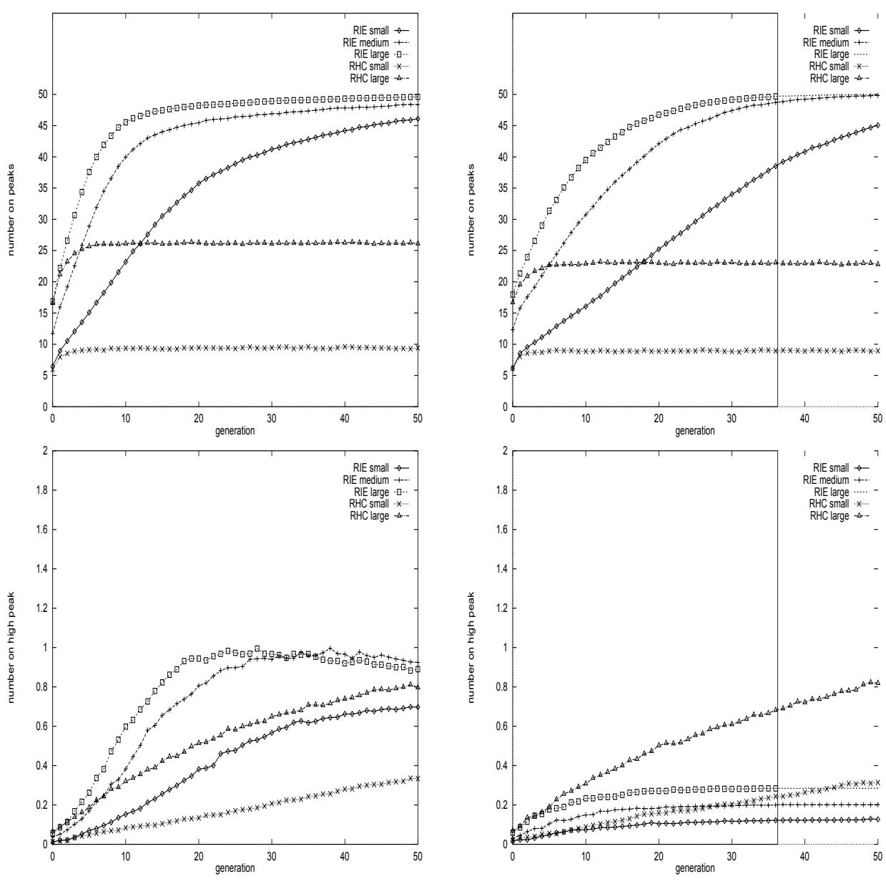  
Figure 5.17: Convergences on the extrapolation landscape; graphs on the left have line parallel to an axis, on the right the line is at $4 5 ^ { o }$ .

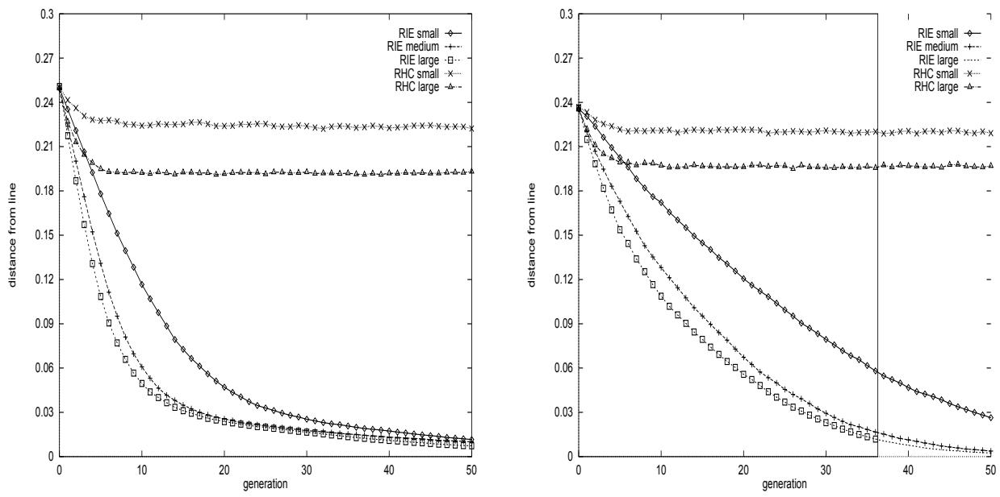  
Figure 5.18: Convergences on the extrapolation landscape; graphs on the left have line parallel to an axis, on the right the line is at $4 5 ^ { o }$ .

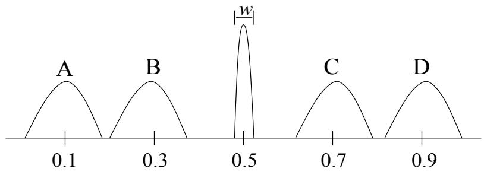  
Figure 5.19: Peak labels for computing probabilities.

For each case this is:

P(AB) The average distance between peak A and B for a gene is 0.2 giving 0.4 for the range of the offspring. This case differs from the others in two ways. The first is that only one of the offspring (the one centered on peak B) can be in the desired range - as the high peak is reached by extrapolating, extrapolating beyond peak A can never reach the high peak - thus its probability is reduced by $\begin{array} { l } { { \frac { 1 } { 2 } } } \end{array}$ . The second is only half the desired range, on average, is in range for extrapolating beyond B ( $0 . 2 + 0 . 3 = 0 . 5$ thus only half of the high peak can be reached). The resulting probability of an offspring getting one gene corret is: ${ \frac { 1 } { 2 } } \left( \frac { w / 2 } { 0 . 4 } \right)$ .

P(AC) In this case the high peak is reached by interpolating so both offspring can reach it.

The average distance between A and C is 0.6 giving 1.2 for the range of the offspring.   
The proabily ogettng ne e cor : $\textstyle { \frac { w } { 1 . 2 } }$ .

P(AD) Again the high peak is reached by interpolating. The average distance between A and Ds. $\frac { w } { 1 . 6 }$ .

P(BC) In our last case the high peak is reached by interpolating. The average distance between B and Cis 0.3, thus the probability r getting one gene correct is:.

The probability of success for each gene is independent, so the probability for success when there are $d$ genes is:

$$
P ( s u c c e s s ) = \frac { 1 } { 2 } \left( \frac { 2 } { 6 } P ( A B ) ^ { d } + \frac { 2 } { 6 } P ( A C ) ^ { d } + \frac { 1 } { 6 } P ( A D ) ^ { d } + \frac { 1 } { 6 } P ( B C ) ^ { d } \right)
$$

$$
P ( s u c c e s s ) = \frac { 1 } { 6 } \times \frac { 1 } { 2 } \left( \frac { \frac { w } { 2 } } { 0 . 4 } \right) ^ { d } + \frac { 1 } { 6 } \left( \frac { w } { 1 . 2 } \right) ^ { d } + \frac { 1 } { 1 2 } \left( \frac { w } { 1 . 6 } \right) ^ { d } + \frac { 1 } { 1 2 } \left( \frac { w } { 0 . 6 } \right) ^ { d }
$$

Some factors not taken into account in equation 5.3 that reduce the probability for $R _ { I E }$ are the population must spend some time converging to the peaks and sometimes the population will converge to only one peak. Another factor not taken into account is that the euclidean distance between the center of the peaks is kept constant for all angles of the line. Thus the difference between peak centers on each coordinate varies with the angle. With the line at an angle of $4 5 ^ { o }$ the distances should be reduced by $c o s ( 4 5 ^ { o } )$ so equation 5.3 should be multiplied by $0 . 7 1 ^ { d }$ .

Now the analysis for $R _ { H C }$ .

As we assume that the population is not converging under $R _ { H C }$ , then both parents are equally likely to be from any point in the domain. An approximation of the probability P $\frac { a r e a ~ o f ~ h i g h ~ p e a k } { t o t a l ~ a r e a }$ which is $\begin{array} { r } { \left( \frac { w } { 1 . 0 } \right) ^ { d } \ = \ w ^ { d } } \end{array}$ .

There are two factors not taken into account in this approximation for $R _ { H C }$ . The first is that the population does tend to converge a little onto the peaks, but this should not affect the probability values significantly. The second factor is that with $R _ { H C }$ extrapolation can generate values outside the domain. This changes the effective size of the domain to a value greater than 1.0. Extrapolation happens half the time (on average) so P(success, $R _ { H C } \backslash$ should be multiplied by a value between $0 . 5 ^ { d }$ and $1 . 0 ^ { d }$ (which should offset the $0 . 7 1 ^ { d }$ multiplier for $R _ { I E }$ to some degree).

The resulting probabilities for different values of $d$ are in table 5.7. Our analysis shows that $R _ { I E }$ is mistuned for the rotated landscapes on two dimensions-hence its poor per

<table><tr><td rowspan=1 colspan=1>d</td><td rowspan=1 colspan=1>probability for RIE</td><td rowspan=1 colspan=1>probability for RHC</td></tr><tr><td rowspan=1 colspan=1>1</td><td rowspan=1 colspan=1>0.36 w</td><td rowspan=1 colspan=1>W</td></tr><tr><td rowspan=1 colspan=1>2</td><td rowspan=1 colspan=1>0.45 w2</td><td rowspan=1 colspan=1>w2</td></tr><tr><td rowspan=1 colspan=1>3</td><td rowspan=1 colspan=1>0.62 w3</td><td rowspan=1 colspan=1>w3</td></tr><tr><td rowspan=1 colspan=1>4</td><td rowspan=1 colspan=1>0.90 w4</td><td rowspan=1 colspan=1>w4</td></tr><tr><td rowspan=1 colspan=1>5</td><td rowspan=1 colspan=1>1.37 w5</td><td rowspan=1 colspan=1>w5</td></tr><tr><td rowspan=1 colspan=1>6</td><td rowspan=1 colspan=1>2.14 w6</td><td rowspan=1 colspan=1>w6</td></tr><tr><td rowspan=1 colspan=1>7</td><td rowspan=1 colspan=1>3.40 w7</td><td rowspan=1 colspan=1>w7</td></tr><tr><td rowspan=1 colspan=1>8</td><td rowspan=1 colspan=1>5.48 w8</td><td rowspan=1 colspan=1>w8</td></tr><tr><td rowspan=1 colspan=1>9</td><td rowspan=1 colspan=1>8.91 w9</td><td rowspan=1 colspan=1>w9</td></tr><tr><td rowspan=1 colspan=1>10</td><td rowspan=1 colspan=1>14.57 w10</td><td rowspan=1 colspan=1>w10</td></tr></table>

Table 5.7: Probability of finding the high peak on the interpolation landscape on $n$ genes.

formance. This table also shows that as the number of dimensions increases the relative performance of $R _ { I E }$ to $R _ { H C }$ should increase.

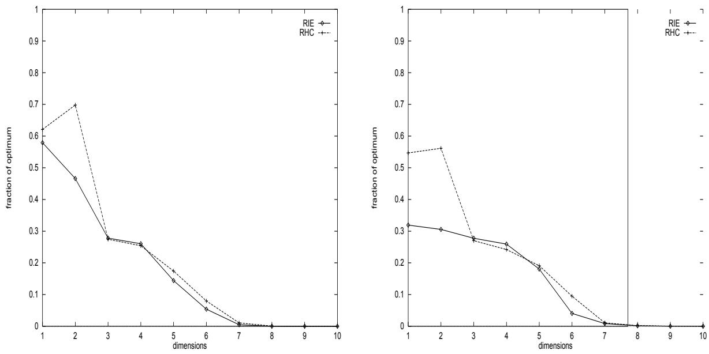  
Figure 5.20: $R _ { I E }$ compared against $R _ { H C }$ on the interpolation (left) and extrapolation (right landscapes with the line at $4 5 ^ { o }$ .

Figure 5.20 contains performance graphs showing the results when the number of genes is varied from 1 to 10. The angle of the line of peaks is $4 5 ^ { o }$ , the radius of the high peak is 0.015 and the radii of the short peaks are 0.2.

Contrary to what our model predicts $R _ { I E }$ 's performance does not pass $R _ { H C }$ 's - although $R _ { I E }$ does match $R _ { H C }$ 's performance for 3 or more genes. The quick drop in performance was unexpected  after six genes neither operator appears to be finding any peak. Possibly the drop in performance is because the population cannot find the peaks. As the number of genes is increased the ratio of the volume of peaks to the volume of domain decreases exponentially. This ratio can be kept constant by increasing the radii of the peaks as the number of genes increase. Equation 5.4 gives the volume of a hypersphere on $n$ dimensions. Using this we will adjust the radii of the peaks as the number of dimensions increased. Note that this adjustment does not take into consideration the parts of the spheres falling outside the domain and the overlap between adjacent spheres as their radii increase. Regardless, as we increase the radii of the peaks we expect that $R _ { I E }$ will catch up and pass $R _ { H C }$ but still expect the performance of both to drop as the number of genes increases.

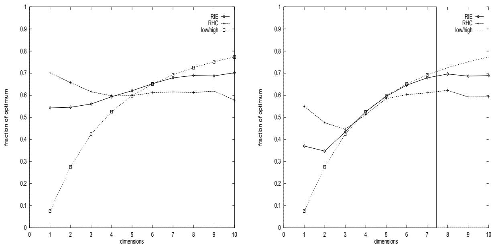  
Figure 5.21: $R _ { I E }$ compared against $R _ { H C }$ on the interpolation (left) and extrapolation (right) landscapes with peak radii adjusted with the number of dimensions and the line at $4 5 ^ { o }$ .

$$
V _ { D } ( r ) = \left\{ \begin{array} { l l } { { \frac { 1 } { \left( \frac { D } { 2 } \right) ! } \pi ^ { \frac { D } { 2 } } r ^ { D } , } } & { { D \equiv 0 \mathrm { ~ m o d ~ 2 } } } \\ { { } } & { { } } \\ { { \frac { 2 ^ { \frac { D + 1 } { 2 } } } { 1 \cdot 3 \cdot 5 \ldots D } \pi ^ { \frac { D - 1 } { 2 } } r ^ { D } , } } & { { D \equiv 1 \mathrm { ~ m o d ~ 2 } } } \end{array} \right.
$$

The graphs in figure 5.21 plot the performance of $R _ { I E }$ and $R _ { H C }$ on the interpolation and extrapolation landscapes where the number of dimensions is varied. Volume for the short peaks are fixed at 0.12, and the volume of the high peak is set to 0.0007 (which in two dimensions result in a radii of approximately 0.2 and 0.015 respectively) for search on one gene, and increased to keep the ratio of the peaks' volume constant with that of the total domain.

This time $R _ { I E }$ does catch up and pass $R _ { H C }$ as predicted by our model. Comparing the performance of $R _ { I E }$ and $R _ { H C }$ to the low/high ratio we see that they decrease relative to this curve. In fact after the number of genes is increased beyond 6, $R _ { I E }$ 's average performance is below this line. Thus $R _ { I E }$ is just climbing to the top of a short peak and not finding the high peak. It is possible that $R _ { I E }$ is taking so long in converging to the peaks that the population is only converging to one peak. As a result $R _ { I E }$ is not able to interpolate [extrapolate] with parents from two different peaks to find the high peak. Another explanation is that a successful coordination of interpolating [extrapolating] on a large number of genes is so unlikely that the population is not finding the high peak. By incorporating the knowledge that genes should be changed together we hope to create an operator that searches this landscape better.

In this set of experiments we wanted to see how well $R _ { I E }$ performs on the interpolation and extrapolation landscapes when the line of peaks is rotated. We found that the performance of $R _ { I E }$ on the interpolation and extrapolation landscapes decreases as the line of peaks is rotated. We also found that $R _ { H C }$ outperforms $R _ { I E }$ . Our simplified model showed that $R _ { I E }$ is mistuned to this landscape, thereby explaining its poor performance. Our model also predicted that eventually (after increasing the number of genes) $R _ { I E }$ 's performance will pass $R _ { H C }$ . Empirical testing agreed with this prediction  but only after increasing the radii of the peaks to keep the ratio of their volume constant with that of the domain. Table 5.8 summarizes the findings for this set of experiments.

Table 5.8: Summary of results when the line of peaks is rotated.   

<table><tr><td>observation RIE performs almost as well as RHC on</td><td>conclusion Random search is better than a mistuned</td></tr><tr><td>the interpolation landscape with the line of peaks at 45°.</td><td>operator.</td></tr><tr><td>RIE performs noticeably worse than RHC Random search is better than a mistuned on the extrapolation landscape with the operator. line of peaks at 45°.</td><td></td></tr><tr><td>When the number of dimensions is in- RIE is tuned to hill-climbing. creased RIE eventually outperforms RHC but does not pass the low/high ratio.</td><td></td></tr></table>

# 5.3.2 Rotational Unbiased Recombination

In section 5.3.1 we found that $R _ { I E }$ 's performance dropped when the line of peaks was set to $4 5 ^ { o }$ . From figure 5.22 we see that the performance of $R _ { I E }$ is dependent on the angle of the line of peaks - it gets its best performance when the angle is $0 ^ { o }$ (and $9 0 °$ ) and its worst performance when the angle is $4 5 ^ { o }$ (and $1 3 5 ^ { o }$ ). In this section we show that $R _ { I E }$ can be modified so that the resulting recombination operator, $R _ { R U }$ , is directionally tuned to the landscape regardless of the angle of the line of peaks.

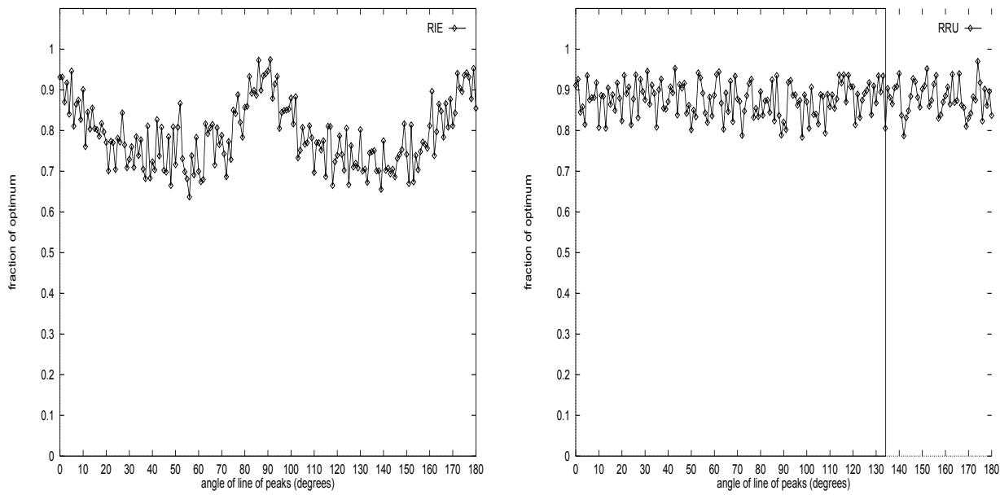  
Figure 5.22: $R _ { I E }$ (left graph) and $R _ { R U }$ (right graph) on the interpolation landscape where the line of peaks is rotated.

Unlike $R _ { I E }$ , $R _ { R U }$ assumes there is a linkage between the genes. $R _ { R U }$ is capable of moving along ridges that are at any angle - but still straight lines. As a result we expect it to perform equally well regardless of the angle of the line. $R _ { R U }$ interpolates and extrapolates similarly to $R _ { I E }$ so we expect it to perform as well as $R _ { I E }$ . Figure 5.22 shows that $R _ { R U }$ 's performance remains constant as the line of peaks is rotated.

First we compare $R _ { R U }$ against $R _ { H C }$ to show that the directionally tuned operator searches better than the untuned operator. To assist in predicting the results we give a model for success under recombination for $R _ { R U }$ . $R _ { R U }$ converges onto the peaks similarly to $R _ { I E }$ so we use the same cases (and probabilities for each case) as with $R _ { I E }$ . $P ( A B ) = 2 / 6$ , $P ( A C ) = 2 / 6$ , $P ( A D ) = 1 / 6$ , and $P ( B C ) = 1 / 6$ .

Unlike $R _ { I E } , R _ { R U }$ generates its offspring along the line through the parents. Regardless of the number of dimensions of the domain the euclidean distance between the peaks is kept constant. As a result the probability of a successful recombination with $R _ { R U }$ is independent of the number of genes. Here are the probabilities for the four cases:

P(AB) Only one of the offspring has the potential to be on the high peak giving the probability of success as $\frac { 1 } { 2 } \frac { g o a l ~ r a n g e } { t o t a l ~ r a n g e }$ . On average only half of the high peak is in range so the success range is $w / 2$ giving the probability for success for the AB case: $\frac { w / 2 } { 0 . 8 }$ .

P(AC) The success range is $w$ $\frac { w } { 1 . 2 }$ .   
P(AD) The success range is $w$ T: $\frac { w } { 1 . 6 }$ .   
P(BC) The success range is $w$ $\frac { w } { 0 . 6 }$ .

The weighted sum of these cases gives $P ( s u c c e s s ) \approx 0 . 4 3 4 w$ . Table 5.9 contains the results for $R _ { R U }$ and $R _ { H C }$ when $w$ is increased with the number of dimensions using equation 5.4. Note that the probability formula assumes that $w$ is less than the total range. From the table we can see that when there are more than 7 genes the desired range becomes greater than the total range for some cases. Thus after 7 genes our model is inaccurate. Also, only part of the high peak is higher than the short peaks. The rates of the fraction of the area that is higher to the total area of the high peak decreases exponentially as the number of genes increases. So the actual value for $P ( s u c c e s s )$ is not necessarily a good measure for the expected performance of the recombination operators.

<table><tr><td rowspan=1 colspan=1>d</td><td rowspan=1 colspan=1>W</td><td rowspan=1 colspan=1>probability forrRRU</td><td rowspan=1 colspan=1>probability for RHC</td></tr><tr><td rowspan=1 colspan=1>1</td><td rowspan=1 colspan=1>0.00070</td><td rowspan=1 colspan=1>0.00061</td><td rowspan=1 colspan=1>0.00070</td></tr><tr><td rowspan=1 colspan=1>2</td><td rowspan=1 colspan=1>0.030</td><td rowspan=1 colspan=1>0.026</td><td rowspan=1 colspan=1>0.00089</td></tr><tr><td rowspan=1 colspan=1>3</td><td rowspan=1 colspan=1>0.11</td><td rowspan=1 colspan=1>0.096</td><td rowspan=1 colspan=1>0.0013</td></tr><tr><td rowspan=1 colspan=1>4</td><td rowspan=1 colspan=1>0.22</td><td rowspan=1 colspan=1>0.19</td><td rowspan=1 colspan=1>0.0023</td></tr><tr><td rowspan=1 colspan=1>5</td><td rowspan=1 colspan=1>0.34</td><td rowspan=1 colspan=1>0.29</td><td rowspan=1 colspan=1>0.0042</td></tr><tr><td rowspan=1 colspan=1>6</td><td rowspan=1 colspan=1>0.45</td><td rowspan=1 colspan=1>0.39</td><td rowspan=1 colspan=1>0.0087</td></tr><tr><td rowspan=1 colspan=1>7</td><td rowspan=1 colspan=1>0.57</td><td rowspan=1 colspan=1>0.49</td><td rowspan=1 colspan=1>0.019</td></tr><tr><td rowspan=1 colspan=1>8</td><td rowspan=1 colspan=1>0.68</td><td rowspan=1 colspan=1>0.59</td><td rowspan=1 colspan=1>0.044</td></tr><tr><td rowspan=1 colspan=1>9</td><td rowspan=1 colspan=1>0.78</td><td rowspan=1 colspan=1>0.68</td><td rowspan=1 colspan=1>0.11</td></tr><tr><td rowspan=1 colspan=1>10</td><td rowspan=1 colspan=1>0.88</td><td rowspan=1 colspan=1>0.76</td><td rowspan=1 colspan=1>0.28</td></tr></table>

Table 5.9: Probability of finding the high peak on the interpolation landscape on $d$ genes.

Based on the values presented in table 5.9 we expect that $R _ { R U }$ will outperform $R _ { H C }$ when there are 2 through 10 genes and $R _ { H C }$ will outperform $R _ { R U }$ when there is only 1 gene. The difference in performances should shrink as the dimensions increase.

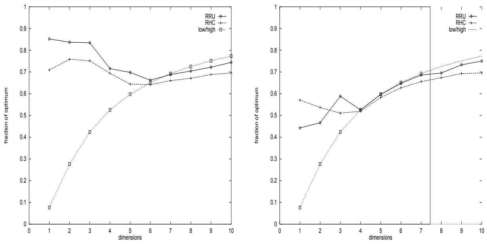  
Figure 5.23: $R _ { R U }$ compared against $R _ { H C }$ on the interpolation (left) and extrapolation $( \mathrm { r i g h t } )$ landscapes with peak radii adjusted with the number of dimensions and the line at $4 5 ^ { o }$ .

Figure 5.23 contains performance graphs for $R _ { R U }$ and $R _ { H C }$ on the interpolation and extrapolation landscapes with the angle of the line of peaks at $4 5 ^ { o }$ . The volume of the high peak is set to 0.0007 that of the domain and that of the short peaks is set to 0.12 of the domain (which gives radii for the peaks in two dimensions of approximately 0.015 and 0.2 respectively).

From this figure we see that $R _ { R U }$ outperforms $R _ { H C }$ on the interpolation landscape for all gene values. Contrary to our simplified probability model $R _ { H C }$ does not outperform $R _ { R U }$ when there is only one gene. Our model only takes into account the probability of finding the high peak. We expect that $R _ { R U }$ is better tuned to climbing a peak than is $R _ { H C }$ , which would explain why $R _ { R U }$ outperforms $R _ { H C }$ with one gene. On the extrapolation landscape $R _ { R U }$ at first performs worse than $R _ { H C }$ then catches and passes it. From these experiments we conclude that a directionally tuned operator searches better than an untuned operator. When $R _ { H C }$ outperformed $R _ { I E }$ we gave a mathematical argument showing that $R _ { I E }$ is mistuned to the landscape. Thus it is not always intuitive as to how well tuned an operator is to a given landscape.

For completeness we also include a comparison of $R _ { R U }$ against $R _ { H C }$ on the random-peaks landscape (figure 5.24). In this graph we see that $R _ { H C }$ outperforms $R _ { R U }$ until the landscape has 7 dimensions then $R _ { R U }$ passes it. By the time $R _ { R U }$ passes $R _ { H C }$ both are performing under the low/high ratio line. $R _ { R U }$ is not directionally tuned to the random-peaks landscape so we expect it to perform worse than $R _ { H C }$ . But eventually $R _ { R U }$ 's performance passes $R _ { H C }$ 's. At the point where $R _ { R U }$ passes $R _ { H C }$ neither is better than the low/high ratio. Thus $R _ { R U }$ is climbing to a higher point on a short peak than is $R _ { H C }$ , which shows that $R _ { R U }$ is better at climbing peaks than $R _ { H C }$ .

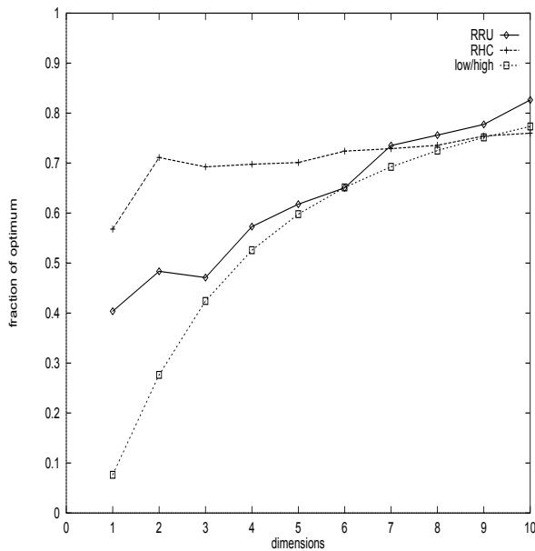  
Figure 5.24: RRU compared against $R _ { H C }$ on the random-peaks landscape with peak radii adjusted with the number of dimensions.

Now we compare the performance of $R _ { R U }$ to that of $R _ { I E }$ . Figure 5.22 contains performance graphs of the EA using $R _ { I E }$ (left) and $R _ { R U }$ (right) as the line of peaks is rotated. The radius of the high peak is 0.02 and the radii of the short peaks are 0.1.

For the most part $R _ { R U }$ does achieve better performance than $R _ { I E }$ , but not when the line is parallel to an axis ( $[ 0 ^ { o } , 9 0 ^ { o }$ and $1 8 0 ^ { o }$ ). When the line is parallel to an axis we would expect $R _ { I E }$ and $R _ { R U }$ to converge onto the short peaks and then onto the high peak at the same rate. Thus $R _ { I E }$ 's better performance at this angle setting probably comes as a result of $R _ { I E }$ being a better hill-climber than $R _ { R U }$ . As a tradeoff in gaining the ability to follow ridges that are at any angle $R _ { R U }$ may be losing some ability to climb hills. Recall $R _ { R U }$ 's problem on the royal road landscape (an example discussed in chapter 4) where it was found to be so restrictive it had problems moving along the ridge. Perhaps allowing individuals to fall some small amount off the line through the parents would result in a better hill-climbing and ridge-following operator than $R _ { R U }$ .

Now we will examine the convergence graphs of $R _ { I E }$ and $R _ { R U }$ . The convergence graphs for $R _ { I E }$ have already been presented (in section 5.2.1 in comparison with $R _ { H C }$ ) so we will state our expectations for $R _ { R U }$ relative to $R _ { I E }$ . When the angle of the line of peaks is parallel to an axis we expect that $R _ { R U }$ will converge as well as $R _ { I E }$ . If more of the population converges onto the peaks and onto the high peak under $R _ { R U }$ than under $R _ { I E }$ then (since $R _ { R U }$ performs a little worse than $R _ { I E }$ ) this suggests that $R _ { R U }$ is not as good a hill-climber as $R _ { I E }$ . Alternatively if $R _ { R U }$ does not converge as well as $R _ { I E }$ then this suggests that $R _ { I E }$ is better tuned to the landscapes when the line is parallel to an axis. When the angle of the line is at $4 5 ^ { o } ~ R _ { R U }$ 's convergence should be better than $R _ { I E }$ 's.

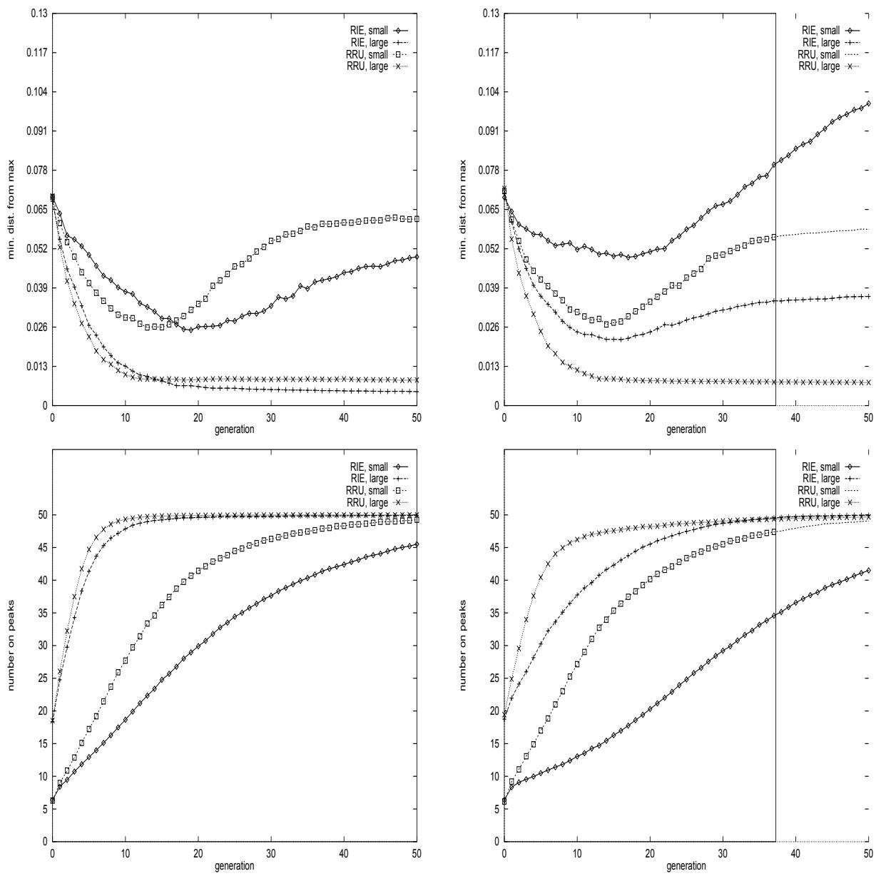  
Figure 5.25: Convergences on interpolation landscape; graphs on the left have the line parallel to an axis, on the right the line is at $4 5 ^ { o }$ .

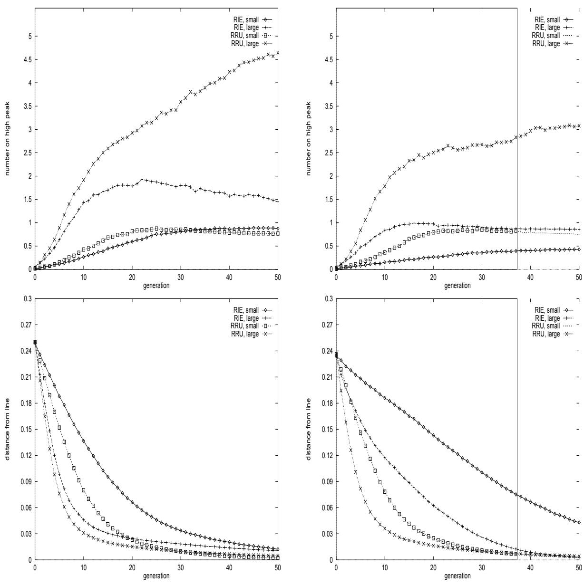  
Figure 5.26: Convergences on interpolation landscape; graphs on the left have the line parallel to an axis, on the right the line is at $4 5 ^ { o }$ .

Figures 5.25 and 5.26 are convergence plots for $R _ { I E }$ and $R _ { R U }$ on the interpolation landscape. For the left graphs the line of peaks is parallel to an axis, on the right graphs the line of peaks is at $4 5 ^ { o }$ . The radii for these plots are 0.01 for the high peak and 0.1 for the short peaks with narrow and 0.02 for the high peak and 0.2 for the short peaks with large. The convergence graph comparing volume is not included. It shows that $R _ { R U }$ converges to a smaller volume faster than $R _ { I E }$ ; but it is a little misleading in that both converge slower when the line is at $4 5 ^ { o }$ . As volume is calculated by $\Pi _ { i } ( m a x _ { i } - m i n _ { i } )$ , a population spread along the line of peaks will have a greater volume when the line's angle is close to $4 5 ^ { o }$ then

when it is parallel to an axis.

As expected $R _ { R U }$ 's convergence is roughly the same for both angles of the line. In comparison to $R _ { I E }$ when the line is at $0 ^ { o }$ , $R _ { R U }$ converges to the line and onto peaks much faster when the radii are small and only a little faster when the radii are large. $R _ { R U }$ also converges to the global optimum faster, but then (around generation 15) gets pulled away to the short peaks faster than $R _ { I E }$ . $R _ { R U }$ is also better at finding the high peak - it puts significantly more individuals on it than $R _ { I E }$ when the radii are large, and is about the same when the radii are small. This supports the belief that $R _ { R U }$ is not as good a hill-climber as $R _ { I E }$ .

In this set of experiments we set out to create an operator that is directionally tuned to the landscape regardless of the line of peaks. We created $R _ { R U }$ whose performance does not vary with the angle of the line of peaks. In comparing $R _ { R U }$ with $R _ { H C }$ we showed that a directionally tuned operator outperforms an untuned operator. $R _ { R U }$ outperforms $R _ { I E }$ except when the line of peaks is near to being parallel to an axis. From this we concluded that $R _ { I E }$ is better at hill-climbing than is $R _ { R U }$ . Table 5.10 summarizes the findings for this set of experiments.

<table><tr><td>observations conclusion</td><td>A directionally tuned operator outper-</td></tr><tr><td>RRU consistently outperforms RHC on the interpolation landscape with the dimen- forms an untuned one. sions varied.</td><td></td></tr><tr><td>random-peaks landscape when the number tuned to the random-peaks landscape it is of dimensions is increased.</td><td>RRU eventually outperforms RHC on the Even though RRU is not directionally tuned to hill-climbing</td></tr><tr><td>When rotating the line of peaks RIE&#x27;s per- ( formance varies but RRu&#x27;s is constant</td><td>Operators can be directionally tuned to linkages between genes.</td></tr><tr><td>With the line of peaks parallel to an axis RIE is better than RRU</td><td>RIE is better tuned to climbing peaks than is RRU</td></tr></table>

Table 5.10: Summary of results for $R _ { R U }$ .

# 5.4 Summary

Both $R _ { I E }$ and $R _ { H C }$ 's performance increased with the increase of road widths on the royal road landscape with $R _ { I E }$ outperforming $R _ { H C }$ . This comes as a result of $R _ { I E }$ converging to the landscape features and taking advantage of them to find the global optimum.

On the non-linear landscapes $R _ { I E }$ searches significantly better on the interpolation and extrapolation landscapes than on the random-peaks landscape. This is because $R _ { I E }$ is directionally tuned to finding the high peak by interpolating or extrapolating from short ones. The performance of $R _ { I E }$ was slightly better on the interpolation than extrapolation landscape because extrapolating on the extrapolation landscape is only half as likely to move in the correct direction as interpolating on the interpolation landscape.

Varying the radii of the peaks affected $R _ { I E }$ 's performance on all three landscapes. Increasing the radius of the high peak improve the performance of $R _ { I E }$ on all three landscapes - the high peak is easier to find. In increasing the radii of the short peaks $R _ { I E }$ 's performance improved then leveled off on the interpolation and extrapolation landscapes. As the radii of the short peaks increases the population converges to them faster so there is more time to find the high peak. After being increased beyond a certain radius the population does not converge any faster to the short peaks thus explaining the leveling off. On the random-peaks landscape $R _ { I E }$ 's performance decreases. As the basin of attraction of the short peaks increases they apply a stronger pull on the population thus decreasing the EA's chances of finding the high peak.

One surprise was that the number of individuals on the high peak started decreasing part way through the search. This is caused by the attraction of the large number of individuals on the short peaks.

Compared against $R _ { H C }$ , $R _ { I E }$ performs better on the interpolation and extrapolation landscape but worse on the random-peaks landscape. $R _ { I E }$ is directionally tuned to these landscapes while $R _ { H C }$ is not. Thus these results show that a directionally tuned operator searches better than an untuned operator. Neither $R _ { I E }$ nor $R _ { H C }$ are directionally tuned to the random-peaks landscape but $R _ { I E }$ makes some landscape assumptions that cause it to be mistuned to this landscape (as verified by our mathematical analysis). On the randompeaks landscape $R _ { H C }$ outperforms $R _ { I E }$ . All these results are consistent with the NFL theorems: better than random search can only be achieved by making correct assumptions about the landscape and in making these assumptions there will be some landscapes for which they are wrong and performance will be worse than random.

Rotating the line of peaks to $4 5 ^ { o }$ $( 1 3 5 ^ { o } , \ldots )$ the performance of $R _ { I E }$ decreased and was eventually outperformed by $R _ { H C }$ . Creating a probability model showed that $R _ { I E }$ was not as well tuned to this instance of the landscape as is $R _ { H C }$ . The model also predicted that $R _ { I E }$ will outperform $R _ { H C }$ if the number of genes is increased. Increasing the number of genes in the landscape verified this prediction  but only after the relative volume of peaks

to domain was maintained.

Adding additional landscape knowledge to $R _ { I E }$ resulted in the creation of $R _ { R U }$ . Unlike $R _ { I E }$ , $R _ { R U }$ 's performance was unaffected by rotating the line of peaks. Compared against $R _ { H C }$ , $R _ { R U }$ consistently outperformed it on the interpolation landscape and eventually passed it on the extrapolation landscape.

# Chapter 6

# Conclusions and Future Work

# 6.1 Conclusions

In this thesis we set out to empirically show that operators with more landscape specific knowledge search better. We found that increasing the directional tuning between the recombination operator and the landscape did result in better search performance. One interesting observation is that an operator that we thought to be well tuned to a landscape performed worse than random search. We later gave a mathematical argument showing that this operator was poorly tuned to the landscape. This shows that it may not be intuitively obvious as to how well a recombination operator is tuned to a given landscape.

Convergence to features in the landscape is dependent on the size of those features (how easy they are to find) and the degree of tuning between the recombination operator and the landscape. In all cases the EA using a directionally tuned recombination operator converged to features of the landscape (ridges, peaks and lines) at a speed related to the size of those features. When the features were large (eg. wide roads or peaks) the population, under a directionally tuned recombination operator, concentrated to them quickly. When the features were small (narrow ridges or peaks) the population did not converge to them as fast. This convergence is also affected by the degree of tuning of the operator $R _ { H C }$ did not converge to features and $R _ { I E }$ converges to features slower when the line is at $4 5 ^ { o }$ then when it is parallel to an axis.

These findings suggest two ways to determine if an operator is poorly tuned to a given landscape. First the operator's performance can be compared against that of random search. Second, the operator's convergence on the given landscape can be compared against its convergence on landscapes for which it is known to be tuned.

Just as peaks with large basins of attraction exert a stronger pull on the population then peaks with small basins of attraction so does a large group of individuals in an area of the landscape exert a strong pull on the rest of the individuals in the population. Recombination pairings result in many pairs of individuals from the large group (producing many offspring in that region of the landscape) and parents from other parts of the landscape also tend to be paired with parents from the large group (with most of these offspring falling on the peak with the larger basin of attraction). Most offspring wil be located in the area containing the large group of individuals or at least they will be located some distance from their parents. If most individuals are created by recombination and if the large group is on a large enough peak eventually it will pull the rest of the population on to it.

One reason that the mutation operator is useful is that it is much better at keeping individuals on their current peaks. Recombination can find peaks, but is not good at maintaining individuals on them. Mutation is good at climbing hills but not at going from one peak to the next. An EA using some combination of mutation and recombination should be better at searching many types of multi-modal functions than an EA using either operator alone.

One reason that parallel evolutionary algorithms perform better on some landscapes than single-population evolutionary algorithms is that an individual (or small group of individuals) is more easily able to move a sub-population made up of a small number of individuals than it would be able to if it was in a single, large population.

# 6.2 Future Work

Some possible directions for future research are:

In this thesis one of the main features of the landscapes is that the peaks lie along a line. Examining recombination operators for landscapes where peaks are on a different geometry (such as a curve, along multiple lines or on hyperplanes) could produce recombination operators useful on other landscapes.   
One hypothesis we had was that $R _ { R U }$ does not hill-climb as well as $R _ { I E }$ From using GAVIN we also found that $R _ { R U }$ could be too restrictive and prevent the population from moving along a ridge. Modifying $R _ { R U }$ so that offspring can fall some short distance off the line (such as in an ellipse along the line) may result in a better hillclimbing and ridge-following operator than $R _ { R U }$ while retaining its ability to follow lines at any angle. This may also improve $R _ { R U }$ 's ability to follow a ridge. With two parents near the top of a ridge, if both are on either side then extrapolating will always produce offspring

that are worse than both parents. If the replacement scheme uses relative fitness of parents and offspring then the population may not move along ridges. Changing the distribution of offspring from a line to an ellipse may reduce this problem.

• We identified three properties by which a recombination operator can be tuned to a real-valued fitness landscape (distance, directionality, and distributional bias). Of these we investigated directional tuning. Examining tuning for distance and distributional bias may lead to other interesting findings for the development of recombination operators for real-valued encodings.

Another area for future work is the combined use of mutation and recombination. Our results suggest that using mutation along with recombination may work better than either alone on some types of landscapes. If recombination's role is to find new peaks then mutation's role may be to climb peaks. This suggests that multiple generations of mutation hill-climbing should be performed before individuals undergo recombination.

•Our initial motivation in this research was in PEAs and recombination between locals and immigrants. One conclusion that we came to was that a large number of individuals in an area of the landscape are hard to move. From this we hypothesized that a PEA with several small sub-populations might search some landscapes better because an individual finding a higher local optima would more easily be able to move the rest of the subpopulation.

# Bibliography

[1] D. H. Ackley. A Connectionist Machine for Genetic Hillclimbing. Kluwer Academic Publishers, Boston, MA, 1987.

2] Thomas Bäck. Evolutionary Algorithms in Theory and Practice. Oxford University Press, New York, 1996.

[3] Thomas Bäck, Frank Hoffmeister, and Hans-Paul Schwefel. A survey of evolution strategies. In Richard K. Belew; Lashon B. Booker, editor, Proc. of the Fourth Int. Conf. on Genetic Algorithms, pages 2-9, San Mateo, CA, 1991. Morgan Kaufmann.

[4] J. E. Baker. Adaptive selection methods for genetic algorithms. In John J. Grefenstette, editor, Genetic Algorithms and their Applications: Proceedings of the First International Conference on Genetic Algorithms, pages 101-111, 1985.

[5] Lashon B. Booker. Recombination distributions for genetic algorithms. In L. D. Whitley, editor, Foundations of Genetic Algorithms 2, pages 29-44. Morgan Kaufmann, 1993.

6] A. Brindle. Genetic Algorithms for Function Optimization. Doctoral Dissertation, University of Alberta, Edmonton, 1981.

[7] D. J. Cavicchio. Adaptive Search using simulated evolution. Ph.D. Thesis, University of Michigan, Ann Arbor, 1970.

[8] Joe Culberson. Genetic invariance: A new paradigm for genetic algorithm design. (Technical Report TR 92-02), University of Alberta Department of Computing Science, 1992.

[9] L. Davis. Hybridization and numerical representation. In L. Davis, editor, The Handbook of Genetic Algorithms, pages 61-71, New York, 1991. Van Nostrand Reinhold.

[10] K. A. DeJong. Analysis of the Behavior of a Class of Genetic Adaptive Systems. Dept. Computer and Communication Sciences, University of Michigan, Ann Arbor, 1975.

11] Larry J. Eshelman, Richard A. Caruana, and J. David Schaffer. Biases in the crossover landscape. In J. David Schaffer, editor, Proc. of the Third Int. Conf. on Genetic Algorithms, pages 10-19. Morgan Kaufmann, 1989.

[12] Larry J. Eshelman and J. David Schaffer. Real-coded genetic algorithms and intervalschemata. In L. D. Whitley, editor, Foundations of Genetic Algorithms 2, pages 187- 202. Morgan Kaufmann, 1993.

[13] D. B. Fogel and J. W. Atmar. Comparing genetic operators with gaussian mutations in simulated evolutionary processes using linear systems. In Biological Cybernetics, volume 63, pages 111-114. Springer-Verlag, 1990.

[14] L. J. Fogel, A. J. Owens, and M. J. Walsh. Artificial Intelligence Through Simulated Evolution. Wiley Publishing, New York, 1966.

[15] Stephanie Forrest and Melanie Mitchell. Relative building-block fitness and the building-block hypothesis. In L. D. Whitley, editor, Foundations of Genetic Algorithms 2, pages 109-126. Morgan Kaufmann, 1993.   
[16] David E.Goldberg. Genetic Algorithms in Search, Optimization and Machine Learning. Addison-Wesley, Don Mills, 1989.   
[17] David E. Goldberg and Kalyanmoy Deb. A comparative analysis of selection schemes used in genetic algorithms. In G. J. E. Rawlins, editor, Foundations of Genetic Algorithms, pages 6993. Morgan Kaufmann, 1991.   
[18] David E. Goldberg and Jon Richardson. Genetic algorithms with sharing for multimodal function optimization. In John J. Grefenstette, editor, Genetic Algorithms and their Applications: Proceedings of the Second International Conference on Genetic Algorithms, pages 41-49. Lawrence Erlbaum Associates, 1987.   
[19] David E. Goldberg and Philip Segrest. Finite markov chain analysis of genetic algorithms. In John J. Grefenstette, editor, Genetic Algorithms and their Applications: Proceedings of the Second International Conference on Genetic Algorithms, pages 1-8. Lawrence Erlbaum Associates, 1987.   
[20] David Perry Greene and Stephen F. Smith. A genetic system for learning models of consumer choice. In John J. Grefenstette, editor, Genetic Algorithms and their Applications: Proceedings of the Second International Conference on Genetic Algorithms, pages 217223. Lawrence Erlbaum Associates, 1987.   
[21] J. J. Grefenstette. A User's Guide to GENESIS. (Technical Report CS 83-11), Computer Science Department, Vanderbilt University, Nashville, TN, 1983.   
[22] Joerg Heitkoetter and David Beasley, editors. The Hitch-Hiker's Guide to Evolutionary Computation: A list of Frequently Asked Questions $( F A Q )$ . USENET: comp.ai.genetic, Available. via anonymous FTP from rtfm.mit.edu:/pub/usenet/news.answers/aifaq/genetic/, 1996.   
[23] M. R. Hilliard and G. E. Liepins. A classification-based system for discovering scheduling heuristics. In John J. Grefenstette, editor, Genetic Algorithms and their Applications: Proceedings of the Second International Conference on Genetic Algorithms, pages 231235. Lawrence Erlbaum Associates, 1987.   
[24] J. H. Holland. Adaptation in Natural and Artificial Systems. University of Michigan Press, Ann Arbor, 1975.   
[25] Abdollah Homaifar, Shanguchuan Guan, and Gunar E. Liepins. A new approach on the traveling salesman problem by genetic algorithms. In S. Forrest, editor, Proc. of the Fifth Inter. Conf. on Genetic Algorithms, pages 460-466, San Mateo, CA, 1993. Morgan Kaufmann.   
[26] Wilfried Jakob, Martina Gorges-Schleuter, and Christian Blume. Application of genetic algorithms to task planning and learning. Parallel Problem Solving from Nature, 2, pages 291300, 1992.   
[27] Cezary Z. Janikow and Zbigniew Michalewicz. An experimental comparison of binary and floating point representations in genetic algorithms. In Richard K. Belew; Lashon B. Booker, editor, Proc. of the Fourth Int. Conf. on Genetic Algorithms, pages 3136, San Mateo, CA, 1991. Morgan Kaufmann.   
[28] Terry Jones. Crossover, macromutation, and population-based search. In Larry J. Eshelman, editor, Proc. of the Sixth Inter. Conf. on Genetic Algorithms, pages 7380, San Francisco, CA, 1995. Morgan Kaufmann.   
[29] Terry Jones. Evolutionary Algorithms, Fitness Landscapes and Search. Ph.D. Thesis, University of New Mexico, 1995.   
[30] J. R. Koza. Genetic Programming: on the programming of computers by means of natural selection. MIT Press, Cambridge, Mass., 1992.   
[31] S. W. Mahfoud. Crowding and preselection revisited. In R. Männer and B. Manderick, editors, Parallel Problem Solving from Nature, 2, pages 27-36. North-Holland, 1992.   
[32] M. L. Mauldin. Maintaining diversity in genetic search. In Proceedings of the National Conference on Artificial Intelligence, pages 247250, 1984.   
[33] Zbigniew Michalewicz. Genetic Algorithms $^ +$ Data Structures $=$ Evolution Programs. Springer-Verlag, New York, 1992.   
[34] Heinz Mühlenbein. Evolution in time and space-the parallel genetic algorithm. In G. J. E. Rawlins, editor, Foundations of Genetic Algorithms, pages 316-337. Morgan Kaufmann, 1991.   
[35] Chrisila C. Pettey, Michael R. Leuze, and John J. Grefenstette. A parallel genetic algorithm. In John J. Grefenstette, editor, Genetic Algorithms and their Applications: Proceedings of the Second International Conference on Genetic Algorithms, pages 155- 161. Lawrence Erlbaum Associates, 1987.   
[36] Xiaofeng Qi and Francesco Palmieri. The diversification role of crossover in the genetic algorithms. In S. Forrest, editor, Proc. of the Fifth Inter. Conf. on Genetic Algorithms, pages 132137, San Mateo, CA, 1993. Morgan Kaufmann.   
[37] N. J. Radcliffe. Genetic Neural Networks on MIMD Computers. Ph. D. Dissertation, Dept. of Theoretical Physics, University of Edinburgh, Edinburgh, UK., 1990.   
[38] Nicholas J. Radcliffe. Non-linear genetic representations. In R. Männer and B. Manderick, editors, Parallel Problem Solving from Nature, 2, pages 259-268. North-Holland, 992.   
[39] J. David Schaffer and Larry J. Eshelman. On crossover as an evolutionarily viable strategy. In Richard K. Belew; Lashon B. Booker, editor, Proc. of the Fourth Int. Conf. on Genetic Algorithms, pages 61-68, San Mateo, CA, 1991. Morgan Kaufmann.   
[40] William M. Spears. Crossover or mutation? In L. D. Whitley, editor, Foundations of Genetic Algorithms 2, pages 221237. Morgan Kaufmann, 1993.   
[41] William M. Spears and Kenneth A. De Jong. On the virtues of parameterized uniform crossover. In Richard K. Belew; Lashon B. Booker, editor, Proc. of the Fourth Int. Conf. on Genetic Algorithms, pages 230-236, San Mateo, CA, 1991. Morgan Kaufmann.   
[42] Gilbert Syswerda. Uniform crossover in genetic algorithms. In J. David Schaffer, editor, Proc. of the Third Int. Conf. on Genetic Algorithms, pages 2-9. Morgan Kaufmann, 1989.   
[43] Gilbert Syswerda. Simulated crossover in genetic algorithms. In L. D. Whitley, editor, Foundations of Genetic Algorithms 2, pages 239-255. Morgan Kaufmann, 1993.   
[44] Gregor von Laszewski, Intelligent structural operators for the k-way graph partitioning problem. In Richard K. Belew; Lashon B. Booker, editor, Proc. of the Fourth Int. Conf. on Genetic Algorithms, pages 45-52, San Mateo, CA, 1991. Morgan Kaufmann.   
[45] Michael D. Vose and Gunar E. Liepins. Schema disruption. In Richard K. Belew; Lashon B. Booker, editor, Proc. of the Fourth Int. Conf. on Genetic Algorithms, pages 237-242, San Mateo, CA, 1991. Morgan Kaufmann.   
[46] D. Whitley and J. Kauth. Genitor: A Different Genetic Algorithm. Technical Report CS 88-101, Colorado State University, 1988.   
[47] Darrell Whitley. The genitor algorithm and selection pressure: Why rank-based allocation of reproductive trials is best. In J. David Schaffer, editor, Proc. of the Third Int. Conf. on Genetic Algorithms, pages 116-121. Morgan Kaufmann, 1989.   
[48] Darrell Whitley, Timothy Starkweather, and D'Ann Fuquay. Scheduling problems and traveling salesmen: The genetic edge recombination operator. In J. David Schaffer, editor, Proc. of the Third Int. Conf. on Genetic Algorithms, pages 133-140. Morgan Kaufmann, 1989.   
[49] David H. Wolpert and William G. Macready. No free lunch theorems for search. ftp://ftp.santafe.edu/pub/wgm/nfl.ps.   
[50] Alden H. Wright. Genetic algorithms for real parameter optimization. In G. J. E. Rawlins, editor, Foundations of Genetic Algorithms, pages 205-218. Morgan Kaufmann, 1991.   
[51] Sewall Wright. The roles of mutation, inbreeding, crossbreeding and selection in evolution. In Donald F. Jones, editor, Proc. 6th Intl. Cong. of Genetics, pages 356-366, Brooklyn, New York, 1932. Brooklyn Botanic Garden.   
[52] Byonng-Tak Zhang and Heinz Mühlenbein. Genetic programming of minimal neural nets using occam's razor. In S. Forrest, editor, Proc. of the Fifth Inter. Conf. on Genetic Algorithms, pages 291-300, San Mateo, CA, 1993. Morgan Kaufmann.

# Appendix A

# Introduction to Evolutionary Algorithms

Evolutionary Algorithms (EAs) are a family of stochastic search algorithms. They include Evolutionary Programming (EP), Evolutionary Strategies (ESs), Genetic Algorithms (GAs), Genetic Programming (GP) and Steady-State EAs. Unlike most other search algorithms, EAs maintain a population of search points. Search consists of starting with some initial population, selecting promising points in the population and from these promising points generating a new population. This cycle proceeds until the search is halted and the best point found is returned.

In single point search strategies there is only information about the landscape at the current point. This can make it difficult for the search algorithm to determine if it is caught on a local optimum, or if it is searching the wrong part of the landscape to find the global optimum. One way to get more global information about the landscape is to maintain a collection of points: a population.

An evolutionary algorithms manipulates its population by selecting the more promising points, called individuals, and from them producing new points in the landscape. These new points are generated by various operators, one of which is the recombination operator. The recombination operator uses two individuals and from them decides on two new points to examine. The new points, offspring, are based on their parents. Search is controlled by the selection of parent individuals to create new offspring individuals, and by the method of which operators are used to generate new individuals from parent individuals.

This appendix is organized as follows. Section 1 is a general description of evolutionary algorithms and basic terminology. Section 2 is a formal description of evolutionary algorithms. This section also contains a detailed description of each part of an EA with the common variations used. Section 3 has a description of each of the main types of evolutionary algorithms: genetic algorithms; evolutionary strategies; steady-state EAs; and multi-deme EAs.

# A.1 The General Evolutionary Algorithm

A typical EA uses a population of sample points to search the domain of a function. EAs have been used with success in function optimization, [10] and [16]; classifier systems, [20] and [23]; learning, [26] and [16]; and in designing neural networks, [52].

This section contains a formal description of EAs, followed by an outline for an implementation of an evolutionary algorithm. The following parts of this section will describe each part of an EA in greater detail.

# A.1.1 Terminology

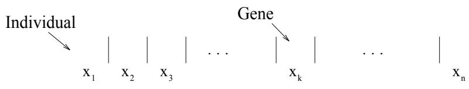  
Figure A.1: An individual.

Some terms commonly used are:

Genes: the most basic elements of evolutionary algorithms. Each gene stores a value to be assigned to a variable.

Individual: (or string) consists of some number of genes, as shown in figure A.1. An individual is analogous to a chromosome in biology. It can be thought of as a solution, or set of assignments to variables.

Population: a collection of individuals maintained by the EA.

Generation: each iteration of generating a new population is called a generation.

# A.1.2 Canonical Evolutionary Algorithm

The canonical implementation of an EA is:

Initialize the population, $P$   
Evaluate all members of $P$   
while not done   
{ Select individuals to be parents, $P ^ { \prime }$ , from $P$ Create new individuals by applying the reproduction operators to $P ^ { \prime }$ Evaluate the new individuals Replace some, or all, of the individuals in $P$ with the new individuals   
}

First a population of individuals is created. This is usually done by assigning random values to all the genes in the population. To decide which individuals in the population will reproduce an evaluation of all individuals occurs. This is done by an evaluation function, or fitness function, similar to those used in standard search algorithms. In addition to evaluating the fitness of an individual, the fitness function may also evaluate other properties of the individual. For example, when using individuals of variable length it may be desirable to have a shorter one over a longer one. In this case the evaluation function would reduce the fitness of longer individuals and increase the fitness of shorter individuals. Once all individuals have been evaluated, parents for the next generation are selected according to the selection method. Then reproduction is performed. Offspring are created by applying the variation operators. After a new population is created the individuals are evaluated and the process is repeated. This continues until the stopping criteria is met.

# A.2 Formal Description of an EA

An evolutionary algorithm is a 9-tuple $( f , D , P , E , I , S , O , R , T )$

• $f$ is a relation that maps a point from the domain, $D$ , to $\mathfrak { R }$ called the fitness function. Each individual in $P$ has a fitness value associated with it. The goal of the search is to find the point in $D$ that has the maximum [minimum] fitness value.   
• $D$ is the domain of the search, typically a subset of $\Re ^ { n }$ .   
• $P$ is a collection of points in the domain called the population. Each element of $P$ is called an individual.   
• $E$ is the encoding of a point in $D$ to an individual in $P$ .   
• $I$ is the method of generating the initial population, $P _ { 0 }$ .   
• $S$ is the selection method. It uses the fitness values of individuals in $P$ to select individuals to be used by $O$ to generate new individuals   
• $O$ is a set of probabilistic variation operators that take individuals from $P$ to generate new points in the domain.   
• $R$ is the replacement method. It determines the fate of new individuals; either they replace an existing individual or they are discarded.   
• $T$ is the stopping criterion for the search.

The population, $P$ , is a collection of points in the domain. Starting from the initial population, $P _ { 0 }$ , the operators in $O$ are applied to existing members of $P$ , called individuals, to generate new members. Individuals are chosen to generate new individuals through the selection procedure $S$ After some number of new individuals are created, some members of the population are removed by the replacement procedure, $R$ . Each iteration of selecting individuals, creating offspring, and replacing individuals is called a generation. This continues until the stopping criteria, $T$ , is met. At this point the EA returns the best individual found.

# A.2.1 Initialization

Little research has been done in the area of creating the initial population. In the vast majority of EA implementations, the initial population is created randomly and is spread uniformly across the domain. Other methods of initialization could artificially insure that the individuals are uniformly spaced across the landscape. One method would be to create some sort of grid and create an individual for each intersection. Another method would be to randomly place an individual in each section.

# A.2.2 Evaluation

As with other search strategies EAs use an evaluation (or fitness) function to assign a fitness value to individuals. This fitness value is used by the selection phase for selecting individuals for parents. The selection phase may use the fitness values as is or it may scale them (in the fitness adjustment part of the selection phase) into a given range. Fitness values are also in the replacement phase by some replacement methods.

# A.2.3 Selection

The selection of individuals is one of the dominant controls on how the EA searches. Depending on how $S$ picks individuals the population will quickly focus on promising individuals and converge quickly, or will maintain a diverse population and explore the domain. The selection phase uses the fitness scores assigned by the evaluation function, scales (or adjusts) these values, and then chooses some subset of $P$ to be used to create a new population.

The selection phase can be broken down into two stages: the fitness adjustment stage and the parent selection stage.

# Fitness Adjustment Methods

In both ESs and the original GAs fitness scores are unprocessed. ESs take the best individuals for parents based on rank so scaling the fitness scores does not affect its selection methods. GAs use fitness proportionate selection which can lead to problems with unadjusted fitness values. One drawback is that the EA will perform differently when the range of $f$ is (100, 101) than when it is in the range (0, 1). Also, in early generations it is quite common to have a few extremely fit individuals in the population. Using fitness proportionate selection, these individuals will dominate the selection step and cause the search to converge on them - possibly prematurely. At the other extreme, late in the run all individuals tend to have similar fitness. With individuals of similar fitness values an EA using fitness proportionate selection has little preference for one over another. As a result the best individuals do not stand out, so the population will converge near an optimum but not necessarily at it.

One method that causes the EA to operate the same when the domain is shifted is linear scaling,

$$
f ^ { \prime } = a f + b
$$

Linear scaling keeps the fitness values of the population within some range so that no one individual dominates the selection step, and to stretch out the fitness values in cases where they are all nearly the same so that search will focus on the better individuals. Linear scaling is not without its own problems. It is possible that a significantly less fit individual can receive a negative fitness score after scaling, which will break selection algorithms which assume non-negative fitness scores. One fix is to set the scaled fitness for the worst individual to 0. Other scaling functions, in addition to this one, have been developed.

Another method of processing fitness scores is ranking. Ranking was proposed by Baker, [4]. In his method individuals are sorted by their fitness values, and then assigned a new value based on their rank.

$$
p _ { i } = \frac { 1 } { N } \left( M A X - \left( M A X - M I N \right) \frac { i - 1 } { N - 1 } \right)
$$

Using a population of size $N$ , where $M A X$ is the maximum fitness value, assigned to individual of rank 1, $M I N$ is the minimum fitness value, assigned to the least fit individual, equation A.2 gives the new fitness value for an individual of rank i. Other ranking functions have been proposed, such as Michalewicz's exponential scaling [33],

$$
p _ { i } = c - ( 1 - c ) ^ { i - 1 } , \ 0 < c \ll 1
$$

where $c$ is some value that determines the selective pressure and $p _ { i }$ is the new fitness of individual of rank $i$ . The main advantage of ranking is it allows for a more direct control of selective pressure than any of the other methods.

In a multi-modal function, the standard GA converges to one peak. If the GA converges too fast, without sufficiently exploring all peaks, then it is possible that this is not the optimal peak in the solution space. Goldberg and Richardson, [18], present a way of assigning fitness values, called sharing functions, such that the GA maintains a population on each peak of a multi-modal function. In this modified GA the fitness for each peak is divided by the number of individuals on that peak and the resulting value is the fitness given to an individual on that peak. Ideally, if ten individuals are on a peak of 10, each individual receives a fitness of 1. The method used by Goldberg and Richardson used a sharing function, $s h$ , which takes a measurement of the distance between two individuals, $i$ and $j$ (using a distance function, $d$ ) and returns 1 if they are within some distance, otherwise returning 0. The new fitness for individual $p$ is,

$$
f ^ { \prime } ( p ) = \frac { f ( p ) } { \sum _ { i = 1 } ^ { N } s h ( d ( i , p ) ) }
$$

# Selection Methods

As with fitness processing methods, there are many ways of choosing which individuals will be used as parents for the next generation.

There are at least three selection methods that use an individual's rank to select parents: q-tournament, $( \mu + \lambda )$ and $( \mu , \lambda )$ methods. In the $q$ -tournament selection method ([17]) the fi rst $q$ individuals are randomly selected from the population. From this pool the individual with the highest fitness is selected as a parent. This process is repeated until all the parents have been selected. From evolutionary strategies come the $( \mu + \lambda )$ and the $( \mu , \lambda )$ method. The $( \mu + \lambda )$ was developed first. In this method the $\mu$ best individuals are chosen from the combination of the parents and offspring. Thus it is possible for an individual to exist for more than one generation. With the $( \mu , \lambda )$ method the $\mu$ individuals to form the next population are selected from the best of the $\lambda$ offspring. These last two methods are also replacement strategies.

The rest of the selection methods are fitness proportionate selection techniques from the GA community.

With fitness proportionate selection the processed fitness scores of the population are used to generate the expected number of times an individual will be selected:

$$
s _ { i } = { \frac { n u m ~ p a r e n t s * f _ { i } } { \sum _ { i = 1 } ^ { p o p ~ s i z e } f _ { i } } }
$$

In equation $\mathrm { A . 5 } ~ f _ { i }$ is the fitness of individual $i$ (after adjustment) and $s _ { i }$ is the expected number of times that the ith individual wil be selected as a parent, called the expected value. Thus the sum of the $s _ { i }$ 's is equal to the number of parents to be selected:

$$
n u m \ p a r e n t s = \sum _ { i = 1 } ^ { N } s _ { i }
$$

A study of fitness proportionate selection was done by Brindle, [6]. Among the selection schemes she examined are:

•Stochastic Sampling or Roulette Wheel: this is one of the simplest ways of selecting parents. The fitness of every individual is placed on a roulette wheel, where the size of an individual's slot is directly proportional to its processed fitness. The wheel is spun and where the ball ends is the individual that is selected. This is done once for each parent and is called stochastic sampling with replacement. A variation on this is to subtract 1 (to a minimum of 0) from the expected value of the individual who is chosen and thus reduce its chances of being picked. This is stochastic sampling without replacement.

• Deterministic Sampling: one problem with stochastic sampling is that in small populations sampling error will result in good individuals not being selected. A way to avoid this is to have an individual selected equal to the integer portion of its expected selection value then order the individuals by the fractional portion of their selection values and choose the remainder of the parents from the best of these.

Remainder Stochastic Sampling: this picks individuals based on the integer portion of their expected selection value as in deterministic sampling, then the remainder of the parents are selected stochastically based on the fractional part of individuals' selection values.

Brindle's experiments did not suggest that one selection is globally superior to any of the others but she did find that roulette wheel sampling was more prone to sampling errors.

# A.2.4 Stopping Criteria

There are two common stopping criteria for EAs. The first method is to have the EA run for a predetermined number of generations. The second method is for the EA to run until the population has converged. Convergence can be a measurement of the diversity of the population - in which case the search halts after the population diversity is below some predetermined value - or failure to find a new best point after $x$ generations.

# A.2.5 Replacement

In addition to controlling the search through selection, the search can also be directed by the replacement method. In the selection method the focus is on choosing good individuals and reducing the scope of the search (converging); the focus of replacement strategies is on maintaining a diverse population.

The standard replacement strategies of EAs are simple. In GAs the entire population is replaced by the newly generated offspring. ESs have two different replacement strategies the replacement part of the $( \mu + \lambda )$ and $( \mu , \lambda )$ methods. The replacement strategy for the $( \mu , \lambda )$ method is the same as that for GAs  replace the entire old population with the newly generated offspring. With the $( \mu + \lambda )$ method the new population is made of the best individuals from the previous population and the newly generated offspring.

Cavicchio, [7], in his doctoral dissertation was interested in finding a way of maintaining several species. This is very similar to maintaining subpopulations of solutions where members within a subpopulation are similar (are on the same peak of a multi-modal function), whereas members of different subpopulations are not very similar (exist on different peaks of a multi-modal function). To achieve his goal he introduced preselection. Preselection is where the offspring replaces its least fit parent. Diversity is maintained as a new individual replaces one that is similar to itself.

An extension of preselection, called crowding was proposed by De Jong in [10]. In crowding a pool of random individuals to be replaced is created. When a new individual is generated, it replaces an individual in this pool that is within a certain distance called the crowding factor. Initially, the crowding factor is large, then it decreases over time. Using crowding, De Jong had some success in using this scheme to maintain populations on different peaks of multi-modal functions.

Another way of maintaining diversity in the gene pool was proposed by Mauldin, [32]. Rather than replacing the most similar individual in the pool, Mauldin proposed a variation where he defines an uniqueness value. A new string can replace any string in the population that is not farther away then the uniqueness value. He calculated uniqueness as the Hamming difference between two bit strings, but other formulas for calculating difference between individuals can be used. He found that the more the role of uniqueness increases in determining which individual to replace, the better his GA performed. From his experiments he found that a GA gets good performance when combining uniqueness with crowding. Mauldin also suggested using mutation on a new individual until it differed from every other string in the population by at least k bits.

Mahfoud, [31], compares preselection and crowding as well as modifications of these two methods, one of which he calls deterministic crowding. In deterministic crowding all members of the population are paired up and produce offspring; this way every member participates in the production of two offspring. An offspring is compared with its most similar parent, and replaces it if it has a higher fitness. This algorithm outperformed preselection and crowding in that it maintained populations on more peaks of a multimodal function. In addition, deterministic crowding is easy to implement and is much more efficient than crowding.

Another replacement method is that used in GIGA ([8]). Unlike the previous replacement methods (which are generational) GIGA uses a steady-state replacement method. In GIGA a pair of parents are selected for reproduction  typically the pair with the closest fitness values  and they create a number of pairs of offspring. The parents are then replaced by the by the best pair of offspring. Typically this pair is the one that contains the individual with best fitness but other definitions of best are possible (such as best average fitness). A selection-replacement policy that introduces only one or two new individuals to the population at a time is a steady-state EA (described later in this chapter).

# A.2.6 Variation

Once individuals have been selected to produce offspring, the offspring must be generated. Evolutionary algorithms have two operators for the creation of new individuals, mutation and recombination. It is through the use of these operators that the domain is searched. The mutation operator is similar to the movement operator in hill-climbing. It takes one parent and creates one offspring near the parent. In genetic algorithms this is most commonly done by fipping a bit, or assigning a random value to a gene in the individual; evolutionary strategies add a small random number, with a Gaussian distribution, to a gene. The second operator, recombination, is the focus of this thesis. It uses two or more parent individuals to create one or more offspring. Recombination is discussed in detail in section 2.2.

# A.3 Specific Evolutionary Algorithms

In this section we will present the most commonly implemented EAs: genetic algorithms, evolutionary strategies, steady-state EAs and multi-deme EAs.

# A.3.1 Genetic Algorithms

Genetic algorithms were developed by John Holland at the University of Michigan, [24]. The main differences between GAs and other evolutionary algorithms are that GAs work on a binary encoding of the problem, selection of individuals is proportional to their fitness, and the main search operator is recombination.

The majority of GAs use the following methods:

E: traditional GAs use a binary encoding but the use of more natural encodings, such as floating-point for real-valued problems, is becoming more popular.   
• $I \colon$ the initial population individuals are created randomly with a uniform distribution of gene values.   
• O: recombination, called crossover in the GA community, is the dominant operator. It is used to create $8 0 - 1 0 0 \%$ of the new individuals, with the most common types being 2-point and uniform crossover. Mutation is strictly a background operator and is applied at a rate of 0.1 to 0.001. The usual rate is near 0.001. Mutation typically consists of flipping a bit in an individual from $0  1$ or $1  0$ . At one time inversion was also included, but now this operator is seldom used.   
• $S$ : fitness proportionate selection is used after some form of scaling or ranking takes place.   
• $R$ : the entire old population is replace by the new one.

# A.3.2 Evolutionary Strategies

Independent of the work of Holland, evolutionary strategies were developed in Germany by Bienert, Rechenberg and Schwefel. ESs always work on real valued representations. The main operator is a gaussian mutation on these values, with recombination being a secondary operator.

There are two types of evolutionary strategies and they are distinguished by their selection method. The original ES used the $( \mu + \lambda )$ selection method. One problem with this method was that individuals could survive for multiple generations. As a result the $( \mu , \lambda )$ method was developed. An ES can be described as a 9-tuple with:

• $E$ : uses a floating-point representation   
• $O$ : mutation is the dominant operator. Each real value is perturbed by a small random number with a gaussian distribution. Recombination is also used, in most cases picking a value at random between that of the first and second parent.   
• $S$ the $\mu$ best individuals in the population are used to create $\delta$ offspring.   
• $R$ : for the $( \mu + \lambda ) { \mathrm { - E S } }$ the next population, $P _ { t + 1 }$ , is chosen from the best individuals of the previous population and the $\delta$ offspring. In the $( \mu , \lambda ) { \mathrm { - E S } }$ the new population is the best individuals from the $\lambda$ offspring.

A survey of evolutionary strategies is given in [3].

# A.3.3 Steady-state EAs

The EAs discussed so far are called generational. They start with an initial population, select some number of parents and then use them to create an entirely new population. Steady-state EAs (SSEAs) are a variation on GAs where a new individual is created and replaces an existing member of the population. One advantage of SSEAs is that the better (more fit) individuals remain in the population for many generations, like an automatic elitism. The use of SSEAs has been popularized by Whitley and Kauth's GENITOR package ([46]) and has been used in several experiments such as [42] and [47].

An EA is a steady-state EA depending on its selection and replacement methods:

: $S$ : two individuals are selected from $P$ stochastically on fitness - possibly after ranking or scaling individuals - and creates one or two offspring.   
• $R$ : these offspring replace the least fit individuals in $P$ .

# A.3.4 Parallel Evolutionary Algorithms

One method of improving an EA's performance is to increase the population size. This way there are more individuals searching in the domain so the effects genetic drift and sampling errors are reduced and the search is less likely to converge prematurely. Increasing the population increases the running time by at least a linear rate. Splitting the population onto several processors and parallelizing it is one way of keeping the running time constant while increasing the population size ([35], [34]). A parallel evolutionary algorithm is called a PEA.

Each sub-population of a PEA is called a deme. A PEA maintains multiple demes and runs each like a simple EA. Selection and replacement takes place in each deme independent of the others. After some number of generations has passed a small number of individuals are passed from one deme to another. As with every other part of an EA, there are different ways of selecting individuals for emmigration and different rates of emmigration can be used.

# Appendix B

# GAVIN Visualization Library

The GAVIN visualization library is a UNIX C library for graphically displaying evolutionary search. The purpose of the library is to display a problem's fitness landscape and show the movement of a population's individuals on it. In addition the visualization library uses an individuals colour to give other information about that individual (such as which subpopulation the individual is a member of).

# B.1 Data Model

There are four data structures used in the GAVIN visualization library. These data structures store information defining the problem's fitness landscape, the locations of individuals in the population, the colour number to assign to each individual and the RGB values for each colour number.

The fitness landscape is stored in a two dimensional array of real values. This array represents a grid on the $x y$ plane with each element in the array storing the height ( $z$ value) of the fitness landscape at a given $( x , y )$ position. The fitness landscape is displayed by drawing the quadrilaterals formed from each neighboring group of four points.

Population information is stored in two data structures. One data structure contains the $x , y$ and $z$ information for each individual (where $x$ and $y$ are the values of an individual's two genes and $z$ is the individual's fitness). The other data structure stores the colour number of each individual. These data structures must be updated each generation.

The fourth data structure contains the RGB values for each colour number. Currently colours are used only to show membership to a given sub-population and are defined by specifying the population topology.

# B.2 GAVIN Interface

GAVIN consists of a set of functions, written in C, that are called by an EA. The library uses the Silicon Graphics $©$ Graphics LibraryTM(GL). These functions are:

int gav_InitializeGL(int x, int y, int color, char \*name)   
int gav_DrawLandscapeArray()   
int gav_make_color_map(int xdim, int ydim)   
int gav_DrawPopulation(double \*pPop, int \*pColor, int numberIndividuals)   
void gav_RotateX(float angle)   
void gav_RotateY(float angle)   
void gav_RotateZ(float angle)   
int gav_InitializeLandscape(double \*pLandscape, int xsize, int ysize)   
int gav_InitializePopLocation(int numIndivids, int numColors)   
int gav_SetPopLocation(double \*pIndividLoc, int \*pColor, int numIndivids)   
void gav_DrawScene()

gav InitializeGL() is called first. This sets the size of the window to be opened and the number of demes in the population. Second, the landscape to use is set with gav_InitializeLandsca This function also sets the grid size for displaying the landscape. Then the colourmap for the demes is set using gav_make_color_map(). GAVIN expects that the demes will exist in some grid and assigns neighbours similar colours. Neighbours along the $x$ dimension differ slightly in hue, while neighbours in they $y$ direction differ in saturation. The final setup function is gav SetPopLocation() to specify where on the landscape each individual is located.

Each generation the EA calls gav_SetPopLocation() to update individuals' positions followed by gav DrawScene() to update the graphics. By putting a suitable delay between generations the user can watch the population evolve.

Other functions provided by GAVIN are the ability to rotate the landscape, using gav_RotateX(), gav_RotateY() and gav_RotateZ(). Additionally just the landscape or the population can be updated with gav_DrawLandscapeArray() and gav DrawPopulation().

# B.3 GAVIN Commands

# B.3.1 int gav_InitializeGL(int x, int y, int color, char \*name)

This function must be called before any other GAVIN functions and must be called before creating the visualization window. This function initializes the GL environment for drawing. RGB mode with double buffering and zbuffering is turned on. The parameters are:

x: the resolution of the $x$ dimension of the landscape   
y: the resolution of the $y$ dimension of the landscape   
color: a boolean value, if non-zero then colours will be used in drawing the landscape and the population, otherwise the landscape will be drawn in a shade of gray on a white background and individuals will be drawn in black.   
•name: a pointer to an array of characters containing the name to call the window

It returns 0 if it failed, or 1 if it succeeded.

# B.3.2 int gav_DrawLandscapeArray(void)

This function draws the landscape in the GAVIN window. It must not be called until after the landscape has been initialized with gav_InitializeLandscape(). It returns 1 if it succeeds, otherwise it returns 0.

# B.3.3 int gav_make_color_map(int xdim, int ydim)

When simulating a parallel GA, or running a multi-deme GA, this function allows for individuals from different demes to be distinguished by colour. The parameters are:

xdim: the integer value of the number of demes in the $x$ dimension.   
ydim: the integer value of the number of demes in the $y$ dimension.

Colours are chosen from the HSV colour map. Hue is varied with xdim and saturation is varied with ydim.

Note: $x d i m \times y d i m$ must be less than the number of colours specified in the call to gav_InitializePopLocation().

# B.3.4 int gav_DrawPopulation(double \*pPop, int \*pColor, int numberIndividuals)

Once the GAVIN environment has been setup, this function is used to draw, or redraw, the population. The parameters are:

pPop: a pointer to an array containing the $x , y$ and $z$ coordinates for each individual to be displayed. The formula to get individual $i$ 's $x , y$ and $z$ coordinates from pPop is: $x _ { i } = p P o p [ i * 3 ]$ , $y _ { i } = p P o p [ i * 3 + 1 ]$ and $z _ { i } = p P o p [ i * 3 + 2 ]$ . •pColor: a pointer to an array specifying which colour to use for which individual. Values must be in the range 1 to color as given in gav_InitializePopLocation().

# B.3.5 Rotation Commands

void gavRotateX(float angle)

• void gavRotateY(float angle)

• void gavRotateZ(float angle)

angle: a floating point value specifying the number of degrees to rotate.

All of these functions rotate the landscape around the corresponding axis by the specified angle.

# B.3.6 int gav_InitializeLandscape(double \*pLandscape, int xsize, int ysize)

This function specifies the landscape which is being searched. As it is assumed that the landscape will be fixed, this function should be called once after calling gav_InitializeGL(). The parameters are:

pLandscape: a pointer to an array of the landscape grid of dimensions pLandscape[xsize] [ysize] [3]. The $x , y$ and $z$ coordinates for the $i$ th and $j$ th entry are: x = pLandscape[][j][0], $y = p L a n d s c a p e [ i ] [ j ] [ 1 ]$ , and $z = p L a n d s c a p e [ i ] [ j ] |$ 2]. •xsize: the integer value containing the $x$ dimension of the landscape grid. ysize: the integer value containing the $y$ dimension of the landscape grid.

# B.3.7 int gav_InitializePopLocation(int numIndivids, int numColors)

Before the locations of individuals can be sent to the GAvIN module, it is necessary to specify the number of individuals in the population and the number of colours to be used in drawing them. The parameters are:

numIndivids: an integer specifying the number of individuals to be drawn. •numColors: an integer specifying the size of the colour index to use for drawing individuals. This value should be at least 1.

# B.3.8 int gav_SetPopLocation(double \*pIndividLoc, int \*pColor)

After the GAVIN environment for individuals has been setup with a call to gav_InitializePopLocation() this function is used to specify the location of the individuals. The parameters are:

• pIndividLoc: a pointer to an array containing the $x , \ y$ and $z$ coordinates of each individual to be drawn. The values for the coordinates of individual $i$ must be located at: $x _ { i } = p I n d i v i d L o c [ i * 3 ]$ , $y _ { i } = p I n d i v i d L o c [ i * 3 + 1 ]$ and $z _ { i } = p I n d i v i d L o c [ i *$ $3 + 2 ]$ . The number of individuals expected is the value given for numIndivids in gav_InitializePopLocation().   
pColor: a pointer to an array of integers. The value at location pColor[i] is the colour to use in drawing that individual.

# B.3.9 void gav_DrawScene()

Once the landscape has been specified and the locations of all the individuals have been given they can be drawn. This function draws the landscape, as specified by gav InitializeLandscape(), and the population, as specified by gav SetPopLocation().

# B.4 Example Program

The following is a sample program using the GAVIN functions. The landscape is a sin wave. Each generation the twenty individuals are randomly relocated on the landscape, and the landscape is rotated.

#include <math.h> #include <stdio.h> #include <gl/gl.h> #include <gl/device.h> #include <gavin.h>

/\*==.=\*   
\* This holds the points of our landscape. \*==   
double searchscape[GRIDSIZE] [GRIDSIZE] [3];   
double individLoc[NUM_INDIVIDS] [3];   
int main(int argc, char \*\*argv)   
{ short val; int i,j,k,x,y,color[NUM_INDIVIDS]; double yAngle $=$ 0.0,sampleStep $=$ 6\*M_PI/GRIDSIZE; /\*== \* Create the searchscape, taking into account grid size. We \* want a complete period of the size wave. \*\* ===\*/ for $\mathrm { ~  ~ \cdot ~ i ~ } = \mathrm { ~ 0 ~ }$ ; i < GRIDSIZE; $\dot { 1 } + +$ { $\begin{array} { r l } { \mathrm { { \bf ~ f o r ~ \omega ( \dot { \omega } ) ~ = ~ 0 ; ~ \dot { \omega } j ~ < ~ G R I D S I Z E ; ~ \omega j + + } ) } } & { } \\ { \mathrm { { \bf ~ \{ \omega \otimes e a r c h s c a p e ~ [ \dot { \omega } j ] ~ [ \dot { \omega } i ] ~ [ \omega 0 ] ~ = ~ 3 * j - \mathtt { G R I D S I Z E } ; } } }  \\ & { \mathrm { { \bf ~ s e a r c h s c a p e ~ [ \dot { \omega } j ] ~ [ \dot { \omega } i ] ~ [ \omega 1 ] ~ = ~ \omega 2 * \langle \left( \langle ( \ s i n ( \mathtt { s a m p l e S t e p * ( j - 1 0 ) ) } ) / \omega 1 \rangle _ \right. } } } \\ & { \mathrm { { \bf ~ s a m p l e S t e p * j ) \rangle } } ) / 2 0 ~ * }  \\ & { \mathrm { { \bf ~ \omega ( \mathtt { s i n } ( s a m p l e S t e p * ( \dot { \omega } i - 1 0 ) ) / \omega \Omega \backslash \omega ( \dot { \omega } i \omega \Omega \varphi \varphi \varphi \varphi \varphi \varphi \varphi \varphi \varphi \varphi \varphi ) ; } } } \end{array}$ if (searchscape[j][i][1] < 0.0) searchscape[j] [i] [1] = 0.0; searchscape[j] [i] [2] $=$ 3\*i-GRIDSIZE; } } /\*= \* Initialize the GL environment. \* \* if (!gav_InitializeGL(400,400,"G.A.V.IN")) { fprintf(stderr,"Cannot initialize GL environment.\n"); exit(-1); } gav_InitializeLandscape(&(searchscape[o][o][O]),GRIDSIZE,GRIDSIZE); gav_InitializePopLocation(NUM_INDIVIDS, NUM_INDIVIDS); /\*=== \* Give each individual its own colour. \*= =\*/ gav_make_color_map(NUM_INDIVIDS, 1); for $\mathtt { i } = 0$ ; i<NUM_INDIVIDS; $\dot { 1 } + +$ color[i] $\mathbf { \lambda } = \mathbf { \lambda } \mathbf { i }$ ; for(;;) { for $\mathbf { \xi } _ { \mathrm { ~ \tiny ~  ~ } } = \mathbf { \alpha } _ { 0 }$ ; i < NUM_INDIVIDS; $\dot { 1 } + +$ {

x = rand()/(32767/GRIDSIZE); y = rand()/(32767/GRIDSIZE); individLoc[i][0] $=$ searchscape[x] [y] [0]; individLoc[i][1] $=$ searchscape[x] [y] [1]; individLoc[i][2] $=$ searchscape[x] [y] [2]; } gav_RotateYAxis(yAngle); yAngle++; if (yAngle > 360.0) $\mathtt { y A n g l e } = \mathtt { 0 . 0 }$ ; gav_SetPopLocation(&(individLoc[o] [o]), &(color[o]), NUM_INDIVIDS); gav_DrawScene(); } sleep(15); gexit(); }