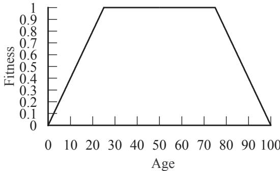
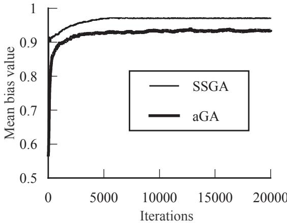
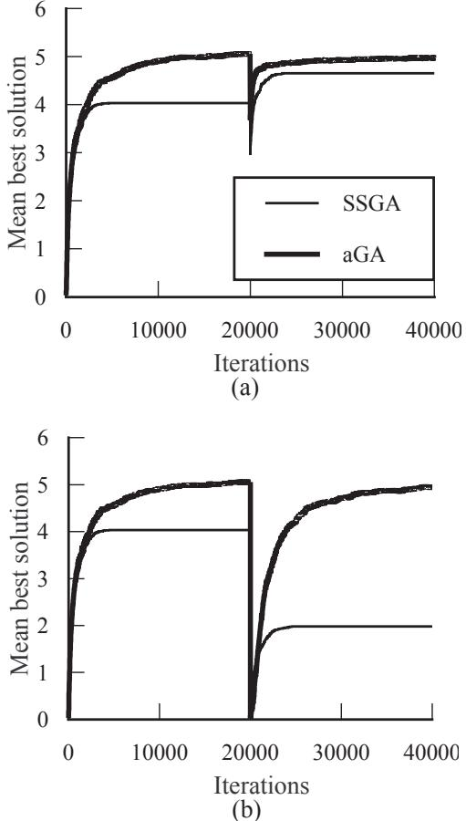
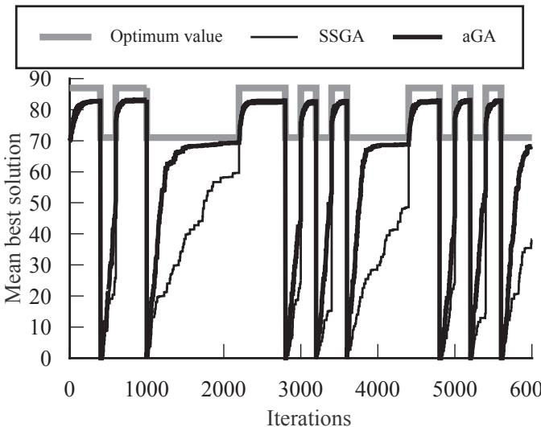
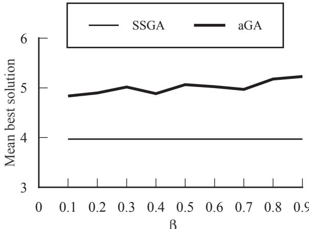

# Function Optimization in Nonstationary Environment using Steady State Genetic Algorithms with Aging of Individuals

Ashish Ghosh\*1, Shigeyoshi Tsutsui\*2 and Hideo Tanaka\*3

\*1 Machine Intelligence Unit Indian Statistical Institute, 203 B. T. Road, Calcutta 700035, INDIA ash@isical.ernet.in   
$^ { * 2 }$ Dept. of Management and Information Science, Hannan University5-4-33 Amamihigashi, Matsubara, Osaka 580, JAPAN tsutsui@hannan-u.ac.jp   
\*3Dept. of Industrial Engineering, College of Engineering, Osaka Prefecture University, 1-1 Gakuen-cho, Sakai, Osaka 593, JAPAN, tanaka@ie.osakafu-u.ac.jp

Abstract--In this paper, we explore the utility of the concept of aging of individuals in the context of steady state GAs for nonstationary function optimization. Age of an individual is used as an additional factor in addition to the objective functional value in order to determine its effective fitness value. Age of a newly generated individual is taken as zero, and in every iteration it is increased by one. Individuals undergoing genetic operations are selected based on the effective fitness value, which changes dynamically. This helps to maintain diversity in the population and is useful to trace changes in environment. Simulation results show some promise for the utility of the present technique for nonstationary function optimization.

# 1. Introduction

It is well known that a species is more robust against changing environment if it can maintain diversity in the existing population which gives it better scope to adjust to the changing environment. A key element in a Genetic Algorithm (GA) is that it maintains a population of candidate solutions that evolve over time [1, 2]. The population allows the GA to continue to explore a number of regions of the search space that appear to be associated with high performance solutions. As long as the population remains distributed over the search space, there is good reason to expect the GA to maintain diversity so as to adapt to changes in the environment (the objective function) by reallocating future search effort toward whatever region of the search space is favored by the objective function. However the natural tendency of standard GAs (SGA) to converge rapidly reduces their ability to identify regions of the search space that become more attractive over time.

The problem of optimization in a nonstationary environment can be thought of as optimizing a series of time dependent optima. Because the SGA works to find an optimum, some modified versions of it is expected to be useful in searching for a series of optima. Two basic strategies have been suggested in the literature for modifying the SGA to accommodate to changing environments [3]. The first strategy is to expand the memory of the SGA in order to build a repertoire of ready responses for environmental conditions. The second is to employ some method for increasing diversity in the population in order to compensate for changes in the environment. In the present investigation we will use a new strategy to continuously maintain diversity in the population, but in a different context and different way.

Usually, in generational replacement based GAs the whole population is replaced in every iteration. On the other hand, in steady state GAs (SSGA, say) [4, 5] only a few individuals are replaced in each iteration. In this article we will be concerned with steady state type GAs only. SSGAs having smaller population sizes normally lose diversity very fast, and larger population sizes increase the cost of computation and slow down the speed of convergence. In SSGA since only one or two individuals are replaced in each iteration, it can provide a better scope to keep the population distributed over a larger fraction of search space by appropriately choosing individuals undergoing genetic operations and individuals which are to be deleted. This, in turn, will increase the expectation of maintaining diversity in the population, adopt to changes in the objective function by reallocating future search effort toward the region favored by the present environment.

The aim of the present article is to test the utility of the concept of aging of individuals in the context of SSGAs, introduced in [6] and described in short in the next section, to optimize nonstationary functions. The main idea of incorporating the effect of aging of individuals was to maintain more diversity in the population for SSGAs. Empirical results for two test problems show good promise to trace changing environments.

# 2. Overview of Aging of Individuals

Here we give an overview of aging of individuals [7, 8] and the existing literature for nonstationary function optimization.

# 2.1 The basic concept

In conventional SSGAs the suitability or fitness of individuals for undergoing genetic operations is determined by their objective functional value only. On the contrary, in natural genetic system, age of an individual also plays a key role to determine its fitness or suitability for parenthood so as to take part in genetic operations. By analogy with nature the concept of aging of individuals was introduced in SSGAs also [6]. This acts as an additional factor so as to determine the suitability of individuals. As soon as a new individual is generated in a population its age is assumed to be zero. In every iteration, age of each individual is increased by one, i.e., one iteration is equivalent to incrementing the age of individuals by one. Each individual is assigned a maximum age limit after which its fitness value (with respect to age only) becomes zero. Effective fitness of an individual is defined as a combined function of its objective functional value and age and thus changes dynamically. The individuals are then subjected to genetic operations like selection (based on this effective fitness value), crossover, mutation and deletion as in conventional SSGAs. This modified GA is called aGA. Thus in the aGA, instead of only one feature, two features are used to measure the effective fitness or suitability of an individual.

Such an effective fitness based evaluation technique seems to be more natural as the aging process is well-known in all natural environment [7]. After a maximum age limit, contribution of aging factor to each individual's effective fitness value will become less and eventually (mostly) die, i.e., deleted from the population. Thus, in this case a particular individual cannot dominate for a longer period of time. This helps to maintain diverse types of individuals in the population even with smaller population size, which in turn may help to trace changing environment.

A block diagrammatic representation of the aGA is given below. Note that steps 2-6 constitute an iteration.

3. Select a few individuals based on the effective fitness values.   
4. Perform crossover and mutation to produce new individuals. Set ages of these new individuals to zero; and compute their objective functional values.   
5. Delete members from the existing population to make room for these new individuals.   
6. Increase age of each individual of the population by one.   
7. If stopping criterion is satisfied, STOP, if not, go to 2.

# Top-level description of the aGA

# 2.2 Mathematical formulation

Let $f \nu _ { _ i }$ be the objective functional value of an individual $I _ { \phantom { } _ { i } }$ and let its age be $a _ { _ i \cdot }$ Then the effective fitness of this individual $I _ { \phantom { } _ { i } }$ may be defined as $\mathit { f i t } _ { \mathit { i } } = \mathit { F } ( g ( \mathit { f i } _ { \mathit { i } } ) , \mathit { h } ( a _ { \mathit { i } } ) )$ , where $F$ , g and $h$ are suitable functions. In the present study we have made $F , g$ and $h$ to lie in [0, 1].

The functional form of $g$ (i.e., how to map the functional value to fitness) is well studied [1]. In the present work we took $g$ to be monotonically non-decreasing function defined as

$$
\begin{array} { r l r } {  { g ( x ) = 2 ( \frac { x - x _ { m n } } { x _ { m x } - x _ { m n } } ) ^ { 2 } } } & { } & { \mathrm { i f ~ } x \leq \frac { x _ { m n } + x _ { m x } } { 2 } , } \\ & { } & \\ & { } & { = 1 . 0 - 2 ( \frac { x _ { m x } - x } { x _ { m x } - x _ { m n } } ) ^ { 2 } \mathrm { ~ o t h e r w i s e , } } \end{array}
$$

where $x _ { _ { m n } }$ and $x _ { _ { m x } } ,$ respectively, are the minimum and maximum functional values attained in a particular iteration.

The function $h$ is called aging function. For this study we have chosen the following functional form which owes its basic intuition to nature where mainly the middle aged individuals are considered more fit than the young and old ones.

$$
\begin{array} { r l r } {  { h ( a ) = a / b 1 } } & { \mathrm { i f } 0 \le a < b 1 , } \\ & { = 1 . 0 } & { \mathrm { i f } b 1 \le a < b 2 , } \\ & { = 1 . 0 - { \displaystyle \frac { a - b 2 } { b - b 2 } } } & { \mathrm { i f } b 2 \le a < b , } \\ & { = 0 . 0 } & { \mathrm { o t h e r w i s e } . } \end{array}
$$

The function is assumed to be symmetric about $b / 2$ , and thus the function has only two parameters ( $^ b$ & b1 or $^ { b 2 }$ ). In this case individuals having ages in the range $[ b 1 , b 2 ]$ are assumed to be the fittest (with respect to age) for genetic operations. Fig. 1 shows the shape of this function for $b 1 = 2 5$ , $b 2 = 7 5$ and $b = 1 0 0$ .

The function $F$ can also be chosen in various ways. For the present study, we took $F$ to be a simple weighted generalized mean operator defined as

  
Fig. 1 Aging function

$$
F ( x _ { i } , y _ { i } ) = \sqrt { ( \beta y _ { i } ^ { 2 } + ( 1 - \beta ) x _ { i } ^ { 2 } } ~ .
$$

with $\beta \in [ 0 , 1 ]$ . Here, $x _ { i } = g ( \mathcal { \boldsymbol { h } } _ { i } )$ and $y _ { _ i } = h ( a _ { _ i } )$ .

# 2.3 Variation from previous studies

There are some previous studies that address the problems of using GAs in nonstationary environments. The study in [9] explored a strategy of using dominance and diploidy for a two-state oscillating environment only. It is not clear how to extend this for an environment having more than two states. In a study, Grefenstette used a replacement strategy for large population [2] to replace a fraction of the population of an SGA with randomly generated individuals so as always to maintain some diversity in the population. The technique worked well in environments where there are occasional large changes in the location of the optimum. In another study, Cobb [10] investigated an adaptive mutation based mechanism which temporarily increases the mutation rate to a high value whenever the time averaged best performance of the population deteriorates. (Note that maintaining a constant high mutation rate is not useful for tracing the changing optimum.) In a recent paper a systematic study of different techniques suitable for nonstationary environment was made in [3].

All these studies were concerned with generational replacement based GAs only. In the present investigation we propose a technique for using SSGAs with aging of individuals for nonstationary environments. The present technique also tries to maintain diversity in the population continuously by not allowing individuals to dominate for a longer period of time, and permitting new individuals to take part in genetic operations.

# 3. Simulation Results

In the present study the parameters for the GAs have been chosen as follows. Population size was taken from the set $\{ 4 0 , 1 0 0 , 2 0 0 \}$ . Crossover probabilities were taken in the range [0.6, 0.9] in steps of 0.1, and mutation probabilities were taken from the set $\left. 0 . 0 0 6 , 0 . 0 1 , 0 . 0 2 , 0 . 0 4 \right.$ and a total of 48 combinations were tried. Binary coding scheme was adopted. The worst two individuals (for the case of $a G A$ ) were replaced by the two newly generated individuals in each iteration. 50 simulations were performed for each function with different values of $\beta$ in the range [0.1, 0.9] in steps of 0.1. Proportional payoff selection procedure was adopted. Maximum age limit $( \beta )$ of each individual was fixed to 100. For a typical illustration, we put the results corresponding to a small population $\mathrm { s i z e } = 4 0$ , a crossover rat $\mathord { : } = 0 . 9$ , and a mutation rate of 0.02. The aim is to show that the aGA performs better even for a small population size.

# 3.1 Effect of aging on diversity

Let us now study the effect of aging of individuals on diversity using the popularly used bias measure [11]. Let $s [ i , j ]$ represent the jth bit of the ith chromosome. Then the bias $b ( t )$ of a population of size $N$ with each chromosome having $L$ bits for the tth iteration is defined as

$$
b ( t ) = \frac { 1 } { 2 } + \frac { 1 } { N \times L } \sum _ { j = 1 } ^ { L } \left( \left| \sum _ { i = 1 } ^ { N } s [ i , j ] - \frac { N } { 2 } \right| \right) .
$$

$b ( t )$ is a first order convergence measure which indicates the average percentage of prominent values in each position of the individuals. If a population has more bias, it is less diverse. To study the effect of aging on diversity we take the ripple function defined as

$$
f r = \sum _ { i = 1 } ^ { 5 } e ^ { - 2 ^ { \ln 2 } \left( \frac { x _ { i } - \phantom { \bigg | } x _ { 0 , 3 } } { 0 . 8 } \right) ^ { 2 } } ( \sin ^ { 6 } ( 5 \pi x _ { i } ) + 0 . 1 \cos ^ { 2 } ( 5 0 0 \pi x _ { i } ) ) .
$$

Variation of the mean of bias values of 50 simulations with iterations for the functions $f r$ is displayed in Fig. 2 $( \beta = 0 . 5 )$ . From this figure we notice that the bias of the population is always less for the aGA, i.e., population is more diverse for the aGA than the SSGA. This is possibly due to the following reason. In the SSGA if a particular solution has more functional value, it goes on getting chances to produce offspring thereby increasing the chance of generating similar type of offspring. Thus the population diversity reduces very fast. By introducing the concept of aging, no individual is allowed to dominate for a longer period of time, thus providing more scope of having various types of individuals in a pool. This helps to sustain population diversity. Similar was the findings for other functions studied in the following subsections. In order to test the tractability of the present concept the following two problems are considered.

  
Fig. 2 Mean bias value with iterations

# 3.2 Tractability for the ripple function

In this study the landscape of the objective function $f r$ is changed after a number of iterations (say, T) when the species has attained a sufficiently stable state or whenever the GA is more or less converged. The objective function, to be evaluated at the tth iteration, thus becomes

$$
\begin{array} { r } { r 1 = \displaystyle \sum _ { i = 1 } ^ { 5 } e ^ { - 2 \ln \left( \frac { x _ { i } - 0 . 1 } { 0 . 8 } \right) ^ { 2 } } ( \sin ^ { 6 } { ( 5 \pi x _ { i } ) } + 0 . 1 \cos ^ { 2 } { ( 5 0 0 \pi x _ { i } ) } ) } \\ { \displaystyle \phantom { \frac { 1 } { 1 } } \ i \mathrm { f } \phantom { \frac { 1 } { 1 } } t < T , } \\ { = \displaystyle \sum _ { i = 1 } ^ { 5 } e ^ { - 2 \ln \left( \frac { x _ { i } - 0 . 5 } { 0 . 8 } \right) ^ { 2 } } ( \sin ^ { 6 } { ( 5 \pi x _ { i } ) } + 0 . 1 \cos ^ { 2 } { ( 5 0 0 \pi x _ { i } ) } ) } \end{array}
$$

otherwise,

$$
\begin{array} { r } { f r 2 = \displaystyle \sum _ { i = 1 } ^ { 5 } e ^ { - 2 \mathrm { l n } \left( \frac { x _ { i } - 0 . 1 } { 0 . 8 } \right) ^ { 2 } } ( \sin ^ { 6 } { ( 5 \pi x _ { i } ) } + 0 . 1 \cos ^ { 2 } { ( 5 0 0 \pi x _ { i } ) } ) } \\ { \mathrm { i f } \quad t < T , } \\ { = \displaystyle \sum _ { i = 1 } ^ { 5 } e ^ { - 2 \mathrm { l n } \left( \frac { x _ { i } - 0 . 5 . 5 } { 0 . 8 } \right) ^ { 2 } } ( \sin ^ { 6 } { ( 5 \pi x _ { i } ) } + 0 . 1 \cos ^ { 2 } { ( 5 0 0 \pi x _ { i } ) } ) } \end{array}
$$

otherwise.

It can be noted that fr1 and $f \dot { r } 2$ have the same optimum (maximum) functional value with $f r$ (equation 5), but the optimum points are different. In the first case (equation 6) the optimum point is shifted from 0.1 to 0.5 (small shift), whereas in the second case (equation 7) the optimum point is shifted from 0.1 to 95.5 (very large shift) at ${ \cal T } { = } 2 0 , 0 0 0$ .

Mean (over 50 simulations) of the best solutions obtained for different iterations for a typical value of $\beta = 0 . 5$ , for both of these modified forms (equations 6 and 7) are displayed in Fig. 3. From Fig. 3(a) we notice that when the landscape is changed after 20,000 iterations, functional values evaluated by both the aGA and the SSGA is less. The aGA recovers this drop faster compared to the SSGA, thereby reflecting its capability of tracing the changing environment. Now let us see Fig. 3(b) which displays the results for a very large shift of the optimum point. The performance is dropped drastically for both the algorithms. The aGA is able to trace this change in the environment and recovers the loss in performance in a very short time; on the contrary the SSGA fails to get back its old performance. This is possibly due to the following reason. The aGA maintains more diversity in the population (see Fig. 2), i.e., the population contains various types of individuals even at the time of changing the landscape. On the other hand, the SSGA converges to similar types of individuals very fast and the diversity in the population is less. Recombination of diverse types of individuals in the aGA produces new individuals suitable for the changed environment and thus the performance is improved. On the other hand, recombination of similar types of individuals in the SSGA fails to generate new types of individuals suitable for the new environment and thus could not recover the loss in performance. This shows that the aGA is more robust and can trace the changing environment, unlike the SSGA. Similar results were also observed for other values of $\beta$ in [0.3, 0.8].

  
Fig. 3 Mean best solution with iterations for (a) fr1, (b) fr2

# 3.3 Tractability for Knapsack problem

In the second study the algorithm was applied to a 17-object, blind, nonstationary 0-1 knapsack problem as used in [9] where the weight constraint was varied in time. The 0-1 knapsack problem is an NP-complete problem where we maximize the total value of a subset of objects (selected from a set of $N$ possible objects) that we place in a knapsack, subject to some maximum load or weight constraint. If we associate a value $\nu _ { _ j }$ and a weight $w _ { j }$ with the jth object, the problem then reduces to:

$$
\operatorname* { m a x } \sum _ { j = 1 } ^ { N } \nu _ { j } x _ { j }
$$

subject to the weight constraint

$$
\sum _ { j = 1 } ^ { N } w _ { j } x _ { j } \leq W .
$$

Here the $x _ { j }$ variables take on the values 1 or 0 as the object is in or out of the sack respectively, and $W$ is the maximum permissible weight. The weight constraint was varied as a step function between two values: $80 \%$ and $50 \%$ of the total object weight. The weight constraint is shifted between the two values at a multiple of 200 iterations interval, and was chosen randomly.

The problem was coded as follows. The $1 7 \ : x _ { j }$ values are concatenated to form a 17-bit string. The constraint inequality is adjoined to the problem with an external penalty method, where weight violations are squared and multiplied by a penalty coefficient $\lambda = 2 0$ ). In other words, the functional value $f \nu _ { i }$ of an individual $I _ { \ O _ { i } }$ is determined as

$$
f \nu _ { i } = \sum _ { j = 1 } ^ { N } \nu _ { j } x _ { j } - \lambda ( \sum _ { j = 1 } ^ { N } w _ { j } x _ { j } - W ) ^ { 2 } .
$$

Negative objective functional values those occur by the above are set to zero.

As in the previous study, we put the mean of the best solutions obtained for different iterations (up to 6000) for a typical value of $\beta = 0 . 5$ in Fig. 4. From the figure it is quite evident that when the weight constraint is set to $50 \%$ from $80 \%$ of the total weight, the performance falls drastically. This is because most of the solutions become infeasible in this case. The aGA recovers this fall in performance very fast, whereas the SSGA does it very slowly. This is specially evident in the iteration interval 1000-2200 and 3600- 4400. During these intervals the weight constraint was kept constant to $50 \%$ only; even then the SSGA failed to attain a level close to the actual optimum. On the contrary the aGA attained a level close the actual optimum value very fast. This is even true when the interval is very small (say, 2800- 3000). This is possible because the aGA maintains diverse types of individuals in the population, and some of them become feasible for the changed interval; and regains the performance. Now, when the weight constraint is changed from $50 \%$ to $80 \%$ most of the existing solutions remain feasible, and performance is regained.

Once again, findings for other values of $\$ 1 b e t a5$ in [0.3- 0.8] were also similar. Diversity of the population by the aGA was found to be more than that of the SSGA; and this is in agreement with the findings of Section 3.1.

  
Fig. 4 Mean best solution with iterations for Knapsack problem

# 3.4 Results on stationary function

Although the main aim of the present article is to test the utility of aging of individuals, for nonstationary function optimization, here we present one set of results for the stationary function $f r$ (equation 5).

For stationary functions, it is expected that when \$\beta\$ value is close to zero there is no effect of aging; and thus the performance of the aGA will be very close to that of the SSGA. By increasing the value of $\beta _ { ; }$ effect of aging is increased. When $\beta$ goes very close to one, the effect of functional value is mostly ignored for deciding the suitability of individuals; thus degrading the performance. Our empirical results, on stationary function optimization also corroborate to this intuitive feeling. For visual inspection the mean of 50 simulations of the best solutions obtained at the end of 20000 iterations are displayed against the corresponding $\beta$ values in Fig. 5.

  
Fig. 5 Mean best solution with $\pmb { \beta }$ for fr

As can be noticed from Fig. 5, the aGA showed superior performance than the SSGA for the stationary function also. This is because the aGA maintains more diversity in the population (Fig. 2), and can come out from local optima; thereby increasing the mean best performance. This result also strengthens our claim that the aGA can maintain more diversity in the population than the SSGA which may be useful for other purposes.

# 4. Conclusions

In the present study we made an attempt to investigate the utility of incorporating the effect of age of individuals (suitable for GAs having overlapping populations) for nonstationary function optimization. Effective fitness or overall suitability of an individual is determined by both of its functional value and age, and changes dynamically. This helps to maintain diversity in the population and can be used to trace changing environments.

The present results show some promise that the aGA may be useful for nonstationary function optimization, i.e., the tractability of the aGA to changing environment is better than the SSGA. Shape of the aging function $h$ and the aging factor $\beta$ may depend on problem and needs to be thoroughly investigated. A systematic comparison of this algorithm with other existing works on non-stationary environment [3] and sharing [12] is yet to be done. Application to other types of nonstationary problems would also constitute another part of future investigation.

# Acknowledgments

This research is partially supported my the Ministry of Education, Science, Sports and Culture under Grant-in-Aid for Scientific Research on Priority Areas number 264-08233105.

# Список литературы

[1] D. E. Goldberg, Genetic Algorithms in Search, Optimization and Machine Learning, Addison-Wesley, Massachusetts, 1989.   
[2] J. J. Grefenstette, Genetic algorithms for changing environments, Proceedings of the Parallel Problem Solving from Nature, pp. 137-144, 1992.   
[3] H. G. Cobb and J. J. Grefenstette, Genetic algorithms for tracking changing environments, Proceedings of the 5th International Conference on Genetic Algorithms, pp. 523-530, 1993.   
[4] D. Whitley and J. Kauth, GENITOR: a different genetic algorithm, Proceedings of the Rocky Mountain Conference on Artificial Intelligence, Denver, Co, 1988.   
[5] G. Syswerda, A study of reproduction in generational and steady state genetic algorithms, Foundations of Genetic Algorithms, pp. 94-101, 1991.   
[6] A. Ghosh, S. Tsutsui, and H. Tanaka, Genetic search with aging of individuals, International Journal of Knowledge Based Intelligent Engineering Systems, 1(2), pp. 86-103, 1997.   
[7] Z. Michalewicz, Genetic Algorithms $^ +$ Data Structure $=$ Evolution Programs, Springer-Verlag, Berlin, 1994.   
[8] H.-P. Schwefel and R. Rudolph, Contemporary evolution strategies, Advances in Artificial Life, pp. 893-907, Springer, Berlin, 1995.   
[9] D. E. Goldberg and R. E. Smith, Nonstationary function optimization using genetic algorithms with dominance and diploidy, Proceedings of the 2nd International Conference on Genetic Algorithms, pp. 59-68, 1987.   
[10] H. G. Cobb, An investigation into the use of hypermutation as an adaptive operator in genetic algorithms having continuous, time-dependent nonstationary environments, Technical Report NRL Memorandum Report 6760, Naval Research Laboratory, Washington, DC 20375-5000, 1990.   
[11] J. J. Grefenstette, L. Davis, and D. Cerys, GENESIS and OOGA: Two GA Systems, TSP Publication, 1991.   
[12] K. Deb and D. E. Goldberg, An investigation of niche and species formation in genetic function optimization, Proceedings of the 3rd International Conference on Genetic Algorithms, pp. 42-50, 1989.