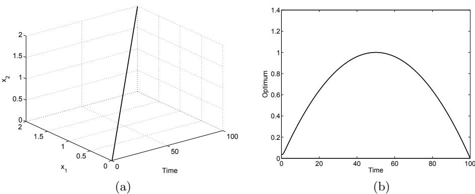
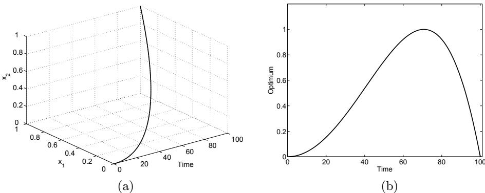
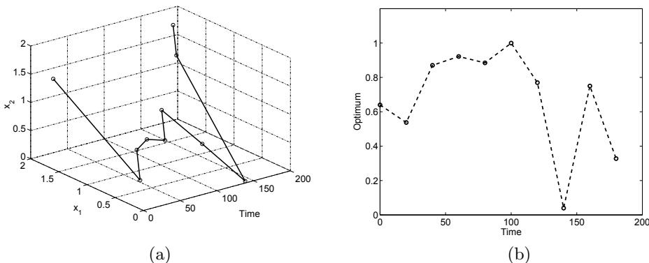
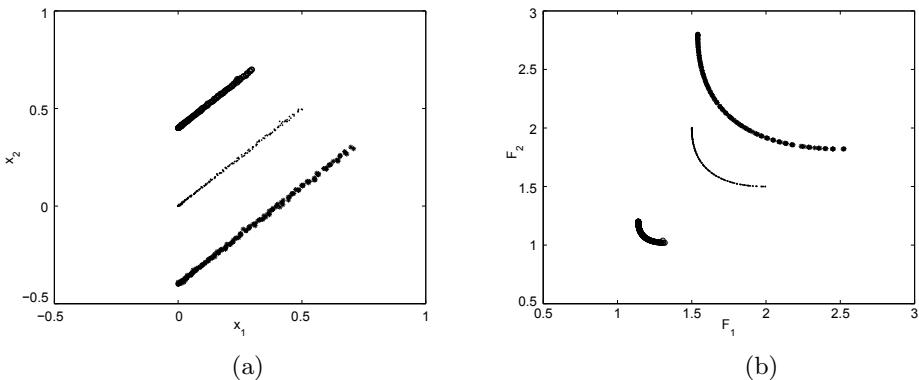
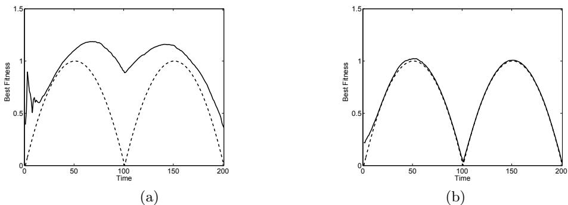
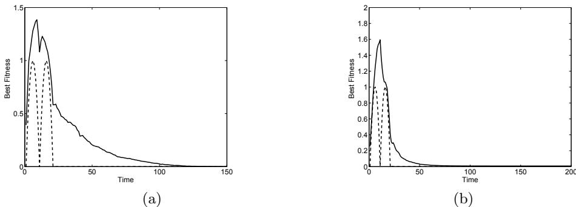
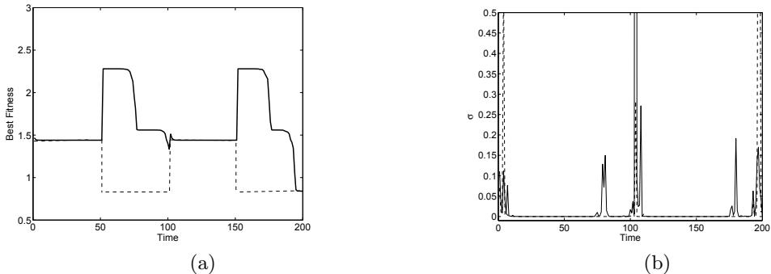
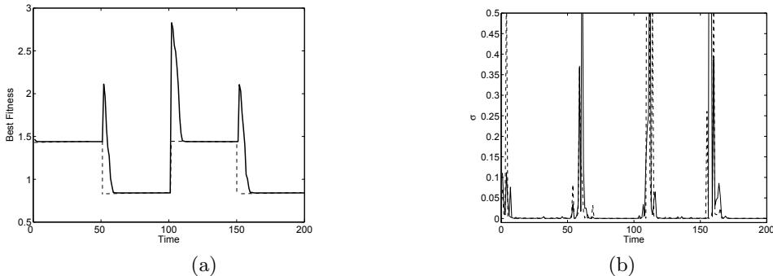
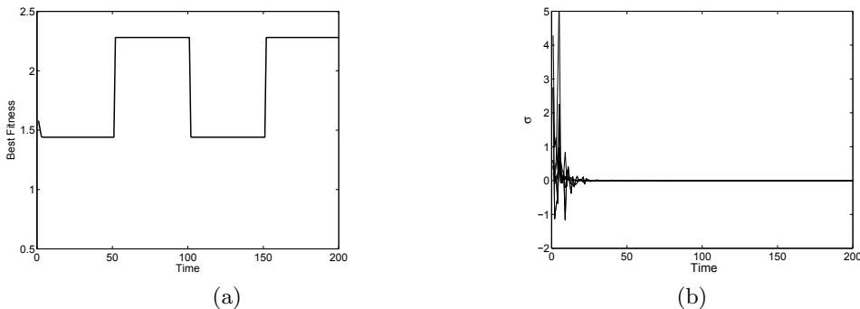
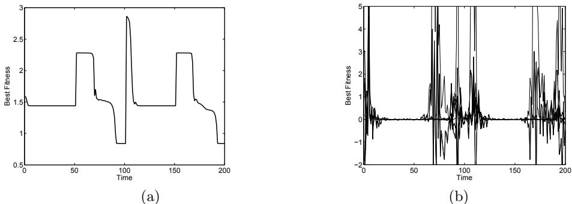

# Constructing Dynamic Optimization Test Problems Using the Multi-objective Optimization Concept

Yaochu Jin and Bernhard Sendhoff

Honda Research Institute Europe 63073 Offenbach/Main, Germany yaochu.jin@honda-ri.de

Abstract. Dynamic optimization using evolutionary algorithms is receiving increasing interests. However, typical test functions for comparing the performance of various dynamic optimization algorithms still lack. This paper suggests a method for constructing dynamic optimization test problems using multi-objective optimization (MOO) concepts. By aggregating different objectives of an MOO problem and changing the weights dynamically, we are able to construct dynamic single objective and multi-objective test problems systematically. The proposed method is computationally efficient, easily tunable and functionally powerful. This is mainly due to the fact that the proposed method associates dynamic optimization with multi-objective optimization and thus the rich MOO test problems can easily be adapted to dynamic optimization test functions.

# 1 Introduction

Solving dynamic optimization problems using evolutionary algorithms has received increasing interest in the recent years [4]. One of the important reasons for this increasing interest is that many real-world optimization problems are not stationary. To solve dynamic optimization problems, the optimizer, e.g. an evolutionary algorithm, must be able to adapt itself during optimization to track the moving optimum (peak).

A few methods have been proposed to deal with dynamic optimization problems using evolutionary algorithms. Generally three measures can be taken to enhance the ability of evolutionary algorithms for tracking moving optima:

1. Maintain population diversity by inserting randomly generated individuals [14], niching [6], or reformulating the fitness function considering the age of individuals [12] or the entropy of the population [20].   
2. Memorize the past using redundant coding [13, 9], explicit memory [22, 19], or multiple populations [26, 24, 5, 23].   
3. Adapt the strategy parameters of the evolutionary algorithms [7, 15]. However, conventional self-adaptation can have negative influences if no particular attention is paid to the dynamics of the optimums [2, 25].

To benchmark different algorithms for dynamic optimization, it is thus necessary to have a number of test functions. So far, there is a relatively small number of test functions available, most of which are very specific [4]. Not much work has been done to generate dynamic optimization test problems with a few exceptions [21, 3]. As pointed out in [21, 3], a feasible dynamic optimization test problem generator should be easy to implement, computationally efficient, and flexible enough to change the type of dynamics of the optimum.

This paper proposes a novel method for constructing dynamic optimization test problems by borrowing concepts from multi-objective optimization. The basic idea is to construct dynamic optimization problems by aggregating different stationary objectives using dynamically changing weights, which is directly inspired from the dynamic weighted aggregation method for solving multiobjective optimization problems [16, 17]. We will show that the method is easy to implement, readily tunable and is capable of generating almost any type of dynamic optimization problems that have been discussed so far [21].

In the following section, different types of dynamic optimization problems will be discussed briefly. A method for generating dynamic optimization problems based on multi-objective optimization is then suggested and typical examples are given in Section 3. In Section 4, behaviors of evolution strategies on tracking different types of dynamic problems are presented. A brief discussion about the relationship between dynamic optimization, multi-objective optimization and multi-modal optimization is provided in Section 5.

# 2 Types of Dynamic Problems

In most typical dynamic optimization problems, the location of the optimum moves deterministically or stochastically during optimization. Other cases in which the representation or constraints are changed during optimization, such as dynamic scheduling problems [4] will not be considered in this paper. In general, dynamic optimization problems with a moving optimum can be divided into the following types:

1. The location of the optimum moves linearly in parameter space with time. (MP1)   
2. The location of the optimum moves nonlinearly in parameter space with time. (MP2)   
3. The location of the optimum oscillates periodically among a given number of points in parameter space deterministically. (MP3)   
4. The location of the optimum moves randomly in the parameter space with time. (MP4)

It should be pointed out that for problem types $M P 1$ and $M P 2$ , the changes can also be periodic. Besides, depending on the speed of changes, changes may occur generation-wise or within a generation. In the former case, the optimum is supposed to be static within one generation, in other words, the objective function for each individual is the same. In the latter case, the objective function for each individual can be different.

# 3 MOO-Based Dynamic Test Problems Generator

# 3.1 Multi-objective Optimization and Dynamic Weighted Aggregation

Consider the following multi-objective optimization problem:

$$
\begin{array} { r } { \operatorname* { m i n } _ { { \pmb x } \in S } ( f _ { 1 } ( { \pmb x } ) , . . . , f _ { m } ( { \pmb x } ) ) , } \end{array}
$$

subject to the following unequality and equality constraints:

$$
\begin{array} { r } { g _ { i } ( \pmb { x } ) \ge 0 , i = 1 , . . . , p } \\ { h _ { j } ( \pmb { x } ) = 0 , j = 1 , . . . , q } \end{array}
$$

where $_ { x }$ is the design vector, $S$ is the set of all feasible solutions, $m$ is the number of objectives, $p$ and $q$ are the number of unequality and equality constraints.

It is well known that for such MOO problems, a single solution that can simultaneously minimize all objectives often does not exist. Rather, there exists a set of solutions (denoted as $\mathcal { P } ^ { \star }$ ) that are Pareto-optimal. Thus, the Pareto front (denoted as $\mathcal { P F } ^ { \star }$ ) is defined as follows:

$$
\mathcal { P F } ^ { \star } = \{ \mathbf { f } ( \mathbf { x } ) = \big ( f _ { 1 } ( \mathbf { x } ) , . . . , f _ { k } ( \mathbf { x } ) \big ) | \mathbf { x } \in \mathcal { P } ^ { \star } \} .
$$

A Pareto front can be convex, concave or partially convex and partially concave. A Pareto front $( \mathcal { P F } ^ { \star } )$ is said to be convex if and only if $\forall \mathbf { u } , \mathbf { v } \in \mathcal { P F } ^ { \star } , \forall \lambda \in$ $( 0 , 1 ) , \exists \mathbf { w } \in \mathcal { P F } ^ { \star } : \lambda | | \mathbf { u } | | + ( 1 - \lambda ) | | \mathbf { v } | | \geq | | \mathbf { w } | |$ . By contrast, a Pareto front is said to be concave if and only if $\forall \mathbf { u } , \mathbf { v } \in \mathcal { P F } ^ { \star } , \forall \lambda \in ( 0 , 1 ) , \exists \mathbf { w } \in \mathcal { P F } ^ { \star } :$ $\lambda | | \mathbf { u } | | + ( 1 - \lambda ) | | \mathbf { v } | | \leq | | \mathbf { w } | |$ .

Solving MOO problems using evolutionary algorithms has shown to be very successful. Readers interested in this topic are referred to [10, 8] for further details.

A traditional and conceptually straightforward way of solving the MOO problem in equation (1) is to aggregate the objectives into a single scalar function and then to minimize the aggregated function:

$$
\operatorname* { m i n } F ( \pmb { x } ) = \sum _ { i = 1 } ^ { m } w _ { i } f _ { i } ( \pmb { x } ) ,
$$

where $0 \leq w _ { i } \leq 1 , i = 1 , . . . , m$ , and $\textstyle \sum _ { i = 1 } ^ { m } w _ { i } = 1$ . In this way, an MOO problem is reduced to a single objective one when the weights are fixed.

The conventional weighted aggregation (CWA) formulation of the MOO has many important features. First, it has been shown that for every Pareto-optimal solution of a convex problem, there exists a positive weight such that this solution is an optimum of $F ( { \pmb x } )$ . Thus, if the Pareto front is convex, each Pareto optimal solution can be obtained by specifying a corresponding weight. However, multiple runs have to be conducted to obtain multiple solutions. Second, solutions located in the concave region of the Pareto front can not be obtained. Third, for a set of evenly distributed weights, the obtained Pareto optimal solutions may or may not distribute evenly in parameter space 1. If evenly distributed Pareto solutions are obtained, the MOO problem is termed as uniform. Otherwise, it is called non-uniform.

These features are often known as the main drawback of the CWA approach to MOO. However, it has also been shown that these weaknesses can be fixed if the weights are changed dynamically during optimization using evolutionary algorithms, which is termed as the dynamic weighted aggregation (DWA) method [16, 17] A further analysis of the method shows that the success of the DWA, as well as other local search strategies for MOO can very likely be attributed to the connectedness and regularity of Pareto optimal solutions [18].

# 3.2 Generating Dynamic Single Objective Test Problems

Inspired from the DWA method for solving MOO problems, we find that changing the weights in equation (5) also provides a very efficient approach to generating dynamic optimization test problems. For simplicity, we assume the number of objective is 2, thus equation (5) becomes:

$$
F ( \pmb { x } ) = w f _ { 1 } ( \pmb { x } ) + ( 1 - w ) f _ { 2 } ( \pmb { x } ) ,
$$

where $0 \leq w \leq 1$ . Obviously, by changing the weight $w$ , we can construct all dynamic optimization problems discussed in Section 2 very conveniently.

1. If $w$ changes linearly and if the MOO problem has a uniform and convex Pareto front, the optimum of $F ( { \pmb x } )$ in equation (6) moves linearly $( M P 1 )$ . 2. If $w$ changes linearly, and if the Pareto front of the MOO problem is nonuniform but convex, the optimum of $F ( { \pmb x } )$ moves nonlinearly $( M P 2 )$ . 3. If $w$ changes nonlinearly, and if the Pareto front of the MOO problem is uniform but convex, the optimum of $F ( { \pmb x } )$ moves nonlinearly $( M P 2 )$ . 4. If $w$ switches between a few fixed values periodically and if the Pareto front is convex, the optimum of $F ( { \pmb x } )$ oscillates among the different points. If the Pareto front is concave, the optimum oscillates between two different points, which are the minimum of $f _ { 1 }$ and $f _ { 2 }$ respectively. (MP3) 5. If the weights changes randomly, and if the Pareto front is convex, then the optimum of $F ( { \pmb x } )$ moves randomly.(MP4)

A few additional remarks can be made on the above method for generating dynamic optimization test problems. First, both the peak location and the peak height may be changeable. Second, if the weight changes periodically, the optimum of $F ( { \pmb x } )$ also moves periodically. The speed of the movement can be adjusted by the change speed of $w$ . Third, the change can be made generation by generation, or within a generation. In the latter case, the optimum moves before one generation is finished. Finally, the above method can be easily extended to generating dynamic multi-objective optimization problems. For example, given a stationary three-objective problem, it is possible to generate a two-objective problem with a moving Pareto front.

# 3.3 Generating Dynamic Multi-objective Test Problems

The method for generating dynamic single objective optimization based on dynamic weighted aggregation can easily be extended to generating dynamic multiobjective optimization test problems. Consider the following three-objective optimization problem:

$$
{ \mathrm { m i n i m i z e } } \ ( f _ { 1 } , f _ { 2 } , f _ { 3 } ) .
$$

Reformulate the above three-objective optimization test function as follows:

$$
\begin{array} { r l r } { \mathrm { i z e } \left( F _ { 1 } , F _ { 2 } \right) } & { { } } & { } \\ { F _ { 1 } } & { { } = } & { w f _ { 1 } + ( 1 - w ) f _ { 2 } , } \\ { F _ { 2 } } & { { } = } & { w f _ { 1 } + ( 1 - w ) f _ { 3 } , } \end{array}
$$

where $0 \leq w \leq 1$ . Obviously, the two-objective optimization problem in equation (8) has a moving Pareto front when the weight changes. We can show that the solutions of the two-objective MOO problem in equation (8) with a fixed weight is a subset of the solutions of the three-objective MOO problem in equation (7). To verify this, we aggregate the two objectives of the dynamic MOO problem in equation (8):

$$
\begin{array} { l } { { F = v F _ { 1 } + ( 1 - v ) F _ { 2 } } } \\ { { \ = w f _ { 1 } + v ( 1 - w ) f _ { 2 } + ( 1 - v ) ( 1 - w ) f _ { 3 } , } } \end{array}
$$

where $0 \leq v \leq 1$ . It can easily be seen that for $0 \leq v , w \leq 1$ , the weight for each objective in equation (10) is between $0$ and $1$ and the sum of the three weights always equals 1:

$$
w + v ( 1 - w ) + ( 1 - v ) ( 1 - w ) = 1 ,
$$

which means that the optimization task in equation (10) is a weighted aggregation of the original three-objective optimization problem in equation (7).

# 3.4 Illustrative Examples

To illustrate the idea of generating dynamic optimization test problems using the aggregation concept in MOO, we consider the following convex and uniform MOO problem [8]:

$$
\begin{array} { l } { f _ { 1 } = \displaystyle \frac { 1 } { n } \sum _ { i = 1 } ^ { n } x _ { i } ^ { 2 } , } \\ { f _ { 2 } = \displaystyle \frac { 1 } { n } \sum _ { i = 1 } ^ { n } ( x _ { i } - 2 ) ^ { 2 } . } \end{array}
$$

By aggregating the two objectives, we have:

$$
F ( \pmb { x } ) = w \sum _ { i = 1 } ^ { n } x _ { i } ^ { 2 } + ( 1 . 0 - w ) ( \sum _ { i = 1 } ^ { n } ( x _ { i } - 2 ) ^ { 2 } ) ,
$$

where $0 ~ \leq ~ w ~ \leq ~ 1$ . Thus, various dynamic single objective problems can be generated. If $w$ is changes in the following form:

$$
w ( t ) = - 0 . 0 1 t + 1 , \ 0 \leq t \leq 1 0 0 ,
$$

then the location of the optimum of equation (14) moves linearly in parameter space as well as in objective space, see Fig. 1 for $n = 2$ . If we change the weight

  
Fig. 1. The optimum moves linearly with time. (a) Peak location, (b) peak height.

$w$ nonlinearly:

$$
w ( t ) = - 0 . 0 0 0 1 t ^ { 2 } + 1 , \ 0 \leq t \leq 1 0 0 .
$$

The optimum of $F ( { \pmb x } )$ in equation (14) will move nonlinearly, as shown in Fig. 2.

Similarly, if the weight $w$ is changed randomly in every 10 generations, the optimum of $F ( { \pmb x } )$ jumps randomly, refer to Fig. 3 for $n = 2$ .

To illustrate how to generate a moving Pareto front, we take the following three-objective optimization problem as an example, which is taken from [8]:

$$
\begin{array} { c } { f _ { 1 } = x _ { 1 } ^ { 2 } + ( x _ { 2 } - 1 ) ^ { 2 } , } \\ { f _ { 2 } = x _ { 1 } ^ { 2 } + ( x _ { 2 } + 1 ) ^ { 2 } + 1 , } \\ { f _ { 3 } = ( x _ { 1 } - 1 ) ^ { 2 } + x _ { 2 } ^ { 2 } + 2 , } \\ { \mathrm { s u b j e c t ~ t o : } \quad - 2 \leq x _ { 1 } , x _ { 2 } \leq 2 . } \end{array}
$$

The Pareto front of this MOO test function is a convex surface. Reformulating the above MOO problem as shown in equation (8), and changing the weight $w$ , a moving Pareto front can be obtained, see for example in Fig. 4, where $w$ changes from 0.3 to 0.5 and to 0.7.

  
Fig. 2. The optimum moves nonlinearly with time. (a) Peak location, (b) peak height.

  
Fig. 3. The peak moves randomly in every 10 generations. (a) Peak location, (b) Peak height.

The above examples illustrate how dynamic single objective and multi-objective optimization test functions can be generated by combining multiple objectives. From the above examples, we can conclude that the proposed approach to generating dynamic test problems is efficient, tunable and capable of generating various number of dynamic optimization problems considering the rich test problems proposed for multi-objective optimization [11].

# 4 Behavior of Evolution Strategies in Dynamic Optimization

In this section, we present a few preliminary results on the behavior of evolution strategies (ES) in tracking different types of moving optima generated using the proposed method. Previous studies on the behavior of evolution strategies in tracking dynamic optimums can be found in [2, 25, 1].

  
Fig. 4. A dynamic MOO problem. (a) Parameter space, (b) objective space.

The standard evolution strategy and the ES with the covariance matrix adaptation have been considered. The parent and offspring population sizes are 15 and 100 respectively and the initial step-sizes are all set to 0.1. Neither recombination nor elitism has been adopted.

The behavior of the evolution strategies in tracking a linearly moving optimum of the test problem defined in equation (14) is shown in Fig. 5, where dimension $n$ is set to 20. The optimum moves from one end to the other in 100 generations and then moves back. It can be seen that both evolutionary algorithms work well in tracking slowly moving optimum and the ES-CMA outperforms the standard ES in that it can track the moving optimum more closely. When the optimum moves faster, optimum tracking becomes difficult. To show this, we change the weight in equation (14) so that the optimum first moves from one end to the other in 10 generations, then moves back in the next 10 generations and finally keeps static. The tracking results are presented in Fig. 6. We see that neither the ES nor the ES-CMA is able to track the moving optimum closely. We also notice that the tracking speed of the ES-CMA is much faster, but the “overshoot” is also larger.

  
Fig. 5. Tracking a slowly moving optimum. The dashed line denotes the height of the moving optimum and the solid line the tracking result. (a) ES, (b) ES-CMA.

  
Fig. 6. Tracking a rapidly moving optimum. The dashed line denotes the height of the moving optimum and the solid line the tracking result. (a) ES, (b) ES-CMA.

It is believed to be more critical for evolutionary algorithms to track a jumping optimum after the algorithm has converged. In order to investigate the behavior of evolution strategies in tracking a jumping optimum more clearly, we modify the dynamic test function in equation (14) slightly so that not only the peak location but also the peak height will change when the weight changes:

$$
F ( \pmb { x } ) = w \sum _ { i = 1 } ^ { n } x _ { i } ^ { 2 } + ( 1 . 0 - w ) ( \sum _ { i = 1 } ^ { n } ( x _ { i } - 2 ) ^ { 2 } + 1 ) .
$$

The weight is switched between 0.2 and 0.8 in every 50 generations. When the weight changes from 0.2 to 0.8, the location of the optimum of the function (21) moves from (1.6, 1.6) to (0.4, 0.4) in parameter space and its height changes from 1.44 to 0.84.

The tracking performance of the standard ES for $n = 3$ is shown in Fig. 7(a). It can be seen that the ES fails to track the optimum and gets stuck in a local minimum. If we look at the step-sizes, it is obvious that one of the step-sizes converges to zero and fails to adapt itself to the changing environment, refer to Fig. 7(b).

To solve this problem, the step-sizes are checked during optimization and they are reset once they are smaller than a given threshold. By doing this, the ES tracks the jumping optimum properly because the step-sizes are able to adapt, see Fig. 8(b).

Similar results have been obtained for the ES-CMA. Again, step-size checking is important for the ES-CMA to track the jumping optimum, refer to Fig. 9 and Fig. 10 respectively. Compared with the ES case, the ES-CMA gets fully stuck when no step-size checking is implemented. This is due to the fact that all stepsizes are converged to zero and cannot recover when the environment changes, refer to Fig 9(b). In contrast, the step-sizes adapt properly with checking, see Fig. 10(b).

  
Fig. 7. Tracking a jumping optimum using the standard ES. (a) Best fitness, (b) stepsizes.

  
Fig. 8. Tracking a jumping optimum using the standard ES with step-size checking. (a) Best fitness, (b) step-sizes.

# 5 Conclusions

The main purpose of this paper is to propose a computationally efficient, easily tunable and functionally capable dynamic optimization test problem generator using multi-objective optimization concepts. One of the major merit of the proposed approach is that it provides an easy way of taking advantage of the rich test problems available in multi-objective optimization. Furthermore, it brings us to consider the inherent connections between multi-objective optimization, multi-modal optimization and dynamic optimization, for all of which population diversity plays a key role.

Acknowledgement: The authors would like to thank Prof. E. K¨orner for his support.

  
Fig. 9. Tracking a jumping optimum using the ES-CMA. (a) Best fitness, (b) step-sizes.

  
Fig. 10. Tracking a jumping optimum using the ES-CMA with step-size checking. (a) Best fitness, (b) step-sizes.

# Список литературы

1. D. Arnold and H.-G. Beyer. Random dynamic optimum tracking with evolution strategies. In Parallel Problem Solving from Nature, volume VII, pages 3–12, 2002.   
2. T. B¨ack. On the behavior of evolutionary algorithms in dynamic environments. In IEEE Congress on Evolutionary Computation, pages 446–451, 1998.   
3. J. Branke. Memory enhanced evolutionary algorithms for changing optimization problems. In Proceedings of the 1999 Congress on Evolutionary Computation, pages 1875–1882. IEEE, 1999.   
4. J. Branke. Evolutionary Optimization in Dynamic Environments. Kluwer Academic Publisher, Boston, 2002.   
5. J. Branke, T. Kau¨ssler, C. Schmidt, and H. Schmeck. A multi-population approach to dynamic optimization problems. In Adaptive Computing in Design and Manufacturing, pages 299–307. Springer, 2000.   
6. W. Cedeno and V.R.Vemuri. On the use of niching for dynamic landscapes. In Internatioal Conference on Evolutionary Computation, pages 361–366. IEEE, 1997.   
7. H.G. Cobb and J.J. Grefensttee. Genetic algorithms for tracking changing environments. In Proc. of 5th Int. Conf. on Genetic Algorithms, pages 523–530, 1993.   
8. C. Coello Coello, D. Van Veldhuizen, and G. Lamont. Evolutionary Algorithms for Solving Multi-Objective Problems. Kluwer, New York, 2002.   
9. D. Dasgupta and D.R. McGregor. Nonstationary function optimization using structured genetic algorithms. In Parallel Problem Solving from Nature, pages 145–154. Elsevier, 1992.   
10. K. Deb. Multi-objective Optimization Using Evolutionary Algorithms. Wiley, Chichester, 2001.   
11. K. Deb, A. Pratap, and T. Meyarivan. Constrained test problems for multiobjective evolutionary optimization. In Proc. of the 1st Int. Conf. on Evolutionary Multi-criterion Optimization, LNCS 1993, pages 284–298, Berlin, 2001. Springer.   
12. A. Ghosh, S. Tsutsui, and H. Tanaka. Function optimization in nonstationary environment using steady state genetic algorithms with aging individuals. In Proceedings of IEEE Congress on Evolutionary Computation, pages 666–671, 1998.   
13. D.E. Goldberg and R.E. Smith. Nonstationary function optimization using genetic algorithms with dominance and diploidy. In Proceedings of the 2nd International Conference on Genetic Algorithms, pages 59–68, 1987.   
14. J.J. Grefenstette. Genetic algorithms for changing environments. In Parallel Problem Solving from Nature, 2, pages 137–144. Springer, 1992.   
15. J.J. Grefenstette. Evolvability in dynamic fitness landscapes: A genetic algorithm approach. In IEEE Congress on Evolutionary Computation, pages 2031–2038, 1999.   
16. Y. Jin, T. Okabe, and B. Sendhoff. Adapting weighted aggregation for multiobjective evolution strategies. In Proc. of 1st Int. Conf. on Evolutionary MultiCriterion Optimization, Leture Notes in Computer Science, pages 96–110, Zurich, March 2001. Springer.   
17. Y. Jin, M. Olhofer, and B. Sendhoff. Evolutionary dynamic weighted aggregation for multiobjective optimization: Why does it work and how? In Genetic and Evolutionary Computation Conference, pages 1042–1049, San Francisco, CA, 2001.   
18. Y. Jin and B. Sendhoff. Connectedness, regularity and the success of local search in evolutionary multiobjective optimization. In Proceedings of the 2003 Congress on Evolutionary Computation. IEEE, 2003. To appear.   
19. N. Mori, S. Imanishi, H. Kita, and Y. Nishikawa. Adaptation to a changing environment by means of memory based thermodynamical genetic algorithm. In Proc. of the 7th Int. Conference on Genetic Algorithms, pages 299–306, 1997.   
20. N. Mori, H. Kita, and Y. Nishikawa. Adaptation to a changing environment by means of the feedback themodynamic genetic algorithms. In Pallel Problem Solving from Nature, volume V, pages 149–158, 1998.   
21. R.W. Morrison and K.A. De Jong. A test problem generator for non-stationary environments. In Proceedings of the 1999 Congress on Evolutionary Computation, pages 2047–2053. IEEE, 1999.   
22. C.L. Ramsey and J.J. Grefenstette. Case-based initialization of genetic algorithms. In Proc. of the 5th Int. Conf. on Genetic Algorithms, pages 84–91, 1993.   
23. Y. Sano and M. Yamaguchi H.Kita, H. Kaji. Optimization of dynamic fitness function by means of genetic algorithm using sub-populations. In 4th Asia-Pasific Conference on Simulated Evolution and Learning, pages 706–711, 2002.   
24. R.K. Ursem. Multinational GAs: Multimodal optimization techniques in dynamic environments. In Proceedings of the Genetic and Evolutionary Computation Conference, pages 19–26. Morgan Kaufmann, 2000.   
25. K. Weicker and N. Weicker. On evolution strategy optimization in dynamic environments. In IEEE Congress on Evolutionary Computation, pages 2039–2046, 1999.   
26. M. Wineberg and F. Oppacher. Enhancing the GA’s ability to cope with dynamic environments. In Proceedings of Genetic and Evolutionary Computation Conference, pages 3–10. Morgan Kaufmann, 2000.