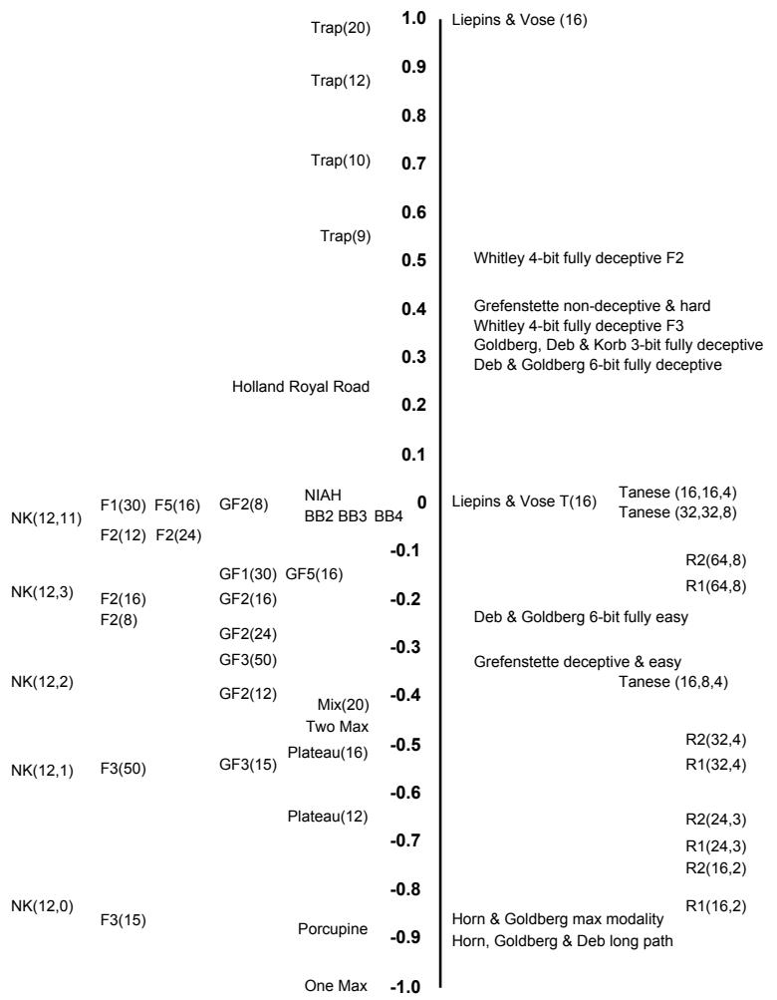
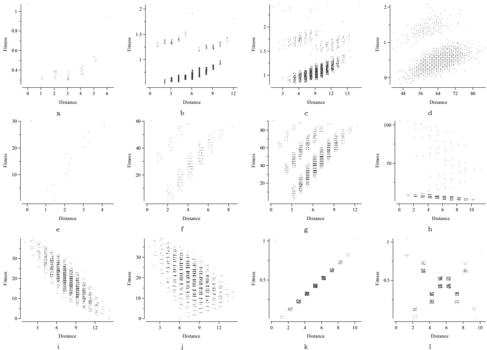

# Fitness Distance Correlation as a Measure of Problem Difficulty for Genetic Algorithms

Terry Jones   
Santa Fe Institute   
1399 Hyde Park Road   
Santa Fe, NM 87501, USA   
terry@santafe.edu

Stephanie Forrest Department of Computer Science University of New Mexico Albuquerque, NM 87131, USA forrest@cs.unm.edu

# Abstract

# 2 GA DIFFICULTY

A measure of search difficulty, fitness distance correlation (FDC), is introduced and examined in relation to genetic algorithm (GA) performance. In many cases, this correlation can be used to predict the performance of a GA on problems with known global maxima. It correctly classifies easy deceptive problems as easy and difficult non-deceptive problems as difficult, indicates when Gray coding will prove better than binary coding, and is consistent with the surprises encountered when GAs were used on the Tanese and royal road functions. The FDC measure is a consequence of an investigation into the connection between GAs and heuristic search.

The search for factors affecting the ability of the GA to solve optimization problems has been a major focus within the theoretical GA community. One approach to the question has been the study of deceptive problems proposed by Goldberg (1987), based on the work of Bethke (1981). The importance of deception to GAs is a contentious issue. Conflicting and extreme statements have been made, ranging from claims that deception is the only thing that is important in making a problem hard for a GA (Das & Whitley, 1991), through claims that deception is neither necessary nor sufficient for a problem to be hard for a GA (Grefenstette, 1993), to informal claims that deception is irrelevant to real-world problems. It is clear that some deceptive problems are hard but also that there are other factors that cause difficulty for a GA, such as epistasis, multimodality, noise, and spurious correlations (or hitch-hiking) (Schaffer et al., 1991; Forrest & Mitchell 1993a).

# 1 INTRODUCTION

A correspondence between evolutionary algorithms and heuristic state space search is developed in (Jones, 1995b). This is based on a model of fitness landscapes as directed, labeled graphs that are closely related to the state spaces employed in heuristic search. We examine one aspect of this correspondence, the relationship between the fitness functions of GAs and heuristic functions. By quantifying the extent to which a GA fitness function approaches an ideal of heuristic search, a measure of search difficulty is obtained. This measure is neutral with respect to the various claims about what specific properties of a GA are important for its success. For instance, it does not involve schemata and makes no claim about their importance. Work on heuristics suggests that the relationship between fitness and distance to a goal will have a strong effect on search difficulty. A simplistic way to examine this uses correlation, which proves quite useful in practice. In situations where correlation is too simple a summary statistic, the structure of their relationship is often apparent from a scatter plot of fitness and distance.

Another attempt to capture what it is that makes for GA difficulty is centered around the notion of "rugged fitness landscapes." Work in this area is often based on Weinberger's (1990) correlation length, as in that of Manderick et al. (1991). The approach raises questions similar to deception as it is apparent that a landscape can be smooth yet hard to search, as in "needle in a haystack" problems and also extremely rugged yet easy to search, as in Horn and Goldberg's (1995) maximally rugged landscape. As with deception, ruggedness does not appear to be necessary or sufficient for a problem to be difficult for a GA. Associated with ruggedness is the notion of "epistatic interactions." This was the basis of a proposed viewpoint on GA difficulty proposed by Davidor (1991). Once again, there are certainly highly epistatic problems that are hard, but there are also hard problems that are not epistatic. Kargupta (1995) has recently considered how signal and noise combine to affect GA search, an approach that appears promising.

These hypotheses of what makes a problem hard for a

GA all have something to recommend them, but appear to be only a piece of the whole story. It is clear that we are still some way from a definitive statement about what will make a problem hard for a GA, as evidenced by the surprising results encountered on the royal road functions in Mitchell et al. (1992). We suggest that the relationship between fitness and distance to the goal is very important for GA search. This relationship is apparent in scatter plots of fitness versus distance and is often well summarized by the correlation between fitness and distance (FDC). Preliminary results indicate that examining the relationship between fitness and distance provides a reliable indication of problem difficulty for a GA, that does not suffer from the problems of other approaches. This result is particularly interesting as the FDC measure is neutral with respect to the workings of a GA.

# 3 FITNESS DISTANCE CORRELATION

A model of fitness landscapes developed by Jones (1995b) suggests that there are strong connections between GA search and heuristic search. This perspective has also been advocated by Tackett (1994) based on a correspondence between genetic programming and beam search. In both fields, search can be viewed as a process of navigation on directed graphs whose vertices are labeled according to some function. In GAs, this function is a fitness function and in heuristic search it is an heuristic function. In heuristic statespace search, there is a large body of work on properties of heuristic functions (Pearl, 1984). A general principle of heuristic functions is that they should correlate well with the distance to the goal of the search, as was suggested as early as 1966 by Doran and Michie (1966). Heuristic search algorithms, for example $\mathrm { A } ^ { * }$ , treat the heuristic function values as an estimate of a distance (Hart et al., 1968). If the connection between GAs and heuristic search is important, the degree to which fitness functions are in accord with this principle may provide an indication of how difficult a landscape graph will be to search.

That is, we propose to view fitness functions as heuristic functions and to interpret GA fitness function values as estimates of the distance to the nearest goal of the search (often a global maximum). FDC is one method of quantifying the relationship between fitness and distance.

The easiest way to measure the extent to which the fitness function values are correlated with distance to a global optimum is to examine a problem with known optima, take a sample of individuals and compute the correlation coefficient, $r$ , given the set of (fitness, distance) pairs. If we are maximizing, we should hope that fitness increases as distance to a global maxima decreases. With an ideal fitness function, $r$ will therefore be $- 1 . 0$ . When minimizing, the ideal fitness function will have $r ~ = ~ 1 . 0$ . In this paper, we will always maximize. Given a set $F = \{ f _ { 1 } , f _ { 2 } , . . . , f _ { n } \}$ of $n$ individual fitnesses and a corresponding set $D =$ $\{ d _ { 1 } , d _ { 2 } , . . . . , d _ { n } \}$ of the $n$ distances to the nearest global maximum, we compute the correlation coefficient $r$ , as

$$
r = { \frac { c _ { F D } } { s _ { F } s _ { D } } }
$$

where

$$
c _ { F D } = { \frac { 1 } { n } } \sum _ { i = 1 } ^ { n } ( f _ { i } - { \overline { { f } } } ) ( d _ { i } - { \overline { { d } } } )
$$

is the covariance of $\mathrm { F }$ and $\mathrm { D }$ , and $s _ { F }$ , $s _ { D }$ , $\overline { { f } }$ and $\overline { { d } }$ are the standard deviations and means of $F$ and $D$ respectively. In this paper, Hamming distances are always used, and the distance associated with an individual is the distance to the closest global maximum. In a more general setting, one could use the minimum distance to a point that satisfied the object of the search, and distance would be computed using the operator that defined the edges of the landscape graph. We conjecture that measures computed using the actual operators of the GA would provide better predictions, although these will be more difficult to compute. Hamming distance is a simple first approximation to distance under the actual operators of a GA.

We use $r$ (FDC) as our measure of problem difficulty. As a summary statistic of the relationship between two random variables, correlation works best if the variables follow a bivariate normal distribution. There is no guarantee that this will be the case if we have a random sample of fitnesses, and there are therefore situations in which $r$ will be a poor summary statistic of the relationship between fitness and distance. It is important to realize that correlation is only one of the possible ways that the relationship between fitness and distance can be examined. It appears quite useful, although in this paper we show examples of problems for which it is too simplistic. Examining a scatter plot of fitness versus distance is very informative in the cases where there is a structure in this relationship that cannot be detected by correlation.

# 4 SUMMARY OF RESULTS

Our initial studies of FDC have concentrated on three topics: (1) investigating its prediction of GA behavior on a number of reasonably well-studied problems, (2) testing whether it would have predicted results that at one time seemed surprising, and (3) investigating whether it can detect differences in coding and representation. In the results that follow, FDC is computed exhaustively when the problem space contains $\bar { 2 } ^ { 1 2 }$ or fewer points, and via a sample of 4000 randomly chosen points otherwise. When the exhaustive method is used, the FDC values are exact. Variances in FDC when sampling are not shown. These are often very small, indicating that FDC is often very reliable, even on small samples. For example, in ten computations of FDC on a 64-bit royal road problem (sample size 4000), the mean $r$ value was -0.177095, and the variance was 0.000026. Variance in FDC is an important subject, because it relates to landscape isotropy, an issue not considered here.

Figure 1 shows the $r$ values for some instances of all the problems we studied. The vertical number line indicates the value of $r$ obtained. The problems may be roughly grouped into three classes: (1) misleading $\left( r \geq 0 . 1 5 \right)$ , in which fitness tends to increase with distance from the global optimum, (2) difficult $( - 0 . 1 5 ~ < ~ r ~ < ~ 0 . 1 5 )$ , in which there is very little correlation between fitness and distance from global optimum,1 and (3) straightforward $( r \ \leq \ - 0 . 1 \bar { 5 } )$ , in which fitness tends to increase as the global optimum is approached. An explanation of the abbreviations used in Figure 1, together with a short description of the problems and their sources can be found in Table 1.

Figure 2 shows some example scatter plots of fitness and distance from which $r$ is computed. In these plots, a small amount of noise has been added to distances (and in many cases fitnesses) so that identical fitness/distance pairs can be distinguished (Lane, 1994). This often makes it much easier to see the relationship between fitness and distances. The noise was not used in the calculation of $r$ , it is for display purposes only.

# 4.1 CONFIRMATION OF KNOWN RESULTS

This section investigates FDC's predictions on a collection of problems of known difficulty. The $r$ values for these problems are all plotted in Figure 1.

# 4.1.1 Misleading Problems

Deb and Goldberg's (1992) 6-bit fully deceptive function and Whitley's (1991) 4-bit fully deceptive functions2 have $r$ values of 0.30, 0.51 and 0.36 respectively. This indicates that fitnesses tend to increase with distance from the global optimum. In these functions, $r$ does not change when several copies of one of the functions are concatenated to make a longer problem, as is commonly done (this invariance is proved in (Jones, 1995b)). The scatter plots of these problems show an interesting additive structure. Figures 2(a) to 2(c) show one to three copies of Deb and Goldberg's function and Figures 2(e) to $2 ( \mathrm { g } )$ show one to three copies of Whitley's F2 function. Ackley's (1987)

Trap functions, Grefenstette's (1993) difficult but nondeceptive function, and Holland's royal road (1993) all also exhibit strong positive correlation.

# 4.1.2 Straightforward Problems

Turning to "easy" problems, Ackley's (1987) One Max function exhibits perfect negative correlation $\begin{array} { r l } { r } & { { } = } \end{array}$ $- 1 . 0 )$ . His Two Max function, also very simple, has $r = - 0 . 4 1$ . For $K \ < \ 3$ , the NK landscape problems produce high negative correlation $( - 0 . 8 3 , - 0 . 5 5$ and $- 0 . 3 5 )$ , though $r$ moves rapidly towards 0.0 as $K$ increases, which qualitatively matches the rapid increase in search difficulty found by Kauffman (1989; 1993) and others. The $r$ values for the NK landscapes are the means from ten different landscapes. Deb and Goldberg's (1992) 6-bit fully easy problem ( $ { r } = \ - 0 . 2 3 )$ and Grefenstette's (1993) deceptive but easy problem ( $r = - 0 . 3 3 )$ have similar values. Horn and Goldberg's (1995) maximally modal function has very strong negative correlation ( $r = - 0 . 9 4 )$ and is known to be easily optimized by a GA. Ackley's (1987) Porcupine, also maximally modal, exhibits similar FDC ( $r = - 0 . 8 8 )$ .

# 4.1.3 Long Path Problems

Horn, Goldberg and Deb's long path problem (1994) has $r = - 0 . 9 0$ , indicating that the problem should be simple. This problem is difficult for the hillclimber it was constructed to be difficult for, but GAs apparently have little trouble with it. This $r$ value was obtained through sampling, which will tend to miss the few points that lie on the path. When $r$ is calculated for the entire space, its value falls (towards 0.0) considerably. If we calculate $r$ just for the points on the path, it is strongly negative, as it is for the points not on the path (e.g., for strings with 12 bits, we get $r = - 0 . 3 9$ and $r ^ { ' } = - 0 . 6 7$ but combining the samples gives a much lower correlation $r = - 0 . 1 9 ,$ . This is a first illustration of how correlation may sometimes prove too simplistic a summary statistic of the relationship between fitness and distance. However, the striking structure of the problem is immediately apparent from the scatter plot, as can be seen in Figure $2 \mathrm { ( h ) }$ .

# 4.1.4 Zero Correlation

The needle in a haystack, the 2-, 3-, and 4-state busy beaver problems and the NK(12,11) landscape, all known to be difficult problems, had $r$ approximately 0.0. The needle in a haystack function is zero everywhere except for one point. If such a function is sampled and the needle is not included in the sample, the correlation coefficient cannot be computed as there is no variance in fitness. If there is any variation at all in the fitness and distance values, the correlation coefficient will be defined. A slight amount of uniform low-fitness noise gives correlation close to 0.0.

Some of De Jong's functions have unexpectedly low $r$ values. For example, F2(12) has $r ~ = ~ 0 . 1$ . Although the correlation measures correctly predict that F2(12) will be harder for the GA than GF2(12), the low correlation for F2(12) is misleading. The scatter plots for these functions (not shown) reveal that they contain high fitness points at all distances from the global optimum (a result of "cliffs" in the encoding), a relationship that is not well summarized by correlation. From this, it is reasonable to expect that a GA will have no trouble locating a very high fitness point. If instead of computing FDC based on distance to the global optimum, we select a set of high fitness points (for example, the top $1 \%$ of all points), and compute FDC, we obtain $r = - 0 . 2 5$ , a strong indication that this is a simple task. This is a second example of a relationship between fitness and distance which is not detected by correlation, but which is clear from the scatter plots.

  
Figur Summary  results.Horizontal position s merely or grouping,vertical positionindicates the value of $r$ . Abbreviation explanations and problem sources are given in Table 1.

# 4.2 CONFIRMATION OF UNEXPECTED RESULTS

Here we examine the predictions of FDC on two problem sets whose results were surprising to GA researchers at the time they were obtained. These are the Tanese functions and the royal road functions. In both cases, FDC's predictions match the behavior of the GA.

# 4.2.1 Tanese Functions

Tanese (1989) found that on Walsh polynomials on 32 bits with 32 terms each of order 8 (which we will denote by $\mathrm { T } ( 3 2 , 3 2 , 8 ) )$ , a standard GA found it very difficult to locate a global optimum. FDC gives an $r$ value extremely close to 0.0 for all the instances of T(32,32,8) we have considered, as it does for $\mathrm { T } ( 1 6 , 1 6 , 4 )$ functions. When the number of terms is reduced, the problem becomes far easier, for instance, $\mathrm { T } ( 1 6 , 8 , 4 )$ functions typically have an $r$ value of approximately $- 0 . 3 7$ . These figures are consistent with the experiment of Forrest and Mitchell (1993b), who found that increasing string length made the problem far simpler in $\mathrm { T } ( 1 2 8 , \bar { 3 } 2 , 8 )$ functions. It is not practical to use FDC on $\mathrm { T } ( 1 2 8 , 3 2 , 8 )$ functions because they have at least $2 ^ { 9 6 }$ global optima and the FDC algorithm requires computing the distance to the nearest optimum.

able The problems of Figure  Where a problem has two sources, the first denotes the riginal statmen of the problem and the second contains the description that was implemented.   

<table><tr><td>Abbreviation</td><td>Problem Description</td><td>Source</td></tr><tr><td>BBk</td><td>Busy Beaver problem with k states.</td><td>Rado (1962); Jones &amp; Rawlins (1993)</td></tr><tr><td>Deb &amp; Goldberg</td><td>6-bit fully deceptive and easy functions.</td><td>Deb &amp; Goldberg (1992)</td></tr><tr><td>Fk(j)</td><td>De Jong&#x27;s function k with j bits.</td><td>De Jong (1975); Goldberg (1989)</td></tr><tr><td>GFk(j)</td><td>As above, though Gray coded.</td><td>De Jong (1975); Goldberg (1989)</td></tr><tr><td>Goldberg, Korb &amp; Deb</td><td></td><td>Goldberg et al. (1989)</td></tr><tr><td>Grefenstette easy</td><td>3-bit fully deceptive.</td><td></td></tr><tr><td>Grefenstette hard</td><td>The deceptive but easy function.</td><td>Grefenstette (1993)</td></tr><tr><td>Holland royal road</td><td>The non-deceptive but hard function. Holland&#x27;s 240-bit royal road function.</td><td>Grefenstette (1993) Holland (1993); Jones (1995a)</td></tr><tr><td>Horn, Goldberg &amp; Deb</td><td>The long path problem with 40 bits.</td><td>Horn et al. (1994)</td></tr><tr><td>Horn &amp; Goldberg</td><td></td><td></td></tr><tr><td>Liepins &amp; Vose (k)</td><td>A 33-bit maximally rugged function.</td><td>Horn &amp; Goldberg (1995)</td></tr><tr><td>Mix(n)</td><td>Deceptive problem with k bits.</td><td>Liepins &amp; Vose (1991) Ackley (1987)</td></tr><tr><td>NIAH</td><td>Ackley&#x27;s mix function on n bits.</td><td></td></tr><tr><td>NK(n, k)</td><td>Needle in a haystack. Kauffman&#x27;s NK landscape. N = n, K = k.</td><td>§4.1.4 Kauffman (1989)</td></tr><tr><td>One Max</td><td>Ackley&#x27;s single-peaked function.</td><td>Ackley (1987)</td></tr><tr><td>Plateau(n)</td><td>Ackley&#x27;s plateau function on n bits.</td><td>Ackley (1987)</td></tr><tr><td>Porcupine(n)</td><td>Ackley&#x27;s porcupine function on n bits.</td><td>Ackley (1987)</td></tr><tr><td>R(n, b)</td><td>Mitchell et al. n-bit royal road, b-bit blocks.</td><td>Mitchell et al. (1992)</td></tr><tr><td>Tanese (l, n, o)</td><td>l-bit Tanese function of n terms, order o.</td><td>Tanese (1989); Forrest &amp; Mitchell (1993b)</td></tr><tr><td>Trap(n)</td><td>Ackley&#x27;s trap function on n bits.</td><td>Ackley (1987)</td></tr><tr><td>Two Max(n)</td><td>Ackley&#x27;s two-peaked function on n bits.</td><td>Ackley (1987)</td></tr><tr><td>Whitley Fk</td><td></td><td>Whitley (1991)</td></tr><tr><td></td><td>4-bit fully deceptive function k.</td><td></td></tr></table>

# 4.2.2 Royal Road Functions

Mitchell, Forrest and Holland (1992) examined the performance of a GA on two "royal road" functions, R1 and R2. Under R1 a 64-bit string is rewarded if it is an instance of 8 non-overlapping order 8, defining length 8, schemata. In addition to the rewards given by R1, R2 rewards instances of some order 16 and order 32 schemata that are combinations of the low-order schemata of R1. It was thought that the additional building blocks of R2 would make the problem simpler for a GA. The opposite proved true. The GA performed slightly better on R1. FDC could have been used to predict this, or at least that R2 would not be simpler than R1. On a range of royal road functions, including the originals, R1 has a slightly smaller $r$ value than R2. Perhaps due to insufficient sampling, the difference does not appear significant on the original R(64,8) problem. However, it clearly is (at the 0.0001 confidence level with a Wilcoxon rank-sum test) on R(32,4), R(24,3) and R(16,2). Ackley's (1987) Plateau functions are very similar to R1 and also have strongly negative FDC values.

# 4.3 CONFIRMATION OF KNOWLEDGEREGARDING CODING

In this section, we examine the effects of other choices that affect landscape structure. These can also be detected by FDC. We look at the effect of changes in embedding and in encoding. FDC's predictions regarding Gray versus binary coding lead to the discovery that the superiority of one code over another depends on the number of bits used to encode the numeric values.

# 4.3.1 Liepins and Vose's Transform

The deceptive problem of Liepins and Vose (1990) exhibits almost perfect correlation ( $r = 0 . 9 9 ,$ , as shown in Figure $2 ( \mathrm { k } )$ . The transformation they give alters what they call the "embedding" of the problem. The transformed problem is interesting because it is described as "fully easy" yet it has almost zero correlation. Examining scatter plots of fitness and distance gives the explanation; the plot resembles an X, as shown in the example in Figure $2 ( 1 )$ . One portion of the space has a very good FDC $( r \approx - 1 . 0 )$ and the remainder has a poor FDC $( r \approx 1 . 0 )$ . The overall result is an $r$ value close to zero. This is a third example of how correlation can prove a poor summary statistic. Once again, the structure in the problem is quickly revealed when the scatter diagram is plotted. It is reasonable to expect that the (large) portion of the space with FDC approximately $- 1 . 0$ should allow the global solution to be found without undue trouble. We ran a standard GA (population 100, 50 generations, tournament selection) and found the global optimum 66 times out of 100 on the 10-bit problem.

  
Figure :A sample of fitness distance scatter plots.Function sources are given in Table .FDC values for funions n more tha bis are cmpute from a andm sample 00 points.The nctions ares s: (a-c) one, two and three copies of Deb $\&$ Goldberg's fully deceptive 6-bit problem $r = 0 . 3 0 \AA$ . Notice the additive effect. (d) Holland's royal road on 128 bits ( $b = 8$ , $k = 4$ and $g = 0$ , $' _ { r } = 0 . 2 7 )$ . (e-g) one, two and three copies of Whitley's $\mathrm { F 2 }$ , a fully deceptive 4-bit problem $r = 0 . 5 1$ ): (h) Horn, Goldberg & Deb's long path problem with 11 bits $r = - 0 . 1 2 )$ . Notice the path. (i,j) De Jong's F3 binary and Gray coded with 15 bits as a maximization problem $r = - 0 . 8 6$ and −0.57). (k) Liepins and Vose's fully deceptive problem on 10 bits ( $r = 0 . 9 8 \AA$ and (1) their transformed problem ( $r = - 0 . 0 2 ,$ . Correlation cannot detect the X.

# 4.3.2 Gray Versus Binary Coding

Although it is common knowledge that Gray coding is often useful in function optimization, there has never been any method for deciding whether one coding will perform better than another, other than simply trying the two. Experiments along these lines have been performed by Caruana and Schaffer (1988). They studied De Jong's (1975) functions (and one other) and found that Gray coding was significantly better than binary coding, when considering online performance, on four of the five functions. When they looked at the best solutions found under either coding, Gray was significantly better on one of the five. In no case did binary coding perform significantly better than Gray.

Using FDC, it is possible to examine different encodings and make predictions about which will be better. Accurate predictions are typically obtained using a small fraction of the evaluations used by the GA to solve the problem. FDC's predictions about the relative worth of binary and Gray codes depend on the number of bits in the encoding. For example, consider the positions in Figure 1 of $\operatorname { F } 2 ( n )$ and ${ \mathrm { G F 2 } } ( n )$ ; binary and Gray coded versions of De Jong's second function on two real variables. $\operatorname { F 2 } ( n )$ indicates that $n / 2$ bits were used to code for each variable. When $n = 8$ , we calculated $r ( F 2 ( 8 ) ) = - 0 . 2 4$ whereas $r ( G F 2 ( 8 ) ) = - 0 . 0 6$ , indicating that with 8 bits, binary coding is likely to make search easier than

Gray coding.3 But now consider $r ( F 2 ( 1 2 ) ) = - 0 . 1 0$ versus $r ( G \bar { F } 2 ( 1 2 ) ) ~ = ~ - 0 . 4 1$ . With 12 bits, Gray coding should be better than binary. With 16 bits, $r ( F 2 ( \bar { 1 } 6 ) ) = r ( G F 2 ( 1 6 ) ) = - 0 . 1 9$ . Finally, with 24 bits (the number used by Caruana and Schaffer), we have $r ( F 2 ( 2 4 ) ) = - 0 . 0 9$ and $r ( G F 2 ( 2 4 ) ) = - 0 . 2 6$ . Once again, Gray coding should be better (as found by Caruana and Schaffer for online performance).

Preliminary results indicate that the reversals in FDC are reliable indicators of GA performance. For example, in 10,000 runs on F2 with a fairly standard GA (population 50, 25 generations, tournament selection, mutation probability 0.001, two-point crossover probability 0.7), binary coding on 8 bits found the optimum approximately $4 \%$ more often than Gray coding did. $\mathrm { O n } \ 1 2$ bits, the GA with Gray coding found the optimum approximately $4 \%$ more often than it did with binary coding. On 16 bits, the difference fell to approximately $\bar { 0 . 5 \% }$ . This reversal from 8 to 12 bits and then equality at 16 bits are what FDC predicts.

It is difficult to reproduce the results of Caruana and Schaffer for a number of reasons. One is that FDC is telling us something about how difficult it is to locate global maxima, whereas Caruana and Schaffer examined online performance and best fitness. While these are obviously related to the FDC measure, it is not clear to what extent FDC will be a reliable predictor of these performance criteria. As another example of the difficulty of comparison, FDC indicates that Gray coding will perform worse than binary coding on F3 when 15, 30 and 50 bits are used, yet Caruana and Schaffer found no significant difference on either of their performance measures. However, the resources given to the GA by Caruana and Schaffer allowed their GA to solve the problem on every run with both encodings. When we restricted the resources available to the GA, a difference in performance on the two encodings became clear. For example, on 15 bits, with a population of size 50 and 25 generations, a standard GA found the optimum 1050 times out of 2000, compared to only 673 out of 2000 using Gray coding. With 30 bits, a population of 100 and 50 generations, binary coding succeeded on 100 out of 500 runs, while Gray coding succeeded on only 34 out of 500. Figures 2(i) and 2(j) show sampled scatter plots for 15 bits.

Issues such as these make it difficult to compare FDC predictions with the results of Caruana and Schaffer. A comparison with the binary coding results of Davis (1991) is even more difficult as we do not know how many bits were used to encode the variables, which, as we have seen, may alter performance considerably, and the evaluation metric he used was unusual. To date, we have found nothing to indicate that FDC is misleading in its predictions regarding Gray and binary coding. Our preliminary experiments with a GA, using the number of times the global optimum is encountered as a performance measure, have all matched FDC's predictions.

# 5 DISCUSSION

There is an appealing informal argument that the correlation between fitness and distance is important for success in search. Suppose you get out of bed in the night, hoping to make your way through the dark house to a cupboard in the kitchen. The degree to which you will be successful will depend on how accurately your idea of where you are corresponds to where you actually are. If you believe you are in the hallway leading to the kitchen but are actually in the bedroom closet, the search is unlikely to end happily. This scenario can also be used to informally argue against the claim that good parent/offspring fitness correlation is sufficient for successful search. Determining whether the floor is more or less flat will not help you find the kitchen. If $r$ has a large magnitude, we conjecture that parent/child fitness correlation will also be high. If FDC is high, good correlation of fitnesses between neighbors should be a consequence. Thus we see good parent/child fitness correlation as a necessary but not sufficient condition for a landscape to be easily searchable. If this is correct, such correlation is not sufficient as it will also exist when FDC gives a value that is large and positive. This may be unimportant if problems with large positive FDC are purely artificial constructions of the GA community.

It is not clear what it means for a problem instance to be difficult or easy. As a result, it is inherently difficult to test a measure of difficulty. A convincing demonstration will need to account for variability in the resources that are used to attack a problem, the size of the problem, variance in stochastic algorithms, definition of success and other difficult issues. FDC can only indicate how hard it is to locate what one is interested in locating. If it is only told about global maxima, it is unreasonable to expect information about whether a search algorithm will find other points or regions. If all of the global optima are not known and FDC is run on a subset of them, its results may indicate that the correlation is zero. When the other optima are added, the correlation may be far from zero. FDC is useful in saying something about problems whose solutions are already known. It can be hoped that information on small instances of problems will be applicable to larger instances, but in general this will not be the case. This paper has not considered prediction of GA performance on functions with unknown solutions. Research in this direction is in progress.

Probably the safest interpretation of FDC values is as an indication of approximately how difficult a problem should be. For example, if $r = - 0 . 5$ for a problem, but a GA never solves it, there is an indication that the GA user is doing something wrong.

Hamming distance is not a distance metric that applies to any of a GA's operators. Distance between strings $s _ { 1 }$ and $s _ { 2 }$ under normal GA mutation is more akin to the reciprocal of the probability that $s _ { 1 }$ will be converted to $s _ { 2 }$ in a single application of the mutation operator. Hamming distance is closely related to this distance, which is presumably one reason why FDC's indications correlate well with GA performance. Apart from using a distance metric related to distance under mutation, FDC has no knowledge of the workings of a GA. It is encouraging that the measure works well on a large number of problems, but also surprising, as one would expect an accurate measure of GA hardness to incorporate explicit knowledge of the GA.

FDC would presumably be more accurate if it were based on the distances between points according to the operator in use by the algorithm. That Hamming distance works as an indicator of GA performance hints that a simplistic (i.e., easily computed) distance metric on permutations (e.g., the minimum number of remove-and-reinsert operations between two permutations) may also prove useful as a metric in FDC when considering ordering problems, even if the algorithms in question do not make use of that operator. This approach was used successfully by Boese et al. (1994) and Boese (1995) in a strikingly similar situation.

possible, and it is easy to argue that a similar fitness function in a GA will make for easy search. From there, it is a small step to consider to what extent our current GA landscapes match this ideal, and to use that as an indicator of search difficulty. That this is successful will be unsurprising to those in the AI community who work on heuristic search algorithms. We believe much can be learned about GAs by considering their relationship with heuristic state-space search.

# Acknowledgments

Many thanks to David Lane and Derek Smith for helpful discussions, and to David Fogel for his comments on an early draft. This research was supported in part by grants to the Santa Fe Institute, including core funding from the John D. and Catherine T. MacArthur Foundations, the National Science Foundation (PHY9021427), the U.S. Department of Energy (DE-FG05- 88ER25054), the Alfred P. Sloan Foundation (B1992- 46), and by a grant to Forrest from the National Science Foundation (IRI-9157644).

# Список литературы

# 6 SUMMARY

This paper proposed that the relationship between fitness and distance to goal has a great influence on search difficulty for a GA. One simple measure of this relationship is the correlation coefficient between fitness and distance (FDC) which has proved a reliable, although not infallible, indicator of GA performance on a wide range of problems. On occasion, correlation is too simplistic a summary statistic, in which case a scatter plot of fitness versus distance will often reveal the structure of the relationship between fitness and distance. FDC can be used to compare different approaches to solving a problem. For instance, FDC predicted that the relative superiority of binary and Gray coding for a GA was dependent on the number of bits used to encode variables. Subsequent empirical tests have supported this.

Ackley, D. H. 1987. A Connectionist Machine for Genetic Hillclimbing. Boston, MA: Kluwer Academic Publishers.   
Bethke, A. D. 1981. Genetic Algorithms as Function Optimizers. Ph.D. thesis, University of Michigan, Ann Arbor, MI.   
Boese, K. D. 1995. Cost Versus Distance in the Traveling Salesman Problem. Unpublished preliminary report.   
Boese, K. D., Kahng, A. B., & Muddu, S. 1994. A new adaptive multi-start technique for combinatorial global optimizations. Operations Research Letters, 16(2), 101113.   
Caruana, R. A., & Schaffer, J. D. 1988. Representation and Hidden Bias: Gray vs. Binary Coding for Genetic Algorithms. Pages 153-161 of: Fifth International Conference on Machine Learning. Los Altos, CA: Morgan Kaufmann.   
Das, R., & Whitley, L. D. 1991. The Only Challenging Problems are Deceptive: Global Search by Solving Order-1 Hyperplanes. Pages 166-173 of: Belew, R. K., & Booker, L. B. (eds), Proceedings of the Fourth International Conference on Genetic Algorithms. San Mateo, CA: Morgan Kaufmann.   
Davidor, Y. 1991. Epistasis Variance: A Viewpoint on GA-Hardness. Pages 23-35 of: Rawlins, G. J. E. (ed), Foundations of Genetic Algorithms, vol. 1. San Mateo, CA: Morgan Kaufmann.   
Davis, L. 1991. Bit Climbing, Representational Bias and Test Suite Design. Pages 18-23 of: Belew, R. K., & Booker, L. B. (eds), Proceedings of the Fourth International Conference on Genetic Algorithms. San Mateo, CA: Morgan Kaufmann.   
De Jong, K. A. 1975. An Analysis of the Behavior of a Class of Genetic Adaptive Systems. Ph.D. thesis, Uni

The FDC measure resulted from thinking of a GA as searching on landscape graphs. AI has long regarded search from a similar perspective, and a simple change in language is sufficient to view GAs as state-space search algorithms using heuristic evaluation functions. In AI, the heuristic function is explicitly chosen to be as well correlated with distance to the goal state as

versity of Michigan. Dissertation Abstracts International 36(10), 5410B. (University Microfilms No. 76- 9381).   
Deb, K., & Goldberg, D. E. 1992. Sufficient Conditions for Deceptive and Easy Binary Functions. Tech. rept. University of Illinois, Urbana-Champaign. IlliGAL Report No 92001. Available via ftp from gal4.ge.uiuc.edu in pub/papers/IlliGALs/92001.ps.Z.   
Doran, J., & Michie, D. 1966. Experiments With The Graph Traverser Program. Proceedings of the Royal Society of London (A), 294, 235259.   
Forrest, S., & Mitchell, M. 1993a. Towards a Stronger Building-Blocks Hypothesis: Effects of Relative Building-Block Fitness on GA Performance. Pages 109-126 of: Foundations of Genetic Algorithms, vol. 2. Vail, Colorado: Morgan Kaufmann.   
Forrest, S., & Mitchell, M. 1993b. What Makes a Problem Hard for a Genetic Algorithm? Some Anomalous Results and their Explanation. Machine Learning, 13, 285319.   
Goldberg, D. E. 1987. Simple Genetic Algorithms and the Minimal, Deceptive Problem. Chap. 6, pages 7488 of: Davis, L. (ed), Genetic Algorithms and Simulated Annealing. London: Pitman (Morgan Kaufmann).   
Goldberg, D. E. 1989. Genetic Algorithms in Search, Optimization, and Machine Learning. Reading, MA: Addison-Wesley.   
Goldberg, D. E., Korb, B., & Deb, K. 1989. Messy Genetic Algorithms: Motivation, Analysis and First Results. Complex Systems, 4, 415444.   
Grefenstette, J. J. 1993. Deception Considered Harmful. Pages 75-91 of: Whitley, L. D. (ed), Foundations of Genetic Algorithms, vol. 2. San Mateo, CA: Morgan Kaufmann.   
Hart, P. E., Nilsson, N. J., & Raphael, B. 1968. A Formal Basis for the Heuristic Determination of Minimum Cost Paths. IEEE Transactions on Systems Science and Cybernetics, 4(2), 100107.   
Holland, J. H. 1993 (Aug 12). Royal Road Functions. Internet Genetic Algorithms Digest v7n22. Available via fomnee /r/j..   
Horn, J., & Goldberg, D. E. 1995. Genetic Algorithm Difficulty and the Modality of Fitness Landscapes. In: Whitley, L. D., & Vose, M. D. (eds), Foundations of Genetic Algorithms, vol. 3. San Mateo, CA: Morgan Kaufmann. (To appear).   
Horn, J., Goldberg, D. E., & Deb, K. 1994. Long Path Problems. Pages 149-158 of: Davidor, Y., Schwefel, H-P. & Männer, R. eds) Parallel Problem Solvin From Nature - PPSN III, volume 866 of Lecture Notes in Computer Science. Berlin: Springer-Verlag.   
Jones, T. C. 1995a. A Description of Holland's Royal Road Function. Evolutionary Computation, 2(4), 411417.   
Jones, T. C. 1995b (March). Evolutionary Algorithms, Fitness Landscapes and Search. Ph.D. thesis, University of New Mexico, Albuquerque, NM.   
Jones, T. C., & Rawlins, G. J. E. 1993. Reverse Hillclimbing, Genetic Algorithms and the Busy Beaver Problem. Pages 70-75 of: Forrest, S. (ed), Genetic Algorithms: Proceedings of the Fifth International Conference (ICGA 1993). San Mateo, CA: Morgan Kaufmann.   
Kargupta, H. 1995. Signal-to-noise, Crosstalk, and Long Range Problem Difficulty in Genetic Algorithms. In: Eshelman, L. J. (ed), Proceedings of the Sixth International Conference on Genetic Algorithms. San Mateo, CA: Morgan Kaufmann.   
Kauffman, S. A. 1989. Adaptation on Rugged Fitness Landscapes. Pages 527-618 of: Stein, D. (ed), Lectures in the Sciences of Complexity, vol. 1. AddisonWesley Longman.   
Kauffman, S. A. 1993. The Origins of Order; SelfOrganization and Selection in Evolution. New York: Oxford University Press.   
Lane, D. 1994 (November). Personal communication.   
Liepins, G., & Vose, M. D. 1990. Representational Issues in Genetic Optimization. Journal of Experimental and Theoretical Artificial Intelligence, 2, 101115.   
Liepins, G., & Vose, M. D. 1991. Deceptiveness and Genetic Algorithm Dynamics. Pages 3650 of: Rawlins, G. J. E. (ed), Foundations of Genetic Algorithms, vol. 1. San Mateo, CA: Morgan Kaufmann.   
Manderick, B., Weger, M. De, & Spiessens, P. 1991. The Genetic Algorithm and the Structure of the Fitness Landscape. Pages 143-150 of: Belew, R. K., & Booker, L. B. (eds), Proceedings of the Fourth International Conference on Genetic Algorithms. San Mateo, CA: Morgan Kaufmann.   
Mitchell, M., Forrest, S., & Holland, J. H. 1992. The Royal Road for Genetic Algorithms: Fitness Landscapes and GA Performance. Pages 245-254 of: Varela, F. J., & Bourgine, P. (eds), Proceedings of the First European Conference on Artificial Life. Toward a Practice of Autonomous Systems. Cambridge, MA: MIT Press.   
Pearl, J. 1984. Heuristics: Intelligent Search Strategies for Computer Problem Solving. Reading, MA: AddisonWesley.   
Rado, T. 1962. On Non-computable Functions. Bell System Technical Journal, 41, 877884.   
Schaffer, J. D., Eshelman, L. J., & Offutt, D. 1991. Spurious Correlations and Premature Convergence in Genetic Algorithms. Pages 102-112 of: Rawlins, G. J. E. (ed), Foundations of Genetic Algorithms, vol. 1. San Mateo, CA: Morgan Kaufmann.   
Tackett, W. A. 1994 (April). Recombination, Selection, and the Genetic Construction of Computer Programs. Ph.D. thesis, University of Southern California, Los Angeles, CA.   
Tanese, R. 1989. Distributed Genetic Algorithms for Function Optimization. Ph.D. thesis, University of Michigan, Ann Arbor, MI.   
Weinberger, E. D. 1990. Correlated and Uncorrelated Fitness Landscapes and How To Tell the Difference. Biological Cybernetics, 63, 325336.   
Whitley, L. D. 1991. Fundamental Principles of Deception in Genetic Search. Pages 221-241 of: Rawlins, G. J. E. (ed), Foundations of Genetic Algorithms, vol. 1. San Mateo, CA: Morgan Kaufmann.