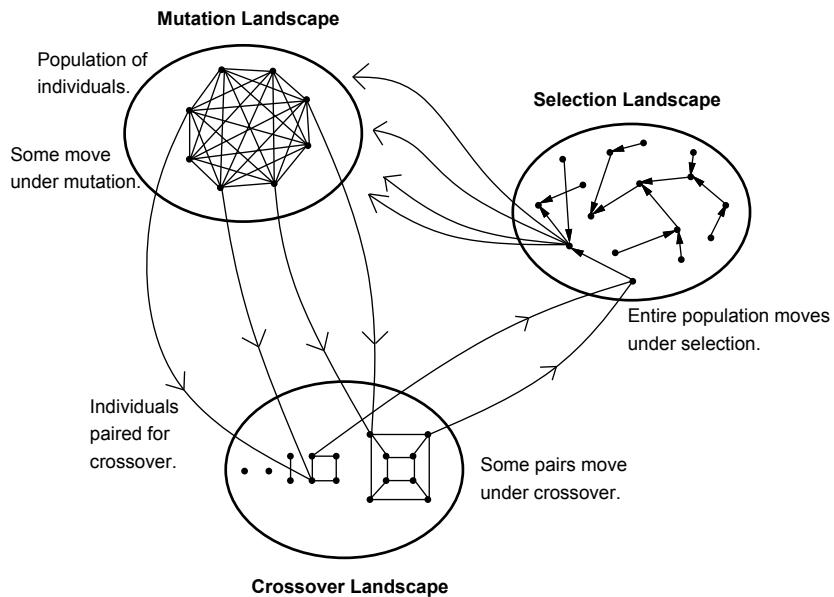
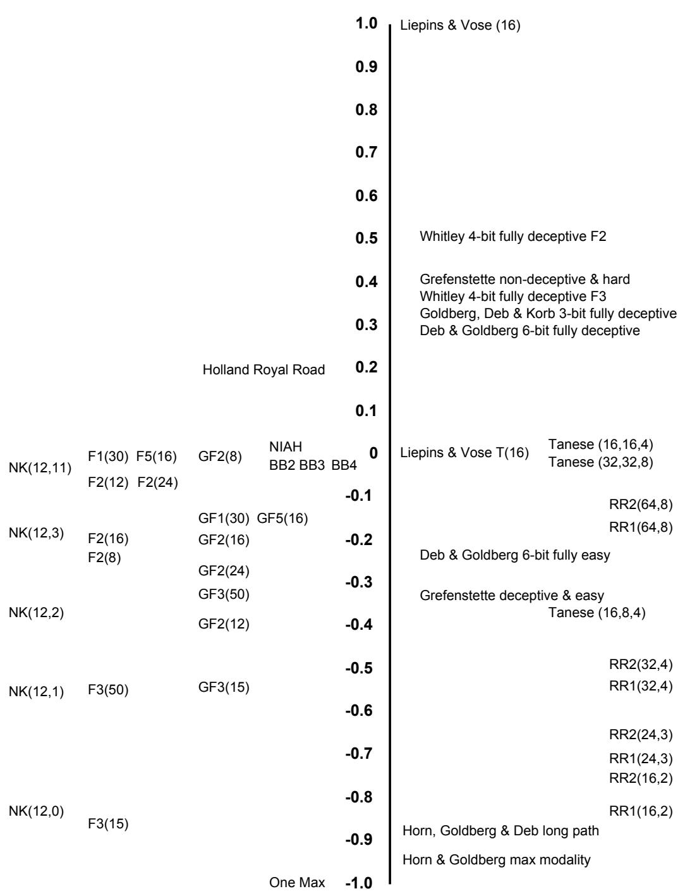
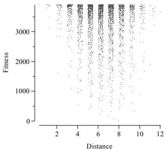
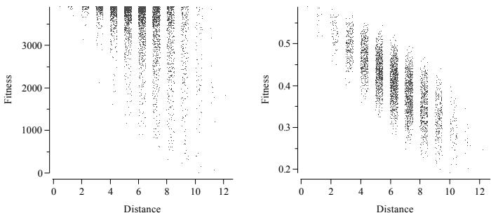
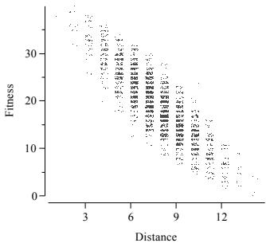
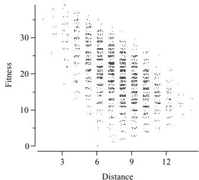
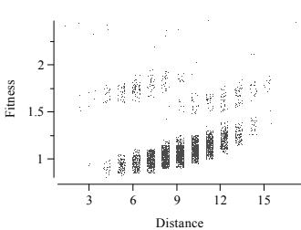

# Genetic Algorithms and Heuristic Search

Terry Jones   
Santa Fe Institute   
1399 Hyde Park Road   
Santa Fe, NM 87501, USA   
terry@santafe.edu

Stephanie Forrest Department of Computer Science University of New Mexico Albuquerque, NM 87131, USA forrest@cs.unm.edu

January 1995

# Abstract

Genetic algorithms (GAs) and heuristic search are shown to be structurally similar. The strength of the correspondence and its practical consequences are demonstrated by considering the relationship between fitness functions in GAs and the heuristic functions of AI. By examining the extent to which fitness functions approximate an AI ideal, a measure of GA search difficulty is defined and applied to previously studied problems. The success of the measure in predicting GA performance (1) illustrates the potential advantages of viewing evolutionary search from a heuristic search perspective and (2) appears to be an important step towards answering a question that has been the subject of much research in the GAs community: what makes search hard (or easy) for a GA?

# 1 Introduction

The primary aim of this paper is to establish a connection between genetic algorithms (GAs) and heuristic search. The foundation of the connection is the close correspondence between the fitness landscapes of GAs and the state spaces of heuristic search. We illustrate the practical consequences of this by studying how the degree to which a GA fitness function approximates an ideal of heuristic search provides a useful indicator of search difficulty for the GA.

Sections 2 and 3 introduce GAs and a formal model of fitness landscapes. Section 4 shows how this model is closely related to state space search, and in section 5, we demonstrate how this connection can be exploited. Subsection 5.1 provides background on an important area of research within GAs, the question of what it is that makes a problem hard (or easy) for a GA; subsection 5.2 presents an overview of a measure of difficulty called "fitness distance correlation" (FDC) that correlates well with observed GA performance; section 5.3 summarizes the results that we have obtained with the FDC measure. The consistent reliability of FDC indicates that we have identified an important aspect of problem difficulty for a GA. The development of the measure resulted directly from thinking of the GA within the framework of heuristic search in a state space.

# 2 Genetic Algorithms

GAs were introduced by Holland [12] as a computational analog of adaptive systems. They are modeled loosely on the principle of evolution via natural selection, employing a population of individuals that undergo selection in the presence of variation-inducing operators such as mutation and recombination (crossover). A fitness function is used to evaluate individuals, and reproductive success varies with fitness. In early implementations, individuals were typically represented by fixed-length binary strings, but other representations are now common, including arrays of floating point numbers, arrays of integers representing permutations, lisp S-expressions, and variable-length overand under-specified strings. Every aspect of Holland's original formulation of GAs has been questioned and modified, and as a result there are many algorithms that can be classed as GAs. In this paper we will concentrate on the performance of a quite standard GA that uses fixed-length strings (not always binary) for individuals. The string representing an individual is often referred to as its genome, locations on the genome are termed loci and the value found at a locus is an allele. Consistent use of terminology based on the biological metaphor, to which the algorithm owes its origin, is common in the field.

The original idea was to create an algorithm which, at least to some extent, modeled the richness seen in adaptive systems. In the original terminology, what has become known as a GA was called a "genetic adaptive plan." Recent attention has focussed largely on the use of GAs for function optimization, and the algorithm has been cast as a search algorithm that attempts only to locate highly fit individuals. This is a significant narrowing of the original vision. For instance, in a GA, the fittest individual in a population is not guaranteed to survive into the next generation and thus an extremely good solution to the fitness function may be discovered and subsequently lost (without being recorded). As a function optimization strategy, this behavior is questionable. Modifications to the GA that are intended to increase its performance as a function optimizer are now in common use; for example, the addition of elitism to avoid losing good individuals [20]. Proposed modifications to the GA are evaluated by their creators and by the GA community almost exclusively in terms of their performance as function optimizers.

# 3 A Model Of Fitness Landscapes

The biological metaphor of a fitness landscape is compelling. However, the increased use of the term has not resulted in a standard definition of what a fitness landscape is. The metaphor originated with the work of Wright in the 1930s [35] and has had a history of ambiguous usage [30]. One of Wright's views of a fitness landscape regards each possible population as a point in a high-dimensional space on a surface of mean population fitness. This is the basic perspective of recent work on GAs using Markov chain analysis [28]. Another view of fitness landscapes, usually less formal, represents each individual as a point in a high-dimensional space (a space of individuals instead of a space of populations). Each of these points is assigned a fitness, an extra dimension, which is visualized as a height. The set of all fitnesses creates a fitness surface. Under the influence of evolution, individuals and their offspring adjust their positions on this surface according to the intensity of selection, the mutation rate and so on. Selection acts to drive populations uphill towards peaks, while mutation produces drift in a population. From a function optimization point of view, the GA can be thought of as trying to locate and scale high peaks on a fitness landscape.

We are concerned with the second of these descriptions. This interpretation has an intuitive appeal, but it is lacking mathematically. In particular, it lacks the fundamental notion that makes all landscape-related terminology sensible. This is a concept of neighborhood. All landscape-related terms, such as "peak," implicitly rely on a knowledge of neighborhood. A point cannot be a peak unless it is higher than its neighboring points. Additional shortcomings are described in the model of landscapes developed in [17]. In that model, a landscape is a directed graph whose edges correspond to the action of an operator (such as mutation or crossover). Vertices correspond to the inputs and outputs of an operator. Thus, if crossover transforms a pair of individuals $( A , B )$ into another pair $( A ^ { \prime } , B ^ { \prime } )$ , then the landscape graph has a directed edge from a vertex representing $( A , B )$ to a vertex representing $( A ^ { \prime } , B ^ { \prime } )$ . The edge is labeled with the probability that crossover produces $( A ^ { \prime } , B ^ { \prime } )$ from $( A , B )$ . Under this model, when an algorithm employs several operators, there are several landscapes. If we consider mutation, crossover and selection to be operators, a GA is making transitions on three landscapes; a mutation landscape, a crossover landscape and a selection landscape. Figure 1 illustrates this process.

If one adopts this model, the difficulties with the current notions of landscapes are removed. The model acknowledges that operators define a neighborhood. Until an operator has been specified, no landscape can exist. We will not be tempted to compare crossover in terms of the mutation landscape, since crossover has its own landscape and the two have nothing to do with each other.1 The model says nothing about dimensionality or distance, making it possible to consider landscapes whose vertices correspond to lisp Sexpressions or permutations of integers. This allows a common framework for genetic programming and other evolutionary algorithms that do not operate on fixed-length bit strings.

  
Fig 1. A simplified view of a GA operating on three landscapes. The landscape graphs are idealizations of far larger structures, and self-loops in the graph, created when an operator does not affect a vertex, have been omitted. The GA is seen as taking steps on the mutation landscape, then pairing individuals (probably according to fitness) thereby forming vertices on the crossover landscape upon which moves are made before the entire population is gathered into a vertex on the selection landscape where a step is taken. Finally, the population is decomposed into individuals which again correspond to vertices on the mutation landscape.

# 4 Genetic Algorithms and Heuristic Search

GAs have generally been regarded as having little connection with heuristic state-space search (see, for example [27]). However, an informative correspondence can be established, which is based on the observation that state spaces and landscapes are both labeled, directed, graphs and that the algorithms move on these graphs while searching. Naturally, there are differences between these algorithms as they operate on their respective graphs. These differences include: (1) The problems addressed by heuristic search commonly specify a starting state and/or a goal state, whereas the problems addressed by GAs rarely do. (2) GAs are typically applied to problems that require only the location of a vertex that satisfies the search whereas heuristic algorithms often require the construction of a path through the graph. (3) GAs are often applied to problems that do not specify how an acceptable solution can be recognized. (4) GAs routinely violate both of the conditions of systematicity given by Pearl [29] (page 16): "Do not leave any stone unturned (unless you are sure there is nothing under it)." and "Do not turn any stone more than once." (5) The graphs searched via heuristic algorithms often have some predefined connectivity determined, for instance, by the mechanical properties of a puzzle. (6) GAs navigate on several graphs, whereas state space search algorithms tend to navigate on a single one.

These differences are important for the consideration of any specific problem, but in a wider view of the process of search, the differences are less important than the underlying similarity of the two processes. The similarities make possible the transfer of knowledge between the fields. Some of these apparent differences are simply the result of terminology. For example, if instead of talking of individuals, fitness functions, landscapes, global optima, and navigation strategies [17], we talk of problem states, heuristic functions, state spaces (or databases), goal states and control strategies, a large part of the mapping from one domain to the other is automatic. Further, it could be argued that heuristic algorithms also process populations in the form of OPEN lists and through explicit manipulation of partial solutions that represent sets of complete solutions (as in branch and bound algorithms). Similarities are also found in the choices that must be made before the algorithms can be used. For example, in both cases we must (1) decide exactly what it is that we consider worth looking at (these objects create vertices in the graphs, (2) consider how to generate new potential solutions from old (this is the choice of operators, which create edges in the graphs)2 and (3) choose a function that attaches labels to vertices that will be used to guide the search. The central claim of this paper is that the similarities between the fields are well worth attending to. The common framework makes it possible to consider one algorithm in light of research done in the other field, the subject of the remainder of this paper.

# 5 Using The Correspondence

We turn now to a demonstration of the usefulness of the correspondence between GAs and heuristic search. We concentrate on the relationship between the fitness function of a GA and the heuristic function used in heuristic search. Both of these functions are used to label the vertices of graphs and the values directly influence the direction of search in their respective algorithms. As there are many theoretical results concerning heuristic functions and relatively few concerning fitness functions, it is natural to ask whether the knowledge developed in the field of heuristic search is applicable to GAs. We will approach this problem by first presenting an overview of a question from the theory of GAs that has arguably received more attention than any other in that field. Then, through considering fitness functions as heuristic functions and asking how good they appear to be, from the perspective of heuristic search, we present a simple and effective measure of search difficulty for a GA.

# 5.1 What Makes A Problem Hard For A GA?

Perhaps more than any other question, research into the foundations of GAs has focussed on identifying factors that influence the ability of the algorithm to solve problems. This has been the explicit agenda of research on deceptive functions [8], some Walsh polynomials [2, 32] and royal road functions [26]. The question is also addressed by those who seek methods of improving the performance of the GA in some way. An example of the latter is consideration of when using a Gray code to represent numeric parameters is more effective than a binary code [3]. These efforts have all produced interesting results, but have not resulted in general theories about what makes a problem difficult. This is not surprising, since the question is hardly a simple one, but we seem far from a good understanding of the factors that make a problem difficult for a GA. This is illustrated by the royal road functions that were recently designed by Mitchell et al. [26]. They constructed two functions, RR1 and RR2. RR2 was very similar to RR1 but contained a "royal road" of building blocks that were expected to lead the GA directly to the solution. The initial idea was to compare how the GA processed these building blocks, combining them to form the complete solution to the problem. RR1 did not contain intermediate-level building blocks and was thus expected to pose far more difficulty to the algorithm. The study did not work out as expected: the GA actually proved slightly better on RR1 than on RR2. As this example illustrates, our understanding of the behavior of GAs is incomplete. In particular, even on very simple, well-understood, and apparently transparent problems, our ideas of difficulty may be far from correct.

Horn and Goldberg [14] recently stated "If we are ever to understand how hard a problem GAs can solve, how quickly, and with what reliability, we must get our hands around what 'hard' is." The study of deceptive functions has resulted in a subsection of the GA community believing that deceptive problems are difficult for the algorithm.3 There have even been claims that deceptive problems are the only difficult problems for the algorithm [4]. Others question the relevance of deception to real-world problems. Grefenstette [11] showed that the existence of deception is neither necessary not sufficient for a problem to be hard for a GA. This prompted qualifications regarding the type of deception that was important, and the degree of deception etc. There currently exist several types of deception and several groups of researchers ranging from those who believe deception is irrelevant to those who believe that little else is.

Another attempt to capture what it is that defines GA difficulty is centered around the notion of "rugged fitness landscapes." At an informal level, it is commonly held that the more rugged a fitness landscape is, the more difficult it is to search. While this statement undoubtedly carries some truth, "ruggedness" is not easily quantified. Additionally, the informal claim breaks down. For example, Horn and Goldberg [14] have constructed a landscape with a provably maximal number of local optima, but the problem is readily solved by a GA. At the other extreme, a relatively smooth landscape may be maximally difficult to search, as in "needle in a haystack" problems. Thus, even before we can define what ruggedness might mean, it is clear that our intuitive notion of ruggedness will not always be reliable as an indicator of difficulty and we can expect that it will be extremely difficult to determine when the measure is reliable. The most successful measure of ruggedness developed to date has been the calculation of "correlation length" by Weinberger [33] which was the basis for the work of Manderick et al. [25].

# 5.2 Fitness Distance Correlation

The correlation between fitness and distance from the nearest point that would satisfy the object of the search is a concept that arises from a simple observation about GA fitness functions. For every search space with a single global optimum, there exists a connected landscape graph, under the definitions found in [17], with a fitness function that makes the landscape unimodal.4 For example, consider the landscape graph whose vertices correspond to permutations of the integers 1 to $n$ , with edges induced by the remove-and-reinsert operator which removes an element from a permutation and inserts it elsewhere. A fitness function that assigned to a permutation the minimal number of remove-and-reinsert operations required to reach the global optimum would make the landscape unimodal. In a sense, this fitness function would be ideal since it would immediately allow polynomial time solution of NP-complete problems such as the Traveling Salesman Problem, via the use of steepest ascent hillclimbing. It naturally follows that we cannot hope to find such fitness functions, but it might be reasonable to expect that the more a fitness function resembles this ideal, the simpler the landscape will be to search.

In GAs, a fitness function is typically regarded as a measure of individual worth in isolation. That is, the fitness of an individual depends only on the individual. In the function described above, this is not the case. The fitness of an individual is completely dependent on its position relative to another individual. The ideal fitness function above is actually providing a distance. This notion of distance is a well-known important property of good heuristic functions. In other words, the type of fitness function we would most like in a GA is exactly what is explicitly sought in an heuristic function. If we assume that the closer our fitness functions approximate the AI ideal the easier GA search will be, and can quantify how well they do this, we have a measure of GA search difficulty. The usefulness of the measure will provide an indication of how realistic the original assumption was. The more the measure is useful, the more evidence we have that the correspondence between GAs and heuristic search is meaningful.

The easiest way to measure the extent to which the fitness function values are correlated with distance to a global optimum is naturally to examine a problem with known optima, take a sample of individuals and compute the correlation coefficient, $r$ , given the set of (fitness, distance) pairs. Clearly, this method requires prior knowledge of the optima of the function, a situation that is unlikely to exist in real-world search functions. However, in the study of difficulty for GAs, researchers have left behind a trail of functions whose optima are known, which we will study here. If we are maximizing some function, we should hope that fitness increases as distance to a global maxima decreases. With an ideal fitness function, $r$ will therefore be $- 1 . 0$ . When minimizing, the ideal fitness function will have $r = 1 . 0$ . In this paper, we will always be maximizing. Given a set $F = \{ f _ { 1 } , f _ { 2 } , \cdot \cdot \cdot , f _ { n } \}$ of $n$ individual fitnesses and a corresponding set $D = \{ d _ { 1 } , d _ { 2 } , \cdot \cdot \cdot , d _ { n } \}$ of the $n$ distances to the nearest global maximum, the correlation coefficient is calculated, in the usual way, as

$$
r = \frac { c _ { F D } } { \sigma _ { F } \sigma _ { D } }
$$

where

$$
c _ { F D } = { \frac { 1 } { n - 1 } } \sum _ { i = 1 } ^ { n } ( f _ { i } - { \overline { { f } } } ) ( d _ { i } - { \overline { { d } } } )
$$

is the covariance of $\mathrm { F }$ and $\mathrm { D }$ , and $\sigma _ { F } , \sigma _ { D } ,$ $\overline { { f } }$ and $\overline { { d } }$ are the standard deviations and means of $F$ and $D$ . Correlation proves to be quite useful in practice, but it is important to remember that it is only a summary statistic and that there can be a strong relationship between fitness and distance that will not be detected by correlation. The scatter plots can sometimes reveal structure that correlation misses.

# 5.3 Summary of Results

We calculated fitness distance correlation (FDC) on a number of well-known functions from the GA literature. A full discussion of these results can be found in [18]. Here we simply present some figures from that paper and give a brief summary of the results. Our initial investigation was designed to give a quick indication of the potential usefulness of FDC by examining as many problems as possible, rather than doing detailed analysis on just a few. We chose to test FDC in three ways: (1) to confirm our knowledge about the behavior of a GA on a number of reasonably well-studied problems, (2) to test whether FDC would have predicted results that at one time seemed surprising, and (3) to investigate whether FDC could detect differences in coding and representation.

  
Fig 2. Summary of results. Horizontal position is merely for grouping, vertical position indicates the value of $r$ . Abbreviation explanations and problem sources are given in Table 1.11

Figure 2 shows the $r$ values for some instances of all the problems that we studied. The vertical axis corresponds to the value of $r$ obtained. Problems that are discussed together in this paper are grouped together on the horizontal axis. An explanation of the abbreviations used in the figure, together with a short description of the problems and their sources can be found in Table 1. Figures 3 to 8 show some example scatter plots of fitness and distance from which $r$ is computed. The plots represent all the points in the space unless a number of samples is mentioned. In these scatter plots a small amount of noise has been added to distances (and in some cases fitnesses) so that identical fitness/distance pairs can be easily identified [22], which in many cases makes it far easier to see the relationship between fitness and distances. This noise was not used in the calculation of $r$ , it is for display purposes only. The table and these figures are taken from [18].

Figure 2 shows that the fully deceptive problems and Holland's royal road function have positive correlation, indicating that they are misleading in the sense that increases in fitness are associated with greater distance from the goal. Grefenstette's non-deceptive but hard function also falls into this group. Easy problems, including Grefenstette's deceptive but simple problem, all receive negative correlation. An exception to this are some of De Jong's functions, in which Hamming cliffs in the encoding create a scatter plot that is not well summarized by correlation, as is seen in Figure 3. FDC shows a nice gradation of NK landscape problems, which is in line with results that show that these landscapes get harder very quickly as $K$ increases [21]. FDC also predicts that the maximally rugged function will be easy, which it is. It could have been used to predict the surprises encountered by GA researchers on the Tanese functions and the royal road functions RR1 and RR2. The one max problem exhibits perfect negative correlation, as would be expected. Some problems have $r \approx 0 . 0$ , such as the needle in a haystack problem, the busy beaver problems and the difficult Tanese functions. These are the problems that are best deserving of the name "hard." All of them are also known to be hard.

FDC also made predictions that led to the discovery of an unknown aspect of the question about the relative worth of Gray coding versus binary coding. Previous work by Caruana and Schaffer on the De Jong functions found some differences between the two codings [3]. FDC suggested that the difference would depend on the number of bits used to encode numeric parameters. This prediction appears true, as we determined experimentally (data not shown). For example, on F2, according to FDC, binary coding will prove better when 8 bits are used, Gray will be better when 12 or 24 bits are used and the codings will be approximately equivalent with 16 bits. FDC also indicated that Gray coding would be significantly better than binary coding on F3, though Caruana and Schaffer had found no significant difference. This was resolved by reducing the resources of the GA to make the global optimum less likely to be discovered. When this was done, the difference predicted by FDC was observed (data not shown).

Table 1. The problems of Figure 2. Where a problem has two sources, the first denotes the original statement of the problem and the second contains the description that was implemented.   

<table><tr><td>Abbreviation</td><td>Problem Description</td><td>Source</td></tr><tr><td>BBk Deb &amp; Goldberg</td><td>Busy Beaver problem with k states. 6-bit fully deceptive and easy functions.</td><td>[31, 19] [5]</td></tr><tr><td>Fk(j)</td><td>De Jong&#x27;s function k with j bits. As above, though Gray coded.</td><td>[20, 9] [20, 9]</td></tr><tr><td>GFk(j) Goldberg, Korb &amp; Deb</td><td></td><td></td></tr><tr><td></td><td>3-bit fully deceptive.</td><td>[10, 34]</td></tr><tr><td>Grefenstette easy</td><td>The deceptive but easy function.</td><td>[11]</td></tr><tr><td>Grefenstette hard</td><td>The non-deceptive but hard function.</td><td>[11]</td></tr><tr><td>Holland royal road</td><td>Holland&#x27;s 240-bit royal road function.</td><td>[13, 16]</td></tr><tr><td>Horn, Goldberg &amp; Deb</td><td>The long path problem with 40 bits.</td><td>[15]</td></tr><tr><td>Horn &amp; Goldberg</td><td>The maximally rugged function with 33 bits.</td><td>[14]</td></tr><tr><td>Liepins &amp; Vose (k)</td><td>Deceptive problem with k bits.</td><td>[23, 24]</td></tr><tr><td>NIAH</td><td>Needle in a haystack.</td><td></td></tr><tr><td>NK(n,k)</td><td>Kauffman&#x27;s NK landscape with N = n, K = k.</td><td>[21]</td></tr><tr><td>One Max</td><td>Maximizing ones in a bit string.</td><td>[1]</td></tr><tr><td>RR(n,k)</td><td>Mitchell et al. n-bit royal road, k-bit blocks.</td><td>[26, 6]</td></tr><tr><td>Tanese (l, n, o)</td><td>l-bit Tanese function of n terms, order o.</td><td>[32, 7]</td></tr><tr><td>Whitley Fk</td><td>4-bit fully deceptive function k.</td><td>[34]</td></tr></table>

  
Fig 3. De Jong's F2 binary coded with 12 bits converted to a maximization problem $\mathbf { \zeta } _ { r } ~ = ~ - 0 . 1 0 )$ . The unusual appearance is due to "cliffs" in the encoding. As a result, there are many high fitness points far from the global optimum.

  
Fig 4. De Jong's F2 Gray Fig 5. An NK landscape coded with 12 bits $r = { }$ with $N ~ = ~ 1 2$ and $K \ = \ 1$ -0.41). $r = - 0 . 7 6 )$ .

  
Fig 6. De Jong's F3 binary coded with 15 bits converted to a maximization problem $\mathit { \Pi } _ { r } ~ = ~ - 0 . 8 6$ , 4000 sampled points).

  
Fig 7. De Jong's F3 Gray coded with 15 bits $\begin{array} { r l r } { r } & { { } = } & { \& } \end{array}$ -0.57, 4000 sampled points).

  
Fig 8. Three copies of Deb Goldberg's fully deceptive 6 bit problem ( $r = 0 . 3 0$ , 4000 sampled points)

# 6 Conclusion

This paper has demonstrated a correspondence between genetic algorithms and heuristic state space search. A formal model of fitness landscapes, upon which genetic algorithms are often described as operating, shows these to be labeled directed graphs. These graphs have much in common with the state spaces in which heuristic search can be described as operating. If the biological motivation and language of genetic algorithms is set aside, it is possible to view both algorithms as searching graphs. This similarity is more than structural, the choices involved are the same in both cases and give rise to the components of these graphs in similar ways. As evidence that the correspondence is meaningful, we investigated how the theory of heuristic functions can be used to assess the worth of fitness functions in the genetic algorithm. This results in a measure of search difficulty for the genetic algorithm that correlates well with our knowledge, and which brings us closer to understanding what it is that makes problems hard (or easy) for that algorithm. In addition, the measure made predictions about previously unknown differences in encoding that proved accurate. These preliminary results indicate the strong potential for fruitful interaction between the fields of heuristic search and genetic algorithms.

# 7 Acknowledgments

This research was supported in part by grants to the Santa Fe Institute, including core funding from the John D. and Catherine T. MacArthur Foundation; the National Science Foundation (PHY-9021427); the U.S. Department of Energy (DE-FG05-88ER25054); the Alfred P. Sloan Foundation (B1992- 46), and by a grant to Forrest from the National Science Foundation (IRI9157644).

# Список литературы

[1] D. H. Ackley. A Connectionist Machine for Genetic Hillclimbing. Kluwer Academic Publishers, Boston, MA, 1987.

[2] A. D. Bethke. Genetic Algorithms as Function Optimizers. PhD thesis, University of Michigan, Ann Arbor, MI, 1981.   
[3] R. A. Caruana and J. D. Schaffer. Representation and hidden bias: Gray vs. binary coding for genetic algorithms. In Fifth International Conference on Machine Learning, pages 153-161, Los Altos, CA, June 1214 1988. Morgan Kaufmann.   
[4] R. Das and L. D. Whitley. The only challenging problems are deceptive: Global search by solving order-1 hyperplanes. In R. K. Belew and L. B. Booker, editors, Proceedings of the Fourth International Conference on Genetic Algorithms, pages 166-173, San Mateo, CA, 1991. Morgan Kaufmann.   
[5] K. Deb and D. E. Goldberg. Sufficient conditions for deceptive and easy binary functions. Technical Report IlliGAL Report No 92001, University of Illinois, Urbana-Champaign, 1992. Available via ftp from gal4.ge.uiuc.edu:pub/papers/IlliGALs/92001.ps.Z. [6] S. Forrest and M. Mitchell. Towards a stronger building-blocks hypothesis: Effects of relative building-block fitness on GA performance. In FOGA-92, Foundations of Genetic Algorithms, pages 109-126, Vail, Colorado, 2629 July 1992.   
[7] S. Forrest and M. Mitchell. What makes a problem hard for a genetic algorithm? Some anomalous results and their explanation. Machine Learning, 13:285319, 1993.   
[8] D. E. Goldberg. Simple genetic algorithms and the minimal, deceptive problem. In L. Davis, editor, Genetic Algorithms and Simulated Annealing, chapter 6, pages 74-88. Pitman (Morgan Kaufmann), London, 1987.   
[9] D. E. Goldberg. Genetic Algorithms in Search, Optimization, and Machine Learning. Addison-Wesley, Reading, MA, 1989.   
[10] D. E. Goldberg, B. Korb, and K. Deb. Messy genetic algorithms: Motivation, analysis and first results. Complex Systems, 4:415444, 1989.   
[11] J. J. Grefenstette. Deception considered harmful. In L. D. Whitley, editor, Foundations of Genetic Algorithms, volume 2, pages 75-91, San Mateo, CA, 1992. Morgan Kaufmann.   
[12] J. H. Holland. Adaptation in Natural and Artificial Systems. University of Michigan Press, Ann Arbor, MI, 1975.   
[13] J. H. Holland. Royal road functions. Internet Genetic Algorithms Digest v7n22. Available via ftp from ftp.santafe.edu:pub/terry/jhrr.tar.gz, Aug 12 1993.   
[14] J. Horn and D. E. Goldberg. Genetic algorithm difficulty and the modality of fitness landscapes. In L. D. Whitley, editor, Foundations of Genetic Algorithms, volume 3, San Mateo, CA, 1994. Morgan Kaufmann. (To appear).   
[15] J. Horn, D. E. Goldberg, and K. Deb. Long path problems. In Y. Davidor, H.-P. Schwefel, and R. Männer, editors, Parallel Problem Solving From Nature - PPSN III, volume 866 of Lecture Notes in Computer Science, pages 149158, Berlin, 1994. Springer-Verlag.   
[16] T. C. Jones. A description of Holland's royal road function. Technical Report 94-11-059, Santa Fe Institute, Santa Fe, NM, December 1994. To appear in Evolutionary Computation. Available via ftp from ftp.santafe.edu:pub/terry/jhrr.tar.gz.   
[17] T. C. Jones. Evolutionary Algorithms, Fitness Landscapes and Search. PhD thesis, University of New Mexico, Albuquerque, NM, March 1995. (expected).   
[18] T. C. Jones and S. Forrest. Fitness distance correlation as a measure of problem difficulty for genetic algorithms. In L. J. Eshelman, editor, Proceedings of the Sixth International Conference on Genetic Algorithms, 1995. (submitted).   
[19] T. C. Jones and G. J. E. Rawlins. Reverse hillclimbing, genetic algorithms and the busy beaver problem. In S. Forrest, editor, Genetic Algorithms: Proceedings of the Fifth International Conference (ICGA 1993), pages 70-75, San Mateo, CA, 1993. Morgan Kaufmann.   
[20] K. A. De Jong. An Analysis of the Behavior of a Class of Genetic Adaptive Systems. PhD thesis, University of Michigan, 1975. Dissertation Abstracts International 36(10), 5410B. (University Microfilms No. 769381).   
[21] S. A. Kauffman. Adaptation on rugged fitness landscapes. In D. Stein, editor, Lectures in the Sciences of Complexity, volume 1, pages 527- 618. Santa Fe Institute Studies in the Sciences of Complexity, AddisonWesley Longman, 1989.   
[22] D. Lane, 1994. Personal communication.   
[23] G. Liepins and M. D. Vose. Representational issues in genetic optimization. Journal of Experimental and Theoretical Artificial Intelligence, 2:101115, 1990.   
[24] G. Liepins and M. D. Vose. Deceptiveness and genetic algorithm dynamics. In G. J. E. Rawlins, editor, Foundations of Genetic Algorithms, volume 1, pages 3650, San Mateo, CA, July 1518 1991. Morgan Kaufmann.   
[25] B. Manderick, M. De Weger, and P. Spiessens. The genetic algorithm and the structure of the fitness landscape. In R. K. Belew and L. B. Booker, editors, Proceedings of the Fourth International Conference on Genetic Algorithms, pages 143-150, San Mateo, CA, 1991. Morgan Kaufmann.   
[26] M. Mitchell, S. Forrest, and J. H. Holland. The royal road for genetic algorithms: Fitness landscapes and GA performance. In F. J. Varela and P. Bourgine, editors, Proceedings of the First European Conference on Artificial Life. Toward a Practice of Autonomous Systems, pages 245254, Cambridge, MA, 1113 Dec 1992. MIT Press.   
[27] N. J. Nilsson and D. Rumelhart. Approaches to Artificial Intelligence. Technical Report 93-08-052, Santa Fe Institute, Santa Fe, NM, 1993. Summary of workshop held November 6-9, 1992. Available via ftp from ftp.santafe.edu:pub/Users/mm/approaches/approaches.ps.   
[28] A. Nix and M. D. Vose. Modeling genetic algorithms with markov chains. Annals of Mathematics and Artificial Intelligence, 5:79-88, 1992.   
[29] J. Pearl. Heuristics: Intelligent Search Strategies for Computer Problem Solving. Addison-Wesley, Reading, MA, 1984.   
[30] W. B. Provine. Sewall Wright and Evolutionary Biology. University of Chicago Press, Chicago IL., 1986.   
[31] T. Rado. On non-computable functions. Bell System Technical Journal, 41:877884, 1962.   
[32] R. Tanese. Distributed Genetic Algorithms for Function Optimization. PhD thesis, University of Michigan, Ann Arbor, MI, 1989.   
[33] E. D. Weinberger. Correlated and uncorrelated fitness landscapes and how to tell the difference. Biological Cybernetics, 63:325336, 1990.   
[34] L. D. Whitley. Fundamental principles of deception in genetic search. In G. J. E. Rawlins, editor, Foundations of Genetic Algorithms, volume 1, pages 221-241, San Mateo, CA, July 1518 1991. Morgan Kaufmann.   
[35] S. Wright. The roles of mutation, inbreeding, crossbreeding and selection in evolution. In Proceedings of the sixth international congress of genetics, volume 1, pages 356366, 1932.