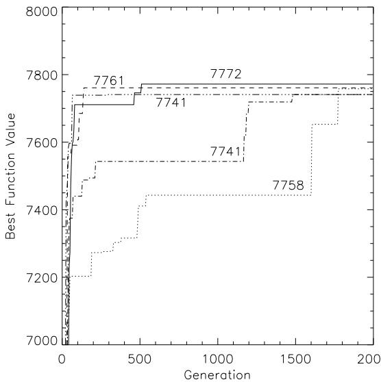

[2] Th. Back. ¨ The interaction of mutation rate, selection, and self-adaptation within a genetic algorithm. In Manner ¨ and Manderick [19], pages 85–94.   
[3] E. Balas and E. Zemel. An algorithm for large zero-one knapsack problems. Operations Research, 28:1130–1154, 1980.   
[4] J. E. Beasley. OR-Library: Distributing Test Problems by Electronic Mail. Journal of Operational Research Society, 41(11):1069–1072, 1990.   
[5] R. K. Belew and L. B. Booker, editors. Proceedings of the 4th International Conference on Genetic Algorithms. Morgan Kaufmann Publishers, San Mateo, CA, 1991.   
[6] L. Davis, editor. Handbook of Genetic Algorithms. Van Nostrand Reinhold, New York, 1991.   
[7] L. J. Eshelman, R. A. Caruna, and J. D. Schaffer. Biases in the crossover landscape. In Schaffer [28], pages 10–19.   
[8] D. B. Fogel. Evolving Artificial Intelligence. PhD thesis, University of California, San Diego, CA, 1992.   
[9] L. J. Fogel, A. J. Owens, and M. J. Walsh. Artificial Intelligence through Simulated Evolution. Wiley, New York, 1966.   
[10] S. Forrest, editor. Proceedings of the 5th International Conferenceon Genetic Algorithms. Morgan Kaufmann Publishers, San Mateo, CA, 1993.   
[11] A. Frevile ´ and G. Plateau. Hard 0-1 multiknapsack testproblems for size reduction methods. Investigation´ Operativa, 1:251–270, 1990.   
[12] M. R. Garey and D. S. Johnson. Computers and Intractability: A Guide to the Theory of NP-Completeness. W. H. Freeman and Company, San Fransisco, 1979.   
[13] D. E. Goldberg. Genetic algorithms in search, optimization and machine learning. Addison Wesley, Reading, MA, 1989.   
[14] J. J. Grefenstette. Optimization of control parameters for genetic algorithms. IEEE Transactions on Systems, Man and Cybernetics, SMC–16(1):122–128, 1986.   
[15] J. J. Grefenstette. A User’s Guide to GENESIS. Navy Center for Applied Research in Artificial Intelligence, Washington, D. C., 1987.   
[16] J. H. Holland. Adaptation in natural and artificial systems. The University of Michigan Press, Ann Arbor, MI, 1975.   
[17] K. A. De Jong. An analysis of the behaviour of a class of genetic adaptive systems. PhD thesis, University of Michigan, 1975. Diss. Abstr. Int. 36(10), 5140B, University Microfilms No. 76–9381.   
[18] Sami Khuri and A¨ıda Batarekh. Heuristics for the Integer Knapsack Problem. In Proceedings of the Xth International Computer Science Conference, Santiago, Chile, pages 161– 172, 1990.   
[19] R. Manner ¨ and B. Manderick, editors. Parallel Problem Solving from Nature 2. Elsevier, Amsterdam, 1992.   
[20] S. Martello and P. Toth. Knapsack Problems: Algorithms and Computer Implementations. John Wiley & Sons, Chichester, West Sussex, England, 1990.   
[21] B. M. E. Moret and H. D. Shapiro. Algorithms from $P$ to NP, Volume 1: Design and Efficiency. Benjamin Cummings, Menlo Park, CA, 1991.   
[22] H. Muhlenbein. ¨ How genetic algorithms really work: I. mutation and hillclimbing. In Manner ¨ and Manderick [19], pages 15–25.   
[23] C. H. Papadimitriou and K. Steiglitz. Combinatorial Optimization: Algorithms and Complexity. Prentice-Hall, Inc., Englewood Cliffs, New Jersey, 1982.   
[24] C. C. Petersen. Computational experience with variants of the balas algorithm applied to the selection of r & d projects. Management Science, 13:736–750, 1967.   
[25] G. Plateau and M. Elkihel. A hybrid algorithm for the 0-1 knapsack problem. Methods of Operations Research, 49:277– 293, 1985.   
[26] I. Rechenberg. Evolutionsstrategie: Optimierung technischer Systeme nach Prinzipien der biologischen Evolution. Frommann–Holzboog, Stuttgart, 1973.   
[27] J. T. Richardson, M. R. Palmer, G. Liepins, and M. Hilliard. Some guidelines for genetic algorithms with penalty functions. In Schaffer [28], pages 191–197.   
[28] J. D. Schaffer, editor. Proceedings of the 3rd International Conference on Genetic Algorithms. Morgan Kaufmann Publishers, San Mateo, CA, 1989.   
[29] H.-P. Schwefel. NumericalOptimization of Computer Models. Wiley, Chichester, 1981.   
[30] H.-P. Schwefel and R. Manner ¨ , editors. Parallel Problem Solving from Nature — Proceedings 1st Workshop PPSN I, volume 496 of Lecture Notes in Computer Science. Springer, Berlin, 1991.   
[31] S. Senyu and Y. Toyoda. An approach to linear programming with 0-1 variables. Management Science, 15:B196–B207, 1967.   
[32] A. E. Smith and D. M. Tate. Genetic optimization using a penalty function. In Forrest [10], pages 499–505.   
[33] W. M. Spears, K. A. De Jong, Th. Back, ¨ D. B. Fogel, and H. de Garis. An overview of evolutionary computation. In P. B. Brazdil, editor, Machine Learning: ECML-93, volume 667 of LectureNotes in Artificial Intelligence, pages 442–459. Springer, Berlin, 1993.   
[34] D. R. Stinson. An Introduction to the Design and Analysis of Algorithms. The Charles BabbageResearchCenter, Winnipeg, Manitoba, Canada, 2nd edition, 1987.   
[35] G. Syswerda. Uniform crossover in genetic algorithms. In Schaffer [28], pages 2–9.   
[36] H. M. Weingartner and D. N. Ness. Methods for the solution of the multi-dimensional 0/1 knapsack problem. Operations Research, 15:83–103, 1967.

  
Figure 1: Some representative courses of evolution for the multiple knapsack problems (using the “sento1- ${ \it 6 0 ^ { \circ } }$ example).

strings with “knap $1 0 5 ^ { \circ }$ are processed.

As both tables clearly demonstrate, the genetic algorithm is able to localize the global optimum point exactly for all but one of the test problems. The exception is given by the problem “weing7-105”, for which all runs get stuck before finding the optimal solution. The average fitness value over all runs turns out to be reasonably close to the global optimum in case of all test problems. This result indicates that genetic algorithms may serve as a fast and robust approximation heuristic for these problems.

In case of the “weing8- $1 0 5 ^ { \circ }$ problem a biased random initialization ofthe population as indicated in Section 1 is used such that the probability to generate a zero bit is 0.95. This simple but elegant solution makes the problem more amenable to our genetic algorithm approach.

A closer look at the course ofsome of the experimental runs is provided by Figure 1 for the “sento1-60” problem. The graph shows the best fitness values that occurred in the population over the number of generations for five different runs. The ordinate axis is restricted to a small range of values in order to give a clearer picture of the difference between these runs, each of which is labeled by its final solution quality.

As a general observation, we remark that by far most progress is achieved during the first 200 generations, followed by stagnation periods with further improvements occurring only occasionally. The first phase reflects the exploitation of the initial genotypic diversity by recombination while the second one characterizes a mainly mutation-based search. This observation is in agreement with the use of hybrid genetic algorithms and local optimization methods, where the former is used to produce solutions that are used as starting points for local optimization (see e.g. [13], pp. 202–203).

# Conclusions

We have shown how genetic algorithms can be used as heuristics to find good solutions for an NP-complete problem, namely the $_ { 0 / 1 }$ multiple knapsack problem. Our approach differs in more than one way to previous GA-based techniques. In theory, the genetic algorithm’s building block proceeds by combining partial information from all elements ofthe population. Our implementation allows infeasibly bred strings to participate in the search since they do contribute information. Rather than augmenting the genetic algorithm with domain-specific knowledge, we introduce a simple fitness function that uses a graded penalty term. Our positive results support the idea that this is a desirable approach for tackling highly constrained NP-complete problems such as the $_ { 0 / 1 }$ multiple knapsack problem. We also believe in the potential hybridization of genetic algorithms with local search techniques.

# Acknowledgments

The first author would like to thank A¨ıda Batarekh for the many discussions they have had on genetic algorithms and optimization. The second author gratefully acknowledges support by the DFG (Deutsche Forschungsgemeinschaft), grant Schw 361/5-2.

# Author’s Affiliations

Sami Khuri is with the Department of Mathematics & Computer Science, San Jose´ State University, One Washington Square, San Jose,´ CA 95192-0103, U.S.A. khuri@sjsumcs.sjsu.edu

Thomas Back¨ and Jor¨ g Heitkotter¨ are with the Systems Analysis Research Group, LSXI, Computer Science Department, University of Dortmund, D–44221 Dortmund, Germany. baeck,joke  @ls11.informatik.uni-dortmund.de

# References

[1] Th. Back. ¨ GENEsYs 1.0. Software distribution and installation notes, Systems Analysis Research Group, LSXI, Department of Computer Science, University of Dortmund, Germany, July 1992. (Available via anonymous ftp to lumpi.informatik.uni-dortmund.de as file GENEsYs-1.0.tar.Z in /pub/GA/src).

<table><tr><td rowspan=1 colspan=2>knap15</td><td rowspan=1 colspan=2>knap20</td><td rowspan=1 colspan=2>knap28</td><td rowspan=1 colspan=2>knap39</td><td rowspan=1 colspan=2>knap50</td></tr><tr><td rowspan=1 colspan=2>n = 15, m = 10</td><td rowspan=1 colspan=2>n = 20, m = 10</td><td rowspan=1 colspan=2>n = 28, m = 10</td><td rowspan=1 colspan=2>n=39,m= 5</td><td rowspan=1 colspan=2>n = 50, m = 5</td></tr><tr><td rowspan=1 colspan=1>5.103(x)</td><td rowspan=1 colspan=1>N</td><td rowspan=1 colspan=1>f104(x)</td><td rowspan=1 colspan=1>N</td><td rowspan=1 colspan=1>f5.104(x)</td><td rowspan=1 colspan=1>N</td><td rowspan=1 colspan=1>f105(x)</td><td rowspan=1 colspan=1>N</td><td rowspan=1 colspan=1>f105s(x)</td><td rowspan=1 colspan=1>N</td></tr><tr><td rowspan=1 colspan=1>4015</td><td rowspan=1 colspan=1>83</td><td rowspan=1 colspan=1>6120</td><td rowspan=1 colspan=1>33</td><td rowspan=1 colspan=1>12400</td><td rowspan=1 colspan=1>33</td><td rowspan=1 colspan=1>10618</td><td rowspan=1 colspan=1>4</td><td rowspan=1 colspan=1>16537</td><td rowspan=1 colspan=1>1</td></tr><tr><td rowspan=10 colspan=1>40053955</td><td rowspan=10 colspan=1>161</td><td rowspan=10 colspan=1>611061006090606060506040</td><td rowspan=1 colspan=1>20</td><td rowspan=1 colspan=1>12390</td><td rowspan=1 colspan=1>30</td><td rowspan=1 colspan=1>10605</td><td rowspan=1 colspan=1>1</td><td rowspan=1 colspan=1>16524</td><td rowspan=1 colspan=1>1</td></tr><tr><td rowspan=1 colspan=1>29</td><td rowspan=1 colspan=1>12380</td><td rowspan=1 colspan=1>10</td><td rowspan=1 colspan=1>10604</td><td rowspan=1 colspan=1>8</td><td rowspan=1 colspan=1>16519</td><td rowspan=1 colspan=1>2</td></tr><tr><td rowspan=1 colspan=1>11</td><td rowspan=1 colspan=1>12370</td><td rowspan=1 colspan=1>1</td><td rowspan=1 colspan=1>10601</td><td rowspan=1 colspan=1>1</td><td rowspan=1 colspan=1>16518</td><td rowspan=1 colspan=1>5</td></tr><tr><td rowspan=1 colspan=1>3</td><td rowspan=1 colspan=1>12360</td><td rowspan=1 colspan=1>19</td><td rowspan=1 colspan=1>10588</td><td rowspan=1 colspan=1>5</td><td rowspan=1 colspan=1>16499</td><td rowspan=1 colspan=1>1</td></tr><tr><td rowspan=6 colspan=1>13</td><td rowspan=6 colspan=1>123301196011950</td><td rowspan=2 colspan=1>51</td><td rowspan=1 colspan=1>10585</td><td rowspan=1 colspan=1>5</td><td rowspan=1 colspan=1>16499</td><td rowspan=1 colspan=1>1</td></tr><tr><td rowspan=1 colspan=1>10582</td><td rowspan=1 colspan=1>1</td><td rowspan=1 colspan=1>16494</td><td rowspan=1 colspan=1>1</td></tr><tr><td rowspan=1 colspan=1>1</td><td rowspan=1 colspan=1>10581</td><td rowspan=1 colspan=1>2</td><td rowspan=1 colspan=1>16473</td><td rowspan=1 colspan=1>1</td></tr><tr><td rowspan=3 colspan=1></td><td rowspan=1 colspan=1>10570</td><td rowspan=1 colspan=1>6</td><td rowspan=1 colspan=1>16472</td><td rowspan=1 colspan=1>1</td></tr><tr><td rowspan=1 colspan=1>10568</td><td rowspan=1 colspan=1>2</td><td rowspan=1 colspan=1>16467</td><td rowspan=1 colspan=1>1</td></tr><tr><td rowspan=1 colspan=1>10561</td><td rowspan=1 colspan=1>1</td><td rowspan=1 colspan=1>16463</td><td rowspan=1 colspan=1>1</td></tr><tr><td rowspan=1 colspan=2> = 4012.7</td><td rowspan=1 colspan=2>f = 6102.3</td><td rowspan=1 colspan=2> = 12374.7</td><td rowspan=1 colspan=2> = 10536.9</td><td rowspan=1 colspan=2> = 16378.0</td></tr></table>

Table 1: Experimental results for the test problems “knap15”, “knap20”, “knap28”, “knap $3 9 ^ { , }$ , and “knap50” obtained by the genetic algorithm.

<table><tr><td rowspan=1 colspan=2>sento1-60</td><td rowspan=1 colspan=2>sento2-60</td><td rowspan=1 colspan=2>weing7-105</td><td rowspan=1 colspan=2>weing8-105</td></tr><tr><td rowspan=1 colspan=2>n = 60, m = 30</td><td rowspan=1 colspan=2>n = 60, m = 30</td><td rowspan=1 colspan=2>n = 105, m = 2</td><td rowspan=1 colspan=2>n = 105, m = 2</td></tr><tr><td rowspan=1 colspan=1>f10s(x)</td><td rowspan=1 colspan=1>N</td><td rowspan=1 colspan=1>f1os(x)</td><td rowspan=1 colspan=1>N</td><td rowspan=1 colspan=1>f2.10s(x)</td><td rowspan=1 colspan=1>N</td><td rowspan=1 colspan=1>f2.105 (x)</td><td rowspan=1 colspan=1>N</td></tr><tr><td rowspan=1 colspan=1>7772</td><td rowspan=1 colspan=1>5</td><td rowspan=1 colspan=1>8722</td><td rowspan=1 colspan=1>2</td><td rowspan=1 colspan=1>1095445</td><td rowspan=1 colspan=1>—</td><td rowspan=1 colspan=1>624319</td><td rowspan=1 colspan=1>6</td></tr><tr><td rowspan=2 colspan=1>77617758</td><td rowspan=1 colspan=1>4</td><td rowspan=1 colspan=1>8721</td><td rowspan=1 colspan=1>1</td><td rowspan=1 colspan=1>1095382</td><td rowspan=1 colspan=1>10</td><td rowspan=2 colspan=1>623932623612</td><td rowspan=2 colspan=1>11</td></tr><tr><td rowspan=1 colspan=1>11</td><td rowspan=1 colspan=1>8720</td><td rowspan=1 colspan=1>2</td><td rowspan=1 colspan=1>1095357</td><td rowspan=1 colspan=1>3</td></tr><tr><td rowspan=1 colspan=1>7741</td><td rowspan=1 colspan=1>7</td><td rowspan=1 colspan=1>8715</td><td rowspan=1 colspan=1>1</td><td rowspan=1 colspan=1>1095266</td><td rowspan=1 colspan=1>1</td><td rowspan=1 colspan=1>622376</td><td rowspan=1 colspan=1>1</td></tr><tr><td rowspan=1 colspan=1>7739</td><td rowspan=1 colspan=1>1</td><td rowspan=1 colspan=1>8713</td><td rowspan=1 colspan=1>1</td><td rowspan=1 colspan=1>1095264</td><td rowspan=1 colspan=1>9</td><td rowspan=1 colspan=1>621086</td><td rowspan=1 colspan=1>2</td></tr><tr><td rowspan=1 colspan=1>7738</td><td rowspan=1 colspan=1>3</td><td rowspan=1 colspan=1>8711</td><td rowspan=1 colspan=1>19</td><td rowspan=1 colspan=1>1095206</td><td rowspan=1 colspan=1>3</td><td rowspan=1 colspan=1>620872</td><td rowspan=1 colspan=1>5</td></tr><tr><td rowspan=1 colspan=1>7725</td><td rowspan=1 colspan=1>1</td><td rowspan=1 colspan=1>8709</td><td rowspan=1 colspan=1>1</td><td rowspan=1 colspan=1>1095157</td><td rowspan=1 colspan=1>2</td><td rowspan=1 colspan=1>620060</td><td rowspan=1 colspan=1>4</td></tr><tr><td rowspan=1 colspan=1>7719</td><td rowspan=1 colspan=1>1</td><td rowspan=1 colspan=1>8708</td><td rowspan=1 colspan=1>7</td><td rowspan=1 colspan=1>1095081</td><td rowspan=1 colspan=1>1</td><td rowspan=1 colspan=1>619766</td><td rowspan=1 colspan=1>6</td></tr><tr><td rowspan=1 colspan=1>7715</td><td rowspan=1 colspan=1>1</td><td rowspan=1 colspan=1>8704</td><td rowspan=1 colspan=1>3</td><td rowspan=1 colspan=1>1095065</td><td rowspan=1 colspan=1>2</td><td rowspan=1 colspan=1>619568</td><td rowspan=1 colspan=1>1</td></tr><tr><td rowspan=1 colspan=1>7711</td><td rowspan=1 colspan=1>2</td><td rowspan=1 colspan=1>8703</td><td rowspan=1 colspan=1>2</td><td rowspan=1 colspan=1>1095035</td><td rowspan=1 colspan=1>8</td><td rowspan=1 colspan=1>619413</td><td rowspan=1 colspan=1>1</td></tr><tr><td rowspan=1 colspan=1>7706</td><td rowspan=1 colspan=1>1</td><td rowspan=1 colspan=1>8701</td><td rowspan=1 colspan=1>3</td><td rowspan=1 colspan=1>1094965</td><td rowspan=1 colspan=1>1</td><td rowspan=1 colspan=1>618540</td><td rowspan=1 colspan=1>1</td></tr><tr><td rowspan=1 colspan=2>\f = 7626</td><td rowspan=1 colspan=2>f = 8685</td><td rowspan=1 colspan=2>f = 1093897</td><td rowspan=1 colspan=2>f = 613383</td></tr></table>

Table 2: Experimental results for the test problems “sento1- ${ \boldsymbol { \cdot } } 6 0 ^ { \boldsymbol { \cdot } }$ , “sento2- $- 6 0 ^ { \circ }$ , “weing7- $1 0 5 ^ { \mathrm { { \circ } } }$ , and “weing8-105” obtained by the genetic algorithm.

yield the optimum solution of 6120 with “knap $2 0 ^ { \circ }$ , while 20 runs produce 6110, and so on. Only the eleven best results are tabulated. So for “knap39” and “knap $5 0 ^ { \circ }$ of Table 1, the number of runs do not add up to 100 since some runs produce solutions under 10561, and 16463, respectively. The index in $f _ { t } ( \vec { x } )$ represents the total number of strings processed; i.e., the value of $t$ is the product of the number of individuals per generation and the number of generations per run. Only an extremely small percentage of the $2 ^ { n }$ points in the search space is processed by the genetic algorithm. For instance, with “knap ${ } ^ { 1 2 8 ^ { , 3 } }$ , $n = 2 8$ , $t = 5 . 1 0 ^ { 4 }$ and thus only $0 . 0 1 8 \%$ of "! #! \$the search space is explored, and only $4 . 9 \cdot 1 0 ^ { - 2 5 \% }$ of the otherwise it is not. In other words, every string ${ \vec { x } } \in \{ 0 , 1 \}$ is a potential solution.

We remark that a string might represent an infeasible solution. A vector ${ \vec { x } } = \left( x _ { 1 } , x _ { 2 } , \ldots , x _ { n } \right)$ that overfills at least one of  !     \$ \$\$ the knapsacks; i.e., for which $\sum _ { i = 1 } ^ { n } w _ { i j } x _ { i } > c _ { j }$ for some $1 \leq j \leq m$ 	 is an infeasible string.

Rather than discarding infeasible strings and ignoring infeasible regions of the search space, we subscribe to Richardson et al.’s philosophy [27], and allow infeasibly bred strings to join the population. The infeasible string’s strength relative to the other strings in the population is reduced by adding a penalty term to its fitness. We also believe in the inequality of infeasible strings. The farther away from feasibility the string is, the higher its penalty term should be.

Taking all of the above observations into consideration, we have the following fitness function to be maximized:

$$
\begin{array} { l l l } { f ( \vec { x } ) } & { = } & { \displaystyle \sum _ { i = 1 } ^ { n } p _ { i } x _ { i } - s \cdot \mathsf { m a x } \{ p _ { i } \} } \end{array}
$$

where $s = | \{ j \ | \ \sum _ { i = 1 } ^ { n } w _ { i j } x _ { i } > c _ { j } \ \} |$ . In other words, $s$ $( 0 \leq s \leq n )$ ! " 
  
# \$  ) denotes the number of overfilled knapsacks.

   The fitness function uses a graded penalty term, $\operatorname* { m a x } \{ p _ { i } \}$ .   The number of times this term contributes to the weakening of the infeasible string’s fitness is equal to the number of overfilled knapsacks it produces.

We use GENEsYs with the above fitness function and several test problems. We report all the experimental results in the next section. The multiple knapsack problem is a highly constrained problem. Thus, significant portions of the search space of some of the problem instances reported in the section on “Experimental Results” are infeasible regions. This situation is particularly true with test problem “weing8-105” [11] which is used therein. The problem instance consists of 105 objects and two knapsacks. This is quite a challenging problem since the feasible regions in the search space are extremely sparse.

Due to the high weight values with respect to the knapsack capacities, most of the $2 ^ { 1 0 5 }$ strings represent infeasible solutions. We are thus faced with a situation where every randomly generated string in the initial population might produce an overfilled knapsack. To handle such extreme cases, we encourage checking the initial population to see if it consists of only infeasible strings.

We have also incorporated a flag in the program whose sole purpose is to signal the feasibility of the final solution. Thus, if after several runs on the same problem instance, the flag consistently indicates an infeasible string, or if the initial population is overcrowded with infeasible strings, as was the case with our problem mentioned in the preceding paragraph, we suggest to undertake one of the following actions:

Bias the random number generater so as to produce strings in which the number of zeros is greater than the number of ones. If the output of several runs is still an infeasible string, or if the initial population is still highly skewed towards infeasible strings, then bias the random number generator in the opposite direction: let it produce more ones than zeros.

Use some other heuristic, such as the greedy one, to generate a solution. Include in the initial generation strings that are minor variations ofthe solution obtained by the greedy technique. This technique, coined iterative improvement algorithm by Moret [21], has been quite successful with other combinatorial optimization problems.

We would like to point out that by giving the above suggestions we are not stating that these are the only situations that produce infeasible strings. The fitness function, for example, should also be considered as a possible reason for having infeasible strings in the output. It might have a very mild penalty incapable of pressuring the search towards feasible regions.

In the next section, we give a report on our various experimental runs.

# Experimental Results

The experimental runs reported here are performed by using a genetic algorithm with a population size of $\mu = 5 0$ , a mutation rate $p _ { m } = 1 / n$ , crossover rate $p _ { c } = 0 . 6$ ! , propor! )  ! \$tional selection, and a one-point crossover operator. In order (' +\*to become applicable to the multiple knapsack problem, no component of this general genetic algorithm — except, of course, the fitness function — has to be modified. This fact reflects the wide applicability and robustness of such algorithms and establishes one of the main advantages when compared to problem-specific heuristics.

The genetic algorithm is evaluated on nine test problems which are taken from the literature. The problem sizes range from 15 objects to 105 and from 2 to 30 knapsacks. All problems and their sizes (in terms of $n$ and $m$ ) are indicated in tables 1 and 2. Problems “knap $1 5 ^ { \circ }$ , “knap $2 0 ^ { \circ }$ , ... ,“knap $5 0 ^ { \circ }$ are originally due to Petersen [24], “sento1- ${ \bf \nabla } \cdot 6 0 ^ { \circ }$ and “sento2- $6 0 ^ { \circ }$ were introduced by Senyu and Toyoda [31], and “weing7- $1 0 5 ^ { \circ }$ and “weing8- $1 0 5 ^ { \circ }$ stem from Weingartner and Ness [36]. A collection of all these problems is available from the OR-library by Beasley [4].

For each test problem, a total of $N = 1 0 0$ runs are produced. , !The solutions of most runs, with their frequencies are found in tables 1 and 2. The value in the first data row of the tables corresponds to the global optimum, and the average final best fitness value $f$ over all 100 runs is shown for each experiment at the bottom of the tables. For example, 33 runs notes the population size). This selection operator is called proportional selection. If the problem under consideration is a minimization one, or if the fitness function can take negative values, then $f ( \vec { x } _ { i } )$ has to be linearly transformed before calculating selection probabilities. This technique known as linear dynamic scaling is commonly used in genetic algorithms (see [13], pp. 123–124, or [14]).

For the experiments reported in Section 3 the genetic algorithm software package GENEsYs is used [1]. It is based on the widely used GENESIS software by Grefenstette (see [15], and [6], pp. 374–377), but allows for more flexibility concerning genetic operators and data monitoring facilities. The parameter settings for our experiments are summarized in the third section, where the experimental results are presented. First, however, the next section provides an introduction to the multiple knapsack problem.

# The 0/1 Multiple Knapsack Problem

Due to the different terminology used by researchers concerning knapsack problems in general, and our problem in particular, we would like to give a few references in which our knapsack version is studied but under other names. The problem we study here is a generalization of the $_ { 0 / 1 }$ simple knapsack problem. In the simple version, we are given a knapsack of capacity $C$ , and $n$ objects. Each object has a weight $w _ { i }$ , and a profit $p _ { i }$ . We are interested in filling the knapsack with the objects that yield the maximum profit. In other words, we would like to find a vector ${ \vec { x } } = \left( x _ { 1 } , x _ { 2 } , \ldots , x _ { n } \right)$ where $x _ { i } \in \{ 0 , 1 \}$ , such that $\sum _ { i = 1 } ^ { n } w _ { i } x _ { i } \leq C$    \$\$ \$     and for which: $\begin{array} { r } { P ( \vec { x } ) = \sum _ { i = 1 } ^ { n } p _ { i } x _ { i } } \end{array}$ 	 
     is maximum. Each object is either placed in all $m$ 	   knapsacks, or in none at all. This problem is also known as the single-line integer programming problem [23], and has been studied in the context of genetic algorithms (see e.g. [18]). It is an NP-complete problem. The partition problem can be polynomially transformed into it [12].

The $_ { 0 / 1 }$ multiple knapsack problem consists of $m$ knapsacks of capacities $c _ { 1 } , c _ { 2 } , \ldots , c _ { m }$ and $n$ objects, each of which has a profit $p _ { i }$    \$\$ \$   . Unlike the simple version in which the weights 'of the objects are fixed, the weight of the $i ^ { t h }$ object in the multiple knapsack problem takes $j$ values, $1 ~ \leq ~ j ~ \leq ~ m$ . The $i ^ { t h }$ object weighs $w _ { i j }$     when it is considered for possible inclusion in the $j ^ { t h }$  knapsack of capacity $c _ { j }$ . Once more, we are interested in finding a vector ${ \vec { x } } = \left( x _ { 1 } , x _ { 2 } , \ldots , x _ { n } \right)$ that  !  guarantees that no knapsack is overfilled: $\textstyle \sum _ { i = 1 } ^ { n } w _ { i j } x _ { i } \ \leq$ $c _ { j }$ for $j = 1 , 2 , \dots , n$ 	 
   , and that yields the maximum profit $\begin{array} { r } { P ( \vec { x } ) = \sum _ { i = 1 } ^ { n } x _ { i } p _ { i } } \end{array}$    . This problem is also known as the zero ! 	  one integer programming problem [12], and as the 0-1 linear programming problem [20].

We also note that it can be thought as a resource allocation problem, where we have $m$ resources (the knapsacks) and $n$ objects. Each resource has its own budget (knapsack capacity), and $w _ { i j }$ represents the consumption of resource $j$ by object $i$   . Once more, we are interested in maximizing the profit, while working within a certain budget.

The popularity of knapsack problems stems from the fact that it has attracted researchers from both camps; the theoreticians as well as the practicians [20]. Theoreticians enjoy the fact that these simple structured problems can be used as subproblems to solve more complicated ones. Practicians on the other hand, enjoy the fact that these problems can model many industrial opportunities such as cutting stock, cargo loading, and the capital budget.

The only two algorithms that deliver optimum solutions are based on the dynamic programming and the branch-andbound approaches. While the latter can be used with any kind of knapsack, dynamic programming is impractical for solving multiple knapsack problems. Nevertheless, many approaches embed either one of the two techniques into specialized algorithms to solve large instances of knapsack problems. For example, Balas and Zemel’s algorithm [3] embeds the branch-and-bound technique to solve knapsack problems, while Plateau and Elkihel’s hybrid algorithm [25] uses both, branch-and-bound and dynamic programming.

The following is a formal definition of the $_ { 0 / 1 }$ multiple knapsack problem in which we make use of Stinson’s terminology for combinatorial optimization problems [34].

# Problem instance:

knapsacks: capacities: $\begin{array} { l l l l l } { { 1 } } & { { 2 } } & { { \ldots } } & { { } } & { { \mathrm { m } } } \\ { { c _ { 1 } } } & { { c _ { 2 } } } & { { \ldots } } & { { } } & { { c _ { m } } } \end{array}$ ' The capacities and profits of the objects are positive numbers, while the weights of the objects are nonnegative.

objects: profits: $\begin{array} { l l l l l } { { 1 } } & { { 2 } } & { { \mathrm { ~ \ldots ~ } } } & { { \mathrm { ~ n ~ } } } \\ { { p _ { 1 } } } & { { p _ { 2 } } } & { { \mathrm { ~ \ldots ~ } } } & { { p _ { n } } } \\ { { w _ { 1 j } } } & { { w _ { 2 j } } } & { { \mathrm { ~ \ldots ~ } } } & { { w _ { n j } } } \end{array}$ weights: of objects w.r.t. $j ^ { t h }$ \$\$\$ knapsack, $1 \leq j \leq m$

Feasible solution: A vector $\vec { x } ~ = ~ \left( x _ { 1 } , x _ { 2 } , \ldots , x _ { n } \right)$ where $x _ { i } \in \{ 0 , 1 \}$ , such that:       1   for 1  2

	 
  Objective function: A function $\begin{array} { r } { P ( \vec { x } ) = \sum _ { i = 1 } ^ { n } p _ { i } x _ { i } } \end{array}$ , where ${ \vec { x } } = \left( x _ { 1 } , x _ { 2 } , \ldots , x _ { n } \right)$  !  " is a feasible vector.

Optimal solution: A feasible vector that gives the maximum profit; i.e., a vector that maximizes the objective function.

The problem needs to be encoded in such a way that the genetic algorithm can be applied to it. The vectors are used in the encoding step. Each string $x _ { 1 } x _ { 2 } \ldots x _ { n }$ in the population   \$\$ \$represents a possible solution. If the $i ^ { t h }$ position has the value of 1, i.e., $x _ { i } = 1$ , then the $i ^ { t h }$ object is in all knapsacks;

# The Zero/One Multiple Knapsack Problem and Genetic Algorithms

Sami Khuri San Jose´ State University, U.S.A.

Thomas Back ¨ and Jorg ¨ Heitkotter ¨ University of Dortmund, Germany

Keywords: Evolutionary Computation, Genetic Algorithm, combinatorial optimization, 0/1 integer programming, multiple knapsack problem

# Abstract

A genetic algorithm, GENEsYs, is applied to an NP-complete problem, the 0/1 multiple knapsack problem. The partitioning of the search space resulting from this highly constrained problem may include substantially large infeasible regions. Our implementation allows for the breeding and participation of infeasible strings in the population. Unlike many other GA-based algorithms that are augmented with domainspecific knowledge, GENEsYs uses a simple fitness function that uses a graded penalty term to penalize infeasibly bred strings. We apply our genetic algorithm to problem instances from the literature of well known test problems and report our experimental results. These encouraging results, especially for relatively large test problems, indicate that genetic algorithms can be successfully used as heuristics for finding good solutions for highly constrained NP-complete problems.

# Genetic Algorithms

Direct random search algorithms based on the model of organic evolution received remarkably increasing attention during the past ten years. Besides evolution strategies [26, 29] and evolutionary programming [9, 8], genetic algorithms [16, 13] are the most well-known representative of this class of so-called evolutionary algorithms. The potential of such algorithms to yield good solutions even for hard optimization tasks has been demonstrated by various applications (reported for instance in the conference proceedings [5, 10, 30, 19]).

The basic iteration cycle of a genetic algorithm proceeds on a population of individuals, each of which represents a search point in the space of potential solutions of a given optimization problem. In case of a canonical genetic algorithm, each individual is a binary vector ${ \vec { x } } \ = \ ( x _ { 1 } , \ldots , x _ { n } ) \ \in \ \{ 0 , 1 \} ^ { n }$ of fixed length $n$  ! . The fitness function $f : \{ 0 , 1 \} ^ { n } \to \mathbb { R }$   pro   -vides a quality measure which is used by the selection procedure to direct the search towards regions of the search space where the average fitness of the population increases. The recombination operator allows for the exchange of information between different individuals, and mutation introduces innovation into the population.

After a uniform random initialization of the population the evolution proceeds by iterating the steps selection, recombination, and mutation until a termination criterion is fulfilled. In most cases, the algorithm is terminated after a certain number of iterations of the basic cycle (see [14] or [33] for a more detailed introduction).

Usually, mutation works by inverting bits with a very small probability $p _ { m }$ (e.g. $p _ { m } \approx 0 . 0 0 1$ [17]). Mutation is often \$interpreted as a “background operator” which has only a (' ('small impact on the search [16]. Recent theoretical work on the mutation rate setting, however, gives strong evidence for an appropriate choice of $p _ { m } = 1 / n$ on many problems [22, 2].

A variety of different recombination operators have been proposed in the literature (e.g. [7]) in addition to the original one-point crossover introduced by Holland [16]. The latter operator proceeds by choosing two parent individuals at random from the population, choosing a crossover point $\chi \in \{ 1 , \ldots , n - 1 \}$ at random, and exchanging all bits af ter the $\chi ^ { t h }$ \$   one between both individuals. This operator can be extended to a generalized multi-point crossover [17]. The number of crossover points can be driven to extreme by using uniform crossover, an operator that decides for each bit position of the parent individuals randomly whether the bit is to be exchanged or not [35]. This operator introduces a strong mixing effect which is sometimes helpful to overcome local optima. An additional parameter $p _ { c }$ (e.g., $p _ { c } \approx 0 . 6$ [17]), \$the crossover rate, indicates the probability per individual to undergo crossover.

Normally, selection in genetic algorithms is a probabilistic operator which uses the relative fitness $\begin{array} { r l } { p _ { s } \mathopen { } \mathclose \bgroup \left( \vec { x } _ { i } \aftergroup \egroup \right) } & { { } = } \end{array}$ $\textstyle f ( { \vec { x } } _ { i } ) { \dot { / } } \sum _ { j = 1 } ^ { \mu } f ( { \vec { x } } _ { j } )$    to serve as selection probabilities ( $\mu$ !de