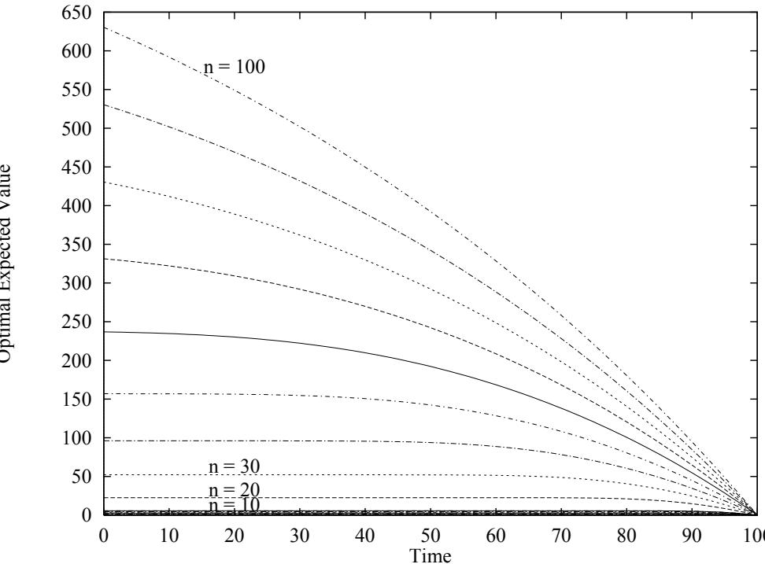
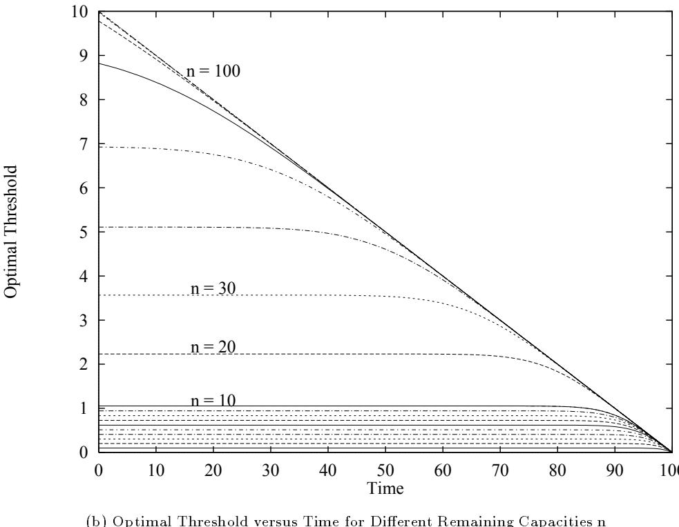
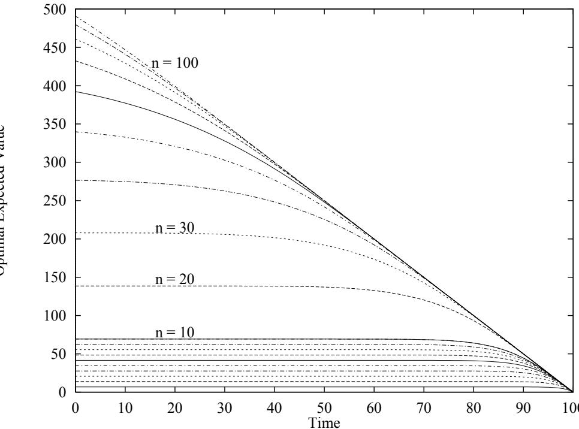
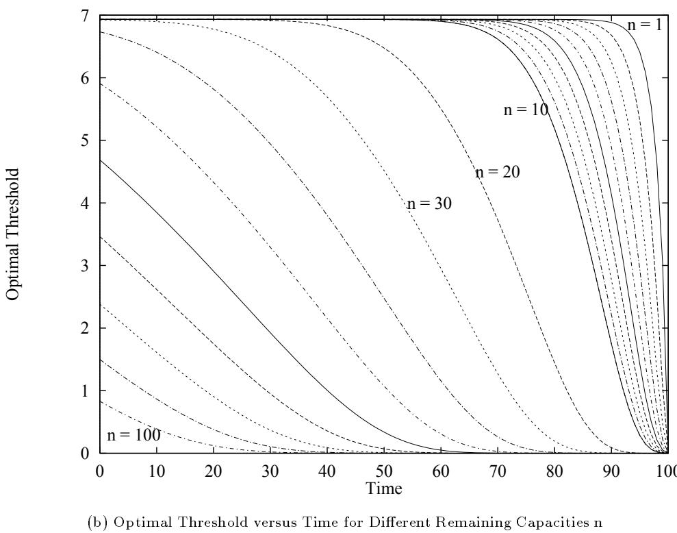
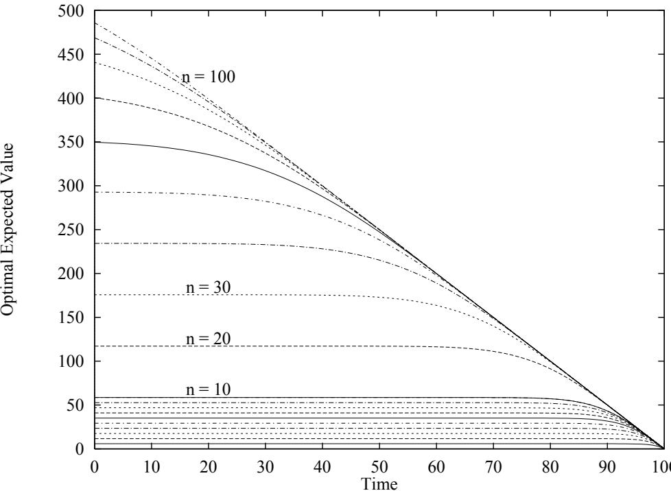
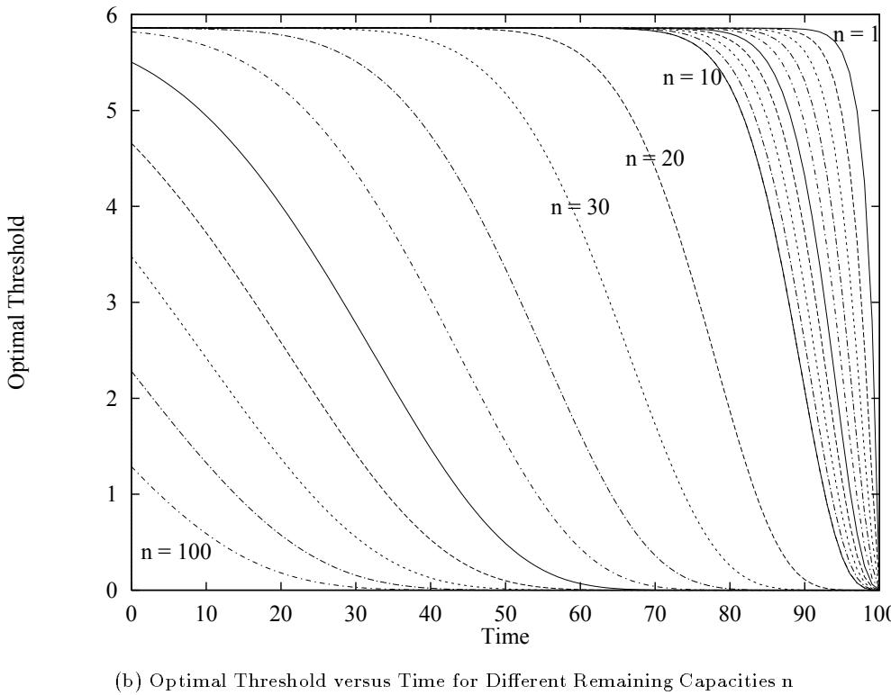

# The Dynamic and Stochastic Knapsack Problem y

Anton J. Kleywegt School of Industrial and Systems Engineering Georgia Institute of Technology Atlanta, GA 30332-0205

Jason D. Papastavrou   
School of Industrial Engineering Purdue University   
West Lafayette, IN 47907-1287

# Abstract

The Dynamic and Stochastic Knapsack Problem (DSKP) is dened as follows: Items arrive according to a Poisson process in time. Each item has a demand (size) for a limited resource (the knapsack) and an associated reward. The resource requirements and rewards are jointly distributed according to a known probability distribution and become known at the time of the item's arrival. Items can be either accepted or rejected. If an item is accepted, the item's reward is received, and if an item is rejected, a penalty is paid. The problem can be stopped at any time, at which time a terminal value is received, which may depend on the amount of resource remaining. Given the waiting cost and the time horizon of the problem, the ob jective is to determine the optimal policy that maximizes the expected value (rewards minus costs) accumulated. Assuming that all items have equal sizes but random rewards, optimal solutions are derived for a variety of cost structures and time horizons, and recursive algorithms for computing them are developed. Optimal closed-form solutions are obtained for special cases. The DSKP has applications in freight transportation, in scheduling of batch processors, in selling of assets, and in selection of investment pro jects.

# 1 Introduction

The knapsack problem has been extensively studied in operations research (see, for example, Martello and Toth, 1990). Items to be loaded into a knapsack with xed capacity are selected from a given set of items with known sizes and rewards. The objective is to maximize the total reward, subject to capacity constraints. This problem is static and deterministic, because all the items are considered at a point in time, and their sizes and rewards are known a priori. However, in many practical applications, the knapsack problem is encountered in an uncertain and dynamically changing environment. Furthermore, there are often costs associated with delays that are not captured in the static knapsack problem. Applications of the dynamic and stochastic counterpart of the knapsack problem include:

1. In the transportation industry, ships, trains, aircraft or trucks often carry loads for dierent clients. Transportation requests arrive stochastically over time, and prices are oered or negotiated for transporting loads. If a load is accepted, costs are incurred for picking up and handling the load, and for the administrative activities involved. These costs are specic to the load, and can be subtracted from the price to give the \reward" of the load. If a load is rejected, some customer goodwill (possible future sales) is lost, which can be taken into account with a penalty for rejecting loads. Loads may have dierent sizes, such as parcels, or the same size, such as containers. Often there is a xed schedule for moving vehicles and a deadline after which loads cannot be accepted for a specic shipment. Even when there is not a xed schedule, an incentive exists to consolidate and dispatch shipments with high frequency, to maintain short delivery times, and to maximize the rate at which revenue is earned with the given investment in capital and labor costs. This incentive can be modeled with a discount rate, and a waiting cost or holding cost per unit time that is incurred until the shipment is dispatched. The waiting cost may be constant or may depend on the number of loads accepted, but not yet dispatched. The dispatcher can decide to dispatch a vehicle at any time before the deadline. There is also a dispatching and transportation cost that is incurred for the shipment as a whole, that may depend on the number of loads in the shipment.

2. A scheduler of a batch processor has to schedule jobs with random capacity requirements and rewards as they arrive over time. Fixed schedules or customer commitments lead to deadlines. The pressure to increase the utilization of equipment and labor, and to maintain a high level of customer service, lead to a waiting cost per unit time. The cost of running the batch processor may depend on the number of jobs in the batch. 3. A real estate agent selling new condominiums receives oers stochastically over time and may want to sell the assets before winter or before the new tax year. Hence, the agent faces a deadline, possibly with a salvage value for the unsold assets. There is also an opportunity cost associated with the capital tied into the unsold assets, and property taxes, which cause a waiting cost per unit time to exist.

4. An investor who wishes to invest a certain amount of funds faces a similar problem. The investor is presented with investment projects with random arrival times, funding requirements, and returns. The opportunity cost of unutilized capital is represented by a waiting cost per unit time, and the objective is to maximize the expected value earned from investing the funds.

These problems are characterized by the allocation of limited resources to competing items that arrive randomly over time. Items are associated with resource requirements as well as rewards, which may include any item specic costs incurred. Usually the arrival times, resource requirements, and rewards are unknown before arrival, and become known upon arrival. Arriving items can be either accepted or rejected. Incentives such as a deadline after which arriving items cannot be accepted, discounting, and a waiting cost per unit time, serve to encourage the timely acceptance of items. The problem can be stopped at any time before or at the deadline. There may also be a cost associated with the group of accepted items as a whole, or a salvage value for unused resources, which may depend on the amount of resources allocated to the accepted items. A typical objective is to maximize the expected total value (rewards minus costs). We call problems of this general nature the Dynamic and Stochastic Knapsack Problem (DSKP).

In this paper dierent versions of this problem are formulated and analyzed for the case where all items have equal size, for both the innite and nite horizon cases. The case where items have random sizes is analyzed in Kleywegt (1996). We show that an optimal acceptance rule is given by a simple threshold rule. It is also shown how to nd an optimal stopping time. We derive structural characteristics of the optimal value function and the optimal acceptance threshold, and propose recursive algorithms to compute optimal solutions. Closed-form solutions are obtained for some cases.

In Section 2, previous research on similar problems is reviewed. In Section 3, the DSKP is dened and notation is introduced, and general results are derived in Section 4. The DSKP without a deadline is considered in Section 5, and the DSKP with a deadline is considered in Section 6. Our concluding remarks follow in Section 7.

# 2 Related Research

Stochastic versions of the knapsack problem can be classied as either static or dynamic. In static stochastic knapsack problems the set of items is given, but the rewards and/or sizes are unknown. Steinberg and Parks (1979) proposed a preference order dynamic programming algorithm for the knapsack problem with random rewards. Sniedovich (1980,1981) further investigated preference order dynamic programming, and pointed out that the preference relations used by Steinberg and Parks may lead to suboptimal solutions. Other preference relations may lead to the failure of an optimal solution to exist, or to a trivial optimal solution. Henig (1990) combined dynamic programming and a search procedure to solve stochastic knapsack problems where the items have known sizes and independent normally distributed rewards. Carraway, Schmidt and Weatherford (1993) proposed a hybrid dynamic programming/branch-and-bound algorithm for a stochastic knapsack problem similar to that of Henig, with an objective that maximizes the probability of target achievement.

In dynamic stochastic knapsack problems the items arrive over time, and the rewards and/or sizes are unknown before arrival. Decisions are made sequentially as items arrive.

Some stopping time problems and best choice (optimal selection) problems are similar to the DSKP. A well-known example is the secretary problem, where candidates arrive over time. The objective is to maximize the probability of choosing the best candidate or $k$ best candidates from a given, or random, number of candidates, or to maximize the expected value of the chosen candidates. These problems have been studied by Presman and Sonin (1972), Stewart (1981), Freeman (1983), Yasuda (1984), Bruss (1984), Nakai (1986a), Sakaguchi (1986), and Tamaki (1986a,1986b).

The problem of selling a single asset, where oers arrive periodically (Roseneld, Shapiro and Butler 1983), or according to a renewal process (Mamer 1986), with a xed waiting cost, with or without a deadline, has also been studied. Albright (1977) studied a house selling problem where a given number, $n$ , of oers are received, and $k \leq n$ houses are to be sold. Asymptotic properties of an optimal policy for the house selling problem with discrete time periods, as the deadline and number of houses become large, were derived by Saario (1985).

A more general problem is the Sequential Stochastic Assignment Problem (SSAP). Derman, Lieberman and Ross (1972) dened the problem as follows: a given number, $n$ , of persons, with known values $p _ { i } , i = 1 , . . . , n$ , are to be assigned sequentially to $n$ jobs, which arrive one at a time. The jobs have values $x _ { j } , j ~ = ~ 1 , \ldots , n$ , which are unknown before arrival, but become known upon arrival, and which are independent and identically distributed with a known probability distribution. If a person with value $p _ { i }$ is assigned to a job with value $x _ { j }$ , the reward is $p _ { i } x _ { j }$ . The objective is to maximize the expected total reward. Dierent extensions of the SSAP were studied by Albright and Derman (1972), Albright (1974), Sakaguchi (1984a,1984b), Nakai (1986b,1986c), and Kennedy (1986).

Some resource allocation problems are similar to the DSKP. Mendelson, Pliskin and Yechiali (1980) investigated the problem of allocating a given amount of resource to a set of activity classes, with demands following a known probability distribution, and arriving according to a renewal process. The objective is to maximize the expected time until the resource allocated to an activity is depleted. Righter (1989) studied a resource allocation problem that is an extension of the SSAP.

Many investment problems can be regarded as DSKPs. For example, Prastacos (1983) studied the problem of allocating a given amount of resource before a deadline to irreversible investment opportunities that arrive according to a geometric process in discrete time. We incorporate a waiting cost, in addition to the issues taken into account by Prastacos, and arrivals either occur according to a geometric process in discrete time, or according to a Poisson process in continuous time. Also, Prastacos assumed that each investment opportunity was large enough to absorb all the available capital, but in our problem the sizes of the investment opportunities are given, and cannot be chosen.

Other versions of the DSKP have been studied for communications applications by Kaufman (1981), Ross and Tsang (1989), and Ross and Yao (1990). Papastavrou, Rajagopalan, and Kleywegt (1995) studied a version of DSKP similar to that in this paper, with dierent sized items, with arrivals occurring periodically

in discrete time, and without waiting costs.

A class of problems similar to the DSKP have been termed Perishable Asset Revenue Management (PARM) problems by Weatherford and Bodily (1992,1993). These problems are often called yield management problems, and have been studied extensively, with specic application to airline seat inventory control and hotel yield management by Rothstein (1971,1974,1985), Shlifer and Vardi (1975), Alstrup et al. (1986), Belobaba (1987,1989), Dror, Trudeau and Ladany (1988), Curry (1990), Brumelle et al. (1990), Brumelle and McGill (1993), Wollmer (1992), Lee and Hersh (1993), and Robinson (1995). In most of these problems there are a number of dierent fare classes, which are usually assumed to be given due to competition. The objective is to dynamically assign the available capacity to the dierent fare classes to maximize expected revenues. In the DSKP, the available capacity is dynamically assigned to arriving demands with random rewards and random resource requirements. Another type of PARM problem, in which an inventory has to be sold before a deadline, has been studied by Kincaid and Darling (1963), Stadje (1990), and Gallego and Van Ryzin (1994). In their problems customers arrive according to a Poisson process, with price-dependent probability of purchasing. The major dierences with our model is that in our model oers arrive, and the oers can be accepted or rejected, as is typical with large contracts such as the selling of real estate, whereas in the models of Stadje and Gallego and Van Ryzin prices are set and all demands are accepted as long as supplies last, which is typical in retail; also, we incorporate a waiting cost and an option to stop before the deadline.

# 3 Problem Denition

Items arrive according to a Poisson process in time. Each item has an associated reward. The reward of an item is unknown prior to arrival, and becomes known upon arrival. The distribution of the rewards is known, and is independent of the arrival time and of the rewards of other arrivals. In this paper it is assumed that items have equal capacity requirements (sizes). Without loss of generality, let the size of each item be 1, and the known initial capacity be integer. The items are to be included in a knapsack of known capacity. Each arriving item can be either accepted or rejected. If an item is accepted, the reward associated with the item is received, and if the item is rejected, a penalty is incurred. Once an item is rejected, it cannot be recalled.

There is a known deadline (possibly innite) after which items can no longer be accepted. It is allowed to stop waiting for arrivals before the capacity is exhausted or the deadline is reached (for example, when a vehicle is dispatched without lling it to capacity and before the deadline is reached). There is a waiting cost per unit time that depends on the number of items already accepted, or equivalently, on the remaining capacity. A terminal value is earned that depends on the remaining capacity at the stopping time. Rewards and costs may be discounted. The objective is to determine a policy for accepting items and for stopping that maximizes the expected total (discounted) value (rewards minus costs) accumulated.

Let $\{ A _ { i } \} _ { i = 1 } ^ { \infty }$ denote the arrival times of a Poisson process on $( 0 , \infty )$ with rate $\lambda \in ( 0 , \infty )$ . Let $R _ { i }$ denote the reward of arrival $i$ , and assume that $\{ R _ { i } \} _ { i = 1 } ^ { \infty }$ is an i.i.d. sequence, independent of $\{ A _ { i } \} _ { i = 1 } ^ { \infty }$ . Let $F _ { R }$ denote the probability distribution of $R$ , and assume that $E [ R ] < \infty$ . Let $( \Omega , { \mathcal { F } } , P )$ be a probability space satisfying these assumptions. Let $N _ { 0 }$ denote the initial capacity, and let $\mathcal { N } \equiv \{ 0 , 1 , \ldots , N _ { 0 } \}$ . Let $T \in ( 0 , \infty ]$ denote the deadline for accepting items, and let $\tau \in [ 0 , T ]$ denote the stopping time. Let $D _ { i }$ denote the decision whether to accept or reject arrival $i$ , dened as follows:

$$
D _ { i } \equiv \left\{ \begin{array} { c } { { 1 \mathrm { i } \mathrm { i } \mathrm { r r i v a l } i \mathrm { i } \mathrm { i } \mathrm { s a c c e p t e d } } } \\ { { 0 \mathrm { i } \mathrm { i } \mathrm { r r i v a l } i \mathrm { i } \mathrm { i } \mathrm { s r e j e c t e d } } } \end{array} \right.
$$

Let $\mathcal { T } _ { s }$ denote the set of all unit step functions $f _ { s } : ( 0 , T ] \mapsto \{ 0 , 1 \}$ of the form

$$
f _ { s } \left( t \right) \quad \equiv \quad \left\{ \begin{array} { l l } { { 1 } } & { { \mathrm { i f } t \in \left( 0 , \tau \right] } } \\ { { 0 } } & { { \mathrm { i f } t \in \left( \tau , T \right] } } \end{array} \right.
$$

for some $\tau \in [ 0 , T ]$ .

The class $\Pi _ { D S K P } ^ { H D }$ of history-dependent deterministic policies for the DSKP is dened as follows. For any $t \in [ 0 , \infty )$ , let $\mathcal { H } _ { t }$ be the history of the process $\{ A _ { i } , R _ { i } \}$ up to time $t$ (i.e., the $\sigma$ -algebra generated by $\left\{ \left( A _ { i } , R _ { i } \right) : A _ { i } \leq t \right\}$ ), denoted ${ \mathcal { H } } _ { t } \equiv \sigma \left( \{ \left( A _ { i } , R _ { i } \right) : A _ { i } \leq t \} \right)$ . Let ${ \mathcal { H } } _ { t ^ { - } } \equiv \sigma \left( \left\{ \left( A _ { i } , R _ { i } \right) : A _ { i } < t \right\} \right)$ ), let $\mathcal { H } _ { \infty } \equiv$ $\sigma \left( \{ \left( A _ { i } , R _ { i } \right) \} _ { i = 1 } ^ { \infty } \right)$ , $\mathcal { H } _ { \infty } \subset \mathcal { F }$ , and let $\mathcal { H } _ { A _ { i } } \equiv \{ B \in \mathcal { H } _ { \infty } : B \cap \{ A _ { i } \leq t \} \in \mathcal { H } _ { t } \forall t \in [ 0 , \infty ] \}$ . Let $\mathcal { A } \equiv \{ \{ A _ { i } \} _ { i = 1 } ^ { \infty } :$ $0 < A _ { 1 } < A _ { 2 } < . . . < \infty \}$ , let $\mathcal { R } \equiv \{ \{ R _ { i } \} _ { i = 1 } ^ { \infty } : R _ { i } \in \mathfrak { R } \}$ , and let $\mathcal { D } \equiv \{ \{ D _ { i } \} _ { i = 1 } ^ { \infty } : D _ { i } \in \{ 0 , 1 \} \}$ . Dene $\Pi _ { D S K P } ^ { H D }$ as the set of all Borel-measurable functions $\pi : \mathcal { A } \times \mathcal { R } \longmapsto \mathcal { D } \times \mathcal { T } _ { s }$ which satisfy the conditions

$$
\begin{array} { r } { \sum _ { \{ i : A _ { i } \leq \mathcal { T } ^ { \pi } \} } D _ { i } ^ { \pi } \quad \leq \quad N _ { 0 } } \end{array}
$$

where $\left( \left\{ D _ { i } ^ { \pi } \right\} , I ^ { \pi } \right) \equiv \pi ( \left\{ A _ { i } \right\} , \left\{ R _ { i } \right\} )$ , and the stopping time $\mathcal { T } ^ { \pi }$ is given by

$$
\begin{array} { r l r } { I ^ { \pi } ( t ) } & { = } & { \left\{ \begin{array} { l l } { 1 } & { \mathrm { i f } t \in ( 0 , T ^ { \pi } ] } \\ { 0 } & { \mathrm { i f } t \in ( T ^ { \pi } , T ] } \end{array} \right. } \end{array}
$$

Let $N ^ { \pi } ( t )$ denote the remaining capacity under policy $\pi$ at time $t$ , where $N ^ { \pi }$ is dened to be leftcontinuous, i.e.,

$$
N ^ { \pi } ( t ) \equiv N _ { 0 } \Leftrightarrow \sum _ { \left\{ i \colon A _ { i } < t \right\} } D _ { i } ^ { \pi } I ^ { \pi } ( A _ { i } )
$$

and let

$$
N ^ { \pi } ( t ^ { + } ) \equiv N _ { 0 } \Leftrightarrow \sum _ { \left\{ i : A _ { i } \leq t \right\} } D _ { i } ^ { \pi } I ^ { \pi } ( A _ { i } )
$$

Let $c ( n )$ denote the waiting cost per unit time while the remaining capacity is $n$ . Let $p$ denote the penalty that is incurred if an item is rejected. Let $v ( n )$ denote the terminal value that is earned at time $\mathcal { T } ^ { \pi }$ if the remaining capacity $N ^ { \pi } ( T ^ { \pi + } ) = n$ . Let $\alpha$ be the discount rate; if $T = \infty$ , we require that $\alpha > 0$ .

Let $V _ { D S K P } ^ { \pi }$ denote the expected total discounted value under policy $\pi \in \Pi _ { D S K P } ^ { H D }$ , i.e.,

$$
\begin{array} { r l } { V _ { i \alpha \times \mu } ^ { \tau } = } & { E \displaystyle \left[ \displaystyle \sum _ { \ell \in A \setminus \xi ^ { \tau } ( T ^ { \tau } ) } e ^ { - \alpha A _ { \ell } } [ D _ { \ell } ^ { \tau } R _ { i } \Leftrightarrow ( 1 \Rightarrow D _ { \ell } ^ { \tau } ) ] \right] } \\ & { \qquad \Leftrightarrow \displaystyle \int _ { 0 } ^ { T ^ { \tau } } e ^ { - \alpha \tau } e ( N ^ { \tau } ( r ) ) d \tau + e ^ { - \alpha T ^ { \tau } } \mathfrak { v } ( N ^ { \tau } ( T ^ { \tau } + 1 ) ) \Bigg \vert \textnormal {  { N } } ^ { \tau } ( \mathfrak { p } ^ { + } ) = \textnormal {  { N } } _ { i } ^ { \tau } \Bigg ] } \\ { = } & { E \displaystyle \left[ \displaystyle \sum _ { \ell \in A \setminus \xi ^ { \tau } ( T ) } e ^ { - \alpha A _ { \ell } } [ D _ { \ell } ^ { \tau } R _ { i } \Leftrightarrow ( 1 \otimes D _ { \ell } ^ { \tau } ) ] T ^ { \tau } ( A _ { \ell } ) \right. } \\ & { \qquad \left. + \displaystyle \int _ { 0 } ^ { T } e ^ { - \alpha \tau } [ \sin ( N ^ { \tau } ( \tau ) ) ] T ^ { \tau } ( \tau ) + \alpha \mathfrak { v } ( N ^ { \tau } ( \tau ) ) \left( 1 \Leftrightarrow T ^ { \tau } ( \tau ) \right) \right] d \tau } \\ & { \qquad + e ^ { - \alpha \tau } \mathfrak { v } ( N ^ { \tau } ( T ^ { \tau } ) ) \Bigg \vert \textnormal {  { N } } ( \mathfrak { p } ^ { + } ) = \textnormal {  { N } } _ { \mathfrak { p } } \Bigg ] } \end{array}
$$

The objective is to nd the optimal expected value $V _ { D S K P } ^ { * }$ , i.e.,

$$
V _ { D S K P } ^ { * } \equiv \operatorname* { s u p } _ { \pi \in \Pi _ { D S K P } ^ { H D } } V _ { D S K P } ^ { \pi }
$$

and to nd an optimal policy $\pi ^ { * } \in \Pi _ { D S K P } ^ { H D }$ that achieves this optimal value, if such a policy exists.

A summary of the most important notation is given in Table 1.

Table 1: Summary of notation   

<table><tr><td>λ</td><td>item arrival rate, λ  (0, ∞)</td></tr><tr><td>Ai</td><td>arrival time of item i</td></tr><tr><td>Ri, r</td><td>item reward</td></tr><tr><td>FR</td><td>probability distribution of item rewards R, FR(0) &lt; 1</td></tr><tr><td>T</td><td>deadline</td></tr><tr><td>T</td><td>stopping time</td></tr><tr><td>n</td><td>remaining capacity</td></tr><tr><td>t</td><td>time</td></tr><tr><td>N (t)</td><td>remaining capacity at time t</td></tr><tr><td>c(n)</td><td>waiting cost per unit time while N (t) = n</td></tr><tr><td>p</td><td>penalty for rejecting an item</td></tr><tr><td>v(n)</td><td>terminal value with N (T +) = n</td></tr><tr><td>α</td><td>discount rate</td></tr><tr><td>π</td><td>policy</td></tr><tr><td></td><td>Dπ (n, t, r) acceptance decision rule of policy π</td></tr><tr><td>I” (n,t)</td><td>stopping decision rule of policy π</td></tr><tr><td>V π (n, t)</td><td>expected value of policy π</td></tr><tr><td>xπ (n, t)</td><td>acceptance threshold used by policy π</td></tr></table>

# 4 General Results

The relation between the Dynamic and Stochastic Knapsack Problem (DSKP) and a closely related continuous time Markov Decision Process (MDP) is investigated. The option of choosing a stopping time for the DSKP introduces a complexity into the DSKP that is not modeled in a straightforward way by an MDP, unless we introduce a stopped state, with an innite rate transition to this state as soon as the decision is made to stop. However, most results for MDPs require that transition rates be bounded. We therefore study an MDP which is a relaxation of the DSKP, in that the MDP can switch o and on multiple times, instead of stopping only once, which can be modeled with bounded transition rates. We show that there exists an optimal policy for the MDP which stops only once, and hence which is admissible and optimal for the DSKP.

The MDP has state space $\mathcal { N }$ . The policy spaces $\Pi _ { M D P } ^ { H D }$ , $\Pi _ { M D P } ^ { M D }$ , and $\Pi _ { M D P } ^ { S D }$ , are dened hereafter, where superscript $H D$ denotes history-dependent deterministic policies, $M D$ denotes memoryless deterministic policies, and $S D$ denotes stationary deterministic policies. Let $\mathcal { T } _ { I }$ denote the set of all Borel-measurable functions $f _ { I } : ( 0 , T ] \ \longmapsto \ \{ 0 , 1 \}$ . The class $\Pi _ { M D P } ^ { H D }$ is dened as the set of all Borel-measurable functions $\pi : \boldsymbol { \mathcal { A } } \times \mathcal { R } \longmapsto \mathcal { D } \times \mathcal { T } _ { I }$ which satisfy the conditions

$$
D _ { i } ^ { \pi } ~ \mathrm { i s } ~ { \mathcal { H } } _ { A _ { i } } ~ \mathrm { m e a s u r a b l e ~ f o r ~ a l l } ~ i \in \{ 1 , 2 , . . . \}
$$

$$
\begin{array} { r } { \sum _ { \{ i : A _ { i } \leq T \} } D _ { i } ^ { \pi } I ^ { \pi } ( A _ { i } ) \quad \leq \quad N _ { 0 } } \end{array}
$$

where $\left( \left\{ D _ { i } ^ { \pi } \right\} , I ^ { \pi } \right) \equiv \pi ( \left\{ A _ { i } \right\} , \left\{ R _ { i } \right\} )$ . Note that the MDP is allowed to switch on $\mathbf { \Omega } ^ { \prime } I ^ { \pi } \left( t \right) = 1 \mathbf { \Omega } _ { \prime } ^ { \prime }$ and $o f f \left( I ^ { \pi } \left( t \right) \right. = 0 ,$ ) multiple times, in contrast with the DSKP, which has to remain $o \mathcal { H }$ once it stops. Hence, with $V _ { M D P } ^ { \pi }$ properly dened, the MDP is a relaxation of the DSKP. The optimal expected value of the MDP is therefore at least as good as that of the DSKP. This is the result of Lemma 1, which follows after the denitions of $V _ { M D P } ^ { \pi }$ and V MDP.

$V _ { M D P } ^ { \pi }$ denotes the expected total discounted value under policy $\pi \in \Pi _ { M D P } ^ { H D }$ , given by

$$
\begin{array} { r c l } { { V _ { M D P } ^ { \pi } } } & { { \equiv } } & { { E \left[ \displaystyle \sum _ { \left\{ i : A _ { i } \leq T \right\} } e ^ { - \alpha A _ { i } } \left[ D _ { i } ^ { \pi } R _ { i } \Leftrightarrow \left( 1 \Leftrightarrow D _ { i } ^ { \pi } \right) p \right] I ^ { \pi } \left( A _ { i } \right) \right. } } \\ { { } } & { { } } & { { \left. + \displaystyle \int _ { 0 } ^ { T } e ^ { - \alpha \tau } \left[ \Leftrightarrow e \left( N ^ { \pi } \left( \tau \right) \right) I ^ { \pi } \left( \tau \right) + \alpha v \left( N ^ { \pi } \left( \tau \right) \right) \left( 1 \Leftrightarrow I ^ { \pi } \left( \tau \right) \right) \right] d \tau \right. } } \\ { { } } & { { } } & { { \left. + \left. e ^ { - \alpha T } v \left( N ^ { \pi } \left( T ^ { + } \right) \right) \right| N ^ { \pi } \left( 0 ^ { + } \right) = N _ { 0 } \right] } } \end{array}
$$

The optimal expected value $V _ { M D P } ^ { * }$ is given by

$$
V _ { M D P } ^ { \ast } \quad \equiv \quad \operatorname* { s u p } _ { \pi \in \Pi _ { M D P } ^ { H D } } \quad V _ { M D P } ^ { \pi }
$$

LEMMA 1 $\begin{array} { r l r } { V _ { M D P } ^ { * } } & { { } \ge } & { V _ { D S K P } ^ { * } } \end{array}$

Proof: $\Pi _ { D S K P } ^ { H D } \ \subset \ \Pi _ { M D P } ^ { H D }$ because $\mathcal { T } _ { s } ~ \subset ~ \mathcal { T } _ { I }$ . For any $\pi \in \Pi _ { D S K P } ^ { H D }$ , $V _ { M D P } ^ { \pi } = V _ { D S K P } ^ { \pi }$ . Hence, $V _ { M D P } ^ { * } \equiv$

$$
\begin{array} { r } { \operatorname* { s u p } _ { \pi \in \Pi _ { M D P } ^ { H D } } V _ { M D P } ^ { \pi } \ge \operatorname* { s u p } _ { \pi \in \Pi _ { D S K P } ^ { H D } } V _ { M D P } ^ { \pi } = \operatorname* { s u p } _ { \pi \in \Pi _ { D S K P } ^ { H D } } V _ { D S K P } ^ { \pi } \equiv V _ { D S K P } ^ { * } . } \end{array}
$$

Let $\mathcal { T } _ { R }$ denote the set of all Borel-measurable functions $f _ { R } : \mathfrak { R } \longmapsto \{ 0 , 1 \}$ . The class $\Pi _ { M D P } ^ { M D }$ of memoryless deterministic policies for the MDP is dened as the set of all Borel-measurable functions $\pi : \mathcal { N } \times ( 0 , T ] \mapsto$ $\mathcal { I } _ { R } \times \{ 0 , 1 \}$ , where $\pi \equiv ( D ^ { \pi } , I ^ { \pi } )$ , and $D ^ { \pi }$ and $I ^ { \pi }$ are as follows. $D ^ { \pi } \left( n , t , r \right)$ denotes the decision under policy $\pi$ whether to accept or reject an arrival $i$ at time $A _ { i } ~ = ~ t$ with reward $R _ { i } ~ = ~ r$ if the remaining capacity $N ^ { \pi } ( t ) = n$ , dened as follows:

$$
\begin{array} { r l r } { D ^ { \pi } ( n , t , r ) } & { \equiv } & { \left\{ \begin{array} { l l } { 1 } & { \mathrm { i f ~ } n > 0 \mathrm { ~ a n d ~ a r r i v a l ~ } i \mathrm { ~ i s ~ a c c e p t e d } } \\ { 0 } & { \mathrm { i f ~ } n = 0 \mathrm { ~ o r ~ a r r i v a l ~ } i \mathrm { ~ i s ~ r e j e c t e d } } \end{array} \right. } \end{array}
$$

Let the acceptance set for policy $\pi$ be denoted by $\mathcal { R } _ { 1 } ^ { \pi } ( n , t ) \equiv \big \{ r \in \mathfrak { R } : D ^ { \pi } ( n , t , r ) = 1 \big \}$ , and the rejection set be denoted by $\mathcal { R } _ { 0 } ^ { \pi } ( n , t ) \equiv \big \{ r \in \mathfrak { R } : D ^ { \pi } ( n , t , r ) = 0 \big \}$ . $I ^ { \pi } \left( n , t \right)$ denotes the decision under policy $\pi$ whether to be switched $o n$ or $o \mathcal { H }$ at time $t$ if the remaining capacity $N ^ { \pi } ( t ) = n$ , dened as follows:

$$
\begin{array} { r l r } { I ^ { \pi } ( n , t ) } & { \equiv } & { \left\{ \begin{array} { l l } { 1 } & { \mathrm { i f ~ s w i t c h e d ~ } o n \mathrm { ~ a t ~ t i m e ~ } t } \\ { 0 } & { \mathrm { i f ~ s w i t c h e d ~ } o f f \mathrm { a t ~ t i m e ~ } t } \end{array} \right. } \end{array}
$$

It is easy to show that MD MDP  HDMDP .

The remaining capacity corresponding to policy $\pi$ is given by

$$
N ^ { \pi } ( t ) = N _ { 0 } \Leftrightarrow \sum _ { \left\{ i ; A _ { i } < t \right\} } D ^ { \pi } ( N ^ { \pi } ( A _ { i } ) , A _ { i } , R _ { i } ) I ^ { \pi } ( N ^ { \pi } ( A _ { i } ) , A _ { i } )
$$

The MDP can be modeled with transition rates

$$
\begin{array} { r l r } { \lambda ( \pi ( n , t ) ) } & { { } \equiv } & { \lambda I ^ { \pi } ( n , t ) } \end{array}
$$

and transition probabilities

$$
\begin{array} { r l r } { P [ n \mid n , \pi ( n , t ) ] } & { \equiv } & { \int _ { { \mathcal R } _ { 0 } ^ { \pi } ( n , t ) } d F _ { R } ( r ) } \\ { P [ n \Leftrightarrow 1 \mid n , \pi ( n , t ) ] } & { \equiv } & { \int _ { { \mathcal R } _ { 1 } ^ { \pi } ( n , t ) } d F _ { R } ( r ) } \end{array}
$$

Let $V _ { M D P } ^ { \pi } ( n , t )$ be the expected total discounted value under policy $\pi \in \Pi _ { M D P } ^ { M D }$ from time $t$ until time $T$ , if the remaining capacity $N ^ { \pi } ( t ^ { + } ) = n$ , i.e.,

$$
\begin{array} { r l r } { \langle n , t \rangle } & { \equiv } & { E \left[ \displaystyle \sum _ { \left\{ i : A _ { i } \in \left( t , T \right] \right\} } e ^ { - \alpha \left( A _ { i } - t \right) } \left[ D ^ { \pi } \left( N ^ { \pi } \left( A _ { i } \right) , A _ { i } , R _ { i } \right) R _ { i } \Leftrightarrow \left( 1 \Leftrightarrow D ^ { \pi } \left( N ^ { \pi } \left( A _ { i } \right) , A _ { i } , R _ { i } \right) \right) p \right] I ^ { \pi } ( \Delta _ { i } , R _ { i } ) \right] \quad , } \end{array}
$$

$$
\begin{array} { r l } & { \quad + \displaystyle \int _ { t } ^ { T } e ^ { \alpha ( \tau - t ) } [ \breve { \otimes } ( X ^ { \tau } ( \tau ) ) \middle | \mathcal { F } ( X ^ { \tau } ( \tau ) , \tau ) + \alpha v ( N ^ { \tau } ( \tau ) ) ( 1 \Leftrightarrow I ^ { \tau } ( N ^ { \tau } ( \tau ) , \tau ) ) ] d \tau } \\ & { \quad + \displaystyle e ^ { \alpha ( T \setminus \cup _ { \tau } } \partial _ { \tau } \big ( X ^ { \tau } ( T ^ { + } ) \big ) \bigg | N ^ { \tau } ( t ^ { + } ) = n \bigg | } \\ { = \ : } & { E [ \int _ { t } ^ { T } e ^ { - \alpha ( \tau - t ) } \Bigg \{ \lambda [ \int _ { R _ { t } ^ { \tau } ( N ^ { \tau } ( \tau ) , \tau ) } { r \ : d F _ { R } ( \tau ) \ : \Leftrightarrow p \int _ { R _ { t } ^ { \tau } ( N ^ { \tau } ( \tau ) , \tau ) } d F _ { R } ( \tau ) ] ^ { T } ( N ^ { \tau } ( \tau ) , \tau ) }  } \\ & { \qquad \Leftrightarrow ( N ^ { \tau } ( \tau ) ) I ^ { \tau } ( N ^ { \tau } ( \tau ) , \tau ) + \alpha v ( N ^ { \tau } ( \tau ) ) ( 1  I ^ { \tau } ( N ^ { \tau } ( \tau ) , \tau ) ) \} d \tau } \\ & { \quad \quad +  e ^ { - \alpha ( T - t ) } _ { \alpha } \big ( N ^ { \tau } ( T ^ { + } ) \big ) \bigg | N ^ { \tau } ( t ^ { + } ) = n ] } \end{array}
$$

The equality follows from an integration theorem for point processes; see for example Bremaud (1981) Theorem II.T8. Let $V _ { M D P } ^ { * } ( n , t )$ be the corresponding optimal expected value, i.e.,

$$
V _ { M D P } ^ { \ast } ( n , t ) \quad \equiv \quad \operatorname* { s u p } _ { \pi \in \Pi _ { M D P } ^ { M D } } V _ { M D P } ^ { \pi } ( n , t )
$$

Note that $V _ { M D P } ^ { * } ( n , t ) \ge v ( n )$ for all $n$ and $t$ , because the policy $\pi \in \Pi _ { M D P } ^ { M D }$ with $I ^ { \pi } = 0$ has $V _ { M D P } ^ { \pi } ( n , t ) =$ $v ( n )$ for all $n$ and $t$ .

Intuitively we would expect $V _ { M D P } ^ { * }$ to decrease as the deadline comes closer. This is the result of Proposition 1. In Proposition 2 it is shown that $V _ { M D P } ^ { * }$ is nondecreasing in $n$ if $c$ is nonincreasing and $v$ is nondecreasing. These are the conditions that usually hold in applications. It is typical for the waiting cost to increase as the number of accepted customers increases, and for the terminal value to decrease (for example, for the dispatching and transportation cost to increase) as the nal number of customers increases. Proofs can be found in Kleywegt (1996).

PROPOSITION 1 For any $n \in \mathcal N$ , $V _ { M D P } ^ { * } ( n , t )$ is nonincreasing in t on $[ 0 , T ]$ .

PROPOSITION 2 If c is nonincreasing and v is nondecreasing, then for any $t \in [ 0 , T ]$ , $V _ { M D P } ^ { * } ( n , t )$ is nondecreasing in n on $\mathcal { N }$ .

As for policies $\pi \in \Pi _ { M D P } ^ { H D }$ , policies $\pi \in \Pi _ { M D P } ^ { M D }$ are allowed to switch $o n$ and $o \mathcal { H }$ multiple times. However, consider policies $\pi \in \Pi _ { M D P } ^ { M D }$ with stopping rules $I ^ { \pi } ( n , \cdot ) \in \mathcal { I } _ { s }$ for each $n \in \mathcal N$ , i.e., $I ^ { \pi } \left( n , \cdot \right)$ is a unit step

function of $t$ of the form

$$
\begin{array} { r l r } { I ^ { \pi } ( n , t ) } & { \equiv } & { \left\{ \begin{array} { l l } { 1 } & { \mathrm { i f } t \in ( 0 , \tau ^ { \pi } ( n ) ] } \\ & { } \\ { 0 } & { \mathrm { i f } t \in ( \tau ^ { \pi } ( n ) , T ] } \end{array} \right. } \end{array}
$$

for some $\tau ^ { \pi } ( n ) \in [ 0 , T ]$ for each $n \in \mathcal N$ : . Such policies $\pi$ are admissible for the DSKP $( \pi \in \Pi _ { D S K P } ^ { H D } )$ ), because once the process switches $o \mathcal { H }$ , it remains stopped. For each such policy $\pi$ , the sample path $N ^ { \pi } \left( \omega \right)$ is the same for the DSKP and the MDP for each $\omega \in \Omega$ , and $V _ { D S K P } ^ { \pi } = V _ { M D P } ^ { \pi }$ . Intuitively we expect that there is an optimal policy $\pi ^ { * } \in \Pi _ { M D P } ^ { M D }$ with such a unit step function stopping rule $I ^ { * }$ , for the following reason. For any $t _ { 1 } \in [ 0 , T ]$ such that $V _ { M D P } ^ { * } ( n , t _ { 1 } ) > v ( n )$ , it holds that $V _ { M D P } ^ { * } ( n , t ) > v ( n )$ for all $t \in [ 0 , t _ { 1 } ]$ , because $V _ { M D P } ^ { * }$ is nonincreasing in $t$ from Proposition 1. Hence, if the remaining capacity is $n$ , it is optimal to continue waiting (i.e., $I ^ { * } ( n , t ) = 1$ ) for all $t \in ( 0 , t _ { 1 } ]$ . Similarly, for any $t _ { 1 } \in [ 0 , T ]$ such that $V _ { M D P } ^ { * } ( n , t _ { 1 } ) = v ( n ) $ , it holds that $V _ { M D P } ^ { * } ( n , t ) = v ( n )$ and it is optimal to stop (i.e., $I ^ { * } ( n , t ) = 0$ ) for all $t \in [ t _ { 1 } , T ]$ . It is shown that there is a policy $\pi ^ { * } \in \Pi _ { M D P } ^ { M D }$ that has such a unit step function stopping rule $I ^ { * }$ , and that is optimal among all policies $\pi \in \Pi _ { M D P } ^ { H D }$ . From this it follows that $\pi ^ { * }$ is also an optimal policy for the DSKP among all policies $\pi \in \Pi _ { D S K P } ^ { H D }$ .

A policy $\pi \in \Pi _ { M D P } ^ { M D }$ is said to be a threshold policy if it has a threshold acceptance rule $D ^ { \pi }$ with a reward threshold $x ^ { \pi } : \mathcal { N } \backslash \{ 0 \} \times ( 0 , T ] \longmapsto \mathfrak { N }$ <. If the reward $r$ of an item arriving at time $t$ when the remaining capacity $N ^ { \pi } ( t ) = n > 0$ , is greater than $x ^ { \pi } ( n , t )$ , then the item is accepted; otherwise the item is rejected. That is,

$$
\begin{array} { r l r } { D ^ { \pi } ( n , t , r ) } & { \equiv } & { \left\{ \begin{array} { l l } { 1 } & { \mathrm { i f } n > 0 \mathrm { ~ a n d ~ } r > x ^ { \pi } ( n , t ) } \\ { 0 } & { \mathrm { i f } n = 0 \mathrm { ~ o r ~ } r \le x ^ { \pi } ( n , t ) } \end{array} \right. } \end{array}
$$

The following argument suggests that threshold $x ^ { * } ( n , t ) \ = \ V ^ { * } ( n , t ) \Leftrightarrow V ^ { * } ( n \Leftrightarrow 1 , t ) \Leftrightarrow p$ gives an optimal acceptance rule. Suppose an item with reward $r$ arrives at time $t$ when the remaining capacity $N ^ { * } ( t ) = n > 0$ , and $I ^ { * } ( n , t ) = 1$ . If the item is accepted, the optimal expected value from then on is $r + V ^ { * } ( n \Leftrightarrow 1 , t )$ . If the item is rejected, the optimal expected value from then on is $V ^ { * } ( n , t ) \Leftrightarrow p$ . Hence, the item is accepted if $r + V ^ { * } ( n \Leftrightarrow 1 , t ) > V ^ { * } ( n , t ) \Leftrightarrow p$ , i.e., if $r > V ^ { * } ( n , t ) \Leftrightarrow V ^ { * } ( n \Leftrightarrow 1 , t ) \Leftrightarrow p$ ; otherwise the item is rejected. It is shown that there is a threshold policy $\pi ^ { * }$ with threshold $x ^ { * } ( n , t ) = V ^ { * } ( n , t ) \Leftrightarrow V ^ { * } ( n \Leftrightarrow 1 , t ) \Leftrightarrow p$ that is optimal among all policies $\pi \in \Pi _ { M D P } ^ { H D }$ .

The class $\Pi _ { M D P } ^ { S D }$ of stationary deterministic policies for the MDP is the subset of $\Pi _ { M D P } ^ { M D }$ of policies $\pi$ which do not depend on $t$ . Stationary policies have unit step function stopping rules with $\tau ^ { \pi } ( n ) = T$ if $I ^ { \pi } ( n ) = 1$ , and $\tau ^ { \pi } ( n ) = 0$ if $I ^ { \pi } ( n ) = 0$ . Therefore, for any $\pi \in \Pi _ { M D P } ^ { S D }$ , $V _ { D S K P } ^ { \pi } = V _ { M D P } ^ { \pi }$ .

In order to derive some characteristics of $\pi ^ { * }$ and $V ^ { * }$ , consider the function $f : \Re \mapsto \Re$ < dened by

$$
f ( y ) \quad \equiv \quad \int _ { y } ^ { \infty } \left( r \Leftrightarrow y \right) d F _ { R } ( r ) \quad = \quad \int _ { y } ^ { \infty } \left( 1 \Leftrightarrow F _ { R } ( r ) \right) d r
$$

The function $f$ can be interpreted as $f ( y ) = P [ R > y ] E [ R \Leftrightarrow y \mid R > y ]$ .

# LEMMA 2

1. $f$ satises the fol lowing Lipschitz condition:

$$
\begin{array} { r l r } { | f ( y _ { 2 } ) \Leftrightarrow f ( y _ { 1 } ) | } & { { } \le } & { | y _ { 2 } \Leftrightarrow y _ { 1 } | f o r a l l y _ { 1 } , y _ { 2 } \in \mathfrak { R } } \end{array}
$$

2. $f$ is absolutely continuous on $\mathfrak { R }$ <.

3. $f$ is nonincreasing on <, and strictly decreasing on $\{ y \in \Re : F _ { R } ( y ) < 1 \}$ .

4. For any $\varepsilon > 0$ , there exists a $y _ { 1 }$ such that $f ( y _ { 1 } ) ~ > ~ \varepsilon$ .

5. For any $\varepsilon > 0$ , there exists a $y _ { 2 }$ such that $f ( y _ { 2 } ) ~ < ~ \varepsilon$ .

$\it 6$ .

$$
\begin{array} { r c l } { f ( y ) } & { = } & { \displaystyle \operatorname* { s u p } _ { B \in { \mathcal B } } \ \int _ { B } \left( r \Leftrightarrow y \right) d F _ { R } ( r ) } \end{array}
$$

where $\boldsymbol { B }$ is the Borel sets on <.

Proofs can be found in Kleywegt (1996).

# 5 The Innite Horizon DSKP

It was shown by Yushkevic and Feinberg (1979) (Theorem 2) for an MDP with an innite horizon that if $\alpha > 0$ , then for any $\varepsilon > 0$ there is a stationary deterministic policy $\pi \in \Pi _ { M D P } ^ { S D }$ that is $\varepsilon$ -optimal among all history-dependent deterministic policies $\pi \in \Pi _ { M D P } ^ { H D }$ . Therefore, we restrict attention to the class of policies $\Pi _ { M D P } ^ { S D }$ . Because $V _ { D S K P } ^ { \pi } = V _ { M D P } ^ { \pi }$ for any $\pi \in \Pi _ { M D P } ^ { S D }$ , we will drop the subscripts of $V$ in this section. For $\pi \in \Pi _ { M D P } ^ { S D }$ , $D ^ { \pi }$ is a function of $n$ and $r$ only, and $I ^ { \pi }$ and $V ^ { \pi }$ are functions of $n$ only. This also means that stopping times are restricted to the starting time and the times when the remaining capacity changes, i.e., those arrival times when items are accepted, and that a stopping capacity $m ^ { \pi }$ can be derived for a policy $\pi \in \Pi _ { M D P } ^ { S D }$ from its stopping rule $I ^ { \pi }$ as follows:

$$
\begin{array} { r l r } { m ^ { \pi } } & { { } \equiv } & { \operatorname* { m a x } \left\{ n \in \mathcal { N } : I ^ { \pi } ( n ) = 0 \right\} } \end{array}
$$

If $I ^ { \pi } ( 0 ) = 0$ , then $V ^ { \pi } ( 0 ) = v ( 0 )$ . If $I ^ { \pi } ( 0 ) = 1$ , then

$$
\begin{array} { r c l } { \alpha V ^ { \pi } ( 0 ) } & { = } & { \Leftrightarrow [ \lambda p + c ( 0 ) ] } \end{array}
$$

For $n > 0$ , if $I ^ { \pi } \left( n \right) = 0$ , then $V ^ { \pi } ( n ) = v ( n )$ . If $I ^ { \pi } ( n ) = 1$ , then by conditioning on the arrival time $A _ { k }$ and the reward $R _ { k }$ of the rst arrival $k$ after time $t$ , it follows that

$$
\begin{array} { r l } { = } & { \displaystyle \Leftrightarrow \frac { 1 } { 8 + 4 } x ^ { ( n ) } + \frac { \lambda } { \alpha + \lambda } [ \displaystyle { \Leftrightarrow \int _ { \bar { \pi } _ { k + 1 } ( n ) } d F _ { k } ( r _ { k } ) + \int _ { \bar { \pi } _ { k + 1 } ( n ) } r _ { k } d F _ { k } ( r _ { k } ) } ] } \\ &  + \displaystyle { \int _ { \bar { \pi } _ { k + 1 } ( n ) } \int _ { 0 } ^ { \infty } \chi - ^ { ( n + 1 ) ( \alpha - n ) } E [ \displaystyle { \sum _ { \lbrace i ( \cdot \lambda , \xi ) \in \lbrace \mathbb { T } ^ { \prime } \setminus \alpha \rbrace \in \lbrace \mathbb { T } ^ { \prime } \setminus \alpha \rbrace \in \lbrace \mathbb { T } ^ { \prime } \setminus \{ \lambda \} \} } B ^ { \ast } ( \xi ) ^ { n } ( \xi ) ^ { n } ( \xi ) \mathbb { R } _ { k } ) \mathbb { R } _ { k } \phi ( 1 \otimes D ^ { \ast } ) }  } \\ & { \qquad \displaystyle { \Leftrightarrow \int _ { 0 } ^ { T } e ^ { - n ( \cdot \alpha - n ) } \mathrm { t N } ( \mathrm { I V } ^ { \ast } \cap \{ \tau \} ) d \tau + e ^ { - \theta ( T ^ { \prime } - n ) \tau _ { k } } \mathrm { t N } [  ( T ^ { \ast } + \lambda )  ] d _ { k } = \alpha _ { k } , R _ { k } = r _ { k } ] } } \\ &  + \displaystyle  \int _ { \bar { \pi } _ { k \geq \lfloor \tau \rfloor } } \int _ { 0 } ^ { \infty } \chi - ^ { ( n + \lambda ) ( \alpha _ { k } - n ) } E [ \displaystyle { \sum _ { \{ i ( \cdot \lambda , \xi ) \in \{ \tau , \tau \} \} \in \mathrm { S o } \} \sum _ { \tau \in \{ \lambda - \alpha \} \in \{ \lambda \} } \big [ D ^ { \ast } ( \xi ) ^ { n } ( \xi ) , R _ { k } \big ] R _ { k } \oplus \big ( 1  D ^ { \ast } ) ^ { n } }  } \\ &  \qquad \displaystyle  \Leftrightarrow \int _ { 0 } ^ { T } e ^ { - n ( \tau - \alpha ) } \mathrm { t N } ^ { \tau } ( \tau ) \mathrm { d } \tau + e ^ { - \theta ( T ^ { \ast } - \alpha ) \tau _ { \nu } } [  \partial ^ { \tau } ( T ^ { \ast } + ) ) ] d _ { k } = \alpha _  k  \end{array}
$$

From Equation (3), independence of $\{ A _ { i } \}$ and $\{ R _ { i } \}$ , and the memoryless arrival process, it follows that for  2 SDMDP

$$
\begin{array} { r l r } { \left. { \mathbb H _ { M P P } ^ { S D } } } \\ & { } & { \int _ { { \mathcal R } _ { \epsilon } ^ { \pi } ( n ) } \int _ { t } ^ { \infty } \lambda e ^ { - ( \alpha + \lambda ) ( a _ { k } - t ) } E \left[ \sum _ { \left\{ i : A _ { i } \in ( a _ { k } , T ^ { \pi } ] \right\} } e ^ { - \alpha ( A _ { i } - a _ { k } ) } \left[ D ^ { \pi } \left( N ^ { \pi } ( A _ { i } ) , R _ { i } \right) R _ { i } \right. \Leftrightarrow \left( 1 \Leftrightarrow D ^ { \pi } ( N ^ { \pi } ( A _ { k } ) , R _ { k } ) \right) \right. \right. } \\ & { } & { \left. \left. \Leftrightarrow \int _ { a _ { k } } ^ { T ^ { \pi } } e ^ { - \alpha ( \tau - a _ { k } ) } c ( N ^ { \pi } ( \tau ) ) d \tau \right. \right. + \left. \left. e ^ { - \alpha ( T ^ { \pi } - a _ { k } ) } v \left( N ^ { \pi } \left( T ^ { \pi + } \right) \right) \right| A _ { k } = a _ { k } , R _ { k } \left. \right. \Leftrightarrow \left. \left( 1 \right) \in \Lambda _ { M _ { k } } ^ { \pi } ( a _ { k } ) \right. \right. } \\ & { = } & { \left. \frac { \lambda } { \alpha + \lambda } V ^ { \pi } ( n ) \int _ { { \mathcal R } _ { \epsilon } ^ { \pi } ( n ) } d F _ { R } ( r _ { k } ) \right. } \end{array}
$$

and

$$
\begin{array} { r l r } {  { \stackrel { \scriptscriptstyle \mathcal { P } } { \overbrace { R } _ { 1 } ^ { \tau } ( n ) } \int _ { l } ^ { \infty } \lambda e ^ { - ( \alpha + \lambda ) ( a _ { k } - t ) } E [ \sum _ { \{ i : A _ { i } \in ( a _ { k } , T ^ { \tau } ] \} } e ^ { - \alpha ( A _ { 1 } - a _ { k } ) } [ D ^ { \pi } ( N ^ { \pi } ( A _ { i } ) , R _ { i } ) R _ { i } \Leftrightarrow ( 1 \Leftrightarrow D ^ { \pi } ( N ^ { \pi } ( A _ { i } ) , R _ { i } ) ) ] \mathrm { d } x ] } } \\ & { } & { \ \Leftrightarrow \int _ { a _ { k } } ^ { T ^ { \tau } } e ^ { - \alpha ( \tau - a _ { k } ) } c ( N ^ { \pi } ( \tau ) ) d \tau + \ e ^ { - \alpha ( T ^ { \pi } - a _ { k } ) } v ( N ^ { \pi } ( T ^ { \pi } ( T ^ { \pi } ) ) ) \bigg d _ { k } = a _ { k } , R _ { k } = r } \end{array}
$$

$$
\begin{array} { r l } { = } & { { } \displaystyle \frac { \lambda } { \alpha + \lambda } V ^ { \pi } ( n \ominus 1 ) \int _ { \mathcal { R } _ { 1 } ^ { \pi } ( n ) } d F _ { R } ( r _ { k } ) } \end{array}
$$

Therefore,

$$
\begin{array} { r c l } { { V ^ { \pi } ( n ) } } & { { = } } & { { \displaystyle  \frac { 1 } { \alpha + \lambda } c ( n ) + \frac { \lambda } { \alpha + \lambda } [ \Leftrightarrow \int _ { \mathcal { R } _ { 0 } ^ { \pi } ( n ) } d F _ { R } ( r ) + \int _ { \mathcal { R } _ { 1 } ^ { \pi } ( n ) } r d F _ { R } ( r ) ] } } \\ { { } } & { { } } & { { \displaystyle + \frac { \lambda } { \alpha + \lambda } [ V ^ { \pi } ( n ) \int _ { \mathcal { R } _ { 0 } ^ { \pi } ( n ) } d F _ { R } ( r ) + V ^ { \pi } ( n \Leftrightarrow 1 ) \int _ { \mathcal { R } _ { 1 } ^ { \pi } ( n ) } d F _ { R } ( r ) ] } } \\ { { \Rightarrow } } & { { \displaystyle \alpha V ^ { \pi } ( n ) } } & { { = } } & { { \lambda \int _ { \mathcal { R } _ { 1 } ^ { \pi } ( n ) } \{ r \Leftrightarrow [ V ^ { \pi } ( n ) \Leftrightarrow V ^ { \pi } ( n \Leftrightarrow 1 ) \Leftrightarrow p ] \} d F _ { R } ( r ) \Leftrightarrow [ \lambda p + c ( n ) ] } } \end{array}
$$

It also follows that

$$
\begin{array} { r l r } { V ^ { \pi } ( n ) } & { = } & { \frac { \lambda \int _ { \mathcal { R } _ { 1 } ^ { \pi } ( n ) } \left[ r + V ^ { \pi } ( n \Leftrightarrow 1 ) + p \right] d F _ { R } ( r ) \Leftrightarrow [ \lambda p + c ( n ) ] } { \alpha + \lambda \int _ { \mathcal { R } _ { 1 } ^ { \pi } ( n ) } d F _ { R } ( r ) } } \end{array}
$$

Consider the following equation

$$
\begin{array} { l l l } { { \alpha y } } & { { = } } & { { \displaystyle \lambda \int _ { y - y _ { 3 } } ^ { \infty } \left[ r \Leftrightarrow ( y \Leftrightarrow y _ { 3 } ) \right] d F _ { R } ( r ) \Leftrightarrow y _ { 4 } } } \\ { { } } & { { } } & { { } } \\ { { } } & { { = } } & { { \lambda f \left( y \Leftrightarrow y _ { 3 } \right) \Leftrightarrow y _ { 4 } } } \end{array}
$$

LEMMA 3 For any given $y _ { 3 }$ and $y _ { 4 }$ , if $\alpha > 0$ or if $\alpha = 0$ and $y _ { 4 } > 0$ , then Equation (6) has a unique solution $y$ .

Proof: Case 1: $\alpha > 0$ :

Then $\alpha y$ is strictly increasing in $y$ , and takes on all values in $\mathfrak { R }$ <. Also, from Lemma 2, $\lambda f \left( y \Leftrightarrow y _ { 3 } \right) \Leftrightarrow y _ { 4 }$ is nonincreasing and continuous in $y$ . Therefore, from the intermediate value theorem, there is a unique value $y$ such that $\alpha y = \lambda f \left( y \Leftrightarrow y _ { 3 } \right) \Leftrightarrow y _ { 4 }$ .

Case 2: $\alpha = 0$ :

From Lemma 2, for any $y _ { 4 } > 0$ , there exists a $y _ { 1 }$ such that $\lambda f \left( y _ { 1 } \Leftrightarrow y _ { 3 } \right) > y _ { 4 }$ , and a $y _ { 2 }$ such that $\lambda f \left( y _ { 2 } \Leftrightarrow y _ { 3 } \right) <$ $y _ { 4 }$ . Hence, from the continuity of $f$ and the intermediate value theorem, there is at least one value $y$ such that $\lambda f \left( y \Leftrightarrow y _ { 3 } \right) = y _ { 4 } > 0$ . For any such $y$ , $F _ { R } \left( y \Leftrightarrow y _ { 3 } \right) < 1$ . Thus, from Lemma 2, $f$ is strictly decreasing at $y$ , and nonincreasing everywhere. Therefore, there is a unique value $y$ such that $\lambda f \left( y \Leftrightarrow y _ { 3 } \right) \Leftrightarrow y _ { 4 } = 0 = \alpha y$ .

Inductively dene the sequence of threshold policies $\{ \psi ( n ) \} _ { n = 0 } ^ { N _ { 0 } }$ as follows. $D ^ { \psi ( 0 ) } ( 0 ) = 0 , I ^ { \psi ( 0 ) } ( 0 ) = 1$ . $V ^ { \psi ( 0 ) } ( 0 )$ is given by Equation (4). Let $\psi ( n \Leftrightarrow 1 )$ and $V ^ { \psi ( n - 1 ) } ( n \Leftrightarrow 1 )$ be dened, and let $\hat { V } ( n )$ be the unique

$$
\begin{array} { r c l } { \alpha \hat { V } ( n ) } & { = } & { \lambda \displaystyle \int _ { \hat { V } ( n ) - \operatorname* { m a x } \left\{ v ( n - 1 ) , V ^ { \psi ( n - 1 ) } ( n - 1 ) \right\} - r } ^ { \infty } \left\{ r \Leftrightarrow \left[ \hat { V } ( n ) \Leftrightarrow \operatorname* { m a x } \left\{ v ( n \Leftrightarrow 1 ) , V ^ { \psi ( n - 1 ) } ( n \Leftrightarrow 1 ) \right\} \right] \right. } \\ & & { } & { \Leftrightarrow \left[ \lambda p + c ( n ) \right] } \\ & { = } & { \lambda f \left( \hat { V } ( n ) \Leftrightarrow \operatorname* { m a x } \left\{ v ( n \Leftrightarrow 1 ) , V ^ { \psi ( n - 1 ) } ( n \Leftrightarrow 1 ) \right\} \Leftrightarrow p \right) \Leftrightarrow \left[ \lambda p + c ( n ) \right] } \end{array}
$$

which exists by Lemma 3. Let $I ^ { \psi ( n ) } ( n ) = 1$ , and $x ^ { \psi ( n ) } ( n ) = { \hat { V } } ( n ) \Longleftrightarrow \operatorname* { m a x } \{ v ( n \Leftrightarrow 1 ) , V ^ { \psi ( n - 1 ) } ( n \Leftrightarrow 1 ) \} \Leftrightarrow p$ . Let $D ^ { \psi ( n ) } ( n ^ { \prime } , \cdot ) = D ^ { \psi ( n - 1 ) } \big ( n ^ { \prime } , \cdot \big )$ and $I ^ { \psi ( n ) } ( n ^ { \prime } ) = I ^ { \psi ( n - 1 ) } ( n ^ { \prime } )$ for all $n ^ { \prime } \in \{ 0 , 1 , . . . , n \Leftrightarrow 1 \}$ , except that

$$
\begin{array} { r l r } { I ^ { \psi ( n ) } ( n \Leftrightarrow 1 ) } & { = } & { \left\{ \begin{array} { l c l } { 1 } & { \mathrm { i f } V ^ { \psi ( n - 1 ) } ( n \Leftrightarrow 1 ) > v ( n \Leftrightarrow 1 ) } \\ { 0 } & { \mathrm { i f } V ^ { \psi ( n - 1 ) } ( n \Leftrightarrow 1 ) \leq v ( n \Leftrightarrow 1 ) } \end{array} \right. } \end{array}
$$

Hence, $V ^ { \psi ( n ) } ( n \Leftrightarrow 1 ) = \operatorname* { m a x } \{ v ( n \Leftrightarrow 1 ) , V ^ { \psi ( n - 1 ) } ( n \Leftrightarrow 1 ) \}$ . It follows from Equation (5) that $V ^ { \psi ( n ) } ( n )$ satises

$$
\begin{array} { r c l } { \alpha V ^ { \psi ( n ) } ( n ) } & { = } & { \lambda \displaystyle \int _ { { \bar { V } } ( n ) - \operatorname* { m a x } \left\{ \nu ( n - 1 ) , V ^ { \psi ( n - 1 ) } ( n - 1 ) \right\} - p } ^ { \infty } \left\{ r \Leftrightarrow \left[ V ^ { \psi ( n ) } ( n ) \Leftrightarrow \operatorname* { m a x } \left\{ v ( n \Leftrightarrow 1 ) , V ^ { \psi ( n - 1 ) } ( n ) \right\} \right] \right\} } \\ & & { \displaystyle \Leftrightarrow \left[ \lambda p + c ( n ) \right] } \end{array}
$$

From Equation (7), Equation (8) has a solution $V ^ { \psi ( n ) } ( n ) = { \hat { V } } ( n )$ , and it can easily be shown that this is the unique solution of Equation (8). Therefore,

$$
\begin{array} { r c l } { \displaystyle \mathrm { } ^ { \mathrm { } \mathrm { } \mathrm { } \mathrm { } } ( n ) } & { = } & { \displaystyle \lambda \int _ { V \psi ( n ) ( n ) - \operatorname* { m a x } \{ v ( n - 1 ) , V \psi ( n - 1 ) ( n - 1 ) \} - p } ^ { \infty } \Big \{ r \Leftrightarrow \big [ V ^ { \psi ( n ) } ( n ) \Leftrightarrow \operatorname* { m a x } \{ v ( n \Leftrightarrow 1 ) , V ^ { \psi ( n - 1 ) } ( n - 1 ) \} - p } \\ & { } & { \displaystyle \Leftrightarrow [ \lambda p + c ( n ) ] } \\ & { = } & { \displaystyle \lambda f ( x ^ { \psi ( n ) } ( n ) ) \Leftrightarrow [ \lambda p + c ( n ) ] } \end{array}
$$

By denition, $V ^ { * } ( n ) \geq \operatorname* { m a x } \{ v ( n ) , V ^ { \psi ( n ) } ( n ) \}$ for all $n$ . Theorem 1 shows that $V ^ { * } ( n ) = \mathrm { m a x } \{ v ( n ) , V ^ { \psi ( n ) } ( n ) \}$ for all $n$ . Therefore an optimal policy is as follows. For each $n$ , if $V ^ { \psi ( n ) } ( n ) > v ( n )$ , then continue (i.e., $I ^ { * } \left( n \right) =$ 1), using threshold $x ^ { * } ( n ) = x ^ { \psi ( n ) } ( n ) = V ^ { \psi ( n ) } ( n ) \Longleftrightarrow \operatorname* { m a x } \{ v ( n \Leftrightarrow 1 ) , V ^ { \psi ( n - 1 ) } ( n \Leftrightarrow 1 ) \} \Leftrightarrow p = V ^ { * } ( n ) \Leftrightarrow V ^ { * } ( n \Leftrightarrow 1 ) \Leftrightarrow p ,$ else stop (i.e., $I ^ { * } ( n ) = 0$ ), and collect $v ( n )$ . This result is useful, not only because it gives a clear, intuitive characterization of an optimal policy and the optimal expected value, but also because it provides a straightforward method for computing the optimal expected value $V ^ { * }$ and optimal threshold $x ^ { * }$ .

THEOREM 1 The optimal expected value $V ^ { * }$ satises $V ^ { * } ( n ) = \mathrm { m a x } \{ v ( n ) , V ^ { \psi ( n ) } ( n ) \}$ for al l $n \in \{ 0 , 1 , . . . , N _ { 0 } \}$

Proof: By induction on $n$ . For $n = 0$ it is clear that $V ^ { * } ( 0 ) = \operatorname* { m a x } \{ v ( 0 ) , V ^ { \psi ( 0 ) } ( 0 ) \}$ . Suppose $V ^ { * } ( n \Leftrightarrow 1 ) =$ $\operatorname* { m a x } \{ v ( n \Leftrightarrow 1 ) , V ^ { \psi ( n - 1 ) } ( n \Leftrightarrow 1 ) \}$ . Hence, $V ^ { \psi ( n ) } ( n \Leftrightarrow 1 ) = \operatorname* { m a x } \{ v ( n \Leftrightarrow 1 ) , V ^ { \psi ( n - 1 ) } ( n \Leftrightarrow 1 ) \} = V ^ { * } ( n \Leftrightarrow 1 ) .$

Case 1: $V ^ { \pi } \left( n \right) > v \left( n \right)$ for some policy $\pi \in \Pi _ { M D P } ^ { S D }$

Consider any such policy $\pi$ . Then $I ^ { \pi } ( n ) = 1$ , and $V ^ { \pi } \left( n \Leftrightarrow 1 \right) \le V ^ { * } ( n \Leftrightarrow 1 ) = V ^ { \psi ( n ) } ( n \Leftrightarrow 1 )$ . It is shown by contradiction that $V ^ { \pi } ( n ) \leq V ^ { \psi ( n ) } ( n )$ . Suppose $V ^ { \pi } ( n ) > V ^ { \psi ( n ) } ( n )$ . From Equation (5) and Lemma 2

$$
\begin{array} { r c l } { \psi ^ { \pi } ( n ) } & { \leq } & { \lambda \displaystyle \int _ { V ^ { \pi } ( n ) - V ^ { \pi } ( n - 1 ) - p } ^ { \infty } \left\{ r \Leftrightarrow [ V ^ { \pi } ( n ) \Leftrightarrow V ^ { \pi } ( n \Leftrightarrow 1 ) \Leftrightarrow p ] \right\} d F _ { R } ( r ) \Leftrightarrow \left[ \lambda p + c ( n ) \right] } \\ & { \leq } & { \lambda \displaystyle \int _ { V ^ { \psi ( n ) } ( n ) - V ^ { \psi ( n ) } ( n - 1 ) - p } ^ { \infty } \left\{ r \Leftrightarrow \left[ V ^ { \psi ( n ) } ( n ) \Leftrightarrow V ^ { \psi ( n ) } ( n \Leftrightarrow 1 ) \Leftrightarrow p \right] \right\} d F _ { R } ( r ) \Leftrightarrow \left[ \lambda p + c ( n ) \right] ^ { \psi ( n ) } \circ } \\ & { = } & { \alpha V ^ { \psi ( n ) } ( n ) } \end{array}
$$

which contradicts the assumption.

Case 2: $V ^ { \pi } \left( n \right) \leq v ( n )$ for every policy $\pi \in \Pi _ { M D P } ^ { S D }$

Then $V ^ { * } ( n ) = v ( n ) = \operatorname* { m a x } \{ v ( n ) , V ^ { \psi ( n ) } ( n ) \} .$ .

THEOREM 2 The fol lowing stationary deterministic threshold policy $\pi ^ { * }$ is an optimal policy among al l history-dependent deterministic policies for the MDP and DSKP. An optimal stopping rule is

$$
\begin{array} { r l r } { I ^ { * } ( n ) } & { = } & { \left\{ \begin{array} { l l } { 1 } & { i f V ^ { \psi ( n ) } ( n ) > v ( n ) } \\ { 0 } & { i f V ^ { \psi ( n ) } ( n ) \leq v ( n ) } \end{array} \right. } \end{array}
$$

An optimal acceptance rule for $n > 0$ is

$$
\begin{array} { r l r } { D ^ { * } ( n , r ) } & { = } & { \left\{ \begin{array} { c } { 1 } & { i f ~ r > V ^ { * } \left( n \right) \Leftrightarrow V ^ { * } \left( n \Leftrightarrow 1 \right) \Leftrightarrow p } \\ { 0 } & { i f ~ r \leq V ^ { * } \left( n \right) \Leftrightarrow V ^ { * } \left( n \Leftrightarrow 1 \right) \Leftrightarrow p } \end{array} \right. } \end{array}
$$

Proof: From Theorem 1, $\pi ^ { * }$ is optimal among all $\pi ~ \in ~ \Pi _ { M D P } ^ { S D }$ . From Yushkevic and Feinberg (1979) Theorem 2, for any $\varepsilon > 0$ , there is a $\pi \in \Pi _ { M D P } ^ { S D }$ that is $\varepsilon$ -optimal among all $\pi \in \Pi _ { M D P } ^ { H D }$ . Hence, $\pi ^ { * }$ is optimal for MDP among all $\pi \in \Pi _ { M D P } ^ { H D }$ . From Lemma 1, $V _ { M D P } ^ { * } \geq V _ { D S K P } ^ { * }$ . But $\pi ^ { * }$ is admissible for DSKP $( \pi ^ { \ast } \in \Pi _ { D S K P } ^ { H D } )$ , and $V _ { D S K P } ^ { \pi ^ { * } } = V _ { M D P } ^ { \pi ^ { * } } = V _ { M D P } ^ { * } \ge V _ { D S K P } ^ { * }$ . Therefore, $\pi ^ { * }$ is optimal for DSKP among all $\pi \in \Pi _ { D S K P } ^ { H D }$ .

An optimal policy $\pi ^ { * }$ is not a unique optimal policy, because $D ^ { \pi ^ { * } } ( n , \cdot )$ can be modied on any set with $F _ { R }$ -measure 0, without changing the expected value $V ^ { \pi ^ { * } }$ . Hence, there exist optimal policies which are not threshold policies. The threshold $x ^ { * } ( n ) = V ^ { * } ( n ) \Leftrightarrow V ^ { * } ( n \Leftrightarrow 1 ) \Leftrightarrow p$ is the unique optimal threshold if and only if for all $n > 0$ and for every $a < x ^ { * } ( n )$ and for every $b > x ^ { * } ( n )$ $\nu ) , P [ a < R < x ^ { * } ( n ) ] > 0$ and $P [ x ^ { \ast } ( n ) < R < b ] > 0 .$

# 5.1 Choice of Initial Capacity

Suppose the initial capacity $M$ can be chosen from a set $\mathcal { M }$ of available capacities, $\mathcal { M } \subseteq \{ 0 , \ldots , N _ { 0 } \}$ . This is typical when an initial size is chosen for a ship, a truck, or a batch processor, from a number of sizes available in the market. Once in operation, the option exists to stop waiting and transport or process the items, even if the capacity of the vehicle or processor is not exhausted. An optimal initial capacity $M ^ { * }$ is given by

$$
\begin{array} { r l r } { M ^ { * } } & { { } \in } & { \mathrm { a r g m a x } _ { M \in { \mathcal { M } } } \left\{ V ^ { * } \left( M \right) \right\} } \end{array}
$$

and an optimal stopping capacity $m ^ { * }$ is then given by

$$
\begin{array} { r c l } { m ^ { * } } & { = } & { \operatorname* { m a x } \{ m \in \{ 0 , 1 , \dots , M ^ { * } \} : V ^ { \psi ( m ) } ( m ) \leq v ( m ) \} . } \end{array}
$$

The following algorithm computes the optimal expected value $V ^ { * }$ , an optimal threshold $x ^ { * }$ , an optimal initial capacity $M ^ { * }$ , and an optimal stopping capacity $m ^ { * }$ in $\Theta ( N _ { 0 } )$ time, if solving Equation (9) is counted as an operation for each value of $n$ .

# Algorithm Innite-Horizon-Knapsack

compute $V ^ { \psi ( 0 ) } ( 0 )$ from Equation (4);

if $V ^ { \psi ( 0 ) } ( 0 ) > v ( 0 )$ then

$$
V ^ { * } ( 0 ) = V ^ { \psi ( 0 ) } ( 0 ) ; m = \Leftrightarrow 1 ; m ^ { * } =  1 ;
$$

else

$$
V ^ { * } ( 0 ) = v ( 0 ) ; m = 0 ; m ^ { * } = 0 ;
$$

endif;

for $n = 1$ to $N _ { 0 }$

solve Equation (9) for $V ^ { \psi ( n ) } ( n )$ ;

if $V ^ { \psi ( n ) } ( n ) > v ( n )$ then

$$
V ^ { * } ( n ) = V ^ { \psi ( n ) } ( n ) ; ~ x ^ { * } ( n ) = V ^ { * } ( n ) \Leftrightarrow V ^ { * } ( n \Leftrightarrow 1 ) \Leftrightarrow p ;
$$

else

$$
V ^ { * } ( n ) = v ( n ) ; m = n ;
$$

endif;

if $V ^ { * } ( n ) > V ^ { * } ( M ^ { * } )$ and $n \in \mathcal { M }$ then

$$
M ^ { * } = n ; ~ m ^ { * } = m ;
$$

endif;

endfor;

# 5.2 Example

From Lemma 3, $V ^ { \psi ( n ) }$ is well dened if $\alpha = 0$ and $\lambda p + c ( n ) > 0$ for all $n$ . An exponential reward distribution may be appealing in light of the rule of thumb known as the 80-20 rule (Coyle, Bardi and Langley 1992). If the rewards are exponentially distributed with mean $1 / \mu , \alpha = 0 , \mathfrak { c }$ $c$ and $v$ are constant, and $\lambda p + c > 0$ , then

$$
x ^ { \psi \left( n \right) } \left( n \right) = V ^ { \psi \left( 1 \right) } \left( 1 \right) \Leftrightarrow v \Leftrightarrow p = \frac { 1 } { \mu } \ln \left[ \frac { \lambda } { \mu \left( \lambda p + c \right) } \right]
$$

for all $n > 0$ , and

$$
V ^ { \psi \left( n \right) } \left( n \right) = n { \cal N } ^ { \psi \left( 1 \right) } \left( 1 \right) \Leftrightarrow \left( n \Leftrightarrow 1 \right) v = \frac { n } { \mu } \ln \left[ \frac { \lambda } { \mu \left( \lambda p + c \right) } \right] + n p + v
$$

# 6 The Finite Horizon DSKP

In this section $V ^ { \pi }$ denotes $V _ { M D P } ^ { \pi }$ , unless noted otherwise. It will be shown that $V _ { D S K P } ^ { * } \ = \ V _ { M D P } ^ { * }$ . A dierential equation satised by the expected value $V ^ { \pi } ( n , t )$ under a policy $\pi \in \Pi _ { M D P } ^ { M D }$ can be derived intuitively as follows. If $I ^ { \pi } \left( n , t \right) = 1$ , then by conditioning on whether an arrival takes place in the next $\Delta t$ time units, and on the reward $r$ of the item if there is an arrival, we obtain

$$
\begin{array} { r c l } { t ) } & { = } & { \displaystyle ( 1 \Leftrightarrow \alpha \Delta t ) \Bigg \{ \lambda \Delta t \left[ \int _ { \mathscr { R } _ { 1 } ^ { \tau } ( n , t ) } \left[ r + V ^ { \tau } ( n \Leftrightarrow 1 , t + \Delta t ) \right] d F _ { R } ( r ) \right. } \\ & { } & { \displaystyle \qquad + \left. \int _ { \mathscr { R } _ { 0 } ^ { \tau } ( n , t ) } \left[ V ^ { \tau } ( n , t + \Delta t ) \Leftrightarrow p \right] d F _ { R } ( r ) \right] \ : + \ : ( 1 \Leftrightarrow \lambda \Delta t ) V ^ { \tau } ( n , t + \Delta t ) \ : \Leftrightarrow c ( n ) \Delta t \delta ( n , t + \Delta t ) . } \end{array}
$$

$$
\begin{array} { r l } {  { \frac { V ^ { \pi } ( n , t ) \Leftrightarrow V ^ { \pi } ( n , t + \Delta t ) } { \Delta t } } \quad } & { } \\ { = } & { ( 1 \Leftrightarrow \alpha \Delta t ) \lambda [ \int _ { \mathscr { R } _ { 1 } ^ { \pi } ( n , t ) } [ r + V ^ { \pi } ( n \Leftrightarrow 1 , t + \Delta t ) ] d F _ { R } ( r ) \ + \ [ V ^ { \pi } ( n , t + \Delta t ) \Leftrightarrow p ] \int _ { \mathscr { R } _ { 0 } ^ { \pi } ( n , t ) } d Z _ { 0 } ] } \\ & { + \ ( \Leftrightarrow \alpha \Leftrightarrow \lambda + \alpha \lambda \Delta t ) V ^ { \pi } ( n , t + \Delta t ) \ \Leftrightarrow ( 1 \Leftrightarrow \alpha \Delta t ) c ( n ) \ + \ \frac { o ( \Delta t ) } { \Delta t } } \end{array}
$$

where $o ( \Delta t ) / \Delta t \to 0$ as $\Delta t \to 0$ , from the corresponding property for the Poisson process, and $E [ R ] < \infty$ . Letting $\Delta t \to 0$ ,

$$
\begin{array} { r c l } { { \displaystyle \frac { V ^ { \pi } ( n , t ) } { \partial t } } } & { { = } } & { { \displaystyle \Leftrightarrow \lambda \left[ \int _ { \pi _ { 1 } ^ { \tau } ( n , t ) } \left[ r + V ^ { \pi } ( n \Leftrightarrow 1 , t ) \right] d F _ { R } ( r ) \ + \ [ V ^ { \pi } ( n , t ) \Leftrightarrow p ] \int _ { \pi _ { 0 } ^ { \tau } ( n , t ) } d F _ { R } ( r ) \right] } } \\ { { } } & { { } } & { { \displaystyle \Leftrightarrow ( \Leftrightarrow \Leftrightarrow \lambda \Leftrightarrow \lambda ) V ^ { \pi } ( n , t ) \ + \ c ( n ) } } \\ { { } } & { { = } } & { { \displaystyle \Leftrightarrow \lambda \int _ { \pi _ { 1 } ^ { \tau } ( n , t ) } \left\{ r \Leftrightarrow [ V ^ { \tau } ( n , t ) \Leftrightarrow V ^ { \pi } ( n \Leftrightarrow 1 , t ) \Leftrightarrow p ] \right\} d F _ { R } ( r ) \ + \ \alpha V ^ { \pi } ( n , t ) \ + \ \lambda p \ + \ \alpha T ^ { \pi } ( n , t ) \ . } } \end{array}
$$

If $I ^ { \pi } ( n , t ) = 0$ , then

$$
\begin{array} { r c l } { { V ^ { \pi } ( n , t ) } } & { { = } } & { { \left( 1 \Leftrightarrow \alpha \Delta t \right) V ^ { \pi } ( n , t + \Delta t ) + \alpha \Delta t v ( n ) } } \\ { { } } & { { } } & { { } } \\ { { \Rightarrow } } & { { \frac { V ^ { \pi } ( n , t ) \Leftrightarrow V ^ { \pi } ( n , t + \Delta t ) } { \Delta t } } } & { { = } } & { { \Leftrightarrow \alpha V ^ { \pi } ( n , t + \Delta t ) + \alpha v ( n ) } } \\ { { } } & { { } } & { { } } \\ { { \Rightarrow } } & { { \frac { \partial V ^ { \pi } ( n , t ) } { \partial t } } } & { { = } } & { { \alpha V ^ { \pi } ( n , t ) \Leftrightarrow \alpha v ( n ) } } \end{array}
$$

The boundary condition is $V ^ { \pi } ( n , T ) = v ( n )$ .

These dierential equations can also be derived from the results in Pliska (1975), where the existence of a unique absolutely continuous solution for each policy $\pi \in \Pi _ { M D P } ^ { M D }$ is shown, or in Bremaud (1981), where

these equations are called the Hamilton-Jacobi equations. Note that if $I ^ { \pi } ( n , t ) = 0$ for all $t \in ( t _ { 1 } , T )$ , then $V ^ { \pi } ( n , t ) = v ( n )$ for all $t \in [ t _ { 1 } , T ]$ , as for the DSKP.

From the results in Pliska (1975), Yushkevic and Feinberg (1979), or Bremaud (1981), it follows that the optimal expected value $V ^ { * }$ is the unique absolutely continuous solution of

$$
\begin{array} { r l r } { \displaystyle \frac {  { \mathcal W } ^ { * } ( n , t ) } { \partial t } } & { = } & { \displaystyle \operatorname* { s u p } _ { ( D ( n , t ; \cdot ) , I ( n , t ) ) } \Bigg \{ \Bigg [ \lambda \int _ { \mathcal R _ { 1 } ( n , t ) } \{ r \Leftrightarrow [ V ^ { * } ( n , t ) \Leftrightarrow V ^ { * } ( n \Leftrightarrow 1 , t ) \Leftrightarrow p ] \} d F _ { R } ( r ) \ \Leftrightarrow \alpha V ^ { * } ( n , t ) \Bigg \} } \\ & { } & { \Leftrightarrow \lambda p \ \Leftrightarrow c ( n ) \Bigg ] I ( n , t ) \ + \ [ \Leftrightarrow \alpha V ^ { * } ( n , t ) \ + \ \alpha v ( n ) ] ( 1  I ( n , t ) ) } \end{array}
$$

with boundary condition $V ^ { * } ( n , T ) = v ( n )$ .

Consider the threshold policy $\pi ^ { * } \in \Pi _ { M D P } ^ { M D }$ with threshold $x ^ { * }$ for $n > 0$ given by

$$
x ^ { * } ( n , t ) ~ = ~ V ^ { * } ( n , t ) \Leftrightarrow V ^ { * } ( n  1 , t )  p
$$

The stopping rule is given by

$$
\begin{array} { r l r } { I ^ { * } ( 0 , t ) } & { = } & { \left\{ \begin{array} { l l } { 0 } & { \mathrm { i f } \enspace \Leftrightarrow \lambda p \Leftrightarrow c ( 0 ) < \alpha v ( 0 ) } \\ { 1 } & { \mathrm { i f } \enspace \Leftrightarrow \lambda p \Leftrightarrow c ( 0 ) \ge \alpha v ( 0 ) } \end{array} \right. } \end{array}
$$

and for $n > 0$

$$
\begin{array} { r l r } { I ^ { * } ( n , t ) } & { = } & { \left\{ \begin{array} { l l } { 0 } & { \mathrm { i f } \lambda f ( x ^ { * } ( n , t ) ) \Leftrightarrow \lambda p \Leftrightarrow c ( n ) < \alpha v ( n ) } \\ { 1 } & { \mathrm { i f } \lambda f ( x ^ { * } ( n , t ) ) \Leftrightarrow \lambda p \Leftrightarrow c ( n ) \ge \alpha v ( n ) } \end{array} \right. } \end{array}
$$

THEOREM 3 The memoryless deterministic threshold policy $\pi ^ { * }$ is an optimal policy among al l historydependent deterministic policies for the MDP.

Proof: From Equation (11) and Lemma 2

$$
\begin{array} { r c l } { \displaystyle \Leftrightarrow \frac { \partial V ^ { * } ( n , t ) } { \partial l } } & { = } & { \displaystyle \operatorname* { m a x } \{ \underset { \bar { n } _ { 1 } ( n , t ) \in B } { \operatorname* { s u p } } \lambda \int _ { \bar { \pi } _ { 1 } ( n , t ) } \{ r \Leftrightarrow [ V ^ { * } ( n , t ) \Leftrightarrow V ^ { * } ( n \Leftrightarrow 1 , t ) \Leftrightarrow p ] \} d F _ { R } ( r )  } \\ & { } & { \displaystyle \qquad \Leftrightarrow \alpha V ^ { * } ( n , t ) \Leftrightarrow \lambda p \Leftrightarrow c ( n ) , \Leftrightarrow \alpha V ^ { * } ( n , t ) + \alpha v ( n ) \} } \\ & { = } & { \displaystyle \operatorname* { m a x } \{ \lambda \int _ { V ^ { * } ( n , t ) - V ^ { * } ( n - 1 , t ) - p } ^ { \infty } \{ r \Leftrightarrow [ V ^ { * } ( n , t ) \Leftrightarrow V ^ { * } ( n \Leftrightarrow 1 , t ) \Leftrightarrow p ] \} d F _ { R } ( r )  } \\ & { } & { \displaystyle \qquad \Leftrightarrow \alpha V ^ { * } ( n , t ) \Leftrightarrow \lambda p \Leftrightarrow c ( n ) , \Leftrightarrow \alpha V ^ { * } ( n , t ) + \alpha v ( n ) \} } \end{array}
$$

$$
\begin{array} { r c l } { \displaystyle \frac { \partial V ^ { * } ( n , t ) } { \partial t } } & { = } & { \displaystyle \operatorname* { m i n } \left\{ \Leftrightarrow \lambda f ( x ^ { * } ( n , t ) ) ~ + ~ \alpha V ^ { * } ( n , t ) ~ + ~ \lambda p ~ + ~ c ( n ) , \alpha V ^ { * } ( n , t ) ~ \Leftrightarrow ~ \alpha v ( n ) \right\} } \end{array}
$$

Hence, the sup in the expression for $\partial V ^ { * } ( n , t ) / \partial t$ is attained by policy $\pi ^ { * }$ . Thus, $V ^ { \pi ^ { * } }$ and $V ^ { * }$ satisfy the same dierential equation with the same boundary condition. Therefore, $V ^ { \pi ^ { * } } = V ^ { * }$ , and policy $\pi ^ { * }$ is optimal among all memoryless deterministic policies for the MDP. From Yushkevic and Feinberg (1979) Theorem 1, for any $\varepsilon > 0$ , there exists a memoryless deterministic policy that is $\varepsilon$ -optimal among all history-dependent deterministic policies. Hence, policy $\pi ^ { * }$ is also optimal among all history-dependent deterministic policies for the MDP. 2

PROPOSITION 3 For each $n$ , $I ^ { * } ( n , \cdot )$ is a unit step function of the form

$$
\begin{array} { r l r } { I ^ { * } ( n , t ) } & { = } & { \left\{ \begin{array} { l l } { 1 } & { i f t \in ( 0 , \tau ^ { * } ( n ) ] } \\ { 0 } & { i f t \in ( \tau ^ { * } ( n ) , T ] } \end{array} \right. } \end{array}
$$

where $\tau ^ { * } ( n ) \in [ 0 , T ]$ .

Proof: For $n = 0$ , $I ^ { * } ( 0 , t )$ is independent of $t$ . If $I ^ { * } ( 0 , t ) = 1$ for all $t \in ( 0 , T ]$ , then $\tau ^ { * } ( 0 ) = T$ . Else, if $I ^ { * } ( 0 , t ) = 0$ for all $t \in ( 0 , T ]$ , then $\tau ^ { * } ( 0 ) = 0$ .

For $n > 0$ , consider the following two cases.

Case 1: $\alpha > 0$ :

Let $t _ { 1 } \equiv \operatorname* { s u p } \left\{ t \in [ 0 , T ] : V ^ { * } ( n , t ) > v ( n ) \right\}$ . From Proposition 1, $V ^ { * }$ is nonincreasing in $t$ , hence $V ^ { * } ( n , t ) >$ $v ( n )$ for all $t \in [ 0 , t _ { 1 } )$ , and $V ^ { * } ( n , t ) = v ( n )$ for all $t \in [ t _ { 1 } , T ]$ . Thus, for all $t \in [ 0 , t _ { 1 } )$ , $\alpha V ^ { * } ( n , t ) \Leftrightarrow \alpha v ( n ) > 0$ . But from Proposition 1, $\partial V ^ { * } ( n , t ) / \partial t \leq 0$ , hence $\partial V ^ { * } ( n , t ) / \partial t = \Leftrightarrow \lambda f ( x ^ { * } ( n , t ) ) + \alpha V ^ { * } ( n , t ) + \lambda p + c ( n ) <$ $\alpha V ^ { * } ( n , t ) \Leftrightarrow \alpha v ( n )$ . Thus $\lambda f ( x ^ { * } ( n , t ) ) \Leftrightarrow \lambda p \Leftrightarrow c ( n ) > \alpha v ( n )$ , and $I ^ { * } ( n , t ) = 1$ for all $t \in [ 0 , t _ { 1 } )$ . If $t _ { 1 } = T$ , then $\lambda f ( x ^ { * } ( n , T ) ) \Leftrightarrow \lambda p \Leftrightarrow c ( n ) \geq \alpha v ( n )$ , from continuity of $f$ and $V ^ { * } \ \operatorname { i n } \ t$ , hence $I ^ { * } ( n , T ) = 1$ and $\tau ^ { * } ( n ) = T$ . If $t _ { 1 } ~ < ~ T$ , then for $\begin{array} { r } { \in \{ ( t _ { 1 } , T ) , \ \partial V ^ { * } ( n , t ) / \partial t = 0 \ = \ \alpha V ^ { * } ( n , t ) \Leftrightarrow \alpha v ( n ) \ \leq \ \Leftrightarrow \lambda f ( x ^ { * } ( n , t ) ) + \alpha V ^ { * } ( n , t ) \ + \beta V ^ { * } ( n , t ) . } \end{array}$ $\lambda p + c ( n )$ , and $\lambda f ( x ^ { * } ( n , t _ { 1 } ) ) \Leftrightarrow \lambda p \Leftrightarrow c ( n ) = \alpha v ( n )$ from continuity of $f$ and $V ^ { * }$ in $t$ . For $t ~ \in ~ [ t _ { 1 } , T ]$ , $f ( x ^ { * } ( n , t ) ) \equiv f ( V ^ { * } ( n , t ) \Leftrightarrow V ^ { * } ( n \Leftrightarrow 1 , t ) \Leftrightarrow p ) = f ( v ( n ) \Leftrightarrow V ^ { * } ( n  1 , t )  p ) ,$ and is nonincreasing in $t$ , since $V ^ { * }$ is nonincreasing in $t$ and $f$ is nonincreasing. Let $t _ { 2 } \equiv \operatorname* { s u p } \{ t \in [ t _ { 1 } , T ] : \lambda f ( x ^ { * } ( n , t ) ) \Leftrightarrow \lambda p \Leftrightarrow c ( n ) = \alpha v ( n ) \}$ . Then $\lambda f ( x ^ { * } ( n , t ) ) \Leftrightarrow \lambda p \Leftrightarrow c ( n ) \geq \alpha v ( n )$ and $I ^ { * } ( n , t ) = 1$ for all $t \in [ 0 , t _ { 2 } ]$ , and $\lambda f ( x ^ { * } ( n , t ) ) \Leftrightarrow \lambda p \Leftrightarrow c ( n ) < \alpha v ( n )$ and $I ^ { * } ( n , t ) = 0$ for all $t \in ( t _ { 2 } , T ]$ . Therefore, $\tau ^ { * } ( n ) = t _ { 2 }$ , and the result holds.

Case 2: $\alpha = 0$ :

By contradiction. Suppose there exists an $n ~ > ~ 0$ and $0 ~ < ~ t _ { s } ~ < ~ t _ { c } ~ \leq ~ T$ such that $I ^ { * } ( n , t _ { s } ) ~ = ~ 0$ and $I ^ { * } ( n , t _ { c } ) = 1$ , i.e., $\lambda f ( x ^ { * } ( n , t _ { s } ) ) \Leftrightarrow \lambda p \Leftrightarrow c ( n ) < 0$ and $\lambda f ( x ^ { * } ( n , t _ { c } ) ) \Leftrightarrow \lambda p \Leftrightarrow c ( n ) \geq 0$ . From the continuity of $f$ and $V ^ { * }$ in $t$ , it follows that there exists $t _ { b } \in ( t _ { s } , t _ { c } ]$ such that $\lambda f ( x ^ { * } ( n , t ) ) \Leftrightarrow \lambda p \Leftrightarrow c ( n ) < 0$ for all $t \in [ t _ { s } , t _ { b } )$ , and $\lambda f \big ( x ^ { * } ( n , t _ { b } ) \big ) \Leftrightarrow \lambda p \Leftrightarrow c ( n ) = 0$ . Then $\partial V ^ { * } ( n , t ) / \partial t = 0$ for all $t \in [ t _ { s } , t _ { b } ]$ , and $V ^ { * }$ is absolutely continuous in $t$ , hence $V ^ { * } ( n , t _ { s } ) = V ^ { * } ( n , t _ { b } )$ . Because $V ^ { * }$ is nonincreasing in $t$ , $V ^ { * } ( n \Leftrightarrow 1 , t _ { s } ) \ \geq \ V ^ { * } ( n \Leftrightarrow 1 , t _ { b } )$ . Thus, $\begin{array} { r } { \lambda f ( x ^ { * } ( n , t _ { s } ) ) \Leftrightarrow \lambda p \Leftrightarrow c ( n ) \equiv \lambda f ( V ^ { * } ( n , t _ { s } ) \Leftrightarrow V ^ { * } ( n \Leftrightarrow 1 , t _ { s } ) \Leftrightarrow p ) \Leftrightarrow \lambda p \Leftrightarrow c ( n ) \ge \lambda f ( V ^ { * } ( n , t _ { b } ) \Leftrightarrow \lambda f ( V ^ { * } ( n  1 , t _ { s } ) ) ) . } \end{array}$ V  (n  1; tb)  $p ) \Leftrightarrow \lambda p \Leftrightarrow c ( n ) = 0$ . But this contradicts the assumption that $\lambda f ( x ^ { * } ( n , t _ { s } ) ) \Leftrightarrow \lambda p \Leftrightarrow c ( n ) < 0$ . Therefore, $\lambda f ( x ^ { * } ( n , t ) ) \Leftrightarrow \lambda p \Leftrightarrow c ( n ) \geq 0$ and $I ^ { * } ( n , t ) = 1$ for all $t \in ( 0 , \tau ^ { * } ( n ) ]$ , and $\lambda f ( x ^ { * } ( n , t ) ) \Leftrightarrow \lambda p \Leftrightarrow c ( n ) < 0$ and $I ^ { * } ( n , t ) = 0$ for all $t \in \left( \tau ^ { * } ( n ) , T \right]$ for some $\tau ^ { * } ( n ) \in [ 0 , T ]$ . 2

THEOREM 4 The memoryless deterministic threshold policy $\pi ^ { * }$ is an optimal policy among al l historydependent deterministic policies for the DSKP.

Proof: From Theorem 3, $\pi ^ { * }$ is optimal for the MDP among all $\pi \in \Pi _ { M D P } ^ { H D }$ . From Proposition 3, $\pi ^ { * }$ satises $I ^ { \ast } ( n , \cdot ) \in \mathcal { T } _ { s }$ for all $n$ ; hence $\pi ^ { * }$ is admissible for the DSKP $( \pi ^ { * } \in \Pi _ { D S K P } ^ { H D } )$ ), and $V _ { D S K P } ^ { \pi ^ { * } } = V _ { M D P } ^ { \pi ^ { * } }$ . From Lemma 1, $V _ { M D P } ^ { * } \geq V _ { D S K P } ^ { * }$ . Therefore, $V _ { D S K P } ^ { \pi ^ { * } } = V _ { M D P } ^ { \pi ^ { * } } = V _ { M D P } ^ { * } \ge V _ { D S K P } ^ { * }$ , and $\pi ^ { * }$ is optimal for the DSKP among all $\pi \in \Pi _ { D S K P } ^ { H D }$ . 2

# 6.1 Structural Characteristics

A number of interesting structural characteristics of the optimal expected value $V ^ { * }$ and optimal threshold $x ^ { * }$ are derived in this section. First a characterization is given of an optimal policy and the optimal expected value that holds under typical conditions. This characterization is useful because it gives a simple, intuitive recipe for following an optimal policy, and it simplies computation of $V ^ { * }$ and $x ^ { * }$ . Thereafter some monotonicity and concavity properties are shown. Also interesting are the counter-intuitive cases where certain properties do not hold, which can be found in Kleywegt and Papastavrou (1995).

The properties of $V ^ { * }$ depend to a large extent on the relative magnitudes of $\lambda f ( \Leftrightarrow p )$ and $\lambda p + c ( n ) + \alpha v ( n )$ . The importance of these quantities makes intuitive sense, by noting that $\begin{array} { r } { \lambda [ f ( \Leftrightarrow p ) \Leftrightarrow p ] = \lambda [ \int _ { - p } ^ { \infty } ( r + p ) d F _ { R } ( r ) \Leftrightarrow } \end{array}$ $\begin{array} { r } { p ] \ = \ \lambda [ \int _ { - p } ^ { \infty } r d F _ { R } ( r ) \Leftrightarrow p \int _ { - \infty } ^ { - p } d F _ { R } ( r ) ] \ = \ \lambda ( P \left[ R > \Leftrightarrow \right] E \left[ R \mid R > \Leftrightarrow p \right] \Leftrightarrow p P \left[ R \leq \Leftrightarrow p \right] ) } \end{array}$ , and by interpreting $\lambda P \left[ R > \Leftrightarrow p \right] E \left[ R \mid R > \Leftrightarrow p \right]$ as the eective reward rate while we continue to wait, and comparing it with $\lambda p P \left[ R \leq \Leftrightarrow p \right] + c ( n ) + \alpha v ( n )$ , the rate at which (opportunity) cost is incurred while we continue to wait.

PROPOSITION 4 If c is nonincreasing, $v$ is nondecreasing, and $\lambda f ( \Leftrightarrow p ) \leq \lambda p + c ( n ) + \alpha v ( n )$ for an $n > 0$ , then $V ^ { * } ( n , t ) = v ( n )$ for al l $t \in [ 0 , T ]$ .

Proof: From Proposition 2, if $c$ is nonincreasing and $v$ is nondecreasing, then $V ^ { * }$ is nondecreasing in $n$ . Hence, $V ^ { * } ( n , t ) \Leftrightarrow V ^ { * } ( n \Leftrightarrow 1 , t ) \Leftrightarrow 0$ for all $t \in [ 0 , T ]$ . Thus

$$
\begin{array} { r c l } { { \lambda f \left( V ^ { * } ( n , t ) \Leftrightarrow V ^ { * } ( n \Leftrightarrow 1 , t ) \Leftrightarrow p \right) \Leftrightarrow \alpha V ^ { * } ( n , t ) \Leftrightarrow \lambda p \Leftrightarrow c ( n ) } } \\ { { } } & { { } } & { { } } \\ { { \leq } } & { { \lambda f ( \Leftrightarrow p ) \Leftrightarrow \alpha V ^ { * } ( n , t ) \Leftrightarrow \lambda p \Leftrightarrow c ( n ) } } \\ { { } } & { { } } & { { } } \\ { { \leq } } & { { \Leftrightarrow \alpha V ^ { * } ( n , t ) + \alpha v ( n ) } } \end{array}
$$

Therefore, $\partial V ^ { * } ( n , t ) / \partial t = \alpha V ^ { * } ( n , t ) \Leftrightarrow \alpha v ( n )$ , and $V ^ { * } ( n , t ) = v ( n )$ for all $t \in [ 0 , T ]$ .

Similar to the innite horizon case, inductively dene the sequence of threshold policies $\{ \psi ( n ) \} _ { n = 0 } ^ { N _ { 0 } }$ $D ^ { \psi ( 0 ) } ( 0 , t ) = 0 , I ^ { \psi ( 0 ) } ( 0 , t ) = 1$ for all $t \in ( 0 , T ]$ . Then

$$
\begin{array} { c c l } { { V ^ { \psi ( 0 ) } ( 0 , t ) } } & { { = } } & { { { e ^ { - \alpha \left( T - t \right) } v ( 0 ) \Leftrightarrow \displaystyle \frac { \lambda p + c ( 0 ) } { \alpha } \left( 1 \Leftrightarrow e ^ { - \alpha \left( T - t \right) } \right) } } } \end{array}
$$

if $\alpha > 0$ , and $V ^ { \psi ( 0 ) } ( 0 , t ) = \Leftrightarrow [ \lambda p + c ( 0 ) ] ( T \Leftrightarrow t ) + v ( 0 )$ if $\alpha = 0$ . Let $\psi ( n \Leftrightarrow 1 )$ and $V ^ { \psi ( n - 1 ) } ( n \Leftrightarrow 1 , \cdot )$ be dened, and let ${ \hat { V } } ( n , \cdot )$ satisfy

$$
\begin{array} { r c l } { \frac { t ! } { 2 } } & { = } & { \displaystyle \Leftrightarrow \bigwedge _ { \hat { V } ( n , t ) - \operatorname* { m a x } \{ v ( n - 1 ) , V ^ { \psi ( n - 1 ) } ( n - 1 , t ) \} - p } ^ { \infty } \Big \{ r \Leftrightarrow \big [ \hat { V } ( n , t ) \Leftrightarrow \operatorname* { m a x } \{ v ( n \Leftrightarrow 1 ) , V ^ { \psi ( n - 1 ) } ( n \Leftrightarrow 1 ) \} - p } \\ & & { \displaystyle + \alpha \hat { V } ( n , t ) + \lambda p + c ( n ) } \\ & { = } & { \displaystyle \Leftrightarrow \lambda f \left( \hat { V } ( n , t ) \Leftrightarrow \operatorname* { m a x } \{ v ( n \Leftrightarrow 1 ) , V ^ { \psi ( n - 1 ) } ( n \Leftrightarrow 1 , t ) \} \Leftrightarrow p \right) + \alpha \hat { V } ( n , t ) + \lambda p + c ( n ) } \end{array}
$$

for $t \in ( 0 , T )$ with boundary condition ${ \hat { V } } ( n , T ) = v ( n )$ . It is shown in Kleywegt (1996) that Equation (13) has a unique absolutely continuous solution ${ \hat { V } } ( n , \cdot )$ . Let $I ^ { \psi ( n ) } ( n , t ) = 1$ , and $x ^ { \psi ( n ) } ( n , t ) = { \hat { V } } ( n , t ) \Leftrightarrow \operatorname* { m a x } \{ v ( n \Leftrightarrow$

$1 ) , V ^ { \psi ( n - 1 ) } ( n \Leftrightarrow 1 , t ) \} \Leftrightarrow p$ . Let $D ^ { \psi ( n ) } ( n ^ { \prime } , t , \cdot ) = D ^ { \psi ( n - 1 ) } \big ( n ^ { \prime } , t , \cdot \big )$ and $I ^ { \psi ( n ) } ( n ^ { \prime } , t ) = I ^ { \psi ( n - 1 ) } ( n ^ { \prime } , t )$ for all $n ^ { \prime } \in \{ 0 , 1 , . . . , n \Leftrightarrow 1 \}$ and all $t \in ( 0 , T ]$ , except that

$$
\begin{array} { r l r } { I ^ { \psi ( n ) } ( n \Leftrightarrow 1 , t ) } & { = } & { \left\{ \begin{array} { l l } { 1 } & { \mathrm { i f } V ^ { \psi ( n - 1 ) } ( n \Leftrightarrow 1 , t ) > v ( n \Leftrightarrow 1 ) } \\ { 0 } & { \mathrm { i f } V ^ { \psi ( n - 1 ) } ( n \Leftrightarrow 1 , t ) \leq v ( n \Leftrightarrow 1 ) } \end{array} \right. } \end{array}
$$

LEMMA 4 For al l $n > 0$ and al l $t \in [ 0 , T ]$ ,

$$
V ^ { \psi ( n ) } ( n \Leftrightarrow 1 , t ) = \operatorname* { m a x } \left\{ v ( n \Leftrightarrow 1 ) , V ^ { \psi ( n - 1 ) } ( n \Leftrightarrow 1 , t ) \right\}
$$

The proof can be found in Kleywegt (1996).

It follows from Equation (10) that $V ^ { \psi ( n ) } ( n , t )$ satises

$$
\begin{array} { r c l } { \displaystyle \frac { \nu V ^ { ( n ) } ( n , t ) } { \partial t } } & { = } & { \displaystyle \Leftrightarrow \lambda \int _ { \hat { V } ( n , t ) - \operatorname* { m a x } \left\{ v ( n - 1 ) , V ^ { ( n - 1 ) } ( n - 1 , t ) \right\} = p } ^ { \infty } \Big \{ r \nwarrow \left[ V ^ { \psi ( n ) } ( n , t ) \right. } \\ & & { \displaystyle \left. \Leftrightarrow \operatorname* { m a x } \left\{ v ( n \Leftrightarrow 1 ) , V ^ { \psi ( n - 1 ) } ( n \Leftrightarrow 1 , t ) \right\} \Leftrightarrow p \right] \Big \} ~ d F _ { R } ( r ) ~ + ~ \alpha V ^ { \psi ( n ) } ( n , t ) ~ + ~ \lambda p } \end{array}
$$

for $t \in ( 0 , T )$ with boundary condition $V ^ { \psi ( n ) } ( n , T ) = v ( n )$ . From Equation (13), Equation (14) has a solution $V ^ { \psi ( n ) } ( n , \cdot ) = \hat { V } ( n , \cdot )$ , and it can easily be shown that this is the unique solution of Equation (14). Therefore,

$$
\begin{array} { r c l } { \displaystyle \frac { \partial V ^ { \psi ( n ) } ( n , t ) } { \partial t } } & { = } & { \displaystyle \Leftrightarrow x f ( x ^ { \psi ( n ) } ( n , t ) ) + \alpha V ^ { \psi ( n ) } ( n , t ) + \lambda p + c ( n ) } \end{array}
$$

PROPOSITION 5 If v is nonincreasing and $\lambda f ( \Leftrightarrow p ) > \lambda p + c ( n ) + \alpha v ( n )$ for an $n > 0$ , then $V ^ { \psi ( n ) } ( n , t ) >$ $v ( n )$ for al l $t \in [ 0 , T )$ .

Proof: By contradiction. Suppose there exists $t _ { 1 } \in [ 0 , T )$ such that $V ^ { \psi ( n ) } ( n , t _ { 1 } ) \leq v ( n )$ . Then $x ^ { \psi ( n ) } ( n , t _ { 1 } ) =$ $\begin{array} { r } { \mathtt { l a x } \{ v ( n \Leftrightarrow 1 ) , V ^ { \psi ( n - 1 ) } ( n \Leftrightarrow 1 , t _ { 1 } ) \} \Leftrightarrow p \le \Leftrightarrow p . \mathrm { . ~ F r o m ~ L e m m a ~ 2 } , \Leftrightarrow \lambda f ( x ^ { \psi ( n ) } ( n , t _ { 1 } ) ) + \alpha V ^ { \psi ( n ) } ( n , t _ { 1 } ) + \gamma \beta \gamma \varepsilon _ { 1 } , } \end{array}$ $\lfloor p + c ( n ) \leq \Leftrightarrow \lambda f ( \Leftrightarrow p ) + \alpha v ( n ) + \lambda p + c ( n ) < 0$ . Then, from the continuity of $f$ and $V ^ { \psi ( n ) }$ in $t$ , there exists a neighborhood $( t _ { 0 } , t _ { 2 } ) \subseteq ( 0 , T )$ of $t _ { 1 }$ such that $\Leftrightarrow \lambda f ( x ^ { \psi ( n ) } ( n , t ) ) + \alpha V ^ { \psi ( n ) } ( n , t ) + \lambda p + c ( n ) < 0$ for all $t \in ( t _ { 0 } , t _ { 2 } )$ . Then from Equation (15)

$$
\frac { \partial V ^ { \psi ( n ) } ( n , t ) } { \partial t } = \Leftrightarrow \lambda f ( x ^ { \psi ( n ) } ( n , t ) ) + \alpha V ^ { \psi ( n ) } ( n , t ) + \lambda p + c ( n ) < 0
$$

for all $t ~ \in ~ ( t _ { 0 } , t _ { 2 } )$ . Thus $V ^ { \psi ( n ) } ( n , t )$ is strictly decreasing on $[ t _ { 1 } , T ]$ . This implies that $V ^ { \psi ( n ) } ( n , T ) <$ $V ^ { \psi ( n ) } ( n , t _ { 1 } ) \leq v ( n )$ , which violates the boundary condition $V ^ { \psi ( n ) } ( n , T ) = v ( n )$ . Therefore, $V ^ { \psi ( n ) } ( n , t ) >$ $v ( n )$ for all $t \in [ 0 , T )$ . 2

COROLLARY 1 If v is nonincreasing and $\lambda f ( \Leftrightarrow p ) > \lambda p + c ( n ) + \alpha v ( n )$ for an $n > 0$ , then $V ^ { * } ( n , t ) > v ( n )$ , and it is optimal to continue $I ^ { * } ( n , t ) = 1 ,$ ) for al l $t \in [ 0 , T )$ .

By denition, $V ^ { * } ( n , t ) \geq \operatorname* { m a x } \{ v ( n ) , V ^ { \psi ( n ) } ( n , t ) \}$ for all $n$ and $t$ . As noted before, it is typical in applications for $c$ to be nonincreasing. It is also not unusual for $v$ to not vary much with $n$ , for example the dispatching cost of a vehicle or batch processor does not depend very much on the number of loads. It is shown that if $c$ is nonincreasing and $v$ is constant, then $V ^ { * } ( n , t ) = \operatorname* { m a x } \{ v , V ^ { \psi ( n ) } ( n , t ) \}$ for all $n$ and $t$ .

THEOREM 5 If c is nonincreasing and v is constant, then $V ^ { * } ( n , t ) = \mathrm { m a x } \{ v , V ^ { \psi ( n ) } ( n , t ) \}$ for al l n and $t$ .

Proof: By induction on $n$ . For $n = 0$ , if $\Leftrightarrow \lambda p \Leftrightarrow c ( 0 ) > \alpha v$ , then $I ^ { * } ( 0 , t ) = 1$ and $\partial V ^ { * } ( 0 , t ) / \partial t = \alpha V ^ { * } ( 0 , t ) +$ $\lambda p + c ( 0 )$ for all $t \in ( 0 , T )$ . Then $V ^ { * } ( 0 , t ) = e ^ { - \alpha ( T - t ) } v \Leftrightarrow ( 1 \Leftrightarrow e ^ { - \alpha ( T - t ) } ) ( \lambda p + c ( 0 ) ) / \alpha = V ^ { \psi ( 0 ) } ( 0 , t ) > v$ for all $t \in [ 0 , T )$ . Else, if $\Leftrightarrow \lambda p \Leftrightarrow c ( 0 ) \leq \alpha v$ , then $I ^ { * } ( 0 , t ) = 0$ and $\partial V ^ { * } ( 0 , t ) / \partial t = \alpha V ^ { * } ( 0 , t ) \Leftrightarrow \alpha v$ for all $t \in ( 0 , T )$ . Then $V ^ { * } ( 0 , t ) = v \geq V ^ { \psi ( 0 ) } ( 0 , t )$ for all $t \in [ 0 , T ]$ .

Suppose $V ^ { * } ( n \Leftrightarrow 1 , t ) = \operatorname* { m a x } \{ v , V ^ { \psi ( n - 1 ) } ( n \Leftrightarrow 1 , t ) \}$ for all $t \in [ 0 , T ]$ . For $n > 0$ , consider the following two cases.

Case 1: $\lambda f ( \Leftrightarrow p ) \leq \lambda p + c ( n ) + \alpha v$ :

Then, from Proposition 4, $V ^ { * } ( n , t ) = v$ for all $t \in [ 0 , T ]$ , and because $V ^ { \psi ( n ) } ( n , t ) \leq V ^ { * } ( n , t ) , V ^ { * } ( n , t ) =$ $\operatorname* { m a x } \{ v , V ^ { \psi ( n ) } ( n , t ) \}$ for all $t \in [ 0 , T ]$ .

Case 2: $\lambda f ( \Leftrightarrow p ) > \lambda p + c ( n ) + \alpha v$ :

Then, from Corollary 1, $V ^ { * } ( n , t ) > v$ and $I ^ { * } ( n , t ) = 1$ for all $t \in [ 0 , T )$ . Then $V ^ { * } ( n , \cdot )$ satises

$$
\begin{array} { r c l } { \displaystyle \frac { \partial V ^ { * } ( n , t ) } { \partial t } } & { = } & { \displaystyle \Leftrightarrow \lambda \int _ { V ^ { * } ( n , t ) - V ^ { * } ( n - 1 , t ) - p } ^ { \infty } \left\{ r \Leftrightarrow [ V ^ { * } ( n , t ) \Leftrightarrow V ^ { * } ( n \Leftrightarrow 1 , t ) \Leftrightarrow p ] \right\} d F _ { R } ( r ) } \\ & & { + \alpha V ^ { * } ( n , t ) \ + \ \lambda p \ + \ c ( n ) } \end{array}
$$

for $t \in ( 0 , T )$ with boundary condition $V ^ { * } ( n , T ) = v ( n )$ . $V ^ { \psi ( n ) } ( n , \cdot )$ satises

$$
\begin{array} { r l r } { \frac { ^ { ( 1 ) } ( n , t ) } { \hbar } } & { = } & { \Leftrightarrow \lambda \displaystyle \int _ { V \psi ( n ) ( n , t ) - \operatorname* { m a x } \{ v , V ^ { \psi ( n - 1 ) } ( n - 1 , t ) \} - p } ^ { \infty } \{ r \Leftrightarrow [ V ^ { \psi ( n ) } ( n , t ) \Leftrightarrow \operatorname* { m a x } \{ v , V ^ { \psi ( n - 1 ) } ( n \Leftrightarrow \log ( \frac { - 1 } { n } ) ) \} ] , } \end{array}
$$

$$
\begin{array} { c l } { \displaystyle } & { \displaystyle + \ \alpha V ^ { \psi ( n ) } ( n , t ) \ + \ \lambda p \ + \ c ( n ) } \\ { \displaystyle = } & { \displaystyle \Leftrightarrow \lambda \int _ { V ^ { \psi ( n ) } ( n , t ) - V ^ { \star } ( n - 1 , t ) - p } ^ { \infty } \Big \{ r \Leftrightarrow \Big [ V ^ { \psi ( n ) } ( n , t ) \Leftrightarrow V ^ { \ast } ( n \Leftrightarrow 1 , t ) \Leftrightarrow p \Big ] \Big \} \ d F _ { R } ( r ) } \\ { \displaystyle } & { \displaystyle + \ \alpha V ^ { \psi ( n ) } ( n , t ) \ + \ \lambda p \ + \ c ( n ) } \end{array}
$$

for $t \in ( 0 , T )$ with boundary condition $V ^ { \psi ( n ) } ( n , T ) = v ( n )$ . Hence, $V ^ { * } ( n , \cdot )$ and $V ^ { \psi ( n ) } ( n , \cdot )$ satisfy the same dierential equation with the same boundary condition. Therefore, $V ^ { * } ( n , t ) = V ^ { \psi ( n ) } ( n , t ) \geq v$ , and $V ^ { * } ( n , t ) = \mathrm { m a x } \{ v , V ^ { \psi ( n ) } ( n , t ) \}$ for all $t \in [ 0 , T ]$ . 2

If the conditions of Theorem 5 hold, then an optimal policy $\pi ^ { * }$ has the following convenient form. If $\Leftrightarrow \lambda p \Leftrightarrow c ( 0 ) > \alpha v$ , then $\lambda f ( \Leftrightarrow p ) > \lambda p + c ( n ) + \alpha v$ for all $n \in \mathcal N$ , because $\lambda f ( \ @ p ) \geq 0$ and $c$ is nonincreasing. Then $V ^ { * } ( n , t ) = V ^ { \psi ( n ) } ( n , t )$ and $I ^ { * } ( n , t ) = 1$ for all $n$ and $t$ . Else, if $\Leftrightarrow \lambda p \Leftrightarrow c ( 0 ) \leq \alpha v$ , then let $m ^ { * } =$ $\operatorname* { m a x } \{ 0 , \operatorname* { m a x } \{ n \in \mathcal { N } \backslash \{ 0 \} : \lambda f ( \Leftrightarrow p ) \leq \lambda p + c ( n ) + \alpha v \} \}$ Then $\lambda f ( \Leftrightarrow p ) \leq \lambda p + c ( n ) + \alpha v$ for all $n \leq m ^ { * }$ , because $c$ is nonincreasing. Then $V ^ { * } ( n , t ) = v$ and $I ^ { * } ( n , t ) = 0$ for all $t$ . Also, $\lambda f ( \Leftrightarrow p ) > \lambda p + c ( n ) + \alpha v$ for all $n > m ^ { * }$ , and $V ^ { * } ( n , t ) = V ^ { \psi ( n ) } ( n , t )$ and $I ^ { * } ( n , t ) = 1$ for all $t$ . Hence, as long as $t < T$ and $N ^ { * } ( t ) > m ^ { * }$ , it is optimal to continue, using threshold $x ^ { * } ( n , t ) = x ^ { \psi ( n ) } ( n , t ) = V ^ { \psi ( n ) } ( n , t ) \Leftrightarrow \mathrm { m a x } \{ v , V ^ { \psi ( n - 1 ) } ( n \Leftrightarrow 1 , t ) \} \Leftrightarrow p =$ $V ^ { * } ( n , t ) \Leftrightarrow V ^ { * } ( n \Leftrightarrow 1 , t ) \Leftrightarrow p$ . It is optimal to stop and collect $v$ as soon as $N ^ { * } ( t )$ reaches $m ^ { * }$ . This result characterizes an optimal policy and the optimal expected value in a simple, intuitive way, and also leads to an easy method for computing the optimal expected value $V ^ { * }$ and optimal threshold $x ^ { * }$ .

A number of monotonicity and concavity results for $V ^ { * }$ and $x ^ { * }$ are derived next.

THEOREM 6 If $\alpha = 0$ , c and v are constant, and $\lambda f ( \Leftrightarrow p ) \geq \lambda p + c$ , then the fol lowing conditions hold.

(i) $\partial V ^ { * } ( n , t ) / \partial t \leq \partial V ^ { * } ( n \Leftrightarrow 1 , t ) / \partial t$ for al l $n \in \{ 1 , \ldots , N _ { 0 } \}$ and al l $t \in ( 0 , T )$ (the marginal optimal expected value of remaining time $\Longleftrightarrow \partial V ^ { * } ( n , t ) / \partial t$ is nondecreasing in remaining capacity).

(ii) $\partial x ^ { * } ( n , t ) / \partial t \leq 0$ for al l $n \in \{ 1 , \ldots , N _ { 0 } \}$ and al l $t \in ( 0 , T )$ (the optimal threshold is nonincreasing in time).

(iii) $\partial V ^ { * } ( n , t _ { 2 } ) / \partial t \ \leq \ \partial V ^ { * } ( n , t _ { 1 } ) / \partial t$ for al l $n ~ \in ~ \{ 0 , \ldots , N _ { 0 } \}$ and al l $0 ~ < ~ t _ { 1 } ~ \le ~ t _ { 2 } ~ < ~ T$ $( \partial V ^ { * } ( n , t ) / \partial t$ is nonincreasing in time, or the optimal expected value is concave in time).

(iv) $x ^ { * } ( n + 1 , t ) \leq x ^ { * } ( n , t )$ for al l $n \in \{ 1 , . . . , N _ { 0 } { \Leftrightarrow } 1 \}$ and al l $t \in [ 0 , T ]$ (the optimal threshold is nonincreasing in remaining capacity).

(v) $V ^ { \ast } ( n + 1 , t ) \Leftrightarrow V ^ { \ast } ( n , t ) \leq V ^ { \ast } ( n , t ) \Leftrightarrow V ^ { \ast } ( n \Leftrightarrow 1 , t )$ for al l $n \in \{ 1 , \ldots , N _ { 0 } \Leftrightarrow 1 \}$ and al l $t \in [ 0 , T ]$ (the optimal expected value is concave in remaining capacity).

Proof: Similar to Corollary 1, because $v$ is constant and $\lambda f ( \Leftrightarrow p ) \geq \lambda p + c$ , it follows that $I ^ { * } ( n , t ) = 1$ and $\partial V ^ { * } ( n , t ) / \partial t = \Leftrightarrow \lambda f \big ( x ^ { * } ( n , t ) \big ) + \lambda p + c$ for all $n > 0$ and all $t \in ( 0 , T )$ . First it is shown that all the conditions are equivalent, and then it is shown that (i) and (iii) hold.

(i) $\Leftrightarrow \left( \mathrm { i i } \right)$ :

$$
\begin{array} { r c l c c l } { \displaystyle \frac { \partial V ^ { * } ( { n } , t ) } { \partial t } } & { \leq } & { \displaystyle \frac { \partial V ^ { * } ( { n \Leftrightarrow 1 } , t ) } { \partial t } } \\ { \displaystyle \Leftrightarrow \qquad \frac { \partial x ^ { * } ( { n } , t ) } { \partial t } } & { = } & { \displaystyle \frac { \partial [ V ^ { * } ( { n } , t ) \Leftrightarrow V ^ { * } ( { n \Leftrightarrow 1 } , t ) \Leftrightarrow p ] } { \partial t } } & { \leq } & { 0 } \end{array}
$$

(ii) $\Leftrightarrow \ ( \mathrm { i i i } )$ : For $n > 0 , \partial V ^ { * } / \partial t$ is nonincreasing in $t$ if and only if $x ^ { * }$ is nonincreasing in $t$ . Also, $V ^ { * }$ is concave in $t$ if and only if $V ^ { * }$ is continuous in $t$ and $\partial V ^ { * } / \partial t$ is nonincreasing in $t$ .

${ \mathrm { ( i ) } } \Leftrightarrow { \mathrm { ( i v ) } }$ :

$$
\begin{array} { r c l } { \displaystyle \frac { \partial V ^ { * } ( n + 1 , t ) } { \partial t } } & { \leq } & { \displaystyle \frac { \partial V ^ { * } ( n , t ) } { \partial t } } \\ { \Leftrightarrow } & { \displaystyle \Leftrightarrow \lambda f ( x ^ { * } ( n + 1 , t ) ) + \lambda p + c } & { \leq } & { \displaystyle \Leftrightarrow \lambda f ( x ^ { * } ( n , t ) ) + \lambda p + c } \\ & { \displaystyle \Leftrightarrow } & { x ^ { * } ( n + 1 , t ) \leq } & { x ^ { * } ( n , t ) } \end{array}
$$

${ \bigl ( } { \mathrm { i v } } { \bigr ) } \Leftrightarrow { \bigl ( } \mathrm { v } { \bigr ) }$ :

$$
\begin{array} { r c l } { { x ^ { * } ( n + 1 , t ) } } & { { \leq } } & { { x ^ { * } ( n , t ) } } \\ { { } } & { { } } & { { } } \\ { { \Leftrightarrow } } & { { V ^ { * } ( n + 1 , t ) \Leftrightarrow V ^ { * } ( n , t ) \Leftrightarrow p } } & { { \leq } } & { { V ^ { * } ( n , t ) \Leftrightarrow V ^ { * } ( n \Leftrightarrow 1 , t ) \Leftrightarrow p } } \end{array}
$$

For $n > 0$ $, \partial V ^ { * } ( n , t ) / \partial t = \Leftrightarrow \lambda f ( V ^ { * } ( n , t ) \Leftrightarrow V ^ { * } ( n \Leftrightarrow 1 , t ) \Leftrightarrow p ) + \lambda p + c$ for all $t \in ( 0 , T )$ . From the continuity of $V ^ { * }$ in $t$ , $V ^ { * } ( n , t ) \to v$ as $t  T$ . Hence, from the continuity of $f$ $^ { \ell } , \partial V ^ { * } ( n , t ) / \partial t \to \Leftrightarrow \lambda f ( \Leftrightarrow p ) + \lambda p + c$ as $t  T$ for all $n > 0$ .

It is shown by induction on $n$ that (i) and (iii) hold. For $n = 0$ , if $\lambda p + c \leq 0$ , then $\partial V ^ { * } ( 0 , t ) / \partial t = \lambda p + c$ for all $t \in ( 0 , T )$ . Else, if $\lambda p + c > 0$ , then $\partial V ^ { * } ( 0 , t ) / \partial t = 0$ for all $t \in ( 0 , T )$ . Hence, $\partial V ^ { * } ( 0 , t ) / \partial t = \operatorname* { m i n } \{ 0 , \lambda p + c \}$ for all $t \in ( 0 , T )$ . For $n = 1$ , it is shown by contradiction that (i) holds. Suppose there exists $t _ { 1 } \in ( 0 , T )$ such that $\partial V ^ { * } ( 1 , t _ { 1 } ) / \partial t > \partial V ^ { * } ( 0 , t _ { 1 } ) / \partial t$ . From the continuity of $\partial V ^ { * } / \partial t$ in $t$ , there exists a neighborhood $( t _ { 0 } , t _ { 2 } ) \subseteq ( 0 , T )$ of $t _ { 1 }$ such that $\partial V ^ { * } ( 1 , t ) / \partial t > \partial V ^ { * } ( 0 , t ) / \partial t$ for all $t \in ( t _ { 0 } , t _ { 2 } )$ . Then for all $t \in ( t _ { 1 } , t _ { 2 } ]$

$$
\begin{array} { r c l } { { \displaystyle \int _ { t _ { 1 } } ^ { \tau } \frac { \partial V ^ { \star } ( 1 , \tau ) } { \partial \tau } d \tau } } & { { > } } & { { \displaystyle \int _ { t _ { 1 } } ^ { t } \frac { \partial V ^ { \star } ( 0 , \tau ) } { \partial \tau } d \tau } } \\ { { } } & { { \Rightarrow } } & { { V ^ { \star } ( 1 , t ) \Leftrightarrow V ^ { \star } ( 1 , t _ { 1 } ) } } & { { > } } & { { V ^ { \star } ( 0 , t ) \Leftrightarrow V ^ { \star } ( 0 , t _ { 1 } ) } } \\ { { } } & { { \Rightarrow } } & { { V ^ { \star } ( 1 , t ) \Leftrightarrow V ^ { \star } ( 0 , t ) } } & { { > } } & { { V ^ { \star } ( 1 , t _ { 1 } ) \Leftrightarrow V ^ { \star } ( 0 , t _ { 1 } ) } } \\ { { \Rightarrow } } & { { \Leftrightarrow \delta f ( V ^ { \star } ( 1 , t ) \Leftrightarrow V ^ { \star } ( 0 , t ) \Leftrightarrow p ) + \lambda p + c } } & { { \geq } } & { { \Leftrightarrow \delta f ( V ^ { \star } ( 1 , t _ { 1 } ) \Leftrightarrow V ^ { \star } ( 0 , t _ { 1 } ) \Leftrightarrow p ) + \lambda p + c } } \\ { { } } & { { \Rightarrow } } & { { \frac { \partial V ^ { \star } ( 1 , t ) } { \partial t } } } & { { \geq } } & { { \frac { \partial V ^ { \star } ( 1 , t _ { 1 } ) } { \partial t } } } \end{array}
$$

Thus $\partial V ^ { * } ( 1 , t ) / \partial t$ is nondecreasing on $[ t _ { 1 } , T )$ . But $\partial V ^ { * } ( 1 , t ) / \partial t  \Leftrightarrow \lambda f ( \Leftrightarrow p ) + \lambda p + c$ as $t  T$ , and $f \geq 0 \Rightarrow$ $\Leftrightarrow \lambda f ( \Leftrightarrow p ) + \lambda p + c \leq \lambda p + c$ , and $\circledast \lambda f ( \circledast p ) + \lambda p + c \leq 0$ from the assumptions. Hence $\begin{array} { r } { \operatorname* { l i m } _ { t  T } \partial V ^ { \ast } ( 1 , t ) / \partial t \leq } \end{array}$ ${ \operatorname* { m i n } \{ 0 , \lambda p + c \} = \partial V ^ { * } ( 0 , t ) / \partial t }$ , which contradicts $\partial V ^ { * } ( 1 , t _ { 1 } ) / \partial t > \partial V ^ { * } ( 0 , t _ { 1 } ) / \partial t , \partial V ^ { * } ( 1 , t ) / \partial t$ nondecreasing on $[ t _ { 1 } , T )$ , and $\partial V ^ { * } ( 0 , t ) / \partial t$ constant on $( 0 , T )$ . Therefore, $\partial V ^ { * } ( 1 , t ) / \partial t \leq \partial V ^ { * } ( 0 , t ) / \partial t , \ \partial x ^ { * } ( 1 , t ) / \partial t \leq 0$ , and $\partial V ^ { * } ( 1 , t ) / \partial t$ is nonincreasing on $( 0 , T )$ .

For $n > 1$ , suppose that $\partial V ^ { * } ( n  1 , t ) / \partial t$ is nonincreasing on $( 0 , T )$ . Similar to the case for $n = 1$ , it is shown by contradiction that (i) holds. Suppose there exists $t _ { 1 } ~ \in ~ ( 0 , T )$ such that $\partial V ^ { * } ( n , t _ { 1 } ) / \partial t >$ $\partial V ^ { * } ( n \Leftrightarrow 1 , t _ { 1 } ) / \partial t$ . In the same way as for $n = 1$ , it follows that $\partial V ^ { * } ( n , t ) / \partial t$ is nondecreasing on $[ t _ { 1 } , T )$ . But $\begin{array} { r } { \operatorname* { l i m } _ { t \to T } \partial V ^ { * } ( n , t ) / \partial t = \Leftrightarrow \lambda f ( \Leftrightarrow p ) + \lambda p + c = \operatorname* { l i m } _ { t \to T } \partial V ^ { * } ( n \Leftrightarrow 1 , t ) / \partial t } \end{array}$ , which contradicts $\partial V ^ { * } ( n , t _ { 1 } ) / \partial t >$ $\partial V ^ { * } ( n \Leftrightarrow 1 , t _ { 1 } ) / \partial t , \ \partial V ^ { * } ( n , t ) / \partial t$ nondecreasing on $[ t _ { 1 } , T )$ , and $\partial V ^ { * } ( n \Leftrightarrow 1 , t ) / \partial t$ nonincreasing on $( 0 , T )$ . Therefore, $\partial V ^ { * } ( n , t ) / \partial t \leq \partial V ^ { * } ( n \Leftrightarrow 1 , t ) / \partial t , \partial x ^ { * } ( n , t ) / \partial t \leq 0$ , and $\partial V ^ { * } ( n , t ) / \partial t$ is nonincreasing on $( 0 , T )$ .

# 6.2 Examples

Closed-form solutions for the optimal expected value $V ^ { * } ( n , t )$ and the optimal threshold $x ^ { * } ( n , t )$ can be obtained for some reward distributions $F _ { R }$ . Let $\alpha = 0$ , and let the rewards be exponentially distributed with mean $1 / \mu$ . (Kincaid and Darling (1963), Stadje (1990) and Gallego and Van Ryzin (1994) considered examples of a pricing problem where the maximum price a customer is willing to pay, or the arrival rate of buying customers, is exponentially distributed.) If $\lambda p + c ( 0 ) \geq 0$ , then $V ^ { * } ( 0 , t ) = v ( 0 )$ for all $t$ ; otherwise $V ^ { * } ( 0 , t ) = v ( 0 ) \Leftrightarrow ( \lambda p + c ( 0 ) ) ( T \Leftrightarrow t )$ . Suppose $p = 0$ , $c ( 0 ) \geq 0$ , $v$ is constant, and $\lambda / \mu > c ( 1 ) > 0$ . Then $\lambda f ( \Leftrightarrow p ) = \lambda / \mu > c ( 1 )$ . Hence, from Corollary 1, it is optimal to continue if $n = 1$ for all $t < \textit { T }$ . Then it follows from Equation (12) that

$$
\frac { \partial V ^ { * } \left( 1 , t \right) } { \partial t } = \Leftrightarrow _ { \mu } ^ { \lambda } e ^ { - \mu \left[ V ^ { * } \left( 1 , t \right) - v \right] } \ + \ c \left( 1 \right)
$$

The solution is

$$
V ^ { * } ( 1 , t ) ~ = ~ { \frac { 1 } { \mu } } \ln \left[ e ^ { \mu v } e ^ { - \mu c ( 1 ) ( T - t ) } ~ + ~ { \frac { \lambda e ^ { \mu v } } { \mu c ( 1 ) } } \left[ 1 \Leftrightarrow e ^ { - \mu c ( 1 ) ( T - t ) } \right] \right]
$$

Solutions for $n > 1$ were obtained numerically. Computation times were less than a second on a Sun Sparc 2 workstation. Figure $1 ( \mathrm { a } )$ shows the optimal expected value $V ^ { * } ( n , t )$ as a function of time $t$ for dierent values of the remaining capacity $n$ , for arrival rate $\lambda = 1$ , deadline $T = 1 0 0$ , mean reward $1 / \mu = 1 0$ , penalty $p = 0$ , waiting cost per unit time $c ( n ) = 1 0 \Leftrightarrow n / 1 0$ , terminal value $v = 0$ , and discount rate $\alpha = 0$ . Figure $1 ( \mathrm { b } )$ shows the optimal threshold $x ^ { * } ( n , t )$ versus $t$ for dierent $n$ .

Figure $2 ( \mathrm { a } )$ shows the optimal expected value $V ^ { * } ( n , t )$ as a function of time $t$ for dierent values of the remaining capacity $n$ , for arrival rate $\lambda \ : = \ : 1$ , deadline $T = 1 0 0$ , exponentially distributed rewards with mean $1 / \mu = 1 0$ , penalty $p ~ = ~ 0$ , constant waiting cost per unit time $c = 5$ , terminal value $v ~ = ~ 0$ , and discount rate $\alpha = 0$ . Figure $2 ( \mathrm { b } )$ shows the optimal threshold $x ^ { * } ( n , t )$ versus $t$ for dierent $n$ . Note that the optimal expected value is decreasing and concave in time, and the optimal threshold is decreasing in time, as stated in Theorem 6. The shape of the optimal expected value curve is similar to that in Figure 1(a) for a decreasing waiting cost. However, the optimal threshold curves are very dierent for the dierent waiting cost structures. This suggests that an optimal policy is quite sensitive with respect to the cost structure.

Figure $3 ( \mathrm { a } )$ shows the optimal expected value $V ^ { * } ( n , t )$ as a function of time $t$ for dierent values of the remaining capacity $n$ , for arrival rate $\lambda = 1$ , deadline $T = 1 0 0$ , uniform reward distribution $u ( 0 , 2 0 )$ , penalty $p = 0$ , constant waiting cost per unit time $c = 5$ , terminal value $v = 0$ , and discount rate $\alpha = 0$ . Figure 3(b) shows the optimal threshold $x ^ { * } ( n , t )$ versus time for dierent $n$ . The curves are similar to those of Figure 2 for the case of exponential rewards. This and other experimentation suggest that an optimal policy is not very sensitive with respect to the reward distribution.

Let $\alpha = 0$ , $p = 0$ and $c = 0$ . If the rewards are exponentially distributed with mean $1 / \mu$ , then

$$
\frac { \partial V ^ { * } \left( n , t \right) } { \partial t } = \Leftrightarrow _ { \mu } ^ { \lambda } e ^ { - \mu \left[ V ^ { * } \left( n , t \right) - V ^ { * } \left( n - 1 , t \right) \right] }
$$

  
(a) Optimal Expected Value versus Time for Dierent Remaining Capacities n

  
Figure 1: Poisson Arrivals with Rate $\lambda = 1$ , Deadline $T = 1 0 0$ , Exponential Rewards with Mean $1 / \mu = 1 0$ ,

Penalty $p = 0$ , Variable Waiting Cost Per Unit Time $c ( n ) = 1 0 \Leftrightarrow n / 1 0$ , Terminal Value $v = 0$ , Discount Rate

  
(a) Optimal Expected Value versus Time for Dierent Remaining Capacities n

  
Figure 2: Poisson Arrivals with Rate $\lambda = 1$ , Deadline $T = 1 0 0$ , Exponential Rewards with Mean $1 / \mu = 1 0$

Penalty $p = 0$ , Constant Waiting Cost Per Unit Time $c = 5$ , Terminal Value $v = 0$ , Discount Rate $\alpha = 0$

  
(a) Optimal Expected Value versus Time for Dierent Remaining Capacities n

  
Figure 3: Poisson Arrivals with Rate $\lambda = 1$ , Deadline $T = 1 0 0$ , Uniform $u ( 0 , 2 0 )$ Rewards, Penalty $p = 0$ ,

Constant Waiting Cost Per Unit Time $c = 5$ , Terminal Value $v = 0$ , Discount Rate $\alpha = 0$

It can be shown by induction on $n$ that

$$
V ^ { * } \left( n , t \right) = \frac { 1 } { \mu } \ln { \left[ \sum _ { i = 0 } ^ { n } \frac { \lambda ^ { i } \left( T \Leftrightarrow t \right) ^ { i } } { i ! } e ^ { \mu v \left( n - i \right) } \right] }
$$

If $v$ is constant, then

$$
V ^ { * } ( n , t ) \ = \  \frac { 1 } { \mu } \ln { [ \sum _ { i = 0 } ^ { n } \frac { \lambda ^ { i } ( T \Leftrightarrow t ) ^ { i } } { i ! } ] } \ + \ v
$$

It is interesting to note that, due to the continuity of the ln function,

$$
\begin{array} { r c l } { \displaystyle \operatorname* { l i m } _ { n \to \infty } V ^ { * } ( n , t ) } & { = } & { \displaystyle \frac { 1 } { \mu } \ln [ \operatorname* { l i m } _ { n \to \infty } \sum _ { i = 0 } ^ { n } \frac { \lambda ^ { i } ( T  t ) ^ { i } } { i ! } ] \ + \ v } \\ & { = } & { \displaystyle \frac { \lambda } { \mu } ( T \Leftrightarrow t ) \ + \ v } \end{array}
$$

$$
\operatorname* { l i m } _ { n \to \infty } x ^ { * } ( n , t ) = 0
$$

This result is intuitive, because if the remaining capacity is very large, it is optimal to accept all arrivals, and the optimal threshold $x ^ { * } ( n , t ) = 0$ for all $t$ . From Wald's equation the expected value is the expected number of arrivals in the remaining time, $\lambda ( T \Leftrightarrow t )$ , times the expected reward per arrival, $1 / \mu$ , plus the terminal value $v$ .

# 7 Concluding Remarks

The Dynamic and Stochastic Knapsack Problem (DSKP) was dened and analyzed. For the innite horizon case it was shown that a stationary deterministic threshold policy is optimal among all history-dependent deterministic policies. For the nite horizon case it was shown that a memoryless deterministic threshold policy is optimal among all history-dependent deterministic policies. General characteristics of the optimal policies and optimal expected values were derived for dierent cases. Optimal solutions can be computed recursively with very little computational eort. Closed-form solutions were obtained for special cases.

An interesting extension to the DSKP with equal sized items is the case where items have random sizes. This problem is the topic of a separate study (Kleywegt 1996), in which some counter-intuitive properties of optimal policies are pointed out. Another useful extension to the DSKP considers the case where items as well as knapsacks arrive according to some stochastic process, and the objective is to nd an optimal acceptance policy for items, and an optimal dispatching policy for knapsacks.

# Acknowledgment

We thank Colm O'Cinneide, Tom Sellke and the anonymous referees for helpful suggestions.

# Список литературы

Albright, S. C. 1974. Optimal Sequential Assignments with Random Arrival Times. Management Science, 21, 60{67.

Albright, S. C. 1977. A Bayesian Approach to a General House Selling Problem. Management Science, 24, 432{440.

Albright, S. C. and Derman, C. 1972. Asymptotic Optimal Policies for the Stochastic Sequential Assignment Problem. Management Science, 19, 46{51.

Alstrup, J., Boas, S., Madsen, O. B. G. and Vidal, R. V. V. 1986. Booking Policy for Flights with Two Types of Passengers. European Journal of Operational Research, 27, 274{288.

Belobaba, P. P. 1987. Airline Yield Management. An Overview of Seat Inventory Control. Transportation Science, 21, 63{73.

Belobaba, P. P. 1989. Application of a Probabilistic Decision Model to Airline Seat Inventory Control. Operations Research, 37, 183{197.

Bremaud, P. 1981. Point Processes and Queues, Martingale Dynamics. Springer-Verlag, New York, NY.

Brumelle, S. L. and McGill, J. I. 1993. Airline Seat Allocation with Multiple Nested Fare Classes. Operations Research, 41, 127{137.

Brumelle, S. L., McGill, J. I., Oum, T. H., Sawaki, K. and Tretheway, M. W. 1990. Allocation of Airline Seats between Stochastically Dependent Demands. Transportation Science, 24, 183{192.

Bruss, F. T. 1984. A Unied Approach to a Class of Best Choice Problems with an Unknown Number of Options. The Annals of Probability , 12, 882{889.

Carraway, R. L., Schmidt, R. L. and Weatherford, L. R. 1993. An Algorithm for Maximizing Target Achievement in the Stochastic Knapsack Problem with Normal Returns. Naval Research Logistics Quarterly , 40, 161{173.

Coyle, J. J., J., B. E. and Langley, C. J. 1992. The Management of Business Logistics. West Publishing Company, St. Paul, MN.

Curry, R. E. 1990. Optimum Airline Seat Allocation with Fare Classes Nested by Origins and Destinations. Transportation Science, 24, 193{204.

Derman, C., Lieberman, G. J. and Ross, S. M. 1972. A Sequential Stochastic Assignment Problem. Management Science, 18, 349{355.

Dror, M., Trudeau, P. and Ladany, S. P. 1988. Network Models for Seat Allocation of Flights. Transportation Research, 22B, 239{250.

Freeman, P. R. 1983. The Secretary Problem and its Extensions: A Review. International Statistical Review, 51, 189{206.

Gallego, G. and Van Ryzin, G. 1994. Optimal Dynamic Pricing of Inventories with Stochastic Demand over Finite Horizons. Management Science, 40, 999{1020.

Henig, M. I. 1990. Risk Criteria in a Stochastic Knapsack Problem. Operations Research, 38, 820{825.

Kaufman, J. F. 1981. Blocking in a Shared Resource Environment. IEEE Transactions on Communications, 29, 1474{1481.

Kennedy, D. P. 1986. Optimal Sequential Assignment. Mathematics of Operations Research, 11, 619{626.

Kincaid, W. M. and Darling, D. A. 1963. An Inventory Pricing Problem. Journal of Mathematical Analysis and Applications , 7, 183{208.

Kleywegt, A. J. 1996. Dynamic and Stochastic Models with Freight Distribution Applications. Ph.D. thesis, School of Industrial Engineering, Purdue University.

Kleywegt, A. J. and Papastavrou, J. D. 1995. The Dynamic and Stochastic Knapsack Problem, Technical Report 95-17, School of Industrial Engineering, Purdue University, West Lafayette, IN 47907- 1287.

Lee, T. C. and Hersh, M. 1993. A Model for Dynamic Airline Seat Inventory Control with Multiple Seat Bookings. Transportation Science, 27, 252{265.

Mamer, J. W. 1986. Successive Approximations for Finite Horizon, Semi-Markov Decision Processes with Application to Asset Liquidation. Operations Research, 34, 638{644.

Martello, S. and Toth, P. 1990. Knapsack Problems. Algorithms and Computer Implementations. John Wiley & Sons, West Sussex, England.

Mendelson, H., Pliskin, J. S. and Yechiali, U. 1980. A Stochastic Allocation Problem. Operations Research, 28, 687{693.

Nakai, T. 1986a. An Optimal Selection Problem for a Sequence with a Random Number of Applicants per Period. Operations Research, 34, 478{485.

Nakai, T. 1986b. A Sequential Stochastic Assignment Problem in a Partially Observable Markov Chain. Mathematics of Operations Research, 11, 230{240.

Nakai, T. 1986c. A Sequential Stochastic Assignment Problem in a Stationary Markov Chain. Mathematica Japonica, 31, 741{757.

Papastavrou, J. D., Rajagopalan, S. and Kleywegt, A. J. 1996. A Stochastic Model for the Knapsack Problem with a Deadline. Management Science, 42, 1706{1718.

Pliska, S. R. 1975. Controlled Jump Processes. Stochastic Processes and their Applications , 3, 259{282.

Prastacos, G. P. 1983. Optimal Sequential Investment Decisions under Conditions of Uncertainty. Management Science, 29, 118{134.

Presman, E. L. and Sonin, I. M. 1972. The Best Choice Problem for a Random Number of Objects. Theory of Probability and its Applications , 17, 657{668.

Righter, R. 1989. A Resource Allocation Problem in a Random Environment. Operations Research, 37, 329{338.

Robinson, L. W. 1995. Optimal and Approximate Control Policies for Airline Booking with Sequential Nonmonotonic Fare Classes. Operations Research, 43, 252{263.

Rosenfield, D. B., Shapiro, R. D. and Butler, D. A. 1983. Optimal Strategies for Selling an Asset. Management Science, 29, 1051{1061.

Ross, K. W. and Tsang, D. H. K. 1989. The Stochastic Knapsack Problem. IEEE Transactions on Communications, 37, 740{747.

Ross, K. W. and Yao, D. D. 1990. Monotonicity Properties for the Stochastic Knapsack. IEEE Transactions on Information Theory , 36, 1173{1179.

Rothstein, M. 1971. An Airline Overbooking Model. Transportation Science, 5, 180{192.

Rothstein, M. 1974. Hotel Overbooking as a Markovian Sequential Decision Process. Decision Science, 5, 389{404.

Rothstein, M. 1985. OR and the Airline Overbooking Problem. Operations Research, 33, 237{248.

Saario, V. 1985. Limiting Properties of the Discounted House-Selling Problem. European Journal of Operational Research, 20, 206{210.

Sakaguchi, M. 1984a. A Sequential Stochastic Assignment Problem Associated with a Non-homogeneous Markov Process. Mathematica Japonica, 29, 13{22.

Sakaguchi, M. 1984b. A Sequential Stochastic Assignment Problem with an Unknown Number of Jobs. Mathematica Japonica, 29, 141{152.

Sakaguchi, M. 1986. Best Choice Problems for Randomly Arriving Oers during a Random Lifetime. Mathematica Japonica, 31, 107{117.

Shlifer, E. and Vardi, Y. 1975. An Airline Overbooking Policy. Transportation Science, 9, 101{114.

Sniedovich, M. 1980. Preference Order Stochastic Knapsack Problems: Methodological Issues. Journal of the Operational Research Society , 31, 1025{1032.

Sniedovich, M. 1981. Some Comments on Preference Order Dynamic Programming Models. Journal of Mathematical Analysis and Applications , 79, 489{501.

Stadje, W. 1990. A Full Information Pricing Problem for the Sale of Several Identical Commodities. Zeitschrift f}ur Operations Research, 34, 161{181.

Steinberg, E. and Parks, M. S. 1979. A Preference Order Dynamic Program for a Knapsack Problem with Stochastic Rewards. Journal of the Operational Research Society , 30, 141{147.

Stewart, T. J. 1981. The Secretary Problem with an Unknown Number of Options. Operations Research, 29, 130{145.

Tamaki, M. 1986a. A Full-Information Best-Choice Problem with Finite Memory. Journal of Applied Probability , 23, 718{735.

Tamaki, M. 1986b. A Generalized Problem of Optimal Selection and Assignment. Operations Research, 34, 486{493.

Weatherford, L. R. and Bodily, S. E. 1992. A Taxonomy and Research Overview of Perishable-Asset Revenue Management: Yield Management, Overbooking, and Pricing. Operations Research, 40, 831{ 844.

Weatherford, L. R., Bodily, S. E. and Pfeifer, P. E. 1993. Modeling the Customer Arrival Process and Comparing Decision Rules in Perishable Asset Revenue Management Situations. Transportation Science, 27, 239{251.

Wollmer, R. D. 1992. An Airline Seat Management Model for a Single Leg Route when Lower Fare Classes Book First. Operations Research, 40, 26{37.

Yasuda, M. 1984. Asymptotic Results for the Best-Choice Problem with a Random Number of Objects. Journal of Applied Probability , 21, 521{536.

Yushkevich, A. A. and Feinberg, E. A. 1979. On Homogeneous Markov Models with Continuous Time and Finite or Countable State Space. Theory of Probability and its Applications , 24, 156{161.

Martello and Toth 1990, Steinberg and Parks 1979, Sniedovich 1980, Sniedovich 1981, Henig 1990, Carraway, Schmidt and Weatherford 1993, Presman and Sonin 1972, Stewart 1981, Freeman 1983 Yasuda 1984, Bruss 1984, Nakai 1986a, Nakai 1986b, Nakai 1986c, Sakaguchi 1986, Tamaki 1986a, Tamaki 1986b Roseneld, Shapiro and Butler 1983, Mamer 1986, Albright 1977, Saario 1985, Derman, Lieberman and Ross 1972, Albright and Derman 1972, Albright 1974, Sakaguchi 1984a, Sakaguchi 1984b Kennedy 1986, Mendelson, Pliskin and Yechiali 1980, Righter 1989, Prastacos 1983, Kaufman 1981, Ross and Tsang 1989, Ross and Yao 1990, Papastavrou, Rajagopalan and Kleywegt 1996 Weatherford and Bodily 1992, Weatherford, Bodily and Pfeifer 1993, Rothstein 1971, Rothstein 1974, Rothstein 1985, Shlifer and Vardi 1975, Alstrup et al. 1986, Belobaba 1987, Belobaba 1989 Dror, Trudeau and Ladany 1988, Curry 1990, Brumelle et al. 1990, Brumelle and McGill 1993, Wollmer 1992, Lee and Hersh 1993, Robinson 1995, Kincaid and Darling 1963, Stadje 1990, Gallego and Van Ryzin 1994 Bremaud 1981, Yushkevich and Feinberg 1979, Coyle, J. and Langley 1992, Pliska 1975, Kleywegt and Papastavrou 1995, Kleywegt 1996