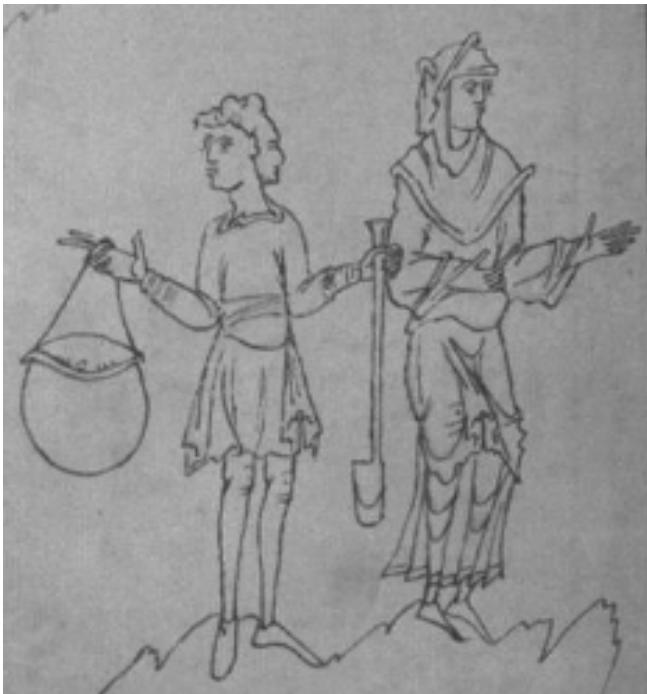

# A Learning Classifier Systems Bibliography

Tim Kovacs   
School of Computer Science   
University of Birmingham   
Birmingham B15 2TT   
United Kingdom   
Email: T.Kovacs@cs.bham.ac.uk   
Telephone: (44) 121 414 4773   
Pier Luca Lanzi   
Dipartimento di Elettronica e Informazione   
Politecnico di Milano   
Piazza Leonardo da Vinci 32   
I-20133 Milano - Italia   
Email: lanzi@elet.polimi.it   
Telephone: (39) 223993411

Technical Report: CSRP-99-19 December 15, 1999

# Abstract

We present a bibliography of all works we could find on Learning Classifier Systems (LCS) - the genetics-based machine learning systems introduced by John Holland. With over 400 entries, this is at present the largest bibliography on classifier systems in existence. We include a list of LCS resources on the world wide web.

  
Figure 1: The authors search the internet for LCS references.

# Introduction

Learning classifier systems (LCS) have a long and rich history. We hope this bibliography will both ilstrate this point and prove ausefulresourcefor resarchersAlthough thefirst classifer system, CS-, was reported in 1978 [233], the development of LCS was foreshadowed by some of Holland's earlier work [218, 219, 220] dating back as far as 1971. In the early 80's much progress was in the form of PhD theses [384, 37, 190, 349, 170] (but see also [423, 424]), following which LCS papers began to appear steadily in conferences. Later landmarks include the publication of books by Holland in 1986 [231] and Goldberg in 1989 [193], and the first and second international workshops on LCS, in 1992 and 1999 respectively.

As the bibliography shows, LCS papers appear in a wide range of conferences and journals. LCS resources on the world wide web include:

The LCS Web http://www.csm.uwe.ac.uk/\~ambarry/LCSWEB/

NetQ lets you question the author of an article. http://netq.rowland.org/

GA-list A mailing list about Genetic Algorithms. To subscribe mail: ga-list-request@aic.nrl.navy.mil with 'subscribe' in the body of the mail

GA-list archive http://www.aic.nrl.navy.mil/galist comp.ai.genetic A USENET news group, which provides a useful list of Frequently Asked Questions.

ENCORE (Evolutionary Computation Repository Network) http://www.cs.bham.ac.uk/Mirrors/ftp.de.uu.net/EC/clife/

The LCS Bibliography http://www.cs.bham.ac.uk/\~tyk/lcs/ Contributions and corrections can be mailed to the first author at: T.Kovacs@cs.bham.ac.uk

# Acknowledgements

Thank you to all those who contributed to the bibliography.

# Список литературы

[1] Emergent Computation. Proceedings of the Ninth Annual International Conference of the Center for Nonlinear Studies on Self-organizing, Collective, and Cooperative Phenomena in Natural and Artificial Computing Networks. A special issue of Physica D. Stephanie Forrest (Ed.), 1989.   
[2] Collected Abstracts for the First International Workshop on Learning Classifier System (IWLCS92), 1992. October 6-8, NASA Johnson Space Center, Houston, Texas.   
[3] Jose L. Aguilar and Mariela Cerrada. Reliability-Centered Maintenance Methodology-Based Fuzzy Classifer System Design for Fault Tolerance. In Koza et al. [260], page 621. One page paper.   
[4] Manu Ahluwalia and Larry Bull. A Genetic Programming-based Classifer System. In Banzhaf et al. [12], pages 11-18.   
[5] Rudol. Albrecht, Nigel C. Seele, andColinR.Reeves, editors Procing fthe Intetial Con on Artificial Neural Nets and Genetic Algorithms. Spring-Verlag, 1993.   
[6] Peter J. Angeline, Zbyszek Michalewicz, Marc Schoenauer, Xin Yao, and Ali Zalzala, editors. Procedings of the 1999 Congress on Evolutionary Computation CEC99, Washington (DC), 1999. IEEE Press.   
[7 W. Brian Arthur, John H. Holland, Blake LeBaron, Richard Palmer, and Paul Talyer. Asset Pricing Under Endogenous Expectations in an Artificial Stock Market. Technical report, Santa Fe Institute, 1996. This is the original version of LeBaron1999a.   
[8] Thomas Bäck, editor. Proceedings of the 7th International Conference on Genetic Algorithms (ICGA97). Morgan Kaufmann: San Francisco CA, 1997. [9] Thomas Bäck, David B. Fogel, and Zbigniew Michalewicz, editors. Handbook of Evolutionary Computation. Institute of Physics Publishing and Oxford University Press, 1997. http://www.iop.org/Books/Catalogue/.   
[10] Thomas Bäck, Ulrich Hammel, and Hans-Paul Schwefel. Evolutionary computation: Comments on the history and current state. IEEE Transactions on Evolutionary Computation, 1(1):3-17, 1997.   
[ .he e  as iCa ys.   . 712718.   
[12] Wolfgang Banzhaf, Jason Daida, Agoston E. Eiben, Max H. Garzon, Vasant Honavar, Mark Jakiela, and Robert E. Smith, editors. Proceedings of the Genetic and Evolutionary Computation Conference (GECCO99). Morgan Kaufmann: San Francisco, CA, 1999.   
[1] Alwyn Barry. The Emergence of High Level Structure in Classifer Systems - A Proposal. Irish Jounral f Psychology, 14(3):480498, 1993.   
[14] Alwyn Barry. Hierarchy Formulation Within Classifers System  A Review. In Goodman et al. [196], pages 195211.   
[5 Al Barry.Aia n XCS nd theoniv Stat roble:1 Ecs. In Bana  al. [2], 1926.   
[16] Alwyn Barry. Aliasing in XCS and the Consecutive State Problem: 2  Solutions. In Banzhaf et al. [12], pages 2734.   
[17] Richard J. Bauer. Genetic Algorithms and Investment Strategies. Wiley Finance Editions. John Wiley & Sons, 1994.   
[18] Richard K. Belew and Stephanie Forrest. Learning and Programming in Classifier Systems. Machine Learning, 3:193223, 1988.   
[19] Richard K. Belew and Michael Gherrity. Back Propagation for the Clasifier System. In Schaffer [351], pages 275281.   
[20] Hugues Bersini and Francisco J. Varela. Hints for Adaptive Problem Solving Gleaned From Immune Networks. In Schwefel and Männer [355], pages 343354.   
[21] Janine Beunings, Ludwig Bölkow, Bernd Heydemann, Biruta Kresling, Claus-Peter Lieckfeld, Claus Mattheck, Werner Nachtigal, Josef Reichholf, Bertram J. Schmidt, Veronika Straa, and Reinhard Witt. Bionik: Natur als Vorbild. WWF Dokumentationen. PRO FUTURA Verlag, Mnchen, 1993.   
[2] J. BiondiRobustness and evolution in an adaptive system application on classification task. In Abrht et al. [5], pages 463470.   
[23] Andrea Bonarini. ELF: Learning Incomplete Fuzzy Rule Sets for an Autonomous Robot. In Hans-Jürgen Zimmermann, editor, First European Congress on Fuzzy and Intelligent Technologies EUFIT'93, volume 1, pages 69-75, Aachen, D, September 1993. Verlag der Augustinus Buchhandlung.   
[24] Andrea Bonarini. Evolutionary Learning of General Fuzzy Rules with Biased Evaluation Functions: Competition and Cooperation. Proc. 1st IEEE Conf. on Evolutionary Computation, pages 51-56, 1994.   
[25] Andrea Bonarini. Learning Behaviors Represented as Fuzzy Logic Controllers. In Hans Jürgen Zimmermann, editor, Second European Congress on Intelligent Techniques and Soft Computing - EUFIT'94, volume 2, pages 710-715, Aachen, D, 1994. Verlag der Augustinus Buchhandlung.   
[26] Andrea Bonarini. Extending Q-learning to Fuzzy Classifier Systems. In Marco Gori and Giovanni Soda, etors, Procedings of the Italian Association forArtificial Intelligenc onTopic inArtificial Intelce, volume 992 of LNAI, pages 2536, Berlin, 1995. Springer.   
[27] Andrea Bonarini. Delayed Reinforcement, Fuzzy Q-Learning and Fuzzy Logic Controllers. In Herrera and Verdegay [216], pages 447466.   
[28] AndreaBonarini DelayedReinforcement, Fuzzy Q-Learning and Fuzzy LogicControllers. InF.Herrera and J. L. Verdegay, editors, Genetic Algorithms and Soft Computing, (Studies in Fuzziness, 8), pages 447466, Berlin, D, 1996. Physica-Verlag.   
[29] Andrea Bonarini. Evolutionary Learning of Fuzzy rules: competition and cooperation. In W. Pedrycz, editor, Fuzzy Modelling: Paradigms and Practice, pages 265284. Norwell, MA: Kluwer Academic Press, 1996ftp://ftp.elet.polimi.it/pub/Andrea.Bonarini/ELF/ELF-Pedrycz.ps.gz.   
[30] Andrea Bonarini. Anytime learning and adaptation of fuzzy logic behaviors. Adaptive Behavior Journal, 5(34):281315, 1997.   
[31] Andrea Bonarini. Reinforcement Distribution to Fuzzy Classifiers. In Proceedings of the IEEE World Congress on Computational Inteligence (WCCI) -Evolutionary Computation, pages 51-56. IEEE Computer Press, 1998.   
[32] AndreBonariiComparingreinorcement learninglgrithms appledto crisandfuzzy learning classie systems. In Banzhaf et al. [12], pages 5259.   
[33] Andrea Bonarini and Filippo Basso. Learning to compose fuzzy behaviors for autonomous agents. Int. Journal of Approximate Reasoning, 17(4):409-432, 1997.   
[34] Andrea Bonarini, Marco Dorigo, V. Maniezzo, and D. Sorrenti. AutonoMouse: An Experiment in Grounded Behaviors. In Procedings of GAA91  Second Italian Workshop on Machine Learning, Bari, Italy, 1991.   
[35] Pierre Bonelli and Alexandre Parodi. An Efficient Classifier System and its Experimental Comparison with two Representative learning methods on three medical domains. In Booker and Belew [44], pages 288295.   
[36] Pierre Bonei, Alexandre Parodi, Sandip Sen, and Stewart W. Wilson. NEWBOOLE: A Fast GBML System. In International Conference on Machine Learning, pages 153-159, San Mateo, California, 1990. Morgan Kaufmann.   
[37] Lashon B. Booker. Intelligent Behavior as an Adaptation to the Task Environment. PhD thesis, The University of Michigan, 1982.   
[38] Lashon B. Booker. Improving the performance of genetic algorithms in classifer systems. In Grefenstette [198], pages 8092.   
[39] Lashon B. Booker. Classifer Systems that Learn Internal World Models. Machine Learning, 3:161192, 1988.   
[40] Lashon B. Booker. Triggered rule discovery in classifier systems. In Schaffer [351], pages 265274.   
[41] Lashon B. Booker. Instinct as an Inductive Bias for Learning Behavioral Sequences. In Meyer and Wilson [288], pages 230237.   
[42] Lashon B. Booker. Representing Attribute-Based Concepts in a Classifer System. In Rawlins [315], pages 115127.   
[43] Lashon B. Booker.Viewig Classier Systems as n IntegratedArchitecture. In Coectd Abstracts r he First International Workshop on Learning Classifier System (IWLCS-92) [2]. October 68, NASA Johnson Space Center, Houston, Texas.   
[44] Lashon B. Booker and Richard K. Belew, editors. Proceedings of the 4th International Conference on Genetic Algorithms (ICGA91). Morgan Kaufmann: San Francisco CA, July 1991.   
[45] Lashon B. Booker, David E. Goldberg, and John H. Holland. Classifer Systems and Genetic Algorithms. Artificial Intelligence, 40:235282, 1989.   
[46] Lashon B. Booker, Rick L. Riolo, and John H. Holland. Learning and Representation in Classifier Systems. In Vassant Honavar and Leonard Uhr, editors, Artificial Intelligence and Neural Networks, pages 581613. Academic Press, 1994.   
[47] H. Brown Cribbs II and Robert E. Smith. Classifier System Renaissance: New Analogies, New Directions. In Koza et al. [262], pages 547552.   
[48] Will Browne. The Development of an Industrial Learning Classifier System for Application to a Steel Hot Strip Mill. PhD thesis, University of Wales, Cardiff, 1999.   
[49] Will Browne, Karen Holford, and Carolynne Moore. An Industry Based Development of the Learning Classifer System Technique. Submitted to: 4th International Conference on Adaptive Computing in Design and Manufacturing (ACDM 2000).   
[50] Will Browne, Karen Holford, Carolynne Moore, and John Bullock. The implementation of a learning classifier system for parameter identification by signal processing of data from steel strip downcoilers. In A. T. Augousti, editor, Software in Measurement. IEE Computer and Control Division, 1996.   
[51] Will Browne, Karen Holford, Carolynne Moore, and John Bullock. A Practical Application of a Learning Classifier System for Downcoiler Decision Support in a Steel Hot Strip Mill. Ironmaking and Steelmaking, 25(1):3341, 1997. Engineering Doctorate Seminar '97. Swansea, Wales, Sept. 2nd, 1997.   
[52] Will Browne, Karen Holford, Carolynne Moore, and John Bullock. A Practical Application of a Learning Classifer System in a Steel Hot Strip Mill. In Smith et al. [369], pages 611614.   
[53] Will Browne, Karen Holford, Carolyne Moore, and John Bullock. An Industrial Learning Classifier System: The Importance of Pre-Processing Real Data and Choice of Alphabet. To appear in: Engineering Applications of Artificial Intelligence, 1999.   
[54] Bryan G. Spohn and Philip H. Crowley. Complexity of Strategies and the Evolution of Cooperation. In Koza et al. [261], pages 521528.   
[55] Larry Bull. Artificial Symbiology:evolution in cooperative ulti-agentenvirnments. PhD thesis, Univerity of the West of England, 1995.   
[56] Larry Bull. Artificial Symbiogenesis. Artificial Life, 2(3):269-292, 1996.   
[57] Larry Bull. On ZCS in Multi-agent Environments. Lecture Notes in Computer Science, 1498:471480, 1998.   
[58] Larry Bull On Evolving Social Systems. Computational and Mathematical Organization Theory, 5(3):281- 298, 1999.   
[9] Larry Bull. On using ZCS in a Simulated Continuous Double-Auction Market. In Banzhaf et al. [12], pages 8390.   
[60] Larry BullandTerence C. Fogarty. Coevolving Communicating Clasifer Systems for Tracking. In Albrecht et al. [5], pages 522527.   
[61] Larry Bull and Terence C. Fogarty. Evolving Cooperative Communicating Classifer Systems. In A. V. Sebald and L. J. Fogel, editors, Proceedings of the Third Annual Conference on Evolutionary Programming, pages 308315, 1994.   
[2] Lary Bu ndTerence . Fgary. aral Evolution ai lasser tes. In roi of the 1994 IEEE Conference on Evolutionary Computing, pages 680-685. IEEE, 1994.   
[63] Larry Bull and Terence C. Fogarty. Evolutionary Computing in Cooperative Multi-Agent Systems. In Sandip Sen, editor, Proceedings of the 1996 AAAI Symposium on Adaptation, Coevolution and Learning in Multi-Agent Systems, pages 2227. AAAI, 1996.   
[64] Larry Bull and Terence C. Fogarty. Evolutionary Computing in Multi-Agent Environments: Speciation and Symbiogenesis. In H-M. Voigt, W. Ebeling, I. Rechenberg, and H-P. Schwefel, editors, Parallel Problem Solving from Nature - PPSN IV, pages 12-21. Springer-Verlag, 1996.   
[5] Larry Bul Terence C. Fogarty, S. Mikami, and J. G. Thomas. Adaptiv Gait Acqisionusing Mulagent Learning for Wall Climbing Robots. In Automation and Robotics in Construction XII, pages 80-86, 1995.   
[6] Larry Bull Terence C. Fogarty, and .Saith. Evolution in Multiagent Systems: Evolving Commuiing Classifier Systems for Gait in a Quadrupedal Robot. In Eshelman [148], pages 382388.   
[7] Larry Bull and O. Holland Internal and External Representations: A Comparison in Evolving the Ability to Count. In Proceedings of the First Annual Society for the Study of Artificial Intelligence and Simulated Behaviour Robotics Workshop, pages 11-14, 1994.   
[68] Martin Butz, David E. Goldberg, and Wolfgang Stolzmann. New challenges for an ACS: Hard problems and possible solutions. Technical Report 99019, University of Ilinois at Urbana-Champaign, Urbana, IL, October 1999.   
[9]C. L.Ramsey and John J. Grefenstete.Case-based initialization of genetic algorithms. In Forrest [173], pages 84-91. http://www.ib3.gmu.edu/gref/.   
[70] Alessio CamilClassifer systems in massively parallel architectures.Master's thesis, University Pisa, 1990. (In Italian).   
[71] Alessio Camilli and Roberto Di MeglioSistemi a classificatori su architetture a parallelismo massiccio. Technical report, Univ. Delgi Studi di Pisa, 1989.   
[72Alessio Camil, Roberto Di Meglio, F.Baiardi, M.Vanneschi, D. Montanari, and R. Serra. Classifer System Parallelization on MIMD Architectures. Technical Report 3/17, CNR, 1990.   
[73] Y. J.Cao, N. Ireson, Larry Buland R.Mils.esi  a Tra JuncinControler using a Class System and Fuzzy Logic. In Procedings of the Sixth International Conferenceon Computational Intelligence, Theory, and Applications. Springer-Verlag, 1999.   
[74] A. Carbonaro, G. Casadei, and A. Palareti. Genetic Algorithms and Classifer Systems in Simulating a Cooperative Behavior. In Albrecht et al. [5], pages 479483.   
[75] Brian Carse. Learning Anticipatory Behaviour Using a Delayed Action Classifer System. In Fogarty [160], pages 210223.   
[76] Brian Carse and Terence C. Fogarty. A delayed-action classifer for learning in temporal environments. In Proceedings of the 1st IEEE Conference on Evolutionary Computation, volume 2, pages 670-673, 1994.   
[7Brian Carse and Terence . Fogarty.AFuzzy Classier System Using the Pittsburgh Approach. In Davidor and Schwefel [102], pages 260269.   
[78] Brian Carse, Terence C. Fogarty, and A. Muro. Evolving fuzzy rule basd controles using geneti lgorithms. International Journal for Fuzzy Sets and Systems, 80:273293, 1996.   
[79] Brian Carse, Terence C. Fogarty, and A. Munro. The TemporalFuzzy Classifer Systemand its Application to Distributed Control in a Homogeneous Multi-Agent ecology. In Goodman et al. [196], pages 7686.   
[80] Brian Carse, Terence C. Fogarty, and Alistair Muro.Evolving Temporal Fuzzy Rule-Bases for Distriuted Routing Control in Telecommunication Networks. In Herrera and Verdegay [216], pages 467-488.   
[81  CrT . Fgr AsMurvozy le ba hic time: A temporal fuzzy classifier system. International Journal of Intelligent Systems, 13(issue 10-11):905 927, 1998.   
[2] G.Casadei, A. Palarei, and G. Prol.Claser System  Traffic Manet. In Albreht e al. [], 620627.   
[83] Keith Chalk and George D. Smith. Multi-Agent Classifer Systems and the Iterated Prisoner's Dilemma. In Smith et al. [369], pages 615618.   
[84] Keith W.Chalk and George D.Smith. The Co-evolution of Classifer Systems in a Competitive Environment. Poster presented at AISB94. Authors were from the University of East Anglia, U.K.   
[85] Dave Clif and S. G. Bullock. Adding 'Foveal Vision'to Wilson's Animat. Adaptive Behavior, 2(1):4770, 1993.   
[86] Dave Clif, Philip Husbands, Jean-Arcady Meyer, and Stewart W. Wilson, editors. From Animals to Animats 3. Proceedings of the Third International Conference on Simulation of Adaptive Behavior (SAB94). A Bradford Book. MIT Press, 1994.   
[87] Dave Clif and Susi Ross. Adding Temporary Memory to ZCS. Adaptive Behavior, 3(2):101150, 1995. Also technicalreport: ftp://ftp.cogs.susx.ac.uk/pub/reports/csrp/csrp347.ps.Z.   
[88] Dave Cliff and Susi Ross. Adding Temporary Memory to ZCS. Technical Report CSRP347, School of Cognitive and Computing Sciences, University of Sussex, 1995. ftp://ftp.cogs.susx.ac.uk/pub/reports/csrp/csrp347.ps.Z.   
[89] H. G.Cobb and John J. Grefenstette. Learning the persistence of actions in reactive control rules. In Proceedings 8th International Machine Learning Workshop, pages 293297. Morgan Kaufmann, 1991.   
[90] Philippe Collard and Cathy Escazut. Relational Schemata: A Way to Improve the Expressiveness of Classifiers. In Eshelman [148], pages 397404.   
[91] Marco Colombetti and Marco Dorigo. Learning to Control an Autonomous Robot by Distributed Genetic Algorithms. In Roitblat and Wilson [339], pages 305312.   
[92] Marco Colombetti and Marco Dorigo. Robot Shaping: Developing Situated Agents through Learning. Technical Report TR-92-040, International Computer Science Institute, Berkeley, CA, 1993.   
[93] Marco Colombetti and Marco Dorigo. Training Agents to Perform Sequential Behavior. Technical Report TR-93-023, International Computer Science Institute, Berkeley, CA, September 1993.   
[94] Marco Colombetti and Marco Dorigo. Training agents to perform sequential behavior. Adaptive Behavior, (32477599:/aulb.ac.be/pub/o/juals/IJ.0-ADAP94.ps.z.   
[95] Marco Colombetti and Marco Dorigo. Verso un'ingegneria del comportamento. Rivista di Automatica, Elettronica e Informatica, 83(10), 1996. In Italian.   
[96] Marco Colombetti and Marco Dorigo. Evolutionary Computation in Behavior Engineering. In Evolutionary CheApli a p ScbliS 1999. Also Tech. Report. TR/IRIDIA/1996-1, IRIDIA, Universit{'e Libre de Bruxelles.   
[97] Marco Colombetti, Marco Dorigo, and G. Borghi. Behavior Analysis and Training: A Methodology for Behavior Engineering. IEEE Transactions on Systems, Man and Cybernetics, 26(6):365-380, 1996.   
[98] Marco Colombetti, Marco Dorigo, and G. Borghi. Robot shaping: The HAMSTER Experiment. In M. Jamshidi et al., editor, Proceedings of ISRAM'96, Sixth International Symposium on Robotics and Manufacturing, May 2830, Montpellier, France, 1996.   
[99] M. Compiani, D. Montanari, R. Serra, and P. Simonini. Asymptotic dynamics of classifer systems. In Schaffer [351], pages 298303.   
100 M.Compiani D.Montanari, R. Serra, and P.Simonii Learnig and Bucket Brigade Dynamic in Classifer Systems. In Special issue of Physica D (Vol. 42) [1], pages 202212.   
11 M.Compiani, D. Montanari, R. Serra, and G. Valastro.Classifer systes and neural networks. In Parale Architectures and Neural Networks-First Italian Workshop, pages 105-118. World Scientific, Teaneck, NJ, 1989.   
102] Y.Davidor and H.P.Schwefel, editors. Parallel Problem Solving From Nature  PPSN II, volume 866f Lecture Notes in Computer Science, Berlin, 1994. Springer Verlag.   
103] Lawrence Davis. Mapping Classifier Systems into Neural Networks. In Proceedings of the Workshop on Neural Information Processing Systems 1, pages 4956, 1988.   
104] Lawrence Davis, editor. Genetic Algorithms and Simulated Annealing, Research Notes in Artificial Intelligence. Pitman Publishing: London, 1989.   
105] Lawrence Davis. Mapping Neural Networks into Classifier Systems. In Schaffer [351], pages 375378.   
106] Lawrence Davis.Covering and Memory in Classifier Systems. In Collected Abstracts for the First International Workshop on Learning Classifier System (IWLCS-92) [2]. October 6-8, NASA Johnson Space Center, Houston, Texas.   
[107] Lawrence Davis and David Orvosh. The Mating Pool: A Testbed for Experiments in the Evolution of Symbol Systems. In Eshelman [148], pages 405??   
[108] Lawrence Davis, Stewart W. Wilson, and David Orvosh. Temporary Memory for Examples can Speed Learning in a Simple Adaptive System. In Roitblat and Wilson [339], pages 313320.   
[9] Lwe av n . . Yo. Clas  i Ham Wighs. In roi International Conference on Machine Learning, pages 162173. Morgan Kaufmann, 1988.   
[0 Bar  Ber.Clasr Systes:useul apprch machie earig?Master' the LeideUnivy, 1994ftp://ftp.wi.leidenuniv.nl/pub/CS/MScTheses/deboer.94.ps.gz.   
[111] Kenneth A. De Jong. Learning with Genetic Algorithms: An Overview. Machine Learning, 3:121-138, 1988.   
[112] Daniel Derrig and James Johannes. Deleting End-of-Sequence Classifiers. In John R. Koza, editor, Late Breaking Papers at the Genetic Programming 1998 Conference, University of Wisconsin, Madison, Wisconsin, USA, July 1998. Stanford University Bookstore.   
[113] Daniel Derrig and James D. Johannes. Hierarchical Exemplar Based Credit Allocation for Genetic Classifer Systems. In Koza et al. [260], pages 622628.   
[1 .De eh . as ysc robots. In Collected Abstracts for the First International Workshop on Learning Classifier System (IWLCS92) [2]. October 6-8, NASA Johnson Space Center, Houston, Texas.   
[115] P. Devine, R. Paton, and M. Amos. Adaptation of Evolutionary Agents in Computational Ecologies. In BCEC-97, Sweden, 1997.   
[116] Jean-Yves Donnart and Jean-Arcady Meyer. Ahierarchical classifer system implementing a motivationally autonomous animat. In Cliff et al. [86], pages 144-153.   
[117] Jean-Yves Donnart and Jean-Arcady Meyer. Hierarchical-map Building and Self-positioning with MonaLysa. Adaptive Behavior, 5(1):29-74, 1996.   
[118] Jean-Yves Donnart and Jean-Arcady Meyer. Spatial Exploration, Map Learning, and Self-Positioning with MonaLysa. In Maes et al. [281], pages 204-213.   
[119] Marco Dorigo. Message-Based Bucket Brigade: An Algorithm or the Apportionment of Credit Problem. In Y. Kodratoff, editor, Proceedings of European Working Session on Learning '91, Porto, Portugal, number 482 in Lecture notes in Artificial Intelligence, pages 235-244. Springer-Verlag, 1991.   
[120] Marco Dorigo. New perspectives about default hierarchies formation in learning classifier systems. In E. Ardizzone, E.Gaglio, and S. Sorbello, editors, Proceedings of the 2nd Congress of the Italian Association for Artificial Intelligence $\left( A I ^ { * } I A \right)$ on Trends in Artificial Intelligence, volume 549 of LNAI, pages 218227, Palermo, Italy, October 1991. Springer Verlag.   
[121] Marco Dorigo. Using Transputers to Increase Speed and Flexibility of Genetic-based Machine Learning Systems. Microprocessing and Microprogramming, 34:147-152, 1991.   
[122] Marco Dorigo. Alecsys and the AutonoMouse: Learning to Control a Real Robot by Distributed Classifier System. Technical Report 92-011, Politecnico di Milano, 1992.   
[123] Marco Dorigo. Optimization, Learning and Natural Algorithms. PhD thesis, Politecnico di Milano, Italy, 1992. (In Italian).   
[24] Marc Dorio. Geneti and Non-Genec Operators nALECSYS. Evolui Comution, 1(2):15114, 1993. Also Tech. Report TR-92-075 International Computer Science Institute.   
[25] Marco DorioGliAgorim GeneticSiste aClassificatoriil ProblemadellAnimat.SistemiInteigenti, 3(93):401434, 1993. In Italian.   
[126] Marco Dorigo. Alecsys and the AutonoMouse: Learning to Control a Real Robot by Distributed Classifier Systems. Machine Learning, 19:209240, 1995.   
[127] Marco Dorigo. The Robot Shaping Approach to Behavior Engineering. Thése d'Agrégation de l'Enseignement Supérieur, Faculté des Sciences Appliquées, Université Libre de Bruxelles, pp.176, 1995.   
[128] Marco Dorigo and Hugues Bersini. A Comparison of Q-Learning and Classifer Systems. In Clif et al. [86], pages 248255.   
[129] Marco Dorigo and Marco Colombetti. Robot shaping: Developing autonomous agents through learning. Artificial Intelligence, 2:321370, 1994. ftp://iridia.ulb.ac.be/pub/dorigo/journals/IJ.05-AIJ94.ps.gz.   
[130] Marco Dorigo and Marco Colombetti. The Role of the Trainer in Reinforcement Learning. In S. Mahadevan et al., editor, Proceedings of MLC-COLT '94 Workshop on Robot Learning, July 10th, New Brunswick, NJ, pages 3745, 1994.   
[131] Marco Dorigo and Marco Colombetti. Précis of Robot Shaping: An Experiment in Behavior Engineering. Special Issue on Complete Agent Learning in Complex Environment, Adaptive Behavior, 5(3-4):391-405, 1997.   
[132] Marco Dorigo and Marco Colombetti. Reply to Dario Floreano's "Engineering Adaptive Behavior".Special Issue on Complete Agent Learning in Complex Environment, Adaptive Behavior, 5(34):417-420, 1997.   
[133] Marco Dorigo and Marco Colombetti. Robot Shaping: An Experiment in Behavior Engineering. MIT Press/Bradford Books, 1998.   
[134] Marco Dorigo and V. Maniezzo. Parallel Genetic Algorithms: Introduction and Overview of Current Research. In J. Stenders, editor, Parallel Genetic Algorithms: Theory and Applications, Amsterdam, 1992. IOS Press.   
[135] Marco Dorigo, V. Maniezzo, and D. Montanari. Classifier-based robot control systems. In IFAC/IFIP/IMACS International Symposium on Artificial Intelligence in Real-Time Control, pages 591- 598, Delft, Netherlands, 1992.   
[136] Marco Dorigo, Mukesh J. Patel, and Marco Colombetti. The effect of Sensory Information on Reinforcement Learning by a Robot Arm. In M. Jamshidi et al, editor, Proceedings of ISRAM'94, Fifth International Symposium on Robotics and Manufacturing, August 14-18, Maui, HI, pages 83-88. ASME Press, 1994.   
[137] Marco Dorigo and U. Schnepf. Organisation of Robot Behaviour Through Genetic Learning Processes. In Proceedings of ICAR'91 - Fifth IEEE International Conference on Advanced Robotics, Pisa, Italy, pages 1456-1460. IEEE Press, 1991.   
[138] Marco Dorigo and U. Schnepf. Genetics-based Machine Learning and Behaviour Based Robotics: A New Synthesis. IEEE Transactions on Systems, Man and Cybernetics, 23(1):141-154, 1993.   
[139] Marco Dorigo and E. Sirtori. A Parallel Environment for Learning Systems. In Proceedings of GAA91 - Second Italian Workshop on Machine Learning, Bari, Italy, 1991.   
[140] Marco Dorigo and Enrico Sirtori. Alecsys: A Parallel Laboratory for Learning Classifer Systems. In Booker and Belew [44], pages 296302.   
[141] Barry B. Druhan and Robert C. Mathews. THIYOS: A Classifier System Model of Implicit Knowledge in Artificial Grammars. In Proc. Ann. Cog. Sci. Soc., 1989.   
[142] DanelEckert and Johan Mitöhner.Modelig individualandndogenous learnig in ames:therelevance of classifier systems. In Complex Modeling for Socio-Economic Systems, SASA, Vienna, 1997.   
[14] Danl Eckert, Joha Miter, and Makus Moschr. Evolia aby ssus nd daptive ig in classifier systems. In OR'97 Conference on Operations Research, Vienna, 1997.   
[4 GEnen.Esczut.Class teevolvimuliagn tem i strbut. InAge et al. [6], pages 17401745.   
[145] Cathy Escazut and Philippe Colard. Learning Disjunctive Normal Forms in a Dual Classifer System. In Nada Lavra andStefan Wrobel, editors, Procedings f the th European Conference on MachineLearning, volume 912 of LNAI, pages 271274. Springer, 1995.   
[146] Cathy Escazut, Philippe Collard, and Jean-Louis Cavarero. Dynamic Management of the Specificity in Classifier Systems. In Albrecht et al. [5], pages 484-491.   
[147 Cathy Escazu and Terence . Fogarty.Coevolving Classifer ystes toControl Traf Signals. In John R. Koza, editor, Late Breaking Papers at the 1997 Genetic Programming Conference, Stanford University, CA, USA, July 1997. Stanford Bookstore.   
[148] Larry J. Eshelman, editor. Proceedings of the 6th International Conference on Genetic Algorithms (ICGA95). Morgan kaufmann Publishers: San Francisco CA, 1995.   
[149] Andrew Fairley and Derek F. Yates. Improving Simple Classifier Systems to alleviate the problems of Duplication, Subsumption and Equivalence of Rules. In Albrecht et al. [5], pages 408-416.   
[150] Andrew Fairley and Derek F. Yates. Inductive Operators and Rule Repair in a Hybrid Genetic Learning System: Some Initial Results. In Fogarty [160], pages 166179.   
[5] J.Doyne Farmer.ARosetta Stone or Connectionism. InSpecial issuef PhysicaD (ol. 2) [],pages 153187.   
[2] J. Doyne Farmer, N. H. Packrd, and A. S. Perelson. The Immue System, Adaptation & Learning. Physica D, 22:187204, 1986.   
[3 ranc Feern  Susan  orca. Iorn Theoy nd XTPITH:LarClasser System. In Bäck [8], pages 442449.   
[154] Francine Federman and Susan Fife Dorchak. Representation of Music in a Learning Classifier System. In Rad and Skowron, editors, Foundations of Intelligent Systems: Proceedings 10th International Symposium (ISMIS'97). Springer-Verlag: Heidelberg, 1997.   
[155] Francine Federman and Susan Fife Dorchak. A Study of Classifer Length and Population Size. In Koza et al. [260], pages 629634.   
[156] Rhonda Ficek. Genetic Algorithms. Technical Report NDSU-CS-TR-90-51, North Dakota State University. Computer Science and Operations Research, 1997.   
[157] Gary William Flake. The Computational Beauty of Nature. MIT Press, 1998. (Contains a chapter on ZCS).   
[158] eter Flecher. Smulating the useo fat money' in simplecommodity economy. Master's thess, Schools of Psychology and Computer Science, 1996.   
[159] Terence C. Fogarty.Co-evolving Co-operative Populations of Rules in Learning Control Systems. In Evolutionary Computing, AISB Workshop Selected Papers [160], pages 195209.   
[160] Terence C. Fogarty, editor. Evolutionary Computing, AB Workshop Selected Papers, number 865 in Lecture Notes in Computer Science. Springer-Verlag, 1994.   
[161] Terence C. Fogarty. Learning new rules and adapting old ones with the genetic algorithm. In G. Rzevski, editor, Artificial Intelligence in Manufacturing, pages 275-290. Springer-Verlag, 1994.   
[162] Terence C. Fogarty. Optimising Individual Control Rules and Multiple Communicating Rule-based Control Systems with Parallel Distributed Genetic Algorithms. IEE Journal of Control Theory and Applications, 142(3):211215, 1995.   
[163] Terence C. Fogarty, Larry Bul, and Brian Carse. Evolving Multi-Agent Systems. In J. Periaux and G. Winter, editors, Genetic Algorithms in Engineering and Computer Science, pages 3-22. John Wiley & Sons, 1995.   
[164] Terence C. Fogarty, Brian Carse, and Larry Bull. Classifier Systems  recent research. AISB Quarterly, 89:4854, 1994.   
[ TFy r ua s  , fuzzy rules and communication. Presented at the First International Workshop on Biologically Inspired Evolutionary Systems, Tokyo, 1995.   
[166] Terece C. Fogarty, Brin Carse, and A. Muro.Artifcal evolution f fuzzy rule bases which represent time: A temporal fuzzy classifier system. International Journal of Intelligent Systems, 13(1011):906927, 1998.   
. and Commerce. In Applications of Modern Heuristic Methods, pages 91-110. Alfred Waller Ltd, 1995.   
[168] David B. Fogel. Evolutionary Computation. The Fossil Record. Selected Readings on the History of Evolutionary Computation, chapter 16: Classifier Systems. IEEE Press, 1998. This is a reprint of (Holland and Reitman, 1978), with an added introduction by Fogel.   
[19] StephanieFost.A study  parallelis in the classfer syste and its aplication to classification in KL-ONE semantic networks. PhD thesis, University of Michigan, Ann Arbor, MI, 1985.   
[170] Stephanie Forrest. Implementing semantic network structures using the classifer system. In Grefenstette [198], pages 2444.   
[171] Stephanie Forrest. The Classifier System: A Computational Model that Supports Machine Inteligence. In International Conference on Parallel Processing, pages 711-716, Los Alamitos, Ca., USA, August 1986. IEEE Computer Society Press.   
[172] Stephanie Forrest. Parallelism and Programming in Classifier Systems. Pittman, London, 1991.   
[73] Stephane Forres, editor. Procedings fthe thInternational Conference n Genetic Algoriths (ICGA93). Morgan Kaufmann, 1993.   
[174] Stephane Forrest and JohH Miler. Emergent behavior in cassier systes. In Special issu  hysa D (Vol. 42) [1], pages 213217.   
[175] Stephanie Forrest, Robert E. Smith, and A. Perelson.Maintaining diversity with a genetic algorithm. In Collected Abstracts for the First International Workshop on Learning Classifier System (IWLCS-92) [2]. October 6-8, NASA Johnson Space Center, Houston, Texas.   
[176] Francesc Xavier Llorà i Fbrega and Josep Maria Garrell i Guiu. GENIFER: A Nearest Neighbour based Classifier System using GA. In Banzhaf et al. [12], page 797. One page poster paper.   
[177] Francine Federman and Gayle Sparkman and Stephanie Watt. Representation of Music in a Learning Classier SysteUtilizig Bac Chorals. I Banzaf  .] page78Oe page postr pe.   
[178] Peter W. Frey and David J. Slate. Letter Recognition Using Holland-Style Adaptive Classifiers. Machine Learning, 6:161182, 1991.   
[179] Leeann L. Fu. The XCS Classifer System and Q-learning. In John R. Koza, editor, Late Breaking Papers at the Genetic Programming 1998 Conference, University of Wisconsin, Madison, Wisconsin, USA, 1998. Stanford University Bookstore.   
[180] Takeshi Furuhashi, Ken Nakaoka, Koji Morikawa, and Yoshiki Uchikawa. Controlling Excessive Fuzziness in a Fuzzy Classifier System. In Forrest [173], pages 635-635.   
[181] Takeshi Furuhashi, Ken Nakaoka, and Yoshiki Uchikawa. A Study on Fuzzy Classifer System for Finding Control Knowledge of Multi-Input Systems. In Herrera and Verdegay [216], pages 489-502.   
[182] Santiago Garcia, Fermin Gonzalez, and Luciano Sanchez. Evolving Fuzzy Rule Based Classifers with GAP: AGramaticl Approach. In Riccaro oli, Peter Nordin, William B. Langon, and Terece C. Foy, editors, Genetic Programming, Proceedings f EuroGP'99, volume 1598 of LNCS, pages 203210, Goteborg, Sweden, May 1999. Springer-Verlag.   
[18] Andreas Geyer-Schulz. Fuzzy Classifer Systems. In Robert Lowen and Marc Roubens, editors, Fuzzy Logic: State of the Art, Series D: System Theory, Knowledge Engineering and Problem Solving, pages 345354, Dordrecht, 1993. Kluwer Academic Publishers.   
[184] Andreas Geyer-Schulz. Holland Classifer Systems. In Proceedings o the International Conference on APL (APL'95), volume 25 of APL Quote Quad, pages 43-55, New York, NY, USA, June 1995. ACM Press.   
[85]Antonella Giani Study  Parallel Cooperative Classifer Systems. In JohnR.Koza, editor, Late Breakig Papers at the Genetic Programming 1998 Conference, University of Wisconsin, Madison, Wisconsin, USA, July 1998. Stanford University Bookstore.   
[186] Antonella Giani, Fabrizio Baiardi, and Antonina Starita. Q-Learning in Evolutionary Rule-Based Systems. In Davidor and Schwefel [102], pages 270289.   
[87AntoneaGiani, A. Sticca F.Baiar and A. Starita. Q-learig andRedundancy Reduction iClassifer Systems with Internal State. In Claire Ndellc andCline Rouveirol, editors, Procedings f the 10th Europen Conference on Machine Learning (ECML-98), volume 1398 of LNAI, pages 364-369. Springer, 1998.   
[8] A. H.Gilbert, Frances Bel and Christine L. Valenzuela. Adaptive Learning o Process Control and Prot Optimisation using a Classifier System. Evolutionary Computation, 3(2):177-198, 1995.   
[189] Attilio Giordana and Filippo Neri. Searc-intensive concept induction. Evolutionary Computation, 3:375- 416, 1995.   
[190] David E. Goldberg. Computer-Aided Gas Pipeline Operation using Genetic Algorithms and Rule Learning. PhD thesis, The University of Michigan, 1983.   
[191] David E. Goldberg. Dynamic System Control using Rule Learning and Genetic Algorithms. In Proceedings of the 9th International Joint Conference on Artificial Inteligence (IJCAI-85), pages 588592. Morgan Kaufmann, 1985.   
[92] David E. Goldberg. Geneticalgorithms and rules learnin in dynamic system control. In Grefenstette [198], pages 815.   
[193] David E. Goldberg. Genetic Algorithms in Search, Optimization, and Machine Learning. Addison-Wesley, Reading, Mass., Wokingham, 1989.   
[94] David . Goldberg. Probabily Matchig, the Magitude  Reinomet, nd Classer yte Biig. Machine Learning, 5:407-425, 1990. (Also TCGA tech report 88002, U. of Alabama).   
[195] David E. Goldberg, Jeffrey Horn, and Kalyanmoy Deb. What Makes a Problem Hard for a Classifier System? In Collected Abstracts for the First International Workshop on Learning Classifier System (IWLCS-92) [2]. (Also tech. report 92007 Illinois Genetic Algorithms Laboratory, University of Illinois at UrbanaChampaign). Available from ENCORE (ftp://ftp.krl.caltech.edu/pub/EC/Welcome.html) in the section on Classifier Systems.   
[96] .G. Goodman, V.L. Uskov, andW. F. Punch, editors. Procig f the First Intrnatial Conence on Evolutionary Algorithms and their Application EVCA'96, Moscow, 1996. The Presidium of the Russian Academy of Sciences.   
[197] David Perry Greene and Stephen F. Smith. Using Coverage as a Model Building Constraint in Learning Classifier Systems. Evolutionary Computation, 2(1):6791, 1994.   
[198] John J. Grefenstette, editor.Proceedings of the 1st International Conference on Genetic Algorithms and their Applications (ICGA85). Lawrence Erlbaum Associates: Pittsburgh, PA, July 1985.   
[199] John J. Grefenstette. Multilevel Credit Assignment in a Genetic Learning System. In Proceedings of the 2nd International Conference on Genetic Algorithms (ICGA87) [200], pages 202207.   
[200] John J. Grefenstette, editor. Proceedings of the 2nd International Conference on Genetic Algorithms (ICGA87), Cambridge, MA, July 1987. Lawrence Erlbaum Associates.   
[201] John J. Grefenstette. Credit Assignment in Rule Discovery Systems Based on Genetic Algorithms. Machine Learning, 3:225245, 1988.   
[202] John J. Grefenstette.A System for Learning Control Strategies with GeneticAlgorithms. In Schar [351], pages 183190.   
[203] John J. Grefenstette. Lamarckian Learning in Multi-Agent Environments. In Booker and Belew [44], pages 303-310. http://www.ib3.gmu.edu/gref/publications.html.   
[204] John J. Grefenstette. Learning decision strategies with genetic algorithms. In Proc. Intl. Workshop on Analogical and Inductive Inference, volume 642 of Lecture Notes in Artificial Intelligence, pages 3550. Springer-Verlag, 1992. http://www.ib3.gmu.edu/gref/.   
[205] John J. Grefenstette. The Evolution of Strategies for Multi-agent Environments. Adaptive Behavior, 1:65 89, 1992. http://www.ib3.gmu.edu/gref/.   
[206] John J. Grefenstete. Using a genetic algorithm o lear behaviors r utonomous vehices. In Procing American Institute of Aeronautics and Astronautics Guidance, Navigation and Control Conference, pages 739749. AIAA, 1992. http://www.ib3.gmu.edu/gref/.   
[207] John J. Grefenstette. Evolutionary Algorithms in Robotics. In M. Jamshedi and C. Nguyen, editors, Robotics and Manufacturing: Recent Trends in Research, Education and Applications, v5. Proc. Fifth Intl. Symposium on Robotics and Manufacturing, ISRAM 94, pages 65-72. ASME Press: New York, 1994. http://www.ib3.gmu.edu/gref/.   
[208] John J. Grefenstete and H. G. Cobb. User's guide for SAMUEL, Version 1.3. Technical Report NRL Memorandum Report 6820, Naval Research Laboratory, 1991.   
[209] John J. Grefenstette, C. L. Ramsey, and Alan C. Schultz. Learning Sequential Decision Rules using Simulation Models and Competition. Machine Learning, 5(4):355-381, 1990. http://www.ib3.gmu.edu/gref/publications.html.   
[210] Adrian Hartley. Genetics Based Machine Learning as a Model of Perceptual Category Learning in Humans. Master's thesis, University of Birmingham, 1998. ftp://ftp.cs.bham.ac.uk/pub/authors/T.Kovacs/index.html.   
[211] Adrian Hartley.Accuracy-based ftness allows similar performance to humans in static anddynamicclassification environments. In Banzhaf et al. [12], pages 266-273.   
[212] U. Hartmann. Effcient Parallel Learning in Classifier Systems. In Albrecht et al. [5], pages 515521.   
[213] U. Hartmann. On the Complexity of Learning in Classifer Systems. In Davidor and Schweel [102], pages 280289. Republished in: ECAI 94. 11th European Conference on Artificial Intelligence. A Cohn (Ed.), pp.438442, 1994. John Wiley and Sons.   
[214] Marianne Haslev. A Classifier System for the Production by Computer of Past Tense Verb-Forms. Presented at a Genetic Algorithms Workshop at the Rowland Institute, Cambridge MA, Nov 1986, 1986.   
[215] Luis Miramontes Hercog. Hand-eye coordination: An evolutionary approach. Master's thesis, Department of Artificial Intelligence. University of Edinburgh, 1998.   
[16] F.Herrera and J. L. Verdegay, editors. Genetic Algorithms and Soft Computing, (Studies in Fuzziness, 8). Physica-Verlag, Berlin, 1996.   
[17] M. R. Hiiard, G. E. Liepins, Mark Palmer, Michael Morrow, and Jon Richardson. A classifer based system for discovering scheduling heuristics. In Grefenstette [200], pages 231235.   
[18] John H. Holland. Processig and processors or schemata. In E. L. Jacks, editor, Associativeinormatin processing, pages 127-146. New York: American Elsevier, 1971.   
[219] John H. Holland. Adaptation in Natural and Artificial Systems. University of Michigan Press, Ann Arbor, 1975. Republished by the MIT press, 1992.   
[220] John H. Holland. Adaptation. In R. Rosen and F. M. Snel editors, Progress in theoretical biology. New York: Plenum, 1976.   
[221] John H. Holland. Adaptive algorithms for discovering and using general patterns in growing knowledge bases. International Journal of Policy Analysis and Information Systems, 4(3):245268, 1980.   
[222] John H. Holland. Genetic Algorithms and Adaptation. Technical Report 34, University of Michigan. Department of Computer and Communication Sciences, Ann Arbor, 1981.   
[3 John H. Holland.Escapibrittene. In Proceding Second Interatial Workshop nMachie Lear, pages 9295, 1983.   
[224] John H. Holland. Properties of the bucket brigade. In Grefenstette [198], pages 1-7.   
[225] John H. Holland. A Mathematical Framework for Studying Learning in a Classifier System. In Doyne Farmer, Alan Lapedes, Norman Packard, and Burton Wendroff, editors, Evolution, Games and Learning: Models for Adaptation in Machines and Nature, pages 307-317, Amsterdam, 1986. North-Holland.   
[226] John H. Holland. A Mathematical Framework for Studying Learning in Classifier Systems. Physica D, 22:307317, 1986.   
[JohH. Holland. Escaping Brittene: The possibiliti  General-urpose LearnigAlgoriths Applo Parall Rule-Based Systems. In Mitchell, Michalski, and Carbonell, editors, Machine learning, an artificial intelligence approach. Volume II, chapter 20, pages 593623. Morgan Kaufmann, 1986.   
[228] John H. Holland. Genetic Algorithms and Classifier Systems: Foundations and Future Directions. In Grefenstette [200], pages 8289.   
[229] John H. Holland. Concerning the Emergence of Tag-Mediated Lookahead in Classifer Systems. In Special issue of Physica D (Vol. 42) [1], pages 188201.   
[230] John H. Holland and Arthur W. Burks. Adaptive Computing System Capable of Learning and Discovery. Patent 4697242 United States 29 Sept., 1987.   
[231] John H. Holland, Keith J. Holyoak, Richard E. Nisbett, and P. R. Thagard. Induction: Processes of Inference, Learning, and Discovery. MIT Press, Cambridge, 1986.   
[232] John H. Holland, Keith J. Holyoak, Richard E. Nisbett, and Paul R. Thagard. Classifer Systems, QMorphisms, and Induction. In Davis [104], pages 116-128.   
[3] John H. Holland and J. S. Reitman. Cognitive systems based on adaptive algorithms. In D. A. Waterman and F. Hayes-Roth, editors, Pattern-directed inference systems. New York: Academic Press, 1978. Reprinted in:Evolutionary Computation. The Fossil Record. David B. Fogel (Ed.) IEEE Press, 1998. ISBN: 0-7803- 3481-7.   
[234] John H. Holmes. Evolution-Assisted Discovery of Sentinel Features in Epidemiologic Surveillance. PhD thesis, Drexel Univesity, 1996. http://cceb.med.upenn.edu/holmes/disstxt.ps.gz.   
[235] John H. Holmes. Discovering Risk of Disease with a Learning Classifier System. In Bäck [8]. http://cceb.med.upenn.edu/holmes/icga97.ps.gz.   
[236] John H. Holmes. Differential negative reinforcement improves classifier system learning rate in two-class problems with unequal base rates. In Koza et al. [260], pages 635642. http://cceb.med.upenn.edu/holmes/gp98.ps.gz.   
[237] Keith J. Holyoak, K. Koh, and Richard E. Nisbett. A Theory of Conditioning: Inductive Learning within Rule-Based Default Hierarchies. Psych. Review, 96:315-340, 1990.   
[238] Jeffey Horn and David E. Goldberg. Natural Niching for Cooperative Learning in Classifer Systems. In Koza et al. [262], pages 553564.   
[239] Jeffey Horn and David E. Goldberg. Towards a Control Map for Niching. In Foundations of Genetic Algorithms, pages 287310, 1998.   
[240] Jeffey Horn, David E. Goldberg, and Kalyanmoy Deb. Implicit Niching in a Learning Classifier System: Nature's Way. Evolutionary Computation, 2(1):37-66, 1994.   
[241] Dijia Huang. A framework for the credit-apportionment process inrule-base systems.IEEE Transaction on System Man and Cybernetics, 1989.   
[242] Dijia Huang. Credit Apportionment in Rule-Based Systems: Problem Analysis and Algorithm Synthesis. PhD thesis, University of Michigan, 1989.   
[243] Dijia Huang. The Context-Array Bucket-Brigade Algorithm: An Enhanced Approach to CreditApportionment in Classifier Systems. In Schaffer [351], pages 311-316.   
[244] Francesc Xavier Llorà i Fbrega. Automatic Classification using genetic algorithms under a Pittsburgh approach. Master's thesis, Enginyeria La Salle - Ramon Llull University, 1998. http://www.salleurl.edu/xevil/Work/index.html.   
[245] Francesc Xavier Llorài Fàbrega, Josep Maria Garrell  Guiu, and Ester Bernai Mansila. A Classifer System based on Genetic Algorithm under the Pittsburgh aproach for problems with real valued attributes. In Viceng Torra, editor, Proceedings of Artificial Intelligence Catalan Workshop (CCIA98), volume 14-15, pages 8593. ACIA Press, 1998. In Catalan http://www.salleurl.edu/\~xevil/Work/index.html.   
[246 Jose Maria Garrel Gui, Elisabet Golobards Ribé, EsterBera Mansila, andFrancc XavirLoà i Fàbrega. Automatic Classification of mammary biopsy images with machine learning techniques. In E. Alpaydin, editor, Proceedings of Engineering of Intelligent Systems $\left( E I S ^ { \prime }vartheta \vartheta \right)$ , volume 3, pages 411418. ICSC Academic Press, 1998. http://www.salleurl.edu/\~xevil/Work/index.html.   
[247 Jose MaraGarel Gui,Elisabe Golobars Ribé, EsterBer Mansa,andFranc Xavro i Fàbrega. Automatic Diagnosis with Genetic Algorithms and Case-Based Reasoning. To appear in AIENG Journal, 1999. (This is an expanded version of Guiu98a).   
[248] H. Iba, H. de Garis, and T. Higuchi. Evolutionary Learning of Predatory Behaviors Based on Structured Classifiers. In Roitblat and Wilson [339], pages 356363.   
[249] John H. Holmes. Evaluating Learning Classifer System Performance In Two-Choice Decision Tasks: An LCS Metric Toolkit. In Banzhaf et al. [12], page 789. One page poster paper.   
[250] John J. Grefenstette and Alan C. Schultz. An evolutionary approach to learning in robots. In Machine Learning Workshop on Robot Learning, New Brunswick, NJ, 1994. http://www.ib3.gmu.edu/gref/.   
[251] Kenneth A. De Jong and William M. Spears. Learning Concept Classification Rules using Genetic Algorithms. In Proceedings of the Twelth International Conference on Artificial Intelligence IJCAI-91, volume 2, 1991.   
[252] Hiroaki Kitano, Stephen F. Smith, and Tetsuya Higuchi. GA-1: A Parallel Associative Memory Processor for Rule Learning with Genetic Algorithms. In Booker and Belew [44], pages 311-317.   
[253] Leslie Knight and Sandip Sen. PLEASE: A Prototype Learning System using Genetic Algorithms. In Eshelman [148], pages 429-??   
[254] Kostyantyn Korovkin and Robert Richards. Visual Auction: AClassifer System Pedagogical and Researcher Tool. In Scott Brave and Annie S. Wu, editors, Late Breaking Papers at the 1999 Genetic and Evolutionary Computation Conference (GECCO-99), pages 159-163, 1999.   
[255] Tim Kovacs. Evolving Optimal Populations with XCS Classifier Systems. Master's thesis, School of Computer Science, University of Birmingham, Birmingham, U.K., 1996. Also tech. report CSR-96-17 and CSRP-96-17 ftp://ftp.cs.bham.ac.uk/pub/tech-reports/1996/CSRP-96-17.ps.gz.   
[256] Tim Kovacs. Steady State Deletion Techniques in a Classifier System. Unpublished document  partially subsumed by Kovacs1999a 'Deletion Schemes for Classifier Systems', 1997.   
[257] Tim Kovacs. XCS Classifier System Reliably Evolves Accurate, Complete, and Minimal Representations for Boolean Functions. In Roy, Chawdhry, and Pant, editors, Soft Computing in Engineering Design and Manufacturing, pages 59-68. Springer-Verlag, London, 1997. ftp://ftp.cs.bham.ac.uk/pub/authors/T.Kovacs/index.html.   
[258] Tim Kovacs. XCS Classifier System Reliably Evolves Accurate, Complete, and Minimal Representations for Boolean Functions. Technical Report Version. Technical Report CSRP-97-19, School of Computer Science, University of Birmingham, Birmingham, U.K., 1997. http://www.cs.bham.ac.uk/system/techreports/tr.html.   
[9] Tim Kovacs. Deleion shemes or lassifer ystems. In Banzhaf e al. [2], pages 32936.Alsotechnil eport CSRP-99-08, School of Computer Science, University of Birmingham. http://www.cs.bham.ac.uk/tyk.   
[260] John R. Koza, Wolfgang Banzhaf, Kumar Chellapilla, Kalyanmoy Deb, Marco Dorigo, David B. Fogel, Max H. Garzon, David E. Goldberg, Hitoshi Iba, and Rick Riolo, editors. Genetic Programming 1998: Proceedings of the Third Annual Conference. Morgan Kaufmann: San Francisco, CA, 1998.   
[261] John R. Koza, Kalyanmoy Deb, Marco Dorigo, David B. Fogel, Max H. Garzon, Hitoshi Iba, and Rick Riolo, editors. Genetic Programming 1997: Procedings of the Second Annual Conference. Morgan Kaufmann: San Francisco, CA, 1997.   
[262] John R. Koza, David E. Goldberg, David B. Fogel, and Rick L. Riolo, editors. Genetic Programming 1996: Proceedings of the First Annual Conference, Stanford University, CA, USA, 1996. MIT Press.   
[263] Pier Luca Lanzi. A Model of the Environment to Avoid Local Learning (An Analysis of the Generalization Mechanism of XCS). Technical Report 97.46, Politecnico di Milano. Department of Electronic Engineering and Information Sciences, 1997. http://ftp.elet.polimi.it/people/lanzi/report46.ps.gz.   
[264] Pier Luca Lanzi. A Study of the Generalization Capabilities of XCS. In Bäck [8], pages 418425. http://ftp.elet.polimi.it/people/lanzi/icga97.ps.gz.   
[265] Pier Luca Lanzi. Solving Problems in Partially Observable Environments with Classifier Systems (Experiments on Adding Memory to XCS). Technical Report 97.45, Politecnico di Milano. Department of Electronic E9/o/a.   
[266] Pier Luca Lanzi. Adding Memory to XCS. In Proceedings of the IEEE Conference on Evolutionary Computation (ICEC98).IEEE Press, 1998.http://ftp.elet.polimi.it/people/lanzi/icec98.ps.z.   
[267] Pier Luca Lanzi. An analysis of the memory mechanism of XCSM. In Koza et al. [260], pages 643651. http://ftp.elet.polimi.it/people/lanzi/gp98.ps.gz.   
[8 Per LucaLanzi. Genelizaio  Wilso' XCS. In A.E. Eibe, T. Bäck, M.Shou, and H.- See, editors, Proceedings of the Fifth International Conference on Parallel Problem Solving From Nature  PPSN V, number 1498 in LNCS. Springer Verlag, 1998.   
[269] Pier Luca Lanzi. An Analysis of Generalization in the XCS Classifier System. Evolutionary Computation, 7(2):125149, 1999.   
[270] Pier Luca Lanzi. Extending the Representation of Classifier Conditions Part I: From Binary to Messy Coding. In Banzhaf et al. [12], pages 337-344.   
[271] Pier Luca Lanzi. Extending the Representation of Classifier Conditions Part II: From Messy Coding to S-Expressions. In Banzhaf et al. [12], pages 345352.   
[272] Pier Luca Lanzi and Marco Colombetti. An Extension of XCS to Stochastic Environments. Technical Report 98.85, Dipartimento di Elettronica e Informazione - Politecnico di Milano, 1998.   
[273] Pier Luca Lanzi and Marco Colombetti. An Extension to the XCS Classifer System for Stochastic Environments. In Banzhaf et al. [12], pages 353-360.   
[274] Pier Luca Lanzi and Stewart W. Wilson. Optimal classifier system performance in non-Markov environments. Technical Report 99.36, Dipartimento di Elettronica e Informazione - Politecnico di Milano, 1999. Also IlliGAL tech. report 99022, University of Illinois.   
[75] Blake Lebaron, W. BrinArthur, and R. Palmer. The Time Seris roperis of an Artical Stock Market. Journal of Economic Dynamics and Control, 1999.   
[276] T. Lettau and H. Uhlig. Rules of Thumb and Dynamic Programming. Technical report, Department of Economics, Princeton University, 1994.   
[2] Gunar E. Liepins, M. R. Hillard, M. Palmer, and G. Rangarajan. Credit Assignment and Discovery in Classifier Systems. International Journal of Intelligent Systems, 6:5569, 1991.   
[278] Gunar E. Liepins, Michael R. Hilliard, Mark Palmer, and Gita Rangarajan. Alternatives for Classifier System Credit Assignment. In Proceedings of the Eleventh International Joint Conference on Artificial Intelligence (IJCAI-89), pages 756761, 1989.   
[279] Gunar E. Liepins and Lori A. Wang. Classifier System Learning of Boolean Concepts. In Booker and Belew [44], pages 318323.   
[280] Derek A. Linkens and H. Okola Nyongesah. Genetic Algorithms for zzy control - Part II: Of-ine ystem development and application. Technical Report CTA/94/2387/1st MS, Department of Automatic Control and System Engineering, University of Sheffield, U.K., 1994.   
[281] Pattie Maes, Maja J. Mataric, Jean-Arcady Meyer, Jordan Pollack, and Stewart W. Wilson, editors From Animals to Animats 4. Proceedings of the Fourth International Conference on Simulation of Adaptive Behavior (SAB96). A Bradford Book. MIT Press, 1996.   
[282] Chikara Maezawa and Masayasu Atsumi. Collaborative Learning Agents with Strutural Classifier Systems. In Banzhaf et al. [12], page 777. One page poster paper.   
[283] Bernard Manderick. Selectionist Categorization. In Schwefel and Männer [355], pages 326-330.   
[284] Ramon Marimon, Ellen McGrattan, and Thomas J. Sargent. Money as a Medium of Exchange in an Economy with Artificially Intelligent Agents. Journal of Economic Dynamics and Control, 14:329-373, 1990. Also Tech. Report 89-004, Santa Fe Institute, 1989.   
[285] Maja J Mataric. A comparative analysis of reinforcement learning methods. A.I. Memo No. 1322, Massachusetts Institute of Technology, 1991.   
[286] Alaster D. McAulay and Jae Chan Oh. Image Learning Classifer System Using Genetic Algorithms. In Proceedings IEEE NAECON '89, 1989.   
[287] Chris Melhuish and Terence C. Fogarty. Applying A Restricted Mating Policy To Determine State Space Niches Using Immediate and Delayed Reinforcement. In Fogarty [160], pages 224-237.   
[288] J. A. Meyer and S. W. Wilson, editors. From Animals to Animats 1. Proceedings of the First International Conference on Simulation of Adaptive Behavior (SAB90). A Bradford Book. MIT Press, 1990.   
[289] Zbigniew Michalewicz. Genetic Algorithms + Data Structures $=$ Evolution Programs. Springer-Verlag, 1996. Contains introductory chapter on LCS.   
[90 JohnH. Mir and Stephanie Forrest. The ynamical behavior  classier ystems. In Schafer [51], pas 304310.   
[291] Johann Mitlöhner. Classifer systems and economic modelling. In APL '96. Proceedings of the APL 96 conference on Designing the future, volume 26 (4), pages 77-86, 1996.   
[292] Chilukuri K. Mohan. Expert Systems: A Modern Overview. Kluwer, to appear in 2000. Contains an introdutory survey chapter on LCS.   
[293] D.MontanarClass stes with constant-prol buckebriade. In CollecAbstracts orheF International Workshop on Learning Classifier System (IWLCS-92) [2]. October 6-8, NASA Johnson Space Center, Houston, Texas.   
[294] D. E. Moriarty, Alan C. Schultz, and John J. Grefenstette. Evolutionary algorithms for reinforcement learning. Journal of Artificial Intelligence Research, 11:199-229, 1999. http://www.ib3.gmu.edu/gref/papers/moriarty-jair99.html.   
[295] Rémi Munos and Jocelyn Patinel. Reinforcement learning with dynamic covering of state-action space: Partitioning Q-learning. In Cliff et al. [86], pages 354-363.   
[296] Jorg Muruzábal. Mining the space of generality with uncertainty-concerned cooperative classifers. In Banzhaf et al. [12], pages 449457.   
[297] Ichiro Nagasaka and Toshiharu Taura. 3D Geometic Representation for Shape Generation using Classifer System. In Koza et al. [261], pages 515-520.   
[298] Filippo Neri. First Order Logic Concept Learning by means of a Distributed GeneticAlgorithm. PhD thesis, University of Milano, Italy, 1997.   
[299] Filippo Neri and Attiio Giordana. A distributegeneticalgrithm or cncpt laring In Eshelman [148], pages 436443.   
[300] Filipo Neri and L. Saitta.Exploring the power f genetic search in learning symbolic classifers.IEEE Trans. on Pattern Analysis and Machine Intelligence, PAMI-18:1135-1142, 1996.   
[301] Volker Nissen and Jörg Biethahn. Determining a Good Inventory Policy with a Genetic Algorithm. In Jög Biethahn and Volker Nissen, editors, Evolutionary Algorithms in Management Applications, pages 240249. Springer Verlag, 1995.   
[302] Jae Chan Oh. Improved Classifier System Using Genetic Algorithms. Master's thesis, Wright State University, ??   
[303] Norihiko Ono and Adel T. Rahmani. Self-Organization of Communication in DistributedLearning Classifier Systems. In Albrecht et al. [5], pages 361-367.   
[304] F. Oppacher and D. Deugo. The Evolution of Hierarchical Representations. In Procedings of the 3rd European Conference on Artificial Life. Springer-Verlag, 1995.   
[305] Alexandre Parodi and P. Bonelli. The Animat and the Physician. In Meyer and Wilson [288], pages 5057.   
[306] Alexandre Paroi and Pierre Bonelli. A New Approach to Fuzzy Classifer Systems. In Forrest [173], pages 223230.   
[307] Mukesh J. Patel, Marco Colombetti, and Marco Dorigo. Evolutionary Learning for Intelligent Automation: A Case Study. Intelligent Automation and Soft Computing, 1(1):29-42, 1995.   
[308] Mukesh J. Patel and Marco Dorigo. Adaptive Learning of a Robot Arm. In Fogarty [160], pages 180194.   
[309] Mukesh J. Patel and U. Schnep. Concept Formation as Emergent Phenomena. In Francisco J. Varela and P. Bourgine, editors, Procedings First European Conference on Artificial Life, pages 11-20. MIT Press, 1992.   
[310] Rolf Pfeifer, Bruce Blumberg, Jean-Arcady Meyer, and Stewart W. Wilson, editors. From Animals to Animats 5. Proceedings of the Fifth International Conference on Simulation of Adaptive Behavior (SAB98). A Bradford Book. MIT Press, 1998.   
[31] Steven E. Phelan. Using Artificial Adaptive Agents to Explore StrategicLandscapes. PhD thesis, School of Business, Faculty of Law and Management, La Trobe University, Australia, 1997.   
[312] A. G. Pipe and Brin Carse. A Comparison between two Architectures for Searching and Learning in Maze Problems. In Fogarty [160], pages 238249.   
[313] R. Piroddi and R. Rusconi. A Parallel Classier System to Solve Learning Problems. Master's thesis, Dipartimento di Elettronica e Informazione, Politecnico di Milano, Milano, Italy., 1992.   
[314] C. L. Ramsey and John J. Grefenstette. Case-based anytime learning. In Case-Based Reasoning: Papers from the 1994 Workshop, D. W. Aha (Ed.). Technical Report WS-94-07, AAAI Press: Menlo Park, CA, 1994. http://www.ib3.gmu.edu/gref/.   
[15] Gregory J. E. Rawlins, editor.Procedings of the First Workshop on Foundations f Genetic Algorithms (FOGA91). Morgan Kaufmann: San Mateo, 1991.   
[316] Robert A. Richards. Zeroth-Order Shape Optimization Utilizing a Learning Classifier System. PhD thesis, Stanford University, 1995. Online version available at: http://wwwleland.stanford.edu/\~buc/SPHINcsX/book.html.   
[317] Robert A. Richards. Clasifier System Metrics: Graphical Depictions. In Koza et al. [260], pages 652657.   
[318] Robert A. Richards and Sheri D. Sheppard. Classifer System Based Structural Component Shape Improvement Utilizing I-DEAS. In Iccon User's Conference Proceeding. Iccon, 1992.   
[319] Robert A. Richards and Sheri D. Sheppard Learning Classifer Systems in Design Optimization. In Design Theory and Methodology '92. The American Society of Mechanical Engineers, 1992.   
[320] Robert A. Richards and Sheri D. Sheppard. Two-dimensional Component Shape Improvement via Classifier System. In Artificial Intelligence in Design '92. Kluwer Academic Publishers, 1992.   
[321] Robert A. Richards and Sheri D. Sheppard. A Learning Classifier System for Three-dimensional Shape Optimization. In H. M. Voigt, W. Ebeling, I. Rechenberg, and H. P. Schwefel, editors, Parallel Problem Solving from Nature - PPSN IV, volume 1141 of LNCS, pages 1032-1042. Springer-Verlag, 1996.   
[322] Robert A. Richards and Sheri D. Sheppard. Three-Dimensional Shape Optimization Utilizing a Learning Classifier System. In Koza et al. [262], pages 539546.   
[323] Rick L. Riolo. Bucket Brigade Performance: I. Long Sequences of Classifers. In Grefenstette [200], pages 184195.   
[324] Rick L. Riolo. Bucket Brigade Performance: II. Default Hierarchies. In Grefenstette [200], pages 196201.   
[325] Rick L. Riolo. CFS-C: A Package of Domain-Independent Subroutines for Implementing Classifier Systems in Arbitrary User-Defined Environments. Technical report, University of Michigan, 1988.   
[326] Rick L. Riolo. Empirical Studies of Default Hierarchies and Sequences of Rules in Learning Classifier Systems. PhD thesis, University of Michigan, 1988.   
[327] Rick L. Riolo. The Emergence of Coupled Sequences of Classifiers. In Schaffer [351], pages 256264.   
[328] Rick L. Riolo. The Emergencef Default Hierarchies in Learning Claser Systems. In Schaffer [51, pages 322327.   
[329] Rick L. Riolo. Lookahead Planning and Latent Learning in a Classifier System. In Meyer and Wilson [288], pages 316326.   
[330] Rick L. Riolo. Modeling Simple Human Category Learning with a Classifier System. In Booker and Belew [44], pages 324333.   
[RRTheue piass. l for the First International Workshop on Learning Classfier System (IWLCS-92) [2]. October 68, NASA Johnson Space Center, Houston, Texas.   
[332] Joaquin Rivera and Roberto Santana. Improving the Discovery Component of Classifier Systems by the Application of Estimation of Distribution Algorithms. In Proceedings of Student Sessions ACAI'99: Machine Learning and Applications, pages 43-44, Chania, Greece, July 1999.   
[333] Gary Roberts. A Rational Reconstruction of Wilson's Animat and Holland's CS-1. In Schaffer [351].   
[334] Gary Roberts. Dynamic Planning for Classifier Systems. In Forrest [173], pages 231-237.   
[335] George G. Robertson. arall Implementation f Genetic Algorithmsin a Classifer System. In Grefenstette [200], pages 140-147. Also Tech. Report TR-159 RL87-5 Thinking Machines Corporation.   
[36] George G. Robertson.Population Size in Classifier Systems. In Proceedings of the Fifth International Conference on Machine Learning, pages 142-152. Morgan Kaufmann, 1988.   
[337 George G. Robertson. Parallel Implementation of Genetic Algorithms in a Classifier System. In Davis [104], pages 129140.   
[338] George G Robertson and Rick L. Riolo. A Tale of Two Classifer Systems. Machine Learning, 3:139159, 1988.   
[339] J. A. Meyer H. L. Roitblat and S. W. Wilson, editors. From Animals to Animats 2. Proceedings of the Second International Conference on Simulation of Adaptive Behavior (SAB92). A Bradford Book. MIT Press, 1992.   
[340] S. Ross. Accurate Reaction or Reflective Action? Master's thesis, School of Cognitive and Computing Sciences, University of Sussex, 1994.   
[341] A.Sanchis, J. M.Molia, P. Isasi, and J. Segovia.Kowledge acquisition including tags in a cassifier system. In Angeline et al. [6], pages 137-144.   
[342] Adrian V. Sannier and Erik D. Goodman. Midgard: A Genetic Approach to Adaptive Load Balancing for Distributed Systems. In Proc. Fifth Intern. Conf. Machine Learning. Morgan Kaufmann, 1988.   
[343] Cédric Sanza, Christophe Destruel, and Yves Duthen. Agents autonomes pour linteraction adaptative dans les mondes virtuels. In 5ème Journées de l'Association Francaise d'Informatique Graphique. Décembre 1997, Rennes, France, 1997. In French.   
[344] Cédric Sanza, Christophe Destruel, and Yves Duthen. A learning method for adaptation and evolutionin virtual environments. In 3rd International Conference on Computer Graphics and Artificial Intelligence, April 1998, Limoges, France, 1998.   
[345] Cédric Sanza, Christophe Destruel, and Yves Duthen. Autonomous actors in an interactive real-time environment. In ICVC'99 International Conference on Visual Computing Feb. 1999, Goa, India, 1999.   
[346] Cédric Sanza, Christophe Destruel, and Yves Duthen. Learning in real-time environment based on classifiers system. In 7th International Conference in Central Europe on Computer Graphics, Visualization and Interactive Digital Media'99, Plzen, Czech Republic, 1999.   
[347] CédricSanza, Cyril Panatier, HervéLuga, and Yves Duthen. Adaptive Behavior for Cooperation: a Virtual Reality Application. In 8th IEEE International Workshop on Robot and Human Interaction September 1999, Pisa, Italy, 1999.   
[348 Andrs Schacher.Aclassifer ystem with integrated gene perators. In H.-P. Schwel and R. Mnr, editors, Parallel Problem Solving from Nature, volume 496 of Lecture Notes in Computer Science, pages 331337, Berlin, 1990. Springer.   
[349] J. David Schafer. Some experiments in machine learning using vector evaluated genetic algorithms. PhD thesis, Vanderbilt University, Nashville, 1984.   
[350] J. David Schaffer. Learning Multiclass Pattern Discrimination. In Grefenstette [198], pages 7479.   
[51] J.Davi Schaffr, editor. Procdingsf the rd Internatinal Conference n GeneicAlgorithms (ICGA), George Mason University, June 1989. Morgan Kaufmann.   
[lanculz nd Jo.Greenee. volviRoboBehavios. osterat heArtial on. http://www.ib3.gmu.edu/gref/.   
3Alan .Schultz and JohnJ.Grefetete. IproviTactial Plans wih GeneicAgois. In roc of the Second International Conference on Tools for Artificial Intelligence. IEEE, 1990.   
[354] Dale Schuurmans and Jonathan Schaeffer. Representational Diffculties with Classfer Systems. In Schaffer [351], pages 328333. http://www.cs.ualberta.ca/jonathan/Papers/classifier.ps.gz.   
[55] Hans-Paul Schweel and Reinhard Männer, editors. Parallel Problem Solving from Nature: rocedings f the First International Workshop. Dortmund, FRG, 1-3 Oct 1990, number 496 in Lecture Notes in Computer Science, Heidelberg, 1990. Springer.   
[356] Tod A. Sedbrook, Haviland Wright, and Richard Wright. Application of a Genetic Classifer for Patient Triage. In Booker and Belew [44], pages 334338.   
[57 Sandip Sen.Classifier system learningof multiplexer function. Dept. f Electrical Engineering, University of Alabama, Tuscaloosa, Alabama. Class Project, 1988.   
[358] Sandip Sen. Sequential Boolean Function Learning by Classifer System. In Proc. of 1st International Conference on Industrial and Engineering Applications of Artificial Intelligence and Expert Systems, 1988.   
[9]SanipSois Sensiiviyiileassr ysem.Inro.hConNeual Networks Distributed Processing, 1992.   
[360 Sandip Sen. Improvin assification accurac throug perormanehistory. In Forrest [173], pages 6526.   
[361] Sandip Sen. A Taleof tworepresentations. In Proc.7th International Conference n Industrial and Engineering Applications of Artificial Intelligence and Expert Systems, pages 245254, 1994.   
[362] Sandip Sen. Modeling human categorization by a simple classifier system. WSC1: 1st Online Workshop on Soft Computing. Aug 19-30, 1996. http://www.bioele.nuee.nagoya-u.ac.jp/wsc1/papers/p020.html, 1996.   
[363] Sandip Sen and Mahendra Sekaran. Multiagent Coordination with Learning Classifier Systems. In Gerhard Wei and Sandip Sen, editors, Proceedings of the IJCAI Workshop on Adaption and Learning in Multi-Agent Systems, volume 1042 of LNAI, pages 218233. Springer Verlag, 1996.   
[ F.Serdynskan C. Z. JanikoLear a eqlrby cevolvi strbuassi yss.In Angeline et al. [6], pages 1619-1626.   
[365] Sotaro Shimada and Yuichiro Anzai.Component-Based Adaptive Architecture with Classifier Systems. In Pfeifer et al. [310].   
[36] Lingyan Shu and Jonathan Schaeffer. VCS: Variable Classifier System. In Schaffer [351], pages 34339. http://www.cs.ualberta.ca/jonathan/Papers/vcs.ps.gz.   
[367] Lingyan Shu and Jonathan Schaffer. Improving the Performance of GeneticAlgorithm Learning by Choosing a Good Initial Population. Technical Report TR-90-22, University of Alberta, CS DEPT, Edmonton, Alberta, Canada, 1990.   
[368] Lingyan Shu and Jonathan Schaffer. HCS: Adding Hierarchies to Classifier Systems. In Booker and Belew [44], pages 339345.   
[39] George D.Smith, Nigel C.Steele, and Rudol F.Albrecht, editors. Artificial Neural Networks and Geneic Algorithms. Springer, 1997.   
[370] Robert E. Smith. Defult Hierarchy Formation and Memory Exploitation in Learning Classifier Sstems. PhD thesis, University of Alabama, 1991.   
[371] Robert E. Smith. A Report on The First International Workshop on Learning Classifier Systems (IWLCS-92). NASA Johnson Space Center, Houston, Texas, Oct. 6-9. ftp://lumpi.informatik.unidortmund.de/pub/LCS/papers/lcs92.ps.gz or from ENCORE, The Electronic Appendix to the Hitch-Hiker's Guide to Evolutionary Computation (ftp://ftp.krl.caltech.edu/pub/EC/Welcome.html) in the section on Classifier Systems, 1992.   
[372] Robert E. Smith. Is a classifer system a type of neural network? In Collected Abstracts fr the irt International Workshop on Learning Classifier System (IWLCS-92) [2]. October 68, NASA Johnson Space Center, Houston, Texas.   
[373] Robert E.Smith. Memory exploitation in learning classier systems. In Colleced Abstracts for the Firt International Workshop on Learning Classifier System (IWLCS-92) [2]. October 6-8, NASA Johnson Space Center, Houston, Texas.   
[374] Robert E. Smith.Genetic Learning in Rule-Based and Neural Systems. In Procedings of the Third Interational Workshop on Neural Networks and Fuzzy Logic, volume 1, page 183. NASA. Johnson Space Center, January 1993.   
[75] RobertE.Smith. Memory Exploitation in Learning Classifier Systems. Evolutionary Computation, 2(3):199 220, 1994.   
[376] Robert E. Smith and H. Brown Cribbs. Is a Learning Classifier System a Type of Neural Network?Evolutionary Computation, 2(1):1936, 1994.   
[377] Robert E. Smith, B. A. Dike, R. K. Mehra, B. Ravichandran, and A. El-Fallah. Classifer Systems in Combat: Two-sided Learning of Maneuvers for Advanced Fighter Aircraft. In Computer Methods in Applied Mechanics and Engineering. Elsevier, 1999.   
[378 Robert .Smih, Stephani Forest, and A. S. Perelson. Searchig r diverse, coperative subpopulations with Genetic Algorithms. Evolutionary Computation, 1(2):127-149, 1993.   
[379] Robert E. Smith and David E. Goldberg. Reinforcement Learning with Classifier Systems: Adaptive Default Hierarchy Formation. Technical Report 90002, TCGA, University of Alabama, 1990.   
[380 Robert E.Smith and David E. Goldberg. Variable Default Hierarchy Separation in a Classifer System. In Rawlins [315], pages 148170.   
8 Rober.it n .Cribbs ICoopeative ersus Competiive ystem Elemets i oevoluy Systems. In Maes et al. [281], pages 497-505.   
[382] Robert E. Smith and H. B. Cribbs II. Combined biological paradigms. Robotics and Autonomous Sstems, 22(1):6574, 1997.   
[383] Robert E. Smith andManuel Valenzuela-Rendón. A Study of Rule Set Development in a Learning Classifer System. In Schaffer [351], pages 340346.   
[384] S. F. Smith. A Learning System Based on Genetic Adaptive Algorithms. PhD thesis, University of Pittsburgh, 1980.   
[385 . F.Smith. lexib Learnin  ProblSolvi Heurisic hrougAdaptiv Search. In Procigs gh International Joint Conference on Artificial Intelligence, pages 422425, 1983.   
8. .mit anD..Gee.Coperativ Diveriyus Coverage as Cnstrait. I Collecbss for the First International Workshop on Learning Classifier System (IWLCS-92) [2]. October 6-8, NASA Johnson Space Center, Houston, Texas.   
[387] Sotaro Shimada and Yuichiro Anzai. Fast and Robust Convergence of Chained Classifiers by Generating Operons through Niche Formation. In Banzhaf et al. [12], page 810. One page poster paper.   
[3] Piet Spiessens. PCS: A Classifier System that Builds a Predictive Internal World Model. In PROC of the 9th European Conference on Artificial Intelligence, Stockholm, Sweden, Aug. 6-10, pages 622627, 1990.   
[389] Wolfgang Stolzman. Learning Classifer Systems using the Cognitive Mechanism of Anticipatory Behavioral Control, detailed version. In Proceedings of the First European Workshop on Cognitive Modelling, pages 8289. Berlin: TU, 1996. http://www.psychologie.uni-wuerzburg.de/stolzmann/.   
[390] Wolfgang Stolzmann. Antizipative Classifier Systeme. PhD thesis, Fachbereich Mathematik/Informatik, University of Osnabrueck, 1997.   
[391] Wolfgang Stolzmann. Two Applications of Anticipatory Classifier Systems (ACSs). In Proceedings of the 2nd European Conference on Cognitive Science, pages 6873. Manchester, U.K., 1997. http://www.psychologie.uni-wuerzburg.de/stolzmann/.   
[392] Wolfang Stolzmann. Anticpatory cassifer systems. In Procdings of the Third Annual Genetic Proramming Conference, pages 658664, San Francisco, CA, 1998. Morgan Kaufmann. http://www.psychologie.uniwuerzburg.de/stolzmann/gp-98.ps.gz.   
[393] S. Tokinaga and A. B. Whinston. Applying Adaptive Credit Assignment Algorithm for the Learning Classifer System Based upon the Genetic Algorithm. IEICE Transactions on Fundamentals of Electronics Communications and Computer Sciences, VE75A(5):568577, May 1992.   
[394] Andy Tomlinson and Larry Bull. A Corporate Classifer System. In A. E. Eiben, T. Bäck, M. Shoenauer, and H.-P Schwefel, editors, Proceedings of the Fifth International Conference on Parallel Problem Solving From Nature - PPSN V, number 1498 in LNCS, pages 550-559. Springer Verlag, 1998.   
[395] Andy Tomlinson and Larry Bull. On Corporate Classifer Systems: Increasing the Benefits of Rule Linkage. In Banzhaf et al. [12], pages 649656.   
[396] Andy Tomlinson and Larry Bull. A zeroth level corporate classifier system. In Proc. 2nd International Workshop of Learning Classifier Systems (IWLCS-99), pages 306313, Cambridge, MA, 1999. AAAI Press.   
[397] Patrick Tufts. Dynamic Clasifiers: Genetic Programming and Classifer Systems. In . V.Siegel and J. R. Koza, editors, Working Notes for the AAAI Symposium on Genetic Programming, pages 114-119, MIT, Cambridge, MA, USA, 1995. AAAI. http://www.cs.brandeis.edu/\~zippy/papers.html.   
[398] Kirk Twardowski. Implementation of a Genetic Algorithm based Associative Classifier System (ACS). In Proceedings International Conference on Tools for Artificial Intelligence, 1990.   
[399] Kirk Twardowski. Credit Assignment for Pole Balancing with Learning Classifer Systems. In Forrest [173], pages 238245.   
[400] Kirk Twardowski. An Associative Architecture for Genetic Algorithm-Based Machine Learning. Computer, 27(11):2738, November 1994.   
[01 Urzela DaroFlorao, MarDor, nd Marco Colombeti IceealRobo Shapioi Science, 10(34):341360, 1998.   
[402] J. Urzelai, Dario Floreano, Marco Dorigo, and Marco Colombetti. Incremental Robot Shaping. In Koza et al. [260], pages 832840.   
[403] Manuel Valenzuela-Rendón. Boolean Analysis of Classifier Sets. In Schaffer [351], pages 351358.   
[404] Manuel Valenzuela-Rendón. Twoanalysis tools to describe theopertion classfier sstems PhD thesis, University of Alabama, 1989. Also TCGA tech. report 89005.   
[405] Manuel Valenzuela-Rendón. The Fuzzy Classifier System: a Classifier System for Continuously Varying Variables. In Booker and Belew [44], pages 346353.   
[406] Manuel Valenzuela-Rendón. The Fuzzy Classifier System: Motivations and First Results. Lecture Notes in Computer Science, 496:338??, 1991.   
[407] Manuel Valenzuela-Rendón.Reinforcement learning in the fuzzy classifer system. In Collected Abstracts for the First International Workshop on Learning Classfier System (IWLCS-92) [2]. October 68, NASA Johnson Space Center, Houston, Texas.   
[408] Manuel Valenzuela-Rendón and Eduardo Uresti-Charre. A Non-Genetic Algorithm for Multiobjective Optimization. In Bäck [8], pages 658665.   
[409] Terry van Belle. A New Approach to Genetic-Based Automatic Feature Discovery. Master's thesis, University of Alberta, 1995. http://www.cs.ualberta.ca/jonathan/.   
[410] Gilles VenturiiApprentissage Adaptati et Apprentissage Supervisépar Algorithe Génétique. PhD theis, Université de Paris-Sud., 1994.   
[41] Nickolas Vriend. Self-Organization of Markets: An Example of a Computational Approach. Computational Economics, 8(3):205231, 1995.   
[412] L. A. Wang. Classifer System Learning of the Boolean Multiplexer Function. Master's thesis, Computer Science Department, University of Tennessee, Knoxville, TN, 1990.   
[413] Gerhard Weiss. The Action-Oriented Bucket Brigade. Technical Report FKI-156-91, Technical Univ. München (TUM), 1991.   
[414] Thomas H. Westerdale. The bucket brigade is not genetic. In Grefenstette [198], pages 4559.   
[415] Thomas H. Westerdale. Altruism in the bucket brigade. In Grefenstette [200], pages 2226.   
[416] Thomas H. Westerdale. A Defense of the Bucket Brigade. In Schaffer [351], pages 282290.   
[417] Thomas H. Westerdale. Quasimorphisms or Queasymorphisms? Modeling Finite Automaton Environments. In Rawlins [315], pages 128147.   
[418] Thomas H. Westerdale. Redundant Classifiers and Prokaryote Genomes. In Booker and Belew [44], pages 354360.   
[419] Thomas H. Westerdale.Classifer Systems - No Wonder They Don't Work. In Koza et al. [61], pags 529537.   
[420] Thomas H. Westerdale. An Approach to Credit Assignment in Classifier Systems. Complexity, 4(2), 1999.   
[421] Thomas H. Westerdale. Wilson's Error Measurement and the Markov Property  Identifying Detrimental Classifiers. In Proc. 2nd International Workshop of Learning Classifier Systems (IWLCS-99), Cambridge, MA, 1999. AAAI Press.   
[422] Jason R. Wilcox. Organizational Learning within aLearning Classifer Systems. Master's thesis, University of Illinois, 1995. Also Tech. Report No. 95003 IlliGAL.   
[43] Stewart W.Wilson. Aubert processing andintelligent vision. Technical report, Polaroid Corporation, 1981.   
[424] Stewart W. Wilson. On the retino-corticalmappin. International Journal  Man-Machie Studies, 18:36 389, 1983.   
[425] Stewart W. Wilson. Adaptive "cortical" pattern recognition. In Grefenstette [198], pages 188196.   
[426] Stewart W. Wilson. Knowledge Growth in an Artificial Animal. In Grefenstette [198], pages 16-23. Also appeared in Proceedings of the 4th Yale.   
[427] Stewart W. Wilson. Knowledge Growth in an Artificial Animal. In Proceedings of the 4th Yale Workshop on Applications of Adaptive Systems Theory, pages 98-104, 1985.   
[428] Stewart W. Wilson. Classifer System Learning of a Bolean Function. Technical Report RIS 27r, The Rowland Institute for Science, 1986.   
[429] Stewart W. Wilson. Knowledge Growth in an Artificial Animal. In K. S. Narenda, editor, Adaptive and learning systems: Theory and applications, pages 255-264. Plenum Press: New York, 1986.   
[430] Stewart W. Wilson. Classifer Systems and the Animat Problem. Machine Learning, 2:19928, 1987. Also Research Memo RIS-36r, the Rowland Institute for Science, Cambridge, MA, 1986.   
[31] StewartW.Wilson. HierarchicalCredit Aocation inClassifer ystem. In Procdings Tenth Inteial Joint Conference on AI (IJCAI-87), pages 217-220. Morgan Kaufmann Publishers, 1987. Also Research Memo RIS-37r, the Rowland Insitute for Science, Cambridge, MA, 1986.   
[32] Stewart W. Wilson. Quasi-Darwinian Learning in  Classifer System. In rocedings f the Fourth International Workshop on Machine Learning, pages 59-65. Morgan Kaufmann, 1987.   
[433] Stewart W. Wilson. The genetic algorithm and biological development. In Grefenstete [200], pages 247251.   
[434] Stewart W. Wilson. Bid Competition and Specificity Reconsidered. Complex Systems, 2(6):705723, 1988.   
[35] Stewart W. Wilson. Hierarchical Credit Assignment i a Classifier System. In M. Elzas, T.Oren, andB. P. Zeigler, editors, Modelling and Simulation Methodology: Knowledge Systems Paradigms. North Holland, 1988.   
[436] Stewart W. Wilson. Hierarchical Credit Allocation in a Classifer System. In Davis [104], pages 104115.   
[Ser W Hlelas. I..ET.I.raP. Zeigler, editors, Modelling and simulation methodology, pages 351-357. North-Holland: New York, 1989.   
[8 erWm reI e y [, pages 249-256. Republished in Emergent Computation, S. Forrest (ed.), MIT Press/Bradford Books.   
[39] Stewart W. Wilson. The Genetic Algorithm and Simulated Evolution. In Chris Langton, editor, Artificial Life: Proceedings of an Interdisciplinary Workshop on the Synthesis and Simulation of Living Systems, volume VI of Santa Fe Institute Studies in the Sciences of Complexity. Addison-Wesley: Reading, MA, 1989.   
[440] Stewart W. Wilson. The Animat Path to AI. In Meyer and Wilson [288], pages 1521. http://predictiondynamics.com/.   
[441] Stewart W. Wilson.Clasifer System mapping of real vectors. InCollected Abstracts for the First International Workshop on Learning Classfier System (IWLCS-92) [2]. October 6-8, NASA Johnson Space Center, Houston, Texas.   
[442] Stewart W. Wilson. Toward a GA solution of the discovery problem. In Collected Abstracts for the First International Workshop on Learning Classifier System (IWLCS-92) [2]. October 68, NASA Johnson Space Center, Houston, Texas.   
[443] Stewart W. Wilson. ZCS: A zeroth level classifer system. Evolutionary Computation, 2(1):118, 1994. http://prediction-dynamics.com/.   
[444] Stewart W. Wilson.Classifer Fitness Based on Accuracy. Evolutionary Computation, 3(2):149175, 1995. http://prediction-dynamics.com/.   
[445] Stewart W. Wilson. Explore/exploit strategies in autonomy. In Maes et al. [281], pages 325332.   
[446] Stewart W. Wilson. Generalization in XCS. Unpublished contribution to the ICML '96 Workshop on Evolutionary Computing and Machine Learning. http://prediction-dynamics.com/, 1996.   
[44] Stewart W.Wilson. Generalization n evolutionary learning. Presented at the Fourt European Confrence on Artificial Life (ECAL97), Brighton, UK, July 27-31. http://prediction-dynamics.com/, 1997.   
[448] Stewart W. Wilson. Generalization in the XCS classifier system. In Koza et al. [260], pages 665674. http://prediction-dynamics.com/.   
[449] Stewart W. Wilson. Get real! XCS with continuous-valued inputs. In L. Booker, Stephanie Forrest, M. Mitchell, and Rick L. Riolo, editors, Festschrift in Honor of John H. Holland, pages 111121. Center for the Study of Complex Systems, 1999. http://prediction-dynamics.com/.   
[450] Stewart W.Wilson. Stateof XCS classifer system research. Technical Report 99.1.1, Prediction Dynamics, Concord MA, 1999. http://prediction-dynamics.com/.   
[451] Stewart W. Wilson and DavidE. Goldberg. Critical Review  Classifier Systems. In Schaffer [51], pags 244255. http://prediction-dynamics.com/.   
[452] Ian Wright. Reinforcement Learning and Animat Emotions. In Maes et al. [281], pages 272281.   
[453] Ian Wright. Reinforcement learning and animat emotions. Technical Report CSRP-96-4, School of Computer Science. University of Birmingham, 1996. ftp://ftp.cs.bham.ac.uk/pub/tech-reports/1996/CSRP-96- 04.ps.gz.   
[454] Derek F. Yates and Andrew Fairley. An Investigation into Possible Causes of, and Solutions to, Rule Strength Distortion Due to the Bucket Brigade Algorithm. In Forrest [173], pages 246-253.   
[455] Derek F. Yates and Andrew Fairley. Evolutionary Stability in Simple Classifer Systems. In Fogarty [160], pages 2837.   
[456] Takahiro Yoshimi and Toshihar Taura. Hierarchical Classifier System Basedon the Concept of Viewpoint. In Koza et al. [260], pages 675678.   
[457] Takahiro Yoshimi and Toshiharu Taura. A Computational Model of a Viewpoint-Forming Process in a Hierarchical Classifier System. In Banzhaf et al. [12], pages 758766.   
[458] Zhaohua Zhang, Stan Franklin, and Dipankar Dasgupta Metacognition in SoftwareAgents Using Classifer Systems. In AAAI-98. Proceedings of the Fifteenth National Conference on Artificial Intelligence, pages 8388, Madison (WI), 1998. AAAI-Press and MIT Press.   
[459] Hayong Harry Zhou. Classifier systems with long term memory. In Grefenstette [198], pages 178182.   
[460] Hayong Harry Zhou. CSM: A genetic classifier system with memory for learning by analogy. PhD thesis, Department of Computer Science, Vanderbilt University, Nashville, TN, 1987.   
[461] Hayong Harry Zhou. CSM: A Computational Model of Cumulative Learning. Machine Learning, 5(4):383- 406, 1990.   
[462] Hayong Harry Zhou and John J. Grefenstette. Learning by Analogy in Genetic Classifier Systems. In Schaffer [351], pages 291297.   
[463] Raed Abu Zitar and Mohammad H. Hassoun. Regulator Control via Genetic Search Assisted Reinforcement. In Forrest [173], pages 254263.