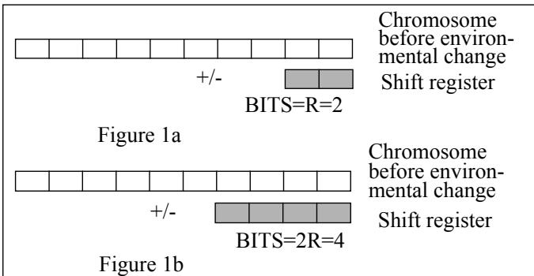
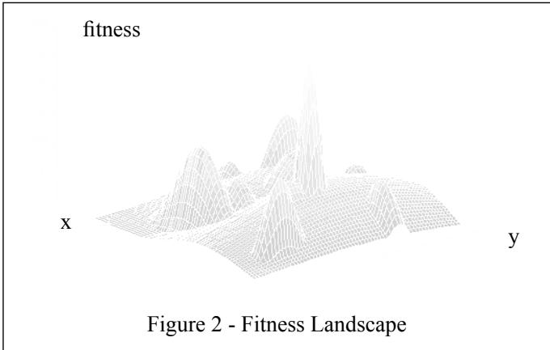
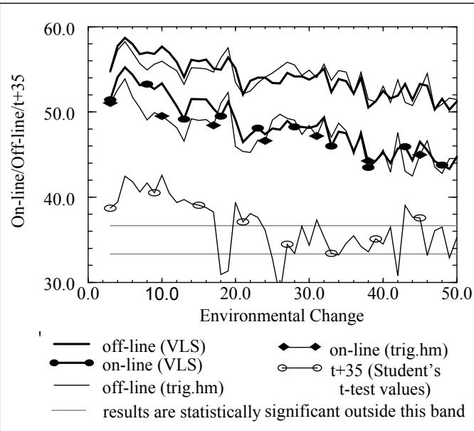
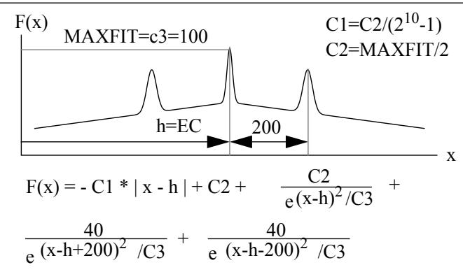
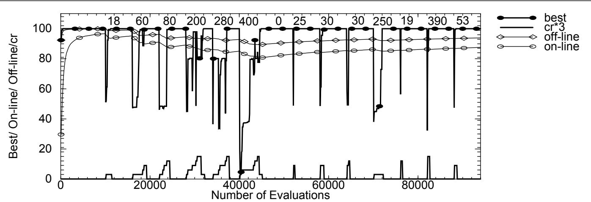
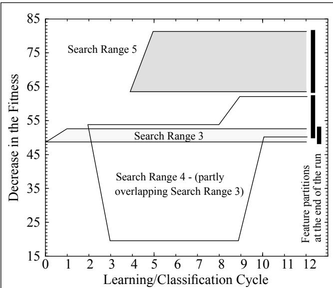

# Learning the Local Search Range for Genetic Optimisation in Nonstationary Environments

F. Vavak & K. Jukes   
Faculty of Computer Studies & Mathematic University of the West of England Bristol BS16 1QY, UK   
f_vavak@btc.uwe.ac.uk / ka-jukes@uwe.ac.uk   
T. C. Fogarty   
Department of Computer Studies   
Napier University   
Edinburgh, UK   
t.fogarty@dcs.napier.ac.uk

# Abstract

In this paper we examine a modification to the genetic algorithm. The variable local search (“VLS”) operator was designed to enable the genetic algorithm based on-line optimisers to track optima of time-varying dynamic systems. This feature is not to the detriment of its ability to provide sound results for the stationary environments. The operator matches the level of diversity introduced into the population with the “degree” of the environmental change by increasing population diversity only gradually. The paper also shows that performance of the designed tracking method can be further enhanced by integrating it with a simple exemplar-based incremental learning technique. It is believed that the designed technique will prove beneficial in the application of the genetic algorithm based approaches to industrial control problems.

# 1 Introduction

Genetic algorithms (GAs) are proven optimisation and machine learning techniques based on an adaptive mechanism of biological systems [Holland 1975]. Nevertheless, one important limiting factor for the use of the genetic algorithm (GA) in real time applications, common to many real world systems whose models are not stationary, is the need for the repeated initialization of the GA from a random starting point in the search space which enables tracking optima in such dynamic environments. The use of a repetitive learning cycle has obvious implications in terms of the quality of the solutions available, which presents limitations on the use of genetic techniques in dynamic environments such as on-line industrial control.

In the first part of the paper we describe a method which was designed for two industrial application projects concerned with load balancing problems in industry [Fogarty, Vavak 1995], [Vavak, Fogarty, Jukes 1995] with the aim of enabling a GA based on-line control system to track the optima of a system in which dynamics vary with time. Because of the direct evaluation of all individuals, an important consideration for the design of a tracking method was not only the off-line performance of the genetic algorithm (averaged performance of the best performing chromosomes so far - the best performing chromosome is selected for every population) [Goldberg 1989] but the on-line performance (averaged performance of all chromosomes evaluated so far) as well. Another important consideration was the quality of the worst members of the population, because direct evaluation of the weak individuals can have costly consequences in the real world applications.

In the second part of the paper we show how integrating the tracking method with a simple exemplar-based incremental learning technique can further enhance performance of the designed tracking method.

# 2 Tracking Technique

The tracking technique (the variable local search operator) adopts a mechanism of variable range local search around the current locations in the search space which are represented by the chromosomes before a change of the environment has occurred.

For simplicity, in the following text we will explain how the variable local search (“VLS”) operator works in detail on the 1-dimensional problem with a binary coded real integer variable. The VLS operator constitutes an adaptive tracking mechanism, being triggered only when the time averaged best performance of the population deteriorates. If the tracking mechanism is triggered, the crossover and mutation operators are temporarily suspended and bits of the “shift” register whose length is initially R bits are set randomly. The value represented by the shift register is - with equal probability - either added to, or subtracted from, the value expressed by the chromosome (a negative result or a value exceeding the maximum value which can be represented by the chromosome is not accepted) and the resulting value replaces the original value encoded in the chromosome. The VLS operator effectively enables a local search around a current location in the search space expressed in the given chromosome. The boundary of the search is given by the biggest real value which can be represented by the shift register, i.e. the current range of the local search is determined as $+ / -$ $( 2 ^ { \mathrm { B I T S } }  – 1 )$ where BITS is number of bits of the shift register. Figure 1a shows an example situation after the initial triggering of the VLS operator - the chromosome consists of 10 bits and $\mathrm { R } { = } 2$ . The shift size is limited to $+ / - 3$ relative to the current location in the search space. The VLS operator is applied to all the members of the population and then the genetic algorithm will resume its typical iterations using crossover and the mutation operator on the population modified by the tracking operator.

If the running averaged performance of the best members of the population over a period of a selected number of generations does not improve (e.g. fitness does not reach its original value before the change of the environment) after a suitably defined period of time (e.g. after a given number of evaluations/generations), the range of the local search is extended. Figure 1b shows the situation when the search was extended to the next higher range of the local search i.e. the size of the shift register is 2R bits $( \mathrm { B I T S } _ { \mathrm { t } } = \mathrm { B I T S } _ { \mathrm { t - 1 } } + \mathrm { R } )$ . This search range switching can be repeatedly initiated, gradually transforming the local search to a global search, provided a new satisfactory optimum is not found on the way. Thus it can be seen that the switching of the resolution of the local search can ultimately lead, in the last switching step, to an effective restart of the genetic algorithm

If the time-averaged best performance of the population again deteriorates after an optimum is found, the VLS operator will use the shift register R bits wide initially (i.e. the smallest range of the local search will again be used first).

The technique described can be easily extended to rational numbers, different encoding schemata and an n-dimensional problem. In the latter case each part of the gene representing a different variable/dimension is treated separately, i.e. a random value of the shift register is generated in turn for each of the variables.

# 3 Comparison

Performance of the new “tracking” method is compared with the triggered hypermutation technique which, due to its adaptive feature, seems to be an alternative mechanism for the kind of applications we are trying to approach. The hypermutation operator temporarily increases the mutation rate to a high value (called the hypermutation rate) during periods when the time-averaged best performance of the GA worsens [Cobb 1990], [Cobb, Grefenstette 1993].

# 3.1 The Specific Problem

The problem/landscape used to compare the VLS operator and the hypermutation operator is formed by 14 sinusoidally shaped hills.\* Each of 2 dimensions is represented by 16 bits (i.e. total search space of $2 ^ { 3 2 }$ points) and ranges from -32.767 to 32.768 (figure 2). Maximum fitness is always 60.

# 3.2 Results

In our tests we compared both operators across the range of possible magnitudes of environment changes $\mathrm { E C } = 1$ to 50). A position of the maximum peak was generated randomly and then moved by EC in a random direction after 10800 evaluations (equivalent of 90 generations of a generational GA). An on-line measurement was taken after another 10800 evaluations

Various mutation and hypermutation rates as well as different parameters related to the VLS operator triggering and range switching criterion were tested. The typical results are presented - all values are averaged over 100 runs initiated with different random generator seeds.

An incremental/steady state GA [Whitley,Kauth 1988] with uniform crossover and tournament selection was used with the following parameter settings: population size 120, bit mutation probability 0.002, hypermutation rate 0.2. Four possible local search ranges are as follows: $+ / - 8 . 1 9 1$ , 16.383, 32.767, 65.535 (the last search range represents effectively the global search). The chromosomes are Gray coded.

Figure 3 shows that, as was expected, the VLS operator provides better results, as far as on-line performance is concerned, than the triggered hypermutation operator for the smaller changes of the environment. The triggered hypermutation technique introduced an extensive (i.e. higher than necessary) degree of diversity into the population for these EC. Starting from a certain magnitude of environmental change (the “break-even point”) the overhead caused by the gradual extending the search range for the technique using the VLS operator becomes detrimental to the rate of convergence to the optima (and consequently to the on-line and off-line performance). The experimentally found break-even point value is $\mathrm { E C } = 1 7$ (with a confidence level $9 9 \%$ for on-line performance). For environmental changes bigger than this value the hypermutation operator outperforms the VLS operator or performance of either operator is not significantly different.

  
Figure 3

# 4 Learning the Local Search Range

The fact that extending of the search range becomes detrimental to on-line and off-line performance starting from a certain magnitude of environmental change is a limiting factor of the new technique. Nevertheless, this limitation can be minimized/eliminated by integrating the tracking method with a suitable technique for self-adaptation of the search range (i.e. shift register width) to the different degrees of the environmental changes.

# 4.1 The Test Function

The problem used to illustrate how learning local search works was chosen so that analysis of results was easy and clear. The function $\mathrm { F } ( \mathbf { x } )$ to be optimised is a simple function of one independent variable x (figure 4). The environment changes are simulated by moving the function $\mathrm { F } ( \mathbf { x } )$ alongside the horizontal axes. (EC is initially set to 0).

  
Figure 4 - Test Function $\mathrm { F } ( \mathbf { x } )$

The GA population size is 100. The length of each chromosome is 10 bits, R is 2 (as in figure 1a and 1b) and each chromosome encodes a real integer number which represents a location in the search space. Switching to the higher range of the local search (i.e. extending the width of the shift register) is carried out after three consecutive instances of deterioration or stagnation of the running average of the best performing members of the population. The best performing member of the population is selected after every 100 evaluations, i.e. after an equivalent of 1 generation of the generational GA.

# 4.2 The Learning Algorithm

Because of the nature of the applications concerned, an incremental learning from the examples seen from the beginning of the run is used to produce concept description which is then applied to classify the next incoming example. In this mode, learning never stops and concept description is modified in case of a missclassification. A modified/simplified feature partitioning algorithm was implemented for the learning task. Representation of the concepts which are learned only stores specific examples that are representatives of other similar instances. An instance is defined by a set of its feature/ property values. The feature partitioning algorithm [Guvenir,Sirin 1993] partitions the set of the possible feature values into disjoint sets corresponding to concepts, i.e. it learns a mapping of the concept on each feature dimension. Initially a feature partition associated with a particular class is a single point (lower and upper limits of the partition are equal) on a line representing the feature dimension (e.g. class “Search Range $3 ^ { \circ }$ for learning cycle 0 in figure 6). A partition can then be extended if another example of the same class occurs within a given generalization limit.

In our particular case no generalization limit is set and the feature partitions can overlap. We accepted this simplification of the algorithm because only one significant feature/attribute relevant to classification, the degree of the environmental change, is available. The degree of the environmental change is expressed as the decrease in time-averaged best performance of the population. The coordinates of the old global optimum (i.e. its position before the environmental change) cannot be used as the features relevant to classification (i.e. for the state recognition task) because the changes of the environment are not confined to shifts of the fitness landscape and can change shape of the landscape itself. Nevertheless, an assumption that the environmental changes are consistent, and exhibit a trend up to a certain degree, was made to resolve inevitable conflicts in classification. These conflicts are caused by the above mentioned simplification of the feature partitioning algorithm. Different classes are defined as distinct ranges of local search initially used when the shift operator is triggered. Width of the shift register is 2 bits for the search range $\mathrm { c r } { = } 1$ , 4 bits for $\mathrm { c r } { = } 2$ , 6 bits for $\mathrm { c r } { = } 3$ , 8 bits for $\scriptstyle \mathtt { c r } = 4$ and 10 bits for $\mathtt { c r } { = } 5$ in the example used for our tests. The classification on a new case is a matching step described below (i.e. the search range corresponding with decrease in averaged best performance of the population is selected while the above mentioned assumption is taken into account):

\* if a conflict in classification occurs (e.g. when the two feature partitions are overlapping), preference will be given to a class identical to the correctly classified class from the previous step (i.e. the most recent one). Otherwise a class with the smallest search range will be selected. This “conservative” strategy aims to cause less extreme costs to the system (i.e. the quality of the worst members of the population will be higher).

\* if a new instance cannot be classified using the current feature partitions (e.g. at the beginning of the run when no partitions exists), the local search range is set initially to $\mathrm { c r } { = } 1$ i.e. the shift register will be 2 bits wide in our example.

Despite a particular search range being selected during the classification step, the ability of the tracking method to extend local search further as described in the section 2 is not disabled. When the new global optimum is found following an environmental change and the classification step, a correct search range corresponding with decrease in the time-averaged best performance of the population is evaluated. It is found using the difference between the old and new optimum locations. The largest coordinate is chosen if the fitness function is n-dimensional. For example, in our 1-dimensional problem and for the location difference $\scriptstyle \mathbf { X } = 3 0$ the correct search range is $\mathrm { c r } { = } 3$ (i.e. shift register 6 bits wide) because the shifts up to 63 (i.e. $2 ^ { \mathrm { b i t s } }  – 1$ ) can be represented by the shift register while for $\mathrm { c r } { = } 2$ only shifts up to 15 can be expressed. The correct search range found is used to update current feature partitions or to create a new one. If, for example, a correct search range is $\mathrm { c r } { = } 3$ although $\scriptstyle \mathrm { c r } = 4$ was selected (i.e. missclassification occurred) the partition corresponding to $\scriptstyle \mathrm { c r } = 4$ will be reduced (an upper or lower limit of the partition will be moved - e.g. class “Search Range $4 ^ { \circ }$ for learning cycle

  
Figure 5 - the Variable Local Search operator with Learning the Search Range

10 in figure 6). The partition corresponding to $\mathrm { c r } { = } 3$ will be extended provided it has not yet covered the area.

To illustrate how learning local search range works, we ran one experiment with an environmental change appearing every 6000 evaluations. Thirteen shift sizes were selected so that the example was clear. Note that the fitness function has two local optima, resulting in a possibility of overlapping feature partitions in the same way as in the case of an asymmetric multidimensional/multiple peak function. Figure 5 shows the best member of the population values, on-line performance, off-line performance and the current local search range. The shift values used are listed at the top of the graph. It can be seen that the first six environmental changes (instances) cannot be classified using current feature partitions. Local search range is set initially to $\scriptstyle \mathrm { c r } = 0$ and is extended gradually as described in section 2. The three following instances $\mathrm { E C } { = } 2 5$ , 30, 30) are correctly classified, i.e. $\mathrm { c r } { = } 3$ is selected, although in the third case the search range was extended further because the running averaged performance of the best members of the population over a period of a selected number of populations did not improve. $\mathrm { E C } { = } 2 5 0$ could not be classified using current feature partitions. The upper limit of the partitioning related to $\scriptstyle \mathtt { c r } = 4$ is consequently extended as can be seen in figure 6 for the learning/classification cycle 9. The environmental change $\mathrm { E C } { = } 1 9$ was missclassified - instead of $\mathrm { c r } { = } 3$ , the class $\scriptstyle \mathrm { c r } = 4$ was selected because the correct classification of the previous environmental change was $\scriptstyle \mathrm { c r } = 4$ . As a result, the lower limit of the partition corresponding with $\scriptstyle \mathtt { c r } = 4$ is changed (figure 6 - learning/classification cycle 10). The last environmental change $\mathrm { E C } { = } 5 3$ is classified correctly despite two overlapping partitions because the previous correct classification was $\mathrm { c r } { = } 3$ . If the GA does not converge to the global optimum before a new environmental change occurs (or the running averaged performance of the best members of the population over a period of a selected number of populations does not improve in a defined way), no learning will take place, i.e. no feature partitions will be updated/created.

  
Figure 6 - Feature Partitioning / Classification History

# 4.3 Test Results

We used the fitness function shown in figure 4 to compare performance of a)the tracking method integrating use of the VLS operator and the learning algorithm described in section $4 . 2 \ \mathrm { ~ b ~ }$ the same method which does not use the learning algorithm and c)the triggered hypermutation technique.

All values were averaged over 255 runs - each technique was gradually initiated with 15 different random generator seeds and every run was repeated for 15 different sets of 200 environmental changes (shift values). An environmental change occurred every 4000 evaluations. The same random seeds were used to test each of the three different tracking techniques.

The sets of the shift values were generated randomly with different restrictions and the table 1 shows typical results obtained when all shift values were generated randomly across the whole range 0 to 1023 (i.e. no trend in the environmental changes was present) in the way that shifts related to the different local search range classes were represented equally. It can be seen that the tracking with the VLS operator and integrated learning algorithm provides a significant improvement over the tracking with the shift register when no learning is used in all indicated performance measures. It also outperforms the triggered hypermutation tracking technique in on-line performance. This was the case for all different groups of the environmental changes tested. It is also apparent, from further test results, that the learning algorithm will provide better results for more complicated asymmetric multidimensional/multiple peak functions if a trend in environmental changes is present as in many “real world problems”.

<table><tr><td>Tracking with the VLS operator and learning the search range</td></tr><tr><td>Off-line 92.80 performance</td></tr><tr><td>On-line 82.21 performance</td></tr><tr><td>Number of evaluation before 1504 the global optimum is found</td></tr><tr><td>Tracking with the VLS operator and without learning</td></tr><tr><td>Off-line 86.71 performance On-line</td></tr><tr><td>75.58 performance Number of evaluation before 2037</td></tr><tr><td>the global optimum is found Tracking with the triggered</td></tr><tr><td>hypermutation operator Off-line 97.01 performance</td></tr><tr><td>On-line 72.95 performance</td></tr><tr><td>Number of evaluation before 716 the global optimum is found</td></tr><tr><td>Table 1</td></tr></table>

# 5 Conclusions

As we have mentioned before, the tracking technique using the variable local search operator was developed for industrial control applications where on-line performance, as well as the quality of the worst member of the population after the change of the environment, was an important consideration for its design (see section 1 of the paper). These considerations are also taken into account when evaluating the results of the tests. In this context excessive diversity introduced into the population of the GA can be viewed as disturbance as far as its effect on the averaged performance of the GA is concerned, even if the higher diversity can increase the rate of evolution to the optima in some cases.

It was showed experimentally that the VLS operator, up to a certain degree of environmental change, outperforms the triggered hypermutation operator. The superior performance of the VLS operator can be explained by the fact that the operator better matched the level of diversity introduced into the population with the degree of the environmental changes. The overhead of the switching resolution levels for the VLS operator becomes dominant and detrimental to the rate of evolution to the global optima when the degree of environmental change exceeds the break-even performance point.

The main advantage of the new method is that the VLS operator gradually introduces the lowest necessary degree of diversity to get the GA to converge to the new global optimum. This feature of the method corresponds with the requirement of the least possible adverse effect of the tracking method on the on-line performance and the performance of the worst members of the population of the GA during tracking of changing environments. This is an important feature for the use of the method for applications in on-line industrial control. The gradual introduction of diversity into the population of chromosomes is in fact applicable to any problem encoding which use numerical variables as opposed to the categorical variables.

It can be concluded that the GA which implements the VLS operator can continually evolve an optimal solution to the problem without the need for the inefficient periodical restarting of the GA. The method is particularly suitable for control applications where the environmental changes are relatively small or/and gradual. Nevertheless, this limitation can be eliminated/minimised by a suitable technique for selfadaptation of the search range. We have showed that a simple learning technique, a modified feature partitioning algorithm used for learning local search range, can provide a significant performance improvement.

# Список литературы

Cobb H. (1990): “An Investigation into the Use of Hypermutation as an adaptive Operator in Genetic Algorithm Having Continuous, Time-Dependent Nonstationary Environments”, Naval Research Laboratory Memorandum Report 6760.

Cobb H., Grefenstette J. (1993): “Genetic Algorithms for Tracking Changing Environments”, Proceedings of the 5th International Conference on Genetic Algorithms, Morgan Kaufmann Publishers, Inc., p.523-530

Fogarty T.C., Vavak F., Cheng P.(1995): “Application of the Genetic Algorithm for Load Balancing of Sugar Beet Presses”, Proceedings of the 6th International Conference on International Conference on Genetic Algorithms, Morgan Kaufmann Publishers, Inc., p.617-624

Guvenir H., Sirin I. (1993): “A Genetic Algorithm for Classification by Feature Partitioning”, Proceedings of the 5th International Conference on Genetic Algorithms, Morgan Kaufmann Publishers, Inc., p. 543-548

Goldberg, D. E. (1989): Genetic Algorithms in Search, Optimisation and Machine Learning, Addison-Wesley Publishing Company.

Holland, J.H. (1975): “Adaptation in Natural and Artificial Systems”, University of Michigan Press.

Vavak F., Fogarty T.C., Jukes K. (1995): “Use of the Genetic Algorithm for Load Balancing in the Process Industry”, 1st International Mendelian Conference on Genetic Algorithms, PC-DIR Publishing, s.r.o. - Brno., p.159-164

Whitley D., Kauth J. (1988): “GENITOR: A different Genetic Algorithm”, Proceedings of the Rocky Mountain Conference on Artificial Intelligence, Denver., p.118-130