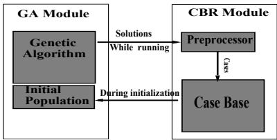
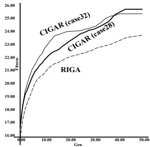
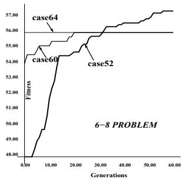
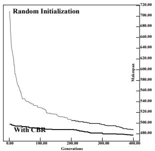
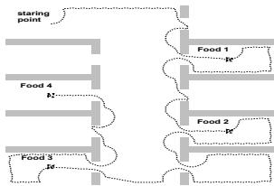
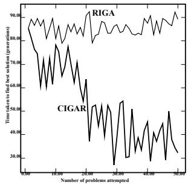
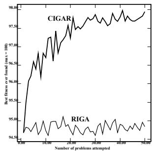

# Solving Similar Problems using Genetic Algorithms and Case-Based Memory

Sushil J. Louis Department of Computer Science University of Nevada Reno - 89557 email: sushil@cs.unr.edu

Judy Johnson   
Department of Computer Science   
University of Nevada   
Reno - 89557   
email: sushil@cs.unr.edu

# Abstract

This paper uses genetic algorithms augmented with a case-based memory of past problem solving attempts to obtain better performance over time on sets of similar problems. When confronted with a problem we seed a genetic algorithm's initial population with solutions to similar, previously solved problems and the genetic algorithm then adapts its seeded population toward solving the current problem. We address the issue of selecting "appropriate" cases for injection and introduce a methodology for solving similar problems using genetic algorithms combined with case-based memory. Combinational circuit design serves as a structured testbed and provides insight that is used to validate the feasibility of our approach on other problems. Results indicate that seeding a small percentage of the population with "appropriate" cases improves performance on similar problems and that the combined system usually takes less time to provide a solution to a new problem as it gains experience (memory) from solving other similar problems.

# 1 INTRODUCTION

Genetic algorithms (GAs) are randomized parallel search algorithms that search from a population of points (Holland, 1975; Goldberg, 1989). We typically randomly initialize the starting population so that a genetic algorithm can proceed from an unbiased sample of the search space. However, we often confront sets of similar problems. It makes little sense to start a problem solving search attempt from scratch with a random initial population when previous search attempts may have yielded useful information about the search space. Instead, seeding a genetic algorithm's initial population with solutions to similar previously solved problems can provide information (a search bias) that can reduce the time taken to find a quality solution. Our approach borrows ideas from case-based reasoning (CBR) in which old problem and solution information, stored as cases in a case-base, help solve a new problem (Riesbeck and Schank, 1989).

Although in this paper we report on work using genetic algorithms and a case-base of past experience, our approach is not limited to either genetic algorithms or to case-based memory. In general, combining a robust search algorithm with some implementation of an associative memory can result in a robust learning system that learns, with experience, to solve similar problems quickly. Our system's performance on a test problem class (reported in section 6) supports this view for genetic algorithms and case-based memory.

The next section describes our system and discusses previous work. We provide short descriptions of our experience with problems from combinatorial optimization, structure design, and robot navigation to highlight important issues and establish the feasibility of combining genetic algorithms with a case-based memory. Combinational circuit design is used to show that injecting partial solutions can result in better performance (fitness versus time) (Liu, 1996). The open shop scheduling and re-scheduling problem validates our methodology (Xu and Louis, 1996) and the traveling salesperson problem deals with using information from similar problems of different sizes (Louis and Li, 1997a). Robot navigation adds an important step to the developed methodology when we want to combine solutions to sub-problems to design a solution to a more complex problem (Louis and Li, 1997b). The results indicate that adding a case-based memory improves performance if the right number of appropriate cases are injected into the initial population of the genetic algorithm. Finally, we define a set of related problems and test the combined system's performance on these problems showing that as the number of problems we attempt to solve increases, the time taken to solve a new problem decreases. The last section presents conclusions and directions for future work.

# 2 A GA-CBR SYSTEM

Genetic algorithms provide an efficient tool for searching large, poorly understood spaces often encountered in function optimization and machine learning (Holland, 1975; Goldberg, 1989). The probabilistic population based nature of GA search allows GAs to be successfully applied to a variety of NP-hard problems (Goldberg, 1989; Powell et al., 1989; Caldwell and Johnston, 1991; Lin et al., 1995). Genetic algorithms, like other search algorithms, dynamically balance exploration of the search space versus exploitation of particular areas of the space through the recombination (crossover and mutation) and selection operators respectively. When we seed a genetic algorithm's initial population with cases we alter this balance and affect performance.

A genetic algorithm explores a subset of the search space during a problem solving attempt and its population serves as an implicit memory guiding the search. Every individual generated during a search defines a point in the search space and the individual's evaluation provides a fitness. This information when stored, organized, and analyzed can be used to explain the solution, that is, tell which parts of the genotype are important, and allow a sensitivity analysis (Louis et al., 1993). However, this information is usually discarded at the end of a GA's run and the resources spent in gaining this information are wasted. If we store this information in an explicit memory and use it in a subsequent problem solving attempt on a related problem we can tune the GA to a particular space and thus increase performance in this space assuming that problem similarity implies solution similarity. In case this assumption is false or we are unable to find solutions to similar problems the system need not fail - we are simply back to randomly initializing the population.

One early attempt at reuse can be found in Ackley's work with SIGH (Ackley, 1987). Ackley periodically restarts a search in an attempt to avoid local optima and increase the quality of solutions. Eshelman's CHC algorithm, a genetic algorithm with elitist selection and cataclysmic mutation, also restarts search when the population diversity drops below a threshold (Eshelman, 1991). Other related work includes Koza's automatically defined functions (Koza, 1993) and Schoenauer's constraint satisfaction method (Schoenauer and Xanthakis, 1993). These approaches only attack a single problem not a related class of problems. More recently, Ramsey and Grefenstette come closest to our approach and use previously stored solutions to initialize a genetic algorithm's initial population and thus increase a genetic algorithm's performance in an anytime learning environment that changes with time (Ramsey and Grefensttete, 1993). Automatic injection of the best solutions to previously encountered problems biases the search toward relevant areas of the search space and results in the reported consistent performance improvements. To our knowledge, the earliest work in combining genetic algorithms and case-based reasoning was done by Louis, McGraw, and Wyckoff who used case-based reasoning principles to explain solutions found by genetic algorithm search (Louis et al., 1993). This paper tackles sets of similar problems and addresses the issues of which and how many cases to inject into the population. The work reported in this paper shows that injecting the best solutions to previously solved problems does not always lead to better performance and provides a possible explanation of this result.

Figure 1 shows a conceptual view of a simple version of our system. When confronted with a problem, the CBR module looks in its case base for similar problems and their associated solutions. If any similar problems are found a small number of their solutions are injected into the initial population of the genetic algorithm. The rest of the population is initialized randomly to maintain diversity, and the GA searches from this combined population.

  
Figure 1: Conceptual view of our system

The case-base does what it is best at — memory organization; the genetic algorithm handles what it is best at — adaptation. The genetic algorithm also provides a ready-made case generating mechanism as the individuals generated during a GA search can be thought of as cases or as parts of cases. Even a population size of 100 run for 100 generations on one problem can generate up to $1 0 0 \times 1 0 0 = 1 0 , 0 0 0$ cases. CBR systems usually have difficult in finding enough cases;

our problem is the opposite. We need to sift through a large number of cases to find potential seeds for the initial population.

There are at least three points of view when combining genetic algorithms with a case-based memory. From the case-based reasoning point of view, genetic algorithms provide a robust mechanism for adapting cases in poorly understood domains conducive to a case-based representation of domain knowledge. In addition, the individuals produced by the GA furnish a basis for generating new cases to be stored in the casebase.

From the point of view of genetic algorithms, casebased reasoning provides a long term memory store in its case-base. A combined GA-CBR system does not require a case-base to start with and can bootstrap itself by learning new cases from the genetic algorithm's attempts at solving a problem. This paper stresses the genetic algorithm point of view and addresses two questions that deal with the balance between exploration and exploitation in a search space.

What cases are relevant, or, which previously found solutions do we use to seed a genetic algorithm's population? If the "right" cases are injected, a GA does not have to waste time exploring unpromising subspaces because these cases provide partial, nearoptimal, and/or optimal solutions. In other words, they provide good building blocks for solutions to the current problem. This is crucial if the size of a search space is extremely large since injecting appropriate cases will provide the genetic algorithm with better starting points and thus speed up search and improve performance. The population size affects the outcome when injecting "wrong" cases. Small population sizes may constrain the GA to a local optimum, while larger population sizes may provide enough diversity and robustness to quickly cull these cases from the population and thus only increase the time taken to reach a solution. We find therefore that in GA applications that allow only small population sizes, the cases that we inject can significantly affect solution quality.

How many cases should we inject into the initial population? This issue once again strikes at the balance between exploitation and exploration. A randomly initialized population has maximum diversity and thus maximum capacity for exploration (Louis and Rawlins, 1993). We expect injected individuals (cases) to have a higher fitness than randomly generated individuals. Since a GA focuses search in the areas defined by high fitness individuals, we expect large numbers of high fitness individuals in an initial population to increase exploitation. This increased concentration or exploitation of a particular area can cause the GA to get stuck on a local optimum. Balancing exploitation with exploration now means balancing the number of randomly generated individuals with the number of injected individuals in the initial population.

From the machine learning point of view, using cases instead of rules to store information provides another approach to genetic based machine learning. Holland classifier systems (Holland, 1975; Goldberg, 1989) use simple string rules for long term storage and genetic algorithms as their learning or adaptive mechanism. In our system, the case-base of problems and their solutions supplies the genetic problem solver with a long term memory and leads to improvement over time.

# 3 METHODOLOGY

We start by considering a simple methodology to test and validate the feasibility of combining genetic algorithms and case-based reasoning on four sample problem sets. In our experiments, a genetic algorithm finds and saves solutions to a problem $P _ { o l d }$ , the problem is changed slightly to $P _ { n e w }$ , and appropriate solutions to $P _ { o l d }$ are injected into the initial population of the genetic algorithm that is trying to solve the new problem, $P _ { n e w }$ . If the cases from $P _ { o l d }$ contain good building blocks or partial solutions, the genetic algorithm can use these building blocks or schemas and quickly approach the solution to $P _ { n e w }$ . The results show that compared to a genetic algorithm that starts from scratch (from a randomly initialized population), the genetic algorithm with injected solutions quickly finds good solutions to $P _ { n e w }$ and that the quality of solutions after convergence is usually better.

# 4 COMBINATIONAL CIRCUIT DESIGN

Solving combinational circuit design problems provides two valuable insights (Liu, 1996):

• Injecting the best found solution to $P _ { o l d }$ does not always lead to better performance Injecting a larger number of cases also does not always lead to better performance

A genetic algorithm can be used to design combinational circuits as described in (Louis and Rawlins, 1991). Consider a four-bit parity checker. It is one of $2 ^ { 2 ^ { 4 } } = 2 ^ { 1 6 } = 6 5 5 3 6$ different four-input one-output boolean functions. If we are trying to solve this class of problems, one way of indexing (defining similarity of problems) can be as follows: Concatenate the output bit for all possible 4-bit input combinations counting from 0 through 15 in binary. This results in a binary string of output bits, $S _ { o }$ , of length 16. Strings that are one bit different from $S _ { o }$ define a set of boolean functions, as do strings that are two bits different and so on. This way of naming boolean functions provides a simple distance metric and indexing mechanism for the combinational circuit design problems that we consider in this paper. Using the 4-bit parity problem as a base we define $4 - 1$ problems to be one bit away from $S _ { o }$ , while 6 - 4 problems are 4 bits away from a 6- bit parity checker. Problems are constructed from the parity problem by randomly choosing the output bits to be changed. The fitness of a candidate circuit is the number of correct output bits. Thus 5-bit problems would have a maximum fitness of $2 ^ { 5 } = 3 2$ .

Figure 2 compares the average fitness over time of a Randomly Initialized Genetic Algorithm (RIGA) with a Case Initialized Genetic AlgoRithm (CIGAR). In this figure, $P _ { o l d }$ is the 5-bit parity checker and $P _ { n e w }$ is a 5-8 problem. Ten percent $( 1 0 \% )$ of the initial population of the GA solving $P _ { n e w }$ is injected with solutions to $P _ { o l d }$ . In this experiment, we chose two kinds of $P _ { o l d }$ 's individuals for injections:

  
Figure 2: Comparing average fitness of a RIGA versus CIGAR on the 5-8 problem when injecting case28 and case32.

1. case32 individuals: solutions to $P _ { o l d }$ with fitness 32 on $P _ { o l d }$ .

2. case28 individuals: solutions to $P _ { o l d }$ with fitness 28 on $P _ { o l d }$ . Note that these are not the best solutions to $P _ { o l d }$ .

We fix the number of cases that are injected at $1 0 \%$ of the population for all experiments dealing with the question of what cases to inject. Figure 2 is typical for average performance measurements across case fitnesses for a variety of problem distances and sizes. As we can see, the CIGAR performs better. As expected the initial performance difference is large. However, although the average fitness for injection with case32 starts off better than that for case28, injecting case28 results in better final performance.

Focusing on maximum fitness, the tendency for lower fitness cases to produce more improvement with increasing problem distance is emphasized on larger problems. This behavior can be seen in Figure 3 which plots maximum fitness over time on the 6-8 problem. The case64 (solution to the 6-bit parity problem) injected CIGAR does not improve at all, while the case52 CIGAR shows fairly consistent improvement in maximum fitness.

  
Figure 3: Comparing maximum performance of a RIGA with a CIGAR for different fitness cases on the 6-8 problem.

We explored a large number of 4, 5, and 6 bit problems and the results are reported in detail in (Liu, 1996), indicating the following general trends:

1. As the distance between problems increase, injecting or seeding cases with lower fitness (in $P _ { o l d . }$ results in better solutions.   
2. The above tendency is emphasized with increasing problem size.   
3. Injecting higher fitness individuals tends to lead to a quicker flattening out of the performance curve (average or maximum fitness versus time).

We can explain these results if we think of solutions as forming the leaves of a tree. Adapting one solution into another now means backing up to a common parent and then moving down the second solution's branch. Injecting cases closer to a common parent on the tree (lower fitness cases) shortens the path to a similar problem's solution since less backtracking is involved. The individuals generated by a genetic algorithm form such a tree with increasing schema order toward the leaves (Louis et al., 1993). In terms of GA theory, injecting solutions that contain lower order, high fitness schema leads to the observed performance increase when problems are less similar. As problems get more similar, injecting higher order schema makes more sense. Our model thus indicates that increasing problem dissimilarity implies that we should inject cases of lower fitness corresponding to when the GA has fixed fewer positions in its population's genotypes (lower order schemas). This agrees well with the intuitive expectation that if the problems exceed a dissimilarity threshold we should simply use random initialization. Finally, increasing the problem size would also have a similar effect within this model since the tree depth increases with problem size. The last trend (item 3 in the list above) can be explained in terms of greater selection intensity causing the GA to quickly lose diversity. This is brought on by the increased fitness difference between the injected high fitness cases and the rest of the population.

Our previous results (Liu, 1996) indicate that finding the right number of cases to inject depends on a number of factors including the problem size and structure of the encoded search space. The major issue is the maintenance of diversity in the population. For our problems, when the number of injected cases passes a threshold (that depends on problem size), performance usually deteriorates over time. Since more injected cases cause the CIGAR to focus more on the sub space defined by these individuals, we would recommend going with a lower injection percentage if we are interested in long term solution quality, and with a larger percentage if we are interested in speed. A lower percentage of injected individuals allows greater population diversity leading to a more balanced exploration of the search space and thus reducing the probability of getting stuck on a local optimum. In practice, between 5 to 15 percent works well on our problems although larger percentages may also do well.

# 5 A ROBUST METHODOLOGY FOR SOLVING SIMILAR PROBLEMS

We used open shop scheduling (OSSP) and rescheduling problems as a test problem for our system and developed a methodology to deal with problems for which indexing is not easy, that is, problems that do not lend themselves to an easy measure of similarity. The details of our encoding, operators, and genetic parameters are given in (Xu and Louis, 1996).

Instead of storing and injecting individuals with a particular fitness depending on problem similarity, we cover our bases and save and inject a set of individuals with different fitnesses saved at different generations of the genetic algorithm's run on $P _ { o l d }$ . Thus if the solutions to the problems are "further" apart, the individuals from earlier generations1 will probably help more than the others. While if the solutions to the problems are "closer," individuals from later generations will help more. The genetic algorithm takes care of culling those individuals that do not contribute to the solution of the problem being solved. If none of the injected individuals are useful, selection quickly removes them from the population and the (relatively large) randomly initialized component is used as the starting point for the search and the system just takes a little longer to find a possible solution.

Using this methodology leads to increased performance, especially early on, and perhaps more importantly, to slow but consistent fitness increase. Solution quality is also usually better than with random initialization. Figure 4 compares the average performance of a CIGAR against a randomly initialized GA on a $7 \times 7$ OSSP problem. We can see that the CIGAR starts with a much lower (better) initial makespan and that even after 300 generations CIGAR solutions are better than solutions from a randomly initialized GA. In our experiments we note that the CIGAR always does comparatively well in early generations and provides good schedules more quickly than the randomly initialized GA. Out of the set of eight $5 \times 5$ benchmark problems and five $7 \times 7$ benchmark problems, the CIGAR usually produces schedules that are better.

  
Figure 4: Comparing performance of a RIGA with a CIGAR for a $7 \mathrm { x } 7 $ OSSP problem

# 5.1 PROBLEM SIZE

We used the same methodology developed above to attack a set of traveling salesperson problems and study the effect of changing problem size. The encoding, crossover operator, and other parameters can be found in (Louis and Li, 1997a).

Once again, we find that injecting individuals from $P _ { o l d }$ always leads to better results than when running GAs with random initialization on our problems. The experimental results imply that although problem size makes a difference in similarity, problems can be similar enough to be useful even if they are of different size. In fact, we sometimes got closer to the optimal solution when using problems of different sizes than when injecting solutions to a modified TSP of the same size where one city's location was changed. In other words, a different sized problem with information from all cities and all edges can help the CIGAR get better performance than a same sized problem with missing or differing information.

# 5.2 COMBINING SOLUTIONS TO DISSIMILAR PROBLEMS

Sometimes combining solutions to dissimilar subproblems can lead to the solution of a larger more complex problem. Consider the problem of designing control strategies for a simulated robot in a complex environment. We can break this task down into the simpler sub-tasks (learned simple behaviors) of food approach, wall following, and obstacle avoidance. Control strategies for navigating in a complex environment can then be designed by "combining" solutions to these simple basic behaviors.

In this situation we have to add one important step to our methodology. Control strategies for navigating in a complex environment can be designed by selecting solutions from the stored strategies evolved for basic behaviors, ranking them according to their performance in the new complex target environment and introducing them into a genetic algorithm's initial population. The genetic algorithm quickly combines these target ranked basic behaviors and finds control strategies for performing well in the more complex environment (Louis and Li, 1997b). Injecting the best individuals found in the simple environments (Source Ranked GA (SRGA)) leads to inferior performance. In fact, the randomly initialized GA does better than the SRGA, while the target ranked GA does best. In addition, we need to make sure that the injected individuals contain at least one representative of each basic behavior. Otherwise, the missing basic behavior may have to be evolved from scratch - from the randomly initialized component of the population. Once we have individuals representing each of the basic behaviors, the rest of the candidates for injection compete for the remaining slots on the basis of their performance in the target environment. This ensures that the population is initialized with the needed variety of high performance building blocks. Figure 5 shows the path of a simulated robot in the complex environment. It manages to use a strategy tailored to the environment entering all rooms with food (squares) and avoiding rooms without food.

  
Figure 5: Simulated robot's path in an office environment for a circuit designed by the TR-GA

We have provided an overview of the evidence pointing to the feasibility of combining genetic algorithms with a case-based memory. However, we did not test a complete system and only solved pairs of similar problems using a two step process of solving $P _ { o l d }$ and saving individuals, then solving $P _ { n e w }$ using individuals from $P _ { o l d }$ . In the next section we define a class of similar problems and let the combined system solve about 50 randomly generated problems from this class.

# 6 IMPROVEMENT WITH EXPERIENCE

The problem set is based on the number of one's in a bit string, a variation of the one-max problem (Ackley, 1987). We considered problems where a string of ones was followed by a string of zeros. Consider a string of length 10. Choose a position $M$ in this string. Let $n _ { 1 }$ be the number of ones to the left of $M$ and $n _ { 0 }$ the number of zeros to the right of $M$ . The fitness of this string is

$$
{ \mathrm { f i t n e s s } } = n _ { 1 } + n _ { 0 }
$$

We let $M$ be the index of a problem in this class. The maximum fitness of any of the problems in this class is $l$ , the length of the string. For example, for $l = 6$ , there are 7 problems in this class. This set of problems was chosen for two reasons.

1. Similar problems have similar solutions.   
2. Indexing is easy. We use $M$ the problem index.

Initially, the system has an empty case-base and the GA starts with a randomly initialized population. As problems are solved the case-base is built up and used. We used a chromosome length of 100 and ran the GA with a population size of 200 for 100 generations, storing the best individual from every $2 0 ^ { t h }$ generation of the GA into the case-base. We did not solve all the 101 problems in the class but restricted the problem set to $2 5 \leq P \leq 7 5$ for a total of 51 possible problems. We ran the system ten times with different random seeds and the results reported are averaged over these ten runs.

When confronted with a randomly generated problem $P _ { i }$ from within the class of about 50 problems the system ranks the problems in the case-base according to distance from $P _ { i }$ . We use distance proportional selection for injection where the probability of a problem's solutions being selected for injection is inversely proportional to distance. In fact, we simply use the roulette wheel procedure given in Goldberg's book (Goldberg, 1989) and the probability $\mathrm { P r o b } _ { P _ { j } }$ of a problem $P _ { j }$ 's solutions being selected for injection is

$$
\mathrm { P r o b } _ { P _ { j } } = 1 - \frac { d i s t ( P _ { i } , P _ { j } ) } { \sum _ { P _ { j } \in \mathrm { C B } } d i s t ( P _ { i } , P _ { j } ) }
$$

where CB denotes the case-base.

When a problem is selected by this procedure we inject one of the stored solutions to this problem into the initial population of the GA solving $P _ { i }$ . The solution to be injected is again chosen depending on problem distance. Recall that we stored the best individual from every $2 0 ^ { t h }$ generation. The probability of choosing a solution from a particular generation is inversely proportional to problem distance.

We used linear scaling with a scaling factor of 1.2 and an elitist selection scheme in which the offspring compete with the parents for population slots and where, if $N$ is the population size, the best $N$ individuals from the combined parent-offspring pool make up the next generation (Eshelman, 1991). The probability of crossover was 1.0 and the probability of mutation was set to 0.05. We initialized $5 \%$ of the population with injected cases, the rest of the population was generated randomly.

Figure 6 plots the number of problems attempted on the horizontal axis versus the generation that the best solution was found. It compares a randomly initialized GA with a CIGAR over ten runs with different random seeds. The figure shows that as the number of problems attempted increases the time taken to solve a problem decreases for CIGAR while the randomly initialized GA takes about the same time. After about half of the problems have been attempted there is a statistically significant decrease in the time taken to solve a problem.

We also compare the quality of solutions as the number of problems solved increases for the RIGA and CIGAR in Figure 7 over ten runs with different random seeds. CIGAR improves its performance as it attempts more problems while the randomly initialized GA's performance stays about the same.

  
Figure 6: Number of problems attempted versus time taken to solve a problem

  
Figure 7: Number of problems attempted versus best fitness ever found

# 7 CONCLUSIONS

This paper demonstrates the feasibility of combining genetic algorithms with case-based reasoning principles to augment search and shows that the combined system learns with experience. Instead of discarding information gleaned from previous problem solving attempts through search, we save and inject solutions to similar problems into the initial population of a genetic algorithm to increase performance. Our preliminary results, using pairs of problems, indicate the feasibility and usefulness of this approach and show that choosing the right quantity and quality of cases plays a large part in determining performance. We also developed a robust methodology that works in the absence of precise information on problem distance. Defining a class of about 50 similar problems, we show that the time taken by our prototype GA-CBR system to find a quality solution decreases as the number of problems attempted by the combined system increases.

Although the approach has promise, much work remains to be done. We need to consider the effect of different selection schemes, recombination operators, and niching operators, for genetic search as well other search algorithms and associative memory models. Individuals need not be injected solely into the initial population. We can keep track of the performance of injected individuals and their progeny and use this information to design and inject individuals in intermediate generations. Finally, the tradeoffs between speed and solution quality needs to be explored in more detail.

# Acknowlegements

This material is based upon work supported by the National Science Foundation under Grant No. 9624130.

# Список литературы

Ackley, D. A. (1987). A Connectionist Machine for Genetic Hillclimbing. Kluwer Academic Publishers.   
Caldwell, C. and Johnston, V. S. (1991). Tracking a criminal suspect through "Face-Space" with a genetic algorithm. In Proceedings of Fourth International Conference on Genetic Algorithms, pages 416421. Morgan Kauffman.   
Eshelman, L. J. (1991). The chc adaptive search algorithm: How to have safe search when engaging in nontraditional genetic recombination. In Rawlins, G. J. E., editor, Foundations of Genetic Algorithms-1, pages 265283. Morgan Kauffman.   
Goldberg, D. E. (1989). Genetic Algorithms in Search, Optimization, and Machine Learning. AddisonWesley.   
Holland, J. (1975). Adaptation In Natural and Artificial Systems. The University of Michigan Press, Ann Arbour.   
Koza, J. R. (1993). Genetic Programming. MIT Press.   
Lin, Y.-H., Rawlins, G. J. E., and VanHeyningen, M. D. (1995). Pic1: A visual database interface. International Journal of Expert Systems Research and Applications, 8(3):237246.   
Liu, X. (1996). Combining Genetic Algorithm and Case-based Reasoning for Structure Design. University of Nevada, Reno. M.S. Thesis, Department of Computer Science.   
Louis, S. J. and Li, G. (1997a). Augmenting genetic algorithms with memory to solve traveling salesman problems. In Wang, P. P., editor, Proceedings

of the Third Joint Conference on Information Sciences, pages 108111.

Louis, S. J. and Li, G. (1997b). Combining robot control strategies using genetic algorithms with memory. In Angeline, P. J., Reynolds, R. G., McDonnell, J. R., and Eberhart, R., editors, Lecture Notes in Computer Science 1213. Evolutionary Programming VI, Proceedings, pages 431-442. Springer-Verlag.

Louis, S. J., McGraw, G., and Wyckoff, R. (1993). Case-based reasoning assisted explanation of genetic algorithm results. Journal of Experimental and Theoretical Artificial Intelligence, 5:2137.

Louis, S. J. and Rawlins, G. J. E. (1991). Designer genetic algorithms: Genetic algorithms in structure design. In Proceedings of the Fourth International Conference on Genetic Algorithms, pages 53-60. Morgan Kauffman, San Mateo, CA.

Louis, S. J. and Rawlins, G. J. E. (1993). Syntactic analysis of convergence in genetic algorithms. In Whitley, L. D., editor, Foundations of Genetic Algorithms - 2, pages 141-152. Morgan Kauffman, San Mateo, CA.

Powell, D. J., Tong, S. S., and Skolnik, M. M. (1989). Engeneous domain independent machine learning for design optimization. In Proceedings of the Third International Conference on Genetic Algorithms, pages 151159. Morgan Kauffman.

Ramsey, C. and Grefensttete, J. (1993). Case-based initialization of genetic algorithms. In Forrest, S., editor, Proceedings of the Fifth International Conference on Genetic Algorithms, pages 84-91, San Mateo, California. Morgan Kauffman.

Riesbeck, C. K. and Schank, R. C. (1989). Inside CaseBased Reasoning. Lawrence Erlbaum Associates, Cambridge, MA.

Schoenauer, M. and Xanthakis, S. (1993). Constrained ga optimization. In Proceedings of the Fifth International Conference on Genetic Algorithms, pages 573580. Morgan Kauffman, San Mateo, CA.

Xu, Z. and Louis, S. J. (1996). Genetic algorithms for open shop scheduling and re-scheduling. In Proceedings of the ISCA 11th International Conference on Computers and Their Applications., pages 99-102, Raleigh, NC, USA. International Society for Computers and Their Applications.