# Approximating the longest paths in grid graphs

Wen-Qi Zhang, Yong-Jin Liu

Tsinghua National Laboratory for Information Science and Technology, Department of Computer Science and Technology, Tsinghua University, China

# a r t i c l e i n f o

Article history:   
Received 11 January 2011   
Received in revised form 29 May 2011   
Accepted 6 June 2011   
Communicated by D.-Z. Du   
Keywords:   
Long paths   
Square-free 2-factor   
Grid graphs

# a b s t r a c t

In this paper, we consider the problem of approximating the longest path in a grid graph that possesses a square-free 2-factor. By (1) analyzing several characteristics of four types of cross cells and (2) presenting three cycle-merging operations and one extension operation, we propose an algorithm that finds in an n-vertex grid graph G, a long path of length at least $\textstyle { \frac { 5 } { 6 } } n + 2$ . Our approximation algorithm runs in quadratic time. In addition to its theoretical value, our work has also an interesting application in image-guided maze generation.

$^ { © }$ 2011 Elsevier B.V. All rights reserved.

# 1. Introduction

Finding the longest path in a graph is a classical problem and have attracted considerable attentions in theoretical computer science. Given that Hamiltonian path (or circle) problem is ${ \mathcal { N P } }$ -complete as a special case, it is only practical to design computer programs that find approximate solutions to the longest path in a graph. For general undirected graphs, Karger et al. [1] have shown that, unless $\mathcal { P } = \mathcal { N P }$ , for any $\varepsilon < 1$ , the problem of finding a path of length $n - n ^ { \varepsilon }$ is ${ \mathcal { N P } }$ -hard. Bazgan et al. [2] further revealed that for any $\varepsilon > 0$ , the longest path problem is not constantly approximated even in cube Hamiltonian graphs.

Many approximation algorithms have been proposed for the longest path problem. Monien [3] proposed an exponential time algorithm that finds in a graph, a long path of length $O ( \log L / \log \log L )$ , where $L$ is the length of the longest path. For a general undirected graph, Bjorklund and Husfeldt [4] improved the results by presenting a polynomial algorithm that finds a path of length $\mathcal { \Omega } \big ( ( \log L / \log \log L ) ^ { 2 } \big )$ with the performance ratio $O ( n ( \log \log n / \log n ) ^ { 2 } )$ , where $n$ is the vertex number in the graph. Several special graphs have also been considered. Feder et al. [5] showed that for sparse graphs such as 3-connected cubic $n$ -vertex graphs, there is a polynomial time algorithm that can find a cycle of length at least $n ^ { ( \log _ { 3 } 2 ) / 2 }$ . Chen et al. [6] showed that, for a 3-connected $n$ -vertex graph with bounded degree $d$ , there is a cubic algorithm which can find a cycle of length at least $n ^ { ( \log _ { b } 2 ) / 2 }$ , where $b = 2 ( d - 1 ) ^ { 2 } + 1$ . This result was improved in [7], showing that for the same graph, there is a cubic algorithm which can find a cycle of length at least $n ^ { ( \log _ { b } 2 ) / 2 } / 2 + 3$ , where $b = \operatorname* { m a x } \{ 6 4 , 4 d + 1 \}$ .

In this paper, we consider the approximate longest path problem in grid graphs. Itai et al. [8] first proved that determining whether a general grid graph is Hamiltonian is ${ \mathcal { N P } }$ -complete. Later in 1997, Umans and Lenhart [9] showed that Hamiltonian cycles can be identified in solid grid graphs (a special type of grid graphs without holes) in polynomial time. Their algorithm is based on a 2-factor of the graph and runs in $O ( n ^ { 3 } )$ time. For general grid graphs with initial squarefree 2-factors, in this paper, we show that a long path of length at least ${ \frac { 5 } { 6 } } n + 2$ can be found in an $n$ -vertex grid graph in quadratic time.

In addition to theoretical contributions, our work on approximating longest paths in grid graphs has also an interesting application, maze design. In the history of art creation and design, mazes have found diverse applications in visual art (e.g., stylized line drawings), architectural decoration (e.g., the herb garden hedge maze in UK) and cultural and religious symbols (e.g., decoration in bronze wares in China Shang Dynasty), etc. Designing a meaningful and interesting maze is not an easy task. Usually wealth of experience and long-term training are needed. In this paper, we show that using the approximating longest path in grid graphs, a perfect maze can be constructed with the aid of a computer that can encode any predefined pictorial information.

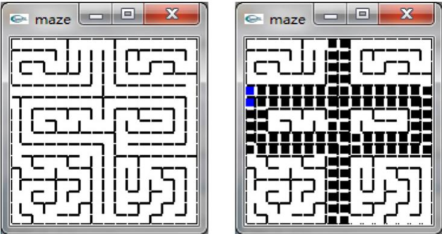  
Fig. 1. A simple perfect maze embedded in $1 6 \times 1 6$ lattices, whose solution encodes the shape of a Chinese character ‘‘Zhong’’.

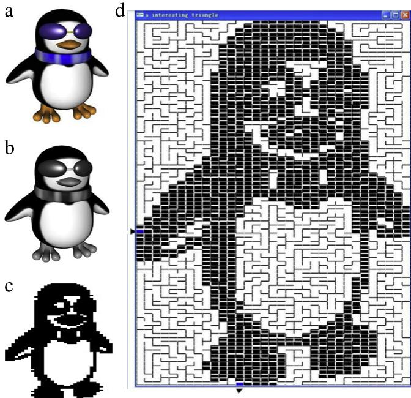  
Fig. 2. Image-guided maze generation. (a) An original color image. (b) The gray-scale image. (c) The black-and-white image after halftoning. (d) The maze whose solution embeds the pictorial information.

A perfect maze is defined as a maze which has one and only one path from any point in the maze to any other point. A simple example is illustrated in Fig. 1. Between the entrance and exit points that are both on the maze boundary, there is a unique path. When all the lattices passed through by the solution path are painted in black, the encoded shape appears. To use computer to develop a maze whose solution shows predefined pictorial information, an image-guided maze design method can be used as follows. First the user chooses an interesting image as a reference (ref. Fig. 2(a)). If the chosen image is a colored one, it is converted to a gray-scale image (ref. Fig. 2(b)) using a standard computer vision technique [10]. Then a halftoning technique (Chapter 3 in [11]) is applied to convert the gray-scale image into a binary (i.e., black-and-white) image (ref. Fig. 2(c)), in which the black pixels are all connected. Finally, the binary image is embedded into a rectangle of squared lattices (ref. Fig. 2(d)) and the 4-connectivity property of black pixels defines a sparse graph with bounded degree $d \leq 4 .$ . If a Hamiltonian path exists in the graph, then the maze solution is exactly the binary image. Our proposed algorithm finds a long path in the graph that passes through as many as possible lattices so that the painted path shows a very closed image of the binary image.

To complete the maze design, given the approximate longest path as the solution, we start iteratively at each node in the solution and apply the depth-first search in the whole square lattice graph. Finally, the maze pattern is obtained so that every node in the lattices is reachable from any other node and there is only one solution in the maze between entrance and exit lattices.

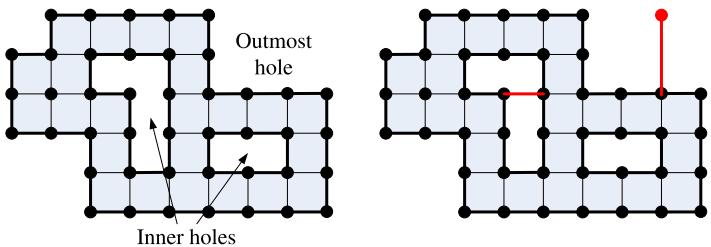  
Fig. 3. Grid graph. Left: a regular grid graph. Right: an irregular grid graph formed by red edges and nodes.

# 2. Problem specification

In this section, we show that if 4-connectivity in image pixels is used, the black portion in the binary image can be represented by a grid graph. We follow the notations in [9]. A grid graph $G ( V , E )$ is a finite node-induced subgraph of the infinite two-dimensional integer grid. Formally, one can assign a 2D integer coordinate $( x _ { i } , y _ { i } )$ to each node $v _ { i } \in V$ , so that $v _ { i }$ and $v _ { j }$ are connected by an edge if and only if their Manhattan distance is 1, i.e. $| x _ { i } - x _ { j } | + | y _ { i } - y _ { j } | = 1 .$ . A grid graph is a planar graph with bounded faces. A face of area one is called a cell, which is encompassed by a cycle of length 4. In this paper, we study regular grid graphs in which all cells are connected and each edge must be incident to at least one cell (ref. Fig. 3). A regular grid graph is bounded by an outermost hole $h _ { 0 }$ and possibly several inner holes $\{ h _ { 1 } , h _ { 2 } , \ldots \}$ . The boundary $B ( h )$ of each hole is a simple cycle.

Definition 2.1. A regular grid graph is a connected grid graph in which each edge is incident to at least one cell, i.e., a face of area one.

A 2-factor of graph $G$ is a spanning subgraph of $G$ for which all the vertices have degree two. Let $\mathcal { F }$ be a 2-factor of G. If $\mathcal { F }$ does not contain any cycle of length 4, $\mathcal { F }$ is called a square-free 2-factor of G. Hartvigsen [12] studied the problem of finding a square-free 2-factor in bipartite graphs. A necessary and sufficient condition on the existence of a square-free 2-factor in a bipartite graph is given in [12] in which a polynomial time algorithm was also proposed to find such a square-free 2-factor. Any grid graph is known to be bipartite by the chessboard coloring as follows. One can assign an integer coordinate $( x _ { i } , y _ { i } )$ to each vertex $v \in G$ . A node is even if $x _ { i } + y _ { i } \equiv 0$ (mod 2), otherwise it is odd. Two nodes are connected if and only if their Manhattan distance is 1, indicating that every edge connects an odd node and an even node. A grid graph has a square-free 2-factor if and only if the graph satisfies the Hartvigsen’s condition in [12].

Given a regular grid graph, every boundary $B ( h )$ is a simple cycle of length larger than 4 (otherwise the cycle just bounds a single cell). Let $C = \{ C _ { 1 } , C _ { 2 } , \ldots , C _ { m } \}$ be the set of all the cycles of length larger than 4. If $C$ is a square-free 2-factor of the graph $G \backslash \bigcup _ { i } B ( h _ { i } )$ , then $\mathcal { F } = \{ B ( h _ { 0 } ) , B ( h _ { 1 } ) , \ldots , B ( h _ { k } ) , C _ { 1 } , C _ { 2 } , \ldots , C _ { m } \}$ is a square-free 2-factor of the graph G. In this paper,  we assume that the regular grid graph we studied is finite and satisfies the Hartvigsen’s condition. So a square-free 2-factor $\mathcal { F }$ exists. In the following context, unless otherwise noted, a graph $G$ is referred to as a finite, regular grid graph.

Definition 2.2. An initial 2-factor $\mathcal { F }$ of a graph $G$ is defined as $\mathcal { F } = \mathcal { F } ^ { \prime } \cup \{ B ( h _ { 0 } ) , B ( h _ { 1 } ) , \ldots , B ( h _ { k } ) \}$ , where ${ \mathcal { F } } ^ { \prime }$ is a square-free 2-factor of $G \setminus \bigcup _ { i } B ( h _ { i } )$ , and $B ( h _ { 0 } ) , B ( h _ { 1 } ) , \ldots , B ( h _ { k } )$ are all the boundaries of holes in $G$ .

The problem we solve in this paper is summarized below.

Problem 2.3. Given a finite, regular grid graph G with an initial 2-factor $\mathcal { F }$ , find a path in G that is as long as possible.

In this paper, we propose a solution that can find in an $n$ -vertex graph $G$ with $\mathcal { F }$ , a path of length at least ${ \frac { 5 } { 6 } } n + 2$ in quadratic time. Our approximate algorithm for the longest path problem is based on the classical cycle-merging technique. We first study some characteristics of cross cells in $G$ (to be defined in Section 3) and propose three cycle-merging and one extension operations in Section 4. Then we present the approximate algorithm and prove its correctness in Section 5. Performance analysis of the approximate algorithm and comparisons with previous results are given in Sections 6 and 7, respectively. Finally, Section 8 gives our conclusion.

# 3. Characteristics of cross cells

Denote the initial 2-factor $\mathcal { F }$ of a graph $G$ by $\mathcal { F } = \{ C _ { 1 } , \ldots , C _ { r } \}$ .1

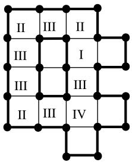  
Fig. 4. Four types of cross cells.

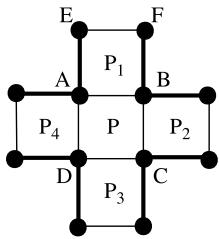  
Fig. 5. Proof of Lemma 3.3.

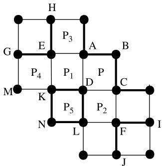  
Fig. 6. Proof of Lemma 3.4.

Definition 3.1. A cross cell of G with respect to $\mathcal { F }$ is a cell whose four nodes belong to at least two different cycles $C _ { i }$ and $C _ { j }$ , $i \neq j$ .

As illustrated in Fig. 4, for a graph G with $\mathcal { F }$ , dark edges are used to refer to the edges in $\mathcal { F }$ and light edges are those in $G \backslash { \mathcal { F } }$ . Also illustrated in Fig. 4, there are four different types of cross cells in $G$ and they are called Type I, II, III and IV, respectively, in this paper.

• Type I. There is only one dark edge in the cell;   
Type II. There are two adjacent dark edges in the cell;   
• Type III. There are two opposite dark edges in the cell;   
Type IV. There is no dark edge in the cell.

Observation 3.2. In a graph $G$ with $\mathcal { F }$ , for any cross cell $P \in G$ and an edge $e \in P$ , if $e \not \in \mathcal { F }$ , then e does not lie on the boundary of any hole $B ( h )$ of $G$ , i.e., there exists another cell $P ^ { \prime } \in G$ that is adjacent to $P$ and shares e.

Lemma 3.3. If P is a Type IV cell in $G$ with respect to $\mathcal { F }$ , then at least one of the four neighboring cells of $P$ in $G$ is a Type III cell.

Proof. Observation 3.2 guarantees that $P$ has four neighbor cells $P _ { 1 } , \ldots , P _ { 4 }$ . Refer to Fig. 5. Each node of A, B, C, $D$ is passed through by one cycle. If nodes A and $B$ are not in the same cycle, then $( E , F )$ cannot be a dark edge. So $P _ { 1 }$ is a Type III cell. The same argument holds for the node pairs $( A , D )$ , $( D , C )$ or $( C , B )$ . If this situation does not exist, A, B, C, D are all in the same cycle and then $P$ is not a cross cell, a contradiction. 

Given Lemma 3.3, if no Type III cell can be found in G, then there will be no Type IV cells. Refer to Fig. 6. Let $P$ be a Type II cell in $G$ and $\{ P _ { 1 } , P _ { 2 } \}$ are the two neighbors of $P$ that share the two light edges of $P$ .

Lemma 3.4. If there are no Types III, IV cells in G with respect to $\mathcal { F }$ and $P$ is a Type II cell in G, then at least one of two neighbors $\{ P _ { 1 } , P _ { 2 } \}$ is a Type II cell.

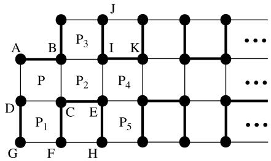  
Fig. 7. Proof of Lemma 3.5.

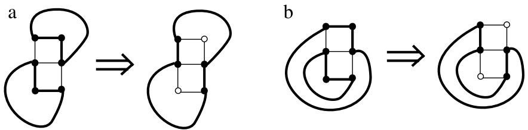  
Fig. 8. Operation II. (a) The non-nesting case. (b) The nesting case.

Proof. If Lemma 3.4 does not hold, the two adjacent cells $\{ P _ { 1 } , P _ { 2 } \}$ are both Type I cells. Let the Type II cell $P$ be configured as in Fig. 6. D is the node in $P$ that is not in the cycle passing through nodes A, B, C. Then it is readily seen that DK and $D L$ are solid edges, otherwise $\mathcal { F }$ is not a 2-factor in G. Since there are no Types III and $_ \mathrm { I V }$ cells in $G$ , the dark edges incident to nodes A, C, E, F are determined accordingly, as shown in Fig. 6.

GEH and ABC must belong to the same cycle, otherwise $P _ { 3 }$ is a Type III cell. The same argument holds for $I F J$ and ABC being in the same cycle. KM must be a light edge, otherwise $P _ { 4 }$ is a Type III cell. Since $K$ has degree 2 in $\mathcal { F }$ , KN is a dark edge. Symmetrically LN is a dark edge, leading to the result that $P _ { 5 }$ contains a cycle of length 4, a contradiction to the assumption that $\mathcal { F }$ is a square-free 2-factor. That completes the proof. 

Lemma 3.5. Ifthere are no Types III and IV cells in G with respect to $\mathcal { F }$ , then there exists a Type II cell in G.

Proof. If Lemma 3.5 does not hold, then all the cross cells in $G$ are of Type I. Let $P$ be such a Type I cell in $G$ with the configuration shown in Fig. 7. In $P$ , AB is the only dark edge. By Observation 3.2, neighbor cells $P _ { 1 }$ , $P _ { 2 }$ exist. Since nodes C, $D$ have degree 2 in $\mathcal { F }$ , the dark edges incident to C, $D$ must be configured as shown in Fig. 7. Since $P _ { 1 }$ is not a Type III cell, GD and ECF must be in the same cycle and $P _ { 2 }$ is a Type I cell. By repeating the process, neighbor cells $P _ { 3 }$ , $P _ { 4 }$ of $P _ { 2 }$ exist, and AB and JIK are in the same cycle, and $P _ { 4 }$ is again a Type I cell. Keeping iterating this process, the graph $G$ is infinite long and the 2-factor $\mathcal { F }$ contains two cycles. This contradicts the fact that $G$ is a finite graph and thus completes the proof. 

# 4. Cycle-merging and extension operations

Based on the characteristics of cross cells presented in the above section, in this section we define three merging operations and one extension operation that are used in the algorithm proposed in Section 5.

Let $P$ be a Type III cell through which two cycles $C _ { 1 }$ , $C _ { 2 }$ in $\mathcal { F }$ pass. Flipping the edge types in $P$ (i.e., changing the dark edges into light and light edges into dark) will merge the two cycles $C _ { 1 }$ , $C _ { 2 }$ into a larger one.

Definition 4.1. The flipping operation of a Type III cell is defined as Operation I, denoted by $\oplus _ { 1 }$ , and the new merged cycle is denoted by ${ \cal C } = { \cal C } _ { 1 } \oplus _ { 1 } { \cal C } _ { 2 }$ .

If $C _ { 1 }$ is nested within $C _ { 2 }$ , the exterior of $C _ { 2 }$ and the interior $C _ { 1 }$ become the exterior of C. If neither of $C _ { 1 }$ and $C _ { 2 }$ is nested within the other, then the union of their interiors becomes the interior of C.

Given Lemmas 3.4 and 3.5, if there are no Type III cells in $G$ with respect to $\mathcal { F }$ , we can find in $G$ two adjacent cross cells $P$ and $Q$ of Type II.

Definition 4.2. Operation II, denoted by $\oplus _ { 2 }$ , deals with two adjacent Type II cells, and the new merged cycle is denoted by ${ \cal C } = { \cal C } _ { 1 } \oplus _ { 2 } { \cal C } _ { 2 }$ .

Two cases of Operation II are illustrated in Fig. 8. When merging two cycles, Operation II will create two free nodes that do not belong to any cycle in $\mathcal { F }$ . When neither of two cycles $C _ { 1 }$ , $C _ { 2 }$ is nested within the other, the two new created free nodes are inside the merged cycle C. If one cycle $C _ { 1 }$ is nested within $C _ { 2 }$ , the exterior of $C _ { 2 }$ and the interior of $C _ { 1 }$ become the exterior of the new cycle $C$ , and the two free nodes are outside C. The extension operation defined below deals with multiple free nodes.

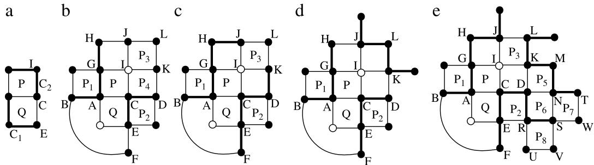  
Fig. 9. Proof of Lemma 4.5. (a) The original pattern. (b) After operation II. (c) Case I. (d) Case II: the first pattern. (e) Case III: the second pattern.

Definition 4.3. The extension operation, denoted by EXTEND(P), deals with the cell $P$ , in which the four nodes A, B, C, D in clockwise order satisfy that AB is a dark edge in $\mathcal { F }$ and $C$ , $D$ are two free nodes. EXTEND $( P )$ extends the dark edge AB into ADCB.

Definition 4.4. A free node $v$ is said to be adjacent to a cycle $C _ { i } ,$ , if and only if $C _ { i }$ passes through some of the eight nodes of cells incident to $v$ .

If the free nodes are inside one merged cycle $C ^ { \prime }$ , they will not affect the merging operations on the cross cells passed through by other cycles in $\mathcal { F }$ . If one free node is adjacent to at least two different cycles, we can design another merging operation (Operation III) to merge more cycles. The following lemma characterizes this situation.

Lemma 4.5. Assume that graph $G$ contains no Type III cells. Let P, Q be two adjacent cross cells ofType II in G. Let node I incident to $P$ (Fig. $9 ( a ) _ { \cdot }$ ) become a free node after applying Operation II on $P$ , Q (Fig. $9 ( b ) .$ ). If after all the possible extension operations, I is adjacent to at least two different cycles, then the surrounding pattern of I has only two possible patterns, as illustrated in Fig. 9(d) and (e).

Proof. Refer to Fig. 9. Let $C _ { 1 }$ , $C _ { 2 }$ be cycles in $\mathcal { F }$ and A, B, . . . ,K be nodes. After applying Operation II on $P$ and Q, I becomes a free node. Since nodes A and $C$ have degree 2 in F , AB and $C D$ are dark edges, as shown in Fig. 9(b). Since by assumption cells $P _ { 1 } , P _ { 2 }$ are not Type III cells before merging cycles $C _ { 1 } , C _ { 2 }$ , EF and GH are also dark edges in Fig. 9(b).

Now if $K$ is a free node, $P _ { 4 }$ can be extended, and $I$ is no longer a free node. Thus $K$ is in $\mathcal { F }$ , and so is $J _ { \cdot }$ . Given $J$ , K have degree 2 in $\mathcal { F }$ , if node $L$ is free and $J H$ and DK are both dark edges, then I is adjacent to only one cycle, a contradiction. Thus $L$ cannot be free, and all the nodes J, K, L are in $\mathcal { F }$ . By considering to which cycle node $J$ and $K$ belong, we have the following three cases:

Case I: $H J$ and DK are dark edges, as shown in Fig. 9(c). In this case, L must belong to another cycle $C _ { 3 }$ , so $J L$ and $K L$ are light edges, and $P _ { 3 }$ is a Type IV cell before applying a merging operation on $P$ , Q. According to Lemma 3.3, there must be a Type III cell, which is contradictory to the assumption. So this case does not exist.

Case II: Both $H J$ and DK are light edges. This case (the first possible pattern) is shown in Fig. 9(d) (note that nodes J, K have degree 2 in $\mathcal { F }$ ).

Case III: One of $H J$ and $D K$ is a dark edge. Without generality, assume that $H J$ is a dark edge and DK is light. First, if $K L$ is a light edge, then $P _ { 3 }$ is a Type IV cell before merging $P$ and Q, a contradiction. Second, assume that KL is a dark edge as shown in Fig. 9(e). Since nodes $K$ , $D$ have degree 2 in $F$ and KM is a dark edge, if DN is also a dark edge, then $P _ { 4 }$ becomes a Type III cell, also a contradiction. So DN is a light edge and DR is a dark edge. Note that NS is a light edge, otherwise $P _ { 6 }$ becomes a Type III cell. Since $N$ has a degree of 2 in $\mathcal { F }$ , NT must be a dark edge. If RU is a dark edge, then RS is a light edge and the two dark edges starting from S must be SW and $S V$ ; in this subcase, to whichever cycle WSV belongs, one of $P _ { 7 }$ and $P _ { 8 }$ will be a Type III cell, a contradiction. Thus RS must be a dark edge. Accordingly, we obtain the second possible pattern, as shown in Fig. 9(e). 

Given Lemma 4.5, once we apply Operation II on two adjacent Type II cells with respect to cycles $C _ { 1 }$ , $C _ { 2 }$ and apply all the possible extension operations, if a free node is adjacent to two cycles ${ \cal C } = { \cal C } _ { 1 } \oplus _ { 2 } { \cal C } _ { 2 }$ and $C _ { 3 }$ , and the surrounding pattern is in the first case as shown in Fig. 9(d), the third merging operation can be designed and the following definition is in order.

Definition 4.6. Operation III, denoted by $\oplus _ { 3 }$ , deals with free nodes created by applying Operation II ${ \cal C } = { \cal C } _ { 1 } \oplus _ { 2 } { \cal C } _ { 2 } ,$ ), and the new merged cycle is denoted by ${ \cal { C } } ^ { \prime } = { \cal { C } } \oplus _ { 3 } { \cal { C } } _ { 3 }$ .

Fig. 10 illustrates the Operation III. It is not difficult to point out that if $C$ and $C _ { 3 }$ are not nested within each other, the new free node is inside $C ^ { \prime }$ ; otherwise if $C$ is nested within $C _ { 3 }$ , the new free node is outside $C ^ { \prime }$ . Operation III is an important tool for us to deal with the free nodes created by Operation II.

Note that the patterns at the left and bottom sides of the new free node is exactly the same as the old one. So with a similar analysis as the proof to Lemma 4.5, if this node is still free after applying the extending operation and is adjacent to different cycles, its surrounding pattern is the same as illustrated in Fig. 9(d) or (e).

For the second case as shown in Fig. 9(e), we note that cells $P _ { 5 }$ and $P _ { 6 }$ form the pattern that can be merged by Operation II; after applying Operation II, the free node is no longer adjacent to different cycles. Thus the second case does not affect the merging procedure.

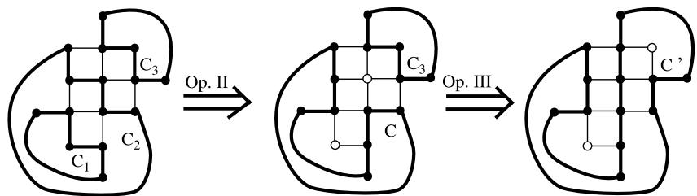  
Fig. 10. Graph patterns after operations II and III.

Observation 4.7. Given a graph G with $\mathcal { F }$ , after applying Operations I, II, III and extending operations, for any free node $v$ that is adjacent to two or more nodes belonging to different cycles, the surrounding patterns of $v$ can have at most two types, and the free node will not affect the merging procedure on the remaining cycles.

Up to now, we have defined all the four types of operations we need in the cycle-merging algorithm. The first operation finds a Type III cell and flips it, merging two cycles with no free nodes left. If no Type III cell can be found, we prove that two adjacent Type II cells can be found, on which we define the second type of merging operation, merging two cycles and generating two free nodes. In order to handle with these free nodes, we prove that if any free node affects other boundaries, the surrounding pattern is uniquely determined. Based on this pattern, we define Operation III which merges two cycles and moves the free node, plus an extending operation guaranteeing that no adjacent free nodes appear. These four operations will be the core of the algorithm introduced in the next section.

# 5. The cycle-merging algorithm

We define an auxiliary graph $C Y C L E ( G , { \mathcal { F } } )$ as follows. First, CYCLE $( G , { \mathcal { F } } )$ is initialized to be empty. Then for every cycle $C _ { i }$ in $\mathcal { F }$ , we add a node $o _ { i }$ into $C Y C L E ( G , { \mathcal { F } } )$ . For all the cycle pairs $( C _ { i } , C _ { j } )$ , if $C _ { j }$ is immediately nested within $C _ { i }$ , we add an edge connecting $o _ { i }$ and $o _ { j }$ . Since the nesting relation is a partial order, for an initial 2-factor $\mathcal { F }$ of $G$ , we have the following observation:

Observation 5.1. CYCLE $( G , { \mathcal { F } } )$ is a tree with root node $o _ { 0 }$ , whose corresponding circle $B ( h _ { 0 } )$ is the outmost hole of $G$ .

In $C Y C L E ( G , { \mathcal { F } } )$ , we define $o = \sigma _ { 1 } \oplus \sigma _ { 2 }$ as a merging operation, which operates in three steps: (1) add o into CYCLE $( G , { \mathcal { F } } )$ ; (2) delete $o _ { 1 }$ and $o _ { 2 }$ ; (3) for any $o _ { k }$ connecting with $o _ { 1 }$ or $o _ { 2 }$ , add an edge between o and $o _ { k }$ . A node pair $( o _ { i } , o _ { j } )$ in CYCLE $( G , { \mathcal { F } } )$ is called an available pair if and only if one of the following two cases is satisfied:

1. $o _ { i }$ and $o _ { j }$ are child nodes of the same father node $o _ { k }$ in $C Y C L E ( G , { \mathcal { F } } )$ , and $o _ { i } , o _ { j }$ are leaves.   
2. $o _ { i }$ is a child of $o _ { j }$ and $o _ { i }$ is a leaf, or $o _ { j }$ is a leaf with father $o _ { i }$ .

Given $C Y C L E ( G , { \mathcal { F } } )$ and the merging operation $\oplus$ , the cycle-merging algorithm works with a finite graph G with $\mathcal { F }$ , which finds a long cycle in $G$ using the following steps.

1. Find all the boundaries of holes in $G$ and list them as $B ( h _ { 0 } ) , \ldots , B ( h _ { k } )$ , where $B ( h _ { 0 } )$ is the outermost cycle. Check whether $G$ is a regular graph with boundaries $B ( h _ { 0 } ) . . . B ( h _ { k } )$ . If $G$ is not regular, reject the graph and halt.   
2. Let $G ^ { \prime } = G \backslash \bigcup _ { i = 0 } ^ { k } B ( h _ { i } )$ , divide $G ^ { \prime }$ into a bipartite graph by chessboard coloring. Use Hartvigsen’s algorithm [12] to find  =a maximum cardinality square-free simple 2-matching ${ \mathcal { F } } ^ { \prime }$ . Check whether ${ \mathcal { F } } ^ { \prime }$ is a square-free 2-factor. If not, reject the graph and halt. Otherwise let $\mathcal { F } = \mathcal { F } ^ { \prime } \cup \{ B ( h _ { 0 } ) , B ( h _ { 1 } ) , \ldots , B ( h _ { k } ) \}$ , which is an initial 2-factor of $G .$ .   
3. Build the auxiliary graph $C Y C L E ( G , { \mathcal { F } } )$ .   
4. While $\mathcal { F }$ contains more than one cycle, repeat the following steps until $\mathcal { F }$ is a single cycle. 4.1. Find an available pair $( o _ { i } , o _ { j } )$ in $C Y C L E ( G , { \mathcal { F } } )$ and a Type III cross cell $P$ with respect to $C _ { i }$ and $C _ { j }$ . Take Operation I on $P$ . Let ${ \cal { C } } ^ { \prime } = { \cal { C } } _ { i } \oplus _ { 1 } { \cal { C } } _ { j }$ and update $\mathcal { F }$ . Let $o ^ { \prime } = o _ { i } \oplus o _ { j }$ and update $C Y C L E ( G , { \mathcal { F } } )$ . Take all the possible extending operations. Go back to Step 4. If no more such node pairs $( o _ { i } , o _ { j } )$ can be found, go to 4.2. 4.2. Find an available pair $( o _ { i } , o _ { j } )$ and two adjacent Type II cross cells $P$ , $Q$ with respect to $C _ { i }$ and $C _ { j }$ . Take Operation II on $P$ and Q. Let ${ \cal C } ^ { \prime } = C _ { i } \oplus _ { 2 } C _ { j }$ and update $\mathcal { F }$ . Let $o ^ { \prime } = o _ { i } \oplus o _ { j }$ and update $C Y C L E ( G , { \mathcal { F } } )$ . Take all the possible extending operations. Go back to Step 4. If no more such node pairs $( o _ { i } , o _ { j } )$ can be found, go to 4.3. 4.3. Find an available pair $( o _ { i } , o _ { j } )$ with their corresponding cycles whose configuration is as the pattern shown in Fig. 9(d). Take Operation III on the pattern. Let ${ \cal { C } } ^ { \prime } = C _ { i } \oplus _ { 3 } C _ { j }$ and update $\mathcal { F }$ . Let $o ^ { \prime } = o _ { i } \oplus o _ { j }$ and update CYCLE $( G , { \mathcal { F } } )$ . Take all the possible extension operations. Go back to Step 4.

5. Output the single cycle in $\mathcal { F }$ .

To illustrate the main steps of the algorithm, a simple example is presented in Fig. 11.

Theorem 5.2. For a finite graph $G$ with $\mathcal { F }$ , the cycle-merging algorithm terminates in finite time and outputs a single cycle.

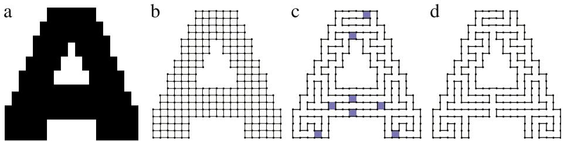  
Fig. 11. An example of letter shape ‘A’. (a) The image pixels. (b) The finite regular graph. (c) The initial 2-factor. (d) A long path.

$$
\mathrm { \Delta } ^ { \mathrm { D } } = \frac { F ^ { \prime } } { N } = \frac { F ^ { \prime } } { N }
$$

Fig. 12. Proof of Theorem 6.1: three sequential nodes A, B, C are in a cycle $C _ { j }$ and are also on the convex hull of $C _ { j }$

Proof. If a finite graph cannot pass through the test in Steps 1 and 2, it is not a regular grid graph with an initial square-free 2-factor. Otherwise, the algorithm will build an auxiliary graph CYCLE $( G , { \mathcal { F } } )$ in Step 3, and enter Step 4.

Assume that $C Y C L E ( G , { \mathcal { F } } )$ is a tree of depth $k .$ Mathematical induction is applied here. When $k = 1$ , the only cycle is the outmost boundary and the theorem obviously holds. Assume that the theorem holds for all $k \leq t , t > 1 .$ . Let $k = t + 1$ . The root $o _ { 0 }$ has multiple children, each of which is a subtree of depth $\leq t$ . According to the assumption, each subtree $T _ { i }$ can be merged into a single cycle $C _ { i }$ , with some free nodes in or out of $C _ { i }$ . Thus we only need to consider the case that $o _ { 0 }$ has $r \geq 1$ children $o _ { 1 } , \ldots , o _ { r }$ , each child corresponds to a cycle nested within $C _ { 0 }$ , with some free nodes generated by Operations II, III and the extension operations.

In the case $r = 1$ , $( o _ { 0 } , o _ { 1 } )$ is an available pair. If there exists free nodes $A _ { 1 } , \ldots , A _ { q }$ outside $C _ { 1 }$ , all of them are adjacent to $C _ { 1 }$ . We have two subcases: (1) If any $A _ { i }$ is adjacent to $C _ { 0 }$ , by Observation 4.7 the surrounding pattern of $A _ { i }$ is uniquely determined and Operation III can be applied to merge $C _ { 0 }$ and $C _ { 1 }$ . (2) Otherwise none of the free nodes is incident to the cross cells between $C _ { 0 }$ and $C _ { 1 }$ : in this subcase, all the analysis in Lemmas 3.3–3.5 holds, and there exists a Type III cell or two adjacent Type II cells. Correspondingly, Operation I or II can be applied and the tree can be merged into a single node.

In the case $r > 1$ , every $( o _ { i } , o _ { j } ) , 0 \le i , j \le r$ is an available pair. We first prove that there are two cycles in $\{ C _ { 0 } , C _ { 1 } , \ldots , C _ { r } \}$ which can be merged into one by the algorithm. If there exists a free node $v$ which is adjacent to two cycles $C _ { i }$ and $C _ { j }$ , Operation III can be applied. Otherwise all the cross cells are not affected, and a Type III cell or two Type II cells can be found, leading to Operation II or III being applied. Since two cycles in $\{ C _ { 0 } , C _ { 1 } , \ldots , C _ { r } \}$ can be merged, the tree structure does not change but $r$ decreases by 1. If we repeat this process, $r$ will eventually become 1.

Thus for $k = t + 1$ , the theorem is correct. That completes the proof. 

# 6. Performance analysis

Let $f ( G )$ denote the length of the long cycle in $G$ found by the cycle-merging algorithm.

Theorem 6.1. For a finite, regular grid graph $G = ( V , E )$ with an initial 2-factor $\mathcal { F } , f ( G ) \ge \frac { 5 } { 6 } n + 2$ , where $n = | V |$

Proof. Only Operation II decreases the number of nodes in $\mathcal { F }$ . If $\mathcal { F }$ initially contains s cycles, and the algorithm takes $a$ times of Operation II and $b$ times of extending operation, we have $f ( G ) = n - 2 a + 2 b$ . Every operation of type I, II and III reduces the number of cycles in $\mathcal { F }$ by 1. So the total time of applying the three operations is $n - 1$ and we have $a \leq n - 1$ .

For a cycle $C _ { i }$ in $\mathcal { F }$ , if no cycle is nested in $C _ { i }$ , then $C _ { i }$ is a leaf in $C Y C L E ( G , { \mathcal { F } } )$ . Furthermore, if there exists a Type III cross cell with respect to $C _ { i }$ and another cycle, then $C _ { i }$ will be merged first by the algorithm in Step 4.1. We call such $C _ { i }$ a first-class cycle. Since $\mathcal { F }$ is a square-free 2-factor and all cycles in a bipartite graph having even lengths, we know that $C _ { i }$ has at least 6 nodes.

Refer to Fig. 12. Assume that no free node exists. If three sequential nodes A, B, C are in a cycle $C _ { j }$ and are also on the convex hull of $C _ { j }$ , then the nodes $D , E , F$ must belong to other cycles. Since $E$ has degree 2 in $\mathcal { F }$ , at least one of DE and EF is a dark edge, and at least one of $P _ { 1 }$ and $P _ { 2 }$ is a Type III cell. Therefore, for a cycle $C _ { j }$ , if no other cycle is nested in $C _ { j }$ and there are three sequential nodes in $C _ { j }$ which is also on the convex hull of $C _ { j } , C _ { j }$ is a first-class cycle.

By simple enumeration as shown in Fig. 13(a), it is clear that all the cycles of lengths less than 12 are first-class cycles, and the minimum length of non-first-class cycle is 12 (shown in Fig. 13(b)). Assume that $G$ contains $x$ first-class cycles and $s - x$ non-first-class cycles. The algorithm needs applying Operation I at least $x / 2$ times to make all the cycles being non-first-class. After merging first-class cycles, at most $s - x + x / 2 \stackrel { } { = } s - x / 2$ non-first-class cycles exist in $\mathcal { F }$ . So at most $s - x / 2 - 1$ times of Operation II will be applied, leading to at most $2 ( s - x / 2 - 1 )$ free nodes. Hence, we have $f ( G ) = n - 2 a + 2 b \geq n - 2 a \geq n - 2 ( s - x / 2 - 1 ) = n - 2 s + x + 2$ .

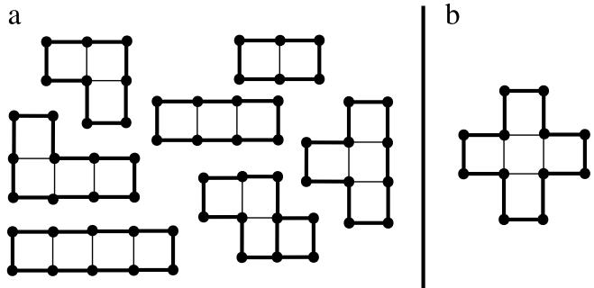  
Fig. 13. Proof of Theorem 6.1. (a) All the cycles of length less than 12: the cycles that become the same after reflection and rotation are treated as one case. (b) The minimum non-first-class cycle.

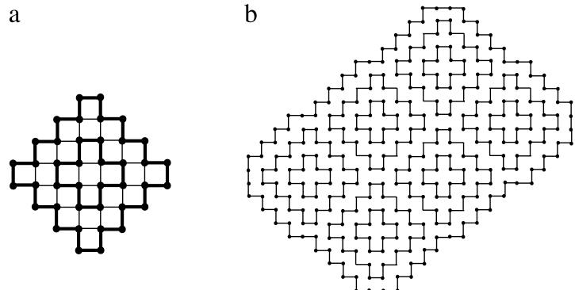  
Fig. 14. An upper bound of the long cycle in graph G. (a) A piece of component. (b) The whole graph.

Since there are $x$ first-class cycles and $s - x$ non-first-class cycles, we have $n \geq 6 x + 1 2 ( s - x ) = 6 ( 2 s - x )$ . Thus $\begin{array} { r } { f ( G ) \geq n - 2 s + x + 2 \geq n - \frac { 1 } { 6 } \bar { n } + 2 = \frac { 5 } { 6 } n + 2 } \end{array}$ . 

Theorem 6.1 shows that in a finite, regular grid graph with an initial square-free 2-factor, a long cycle of length at least $\scriptstyle { \frac { 5 } { 6 } } n + 2$ exists. However, this lower bound seems not very tight, because in all our experiments we cannot give an example thates this lower bound. Consider a piece of graph component shown in Fig. 14(a). The algorithm must apply an Operation II to merge the component into one cycle, indicating that 2 out of 40 nodes in the component will become free nodes. If we use this component as a basic primitive to cover a large area as shown in Fig. 14(b), we can generate an arbitrary large graph G with $\begin{array} { r } { f ( G ) \stackrel { - } { = } \frac { 1 9 } { 2 0 } n + o ( n ) . } \end{array}$ . As $G$ grows larger, we have $\textstyle f ( G ) / n \to { \frac { 1 9 } { 2 0 } }$ . We conclude this in the following observation.

Observation 6.2. For finite, regular grid graphs with initial square-free 2-factors, for arbitrary $\epsilon > 0$ , there exists an integer satisfies , such that $\begin{array} { r } { \frac { 5 } { 6 } \leq f ( G ) / n \leq \frac { 1 9 } { 2 0 } + \epsilon } \end{array}$ $\forall n > N$ , the approximation ratio of the long path in an . $n$ -vertex graph founded by the cycle-merging algorithm

Next, we give an analysis on the time complexity of the cycle-merging algorithm.

Theorem 6.3. For an $n$ -vertex regular grid graph $G$ with $\mathcal { F }$ , the cycle-merging algorithm has the time complexity $O ( n ^ { 2 } )$

Proof. In the cycle-merging algorithm, Step 1 finds all the boundaries of holes and checks the regularity of the boundaries. We first assign a 2D integer coordinate $( x _ { i } , y _ { i } )$ for each node $v _ { i }$ of G. At an integer position, $v _ { i }$ has 8 neighbor points $( x , y )$ on the 2D plane satisfying max $\{ | x - x _ { i } |$ , $| y - y _ { i } | \} = 1 .$ $v _ { i }$ is on the boundary of a hole if and only if its 8 neighbor points are not all in G. By a linear-time scanning, we can determine all the boundary nodes in G. Then the graph is regular if and only if these boundary nodes span separate cycles in G. At the same time, we find all the boundaries of holes. Therefore, Step 1 runs in linear time.

By Hartvigsen’s analysis [12], on a bipartite graph $G ( X , Y , E )$ with $| X | = s$ and $| Y | = t$ , the maximum cardinality squarefree 2-factor can be solved in O(st) time, which is $O ( n ^ { 2 } )$ in a grid graph. Then the auxiliary tree $C Y C L E ( G , { \mathcal { F } } )$ can be generated in $O ( n ^ { 2 } )$ as follows. First, assign a number to each node as the cycle ID it belongs to, and mark all the nodes as unfinished. Then iteratively (1) find a cycle that all the nodes inside are finished, (2) mark the nodes on the cycle as finished, and (3) add the sub-forest constructed from those inside nodes as children of the new handled cycle. When the outermost cycle is processed, the cycle tree is constructed. Since the number of cycles in $\mathcal { F }$ is less than n, both Steps 2 and 3 requires $O ( n ^ { 2 } )$ time.

In Step 4, finding two cycles that can be merged in the graph needs a linear-time scanning on the cycle tree. Then the algorithm needs a scanning on the border of the two cycles to determine the area of merging. The above two operations need $O ( n + r )$ time, where $| C \mathrm { Y } C L E ( G , { \mathcal { F } } ) | = r < n .$ Since each time the number of cycles decrease by 1, Step 4 can be done in $O ( r ( n + r ) ) \le O ( n ^ { 2 } )$ .

In summary, the algorithm runs in $O ( n ^ { 2 } )$ time.

Table 1 Comparison with classical results.   

<table><tr><td>Algorithms</td><td>Handling graph type</td><td>The length of long path in grid graph</td><td>Running time</td></tr><tr><td>Bjorklund and Husfeldt [2003]</td><td>General graph</td><td>O((log n/ log log n)2)</td><td>Polynomial</td></tr><tr><td>Feder et al. [2002]</td><td>3-connected cubic graph</td><td>Invalid</td><td>Polynomial</td></tr><tr><td>Chen et al. [2007]</td><td>3-connected graph with bounded degree</td><td>≥</td><td>O(n3)</td></tr><tr><td>Our algorithm</td><td>Regular grid graph with an initial F</td><td>≥</td><td>O(n{)</td></tr></table>

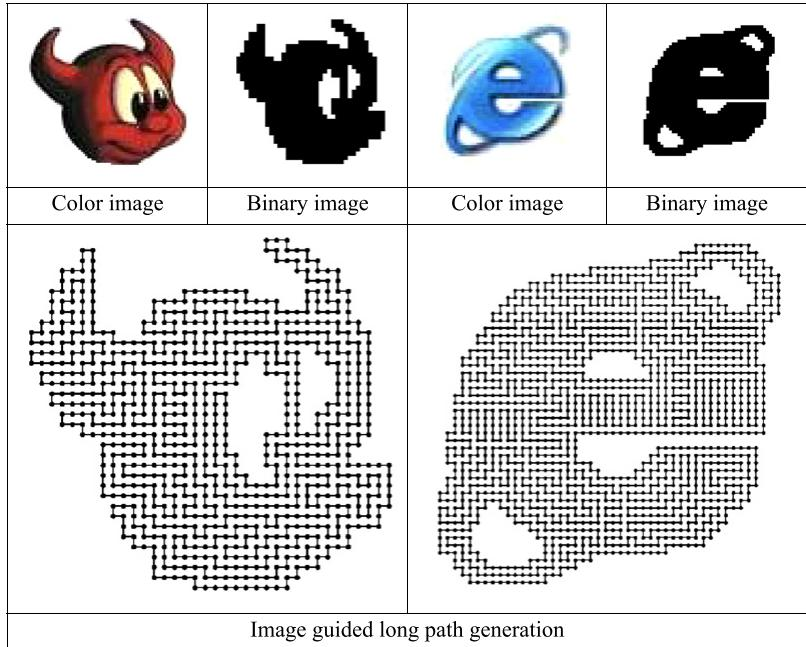  
Fig. 15. Two examples of encoding image shape in long paths.

# 7. Comparison with known results

There are several classic approximation algorithms for finding long paths on general or special graphs. In this section, we compare the performance of these known algorithms on grid graphs, showing that our algorithm achieves the best performance on grid graphs possibly with multiple inner holes.

In [3], Monien first proposed an exponential time algorithm that finds a long path of length $O ( \log L / \log \log L )$ . Later Bjorklund and Husfeldt [4] improved this result and proposed a polynomial time algorithm that finds a long path of length $O ( ( \log L / \log \log L ) ^ { 2 } )$ . On a regular grid graph with a $\mathcal { F }$ , we have proved that $\begin{array} { r } { L > \frac { 5 } { 6 } n , } \end{array}$ , which implies that Bjorklund’s algorithm can find a path of length $O ( ( \log n / \log \log n ) ^ { 2 }$ ).

Feder et al. [5] showed that for 3-connected cubic graphs, there is a polynomial time algorithm for finding a cycle of length at least $\dot { O } ( n ^ { ( \log _ { 3 } 2 ) / 2 } ) \approx O ( n ^ { 0 . 6 3 1 } )$ . However, this algorithm cannot be applied to grid graphs since all the grid graphs contain at least one node of degree 2, i.e., it is not 3-connected. In addition, grid graphs cannot be modified into a cubic graph. Chen et al. [7] gave an improved result that for any 3-connected graph with bounded degree $d$ , there is an algorithm that runs in $O ( n ^ { 3 } )$ and finds a cycle of length at least $\frac { 1 } { 2 } \bar { n ( \log _ { b } 2 ) / 2 } + 3$ , where $b = \operatorname* { m a x } \{ 6 4 , 4 d + 1 \}$ . A grid graph can be modified into a 3-connected graph by cutting every node $v$ with degree 2, and connecting the two nodes that connect with $v$ . Thus the graph becomes a 3-connected graph with bounded degree $d = 4$ . Thus $b = 6 4$ and the long path found by Chen’s algorithm is of length at least ${ \frac { 1 } { 2 } } n ^ { 1 / 1 2 } + 3$ . These results are summarized in the Table 1.

# 8. Conclusions

In this paper, we analyze the characteristics of cross cells and propose a merging-cycle algorithm to find a long path in a finite, regular grid graph with an initial square-free 2-factor. The algorithm can find a long path of length at least $\frac { 5 } { 6 } \bar { n } + 2$ and runs in quadratic time. Since the found path is sufficiently long, a practical application of maze design becomes possible, showing that the pixels in a guided image are almost completely gone through by the path. Two practical examples are illustrated in Fig. 15.

# Acknowledgements

The authors thank the reviewer and editor for their comments that helped improve this paper. This work was supported by the National Science Foundation of China (Project 60970099), the National Basic Research Program of China 2011CB302202 and Tsinghua University Initiative Scientific Research Program 20101081863.

# Список литературы

[1] D. Karger, R. Motwani, G. Ramkumar, On approximating the longest path in a graph, Algorithmica 18 (1) (1997) 82–98.   
[2] C. Bazgan, M. Santha, Z. Tuza, On the approximability of finding a(nother) hamilton cycles in cubic hamitonian graphs, Journal of Algorithms 31 (1) (1999) 249–268.   
[3] B. Monien, How to find long paths efficiently, Annals of Discrete Mathematics 25 (1985) 239–254.   
[4] A. Bjorklund, T. Husfeldt, Finding a path of superlogarithmic length, SIAM Journal on Computing 32 (6) (2003) 1395–1402.   
[5] T. Feder, R. Motwani, C. Subi, Approximating the longest cycle problem in sparse graphs, SIAM Journal on Computing 31 (5) (2002) 1596–1607.   
[6] G. Chen, J. Xu, X. Yu, Circumference of graphs with bounded degree, SIAM Journal on Computing 33 (5) (2004) 1136–1170.   
[7] G. Chen, Z. Gao, X. Yu, W. Zang, Approximating longest cycles in graphs with bounded degrees, SIAM Journal on Computing 36 (3) (2007) 635–656.   
[8] A. Itai, C. H. Papadimitriou, J. Szwarcfiter, Hamilton paths in grid graphs, SIAM Journal on Computing 11 (4) (1982) 676–686.   
[9] C. Umans, W. Lenhart, Hamiltonian cycles in solid grid graphs, in: Proc. 38th Annu. IEEE Sympos. Found. Comput. Sci., 1997, pp. 496–507.   
[10] M. Sonka, V. Hlavac, R. Boyle, Image Processing, Analysis, and Machine Vision, Thomson Asia Pte Led, 2001.   
[11] T. Strothotte, S. Schlechtweg, Non-Photorealistic Computer Graphics, Morgan Kaufmann Publishers, 2002.   
[12] D. Hartvigsen, The square-free 2-factor problem in bipartite graphs, in: Proceedings of Conference on Integer Programming and Combinatorial Optimization, Springer, 1999, pp. 234–241.